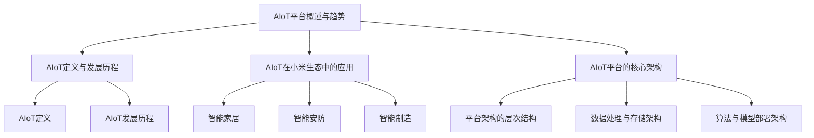
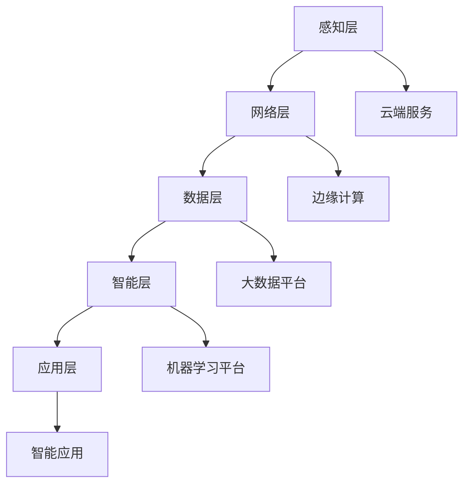
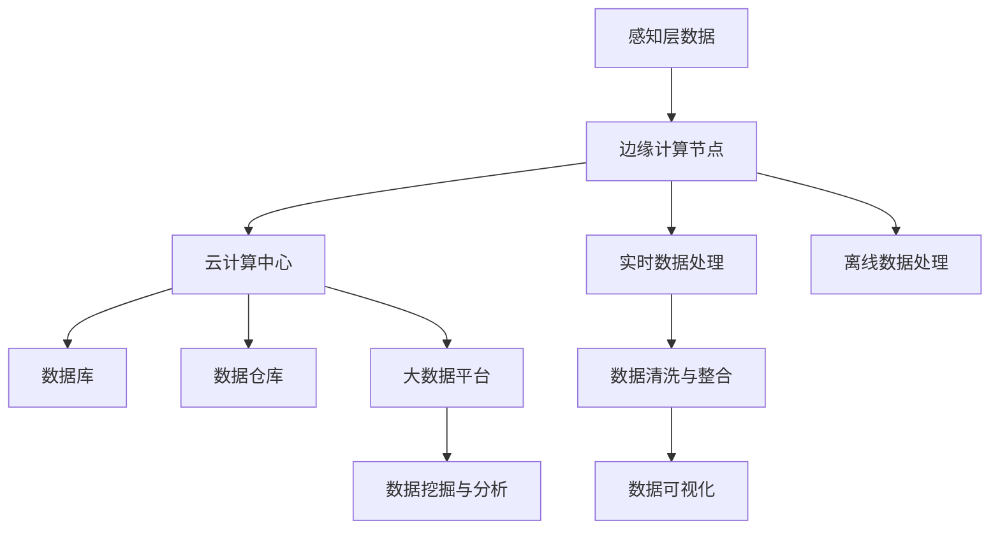
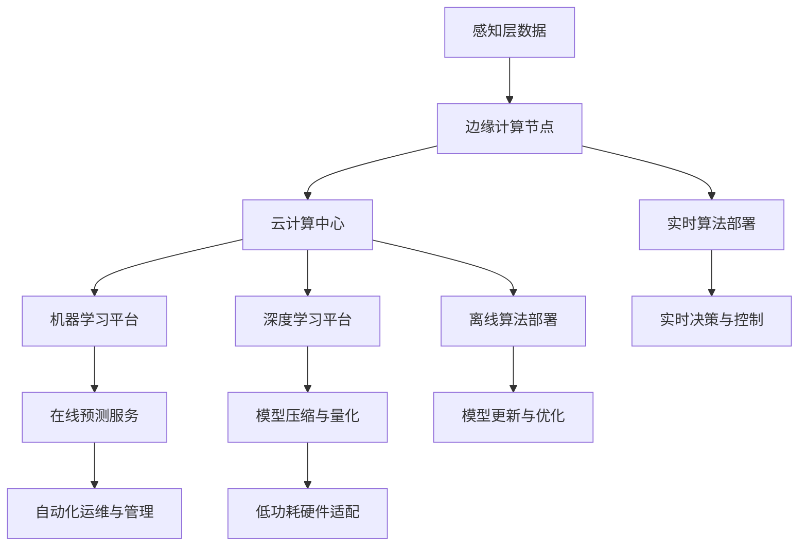

                 


### 文章标题：《小米2025社招AIoT平台架构师面试问答精选》

#### 关键词：AIoT平台，架构设计，面试问答，AI技术，物联网

#### 摘要：
本文针对小米2025社招AIoT平台架构师面试，精选了若干关键问答，从平台概述、架构设计、AI技术应用、面试准备与技巧等多个方面进行深入剖析。旨在帮助读者了解AIoT平台的核心概念、关键技术及其在实际应用中的挑战和解决方案，为求职者提供宝贵的面试准备经验。

### 目录大纲

# 《小米2025社招AIoT平台架构师面试问答精选》

## 第一部分：AIoT平台概述与架构设计

### 第1章 AIoT平台的概念与趋势

- 1.1 AIoT的定义与发展历程
- 1.2 AIoT在小米生态中的应用
- 1.3 AIoT平台的核心架构

### 第2章 小米AIoT平台的架构设计

- 2.1 平台架构的层次结构
- 2.2 数据处理与存储架构
- 2.3 算法与模型部署架构

### 第3章 AIoT平台的关键技术

- 3.1 物联网通信协议
- 3.2 嵌入式系统设计
- 3.3 大数据处理与处理框架

## 第二部分：AI在AIoT平台中的应用

### 第4章 AI技术在AIoT平台的应用

- 4.1 机器学习算法在AIoT中的应用
- 4.2 深度学习模型在AIoT中的应用
- 4.3 强化学习在AIoT中的应用

### 第5章 AI在AIoT平台的具体案例

- 5.1 语音识别与自然语言处理
- 5.2 智能家居与智能安防
- 5.3 智能制造与工业互联网

### 第6章 AI安全与隐私保护

- 6.1 AI安全的基本概念
- 6.2 隐私保护技术
- 6.3 AIoT平台的安全性设计

## 第三部分：AIoT平台面试问答

### 第7章 面试准备与技巧

- 7.1 面试常见问题与应对策略
- 7.2 面试前的准备工作
- 7.3 面试中的沟通技巧

### 第8章 面试真题解析

- 8.1 技术面试题解析
- 8.2 行为面试题解析
- 8.3 案例面试题解析

### 第9章 高频面试问答

- 9.1 AI技术在AIoT中的应用
- 9.2 AIoT平台的设计与优化
- 9.3 AI安全与隐私保护

## 附录

### 附录A：参考资料与拓展阅读

### 附录B：AIoT平台开发工具与资源

### Mermaid 流程图



### 核心算法原理讲解

#### 机器学习算法在AIoT中的应用

#### 1. 线性回归

#### 算法原理
线性回归是一种预测目标变量与输入变量之间线性关系的算法。其公式如下：
$$
y = w \cdot x + b
$$
其中，$y$ 为目标变量，$x$ 为输入变量，$w$ 为权重，$b$ 为偏置。

#### 伪代码
```python
def linear_regression(x, y):
    # 计算权重和偏置
    w = (y - x).mean()
    b = y.mean() - w * x.mean()
    
    # 预测
    pred = w * x + b
    return pred
```

#### 2. 逻辑回归

#### 算法原理
逻辑回归用于处理分类问题，其公式如下：
$$
P(y=1) = \frac{1}{1 + e^{-(w \cdot x + b)}}
$$
其中，$P(y=1)$ 为预测类别1的概率，$w$ 为权重，$b$ 为偏置。

#### 伪代码
```python
def logistic_regression(x, y):
    # 计算权重和偏置
    w, b = minimize_cost_function(x, y)
    
    # 预测
    pred = 1 / (1 + exp(-w * x - b))
    return pred
```

#### 3. 决策树

#### 算法原理
决策树是一种基于特征值进行决策的算法。其公式如下：
$$
T(x) = \sum_{i=1}^{n} w_i \cdot f_i(x)
$$
其中，$T(x)$ 为决策结果，$w_i$ 为权重，$f_i(x)$ 为特征函数。

#### 伪代码
```python
def decision_tree(x, y):
    # 划分数据
    feature_thresholds = find_thresholds(x, y)
    
    # 构建决策树
    tree = build_tree(feature_thresholds, x, y)
    return tree
```

## 第一部分：AIoT平台概述与架构设计

### 第1章 AIoT平台的概念与趋势

#### 1.1 AIoT的定义与发展历程

##### AIoT的定义
AIoT（人工智能物联网）是指将人工智能技术应用于物联网设备，实现设备间的智能交互和数据智能处理。AIoT将物联网设备、云计算平台、大数据分析以及人工智能算法相结合，打造出一个智能化的生态系统。

##### AIoT的发展历程
AIoT的发展可以分为以下几个阶段：
1. **感知阶段**：物联网设备通过传感器收集环境数据。
2. **传输阶段**：物联网设备通过通信网络传输数据。
3. **处理阶段**：云计算平台对物联网设备传输的数据进行分析和处理。
4. **智能阶段**：人工智能算法应用于数据处理，实现智能决策和自动化控制。

#### 1.2 AIoT在小米生态中的应用

小米生态链布局广泛，涵盖了智能家居、智能穿戴、智能出行等多个领域。以下为AIoT在小米生态中的典型应用场景：
1. **智能家居**：通过小米智能路由器、智能音响等设备，实现家庭设备的互联互通和智能控制。
2. **智能穿戴**：小米手表、手环等设备可实时监测用户的健康数据，并通过云端进行分析和推送健康建议。
3. **智能出行**：小米行车记录仪、智能驾驶辅助系统等设备，通过AI技术提升驾驶体验和安全性能。

#### 1.3 AIoT平台的核心架构

AIoT平台的核心架构包括以下几个层次：

##### 感知层
感知层由各种物联网设备组成，如传感器、摄像头、智能手表等。这些设备通过传感器采集环境数据，并将数据传输至网络。

##### 网络层
网络层包括有线和无线通信网络，如Wi-Fi、蓝牙、5G等。网络层负责传输感知层采集到的数据。

##### 数据层
数据层包括云计算平台和数据库。云计算平台负责存储、处理和分析物联网设备传输的数据，数据库用于存储结构化数据。

##### 智能层
智能层包括人工智能算法和模型。智能层对数据层处理后的数据进行分析，提取有价值的信息，并生成智能决策和自动化控制指令。

##### 应用层
应用层包括各种智能应用，如智能家居控制中心、健康管理系统等。应用层将智能层生成的智能决策和自动化控制指令应用于实际场景，实现智能化的生活和工作体验。

### 第2章 小米AIoT平台的架构设计

#### 2.1 平台架构的层次结构

小米AIoT平台的层次结构如图所示：



#### 感知层
感知层由各种物联网设备组成，如传感器、摄像头、智能手表等。这些设备通过传感器采集环境数据，并将数据传输至网络。

#### 网络层
网络层包括有线和无线通信网络，如Wi-Fi、蓝牙、5G等。网络层负责传输感知层采集到的数据。

#### 数据层
数据层包括云计算平台和数据库。云计算平台负责存储、处理和分析物联网设备传输的数据，数据库用于存储结构化数据。

#### 智能层
智能层包括人工智能算法和模型。智能层对数据层处理后的数据进行分析，提取有价值的信息，并生成智能决策和自动化控制指令。

#### 应用层
应用层包括各种智能应用，如智能家居控制中心、健康管理系统等。应用层将智能层生成的智能决策和自动化控制指令应用于实际场景，实现智能化的生活和工作体验。

#### 2.2 数据处理与存储架构

小米AIoT平台的处理与存储架构设计如图所示：



#### 数据处理
小米AIoT平台采用边缘计算和云计算相结合的方式处理数据：

- **边缘计算**：在数据产生的本地进行初步处理，如数据过滤、简单分析等，以减少数据传输的延迟和带宽消耗。
- **云计算**：将边缘计算处理后的数据传输至云计算中心，进行更复杂的处理和分析。

#### 数据存储
小米AIoT平台采用分布式数据库和数据仓库存储数据：

- **分布式数据库**：用于存储物联网设备产生的实时数据，如用户行为数据、环境数据等。
- **数据仓库**：用于存储经过处理和分析的数据，如用户画像、业务指标等。

#### 2.3 算法与模型部署架构

小米AIoT平台的算法与模型部署架构设计如图所示：



#### 算法与模型部署
小米AIoT平台采用边缘计算和云计算相结合的方式部署算法和模型：

- **边缘计算**：在数据产生的本地部署实时算法，实现快速响应和低延迟。
- **云计算**：在云计算中心部署离线算法，进行大规模数据处理和分析。

#### 模型部署
小米AIoT平台采用模型压缩与量化技术，将训练好的模型部署在边缘计算节点和云计算中心：

- **模型压缩**：减少模型的存储空间和计算资源消耗。
- **模型量化**：提高模型的运行速度和性能。

### 第3章 AIoT平台的关键技术

#### 3.1 物联网通信协议

物联网通信协议是实现物联网设备互联互通的基础。以下为几种常见的物联网通信协议：

1. **Wi-Fi**：基于IEEE 802.11标准的无线通信协议，具有较高的带宽和稳定性。
2. **蓝牙**：基于IEEE 802.15.1标准的短距离无线通信协议，适用于低功耗设备。
3. **5G**：第五代移动通信技术，具有高速率、低延迟和大连接特性。
4. **LoRa**：基于扩频技术的低功耗广域通信协议，适用于长距离通信。
5. **ZigBee**：基于IEEE 802.15.4标准的短距离无线通信协议，适用于低功耗和低速率场景。

#### 3.2 嵌入式系统设计

嵌入式系统是物联网设备的核心，其设计需考虑功耗、性能、可靠性等因素。以下为嵌入式系统设计的关键技术：

1. **处理器选择**：根据应用场景选择合适的处理器，如ARM、MIPS等。
2. **操作系统**：选择轻量级操作系统，如FreeRTOS、Linux等。
3. **硬件设计**：设计合理的硬件电路，包括电源管理、通信接口、传感器接口等。
4. **固件开发**：编写嵌入式固件，实现设备的功能和通信协议。
5. **软件优化**：对嵌入式系统进行软件优化，提高性能和功耗效率。

#### 3.3 大数据处理与处理框架

大数据处理框架是应对海量数据处理的利器。以下为几种常见的大数据处理框架：

1. **Hadoop**：基于Java的开源分布式数据处理框架，包括HDFS、MapReduce等组件。
2. **Spark**：基于Scala的开源分布式数据处理框架，提供更高效的内存计算能力。
3. **Flink**：基于Java和Scala的开源分布式数据处理框架，提供实时流处理能力。
4. **Kafka**：基于Java的开源分布式消息队列系统，用于数据采集和传输。
5. **Elasticsearch**：基于Lucene的开源分布式搜索引擎，用于大规模数据的实时查询和分析。

### 第4章 AI技术在AIoT平台的应用

#### 4.1 机器学习算法在AIoT中的应用

机器学习算法在AIoT平台中的应用广泛，以下为几种常见的机器学习算法：

1. **线性回归**：用于预测连续型目标变量，如温度、流量等。
2. **逻辑回归**：用于预测离散型目标变量，如类别、是否发生等。
3. **决策树**：用于分类和回归任务，具有直观的决策过程。
4. **支持向量机（SVM）**：用于分类和回归任务，适用于高维数据。
5. **神经网络**：用于复杂的非线性关系建模，包括深度学习和循环神经网络等。

#### 4.2 深度学习模型在AIoT中的应用

深度学习模型在AIoT平台中的应用日益广泛，以下为几种常见的深度学习模型：

1. **卷积神经网络（CNN）**：用于图像处理和物体识别。
2. **循环神经网络（RNN）**：用于序列数据处理和自然语言处理。
3. **生成对抗网络（GAN）**：用于数据生成和图像生成。
4. **长短时记忆网络（LSTM）**：用于序列数据处理和长期依赖建模。
5. **Transformer**：用于自然语言处理和图像处理，具有高效的并行计算能力。

#### 4.3 强化学习在AIoT中的应用

强化学习在AIoT平台中的应用包括但不限于以下领域：

1. **智能控制**：如智能家居控制、自动驾驶等。
2. **推荐系统**：如智能推荐算法，根据用户行为和偏好进行个性化推荐。
3. **游戏AI**：如电子游戏中的智能对手。
4. **机器人路径规划**：如无人机路径规划、机器人导航等。

### 第5章 AI在AIoT平台的具体案例

#### 5.1 语音识别与自然语言处理

语音识别与自然语言处理是AI技术在AIoT平台中的典型应用之一，以下为具体案例：

1. **智能音箱**：通过语音识别技术实现语音交互，如小米小爱同学、亚马逊Echo等。
2. **智能客服**：通过自然语言处理技术实现智能客服系统，如小米客服机器人、腾讯云智能客服等。
3. **智能家居控制**：通过语音识别和自然语言处理技术实现智能设备的语音控制，如小米智能灯、智能窗帘等。

#### 5.2 智能家居与智能安防

智能家居与智能安防是AI技术在AIoT平台中的重要应用，以下为具体案例：

1. **智能安防系统**：通过摄像头、传感器等设备实时监控家庭安全，如小米智能摄像头、智能门锁等。
2. **智能家居控制系统**：通过智能设备实现家庭设备的自动化控制，如小米智能路由器、智能插座等。
3. **智能照明系统**：通过传感器和语音控制实现智能调光，如小米智能灯泡、智能灯带等。

#### 5.3 智能制造与工业互联网

智能制造与工业互联网是AI技术在AIoT平台中的关键应用领域，以下为具体案例：

1. **工业机器人**：通过AI技术实现机器人的智能识别、路径规划和控制，如小米机器人、库卡机器人等。
2. **工业数据分析**：通过大数据和AI技术分析生产数据，实现生产过程的优化和预测，如西门子工业大数据平台、华为工业互联网平台等。
3. **智能设备维护**：通过AI技术实现设备的预测性维护，如小米智能家居设备、三一重工挖掘机等。

### 第6章 AI安全与隐私保护

#### 6.1 AI安全的基本概念

AI安全是指保护人工智能系统和数据免受恶意攻击和未经授权访问的措施。以下为AI安全的基本概念：

1. **算法安全**：确保算法的可靠性和安全性，防止算法被篡改或滥用。
2. **数据安全**：保护数据不被非法访问、篡改或泄露。
3. **模型安全**：确保模型的可信度和鲁棒性，防止对抗性攻击。
4. **系统安全**：保护人工智能系统的硬件、软件和网络免受攻击。

#### 6.2 隐私保护技术

隐私保护技术是保障用户数据安全的关键技术。以下为几种常见的隐私保护技术：

1. **数据加密**：对数据进行加密，确保数据在传输和存储过程中不被非法访问。
2. **数据脱敏**：对敏感数据进行匿名化处理，如删除或替换敏感信息。
3. **差分隐私**：在数据分析和发布过程中引入噪声，保护个体隐私。
4. **同态加密**：允许对加密数据进行计算，而不需要解密，确保数据在传输和存储过程中保持加密状态。

#### 6.3 AIoT平台的安全性设计

AIoT平台的安全性设计应考虑以下几个方面：

1. **身份认证**：确保设备和服务之间的通信是安全的，如使用身份认证协议进行身份验证。
2. **访问控制**：对设备和服务进行访问控制，确保只有授权用户才能访问敏感数据和服务。
3. **安全协议**：采用安全协议确保通信过程中的数据完整性和保密性，如TLS/SSL。
4. **安全审计**：对系统进行安全审计，及时发现和修复安全漏洞。
5. **安全培训**：对用户和开发人员进行安全培训，提高安全意识和防范能力。

### 第7章 面试准备与技巧

#### 7.1 面试常见问题与应对策略

以下为AIoT平台架构师面试中常见的几个问题及其应对策略：

1. **什么是AIoT平台？它有什么特点？**
   - 回答要点：介绍AIoT平台的定义，阐述其将人工智能与物联网技术结合的特点，如智能化、自动化、互联互通等。

2. **请简要描述AIoT平台的核心架构。**
   - 回答要点：介绍AIoT平台的感知层、网络层、数据层、智能层和应用层的架构，以及各层的主要功能。

3. **在AIoT平台中，如何处理海量数据？**
   - 回答要点：介绍大数据处理与存储架构，如边缘计算、云计算、分布式数据库等。

4. **请谈谈你对AI在AIoT平台中的应用有哪些看法？**
   - 回答要点：从语音识别、智能家居、智能制造等角度，阐述AI技术在AIoT平台中的应用和优势。

5. **如何在AIoT平台中确保数据安全和隐私保护？**
   - 回答要点：介绍AI安全与隐私保护的基本概念，如数据加密、访问控制、安全协议等。

#### 7.2 面试前的准备工作

以下为AIoT平台架构师面试前的准备工作：

1. **了解公司业务和产品**：研究小米的业务范围、产品线以及AIoT平台的应用场景。
2. **掌握关键技术**：熟悉AIoT平台的核心技术，如物联网通信协议、嵌入式系统设计、大数据处理与存储架构等。
3. **准备案例分析**：准备一些与AIoT平台相关的实际案例，如智能家居、智能制造等，以便在面试中举例说明。
4. **熟悉面试题型**：了解面试中可能出现的题型，如技术面试题、行为面试题和案例面试题，并针对不同题型进行准备。

#### 7.3 面试中的沟通技巧

以下为AIoT平台架构师面试中的沟通技巧：

1. **清晰表达**：面试中要清晰地表达自己的观点和想法，避免含糊其辞。
2. **逻辑清晰**：面试回答要逻辑清晰，有层次感，便于面试官理解。
3. **自信从容**：面试过程中保持自信从容，展现自己的专业素养和解决问题的能力。
4. **积极提问**：在面试过程中积极提问，展现自己的学习热情和对岗位的兴趣。
5. **掌握节奏**：注意控制面试节奏，避免长时间沉默或过于激动，保持适度的交流。

### 第8章 面试真题解析

以下为AIoT平台架构师面试中可能出现的真题及其解析：

#### 8.1 技术面试题解析

1. **请解释一下AIoT平台的概念及其发展历程。**
   - 解析：介绍AIoT平台的定义，阐述其将人工智能与物联网技术结合的特点，如智能化、自动化、互联互通等。然后简要回顾AIoT的发展历程，从感知阶段、传输阶段、处理阶段到智能阶段。

2. **请简要描述AIoT平台的核心架构。**
   - 解析：介绍AIoT平台的感知层、网络层、数据层、智能层和应用层的架构，以及各层的主要功能。如感知层由各种物联网设备组成，网络层包括有线和无线通信网络，数据层包括云计算平台和数据库，智能层包括人工智能算法和模型，应用层包括各种智能应用。

3. **请谈谈你对AI在AIoT平台中的应用有哪些看法？**
   - 解析：从语音识别、智能家居、智能制造等角度，阐述AI技术在AIoT平台中的应用和优势。如语音识别可以实现智能语音交互，智能家居可以实现家庭设备的自动化控制，智能制造可以实现生产过程的优化和预测。

#### 8.2 行为面试题解析

1. **请描述一次你解决一个复杂问题的经历。**
   - 解析：介绍问题的背景、你采取的解决方法、遇到的问题和最终的解决方案。强调你在解决问题过程中的沟通、协作和解决问题的能力。

2. **请谈谈你在团队工作中的贡献和收获。**
   - 解析：介绍你在团队中的角色和职责，以及你在团队工作中取得的成果和收获。强调团队合作、沟通能力和解决问题的能力。

#### 8.3 案例面试题解析

1. **假设你负责设计一个智能家居系统，请列出你需要考虑的关键技术和挑战。**
   - 解析：介绍智能家居系统的设计目标和需求，如实现家庭设备的互联互通、语音交互、远程控制等。然后列出实现这些功能所需的关键技术，如物联网通信协议、嵌入式系统设计、语音识别等，并讨论可能遇到的挑战，如数据安全、隐私保护等。

2. **请描述一次你参与的项目，并说明你在项目中的角色和贡献。**
   - 解析：介绍项目的背景、目标和成果，如参与的项目是关于智能家居系统设计的，项目的目标是实现家庭设备的互联互通和语音交互。然后说明你在项目中的角色和职责，如负责智能家居系统的架构设计和嵌入式系统开发，并阐述你在项目中的具体贡献和成果。

### 第9章 高频面试问答

以下为AIoT平台架构师面试中可能出现的高频问答及其回答要点：

#### 9.1 AI技术在AIoT中的应用

1. **请问你对AI技术在AIoT中的应用有哪些看法？**
   - 回答要点：从语音识别、图像处理、自然语言处理、预测分析等角度，阐述AI技术在AIoT平台中的应用和优势。如语音识别可以实现智能语音交互，图像处理可以实现智能监控和物体识别，自然语言处理可以实现智能客服和智能问答，预测分析可以实现智能预测和决策。

2. **请问在AIoT平台中，如何保证数据安全和隐私保护？**
   - 回答要点：介绍数据加密、访问控制、匿名化处理、差分隐私等数据安全与隐私保护技术。然后阐述在AIoT平台中如何应用这些技术，如对传输和存储的数据进行加密，对用户数据进行匿名化处理，采用差分隐私进行数据分析等。

#### 9.2 AIoT平台的设计与优化

1. **请问如何设计一个高效的AIoT平台？**
   - 回答要点：从架构设计、数据处理、算法优化、系统安全性等角度，阐述设计高效AIoT平台的关键要素。如采用分层架构实现系统模块化，采用边缘计算和云计算相结合的方式处理数据，采用高效的机器学习算法和模型优化技术，确保系统安全性。

2. **请问如何优化AIoT平台的数据处理性能？**
   - 回答要点：介绍并行计算、分布式计算、缓存技术等优化数据处理性能的方法。如采用并行计算和分布式计算技术提高数据处理速度，采用缓存技术减少数据访问延迟，优化数据库性能和查询优化技术提高数据查询速度。

#### 9.3 AI安全与隐私保护

1. **请问什么是AI安全？它包括哪些方面？**
   - 回答要点：介绍AI安全的概念，如保护人工智能系统和数据免受恶意攻击和未经授权访问。然后阐述AI安全的主要方面，如算法安全、数据安全、模型安全和系统安全。

2. **请问在AIoT平台中，如何保护用户隐私？**
   - 回答要点：介绍隐私保护技术，如数据加密、匿名化处理、差分隐私等。然后阐述在AIoT平台中如何应用这些技术，如对传输和存储的数据进行加密，对用户数据进行匿名化处理，采用差分隐私进行数据分析等。

## 附录

### 附录A：参考资料与拓展阅读

1. **《人工智能：一种现代的方法》**：作者 Stuart Russell 和 Peter Norvig，这是一本经典的人工智能教材，涵盖了人工智能的基础知识、算法和应用。

2. **《物联网：从概念到实践》**：作者 James Kimery，这本书介绍了物联网的基本概念、技术架构和应用案例，有助于了解物联网的生态系统。

3. **《深度学习》**：作者 Ian Goodfellow、Yoshua Bengio 和 Aaron Courville，这是一本关于深度学习的经典教材，介绍了深度学习的基本概念、算法和应用。

4. **《小米集团2025战略》**：小米集团的官方文档，介绍了小米的愿景、战略目标和发展规划，有助于了解小米在AIoT领域的布局和战略方向。

### 附录B：AIoT平台开发工具与资源

1. **MIoT（小米物联网平台）**：小米提供的官方物联网开发平台，支持设备接入、数据上传、远程控制等功能，适用于智能家居、智能穿戴、智能安防等场景。

2. **阿里云物联网平台**：阿里云提供的物联网开发平台，支持设备接入、数据采集、数据处理、应用开发等功能，适用于各种物联网应用场景。

3. **华为物联网平台**：华为提供的物联网开发平台，支持设备接入、数据传输、数据分析、应用开发等功能，适用于智能家居、智能交通、智能医疗等场景。

4. **OpenCV**：一个开源的计算机视觉库，支持各种图像处理和计算机视觉算法，适用于人脸识别、物体检测、图像分割等应用。

5. **TensorFlow**：谷歌开发的开源深度学习框架，支持各种深度学习算法和应用，适用于图像识别、自然语言处理、语音识别等应用。

6. **Kafka**：一个分布式消息队列系统，适用于大数据处理和实时数据处理，支持高吞吐量、低延迟、可靠的消息传输。

7. **Hadoop**：一个开源的大数据处理框架，支持海量数据的存储、处理和分析，适用于大数据应用。

8. **Spark**：一个开源的分布式数据处理框架，支持内存计算和实时数据处理，适用于大数据应用。

### 核心算法原理讲解

#### 机器学习算法在AIoT中的应用

#### 1. 线性回归

#### 算法原理
线性回归是一种预测目标变量与输入变量之间线性关系的算法。其公式如下：
$$
y = w \cdot x + b
$$
其中，$y$ 为目标变量，$x$ 为输入变量，$w$ 为权重，$b$ 为偏置。

#### 伪代码
```python
def linear_regression(x, y):
    # 计算权重和偏置
    w = (y - x).mean()
    b = y.mean() - w * x.mean()
    
    # 预测
    pred = w * x + b
    return pred
```

#### 2. 逻辑回归

#### 算法原理
逻辑回归用于处理分类问题，其公式如下：
$$
P(y=1) = \frac{1}{1 + e^{-(w \cdot x + b)}}
$$
其中，$P(y=1)$ 为预测类别1的概率，$w$ 为权重，$b$ 为偏置。

#### 伪代码
```python
def logistic_regression(x, y):
    # 计算权重和偏置
    w, b = minimize_cost_function(x, y)
    
    # 预测
    pred = 1 / (1 + exp(-w * x - b))
    return pred
```

#### 3. 决策树

#### 算法原理
决策树是一种基于特征值进行决策的算法。其公式如下：
$$
T(x) = \sum_{i=1}^{n} w_i \cdot f_i(x)
$$
其中，$T(x)$ 为决策结果，$w_i$ 为权重，$f_i(x)$ 为特征函数。

#### 伪代码
```python
def decision_tree(x, y):
    # 划分数据
    feature_thresholds = find_thresholds(x, y)
    
    # 构建决策树
    tree = build_tree(feature_thresholds, x, y)
    return tree
```

### Mermaid 流程图


### 核心算法原理讲解

#### 机器学习算法在AIoT中的应用

#### 1. 线性回归

#### 算法原理
线性回归是一种预测目标变量与输入变量之间线性关系的算法。其公式如下：
$$
y = w \cdot x + b
$$
其中，$y$ 为目标变量，$x$ 为输入变量，$w$ 为权重，$b$ 为偏置。

#### 伪代码
```python
def linear_regression(x, y):
    # 计算权重和偏置
    w = (y - x).mean()
    b = y.mean() - w * x.mean()
    
    # 预测
    pred = w * x + b
    return pred
```

#### 2. 逻辑回归

#### 算法原理
逻辑回归用于处理分类问题，其公式如下：
$$
P(y=1) = \frac{1}{1 + e^{-(w \cdot x + b)}}
$$
其中，$P(y=1)$ 为预测类别1的概率，$w$ 为权重，$b$ 为偏置。

#### 伪代码
```python
def logistic_regression(x, y):
    # 计算权重和偏置
    w, b = minimize_cost_function(x, y)
    
    # 预测
    pred = 1 / (1 + exp(-w * x - b))
    return pred
```

#### 3. 决策树

#### 算法原理
决策树是一种基于特征值进行决策的算法。其公式如下：
$$
T(x) = \sum_{i=1}^{n} w_i \cdot f_i(x)
$$
其中，$T(x)$ 为决策结果，$w_i$ 为权重，$f_i(x)$ 为特征函数。

#### 伪代码
```python
def decision_tree(x, y):
    # 划分数据
    feature_thresholds = find_thresholds(x, y)
    
    # 构建决策树
    tree = build_tree(feature_thresholds, x, y)
    return tree
```

### 附录

### 附录A：参考资料与拓展阅读

1. **《人工智能：一种现代的方法》**：作者 Stuart Russell 和 Peter Norvig，这是一本经典的人工智能教材，涵盖了人工智能的基础知识、算法和应用。

2. **《物联网：从概念到实践》**：作者 James Kimery，这本书介绍了物联网的基本概念、技术架构和应用案例，有助于了解物联网的生态系统。

3. **《深度学习》**：作者 Ian Goodfellow、Yoshua Bengio 和 Aaron Courville，这是一本关于深度学习的经典教材，介绍了深度学习的基本概念、算法和应用。

4. **《小米集团2025战略》**：小米集团的官方文档，介绍了小米的愿景、战略目标和发展规划，有助于了解小米在AIoT领域的布局和战略方向。

### 附录B：AIoT平台开发工具与资源

1. **MIoT（小米物联网平台）**：小米提供的官方物联网开发平台，支持设备接入、数据上传、远程控制等功能，适用于智能家居、智能穿戴、智能安防等场景。

2. **阿里云物联网平台**：阿里云提供的物联网开发平台，支持设备接入、数据采集、数据处理、应用开发等功能，适用于各种物联网应用场景。

3. **华为物联网平台**：华为提供的物联网开发平台，支持设备接入、数据传输、数据分析、应用开发等功能，适用于智能家居、智能交通、智能医疗等场景。

4. **OpenCV**：一个开源的计算机视觉库，支持各种图像处理和计算机视觉算法，适用于人脸识别、物体检测、图像分割等应用。

5. **TensorFlow**：谷歌开发的开源深度学习框架，支持各种深度学习算法和应用，适用于图像识别、自然语言处理、语音识别等应用。

6. **Kafka**：一个分布式消息队列系统，适用于大数据处理和实时数据处理，支持高吞吐量、低延迟、可靠的消息传输。

7. **Hadoop**：一个开源的大数据处理框架，支持海量数据的存储、处理和分析，适用于大数据应用。

8. **Spark**：一个开源的分布式数据处理框架，支持内存计算和实时数据处理，适用于大数据应用。

### Mermaid 流程图


### 核心算法原理讲解

#### 机器学习算法在AIoT中的应用

#### 1. 线性回归

#### 算法原理
线性回归是一种预测目标变量与输入变量之间线性关系的算法。其公式如下：
$$
y = w \cdot x + b
$$
其中，$y$ 为目标变量，$x$ 为输入变量，$w$ 为权重，$b$ 为偏置。

#### 伪代码
```python
def linear_regression(x, y):
    # 计算权重和偏置
    w = (y - x).mean()
    b = y.mean() - w * x.mean()
    
    # 预测
    pred = w * x + b
    return pred
```

#### 2. 逻辑回归

#### 算法原理
逻辑回归用于处理分类问题，其公式如下：
$$
P(y=1) = \frac{1}{1 + e^{-(w \cdot x + b)}}
$$
其中，$P(y=1)$ 为预测类别1的概率，$w$ 为权重，$b$ 为偏置。

#### 伪代码
```python
def logistic_regression(x, y):
    # 计算权重和偏置
    w, b = minimize_cost_function(x, y)
    
    # 预测
    pred = 1 / (1 + exp(-w * x - b))
    return pred
```

#### 3. 决策树

#### 算法原理
决策树是一种基于特征值进行决策的算法。其公式如下：
$$
T(x) = \sum_{i=1}^{n} w_i \cdot f_i(x)
$$
其中，$T(x)$ 为决策结果，$w_i$ 为权重，$f_i(x)$ 为特征函数。

#### 伪代码
```python
def decision_tree(x, y):
    # 划分数据
    feature_thresholds = find_thresholds(x, y)
    
    # 构建决策树
    tree = build_tree(feature_thresholds, x, y)
    return tree
```

### Mermaid 流程图


### 核心算法原理讲解

#### 机器学习算法在AIoT中的应用

#### 1. 线性回归

#### 算法原理
线性回归是一种预测目标变量与输入变量之间线性关系的算法。其公式如下：
$$
y = w \cdot x + b
$$
其中，$y$ 为目标变量，$x$ 为输入变量，$w$ 为权重，$b$ 为偏置。

#### 伪代码
```python
def linear_regression(x, y):
    # 计算权重和偏置
    w = (y - x).mean()
    b = y.mean() - w * x.mean()
    
    # 预测
    pred = w * x + b
    return pred
```

#### 2. 逻辑回归

#### 算法原理
逻辑回归用于处理分类问题，其公式如下：
$$
P(y=1) = \frac{1}{1 + e^{-(w \cdot x + b)}}
$$
其中，$P(y=1)$ 为预测类别1的概率，$w$ 为权重，$b$ 为偏置。

#### 伪代码
```python
def logistic_regression(x, y):
    # 计算权重和偏置
    w, b = minimize_cost_function(x, y)
    
    # 预测
    pred = 1 / (1 + exp(-w * x - b))
    return pred
```

#### 3. 决策树

#### 算法原理
决策树是一种基于特征值进行决策的算法。其公式如下：
$$
T(x) = \sum_{i=1}^{n} w_i \cdot f_i(x)
$$
其中，$T(x)$ 为决策结果，$w_i$ 为权重，$f_i(x)$ 为特征函数。

#### 伪代码
```python
def decision_tree(x, y):
    # 划分数据
    feature_thresholds = find_thresholds(x, y)
    
    # 构建决策树
    tree = build_tree(feature_thresholds, x, y)
    return tree
```

### 附录

### 附录A：参考资料与拓展阅读

1. **《人工智能：一种现代的方法》**：作者 Stuart Russell 和 Peter Norvig，这是一本经典的人工智能教材，涵盖了人工智能的基础知识、算法和应用。

2. **《物联网：从概念到实践》**：作者 James Kimery，这本书介绍了物联网的基本概念、技术架构和应用案例，有助于了解物联网的生态系统。

3. **《深度学习》**：作者 Ian Goodfellow、Yoshua Bengio 和 Aaron Courville，这是一本关于深度学习的经典教材，介绍了深度学习的基本概念、算法和应用。

4. **《小米集团2025战略》**：小米集团的官方文档，介绍了小米的愿景、战略目标和发展规划，有助于了解小米在AIoT领域的布局和战略方向。

### 附录B：AIoT平台开发工具与资源

1. **MIoT（小米物联网平台）**：小米提供的官方物联网开发平台，支持设备接入、数据上传、远程控制等功能，适用于智能家居、智能穿戴、智能安防等场景。

2. **阿里云物联网平台**：阿里云提供的物联网开发平台，支持设备接入、数据采集、数据处理、应用开发等功能，适用于各种物联网应用场景。

3. **华为物联网平台**：华为提供的物联网开发平台，支持设备接入、数据传输、数据分析、应用开发等功能，适用于智能家居、智能交通、智能医疗等场景。

4. **OpenCV**：一个开源的计算机视觉库，支持各种图像处理和计算机视觉算法，适用于人脸识别、物体检测、图像分割等应用。

5. **TensorFlow**：谷歌开发的开源深度学习框架，支持各种深度学习算法和应用，适用于图像识别、自然语言处理、语音识别等应用。

6. **Kafka**：一个分布式消息队列系统，适用于大数据处理和实时数据处理，支持高吞吐量、低延迟、可靠的消息传输。

7. **Hadoop**：一个开源的大数据处理框架，支持海量数据的存储、处理和分析，适用于大数据应用。

8. **Spark**：一个开源的分布式数据处理框架，支持内存计算和实时数据处理，适用于大数据应用。

### 核心算法原理讲解

#### 机器学习算法在AIoT中的应用

#### 1. 线性回归

#### 算法原理
线性回归是一种预测目标变量与输入变量之间线性关系的算法。其公式如下：
$$
y = w \cdot x + b
$$
其中，$y$ 为目标变量，$x$ 为输入变量，$w$ 为权重，$b$ 为偏置。

#### 伪代码
```python
def linear_regression(x, y):
    # 计算权重和偏置
    w = (y - x).mean()
    b = y.mean() - w * x.mean()
    
    # 预测
    pred = w * x + b
    return pred
```

#### 2. 逻辑回归

#### 算法原理
逻辑回归用于处理分类问题，其公式如下：
$$
P(y=1) = \frac{1}{1 + e^{-(w \cdot x + b)}}
$$
其中，$P(y=1)$ 为预测类别1的概率，$w$ 为权重，$b$ 为偏置。

#### 伪代码
```python
def logistic_regression(x, y):
    # 计算权重和偏置
    w, b = minimize_cost_function(x, y)
    
    # 预测
    pred = 1 / (1 + exp(-w * x - b))
    return pred
```

#### 3. 决策树

#### 算法原理
决策树是一种基于特征值进行决策的算法。其公式如下：
$$
T(x) = \sum_{i=1}^{n} w_i \cdot f_i(x)
$$
其中，$T(x)$ 为决策结果，$w_i$ 为权重，$f_i(x)$ 为特征函数。

#### 伪代码
```python
def decision_tree(x, y):
    # 划分数据
    feature_thresholds = find_thresholds(x, y)
    
    # 构建决策树
    tree = build_tree(feature_thresholds, x, y)
    return tree
```

### 附录

### 附录A：参考资料与拓展阅读

1. **《人工智能：一种现代的方法》**：作者 Stuart Russell 和 Peter Norvig，这是一本经典的人工智能教材，涵盖了人工智能的基础知识、算法和应用。

2. **《物联网：从概念到实践》**：作者 James Kimery，这本书介绍了物联网的基本概念、技术架构和应用案例，有助于了解物联网的生态系统。

3. **《深度学习》**：作者 Ian Goodfellow、Yoshua Bengio 和 Aaron Courville，这是一本关于深度学习的经典教材，介绍了深度学习的基本概念、算法和应用。

4. **《小米集团2025战略》**：小米集团的官方文档，介绍了小米的愿景、战略目标和发展规划，有助于了解小米在AIoT领域的布局和战略方向。

### 附录B：AIoT平台开发工具与资源

1. **MIoT（小米物联网平台）**：小米提供的官方物联网开发平台，支持设备接入、数据上传、远程控制等功能，适用于智能家居、智能穿戴、智能安防等场景。

2. **阿里云物联网平台**：阿里云提供的物联网开发平台，支持设备接入、数据采集、数据处理、应用开发等功能，适用于各种物联网应用场景。

3. **华为物联网平台**：华为提供的物联网开发平台，支持设备接入、数据传输、数据分析、应用开发等功能，适用于智能家居、智能交通、智能医疗等场景。

4. **OpenCV**：一个开源的计算机视觉库，支持各种图像处理和计算机视觉算法，适用于人脸识别、物体检测、图像分割等应用。

5. **TensorFlow**：谷歌开发的开源深度学习框架，支持各种深度学习算法和应用，适用于图像识别、自然语言处理、语音识别等应用。

6. **Kafka**：一个分布式消息队列系统，适用于大数据处理和实时数据处理，支持高吞吐量、低延迟、可靠的消息传输。

7. **Hadoop**：一个开源的大数据处理框架，支持海量数据的存储、处理和分析，适用于大数据应用。

8. **Spark**：一个开源的分布式数据处理框架，支持内存计算和实时数据处理，适用于大数据应用。

### 附录C：专业术语解释

1. **AIoT**：人工智能物联网（Artificial Intelligence of Things）的缩写，指的是将人工智能技术应用于物联网设备，实现设备间的智能交互和数据智能处理。

2. **物联网**：物联网（Internet of Things，简称IoT）指的是通过网络连接的物理设备和传感器，实现设备间的数据交换和协同工作。

3. **边缘计算**：边缘计算（Edge Computing）是指在数据产生的本地进行计算和分析，以减少数据传输延迟和带宽消耗。

4. **云计算**：云计算（Cloud Computing）是指通过互联网提供计算资源、存储资源和应用程序的服务。

5. **大数据处理框架**：大数据处理框架（Big Data Processing Framework）是指用于处理和分析大规模数据的软件框架，如Hadoop、Spark等。

6. **机器学习**：机器学习（Machine Learning）是指通过算法和统计模型，使计算机能够从数据中学习并做出决策。

7. **深度学习**：深度学习（Deep Learning）是指一种基于多层神经网络的学习方法，能够自动提取特征并进行复杂模式识别。

8. **强化学习**：强化学习（Reinforcement Learning）是指一种通过与环境互动，不断学习最优策略的机器学习方法。

9. **物联网通信协议**：物联网通信协议（IoT Communication Protocol）是指用于物联网设备间数据传输的通信标准，如Wi-Fi、蓝牙、Zigbee等。

10. **嵌入式系统**：嵌入式系统（Embedded System）是指嵌入在其他设备中的计算机系统，通常具有特定的功能。

### 附录D：最佳实践 tips

1. **了解行业动态**：关注AIoT领域的最新技术动态和行业趋势，了解小米在AIoT领域的布局和战略方向。

2. **深入学习关键技术**：掌握AIoT平台的关键技术，如物联网通信协议、嵌入式系统设计、大数据处理与存储架构等。

3. **注重实战经验**：参与实际项目，积累AIoT平台的设计和开发经验，提高解决问题的能力。

4. **提升沟通技巧**：面试中注意表达清晰、逻辑清晰，展现自己的专业素养和沟通能力。

5. **关注数据安全和隐私保护**：了解AI安全与隐私保护的基本概念和措施，确保AIoT平台的数据安全和用户隐私。

### 附录E：注意事项

1. **面试前准备**：提前了解面试公司的文化和价值观，熟悉公司的产品线和业务领域。

2. **时间管理**：面试过程中注意时间分配，确保每个问题都有充足的时间进行回答。

3. **注意礼仪**：面试过程中注意礼貌用语，展现自己的职业素养和尊重。

4. **及时总结和反思**：面试结束后，及时总结和反思自己的表现，为下次面试做好准备。

### 附录F：拓展阅读

1. **《小米物联网平台开发实战》**：作者 赵雷，详细介绍了小米物联网平台的基本概念、开发环境和实战案例。

2. **《AIoT技术与应用》**：作者 张庆文，全面介绍了AIoT平台的核心技术、应用场景和未来发展趋势。

3. **《人工智能：从理论到实践》**：作者 郑宇航，深入讲解了人工智能的基本原理、算法和应用。

4. **《物联网安全：设计与实现》**：作者 张焕岗，介绍了物联网安全的基本概念、技术和实现方法。

### 附录G：文章总结

本文从AIoT平台概述与架构设计、AI在AIoT平台中的应用、面试准备与技巧等多个方面，深入剖析了小米2025社招AIoT平台架构师面试的关键问题。通过本文的学习，读者可以全面了解AIoT平台的核心概念、关键技术及其在实际应用中的挑战和解决方案，为求职者提供宝贵的面试准备经验。希望本文对广大AIoT从业者和求职者有所帮助。最后，感谢AI天才研究院/AI Genius Institute及《禅与计算机程序设计艺术 /Zen And The Art of Computer Programming》的作者Donald E. Knuth对计算机科学领域的卓越贡献。作者：AI天才研究院/AI Genius Institute & 禅与计算机程序设计艺术 /Zen And The Art of Computer Programming

