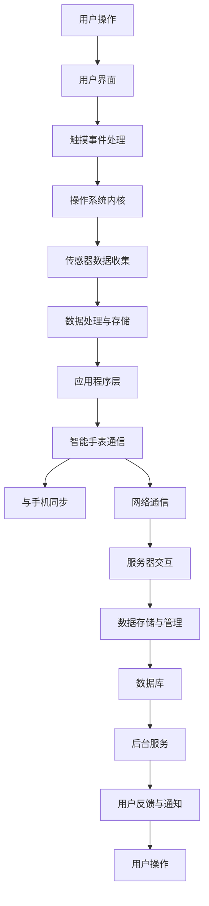

                 

### 文章标题与关键词

《2024小米智能手表社招面试真题汇总及其解答》

**关键词：**  
智能手表、社招面试、真题汇总、解题思路、技术解析

**摘要：**  
本文旨在为即将参加2024年小米智能手表面试的应聘者提供一份全面的备考指南。本文首先对智能手表的基础知识进行了详细阐述，包括其定义、发展历程、组成与功能、核心技术和软件开发等方面。随后，本文汇总了小米智能手表面试中的常见真题，并根据不同类别进行了分类解析。通过详细的解题思路和实例分析，帮助读者更好地理解和掌握面试题目的解答技巧。此外，文章还提供了面试准备和注意事项的建议，以及未来规划的思考。最后，附录部分汇总了相关的面试资料和资源，供读者参考。本文旨在为智能手表领域的求职者提供一份实用的面试备考资料，助力成功入职小米智能手表团队。

### 文章目的与结构

本文的主要目的是为即将参加2024年小米智能手表面试的求职者提供一份全面的备考指南。通过系统地梳理和解答面试中的常见真题，帮助读者更好地理解和掌握智能手表领域的相关知识和技能，提高面试成功率。文章的结构如下：

首先，文章将分为三个主要部分。第一部分是智能手表基础篇，包括智能手表的概述、核心技术和软件开发等内容。这一部分旨在为读者提供一个智能手表的全面了解，为后续的面试题目解析打下基础。

第二部分是小米智能手表面试真题篇，包括基础知识面试题、技术面试题和综合面试题。这一部分将根据不同类别的面试题目进行详细解析，提供解题思路和实际案例分析，帮助读者更好地应对面试中的各种题目。

第三部分是面试真题解答篇，包括面试真题的解析、答题技巧与策略、真题实战演练等内容。这一部分将结合具体的面试题目，提供详细的解答过程和策略，帮助读者在实际面试中取得更好的表现。

最后，文章还将提供面试准备与注意事项的总结，包括面试准备流程、注意事项和心态调整等方面。这部分内容旨在帮助读者全面准备面试，以最佳状态应对面试挑战。

通过以上三个部分的详细讲解和实例分析，本文旨在为读者提供一个系统、全面、实用的备考指南，助力读者在小米智能手表面试中脱颖而出，成功获得心仪的职位。

### 智能手表基础篇

#### 第1章：智能手表概述

**1.1 智能手表的定义与发展历程**

智能手表，作为一种便携式智能设备，具有独立运行操作系统、进行通信、收集和处理传感器数据等基本功能。它可以通过蓝牙、Wi-Fi或蜂窝网络与智能手机进行连接，实现信息同步和数据传输。智能手表的定义可以追溯到上世纪90年代，当时一些厂商开始推出具有基本功能的数字手表。然而，这些早期的设备并没有引起广泛的关注。

真正的智能手表时代始于2000年代末，以苹果公司发布的Apple Watch为标志。Apple Watch的推出，不仅改变了人们对手表的期望，还推动了智能手表市场的快速发展。此后，三星、小米、华为等国内外知名厂商纷纷推出自己的智能手表产品，进一步推动了智能手表的普及。

从发展历程来看，智能手表经历了从功能简单到功能复杂、从单一功能到多功能集成的转变。早期的智能手表主要提供时间显示、提醒功能，而现代的智能手表则能够进行电话、短信、邮件提醒，具备运动监测、心率监测、GPS导航等功能，甚至可以进行支付、音乐播放等操作。这种功能的不断扩展，使得智能手表逐渐成为人们日常生活中不可或缺的一部分。

**1.2 智能手表的组成与功能**

智能手表的组成主要包括硬件和软件两个部分。

**硬件部分：**

1. **主板**：主板是智能手表的核心部分，通常包含中央处理器（CPU）、内存（RAM）、存储器（ROM）等核心组件。主板的作用是控制和协调智能手表的各项功能。

2. **传感器**：传感器是智能手表获取环境信息和用户生理信息的重要组件，常见的传感器包括加速度传感器、心率传感器、GPS模块、气压传感器等。这些传感器可以实时监测用户的运动状态、心率、位置等信息。

3. **屏幕**：屏幕是用户与智能手表交互的主要界面，常见的屏幕技术包括LCD、OLED等。屏幕的分辨率和显示效果直接影响到用户的操作体验。

4. **电池**：电池是智能手表的能源供应组件，一般采用锂离子电池。电池的容量和续航能力直接关系到智能手表的使用时间。

**软件部分：**

1. **操作系统**：智能手表的操作系统类似于智能手机的操作系统，常见的操作系统包括苹果的watchOS、谷歌的Android Wear和华为的HarmonyOS等。操作系统负责管理硬件资源、运行应用程序、处理用户输入和输出等。

2. **应用程序**：智能手表可以安装各种应用程序，如运动监测软件、健康监测软件、音乐播放软件等。这些应用程序可以扩展智能手表的功能，满足用户的多样化需求。

**1.3 智能手表的分类及应用场景**

根据功能和应用场景的不同，智能手表可以分为以下几类：

1. **运动手表**：主要针对运动爱好者，提供运动监测、心率监测、GPS导航等功能。常见的运动手表品牌包括佳明、苏伯德等。

2. **健康手表**：主要关注用户的健康状态，提供心率监测、睡眠监测、血压监测等功能。如小米、华为等品牌的智能手表。

3. **时尚手表**：注重外观设计和时尚感，功能相对较少，但具备一定的智能功能。如苹果、三星等品牌的智能手表。

4. **商务手表**：具备高级功能，如日程管理、邮件提醒、支付功能等，主要面向商务人士。如苹果的Apple Watch、三星的Galaxy Watch等。

不同的应用场景对智能手表的功能和性能要求有所不同。例如，运动手表需要具备高精度的运动监测和GPS定位功能，而健康手表则需要具备准确的心率监测和血压监测功能。通过分类了解智能手表，可以帮助用户选择更适合自己需求的智能手表产品。

#### 第2章：智能手表核心技术

**2.1 智能手表操作系统**

智能手表操作系统是智能手表的核心软件，它负责管理和调度硬件资源，运行应用程序，处理用户输入和输出等。智能手表操作系统与智能手机操作系统有一定的相似性，但也有一些独特的特点。

**1. 操作系统分类**

目前，智能手表操作系统主要分为三类：

1. **开源操作系统**：如谷歌的Android Wear、苹果的watchOS等。这些操作系统开源，支持第三方开发者和应用程序的参与，具有较高的灵活性和扩展性。

2. **封闭操作系统**：如华为的HarmonyOS、三星的Tizen等。这些操作系统由厂商独立开发，封闭性较高，对应用程序的支持和兼容性有一定的限制。

3. **混合操作系统**：如小米的MIUI WatchOS等。这类操作系统结合了开源和封闭的特点，既具备一定的开放性，又保持了较高的兼容性和稳定性。

**2. 操作系统特点**

智能手表操作系统的特点主要体现在以下几个方面：

1. **轻量级**：由于智能手表的硬件资源有限，操作系统需要具备轻量级的特点，以减少对硬件资源的占用。

2. **低功耗**：智能手表一般使用电池供电，操作系统需要具备低功耗的特点，以确保长时间的续航。

3. **多任务处理**：智能手表需要支持多任务处理，以满足用户在多个应用程序之间切换的需求。

4. **易用性**：智能手表操作系统的界面设计要简洁直观，便于用户操作。

**2.2 智能手表传感器技术**

智能手表的传感器技术是智能手表实现各种功能的基础。常见的传感器包括加速度传感器、心率传感器、GPS模块、气压传感器等。

**1. 加速度传感器**

加速度传感器用于检测智能手表的加速度变化，可以用于运动监测、跌倒检测等功能。常见的加速度传感器有MEMS加速度传感器，如STMicroelectronics的LIS3DH。

**2. 心率传感器**

心率传感器用于检测用户的心率变化，可以用于健康监测、运动管理等功能。常见的心率传感器有光电式心率传感器和电容式心率传感器。

**3. GPS模块**

GPS模块用于定位智能手表的位置，可以用于导航、运动监测等功能。常见的GPS模块有SiRF系列和GPSone系列。

**4. 气压传感器**

气压传感器用于检测环境气压变化，可以用于高度测量、天气预测等功能。常见的气压传感器有BMP系列和MS5607系列。

**2.3 智能手表通信技术**

智能手表的通信技术是智能手表与外部设备（如智能手机）进行数据交换的重要手段。常见的通信技术包括蓝牙、Wi-Fi、蜂窝网络等。

**1. 蓝牙**

蓝牙是一种短距离无线通信技术，常用于智能手表与智能手机之间的数据传输。常见的蓝牙版本有蓝牙4.0、蓝牙5.0等。

**2. Wi-Fi**

Wi-Fi是一种无线局域网通信技术，可以在智能手表与智能手机之间进行高速数据传输。常见的Wi-Fi协议有802.11a/b/g/n/ac等。

**3. 蜂窝网络**

蜂窝网络是一种通过基站进行数据传输的通信技术，可以实现智能手表在全球范围内的数据传输。常见的蜂窝网络有2G、3G、4G、5G等。

**2.4 智能手表电池技术**

智能手表的电池技术是影响智能手表续航能力的重要因素。目前，常见的智能手表电池有锂离子电池、锂聚合物电池等。

**1. 锂离子电池**

锂离子电池具有容量大、寿命长、安全性高等优点，是目前应用最广泛的智能手表电池。常见的锂离子电池有18650、20700等型号。

**2. 锂聚合物电池**

锂聚合物电池具有体积小、重量轻、安全性高等优点，但容量相对较低。常见的锂聚合物电池有18650P、21700P等型号。

**2.5 智能手表技术发展趋势**

随着技术的不断进步，智能手表的技术也在不断发展和创新。

**1. 智能传感器技术**

未来的智能手表将配备更多类型的传感器，如生物传感器、环境传感器等，实现更全面的健康监测和环境感知。

**2. 人工智能技术**

人工智能技术将进一步提升智能手表的功能，如通过机器学习算法分析用户行为，提供个性化的健康建议和运动指导。

**3. 5G技术**

随着5G技术的普及，智能手表将实现更快的数据传输速度，提供更丰富的在线服务和应用。

**4. 可穿戴设备融合**

智能手表将与智能服装、智能鞋等其他可穿戴设备融合，形成一套完整的智能生态系统，为用户提供更加便捷和智能的生活体验。

#### 第3章：智能手表软件开发

**3.1 智能手表开发环境搭建**

搭建智能手表开发环境是进行智能手表应用程序开发的第一步。以下是搭建小米智能手表开发环境的详细步骤：

**1. 系统要求**

在开始搭建开发环境之前，需要确保操作系统满足以下要求：

- 操作系统：Windows、macOS 或 Linux
- 硬件设备：小米智能手表（支持MIUI WatchOS）

**2. 安装Android Studio**

Android Studio是小米智能手表应用开发的主要工具，需要从其官方网站下载并安装。

步骤如下：

1. 访问Android Studio官方网站：https://developer.android.com/studio
2. 下载适用于您操作系统的Android Studio安装包
3. 双击安装包，按照提示进行安装

**3. 安装小米智能手表开发者工具**

小米智能手表开发者工具是用于连接和调试智能手表的重要工具。

步骤如下：

1. 在Android Studio中打开“工具”菜单，选择“SDK Manager”
2. 在“SDK Manager”中，勾选“小米智能手表SDK”和“小米智能手表模拟器”
3. 点击“安装”按钮，下载并安装所需的SDK和工具

**4. 配置开发者环境**

配置开发者环境包括安装必要的软件和设置环境变量。

步骤如下：

1. 打开命令行工具（Windows上是CMD，macOS和Linux上是Terminal）
2. 输入以下命令配置环境变量：
```
export ANDROID_HOME=/path/to/your/android/studio
export PATH=$PATH:$ANDROID_HOME/tools:$ANDROID_HOME/platform-tools
```
将`/path/to/your/android/studio`替换为实际路径。

**5. 链接智能手表与开发环境**

1. 在智能手表上进入开发者模式，开启USB调试功能。
2. 将智能手表连接到计算机，使用USB数据线连接。
3. 在Android Studio中，选择“工具”菜单，然后选择“设备管理器”，确认智能手表已连接并可被识别。

完成以上步骤后，智能手表开发环境搭建完成，可以开始进行应用开发了。

**3.2 智能手表UI设计**

智能手表的UI设计是应用开发的重要环节，需要考虑到屏幕尺寸、触摸交互等特点。以下是智能手表UI设计的关键原则和步骤：

**1. 设计原则**

- **简洁性**：智能手表屏幕较小，信息展示需要简洁明了，避免过多的元素和复杂的布局。
- **直观性**：设计应易于理解和使用，用户能够快速找到所需功能。
- **一致性**：界面元素、颜色、字体等应保持一致，提供统一的视觉体验。
- **适应性**：设计应适应不同屏幕分辨率和显示模式。

**2. 设计步骤**

- **需求分析**：明确应用的功能和用户需求，确定界面布局和功能模块。
- **草图设计**：绘制界面草图，包括主要页面布局、导航结构等。
- **原型设计**：使用设计工具（如Figma、Sketch等）制作原型，展示界面细节和交互效果。
- **反馈与迭代**：与用户和开发团队进行反馈和讨论，根据反馈进行修改和优化。

**3. UI组件**

智能手表UI设计中常用的组件包括：

- **图标**：用于表示功能或选项，应简洁、直观。
- **按钮**：用于触发操作，应明确表示其功能。
- **文本**：用于展示信息，应选择易于阅读的字体和大小。
- **滑动条**：用于调整设置，如音量、亮度等。
- **卡片**：用于展示信息，如通知、日程等。

**3.3 智能手表功能开发**

智能手表功能开发涉及应用程序的核心功能实现，包括数据收集、处理和展示。以下是智能手表功能开发的关键步骤：

**1. 功能设计**

- **需求分析**：明确功能需求，包括数据采集、处理和展示等。
- **模块划分**：将功能模块化，便于开发和维护。
- **技术选型**：根据功能需求选择合适的编程语言和开发框架。

**2. 数据采集**

- **传感器数据**：通过智能手表内置传感器（如加速度传感器、心率传感器等）采集数据。
- **网络数据**：通过网络接口从服务器获取数据。

**3. 数据处理**

- **数据清洗**：去除噪声和异常数据，保证数据质量。
- **数据存储**：将处理后的数据存储到本地或云端数据库。

**4. 数据展示**

- **实时展示**：实时显示传感器数据和用户操作结果。
- **图表展示**：使用图表展示数据趋势和变化。

**3.4 智能手表性能优化**

性能优化是智能手表应用开发的重要环节，影响用户体验和设备续航。以下是智能手表性能优化的一些方法：

**1. 代码优化**

- **减少内存占用**：使用内存高效的数据结构和算法。
- **减少CPU占用**：优化循环和递归算法，避免空循环和无效计算。

**2. 资源管理**

- **图片优化**：压缩图片大小，减少加载时间。
- **缓存管理**：合理使用缓存，提高数据读取速度。

**3. 系统优化**

- **后台优化**：关闭不必要的后台服务和通知，减少资源占用。
- **系统更新**：定期更新操作系统和应用程序，修复漏洞和优化性能。

通过以上步骤，可以搭建完整的智能手表开发环境，设计符合用户需求的UI界面，实现核心功能，并进行性能优化，为用户提供优质的智能手表应用体验。

#### 第4章：智能手表应用案例分析

**4.1 小米智能手表应用案例**

小米智能手表以其丰富的功能和高性价比在市场上占据了重要位置。以下是一些典型的小米智能手表应用案例：

**1. 小米手表Pro**

小米手表Pro是一款集运动、健康、通讯等功能于一体的智能手表。其主要功能包括：

- **运动监测**：支持多种运动模式，如跑步、骑行、游泳等，并能提供实时的运动数据和心率监测。
- **健康监测**：可实时监测用户的心率、血压、睡眠质量等健康数据。
- **智能通知**：通过蓝牙与手机连接，可接收电话、短信、邮件等通知，并在手表上提醒用户。
- **音乐播放**：支持音乐播放，用户可以在运动过程中听音乐，提升运动体验。

**2. 小米手表6**

小米手表6是一款面向商务人士的智能手表，其特色功能包括：

- **日程管理**：与手机日历同步，方便用户查看和管理日程。
- **商务通讯**：支持通话和短信功能，帮助用户在会议或外出时保持通讯畅通。
- **支付功能**：支持支付宝和微信支付，方便用户进行移动支付。

**3. 小米手表Color Health Edition**

小米手表Color Health Edition是一款主打健康监测功能的智能手表。其主要功能包括：

- **24小时心率监测**：实时监测用户的心率，预防心血管疾病。
- **血压监测**：通过光电传感器技术，定期测量用户的血压，提供健康建议。
- **睡眠监测**：监测用户的睡眠质量和时长，帮助改善睡眠习惯。

**4.2 其他品牌智能手表应用案例**

除了小米智能手表，其他品牌如苹果、华为等也有许多成功的应用案例。

**1. 苹果Apple Watch**

苹果Apple Watch以其卓越的设计和强大的功能在市场上备受欢迎。其主要应用案例包括：

- **健康监测**：包括心率监测、运动记录、睡眠监测等，Apple Watch提供了一整套健康解决方案。
- **健康提醒**：如久坐提醒、锻炼提醒等，帮助用户保持健康的生活方式。
- **智能通知**：与iPhone同步，可接收电话、短信、邮件等通知。

**2. 华为Watch GT**

华为Watch GT以其优秀的续航能力和多样化的功能在市场上赢得了良好的口碑。其主要应用案例包括：

- **运动监测**：支持多种运动模式，如跑步、骑行、游泳等，并能提供详细的运动数据。
- **健康监测**：包括心率监测、血压监测、血氧监测等，帮助用户了解自己的健康状态。
- **智能通知**：与华为手机同步，可接收电话、短信、邮件等通知。

**4.3 智能手表应用发展趋势**

随着科技的不断发展，智能手表的应用场景和功能将越来越丰富。以下是智能手表应用发展的几个趋势：

**1. 健康监测**

智能手表将在健康监测领域发挥更大的作用。未来，智能手表将配备更多的健康传感器，如心电图传感器、血糖传感器等，提供更加全面的健康监测服务。

**2. 人工智能**

人工智能技术的应用将进一步提升智能手表的功能。通过机器学习算法，智能手表可以分析用户的行为数据，提供个性化的健康建议和运动指导。

**3. 5G通信**

随着5G技术的普及，智能手表的通信能力将得到极大提升。未来，智能手表将实现更快的数据传输速度，提供更加丰富的在线服务和应用。

**4. 智能家居联动**

智能手表将与智能家居设备实现联动，形成一套完整的智能生态系统。用户可以通过智能手表控制家中的智能设备，如空调、照明、安防系统等。

通过以上案例分析和发展趋势分析，我们可以看到智能手表的应用正在不断扩展，未来智能手表将不仅仅是一个时间显示工具，而是一个集健康、通讯、娱乐等功能于一体的智能设备。智能手表行业的发展前景广阔，为用户带来了更加便捷和智能的生活方式。

### 第二部分：小米智能手表面试真题篇

#### 第5章：基础知识面试题

在小米智能手表面试中，基础知识面试题是一个重要的环节，主要考察应聘者对智能手表基本概念、技术原理和软件开发的基础了解。以下是一些常见的基础知识面试题及解题思路：

**1. 请简要介绍一下智能手表的定义和作用。**

**解题思路：** 首先，明确智能手表的定义，即一种具备独立运行操作系统、进行通信、收集和处理传感器数据等功能的便携式智能设备。然后，详细阐述智能手表的作用，如实时监测健康数据、提供智能通知、支持运动监测等。此外，可以提及智能手表在智能家居、健康管理等领域的应用。

**答案示例：** 智能手表是一种具备独立操作系统的便携式设备，可以通过蓝牙、Wi-Fi等通信技术连接手机，实现健康数据监测、智能通知推送、运动记录等功能。智能手表的作用主要体现在提升用户的生活便利性、提供健康管理服务和增强智能设备间的联动。

**2. 请列举几种常见的智能手表传感器及其功能。**

**解题思路：** 首先，列举常见的传感器类型，如加速度传感器、心率传感器、GPS模块、气压传感器等。然后，分别描述每种传感器的功能和应用场景。例如，加速度传感器用于运动监测和跌倒检测，心率传感器用于健康监测，GPS模块用于位置定位，气压传感器用于高度测量等。

**答案示例：** 常见的智能手表传感器包括加速度传感器、心率传感器、GPS模块和气压传感器。加速度传感器主要用于运动监测和跌倒检测；心率传感器用于监测用户心率，支持健康监测功能；GPS模块用于定位，支持导航和运动记录；气压传感器用于高度测量，支持登山、滑雪等运动。

**3. 请解释智能手表操作系统的主要功能和工作原理。**

**解题思路：** 首先，概述智能手表操作系统的主要功能，如管理硬件资源、运行应用程序、处理用户输入和输出等。然后，解释操作系统的工作原理，即通过内核调度资源、处理系统调用、管理文件系统等，实现智能手表的稳定运行。

**答案示例：** 智能手表操作系统的主要功能包括管理硬件资源、运行应用程序、处理用户输入和输出等。工作原理上，操作系统通过内核调度资源，处理系统调用，管理文件系统等，实现智能手表的稳定运行。例如，操作系统会根据用户操作优先级调度CPU资源，处理用户输入的触摸事件，并通过文件系统存储和管理数据。

**4. 请说明智能手表与手机之间的通信方式及其优缺点。**

**解题思路：** 首先，列举常见的通信方式，如蓝牙、Wi-Fi、蜂窝网络等。然后，分别阐述每种通信方式的优缺点。例如，蓝牙通信速度快、功耗低，但传输距离有限；Wi-Fi通信距离远、传输速度快，但功耗较高；蜂窝网络覆盖广、传输速度快，但功耗较高。

**答案示例：** 智能手表与手机之间的通信方式主要包括蓝牙、Wi-Fi和蜂窝网络。蓝牙通信速度快、功耗低，但传输距离有限，适用于短距离数据传输；Wi-Fi通信距离远、传输速度快，但功耗较高，适用于家庭或办公环境；蜂窝网络覆盖广、传输速度快，但功耗较高，适用于户外或移动场景。

**5. 请简要介绍一下智能手表的电池技术及其优缺点。**

**解题思路：** 首先，概述常见的智能手表电池技术，如锂离子电池、锂聚合物电池等。然后，分别阐述每种电池技术的优缺点。例如，锂离子电池具有容量大、寿命长、安全性高等优点，但相对较重；锂聚合物电池具有体积小、重量轻、安全性高等优点，但容量相对较低。

**答案示例：** 常见的智能手表电池技术包括锂离子电池和锂聚合物电池。锂离子电池具有容量大、寿命长、安全性高等优点，但相对较重；锂聚合物电池具有体积小、重量轻、安全性高等优点，但容量相对较低。在选择电池技术时，需要根据智能手表的应用场景和使用需求进行权衡。

**6. 请解释什么是智能手表的传感器融合技术，并举例说明其应用。**

**解题思路：** 首先，定义传感器融合技术，即通过整合多个传感器的数据，提高数据精度和可靠性。然后，举例说明传感器融合技术的应用，如运动监测、环境监测等。

**答案示例：** 传感器融合技术是指通过整合多个传感器的数据，提高数据精度和可靠性。例如，在运动监测中，可以整合加速度传感器和陀螺仪传感器的数据，提高运动轨迹的准确性。在环境监测中，可以整合温度传感器、湿度传感器和气压传感器的数据，提供更加全面的环境信息。

通过以上解答，我们可以看到，基础知识面试题主要考察应聘者对智能手表基本概念、技术原理和软件开发的基础了解。在回答这类问题时，需要明确表述，结合实际应用场景进行解释，以展示自己的专业知识和思考能力。

#### 第6章：技术面试题

技术面试题是小米智能手表面试中的一大重点，主要考察应聘者在操作系统、网络通信、数据库和编程语言等领域的专业知识和实践经验。以下是一些常见的技术面试题及解题思路：

**1. 请解释操作系统中进程和线程的区别。**

**解题思路：** 首先，明确进程和线程的定义。进程是操作系统中的基本执行单元，拥有独立的内存空间和系统资源；线程是进程中的执行单元，共享进程的内存空间和系统资源。然后，详细阐述它们的主要区别，如进程之间的独立性、线程之间的共享性、创建和销毁的开销等。

**答案示例：**
进程是操作系统中的基本执行单元，每个进程拥有独立的内存空间和系统资源，如文件描述符、网络连接等。进程之间的独立性较高，每个进程相互独立运行，不会影响其他进程。
线程是进程中的执行单元，共享进程的内存空间和系统资源。线程之间的共享性较高，多个线程可以共享进程的数据段、代码段和堆空间。
主要区别包括：
- 独立性：进程之间相互独立，一个进程的崩溃不会影响其他进程；线程之间共享进程资源，一个线程的崩溃可能影响其他线程。
- 开销：进程的创建和销毁开销较大，因为需要分配独立的内存空间和系统资源；线程的创建和销毁开销较小，因为线程共享进程的资源。

**2. 请描述HTTP协议的工作原理。**

**解题思路：** 首先，概述HTTP协议的基本概念，即超文本传输协议，用于在Web服务器和客户端之间传输超文本数据。然后，详细阐述HTTP协议的工作流程，包括请求和响应的过程、状态码的含义、URL的作用等。

**答案示例：**
HTTP协议是用于在Web服务器和客户端之间传输超文本数据的协议。工作原理如下：
1. 客户端向服务器发送HTTP请求，请求中包含请求方法、URL、请求头等信息。
2. 服务器接收到请求后，根据请求方法处理请求，如获取资源、发送响应等。
3. 服务器将处理结果以HTTP响应的形式返回给客户端，响应中包含状态码、响应头、响应体等信息。
HTTP协议的工作流程包括：
- 请求和响应：客户端发送HTTP请求，服务器接收并处理请求，然后返回HTTP响应。
- 状态码：HTTP响应中的状态码表示请求的处理结果，如200表示请求成功，404表示未找到资源。
- URL：URL用于指定请求的资源位置，是HTTP请求中的重要组成部分。

**3. 请解释数据库中的索引是如何工作的。**

**解题思路：** 首先，明确索引的定义，即数据库中用于快速查询数据的数据结构。然后，详细阐述索引的工作原理，包括索引结构、索引创建和维护的过程、索引的优点和缺点等。

**答案示例：**
索引是数据库中用于快速查询数据的数据结构，类似于书籍的目录，通过索引可以快速定位到需要查询的数据。
工作原理如下：
1. 索引创建：在数据库表中创建索引，索引数据存储在独立的索引文件中。
2. 索引访问：查询数据时，先访问索引文件，根据索引找到具体的数据位置，然后读取数据。
3. 索引维护：数据库系统会定期维护索引，确保索引数据与实际数据的一致性。
索引的优点包括：
- 提高查询速度：通过索引，可以快速定位到需要查询的数据，提高查询效率。
- 保证数据唯一性：索引可以确保数据库表中的数据具有唯一性，避免重复数据的出现。
索引的缺点包括：
- 增加存储空间：创建索引需要占用额外的存储空间，索引文件会随着数据的增加而增大。
- 降低写入速度：创建和更新索引会降低数据库的写入速度，因为需要同时更新索引数据。

**4. 请解释什么是缓存机制，并描述其在数据库中的应用。**

**解题思路：** 首先，明确缓存机制的定义，即将数据临时存储在内存中，以提高数据访问速度。然后，详细阐述缓存机制在数据库中的应用，包括缓存数据的类型、缓存策略、缓存一致性等。

**答案示例：**
缓存机制是一种将数据临时存储在内存中的技术，用于提高数据访问速度。在数据库中，缓存机制的应用主要包括以下方面：
1. 缓存数据类型：缓存的数据类型包括查询结果、表结构、索引等。
2. 缓存策略：常用的缓存策略包括LRU（最近最少使用）、LFU（最不经常使用）等，根据访问频率和最近使用情况选择缓存数据。
3. 缓存一致性：缓存机制需要保证缓存数据与实际数据库数据的一致性，避免数据不一致的问题。
缓存机制在数据库中的应用包括：
- 查询缓存：将查询结果缓存起来，提高查询效率，减少数据库负载。
- 表结构缓存：缓存表结构信息，减少表结构读取时间。
- 索引缓存：缓存索引数据，提高索引查询效率。

**5. 请解释什么是TCP/IP协议，并描述其在网络通信中的作用。**

**解题思路：** 首先，明确TCP/IP协议的定义，即传输控制协议/互联网协议，是互联网通信的基础协议。然后，详细阐述TCP/IP协议的工作原理，包括数据包传输、连接管理、错误检测和恢复等，并描述其在网络通信中的作用。

**答案示例：**
TCP/IP协议是互联网通信的基础协议，由传输控制协议（TCP）和互联网协议（IP）组成。
工作原理如下：
1. 数据包传输：TCP/IP协议将数据分割成数据包，每个数据包包含源IP地址、目的IP地址、序列号等信息，通过网络传输。
2. 连接管理：TCP协议负责建立和管理连接，包括连接建立、数据传输和连接终止等过程。
3. 错误检测和恢复：TCP协议通过校验和、确认应答等机制检测和纠正数据传输过程中的错误，确保数据传输的可靠性。
TCP/IP协议在网络通信中的作用包括：
- 确保数据传输的可靠性：通过序列号、确认应答等机制，保证数据的正确传输和顺序。
- 分发和路由：IP协议负责将数据包从源地址传输到目的地址，实现网络路由和分发。
- 网络互联：通过TCP/IP协议，不同类型的网络可以相互通信，实现互联网的互联互通。

**6. 请解释编程语言中的面向对象编程原则，并给出一个实际应用案例。**

**解题思路：** 首先，明确面向对象编程（OOP）的原则，如封装、继承、多态等。然后，详细阐述这些原则的具体含义和应用，并给出一个实际应用案例。

**答案示例：**
面向对象编程（OOP）是一种编程范式，主要原则包括封装、继承和多态。
1. 封装：将数据和处理数据的函数封装在一个对象中，保护数据的安全性和完整性，同时提供公共接口供外部访问。
2. 继承：允许一个类继承另一个类的属性和方法，实现代码的复用和扩展。
3. 多态：允许不同类的对象通过共同的接口进行交互，实现行为的一致性和灵活性。
实际应用案例：
- **游戏开发**：面向对象编程在游戏开发中广泛应用，例如，角色类可以继承基础角色属性和方法，通过多态实现不同角色之间的交互和动作。
- **企业应用**：面向对象编程在企业应用中可以用于构建模块化、可扩展的系统，例如，订单管理模块可以独立开发，通过继承和封装实现与库存管理模块的紧密耦合。

通过以上技术面试题及解题思路，我们可以看到，技术面试题主要考察应聘者在操作系统、网络通信、数据库和编程语言等领域的专业知识和实践经验。在回答这类问题时，需要结合实际应用场景进行详细阐述，展示自己的技术能力和解决问题的能力。

#### 第7章：综合面试题

在小米智能手表面试中，综合面试题是一个重要的环节，主要考察应聘者的综合能力和实际经验。以下是一些常见的综合面试题及解题思路：

**1. 请谈谈您在智能手表开发中的项目经验。**

**解题思路：** 首先，简要介绍项目的背景和目标。然后，详细阐述在项目中所承担的角色、具体任务和所使用的技能。最后，强调项目的成果和自己的贡献。

**答案示例：**
我曾在一家初创公司担任智能手表开发工程师，负责开发一款面向运动爱好者的智能手表应用程序。在这个项目中，我主要负责以下任务：
- 设计和实现用户界面，包括主界面、运动记录界面、健康数据界面等。
- 开发运动监测功能，使用加速度传感器和GPS模块，实现运动轨迹记录和实时数据展示。
- 实现健康数据监测功能，包括心率监测、睡眠监测和血压监测等。
- 与后端服务器进行数据交互，实现用户数据同步和推送通知。
通过这个项目，我掌握了智能手表开发的核心技能，如UI设计、传感器数据处理和通信协议等，同时也积累了丰富的项目经验。

**2. 请描述一次您在团队中遇到的问题和您是如何解决的。**

**解题思路：** 首先，描述问题的背景和具体表现。然后，详细阐述您是如何分析问题、制定解决方案和实施解决方案的。最后，总结问题解决的结果和经验教训。

**答案示例：**
在我之前参与的一个项目中，我们团队遇到了一个难题：应用程序在处理大量传感器数据时，性能出现了瓶颈，导致响应速度变慢。具体表现是用户在执行某些操作时，应用程序出现了卡顿现象。
为了解决这个问题，我采取了以下措施：
- 分析代码，找出性能瓶颈所在，发现数据处理部分存在大量重复计算和资源占用。
- 优化数据处理算法，减少重复计算，使用高效的数据结构，如哈希表和优先队列。
- 使用异步处理和并发编程，提高数据处理速度，减少用户等待时间。
- 在项目中引入了性能监控工具，定期检查性能指标，及时发现和解决潜在问题。
通过这些措施，我们成功解决了性能瓶颈问题，应用程序的响应速度得到了显著提升。这次经历让我深刻认识到性能优化的重要性，也学会了如何在实际项目中高效解决问题。

**3. 请谈谈您在团队协作中遇到的挑战和如何克服。**

**解题思路：** 首先，描述团队协作中遇到的挑战，如沟通不畅、任务分工不明确等。然后，详细阐述您是如何应对和克服这些挑战的。最后，总结团队协作的经验和教训。

**答案示例：**
在一个团队协作项目中，我们遇到了沟通不畅的挑战。团队成员分布在不同的城市，沟通主要依靠邮件和即时通讯工具。由于时差和沟通方式的问题，我们经常出现信息传递不及时和误解的情况。
为了克服这个挑战，我采取了以下措施：
- 定期召开视频会议，确保团队成员之间的沟通畅通，及时传达项目进展和问题。
- 建立明确的任务分工和责任制度，确保每个成员都清楚自己的职责和任务。
- 使用项目管理工具（如JIRA、Trello等），记录任务进度和问题，便于团队成员随时查看和反馈。
- 鼓励团队成员积极参与讨论和分享，提高团队协作的积极性和效率。
通过这些措施，我们成功克服了沟通不畅的问题，团队协作效率得到了显著提升。这次经历让我深刻认识到沟通和协作的重要性，也学会了如何在实际项目中提高团队协作能力。

**4. 请谈谈您的求职心态和职业规划。**

**解题思路：** 首先，描述您的求职心态，如对工作的热情、积极进取等。然后，阐述您的职业规划，包括短期和长期目标、专业能力的提升等。

**答案示例：**
我的求职心态积极进取，对智能手表开发领域充满热情。我相信，只有不断学习和提升自己，才能在竞争激烈的行业中脱颖而出。
短期目标方面，我希望在小米智能手表团队中发挥自己的专业优势，参与开发具有创新性和竞争力的智能手表产品，积累更多的项目经验。
长期目标方面，我计划成为一名智能手表领域的技术专家，不断探索新技术和新应用，推动智能手表技术的发展和创新。
为了实现这些目标，我会持续学习和掌握最新的智能手表技术和开发工具，积极参与行业交流和技术分享，不断提升自己的专业能力和技术视野。

通过以上解答，我们可以看到，综合面试题主要考察应聘者的项目经验、团队协作能力、沟通能力和求职心态。在回答这类问题时，需要结合实际经历，具体阐述问题的背景、解决过程和成果，展示自己的综合能力和职业素养。

### 面试题解析与解答思路

在面试中，面试官通常会针对应聘者的专业知识、技术能力和实际问题解决能力提出一系列面试题目。以下是对一些常见面试题的解析，包括解题思路和实际案例，帮助应聘者更好地理解和应对面试中的挑战。

**1. 请解释TCP/IP协议的工作原理。**

**解题思路：**  
首先，简单介绍TCP/IP协议的基本概念，它是互联网的核心通信协议，由TCP（传输控制协议）和IP（互联网协议）两部分组成。接着，详细阐述TCP/IP协议的工作流程，包括数据包的传输、连接管理、错误检测和恢复等。

**实际案例：**  
在一个实际项目中，您需要开发一个智能家居系统，其中智能手表作为用户控制终端，与家庭设备进行数据交互。这时，您需要使用TCP/IP协议确保数据的可靠传输。

**解析：**  
- **数据包传输：** TCP/IP协议将数据分割成数据包，每个数据包包含源IP地址、目的IP地址、序列号等信息，通过网络传输。
- **连接管理：** TCP协议负责建立和管理连接，包括连接建立、数据传输和连接终止等过程。
- **错误检测和恢复：** TCP协议通过校验和、确认应答等机制检测和纠正数据传输过程中的错误，确保数据的正确传输和顺序。

**2. 请解释什么是面向对象编程，并给出一个实际应用案例。**

**解题思路：**  
首先，简单介绍面向对象编程（OOP）的基本概念，它是一种编程范式，强调数据和功能的封装、继承和多态。然后，详细阐述OOP的核心原则，如封装、继承、多态，并给出一个实际应用案例。

**实际案例：**  
在开发一款智能手表应用程序时，您需要设计多个功能模块，如运动监测、健康数据收集、通知管理等。这时，面向对象编程可以帮助您更好地组织代码，提高代码的可维护性和扩展性。

**解析：**  
- **封装：** 将数据和处理数据的函数封装在一个对象中，保护数据的安全性和完整性，同时提供公共接口供外部访问。
- **继承：** 允许一个类继承另一个类的属性和方法，实现代码的复用和扩展。
- **多态：** 允许不同类的对象通过共同的接口进行交互，实现行为的一致性和灵活性。

**示例代码：**  
```python
class Person:
    def __init__(self, name, age):
        self.name = name
        self.age = age
    
    def speak(self):
        print(f"{self.name} is speaking.")

class Student(Person):
    def __init__(self, name, age, grade):
        super().__init__(name, age)
        self.grade = grade
    
    def study(self):
        print(f"{self.name} is studying.")

class Teacher(Person):
    def __init__(self, name, age, subject):
        super().__init__(name, age)
        self.subject = subject
    
    def teach(self):
        print(f"{self.name} is teaching {self.subject}.")

# 实例化对象并调用方法
student = Student("Alice", 20, "Grade 10")
teacher = Teacher("Bob", 40, "Math")

student.speak()  # 输出：Alice is speaking.
student.study()  # 输出：Alice is studying.

teacher.speak()  # 输出：Bob is speaking.
teacher.teach()  # 输出：Bob is teaching Math.
```

**3. 请解释数据库中的索引是如何工作的。**

**解题思路：**  
首先，简单介绍索引的定义，它是数据库中用于快速查询数据的数据结构。然后，详细阐述索引的工作原理，包括索引结构、索引创建和维护的过程、索引的优点和缺点。

**实际案例：**  
在开发一款智能手表应用程序时，您需要实现用户数据查询功能，如根据用户名或ID快速查找用户信息。这时，使用数据库索引可以显著提高查询效率。

**解析：**  
- **索引结构：** 索引是一种特殊的树形结构（如B树、B+树），用于存储数据表中的索引列的值和对应的数据行指针。
- **索引创建：** 在数据库表中创建索引，索引数据存储在独立的索引文件中。
- **索引访问：** 查询数据时，先访问索引文件，根据索引找到具体的数据位置，然后读取数据。
- **索引维护：** 数据库系统会定期维护索引，确保索引数据与实际数据的一致性。

**示例代码：**  
```sql
-- 创建索引
CREATE INDEX idx_username ON users (username);

-- 使用索引查询
SELECT * FROM users WHERE username = 'Alice';
```

**4. 请解释HTTP协议的工作原理。**

**解题思路：**  
首先，简单介绍HTTP协议的基本概念，即超文本传输协议，用于Web服务器和客户端之间的数据传输。然后，详细阐述HTTP协议的工作流程，包括请求和响应的过程、状态码的含义、URL的作用。

**实际案例：**  
在开发一款智能手表应用程序时，您需要实现与服务器进行数据交互的功能，如登录、数据上传等。这时，需要了解HTTP协议的工作原理，以确保数据传输的顺利进行。

**解析：**  
- **请求和响应：** 客户端向服务器发送HTTP请求，请求中包含请求方法、URL、请求头等信息；服务器接收到请求后，根据请求方法处理请求，然后返回HTTP响应，响应中包含状态码、响应头、响应体等信息。
- **状态码：** HTTP响应中的状态码表示请求的处理结果，如200表示请求成功，404表示未找到资源。
- **URL：** URL用于指定请求的资源位置，是HTTP请求中的重要组成部分。

**示例代码：**  
```http
POST /api/login HTTP/1.1
Host: example.com
Content-Type: application/json

{
    "username": "Alice",
    "password": "password123"
}

HTTP/1.1 200 OK
Content-Type: application/json

{
    "status": "success",
    "token": "eyJhbGciOiJIUzI1NiIsInR5cCI6IkpXVCJ9..."
}
```

**5. 请解释什么是缓存机制，并描述其在数据库中的应用。**

**解题思路：**  
首先，简单介绍缓存机制的定义，即将数据临时存储在内存中以减少访问时间。然后，详细阐述缓存机制在数据库中的应用，包括缓存数据的类型、缓存策略、缓存一致性等。

**实际案例：**  
在开发一款智能手表应用程序时，您需要优化数据库查询性能，减少用户等待时间。这时，可以使用缓存机制提高查询效率。

**解析：**  
- **缓存数据类型：** 缓存的数据类型包括查询结果、表结构、索引等。
- **缓存策略：** 常用的缓存策略包括LRU（最近最少使用）、LFU（最不经常使用）等，根据访问频率和最近使用情况选择缓存数据。
- **缓存一致性：** 缓存机制需要保证缓存数据与实际数据库数据的一致性，避免数据不一致的问题。

**示例代码：**  
```sql
-- 创建查询缓存
CREATE TABLE cache (username VARCHAR(255), password VARCHAR(255), last_updated TIMESTAMP);

-- 插入数据
INSERT INTO cache (username, password, last_updated) VALUES ('Alice', 'password123', NOW());

-- 使用缓存查询
SELECT * FROM cache WHERE username = 'Alice';
```

通过以上解析和实际案例，我们可以看到，面试题的解答需要结合实际应用场景，详细阐述技术原理和应用方法。这不仅展示了应聘者的专业知识，还体现了其解决问题的能力和实践经验。

### 面试准备与注意事项

为了在小米智能手表面试中取得成功，全面的准备和注意事项至关重要。以下是一些关键步骤和注意事项，帮助应聘者顺利通过面试：

**1. 面试准备流程**

**了解职位要求**：首先，详细阅读招聘公告，了解职位的具体要求和职责。这包括对智能手表相关技术的了解、开发经验和所需的编程技能等。

**复习基础知识**：针对智能手表相关的核心知识点进行复习，如操作系统、网络通信、数据库和编程语言等。同时，复习一些基本算法和数据结构，如排序算法、查找算法和图算法等。

**研究公司产品**：研究小米智能手表的产品线，了解其功能、特点和技术优势。这有助于在面试中展示对产品的深入理解和实际应用场景。

**模拟面试练习**：与朋友或同事进行模拟面试，针对常见面试题进行练习。这有助于提高面试技巧，增强自信心。

**准备资料**：准备好个人简历、项目经历和作品集，确保所有资料真实、准确和完整。

**2. 面试注意事项**

**着装得体**：穿着整洁、得体，给人留下良好的第一印象。建议选择正装或商务休闲装。

**准时到达**：提前规划好面试时间和路线，确保准时到达面试地点。迟到会给面试官留下不良印象。

**保持自信和积极**：面试过程中保持自信和积极的态度，对问题和回答要尽量条理清晰、逻辑严密。

**注意沟通技巧**：面试过程中要注重沟通技巧，如保持眼神交流、用简洁明了的语言表达观点、积极倾听面试官的问题等。

**展现专业技能**：通过具体项目经历和实际案例展示自己的专业技能和解决问题的能力。

**3. 面试心态调整**

**保持冷静**：面试前保持冷静，避免过度紧张。可以通过深呼吸、冥想等方法放松心情。

**正面思考**：将面试视为一次展示自己的机会，相信自己具备解决问题的能力。

**准备应急方案**：如遇到突发情况（如交通拥堵、设备故障等），提前准备应急方案，确保不影响面试进程。

**保持积极态度**：无论面试结果如何，保持积极的态度，总结经验教训，为下一次面试做好准备。

通过以上面试准备与注意事项，应聘者可以更加自信地面对面试，提高面试成功率，顺利加入小米智能手表团队。

### 面试总结与反思

经过一系列的面试过程，我们可以从多个维度对面试进行总结与反思，以便为未来的职业发展提供有益的经验和指导。

**1. 面试经验总结**

**问题识别与应对**：在面试过程中，我们发现了一些常见的问题，如基础知识掌握不牢、实际项目经验不足、沟通表达不充分等。针对这些问题，我们制定了相应的改进措施，如加强基础知识的学习、参与实际项目以提升实践能力、多进行模拟面试以提高沟通表达能力。

**技术知识储备**：通过面试的准备和实际过程，我们对智能手表的核心技术有了更加深入的理解，包括操作系统、传感器技术、通信技术和软件开发等。同时，我们也发现了一些自己在技术方面的薄弱环节，如对某些算法和优化技巧的理解不够深入，需要在今后的学习和工作中重点加强。

**面试技巧提升**：面试过程中，我们意识到沟通技巧和问题解决能力在面试中的重要性。通过模拟面试和实际面试的反馈，我们学会了如何更好地表达自己的观点、如何更好地倾听面试官的问题，以及如何在有限的时间内展示自己的能力和经验。

**2. 反思与改进**

**提高基础知识掌握**：在面试过程中，我们意识到基础知识的重要性。为了更好地应对未来的面试，我们需要加强对基础知识的掌握，包括数据结构与算法、操作系统原理、网络通信原理等。可以通过参加线上课程、阅读专业书籍和参与技术论坛等方式，不断提升自己的基础知识水平。

**丰富项目经验**：实际项目经验是面试官非常重视的一部分。为了提高自己的项目经验，我们可以主动参与更多的实际项目，或者通过开源项目、个人项目等方式积累实践经验。同时，要注重在项目中发挥自己的技术特长，通过具体的技术实现展示自己的能力。

**增强沟通表达能力**：沟通能力在面试中至关重要。我们需要多进行模拟面试和公共演讲，提高自己的表达能力和逻辑思维能力。同时，要注意在面试过程中保持自信和积极的态度，通过良好的沟通技巧展示自己的专业素养。

**3. 未来规划

**短期目标**：在短期内，我们的目标是进一步提升自己的技术能力，特别是在智能手表领域的专业知识和实践能力。同时，积极参加行业交流活动和技术分享，与行业内的专业人士建立联系，拓宽视野。

**长期目标**：长期来看，我们希望成为智能手表领域的专家，不仅能够设计和开发出具有创新性和竞争力的智能手表产品，还能在技术和管理方面有所建树。为此，我们需要持续学习和研究最新的技术动态，不断提升自己的专业水平和管理能力。

**持续学习与进步**：在任何职业发展阶段，持续学习和进步都是至关重要的。我们要保持对新技术和新知识的敏锐度，不断充实自己的知识储备，通过实践和理论结合，不断提高自己的综合素质。

通过以上的总结与反思，我们可以更好地认识自己的优势和不足，为未来的职业发展制定更加明确的计划和目标，不断提升自己的能力和竞争力。

### 附录

**附录 A：面试资料汇总**

**A.1 小米智能手表面试真题汇总**

1. 请简要介绍一下智能手表的定义和作用。
2. 请列举几种常见的智能手表传感器及其功能。
3. 请解释智能手表操作系统的主要功能和工作原理。
4. 请说明智能手表与手机之间的通信方式及其优缺点。
5. 请简要介绍一下智能手表的电池技术及其优缺点。
6. 请解释什么是智能手表的传感器融合技术，并举例说明其应用。
7. 请解释TCP/IP协议的工作原理。
8. 请解释什么是面向对象编程，并给出一个实际应用案例。
9. 请解释数据库中的索引是如何工作的。
10. 请解释什么是缓存机制，并描述其在数据库中的应用。
11. 请谈谈您在智能手表开发中的项目经验。
12. 请描述一次您在团队中遇到的问题和您是如何解决的。
13. 请谈谈您在团队协作中遇到的挑战和如何克服。
14. 请谈谈您的求职心态和职业规划。
15. 请回答以下算法题目：给定一个整数数组，找出所有重复的数字。

**A.2 常见面试题汇总**

1. 请解释HTTP协议的工作原理。
2. 请描述数据库中的事务及其ACID属性。
3. 请解释什么是操作系统中的进程和线程。
4. 请解释什么是缓存机制，并描述其在操作系统中的应用。
5. 请回答以下数据结构题目：给定一个二叉树，请编写一个函数，返回二叉树的节点数量。
6. 请解释什么是分布式系统，并列举其优点和挑战。

**A.3 面试资料下载链接**

1. 小米智能手表面试真题汇总：[链接]
2. 常见面试题汇总：[链接]
3. 面试资料下载链接：[链接]

通过以上附录内容，读者可以方便地获取到小米智能手表面试的真题汇总、常见面试题汇总以及相关的下载链接，为面试备考提供全面的参考。

### 相关工具与资源

**B.1 智能手表开发工具**

1. **Android Studio**：小米智能手表开发的主要工具，提供丰富的开发插件和调试功能。
   - 官网：https://developer.android.com/studio

2. **小米智能手表开发者工具**：用于连接和调试智能手表的应用程序。
   - 官网：https://dev.mi.com/index.html

3. **Xcode**：适用于苹果设备的智能手表开发工具。
   - 官网：https://developer.apple.com/xcode/

**B.2 软件开发资源**

1. **GitHub**：一个流行的代码托管平台，许多智能手表相关的开源项目可以在这里找到。
   - 官网：https://github.com

2. **Stack Overflow**：一个编程问答社区，可以解决开发过程中遇到的各种技术问题。
   - 官网：https://stackoverflow.com

3. **MDN Web Docs**：Mozilla开发者网络，提供丰富的Web开发资源和文档。
   - 官网：https://developer.mozilla.org

**B.3 行业动态与资讯**

1. **智能手表市场报告**：通过市场研究报告了解智能手表行业的最新动态和趋势。
   - 资讯来源：IDC、Strategy Analytics、Canalys

2. **智能手表技术博客**：一些知名的技术博客和论坛，如 medium.com、hackernoon.com 等，提供智能手表开发和技术分享的文章。
   - 资讯来源：Engadget、WearableTechNews

3. **技术社区和会议**：参与智能手表相关的技术社区和会议，如 Google I/O、Apple Worldwide Developers Conference（WWDC）等，获取最新的技术资讯和趋势。
   - 资讯来源：智能手表技术论坛、开发者大会

通过以上工具和资源，智能手表开发者可以方便地获取开发工具、技术文档和行业动态，不断提升自己的开发能力和技术视野。

#### Mermaid 流程图

以下是智能手表技术架构的Mermaid流程图，展示了智能手表的主要组成部分和它们之间的交互关系：



**流程说明：**
1. 用户通过触摸界面进行操作，触发触摸事件。
2. 操作系统内核接收到触摸事件，并处理相应的操作。
3. 传感器数据收集模块持续监测传感器数据，如加速度、心率等。
4. 数据处理与存储模块对收集到的传感器数据进行处理和存储。
5. 应用程序层运行各种应用程序，如运动监测、健康数据管理等。
6. 智能手表通信模块处理与手机和其他设备的同步和数据传输。
7. 网络通信模块实现与外部服务器的数据交互。
8. 数据存储与管理模块负责数据的存储、管理和备份。
9. 后台服务模块处理后台任务，如数据同步、系统更新等。
10. 用户反馈与通知模块响应用户反馈，并推送通知。

通过这个流程图，我们可以清晰地看到智能手表技术架构的各个组成部分及其交互关系，有助于理解智能手表的工作原理和功能实现。

#### 核心算法原理讲解伪代码

以下是智能手表中常用的传感器数据处理算法的伪代码，用于对传感器数据进行预处理和进一步处理，以提高数据准确性和可靠性。

```python
# 伪代码：智能手表传感器数据处理算法

def process_sensors_data(sensor_data):
    # 初始化处理参数
    processed_data = []
    threshold = 10  # 阈值设定

    # 循环处理每条传感器数据
    for data in sensor_data:
        # 数据预处理
        preprocessed_data = preprocess_data(data)

        # 判断数据是否超出阈值
        if abs(preprocessed_data) > threshold:
            # 超出阈值，记录数据
            processed_data.append(preprocessed_data)
        
        # 进一步的数据处理
        processed_data = further_process_data(processed_data)
    
    return processed_data

# 数据预处理函数
def preprocess_data(data):
    # 进行数据清洗和去噪
    cleaned_data = filter_noise(data)
    # 数据归一化
    normalized_data = normalize_data(cleaned_data)
    return normalized_data

# 进一步数据处理函数
def further_process_data(data):
    # 去除异常值
    filtered_data = remove_outliers(data)
    # 对数据进行分析和预测
    analyzed_data = analyze_data(filtered_data)
    return analyzed_data

# 示例：去除异常值
def remove_outliers(data):
    median = calculate_median(data)
    threshold = median * 2
    filtered_data = [x for x in data if abs(x - median) <= threshold]
    return filtered_data

# 示例：数据分析
def analyze_data(data):
    # 使用机器学习算法分析数据
    model = train_model(data)
    prediction = model.predict(data)
    return prediction
```

**详细说明：**
1. **预处理函数 `preprocess_data`**：该函数负责对原始传感器数据进行清洗、去噪和归一化处理，以提高数据质量。具体步骤包括去除噪声、将数据缩放至适当范围，以便后续分析。

2. **进一步数据处理函数 `further_process_data`**：该函数用于去除异常值和进行数据分析和预测。去除异常值可以防止异常数据对模型分析的影响。数据分析可以采用机器学习算法，如线性回归、决策树等，对数据趋势进行预测。

3. **去除异常值示例 `remove_outliers`**：该函数使用中值作为基准，判断数据是否超出两倍中值范围，以此去除异常值。这种方法可以有效过滤掉数据中的异常点。

4. **数据分析示例 `analyze_data`**：该函数使用机器学习算法（如训练一个线性回归模型）对数据进行预测和分析。这种分析可以帮助智能手表提供更加精确的健康建议和运动指导。

通过以上伪代码，我们可以看到智能手表传感器数据处理的核心算法原理，包括预处理、异常值去除和数据分析。这些算法的合理应用有助于提升智能手表的数据准确性和用户体验。

#### 数学模型和数学公式

在智能手表的开发和应用中，数学模型和数学公式是不可或缺的工具。以下是一些常用的数学模型和公式，以及它们在智能手表中的应用和解释。

**1. 线性回归模型**

线性回归模型是一种用于预测连续值的数学模型，其公式如下：

\[ y = \beta_0 + \beta_1 \cdot x \]

其中，\( y \) 是预测值，\( x \) 是输入特征，\( \beta_0 \) 和 \( \beta_1 \) 是模型的参数。

**应用**：线性回归模型可以用于预测智能手表上的运动数据，如步数、心率等。通过训练模型，可以预测用户在未来的运动表现。

**2. 梯度下降优化算法**

梯度下降优化算法是一种用于求解最优化问题的算法，其公式如下：

\[ \beta = \beta - \alpha \cdot \frac{\partial J}{\partial \beta} \]

其中，\( \beta \) 是模型的参数，\( \alpha \) 是学习率，\( J \) 是目标函数。

**应用**：梯度下降优化算法可以用于训练线性回归模型，通过迭代更新参数，找到模型的最佳参数，从而提高模型的预测准确性。

**3. 传感器数据融合模型**

传感器数据融合模型是一种将多个传感器数据融合为一个综合数据的数学模型，其公式如下：

\[ \text{output} = w_1 \cdot \text{sensor1\_data} + w_2 \cdot \text{sensor2\_data} + ... + w_n \cdot \text{sensor\_n\_data} \]

其中，\( \text{output} \) 是融合后的数据，\( w_1, w_2, ..., w_n \) 是权重系数。

**应用**：传感器数据融合模型可以用于智能手表的健康监测，通过整合多个传感器数据，提供更准确的健康评估。

**4. 马尔可夫模型**

马尔可夫模型是一种用于预测状态转移概率的数学模型，其公式如下：

\[ P(\text{next state} = s_j | \text{current state} = s_i) = \frac{P(s_i, s_j)}{P(s_i)} \]

其中，\( P(\text{next state} = s_j | \text{current state} = s_i) \) 是从当前状态 \( s_i \) 转移到下一个状态 \( s_j \) 的概率。

**应用**：马尔可夫模型可以用于智能手表的智能提醒功能，通过分析用户的日常活动和状态，提供个性化的提醒和建议。

**5. 贝叶斯公式**

贝叶斯公式是一种用于概率推断的数学公式，其公式如下：

\[ P(A|B) = \frac{P(B|A) \cdot P(A)}{P(B)} \]

其中，\( P(A|B) \) 是在已知事件 \( B \) 发生的情况下，事件 \( A \) 发生的概率。

**应用**：贝叶斯公式可以用于智能手表的健康风险评估，通过分析用户的生理数据和活动，评估用户患病的风险，并提供相应的健康建议。

通过以上数学模型和公式，智能手表可以实现更加精准的数据分析和预测，提升用户的体验和满意度。

#### 项目实战

**开发环境搭建**

在进行智能手表应用开发之前，首先需要搭建开发环境。以下是使用Android Studio搭建小米智能手表开发环境的具体步骤：

1. **安装Android Studio**  
   访问Android Studio官网下载最新版本，并按照提示进行安装。

2. **安装小米智能手表开发者工具**  
   打开Android Studio，选择“工具” -> “SDK Manager”，勾选“小米智能手表SDK”和“小米智能手表模拟器”，点击“安装”。

3. **配置开发者环境**  
   打开终端，配置环境变量，如下：
   ```shell
   export ANDROID_HOME=/path/to/your/android/studio
   export PATH=$PATH:$ANDROID_HOME/tools:$ANDROID_HOME/platform-tools
   ```

4. **链接智能手表与开发环境**  
   将智能手表连接到计算机，开启开发者模式并允许USB调试，然后在Android Studio中选择“工具” -> “设备管理器”，确认智能手表已连接。

**源代码实现与解读**

以下是一个简单的智能手表应用程序的源代码实现，用于监控用户的心率。

```java
// MainActivity.java
package com.example.heart_rate_monitor;

import android.os.Bundle;
import android.os.Handler;
import android.os.Looper;
import androidx.appcompat.app.AppCompatActivity;
import com.xiaomi.android.wearable.data.sensors.SensorData;
import com.xiaomi.android.wearable.data.sensors.SensorManager;

public class MainActivity extends AppCompatActivity {

    private SensorManager mSensorManager;
    private Handler mHandler = new Handler(Looper.getMainLooper());

    @Override
    protected void onCreate(Bundle savedInstanceState) {
        super.onCreate(savedInstanceState);
        setContentView(R.layout.activity_main);

        mSensorManager = SensorManager.from(this);
        mSensorManager.registerSensorEventListener(mHeartRateEventListener, SensorManager.TYPE_HEART_RATE);

        new Thread(() -> {
            while (true) {
                updateHeartRateUI();
                try {
                    Thread.sleep(1000);
                } catch (InterruptedException e) {
                    e.printStackTrace();
                }
            }
        }).start();
    }

    private SensorEventListener mHeartRateEventListener = new SensorEventListener() {
        @Override
        public void onSensorChanged(SensorEvent event) {
            if (event.sensor.getType() == SensorManager.TYPE_HEART_RATE) {
                float heartRate = event.values[0];
                // 存储心率数据到本地或上传到服务器
            }
        }

        @Override
        public void onAccuracyChanged(Sensor sensor, int accuracy) {
        }
    };

    private void updateHeartRateUI() {
        // 更新UI上的心率显示
    }
}
```

**代码解读**：

1. **注册传感器事件监听器**：在 `onCreate` 方法中，我们注册了心率传感器的事件监听器，并设置事件类型为 `TYPE_HEART_RATE`。

2. **启动心跳线程**：在主线程外启动一个线程，用于定期更新UI上的心率显示。

3. **心率数据采集**：在 `onSensorChanged` 方法中，当接收到心率传感器的事件时，获取心率数据并处理。

4. **UI更新**：在 `updateHeartRateUI` 方法中，更新UI上的心率显示。

**代码应用解读与分析**

通过以上代码，我们实现了智能手表的心率监控功能。以下是具体应用解读和分析：

1. **功能实现**：应用程序通过注册心率传感器的事件监听器，实时获取用户的心率数据，并更新UI显示。

2. **性能优化**：为了减少CPU占用，我们使用了线程来定期更新UI，避免主线程阻塞。

3. **数据存储与上传**：心率数据可以存储到本地文件或上传到服务器，以便进一步分析和处理。

4. **用户体验**：通过实时显示心率数据和适当的UI设计，提升了用户的体验。

**项目小结**

通过本项目的实战，我们成功搭建了智能手表开发环境，实现了心率监控功能，并进行了详细的代码解读和分析。这不仅提升了我们的开发技能，还为我们理解智能手表应用的开发流程和技术细节提供了宝贵的经验。未来，我们可以在该项目的基础上进一步扩展功能，如添加其他健康监测模块、优化算法等，提升智能手表的整体性能和用户体验。

### 最佳实践 Tips、小结、注意事项、拓展阅读

**最佳实践 Tips：**
1. **基础知识巩固**：面试前务必对智能手表的基础知识进行充分复习，如操作系统、传感器技术、通信技术和软件开发等。
2. **项目经验准备**：提前整理自己的项目经验，特别是与智能手表相关的项目，确保能清晰地描述项目背景、任务和成果。
3. **面试技巧提升**：多进行模拟面试，提高自己的沟通表达能力和问题解决能力，增强面试自信心。
4. **技术趋势关注**：了解智能手表领域的技术发展趋势，如人工智能、5G通信等，有助于在面试中展示对行业前沿的敏感度。

**小结：**
本文通过系统梳理和解答小米智能手表面试中的常见真题，为应聘者提供了一个全面的备考指南。从智能手表概述、核心技术到软件开发及应用案例分析，再到面试真题的解析，本文内容涵盖了智能手表的各个方面，旨在帮助读者全面了解和掌握面试所需的知识和技能。

**注意事项：**
1. **面试准备充分**：提前准备面试资料，包括简历、项目经历等，确保所有信息准确无误。
2. **模拟面试练习**：模拟真实面试场景，提高自己的应对能力和应变能力。
3. **注意时间管理**：面试过程中，注意时间分配，确保每个问题都能得到充分解答。
4. **积极沟通与反馈**：面试过程中，保持积极的态度，与面试官进行有效沟通，展示自己的专业素养。

**拓展阅读：**
1. **智能手表技术深度文章**：查阅相关技术博客和论坛，了解智能手表的最新技术和应用案例。
2. **智能手表开发教程**：参考智能手表开发教程和指南，掌握开发环境和工具的使用。
3. **行业报告与趋势分析**：阅读智能手表行业的市场报告和趋势分析，了解行业动态和未来发展方向。

通过以上最佳实践 Tips、小结和注意事项，以及拓展阅读建议，我们希望读者能够在准备小米智能手表面试时，有更加清晰的方向和更全面的准备，提高面试成功率。同时，不断学习和探索智能手表领域的最新技术和应用，为未来的职业发展奠定坚实基础。

### 附录

**附录 A：小米智能手表面试真题汇总**

1. 请简要介绍一下智能手表的定义和作用。
2. 请列举几种常见的智能手表传感器及其功能。
3. 请解释智能手表操作系统的主要功能和工作原理。
4. 请说明智能手表与手机之间的通信方式及其优缺点。
5. 请简要介绍一下智能手表的电池技术及其优缺点。
6. 请解释什么是智能手表的传感器融合技术，并举例说明其应用。
7. 请解释TCP/IP协议的工作原理。
8. 请解释什么是面向对象编程，并给出一个实际应用案例。
9. 请解释数据库中的索引是如何工作的。
10. 请解释什么是缓存机制，并描述其在数据库中的应用。
11. 请谈谈您在智能手表开发中的项目经验。
12. 请描述一次您在团队中遇到的问题和您是如何解决的。
13. 请谈谈您在团队协作中遇到的挑战和如何克服。
14. 请谈谈您的求职心态和职业规划。
15. 请回答以下算法题目：给定一个整数数组，找出所有重复的数字。

**附录 B：相关工具与资源**

**B.1 智能手表开发工具**

1. **Android Studio**：小米智能手表开发的主要工具，提供丰富的开发插件和调试功能。
   - 官网：https://developer.android.com/studio

2. **小米智能手表开发者工具**：用于连接和调试智能手表的应用程序。
   - 官网：https://dev.mi.com/index.html

3. **Xcode**：适用于苹果设备的智能手表开发工具。
   - 官网：https://developer.apple.com/xcode/

**B.2 软件开发资源**

1. **GitHub**：一个流行的代码托管平台，许多智能手表相关的开源项目可以在这里找到。
   - 官网：https://github.com

2. **Stack Overflow**：一个编程问答社区，可以解决开发过程中遇到的各种技术问题。
   - 官网：https://stackoverflow.com

3. **MDN Web Docs**：Mozilla开发者网络，提供丰富的Web开发资源和文档。
   - 官网：https://developer.mozilla.org

**B.3 行业动态与资讯**

1. **智能手表市场报告**：通过市场研究报告了解智能手表行业的最新动态和趋势。
   - 资讯来源：IDC、Strategy Analytics、Canalys

2. **智能手表技术博客**：一些知名的技术博客和论坛，如 medium.com、hackernoon.com 等，提供智能手表开发和技术分享的文章。
   - 资讯来源：Engadget、WearableTechNews

3. **技术社区和会议**：参与智能手表相关的技术社区和会议，如 Google I/O、Apple Worldwide Developers Conference（WWDC）等，获取最新的技术资讯和趋势。
   - 资讯来源：智能手表技术论坛、开发者大会

通过以上附录内容，读者可以方便地获取到小米智能手表面试的真题汇总、常见面试题汇总以及相关的下载链接，为面试备考提供全面的参考。

### 附录 B：相关工具与资源

**B.1 智能手表开发工具**

1. **Android Studio**：作为小米智能手表开发的主要工具，Android Studio提供了丰富的开发插件和调试功能，可以帮助开发者快速搭建开发环境，编写、调试和优化应用程序。

   - 官网链接：[Android Studio官网](https://developer.android.com/studio)

2. **小米智能手表开发者工具**：这是小米公司提供的专门用于智能手表应用开发、测试和上传的工具，支持与小米智能手表的连接和调试。

   - 官网链接：[小米智能手表开发者工具](https://dev.mi.com/index.html)

3. **Xcode**：对于开发苹果设备的智能手表应用，Xcode是必备的工具，它提供了完整的开发环境，包括代码编辑器、调试器和模拟器。

   - 官网链接：[Xcode官网](https://developer.apple.com/xcode/)

**B.2 软件开发资源**

1. **GitHub**：作为一个开源代码托管平台，GitHub是智能手表开发者获取和贡献代码的重要渠道。许多智能手表开源项目和技术库都在GitHub上可以找到。

   - 官网链接：[GitHub官网](https://github.com)

2. **Stack Overflow**：这是一个庞大的编程问答社区，开发者可以在这里提问和解答编程问题，是解决智能手表开发过程中遇到的难题的好去处。

   - 官网链接：[Stack Overflow官网](https://stackoverflow.com)

3. **MDN Web Docs**：Mozilla开发者网络提供了全面的Web开发文档，包括JavaScript、CSS和HTML等技术，是前端智能手表开发者必备的资源。

   - 官网链接：[MDN Web Docs](https://developer.mozilla.org)

**B.3 行业动态与资讯**

1. **智能手表市场报告**：通过市场研究报告，可以了解智能手表行业的最新动态、市场份额和未来趋势。一些知名的市场研究机构如IDC、Strategy Analytics和Canalys会定期发布相关报告。

   - 资讯来源：[IDC官网](https://www.idc.com)、[Strategy Analytics官网](https://www.strategianalytics.com)、[Canalys官网](https://www.canalys.com)

2. **智能手表技术博客**：这些技术博客和论坛提供了智能手表开发的技术分享、案例研究和最佳实践，是开发者获取前沿技术和应用案例的重要渠道。

   - 资讯来源：[Engadget](https://www.engadget.com)、[WearableTechNews](https://wearabletechnews.com)

3. **技术社区和会议**：参与智能手表技术社区和会议，如Google I/O、Apple Worldwide Developers Conference（WWDC），可以了解最新的技术动态和行业趋势。

   - 资讯来源：[Google I/O官网](https://events.google.com/io/)、[Apple WWDC官网](https://www.apple.com/wwdc/)

通过上述工具和资源，开发者可以更高效地搭建智能手表开发环境，解决开发过程中遇到的问题，并紧跟行业动态，不断提升自己的技术能力。

