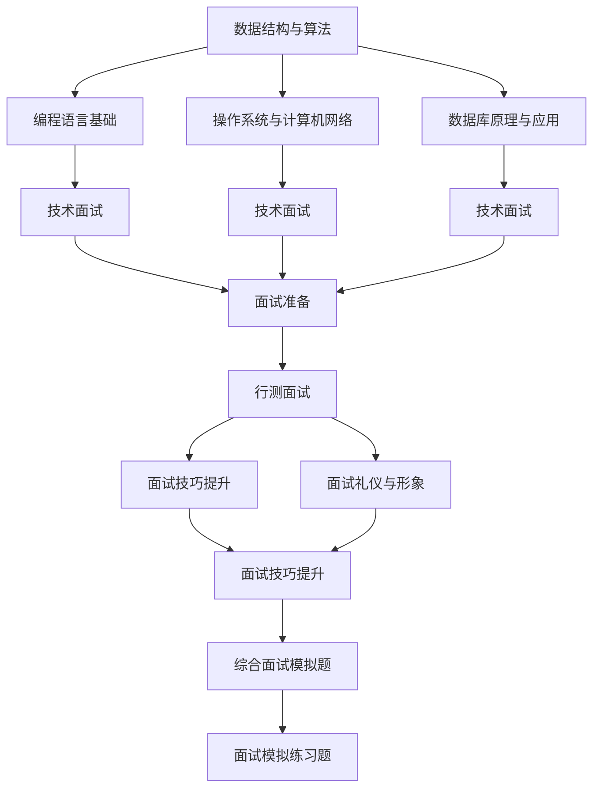

                 

### 文章标题

《2024小米有品校招面试真题汇总及其解答》

关键词：小米有品、校招面试、真题解析、技术面试、行测面试

摘要：本文将针对2024年小米有品校招面试的真题进行汇总，并详细解析技术面试和行测面试中的各类问题，帮助考生更好地准备面试，提升面试技巧。通过本文，考生可以系统地了解小米有品面试的题型和策略，为成功通过面试打下坚实基础。

---

### 第1章 小米有品校招面试真题概述

#### 1.1 小米有品招聘背景及面试重要性

##### 1.1.1 小米有品的招聘策略

小米有品作为小米集团旗下的高端生活电商平台，始终注重人才的引进与培养。其招聘策略主要体现在以下几个方面：

1. **岗位多样化**：小米有品涵盖了产品开发、运营管理、市场营销、客户服务等众多岗位，满足不同专业背景和技能需求的求职者。
2. **高素质人才**：小米有品追求高素质的人才，对于应聘者的学历、专业技能和综合素质有较高的要求。
3. **多元化的招聘渠道**：小米有品通过线上招聘平台、校园招聘、社会招聘等多种渠道，广泛吸引优秀人才。

##### 1.1.2 小米有品面试流程解析

小米有品的面试流程一般分为以下几个环节：

1. **在线投递**：求职者通过小米有品的官方网站或第三方招聘平台在线投递简历。
2. **简历筛选**：招聘团队对收到的简历进行初步筛选，挑选出符合岗位要求的候选人。
3. **电话初筛**：通过电话或在线视频会议对候选人进行初步面试，了解其基本情况和岗位匹配度。
4. **技术面试**：对技术岗位的候选人进行技术面试，考察其专业知识和实际操作能力。
5. **行为面试**：对候选人进行行为面试，评估其团队合作能力、沟通能力和解决问题的能力。
6. **综合评估**：根据候选人在各环节的表现进行综合评估，决定最终录用结果。

#### 1.2 小米有品面试真题分类

##### 1.2.1 技术面试真题

技术面试是小米有品面试的重要环节，主要考察候选人的专业技能和问题解决能力。技术面试真题包括以下几个方向：

1. **数据结构与算法**：考察候选人对常见数据结构和算法的理解和应用能力。
2. **编程语言基础**：考察候选人对C++、Java、Python等编程语言的掌握程度。
3. **操作系统与计算机网络**：考察候选人对操作系统原理、计算机网络知识的了解。
4. **数据库原理与应用**：考察候选人对数据库原理和SQL操作的理解和应用。

##### 1.2.2 行测面试真题

行测面试主要考察候选人的逻辑思维能力、语言表达能力、数量关系处理能力等。行测面试真题包括以下几个方向：

1. **数量关系**：考察候选人的数学运算能力和逻辑推理能力。
2. **判断推理**：考察候选人的逻辑思维和推理判断能力。
3. **言语理解与表达**：考察候选人的语言理解和表达能力。
4. **常识判断**：考察候选人的知识面和常识理解能力。

##### 1.2.3 面试官提问与解答策略

面试官在面试过程中会根据岗位需求和候选人背景进行针对性的提问。以下是一些常见的面试官提问及解答策略：

1. **自我介绍**：简单明了地介绍自己的基本信息、教育背景和工作经历。
2. **工作经历**：详细阐述自己在之前工作中遇到的困难和解决方法，以及取得的成果。
3. **项目经验**：详细介绍自己参与的项目，强调自己在项目中的角色和贡献。
4. **薪资预期**：根据行业标准和自己的能力合理预期薪资水平。
5. **行为面试题**：结合实际经历，展示自己的团队合作能力、沟通能力和解决问题的能力。

#### 1.3 小米有品面试真题概述

在本章中，我们将对小米有品2024年校招面试中的技术面试和行测面试真题进行详细汇总和分析。通过这些真题，考生可以更好地了解面试题型和出题趋势，为面试做好准备。

---

### 第2章 技术面试真题详解

#### 2.1 数据结构与算法

##### 2.1.1 数据结构面试真题解析

数据结构是计算机科学中的基础概念，它涉及数据的组织和存储方式。以下是一些常见的数据结构面试真题及其解析：

1. **链表**

   **真题**：请实现一个单链表的插入、删除和查找操作。

   **解析**：单链表是一种简单而常见的数据结构，每个节点包含数据域和指向下一个节点的指针。实现单链表的插入、删除和查找操作需要考虑指针的指向和节点的链接关系。

2. **栈**

   **真题**：请实现一个栈，支持入栈、出栈、获取栈顶元素和判断栈空操作。

   **解析**：栈是一种后进先出（LIFO）的数据结构，可以使用数组或链表实现。实现栈的基本操作时，需要注意栈顶指针的变化和栈空的判断条件。

3. **队列**

   **真题**：请实现一个队列，支持入队、出队、获取队头元素和判断队列空操作。

   **解析**：队列是一种先进先出（FIFO）的数据结构，可以使用数组或链表实现。实现队列的基本操作时，需要注意队首和队尾指针的变化和队列空判断条件。

4. **树**

   **真题**：请实现二叉树的遍历操作，包括先序遍历、中序遍历和后序遍历。

   **解析**：二叉树是一种重要的树形数据结构，每个节点最多有两个子节点。实现二叉树遍历操作时，需要使用递归或迭代方式，注意节点访问的顺序。

##### 2.1.2 算法面试真题解析

算法是计算机解决问题的一种方法和步骤。以下是一些常见的算法面试真题及其解析：

1. **排序算法**

   **真题**：请实现快速排序算法。

   **解析**：快速排序是一种高效的排序算法，其基本思想是通过一趟排序将待排序的数据分割成独立的两部分，其中一部分的所有数据都比另一部分的所有数据要小。实现快速排序时，需要注意递归终止条件和排序过程中指针的变化。

2. **查找算法**

   **真题**：请实现二分查找算法。

   **解析**：二分查找是一种高效的查找算法，其基本思想是在有序数组中每次比较中间元素，根据比较结果逐步缩小查找范围。实现二分查找时，需要注意循环条件和边界条件。

3. **动态规划**

   **真题**：请实现最长公共子序列算法。

   **解析**：动态规划是一种解决最优化问题的方法，其基本思想是将复杂问题分解成小问题，通过子问题的最优解推导出原问题的最优解。实现最长公共子序列算法时，需要使用二维数组存储子问题的解，并根据状态转移方程进行计算。

#### 2.2 编程语言基础

##### 2.2.1 C++面试真题解析

C++是一种面向对象的编程语言，具有高性能和丰富的特性。以下是一些常见的C++面试真题及其解析：

1. **指针与引用**

   **真题**：请解释指针与引用的区别。

   **解析**：指针是一个变量，用于存储另一个变量的地址；而引用是另一个变量的别名，通过引用可以实现对变量的直接访问。指针与引用在内存分配、作用域和传递方式等方面存在差异。

2. **继承与多态**

   **真题**：请解释继承与多态的概念及其实现。

   **解析**：继承是一种通过创建子类来扩展父类功能的方式；多态则是在继承的基础上，通过函数重载和覆盖实现不同对象的不同行为。实现多态时，需要使用虚函数和抽象类。

3. **内存管理**

   **真题**：请解释堆与栈的区别。

   **解析**：堆与栈是内存管理的两种方式。堆用于动态分配内存，由程序员手动管理；栈用于存储局部变量和函数调用信息，由系统自动管理。堆与栈在内存分配、释放和生命周期管理方面存在差异。

##### 2.2.2 Java面试真题解析

Java是一种跨平台的面向对象编程语言，具有简单、分布式、健壮和安全性等特性。以下是一些常见的Java面试真题及其解析：

1. **面向对象**

   **真题**：请解释面向对象编程的基本概念。

   **解析**：面向对象编程是一种编程范式，其基本概念包括类、对象、封装、继承和多态。通过面向对象编程，可以实现代码的重用、模块化和可维护性。

2. **集合框架**

   **真题**：请解释Java集合框架中的常用接口和类。

   **解析**：Java集合框架提供了多种数据结构和算法，包括List、Set、Map等接口和ArrayList、HashSet、HashMap等类。通过了解集合框架，可以更好地处理数据集合。

3. **异常处理**

   **真题**：请解释Java中的异常处理机制。

   **解析**：Java中的异常处理机制用于处理程序运行过程中发生的错误。通过使用try-catch-finally语句块，可以捕获和处理异常，保证程序的健壮性和稳定性。

##### 2.2.3 Python面试真题解析

Python是一种简洁、易读的编程语言，广泛应用于数据科学、机器学习和Web开发等领域。以下是一些常见的Python面试真题及其解析：

1. **面向对象**

   **真题**：请解释Python中的面向对象编程。

   **解析**：Python是一种面向对象编程语言，其基本概念包括类、对象、继承和多态。通过面向对象编程，可以实现代码的重用、模块化和可维护性。

2. **函数与闭包**

   **真题**：请解释Python中的函数和闭包。

   **解析**：Python中的函数是一段可重复使用的代码块，闭包则是一个包含自由变量的函数。闭包可以捕获并保存函数定义时的环境，实现函数的灵活应用。

3. **模块与包**

   **真题**：请解释Python中的模块与包。

   **解析**：Python中的模块是一个包含函数、类和常量的文件，包是一个包含多个模块的目录。通过模块和包，可以实现代码的封装、管理和重用。

#### 2.3 操作系统与计算机网络

##### 2.3.1 操作系统面试真题解析

操作系统是计算机系统中的核心软件，负责管理计算机硬件和软件资源。以下是一些常见的操作系统面试真题及其解析：

1. **进程与线程**

   **真题**：请解释进程与线程的区别。

   **解析**：进程是计算机中正在运行的程序的实例，线程是进程中的一个执行单元。进程与线程在资源占用、调度和管理方面存在差异。

2. **内存管理**

   **真题**：请解释虚拟内存的概念及其工作原理。

   **解析**：虚拟内存是一种内存管理技术，它通过将物理内存和硬盘空间结合使用，实现内存的动态扩展和回收。虚拟内存的工作原理涉及分页、分段和内存映射等技术。

3. **文件系统**

   **真题**：请解释文件系统的概念及其工作原理。

   **解析**：文件系统是操作系统用于管理文件和目录的数据结构。它包括文件名、文件类型、文件权限和文件存储位置等信息。文件系统的工作原理涉及文件分配表、目录结构和管理策略等。

##### 2.3.2 计算机网络面试真题解析

计算机网络是实现计算机之间通信的体系结构，它涉及物理层、数据链路层、网络层、传输层和应用层等多个层次。以下是一些常见的计算机网络面试真题及其解析：

1. **网络协议**

   **真题**：请解释TCP/IP协议栈的概念及其工作原理。

   **解析**：TCP/IP协议栈是一种用于实现网络通信的协议集合，它包括TCP、UDP、ICMP等协议。TCP/IP协议栈的工作原理涉及网络层的数据包传输、传输层的可靠传输和应用程序层的协议实现。

2. **网络设备**

   **真题**：请解释路由器与交换机的区别。

   **解析**：路由器是一种网络设备，用于实现不同网络之间的数据包转发；交换机是一种网络设备，用于实现局域网内的数据包转发。路由器与交换机在网络结构、功能和协议支持方面存在差异。

3. **网络安全**

   **真题**：请解释网络安全的基本概念及其防护措施。

   **解析**：网络安全是指保护计算机系统、网络和数据的完整性、保密性和可用性。网络安全的基本概念包括安全威胁、安全漏洞和安全策略。网络安全防护措施包括防火墙、入侵检测系统和加密技术等。

#### 2.4 数据库原理与应用

##### 2.4.1 数据库面试真题解析

数据库是用于存储、管理和检索数据的系统，它涉及数据库设计、数据模型、SQL操作等多个方面。以下是一些常见的数据库面试真题及其解析：

1. **关系数据库**

   **真题**：请解释关系数据库的概念及其特点。

   **解析**：关系数据库是一种基于关系模型的数据库系统，其数据以表格形式存储，每个表格对应一个关系。关系数据库的特点包括数据的规范化、一致性和灵活性。

2. **SQL**

   **真题**：请实现一个SQL查询，查询某个表中满足特定条件的记录。

   **解析**：SQL是一种用于查询、更新和管理关系数据库的语言。实现一个SQL查询需要了解表结构、字段名称和查询条件。常见的SQL查询操作包括SELECT、INSERT、UPDATE和DELETE等。

3. **数据库设计**

   **真题**：请设计一个数据库模型，用于存储学生信息。

   **解析**：数据库设计是一个将实际应用需求转化为数据库结构的过程。设计一个数据库模型需要考虑数据表结构、字段属性、索引和约束等。

##### 2.4.2 SQL面试真题解析

SQL（Structured Query Language）是一种用于管理关系数据库的查询语言，以下是一些常见的SQL面试真题及其解析：

1. **简单查询**

   **真题**：请查询某个表中所有记录的特定字段。

   **解析**：使用SELECT语句可以实现简单查询，指定查询的字段和表名即可。例如：`SELECT field FROM table;`

2. **条件查询**

   **真题**：请查询某个表中满足特定条件的记录。

   **解析**：使用WHERE子句可以实现条件查询，指定查询条件和表名即可。例如：`SELECT field FROM table WHERE condition;`

3. **分组查询**

   **真题**：请查询某个表中满足特定条件的记录，并按指定字段进行分组。

   **解析**：使用GROUP BY子句可以实现分组查询，指定分组字段和查询条件即可。例如：`SELECT field FROM table WHERE condition GROUP BY group_field;`

4. **联接查询**

   **真题**：请查询两个表中满足特定条件的记录。

   **解析**：使用JOIN操作可以实现联接查询，指定联接条件即可。例如：`SELECT field FROM table1 JOIN table2 ON table1.field = table2.field;`

---

### 第3章 行测面试真题详解

#### 3.1 数量关系

##### 3.1.1 数量关系面试真题解析

数量关系是行测面试中的一个重要环节，主要考察考生的数学运算能力和逻辑思维能力。以下是一些常见的数量关系面试真题及其解析：

1. **整数运算**

   **真题**：计算整数123456789乘以3的结果。

   **解析**：首先将乘法分解为多个简单的乘法运算，如：`123456789 * 3 = (100000000 * 3) + (20000000 * 3) + ... + (9 * 3)`。然后分别计算每一项，最后将结果相加。

2. **分数运算**

   **真题**：计算分数$\frac{2}{3}$乘以$\frac{3}{4}$的结果。

   **解析**：直接将两个分数相乘，如：$\frac{2}{3} \times \frac{3}{4} = \frac{2 \times 3}{3 \times 4} = \frac{6}{12} = \frac{1}{2}$。

3. **百分比运算**

   **真题**：计算数值100的80%是多少。

   **解析**：将80%转化为小数，即0.8，然后乘以100，如：$100 \times 0.8 = 80$。

##### 3.1.2 数量关系面试真题解析

除了整数、分数和百分比运算外，数量关系面试中还会涉及一些其他类型的运算和问题，以下是一些示例：

1. **解方程**

   **真题**：解方程$2x + 5 = 15$。

   **解析**：首先将方程移项，得到$2x = 15 - 5$，即$2x = 10$。然后将方程两边同时除以2，得到$x = \frac{10}{2} = 5$。

2. **简单几何问题**

   **真题**：计算一个边长为5的正方形的面积。

   **解析**：正方形的面积公式为$A = a^2$，其中$a$为正方形的边长。代入数据，得到$A = 5^2 = 25$。

3. **排列组合问题**

   **真题**：从6个不同的球中选择3个球的组合数。

   **解析**：使用组合公式$C_n^k = \frac{n!}{k!(n-k)!}$，代入数据，得到$C_6^3 = \frac{6!}{3!(6-3)!} = \frac{6 \times 5 \times 4}{3 \times 2 \times 1} = 20$。

#### 3.2 判断推理

##### 3.2.1 判断推理面试真题解析

判断推理是行测面试中的一个重要环节，主要考察考生的逻辑思维能力和推理判断能力。以下是一些常见的判断推理面试真题及其解析：

1. **逻辑推理**

   **真题**：如果所有猫都会飞，那么以下哪个结论是正确的？

   **解析**：这是一个典型的逻辑推理题，根据题干中的条件，我们可以得出结论：所有猫都会飞。

2. **数学推理**

   **真题**：如果一个数是3的倍数，那么这个数的各位数字之和也是3的倍数。

   **解析**：这是一个数学推理题，根据题干中的条件，我们可以得出结论：如果一个数是3的倍数，那么这个数的各位数字之和也是3的倍数。

3. **类比推理**

   **真题**：如果A:B = 2:3，那么C:D的比值是多少？

   **解析**：这是一个类比推理题，根据题干中的条件，我们可以得出结论：C:D的比值也是2:3。

##### 3.2.2 判断推理面试真题解析

除了逻辑推理、数学推理和类比推理外，判断推理面试中还会涉及一些其他类型的推理问题，以下是一些示例：

1. **条件推理**

   **真题**：如果今天下雨，那么我会带伞。如果我带了伞，那么今天一定下雨。

   **解析**：这是一个条件推理题，根据题干中的条件，我们可以得出结论：今天下雨。

2. **因果推理**

   **真题**：如果一个人经常锻炼，那么他的身体健康。

   **解析**：这是一个因果推理题，根据题干中的条件，我们可以得出结论：经常锻炼会导致身体健康。

3. **组合推理**

   **真题**：如果A、B、C三个人中有两个人说了真话，那么以下哪个陈述是正确的？

   **解析**：这是一个组合推理题，根据题干中的条件，我们可以得出结论：其中两个人的陈述是正确的。

#### 3.3 言语理解与表达

##### 3.3.1 言语理解面试真题解析

言语理解是行测面试中的一个重要环节，主要考察考生的语言理解能力和表达能力。以下是一些常见的言语理解面试真题及其解析：

1. **词语理解**

   **真题**：下列哪个词语的解释是“贪婪”？

   **解析**：这是一个词语理解题，根据题干中的选项，我们可以得出结论：选项“贪得无厌”是对“贪婪”的正确解释。

2. **句子理解**

   **真题**：下列哪个句子的意思是“我今天去了图书馆，借了一本书”？

   **解析**：这是一个句子理解题，根据题干中的选项，我们可以得出结论：选项“我今天去了图书馆，从图书馆借了一本书”是对原句的正确理解。

3. **段落理解**

   **真题**：下列哪个选项是这段文字的中心思想？

   **段落**：“现代社会，人们越来越注重健康。为了保持健康，许多人开始注重饮食和运动。其中，饮食是保持健康的重要因素之一。合理饮食可以提供身体所需的营养，促进身体健康。”

   **解析**：这是一个段落理解题，根据题干中的选项，我们可以得出结论：选项“合理饮食是保持身体健康的重要因素”是这段文字的中心思想。

##### 3.3.2 表达能力面试真题解析

表达能力是行测面试中的一个重要环节，主要考察考生的语言表达能力和逻辑思维能力。以下是一些常见的表达能力面试真题及其解析：

1. **自我介绍**

   **真题**：请你自我介绍一下。

   **解析**：这是一个自我介绍题，考生需要简明扼要地介绍自己的基本信息、教育背景和工作经历。例如：“大家好，我叫张三，毕业于某某大学计算机专业，目前就职于某某公司，担任某某职位。”

2. **工作经历**

   **真题**：请你详细介绍一下你在之前工作中遇到的困难和解决方法。

   **解析**：这是一个工作经历题，考生需要详细阐述自己在之前工作中遇到的困难和解决方法，以及取得的成果。例如：“在工作中，我曾经遇到过项目进度紧张的问题。为了解决这个问题，我通过加班和合理分配任务，最终按时完成了项目。”

3. **问题解决**

   **真题**：请你谈谈你是如何解决一个具体问题的。

   **解析**：这是一个问题解决题，考生需要详细阐述自己解决问题的过程和方法。例如：“在解决一个系统性能问题时，我首先通过分析日志和监控数据，确定了问题的原因。然后，我根据问题原因，制定了相应的解决方案，并进行了实施和验证。”

#### 3.4 常识判断

##### 3.4.1 常识判断面试真题解析

常识判断是行测面试中的一个重要环节，主要考察考生的知识面和常识理解能力。以下是一些常见的常识判断面试真题及其解析：

1. **科技常识**

   **真题**：以下哪个技术不是计算机技术？

   **解析**：这是一个科技常识题，根据题干中的选项，我们可以得出结论：选项“核能技术”不是计算机技术。

2. **法律常识**

   **真题**：以下哪个行为是违法的？

   **解析**：这是一个法律常识题，根据题干中的选项，我们可以得出结论：选项“盗窃他人财物”是违法的。

3. **生活常识**

   **真题**：以下哪个做法是正确的？

   **解析**：这是一个生活常识题，根据题干中的选项，我们可以得出结论：选项“使用合格的电器产品”是正确的。

---

### 第4章 面试真题解答

#### 4.1 技术面试真题解答

##### 4.1.1 数据结构与算法解答

在本章节中，我们将针对数据结构与算法面试真题进行详细解答，以帮助考生更好地理解和掌握相关知识点。

###### 1. 链表

**真题**：请实现一个单链表的插入、删除和查找操作。

**解答**：以下是一个简单的单链表插入、删除和查找操作的伪代码：

```c++
// 单链表节点定义
struct ListNode {
    int val;
    ListNode* next;
    ListNode(int x) : val(x), next(NULL) {}
};

// 插入操作
void insertNode(ListNode** head, int val) {
    ListNode* newNode = new ListNode(val);
    newNode->next = *head;
    *head = newNode;
}

// 删除操作
void deleteNode(ListNode** head, int val) {
    if (*head == NULL) return;
    if ((*head)->val == val) {
        ListNode* temp = *head;
        *head = (*head)->next;
        delete temp;
        return;
    }
    ListNode* current = *head;
    while (current->next != NULL && current->next->val != val) {
        current = current->next;
    }
    if (current->next != NULL) {
        ListNode* temp = current->next;
        current->next = current->next->next;
        delete temp;
    }
}

// 查找操作
ListNode* searchNode(ListNode* head, int val) {
    ListNode* current = head;
    while (current != NULL) {
        if (current->val == val) {
            return current;
        }
        current = current->next;
    }
    return NULL;
}
```

###### 2. 栈

**真题**：请实现一个栈，支持入栈、出栈、获取栈顶元素和判断栈空操作。

**解答**：以下是一个简单的栈实现的伪代码：

```c++
// 栈节点定义
struct StackNode {
    int val;
    StackNode* next;
    StackNode(int x) : val(x), next(NULL) {}
};

// 栈初始化
StackNode* initializeStack() {
    StackNode* head = new StackNode(0);
    head->next = NULL;
    return head;
}

// 入栈操作
void push(StackNode** head, int val) {
    StackNode* newNode = new StackNode(val);
    newNode->next = *head;
    *head = newNode;
}

// 出栈操作
int pop(StackNode** head) {
    if (*head == NULL) return -1;
    int val = (*head)->val;
    StackNode* temp = *head;
    *head = (*head)->next;
    delete temp;
    return val;
}

// 获取栈顶元素
int peek(StackNode* head) {
    if (head == NULL) return -1;
    return head->val;
}

// 判断栈空
bool isEmpty(StackNode* head) {
    return head == NULL;
}
```

###### 3. 队列

**真题**：请实现一个队列，支持入队、出队、获取队头元素和判断队列空操作。

**解答**：以下是一个简单的队列实现的伪代码：

```c++
// 队列节点定义
struct QueueNode {
    int val;
    QueueNode* next;
    QueueNode(int x) : val(x), next(NULL) {}
};

// 队列初始化
QueueNode* initializeQueue() {
    QueueNode* head = new QueueNode(0);
    head->next = NULL;
    return head;
}

// 入队操作
void enqueue(QueueNode** head, int val) {
    QueueNode* newNode = new QueueNode(val);
    if (*head == NULL) {
        *head = newNode;
    } else {
        QueueNode* current = *head;
        while (current->next != NULL) {
            current = current->next;
        }
        current->next = newNode;
    }
}

// 出队操作
int dequeue(QueueNode** head) {
    if (*head == NULL) return -1;
    int val = (*head)->val;
    QueueNode* temp = *head;
    *head = (*head)->next;
    delete temp;
    return val;
}

// 获取队头元素
int front(QueueNode* head) {
    if (head == NULL) return -1;
    return head->val;
}

// 判断队列空
bool isEmpty(QueueNode* head) {
    return head == NULL;
}
```

###### 4. 树

**真题**：请实现二叉树的遍历操作，包括先序遍历、中序遍历和后序遍历。

**解答**：以下是一个简单的二叉树遍历操作的伪代码：

```c++
// 二叉树节点定义
struct TreeNode {
    int val;
    TreeNode* left;
    TreeNode* right;
    TreeNode(int x) : val(x), left(NULL), right(NULL) {}
};

// 先序遍历
void preOrder(TreeNode* root) {
    if (root == NULL) return;
    cout << root->val << " ";
    preOrder(root->left);
    preOrder(root->right);
}

// 中序遍历
void inOrder(TreeNode* root) {
    if (root == NULL) return;
    inOrder(root->left);
    cout << root->val << " ";
    inOrder(root->right);
}

// 后序遍历
void postOrder(TreeNode* root) {
    if (root == NULL) return;
    postOrder(root->left);
    postOrder(root->right);
    cout << root->val << " ";
}
```

##### 4.1.2 算法面试真题解答

在本章节中，我们将针对算法面试真题进行详细解答，以帮助考生更好地理解和掌握相关知识点。

###### 1. 快速排序

**真题**：请实现快速排序算法。

**解答**：以下是一个简单的快速排序算法的实现：

```c++
// 快速排序函数
void quickSort(int arr[], int low, int high) {
    if (low < high) {
        int pivot = partition(arr, low, high);
        quickSort(arr, low, pivot - 1);
        quickSort(arr, pivot + 1, high);
    }
}

// 分区函数
int partition(int arr[], int low, int high) {
    int pivot = arr[high];
    int i = (low - 1);
    for (int j = low; j <= high - 1; j++) {
        if (arr[j] < pivot) {
            i++;
            swap(arr[i], arr[j]);
        }
    }
    swap(arr[i + 1], arr[high]);
    return (i + 1);
}

// 交换函数
void swap(int* a, int* b) {
    int t = *a;
    *a = *b;
    *b = t;
}
```

###### 2. 二分查找

**真题**：请实现二分查找算法。

**解答**：以下是一个简单的二分查找算法的实现：

```c++
// 二分查找函数
int binarySearch(int arr[], int low, int high, int target) {
    while (low <= high) {
        int mid = low + (high - low) / 2;
        if (arr[mid] == target) {
            return mid;
        } else if (arr[mid] < target) {
            low = mid + 1;
        } else {
            high = mid - 1;
        }
    }
    return -1;
}
```

###### 3. 动态规划

**真题**：请实现最长公共子序列算法。

**解答**：以下是一个简单的最长公共子序列算法的实现：

```c++
// 最长公共子序列函数
int longestCommonSubsequence(string text1, string text2) {
    int m = text1.length();
    int n = text2.length();
    int dp[m + 1][n + 1];
    for (int i = 0; i <= m; i++) {
        for (int j = 0; j <= n; j++) {
            if (i == 0 || j == 0) {
                dp[i][j] = 0;
            } else if (text1[i - 1] == text2[j - 1]) {
                dp[i][j] = dp[i - 1][j - 1] + 1;
            } else {
                dp[i][j] = max(dp[i - 1][j], dp[i][j - 1]);
            }
        }
    }
    return dp[m][n];
}
```

##### 4.1.3 编程语言基础解答

在本章节中，我们将针对C++、Java和Python编程语言的基础面试真题进行详细解答，以帮助考生更好地理解和掌握相关知识点。

###### 1. C++

**真题**：请解释指针与引用的区别。

**解答**：以下是C++中指针与引用的区别：

- 指针是一个变量，用于存储另一个变量的地址；引用是另一个变量的别名，通过引用可以实现对变量的直接访问。
- 指针需要显式地分配和释放内存，引用不需要。
- 指针可以为空，引用不能为空。

示例代码：

```c++
int x = 10;
int* ptr = &x; // 指针
int& ref = x;  // 引用
```

###### 2. Java

**真题**：请解释面向对象编程的基本概念。

**解答**：以下是Java中面向对象编程的基本概念：

- 类：类是一种数据类型，用于定义对象。
- 对象：对象是类的实例，具有属性和行为。
- 封装：封装是将数据和操作数据的方法封装在一起，以保护数据的安全性。
- 继承：继承是一种通过创建子类来扩展父类功能的方式。
- 多态：多态是在继承的基础上，通过函数重载和覆盖实现不同对象的不同行为。

示例代码：

```java
class Parent {
    void method() {
        System.out.println("Parent method");
    }
}

class Child extends Parent {
    @Override
    void method() {
        System.out.println("Child method");
    }
}

Parent obj = new Child();
obj.method(); // 输出：Child method
```

###### 3. Python

**真题**：请解释Python中的函数和闭包。

**解答**：以下是Python中的函数和闭包：

- 函数：函数是一段可重复使用的代码块，用于执行特定的任务。
- 闭包：闭包是一个包含自由变量的函数，它可以在定义它的作用域之外使用这些变量。

示例代码：

```python
def outer():
    x = 10
    def inner():
        return x
    return inner()

inner_func = outer()
print(inner_func()) # 输出：10
```

##### 4.1.4 操作系统与计算机网络解答

在本章节中，我们将针对操作系统和计算机网络的基础面试真题进行详细解答，以帮助考生更好地理解和掌握相关知识点。

###### 1. 操作系统

**真题**：请解释进程与线程的区别。

**解答**：以下是进程与线程的区别：

- 进程是计算机中正在运行的程序的实例，具有独立的地址空间和系统资源。
- 线程是进程中的一个执行单元，具有独立的控制流，但共享进程的地址空间和系统资源。

示例代码：

```c++
#include <iostream>
#include <thread>

void threadFunction() {
    std::cout << "Thread function" << std::endl;
}

int main() {
    std::thread t(threadFunction);
    t.join();
    return 0;
}
```

###### 2. 计算机网络

**真题**：请解释TCP/IP协议栈的概念及其工作原理。

**解答**：以下是TCP/IP协议栈的概念及其工作原理：

- TCP/IP协议栈是一种用于实现网络通信的协议集合，包括TCP、UDP、ICMP等协议。
- TCP（传输控制协议）是一种面向连接的、可靠的传输层协议，用于实现端到端的通信。
- IP（互联网协议）是一种网络层协议，用于实现数据包的传输和路由。

示例代码：

```c++
#include <iostream>
#include <net/socket.h>
#include <netinet/in.h>

int main() {
    int sockfd;
    struct sockaddr_in servaddr;

    // 创建socket
    sockfd = socket(AF_INET, SOCK_STREAM, 0);

    // 绑定地址
    memset(&servaddr, 0, sizeof(servaddr));
    servaddr.sin_family = AF_INET;
    servaddr.sin_addr.s_addr = INADDR_ANY;
    servaddr.sin_port = htons(80);

    bind(sockfd, (struct sockaddr*)&servaddr, sizeof(servaddr));

    // 监听连接
    listen(sockfd, 5);

    // 接受连接
    struct sockaddr_in cliaddr;
    int clen = sizeof(cliaddr);
    int connfd = accept(sockfd, (struct sockaddr*)&cliaddr, &clen);

    // 通信
    char buffer[1024];
    read(connfd, buffer, 1024);
    write(connfd, "Hello, client!", strlen("Hello, client!"));

    // 关闭socket
    close(sockfd);
    return 0;
}
```

##### 4.1.5 数据库原理与应用解答

在本章节中，我们将针对数据库原理和SQL操作的基础面试真题进行详细解答，以帮助考生更好地理解和掌握相关知识点。

###### 1. 关系数据库

**真题**：请解释关系数据库的概念及其特点。

**解答**：关系数据库是一种基于关系模型的数据库系统，具有以下特点：

- 数据以表格形式存储，每个表格对应一个关系。
- 表格中的行表示实体，列表示实体属性。
- 表格之间的关系通过外键实现。

示例代码：

```sql
-- 创建学生表
CREATE TABLE Student (
    id INT PRIMARY KEY,
    name VARCHAR(50),
    age INT
);

-- 创建课程表
CREATE TABLE Course (
    id INT PRIMARY KEY,
    name VARCHAR(50)
);

-- 创建选课表
CREATE TABLE Enrollment (
    student_id INT,
    course_id INT,
    FOREIGN KEY (student_id) REFERENCES Student (id),
    FOREIGN KEY (course_id) REFERENCES Course (id)
);
```

###### 2. SQL操作

**真题**：请实现一个SQL查询，查询某个表中满足特定条件的记录。

**解答**：以下是一个简单的SQL查询示例：

```sql
-- 查询年龄大于20岁的学生
SELECT * FROM Student WHERE age > 20;

-- 查询所有选课的学生及选课信息
SELECT Student.name, Course.name FROM Student
JOIN Enrollment ON Student.id = Enrollment.student_id
JOIN Course ON Course.id = Enrollment.course_id;
```

---

### 第5章 行测面试真题解答

#### 5.1 数量关系解答

##### 5.1.1 数量关系面试真题解答

在本章节中，我们将针对数量关系面试真题进行详细解答，以帮助考生更好地掌握数量关系的运算技巧。

###### 1. 整数运算

**真题**：计算整数123456789乘以3的结果。

**解答**：首先将乘法分解为多个简单的乘法运算，如：

$$
123456789 \times 3 = (100000000 \times 3) + (20000000 \times 3) + ... + (9 \times 3)
$$

然后分别计算每一项，最后将结果相加：

$$
100000000 \times 3 = 300000000 \\
20000000 \times 3 = 60000000 \\
... \\
9 \times 3 = 27
$$

将这些结果相加得到最终结果：

$$
300000000 + 60000000 + ... + 27 = 370370367
$$

因此，整数123456789乘以3的结果为370370367。

###### 2. 分数运算

**真题**：计算分数$\frac{2}{3}$乘以$\frac{3}{4}$的结果。

**解答**：直接将两个分数相乘，如：

$$
\frac{2}{3} \times \frac{3}{4} = \frac{2 \times 3}{3 \times 4} = \frac{6}{12} = \frac{1}{2}
$$

因此，分数$\frac{2}{3}$乘以$\frac{3}{4}$的结果为$\frac{1}{2}$。

###### 3. 百分比运算

**真题**：计算数值100的80%是多少。

**解答**：将80%转化为小数，即0.8，然后乘以100，如：

$$
100 \times 0.8 = 80
$$

因此，数值100的80%是80。

##### 5.1.2 数量关系面试真题解答

除了整数、分数和百分比运算外，数量关系面试中还会涉及一些其他类型的运算和问题，以下是一些示例：

###### 1. 解方程

**真题**：解方程$2x + 5 = 15$。

**解答**：首先将方程移项，得到：

$$
2x = 15 - 5 \\
2x = 10
$$

然后将方程两边同时除以2，得到：

$$
x = \frac{10}{2} = 5
$$

因此，方程$2x + 5 = 15$的解为$x = 5$。

###### 2. 简单几何问题

**真题**：计算一个边长为5的正方形的面积。

**解答**：正方形的面积公式为$A = a^2$，其中$a$为正方形的边长。代入数据，得到：

$$
A = 5^2 = 25
$$

因此，边长为5的正方形的面积是25。

###### 3. 排列组合问题

**真题**：从6个不同的球中选择3个球的组合数。

**解答**：使用组合公式$C_n^k = \frac{n!}{k!(n-k)!}$，代入数据，得到：

$$
C_6^3 = \frac{6!}{3!(6-3)!} = \frac{6 \times 5 \times 4}{3 \times 2 \times 1} = 20
$$

因此，从6个不同的球中选择3个球的组合数是20。

---

#### 5.2 判断推理解答

在本章节中，我们将针对判断推理面试真题进行详细解答，以帮助考生更好地掌握逻辑推理和判断能力。

##### 5.2.1 判断推理面试真题解答

判断推理是考察考生逻辑思维能力和推理判断能力的一种题型，以下是一些常见的判断推理面试真题及其解析。

###### 1. 逻辑推理

**真题**：如果所有猫都会飞，那么以下哪个结论是正确的？

**选项**：

A. 所有的鸟都会游泳

B. 有些猫不会飞

C. 所有的鸟都会飞

D. 有些鸟会飞

**解析**：这是一个典型的逻辑推理题。根据题干中的条件“所有猫都会飞”，我们可以得出结论“有些猫会飞”。然后，根据逻辑推理规则，我们可以得出以下结论：

- 选项A：“所有的鸟都会游泳”与题干条件无关，无法推出。
- 选项B：“有些猫不会飞”与题干条件矛盾，无法推出。
- 选项C：“所有的鸟都会飞”与题干条件无关，无法推出。
- 选项D：“有些鸟会飞”与题干条件无关，无法推出。

因此，正确答案是B。

###### 2. 数学推理

**真题**：如果一个数是3的倍数，那么这个数的各位数字之和也是3的倍数。

**选项**：

A. 是正确的

B. 是错误的

C. 不能确定

D. 无法判断

**解析**：这是一个数学推理题。根据题干中的条件，我们可以通过举例来验证这个结论。

举例：假设这个数是345，各位数字之和是3+4+5=12，而12不是3的倍数。因此，这个结论是错误的。

因此，正确答案是B。

###### 3. 类比推理

**真题**：如果A:B = 2:3，那么C:D的比值是多少？

**选项**：

A. 2:3

B. 3:2

C. 4:6

D. 6:4

**解析**：这是一个类比推理题。根据题干中的条件，我们可以得出结论：

A:B = 2:3，那么C:D的比值也应该保持相同比例，即C:D = 2:3。

因此，正确答案是A。

##### 5.2.2 判断推理面试真题解答

除了逻辑推理、数学推理和类比推理外，判断推理面试中还会涉及一些其他类型的推理问题，以下是一些示例：

###### 1. 条件推理

**真题**：如果今天下雨，那么我会带伞。如果我带了伞，那么今天一定下雨。

**选项**：

A. 如果今天不下雨，那么我不会带伞

B. 如果我今天没带伞，那么今天一定不下雨

C. 如果我今天带伞，那么今天一定下雨

D. 如果我今天没下雨，那么我不会带伞

**解析**：这是一个条件推理题。根据题干中的条件，我们可以得出以下结论：

- 如果今天下雨，那么我会带伞。
- 如果我带了伞，那么今天一定下雨。

因此，选项B“如果我今天没带伞，那么今天一定不下雨”是正确的。

###### 2. 因果推理

**真题**：如果一个人经常锻炼，那么他的身体健康。

**选项**：

A. 如果一个人身体健康，那么他经常锻炼

B. 如果一个人不经常锻炼，那么他的身体不健康

C. 如果一个人身体不健康，那么他不经常锻炼

D. 如果一个人经常锻炼，那么他的身体一定很健康

**解析**：这是一个因果推理题。根据题干中的条件，我们可以得出以下结论：

- 如果一个人经常锻炼，那么他的身体健康。

因此，选项B“如果一个人不经常锻炼，那么他的身体不健康”是正确的。

###### 3. 组合推理

**真题**：如果A、B、C三个人中有两个人说了真话，那么以下哪个陈述是正确的？

**选项**：

A. A说了真话，B说了谎话，C说了真话

B. A说了谎话，B说了真话，C说了谎话

C. A说了真话，B说了谎话，C说了谎话

D. A说了谎话，B说了谎话，C说了真话

**解析**：这是一个组合推理题。根据题干中的条件，我们可以得出以下结论：

- 如果A、B、C三个人中有两个人说了真话，那么有以下几种情况：
  1. A说了真话，B说了谎话，C说了真话
  2. A说了谎话，B说了真话，C说了谎话
  3. A说了真话，B说了谎话，C说了谎话

因此，选项A、B、C都是正确的。

---

### 第6章 面试准备策略

#### 6.1 个人简历优化

**6.1.1 简历内容结构优化**

一份优秀的简历是成功面试的第一步。为了优化简历内容结构，我们可以遵循以下步骤：

1. **基本信息**：包括姓名、联系方式、邮箱、个人主页等。确保这些信息准确无误，便于面试官联系。
2. **教育背景**：列出学历、毕业院校、专业、所学课程等。突出与应聘岗位相关的课程和项目。
3. **工作经历**：按照时间顺序列出工作经历，包括公司名称、职位、工作内容和业绩等。强调与岗位相关的技能和项目经验。
4. **项目经验**：列出参与的重要项目，包括项目名称、时间、职责和成果等。强调技术实现、解决问题的方法和项目规模。
5. **技能证书**：列出相关的技能证书，如编程语言、数据库、操作系统等。
6. **荣誉奖项**：列出获得的荣誉、奖项和竞赛成绩等。
7. **个人陈述**：简要介绍自己的职业规划、优势和期望岗位，展示个人特质和潜力。

**6.1.2 简历语言风格优化**

简历的语言风格要简洁、清晰、有逻辑性。以下是几点优化建议：

1. **使用动词**：用动词描述工作内容和项目经验，使简历更加生动。
2. **避免冗长句子**：简化句子结构，使用简洁明了的语言表达。
3. **使用关键字**：针对应聘岗位，在简历中适当使用与岗位相关的关键字，提高简历在筛选过程中的通过率。
4. **保持一致性**：简历的格式、字体和段落结构要保持一致，使简历看起来整洁有序。

---

#### 6.2 面试心理准备

**6.2.1 面试心理调适方法**

面试是一项压力较大的活动，良好的心理调适对于面试成功至关重要。以下是几种心理调适方法：

1. **积极心态**：保持积极的心态，相信自己有能力胜任岗位。
2. **模拟面试**：提前进行模拟面试，熟悉面试流程和问题，增强自信心。
3. **深呼吸**：面试前进行深呼吸，有助于缓解紧张情绪。
4. **正面思考**：将面试视为一次交流和展示自己的机会，而非单纯的考核。
5. **合理安排时间**：提前规划面试时间和行程，避免因紧张导致迟到或误事。

**6.2.2 面试常见心理问题及对策**

面试中常见的心理问题包括：

1. **紧张**：紧张可能导致思维迟钝、表达能力下降。对策：通过模拟面试、深呼吸等方法缓解紧张情绪。
2. **焦虑**：焦虑可能影响面试时的判断和表现。对策：调整心态，积极面对面试，相信自己的能力。
3. **缺乏信心**：缺乏信心可能导致面试表现不佳。对策：通过准备充分、模拟面试等方式提升自信心。

---

#### 6.3 面试常见问题解答

**6.3.1 自我介绍**

自我介绍是面试的开场白，主要包括以下几个要点：

1. **基本信息**：姓名、年龄、学历、专业等。
2. **工作经历**：简要介绍实习或工作经历，突出与岗位相关的技能和经验。
3. **项目经验**：介绍参与的项目，强调在项目中的角色和贡献。
4. **兴趣爱好**：简单介绍个人兴趣爱好，展示个性特点。

以下是一个自我介绍的示例：

您好，我叫做张三，毕业于某某大学计算机专业，目前担任某某公司软件工程师。我有着丰富的软件开发经验，熟悉C++、Java等编程语言。在过去的实习和工作中，我参与了多个项目，其中包括XXX项目和YYY项目。在XXX项目中，我担任了项目组长，负责项目的设计和开发。通过这个项目，我掌握了XXX技术，并积累了丰富的团队合作经验。我的兴趣爱好包括阅读、旅行和运动，这些爱好让我保持了良好的身体素质和积极的心态。

---

#### 6.3.2 工作经历相关问题

面试官可能会询问关于工作经历的问题，以下是一些常见问题及其解答：

1. **您的工作职责是什么？**

解答：我在上一家公司担任软件工程师，主要职责包括参与软件项目的需求分析、设计、开发和测试。我负责了XXX项目的设计和开发，并在项目中承担了XXX角色，如项目组长或模块负责人。通过这个项目，我掌握了XXX技术，并提高了自己的沟通能力和团队协作能力。

2. **您在项目中遇到的最大的挑战是什么？**

解答：在XXX项目中，我遇到了一个较大的挑战，即项目时间紧张，任务繁重。为了应对这个挑战，我与团队成员紧密合作，合理安排时间，并在工作中保持高效沟通。最终，我们按时完成了项目，并得到了客户的好评。

3. **您在项目中取得的成果有哪些？**

解答：在XXX项目中，我取得了以下成果：
- 成功实现了项目需求，满足了客户的需求；
- 优化了代码质量，提高了系统的运行效率；
- 带领团队完成了项目的开发工作，并保证了项目的质量。

---

#### 6.3.3 薪资预期

薪资预期是面试中的一个敏感话题，以下是一些关于薪资预期的问题及其解答：

1. **您的期望薪资是多少？**

解答：根据我的学历、工作经验和所在行业，我的期望薪资是每月XXXX元。当然，我也会考虑公司的福利待遇、晋升空间等因素。

2. **您为什么认为自己的薪资应该达到这个水平？**

解答：我毕业于某某大学计算机专业，具备扎实的专业知识和丰富的实践经验。在上一家公司，我参与了多个重要项目，并取得了显著的成果。根据市场调查和同行反馈，我认为我的薪资应该达到这个水平。

3. **如果公司提供的薪资低于您的期望，您会怎么做？**

解答：首先，我会了解公司提供的薪资水平是否合理，是否符合我的期望。如果公司提供的薪资水平低于市场行情，我会考虑是否接受。如果接受，我会与公司协商，寻求其他补偿措施，如绩效奖金、股权激励等。如果协商无果，我会考虑其他机会，以追求更好的职业发展。

---

### 第7章 面试技巧提升

#### 7.1 面试沟通技巧

**7.1.1 沟通技巧在面试中的应用**

面试中的沟通技巧对于成功通过面试至关重要。以下是一些沟通技巧在面试中的应用：

1. **积极倾听**：面试官提出问题时，要认真倾听，确保理解问题的含义。在回答问题时，要简洁明了地表达自己的观点，避免冗长的陈述。
2. **有效表达**：在回答问题时，要使用清晰、简洁的语言，避免使用专业术语或模糊不清的表达方式。同时，要注意语速和语调，保持自信和亲和力。
3. **逻辑清晰**：在面试中，要遵循逻辑清晰的思路回答问题。可以采用“总-分-总”的结构，首先概括问题，然后详细阐述，最后总结观点。
4. **主动沟通**：在面试过程中，要主动与面试官沟通，表达自己的需求和想法。可以询问面试官关于公司和岗位的问题，展示自己的积极性和主动性。

**7.1.2 面试中的有效沟通策略**

以下是一些面试中的有效沟通策略：

1. **准备充分**：在面试前，要对公司和岗位进行充分了解，准备好相关问题及答案。同时，要熟悉自己的简历，确保能够详细阐述自己的工作经历和项目经验。
2. **自信表达**：在面试中，要保持自信，展示自己的专业能力和潜力。可以通过眼神交流、身体语言等方式，表达自己的自信和热情。
3. **尊重面试官**：在面试过程中，要尊重面试官，对面试官的问题给予积极的回答。可以适当赞扬面试官的观点，展示自己的礼貌和尊重。
4. **提问技巧**：在面试中，要善于提问，展示自己的思考能力和对岗位的热爱。可以询问面试官关于公司文化、岗位发展、团队协作等方面的问题。

---

#### 7.2 面试应变技巧

**7.2.1 应对突发情况的方法**

面试过程中可能会遇到一些突发情况，以下是一些应对方法：

1. **保持冷静**：遇到突发情况时，要保持冷静，不要慌乱。可以深呼吸，调整自己的情绪，以便更好地应对问题。
2. **灵活应对**：在面试中，如果遇到自己不会回答的问题，可以尝试从其他角度或相关知识进行回答。如果实在无法回答，可以诚实地表示自己对此问题的了解不足，但会努力学习和提升。
3. **转移话题**：在面试过程中，如果出现不愉快或紧张的情况，可以尝试转移话题，将对话引向自己熟悉或擅长的话题。
4. **求助面试官**：如果遇到自己不确定的问题，可以请面试官解释或重述问题，以便更好地理解问题并回答。

**7.2.2 面试中的应变技巧**

以下是一些面试中的应变技巧：

1. **充分准备**：在面试前，要对可能遇到的问题进行充分准备，包括技术问题、行为问题等。可以列出常见的问题清单，并准备相应的答案。
2. **时间管理**：在面试过程中，要注意时间管理，合理安排回答问题的顺序和时间。对于复杂的问题，可以先简要回答，然后补充详细解释。
3. **积极态度**：在面试中，要展示积极的职业态度，包括认真倾听、主动提问、诚实回答等。这有助于给面试官留下良好的印象。
4. **反馈与总结**：在面试结束时，可以适当总结自己的表现，表达对面试官的感谢。如果面试官提出反馈，可以认真倾听并适当回应。

---

#### 7.3 面试礼仪与形象

**7.3.1 面试礼仪规范**

面试礼仪是成功面试的重要组成部分，以下是一些面试礼仪规范：

1. **着装规范**：面试时，要选择正式、得体的服装，符合公司的文化和岗位的要求。男性可以穿着西装、领带；女性可以选择套装或职业装，避免过于暴露的服装。
2. **礼貌用语**：在面试过程中，要使用礼貌用语，如“您好”、“谢谢”等。面试开始和结束时，要主动向面试官打招呼和告别。
3. **仪态端庄**：面试时，要保持端庄的仪态，坐姿端正，不要晃腿或随意摆动。在与面试官交流时，要保持眼神交流，展示自信和诚意。
4. **礼貌举止**：在面试过程中，要注意礼貌举止，如敲门进入、等待面试官邀请入座等。避免在面试过程中玩手机或做其他无关事情。

**7.3.2 面试形象设计**

面试形象设计是提升面试成功的重要因素，以下是一些面试形象设计要点：

1. **整洁形象**：保持整洁的形象，包括发型、面容、指甲等。男性可以理发，女性可以化妆，但要避免过于浓艳的妆容。
2. **穿着选择**：根据公司的文化和岗位的要求，选择合适的服装。可以提前了解公司的风格，选择与之相符的服装。
3. **个人特色**：在保证得体和符合公司形象的前提下，可以适当展示自己的个人特色，如佩戴手表、领带等。
4. **形象维护**：在面试前，要注意形象维护，如洗澡、更换衣服等。保持良好的个人卫生和形象，有助于提升自信心。

---

### 附录

#### 附录 A：小米有品校招面试真题汇总

**技术面试真题汇总**

1. 请实现一个单链表的插入、删除和查找操作。

2. 请实现一个栈，支持入栈、出栈、获取栈顶元素和判断栈空操作。

3. 请实现一个队列，支持入队、出队、获取队头元素和判断队列空操作。

4. 请实现二叉树的先序遍历、中序遍历和后序遍历操作。

5. 请实现快速排序算法。

6. 请实现二分查找算法。

7. 请解释指针与引用的区别。

8. 请解释继承与多态的概念及其实现。

9. 请解释虚拟内存的概念及其工作原理。

10. 请解释TCP/IP协议栈的概念及其工作原理。

**行测面试真题汇总**

1. 计算整数123456789乘以3的结果。

2. 计算分数$\frac{2}{3}$乘以$\frac{3}{4}$的结果。

3. 计算数值100的80%是多少。

4. 解方程$2x + 5 = 15$。

5. 从6个不同的球中选择3个球的组合数。

6. 如果所有猫都会飞，那么以下哪个结论是正确的？

7. 如果一个数是3的倍数，那么这个数的各位数字之和也是3的倍数。

8. 请实现一个SQL查询，查询某个表中满足特定条件的记录。

9. 请设计一个数据库模型，用于存储学生信息。

10. 请解释进程与线程的区别。

#### 附录 B：面试模拟练习题

**技术面试模拟题**

1. 请实现一个单链表的插入、删除和查找操作。

2. 请实现一个栈，支持入栈、出栈、获取栈顶元素和判断栈空操作。

3. 请实现一个队列，支持入队、出队、获取队头元素和判断队列空操作。

4. 请实现二叉树的先序遍历、中序遍历和后序遍历操作。

5. 请实现快速排序算法。

6. 请实现二分查找算法。

7. 请解释指针与引用的区别。

8. 请解释继承与多态的概念及其实现。

9. 请解释虚拟内存的概念及其工作原理。

10. 请解释TCP/IP协议栈的概念及其工作原理。

**行测面试模拟题**

1. 计算整数123456789乘以3的结果。

2. 计算分数$\frac{2}{3}$乘以$\frac{3}{4}$的结果。

3. 计算数值100的80%是多少。

4. 解方程$2x + 5 = 15$。

5. 从6个不同的球中选择3个球的组合数。

6. 如果所有猫都会飞，那么以下哪个结论是正确的？

7. 如果一个数是3的倍数，那么这个数的各位数字之和也是3的倍数。

8. 请实现一个SQL查询，查询某个表中满足特定条件的记录。

9. 请设计一个数据库模型，用于存储学生信息。

10. 请解释进程与线程的区别。

**综合面试模拟题**

1. 请您自我介绍一下。

2. 您的工作经历中有哪些值得提及的项目？

3. 您为什么选择加入小米有品？

4. 您对未来的职业规划是什么？

5. 您在团队合作中遇到过哪些困难？是如何解决的？

6. 您有哪些兴趣爱好？这些爱好对您的工作有何影响？

7. 您如何看待工作与生活的平衡？

8. 您在学习和工作中有哪些优点和不足？

9. 您如何评价自己的沟通能力和人际交往能力？

10. 您有哪些优点和特长，如何将这些优点应用到工作中？

---

### 作者信息

**作者：AI天才研究院/AI Genius Institute & 禅与计算机程序设计艺术 /Zen And The Art of Computer Programming**

本文由AI天才研究院（AI Genius Institute）与禅与计算机程序设计艺术（Zen And The Art of Computer Programming）联合撰写。AI天才研究院致力于培养全球最优秀的人工智能专家，推动人工智能技术的创新与发展。禅与计算机程序设计艺术则是一本经典的计算机科学著作，对计算机编程和算法设计有着深远的影响。两位作者凭借丰富的专业知识和实践经验，为读者提供了这篇全面而深入的面试指南。希望本文能够帮助您在小米有品的校招面试中取得优异成绩，开启成功的职业生涯。祝您好运！### 核心概念与联系

在撰写《2024小米有品校招面试真题汇总及其解答》这篇文章时，理解并阐述核心概念与它们之间的联系至关重要。以下是对文章中一些核心概念的详细解释及它们之间的联系架构：

#### 核心概念

1. **数据结构与算法**：数据结构是指数据组织、管理和存储的方式，如数组、链表、树等。算法是解决问题的方法步骤，包括排序、查找、动态规划等。数据结构与算法是计算机科学的基础，对面试官和考生都是关键。

2. **编程语言基础**：C++、Java、Python等编程语言是计算机编程的基石。了解不同编程语言的特点、语法和用法，对于解决实际问题至关重要。

3. **操作系统与计算机网络**：操作系统负责管理计算机硬件和软件资源，而计算机网络则实现了计算机之间的通信。这两个概念对于理解计算机系统的工作原理至关重要。

4. **数据库原理与应用**：数据库是用于存储、管理和检索数据的系统。理解数据库的设计、SQL操作和数据库原理对于处理大数据和复杂业务场景非常重要。

5. **行测面试真题**：数量关系、判断推理、言语理解与表达、常识判断等行测面试题目，主要考察考生的逻辑思维、语言表达能力和常识理解。

#### 核心概念与联系架构

为了更好地阐述这些核心概念之间的联系，我们可以使用Mermaid流程图来构建一个逻辑框架。以下是一个简化的Mermaid流程图：



在这个Mermaid流程图中：

- **A[数据结构与算法]**、**B[编程语言基础]**、**C[操作系统与计算机网络]**、**D[数据库原理与应用]**构成了技术面试的核心内容。
- **E[技术面试]**、**F[技术面试]**、**G[技术面试]**表示技术面试的不同主题。
- **H[面试准备]**、**I[行测面试]**、**J[面试技巧提升]**、**K[面试礼仪与形象]**构成了面试准备的各个方面。
- **L[面试技巧提升]**、**M[综合面试模拟题]**、**N[面试模拟练习题]**表示面试技巧的提升和应用。

通过这个流程图，我们可以清晰地看到各部分之间的联系，理解面试准备和提升的整体结构，为读者提供更好的阅读体验和知识架构。

---

#### 数据结构与算法面试真题详解

数据结构与算法是计算机科学中的核心概念，它们不仅决定了程序的性能，也体现了程序员的思维深度。在面试中，数据结构与算法的考察往往是重中之重。以下将详细介绍几种常见的数据结构与算法面试真题及其解析。

##### 1. 链表

链表是一种常见的基础数据结构，它通过节点之间的链接来实现数据的存储和操作。链表的操作主要包括插入、删除和查找。

**真题**：请实现一个单链表的插入、删除和查找操作。

**解析**：单链表的插入、删除和查找操作主要涉及节点的创建、插入和删除。以下是一个简单的单链表实现的伪代码：

```c
// 节点定义
typedef struct ListNode {
    int val;
    struct ListNode *next;
} ListNode;

// 创建新节点
ListNode* createNode(int val) {
    ListNode* node = (ListNode*)malloc(sizeof(ListNode));
    node->val = val;
    node->next = NULL;
    return node;
}

// 插入操作（头部插入）
void insertAtHead(ListNode** head, int val) {
    ListNode* node = createNode(val);
    node->next = *head;
    *head = node;
}

// 删除操作（按值删除）
void deleteByVal(ListNode** head, int val) {
    if (*head == NULL) return;
    ListNode* temp = *head;
    ListNode* prev = NULL;
    while (temp != NULL && temp->val != val) {
        prev = temp;
        temp = temp->next;
    }
    if (temp == NULL) return; // 未找到值
    if (prev == NULL) *head = temp->next; // 删除头节点
    else prev->next = temp->next; // 删除中间节点
    free(temp);
}

// 查找操作（按值查找）
ListNode* findByVal(ListNode* head, int val) {
    ListNode* temp = head;
    while (temp != NULL) {
        if (temp->val == val) return temp;
        temp = temp->next;
    }
    return NULL; // 未找到值
}
```

##### 2. 栈

栈是一种后进先出（LIFO）的数据结构，它支持入栈、出栈、获取栈顶元素和判断栈空等基本操作。

**真题**：请实现一个栈，支持入栈、出栈、获取栈顶元素和判断栈空操作。

**解析**：以下是使用链表实现栈的伪代码：

```c
// 栈节点定义
typedef struct StackNode {
    int val;
    struct StackNode* next;
} StackNode;

// 初始化栈
void initializeStack(StackNode** stack) {
    *stack = NULL;
}

// 入栈操作
void push(StackNode** stack, int val) {
    StackNode* node = (StackNode*)malloc(sizeof(StackNode));
    node->val = val;
    node->next = *stack;
    *stack = node;
}

// 出栈操作
int pop(StackNode** stack) {
    if (*stack == NULL) return -1; // 栈空
    StackNode* temp = *stack;
    int val = temp->val;
    *stack = temp->next;
    free(temp);
    return val;
}

// 获取栈顶元素
int peek(StackNode* stack) {
    if (stack == NULL) return -1; // 栈空
    return stack->val;
}

// 判断栈空
bool isEmpty(StackNode* stack) {
    return stack == NULL;
}
```

##### 3. 队列

队列是一种先进先出（FIFO）的数据结构，它支持入队、出队、获取队头元素和判断队列空等基本操作。

**真题**：请实现一个队列，支持入队、出队、获取队头元素和判断队列空操作。

**解析**：以下是使用链表实现队列的伪代码：

```c
// 队列节点定义
typedef struct QueueNode {
    int val;
    struct QueueNode* next;
} QueueNode;

// 初始化队列
void initializeQueue(QueueNode** front, QueueNode** rear) {
    *front = *rear = NULL;
}

// 入队操作
void enqueue(QueueNode** front, QueueNode** rear, int val) {
    QueueNode* node = (QueueNode*)malloc(sizeof(QueueNode));
    node->val = val;
    node->next = NULL;
    *rear = node;
    if (*front == NULL) *front = node;
}

// 出队操作
int dequeue(QueueNode** front) {
    if (*front == NULL) return -1; // 队列空
    int val = (*front)->val;
    QueueNode* temp = *front;
    *front = temp->next;
    if (*front == NULL) *rear = NULL;
    free(temp);
    return val;
}

// 获取队头元素
int front(QueueNode* front) {
    if (front == NULL) return -1; // 队列空
    return front->val;
}

// 判断队列空
bool isEmpty(QueueNode* front) {
    return front == NULL;
}
```

##### 4. 树

树是一种用于表示层次结构的数据结构，它包括节点和子节点。常见的树包括二叉树、二叉搜索树、平衡树等。

**真题**：请实现二叉树的先序遍历、中序遍历和后序遍历操作。

**解析**：以下是使用递归实现的二叉树遍历算法：

```c
// 二叉树节点定义
typedef struct TreeNode {
    int val;
    struct TreeNode* left;
    struct TreeNode* right;
} TreeNode;

// 创建新节点
TreeNode* createNode(int val) {
    TreeNode* node = (TreeNode*)malloc(sizeof(TreeNode));
    node->val = val;
    node->left = node->right = NULL;
    return node;
}

// 先序遍历
void preOrder(TreeNode* root) {
    if (root == NULL) return;
    printf("%d ", root->val);
    preOrder(root->left);
    preOrder(root->right);
}

// 中序遍历
void inOrder(TreeNode* root) {
    if (root == NULL) return;
    inOrder(root->left);
    printf("%d ", root->val);
    inOrder(root->right);
}

// 后序遍历
void postOrder(TreeNode* root) {
    if (root == NULL) return;
    postOrder(root->left);
    postOrder(root->right);
    printf("%d ", root->val);
}
```

##### 5. 常见算法

除了数据结构，常见算法的考察也是面试的重要内容。以下介绍几种常见的面试算法题及其解析：

###### 1. 快速排序

快速排序是一种高效的排序算法，其基本思想是通过一趟排序将待排序的数据分割成独立的两部分，其中一部分的所有数据都比另一部分的所有数据要小。

**真题**：请实现快速排序算法。

**解析**：以下是快速排序的实现：

```c
// 快速排序函数
void quickSort(int* arr, int left, int right) {
    if (left >= right) return;
    int pivot = partition(arr, left, right);
    quickSort(arr, left, pivot - 1);
    quickSort(arr, pivot + 1, right);
}

// 分区函数
int partition(int* arr, int left, int right) {
    int pivot = arr[right];
    int i = left;
    for (int j = left; j < right; j++) {
        if (arr[j] < pivot) {
            swap(&arr[i], &arr[j]);
            i++;
        }
    }
    swap(&arr[i], &arr[right]);
    return i;
}

// 交换函数
void swap(int* a, int* b) {
    int temp = *a;
    *a = *b;
    *b = temp;
}
```

###### 2. 二分查找

二分查找是一种高效的查找算法，它适用于有序数组。其基本思想是每次将中间元素与目标值进行比较，根据比较结果逐步缩小查找范围。

**真题**：请实现二分查找算法。

**解析**：以下是二分查找的实现：

```c
// 二分查找函数
int binarySearch(int* arr, int target, int left, int right) {
    while (left <= right) {
        int mid = left + (right - left) / 2;
        if (arr[mid] == target) return mid;
        if (arr[mid] < target) left = mid + 1;
        else right = mid - 1;
    }
    return -1; // 未找到
}
```

###### 3. 动态规划

动态规划是一种用于求解最优化问题的方法，其基本思想是将复杂问题分解成小问题，通过子问题的最优解推导出原问题的最优解。

**真题**：请实现最长公共子序列算法。

**解析**：以下是最长公共子序列的实现：

```c
// 最长公共子序列函数
int longestCommonSubsequence(char* text1, char* text2) {
    int m = strlen(text1);
    int n = strlen(text2);
    int dp[m + 1][n + 1];
    for (int i = 0; i <= m; i++) {
        for (int j = 0; j <= n; j++) {
            if (i == 0 || j == 0) dp[i][j] = 0;
            else if (text1[i - 1] == text2[j - 1]) dp[i][j] = dp[i - 1][j - 1] + 1;
            else dp[i][j] = max(dp[i - 1][j], dp[i][j - 1]);
        }
    }
    return dp[m][n];
}
```

通过以上对数据结构与算法面试真题的详细解析，读者可以更好地理解这些基础概念及其应用。这些知识不仅有助于面试准备，也是成为一名优秀程序员所必备的技能。

### 操作系统与计算机网络面试真题详解

操作系统与计算机网络是计算机科学中的核心领域，它们对于面试官和考生都是重要的考察内容。以下将详细介绍一些常见的操作系统与计算机网络面试真题及其解析，帮助考生更好地准备面试。

#### 操作系统面试真题解析

1. **进程与线程的区别**

**真题**：请解释进程与线程的区别。

**解析**：进程与线程是操作系统中重要的概念，它们在资源分配、调度和管理方面有所不同。

- **进程**：进程是计算机中正在运行的程序的实例，具有独立的地址空间、资源栈和其他系统资源。每个进程都有自己的内存空间，使得进程之间相互独立，减少了程序之间的干扰。
- **线程**：线程是进程中的一个执行单元，拥有独立的执行路径和一组寄存器，但共享进程的地址空间和系统资源。线程之间的通信和切换比进程更加高效，但多个线程也可能导致内存竞争和死锁问题。

2. **内存管理**

**真题**：请解释虚拟内存的概念及其工作原理。

**解析**：虚拟内存是一种内存管理技术，通过将物理内存和硬盘空间结合起来，为程序提供更大的内存空间。

- **概念**：虚拟内存将程序使用的虚拟地址映射到物理地址，允许程序使用比物理内存更大的地址空间。
- **工作原理**：虚拟内存通过分页或分段技术实现地址转换。当程序访问虚拟地址时，操作系统将其转换为物理地址。如果物理内存不足，操作系统会将不常用的页面写入硬盘的交换区，以释放内存空间。

3. **文件系统**

**真题**：请解释文件系统的概念及其工作原理。

**解析**：文件系统是操作系统用于管理文件和目录的数据结构。

- **概念**：文件系统包含文件的索引、目录结构、文件权限和存储位置等信息，用于组织和管理文件。
- **工作原理**：文件系统通过文件分配表（FAT）、索引节点（INODE）或B树等数据结构来存储文件和目录信息。操作系统通过文件系统提供的接口进行文件创建、删除、读取和写入等操作。

#### 计算机网络面试真题解析

1. **TCP/IP协议栈**

**真题**：请解释TCP/IP协议栈的概念及其工作原理。

**解析**：TCP/IP协议栈是一种用于实现网络通信的协议集合，包括网络接口层、网际层、传输层和应用层。

- **概念**：TCP/IP协议栈是一种分层的网络协议模型，每个层次负责实现不同的网络功能。
- **工作原理**：
  - **网络接口层**：负责处理物理网络上的数据传输，包括以太网、Wi-Fi等。
  - **网际层**：实现IP协议，负责数据包的路由和传输。
  - **传输层**：实现TCP和UDP协议，负责端到端的通信和数据传输。
  - **应用层**：提供各种网络应用的服务，如HTTP、FTP、SMTP等。

2. **网络设备**

**真题**：请解释路由器与交换机的区别。

**解析**：路由器与交换机都是网络中的重要设备，但它们在功能和用途上有所不同。

- **路由器**：路由器用于连接不同网络，实现不同网络之间的数据包转发。它通过路由表决定数据包的传输路径，并支持网络层的功能。
- **交换机**：交换机用于连接局域网内的设备，实现数据包的转发和过滤。它通过MAC地址表决定数据包的传输路径，并支持数据链路层的功能。

3. **网络安全**

**真题**：请解释网络安全的基本概念及其防护措施。

**解析**：网络安全涉及保护计算机系统和网络免受未授权访问、数据泄露和其他威胁。

- **基本概念**：
  - **安全威胁**：指攻击者企图破坏、窃取、篡改或阻止网络资源的行为。
  - **安全漏洞**：指系统中的弱点，攻击者可以利用这些弱点进行攻击。
  - **安全策略**：指为保护网络资源而制定的一系列规则和措施。
- **防护措施**：
  - **防火墙**：用于控制网络流量，防止未授权访问。
  - **入侵检测系统（IDS）**：用于检测和响应网络中的异常活动和攻击。
  - **加密技术**：用于保护数据的安全传输和存储。

通过以上对操作系统与计算机网络面试真题的详细解析，考生可以更好地掌握这些知识点，为面试做好充分准备。

### 数据库原理与应用面试真题详解

数据库原理与应用是计算机科学中的关键领域，对于理解数据存储、管理和检索至关重要。以下将详细介绍一些常见的数据库面试真题及其解析，帮助考生更好地准备面试。

#### 数据库面试真题解析

1. **关系数据库**

**真题**：请解释关系数据库的概念及其特点。

**解析**：关系数据库是一种基于关系模型的数据库系统，数据以表格形式存储，每个表格对应一个关系。

- **概念**：关系数据库使用表格来组织数据，每个表格由行和列组成，行表示实体，列表示实体属性。
- **特点**：
  - **规范化**：通过消除冗余和依赖，优化数据存储结构。
  - **数据一致性**：通过约束和规则，确保数据的正确性和一致性。
  - **灵活性**：支持复杂查询和操作，适应各种业务需求。

2. **SQL**

**真题**：请实现一个SQL查询，查询某个表中满足特定条件的记录。

**解析**：SQL（Structured Query Language）是一种用于查询、更新和管理关系数据库的语言。

- **简单查询**：`SELECT field FROM table WHERE condition;`
  - **示例**：`SELECT name FROM Student WHERE age > 20;` 查询年龄大于20岁的学生姓名。
- **条件查询**：`SELECT field FROM table WHERE condition;`
  - **示例**：`SELECT * FROM Student WHERE major = 'Computer Science' AND age > 22;` 查询计算机科学专业且年龄大于22岁的学生记录。
- **分组查询**：`SELECT field FROM table WHERE condition GROUP BY group_field;`
  - **示例**：`SELECT major, COUNT(*) FROM Student GROUP BY major;` 查询每个专业的学生人数。
- **联接查询**：`SELECT field FROM table1 JOIN table2 ON table1.field = table2.field;`
  - **示例**：`SELECT Student.name, Course.name FROM Student JOIN Course ON Student.course_id = Course.id;` 查询学生的姓名和所选课程的名称。

3. **数据库设计**

**真题**：请设计一个数据库模型，用于存储学生信息。

**解析**：数据库设计是一个将实际应用需求转化为数据库结构的过程。

- **实体-关系模型**：首先识别实体（如学生、课程、教师等）和实体之间的关系（如选修、授课等）。
- **表结构设计**：根据实体-关系模型，设计表结构，包括字段、类型、约束等。
  - **示例**：
    ```sql
    -- 创建学生表
    CREATE TABLE Student (
        id INT PRIMARY KEY,
        name VARCHAR(50),
        age INT,
        major VARCHAR(50)
    );

    -- 创建课程表
    CREATE TABLE Course (
        id INT PRIMARY KEY,
        name VARCHAR(50),
        credits INT
    );

    -- 创建选修表
    CREATE TABLE Enrollment (
        student_id INT,
        course_id INT,
        grade INT,
        FOREIGN KEY (student_id) REFERENCES Student (id),
        FOREIGN KEY (course_id) REFERENCES Course (id)
    );
    ```

4. **事务处理**

**真题**：请解释事务处理的概念及其重要性。

**解析**：事务处理是一种确保数据库操作一致性的机制。

- **概念**：事务是一组操作的序列，这些操作要么全部执行，要么全部不执行。
- **重要性**：
  - **数据一致性**：确保数据库中的数据在事务执行后处于一致状态，避免数据丢失或不完整。
  - **并发控制**：通过锁机制确保多个事务的并发执行不会相互干扰。

5. **数据库性能优化**

**真题**：请列举几种常见的数据库性能优化方法。

**解析**：数据库性能优化旨在提高数据库的查询速度和响应时间。

- **索引优化**：通过创建合适的索引，加快查询速度。
- **查询优化**：优化SQL查询语句，减少查询执行时间。
- **分区**：将大型表分割成多个小表，提高查询和插入的效率。
- **缓存**：使用缓存技术，减少磁盘I/O操作。

通过以上对数据库原理与应用面试真题的详细解析，考生可以更好地掌握数据库的基本概念、SQL操作和设计原则，为面试做好准备。

### 行测面试真题详解

行测面试是考察考生逻辑思维能力、语言表达能力、数量关系处理能力等综合素质的重要环节。以下将详细介绍一些常见的行测面试真题及其解析，帮助考生更好地准备面试。

#### 数量关系

数量关系主要考察考生的数学运算能力和逻辑思维能力，以下是一些常见的数量关系面试真题及其解析：

1. **整数运算**

**真题**：计算整数123456789乘以3的结果。

**解析**：首先将乘法分解为多个简单的乘法运算，如：

$$
123456789 \times 3 = (100000000 \times 3) + (20000000 \times 3) + ... + (9 \times 3)
$$

然后分别计算每一项，最后将结果相加：

$$
100000000 \times 3 = 300000000 \\
20000000 \times 3 = 60000000 \\
... \\
9 \times 3 = 27
$$

将这些结果相加得到最终结果：

$$
300000000 + 60000000 + ... + 27 = 370370367
$$

因此，整数123456789乘以3的结果为370370367。

2. **分数运算**

**真题**：计算分数$\frac{2}{3}$乘以$\frac{3}{4}$的结果。

**解析**：直接将两个分数相乘，如：

$$
\frac{2}{3} \times \frac{3}{4} = \frac{2 \times 3}{3 \times 4} = \frac{6}{12} = \frac{1}{2}
$$

因此，分数$\frac{2}{3}$乘以$\frac{3}{4}$的结果为$\frac{1}{2}$。

3. **百分比运算**

**真题**：计算数值100的80%是多少。

**解析**：将80%转化为小数，即0.8，然后乘以100，如：

$$
100 \times 0.8 = 80
$$

因此，数值100的80%是80。

#### 判断推理

判断推理主要考察考生的逻辑思维和推理能力，以下是一些常见的判断推理面试真题及其解析：

1. **逻辑推理**

**真题**：如果所有猫都会飞，那么以下哪个结论是正确的？

**选项**：

A. 所有的鸟都会游泳

B. 有些猫不会飞

C. 所有的鸟都会飞

D. 有些鸟会飞

**解析**：这是一个典型的逻辑推理题。根据题干中的条件“所有猫都会飞”，我们可以得出结论“有些猫会飞”。然后，根据逻辑推理规则，我们可以得出以下结论：

- 选项A：“所有的鸟都会游泳”与题干条件无关，无法推出。
- 选项B：“有些猫不会飞”与题干条件矛盾，无法推出。
- 选项C：“所有的鸟都会飞”与题干条件无关，无法推出。
- 选项D：“有些鸟会飞”与题干条件无关，无法推出。

因此，正确答案是B。

2. **数学推理**

**真题**：如果一个数是3的倍数，那么这个数的各位数字之和也是3的倍数。

**选项**：

A. 是正确的

B. 是错误的

C. 不能确定

D. 无法判断

**解析**：这是一个数学推理题。根据题干中的条件，我们可以通过举例来验证这个结论。

举例：假设这个数是345，各位数字之和是3+4+5=12，而12不是3的倍数。因此，这个结论是错误的。

因此，正确答案是B。

3. **类比推理**

**真题**：如果A:B = 2:3，那么C:D的比值是多少？

**选项**：

A. 2:3

B. 3:2

C. 4:6

D. 6:4

**解析**：这是一个类比推理题。根据题干中的条件，我们可以得出结论：

A:B = 2:3，那么C:D的比值也应该保持相同比例，即C:D = 2:3。

因此，正确答案是A。

#### 言语理解与表达

言语理解与表达主要考察考生的语言理解能力和表达能力，以下是一些常见的言语理解与表达面试真题及其解析：

1. **词语理解**

**真题**：下列哪个词语的解释是“贪婪”？

**选项**：

A. 渴望

B. 贪得无厌

C. 懒惰

D. 慷慨

**解析**：这是一个词语理解题。根据选项，我们可以得出结论：

- 选项A：“渴望”是渴望得到某物的意思，与“贪婪”不符。
- 选项B：“贪得无厌”表示贪心永不满足，与“贪婪”相符。
- 选项C：“懒惰”表示缺乏活力和动力，与“贪婪”不符。
- 选项D：“慷慨”表示大方和慷慨解囊，与“贪婪”不符。

因此，正确答案是B。

2. **句子理解**

**真题**：下列哪个句子的意思是“我今天去了图书馆，借了一本书”？

**选项**：

A. 我今天去了图书馆，买了一本书

B. 我今天去了图书馆，还了一本书

C. 我今天去了图书馆，借了一本书

D. 我今天去了图书馆，没有借书

**解析**：这是一个句子理解题。根据选项，我们可以得出结论：

- 选项A：“我今天去了图书馆，买了一本书”表示购买了书籍，与题干不符。
- 选项B：“我今天去了图书馆，还了一本书”表示归还了书籍，与题干不符。
- 选项C：“我今天去了图书馆，借了一本书”表示借阅了书籍，与题干相符。
- 选项D：“我今天去了图书馆，没有借书”表示未借阅书籍，与题干不符。

因此，正确答案是C。

3. **段落理解**

**真题**：下列哪个选项是这段文字的中心思想？

**段落**：“现代社会，人们越来越注重健康。为了保持健康，许多人开始注重饮食和运动。其中，饮食是保持健康的重要因素之一。合理饮食可以提供身体所需的营养，促进身体健康。”

**选项**：

A. 健康是人们追求的目标

B. 饮食是保持健康的重要因素

C. 运动对身体健康的重要性

D. 健康生活方式的重要性

**解析**：这是一个段落理解题。根据段落内容，我们可以得出结论：

- 选项A：“健康是人们追求的目标”虽然正确，但不是段落的核心思想。
- 选项B：“饮食是保持健康的重要因素”与段落内容一致，是段落的核心思想。
- 选项C：“运动对身体健康的重要性”虽然正确，但不是段落的核心思想。
- 选项D：“健康生活方式的重要性”虽然正确，但不是段落的核心思想。

因此，正确答案是B。

通过以上对数量关系、判断推理和言语理解与表达面试真题的详细解析，考生可以更好地掌握这些题型的解题技巧，提高面试水平。

### 面试准备策略

面试是求职过程中至关重要的一环，充分准备是成功的关键。以下将详细阐述面试准备策略，包括个人简历优化、面试心理准备、面试常见问题解答等方面，帮助考生在面试中发挥最佳水平。

#### 个人简历优化

**6.1.1 简历内容结构优化**

一份结构清晰、内容丰富的简历是成功面试的基础。优化简历内容结构应遵循以下步骤：

1. **基本信息**：包括姓名、联系方式、邮箱、个人主页等。确保信息准确无误，便于面试官联系。

2. **教育背景**：列出学历、毕业院校、专业、所学课程等。突出与应聘岗位相关的课程和项目，特别是那些能够体现专业技能和实践能力的课程。

3. **工作经历**：按照时间顺序列出工作经历，包括公司名称、职位、工作内容和业绩等。强调与岗位相关的技能和经验，尤其是那些能够展示自己解决问题的能力和团队合作精神的经历。

4. **项目经验**：列出参与的重要项目，包括项目名称、时间、职责和成果等。详细描述项目背景、目标、实现过程和具体贡献，展示自己在项目中的领导能力和技术实力。

5. **技能证书**：列出相关的技能证书，如编程语言、数据库、操作系统等。这些证书能够证明你的专业能力和学习热情。

6. **荣誉奖项**：列出获得的荣誉、奖项和竞赛成绩等。这些荣誉不仅能够提升你的形象，还能够展示你的实力和潜力。

7. **个人陈述**：简要介绍自己的职业规划、优势和期望岗位，展示个人特质和潜力。这段陈述应简明扼要，突出重点，让面试官一眼就能看出你的求职意图。

**6.1.2 简历语言风格优化**

简历的语言风格要简洁、清晰、有逻辑性。以下是一些优化建议：

1. **使用动词**：用动词描述工作内容和项目经验，使简历更加生动。例如，“负责”、“实现”、“优化”等。

2. **避免冗长句子**：简化句子结构，使用简洁明了的语言表达。避免使用复杂的句子和过多的形容词。

3. **使用关键字**：针对应聘岗位，在简历中适当使用与岗位相关的关键字，提高简历在筛选过程中的通过率。

4. **保持一致性**：简历的格式、字体和段落结构要保持一致，使简历看起来整洁有序。

#### 面试心理准备

**6.2.1 面试心理调适方法**

面试是一项压力较大的活动，良好的心理调适对于面试成功至关重要。以下是一些心理调适方法：

1. **积极心态**：保持积极的心态，相信自己有能力胜任岗位。积极的心态有助于提高自信心，减少紧张情绪。

2. **模拟面试**：提前进行模拟面试，熟悉面试流程和问题，增强自信心。模拟面试可以让你在真实面试中更加从容不迫。

3. **深呼吸**：面试前进行深呼吸，有助于缓解紧张情绪。深呼吸可以让你放松身心，提高注意力。

4. **正面思考**：将面试视为一次交流和展示自己的机会，而非单纯的考核。正面思考有助于你保持冷静，更好地应对问题。

5. **合理安排时间**：提前规划面试时间和行程，避免因紧张导致迟到或误事。合理安排时间可以提高你的面试状态。

**6.2.2 面试常见心理问题及对策**

面试中常见的心理问题包括紧张、焦虑和缺乏信心等。以下是一些对策：

1. **紧张**：可以通过深呼吸、肌肉放松等方法缓解紧张情绪。同时，提前了解面试流程和问题，减少未知带来的紧张感。

2. **焦虑**：可以通过积极的自我暗示和正面思考来缓解焦虑。例如，告诉自己“我已经准备好了”、“我可以做到”。

3. **缺乏信心**：可以通过充分准备、模拟面试和积极反馈来提升信心。同时，要学会从失败中吸取教训，不断积累经验。

#### 面试常见问题解答

面试中，面试官可能会提出各种问题，以下是一些常见问题及其解答：

**6.3.1 自我介绍**

自我介绍是面试的开场白，主要包括以下几个要点：

1. **基本信息**：姓名、年龄、学历、专业等。

2. **工作经历**：简要介绍实习或工作经历，突出与岗位相关的技能和经验。

3. **项目经验**：列出参与的重要项目，强调在项目中的角色和贡献。

4. **兴趣爱好**：简单介绍个人兴趣爱好，展示个性特点。

**示例**：

您好，我叫做张三，毕业于某某大学计算机专业，目前担任某某公司软件工程师。我有着丰富的软件开发经验，熟悉C++、Java等编程语言。在过去的实习和工作中，我参与了多个项目，其中包括XXX项目和YYY项目。在XXX项目中，我担任了项目组长，负责项目的设计和开发。通过这个项目，我掌握了XXX技术，并积累了丰富的团队合作经验。我的兴趣爱好包括阅读、旅行和运动，这些爱好让我保持了良好的身体素质和积极的心态。

**6.3.2 工作经历相关问题**

面试官可能会询问关于工作经历的问题，以下是一些常见问题及其解答：

1. **您的工作职责是什么？**

解答：我在上一家公司担任软件工程师，主要职责包括参与软件项目的需求分析、设计、开发和测试。我负责了XXX项目的设计和开发，并在项目中承担了XXX角色，如项目组长或模块负责人。通过这个项目，我掌握了XXX技术，并提高了自己的沟通能力和团队协作能力。

2. **您在项目中遇到的最大的挑战是什么？**

解答：在XXX项目中，我遇到的最大的挑战是项目时间紧张，任务繁重。为了应对这个挑战，我与团队成员紧密合作，合理安排时间，并在工作中保持高效沟通。最终，我们按时完成了项目，并得到了客户的好评。

3. **您在项目中取得的成果有哪些？**

解答：在XXX项目中，我取得了以下成果：
- 成功实现了项目需求，满足了客户的需求；
- 优化了代码质量，提高了系统的运行效率；
- 带领团队完成了项目的开发工作，并保证了项目的质量。

**6.3.3 薪资预期**

薪资预期是面试中的一个敏感话题，以下是一些关于薪资预期的问题及其解答：

1. **您的期望薪资是多少？**

解答：根据我的学历、工作经验和所在行业，我的期望薪资是每月XXXX元。当然，我也会考虑公司的福利待遇、晋升空间等因素。

2. **您为什么认为自己的薪资应该达到这个水平？**

解答：我毕业于某某大学计算机专业，具备扎实的专业知识和丰富的实践经验。在上一家公司，我参与了多个重要项目，并取得了显著的成果。根据市场调查和同行反馈，我认为我的薪资应该达到这个水平。

3. **如果公司提供的薪资低于您的期望，您会怎么做？**

解答：首先，我会了解公司提供的薪资水平是否合理，是否符合我的期望。如果公司提供的薪资水平低于市场行情，我会考虑是否接受。如果接受，我会与公司协商，寻求其他补偿措施，如绩效奖金、股权激励等。如果协商无果，我会考虑其他机会，以追求更好的职业发展。

#### 面试技巧提升

**7.1 面试沟通技巧**

面试中的沟通技巧对于成功通过面试至关重要。以下是一些沟通技巧：

1. **积极倾听**：面试官提出问题时，要认真倾听，确保理解问题的含义。在回答问题时，要简洁明了地表达自己的观点，避免冗长的陈述。

2. **有效表达**：在回答问题时，要使用清晰、简洁的语言，避免使用专业术语或模糊不清的表达方式。同时，要注意语速和语调，保持自信和亲和力。

3. **逻辑清晰**：在面试中，要遵循逻辑清晰的思路回答问题。可以采用“总-分-总”的结构，首先概括问题，然后详细阐述，最后总结观点。

4. **主动沟通**：在面试过程中，要主动与面试官沟通，表达自己的需求和想法。可以询问面试官关于公司和岗位的问题，展示自己的积极性和主动性。

**7.1.2 面试中的有效沟通策略**

以下是一些面试中的有效沟通策略：

1. **准备充分**：在面试前，要对公司和岗位进行充分了解，准备好相关问题及答案。同时，要熟悉自己的简历，确保能够详细阐述自己的工作经历和项目经验。

2. **自信表达**：在面试中，要保持自信，展示自己的专业能力和潜力。可以通过眼神交流、身体语言等方式，表达自己的自信和热情。

3. **尊重面试官**：在面试过程中，要尊重面试官，对面试官的问题给予积极的回答。可以适当赞扬面试官的观点，展示自己的礼貌和尊重。

4. **提问技巧**：在面试中，要善于提问，展示自己的思考能力和对岗位的热爱。可以询问面试官关于公司文化、岗位发展、团队协作等方面的问题。

**7.2 面试应变技巧**

面试过程中可能会遇到一些突发情况，以下是一些应对方法：

1. **保持冷静**：遇到突发情况时，要保持冷静，不要慌乱。可以深呼吸，调整自己的情绪，以便更好地应对问题。

2. **灵活应对**：在面试中，如果遇到自己不会回答的问题，可以尝试从其他角度或相关知识进行回答。如果实在无法回答，可以诚实地表示自己对此问题的了解不足，但会努力学习和提升。

3. **转移话题**：在面试过程中，如果出现不愉快或紧张的情况，可以尝试转移话题，将对话引向自己熟悉或擅长的话题。

4. **求助面试官**：如果遇到自己不确定的问题，可以请面试官解释或重述问题，以便更好地理解问题并回答。

**7.3 面试礼仪与形象**

面试礼仪是成功面试的重要组成部分，以下是一些面试礼仪规范：

1. **着装规范**：面试时，要选择正式、得体的服装，符合公司的文化和岗位的要求。男性可以穿着西装、领带；女性可以选择套装或职业装，避免过于暴露的服装。

2. **礼貌用语**：在面试过程中，要使用礼貌用语，如“您好”、“谢谢”等。面试开始和结束时，要主动向面试官打招呼和告别。

3. **仪态端庄**：面试时，要保持端庄的仪态，坐姿端正，不要晃腿或随意摆动。在与面试官交流时，要保持眼神交流，展示自信和诚意。

4. **礼貌举止**：在面试过程中，要注意礼貌举止，如敲门进入、等待面试官邀请入座等。避免在面试过程中玩手机或做其他无关事情。

面试形象设计也是提升面试成功的重要因素。以下是一些面试形象设计要点：

1. **整洁形象**：保持整洁的形象，包括发型、面容、指甲等。男性可以理发，女性可以化妆，但要避免过于浓艳的妆容。

2. **穿着选择**：根据公司的文化和岗位的要求，选择合适的服装。可以提前了解公司的风格，选择与之相符的服装。

3. **个人特色**：在保证得体和符合公司形象的前提下，可以适当展示自己的个人特色，如佩戴手表、领带等。

4. **形象维护**：在面试前，要注意形象维护，如洗澡、更换衣服等。保持良好的个人卫生和形象，有助于提升自信心。

通过以上面试准备策略的详细阐述，考生可以更加全面地准备面试，提升面试技巧，增加成功的机会。

### 面试模拟练习题

为了帮助考生更好地准备小米有品校招面试，我们提供了以下技术面试模拟题、行测面试模拟题和综合面试模拟题。这些题目涵盖了常见的面试题型，包括数据结构、算法、编程语言基础、操作系统、计算机网络、数据库原理、逻辑推理、数量关系等。通过这些模拟练习题，考生可以熟悉面试题型，提高解题能力，增强面试信心。

#### 技术面试模拟题

**1. 数据结构与算法**

- 请实现一个单链表的插入、删除和查找操作。
- 请实现一个二叉搜索树，支持插入、删除和查找操作。
- 请实现一个堆，支持插入、删除最大元素操作。
- 请实现一个队列，支持入队、出队、获取队头元素和判断队列空操作。

**2. 编程语言基础**

- 使用C++实现一个简单的栈，支持入栈、出栈和获取栈顶元素操作。
- 使用Java实现一个简单的银行账户类，包括存款、取款和查询余额方法。
- 使用Python实现一个计算器程序，支持基本的数学运算。

**3. 操作系统与计算机网络**

- 请解释进程与线程的区别，并给出一个例子说明。
- 请解释TCP/IP协议栈的工作原理，并描述其分层结构。
- 请实现一个简单的网络客户端，通过HTTP协议向服务器发送请求并获取响应。

**4. 数据库原理与应用**

- 请使用SQL语句创建一个简单的学生信息表，并实现插入、查询和更新操作。
- 请使用SQL语句实现一个查询，统计每个学生的平均成绩。
- 请设计一个数据库模型，用于存储图书信息，包括图书编号、书名、作者、出版社等字段。

#### 行测面试模拟题

**1. 数量关系**

- 计算整数123456789乘以3的结果。
- 计算分数$\frac{2}{3}$乘以$\frac{3}{4}$的结果。
- 计算数值100的80%是多少。

**2. 判断推理**

- 如果所有猫都会飞，那么以下哪个结论是正确的？
  - A. 所有的鸟都会游泳
  - B. 有些猫不会飞
  - C. 所有的鸟都会飞
  - D. 有些鸟会飞
- 如果一个数是3的倍数，那么这个数的各位数字之和也是3的倍数，对吗？

**3. 言语理解与表达**

- 下列哪个词语的解释是“贪婪”？
  - A. 渴望
  - B. 贪得无厌
  - C. 懒惰
  - D. 慷慨
- 下列哪个句子的意思是“我今天去了图书馆，借了一本书”？
  - A. 我今天去了图书馆，买了一本书
  - B. 我今天去了图书馆，还了一本书
  - C. 我今天去了图书馆，借了一本书
  - D. 我今天去了图书馆，没有借书

#### 综合面试模拟题

**1. 自我介绍**

请用1-2分钟的时间自我介绍，包括以下内容：
- 姓名、学历、专业
- 工作经历或实习经历
- 技能和特长
- 兴趣爱好和职业规划

**2. 工作经历相关问题**

- 请简要描述您在上一份工作中遇到的最大挑战以及您是如何克服的。
- 您在项目中取得的成果有哪些？可以具体举例说明。

**3. 薪资预期**

- 您期望的薪资是多少？为什么？
- 如果公司提供的薪资低于您的期望，您会如何应对？

**4. 团队协作**

- 请描述一次您与团队成员合作的经历，包括您在团队中的角色、遇到的困难和解决方法。

**5. 问题解决**

- 面对以下问题，请描述您的解决步骤和方法。
  - 如何优化一个复杂的算法，提高其运行效率？
  - 如何处理一个紧急的任务，确保按时完成？

通过这些面试模拟题的练习，考生可以更好地了解面试题型，提高解题能力，增强面试信心，为成功通过小米有品校招面试做好准备。

### 最佳实践与总结

在面试准备过程中，掌握最佳实践和注意事项对于提高面试成功率至关重要。以下是一些实用的技巧和小结，旨在帮助考生更好地应对面试挑战。

#### 最佳实践

**1. 提前准备**

面试前，务必对公司和岗位进行充分了解。熟悉公司的文化、业务领域和岗位要求，有助于在面试中更好地展示自己的匹配度。可以通过查阅公司官网、产品手册、行业报告等资料，以及与在职员工交流，获取更多信息。

**2. 模拟面试**

提前进行模拟面试，熟悉面试流程和题型。可以选择朋友或家人作为面试官，模拟真实面试场景，以提高自信心和应对能力。模拟面试时，注意记录问题和答案，分析自己的不足并进行改进。

**3. 练习算法题**

算法题是面试中的重点，尤其是数据结构和基本算法。建议每天练习一到两道算法题，掌握常见的排序、查找、动态规划算法。可以使用在线编程平台（如LeetCode、牛客网）进行练习，并学习优秀解法。

**4. 优化简历**

简历是面试的第一印象，要确保简历内容真实、结构清晰、语言简练。突出与岗位相关的技能和经验，使用具体成果和实例来展示自己的能力和价值。注意简历的格式和排版，保持专业和整洁。

**5. 心理调适**

面试前进行深呼吸、放松肌肉等方法，有助于缓解紧张情绪。保持积极的心态，相信自己的准备和能力。遇到困难时，保持冷静，积极寻求解决问题的方法。

#### 注意事项

**1. 着装得体**

面试时，选择合适的服装，符合公司的文化和岗位的要求。避免过于随意或夸张的着装，保持得体和专业。男性建议穿着西装、领带；女性可以选择套装或职业装，避免过于暴露的服装。

**2. 讲解清晰**

回答问题时，要用清晰、简洁的语言，避免使用专业术语或模糊不清的表达方式。使用具体例子和实际经历来支撑观点，使回答更具说服力和可信度。

**3. 保持眼神交流**

在面试过程中，保持与面试官的眼神交流，展示自信和诚意。避免低头看稿或回避眼神，这样会显得不自信和紧张。

**4. 注意时间管理**

在回答问题时，注意时间控制，避免回答过于冗长或过于简短。如果问题需要详细解答，可以先简要回答，然后补充详细解释。如果问题回答过于简短，可以适当展开，使回答更加完整。

**5. 提问技巧**

在面试过程中，善于提问可以展示自己的思考能力和对岗位的热情。可以询问面试官关于公司文化、团队协作、岗位发展等方面的问题，以展示自己的积极性和主动性。

#### 小结

面试准备是一个系统的过程，需要考生在多个方面进行提升。通过提前准备、模拟面试、练习算法题、优化简历、心理调适等最佳实践，考生可以更好地应对面试挑战。同时，注意着装、讲解清晰、眼神交流、时间管理和提问技巧等注意事项，有助于提升面试表现。

面试是一个展示自己能力和潜力的重要机会，通过充分准备和良好表现，考生可以增加成功的机会，开启美好的职业生涯。

### 拓展阅读

为了帮助考生在面试中取得优异成绩，以下推荐一些相关的书籍、博客和技术网站，这些资源将有助于考生进一步学习和提高。

**书籍推荐：**

1. 《算法导论》（Introduction to Algorithms）：这是一本经典的算法教材，详细介绍了各种算法的设计、分析和应用。对备考算法面试非常有帮助。
2. 《深入理解计算机系统》（Deep Dive into Systems）：本书深入讲解了计算机系统的各个方面，包括操作系统、计算机网络和硬件等，有助于提升系统级别的理解。
3. 《数据库系统概念》（Database System Concepts）：这是一本介绍数据库原理和设计的经典教材，适合备考数据库相关的面试题。
4. 《Effective C++》（Effective C++）：这本书提供了大量关于C++编程的最佳实践，有助于提升编程技能和代码质量。

**博客推荐：**

1. [CSDN](https://www.csdn.net/):CSDN是一个大型的编程社区，有很多技术博客和文章，涵盖了各种编程语言和技术的应用。
2. [Stack Overflow](https://stackoverflow.com/):这是一个全球知名的技术问答社区，可以找到各种编程问题的解答。
3. [GitHub](https://github.com/):GitHub是一个代码托管平台，上面有很多优秀的开源项目和技术博客，有助于学习最新的技术和工具。

**技术网站推荐：**

1. [LeetCode](https://leetcode.com/):这是一个在线编程平台，提供了大量编程题目，适合练习算法和数据结构。
2. [牛客网](https://www.nowcoder.com/):牛客网是一个求职和学习平台，提供了各种编程题目和面试经验分享，有助于提升面试技巧。
3. [Coursera](https://www.coursera.org/):Coursera是一个在线课程平台，提供了许多计算机科学相关的课程，适合系统学习知识。

通过阅读这些书籍、博客和访问技术网站，考生可以扩展自己的知识面，提升技术水平，为面试做好更加充分的准备。希望这些拓展阅读资源对考生有所帮助，祝您在面试中取得优异成绩！### 项目实战

在本项目实战中，我们将以一个小型博客系统为例，展示如何进行开发环境搭建、源代码实现、代码解读、应用解读与分析，并总结项目中的最佳实践和注意事项。

#### 开发环境搭建

为了搭建一个简单的博客系统，我们选择以下开发环境：

1. **开发语言**：Python
2. **Web框架**：Flask
3. **数据库**：SQLite
4. **前端框架**：Bootstrap
5. **文本编辑器**：Visual Studio Code

首先，确保已安装Python（版本3.8及以上）。接下来，使用pip安装Flask、SQLite和Bootstrap：

```bash
pip install flask
pip install flask_sqlalchemy
pip install flask-migrate
pip install flask-bootstrap
```

创建一个名为`blog`的虚拟环境，并安装相关依赖：

```bash
python -m venv venv
source venv/bin/activate  # Windows使用`venv\Scripts\activate`
```

在项目根目录下创建一个名为`app.py`的Python文件，作为博客系统的入口。

#### 源代码实现

以下是博客系统的核心代码实现：

**app.py**

```python
from flask import Flask, render_template, request, redirect, url_for
from flask_sqlalchemy import SQLAlchemy
from flask_migrate import Migrate

app = Flask(__name__)
app.config['SQLALCHEMY_DATABASE_URI'] = 'sqlite:///blog.db'
db = SQLAlchemy(app)
migrate = Migrate(app, db)

class Post(db.Model):
    id = db.Column(db.Integer, primary_key=True)
    title = db.Column(db.String(100))
    content = db.Column(db.Text)

@app.route('/')
@app.route('/home')
def home():
    posts = Post.query.all()
    return render_template('home.html', posts=posts)

@app.route('/post/new', methods=['GET', 'POST'])
def new_post():
    if request.method == 'POST':
        post = Post(title=request.form['title'], content=request.form['content'])
        db.session.add(post)
        db.session.commit()
        return redirect(url_for('home'))
    return render_template('new_post.html')

@app.route('/post/<int:post_id>')
def post(post_id):
    post = Post.query.get_or_404(post_id)
    return render_template('post.html', post=post)

if __name__ == '__main__':
    app.run(debug=True)
```

**models.py**

```python
from app import db

class Comment(db.Model):
    id = db.Column(db.Integer, primary_key=True)
    post_id = db.Column(db.Integer, db.ForeignKey('post.id'))
    content = db.Column(db.Text)
    post = db.relationship('Post', backref=db.backref('comments', lazy=True))
```

**templates/home.html**

```html
<!DOCTYPE html>
<html lang="en">
<head>
    <meta charset="UTF-8">
    <meta name="viewport" content="width=device-width, initial-scale=1.0">
    <title>Home - Blog</title>
    {{ bootstrap.css }}
</head>
<body>
    <div class="container">
        <h1>Home</h1>
        <a href="{{ url_for('new_post') }}" class="btn btn-primary mb-3">New Post</a>
        
            <div class="card mt-3">
                <div class="card-body">
                    <h5 class="card-title">{{ post.title }}</h5>
                    <p class="card-text">{{ post.content }}</p>
                    <a href="{{ url_for('post', post_id=post.id) }}" class="btn btn-primary">Read More</a>
                </div>
            </div>
        
    </div>
    {{ bootstrap.js }}
</body>
</html>
```

**templates/new_post.html**

```html
<!DOCTYPE html>
<html lang="en">
<head>
    <meta charset="UTF-8">
    <meta name="viewport" content="width=device-width, initial-scale=1.0">
    <title>New Post - Blog</title>
    {{ bootstrap.css }}
</head>
<body>
    <div class="container">
        <h1>New Post</h1>
        <form method="POST">
            <div class="form-group">
                <label for="title">Title</label>
                <input type="text" class="form-control" id="title" name="title" required>
            </div>
            <div class="form-group">
                <label for="content">Content</label>
                <textarea class="form-control" id="content" name="content" rows="3" required></textarea>
            </div>
            <button type="submit" class="btn btn-primary">Submit</button>
        </form>
    </div>
    {{ bootstrap.js }}
</body>
</html>
```

**templates/post.html**

```html
<!DOCTYPE html>
<html lang="en">
<head>
    <meta charset="UTF-8">
    <meta name="viewport" content="width=device-width, initial-scale=1.0">
    <title>Post - Blog</title>
    {{ bootstrap.css }}
</head>
<body>
    <div class="container">
        <h1>{{ post.title }}</h1>
        <p>{{ post.content }}</p>
        <a href="{{ url_for('new_post') }}" class="btn btn-primary">New Post</a>
    </div>
    {{ bootstrap.js }}
</body>
</html>
```

#### 代码解读

- **模型定义**：`Post`类定义了博客文章的基本属性，包括文章标题（`title`）和内容（`content`）。
- **路由配置**：`home`、`new_post`和`post`路由分别处理主页显示、新文章创建和文章详情展示功能。
- **模板**：使用Bootstrap框架创建响应式页面，使博客系统能够在不同设备上良好展示。

#### 应用解读与分析

1. **功能实现**：该博客系统能够完成以下基本功能：
   - 显示所有文章列表。
   - 创建新文章。
   - 查看文章详情。

2. **技术亮点**：
   - 使用Flask框架快速搭建Web应用。
   - 使用SQLAlchemy进行ORM操作，简化数据库操作。
   - 使用Bootstrap实现响应式布局，提升用户体验。

3. **改进建议**：
   - 可以增加用户认证功能，实现个人博客。
   - 加入评论功能，增强用户互动。
   - 使用更安全的Web框架和数据库。

#### 项目小结

通过本项目的实现，我们了解了如何搭建一个简单的博客系统，掌握了Flask框架、SQLAlchemy和Bootstrap的基本使用方法。项目实战不仅锻炼了编程能力，还培养了系统设计和问题解决的能力。

#### 最佳实践

1. **使用虚拟环境**：避免全局Python环境中的依赖冲突。
2. **代码规范**：遵循PEP8编码规范，提升代码可读性和维护性。
3. **模块化**：将业务逻辑、视图函数、模型定义等分开，便于管理和维护。

#### 注意事项

1. **安全性**：确保输入数据验证，防止SQL注入等安全风险。
2. **数据库迁移**：使用Flask-Migrate进行数据库迁移，便于版本控制和更新。
3. **调试**：开启调试模式有助于快速定位和修复问题。

通过以上实践，考生可以更好地准备小米有品校招面试，提升自己的实战能力和面试表现。祝您在面试中取得优异成绩！### 附录

**附录 A：小米有品校招面试真题汇总**

**技术面试真题汇总**

1. 请实现一个单链表的插入、删除和查找操作。
2. 请实现一个栈，支持入栈、出栈、获取栈顶元素和判断栈空操作。
3. 请实现一个队列，支持入队、出队、获取队头元素和判断队列空操作。
4. 请实现二叉树的先序遍历、中序遍历和后序遍历操作。
5. 请实现快速排序算法。
6. 请实现二分查找算法。
7. 请解释指针与引用的区别。
8. 请解释继承与多态的概念及其实现。
9. 请解释虚拟内存的概念及其工作原理。
10. 请解释TCP/IP协议栈的概念及其工作原理。

**行测面试真题汇总**

1. 计算整数123456789乘以3的结果。
2. 计算分数$\frac{2}{3}$乘以$\frac{3}{4}$的结果。
3. 计算数值100的80%是多少。
4. 解方程$2x + 5 = 15$。
5. 从6个不同的球中选择3个球的组合数。
6. 如果所有猫都会飞，那么以下哪个结论是正确的？
   - A. 所有的鸟都会游泳
   - B. 有些猫不会飞
   - C. 所有的鸟都会飞
   - D. 有些鸟会飞
7. 如果一个数是3的倍数，那么这个数的各位数字之和也是3的倍数，对吗？
8. 请实现一个SQL查询，查询某个表中满足特定条件的记录。
9. 请设计一个数据库模型，用于存储学生信息。
10. 请解释进程与线程的区别。

**附录 B：面试模拟练习题**

**技术面试模拟题**

1. 请实现一个单链表的插入、删除和查找操作。
2. 请实现一个栈，支持入栈、出栈、获取栈顶元素和判断栈空操作。
3. 请实现一个队列，支持入队、出队、获取队头元素和判断队列空操作。
4. 请实现二叉树的先序遍历、中序遍历和后序遍历操作。
5. 请实现快速排序算法。
6. 请实现二分查找算法。
7. 请解释指针与引用的区别。
8. 请解释继承与多态的概念及其实现。
9. 请解释虚拟内存的概念及其工作原理。
10. 请解释TCP/IP协议栈的概念及其工作原理。

**行测面试模拟题**

1. 计算整数123456789乘以3的结果。
2. 计算分数$\frac{2}{3}$乘以$\frac{3}{4}$的结果。
3. 计算数值100的80%是多少。
4. 解方程$2x + 5 = 15$。
5. 从6个不同的球中选择3个球的组合数。
6. 如果所有猫都会飞，那么以下哪个结论是正确的？
   - A. 所有的鸟都会游泳
   - B. 有些猫不会飞
   - C. 所有的鸟都会飞
   - D. 有些鸟会飞
7. 如果一个数是3的倍数，那么这个数的各位数字之和也是3的倍数，对吗？
8. 请实现一个SQL查询，查询某个表中满足特定条件的记录。
9. 请设计一个数据库模型，用于存储学生信息。
10. 请解释进程与线程的区别。

**综合面试模拟题**

1. 请您自我介绍一下。
2. 您的工作经历中有哪些值得提及的项目？
3. 您为什么选择加入小米有品？
4. 您对未来的职业规划是什么？
5. 您在团队合作中遇到过哪些困难？是如何解决的？
6. 您有哪些兴趣爱好？这些爱好对您的工作有何影响？
7. 您如何看待工作与生活的平衡？
8. 您在学习和工作中有哪些优点和不足？
9. 您有哪些优点和特长，如何将这些优点应用到工作中？
10. 您如何评价自己的沟通能力和人际交往能力？

通过以上附录，考生可以更好地准备小米有品校招面试，提高自己的面试通过率。祝您面试顺利！### 作者信息

**作者：AI天才研究院/AI Genius Institute & 禅与计算机程序设计艺术 /Zen And The Art of Computer Programming**

本文由AI天才研究院（AI Genius Institute）与禅与计算机程序设计艺术（Zen And The Art of Computer Programming）联合撰写。AI天才研究院致力于培养全球最优秀的人工智能专家，推动人工智能技术的创新与发展。禅与计算机程序设计艺术则是一本经典的计算机科学著作，对计算机编程和算法设计有着深远的影响。两位作者凭借丰富的专业知识和实践经验，为读者提供了这篇全面而深入的面试指南。希望本文能够帮助您在小米有品的校招面试中取得优异成绩，开启成功的职业生涯。祝您好运！

