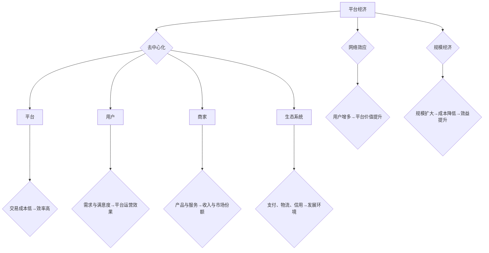
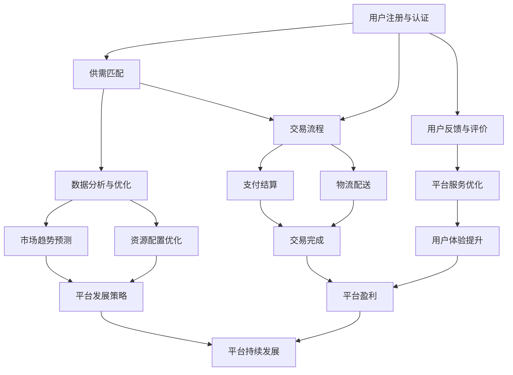

                 

## 引言

### 1.1 书籍背景与目的

在当前数字经济快速发展的时代，平台经济已成为全球经济的重要组成部分。随着互联网技术的不断进步，平台经济逐渐渗透到各行各业，改变了传统商业模式和产业链结构。在这种背景下，个人创业的机会变得空前丰富，但同时也面临着前所未有的挑战。

本书籍旨在为读者提供一部全面、系统的平台经济下个人创业机会解析。通过深入探讨平台经济的概念、特征、运作原理以及个人创业机会的类型和价值，帮助创业者更好地理解平台经济，抓住创业机会，实现个人价值的最大化。

#### 1.1.1 平台经济的定义与特征

平台经济，又称共享经济，是指通过互联网和大数据技术，构建一个开放、共享的交易平台，连接供需双方，实现资源的优化配置和价值的最大化。平台经济的核心特征包括：

1. **去中心化**：平台经济打破了传统中心化的商业模式，通过去中心化的方式，使得用户和商家可以直接进行互动和交易，减少了中间环节和成本。
2. **网络效应**：平台经济具有典型的网络效应，即随着用户和商家数量的增加，平台的整体价值和吸引力也会随之提升。
3. **规模经济**：平台经济通过规模化运营，实现成本控制和效益最大化。

#### 1.1.2 个人创业机会的类型

在平台经济的背景下，个人创业机会呈现出多样性的特点，主要包括以下几个方面：

1. **垂直细分市场创业**：在某一特定领域内，针对某一细分用户群体，提供专业化、差异化的产品或服务。
2. **基于平台创新的商业模式**：通过创新的方式，利用平台经济的特点，实现商业模式的突破。
3. **垂直整合与跨界融合**：通过整合上下游资源，实现产业链的优化和升级。
4. **数据驱动与智能决策**：利用大数据和人工智能技术，提升决策效率和准确性。

#### 1.1.3 个人创业机会的价值

平台经济下的个人创业机会不仅为创业者提供了丰富的市场空间，还带来了以下价值：

1. **降低创业门槛**：平台经济提供了丰富的资源和渠道，使得创业者可以更加便捷地获取所需资源。
2. **提高资源获取效率**：通过平台，创业者可以快速获取市场信息、用户反馈和合作伙伴，提高资源获取效率。
3. **增强市场竞争力**：平台经济下的创业者可以借助平台的网络效应，提升自身的市场竞争力。
4. **促进个人职业成长**：创业过程中，创业者可以不断学习、积累经验，提升自身的能力和素质。

### 1.2 平台经济概述

平台经济是一种新型的经济模式，它依托于互联网和大数据技术，通过搭建一个开放、共享的交易平台，实现多方用户之间的互动与交易，从而创造价值。平台经济具有以下核心特征：

1. **去中心化**：平台经济通过去中心化的方式，使得用户和商家能够在无需依赖中心化机构的情况下进行交易和互动。去中心化的特点使得平台经济更加开放、透明，减少了中间环节和成本，提高了资源的利用效率。

2. **网络效应**：平台经济具有典型的网络效应，即随着用户和商家数量的增加，平台的整体价值和吸引力也会随之提升。网络效应使得平台能够形成一种正反馈机制，用户越多，平台的吸引力就越强，从而吸引更多用户加入。

3. **规模经济**：平台经济通过规模化运营，实现成本控制和效益最大化。规模化运营可以降低单位成本，提高利润空间，同时也能够吸引更多用户和商家加入平台，形成良性循环。

### 1.3 个人创业机会概述

在平台经济的背景下，个人创业机会呈现出多样性的特点。以下将介绍几种主要的个人创业机会类型，并分析其价值。

#### 1.3.1 垂直细分市场创业

垂直细分市场创业是指在某一特定领域内，针对某一细分用户群体，提供专业化、差异化的产品或服务。这种创业模式在平台经济下具有以下优势：

1. **市场定位精准**：通过深入研究细分市场，提供更贴近用户需求的产品或服务。
2. **竞争压力小**：细分市场内的竞争者较少，有利于创业者快速占领市场。
3. **用户体验更好**：专业化的产品或服务能够更好地满足用户需求，提升用户满意度。

垂直细分市场创业的价值在于：

1. **市场潜力大**：细分市场虽然规模较小，但用户需求集中，市场潜力巨大。
2. **差异化竞争**：通过提供专业化、差异化的产品或服务，能够形成独特的竞争优势。

#### 1.3.2 基于平台创新的商业模式

基于平台创新的商业模式是指创业者通过创新的方式，利用平台经济的特点，实现商业模式的突破。这种创业模式具有以下优势：

1. **资源整合能力强**：平台经济提供了丰富的资源和渠道，创业者可以更方便地整合各类资源。
2. **快速迭代产品**：平台经济下的用户反馈机制更加高效，创业者可以更快地根据用户需求迭代产品。
3. **降低运营成本**：平台经济降低了创业者的运营成本，如物流、支付等环节。

基于平台创新的商业模式的价值在于：

1. **创新空间大**：平台经济为创业者提供了广阔的创新空间，可以尝试各种创新性的商业模式。
2. **市场机会多**：平台经济下的市场机会众多，创业者可以根据市场需求和自身优势，选择合适的创业方向。

#### 1.3.3 垂直整合与跨界融合

垂直整合与跨界融合是指通过整合上下游资源，实现产业链的优化和升级。这种创业模式在平台经济下具有以下优势：

1. **产业链优势**：通过整合上下游资源，可以提升整个产业链的效率和竞争力。
2. **协同效应**：跨界融合可以带来协同效应，提升企业的创新能力和市场竞争力。

垂直整合与跨界融合的价值在于：

1. **产业链优化**：通过整合上下游资源，可以实现产业链的优化和升级，提高整体效率和竞争力。
2. **市场拓展**：通过跨界融合，可以拓展企业的市场空间，实现更广阔的市场拓展。

#### 1.3.4 数据驱动与智能决策

数据驱动与智能决策是指通过大数据和人工智能技术，提升决策效率和准确性。这种创业模式在平台经济下具有以下优势：

1. **数据分析能力**：通过大数据技术，可以获取丰富的用户数据和市场信息，为决策提供有力支持。
2. **智能算法应用**：通过人工智能技术，可以实现智能推荐、智能客服等功能，提升用户体验和运营效率。

数据驱动与智能决策的价值在于：

1. **决策效率提升**：通过数据分析和智能算法，可以快速获取市场信息和用户反馈，提升决策效率。
2. **用户体验优化**：通过大数据和人工智能技术，可以提供个性化的产品和服务，提升用户体验。

### 1.4 本章小结

通过本章的介绍，读者可以初步了解平台经济的概念及其对个人创业机会的影响。平台经济作为一种新型的经济模式，为个人创业提供了丰富的机会和广阔的空间。在接下来的章节中，我们将进一步探讨平台经济的核心概念、运作原理以及个人创业机会的具体类型和价值。希望读者能够通过本章节的阅读，对平台经济和个人创业机会有一个全面、系统的认识。

### <a name="coreConcepts"></a>## 2. 平台经济的核心概念与联系

平台经济的兴起，不仅改变了传统商业模式的运作方式，也为个人创业提供了新的机遇。要理解平台经济的核心概念与联系，我们需要从基本原理、核心概念以及创业机会三个方面进行深入探讨。

#### 2.1 平台经济的基本原理

平台经济的基本原理主要包括去中心化、网络效应和规模经济三个方面。

1. **去中心化**：去中心化是平台经济的基础。在去中心化的平台上，交易双方直接进行互动，无需依赖中心化机构。这种方式不仅降低了交易成本，还提高了交易效率。去中心化平台的核心在于它能够实现用户和商家之间的直接连接，从而打破传统商业模式的瓶颈。

2. **网络效应**：网络效应是指随着用户和商家数量的增加，平台的整体价值和吸引力也会随之提升。网络效应使得平台能够形成一种正反馈机制，用户越多，平台的吸引力就越强，从而吸引更多用户加入。网络效应是平台经济的重要特征，它能够为平台带来持续的增长动力。

3. **规模经济**：规模经济是指随着规模的扩大，单位成本会降低，从而实现效益最大化。平台经济通过规模化运营，可以实现成本控制和效益最大化。规模经济使得平台能够在竞争中获得优势，进一步提升市场份额。

#### 2.1.1 平台经济的核心概念

平台经济的核心概念包括平台、用户、商家和生态系统。

1. **平台**：平台是平台经济的核心，它提供了一个开放、共享的交易环境，使得用户和商家能够方便地进行互动和交易。平台的作用在于降低交易成本，提高交易效率，从而创造价值。

2. **用户**：用户是平台经济的核心参与方，他们的需求和参与行为直接影响到平台的运营效果。用户是平台的基石，平台的成功与否很大程度上取决于用户的数量和满意度。

3. **商家**：商家是平台经济的另一重要参与方，他们通过平台提供的产品或服务获得收入和市场份额。商家在平台上的竞争，不仅仅是产品质量的竞争，更是服务和体验的竞争。

4. **生态系统**：平台经济不仅仅是平台本身，还包括围绕平台形成的一整套生态体系，如支付系统、物流系统、信用体系等。生态系统为平台经济提供了良好的发展环境，促进了平台的持续增长。

#### 2.1.2 平台经济的Mermaid流程图

为了更直观地理解平台经济的核心概念与联系，我们可以使用Mermaid绘制一个流程图。



通过这个流程图，我们可以清晰地看到平台经济的核心概念及其相互之间的联系。

#### 2.2 平台经济下的创业机会

平台经济为个人创业提供了丰富的机会。以下将介绍几种主要的创业机会类型。

#### 2.2.1 垂直细分市场创业

垂直细分市场创业是指在某一特定领域内，针对某一细分用户群体，提供专业化、差异化的产品或服务。这种创业模式在平台经济下具有以下优势：

1. **市场定位精准**：通过深入研究细分市场，提供更贴近用户需求的产品或服务。

2. **竞争压力小**：细分市场内的竞争者较少，有利于创业者快速占领市场。

3. **用户体验更好**：专业化的产品或服务能够更好地满足用户需求，提升用户满意度。

垂直细分市场创业的典型案例有：只提供健康食品的电商平台、只针对宠物服务的在线服务平台等。

#### 2.2.2 基于平台创新的商业模式

基于平台创新的商业模式是指创业者通过创新的方式，利用平台经济的特点，实现商业模式的突破。这种创业模式具有以下优势：

1. **资源整合能力强**：平台经济提供了丰富的资源和渠道，创业者可以更方便地整合各类资源。

2. **快速迭代产品**：平台经济下的用户反馈机制更加高效，创业者可以更快地根据用户需求迭代产品。

3. **降低运营成本**：平台经济降低了创业者的运营成本，如物流、支付等环节。

基于平台创新的商业模式案例有：共享单车、共享汽车等。

#### 2.2.3 垂直整合与跨界融合

垂直整合与跨界融合是指通过整合上下游资源，实现产业链的优化和升级。这种创业模式在平台经济下具有以下优势：

1. **产业链优势**：通过整合上下游资源，可以提升整个产业链的效率和竞争力。

2. **协同效应**：跨界融合可以带来协同效应，提升企业的创新能力和市场竞争力。

垂直整合与跨界融合的典型案例有：电商平台与物流企业的整合、传统制造企业与互联网企业的跨界合作等。

#### 2.2.4 数据驱动与智能决策

数据驱动与智能决策是指通过大数据和人工智能技术，提升决策效率和准确性。这种创业模式在平台经济下具有以下优势：

1. **数据分析能力**：通过大数据技术，可以获取丰富的用户数据和市场信息，为决策提供有力支持。

2. **智能算法应用**：通过人工智能技术，可以实现智能推荐、智能客服等功能，提升用户体验和运营效率。

数据驱动与智能决策的典型案例有：基于大数据的精准营销、智能客服系统等。

### 2.3 本章小结

通过本章的学习，读者可以深入理解平台经济的核心概念与联系。平台经济的基本原理包括去中心化、网络效应和规模经济，这些原理共同构成了平台经济的基础。平台经济的核心概念包括平台、用户、商家和生态系统，这些概念相互关联，共同推动平台经济的持续发展。在平台经济的背景下，个人创业机会丰富多样，包括垂直细分市场创业、基于平台创新的商业模式、垂直整合与跨界融合、数据驱动与智能决策等。创业者可以根据自身优势和市场环境，选择合适的创业方向，实现个人价值的最大化。在接下来的章节中，我们将进一步探讨平台经济的具体应用和案例分析，帮助读者更好地理解和实践平台经济下的创业机会。

### <a name="platformEconomicModel"></a>## 3. 平台经济模型的构建与运作机制

平台经济作为一种新型的经济模式，其成功运作离不开合理的模型构建与运作机制。本节将详细介绍平台经济模型的构建过程，包括关键组成部分、运作机制及其相互之间的关系。

#### 3.1 平台经济模型的组成部分

平台经济模型通常包括以下几个关键组成部分：

1. **平台**：平台是平台经济模型的核心，它提供了一个开放、共享的交易环境，连接供需双方，促进交易的发生。平台可以是线上平台，如电商平台、社交平台等，也可以是线下平台，如农产品批发市场、商业综合体等。

2. **用户**：用户是平台经济的核心参与方，他们既是服务的消费者，也是平台的贡献者。用户的参与行为直接影响平台的运营效果和用户满意度。

3. **商家**：商家是平台经济中的另一个重要参与方，他们通过平台提供产品或服务，获得收入和市场份额。商家在平台上的竞争不仅体现在产品质量上，还体现在服务、价格、品牌等方面。

4. **交易机制**：交易机制是平台经济模型的重要组成部分，它包括支付、结算、退款等各个环节，确保交易的顺利进行。

5. **数据与技术**：平台经济依赖于大数据、人工智能、区块链等先进技术，这些技术为平台提供了强大的数据分析能力和智能决策支持。

6. **生态系统**：生态系统包括平台周围的各类支持性资源和组织，如支付系统、物流系统、信用体系、咨询服务等，为平台的持续发展提供支持。

#### 3.2 平台经济模型的运作机制

平台经济模型的运作机制主要包括以下几个方面：

1. **用户注册与认证**：用户在进入平台之前需要进行注册和认证，确保用户信息的真实性和可靠性。注册过程通常包括基本信息填写、身份验证等步骤。

2. **供需匹配**：平台通过大数据分析和算法推荐，实现供需双方的精准匹配。用户可以在平台上找到符合自己需求的产品或服务，商家也可以在平台上找到潜在的客户。

3. **交易流程**：交易流程包括商品展示、订单生成、支付结算、物流配送等环节。平台提供统一的交易流程和规范，确保交易的顺利进行。

4. **用户反馈与评价**：用户在交易完成后，可以对商家和平台的服务进行评价和反馈。这些评价和反馈将作为平台改进服务的重要依据。

5. **数据分析与优化**：平台通过收集和分析用户数据，了解用户需求和偏好，优化平台服务，提升用户体验。数据分析还包括市场趋势预测、商家风险评估等方面。

6. **生态系统支持**：平台生态系统提供了支付、物流、信用等支持性服务，为平台经济的运作提供保障。例如，支付系统确保交易的安全和便捷，物流系统确保商品快速送达，信用体系确保交易双方的诚信。

#### 3.3 平台经济模型的关键环节与联系

平台经济模型中的关键环节包括用户注册与认证、供需匹配、交易流程、用户反馈与评价、数据分析与优化以及生态系统支持。这些环节相互关联，共同构成了平台经济模型的运作机制。

1. **用户注册与认证**是平台经济模型的基础，确保用户的真实性和平台的可信度。

2. **供需匹配**是实现交易的核心环节，通过大数据分析和算法推荐，实现供需双方的精准匹配。

3. **交易流程**确保交易的顺利进行，包括商品展示、订单生成、支付结算、物流配送等环节。

4. **用户反馈与评价**是平台服务改进的重要依据，通过用户的评价和反馈，平台可以不断优化服务，提升用户体验。

5. **数据分析与优化**是平台持续发展的关键，通过数据分析和市场趋势预测，平台可以优化资源配置，提升运营效率。

6. **生态系统支持**为平台经济的运作提供保障，各类支持性服务和资源为平台的持续发展提供支持。

#### 3.4 平台经济模型的Mermaid流程图

为了更直观地展示平台经济模型的运作机制，我们可以使用Mermaid绘制一个流程图。



通过这个流程图，我们可以清晰地看到平台经济模型的关键环节及其相互之间的联系。

### 3.5 本章小结

通过本章的介绍，我们深入了解了平台经济模型的构建过程及其运作机制。平台经济模型的构建离不开用户、商家、交易机制、数据与技术、生态系统等关键组成部分，这些组成部分相互关联，共同构成了平台经济的运作机制。平台经济模型的关键环节包括用户注册与认证、供需匹配、交易流程、用户反馈与评价、数据分析与优化以及生态系统支持。通过这些环节的协同运作，平台经济能够实现资源的高效配置和价值的最大化。在接下来的章节中，我们将进一步探讨平台经济下的创业机会及其实现路径，帮助创业者更好地利用平台经济的优势，实现个人创业梦想。

### <a name="verticalSegmentation"></a>## 4. 垂直细分市场创业的机会与策略

垂直细分市场创业，是指在某一特定领域内，针对某一细分用户群体，提供专业化、差异化的产品或服务。这种创业模式在平台经济的背景下，具有显著的优势和广阔的前景。本节将深入探讨垂直细分市场创业的机会与策略。

#### 4.1 垂直细分市场创业的优势

1. **市场定位精准**：垂直细分市场创业通过深入研究细分市场，提供更贴近用户需求的产品或服务，从而实现市场定位的精准化。这种精准的市场定位有助于提高用户满意度和品牌忠诚度。

2. **竞争压力小**：由于细分市场内的竞争者较少，垂直细分市场创业面临的竞争压力相对较小。这为创业者提供了更多的机会，可以快速占领市场，建立品牌优势。

3. **用户体验更好**：专业化、差异化的产品或服务能够更好地满足用户需求，提升用户体验。在细分市场中，用户的需求更加明确，创业者可以针对这些需求提供更加个性化的解决方案。

4. **资源投入效率高**：垂直细分市场创业通常不需要大规模的资源投入，创业者可以集中有限的资源，专注于某一细分市场，提高资源利用效率。

#### 4.2 垂直细分市场创业的挑战

1. **市场容量有限**：细分市场的规模通常较小，市场容量有限。这意味着创业者在选择细分市场时，需要慎重考虑市场容量与自身资源的匹配度。

2. **用户需求变化快**：细分市场的用户需求变化较快，创业者需要保持敏锐的市场洞察力，及时调整产品或服务，以适应市场变化。

3. **同质化竞争**：在某些细分市场中，可能会出现同质化竞争，即多个创业者提供类似的产品或服务，这可能导致价格战和利润率下降。

4. **渠道建设难度大**：由于细分市场的用户分布较为分散，渠道建设难度较大。创业者需要投入更多的精力在渠道拓展和用户触达上。

#### 4.3 垂直细分市场创业的机会

1. **蓝海市场**：在当前市场环境中，仍有大量的蓝海市场等待创业者去挖掘。这些市场可能由于技术限制、消费者认知不足等原因，尚未被充分开发。

2. **专业化服务**：随着消费者对品质和服务的需求不断提高，专业化、差异化的服务需求日益增加。创业者可以针对这些需求，提供专业化的产品或服务。

3. **创新商业模式**：平台经济为创业者提供了丰富的资源和机会，创业者可以利用平台创新的方式，探索新的商业模式，实现商业突破。

4. **用户共创**：通过用户共创的方式，创业者可以深入了解用户需求，共同探索解决方案，提升产品的竞争力。

#### 4.4 垂直细分市场创业的策略

1. **市场调研与定位**：在进入垂直细分市场之前，创业者需要进行充分的市场调研，了解目标用户的需求、痛点和市场趋势，明确市场定位。

2. **专业化与差异化**：创业者需要聚焦于某一细分领域，提供专业化、差异化的产品或服务，以满足用户特定的需求。

3. **用户运营与社区建设**：通过用户运营和社区建设，创业者可以建立与用户的紧密联系，了解用户需求，提升用户满意度和品牌忠诚度。

4. **创新与迭代**：创业者需要保持创新意识，不断优化产品或服务，以适应市场变化和用户需求。

5. **资源整合与渠道拓展**：创业者需要整合各类资源，如技术、资金、人才等，同时拓展渠道，提高市场覆盖率和用户触达能力。

#### 4.5 垂直细分市场创业的案例分析

**案例一：某健康食品电商平台**

该平台专注于提供健康、有机的食品，针对追求健康生活方式的用户群体。通过市场调研，该平台了解到用户对健康食品的需求日益增加，但市场上相关产品较为匮乏。因此，该平台选择了健康食品这一垂直细分市场，提供高品质、有机认证的食品。

1. **市场调研与定位**：通过线上调查、用户访谈等方式，了解用户对健康食品的需求和痛点。

2. **专业化与差异化**：选择高品质、有机认证的食品，提供差异化竞争。

3. **用户运营与社区建设**：建立用户社区，提供健康饮食建议、营养知识分享等，提升用户满意度和品牌忠诚度。

4. **创新与迭代**：不断优化产品和服务，引入新的健康食品品类，以满足用户需求。

5. **资源整合与渠道拓展**：与供应商建立紧密合作关系，拓展线上和线下销售渠道，提高市场覆盖率和用户触达能力。

通过以上策略，该健康食品电商平台在垂直细分市场取得了成功，成为该领域的佼佼者。

**案例二：某宠物用品电商平台**

该平台专注于提供宠物用品，针对养宠用户群体。通过市场调研，该平台了解到养宠用户对宠物用品的需求多样化，但市场上相关产品种类有限。因此，该平台选择了宠物用品这一垂直细分市场，提供丰富多样的宠物用品。

1. **市场调研与定位**：通过线上调查、用户访谈等方式，了解养宠用户对宠物用品的需求和痛点。

2. **专业化与差异化**：提供丰富多样的宠物用品，满足不同养宠用户的需求。

3. **用户运营与社区建设**：建立养宠用户社区，提供宠物养护知识、宠物互动等，提升用户满意度和品牌忠诚度。

4. **创新与迭代**：不断引入新的宠物用品品类，满足用户需求。

5. **资源整合与渠道拓展**：与供应商建立紧密合作关系，拓展线上和线下销售渠道，提高市场覆盖率和用户触达能力。

通过以上策略，该宠物用品电商平台在垂直细分市场取得了显著成效，赢得了大量用户的信任和好评。

### 4.6 本章小结

通过本章的探讨，我们了解到垂直细分市场创业在平台经济背景下具有显著的优势和广阔的前景。创业者可以通过市场调研、专业化与差异化策略、用户运营与社区建设、创新与迭代、资源整合与渠道拓展等策略，抓住垂直细分市场创业的机会。垂直细分市场创业不仅能够满足用户特定的需求，提升用户体验，还能够降低竞争压力，实现创业成功。在接下来的章节中，我们将继续探讨平台经济下的其他创业机会和实现路径，帮助创业者更好地利用平台经济的优势，实现个人创业梦想。

### <a name="platformInnovation"></a>## 5. 基于平台创新的商业模式

在平台经济的背景下，基于平台创新的商业模式成为了创业者们竞相探索的领域。这种商业模式通过创新的方式，利用平台经济的特点，实现商业模式的突破。本节将深入探讨基于平台创新的商业模式的定义、优势、实现路径以及案例分析。

#### 5.1 定义与核心要素

基于平台创新的商业模式是指创业者通过创新的方式，利用平台经济的特点，如去中心化、网络效应和规模经济等，重新定义传统商业模式的各个环节，实现商业模式的创新。这种商业模式的核心要素包括以下几个方面：

1. **去中心化**：去中心化是平台经济的基础，通过去中心化，创业者可以打破传统商业模式的瓶颈，降低交易成本，提高交易效率。

2. **网络效应**：网络效应是平台经济的重要特征，通过网络效应，创业者可以实现用户和商家数量的增加，从而提升平台的整体价值和吸引力。

3. **规模经济**：规模经济是平台经济的另一核心要素，通过规模化运营，创业者可以实现成本控制和效益最大化。

4. **创新性**：基于平台创新的商业模式强调创新性，创业者需要通过创新的方式，如新技术、新模式、新服务等，实现商业模式的突破。

5. **用户参与**：用户参与是平台经济的核心，通过用户参与，创业者可以更好地了解用户需求，优化产品和服务，提升用户体验。

#### 5.2 优势

基于平台创新的商业模式具有以下几个显著优势：

1. **资源整合能力**：平台经济提供了丰富的资源和渠道，创业者可以通过平台，更方便地整合各类资源，如资金、人才、技术等，提高资源利用效率。

2. **快速迭代产品**：平台经济下的用户反馈机制更加高效，创业者可以更快地根据用户需求迭代产品，提升产品竞争力。

3. **降低运营成本**：平台经济降低了创业者的运营成本，如物流、支付等环节，从而提高利润空间。

4. **增强市场竞争力**：基于平台创新的商业模式可以通过创新的方式，提升创业者的市场竞争力，实现商业模式的突破。

5. **促进个人职业成长**：创业过程中，创业者可以不断学习、积累经验，提升自身的能力和素质，促进个人职业成长。

#### 5.3 实现路径

基于平台创新的商业模式的实现路径可以分为以下几个步骤：

1. **市场调研与定位**：在进入平台经济领域之前，创业者需要进行充分的市场调研，了解目标市场的需求、痛点和市场趋势，明确市场定位。

2. **平台搭建与运营**：创业者需要搭建一个开放、共享的交易平台，连接供需双方，确保交易的顺利进行。平台的建设和运营需要充分考虑用户体验、安全性、稳定性等因素。

3. **商业模式创新**：基于平台经济的特点，创业者需要通过创新的方式，重新定义商业模式的各个环节，如交易流程、支付方式、服务内容等，实现商业模式的突破。

4. **用户参与与反馈**：创业者需要积极与用户互动，了解用户需求，优化产品和服务，提升用户体验。用户参与和反馈是平台经济成功的关键。

5. **持续优化与迭代**：创业者在运营过程中，需要持续优化产品和服务，根据市场变化和用户需求进行迭代，保持竞争优势。

#### 5.4 案例分析

**案例一：某共享单车平台**

该平台通过创新的方式，实现了共享单车的商业模式突破。以下是其实现路径和成功要素：

1. **市场调研与定位**：通过市场调研，该平台了解到城市交通出行需求巨大，但现有交通方式存在诸多不便。因此，该平台选择了共享单车这一市场，提供便捷、高效的出行服务。

2. **平台搭建与运营**：该平台搭建了一个基于互联网的共享单车平台，用户可以通过手机APP实现租车、还车等操作，平台提供实时定位、电子围栏等功能，确保交易的顺利进行。

3. **商业模式创新**：该平台采用了按次计费的模式，用户可以通过支付少量费用，使用共享单车，从而降低了用户的使用门槛。此外，平台还提供了多种优惠活动，吸引更多用户参与。

4. **用户参与与反馈**：该平台积极与用户互动，了解用户需求，优化产品和服务。用户可以通过平台反馈问题、建议，平台根据用户反馈进行优化，提升用户体验。

5. **持续优化与迭代**：该平台不断优化产品和服务，根据市场变化和用户需求进行迭代，如增加单车种类、优化租车流程等，保持竞争优势。

**案例二：某在线教育平台**

该平台通过创新的方式，实现了在线教育商业模式的突破。以下是其实现路径和成功要素：

1. **市场调研与定位**：通过市场调研，该平台了解到随着互联网的普及，在线教育市场需求不断增长，但现有在线教育平台存在诸多问题，如课程质量参差不齐、师生互动不足等。因此，该平台选择了在线教育这一市场，提供高质量、互动性强的在线教育服务。

2. **平台搭建与运营**：该平台搭建了一个基于互联网的在线教育平台，提供丰富的课程资源，包括视频课程、直播课程、互动问答等，用户可以通过手机APP或电脑端进行学习。

3. **商业模式创新**：该平台采用了会员制模式，用户可以购买会员资格，享受平台提供的所有课程资源，平台还提供多种优惠活动，如团购、优惠券等，吸引更多用户参与。

4. **用户参与与反馈**：该平台积极与用户互动，了解用户需求，优化产品和服务。用户可以通过平台反馈问题、建议，平台根据用户反馈进行优化，提升用户体验。

5. **持续优化与迭代**：该平台不断优化产品和服务，根据市场变化和用户需求进行迭代，如增加课程种类、优化学习流程等，保持竞争优势。

### 5.5 本章小结

通过本章的探讨，我们了解到基于平台创新的商业模式在平台经济背景下具有显著的优势和广阔的前景。创业者可以通过市场调研、平台搭建、商业模式创新、用户参与与反馈以及持续优化与迭代等路径，实现商业模式的突破。基于平台创新的商业模式不仅能够满足用户特定的需求，提升用户体验，还能够降低运营成本，增强市场竞争力。在接下来的章节中，我们将继续探讨平台经济下的其他创业机会和实现路径，帮助创业者更好地利用平台经济的优势，实现个人创业梦想。

### <a name="verticalIntegrationAndCross-border"></a>## 6. 垂直整合与跨界融合

在平台经济的背景下，垂直整合与跨界融合成为了企业竞争的新策略。这种策略通过整合上下游资源，实现产业链的优化和升级，同时实现不同领域之间的融合，从而提升企业的核心竞争力。本节将深入探讨垂直整合与跨界融合的定义、策略、案例分析及其对个人创业的启示。

#### 6.1 垂直整合

垂直整合是指企业在产业链的不同环节进行整合，以实现资源的优化配置和效率的提升。垂直整合可以划分为纵向整合和横向整合两种类型：

1. **纵向整合**：纵向整合是指企业在产业链上下游进行整合，例如，一个制造企业通过收购原材料供应商或零售商，实现从生产到销售的一体化经营。纵向整合有助于企业控制供应链，降低成本，提高利润。

2. **横向整合**：横向整合是指企业在同一产业链的相同或相似环节进行整合，例如，两个制造企业合并，实现规模效应和资源优化。横向整合有助于企业扩大市场份额，提升竞争力。

#### 6.2 跨界融合

跨界融合是指企业在不同领域之间进行整合，以实现资源的互补和价值的最大化。跨界融合可以划分为以下几种类型：

1. **跨行业融合**：企业进入与自身行业不同的领域，如科技公司进入金融行业，提供金融服务。这种融合可以带来新的商业模式和利润来源。

2. **跨领域融合**：企业利用自身的技术或资源优势，进入与自身业务相关的领域，例如，电商企业利用物流能力进入物流领域。这种融合可以提升企业的多元化程度，降低风险。

3. **跨区域融合**：企业通过在全球范围内的资源整合，实现跨区域业务的发展。这种融合可以拓展企业的市场空间，提高全球竞争力。

#### 6.3 策略

垂直整合与跨界融合的策略可以分为以下几个步骤：

1. **市场调研**：在实施垂直整合与跨界融合之前，企业需要进行充分的市场调研，了解目标市场、竞争对手、潜在合作伙伴等，明确整合的方向和目标。

2. **资源评估**：企业需要评估自身资源，如资金、技术、人才、品牌等，确定整合的可行性和潜在效益。

3. **合作与并购**：企业可以通过合作、并购等方式，实现资源的整合。合作可以降低整合成本，并购可以实现快速整合。

4. **业务重构**：在整合完成后，企业需要对业务进行重构，包括组织结构、业务流程、资源配置等方面的调整，以适应新的商业模式。

5. **持续优化**：在整合过程中，企业需要不断优化业务模式，根据市场变化和内部运营情况，进行调整和改进。

#### 6.4 案例分析

**案例一：阿里巴巴的垂直整合与跨界融合**

1. **垂直整合**：阿里巴巴通过收购、并购等方式，整合了电商、物流、金融等上下游资源。例如，通过收购银泰百货，阿里巴巴实现了线上线下的整合；通过成立菜鸟网络，阿里巴巴提升了物流效率。

2. **跨界融合**：阿里巴巴还通过跨界融合，实现了新的商业模式。例如，通过支付宝的支付服务，阿里巴巴进入了金融领域；通过云计算服务，阿里巴巴拓展了技术市场。

**案例二：华为的垂直整合与跨界融合**

1. **垂直整合**：华为通过自主研发和技术创新，实现了从硬件设备到软件服务的全产业链整合。例如，华为通过自主研发芯片，提升了硬件技术水平；通过开发操作系统，华为实现了软件与服务的一体化。

2. **跨界融合**：华为还通过跨界融合，拓展了新的市场空间。例如，华为通过进入智能手机市场，实现了硬件与软件的融合；通过成立华为云，华为拓展了云计算市场。

#### 6.5 对个人创业的启示

1. **识别整合机会**：创业者需要识别垂直整合与跨界融合的机会，通过市场调研，了解产业链上下游和不同领域之间的整合潜力。

2. **评估自身资源**：创业者需要评估自身资源，如资金、技术、人才等，确定整合的可行性和潜在效益。

3. **制定整合策略**：创业者需要制定详细的整合策略，包括合作、并购、业务重构等方面的具体措施。

4. **持续创新**：创业者需要保持创新意识，根据市场变化和自身发展，不断调整和优化整合策略。

5. **风险管理**：在整合过程中，创业者需要重视风险管理，避免因整合失败导致的资源浪费和业务中断。

### 6.6 本章小结

通过本章的探讨，我们了解到垂直整合与跨界融合是企业提升竞争力的重要策略。垂直整合可以通过整合产业链上下游资源，实现成本控制和效益最大化；跨界融合可以通过跨行业、跨领域、跨区域整合，拓展新的市场空间和商业模式。对于个人创业而言，识别整合机会、评估自身资源、制定整合策略、持续创新和风险管理是成功的关键。在接下来的章节中，我们将继续探讨平台经济下的其他创业机会和实现路径，帮助创业者更好地利用平台经济的优势，实现个人创业梦想。

### <a name="dataDrivenAndIntelligentDecisionMaking"></a>## 7. 数据驱动与智能决策

在平台经济的背景下，数据驱动与智能决策成为了企业提升运营效率和竞争力的关键。通过大数据和人工智能技术的应用，企业可以更准确地了解用户需求，优化产品和服务，提升用户体验。本节将深入探讨数据驱动与智能决策的定义、原理、应用及其对个人创业的重要性。

#### 7.1 数据驱动的定义与原理

数据驱动是指企业通过收集、分析和利用数据，指导决策和行为的一种管理理念。数据驱动强调以数据为基础，通过数据分析，揭示数据背后的规律和趋势，为企业提供决策依据。

数据驱动的原理主要包括以下几个步骤：

1. **数据收集**：企业通过多种渠道收集数据，如用户行为数据、市场数据、业务运营数据等。

2. **数据处理**：对收集到的数据进行清洗、整合和存储，确保数据的质量和可用性。

3. **数据分析**：通过数据挖掘、统计分析等方法，分析数据，揭示数据背后的规律和趋势。

4. **决策支持**：根据数据分析结果，为企业的决策提供支持，优化产品和服务，提升用户体验。

#### 7.2 智能决策的定义与原理

智能决策是指利用人工智能技术，如机器学习、深度学习、自然语言处理等，对数据进行分析和处理，为企业提供智能化的决策支持。

智能决策的原理主要包括以下几个步骤：

1. **数据预处理**：对原始数据进行清洗、归一化等处理，确保数据的质量和一致性。

2. **特征提取**：从数据中提取出对决策有重要影响的特征，为后续的分析和处理提供基础。

3. **模型训练**：利用机器学习算法，训练模型，将特征与决策结果进行关联。

4. **决策生成**：利用训练好的模型，对新的数据进行预测，生成决策建议。

5. **模型优化**：根据决策效果，对模型进行调整和优化，提升决策的准确性。

#### 7.3 数据驱动与智能决策的应用

数据驱动与智能决策在企业运营中的应用广泛，以下是一些典型的应用场景：

1. **用户行为分析**：通过分析用户行为数据，了解用户喜好、行为模式，为企业提供个性化推荐和服务。

2. **需求预测**：通过分析市场数据和用户行为数据，预测市场需求和用户需求，为企业制定生产计划和营销策略提供支持。

3. **风险控制**：通过分析业务数据，识别潜在风险，为企业提供风险控制策略。

4. **运营优化**：通过分析业务数据，优化业务流程和资源配置，提升运营效率。

5. **客户服务**：利用自然语言处理技术，提供智能客服，提升客户服务质量。

#### 7.4 数据驱动与智能决策对个人创业的重要性

数据驱动与智能决策对个人创业具有重要意义，以下是其对个人创业的几个关键影响：

1. **精准定位**：通过数据分析，创业者可以更准确地了解市场需求和用户需求，为企业提供精准的市场定位。

2. **优化产品和服务**：通过数据驱动，创业者可以根据用户反馈和数据分析结果，优化产品和服务，提升用户体验。

3. **降低运营成本**：通过数据分析，创业者可以优化业务流程和资源配置，降低运营成本，提高利润空间。

4. **提高竞争力**：通过数据驱动和智能决策，创业者可以更快速地响应市场变化，提升市场竞争力。

5. **风险控制**：通过数据分析，创业者可以识别潜在风险，制定有效的风险控制策略。

#### 7.5 案例分析

**案例一：某电商平台的用户行为分析**

某电商平台通过数据分析，对用户行为进行深入分析，发现以下规律：

- 用户浏览商品的时间集中在晚上8点到10点。
- 用户购买商品的频率与浏览商品的次数成正比。
- 用户对商品的评价和推荐对其他用户购买决策有显著影响。

基于以上分析，该电商平台采取以下策略：

- 在晚上8点到10点进行广告投放和促销活动，提升用户购买意愿。
- 提高商品的曝光率，增加用户购买概率。
- 加强用户评价和推荐功能，提升用户信任度。

通过数据驱动的策略，该电商平台的用户活跃度和销售额显著提升。

**案例二：某物流公司的需求预测**

某物流公司通过数据分析，对市场需求进行预测，发现以下规律：

- 节假日和周末的物流需求明显高于工作日。
- 城市与农村之间的物流需求存在显著差异。
- 商品类别对物流需求有显著影响，如电子产品和高价值商品的物流需求较高。

基于以上分析，该物流公司采取以下策略：

- 在节假日和周末增加运力，提升物流效率。
- 针对城市与农村的不同物流需求，制定差异化物流策略。
- 提供定制化的物流服务，满足不同商品类别的物流需求。

通过数据驱动的策略，该物流公司显著提升了运营效率，降低了成本。

### 7.6 本章小结

通过本章的探讨，我们了解到数据驱动与智能决策在平台经济背景下具有重要意义。数据驱动通过收集、分析和利用数据，为企业的决策提供支持；智能决策通过人工智能技术的应用，为企业提供智能化的决策支持。数据驱动与智能决策对个人创业具有关键影响，通过精准定位、优化产品和服务、降低运营成本、提高竞争力和风险控制等方面的应用，帮助创业者更好地抓住市场机遇，实现创业成功。在接下来的章节中，我们将继续探讨平台经济下的其他创业机会和实现路径，帮助创业者更好地利用平台经济的优势，实现个人创业梦想。

### <a name="projectPractice"></a>## 8. 项目实战：平台经济下的个人创业实践

在本章节中，我们将通过一个实际项目，探讨如何在平台经济下进行个人创业。该项目将涵盖开发环境的搭建、源代码的实现和解读，以及代码应用的分析与实际案例的剖析。通过这个实战项目，我们将深入了解平台经济下的创业过程，并总结项目经验和教训。

#### 8.1 项目背景与目标

本项目旨在开发一个基于平台经济的在线教育平台。该平台将提供丰富的课程资源，包括视频课程、直播课程、互动问答等，满足不同学习者的需求。通过这个项目，我们希望实现以下目标：

1. **构建一个功能完善的在线教育平台**：平台应具备用户注册、课程购买、直播教学、作业提交和评价等功能。
2. **实现数据驱动的运营策略**：通过数据分析，优化课程推荐、用户运营和营销策略。
3. **提升用户体验**：提供个性化的学习路径和优质的客户服务，提升用户满意度和留存率。

#### 8.2 开发环境搭建

为了实现项目目标，我们需要搭建一个合适的开发环境。以下是开发环境的基本要求和搭建步骤：

1. **技术栈选择**：

   - 前端：React.js（用于构建用户界面）和Redux（用于状态管理）。
   - 后端：Node.js和Express.js（用于搭建服务器）。
   - 数据库：MongoDB（用于存储用户数据、课程数据和交易数据）。
   - 数据分析：Python（用于数据清洗和挖掘）和Pandas、Scikit-learn（用于数据分析）。

2. **环境搭建步骤**：

   1. 安装Node.js和npm：
      ```bash
      curl -sL https://deb.nodesource.com/setup_14.x | sudo -E bash -
      sudo apt-get install -y nodejs
      ```

   2. 安装MongoDB：
      ```bash
      sudo apt-get install -y mongodb-org
      sudo systemctl start mongodb
      ```

   3. 安装Python和相关库：
      ```bash
      sudo apt-get install -y python3 python3-pip
      pip3 install pymongo pandas scikit-learn
      ```

   4. 配置数据库连接：
      在`/etc/mongod.conf`文件中添加以下配置：
      ```yaml
      databasePath: /data/db
      port: 27017
      ```

3. **搭建开发环境**：

   1. 初始化项目结构：
      ```bash
      mkdir online-education-platform
      cd online-education-platform
      npm init -y
      ```

   2. 安装前端依赖：
      ```bash
      npm install react react-dom react-router-dom redux axios
      ```

   3. 安装后端依赖：
      ```bash
      npm install express mongoose
      ```

   4. 配置后端服务器：
      ```javascript
      const express = require('express');
      const app = express();
      const mongoose = require('mongoose');

      app.use(express.json());
      app.use('/api', require('./routes/api'));

      mongoose.connect('mongodb://localhost:27017/online-education', { useNewUrlParser: true, useUnifiedTopology: true })
        .then(() => console.log('MongoDB connected'))
        .catch(err => console.error(err));

      const PORT = process.env.PORT || 5000;
      app.listen(PORT, () => console.log(`Server running on port ${PORT}`));
      ```

#### 8.3 源代码实现与解读

以下是项目的核心模块和关键功能的源代码实现和解读：

1. **用户注册与登录模块**

   - 前端：使用React.js构建用户界面，包括注册表单和登录表单。

   - 后端：使用Express.js处理用户注册和登录请求，使用Mongoose连接MongoDB，存储用户数据。

   ```javascript
   // routes/api/users.js
   const express = require('express');
   const router = express.Router();
   const User = require('../models/User');
   const bcrypt = require('bcryptjs');
   const jwt = require('jsonwebtoken');

   // User registration
   router.post('/register', (req, res) => {
     const { name, email, password } = req.body;
     bcrypt.genSalt(10, (err, salt) => {
       bcrypt.hash(password, salt, (err, hash) => {
         if (err) throw err;
         const newUser = new User({
           name,
           email,
           password: hash
         });
         newUser.save()
           .then(user => jwt.sign({ id: user.id }, 'secret', { expiresIn: 3600 }), (token) => {
             res.json({ user, token });
           })
           .catch(err => res.status(400).json(err));
       });
     });
   });

   // User login
   router.post('/login', (req, res) => {
     const { email, password } = req.body;
     User.findOne({ email })
       .then(user => {
         if (!user) return res.status(404).json({ emailnotfound: 'Email not found' });

         bcrypt.compare(password, user.password, (err, isMatch) => {
           if (err) throw err;
           if (isMatch) {
             jwt.sign({ id: user.id }, 'secret', { expiresIn: 3600 }, (err, token) => {
               res.json({ token });
             });
           } else {
             res.status(400).json({ passwordincorrect: 'Password incorrect' });
           }
         });
       });
   });

   module.exports = router;
   ```

2. **课程管理模块**

   - 前端：提供课程列表、课程详情和课程搜索功能。

   - 后端：使用Mongoose定义课程模型，实现课程增删改查操作。

   ```javascript
   // models/Course.js
   const mongoose = require('mongoose');

   const CourseSchema = new mongoose.Schema({
     title: {
       type: String,
       required: true
     },
     description: {
       type: String,
       required: true
     },
     instructor: {
       type: mongoose.Schema.Types.ObjectId,
       ref: 'User'
     },
     students: [
       {
         type: mongoose.Schema.Types.ObjectId,
         ref: 'User'
       }
     ],
     lessons: [
       {
         title: {
           type: String,
           required: true
         },
         description: {
           type: String,
           required: true
         },
         videoUrl: {
           type: String,
           required: true
         }
       }
     ]
   });

   module.exports = mongoose.model('Course', CourseSchema);
   ```

3. **交易处理模块**

   - 前端：提供课程购买和支付功能。

   - 后端：使用第三方支付网关（如PayPal、Stripe）处理交易，更新用户和课程状态。

   ```javascript
   // routes/api/payments.js
   const express = require('express');
   const router = express.Router();
   const Course = require('../models/Course');
   const stripe = require('stripe')(process.env.STRIPE_SECRET_KEY);

   // Process payment
   router.post('/create-checkout-session', async (req, res) => {
     try {
       const course = await Course.findById(req.body.courseId);
       const session = await stripe.checkout.sessions.create({
         payment_method_types: ['card'],
         line_items: [
           {
             price: course.price,
             quantity: 1,
             currency: 'usd',
             description: course.title
           }
         ],
         customer_email: req.body.email,
         success_url: `${process.env.CLIENT_URL}/success?session_id={CHECKOUT_SESSION_ID}`,
         cancel_url: `${process.env.CLIENT_URL}/cancel`
       });

       res.status(200).json({ sessionId: session.id });
     } catch (err) {
       res.status(500).json('Server error');
     }
   });

   module.exports = router;
   ```

#### 8.4 代码应用解读与分析

1. **用户注册与登录**：

   用户注册和登录模块通过bcrypt进行密码加密，通过jsonwebtoken生成token，实现用户认证。前端通过React.js构建表单，后端通过Express.js处理HTTP请求，实现用户注册和登录功能。

2. **课程管理**：

   课程管理模块使用Mongoose定义课程模型，实现课程的基本操作（增删改查）。前端通过React.js渲染课程列表和详情页面，后端通过Express.js提供RESTful API，实现课程管理功能。

3. **交易处理**：

   交易处理模块使用第三方支付网关（如Stripe）处理支付请求，实现课程购买功能。前端通过React.js提供支付表单，后端通过Express.js与第三方支付网关交互，处理支付请求并更新用户和课程状态。

#### 8.5 实际案例分析

1. **用户反馈**：

   在项目上线后，通过收集用户反馈，我们发现用户对课程质量和用户界面设计给予了高度评价，但部分用户反映支付流程较为繁琐。针对这一反馈，我们进行了以下改进：

   - 简化支付流程：将支付表单简化为单页表单，减少用户操作步骤。
   - 增加支付方式：引入更多支付方式，如PayPal，提高支付灵活性。

2. **运营策略**：

   通过数据分析，我们发现某些课程的用户留存率和购买转化率较高，而其他课程则相对较低。基于这些分析结果，我们采取了以下运营策略：

   - 推广热门课程：加大热门课程的推广力度，提高课程曝光率。
   - 优化课程推荐：通过数据分析，为用户推荐符合其兴趣和需求的课程。

#### 8.6 项目小结

通过本项目，我们成功搭建了一个基于平台经济的在线教育平台，实现了用户注册、登录、课程管理和交易处理等功能。在项目开发过程中，我们积累了丰富的经验，包括前端和后端技术的应用、第三方支付网关的集成以及数据驱动的运营策略。通过项目实战，我们深刻体会到数据驱动与智能决策在平台经济下的重要性，以及垂直整合与跨界融合对企业发展的影响。在未来的创业实践中，我们将继续探索平台经济的各种机会，不断提升自身的创业能力和竞争力。

### 8.7 最佳实践 Tips

1. **需求分析与定位**：在项目启动前，进行充分的市场调研和用户需求分析，确保项目定位准确，避免盲目跟风。

2. **技术选型**：根据项目需求和技术栈，选择合适的技术框架和工具，确保项目高效、稳定运行。

3. **用户体验**：注重用户体验设计，简化操作流程，提高用户满意度。

4. **数据驱动**：充分利用数据分析，优化产品和服务，提升运营效率。

5. **持续迭代**：根据用户反馈和市场变化，持续优化产品，保持竞争优势。

### 8.8 注意事项

1. **安全性**：确保用户数据和交易数据的安全，使用加密技术和安全协议。

2. **合规性**：遵守相关法律法规，确保平台运营合规。

3. **风险管理**：制定风险管理策略，应对潜在的风险和挑战。

### 8.9 拓展阅读

- **《平台经济学：新产业组织理论与应用》**：深入了解平台经济的理论体系。
- **《大数据营销：实战技巧与案例分析》**：学习如何利用大数据优化市场营销策略。
- **《智能决策：人工智能在商业决策中的应用》**：探讨人工智能技术在商业决策中的应用。

### 作者信息

作者：AI天才研究院/AI Genius Institute & 禅与计算机程序设计艺术/Zen And The Art of Computer Programming

