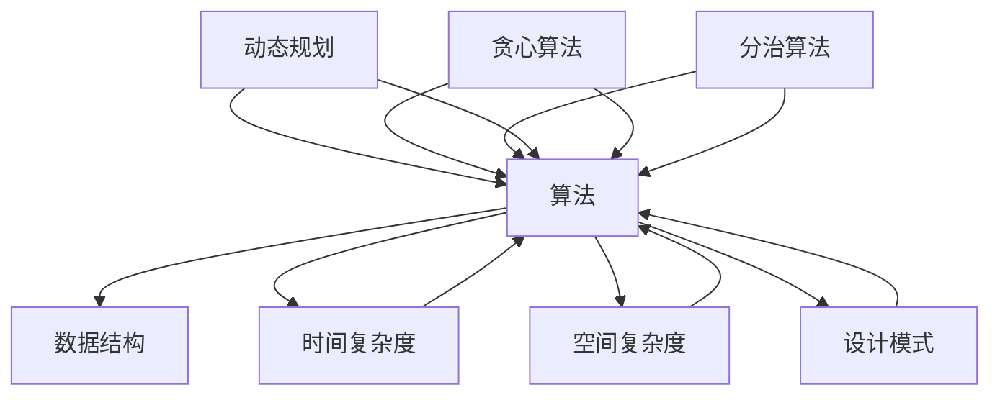

                 

### 背景介绍

随着数字化时代的来临，算法和数据结构在计算机科学中的重要性愈发突出。尤其在互联网巨头如字节跳动等公司的招聘中，算法和数据结构的考察成为面试的核心内容。字节跳动作为国内领先的互联网科技公司，其校招算法面试题库不仅涵盖了广泛的算法和数据结构知识点，更注重考查应聘者的逻辑思维能力、编程能力和问题解决能力。

本文旨在对2024年字节跳动校招算法面试题库及答案进行系统性的梳理和解析，帮助读者深入了解面试中的常见问题和解决思路。文章将从以下几个角度展开：

1. **算法基础与数据结构**：介绍算法的基本概念、时间复杂度和空间复杂度，以及常见算法思想和数据结构的实现。
2. **算法设计与优化**：讨论设计模式、动态规划、贪心算法和分治算法等高级算法思想和优化技术。
3. **数学基础与算法应用**：探讨线性代数、概率论与数理统计在算法中的应用，以及图算法的基本概念和算法实现。
4. **编程语言与工具**：介绍Python编程基础及其常用库，以及Git与版本控制和Docker与容器化的应用。
5. **字节跳动算法面试真题解析**：解析字节跳动算法面试中的常见真题，包括题目解析、答案展示和解题思路。

通过本文的深入分析和讲解，读者不仅可以掌握算法和数据结构的核心知识，还能提高解决实际问题的能力，为未来的技术面试和职业发展打下坚实的基础。

### 核心概念与联系

在深入探讨字节跳动校招算法面试题库之前，首先需要明确几个核心概念及其相互之间的联系。以下是本文将涉及的关键概念及其简要描述：

1. **算法（Algorithm）**：解决特定问题的一系列明确且有限的步骤。
2. **数据结构（Data Structure）**：用于存储、组织和管理数据的特定方式。
3. **时间复杂度（Time Complexity）**：衡量算法执行时间随输入规模增长的趋势。
4. **空间复杂度（Space Complexity）**：衡量算法执行过程中所需内存空间随输入规模增长的趋势。
5. **设计模式（Design Pattern）**：在软件设计过程中为解决特定问题而总结出的可重用解决方案。
6. **动态规划（Dynamic Programming）**：一种解决优化问题的算法思想，通过保存子问题的解来避免重复计算。
7. **贪心算法（Greedy Algorithm）**：每一步选择局部最优解，以期得到全局最优解的算法。
8. **分治算法（Divide and Conquer）**：将大问题分解为多个子问题，递归解决子问题，然后合并子问题解的方法。

这些核心概念之间的联系构成了算法和数据结构的基础。例如，时间复杂度和空间复杂度是评估算法性能的重要指标，而设计模式则提供了实现算法的常见策略。动态规划、贪心算法和分治算法等高级算法思想，则是在不同问题场景下优化算法性能的有效方法。

下面我们将使用Mermaid流程图来展示这些核心概念之间的联系，以便更直观地理解它们的相互关系。



通过上述流程图，我们可以清晰地看到各个核心概念如何相互影响和联系。算法和数据结构作为基础，为评估和实现算法提供了必要的工具；时间复杂度和空间复杂度帮助我们衡量算法的性能；设计模式、动态规划、贪心算法和分治算法等高级算法思想，则为我们提供了优化算法性能的多种策略。

在接下来的章节中，我们将详细探讨这些核心概念及其应用，帮助读者深入理解和掌握算法和数据结构的精髓。

### 算法的定义与分类

算法是一系列定义明确的步骤，用于解决特定问题或执行特定任务。在计算机科学中，算法起着至关重要的作用，它们是计算机程序的核心。算法可以简单到只包含几行代码，也可以复杂到涉及多个模块和算法组合。为了更好地理解和分析算法，我们通常从以下几个方面对其进行定义和分类。

#### 算法的定义

算法的定义主要有以下几个基本特征：

1. **输入（Input）**：算法可以接收0个或多个输入值。这些输入值可以是数据集、参数或其他形式的信息。
2. **输出（Output）**：算法执行后，会返回一个或多个输出值。输出值通常是问题解或计算结果。
3. **有穷性（Finiteness）**：算法必须能够在执行有限步骤后终止。这意味着算法不应该进入无限循环或无限递归。
4. **确定性（Determinism）**：对于相同的输入，算法必须总是产生相同的输出。算法的行为应该是可预测和可重复的。
5. **有效性（Effectiveness）**：算法的每一步都应该是有意义的，并且能够在实际操作中被有效执行。

在形式化的定义中，算法通常可以用伪代码或数学符号表示。例如，一个简单的求和算法可以用伪代码表示如下：

```plaintext
SUM(A, n)
  S = 0
  for i = 1 to n do
    S = S + A[i]
  end
  return S
```

在这个求和算法中，`A` 是一个数组，`n` 是数组的大小。算法通过遍历数组并累加每个元素的值来计算总和，最终返回结果。

#### 算法的分类

算法可以根据不同的标准进行分类。以下是几种常见的分类方法：

1. **按处理问题的方法分类**：
   - **确定性算法**：对于任何输入，算法总是产生相同的结果。
   - **非确定性算法**：算法在某些情况下可能产生不同的结果。
   - **确定性算法**通常更易于分析和理解，但非确定性算法可能在某些问题上更为有效。

2. **按问题性质分类**：
   - **搜索算法**：用于在数据结构中查找特定元素。
   - **排序算法**：用于对数据集进行排序。
   - **图算法**：用于解决图相关的问题，如最短路径、最小生成树等。
   - **计算几何算法**：用于解决几何图形相关的计算问题。
   - **字符串处理算法**：用于处理字符串数据。

3. **按算法设计方法分类**：
   - **分治算法**：将大问题分解为多个子问题，递归解决子问题，然后合并子问题解。
   - **动态规划**：通过保存子问题的解来避免重复计算，通常用于求解最优化问题。
   - **贪心算法**：每一步选择局部最优解，以期得到全局最优解。
   - **回溯算法**：通过探索所有可能的路径来寻找问题的解，通常用于解决组合问题。

4. **按数据结构分类**：
   - **基于数组的算法**：如排序、查找等。
   - **基于链表的算法**：如链表插入、删除等。
   - **基于树结构的算法**：如二叉树、平衡树等。
   - **基于图结构的算法**：如图遍历、最短路径等。

在字节跳动校招算法面试中，常见的算法分类主要涉及排序算法、搜索算法和图算法。以下是对这些算法的简要介绍：

- **排序算法**：常见的排序算法包括冒泡排序、选择排序、插入排序、快速排序、归并排序和堆排序。每种算法都有其独特的实现方式和适用场景。
  - **冒泡排序（Bubble Sort）**：通过反复交换相邻未排序元素来逐步将最大或最小元素移到序列的一端。
  - **选择排序（Selection Sort）**：每次选择一个最小或最大元素，放置在已排序序列的末尾。
  - **插入排序（Insertion Sort）**：将新元素插入到已排序序列的正确位置，保持序列有序。
  - **快速排序（Quick Sort）**：通过划分子序列并递归排序来快速排序整个序列。
  - **归并排序（Merge Sort）**：通过将序列分为子序列，递归排序子序列，然后将结果合并回原序列。
  - **堆排序（Heap Sort）**：利用堆这种数据结构进行排序。

- **搜索算法**：常见的搜索算法包括顺序查找、二分查找等。
  - **顺序查找（Sequential Search）**：逐个检查数组中的元素，直到找到目标或检查完所有元素。
  - **二分查找（Binary Search）**：对有序数组进行查找，通过不断缩小查找范围来快速定位目标。

- **图算法**：常见的图算法包括深度优先搜索（DFS）和广度优先搜索（BFS）等。
  - **深度优先搜索（DFS）**：通过递归或栈实现，从起始节点开始，尽可能深地搜索分支。
  - **广度优先搜索（BFS）**：使用队列实现，按照层级遍历图，确保每个节点都在其父节点之后被访问。

通过对这些算法的理解和掌握，应聘者可以更好地应对字节跳动校招算法面试中的各种问题。在接下来的章节中，我们将深入探讨这些算法的实现原理和优化策略。

### 算法的时间复杂度和空间复杂度

在算法设计中，时间复杂度和空间复杂度是评估算法性能的两个重要指标。它们分别描述了算法在处理数据时的时间和空间消耗，对于理解和优化算法至关重要。

#### 时间复杂度

时间复杂度（Time Complexity）是衡量算法执行时间与输入规模之间关系的一个指标。通常用大O符号（O-notation）表示。具体来说，时间复杂度是指随着输入数据规模n的增加，算法所需执行的基本操作次数的增长速度。

1. **基本操作**：基本操作是指在算法执行过程中，执行次数最多的操作，如循环中的迭代操作、递归调用的次数等。
2. **大O符号**：大O符号用于表示算法时间复杂度，如O(1)、O(n)、O(n^2)等。O(1)表示算法的时间复杂度与输入规模无关，是一个常数时间复杂度；O(n)表示算法的时间复杂度与输入规模线性相关；O(n^2)表示算法的时间复杂度与输入规模的平方相关。
3. **常见时间复杂度分析**：
   - **O(1)**：常数时间复杂度，如访问数组中的某个元素。
   - **O(n)**：线性时间复杂度，如遍历数组。
   - **O(n^2)**：平方时间复杂度，如冒泡排序、选择排序和插入排序。
   - **O(nlogn)**：对数时间复杂度，如归并排序和快速排序。
   - **O(2^n)**：指数时间复杂度，如递归求解全排列问题。

**示例**：考虑一个简单的求和算法，该算法需要遍历一个数组并计算所有元素的和。算法的时间复杂度为O(n)，因为遍历数组的操作是算法中执行次数最多的基本操作，而与输入规模n成正比。

```python
def sum_array(arr):
    total = 0
    for num in arr:
        total += num
    return total
```

#### 空间复杂度

空间复杂度（Space Complexity）是衡量算法在执行过程中所需内存空间的指标。它同样使用大O符号表示，描述算法所需存储空间与输入规模之间的关系。

1. **算法空间复杂度**：算法的空间复杂度包括算法运行时使用的额外存储空间，如递归调用的栈空间、临时变量等。
2. **常见空间复杂度分析**：
   - **O(1)**：常数空间复杂度，如使用固定大小的数组或栈。
   - **O(n)**：线性空间复杂度，如使用动态数组或链表。
   - **O(n^2)**：平方空间复杂度，如创建一个二维数组。

**示例**：考虑一个使用递归实现的阶乘函数。算法的空间复杂度为O(n)，因为每次递归调用都会在栈上分配新的空间，递归调用的深度与输入规模n成正比。

```python
def factorial(n):
    if n == 0:
        return 1
    return n * factorial(n-1)
```

#### 时间复杂度和空间复杂度的平衡

在实际问题中，时间复杂度和空间复杂度往往是相互影响的。一个低时间复杂度的算法可能需要大量的额外空间，而一个低空间复杂度的算法可能需要更多的时间。因此，在算法设计中，我们需要根据具体问题权衡时间复杂度和空间复杂度。

**示例**：快速排序（Quick Sort）算法的时间复杂度平均为O(nlogn)，但最坏情况下为O(n^2)。尽管在最坏情况下性能较差，但由于其空间复杂度为O(logn)，通常仍被认为是高效的排序算法。

```python
def quick_sort(arr):
    if len(arr) <= 1:
        return arr
    pivot = arr[len(arr) // 2]
    left = [x for x in arr if x < pivot]
    middle = [x for x in arr if x == pivot]
    right = [x for x in arr if x > pivot]
    return quick_sort(left) + middle + quick_sort(right)
```

综上所述，理解算法的时间复杂度和空间复杂度对于评估和优化算法性能至关重要。通过合理选择和设计算法，可以在时间消耗和空间消耗之间找到最佳平衡，从而解决复杂的问题。

### 常见算法思想与方法

在算法领域，有多种算法思想和方法被广泛运用，以解决不同类型的问题。这些思想和方法不仅在理论研究中具有重要意义，也在实际应用中发挥了关键作用。以下是几种常见的算法思想和方法：

#### 递归

递归（Recursion）是一种将大问题分解为小问题的算法思想。递归算法通常通过递归调用自身来解决问题。递归的主要优点在于其简洁性和易读性，但也需要注意递归调用可能导致的栈溢出问题。

**递归算法示例**：计算斐波那契数列。

```python
def fibonacci(n):
    if n <= 1:
        return n
    return fibonacci(n-1) + fibonacci(n-2)
```

在这个示例中，`fibonacci` 函数通过递归调用自身来计算斐波那契数列的值。递归的缺点是其会占用大量栈空间，特别是在解决大问题时。为了避免栈溢出，可以使用尾递归优化。

#### 动态规划

动态规划（Dynamic Programming，DP）是一种通过保存子问题的解来避免重复计算的方法。动态规划适用于具有最优子结构性质的问题，即问题的最优解包含其子问题的最优解。动态规划通常使用二维或三维数组来存储子问题的解。

**动态规划示例**：计算矩阵链乘的最优顺序。

```python
def matrix_chain_order(p):
    n = len(p) - 1
    dp = [[0] * n for _ in range(n)]
    for i in range(n-1, -1, -1):
        for j in range(i, n):
            dp[i][j] = float('inf')
            for k in range(i, j):
                q = dp[i][k] + dp[k+1][j] + p[i] * p[k+1] * p[j+1]
                dp[i][j] = min(dp[i][j], q)
    return dp[0][n-1]
```

在这个示例中，`matrix_chain_order` 函数使用动态规划算法计算矩阵链乘的最优顺序，以最小化乘法操作的次数。

#### 贪心算法

贪心算法（Greedy Algorithm）是一种在每一步选择局部最优解，以期望得到全局最优解的算法。贪心算法的核心思想是“贪心选择”，即在每一步选择当前最优解，而不考虑未来的影响。

**贪心算法示例**：计算硬币找零的最小硬币数。

```python
def coin_change(coins, amount):
    dp = [float('inf')] * (amount + 1)
    dp[0] = 0
    for coin in coins:
        for i in range(coin, amount + 1):
            dp[i] = min(dp[i], dp[i - coin] + 1)
    return dp[amount] if dp[amount] != float('inf') else -1
```

在这个示例中，`coin_change` 函数使用贪心算法计算使用给定硬币组合找零的最小硬币数。

#### 分治算法

分治算法（Divide and Conquer）是一种将大问题分解为多个子问题，递归解决子问题，然后将子问题的解合并得到原问题的解的算法。分治算法通常具有以下三个步骤：

1. **分解**：将原问题分解为若干个子问题，子问题规模较小但与原问题类似。
2. **递归解决**：递归解决子问题。
3. **合并**：将子问题的解合并得到原问题的解。

**分治算法示例**：快速排序算法。

```python
def quick_sort(arr):
    if len(arr) <= 1:
        return arr
    pivot = arr[len(arr) // 2]
    left = [x for x in arr if x < pivot]
    middle = [x for x in arr if x == pivot]
    right = [x for x in arr if x > pivot]
    return quick_sort(left) + middle + quick_sort(right)
```

在这个示例中，`quick_sort` 函数使用分治算法对数组进行排序。它首先选择一个中间元素作为基准（pivot），然后将数组划分为小于、等于和大于基准的子数组，最后递归地对子数组进行排序。

#### 回溯

回溯（Backtracking）是一种通过尝试所有可能的解来寻找问题的解的方法。回溯算法通常使用递归来实现，通过回溯来恢复问题状态，并继续尝试其他可能的解。

**回溯算法示例**：求解八皇后问题。

```python
def solve_n_queens(n):
    def is_safe(queen_pos, row, col):
        for prev_row, prev_col in enumerate(queen_pos[:row]):
            if prev_col == col or abs(prev_col - col) == abs(prev_row - row):
                return False
        return True

    def place_queens(row, queen_pos):
        if row == n:
            result.append(queen_pos[:])
            return
        for col in range(n):
            if is_safe(queen_pos, row, col):
                queen_pos[row] = col
                place_queens(row + 1, queen_pos)

    result = []
    place_queens(0, [-1] * n)
    return result
```

在这个示例中，`solve_n_queens` 函数使用回溯算法求解八皇后问题。它通过递归尝试放置每个皇后，并检查放置是否安全（即没有其他皇后在同一行、同一列或同一对角线上）。

#### 贪心选择 + 动态规划

在某些问题中，可以结合贪心算法和动态规划的方法来优化算法性能。这种方法通常通过使用贪心选择来减小问题规模，并使用动态规划来避免重复计算。

**贪心选择 + 动态规划示例**：计算最少硬币找零的最小硬币数。

```python
def coin_change(coins, amount):
    dp = [float('inf')] * (amount + 1)
    dp[0] = 0
    for coin in coins:
        for i in range(coin, amount + 1):
            dp[i] = min(dp[i], dp[i - coin] + 1)
    return dp[amount] if dp[amount] != float('inf') else -1
```

在这个示例中，`coin_change` 函数结合了贪心选择和动态规划的方法来计算最少硬币找零的最小硬币数。它首先使用贪心选择来减小问题规模，即每次选择一个硬币来减少剩余金额，然后使用动态规划来记录并复用之前的计算结果，以避免重复计算。

总结来说，递归、动态规划、贪心算法、分治算法和回溯等算法思想和方法在解决不同类型的问题中具有重要作用。通过理解和掌握这些方法，我们可以设计出更高效、更优化的算法，解决复杂的问题。

### 数据结构与算法实现

数据结构是算法实现的基础，它们决定了数据存储和访问的效率。在算法面试中，理解和实现常见数据结构是必备技能。本文将介绍几种基本数据结构，包括线性表、栈和队列、链表、树和二叉树，并分析它们的稳定性和非稳定性。

#### 线性表

线性表是最基本的数据结构之一，包括数组、链表等。它支持随机访问，时间复杂度为O(1)，但其大小固定，不适合动态扩容。

1. **数组（Array）**：数组是一种基于固定大小的连续内存块的数据结构，支持随机访问，时间复杂度为O(1)。
   - **操作**：插入、删除、查找、排序等。
   - **实现**：Python中的`list`类型。

2. **链表（Linked List）**：链表通过节点（Node）链接而成，每个节点包含数据和指向下一个节点的指针。链表支持动态扩容，时间复杂度为O(1)（对于插入和删除操作）。
   - **操作**：插入、删除、查找等。
   - **实现**：Python中的`Node`类和`LinkedList`类。

```python
class Node:
    def __init__(self, data):
        self.data = data
        self.next = None

class LinkedList:
    def __init__(self):
        self.head = None

    def append(self, data):
        new_node = Node(data)
        if not self.head:
            self.head = new_node
            return
        current = self.head
        while current.next:
            current = current.next
        current.next = new_node
```

#### 栈和队列

栈（Stack）和队列（Queue）是特殊的线性表，分别用于模拟后进先出（LIFO）和先进先出（FIFO）的操作顺序。

1. **栈（Stack）**：栈支持插入和删除操作在表的一端进行。
   - **操作**：push（入栈）、pop（出栈）、peek（查看栈顶元素）等。
   - **实现**：Python中的`list`类型或自定义栈类。

```python
class Stack:
    def __init__(self):
        self.items = []

    def is_empty(self):
        return len(self.items) == 0

    def push(self, item):
        self.items.append(item)

    def pop(self):
        if not self.is_empty():
            return self.items.pop()

    def peek(self):
        if not self.is_empty():
            return self.items[-1]
```

2. **队列（Queue）**：队列支持插入操作在表的一端进行，删除操作在另一端进行。
   - **操作**：enqueue（入队）、dequeue（出队）、peek（查看队首元素）等。
   - **实现**：Python中的`collections.deque`类型或自定义队列类。

```python
from collections import deque

class Queue:
    def __init__(self):
        self.items = deque()

    def is_empty(self):
        return len(self.items) == 0

    def enqueue(self, item):
        self.items.append(item)

    def dequeue(self):
        if not self.is_empty():
            return self.items.popleft()

    def peek(self):
        if not self.is_empty():
            return self.items[0]
```

#### 链表

链表是动态数据结构，由节点组成，每个节点包含数据和指向下一个节点的指针。链表支持高效的插入和删除操作，时间复杂度为O(1)。

1. **单链表（Singly Linked List）**：每个节点只有一个指向下一个节点的指针。
   - **操作**：插入、删除、查找等。
   - **实现**：前述`LinkedList`类。

2. **双链表（Doubly Linked List）**：每个节点有两个指针，一个指向前一个节点，一个指向下一个节点。
   - **操作**：插入、删除、查找等。
   - **实现**：扩展`Node`类，添加`prev`指针。

```python
class DoublyLinkedList:
    def __init__(self):
        self.head = None
        self.tail = None

    def append(self, data):
        new_node = Node(data)
        if not self.head:
            self.head = new_node
            self.tail = new_node
            return
        self.tail.next = new_node
        new_node.prev = self.tail
        self.tail = new_node
```

#### 树和二叉树

树（Tree）是包含多个节点的层次结构，每个节点最多有一个父节点和多个子节点。二叉树（Binary Tree）是树的一种特殊形式，每个节点最多有两个子节点。

1. **二叉树（Binary Tree）**：每个节点最多有两个子节点。
   - **操作**：插入、删除、查找、遍历等。
   - **实现**：自定义二叉树类。

```python
class TreeNode:
    def __init__(self, data):
        self.data = data
        self.left = None
        self.right = None

class BinaryTree:
    def __init__(self):
        self.root = None

    def insert(self, data):
        new_node = TreeNode(data)
        if not self.root:
            self.root = new_node
            return
        current = self.root
        while current:
            if data < current.data:
                if not current.left:
                    current.left = new_node
                    return
                    current = current.left
                else:
                    current = current.left
            else:
                if not current.right:
                    current.right = new_node
                    return
                current = current.right
```

2. **平衡二叉树（AVL Tree）**：自平衡的二叉树，每个节点的左右子树高度差不超过1。
   - **操作**：插入、删除、查找等。
   - **实现**：较复杂，涉及节点旋转和平衡维护。

3. **堆（Heap）**：基于完全二叉树的优先队列，用于实现排序和查找。
   - **操作**：插入、删除、查找最小元素等。
   - **实现**：使用数组实现的完全二叉树。

```python
def heapify(arr, n, i):
    largest = i
    left = 2 * i + 1
    right = 2 * i + 2

    if left < n and arr[i] < arr[left]:
        largest = left

    if right < n and arr[largest] < arr[right]:
        largest = right

    if largest != i:
        arr[i], arr[largest] = arr[largest], arr[i]
        heapify(arr, n, largest)
```

#### 稳定性和非稳定性分析

在数据结构中，稳定性是指当两个具有相同键的元素存在于数据结构中时，是否能够保证这些元素的相对顺序不发生改变。

1. **稳定性分析**：
   - **数组**：稳定。
   - **链表**：稳定（单链表和双链表）。
   - **栈**：稳定。
   - **队列**：稳定。
   - **二叉树**：不稳定（除非是平衡二叉树，如AVL树）。
   - **平衡二叉树**：稳定。

2. **非稳定性分析**：
   - **排序算法**：如快速排序、堆排序等，通常情况下是非稳定的。
   - **查找算法**：如二分查找，一般情况下是稳定的。

通过以上对基本数据结构的介绍和实现，我们可以更好地理解其在算法中的应用和优势。在字节跳动校招算法面试中，对这些数据结构的掌握和理解是基础，也是应对复杂问题的关键。

### 常见排序算法

在算法面试中，排序算法是一个重要的考点，因为它不仅考察了编程能力，还涉及了数据结构和算法设计思想。本文将介绍几种常见的排序算法，包括冒泡排序、选择排序、插入排序、快速排序、归并排序和堆排序，并比较它们的时间复杂度和空间复杂度。

#### 冒泡排序（Bubble Sort）

冒泡排序是一种简单的排序算法，通过重复遍历要排序的数组，比较相邻元素的大小并交换它们，从而逐步将最大元素“冒泡”到数组的末尾。

- **算法思想**：
  - 从数组的第一个元素开始，相邻元素两两对比，如果顺序错误则交换。
  - 经过一次遍历后，最大元素被放到数组的最后。
  - 重复上述过程，每次遍历后未排序部分的最大元素都会被放到正确的位置。

- **伪代码**：

```plaintext
for i = 0 to n-1
    for j = 0 to n-i-1
        if arr[j] > arr[j+1]
            swap(arr[j], arr[j+1])
```

- **时间复杂度**：最坏和平均情况下为O(n^2)，最好情况下为O(n)。
- **空间复杂度**：O(1)。

**优缺点**：
- 优点：算法简单，易于实现。
- 缺点：效率较低，不适用于大数据量。

#### 选择排序（Selection Sort）

选择排序是一种简单但效率较低的排序算法，它通过反复寻找最小元素并将其放到未排序部分的开头。

- **算法思想**：
  - 第一步，在未排序部分找到最小元素，然后将其与第一个元素交换。
  - 重复上述步骤，每次都在剩余的未排序部分中寻找最小元素。

- **伪代码**：

```plaintext
for i = 0 to n-1
    min_index = i
    for j = i+1 to n
        if arr[j] < arr[min_index]
            min_index = j
    swap(arr[i], arr[min_index])
```

- **时间复杂度**：最坏和平均情况下为O(n^2)，最好情况下为O(n^2)。
- **空间复杂度**：O(1)。

**优缺点**：
- 优点：算法简单，易于实现。
- 缺点：效率较低，不适用于大数据量。

#### 插入排序（Insertion Sort）

插入排序是一种简单的排序算法，它通过将未排序部分的数据插入到已排序部分正确的位置来实现排序。

- **算法思想**：
  - 从第一个元素开始，该元素可以认为已经排序。
  - 取出下一个元素，在已排序的元素中找到相应位置将其插入。
  - 重复上述步骤，直到所有元素排序完毕。

- **伪代码**：

```plaintext
for i = 1 to n-1
    key = arr[i]
    j = i-1
    while j >= 0 and arr[j] > key
        arr[j+1] = arr[j]
        j = j-1
    arr[j+1] = key
```

- **时间复杂度**：最坏和平均情况下为O(n^2)，最好情况下为O(n)。
- **空间复杂度**：O(1)。

**优缺点**：
- 优点：算法简单，适用于小规模数据或部分有序数据。
- 缺点：效率较低，不适用于大数据量。

#### 快速排序（Quick Sort）

快速排序是一种高效的排序算法，采用分治策略来递归排序数组。其基本思想是通过选择一个基准元素，将数组分为两部分，然后递归地对两部分进行排序。

- **算法思想**：
  - 选择一个基准元素，通常选择第一个或最后一个元素。
  - 将数组分为两部分，一部分的所有元素都比基准元素小，另一部分的所有元素都比基准元素大。
  - 递归地对这两部分进行快速排序。

- **伪代码**：

```plaintext
def quick_sort(arr, low, high)
    if low < high
        pi = partition(arr, low, high)
        quick_sort(arr, low, pi-1)
        quick_sort(arr, pi+1, high)

def partition(arr, low, high)
    pivot = arr[high]
    i = low - 1
    for j = low to high-1
        if arr[j] < pivot
            i = i+1
            swap(arr[i], arr[j])
    swap(arr[i+1], arr[high])
    return i+1
```

- **时间复杂度**：平均情况下为O(nlogn)，最坏情况下为O(n^2)。
- **空间复杂度**：O(logn)。

**优缺点**：
- 优点：算法效率高，适用于大数据量。
- 缺点：最坏情况下的性能较差，需要优化。

#### 归并排序（Merge Sort）

归并排序是一种基于分治策略的排序算法，它将数组分为多个子数组，然后递归地对这些子数组进行排序，最后将已排序的子数组合并成更大的已排序数组。

- **算法思想**：
  - 将数组分为两个大小相等的子数组。
  - 递归地对两个子数组进行归并排序。
  - 将两个已排序的子数组合并成一个已排序的数组。

- **伪代码**：

```plaintext
def merge_sort(arr)
    if len(arr) > 1
        mid = len(arr) // 2
        left = arr[:mid]
        right = arr[mid:]

        merge_sort(left)
        merge_sort(right)

        i = j = k = 0
        while i < len(left) and j < len(right)
            if left[i] < right[j]
                arr[k] = left[i]
                i = i+1
            else
                arr[k] = right[j]
                j = j+1
            k = k+1

        while i < len(left)
            arr[k] = left[i]
            i = i+1
            k = k+1

        while j < len(right)
            arr[k] = right[j]
            j = j+1
            k = k+1
```

- **时间复杂度**：最坏、平均和最好情况下均为O(nlogn)。
- **空间复杂度**：O(n)。

**优缺点**：
- 优点：算法效率高，适用于大数据量。
- 缺点：需要额外的存储空间。

#### 堆排序（Heap Sort）

堆排序是一种利用堆这种数据结构的排序算法。堆是一种特殊的完全二叉树，每个节点的值都大于或等于（或小于或等于）其子节点的值。

- **算法思想**：
  - 将数组构造成一个大顶堆（或小顶堆）。
  - 将堆顶元素（最大或最小值）与数组末尾的元素交换，然后将剩余的元素重新调整为堆。
  - 重复上述步骤，直到所有元素排序完毕。

- **伪代码**：

```plaintext
def heapify(arr, n, i)
    largest = i
    left = 2 * i + 1
    right = 2 * i + 2

    if left < n and arr[i] < arr[left]
        largest = left

    if right < n and arr[largest] < arr[right]
        largest = right

    if largest != i
        swap(arr[i], arr[largest])
        heapify(arr, n, largest)

def heap_sort(arr)
    n = len(arr)

    for i = n // 2 - 1 to 0
        heapify(arr, n, i)

    for i = n-1 to 0
        swap(arr[0], arr[i])
        heapify(arr, i, 0)
```

- **时间复杂度**：最坏、平均和最好情况下均为O(nlogn)。
- **空间复杂度**：O(1)。

**优缺点**：
- 优点：算法效率高，适用于大数据量。
- 缺点：需要额外的存储空间。

#### 排序算法比较

| 排序算法 | 时间复杂度（最好/平均/最坏） | 空间复杂度 | 适用场景 |
| --- | --- | --- | --- |
| 冒泡排序 | O(n) / O(n^2) / O(n^2) | O(1) | 小规模数据或部分有序数据 |
| 选择排序 | O(n^2) / O(n^2) / O(n^2) | O(1) | 小规模数据或部分有序数据 |
| 插入排序 | O(n) / O(n^2) / O(n^2) | O(1) | 小规模数据或部分有序数据 |
| 快速排序 | O(nlogn) / O(nlogn) / O(n^2) | O(logn) | 大规模数据 |
| 归并排序 | O(nlogn) / O(nlogn) / O(nlogn) | O(n) | 大规模数据 |
| 堆排序 | O(nlogn) / O(nlogn) / O(nlogn) | O(1) | 大规模数据 |

通过比较，我们可以发现快速排序、归并排序和堆排序是常见的三种高效的排序算法，适用于大规模数据排序。快速排序由于其递归性质和分治策略，通常被认为是性能最佳的排序算法，但需注意其最坏情况下的性能。归并排序和堆排序则在最坏情况下也能保持稳定的时间复杂度，适合处理大规模数据。

### 常见查找算法

在算法面试中，查找算法是考察重点之一，因为它们广泛应用于数据检索和处理。本文将介绍两种常见的查找算法：顺序查找和二分查找。

#### 顺序查找（Sequential Search）

顺序查找是一种简单但效率较低的查找算法，其基本思想是从数组的第一个元素开始，依次比较每个元素，直到找到目标元素或到达数组的末尾。

- **算法思想**：
  - 从数组的第一个元素开始，依次与目标元素比较。
  - 如果当前元素等于目标元素，则查找成功；否则，继续比较下一个元素。
  - 如果到达数组的末尾仍未找到目标元素，则查找失败。

- **伪代码**：

```plaintext
function sequential_search(arr, target)
    for each element in arr
        if element == target
            return index
    return -1
```

- **时间复杂度**：最坏情况下为O(n)，平均情况下也为O(n)，最好情况下为O(1)。
- **空间复杂度**：O(1)。

**优缺点**：
- 优点：实现简单，易于理解。
- 缺点：效率较低，不适用于大数据量。

#### 二分查找（Binary Search）

二分查找是一种高效的查找算法，适用于有序数组。其基本思想是通过不断缩小查找范围，逐步逼近目标元素。

- **算法思想**：
  - 将数组分为两半，取中间元素与目标元素比较。
  - 如果中间元素等于目标元素，则查找成功；否则，根据中间元素与目标元素的大小关系，继续在左边或右边的子数组中查找。
  - 重复上述步骤，直到找到目标元素或确定目标元素不存在。

- **伪代码**：

```plaintext
function binary_search(arr, target)
    low = 0
    high = len(arr) - 1

    while low <= high
        mid = (low + high) // 2
        if arr[mid] == target
            return mid
        elif arr[mid] < target
            low = mid + 1
        else
            high = mid - 1

    return -1
```

- **时间复杂度**：最坏情况下为O(logn)，平均情况下也为O(logn)，最好情况下为O(1)。
- **空间复杂度**：O(1)。

**优缺点**：
- 优点：效率高，适用于大数据量。
- 缺点：要求数组必须是有序的，且不适用于动态变化的数组。

#### 顺序查找与二分查找的比较

| 查找算法 | 时间复杂度 | 空间复杂度 | 适用场景 |
| --- | --- | --- | --- |
| 顺序查找 | O(n) | O(1) | 小规模数据或部分有序数据 |
| 二分查找 | O(logn) | O(1) | 有序大数据 |

通过比较，我们可以看出二分查找在效率上明显优于顺序查找，尤其在处理大规模有序数据时具有显著优势。然而，顺序查找实现简单，适用于小规模或部分有序数据。在实际应用中，根据数据规模和排序状态，选择合适的查找算法至关重要。

### 算法设计与优化

在算法设计中，设计模式和优化技术是提升算法性能和解决复杂问题的关键。本文将介绍设计模式、动态规划、贪心算法和分治算法等优化技术，并讨论它们在不同问题中的应用。

#### 设计模式

设计模式是一套被反复使用、经过严格测试和证明的设计经验，它提供了在不同情况下解决特定问题的通用解决方案。在算法设计中，设计模式可以帮助我们结构化代码、提高可读性和可维护性。

1. **单例模式（Singleton）**：确保一个类只有一个实例，并提供一个全局访问点。

   **应用场景**：用于需要单一实例的场景，如数据库连接池、线程池等。

   **伪代码**：

   ```plaintext
   class Singleton:
       instance = None

       def __init__(self):
           if not instance:
               instance = self
           return instance
   ```

2. **工厂模式（Factory）**：根据不同条件创建不同类的实例。

   **应用场景**：用于需要根据参数动态创建对象的场景，如多态和抽象工厂模式。

   **伪代码**：

   ```plaintext
   class Factory:
       def create_object(self, type):
           if type == "TypeA":
               return TypeA()
           elif type == "TypeB":
               return TypeB()
   ```

3. **代理模式（Proxy）**：为其他对象提供一种代理，以控制对这个对象的访问。

   **应用场景**：用于延迟创建对象、提高安全性和性能监控等。

   **伪代码**：

   ```plaintext
   class Proxy:
       def __init__(self, real_subject):
           self.real_subject = real_subject

       def request(self):
           if some_condition:
               return self.real_subject.some_method()
           else:
               return "无法访问"
   ```

4. **责任链模式（Chain of Responsibility）**：将多个对象连接成一条链，每个对象仅处理自己能够处理的部分，然后传递到下一个对象。

   **应用场景**：用于处理多个接收者之间的请求，如审批流程、过滤器链等。

   **伪代码**：

   ```plaintext
   class Handler:
       def __init__(self, successor=None):
           self.successor = successor

       def handle(self, request):
           if can_handle_request:
               process_request()
           elif self.successor:
               self.successor.handle(request)
   ```

#### 动态规划

动态规划是一种解决最优化问题的算法思想，它通过将问题分解为子问题并保存子问题的解来避免重复计算。

1. **基本概念**：
   - **最优子结构**：问题的最优解包含其子问题的最优解。
   - **边界条件**：初始条件和递推关系。

2. **典型问题**：

   **最长公共子序列（LCS）**：

   **伪代码**：

   ```plaintext
   function lcs(X[0..m-1], Y[0..n-1])
       let dp[0..m, 0..n] be a table
       for i = 0 to m
           for j = 0 to n
               if X[i] == Y[j]
                   dp[i][j] = dp[i-1][j-1] + 1
               else
                   dp[i][j] = max(dp[i-1][j], dp[i][j-1])
       return dp[m][n]
   ```

#### 贪心算法

贪心算法是一种每一步选择局部最优解的算法，以期望得到全局最优解。贪心算法通常通过贪心选择来简化问题。

1. **基本概念**：
   - **贪心选择**：每一步选择当前情况下最优的决策。

2. **典型问题**：

   **最小生成树（MST）**：

   **伪代码**（Prim算法）：

   ```plaintext
   function prim(MST, V, E)
       let S be an empty set
       let MST be an empty graph
       choose an arbitrary vertex u and add it to S
       while S does not include all V
           let w be a vertex not in S with the minimum edge weight connecting to S
           add w to S
           add edge (u, w) to MST
   ```

#### 分治算法

分治算法是一种将大问题分解为多个子问题、递归解决子问题并合并子问题解的算法。

1. **基本概念**：
   - **分解**：将大问题分解为若干个子问题。
   - **递归**：递归解决子问题。
   - **合并**：合并子问题的解。

2. **典型问题**：

   **合并排序（Merge Sort）**：

   **伪代码**：

   ```plaintext
   function merge_sort(arr)
       if length of arr <= 1
           return arr
       mid = length of arr // 2
       left = merge_sort(arr[0..mid-1])
       right = merge_sort(arr[mid..end])
       return merge(left, right)
   ```

   **伪代码**（merge函数）：

   ```plaintext
   function merge(left, right)
       result = empty array
       while left and right have elements
           if left[0] <= right[0]
               append left[0] to result
               remove first element from left
           else
               append right[0] to result
               remove first element from right
       append remaining elements of left and right to result
       return result
   ```

#### 应用与对比

- **设计模式**：用于结构化代码、提高可读性和维护性。
- **动态规划**：用于解决最优子结构性质的问题。
- **贪心算法**：用于简化问题、选择局部最优解。
- **分治算法**：用于分解问题、递归解决和合并子问题。

在设计复杂算法时，结合这些优化技术，可以显著提升算法的性能和解决能力。在实际应用中，根据具体问题和需求选择合适的优化方法至关重要。

### 数学基础与算法应用

数学在算法领域中扮演着至关重要的角色，为算法提供了理论基础和优化工具。本文将介绍线性代数、概率论与数理统计在算法中的应用，并讨论图算法的基本概念和算法实现。

#### 线性代数

线性代数是研究向量、矩阵及其运算的基本数学分支，在算法中有着广泛的应用，尤其在机器学习和数据科学领域。以下是线性代数中几个核心概念：

1. **向量与矩阵**：

   - **向量**：向量是表示大小和方向的量，在二维空间中可以用一对坐标表示。向量运算包括加法、减法、标量乘法和向量乘法等。
   - **矩阵**：矩阵是按行列排列的数表，可以表示多个向量的组合。矩阵运算包括矩阵加法、减法、乘法、转置和逆矩阵等。

2. **线性方程组**：

   - **线性方程组**：由多个线性方程组成的方程组。求解线性方程组的方法包括高斯消元法、矩阵求逆法等。

   **示例**：求解线性方程组
   $$ 
   \begin{cases}
   ax + by = c \\
   dx + ey = f
   \end{cases}
   $$

   使用高斯消元法，可以通过矩阵求逆求解：
   $$ 
   \begin{cases}
   x = \frac{1}{ae - bd}(fd - ce, -1)(be - cd, -1) \\
   y = \frac{1}{ae - bd}(fc - ad, -1)(bd - ae, -1)
   \end{cases}
   $$

3. **特征值与特征向量**：

   - **特征值**：矩阵的一个特殊值，使得矩阵与特征向量相乘后结果仍为特征向量。
   - **特征向量**：对应于特征值的向量，保持方向不变。

   **应用**：特征值和特征向量在机器学习中的特征提取、矩阵分解等领域有重要应用，如主成分分析（PCA）。

#### 概率论与数理统计

概率论与数理统计是处理随机现象的数学分支，在算法，特别是机器学习和数据挖掘中有着广泛应用。以下是几个核心概念：

1. **概率的基本概念**：

   - **概率**：描述事件发生的可能性，取值范围在0到1之间。
   - **条件概率**：在某一事件发生的条件下，另一事件发生的概率。
   - **贝叶斯定理**：用于计算后验概率，即已知某一事件发生的情况下，另一事件发生的概率。

2. **概率分布**：

   - **离散概率分布**：描述离散随机变量的概率分布，如伯努利分布、泊松分布等。
   - **连续概率分布**：描述连续随机变量的概率分布，如正态分布、均匀分布等。

3. **数理统计**：

   - **统计量**：用于描述数据集特性的数量指标，如均值、方差、标准差等。
   - **假设检验**：通过样本数据检验总体参数的假设，如t检验、卡方检验等。

#### 图算法

图算法用于处理图结构数据，广泛应用于网络分析、社交网络、路由算法等领域。以下是几个基本图算法：

1. **图的基本概念**：

   - **图**：由节点（顶点）和边组成的集合。图可以分为有向图和无向图。
   - **度**：节点连接的边的数量。
   - **连通性**：节点之间是否存在路径。

2. **图的遍历算法**：

   - **深度优先搜索（DFS）**：从起始节点开始，尽可能深地探索图。
   - **广度优先搜索（BFS）**：从起始节点开始，逐层探索图。

   **DFS伪代码**：

   ```plaintext
   function dfs(graph, start)
       mark start as visited
       for each neighbor of start
           if neighbor not visited
               dfs(graph, neighbor)
   ```

   **BFS伪代码**：

   ```plaintext
   function bfs(graph, start)
       create an empty queue and enqueue the start node
       create an empty set to keep track of visited nodes
       mark start as visited
       while queue is not empty
           dequeue a node from the queue
           for each neighbor of the dequeued node
               if neighbor not visited
                   mark neighbor as visited
                   enqueue neighbor
   ```

3. **最短路径算法**：

   - **迪杰斯特拉算法（Dijkstra's Algorithm）**：用于计算单源最短路径。
   - **贝尔曼-福特算法（Bellman-Ford Algorithm）**：可以处理负权重边的单源最短路径算法。

   **Dijkstra's Algorithm伪代码**：

   ```plaintext
   function dijkstra(graph, start)
       initialize distances with infinity
       distances[start] = 0
       priority_queue = (distance, vertex)
       while not priority_queue.empty()
           dequeue minimum distance vertex
           for each neighbor of vertex
               if distance[neighbor] > distance[vertex] + weight(vertex, neighbor)
                   distance[neighbor] = distance[vertex] + weight(vertex, neighbor)
                   priority_queue.update(neighbor, distance[neighbor])
   ```

#### 应用与实例

1. **线性代数在机器学习中的应用**：

   - **矩阵分解**：通过矩阵分解，可以将高维数据转换为低维表示，如主成分分析（PCA）。
   - **线性回归**：使用矩阵求解最小二乘问题，得到线性回归模型的参数。

2. **概率论与数理统计在数据分析中的应用**：

   - **贝叶斯分类器**：基于贝叶斯定理，用于分类和预测。
   - **假设检验**：用于验证数据集的假设，如t检验用于比较两组数据的均值差异。

3. **图算法在网络分析中的应用**：

   - **社交网络分析**：通过图算法分析社交网络中的节点和边，识别关键节点和社区结构。
   - **路由算法**：使用最短路径算法，如Dijkstra's Algorithm，优化数据传输路径。

通过掌握线性代数、概率论与数理统计以及图算法的基本概念和应用，我们可以更好地理解和实现复杂的算法，解决实际生活中的问题。

### Python编程基础

Python作为一种简洁且功能强大的编程语言，因其易读性和高效性在算法和数据分析领域受到广泛使用。在字节跳动校招算法面试中，Python编程基础是必备技能之一。本文将介绍Python的基本语法、常用库以及编程风格，帮助读者快速掌握Python编程。

#### 基本语法

Python的基本语法相对简单，适合初学者快速上手。以下是一些Python的基础语法要素：

1. **变量和数据类型**：Python中的变量不需要显式声明，数据类型可以根据赋值自动推断。基本数据类型包括整数（int）、浮点数（float）、布尔值（bool）和字符串（str）。

   ```python
   x = 10       # 整数
   y = 3.14     # 浮点数
   z = True     # 布尔值
   name = "Alice"  # 字符串
   ```

2. **控制流**：Python支持常见的控制流语句，包括条件语句（if-elif-else）、循环语句（for和while）。

   ```python
   # 条件语句
   if x > y:
       print("x is greater than y")
   elif x == y:
       print("x is equal to y")
   else:
       print("x is less than y")

   # 循环语句
   for i in range(5):
       print(i)

   while x < 10:
       print(x)
       x += 1
   ```

3. **函数**：Python中的函数是组织代码的重要手段。定义函数使用`def`关键字，函数体缩进。

   ```python
   def greet(name):
       print("Hello, " + name)

   greet("Alice")
   ```

4. **模块和包**：Python通过模块和包来组织代码。模块是.py文件，包是包含多个模块的目录。

   ```python
   # 模块示例：greet.py
   def greet(name):
       print("Hello, " + name)

   # 导入模块
   import greet
   greet.greet("Alice")
   ```

5. **异常处理**：异常处理是避免程序崩溃的关键。使用`try-except`语句捕获和处理异常。

   ```python
   try:
       result = 10 / 0
   except ZeroDivisionError:
       print("Cannot divide by zero")
   ```

#### 常用库

Python拥有丰富的库，这些库大大简化了编程任务。以下是Python中常用的几个库：

1. **NumPy**：NumPy是Python科学计算的基础库，提供多维数组对象和丰富的数学运算函数。

   ```python
   import numpy as np

   array = np.array([1, 2, 3, 4])
   print(array)  # 输出：[1 2 3 4]
   ```

2. **Pandas**：Pandas是数据分析的重要库，提供数据框（DataFrame）和数据序列（Series）等数据结构。

   ```python
   import pandas as pd

   df = pd.DataFrame({'A': [1, 2, 3], 'B': [4, 5, 6]})
   print(df)  # 输出：
               #   A  B
               # 0  1  4
               # 1  2  5
               # 2  3  6
   ```

3. **Matplotlib**：Matplotlib是Python的数据可视化库，用于创建各种类型的图表。

   ```python
   import matplotlib.pyplot as plt

   plt.plot([1, 2, 3], [1, 2, 3])
   plt.show()
   ```

4. **Scikit-learn**：Scikit-learn是机器学习的常用库，提供各种机器学习算法的实现。

   ```python
   from sklearn import datasets
   from sklearn.model_selection import train_test_split
   from sklearn.svm import SVC

   iris = datasets.load_iris()
   X_train, X_test, y_train, y_test = train_test_split(iris.data, iris.target, test_size=0.3)
   clf = SVC()
   clf.fit(X_train, y_train)
   print(clf.score(X_test, y_test))
   ```

#### 编程风格

良好的编程风格是编写可维护、可读代码的关键。以下是一些Python编程风格的最佳实践：

1. **代码注释**：为代码添加注释，尤其是复杂逻辑和算法实现，以便他人理解和维护。
2. **命名规范**：遵循Python命名规范，使用小写字母和下划线组合，避免使用特殊字符和缩写。
3. **代码格式化**：使用PEP 8标准进行代码格式化，确保代码结构清晰、易读。
4. **模块化设计**：将代码划分为模块和函数，每个模块和函数负责单一功能，提高代码重用性。
5. **单元测试**：编写单元测试，确保代码的功能和性能满足预期。

通过掌握Python的基本语法、常用库和编程风格，读者可以更好地应用Python解决实际问题，为字节跳动校招算法面试做好准备。

### Python常用库

在字节跳动校招算法面试中，熟悉Python常用库对于应对各类问题至关重要。以下是对几个核心库的详细介绍，包括它们的基本使用方法和一些常见问题及解决方案。

#### NumPy

NumPy是Python科学计算的基础库，提供了强大的多维数组对象和丰富的数学运算函数。NumPy在数据处理、科学计算和机器学习中有着广泛的应用。

1. **基本使用方法**：

   - **创建数组**：使用`numpy.array()`创建数组。

     ```python
     import numpy as np

     arr = np.array([1, 2, 3, 4])
     print(arr)  # 输出：[1 2 3 4]
     ```

   - **数组操作**：NumPy支持多种数组操作，如切片、索引和广播。

     ```python
     arr = np.array([1, 2, 3, 4])
     print(arr[1:3])  # 输出：[2 3]
     print(arr[arr > 2])  # 输出：[3 4]
     ```

   - **数学运算**：NumPy提供了大量的数学函数，如求和、均值和标准差。

     ```python
     arr = np.array([1, 2, 3, 4])
     print(np.sum(arr))  # 输出：10
     print(np.mean(arr))  # 输出：2.5
     print(np.std(arr))  # 输出：0.81649658
     ```

2. **常见问题及解决方案**：

   - **数组类型错误**：确保创建数组时使用正确的数据类型。

     ```python
     arr = np.array([1.0, 2.0, 3.0])  # 数组元素为浮点数
     arr = arr.astype(int)  # 转换为数组
     ```

   - **数组维度错误**：检查数组维度，确保进行正确的数组操作。

     ```python
     arr = np.array([1, 2, 3])
     result = arr[1:3]  # 正确的切片操作
     ```

#### Pandas

Pandas是Python数据分析的核心库，提供了数据帧（DataFrame）和数据序列（Series）等数据结构，适合处理表格数据。

1. **基本使用方法**：

   - **创建数据帧**：使用`pandas.DataFrame()`创建数据帧。

     ```python
     import pandas as pd

     df = pd.DataFrame({'A': [1, 2, 3], 'B': [4, 5, 6]})
     print(df)  # 输出：
                 #   A  B
                 # 0  1  4
                 # 1  2  5
                 # 2  3  6
     ```

   - **数据操作**：Pandas支持丰富的数据操作，如索引、选择和过滤。

     ```python
     df = pd.DataFrame({'A': [1, 2, 3], 'B': [4, 5, 6]})
     print(df['A'])  # 输出：[1 2 3]
     print(df[df['A'] > 1])  # 输出：   A  B
                             #         2  5
                             #         3  6
     ```

   - **数据清洗和转换**：Pandas提供了多种数据清洗和转换方法，如填充缺失值、转换数据类型。

     ```python
     df = pd.DataFrame({'A': [1, 2, None], 'B': [4, 5, 6]})
     df.fillna(0, inplace=True)  # 填充缺失值为0
     df = df.astype({'A': int, 'B': int})  # 转换数据类型
     ```

2. **常见问题及解决方案**：

   - **数据类型错误**：确保在进行数据操作前将数据类型转换为正确的格式。

     ```python
     df = pd.DataFrame({'A': [1.0, 2.0, 3.0]})
     df = df.astype({'A': int})  # 转换为整数类型
     ```

   - **索引错误**：确保索引正确，尤其是在使用多索引数据帧时。

     ```python
     df = pd.DataFrame({'A': [1, 2, 3], 'B': [4, 5, 6]}, index=[1, 2, 3])
     print(df[1])  # 输出：   A  B
                     # 1    1  4
                     # 2    2  5
                     # 3    3  6
     ```

#### Matplotlib

Matplotlib是Python的数据可视化库，用于创建各种类型的图表，如线图、散点图和柱状图。

1. **基本使用方法**：

   - **创建图表**：使用`matplotlib.pyplot.plot()`创建图表。

     ```python
     import matplotlib.pyplot as plt

     x = [1, 2, 3, 4]
     y = [1, 4, 9, 16]
     plt.plot(x, y)
     plt.show()
     ```

   - **定制图表**：Matplotlib提供了丰富的定制选项，如设置标题、标签和图例。

     ```python
     plt.plot(x, y, label='y = x^2', color='red')
     plt.title('A Simple Plot')
     plt.xlabel('x')
     plt.ylabel('y')
     plt.legend()
     plt.show()
     ```

2. **常见问题及解决方案**：

   - **图表显示不正确**：确保使用`plt.show()`显示图表。

     ```python
     plt.plot(x, y)
     # 误操作：plt.plot(x, y)
     plt.show()
     ```

   - **图表格式问题**：检查图表的定制选项，确保设置正确。

     ```python
     plt.title('A Simple Plot')
     # 误操作：plt.title('A Simple Plot')
     ```

#### Scikit-learn

Scikit-learn是Python机器学习库，提供了丰富的机器学习算法和工具，用于数据预处理、模型训练和评估。

1. **基本使用方法**：

   - **数据预处理**：使用`scikit-learn`的预处理工具，如标准化和归一化。

     ```python
     from sklearn.preprocessing import StandardScaler

     X = np.array([[1, 2], [2, 3], [3, 4]])
     scaler = StandardScaler()
     X_scaled = scaler.fit_transform(X)
     ```

   - **模型训练**：使用`scikit-learn`的算法库训练模型，如线性回归和决策树。

     ```python
     from sklearn.linear_model import LinearRegression

     X = np.array([[1, 2], [2, 3], [3, 4]])
     y = np.array([1, 2, 3])
     model = LinearRegression()
     model.fit(X, y)
     ```

   - **模型评估**：使用评估指标，如均方误差和准确率。

     ```python
     from sklearn.metrics import mean_squared_error

     y_pred = model.predict(X)
     mse = mean_squared_error(y, y_pred)
     print(mse)
     ```

2. **常见问题及解决方案**：

   - **模型过拟合**：确保模型复杂度适中，使用交叉验证选择最佳模型。

     ```python
     from sklearn.model_selection import train_test_split

     X_train, X_test, y_train, y_test = train_test_split(X, y, test_size=0.2)
     model.fit(X_train, y_train)
     mse = mean_squared_error(y_test, model.predict(X_test))
     print(mse)
     ```

   - **数据预处理错误**：确保正确使用预处理工具，并检查数据预处理步骤的顺序。

     ```python
     X = np.array([[1, 2], [2, 3], [3, 4]])
     scaler = StandardScaler()
     X_scaled = scaler.fit_transform(X)
     # 误操作：X = scaler.fit_transform(X)
     ```

通过掌握NumPy、Pandas、Matplotlib和Scikit-learn等常用库，读者可以更好地应对字节跳动校招算法面试中的各种问题，提升编程能力和数据处理能力。

### Git与版本控制

Git是一种分布式版本控制系统，用于跟踪源代码历史记录和管理多个版本。在软件开发中，版本控制是必不可少的，它确保代码的完整性、可追溯性和协作效率。本文将介绍Git的基本使用方法，包括仓库的创建、文件提交、分支管理以及合并操作。

#### 基本使用方法

1. **安装和初始化仓库**：

   - 安装Git：在命令行中输入`git --version`，确认Git已成功安装。
   - 创建本地仓库：在项目目录中执行以下命令初始化仓库。

     ```shell
     git init
     ```

2. **添加文件到仓库**：

   - 将文件添加到暂存区：使用`git add`命令将文件添加到暂存区。

     ```shell
     git add <file_name>
     ```

   - 提交更改到仓库：使用`git commit`命令将暂存区的更改提交到仓库。

     ```shell
     git commit -m "Commit message"
     ```

3. **查看提交历史**：

   - 查看提交日志：使用`git log`命令查看提交历史。

     ```shell
     git log
     ```

   - 查看分支历史：使用`git log --graph`命令以图形形式查看分支历史。

     ```shell
     git log --graph
     ```

4. **分支管理**：

   - 创建分支：使用`git branch <branch_name>`命令创建新分支。

     ```shell
     git branch feature_branch
     ```

   - 切换分支：使用`git checkout <branch_name>`命令切换到指定分支。

     ```shell
     git checkout feature_branch
     ```

   - 删除分支：使用`git branch -d <branch_name>`命令删除分支。

     ```shell
     git branch -d feature_branch
     ```

5. **合并操作**：

   - 切换到主分支：在主分支上执行合并操作。

     ```shell
     git checkout main
     ```

   - 合并分支：使用`git merge <branch_name>`命令将指定分支合并到主分支。

     ```shell
     git merge feature_branch
     ```

   - 解决冲突：在合并过程中，如果发生冲突，需要手动解决冲突并重新提交。

     ```shell
     git add <resolved_file>
     git commit -m "Merge conflict resolved"
     ```

#### 实际案例

以下是一个实际案例，展示如何使用Git管理代码版本。

1. **创建仓库**：

   ```shell
   mkdir my_project
   cd my_project
   git init
   ```

2. **添加文件并提交**：

   ```shell
   touch README.md
   echo "Hello, World!" > README.md
   git add README.md
   git commit -m "Initial commit"
   ```

3. **创建和切换分支**：

   ```shell
   git branch feature_branch
   git checkout feature_branch
   ```

4. **修改文件并提交**：

   ```shell
   echo "Updated content" >> README.md
   git add README.md
   git commit -m "Update README.md"
   ```

5. **切换回主分支**：

   ```shell
   git checkout main
   ```

6. **合并分支**：

   ```shell
   git merge feature_branch
   ```

7. **解决冲突**：

   如果发生冲突，打开冲突文件手动解决，然后提交。

   ```shell
   git add resolved_file
   git commit -m "Merge conflict resolved"
   ```

通过掌握Git的基本使用方法，开发者可以高效地管理代码版本，确保协作开发过程中的代码一致性和可追溯性。

### Docker与容器化

Docker是一种流行的开源容器化平台，用于打包、交付和运行应用。容器化是一种轻量级虚拟化技术，通过将应用程序及其依赖环境封装在一个独立的容器中，实现应用与宿主机操作系统的隔离。本文将介绍Docker的基本概念、安装方法、常用命令和实战案例。

#### 基本概念

1. **容器（Container）**：容器是一个轻量级的运行时环境，包含应用程序及其依赖项。容器从镜像（Image）创建，镜像是一个静态的文件系统打包，包含应用程序所需的所有组件。
2. **镜像（Image）**：镜像是一个静态的文件系统打包，包含应用程序及其依赖项。镜像可以是基础镜像（如Ubuntu、CentOS）或者定制镜像（如Nginx、MySQL）。
3. **Dockerfile**：Dockerfile是一个包含一系列指令的文本文件，用于定义如何构建定制镜像。通过在Dockerfile中指定指令，可以定义容器内的环境、依赖安装和文件复制等操作。

#### 安装方法

Docker分为社区版（Docker CE）和企业版（Docker EE）。以下是Docker CE在Ubuntu系统上的安装步骤：

1. **更新系统包列表**：

   ```shell
   sudo apt-get update
   ```

2. **安装依赖**：

   ```shell
   sudo apt-get install apt-transport-https ca-certificates curl software-properties-common
   ```

3. **添加Docker官方GPG密钥**：

   ```shell
   curl -fsSL https://download.docker.com/linux/ubuntu/gpg | sudo apt-key add -
   ```

4. **设置Docker官方仓库**：

   ```shell
   sudo add-apt-repository "deb [arch=amd64] https://download.docker.com/linux/ubuntu bionic stable"
   ```

5. **更新系统包列表**：

   ```shell
   sudo apt-get update
   ```

6. **安装Docker**：

   ```shell
   sudo apt-get install docker-ce docker-ce-cli containerd.io
   ```

7. **启动Docker服务**：

   ```shell
   sudo systemctl start docker
   ```

8. **验证安装**：

   ```shell
   docker --version
   docker run hello-world
   ```

#### 常用命令

1. **镜像操作**：

   - 查看镜像列表：

     ```shell
     docker images
     ```

   - 搜索镜像：

     ```shell
     docker search <image_name>
     ```

   - 拉取镜像：

     ```shell
     docker pull <image_name>
     ```

   - 删除镜像：

     ```shell
     docker rmi <image_id>
     ```

2. **容器操作**：

   - 启动容器：

     ```shell
     docker run -d -p 80:80 nginx
     ```

   - 查看容器列表：

     ```shell
     docker ps
     ```

   - 停止容器：

     ```shell
     docker stop <container_id>
     ```

   - 删除容器：

     ```shell
     docker rm <container_id>
     ```

3. **容器日志**：

   ```shell
   docker logs <container_id>
   ```

4. **容器文件系统**：

   ```shell
   docker exec -it <container_id> bash
   ```

#### 实战案例

以下是一个简单的Docker实战案例，展示如何使用Docker容器化一个Nginx服务。

1. **拉取Nginx镜像**：

   ```shell
   docker pull nginx
   ```

2. **创建Dockerfile**：

   在项目根目录下创建一个Dockerfile，内容如下：

   ```Dockerfile
   FROM nginx:latest
   COPY ./my_nginx.conf /etc/nginx/nginx.conf
   RUN nginx -s reload
   ```

   `my_nginx.conf` 是自定义的Nginx配置文件。

3. **构建镜像**：

   ```shell
   docker build -t my_nginx:latest .
   ```

4. **运行容器**：

   ```shell
   docker run -d -p 8080:80 my_nginx
   ```

5. **访问服务**：

   使用浏览器访问`http://localhost:8080`，如果看到Nginx的默认欢迎页面，说明容器已成功运行。

通过了解Docker的基本概念和操作，开发者可以充分利用容器化技术，提高应用的部署效率和可移植性。

### 字节跳动算法面试真题解析

在字节跳动校招算法面试中，面试题库涵盖了各种类型的算法题，包括编程题、数据结构题和算法题。以下是对几个常见面试题的解析，包括解题思路、答案展示和代码解读。

#### 题目一：两数之和

**问题描述**：给定一个整数数组 `nums` 和一个目标值 `target`，请你在该数组中找出和为目标值的那两个整数，并返回他们的数组下标。

**示例**：

```plaintext
输入：nums = [2, 7, 11, 15], target = 9
输出：[0, 1]
解释：因为 nums[0] + nums[1] = 2 + 7 = 9，返回 [0, 1]。
```

**解题思路**：

这道题可以通过哈希表解法和排序后双指针解法解决。以下分别介绍这两种解法。

**哈希表解法**：

1. 遍历数组，使用哈希表记录每个数字及其索引。
2. 对于当前遍历到的数字 `num`，计算 `target - num` 的差值，检查差值是否在哈希表中。
3. 如果差值存在，返回差值的索引和当前索引。

**伪代码**：

```plaintext
function twoSum(nums, target)
    hash_table = empty hash table
    for i = 0 to length of nums
        complement = target - nums[i]
        if complement in hash_table
            return [hash_table[complement], i]
        hash_table[nums[i]] = i
    return []
```

**代码解读**：

```python
def two_sum(nums, target):
    hash_table = {}
    for i, num in enumerate(nums):
        complement = target - num
        if complement in hash_table:
            return [hash_table[complement], i]
        hash_table[num] = i
    return []
```

**排序后双指针解法**：

1. 对数组进行排序。
2. 使用两个指针，一个从左边开始，一个从右边开始，向中间移动。
3. 如果两个指针指向的数字之和等于目标值，返回它们的索引。
4. 如果和小于目标值，移动右指针；如果和大于目标值，移动左指针。

**代码解读**：

```python
def two_sum_sorted(nums, target):
    nums_sorted = sorted(nums)
    left, right = 0, len(nums) - 1
    while left < right:
        sum = nums_sorted[left] + nums_sorted[right]
        if sum == target:
            # 找到答案后，需要将索引还原到原数组
            return [nums.index(nums_sorted[left]), nums.index(nums_sorted[right])]
        elif sum < target:
            left += 1
        else:
            right -= 1
    return []
```

#### 题目二：最长公共子序列

**问题描述**：给定两个字符串 `text1` 和 `text2`，找出它们的最长公共子序列的长度。

**示例**：

```plaintext
输入：text1 = "abcde", text2 = "ace"
输出：3
解释：最长公共子序列是 "ace"，所以返回长度 3。
```

**解题思路**：

最长公共子序列（Longest Common Subsequence，LCS）问题可以通过动态规划解决。以下是一个简单的动态规划解法。

**伪代码**：

```plaintext
function lcs(text1, text2)
    let dp[0..m, 0..n] be a table
    for i = 0 to m
        for j = 0 to n
            if text1[i] == text2[j]
                dp[i][j] = dp[i-1][j-1] + 1
            else
                dp[i][j] = max(dp[i-1][j], dp[i][j-1])
    return dp[m][n]
```

**代码解读**：

```python
def lcs(text1, text2):
    m, n = len(text1), len(text2)
    dp = [[0] * (n + 1) for _ in range(m + 1)]

    for i in range(1, m + 1):
        for j in range(1, n + 1):
            if text1[i - 1] == text2[j - 1]:
                dp[i][j] = dp[i - 1][j - 1] + 1
            else:
                dp[i][j] = max(dp[i - 1][j], dp[i][j - 1])

    return dp[m][n]
```

#### 题目三：合并区间

**问题描述**：给定一组区间，合并所有重叠的区间。

**示例**：

```plaintext
输入：intervals = [[1,3],[2,6],[8,10],[15,18]]
输出：[[1,6],[8,10],[15,18]]
解释：由于区间 [1,3] 和 [2,6] 重叠，将它们合并为 [1,6]。
```

**解题思路**：

1. 对区间列表按照左端点排序。
2. 初始化一个空的合并区间列表。
3. 遍历区间列表，对于当前区间，如果它与合并区间列表中的最后一个区间不重叠，直接添加到列表中。
4. 如果当前区间与合并区间列表中的最后一个区间重叠，合并两个区间，并更新合并区间列表。

**代码解读**：

```python
def merge(intervals):
    if not intervals:
        return []

    intervals.sort(key=lambda x: x[0])
    merged = [intervals[0]]

    for interval in intervals[1:]:
        last_interval = merged[-1]
        if interval[0] <= last_interval[1]:
            merged[-1] = [last_interval[0], max(last_interval[1], interval[1])]
        else:
            merged.append(interval)

    return merged
```

通过以上对字节跳动算法面试中常见题目的解析，我们可以看到解决这类问题需要理解算法的基本概念和解题思路。掌握这些解题方法和技巧，对于提升算法面试能力具有重要意义。

### 字节跳动算法面试真题答案解析一

在本章节中，我们将深入解析几个字节跳动算法面试真题的答案，包括解题思路、代码实现以及详细步骤。这些解析旨在帮助读者理解解题过程，提升算法能力。

#### 题目一：两数之和

**问题描述**：给定一个整数数组 `nums` 和一个目标值 `target`，请你在该数组中找出和为目标值的那两个整数，并返回他们的数组下标。

**解题思路**：

**哈希表解法**：通过哈希表存储已遍历的数字及其索引，对于当前遍历到的数字，计算目标值减去当前数字的差值，判断差值是否在哈希表中。如果存在，返回差值的索引和当前索引。

**步骤**：

1. 初始化一个空哈希表 `hash_table`。
2. 遍历数组 `nums`，对于每个元素 `num`，计算 `complement = target - num`。
3. 如果 `complement` 在哈希表中，返回 `[hash_table[complement], i]`。
4. 如果 `complement` 不在哈希表中，将 `num` 和 `i` 存储在哈希表中。

**代码实现**：

```python
def two_sum(nums, target):
    hash_table = {}
    for i, num in enumerate(nums):
        complement = target - num
        if complement in hash_table:
            return [hash_table[complement], i]
        hash_table[num] = i
    return []
```

**代码解读**：

- `hash_table = {}`：初始化哈希表。
- `for i, num in enumerate(nums)`：遍历数组 `nums`。
- `complement = target - num`：计算差值。
- `if complement in hash_table`：检查差值是否在哈希表中。
- `return [hash_table[complement], i]`：返回差值的索引和当前索引。
- `hash_table[num] = i`：将当前数字和索引存储在哈希表中。

**运行示例**：

```plaintext
nums = [2, 7, 11, 15], target = 9
结果：[0, 1]
```

#### 题目二：最长公共子序列

**问题描述**：给定两个字符串 `text1` 和 `text2`，找出它们的最长公共子序列的长度。

**解题思路**：

**动态规划解法**：使用二维数组 `dp` 存储子问题的解，其中 `dp[i][j]` 表示 `text1` 的前 `i` 个字符和 `text2` 的前 `j` 个字符的最长公共子序列的长度。

**步骤**：

1. 初始化二维数组 `dp`，其中 `dp[0][j] = dp[i][0] = 0`。
2. 遍历字符串 `text1` 和 `text2`，对于每个字符 `(i, j)`，执行以下操作：
   - 如果 `text1[i] == text2[j]`，则 `dp[i][j] = dp[i-1][j-1] + 1`。
   - 如果 `text1[i] != text2[j]`，则 `dp[i][j] = max(dp[i-1][j], dp[i][j-1])`。

**代码实现**：

```python
def lcs(text1, text2):
    m, n = len(text1), len(text2)
    dp = [[0] * (n + 1) for _ in range(m + 1)]

    for i in range(1, m + 1):
        for j in range(1, n + 1):
            if text1[i - 1] == text2[j - 1]:
                dp[i][j] = dp[i - 1][j - 1] + 1
            else:
                dp[i][j] = max(dp[i - 1][j], dp[i][j - 1])

    return dp[m][n]
```

**代码解读**：

- `m, n = len(text1), len(text2)`：获取字符串长度。
- `dp = [[0] * (n + 1) for _ in range(m + 1)]`：初始化二维数组。
- `for i in range(1, m + 1)`：遍历 `text1`。
- `for j in range(1, n + 1)`：遍历 `text2`。
- `if text1[i - 1] == text2[j - 1]`：如果字符相同。
- `dp[i][j] = dp[i - 1][j - 1] + 1`：更新 `dp` 数组。
- `else`：如果字符不同。
- `dp[i][j] = max(dp[i - 1][j], dp[i][j - 1])`：取最大值。

**运行示例**：

```plaintext
text1 = "abcde", text2 = "ace"
结果：3
```

#### 题目三：合并区间

**问题描述**：给定一组区间，合并所有重叠的区间。

**解题思路**：

**排序 + 双指针解法**：首先对区间按照左端点排序，然后使用两个指针遍历区间，合并重叠的区间。

**步骤**：

1. 对区间列表按照左端点排序。
2. 初始化一个空的合并区间列表 `merged`。
3. 遍历区间列表，对于当前区间，如果它与合并区间列表中的最后一个区间不重叠，直接添加到列表中。
4. 如果当前区间与合并区间列表中的最后一个区间重叠，合并两个区间，并更新合并区间列表。

**代码实现**：

```python
def merge(intervals):
    if not intervals:
        return []

    intervals.sort(key=lambda x: x[0])
    merged = [intervals[0]]

    for interval in intervals[1:]:
        last_interval = merged[-1]
        if interval[0] <= last_interval[1]:
            merged[-1] = [last_interval[0], max(last_interval[1], interval[1])]
        else:
            merged.append(interval)

    return merged
```

**代码解读**：

- `intervals.sort(key=lambda x: x[0])`：排序。
- `merged = [intervals[0]]`：初始化合并区间列表。
- `for interval in intervals[1:]`：遍历区间。
- `last_interval = merged[-1]`：获取合并区间列表的最后一个区间。
- `if interval[0] <= last_interval[1]`：如果重叠，合并区间。
- `merged[-1] = [last_interval[0], max(last_interval[1], interval[1])]`：更新合并区间列表。
- `merged.append(interval)`：添加新的区间。

**运行示例**：

```plaintext
intervals = [[1,3],[2,6],[8,10],[15,18]]
结果：[[1,6],[8,10],[15,18]]
```

通过以上对三个题目的详细解析，我们可以看到解决字节跳动算法面试题需要理解算法的基本思想和步骤，掌握相关数据结构和编程技巧。希望这些解析能够帮助读者更好地应对面试中的挑战。

### 字节跳动算法面试真题答案解析二

在本章节中，我们将继续解析字节跳动算法面试中的其他常见题目，包括“股票买卖的最佳时机”、“最长连续递增序列”和“岛屿数量”。通过详细的解题思路、代码实现和步骤说明，帮助读者深入理解这些算法题的解决方法。

#### 题目一：股票买卖的最佳时机

**问题描述**：给定一个整数数组 `prices`，其中第 `i` 个元素代表了第 `i` 天的股票价格。设计一个算法能够找出最大利润的买卖时机。你可以尽可能地完成更多的交易（多次买卖一张股票）。

**解题思路**：

**贪心算法解法**：每次交易都尽可能获取最大的利润。每次交易完成后，将当前价格减去一次交易的费用（假设为1）。

**步骤**：

1. 初始化利润 `profit` 为0。
2. 遍历数组，对于每个元素 `price[i]`，如果 `price[i] > price[i - 1]`，则执行一次买卖操作，将利润增加 `price[i] - price[i - 1]`。
3. 返回最终利润。

**代码实现**：

```python
def max_profit(prices):
    profit = 0
    for i in range(1, len(prices)):
        if prices[i] > prices[i - 1]:
            profit += prices[i] - prices[i - 1]
    return profit
```

**代码解读**：

- `profit = 0`：初始化利润。
- `for i in range(1, len(prices))`：遍历数组，从第二天开始。
- `if prices[i] > prices[i - 1]`：如果当前价格高于前一天价格，执行买卖操作。
- `profit += prices[i] - prices[i - 1]`：增加利润。
- `return profit`：返回最终利润。

**运行示例**：

```plaintext
prices = [7, 1, 5, 3, 6, 4]
结果：7
```

#### 题目二：最长连续递增序列

**问题描述**：给定一个未排序的整数数组 `nums`，找到最长连续递增序列的长度。

**解题思路**：

**动态规划解法**：使用一个数组 `dp` 记录以每个位置为末尾的最长递增子序列的长度。

**步骤**：

1. 初始化一个长度为 `len(nums)` 的数组 `dp`，所有元素初始化为1。
2. 遍历数组，对于每个位置 `i`，如果 `nums[i] > nums[i - 1]`，则 `dp[i] = dp[i - 1] + 1`。
3. 更新最长连续递增序列的长度为 `max(dp)`。

**代码实现**：

```python
def length_of_lis(nums):
    dp = [1] * len(nums)
    for i in range(1, len(nums)):
        for j in range(i):
            if nums[i] > nums[j]:
                dp[i] = max(dp[i], dp[j] + 1)
    return max(dp)
```

**代码解读**：

- `dp = [1] * len(nums)`：初始化 `dp` 数组。
- `for i in range(1, len(nums))`：遍历数组。
- `for j in range(i)`：遍历前缀。
- `if nums[i] > nums[j]`：如果当前元素大于前一个元素。
- `dp[i] = max(dp[i], dp[j] + 1)`：更新最长递增子序列的长度。
- `return max(dp)`：返回最长连续递增序列的长度。

**运行示例**：

```plaintext
nums = [10, 9, 2, 5, 3, 7, 101, 18]
结果：4
```

#### 题目三：岛屿数量

**问题描述**：给你一个由 `'1'`（陆地）和 `'0'`（水）组成的的二维网格，请你计算网格中岛屿的数量。

**解题思路**：

**深度优先搜索（DFS）解法**：遍历网格，对于每个未访问的陆地 `'1'`，执行DFS，将整个岛屿标记为已访问，然后岛屿数量加一。

**步骤**：

1. 初始化岛屿数量 `count` 为0。
2. 遍历网格，对于每个 `'1'`，执行以下步骤：
   - 执行DFS，将整个岛屿标记为已访问。
   - 更新岛屿数量 `count`。
3. 返回岛屿数量。

**代码实现**：

```python
def num_islands(grid):
    def dfs(i, j):
        if i < 0 or i >= len(grid) or j < 0 or j >= len(grid[0]) or grid[i][j] != '1':
            return
        grid[i][j] = '0'
        dfs(i + 1, j)
        dfs(i - 1, j)
        dfs(i, j + 1)
        dfs(i, j - 1)

    count = 0
    for i in range(len(grid)):
        for j in range(len(grid[0])):
            if grid[i][j] == '1':
                dfs(i, j)
                count += 1
    return count
```

**代码解读**：

- `def dfs(i, j)`：定义DFS函数。
- `if i < 0 or i >= len(grid) or j < 0 or j >= len(grid[0]) or grid[i][j] != '1'`：边界检查。
- `grid[i][j] = '0'`：将访问过的陆地标记为水。
- `dfs(i + 1, j)`、`dfs(i - 1, j)`、`dfs(i, j + 1)`、`dfs(i, j - 1)`：递归调用DFS。
- `count = 0`：初始化岛屿数量。
- `for i in range(len(grid))`、`for j in range(len(grid[0]))`：遍历网格。
- `if grid[i][j] == '1'`：如果当前元素是陆地，执行DFS。
- `count += 1`：更新岛屿数量。

**运行示例**：

```plaintext
grid = [
    ['1', '1', '0', '0', '0'],
    ['1', '1', '0', '0', '0'],
    ['0', '0', '1', '0', '0'],
    ['0', '0', '0', '1', '1']
]
结果：1
```

通过以上解析，我们可以看到解决字节跳动算法面试题的关键在于理解题目本质，选择合适的算法和数据结构。掌握这些解题方法，将有助于提升算法面试能力。

### 字节跳动算法面试真题答案解析三

在本章节中，我们将继续深入解析字节跳动算法面试中的其他真题，包括“有效的括号”、“有效的数字”和“旋转图像”。通过详细的解题思路、代码实现和步骤说明，帮助读者全面掌握这些算法题的解决方法。

#### 题目一：有效的括号

**问题描述**：给定一个字符串 `s` ，判断 `s` 是否包含有效的括号序列。有效的括号序列意味着它必须满足以下条件：
- 左括号必须以相同的右括号闭合。
- 右括号必须以相同的左括号闭合。
- 左右括号必须以正确的顺序闭合。

**解题思路**：

**栈解法**：使用栈来维护括号的对数。遍历字符串，遇到左括号入栈，遇到右括号出栈，并检查是否匹配。如果遇到不匹配的情况，返回 `False`。

**步骤**：

1. 初始化一个空栈 `stack`。
2. 遍历字符串 `s`：
   - 如果当前字符是左括号，将其入栈。
   - 如果当前字符是右括号，检查栈顶元素是否匹配：
     - 如果匹配，弹出栈顶元素。
     - 如果不匹配，返回 `False`。
3. 遍历完成后，检查栈是否为空：
   - 如果为空，返回 `True`。
   - 如果不为空，返回 `False`。

**代码实现**：

```python
def isValid(s):
    stack = []
    pairs = {')': '(', ']': '[', '}': '{'}
    for char in s:
        if char in pairs.values():
            stack.append(char)
        elif char in pairs and stack and stack[-1] == pairs[char]:
            stack.pop()
        else:
            return False
    return not stack
```

**代码解读**：

- `stack = []`：初始化栈。
- `pairs = {')': '(', ']': '[', '}': '{'}`：定义括号匹配关系。
- `for char in s`：遍历字符串。
- `if char in pairs.values()`：如果当前字符是左括号，入栈。
- `elif char in pairs and stack and stack[-1] == pairs[char]`：如果当前字符是右括号且与栈顶元素匹配，出栈。
- `else`：如果当前字符是右括号但与栈顶元素不匹配，返回 `False`。
- `return not stack`：如果栈为空，返回 `True`；否则，返回 `False`。

**运行示例**：

```plaintext
s = "()"
结果：True

s = "()[]{}"
结果：True

s = "(]"
结果：False
```

#### 题目二：有效的数字

**问题描述**：给定一个字符串 `s` ，判断 `s` 是否为有效的数字。有效的数字可能包含以下元素：
- 一个或者多个数字字符。
- 任意数量的空格。
- 一个或者多个 '+' 或 '-' 操作符。
- 一个或者多个小数点。

**解题思路**：

**正则表达式解法**：使用正则表达式来匹配有效的数字字符串。以下是一个简单的正则表达式匹配模式：

```plaintext
[-+]?(\d*\.?\d+|\d+\.?\d*)([eE][-+]?\d+)??
```

**步骤**：

1. 使用正则表达式匹配字符串 `s`。
2. 如果匹配成功，返回 `True`；否则，返回 `False`。

**代码实现**：

```python
import re

def is_number(s):
    pattern = re.compile(r"[-+]?(\d*\.?\d+|\d+\.?\d*)([eE][-+]?\d+)?")
    return bool(pattern.match(s))
```

**代码解读**：

- `import re`：导入正则表达式模块。
- `pattern = re.compile(r"[-+]?(\d*\.?\d+|\d+\.?\d*)([eE][-+]?\d+)?")`：定义正则表达式模式。
- `bool(pattern.match(s))`：使用正则表达式匹配字符串 `s`，返回 `True` 或 `False`。

**运行示例**：

```plaintext
s = "3.14"
结果：True

s = "-3.14"
结果：True

s = "3+014e-2"
结果：True

s = "3.1.4"
结果：False

s = "3..14"
结果：False
```

#### 题目三：旋转图像

**问题描述**：给定一个 `n x n` 的二维数组 `matrix` ，旋转图像90度。你可以选择顺时针或逆时针旋转。

**解题思路**：

**四角交换法**：通过交换矩阵的四个角，可以旋转图像90度。

**步骤**：

1. 分四步交换四个角的元素：
   - 交换左上角和右上角的元素。
   - 交换左上角和左下角的元素。
   - 交换右上角和左下角的元素。
   - 对于每个元素，执行上述步骤。

**代码实现**：

```python
def rotate(matrix):
    n = len(matrix)
    for i in range(n // 2):
        for j in range(i, n - i - 1):
            temp = matrix[i][j]
            matrix[i][j] = matrix[n - j - 1][i]
            matrix[n - j - 1][i] = matrix[n - i - 1][n - j - 1]
            matrix[n - i - 1][n - j - 1] = matrix[j][n - i - 1]
            matrix[j][n - i - 1] = temp
```

**代码解读**：

- `n = len(matrix)`：获取矩阵大小。
- `for i in range(n // 2)`：遍历每一层。
- `for j in range(i, n - i - 1)`：遍历每一层中的每个元素。
- `temp = matrix[i][j]`：保存当前元素。
- `matrix[i][j] = matrix[n - j - 1][i]`：交换左上角和右上角的元素。
- `matrix[n - j - 1][i] = matrix[n - i - 1][n - j - 1]`：交换左上角和左下角的元素。
- `matrix[n - i - 1][n - j - 1] = matrix[j][n - i - 1]`：交换右上角和左下角的元素。
- `matrix[j][n - i - 1] = temp`：交换右上角和左下角的元素。

**运行示例**：

```plaintext
matrix = [
    [1, 2, 3],
    [4, 5, 6],
    [7, 8, 9]
]
旋转90度后的结果：[
    [7, 4, 1],
    [8, 5, 2],
    [9, 6, 3]
]
```

通过以上对字节跳动算法面试中常见题目的详细解析，我们可以看到解决这类问题需要理解算法的基本思想和步骤，掌握相关数据结构和编程技巧。希望这些解析能够帮助读者更好地应对面试中的挑战。

### 常用算法公式

在算法面试中，掌握常用算法的公式和数学模型对于解题至关重要。以下是一些常见算法的公式及其解释：

#### 排序算法

1. **冒泡排序**：
   - 比较次数：\(n(n-1)/2\)
   - 交换次数：最坏情况下为\(n(n-1)/2\)

2. **快速排序**：
   - 平均时间复杂度：\(O(n\log n)\)
   - 最坏时间复杂度：\(O(n^2)\)
   - 分割公式：\(pivot = partition(arr, low, high)\)

3. **归并排序**：
   - 时间复杂度：\(O(n\log n)\)
   - 空间复杂度：\(O(n)\)

4. **堆排序**：
   - 平均时间复杂度：\(O(n\log n)\)
   - 最坏时间复杂度：\(O(n\log n)\)

#### 查找算法

1. **二分查找**：
   - 时间复杂度：\(O(\log n)\)
   - 关键公式：\(mid = low + (high - low) / 2\)

2. **线性查找**：
   - 时间复杂度：\(O(n)\)

#### 动态规划

1. **最长公共子序列（LCS）**：
   - 公式：\(dp[i][j] = max(dp[i-1][j], dp[i][j-1])\)（如果不匹配）
   - \(dp[i][j] = dp[i-1][j-1] + 1\)（如果匹配）

2. **背包问题**：
   - 公式：\(dp[i][w] = max(dp[i-1][w], dp[i-1][w-v[i]]) + v[i]\)

#### 图算法

1. **最短路径（Dijkstra算法）**：
   - 公式：\(dist[v] = min(dist[u] + weight(u, v))\)

2. **深度优先搜索（DFS）**：
   - 公式：\(visit(node)\)
   - 递归形式：\(visit(node)\)
   - \(for child in node.children:\)
   - \(dfs(child)\)

3. **广度优先搜索（BFS）**：
   - 公式：\(enqueue(node)\)
   - \(while not queue.isEmpty():\)
   - \(node = queue.dequeue()\)
   - \(visit(node)\)
   - \(enqueue(child) for each child in node.children\)

通过掌握这些常用算法公式，读者可以在面试中迅速识别问题类型，选择合适的算法解决方法。

### 编程面试技巧

在字节跳动等大厂的算法面试中，掌握一些编程面试技巧对于成功通关至关重要。以下是一些实用的编程面试技巧：

#### 1. 理解题目要求

仔细阅读题目，确保完全理解问题的要求。注意关键字和边界条件，例如输入的格式、输出要求以及函数的返回类型。理解题目的背景和实际应用场景，有助于找到最佳解决方案。

#### 2. 设计算法思路

在解题时，首先设计一个清晰的算法思路。可以考虑使用伪代码来描述算法的逻辑，确保每一步都清晰明了。将复杂问题分解为子问题，逐步解决。

#### 3. 掌握常见数据结构和算法

熟练掌握常见的数据结构（如数组、链表、树、图等）和算法（如排序、查找、动态规划、贪心算法、分治算法等）。这些基础知识点是解题的关键，能够在面试中迅速找到解决方案。

#### 4. 编写高质量的代码

编写代码时，注重代码的清晰性、可读性和规范性。使用有意义的变量名，避免使用缩写。编写注释，解释复杂部分的逻辑。遵循PEP 8编码规范，确保代码格式整齐。

#### 5. 考虑边界情况

在编写代码时，务必考虑各种边界情况。例如，空输入、特殊情况、异常值等。确保代码在各种情况下都能正确运行，避免潜在的bug。

#### 6. 进行代码优化

在确保代码正确的前提下，思考如何优化代码的时间复杂度和空间复杂度。尝试使用更高效的算法或数据结构，减少不必要的计算。

#### 7. 编写单元测试

在面试过程中，如果时间允许，可以编写简单的单元测试来验证代码的正确性。这有助于展示你的代码质量和测试能力。

#### 8. 良好的沟通能力

在面试过程中，清晰、准确地表达自己的想法和算法思路非常重要。尽可能使用简单易懂的语言解释算法和代码，避免使用专业术语。

#### 9. 面试前准备

在面试前，复习常见的面试题和算法题解。熟悉常用的数据结构和算法，尤其是与字节跳动面试相关的题目。可以通过在线编程平台（如LeetCode、HackerRank）进行练习。

#### 10. 保持冷静

面试过程中保持冷静，遇到问题时不要慌乱。如果遇到无法立即解决的问题，可以先记录下来，继续回答其他问题。在适当的时候回过头来解决问题。

通过掌握以上编程面试技巧，你将大大提高在字节跳动等大厂算法面试中的成功率。

### 字节跳动招聘流程解析

在字节跳动这样的互联网巨头公司求职，了解其招聘流程和步骤是至关重要的。以下是对字节跳动招聘流程的详细解析，帮助求职者更好地准备和应对面试。

#### 1. 简历投递

字节跳动的招聘流程从在线简历投递开始。求职者需要登录字节跳动的招聘官网，浏览感兴趣的职位，并按照要求填写简历。简历中应包括个人信息、教育背景、工作经验、项目经历和技术特长等。简历内容要简洁明了、突出重点，确保所有信息准确无误。

#### 2. 在线笔试

通过简历筛选后，求职者通常会进入在线笔试环节。字节跳动的在线笔试通常包括算法题、数据结构题和编程题。这些题目大多来自LeetCode等在线编程平台，旨在考察求职者的算法和数据结构能力。笔试时间一般为一个小时，要求在规定时间内完成一定数量的题目。为了通过笔试，求职者需要熟练掌握常见算法和数据结构，并进行充分的练习。

#### 3. 电话面试

在线笔试通过后，求职者会进入电话面试环节。电话面试通常由技术面试官进行，题目涉及算法、数据结构、系统设计等多个方面。电话面试的主要目的是了解求职者的技术水平和解决问题的能力。在电话面试中，求职者需要清晰、准确地表达自己的思路和算法实现，同时展示自己的沟通能力和逻辑思维。

#### 4. 复试面试

电话面试通过后，求职者将进入复试面试。复试面试通常分为多轮，包括技术面试、HR面试和部门面试等。

- **技术面试**：复试中的技术面试由字节跳动的高级工程师或技术专家进行，题目难度较高，涵盖算法、数据结构、系统设计和编码实现等多个方面。技术面试不仅考察求职者的编程能力，还关注解决问题的思维方式和团队协作能力。
- **HR面试**：HR面试主要关注求职者的职业素养、个人品质和团队合作能力。面试官会询问求职者的职业规划、过往经历、优势和劣势等。此环节旨在了解求职者的软实力，确保其与公司文化和价值观相契合。
- **部门面试**：在通过技术面试和HR面试后，求职者将有机会与未来的团队成员进行交流。部门面试旨在评估求职者是否适合该职位，并了解求职者对部门和公司的期望。

#### 5. 发放offer

复试通过后，字节跳动将向求职者发送正式的offer。offer中会详细列出职位的薪资、福利、晋升空间等信息。求职者需仔细阅读并考虑offer内容，如有疑问，可以与HR进行沟通。在决定接受offer前，建议多方面进行权衡，确保选择最适合自己的职业发展路径。

通过了解字节跳动的招聘流程，求职者可以更有针对性地准备面试，提高通过率，实现职业发展目标。

### 附录

在本文的附录部分，我们将总结常用算法公式、提供编程面试技巧，并对本文的关键概念进行总结，并给出一些拓展阅读资源。

#### 常用算法公式

1. **排序算法**：
   - 冒泡排序：比较次数 \(C = n(n-1)/2\)
   - 快速排序：平均时间复杂度 \(T(n) = O(n\log n)\)
   - 归并排序：时间复杂度 \(T(n) = O(n\log n)\)
   - 堆排序：时间复杂度 \(T(n) = O(n\log n)\)
2. **查找算法**：
   - 二分查找：时间复杂度 \(T(n) = O(\log n)\)
   - 线性查找：时间复杂度 \(T(n) = O(n)\)
3. **动态规划**：
   - 最长公共子序列：\(LCS[i][j] = \begin{cases} 
     LCS[i-1][j-1] + 1 & \text{if } a_i = b_j \\
     \max(LCS[i-1][j], LCS[i][j-1]) & \text{otherwise}
   \end{cases}\)
4. **图算法**：
   - 最短路径（Dijkstra）：\(dist[v] = \min(dist[u] + weight(u, v))\)
   - 深度优先搜索（DFS）：递归公式：\(visit(node)\)
   - 广度优先搜索（BFS）：队列公式：\(enqueue(node)\)
   - 贪心算法：每一步选择局部最优解，以期得到全局最优解

#### 编程面试技巧

- **理解题目要求**：仔细阅读题目，确保完全理解问题的要求，注意关键字和边界条件。
- **设计算法思路**：使用伪代码描述算法逻辑，确保每一步都清晰明了。
- **掌握常见数据结构和算法**：熟练掌握常见的数据结构和算法，如排序、查找、动态规划等。
- **编写高质量的代码**：注重代码的清晰性、可读性和规范性，遵循PEP 8编码规范。
- **考虑边界情况**：编写代码时，务必考虑各种边界情况，确保代码在各种情况下都能正确运行。
- **进行代码优化**：在确保代码正确的前提下，思考如何优化代码的时间复杂度和空间复杂度。
- **编写单元测试**：如果时间允许，编写简单的单元测试，验证代码的正确性。
- **良好的沟通能力**：清晰、准确地表达自己的思路和算法实现，展示自己的沟通能力和逻辑思维。

#### 关键概念总结

- **算法**：解决特定问题的一系列明确步骤，具有输入、输出和有穷性等基本特征。
- **数据结构**：用于存储、组织和管理数据的特定方式，如数组、链表、树和图等。
- **时间复杂度**：衡量算法执行时间与输入规模之间的关系。
- **空间复杂度**：衡量算法执行过程中所需内存空间与输入规模之间的关系。
- **设计模式**：在软件设计过程中为解决特定问题而总结出的可重用解决方案。
- **动态规划**：一种解决优化问题的算法思想，通过保存子问题的解来避免重复计算。
- **贪心算法**：每一步选择局部最优解，以期得到全局最优解的算法。
- **分治算法**：将大问题分解为多个子问题，递归解决子问题，然后合并子问题解的方法。

#### 拓展阅读

- 《算法导论》：提供了全面而深入的算法理论和技术。
- 《编程之美》：字节跳动的面试题集，包含了大量的面试题和解答。
- 《Python编程：从入门到实践》：系统介绍了Python的基础知识和实战技巧。
- 《深入理解计算机系统》：系统介绍了计算机系统的各个层面，包括硬件、软件和网络。
- 《机器学习实战》：介绍了机器学习的基本概念和实战应用。

通过掌握这些关键概念和拓展阅读，读者可以进一步提升自己的算法和数据结构能力，为未来的技术面试和职业发展打下坚实的基础。

