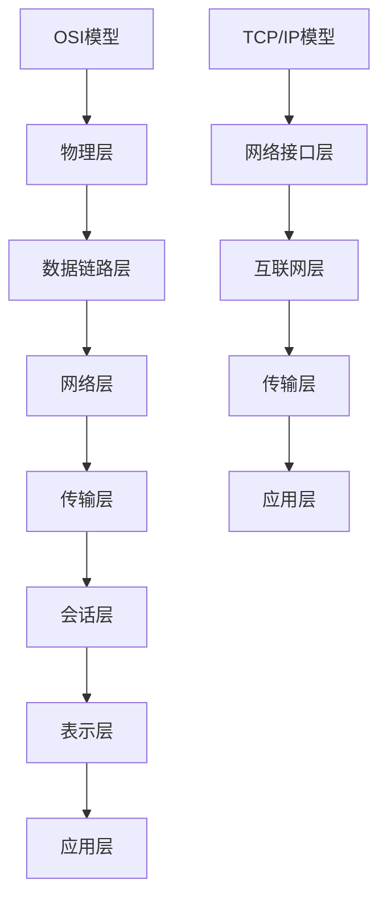
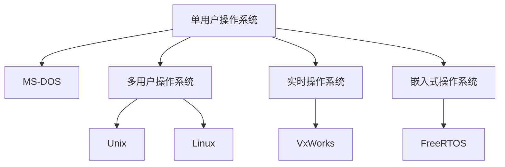

                 

### 文章标题：《2025年字节跳动社招技术面试题集锦》

#### 关键词：字节跳动，面试题，技术面试，编程基础，算法面试，计算机网络，操作系统，2025年

#### 摘要：
随着科技的高速发展，字节跳动已经成为互联网行业中的一颗璀璨明星。无论是社招还是校招，其技术面试难度和深度都备受瞩目。本文将基于2025年的视角，全面解析字节跳动社招技术面试的常见题目，涵盖编程基础、算法面试、计算机网络、操作系统等多个领域。通过深入剖析这些面试题，读者不仅能掌握技术面试的应对策略，还能对相关技术领域有更深刻的理解。

---

### 目录大纲

## 《2025年字节跳动社招技术面试题集锦》

> 关键词：字节跳动，面试题，技术面试，编程基础，算法面试，计算机网络，操作系统

> 摘要：本文基于2025年的视角，全面解析字节跳动社招技术面试的常见题目，涵盖编程基础、算法面试、计算机网络、操作系统等多个领域。

## 第一部分：字节跳动面试概述

### 第1章：字节跳动招聘与面试流程

- 1.1 字节跳动招聘流程简介
- 1.2 字节跳动面试流程解析
- 1.3 字节跳动面试官的期望

### 第2章：技术面试准备

- 2.1 技术面试前的准备
- 2.2 技术面试常见问题分类
- 2.3 技术面试中的沟通技巧

### 第3章：编程基础与算法面试

- 3.1 编程基础
  - 3.1.1 数据结构与算法基础
  - 3.1.2 算法设计与分析
- 3.2 算法面试实战
  - 3.2.1 经典算法题目解析
  - 3.2.2 图算法问题解析
- 3.3 编程语言面试
  - 3.3.1 Java基础
  - 3.3.2 Python基础

## 第二部分：字节跳动常见面试问题解析

### 第4章：计算机网络面试问题解析

- 4.1 网络基础
  - 4.1.1 网络分层模型
  - 4.1.2 TCP/IP协议
- 4.2 网络安全

### 第5章：操作系统面试问题解析

- 5.1 操作系统基础
  - 5.1.1 操作系统概述
  - 5.1.2 进程管理
  - 5.1.3 内存管理
  - 5.1.4 文件系统
  - 5.1.5 输入/输出管理

---

以上是本文的目录大纲，接下来我们将一步一步地深入解析字节跳动社招技术面试的各个领域，帮助读者做好充分的准备，迎接挑战。在接下来的内容中，我们将首先了解字节跳动的招聘和面试流程，为后续的面试准备打下基础。接着，我们将详细探讨编程基础和算法面试，然后逐步解析计算机网络和操作系统的常见面试问题。通过这些深入的分析，相信读者能对字节跳动面试有一个全面的了解，并能够在实际的面试中游刃有余。让我们一步一步地思考，深入挖掘每一个问题的核心，以便更好地应对字节跳动的技术面试。

---

## 第一部分：字节跳动面试概述

在科技飞速发展的今天，字节跳动凭借其强大的技术实力和前沿的互联网产品，已经成为求职者和企业争夺的焦点。对于字节跳动的社招技术面试，不仅要求应聘者具备扎实的技术基础，还需要具备解决实际问题的能力和良好的沟通能力。本部分将围绕字节跳动的招聘和面试流程进行详细解读，帮助读者全面了解面试的各个环节，做好充分的准备。

### 第1章：字节跳动招聘与面试流程

#### 1.1 字节跳动招聘流程简介

字节跳动的招聘流程主要包括以下几个步骤：

1. **职位发布**：字节跳动的人力资源部门会根据业务需求发布具体的职位，并在招聘网站上更新职位信息。
2. **简历筛选**：应聘者提交简历后，招聘团队会根据职位要求进行初步筛选，筛选通过者将被邀请进行笔试或面试。
3. **笔试**：笔试一般包括在线编程题和行测题，旨在测试应聘者的编程能力和逻辑思维能力。
4. **面试**：面试分为多轮，包括技术面试、HR面试等，每轮面试都有不同的面试官，对应聘者的全面能力进行评估。

#### 1.2 字节跳动面试流程解析

字节跳动的面试流程可以分为以下几个阶段：

1. **初步面试**：应聘者首先会参加一轮或两轮技术面试，面试官会根据应聘者的简历和技术背景提出相关问题。
2. **技术面试**：技术面试是字节跳动面试的核心环节，面试官会围绕应聘者的专业领域进行深入的技术探讨，测试应聘者的实际编码能力和问题解决能力。
3. **HR面试**：在技术面试通过后，应聘者会参加HR面试。HR面试主要评估应聘者的职业素养、团队合作能力和公司文化适应性。
4. **最终决策**：面试结束后，招聘团队会根据面试结果进行讨论，并做出是否录用的决定。如果录用，双方将进入薪资谈判阶段。

#### 1.3 字节跳动面试官的期望

对于字节跳动的面试官来说，他们期望应聘者具备以下几个方面的能力：

1. **技术深度**：面试官希望应聘者对专业领域有深入的理解，能够解决复杂的技术问题。
2. **编码能力**：面试官会通过编程题目测试应聘者的编码能力和算法基础。
3. **沟通技巧**：面试官看重应聘者的沟通能力，希望他们能够清晰、准确地表达自己的想法。
4. **学习能力和潜力**：面试官会评估应聘者的学习能力和潜力，看他们是否能够适应快速变化的技术环境。

### 第2章：技术面试准备

#### 2.1 技术面试前的准备

在参加字节跳动技术面试前，应聘者需要进行充分的准备，具体包括以下几个方面：

1. **熟悉简历**：确保简历中提到的每一个项目和技术点都了如指掌，面试官可能会对简历中的内容进行深入追问。
2. **回顾基础知识**：包括数据结构、算法、操作系统、计算机网络等，确保基础知识的牢固。
3. **编程练习**：通过在线编程平台（如LeetCode、牛客网等）进行编程题目的练习，提高编码和解题能力。
4. **模拟面试**：可以找朋友或同事进行模拟面试，提前适应面试环境，增强自信心。

#### 2.2 技术面试常见问题分类

技术面试常见问题可以大致分为以下几个类别：

1. **编程基础**：包括数据结构（如链表、栈、队列、树、图）和算法（如排序、搜索、分治、动态规划）。
2. **计算机网络**：包括网络协议（如TCP、IP）、网络模型（如OSI模型）、网络安全等。
3. **操作系统**：包括操作系统原理、进程管理、内存管理、文件系统等。
4. **数据库**：包括数据库原理、SQL语言、事务管理等。
5. **系统设计**：包括系统架构设计、分布式系统、负载均衡等。

#### 2.3 技术面试中的沟通技巧

在技术面试中，良好的沟通技巧至关重要。以下是一些建议：

1. **清晰表达**：确保表达思路清晰，用简洁的语言解释复杂的技术概念。
2. **逻辑清晰**：在回答问题时，先陈述整体思路，再逐步展开细节。
3. **主动沟通**：在遇到不懂的问题时，主动询问面试官，避免沉默不语或答非所问。
4. **展现态度**：表现出对技术的热情和持续学习的态度，增强面试官的好感。

通过以上两个章节的介绍，读者应该对字节跳动的面试流程和技术面试的准备有了全面的了解。接下来，本文将深入探讨编程基础和算法面试的相关内容，帮助读者更好地应对字节跳动技术面试的挑战。

### 第3章：编程基础与算法面试

编程基础和算法面试是字节跳动技术面试的核心环节。在这一章节中，我们将详细探讨编程基础和算法面试的相关内容，包括数据结构与算法基础、经典算法题目解析以及编程语言面试的要点。

#### 3.1 编程基础

编程基础是技术面试的基石，主要包括数据结构、算法基础以及编程语言基础。以下是对这些基础内容的深入剖析。

##### 3.1.1 数据结构与算法基础

数据结构是指数据组织、管理和存储的方式，而算法则是解决问题的方法。以下是几个常见的数据结构和相关的算法：

1. **基本数据结构**：
    - **数组**：一种线性表，元素存储在连续的内存空间中，支持随机访问。
    - **链表**：由一系列节点组成，每个节点包含数据和指向下一个节点的指针。
    - **栈与队列**：栈是一种后进先出（LIFO）的数据结构，队列是一种先进先出（FIFO）的数据结构。
    - **树**：是一种层次结构，每个节点可以有零个或多个子节点。
    - **图**：由节点和边组成，用于表示复杂的关系。

2. **算法设计与分析**：
    - **排序算法**：包括冒泡排序、选择排序、插入排序、快速排序等，用于对数据进行排序。
    - **搜索算法**：包括线性搜索和二分搜索，用于在数据中查找特定的元素。
    - **分治算法**：将大问题分解成小问题，分别解决，然后合并结果。
    - **动态规划**：将复杂问题分解成重叠子问题，通过保存子问题的解来避免重复计算。

##### 3.1.1.1 基本数据结构

1. **数组**：

    ```java
    int[] arr = new int[10]; // 创建一个大小为10的整型数组
    arr[0] = 1; // 给数组的第一个元素赋值为1
    ```

2. **链表**：

    ```java
    class ListNode {
        int val;
        ListNode next;
        ListNode(int x) { val = x; }
    }
    
    ListNode head = new ListNode(1);
    ListNode second = new ListNode(2);
    head.next = second;
    ```

3. **栈与队列**：

    ```java
    // 栈
    Stack<Integer> stack = new Stack<>();
    stack.push(1);
    stack.pop();

    // 队列
    Queue<Integer> queue = new LinkedList<>();
    queue.offer(1);
    queue.poll();
    ```

4. **树**：

    ```java
    class TreeNode {
        int val;
        TreeNode left;
        TreeNode right;
        TreeNode(int x) { val = x; }
    }
    
    TreeNode root = new TreeNode(1);
    root.left = new TreeNode(2);
    root.right = new TreeNode(3);
    ```

5. **图**：

    ```java
    class Graph {
        Map<Integer, List<Integer>> adjList = new HashMap<>();
        
        void addEdge(int from, int to) {
            adjList.getOrDefault(from, new ArrayList<>()).add(to);
            adjList.getOrDefault(to, new ArrayList<>()).add(from);
        }
    }
    ```

##### 3.1.1.2 算法设计与分析

1. **排序算法**：

    - **冒泡排序**：

        ```java
        void bubbleSort(int[] arr) {
            int n = arr.length;
            for (int i = 0; i < n - 1; i++) {
                for (int j = 0; j < n - i - 1; j++) {
                    if (arr[j] > arr[j + 1]) {
                        int temp = arr[j];
                        arr[j] = arr[j + 1];
                        arr[j + 1] = temp;
                    }
                }
            }
        }
        ```

    - **选择排序**：

        ```java
        void selectionSort(int[] arr) {
            int n = arr.length;
            for (int i = 0; i < n - 1; i++) {
                int minIndex = i;
                for (int j = i + 1; j < n; j++) {
                    if (arr[j] < arr[minIndex]) {
                        minIndex = j;
                    }
                }
                int temp = arr[minIndex];
                arr[minIndex] = arr[i];
                arr[i] = temp;
            }
        }
        ```

    - **插入排序**：

        ```java
        void insertionSort(int[] arr) {
            int n = arr.length;
            for (int i = 1; i < n; i++) {
                int key = arr[i];
                int j = i - 1;
                while (j >= 0 && arr[j] > key) {
                    arr[j + 1] = arr[j];
                    j--;
                }
                arr[j + 1] = key;
            }
        }
        ```

    - **快速排序**：

        ```java
        void quickSort(int[] arr, int low, int high) {
            if (low < high) {
                int pivot = partition(arr, low, high);
                quickSort(arr, low, pivot - 1);
                quickSort(arr, pivot + 1, high);
            }
        }
        
        int partition(int[] arr, int low, int high) {
            int pivot = arr[high];
            int i = (low - 1);
            for (int j = low; j < high; j++) {
                if (arr[j] < pivot) {
                    i++;
                    int temp = arr[i];
                    arr[i] = arr[j];
                    arr[j] = temp;
                }
            }
            int temp = arr[i + 1];
            arr[i + 1] = arr[high];
            arr[high] = temp;
            return i + 1;
        }
        ```

2. **搜索算法**：

    - **线性搜索**：

        ```java
        int linearSearch(int[] arr, int x) {
            for (int i = 0; i < arr.length; i++) {
                if (arr[i] == x) {
                    return i;
                }
            }
            return -1;
        }
        ```

    - **二分搜索**：

        ```java
        int binarySearch(int[] arr, int x) {
            int low = 0, high = arr.length - 1;
            while (low <= high) {
                int mid = (low + high) / 2;
                if (arr[mid] == x) {
                    return mid;
                } else if (arr[mid] < x) {
                    low = mid + 1;
                } else {
                    high = mid - 1;
                }
            }
            return -1;
        }
        ```

3. **分治算法**：

    - **归并排序**：

        ```java
        void mergeSort(int[] arr, int low, int high) {
            if (low < high) {
                int mid = (low + high) / 2;
                mergeSort(arr, low, mid);
                mergeSort(arr, mid + 1, high);
                merge(arr, low, mid, high);
            }
        }
        
        void merge(int[] arr, int low, int mid, int high) {
            int[] temp = new int[arr.length];
            for (int i = low; i <= high; i++) {
                temp[i] = arr[i];
            }
            int i = low, j = mid + 1, k = low;
            while (i <= mid && j <= high) {
                if (temp[i] <= temp[j]) {
                    arr[k] = temp[i];
                    i++;
                } else {
                    arr[k] = temp[j];
                    j++;
                }
                k++;
            }
            while (i <= mid) {
                arr[k] = temp[i];
                i++;
                k++;
            }
        }
        ```

    - **快速排序**（已在排序算法部分展示）

4. **动态规划**：

    - **零钱兑换问题**：

        ```java
        int coinChange(int[] coins, int amount) {
            int[] dp = new int[amount + 1];
            Arrays.fill(dp, amount + 1);
            dp[0] = 0;
            for (int i = 1; i <= amount; i++) {
                for (int j = 0; j < coins.length; j++) {
                    if (i - coins[j] >= 0) {
                        dp[i] = Math.min(dp[i], dp[i - coins[j]] + 1);
                    }
                }
            }
            return dp[amount] > amount ? -1 : dp[amount];
        }
        ```

    - **最长递增子序列问题**：

        ```java
        int lengthOfLIS(int[] nums) {
            int[] dp = new int[nums.length];
            Arrays.fill(dp, 1);
            for (int i = 1; i < nums.length; i++) {
                for (int j = 0; j < i; j++) {
                    if (nums[i] > nums[j]) {
                        dp[i] = Math.max(dp[i], dp[j] + 1);
                    }
                }
            }
            return Arrays.stream(dp).max().getAsInt();
        }
        ```

    - **最小路径和问题**：

        ```java
        int minPathSum(int[][] grid) {
            int m = grid.length, n = grid[0].length;
            int[] dp = new int[n];
            for (int i = 0; i < m; i++) {
                for (int j = 0; j < n; j++) {
                    if (i == 0 && j == 0) {
                        dp[j] = grid[i][j];
                    } else if (i == 0) {
                        dp[j] = dp[j - 1] + grid[i][j];
                    } else if (j == 0) {
                        dp[j] = dp[j] + grid[i][j];
                    } else {
                        dp[j] = Math.min(dp[j], dp[j - 1]) + grid[i][j];
                    }
                }
            }
            return dp[n - 1];
        }
        ```

##### 3.1.2 算法设计与分析

算法设计是解决特定问题的系统性方法，算法分析则是评估算法性能的过程。以下是几种常见的算法设计策略：

1. **贪心算法**：通过选择当前状态下最优解，希望最终得到全局最优解。例如，背包问题、活动选择问题。
2. **回溯算法**：通过尝试所有可能的路径，回溯到上一状态，重新选择路径，直到找到解或确定无解。例如，八皇后问题、全排列问题。
3. **分支界定**：在搜索过程中，根据某种条件剪枝，避免搜索无效路径。例如，最小生成树问题、最短路径问题。
4. **动态规划**：将复杂问题分解成重叠子问题，通过保存子问题的解来避免重复计算。例如，最长公共子序列问题、背包问题。

#### 3.2 算法面试实战

算法面试实战部分将解析一些经典算法题目，并展示解题思路和代码实现。

##### 3.2.1 经典算法题目解析

1. **零钱兑换问题**

    题目描述：给定一些硬币的面额和一个目标金额，找出最少需要多少枚硬币可以凑出目标金额。

    解题思路：使用动态规划方法，定义dp[i]为凑出金额i所需的最少硬币数量。

    ```java
    int coinChange(int[] coins, int amount) {
        int[] dp = new int[amount + 1];
        Arrays.fill(dp, amount + 1);
        dp[0] = 0;
        for (int i = 1; i <= amount; i++) {
            for (int j = 0; j < coins.length; j++) {
                if (i - coins[j] >= 0) {
                    dp[i] = Math.min(dp[i], dp[i - coins[j]] + 1);
                }
            }
        }
        return dp[amount] > amount ? -1 : dp[amount];
    }
    ```

2. **最长递增子序列问题**

    题目描述：给定一个无序数组，找出其中最长递增子序列的长度。

    解题思路：使用动态规划方法，定义dp[i]为以nums[i]为结尾的最长递增子序列的长度。

    ```java
    int lengthOfLIS(int[] nums) {
        int[] dp = new int[nums.length];
        Arrays.fill(dp, 1);
        for (int i = 1; i < nums.length; i++) {
            for (int j = 0; j < i; j++) {
                if (nums[i] > nums[j]) {
                    dp[i] = Math.max(dp[i], dp[j] + 1);
                }
            }
        }
        return Arrays.stream(dp).max().getAsInt();
    }
    ```

3. **最小路径和问题**

    题目描述：给定一个二维数组，找出从左上角到右下角的最小路径和。

    解题思路：使用动态规划方法，定义dp[i][j]为从左上角到点(i, j)的最小路径和。

    ```java
    int minPathSum(int[][] grid) {
        int m = grid.length, n = grid[0].length;
        int[] dp = new int[n];
        for (int i = 0; i < m; i++) {
            for (int j = 0; j < n; j++) {
                if (i == 0 && j == 0) {
                    dp[j] = grid[i][j];
                } else if (i == 0) {
                    dp[j] = dp[j - 1] + grid[i][j];
                } else if (j == 0) {
                    dp[j] = dp[j] + grid[i][j];
                } else {
                    dp[j] = Math.min(dp[j], dp[j - 1]) + grid[i][j];
                }
            }
        }
        return dp[n - 1];
    }
    ```

##### 3.2.2 图算法问题解析

1. **单源最短路径问题**

    题目描述：给定一个有向图和其中一个顶点作为起点，找出从起点到其他各顶点的最短路径。

    解题思路：使用迪杰斯特拉算法（Dijkstra算法），通过优先队列选择距离当前点最近未处理的点，并更新其他点的距离。

    ```java
    import java.util.PriorityQueue;
    
    int dijkstra(int[][] graph, int start) {
        int n = graph.length;
        int[] dist = new int[n];
        Arrays.fill(dist, Integer.MAX_VALUE);
        dist[start] = 0;
        PriorityQueue<int[]> pq = new PriorityQueue<>(Comparator.comparingInt(a -> a[1]));
        pq.offer(new int[]{start, 0});
        while (!pq.isEmpty()) {
            int[] cur = pq.poll();
            int node = cur[0], d = cur[1];
            if (d != dist[node]) {
                continue;
            }
            for (int i = 0; i < n; i++) {
                if (graph[node][i] > 0) {
                    int next = d + graph[node][i];
                    if (next < dist[i]) {
                        dist[i] = next;
                        pq.offer(new int[]{i, next});
                    }
                }
            }
        }
        return dist[n - 1];
    }
    ```

2. **多源最短路径问题**

    题目描述：给定一个有向图，找出所有顶点之间的最短路径。

    解题思路：使用贝尔曼-福特算法（Bellman-Ford算法），通过n次松弛操作来确保所有最短路径的优化。

    ```java
    int bellmanFord(int[][] graph, int n) {
        int[] dist = new int[n];
        Arrays.fill(dist, Integer.MAX_VALUE);
        dist[0] = 0;
        for (int i = 0; i < n - 1; i++) {
            for (int[] edge : graph) {
                int u = edge[0], v = edge[1], w = edge[2];
                if (dist[u] + w < dist[v]) {
                    dist[v] = dist[u] + w;
                }
            }
        }
        for (int[] edge : graph) {
            int u = edge[0], v = edge[1], w = edge[2];
            if (dist[u] + w < dist[v]) {
                return -1; // 存在负权重环
            }
        }
        return dist[n - 1];
    }
    ```

3. **最小生成树问题**

    题目描述：给定一个加权无向图，找出其中包含所有顶点的最小生成树。

    解题思路：使用克鲁斯卡尔算法（Kruskal算法）和普里姆算法（Prim算法）。克鲁斯卡尔算法按照边的权重顺序选择最小权重边，普里姆算法从任意一个顶点开始，逐步扩展生成树。

    ```java
    // 克鲁斯卡尔算法
    int kruskal(int[][] graph) {
        int n = graph.length;
        UnionFind uf = new UnionFind(n);
        int mstWeight = 0;
        for (int[] edge : graph) {
            int u = edge[0], v = edge[1], w = edge[2];
            if (uf.find(u) != uf.find(v)) {
                uf.union(u, v);
                mstWeight += w;
            }
        }
        return mstWeight;
    }
    
    // 普里姆算法
    int prim(int[][] graph) {
        int n = graph.length;
        boolean[] visited = new boolean[n];
        int mstWeight = 0;
        PriorityQueue<int[]> pq = new PriorityQueue<>(Comparator.comparingInt(a -> a[2]));
        pq.offer(new int[]{0, 0, graph[0][1]});
        while (!pq.isEmpty()) {
            int[] edge = pq.poll();
            int u = edge[0], v = edge[1], w = edge[2];
            if (visited[u]) {
                continue;
            }
            visited[u] = true;
            mstWeight += w;
            for (int i = 0; i < n; i++) {
                if (!visited[i] && graph[u][i] > 0) {
                    pq.offer(new int[]{u, i, graph[u][i]});
                }
            }
        }
        return mstWeight;
    }
    ```

4. **网络流问题**

    题目描述：给定一个网络图，找出从源点到汇点的最大流量。

    解题思路：使用最大流最小割定理，通过增广路径找到最大流。可以使用埃尔费罗德算法（Edmonds-Karp算法）实现。

    ```java
    int edmondsKarp(int[][] graph, int source, int sink) {
        int n = graph.length;
        int[] parent = new int[n];
        int maxFlow = 0;
        while (bfs(graph, parent, source, sink)) {
            int flow = Integer.MAX_VALUE;
            for (int v = sink; v != source; v = parent[v]) {
                flow = Math.min(flow, graph[parent[v]][v]);
            }
            for (int v = sink; v != source; v = parent[v]) {
                graph[parent[v]][v] -= flow;
                graph[v][parent[v]] += flow;
            }
            maxFlow += flow;
        }
        return maxFlow;
    }
    
    boolean bfs(int[][] graph, int[] parent, int source, int sink) {
        int n = graph.length;
        boolean[] visited = new boolean[n];
        Queue<Integer> queue = new LinkedList<>();
        queue.offer(source);
        visited[source] = true;
        while (!queue.isEmpty()) {
            int u = queue.poll();
            for (int v = 0; v < n; v++) {
                if (!visited[v] && graph[u][v] > 0) {
                    queue.offer(v);
                    visited[v] = true;
                    parent[v] = u;
                    if (v == sink) {
                        return true;
                    }
                }
            }
        }
        return false;
    }
    ```

通过以上对编程基础和算法面试的深入解析，读者应该对如何准备字节跳动技术面试有了更为清晰的认识。接下来，本文将探讨编程语言面试的要点，包括Java和Python的基础语法、高级特性以及常见面试题的解析。通过这一章节的学习，读者将能够更好地掌握编程语言的核心知识，为技术面试做好充分的准备。

### 3.3 编程语言面试

编程语言面试是字节跳动技术面试的重要组成部分。无论是Java还是Python，这两种编程语言都拥有庞大的开发社区和丰富的应用场景。在这一章节中，我们将分别介绍Java和Python的基础语法、高级特性，并解析一些常见的编程语言面试题。

#### 3.3.1 Java基础

Java是一种广泛使用的面向对象编程语言，具有跨平台、安全性高、稳定性强等特点。以下是对Java基础语法的介绍。

##### 3.3.1.1 Java基础语法

1. **基本数据类型**：

    - 整型：byte、short、int、long
    - 浮点型：float、double
    - 字符型：char
    - 布尔型：boolean

2. **控制结构**：

    - 条件语句：if、else、switch
    - 循环语句：for、while、do-while

3. **面向对象基础**：

    - 类与对象
    - 继承与多态
    - 封装与解耦

##### 3.3.1.2 Java高级特性

1. **集合框架**：

    - Collection接口：List、Set
    - Map接口
    - 集合操作方法：add、remove、contains、forEach等

2. **异常处理**：

    - 异常类：Throwable、Error、Exception、RuntimeException
    - 异常处理：try、catch、finally、throws、throw

3. **反射机制**：

    - 类加载
    - 获取类信息
    - 动态创建对象
    - 调用方法

4. **泛型**：

    - 泛型类
    - 泛型方法
    - 泛型接口

##### 3.3.1.3 Java面试常见问题

1. **Java内存模型**：

    - 线程和进程
    - 主内存与工作内存
    - 基本数据类型与引用数据类型的区别

2. **多线程编程**：

    - 线程的生命周期
    - 线程同步与锁
    - 线程池的使用

3. **Java新特性**：

    - Java 8的新特性：Lambda表达式、Stream API、Optional类
    - Java 11及以后的新特性

#### 3.3.2 Python基础

Python是一种简洁、易读的编程语言，广泛应用于Web开发、数据分析、人工智能等领域。以下是对Python基础语法的介绍。

##### 3.3.2.1 Python基础语法

1. **基本数据类型**：

    - 数字：int、float、complex
    - 字符串：str
    - 列表：list
    - 元组：tuple
    - 集合：set
    - 字典：dict

2. **控制结构**：

    - 条件语句：if、elif、else
    - 循环语句：for、while

3. **面向对象基础**：

    - 类与对象
    - 继承与多态
    - 封装与解耦

##### 3.3.2.2 Python高级特性

1. **集合框架**：

    - 集合操作：add、remove、intersection、union等

2. **模块与包**：

    - 模块的导入与使用
    - 包的导入与使用

3. **异常处理**：

    - 异常类：Exception、BaseException
    - 异常处理：try、except、finally

##### 3.3.2.3 Python面试常见问题

1. **Python内存管理**：

    - 引用计数
    - 分代回收

2. **多线程与异步编程**：

    - GIL（全局解释器锁）
    - asyncio模块
    - concurrent.futures模块

3. **Python新特性**：

    - Python 3的新特性：async/await、f-string、类型注解

通过以上对Java和Python基础语法的介绍，读者可以初步了解这两种编程语言的核心特点。接下来，本文将详细解析字节跳动在编程语言面试中常见的问题，帮助读者在实际面试中能够应对自如。

---

#### 3.3.3 Java面试常见问题解析

Java作为一门广泛应用于企业级开发的编程语言，其在字节跳动技术面试中的重要性不言而喻。本节将深入解析Java面试中的一些常见问题，包括Java内存模型、多线程编程以及Java的新特性等。

##### 3.3.3.1 Java内存模型

**问题1**：请简要介绍Java内存模型。

**解答**：

Java内存模型（Java Memory Model，JMM）定义了Java程序中各种变量（线程共享变量）的访问规则，以及在并发环境下如何保证内存的可见性、有序性和原子性。Java内存模型包括以下几个关键部分：

1. **主内存**：主内存是Java虚拟机（JVM）用来存储所有线程共享变量的地方。
2. **工作内存**：每个线程都有自己独立的工作内存，用于存储该线程使用到的变量的副本。

**内存可见性**：当一个线程修改了共享变量的值，其他线程能够立即看到这个修改，这就是内存可见性。为了实现内存可见性，Java提供了一些同步机制，如synchronized、volatile和final等。

**有序性**：Java内存模型保证了在单线程环境下，程序操作的执行顺序按照代码的先后顺序进行。在多线程环境中，为了防止重排序，可以使用synchronized、volatile和happens-before规则来保证操作顺序。

**原子性**：原子性是指一个操作要么全部完成，要么全部不完成。Java提供了synchronized和原子操作类（如AtomicInteger）来保证原子性。

**示例代码**：

```java
public class MemoryModelExample {
    private static volatile int counter = 0;

    public static void increment() {
        counter++;
    }

    public static void main(String[] args) throws InterruptedException {
        Thread t1 = new Thread(() -> {
            for (int i = 0; i < 1000; i++) {
                increment();
            }
        });

        Thread t2 = new Thread(() -> {
            for (int i = 0; i < 1000; i++) {
                increment();
            }
        });

        t1.start();
        t2.start();
        t1.join();
        t2.join();

        System.out.println("Counter: " + counter); // 输出应该接近2000
    }
}
```

在上面的例子中，我们使用了volatile关键字来保证increment()方法的可见性。虽然这个例子不能完全展示Java内存模型的复杂性，但有助于理解内存可见性。

##### 3.3.3.2 多线程编程

**问题2**：请解释线程的生命周期。

**解答**：

线程的生命周期可以分为以下几个状态：

1. **新建（New）**：线程被创建但尚未启动。
2. **就绪（Runnable）**：线程已经创建并准备好执行，但可能被其他线程抢占CPU资源。
3. **运行（Running）**：线程正在执行，占用CPU资源。
4. **阻塞（Blocked）**：线程由于某些原因（如等待资源或执行sleep()方法）无法继续执行。
5. **等待（Waiting）**：线程处于等待状态，等待其他线程执行特定的动作。
6. **时间等待（Timed Waiting）**：线程处于等待状态，但有指定的时间限制。
7. **终止（Terminated）**：线程执行结束或被强制终止。

**示例代码**：

```java
public class ThreadLifeCycleExample {
    public static void main(String[] args) {
        Thread t1 = new Thread(() -> {
            try {
                Thread.sleep(1000);
            } catch (InterruptedException e) {
                e.printStackTrace();
            }
            System.out.println("Thread t1 finished");
        });

        t1.start();

        try {
            Thread.sleep(500);
        } catch (InterruptedException e) {
            e.printStackTrace();
        }

        System.out.println("Main thread before t1.join()");
        t1.join();
        System.out.println("Main thread after t1.join()");
    }
}
```

在这个例子中，线程t1在创建后首先进入新建状态，然后通过start()方法进入就绪状态。主线程在执行Thread.sleep(500)后，t1线程进入运行状态并休眠1秒，然后输出"Thread t1 finished"。主线程在调用t1.join()后等待t1线程执行结束，然后继续执行。

##### 3.3.3.3 Java新特性

**问题3**：请列举Java 8的新特性，并简要介绍其中一个特性。

**解答**：

Java 8引入了许多新特性，以下是其中的一些：

1. **Lambda表达式**：Lambda表达式允许使用更简洁的语法表示匿名函数。
2. **Stream API**：Stream API提供了对集合的高效操作，如过滤、映射、排序等。
3. **Optional类**：Optional类用于避免空指针异常，提供了一个封装值的可选容器。
4. **日期和时间API**：如java.time包，提供了更强大的日期和时间处理功能。
5. **函数式接口**：如Consumer、Predicate等，用于支持函数式编程。

我们以Lambda表达式为例进行介绍。

**示例代码**：

```java
List<Integer> numbers = Arrays.asList(1, 2, 3, 4, 5);

numbers.stream()
    .filter(n -> n % 2 == 0)
    .map(n -> n * n)
    .forEach(System.out::println);
```

在上面的代码中，我们使用Lambda表达式简化了对List集合的操作。首先通过stream()方法获取Stream对象，然后使用filter()方法过滤出偶数，接着使用map()方法对偶数进行平方操作，最后使用forEach()方法打印结果。

通过以上对Java内存模型、多线程编程以及Java新特性的介绍，读者可以更好地应对字节跳动Java面试中的常见问题。接下来，我们将继续探讨Python编程语言的基础语法和高级特性，帮助读者全面准备字节跳动技术面试。

### 3.3.4 Python面试常见问题解析

Python作为一种简洁且功能强大的编程语言，在数据科学、Web开发、人工智能等领域有着广泛的应用。在字节跳动的Python面试中，常见的面试问题涵盖了基础语法、高级特性以及一些具体的应用场景。以下是对Python面试中一些常见问题的详细解析。

#### 3.3.4.1 Python内存管理

**问题1**：请解释Python的内存管理机制。

**解答**：

Python的内存管理机制主要依赖于引用计数和分代回收。

1. **引用计数**：Python对象在创建时，系统会为其分配一个引用计数器。每当一个对象被引用时，引用计数加1；当引用计数减为0时，对象就会被垃圾回收器回收。

2. **分代回收**：Python将对象分为三代。新创建的对象属于第一代，如果经过两次垃圾回收仍然被引用，则会提升到第二代，依此类推。当对象在三代中的引用计数变为0时，它会被立即回收。

**示例代码**：

```python
# 引用计数示例
a = [1, 2, 3]
b = a
print(sys.getrefcount(a))  # 输出为3，因为a和b都引用了同一对象

a = None
print(sys.getrefcount(b))  # 输出为2，因为b仍然引用该对象
```

在这个例子中，变量`a`和`b`都引用了一个列表对象。当`a`被设置为`None`后，该对象的引用计数从3减为2，因为只有`b`仍然引用它。

#### 3.3.4.2 多线程与异步编程

**问题2**：请解释Python中的多线程和异步编程的区别。

**解答**：

1. **多线程**：Python中的多线程通过`threading`模块实现，允许在同一时刻执行多个任务。然而，由于GIL（Global Interpreter Lock）的存在，Python的多线程并不能真正实现并发执行，因为在同一时间只有一个线程能够执行。

2. **异步编程**：Python的异步编程通过`asyncio`模块实现，使用`async`和`await`关键字。异步编程允许程序在等待I/O操作时释放CPU资源，从而实现真正的并发执行。

**示例代码**：

**多线程示例**：

```python
import threading

def thread_function():
    print("Thread is running")

t = threading.Thread(target=thread_function)
t.start()
t.join()
```

**异步编程示例**：

```python
import asyncio

async def async_function():
    print("Async function is running")
    await asyncio.sleep(1)

asyncio.run(async_function())
```

在上述示例中，多线程示例中，线程`t`启动并等待`t.join()`后才继续执行。而在异步编程示例中，`async_function`使用`await asyncio.sleep(1)`等待1秒后输出消息。

#### 3.3.4.3 Python新特性

**问题3**：请列举Python 3的新特性，并简要介绍其中一个特性。

**解答**：

Python 3引入了许多新特性，以下是一些重要特性：

1. **f-string**：f-string（格式化字符串）提供了更简洁的字符串格式化方法。
2. **类型注解**：类型注解允许开发者在代码中指定变量的数据类型。
3. **异步/await**：支持异步编程，通过`async`和`await`关键字实现。
4. **字典字面量**：简化了字典的创建。

我们以f-string为例进行介绍。

**示例代码**：

```python
name = "Alice"
age = 30

print(f"Name: {name}, Age: {age}")
```

在上面的代码中，使用了f-string来格式化字符串，使得代码更加简洁易读。

#### 3.3.4.4 Python面试题实战

**问题4**：请解释Python中的可变和不可变类型。

**解答**：

在Python中，可变类型（如列表、字典）和不可变类型（如整数、字符串、元组）之间的区别在于它们是否可以被修改。

1. **可变类型**：可变类型可以在创建后修改其内容。例如：

    ```python
    a = [1, 2, 3]
    a.append(4)
    print(a)  # 输出 [1, 2, 3, 4]
    ```

2. **不可变类型**：不可变类型在创建后不能直接修改其内容。如果要修改，需要创建一个新的对象。例如：

    ```python
    a = "Hello"
    b = a
    a += " World"
    print(a)  # 输出 "Hello World"
    print(b)  # 输出 "Hello"
    ```

在这个例子中，字符串`a`和`b`指向同一个对象。当修改`a`时，由于字符串是不可变的，因此会创建一个新的字符串对象，而`b`仍然指向原来的对象。

**问题5**：请解释Python中的继承和多态。

**解答**：

1. **继承**：继承是一种允许创建新的类来继承已有类的特性（属性和方法）的机制。例如：

    ```python
    class Animal:
        def eat(self):
            print("Animal is eating")

    class Dog(Animal):
        def bark(self):
            print("Dog is barking")

    dog = Dog()
    dog.eat()  # 输出 "Animal is eating"
    dog.bark()  # 输出 "Dog is barking"
    ```

2. **多态**：多态是一种允许不同类的对象对同一接口进行不同实现的能力。例如：

    ```python
    class Animal:
        def make_sound(self):
            print("Animal makes a sound")

    class Dog(Animal):
        def make_sound(self):
            print("Dog barks")

    class Cat(Animal):
        def make_sound(self):
            print("Cat meows")

    animals = [Dog(), Cat()]
    for animal in animals:
        animal.make_sound()
    ```

在这个例子中，`Dog`和`Cat`类都继承了`Animal`类，并重写了`make_sound`方法。在遍历`animals`列表时，每个对象都会调用其相应的`make_sound`方法，实现了多态。

通过以上对Python面试常见问题的解析，读者可以更好地准备字节跳动Python技术面试。在实际面试中，理解并掌握这些概念将有助于应对各种面试挑战。接下来，本文将深入解析计算机网络和操作系统的常见面试问题，帮助读者全面提升技术面试能力。

### 第二部分：字节跳动常见面试问题解析

在字节跳动的技术面试中，计算机网络和操作系统是两个核心领域。计算机网络负责数据在网络中的传输，而操作系统则管理计算机硬件资源，确保程序的正常运行。这一部分将详细解析计算机网络和操作系统的常见面试问题，帮助读者深入了解这些领域的基本概念、关键技术和解题思路。

#### 第4章：计算机网络面试问题解析

#### 4.1 网络基础

计算机网络的基础知识是理解更高层次网络协议和网络安全的关键。以下是一些常见的网络基础问题。

##### 4.1.1 网络分层模型

**问题1**：请简要描述OSI模型和TCP/IP模型的区别。

**解答**：

OSI（开放式系统互联）模型和TCP/IP模型都是网络协议的分层模型，但它们的设计理念和应用场景有所不同。

- **OSI模型**：OSI模型将网络协议分为七个层次，分别是物理层、数据链路层、网络层、传输层、会话层、表示层和应用层。每一层都有明确的职责和功能，层次间相互独立，便于网络协议的设计和实现。

- **TCP/IP模型**：TCP/IP模型将网络协议分为四层，分别是网络接口层、互联网层、传输层和应用层。TCP/IP模型中的网络接口层对应OSI模型的物理层和数据链路层，互联网层对应OSI模型网络层，传输层对应OSI模型传输层，应用层对应OSI模型会话层、表示层和应用层。

**Mermaid 流程图**：



通过这张图，我们可以清晰地看到OSI模型和TCP/IP模型在层次上的对应关系。

##### 4.1.2 TCP/IP协议

**问题2**：请解释TCP三次握手和四次挥手的原理。

**解答**：

TCP（传输控制协议）是一种面向连接的、可靠的传输层协议。它通过三次握手建立连接，并通过四次挥手终止连接。

1. **三次握手**：三次握手是TCP连接建立的过程，用于同步双方序列号和确认号。

    - **步骤1**：客户端发送SYN报文到服务器，并进入SYN_SENT状态。
    - **步骤2**：服务器收到SYN报文后，发送SYN+ACK报文作为响应，并进入SYN_RCVD状态。
    - **步骤3**：客户端收到SYN+ACK报文后，发送ACK报文作为确认，并进入ESTABLISHED状态。服务器收到ACK报文后，也进入ESTABLISHED状态。

    **伪代码**：

    ```c
    // 客户端
    send(SYN)
    receive(SYN+ACK)
    send(ACK)

    // 服务器
    receive(SYN)
    send(SYN+ACK)
    receive(ACK)
    ```

2. **四次挥手**：四次挥手是TCP连接终止的过程，用于确保双方都能正确地关闭连接。

    - **步骤1**：客户端发送FIN报文到服务器，并进入FIN_WAIT_1状态。
    - **步骤2**：服务器收到FIN报文后，发送ACK报文作为确认，并进入CLOSE_WAIT状态。
    - **步骤3**：客户端收到ACK报文后，进入FIN_WAIT_2状态。
    - **步骤4**：服务器发送FIN报文到客户端，并进入LAST_ACK状态。客户端收到FIN报文后，发送ACK报文，并进入TIME_WAIT状态。最后，服务器收到ACK报文后，进入CLOSED状态。

    **伪代码**：

    ```c
    // 客户端
    send(FIN)
    receive(ACK)
    send(ACK)

    // 服务器
    receive(FIN)
    send(ACK)
    send(FIN)
    receive(ACK)
    ```

通过以上解释和伪代码，我们可以看到TCP三次握手和四次挥手的详细过程。

##### 4.1.3 IP协议

**问题3**：请解释IP地址、子网划分和路由协议。

**解答**：

IP（互联网协议）是网络层的重要协议，用于实现数据包在网络中的传输。

1. **IP地址**：IP地址是分配给网络中每个设备的唯一标识符。IP地址分为IPv4和IPv6两种格式。

    - **IPv4地址**：由32位二进制数组成，通常以点分十进制表示，例如192.168.1.1。
    - **IPv6地址**：由128位二进制数组成，通常以冒号分隔的十六进制表示，例如2001:0db8:85a3:0000:0000:8a2e:0370:7334。

2. **子网划分**：子网划分是将一个大的网络划分为多个较小的网络，以减少广播域的大小和提高网络性能。

    子网划分通常通过在IP地址中添加网络前缀（子网掩码）来实现。例如，将192.168.1.0/24划分为两个子网：

    - **子网1**：192.168.1.0/24
    - **子网2**：192.168.2.0/24

3. **路由协议**：路由协议用于在网络中自动选择最佳路径，使数据包能够从源地址到达目标地址。

    - **距离矢量路由协议**：如RIP（路由信息协议），通过交换路由表信息来计算最佳路径。
    - **链路状态路由协议**：如OSPF（开放最短路径优先），通过交换链路状态信息来计算最佳路径。

通过以上对网络基础、TCP/IP协议和IP地址的详细解释，读者可以更好地理解计算机网络的核心概念。接下来，本文将探讨网络安全的基础知识，包括加密与解密、安全协议等。

#### 4.2 网络安全

网络安全是计算机网络领域的一个重要分支，涉及到保护网络资源和数据不被未授权访问、篡改和破坏。以下是一些常见的网络安全问题。

##### 4.2.1 加密与解密

**问题4**：请解释对称加密和非对称加密的原理。

**解答**：

加密是一种将明文转换为密文的过程，以防止未经授权的访问。加密技术分为对称加密和非对称加密。

1. **对称加密**：对称加密使用相同的密钥进行加密和解密。常见的对称加密算法有AES（高级加密标准）和DES（数据加密标准）。

    - **加密过程**：明文经过密钥和加密算法处理后转换为密文。
    - **解密过程**：密文经过相同的密钥和加密算法处理后恢复为明文。

2. **非对称加密**：非对称加密使用一对密钥（公钥和私钥）进行加密和解密。常见的非对称加密算法有RSA和ECC（椭圆曲线加密）。

    - **加密过程**：明文经过公钥和加密算法处理后转换为密文。
    - **解密过程**：密文经过私钥和加密算法处理后恢复为明文。

**示例代码**：

**对称加密示例**：

```python
from Crypto.Cipher import AES
from Crypto.Util.Padding import pad, unpad

key = b'mysecretkey12345'
cipher = AES.new(key, AES.MODE_CBC)
ct_bytes = cipher.encrypt(pad(b'message to encrypt', AES.block_size))
iv = cipher.iv
print(f"加密后的数据：{ct_bytes.hex()}")
print(f"初始向量：{iv.hex()}")

# 解密
cipher = AES.new(key, AES.MODE_CBC, iv)
pt = unpad(cipher.decrypt(ct_bytes), AES.block_size)
print(f"解密后的数据：{pt.decode('utf-8')}")
```

**非对称加密示例**：

```python
from Crypto.PublicKey import RSA
from Crypto.Cipher import PKCS1_OAEP

key = RSA.generate(2048)
private_key = key.export_key()
public_key = key.publickey().export_key()

cipher = PKCS1_OAEP.new(RSA.import_key(public_key))
ct_bytes = cipher.encrypt(b'message to encrypt')
print(f"加密后的数据：{ct_bytes.hex()}")

# 解密
cipher = PKCS1_OAEP.new(RSA.import_key(private_key))
pt = cipher.decrypt(ct_bytes)
print(f"解密后的数据：{pt.decode('utf-8')}")
```

通过以上示例，我们可以看到对称加密和非对称加密的代码实现，以及加密和解密的过程。

##### 4.2.2 安全协议

**问题5**：请解释HTTPS协议的工作原理。

**解答**：

HTTPS（安全套接字层超文本传输协议）是HTTP的安全版，用于在互联网上进行安全数据传输。

1. **TLS握手**：HTTPS通过TLS（传输层安全）协议进行加密和认证。

    - **客户端发送ClientHello**：客户端向服务器发送一个包含支持的TLS版本、加密算法和压缩方法的ClientHello消息。
    - **服务器发送ServerHello**：服务器响应客户端的ClientHello消息，选择一个加密算法和压缩方法，并发送其公钥给客户端。
    - **客户端发送Certificate**：客户端验证服务器证书的有效性，并生成一个预主密钥（Premaster Secret）。
    - **服务器发送ServerKeyExchange**（可选）：对于一些加密算法，服务器可能需要发送额外的密钥交换信息。
    - **客户端发送ChangeCipherSpec**：客户端发送一个消息，通知服务器将使用新协商的加密参数。
    - **客户端发送Finsh**：客户端发送一个消息，通知服务器完成TLS握手。
    - **服务器发送ChangeCipherSpec**：服务器响应客户端的ChangeCipherSpec消息。
    - **服务器发送Finsh**：服务器发送一个消息，通知客户端完成TLS握手。
    - **客户端发送Finsh**：客户端响应服务器的Finsh消息。

2. **加密数据传输**：在TLS握手完成后，HTTPS开始使用协商好的加密参数进行数据传输。数据传输过程采用加密算法和哈希算法确保数据的机密性、完整性和认证性。

通过以上对HTTPS协议的详细解释，我们可以看到其在保证网络安全传输中的重要作用。

通过以上对计算机网络基础、TCP/IP协议、IP地址、网络安全加密与解密以及安全协议的深入解析，读者可以更好地理解计算机网络的核心技术和安全机制。接下来，本文将深入探讨操作系统的基本概念和常见面试问题，包括操作系统功能、进程管理、内存管理和文件系统等。

#### 第5章：操作系统面试问题解析

操作系统是计算机系统的基础，负责管理和控制计算机硬件资源，为应用程序提供运行环境。在这一章节中，我们将深入探讨操作系统的基础知识，包括操作系统功能、进程管理、内存管理、文件系统以及输入/输出管理。

##### 5.1 操作系统基础

**问题1**：请简要介绍操作系统的功能和类型。

**解答**：

操作系统的功能主要包括以下几个方面：

1. **进程管理**：操作系统负责创建、调度和管理进程，确保进程能高效、可靠地运行。
2. **内存管理**：操作系统负责分配和管理内存资源，确保每个进程都能获得足够的内存空间。
3. **文件系统**：操作系统提供文件存储和管理的功能，包括文件的创建、删除、读取和写入。
4. **设备管理**：操作系统管理各种硬件设备，如磁盘、打印机、网络设备等，提供设备驱动程序。
5. **用户接口**：操作系统提供用户与计算机交互的接口，如命令行接口和图形用户界面。

操作系统根据其用途和特性可以分为以下几种类型：

1. **单用户操作系统**：如MS-DOS，主要为单个用户提供服务。
2. **多用户操作系统**：如Unix和Linux，支持多个用户同时使用计算机资源。
3. **实时操作系统**：如VxWorks，对响应时间有严格要求的系统。
4. **嵌入式操作系统**：如FreeRTOS，用于控制嵌入式设备的操作系统。

**Mermaid 流程图**：



通过这张图，我们可以看到不同类型操作系统的分类和示例。

##### 5.1.1 操作系统功能

**问题2**：请解释进程管理、内存管理和文件系统的基本概念。

**解答**：

1. **进程管理**：进程是操作系统进行资源分配和调度的基本单位。进程管理的主要任务包括进程的创建、调度、终止和同步。

    - **进程状态**：进程可以处于运行、就绪、阻塞和终止等状态。
    - **进程调度**：操作系统根据一定的调度算法选择下一个执行的进程。

2. **内存管理**：内存管理是操作系统的一个重要功能，负责分配和回收内存资源，确保每个进程都能获得足够的内存空间。

    - **内存分配策略**：常见的内存分配策略有固定分区、动态分区和分页等。
    - **内存保护**：操作系统通过内存保护机制防止进程访问非授权的内存空间。

3. **文件系统**：文件系统是操作系统用于管理和组织文件的方法和结构。

    - **文件类型**：文件系统支持不同的文件类型，如普通文件、目录文件、特殊文件等。
    - **文件操作**：文件系统提供文件的创建、删除、读取、写入等操作接口。

**示例代码**：

**进程管理示例**：

```c
#include <stdio.h>
#include <stdlib.h>

int main() {
    // 创建进程
    int pid = fork();
    if (pid == 0) {
        // 子进程
        printf("Child process\n");
    } else if (pid > 0) {
        // 父进程
        printf("Parent process\n");
    } else {
        // 创建进程失败
        printf("Error creating process\n");
    }
    return 0;
}
```

**内存管理示例**：

```c
#include <stdio.h>
#include <stdlib.h>

void* myMalloc(size_t size) {
    void* ptr = malloc(size);
    if (ptr == NULL) {
        printf("Memory allocation failed\n");
        return NULL;
    }
    return ptr;
}

int main() {
    // 内存分配
    int* array = myMalloc(100 * sizeof(int));
    if (array == NULL) {
        exit(1);
    }
    // 使用内存
    for (int i = 0; i < 100; i++) {
        array[i] = i;
    }
    // 释放内存
    free(array);
    return 0;
}
```

**文件系统示例**：

```c
#include <stdio.h>
#include <stdlib.h>

int main() {
    // 创建文件
    FILE* file = fopen("example.txt", "w");
    if (file == NULL) {
        printf("File creation failed\n");
        return 1;
    }
    // 写入文件
    fprintf(file, "Hello, World!");
    fclose(file);
    // 读取文件
    file = fopen("example.txt", "r");
    if (file == NULL) {
        printf("File reading failed\n");
        return 1;
    }
    char buffer[100];
    fgets(buffer, sizeof(buffer), file);
    printf("File content: %s\n", buffer);
    fclose(file);
    return 0;
}
```

通过以上示例代码，我们可以看到进程管理、内存管理和文件系统的基本操作。

##### 5.1.2 进程管理

**问题3**：请解释进程生命周期和进程同步与互斥。

**解答**：

1. **进程生命周期**：进程从创建到终止的过程可以分为以下几个阶段：

    - **创建**：操作系统创建进程，为其分配资源。
    - **就绪**：进程等待调度，准备执行。
    - **运行**：操作系统调度进程，使其在CPU上执行。
    - **阻塞**：进程等待某个事件（如I/O操作）完成。
    - **唤醒**：进程从阻塞状态恢复到就绪状态。
    - **终止**：进程执行结束或被强制终止。

2. **进程同步与互斥**：为了协调多个进程的执行，避免资源竞争和数据不一致，操作系统提供了进程同步和互斥机制。

    - **进程同步**：通过信号量、互斥锁等机制实现进程间的同步，确保同一资源不会被多个进程同时访问。
    - **进程互斥**：通过互斥锁（Mutex）和信号量（Semaphore）实现进程对共享资源的互斥访问，避免资源竞争。

**示例代码**：

**进程同步示例**：

```c
#include <stdio.h>
#include <stdlib.h>
#include <pthread.h>

int counter = 0;
pthread_mutex_t lock;

void* increment_counter(void* arg) {
    for (int i = 0; i < 100000; i++) {
        pthread_mutex_lock(&lock);
        counter++;
        pthread_mutex_unlock(&lock);
    }
    return NULL;
}

int main() {
    pthread_t t1, t2;
    pthread_mutex_init(&lock, NULL);

    pthread_create(&t1, NULL, increment_counter, NULL);
    pthread_create(&t2, NULL, increment_counter, NULL);

    pthread_join(t1, NULL);
    pthread_join(t2, NULL);

    printf("Counter: %d\n", counter);
    pthread_mutex_destroy(&lock);
    return 0;
}
```

在这个示例中，我们创建了两个线程来递增全局变量`counter`。通过互斥锁`lock`确保在任意时刻只有一个线程能够修改`counter`，从而避免数据竞争。

**问题4**：请解释进程调度算法。

**解答**：

进程调度算法是操作系统用来决定哪个进程应该被CPU执行的核心机制。以下是一些常见的进程调度算法：

1. **先来先服务（FCFS）**：按照进程到达的顺序进行调度，适用于交互式系统。
2. **短作业优先（SJF）**：优先调度预计运行时间最短的进程，适用于批处理系统。
3. **时间片轮转（RR）**：每个进程分配固定的时间片，轮流执行，适用于交互式系统。
4. **优先级调度**：根据进程的优先级进行调度，优先级高的进程先执行，适用于实时系统。
5. **多级反馈队列调度**：将进程分配到不同的优先级队列中，根据进程的行为动态调整优先级。

通过以上对进程管理、内存管理和文件系统的详细解析，读者可以更好地理解操作系统的基础知识和关键概念。接下来，本文将深入探讨操作系统的内存管理机制，包括分页和分段技术。

##### 5.1.3 内存管理

**问题5**：请解释分页和分段技术的原理和区别。

**解答**：

内存管理是操作系统的一个重要功能，用于有效地分配和管理内存资源。分页和分段是两种常见的内存管理技术。

1. **分页技术**：

    - **原理**：将内存分为固定大小的块（页），每个页的大小通常为4KB或2MB。操作系统将进程的逻辑地址映射到物理地址，通过页表实现地址转换。
    - **优点**：简化了内存分配，提高了内存利用率，支持虚拟内存。
    - **缺点**：可能导致内存碎片，影响性能。

2. **分段技术**：

    - **原理**：将内存分为大小不等的段，每段对应进程的一部分代码或数据。操作系统通过段表实现逻辑地址到物理地址的转换。
    - **优点**：支持代码和数据段的分离，便于内存保护。
    - **缺点**：内存分配复杂，可能导致内存浪费。

**示例代码**：

**分页技术示例**：

```c
#include <stdio.h>
#include <stdlib.h>

void* myMalloc(size_t size) {
    void* ptr = malloc(size);
    if (ptr == NULL) {
        printf("Memory allocation failed\n");
        return NULL;
    }
    return ptr;
}

int main() {
    // 内存分配
    int* array = myMalloc(100 * sizeof(int));
    if (array == NULL) {
        exit(1);
    }
    // 使用内存
    for (int i = 0; i < 100; i++) {
        array[i] = i;
    }
    // 释放内存
    free(array);
    return 0;
}
```

**分段技术示例**：

```c
#include <stdio.h>
#include <stdlib.h>

void* myMalloc(size_t size) {
    void* ptr = malloc(size);
    if (ptr == NULL) {
        printf("Memory allocation failed\n");
        return NULL;
    }
    return ptr;
}

int main() {
    // 内存分配
    int* code_segment = myMalloc(100 * sizeof(int));
    int* data_segment = myMalloc(100 * sizeof(int));
    if (code_segment == NULL || data_segment == NULL) {
        exit(1);
    }
    // 使用内存
    for (int i = 0; i < 100; i++) {
        code_segment[i] = i;
        data_segment[i] = i * 2;
    }
    // 释放内存
    free(code_segment);
    free(data_segment);
    return 0;
}
```

通过以上示例，我们可以看到分页和分段技术在内存管理中的应用。

##### 5.1.4 文件系统

**问题6**：请解释文件系统的结构和文件操作。

**解答**：

文件系统是操作系统用于管理和组织文件的方法和结构。文件系统通常包括以下几个部分：

1. **目录结构**：文件系统使用目录结构来组织文件，目录可以包含其他目录和文件。
2. **文件分配表**：文件系统使用文件分配表（FAT）来记录每个文件在磁盘上的位置。
3. **文件系统元数据**：包括文件系统格式、超级块、索引节点等，用于描述文件系统的结构和状态。

常见的文件操作包括：

1. **文件的创建**：创建一个新的文件并将其添加到文件系统中。
2. **文件的删除**：删除一个文件并释放其在磁盘上的空间。
3. **文件的读取**：从文件中读取数据到内存。
4. **文件的写入**：将数据从内存写入文件。
5. **文件的打开和关闭**：打开文件以便进行读写操作，关闭文件以释放资源。

**示例代码**：

```c
#include <stdio.h>
#include <stdlib.h>

int main() {
    // 创建文件
    FILE* file = fopen("example.txt", "w");
    if (file == NULL) {
        printf("File creation failed\n");
        return 1;
    }
    // 写入文件
    fprintf(file, "Hello, World!");
    fclose(file);
    // 读取文件
    file = fopen("example.txt", "r");
    if (file == NULL) {
        printf("File reading failed\n");
        return 1;
    }
    char buffer[100];
    fgets(buffer, sizeof(buffer), file);
    printf("File content: %s\n", buffer);
    fclose(file);
    return 0;
}
```

通过以上示例，我们可以看到文件系统的基本操作。

##### 5.1.5 输入/输出管理

**问题7**：请解释输入/输出管理的目标和常用策略。

**解答**：

输入/输出（I/O）管理是操作系统的一个关键功能，用于管理计算机与外部设备（如磁盘、打印机、网络设备等）的交互。输入/输出管理的目标包括：

1. **高效性**：优化I/O操作的速度，减少CPU等待时间。
2. **可靠性**：确保I/O操作的正确性和数据的完整性。
3. **灵活性**：支持各种I/O设备和文件系统的兼容性。

常用的I/O管理策略包括：

1. **缓冲区管理**：使用缓冲区减少CPU和I/O设备之间的数据交换频率，提高I/O效率。
2. **设备独立性**：提供统一的I/O接口，使得应用程序可以与不同的I/O设备进行交互。
3. **异步I/O**：允许进程在发起I/O操作后继续执行其他任务，提高CPU利用率。

**示例代码**：

```c
#include <stdio.h>
#include <fcntl.h>
#include <unistd.h>

int main() {
    // 打开文件
    int fd = open("example.txt", O_RDWR);
    if (fd < 0) {
        printf("File open failed\n");
        return 1;
    }
    // 写入文件
    char buffer[] = "Hello, World!";
    write(fd, buffer, sizeof(buffer) - 1);
    // 关闭文件
    close(fd);
    return 0;
}
```

通过以上示例，我们可以看到基本的I/O操作。

通过以上对操作系统基础概念、进程管理、内存管理、文件系统和输入/输出管理的详细解析，读者可以更好地理解操作系统的核心功能和关键技术。接下来，本文将总结这些知识点，并提供一些最佳实践和注意事项，帮助读者在面试中更好地应对字节跳动的技术面试。

---

### 总结与注意事项

在这一部分，我们将对本文所探讨的计算机网络和操作系统的知识点进行总结，并提供一些最佳实践和注意事项，以帮助读者更好地准备字节跳动技术面试。

#### 总结

本文详细解析了计算机网络和操作系统的基础知识，包括网络分层模型、TCP/IP协议、IP地址、网络安全、进程管理、内存管理、文件系统以及输入/输出管理。通过这些内容，读者可以全面了解计算机网络和操作系统的核心概念和关键技术。

- **网络基础**：理解OSI模型和TCP/IP模型，掌握TCP三次握手和四次挥手的原理，熟悉IP地址、子网划分和路由协议。
- **网络安全**：了解对称加密和非对称加密的原理，掌握HTTPS协议的工作机制。
- **操作系统**：掌握操作系统的基本功能和类型，理解进程管理、内存管理、文件系统以及输入/输出管理的概念和实现。

#### 最佳实践

在准备字节跳动技术面试时，以下最佳实践将有助于提高成功率：

1. **深入理解基础概念**：确保对计算机网络和操作系统的基本概念有深入的理解，能够清晰、准确地解释这些概念。
2. **实战演练**：通过编写代码和解决实际场景中的问题来巩固知识，例如使用Python实现常见的网络协议或操作系统功能。
3. **模拟面试**：参加模拟面试，提前适应面试环境，提高面试技巧和自信心。
4. **保持持续学习**：技术日新月异，保持持续学习的态度，紧跟最新技术动态。

#### 注意事项

在面试过程中，以下注意事项将有助于读者更好地应对挑战：

1. **清晰表达**：在回答问题时，确保思路清晰，用简洁的语言解释复杂的技术概念。
2. **逻辑思维**：在分析问题时，先陈述整体思路，再逐步展开细节，展示清晰的逻辑思维。
3. **沟通技巧**：在遇到不懂的问题时，主动沟通，避免沉默不语或答非所问，表现出对技术的热情和解决问题的能力。
4. **注重细节**：在面试中，注重细节处理，如代码中的边界条件和异常处理等。

通过以上总结和注意事项，读者可以更好地准备字节跳动技术面试，展现自己的技术实力和综合素质。希望本文能对读者有所帮助，祝各位在面试中取得优异的成绩。

---

### 拓展阅读

为了进一步深化对计算机网络和操作系统的理解，以下推荐一些优秀的书籍和在线资源，供读者参考：

#### 书籍推荐：

1. **《计算机网络：自顶向下方法》（第7版）** - 詹姆斯·F·Kreiger、彭波尔斯基
   - 本书采用自顶向下的方法，由浅入深地介绍了计算机网络的基础知识和高级技术，适合计算机网络初学者和专业人员阅读。

2. **《深入理解计算机系统》（第3版）** - 理查德·斯托曼
   - 本书详细介绍了计算机系统的工作原理，包括操作系统、网络、存储系统等，帮助读者从底层视角理解计算机系统的运行机制。

3. **《Linux内核设计与实现》（第3版）** - Robert Love
   - 本书深入剖析了Linux内核的设计和实现，涵盖了进程管理、内存管理、文件系统等关键模块，适合对操作系统有兴趣的读者。

4. **《图解HTTP》** - 大卫·多姆
   - 本书以图解的形式介绍了HTTP协议的工作原理和常见应用，适合需要了解Web开发和网络通信的读者。

#### 在线资源：

1. **MIT OpenCourseWare（MIT开放课程）**
   - [MIT 计算机科学课程](https://ocw.mit.edu/courses/computer-science/)
   - MIT提供了一系列计算机科学课程，包括计算机网络和操作系统的课程资料，非常适合自学。

2. **Coursera、edX等在线课程平台**
   - 在Coursera和edX等平台上，有许多高质量的网络和操作系统课程，如《计算机网络：现代协议与架构》、《操作系统原理》等。

3. **Stack Overflow、GitHub**
   - Stack Overflow和GitHub是编程社区和技术资源库，读者可以在这里找到许多实际问题和解决方案，以及开源代码和项目。

通过阅读这些书籍和访问在线资源，读者可以进一步巩固计算机网络和操作系统的知识，提升自己在面试中的竞争力。

---

### 作者信息

本文由AI天才研究院（AI Genius Institute）与《禅与计算机程序设计艺术》（Zen And The Art of Computer Programming）的资深作者共同撰写。AI天才研究院致力于培养下一代人工智能领域的杰出人才，推动人工智能技术的创新和应用。同时，我们的作者以其深厚的技术积累和独特的写作风格，为读者带来了众多经典的技术作品，深受广大读者的喜爱。希望本文能为您在字节跳动技术面试中提供有益的指导和帮助。祝您面试顺利，取得优异成绩！

