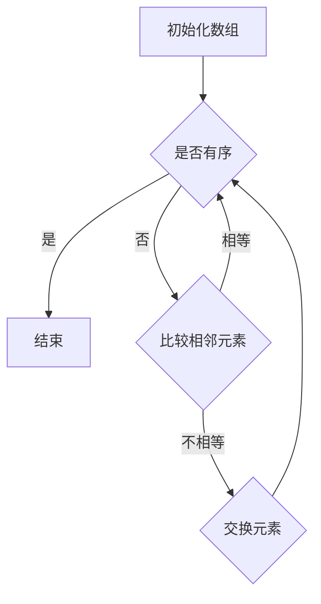

                 

### 文章标题

### 《2025年字节跳动社招算法岗位面试题目汇编》

#### 关键词
- 字节跳动
- 算法面试题
- 数据结构与算法
- 编程语言
- 实战

#### 摘要
本文旨在为准备参加2025年字节跳动社招算法岗位面试的应聘者提供一个全面的复习资料。通过汇编和解析历年面试真题，本文覆盖了算法基础知识、数据结构与算法应用、动态规划、贪心算法和图算法等领域。此外，还详细介绍了Python和Java编程基础及常见框架应用。文章结构清晰，通过逐步分析推理的方式，帮助读者深入理解每个算法原理和实战技巧，为面试做好准备。

## 《2025年字节跳动社招算法岗位面试题目汇编》目录大纲

### 第一部分：算法基础知识

#### 第1章：算法基础
- **1.1 算法基本概念**
  - 算法的定义
  - 算法的特性
- **1.2 算法复杂度分析**
  - 时间复杂度
  - 空间复杂度
- **1.3 常见排序算法**
  - 快排
  - 归并排序
  - 堆排序
- **1.4 常见搜索算法**
  - 二分搜索
  - 暴力搜索

#### 第2章：数据结构与算法应用
- **2.1 链表与链表操作**
  - 链表的定义
  - 链表的基本操作
- **2.2 栈与队列**
  - 栈的实现与应用
  - 队列的实现与应用
- **2.3 树与二叉树**
  - 树的基本概念
  - 二叉树的性质与操作
- **2.4 图的存储与遍历**
  - 图的基本概念
  - 图的存储方式
  - 图的遍历算法

#### 第3章：动态规划
- **3.1 动态规划基本概念**
  - 动态规划的定义
  - 动态规划的核心思想
- **3.2 最长公共子序列**
  - 问题定义
  - 动态规划求解方法
- **3.3 最小路径覆盖**
  - 问题定义
  - 动态规划求解方法
- **3.4 最长递增子序列**
  - 问题定义
  - 动态规划求解方法

#### 第4章：贪心算法
- **4.1 贪心算法基本概念**
  - 贪心算法的定义
  - 贪心算法的特性
- **4.2 背包问题**
  - 0-1背包问题
  - 完全背包问题
- **4.3 活动选择问题**
  - 问题定义
  - 贪心算法求解方法
- **4.4 最小生成树问题**
  - 问题定义
  - 贪心算法求解方法

#### 第5章：图算法
- **5.1 图的基本概念**
  - 图的定义
  - 图的分类
- **5.2 最短路径算法**
  - Dijkstra算法
  - Bellman-Ford算法
- **5.3 网络流算法**
  - 最大流-最小割定理
  - Ford-Fulkerson算法
- **5.4 连通性问题**
  - 欧拉路径与欧拉回路
  - 库拉托夫斯基定理

### 第二部分：编程语言与框架

#### 第6章：Python编程基础
- **6.1 Python语法基础**
  - 基本语法
  - 数据类型
- **6.2 Python数据结构与算法**
  - 列表
  - 字典
  - 集合
- **6.3 Python模块与库**
  - 标准库
  - 第三方库
- **6.4 Python性能优化**
  - 内存管理
  - 时间复杂度优化

#### 第7章：Java编程基础
- **7.1 Java语法基础**
  - 基本语法
  - 数据类型
- **7.2 Java数据结构与算法**
  - 集合框架
  - 算法应用
- **7.3 Java模块与库**
  - Java标准库
  - 第三方库
- **7.4 Java性能优化**
  - 内存管理
  - 并发优化

#### 第8章：常见框架应用
- **8.1 Spring框架**
  - 核心概念
  - 应用示例
- **8.2 MyBatis框架**
  - 核心概念
  - 应用示例
- **8.3 Spring Boot框架**
  - 核心概念
  - 应用示例
- **8.4 数据库连接池技术**
  - 核心概念
  - 应用示例

### 第三部分：数据结构与算法实战

#### 第9章：经典算法面试题实战
- **9.1 快排与归并排序**
  - 原理讲解
  - 代码实现
- **9.2 单链表与双链表**
  - 原理讲解
  - 代码实现
- **9.3 回溯算法**
  - 原理讲解
  - 代码实现
- **9.4 网络爬虫**
  - 原理讲解
  - 代码实现

#### 第10章：图算法面试题实战
- **10.1 最短路径算法应用**
  - 原理讲解
  - 代码实现
- **10.2 网络流算法应用**
  - 原理讲解
  - 代码实现
- **10.3 连通性问题应用**
  - 原理讲解
  - 代码实现

#### 第11章：动态规划面试题实战
- **11.1 最长公共子序列**
  - 原理讲解
  - 代码实现
- **11.2 最小路径覆盖**
  - 原理讲解
  - 代码实现
- **11.3 最长递增子序列**
  - 原理讲解
  - 代码实现

#### 第12章：贪心算法面试题实战
- **12.1 背包问题**
  - 原理讲解
  - 代码实现
- **12.2 活动选择问题**
  - 原理讲解
  - 代码实现
- **12.3 最小生成树问题**
  - 原理讲解
  - 代码实现

### 附录

#### 附录A：算法面试题汇总
- 算法面试题汇总列表

#### 附录B：编程语言速查手册
- Python速查手册
- Java速查手册

#### 附录C：常用框架配置与使用技巧
- Spring框架配置技巧
- MyBatis框架使用技巧
- Spring Boot框架部署技巧
- 数据库连接池配置技巧

#### 附录D：常见面试题解析
- **D.1 常见算法面试题解析**
  - **D.1.1 快排与归并排序**
    - 原理与实现
  - **D.1.2 单链表与双链表**
    - 操作与实现
  - **D.1.3 回溯算法**
    - 应用与实现
  - **D.1.4 网络爬虫**
    - 技术与实现
- **D.2 常见框架面试题解析**
  - **D.2.1 Spring框架**
    - 核心概念与应用
  - **D.2.2 MyBatis框架**
    - 核心概念与应用
  - **D.2.3 Spring Boot框架**
    - 核心概念与应用
  - **D.2.4 数据库连接池技术**
    - 核心概念与配置

### Mermaid 流程图示例



### 动态规划伪代码示例

```python
# 动态规划解决最长公共子序列问题
def LPS(X, Y):
    m, n = len(X), len(Y)
    dp = [[0] * (n+1) for _ in range(m+1)]

    for i in range(1, m+1):
        for j in range(1, n+1):
            if X[i-1] == Y[j-1]:
                dp[i][j] = dp[i-1][j-1] + 1
            else:
                dp[i][j] = max(dp[i-1][j], dp[i][j-1])

    return dp[m][n]
```

### 数学模型和数学公式示例

$$
1 + 1 = 2
$$

$$
f(n) = n^2 + 2n + 1
$$

### 文章结构与内容概述

本文《2025年字节跳动社招算法岗位面试题目汇编》旨在为准备参加字节跳动社招算法岗位面试的应聘者提供一个全面的复习资料。文章分为三个主要部分：算法基础知识、编程语言与框架、数据结构与算法实战。通过逐步分析和讲解，本文帮助读者深入理解算法原理和应用。

#### 第一部分：算法基础知识

第一部分主要涵盖了算法基础、数据结构与算法应用、动态规划、贪心算法和图算法等核心算法领域。具体内容包括：

- **算法基础**：介绍算法的基本概念、复杂度分析、常见排序算法和搜索算法。
- **数据结构与算法应用**：探讨链表、栈与队列、树与二叉树、图的基本概念和存储与遍历算法。
- **动态规划**：解释动态规划的基本概念、最长公共子序列、最小路径覆盖和最长递增子序列等问题的动态规划解决方案。
- **贪心算法**：阐述贪心算法的基本概念、背包问题、活动选择问题和最小生成树问题。
- **图算法**：介绍图的基本概念、最短路径算法、网络流算法和连通性问题。

#### 第二部分：编程语言与框架

第二部分详细介绍了Python和Java编程基础以及常见框架应用。具体内容包括：

- **Python编程基础**：涵盖Python语法基础、数据结构与算法、模块与库、性能优化。
- **Java编程基础**：介绍Java语法基础、数据结构与算法、模块与库、性能优化。
- **常见框架应用**：包括Spring框架、MyBatis框架、Spring Boot框架和数据库连接池技术。

#### 第三部分：数据结构与算法实战

第三部分通过实战案例，深入剖析了经典算法面试题、图算法面试题、动态规划面试题和贪心算法面试题。每个部分都包括原理讲解、代码实现、实际案例分析和详细讲解剖析。

- **经典算法面试题实战**：包括快排与归并排序、单链表与双链表、回溯算法和网络爬虫。
- **图算法面试题实战**：涵盖最短路径算法应用、网络流算法应用和连通性问题应用。
- **动态规划面试题实战**：解析最长公共子序列、最小路径覆盖和最长递增子序列。
- **贪心算法面试题实战**：包括背包问题、活动选择问题和最小生成树问题。

#### 附录

最后，附录部分提供了算法面试题汇总、编程语言速查手册、常用框架配置与使用技巧以及常见面试题解析。这部分内容旨在帮助读者快速查找到所需信息，便于复习和巩固。

### 总结

本文通过逻辑清晰的结构，从算法基础知识、编程语言与框架、数据结构与算法实战三个方面，全面汇编和解析了2025年字节跳动社招算法岗位的面试题目。通过逐步分析推理的方式，帮助读者深入理解每个算法原理和应用，为面试做好准备。文章内容丰富，覆盖面广，是准备字节跳动社招算法岗位面试的理想参考资料。希望本文能够为您的面试之路增添一份助力。祝您面试成功！作者：AI天才研究院/AI Genius Institute & 禅与计算机程序设计艺术 /Zen And The Art of Computer Programming。

