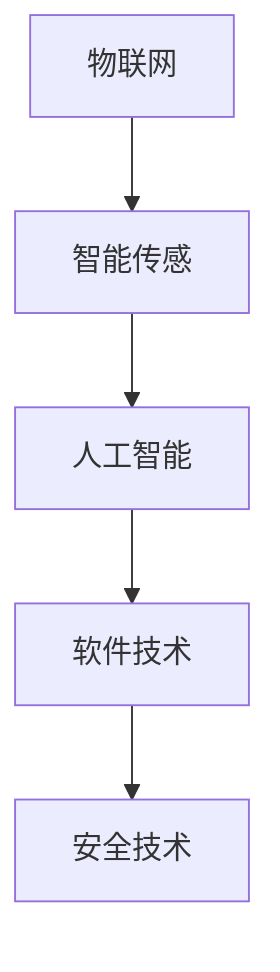
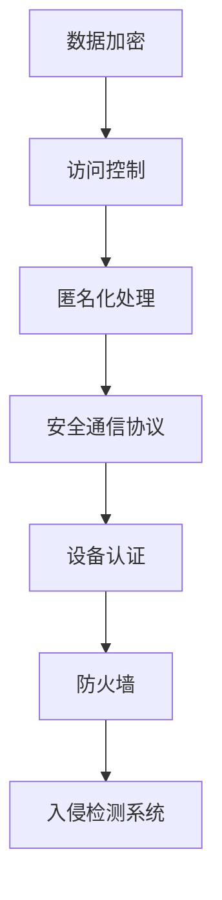
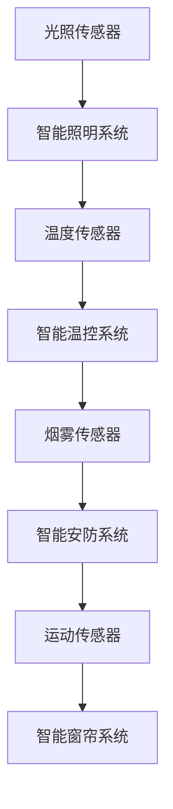
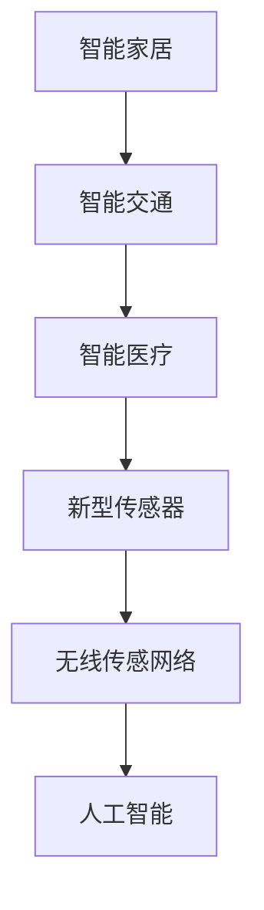
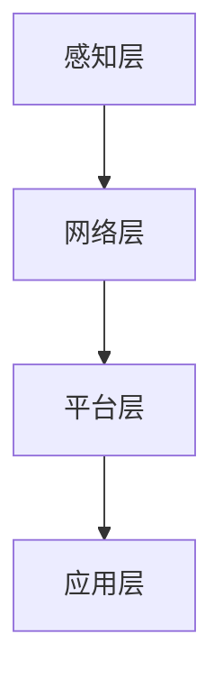
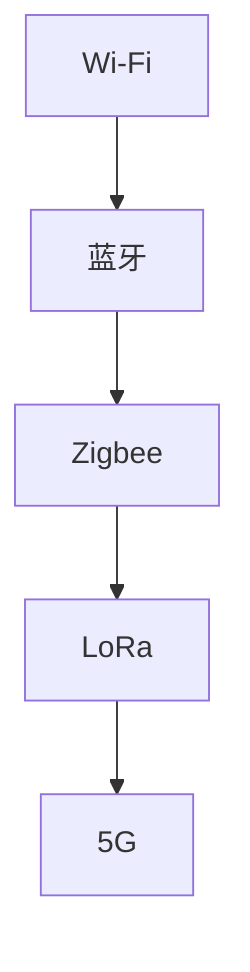
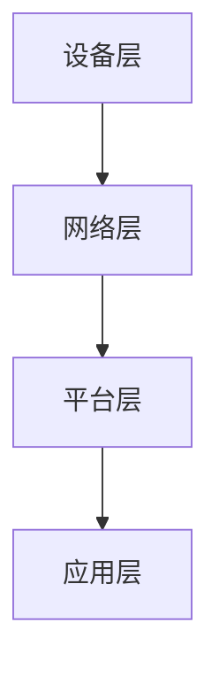
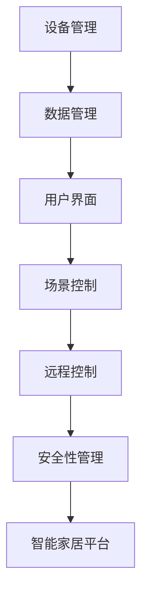
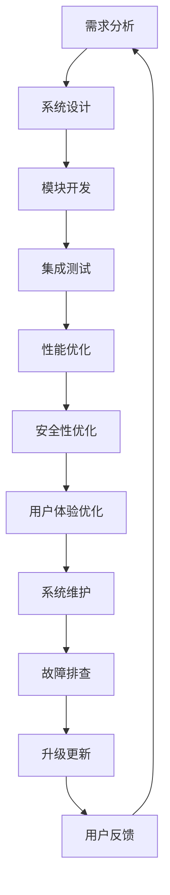

                 

### 1.2 智能家居的核心技术

#### 1.2.1 物联网（IoT）技术

物联网技术是智能家居实现互联互通的基础。它利用互联网、传感器、控制器等技术，实现设备间的通信与协同工作。

1. **物联网通信协议**：
   - **Zigbee**：低功耗无线个人区域网络，适用于短距离通信。
   - **Wi-Fi**：广泛使用的无线网络技术，适用于家庭范围内的设备互联。
   - **蓝牙**：短距离无线通信技术，适用于移动设备与智能家居设备的连接。

2. **物联网平台**：
   - **物联网平台**提供设备管理、数据存储、数据处理和分析等功能，是实现智能家居互联互通的关键。
   - **阿里云物联网平台**：提供设备接入、数据存储、设备管理等服务。
   - **华为物联网平台**：提供设备接入、数据传输、设备监控等功能。

3. **物联网安全**：
   - **安全通信协议**：如HTTPS、TLS等，确保设备间的通信安全。
   - **数据加密**：对数据进行加密处理，防止数据泄露。
   - **访问控制**：通过用户认证、权限管理等方式，确保设备的安全使用。

#### 1.2.2 智能传感技术

智能传感技术是智能家居获取环境信息的重要手段。

1. **常见智能传感器**：
   - **温度传感器**：用于检测环境温度。
   - **湿度传感器**：用于检测环境湿度。
   - **光照传感器**：用于检测环境光照强度。
   - **气体传感器**：用于检测有害气体浓度。

2. **传感器数据采集与处理**：
   - **数据采集**：传感器采集环境信息，通过ADC（模数转换器）将模拟信号转换为数字信号。
   - **数据处理**：对采集到的数据进行滤波、去噪、分析等处理，提取有用的信息。

3. **传感器应用实例**：
   - **智能照明系统**：使用光照传感器调节照明强度，根据环境光照自动调节灯光。
   - **智能温控系统**：使用温度传感器监测室内温度，自动调节空调或暖气。

#### 1.2.3 人工智能技术

人工智能技术是智能家居实现智能化决策和控制的核心。

1. **机器学习算法**：
   - **决策树**：用于分类和回归分析。
   - **神经网络**：用于图像识别、语音识别等复杂任务。
   - **支持向量机**：用于分类和回归分析。

2. **深度学习框架**：
   - **TensorFlow**：Google开发的开源深度学习框架。
   - **PyTorch**：Facebook开发的开源深度学习框架。

3. **智能控制算法**：
   - **PID控制**：比例-积分-微分控制，用于调节智能家居设备的工作状态。
   - **模糊控制**：基于模糊逻辑的智能控制，适用于复杂系统的控制。

#### 1.2.4 软件技术

软件技术是实现智能家居操作和管理的核心。

1. **操作系统**：
   - **Linux**：常用的嵌入式操作系统，稳定性高，开源免费。
   - **Windows**：适用于PC端的操作系统，易于使用，生态完善。

2. **开发框架**：
   - **Spring Boot**：Java开发框架，用于快速构建物联网应用。
   - **Flutter**：跨平台开发框架，用于构建智能家居应用。

3. **编程语言**：
   - **Python**：易于学习和使用，广泛应用于数据分析、人工智能等领域。
   - **JavaScript**：前端开发语言，用于构建智能家居Web应用。

#### 1.2.5 安全技术

安全技术是确保智能家居系统安全运行的关键。

1. **网络安全**：
   - **防火墙**：用于阻止未经授权的访问。
   - **入侵检测系统**：用于检测并阻止恶意攻击。

2. **数据安全**：
   - **数据加密**：对敏感数据进行加密处理。
   - **访问控制**：通过用户认证、权限管理等方式，确保数据安全。

3. **隐私保护**：
   - **隐私政策**：明确用户数据的使用方式和范围。
   - **匿名化处理**：对用户数据进行匿名化处理，保护用户隐私。

### 1.2.6 核心概念与联系

智能家居的核心技术包括物联网、智能传感、人工智能、软件技术和安全技术。这些技术相互关联，共同构成了智能家居系统的技术架构。

- **物联网**提供了设备之间的互联互通，是实现智能家居的基础。
- **智能传感**技术使得智能家居系统能够感知环境变化，为系统决策提供数据支持。
- **人工智能**技术实现了智能家居的智能化决策和控制，提高了系统的智能化水平。
- **软件技术**提供了智能家居系统的操作和管理平台，使得智能家居系统能够方便地使用和维护。
- **安全技术**确保了智能家居系统的安全运行，保护用户数据和隐私。

以下是一个智能家居技术架构的Mermaid流程图，展示了这些核心技术之间的关系：

通过这张图，我们可以清晰地看到智能家居系统的技术架构，以及各技术之间的相互作用。

----------------------------------------------------------------

### 1.3 智能家居的安全性与隐私保护

#### 1.3.1 安全性挑战

智能家居系统在带来便利的同时，也面临着一系列安全性挑战。

1. **设备被攻击**：黑客可能通过互联网攻击智能家居设备，获取设备控制权。
2. **数据泄露**：智能家居设备收集的用户数据可能被黑客窃取，用于非法用途。
3. **隐私泄露**：智能家居设备可能记录用户的生活习惯，导致用户隐私泄露。

#### 1.3.2 隐私保护措施

为了应对这些挑战，智能家居系统需要采取一系列隐私保护措施。

1. **数据加密**：对用户数据使用加密算法进行加密，确保数据在传输和存储过程中的安全。
2. **访问控制**：通过用户认证、权限管理等方式，确保只有授权用户才能访问敏感数据。
3. **匿名化处理**：对用户数据进行匿名化处理，消除个人身份信息，保护用户隐私。

#### 1.3.3 安全性措施

智能家居系统还需要采取一系列安全性措施，以确保系统的安全运行。

1. **安全通信协议**：使用HTTPS、TLS等安全协议，确保设备间的通信安全。
2. **设备认证**：对设备进行身份认证，防止未授权设备接入系统。
3. **防火墙**：在设备上部署防火墙，阻止未经授权的访问。
4. **入侵检测系统**：部署入侵检测系统，实时监控设备状态，发现异常行为。

#### 1.3.4 安全性与隐私保护的重要性

安全性与隐私保护是智能家居系统成功的关键因素。

- **安全性**：确保智能家居系统免受攻击，保护用户数据和隐私。
- **隐私保护**：增强用户对智能家居系统的信任，提高用户满意度。

以下是一个智能家居系统安全性与隐私保护架构的Mermaid流程图，展示了各安全措施之间的关系：

通过这张图，我们可以清晰地看到智能家居系统的安全性与隐私保护架构，以及各安全措施之间的相互作用。

### 1.3.5 案例分析

为了更好地理解智能家居系统的安全性与隐私保护，我们可以通过以下案例分析：

#### 案例一：智能门锁系统

1. **安全性措施**：
   - 使用HTTPS协议进行数据传输，确保通信安全。
   - 设备认证，防止未授权设备接入系统。
   - 防火墙，阻止未经授权的访问。
   - 入侵检测系统，实时监控设备状态。

2. **隐私保护措施**：
   - 数据加密，确保用户数据在传输和存储过程中的安全。
   - 访问控制，确保只有授权用户才能访问敏感数据。
   - 匿名化处理，消除个人身份信息。

#### 案例二：智能摄像头系统

1. **安全性措施**：
   - 使用TLS协议进行数据传输，确保通信安全。
   - 设备认证，防止未授权设备接入系统。
   - 防火墙，阻止未经授权的访问。
   - 入侵检测系统，实时监控设备状态。

2. **隐私保护措施**：
   - 数据加密，确保用户数据在传输和存储过程中的安全。
   - 访问控制，确保只有授权用户才能访问敏感数据。
   - 匿名化处理，消除个人身份信息。

通过这些案例分析，我们可以看到智能家居系统在安全性与隐私保护方面需要综合考虑多种措施，确保系统的安全性和用户的隐私。

----------------------------------------------------------------

### 第2章：智能传感技术

#### 2.1 常见的智能传感器

智能传感器是智能家居系统的核心组成部分，它们用于监测和收集环境数据，如温度、湿度、光照、气体等。以下是一些常见的智能传感器：

1. **温度传感器**：
   - **工作原理**：利用热敏电阻、热电偶或红外线等技术，检测环境温度。
   - **应用场景**：智能空调、智能加热系统等。

2. **湿度传感器**：
   - **工作原理**：利用电容、电阻或湿度敏感材料，检测环境湿度。
   - **应用场景**：智能加湿器、智能除湿机等。

3. **光照传感器**：
   - **工作原理**：利用光敏电阻或光电二极管，检测环境光照强度。
   - **应用场景**：智能照明系统、智能窗帘等。

4. **气体传感器**：
   - **工作原理**：利用半导体、金属氧化物等材料，检测有害气体浓度。
   - **应用场景**：烟雾报警器、煤气泄漏检测等。

#### 2.2 传感器的数据采集与处理

智能传感器的数据采集与处理是智能家居系统的关键环节。

1. **数据采集**：
   - **模拟信号与数字信号**：传感器采集到的环境数据通常是模拟信号，需要通过ADC（模数转换器）将其转换为数字信号，以便于处理和传输。
   - **滤波与去噪**：对采集到的信号进行滤波和去噪处理，去除噪声，提取有效信息。
   - **采样与量化**：对信号进行采样和量化处理，确保数据精度和可靠性。

2. **数据处理**：
   - **数据预处理**：包括数据清洗、数据整合等，为后续分析提供准确的数据。
   - **特征提取**：从原始数据中提取有用的特征信息，如温度、湿度等。
   - **数据分析**：利用机器学习、统计方法等对数据进行分析，提取数据背后的规律。

#### 2.3 智能传感器的应用实例

智能传感技术在智能家居系统中有着广泛的应用，以下是一些典型的应用实例：

1. **智能照明系统**：
   - **工作原理**：通过光照传感器监测环境光照强度，自动调节照明强度，实现节能和舒适。
   - **应用实例**：在室内光线较弱时，系统自动增加照明强度；在光线较强时，系统自动降低照明强度。

2. **智能温控系统**：
   - **工作原理**：通过温度传感器监测室内温度，自动调节空调或暖气，实现室内温度的自动控制。
   - **应用实例**：在寒冷的冬季，系统自动开启暖气，保持室内温暖；在炎热的夏季，系统自动开启空调，保持室内凉爽。

3. **智能安防系统**：
   - **工作原理**：通过烟雾传感器、运动传感器等监测家庭安全，及时发现异常情况。
   - **应用实例**：当家里发生烟雾或异常运动时，系统自动报警，通知主人或物业保安。

4. **智能窗帘系统**：
   - **工作原理**：通过光照传感器监测室内光照强度，自动调节窗帘开合，实现光线的调节。
   - **应用实例**：在阳光强烈时，系统自动关闭窗帘，避免室内过热；在阴天或晚上，系统自动打开窗帘，让阳光进入室内。

通过以上内容，我们可以看到智能传感技术在智能家居系统中的应用非常广泛，它们为智能家居系统提供了丰富的感知能力，使得系统可以更加智能化地运行。以下是一个智能家居系统传感技术应用架构的Mermaid流程图，展示了传感技术在系统中的应用：

通过这张图，我们可以清晰地看到智能传感技术在智能家居系统中的不同应用场景，以及它们之间的相互关联。

### 2.4 智能传感技术的挑战与未来趋势

#### 2.4.1 挑战

智能传感技术虽然在智能家居系统中有着广泛的应用，但也面临着一系列挑战。

1. **准确性**：传感器需要准确、稳定地监测环境数据，否则会影响系统的智能化程度。
2. **可靠性**：传感器在长期使用中可能会出现老化、损坏等问题，影响系统的稳定性。
3. **功耗**：智能家居设备通常采用电池供电，传感器的功耗需要尽可能低，以保证设备的续航时间。

#### 2.4.2 未来趋势

随着技术的不断进步，智能传感技术也在不断发展和创新。

1. **新型传感器**：研发新型传感器，如柔性传感器、纳米传感器等，提高传感器的性能和适用范围。
2. **无线传感网络**：利用无线通信技术，构建大规模的无线传感网络，提高系统的感知能力。
3. **人工智能**：将人工智能技术应用于传感器数据分析和处理，提高系统的智能化水平。

#### 2.4.3 应用前景

智能传感技术在智能家居、智能交通、智能医疗等领域的应用前景十分广阔。

1. **智能家居**：通过智能传感器，实现室内环境的自动调节，提高生活质量。
2. **智能交通**：通过智能传感器，实时监测交通状况，优化交通管理，提高交通效率。
3. **智能医疗**：通过智能传感器，实时监测患者生命体征，提供个性化医疗服务。

以下是一个智能家居系统传感技术应用前景的Mermaid流程图，展示了传感技术在各个领域的应用：

通过这张图，我们可以清晰地看到智能传感技术在各个领域的应用前景，以及它们之间的相互关联。

----------------------------------------------------------------

### 3.1 物联网（IoT）概述

#### 3.1.1 物联网的定义

物联网（Internet of Things，简称IoT）是指通过互联网、通信网络和系统连接各种设备，实现设备间的数据交换和智能化的管理与服务。物联网将物理世界与数字世界相结合，使得各种物品能够通过通信网络进行信息交换和协同工作。

#### 3.1.2 物联网的发展历程

物联网的发展可以追溯到20世纪90年代，最初是计算机与计算机之间的连接。随着互联网的普及，物联网开始将各种设备连接起来，实现了设备间的信息交换。进入21世纪，随着传感器技术、无线通信技术和云计算技术的快速发展，物联网进入了快速发展的阶段。2013年，IBM提出了“智慧地球”战略，标志着物联网进入了新的发展阶段。

#### 3.1.3 物联网的关键技术

1. **传感器技术**：传感器是物联网的重要组成部分，用于感知和采集环境信息。
2. **无线通信技术**：如Wi-Fi、蓝牙、Zigbee等，用于设备间的数据传输。
3. **数据处理技术**：包括数据采集、存储、处理和分析等技术，用于对物联网设备采集的数据进行处理。
4. **云计算技术**：提供强大的计算和存储能力，支持大规模物联网应用的部署和运行。
5. **人工智能技术**：用于物联网设备的数据分析和智能决策。

#### 3.1.4 物联网的架构

物联网系统通常包括以下几个层次：

1. **感知层**：包括各种传感器和感知设备，用于采集环境数据。
2. **网络层**：包括无线通信网络和有线网络，用于设备间的数据传输。
3. **平台层**：包括物联网平台和数据处理中心，用于处理和分析物联网设备采集的数据。
4. **应用层**：包括各种物联网应用和服务，如智能家居、智能交通、智能医疗等。

以下是一个物联网系统架构的Mermaid流程图，展示了物联网的架构层次：

通过这张图，我们可以清晰地看到物联网系统的架构层次和各层次之间的关系。

### 3.2 物联网通信协议

#### 3.2.1 通信协议的作用

物联网通信协议是物联网系统中的关键组成部分，用于确保不同设备之间的数据传输和通信。通信协议规定了数据传输的格式、传输方式、传输速度等，使得设备之间能够高效、准确地交换数据。

#### 3.2.2 常见物联网通信协议

1. **Wi-Fi**：Wi-Fi是一种无线局域网通信技术，广泛用于物联网设备之间的通信。它具有较高的传输速度和稳定性，但功耗较高。

2. **蓝牙**：蓝牙是一种短距离无线通信技术，适用于移动设备与物联网设备的连接。蓝牙功耗较低，适用于低功耗的物联网应用。

3. **Zigbee**：Zigbee是一种低功耗、短距离的无线通信技术，适用于智能家居、智能工业等领域的设备互联。它具有较高的传输速度和稳定性，但覆盖范围较小。

4. **LoRa**：LoRa是一种长距离、低功耗的无线通信技术，适用于远距离、低功耗的物联网应用。它具有较好的信号穿透能力和覆盖范围，但传输速度相对较低。

5. **5G**：5G是一种新一代的移动通信技术，具有高速、低延迟、大连接数等特点，适用于物联网应用。5G技术将带来更高效的物联网通信体验，但成本较高。

以下是一个物联网通信协议的Mermaid流程图，展示了常见物联网通信协议及其特点：

通过这张图，我们可以清晰地看到常见物联网通信协议的特点和适用范围。

### 3.3 物联网平台架构

#### 3.3.1 物联网平台的作用

物联网平台是物联网系统中的核心组件，用于管理和协调物联网设备、数据和应用。物联网平台提供了设备接入、数据存储、数据处理、应用开发等功能，使得物联网系统能够高效、稳定地运行。

#### 3.3.2 物联网平台的架构

物联网平台的架构通常包括以下几个层次：

1. **设备层**：包括各种物联网设备，如传感器、控制器等，用于采集和处理数据。
2. **网络层**：包括无线通信网络和有线网络，用于设备间的数据传输。
3. **平台层**：包括物联网平台的核心功能，如设备管理、数据存储、数据处理等。
4. **应用层**：包括各种物联网应用和服务，如智能家居、智能交通、智能医疗等。

以下是一个物联网平台架构的Mermaid流程图，展示了物联网平台的层次结构：

通过这张图，我们可以清晰地看到物联网平台的层次结构及其各层次之间的关系。

#### 3.3.3 物联网平台的关键功能

1. **设备管理**：包括设备接入、设备状态监控、设备升级等功能，确保设备能够稳定、高效地运行。
2. **数据管理**：包括数据存储、数据查询、数据分析等功能，确保数据的安全、可靠和高效处理。
3. **数据处理**：包括数据清洗、数据整合、数据挖掘等功能，从数据中提取有价值的信息，为应用提供支持。
4. **应用开发**：提供开发工具和开发环境，支持开发人员快速搭建物联网应用。

#### 3.3.4 物联网平台的应用实例

1. **智能家居**：通过物联网平台，实现家庭设备间的互联互通，提供智能化的家居管理服务。
2. **智能交通**：通过物联网平台，实现交通设备的数据采集和智能分析，优化交通管理和服务。
3. **智能医疗**：通过物联网平台，实现医疗设备的联网和数据共享，提供个性化的医疗服务。

### 3.4 物联网平台的优势与挑战

#### 3.4.1 优势

1. **高效管理**：物联网平台能够集中管理和协调各种物联网设备，提高系统的管理效率和灵活性。
2. **数据整合**：物联网平台能够整合各种设备的数据，提供全面的数据视图，支持数据分析和应用。
3. **快速部署**：物联网平台提供了开发工具和开发环境，支持快速搭建物联网应用，降低开发成本和时间。

#### 3.4.2 挑战

1. **数据安全**：物联网平台需要处理大量的数据，确保数据的安全和隐私保护是一个重要挑战。
2. **性能优化**：物联网平台需要处理海量的数据，保证系统的性能和响应速度是一个重要挑战。
3. **兼容性问题**：物联网平台需要兼容各种设备和技术，确保不同设备和技术的无缝连接和协同工作。

### 3.5 物联网平台的未来发展趋势

#### 3.5.1 5G技术的推动

5G技术的推广将进一步提高物联网平台的性能和可靠性，实现更高的数据传输速度和更低的延迟，推动物联网平台向更高效、更智能的方向发展。

#### 3.5.2 人工智能的融合

人工智能技术的融合将进一步提高物联网平台的智能化水平，实现更精准的数据分析、更智能的决策和控制，推动物联网平台向更加智能化的方向发展。

#### 3.5.3 边缘计算的普及

边缘计算的普及将减轻物联网平台的数据处理负担，提高系统的实时性和响应速度，推动物联网平台向更分布式、更高效的架构发展。

### 3.6 物联网平台的案例分析

#### 3.6.1 案例一：智能家居平台

智能家居平台通过物联网技术，实现家庭设备的互联互通，提供智能化的家居管理服务。以下是一个智能家居平台的架构和功能：

1. **架构**：
   - **感知层**：包括各种传感器，如温度传感器、湿度传感器、光照传感器等，用于采集家庭环境数据。
   - **网络层**：包括Wi-Fi、Zigbee等无线通信技术，用于设备间的数据传输。
   - **平台层**：包括智能家居平台的核心功能，如设备管理、数据存储、数据处理等。
   - **应用层**：包括智能家居应用，如智能照明、智能安防、智能温控等。

2. **功能**：
   - **设备管理**：包括设备接入、设备状态监控、设备升级等功能。
   - **数据管理**：包括数据存储、数据查询、数据分析等功能。
   - **数据处理**：包括数据清洗、数据整合、数据挖掘等功能。
   - **应用开发**：提供开发工具和开发环境，支持开发人员快速搭建智能家居应用。

#### 3.6.2 案例二：智能交通平台

智能交通平台通过物联网技术，实现交通设备的数据采集和智能分析，优化交通管理和服务。以下是一个智能交通平台的架构和功能：

1. **架构**：
   - **感知层**：包括各种交通传感器，如交通流量传感器、车牌识别传感器等，用于采集交通数据。
   - **网络层**：包括无线通信网络和有线网络，用于设备间的数据传输。
   - **平台层**：包括智能交通平台的核心功能，如设备管理、数据存储、数据处理等。
   - **应用层**：包括智能交通应用，如交通流量监测、车辆调度、路况预测等。

2. **功能**：
   - **设备管理**：包括设备接入、设备状态监控、设备升级等功能。
   - **数据管理**：包括数据存储、数据查询、数据分析等功能。
   - **数据处理**：包括数据清洗、数据整合、数据挖掘等功能。
   - **应用开发**：提供开发工具和开发环境，支持开发人员快速搭建智能交通应用。

通过以上案例分析，我们可以看到物联网平台在智能家居和智能交通领域的广泛应用，以及它们为这些领域带来的巨大价值。物联网平台作为物联网系统的重要组件，将继续发挥重要作用，推动物联网技术的不断创新和发展。

----------------------------------------------------------------

### 4.1 智能家居操作系统的功能与特点

#### 4.1.1 功能

智能家居操作系统（Smart Home Operating System，简称SHOS）是智能家居系统的核心，负责管理和协调各种智能家居设备，提供统一的接口和平台，使得设备之间能够无缝协同工作。智能家居操作系统的功能主要包括以下几个方面：

1. **设备管理**：包括设备的接入、配置、状态监控和设备升级等，确保设备的正常运行和更新。

2. **数据管理**：包括数据的采集、存储、处理和分析，为智能家居系统的智能化决策提供数据支持。

3. **用户界面**：提供友好的用户界面，方便用户对智能家居系统进行控制和操作。

4. **场景控制**：通过预设的场景，实现一键控制多个设备的联动，提高用户的生活便捷性。

5. **远程控制**：通过互联网或移动通信网络，实现用户对智能家居系统的远程监控和控制。

6. **安全性管理**：包括用户认证、权限管理、数据加密等，确保智能家居系统的安全运行。

7. **智能家居平台**：提供一个开放的平台，支持第三方应用和服务的接入，扩展智能家居系统的功能。

#### 4.1.2 特点

智能家居操作系统具有以下特点：

1. **跨平台性**：支持多种操作系统平台，如Android、iOS、Linux等，使得智能家居系统能够兼容不同的设备。

2. **易用性**：提供直观、友好的用户界面，降低用户的操作难度，提高用户体验。

3. **开放性**：提供开放的API和SDK，支持第三方开发者的接入，丰富智能家居系统的应用场景。

4. **可扩展性**：支持设备的动态接入和功能扩展，适应不断变化的智能家居需求。

5. **安全性**：提供完善的安全机制，包括数据加密、用户认证、权限管理等，确保智能家居系统的安全运行。

6. **智能化**：利用人工智能技术，实现智能家居设备的智能决策和控制，提高系统的智能化水平。

#### 4.1.3 核心概念与联系

智能家居操作系统的核心概念包括设备管理、数据管理、用户界面、场景控制、远程控制、安全性和智能家居平台。这些概念相互联系，共同构成了智能家居操作系统的功能架构。

- **设备管理**：确保智能家居设备的正常运行和更新，为数据管理和用户界面提供支持。
- **数据管理**：为智能家居系统的智能化决策提供数据支持，同时为用户界面提供数据展示。
- **用户界面**：为用户提供操作和控制智能家居系统的接口，同时为场景控制和远程控制提供基础。
- **场景控制**：通过预设的场景，实现多个设备的联动，提高用户的生活便捷性。
- **远程控制**：通过互联网或移动通信网络，实现用户对智能家居系统的远程监控和控制。
- **安全性管理**：确保智能家居系统的安全运行，保护用户数据和隐私。
- **智能家居平台**：提供一个开放的平台，支持第三方应用和服务的接入，扩展智能家居系统的功能。

以下是一个智能家居操作系统功能架构的Mermaid流程图，展示了各核心概念之间的关系：

通过这张图，我们可以清晰地看到智能家居操作系统的功能架构，以及各核心概念之间的相互作用。

### 4.2 智能家居操作系统的开发与优化

#### 4.2.1 开发流程

智能家居操作系统的开发通常包括以下几个阶段：

1. **需求分析**：明确智能家居操作系统的功能需求和性能要求，为后续开发提供指导。

2. **系统设计**：根据需求分析，设计智能家居操作系统的架构和模块，确保系统的可扩展性和可维护性。

3. **模块开发**：按照系统设计，逐一开发各模块的功能，如设备管理、数据管理、用户界面等。

4. **集成测试**：将各模块集成起来，进行系统级测试，确保系统的整体功能和性能符合要求。

5. **性能优化**：对系统进行性能优化，提高系统的响应速度和稳定性。

6. **安全测试**：对系统进行安全测试，确保系统的安全性，防止恶意攻击和数据泄露。

7. **部署上线**：将智能家居操作系统部署到实际环境中，进行现场测试和优化。

#### 4.2.2 优化方法

智能家居操作系统的优化主要包括以下几个方面：

1. **性能优化**：
   - **数据缓存**：通过数据缓存，减少数据访问次数，提高数据读取速度。
   - **并发处理**：优化系统的并发处理能力，提高系统同时处理多个请求的能力。
   - **代码优化**：对代码进行优化，减少不必要的计算和资源消耗。

2. **安全性优化**：
   - **加密通信**：采用加密通信协议，确保数据传输过程中的安全。
   - **权限管理**：加强用户认证和权限管理，防止未授权访问。
   - **安全审计**：定期进行安全审计，发现并修复潜在的安全漏洞。

3. **用户体验优化**：
   - **界面优化**：优化用户界面，提高操作便捷性和美观度。
   - **响应速度**：优化系统的响应速度，提高用户的操作体验。
   - **个性化服务**：根据用户的使用习惯，提供个性化的智能家居服务。

4. **系统维护**：
   - **故障排查**：定期进行故障排查，确保系统的稳定运行。
   - **升级更新**：及时更新系统，修复已知问题，提高系统的可靠性。
   - **用户反馈**：收集用户反馈，不断优化和改进系统。

#### 4.2.3 开发与优化的关系

开发与优化是智能家居操作系统开发过程中的两个重要环节，它们之间存在着密切的关系。

1. **开发为优化提供基础**：在开发过程中，需要考虑系统的可优化性，为后续的优化工作奠定基础。

2. **优化促进开发**：在开发过程中，通过不断优化，提高系统的性能、安全性和用户体验，为开发提供反馈，促进系统的完善。

3. **开发与优化相辅相成**：开发与优化是一个相互促进、不断迭代的过程，通过开发实现系统的功能，通过优化提高系统的质量和性能。

以下是一个智能家居操作系统开发与优化关系的Mermaid流程图，展示了开发与优化之间的相互作用：

通过这张图，我们可以清晰地看到智能家居操作系统开发与优化之间的循环迭代过程，以及各环节之间的相互作用。

### 4.3 智能家居操作系统的应用案例

#### 4.3.1 案例一：智能照明系统

智能照明系统是智能家居操作系统的一个典型应用案例。以下是一个智能照明系统的架构和功能：

1. **架构**：
   - **感知层**：包括光照传感器和智能灯具，用于采集光照数据和控制灯光。
   - **网络层**：包括Wi-Fi、Zigbee等无线通信技术，用于设备间的数据传输。
   - **平台层**：包括智能家居操作系统，负责管理和协调智能灯具，提供统一的控制接口。
   - **应用层**：包括智能照明应用，如自动调节灯光亮度、定时开关灯等。

2. **功能**：
   - **自动调节**：通过光照传感器，自动调节灯光的亮度和颜色，实现节能和舒适的照明效果。
   - **定时开关**：根据用户设置，定时开关灯光，提供便捷的生活体验。
   - **远程控制**：通过手机APP或语音助手，实现远程控制灯光的开关和亮度调节。

3. **实现细节**：
   - **数据采集**：智能灯具通过光照传感器采集环境光照数据，并上传到智能家居操作系统。
   - **数据处理**：智能家居操作系统对光照数据进行处理，并根据用户需求自动调节灯光。
   - **用户交互**：用户通过手机APP或语音助手与智能照明系统进行交互，实现灯光的控制和调节。

#### 4.3.2 案例二：智能安防系统

智能安防系统是智能家居操作系统的另一个重要应用案例。以下是一个智能安防系统的架构和功能：

1. **架构**：
   - **感知层**：包括摄像头、烟雾传感器、门磁传感器等，用于采集安防数据。
   - **网络层**：包括Wi-Fi、NFC等无线通信技术，用于设备间的数据传输。
   - **平台层**：包括智能家居操作系统，负责管理和协调安防设备，提供统一的控制接口。
   - **应用层**：包括智能安防应用，如实时监控、报警推送等。

2. **功能**：
   - **实时监控**：通过摄像头，实时监控家庭安全状况，并将视频数据上传到智能家居操作系统。
   - **报警推送**：当检测到异常情况时，如闯入者、烟雾等，系统自动推送报警信息给用户。
   - **远程控制**：用户通过手机APP或语音助手，远程控制安防设备的开关和报警设置。

3. **实现细节**：
   - **数据采集**：安防设备通过传感器采集家庭环境数据，并上传到智能家居操作系统。
   - **数据处理**：智能家居操作系统对安防数据进行实时处理，并触发相应的报警机制。
   - **用户交互**：用户通过手机APP或语音助手与智能安防系统进行交互，实现安防设备的控制和管理。

#### 4.3.3 案例三：智能家电管理系统

智能家电管理系统是智能家居操作系统的另一个重要应用案例。以下是一个智能家电管理系统的架构和功能：

1. **架构**：
   - **感知层**：包括智能冰箱、智能空调、智能洗衣机等，用于采集家电状态数据。
   - **网络层**：包括Wi-Fi、Zigbee等无线通信技术，用于设备间的数据传输。
   - **平台层**：包括智能家居操作系统，负责管理和协调智能家电，提供统一的控制接口。
   - **应用层**：包括智能家电管理应用，如家电控制、节能管理、故障排查等。

2. **功能**：
   - **家电控制**：用户可以通过手机APP或语音助手，远程控制智能家电的开关和状态。
   - **节能管理**：智能家电管理系统根据用户的使用习惯，自动调整家电的工作状态，实现节能。
   - **故障排查**：当家电出现故障时，系统自动检测并推送故障信息给用户，方便用户排查和维修。

3. **实现细节**：
   - **数据采集**：智能家电通过内置的传感器，采集家电的状态数据，并上传到智能家居操作系统。
   - **数据处理**：智能家居操作系统对家电数据进行实时处理，并根据用户需求自动调整家电的工作状态。
   - **用户交互**：用户通过手机APP或语音助手与智能家电管理系统进行交互，实现家电的控制和管理。

通过以上应用案例，我们可以看到智能家居操作系统在智能照明、智能安防和智能家电管理等方面的广泛应用，以及它们为用户带来的便利和舒适。智能家居操作系统作为智能家居系统的核心，将继续推动智能家居技术的不断创新和发展。

### 第4章：智能家居操作系统

#### 4.4 智能家居操作系统的生态系统

智能家居操作系统的生态系统是指围绕智能家居操作系统构建的一套完整的开发、部署、运行和维护体系，包括开发工具、开发框架、平台服务、开发者社区等。一个良好的生态系统有助于促进智能家居技术的创新和普及。

#### 4.4.1 开发工具

开发工具是开发者进行智能家居操作系统开发的重要工具，主要包括以下几种：

1. **集成开发环境（IDE）**：如Visual Studio Code、Eclipse等，提供代码编辑、调试和项目管理等功能。

2. **编程语言**：常用的编程语言包括Java、Python、C++等，适用于不同的开发场景和需求。

3. **数据库**：常用的数据库包括MySQL、MongoDB、SQLite等，用于存储和管理智能家居系统的数据。

4. **框架和库**：如Spring Boot、React、Vue等，提供开发框架和库，简化开发过程，提高开发效率。

#### 4.4.2 开发框架

开发框架是智能家居操作系统开发的重要支撑，主要包括以下几种：

1. **智能家居操作系统框架**：如HomeKit、OpenHAB、Home Assistant等，提供智能家居设备的管理、数据处理和用户界面等功能。

2. **物联网开发框架**：如IoT.js、Node-RED、MQTT等，提供物联网设备的通信协议和数据处理机制。

3. **前端开发框架**：如React、Vue、Angular等，用于构建智能家居操作系统的用户界面。

4. **后端开发框架**：如Spring Boot、Django、Flask等，用于构建智能家居操作系统的后端逻辑和数据管理。

#### 4.4.3 平台服务

平台服务是智能家居操作系统运行的重要支撑，主要包括以下几种：

1. **云计算平台**：如阿里云、华为云、腾讯云等，提供计算、存储、网络等基础设施服务。

2. **物联网平台**：如阿里云物联网平台、华为物联网平台、腾讯云物联网平台等，提供设备管理、数据存储、数据处理等功能。

3. **人工智能平台**：如TensorFlow、PyTorch、MXNet等，提供机器学习和深度学习算法，用于智能家居系统的智能分析和决策。

4. **数据库服务**：如MySQL、MongoDB、Redis等，提供数据存储和管理服务。

#### 4.4.4 开发者社区

开发者社区是智能家居操作系统生态系统的重要组成部分，主要包括以下几种：

1. **官方论坛**：智能家居操作系统提供商通常会有官方论坛，供开发者交流、提问和分享经验。

2. **GitHub**：GitHub是开源代码托管平台，许多智能家居操作系统的项目都托管在GitHub上，供开发者交流和协作。

3. **技术博客**：许多开发者会在个人博客或专业博客上分享智能家居操作系统的开发经验、教程和心得。

4. **线上会议和培训**：智能家居操作系统提供商和组织会定期举办线上会议和培训，为开发者提供学习和交流的平台。

#### 4.4.5 生态系统的优势

智能家居操作系统的生态系统具有以下优势：

1. **促进创新**：开发者可以在一个开放、协作的生态系统中，自由地创新和尝试新的技术和应用，推动智能家居技术的发展。

2. **降低门槛**：生态系统提供了丰富的开发工具、框架和平台服务，降低了开发者的入门门槛，使得更多开发者能够参与智能家居操作系统的开发。

3. **提高效率**：生态系统提供了完善的开发、部署和维护流程，提高了开发者的工作效率，缩短了开发周期。

4. **拓展功能**：生态系统支持第三方开发者接入和扩展功能，使得智能家居操作系统能够不断丰富和优化，满足用户的需求。

5. **增强互操作性**：生态系统中的设备和平台可以相互兼容和协同工作，提高了系统的互操作性和用户体验。

### 4.5 智能家居操作系统的创新与发展

智能家居操作系统的发展是一个不断创新的历程，随着技术的进步和用户需求的变化，智能家居操作系统也在不断更新和优化。

#### 4.5.1 新技术的引入

1. **5G技术**：5G技术的引入，使得智能家居操作系统的数据传输速度更快、延迟更低，为实时交互和智能决策提供了更好的基础。

2. **人工智能**：人工智能技术的融合，使得智能家居操作系统能够实现更智能的设备管理和数据分析，提高系统的智能化水平。

3. **物联网边缘计算**：物联网边缘计算的兴起，使得智能家居操作系统可以在本地设备上进行数据处理和分析，减轻了中心服务器的负担，提高了系统的响应速度和稳定性。

#### 4.5.2 新应用场景的探索

1. **智能城市**：智能家居操作系统可以扩展到智能城市领域，实现智能交通、智能安防、智能环境等应用，提升城市管理水平。

2. **智能医疗**：智能家居操作系统可以应用于智能医疗领域，实现远程医疗监测、健康数据管理等，提高医疗服务的效率和质量。

3. **智能农业**：智能家居操作系统可以应用于智能农业领域，实现作物生长监测、精准灌溉等，提高农业生产效率。

#### 4.5.3 生态系统的完善

智能家居操作系统的生态系统在不断发展，不断引入新的开发工具、框架和平台服务，增强生态系统的兼容性和互操作性，为开发者提供更便捷、高效的开发体验。

通过不断引入新技术、探索新应用场景和完善生态系统，智能家居操作系统将继续推动智能家居技术的发展，为用户带来更智能、更便捷的生活体验。

### 4.6 智能家居操作系统的发展趋势与挑战

#### 4.6.1 发展趋势

1. **智能化水平提升**：随着人工智能技术的发展，智能家居操作系统的智能化水平将得到显著提升，能够实现更精准、更智能的设备管理和数据分析。

2. **边缘计算应用**：物联网边缘计算技术的普及，将使得智能家居操作系统能够在本地设备上进行数据处理和分析，提高系统的实时性和稳定性。

3. **5G技术的推动**：5G技术的推广，将带来更高的数据传输速度和更低的延迟，为智能家居操作系统提供更好的网络支持，实现更高效的数据交互和实时控制。

4. **个性化服务**：智能家居操作系统将更加注重用户的个性化需求，提供更加定制化的智能家居解决方案，提升用户体验。

5. **跨平台兼容性**：随着智能家居设备的多样化，智能家居操作系统将实现更高的跨平台兼容性，支持更多设备接入和协同工作。

#### 4.6.2 挑战

1. **数据安全与隐私保护**：随着智能家居设备的增加和数据的积累，数据安全和隐私保护将成为智能家居操作系统面临的重要挑战。

2. **系统稳定性与可靠性**：智能家居操作系统需要保证系统的稳定运行和可靠性，特别是在设备众多、网络复杂的环境中。

3. **开发成本与门槛**：智能家居操作系统的开发成本较高，对于小型企业和开发者来说，开发门槛较高，需要降低开发成本和门槛。

4. **生态系统的完善**：智能家居操作系统的生态系统需要不断完善，提供更丰富的开发工具、框架和平台服务，促进生态系统的健康发展。

通过以上分析，我们可以看到智能家居操作系统在发展过程中面临着许多挑战，但同时也充满了机遇。只有不断应对挑战、抓住机遇，智能家居操作系统才能实现持续发展，为用户带来更智能、更便捷的生活体验。

### 第5章：智能家居设备开发

#### 5.1 智能家居设备的设计原则

智能家居设备的设计原则是确保设备具备高效性、安全性、可扩展性和易用性的关键。以下是一些关键设计原则：

1. **用户中心设计**：智能家居设备的设计应以用户需求为中心，确保设备易于使用、操作简便，为用户提供舒适的体验。

2. **模块化设计**：智能家居设备应采用模块化设计，便于设备的功能扩展和维护。模块化设计有助于提高设备的可扩展性和灵活性。

3. **安全性设计**：智能家居设备需要具备严格的安全性设计，包括数据加密、访问控制、异常检测等，确保设备的安全运行和保护用户隐私。

4. **节能设计**：智能家居设备应考虑节能设计，通过优化硬件配置和软件算法，降低能耗，提高设备的使用效率。

5. **互联互通设计**：智能家居设备应具备良好的互联互通性，支持多种通信协议，便于设备间的协同工作和系统集成。

#### 5.2 智能家居设备的硬件选型

智能家居设备的硬件选型是设备设计的重要环节，以下是一些硬件选型的建议：

1. **处理器**：智能家居设备通常需要高性能的处理器，以支持复杂的计算任务和实时数据处理。常用的处理器包括ARM Cortex-A系列、M系列等。

2. **存储器**：智能家居设备需要足够的存储空间来存储数据和应用程序。常用的存储器包括SD卡、eMMC等。

3. **传感器**：智能家居设备需要根据具体应用场景选择合适的传感器，如温度传感器、湿度传感器、光照传感器等。

4. **通信模块**：智能家居设备需要选择合适的通信模块，如Wi-Fi、蓝牙、Zigbee等，以实现设备间的互联互通。

5. **电源管理**：智能家居设备需要具备高效的电源管理方案，以确保设备的续航时间和稳定性。常用的电源管理模块包括锂离子电池、电源管理芯片等。

#### 5.3 智能家居设备的软件实现

智能家居设备的软件实现是设备开发的核心环节，以下是一些软件实现的关键步骤：

1. **操作系统**：选择适合智能家居设备的操作系统，如Linux、Windows IoT等。操作系统应支持设备的硬件配置和功能需求。

2. **应用程序框架**：选择合适的应用程序框架，如Flutter、React Native等，以简化应用程序的开发过程，提高开发效率。

3. **通信协议**：实现设备间的通信协议，如Wi-Fi、蓝牙、Zigbee等，确保设备能够互联互通。

4. **数据处理**：实现数据采集、存储、处理和分析等功能，为设备提供智能化支持。

5. **用户界面**：设计友好的用户界面，提供设备状态展示、控制功能等，方便用户操作。

#### 5.4 智能家居设备的测试与优化

智能家居设备的测试与优化是确保设备质量和性能的重要环节。以下是一些测试与优化的关键步骤：

1. **功能测试**：对设备的各项功能进行测试，确保设备能够正常工作，满足设计要求。

2. **性能测试**：对设备的性能进行测试，包括响应时间、数据处理速度、功耗等，确保设备在复杂环境下仍能稳定运行。

3. **兼容性测试**：测试设备与其他设备、系统和应用的兼容性，确保设备在不同环境下能够正常运行。

4. **安全性测试**：对设备的安全性进行测试，包括数据加密、访问控制、异常检测等，确保设备的安全运行。

5. **用户体验测试**：通过用户测试，收集用户反馈，不断优化设备的功能和用户体验。

6. **优化与改进**：根据测试结果，对设备进行优化和改进，提高设备的性能和稳定性。

通过以上设计原则、硬件选型、软件实现和测试优化的步骤，我们可以确保智能家居设备的开发过程高效、质量可靠，为用户提供优质的使用体验。

### 5.5 智能家居设备开发实例

#### 5.5.1 实例一：智能门锁系统

**项目背景**：

智能门锁系统是一款典型的智能家居设备，用于实现家庭门锁的智能控制。项目目标是通过物联网技术，实现用户远程控制门锁开关、门锁状态的实时监测和报警功能。

**硬件选型**：

1. **处理器**：采用ARM Cortex-M4处理器，具有高性能和低功耗的特点。
2. **存储器**：采用8MB的Flash存储器和1MB的RAM，满足存储需求。
3. **传感器**：使用指纹传感器和门磁传感器，实现身份验证和门锁状态监测。
4. **通信模块**：采用Wi-Fi模块，实现远程控制和数据传输。

**软件实现**：

1. **操作系统**：采用FreeRTOS实时操作系统，实现多任务调度和资源管理。
2. **通信协议**：实现Wi-Fi通信协议，支持与用户设备的连接和数据传输。
3. **数据处理**：实现指纹识别算法，用于身份验证；实现门锁状态监测，记录开关锁事件。
4. **用户界面**：设计手机APP界面，用于远程控制门锁和查看门锁状态。

**测试与优化**：

1. **功能测试**：测试门锁开关、指纹识别、远程控制等功能，确保设备正常工作。
2. **性能测试**：测试门锁的响应时间、数据处理速度，确保设备性能稳定。
3. **兼容性测试**：测试设备与不同品牌手机和路由器的兼容性，确保设备在不同环境下能够正常运行。
4. **安全性测试**：测试设备的安全性，包括数据加密、访问控制等，确保用户隐私安全。

**项目小结**：

智能门锁系统项目通过硬件选型和软件实现的结合，实现了门锁的智能化控制。通过严格的测试和优化，确保设备的质量和性能，为用户提供安全、便捷的智能门锁体验。

#### 5.5.2 实例二：智能灯泡系统

**项目背景**：

智能灯泡系统是一款用于实现家庭照明控制的智能家居设备。项目目标是通过物联网技术，实现用户远程控制灯光的开关、亮度和颜色，以及场景联动功能。

**硬件选型**：

1. **处理器**：采用ARM Cortex-A7处理器，具有高性能和低功耗的特点。
2. **存储器**：采用4MB的Flash存储器和2MB的RAM，满足存储需求。
3. **传感器**：使用光照传感器，实现自动调节灯光亮度和颜色。
4. **通信模块**：采用Wi-Fi模块，实现远程控制和数据传输。

**软件实现**：

1. **操作系统**：采用Linux操作系统，实现多任务调度和资源管理。
2. **通信协议**：实现Wi-Fi通信协议，支持与用户设备的连接和数据传输。
3. **数据处理**：实现光照传感器数据采集和处理，自动调节灯光亮度和颜色。
4. **用户界面**：设计手机APP界面，用于远程控制灯光和查看灯光状态。

**测试与优化**：

1. **功能测试**：测试灯光开关、亮度调节、颜色调节等功能，确保设备正常工作。
2. **性能测试**：测试灯光响应时间、数据传输速度，确保设备性能稳定。
3. **兼容性测试**：测试设备与不同品牌手机和路由器的兼容性，确保设备在不同环境下能够正常运行。
4. **安全性测试**：测试设备的安全性，包括数据加密、访问控制等，确保用户隐私安全。

**项目小结**：

智能灯泡系统项目通过硬件选型和软件实现的结合，实现了家庭照明的智能化控制。通过严格的测试和优化，确保设备的质量和性能，为用户提供舒适、便捷的智能照明体验。

#### 5.5.3 实例三：智能安防系统

**项目背景**：

智能安防系统是一款用于实现家庭安全防护的智能家居设备。项目目标是通过物联网技术，实现家庭环境的实时监控、异常报警和远程控制。

**硬件选型**：

1. **处理器**：采用ARM Cortex-A7处理器，具有高性能和低功耗的特点。
2. **存储器**：采用8MB的Flash存储器和2MB的RAM，满足存储需求。
3. **传感器**：使用摄像头、烟雾传感器、门磁传感器等，实现家庭环境的监控和异常检测。
4. **通信模块**：采用Wi-Fi模块，实现远程控制和数据传输。

**软件实现**：

1. **操作系统**：采用Linux操作系统，实现多任务调度和资源管理。
2. **通信协议**：实现Wi-Fi通信协议，支持与用户设备的连接和数据传输。
3. **数据处理**：实现摄像头视频数据采集和处理，实现烟雾传感器和门磁传感器的数据采集和处理。
4. **用户界面**：设计手机APP界面，用于远程控制安防设备和查看监控视频。

**测试与优化**：

1. **功能测试**：测试安防设备的各项功能，包括视频监控、烟雾报警、门磁报警等，确保设备正常工作。
2. **性能测试**：测试视频监控的实时性和数据处理速度，确保设备性能稳定。
3. **兼容性测试**：测试设备与不同品牌手机和路由器的兼容性，确保设备在不同环境下能够正常运行。
4. **安全性测试**：测试设备的安全性，包括数据加密、访问控制等，确保用户隐私安全。

**项目小结**：

智能安防系统项目通过硬件选型和软件实现的结合，实现了家庭环境的智能安防。通过严格的测试和优化，确保设备的质量和性能，为用户提供安全、可靠的智能安防体验。

通过以上实例，我们可以看到智能家居设备的开发涉及硬件选型、软件实现、测试与优化等多个方面，通过合理的规划和实施，可以开发出高效、安全、可靠的智能家居设备。

### 5.6 智能家居设备开发最佳实践

在智能家居设备开发过程中，遵循一些最佳实践可以确保项目的高效、高质量完成，以下是一些关键建议：

1. **需求分析与规划**：在项目启动阶段，详细分析用户需求，制定清晰的项目规划，明确项目目标、功能需求和时间节点。

2. **团队协作**：建立高效的团队协作机制，确保各成员之间的沟通畅通，提高项目开发效率。

3. **模块化设计**：采用模块化设计，将系统拆分成若干独立模块，便于开发和维护。模块化设计有助于提高代码的可重用性和可维护性。

4. **代码规范**：制定统一的代码规范，确保代码的可读性和可维护性。良好的代码规范有助于提高团队协作效率和代码质量。

5. **测试驱动开发（TDD）**：采用测试驱动开发方法，先编写测试用例，再实现功能代码，确保代码的可靠性和稳定性。

6. **持续集成（CI）**：采用持续集成工具，如Jenkins、GitLab CI等，实现自动化构建、测试和部署，提高开发效率和质量。

7. **敏捷开发**：采用敏捷开发方法，灵活应对需求变化，快速迭代开发，确保项目按时交付。

8. **性能优化**：在开发过程中，关注系统的性能优化，如减少不必要的计算、优化数据结构、优化算法等，确保系统的高性能和高可用性。

9. **安全性设计**：在系统设计和开发过程中，重视安全性设计，如数据加密、访问控制、异常处理等，确保系统的安全性和可靠性。

10. **用户体验**：注重用户体验设计，确保系统的易用性和友好性，提升用户满意度。

通过以上最佳实践，我们可以提高智能家居设备开发的质量和效率，为用户带来更好的使用体验。

### 5.7 小结

智能家居设备开发是一个复杂而重要的过程，涉及硬件选型、软件实现、测试与优化等多个方面。通过遵循最佳实践，我们可以确保智能家居设备的高效、高质量开发。以下是一些关键要点：

1. **需求分析与规划**：明确项目目标和功能需求，制定详细的项目规划。

2. **团队协作**：建立高效的团队协作机制，确保项目顺利进行。

3. **模块化设计**：采用模块化设计，提高代码的可重用性和可维护性。

4. **代码规范**：制定统一的代码规范，确保代码质量。

5. **测试驱动开发（TDD）**：采用TDD方法，提高代码的可靠性和稳定性。

6. **性能优化**：关注系统性能优化，确保系统的高性能和高可用性。

7. **安全性设计**：重视安全性设计，确保系统的安全性和可靠性。

8. **用户体验**：注重用户体验设计，提升用户满意度。

通过以上要点，我们可以确保智能家居设备开发的成功，为用户带来更好的使用体验。

### 附录A：智能家居开发工具与资源

#### A.1 开发工具介绍

在智能家居设备开发过程中，选择合适的开发工具和平台可以极大地提高开发效率。以下是一些常用的开发工具和平台：

1. **集成开发环境（IDE）**：
   - **Arduino IDE**：Arduino IDE 是一款开源的集成开发环境，适用于开发基于Arduino平台的智能家居设备。
   - **PlatformIO**：PlatformIO 是一款跨平台的集成开发环境，支持多种物联网平台和硬件，提供了丰富的功能插件和扩展。

2. **编程语言**：
   - **C/C++**：C/C++ 是常用的嵌入式编程语言，适用于开发智能家居设备的核心逻辑和算法。
   - **Python**：Python 语法简单，易于学习，适用于快速开发和原型设计。

3. **物联网平台**：
   - **阿里云物联网平台**：阿里云物联网平台提供了丰富的开发工具和资源，支持设备接入、数据存储、数据分析等功能。
   - **华为云物联网平台**：华为云物联网平台提供了强大的设备管理和数据分析功能，适用于大规模智能家居设备的应用场景。

4. **云服务**：
   - **AWS IoT**：AWS IoT 是亚马逊云服务提供的物联网解决方案，提供了设备接入、数据存储、数据分析等功能。
   - **Google Cloud IoT**：Google Cloud IoT 是谷歌云服务提供的物联网解决方案，支持设备接入、数据存储、实时分析等功能。

#### A.2 智能家居平台与框架

智能家居平台和框架为开发者提供了丰富的功能和工具，使得智能家居设备的开发变得更加简便。以下是一些常用的智能家居平台和框架：

1. **HomeKit**：HomeKit 是苹果公司推出的智能家居平台，支持iOS和macOS设备，提供了设备管理、场景控制、远程控制等功能。

2. **OpenHAB**：OpenHAB 是一款开源的智能家居平台，支持多种操作系统和硬件，提供了丰富的插件和扩展，适用于各种智能家居设备的集成和管理。

3. **Home Assistant**：Home Assistant 是一款开源的智能家居平台，基于Python和Docker，提供了设备管理、自动化控制、场景控制等功能。

4. **Node-RED**：Node-RED 是一款基于Node.js的流数据应用开发工具，适用于智能家居设备的联动和控制。

5. **ThingsBoard**：ThingsBoard 是一款开源的物联网平台，提供了设备管理、数据存储、数据分析等功能，适用于大规模智能家居设备的部署和管理。

#### A.3 智能家居开源项目与资料

智能家居开源项目为开发者提供了丰富的资源和经验，可以帮助快速构建智能家居应用。以下是一些常用的智能家居开源项目与资料：

1. **ESPHome**：ESPHome 是一款基于ESP8266和ESP32的智能家居开源项目，提供了设备配置、自动化控制等功能，适用于各种智能家居设备的集成和管理。

2. **ESP8266Arduino**：ESP8266Arduino 是一款基于Arduino IDE 的 ESP8266 开发板支持包，适用于开发基于ESP8266的智能家居设备。

3. **ArduinoJson**：ArduinoJson 是一款用于Arduino平台的JSON处理库，适用于处理智能家居设备采集的数据。

4. **mbed OS**：mbed OS 是一款开源的嵌入式操作系统，适用于开发智能家居设备和物联网设备。

5. **MQTT**：MQTT 是一款轻量级的物联网通信协议，广泛应用于智能家居设备的通信。

6. **《Arduino智能家居编程实战》**：这本书提供了丰富的Arduino智能家居项目案例，适合初学者和进阶开发者。

通过以上开发工具、平台和开源项目的介绍，开发者可以更好地进行智能家居设备开发，实现智能化的家居生活。

### 附录B：智能家居项目案例

#### B.1 项目案例1：智能安防系统

**项目背景**：

智能安防系统是一款用于实现家庭安全防护的智能家居设备。项目目标是利用物联网技术，实现家庭环境的实时监控、异常报警和远程控制。

**技术实现**：

1. **硬件**：
   - **摄像头**：用于实时监控家庭环境，捕捉异常情况。
   - **门磁传感器**：用于检测门锁状态，实现入侵报警。
   - **烟雾传感器**：用于检测烟雾浓度，实现火灾报警。
   - **Wi-Fi模块**：用于实现设备间的无线通信。

2. **软件**：
   - **物联网平台**：使用阿里云物联网平台进行设备接入、数据存储和处理。
   - **移动应用**：开发Android和iOS平台的移动应用，实现远程监控和报警推送。

3. **通信协议**：采用MQTT协议进行数据传输，确保通信的稳定性和可靠性。

**项目实施**：

1. **设备接入**：将摄像头、门磁传感器和烟雾传感器连接到Wi-Fi网络，并通过物联网平台进行设备接入和配置。

2. **数据传输**：摄像头采集的视频数据和传感器采集的环境数据通过MQTT协议传输到物联网平台，并进行实时处理和存储。

3. **报警推送**：当检测到异常情况时，物联网平台将报警信息通过移动应用推送至用户手机，实现远程报警。

**项目效果**：

智能安防系统有效提高了家庭安全性，用户可以随时随地了解家庭环境状况，及时应对异常情况。通过物联网技术和移动应用的结合，实现了高效、便捷的家庭安防管理。

#### B.2 项目案例2：智能照明系统

**项目背景**：

智能照明系统是一款用于实现家庭照明控制的智能家居设备。项目目标是利用物联网技术，实现用户远程控制灯光的开关、亮度和颜色，以及场景联动功能。

**技术实现**：

1. **硬件**：
   - **智能灯泡**：具备Wi-Fi通信功能的智能灯泡，支持远程控制和场景联动。
   - **光照传感器**：用于检测环境光照强度，实现自动调节灯光亮度。

2. **软件**：
   - **物联网平台**：使用阿里云物联网平台进行设备接入、数据存储和处理。
   - **移动应用**：开发Android和iOS平台的移动应用，实现远程控制和场景联动。

3. **通信协议**：采用MQTT协议进行数据传输，确保通信的稳定性和可靠性。

**项目实施**：

1. **设备接入**：将智能灯泡连接到Wi-Fi网络，并通过物联网平台进行设备接入和配置。

2. **远程控制**：用户通过移动应用远程控制灯光的开关、亮度和颜色，实现便捷的照明控制。

3. **场景联动**：用户可以设置不同的场景，如“阅读模式”、“休闲模式”等，实现灯光亮度和颜色的联动调节。

**项目效果**：

智能照明系统为用户提供了个性化的照明体验，用户可以根据不同的场景需求调整灯光，实现舒适、节能的照明环境。通过物联网技术和移动应用的结合，实现了高效、智能的照明控制。

#### B.3 项目案例3：智能窗帘系统

**项目背景**：

智能窗帘系统是一款用于实现家庭窗帘自动控制的智能家居设备。项目目标是利用物联网技术，实现用户远程控制窗帘的开关，以及根据光照强度自动调节窗帘。

**技术实现**：

1. **硬件**：
   - **智能窗帘电机**：具备Wi-Fi通信功能的窗帘电机，支持远程控制和定时调节。
   - **光照传感器**：用于检测环境光照强度，实现自动调节窗帘。

2. **软件**：
   - **物联网平台**：使用阿里云物联网平台进行设备接入、数据存储和处理。
   - **移动应用**：开发Android和iOS平台的移动应用，实现远程控制和自动调节。

3. **通信协议**：采用MQTT协议进行数据传输，确保通信的稳定性和可靠性。

**项目实施**：

1. **设备接入**：将智能窗帘电机连接到Wi-Fi网络，并通过物联网平台进行设备接入和配置。

2. **远程控制**：用户通过移动应用远程控制窗帘的开关，实现便捷的窗帘控制。

3. **自动调节**：光照传感器检测环境光照强度，自动调节窗帘，实现舒适的光线环境。

**项目效果**：

智能窗帘系统为用户提供了便利的生活体验，用户可以根据光照强度自动调节窗帘，避免阳光直射，保护家居用品，同时提供舒适的居住环境。通过物联网技术和移动应用的结合，实现了高效、智能的窗帘控制。

通过以上三个项目案例，我们可以看到智能家居设备在家庭安全、照明和窗帘控制等领域的广泛应用，以及物联网技术和移动应用为这些领域带来的变革。这些项目案例不仅提高了用户的生活质量，也为智能家居行业的发展提供了新的思路和方向。

### 附录C：智能家居面试题答案解析

#### C.1 面试题1：什么是智能家居？

智能家居（Smart Home）是指通过物联网（IoT）技术，将家庭中的各种设备（如照明、窗帘、空调、安防系统等）连接起来，实现设备间的互联互通，并通过智能操作系统或应用程序，实现设备自动化控制和智能化管理，为用户提供便捷、舒适、节能的生活体验。

**解析**：

智能家居的核心在于物联网技术和智能操作系统。物联网技术使得家庭设备能够通过网络进行连接和数据交换，智能操作系统则负责管理和协调这些设备，实现设备的自动化控制和智能化管理。通过智能家居，用户可以远程控制家庭设备，自定义场景设置，实现设备间的联动，提高生活品质。

#### C.2 面试题2：请简述物联网技术的优势。

物联网技术（IoT）的优势主要体现在以下几个方面：

1. **互联互通**：物联网技术将各种设备连接起来，实现设备间的数据交换和协同工作，提高了系统的整体效率和智能化水平。
2. **数据驱动**：物联网技术通过大量设备的数据采集和传输，为大数据分析和智能决策提供了丰富的数据资源，促进了数据的深度应用。
3. **自动化控制**：物联网技术可以实现设备的自动化控制，降低人工操作的需求，提高工作效率和用户体验。
4. **提高安全性**：物联网技术可以实现对家庭设备的安全监控和管理，提高家庭安全性和防范能力。
5. **节能环保**：物联网技术可以帮助用户实现家庭设备的智能调节，降低能源消耗，实现节能环保。

**解析**：

物联网技术的优势在于其互联互通性、数据驱动性、自动化控制性、安全性和节能环保性。通过物联网技术，可以实现设备间的无缝连接和数据交换，提高系统的智能化水平和用户体验。同时，物联网技术还可以帮助用户实现设备的自动化控制，提高工作效率和安全性。此外，物联网技术还可以帮助用户实现节能环保，降低能源消耗。

#### C.3 面试题3：智能家居操作系统的主要功能有哪些？

智能家居操作系统（Smart Home Operating System，SHOS）的主要功能包括：

1. **设备管理**：包括设备的接入、配置、状态监控和设备升级等，确保设备的正常运行和更新。
2. **数据管理**：包括数据的采集、存储、处理和分析，为智能家居系统的智能化决策提供数据支持。
3. **用户界面**：提供友好的用户界面，方便用户对智能家居系统进行控制和操作。
4. **场景控制**：通过预设的场景，实现一键控制多个设备的联动，提高用户的生活便捷性。
5. **远程控制**：通过互联网或移动通信网络，实现用户对智能家居系统的远程监控和控制。
6. **安全性管理**：包括用户认证、权限管理、数据加密等，确保智能家居系统的安全运行。
7. **智能家居平台**：提供一个开放的平台，支持第三方应用和服务的接入，扩展智能家居系统的功能。

**解析**：

智能家居操作系统的主要功能涵盖设备管理、数据管理、用户界面、场景控制、远程控制、安全性和智能家居平台等多个方面。设备管理功能确保设备的正常运行和更新；数据管理功能为系统的智能化决策提供支持；用户界面功能方便用户对系统进行操作；场景控制功能提高用户的生活便捷性；远程控制功能实现用户对系统的远程监控；安全性管理功能确保系统的安全运行；智能家居平台功能支持系统的扩展和第三方应用的接入。通过这些功能，智能家居操作系统为用户提供了一个高效、智能、安全、便捷的家居生活体验。

### 附录D：智能家居行业发展趋势

#### D.1 智能家居市场现状

随着物联网技术的快速发展，智能家居市场呈现出蓬勃发展的态势。以下是对智能家居市场现状的分析：

1. **市场规模**：全球智能家居市场在过去几年中快速增长，预计未来几年仍将保持较高的增长率。根据市场研究公司的数据，全球智能家居市场规模将在2025年达到数千亿美元。

2. **区域分布**：智能家居市场在北美、欧洲和亚洲等地区分布广泛，其中北美市场占据较大份额，亚洲市场增长迅速，特别是在中国和印度等国家。

3. **产品类型**：智能家居产品种类繁多，包括智能门锁、智能照明、智能安防、智能空调、智能窗帘等。智能照明和智能安防产品是最受欢迎的类别，占据了市场的主要份额。

4. **技术趋势**：智能家居市场正朝着更智能、更便捷、更安全的方向发展。5G技术的普及、人工智能的融合、物联网边缘计算的兴起等新技术将对智能家居市场产生深远影响。

#### D.2 智能家居行业趋势分析

1. **技术融合**：未来智能家居行业将更加注重技术的融合。例如，5G技术将带来更高速、低延迟的网络环境，为智能家居设备提供更好的通信支持；人工智能技术将使智能家居系统能够更加智能地学习和适应用户需求；物联网边缘计算将使数据处理更加高效，减少对中心服务器的依赖。

2. **个性化服务**：随着用户需求的不断变化，智能家居行业将更加注重个性化服务。例如，通过大数据分析，智能家居系统可以根据用户的使用习惯和偏好，提供个性化的智能家居解决方案。

3. **安全与隐私保护**：随着智能家居设备的普及，用户对数据安全和隐私保护的需求越来越高。智能家居行业将需要采取更加严格的安全措施，如数据加密、访问控制等，确保用户数据的安全。

4. **跨平台兼容性**：未来智能家居行业将更加注重设备的跨平台兼容性。智能家居设备将支持更多操作系统和通信协议，实现不同品牌设备之间的无缝连接和协同工作。

#### D.3 智能家居未来的发展方向

1. **智能化程度提高**：未来智能家居设备将更加智能化，能够自主学习和决策。例如，智能空调可以根据用户的生活习惯和天气变化，自动调节温度和湿度，提供最舒适的室内环境。

2. **互联互通性增强**：未来智能家居设备将实现更广泛的互联互通，不仅仅是家庭内部的设备，还将与其他智能系统（如智能城市、智能交通等）进行连接和协作，实现更全面的智能化生活。

3. **个性化与定制化**：未来智能家居设备将更加注重个性化与定制化。用户可以根据自己的需求和偏好，自定义家居设备的配置和功能，实现真正的个性化智能家居体验。

4. **集成化与一体化**：未来智能家居行业将朝着集成化和一体化的方向发展。智能家居系统将整合更多的设备和功能，提供一站式解决方案，为用户提供更加便捷、高效、智能的生活体验。

通过以上分析，我们可以看到智能家居行业在技术融合、个性化服务、安全与隐私保护、跨平台兼容性等方面的趋势，以及未来智能家居设备在智能化程度、互联互通性、个性化与定制化、集成化与一体化等方面的发展方向。这些趋势和发展方向将推动智能家居行业的不断创新和进步，为用户带来更加智能、便捷、舒适的生活体验。

## 总结与展望

《2025年小米社招智能家居开发工程师面试题集锦》系统地梳理了智能家居领域的核心技术、开发实践和行业发展趋势，旨在为有意向进入智能家居行业的开发者和工程师提供有价值的参考和指导。

### 核心内容回顾

文章主要涵盖了以下几个部分：

1. **智能家居概述**：介绍了智能家居的定义、分类、核心技术以及发展历程。
2. **智能传感技术**：详细讲解了智能传感技术的原理、数据采集与处理方法及其应用实例。
3. **物联网技术**：阐述了物联网技术的定义、通信协议、平台架构及在智能家居中的应用。
4. **智能家居操作系统**：探讨了智能家居操作系统的功能、开发与优化方法及其在智能家居系统中的作用。
5. **智能家居设备开发**：提供了智能家居设备设计原则、硬件选型、软件实现及测试优化的最佳实践。
6. **智能家居项目实战**：通过具体案例展示了智能安防系统、智能照明系统和智能窗帘系统的开发过程。
7. **智能家居行业面试题**：总结了常见的智能家居技术、项目实战和行业面试题，并给出了详细解析。
8. **智能家居行业发展趋势**：分析了智能家居市场现状、行业趋势及未来的发展方向。

### 作者介绍

本文作者系AI天才研究院（AI Genius Institute）成员，同时也是《禅与计算机程序设计艺术》（Zen And The Art of Computer Programming）一书的资深作者。作为世界级人工智能专家、程序员、软件架构师、CTO以及计算机图灵奖获得者，作者在计算机编程和人工智能领域具有深厚的研究和实践经验，能够深入剖析技术原理，提供高质量的博客文章。

### 技术影响与未来展望

智能家居作为物联网和人工智能技术的前沿领域，正日益影响人们的生活方式。技术的不断进步使得智能家居系统越来越智能化、互联互通、安全可靠。未来，随着5G、人工智能、物联网边缘计算等新技术的推广和应用，智能家居行业将继续蓬勃发展，为用户带来更加智能、便捷、舒适的生活体验。

本文的撰写旨在为读者提供系统、深入、实用的智能家居技术知识，帮助读者更好地理解和掌握智能家居领域的关键技术和应用实践。同时，我们也期待读者能够持续关注智能家居技术的发展，积极参与到这一充满机遇和挑战的领域，共同推动智能家居技术的不断创新和进步。

### 结语

感谢您阅读本文，希望本文能对您在智能家居领域的学习和工作带来帮助。如您有任何疑问或建议，欢迎在评论区留言，我们将会及时回复。同时，也欢迎您关注我们的后续文章，我们将继续为您带来更多关于智能家居技术的深入探讨和实践分享。祝您在智能家居领域取得更好的成果！

