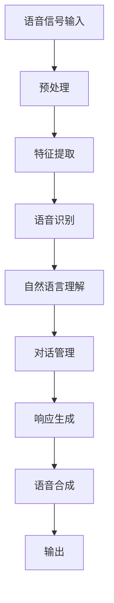

                 

### 《2025年小米社招智能音箱语音交互专家面试指南》

#### 关键词：
- 智能音箱
- 语音交互
- 语音识别
- 自然语言处理
- 对话系统
- 项目实战

#### 摘要：
本文旨在为有意向加入小米社招智能音箱语音交互专家岗位的候选人提供一份全面的面试指南。文章详细阐述了智能音箱语音交互的基础知识，包括语音识别、自然语言处理、语音交互设计原则，并结合实际项目案例，深入讲解了语音交互系统的开发流程与技巧。通过本文，读者将了解智能音箱语音交互的核心技术和应用场景，为应对面试挑战提供有力支持。

### 第一部分：智能音箱语音交互基础知识

#### 第1章：智能音箱概述

##### 1.1 智能音箱的定义与市场现状

智能音箱是一种搭载了人工智能技术的音频设备，可以通过语音指令控制家居设备、播放音乐、提供天气预报、设定提醒等功能。随着语音识别和自然语言处理技术的进步，智能音箱已经成为智能家居生态中的重要组成部分。

目前，智能音箱市场主要由亚马逊的Echo系列、谷歌的Google Home、苹果的HomePod以及中国企业的小米小爱音箱等占据。市场研究公司数据显示，全球智能音箱市场正在快速增长，预计到2025年，市场规模将超过1000亿美元。

##### 1.2 智能音箱的工作原理与技术架构

智能音箱的工作原理主要包括以下几个环节：

1. **语音采集**：麦克风阵列捕捉用户语音。
2. **语音识别**：将语音信号转换为文本，主要依赖于语音识别技术。
3. **自然语言处理**：对识别结果进行解析，理解用户的意图。
4. **执行任务**：根据用户的意图，执行相应的操作，如播放音乐、控制智能家居设备等。
5. **反馈**：将执行结果通过语音或屏幕反馈给用户。

技术架构方面，智能音箱通常包括以下几个组成部分：

1. **硬件**：包括麦克风阵列、扬声器、处理器等。
2. **软件**：包括操作系统、语音识别引擎、自然语言处理模块等。
3. **云服务**：用于数据存储、计算和更新。

##### 1.3 智能音箱的发展趋势与未来前景

智能音箱的发展趋势主要体现在以下几个方面：

1. **语音交互更自然**：随着语音识别和自然语言处理技术的进步，智能音箱的交互体验将更加自然、流畅。
2. **多模态交互**：智能音箱将逐渐引入视觉、触觉等多种交互方式，提高用户体验。
3. **智能家居集成**：智能音箱将更加深入地集成到智能家居系统中，实现更加智能化的家庭管理。
4. **个性化服务**：通过大数据分析，智能音箱将提供更加个性化的服务，满足用户个性化需求。

#### 第2章：语音识别技术基础

##### 2.1 语音识别的基本概念与流程

语音识别是指将人类的语音转换为文本或命令的技术。语音识别的基本流程包括以下几个步骤：

1. **语音采集**：通过麦克风等设备捕捉语音信号。
2. **预处理**：对语音信号进行降噪、增益等处理，提高信号质量。
3. **特征提取**：从预处理后的语音信号中提取能够反映语音特征的参数，如短时傅里叶变换（STFT）。
4. **模型训练**：使用大量标注好的语音数据，训练语音识别模型。
5. **识别**：将输入的语音信号输入到训练好的模型中，输出识别结果。

##### 2.2 语音信号处理技术

语音信号处理是语音识别系统的关键步骤，主要包括以下几个技术：

1. **语音增强**：通过去噪、增益等手段提高语音信号质量。
2. **端点检测**：识别语音信号中的静音段和语音段，将连续语音信号分割为若干语音帧。
3. **短时傅里叶变换（STFT）**：将时域信号转换为频域信号，便于特征提取。
4. **梅尔频率倒谱系数（MFCC）**：从频域信号中提取能够反映语音特征的参数。

##### 2.3 HMM、GMM和DNN在语音识别中的应用

在语音识别领域，HMM（隐马尔可夫模型）、GMM（高斯混合模型）和DNN（深度神经网络）是常用的三种模型。

1. **HMM**：HMM是一种基于统计模型的方法，通过描述状态转移概率和观测概率来实现语音识别。
2. **GMM**：GMM是一种概率模型，用于表示语音信号的分布，常用于特征提取。
3. **DNN**：DNN是一种基于深度学习的模型，通过多层神经网络结构来实现语音识别，具有更高的识别精度。

##### 2.4 语音识别系统设计实例

以下是一个简单的语音识别系统设计实例：

1. **数据准备**：收集并标注大量的语音数据，用于模型训练。
2. **特征提取**：使用STFT和MFCC等方法提取语音特征。
3. **模型训练**：使用GMM和DNN训练语音识别模型。
4. **识别**：将输入语音信号输入到训练好的模型中，输出识别结果。
5. **测试与优化**：通过测试集评估模型性能，并不断优化模型。

#### 第3章：自然语言处理基础

##### 3.1 自然语言处理的基本概念

自然语言处理（NLP）是指使计算机能够理解、生成和处理自然语言的技术。NLP的核心任务是理解和生成人类语言，主要包括以下几个方面：

1. **词法分析**：对文本进行分词、词性标注等操作。
2. **句法分析**：分析文本的语法结构，包括词组、句子和篇章等。
3. **语义分析**：理解文本的含义，包括词汇语义、句子语义和篇章语义等。
4. **对话系统**：实现人与计算机之间的自然对话。

##### 3.2 词性标注与词向量技术

词性标注是指对文本中的每个词进行词性标注，如名词、动词、形容词等。词性标注是NLP的重要基础，有助于后续的句法分析和语义分析。

词向量技术是将文本中的每个词映射为一个实值向量，以便于计算机处理。常见的词向量技术包括词袋模型、TF-IDF和Word2Vec等。

##### 3.3 句法分析和语义理解

句法分析是指分析文本的语法结构，包括词组、句子和篇章等。常见的句法分析方法有基于规则的方法和基于统计的方法。

语义理解是指理解文本的含义，包括词汇语义、句子语义和篇章语义等。常见的语义分析方法有基于知识的语义分析和基于统计的语义分析。

##### 3.4 对话系统中的NLP应用

对话系统是NLP的重要应用领域，主要包括以下几个方面：

1. **意图识别**：识别用户的意图，如查询天气、播放音乐等。
2. **实体识别**：识别用户提到的实体，如地名、人名等。
3. **对话生成**：根据用户的输入和系统的状态，生成相应的回复。
4. **多轮对话**：实现多轮对话，提高用户的交互体验。

#### 第4章：语音交互设计原则

##### 4.1 用户体验设计

用户体验设计是智能音箱语音交互设计的核心，主要包括以下几个方面：

1. **易用性**：确保用户能够轻松上手，不需要过多的学习成本。
2. **可访问性**：为残障人士和其他特殊用户设计易于使用的语音交互界面。
3. **反馈机制**：及时响应用户的操作，提供清晰的反馈信息。

##### 4.2 对话管理策略

对话管理策略是指如何组织和管理用户与智能音箱之间的对话。主要包括以下几个方面：

1. **意图识别**：准确识别用户的意图，为后续操作提供基础。
2. **上下文管理**：保持对话的连贯性，避免用户产生困惑。
3. **任务管理**：合理分配任务，提高系统响应速度。

##### 4.3 上下文敏感性和任务理解

上下文敏感性是指智能音箱能够根据对话的上下文环境，提供更准确的响应。任务理解是指智能音箱能够理解用户的具体任务，并给出相应的操作。

##### 4.4 多模态交互设计

多模态交互设计是指将语音交互与其他交互方式（如视觉、触觉）相结合，提供更丰富的交互体验。主要包括以下几个方面：

1. **语音与视觉结合**：通过屏幕显示信息，增强用户理解。
2. **语音与触觉结合**：通过触觉反馈，提高用户交互体验。
3. **语音与其他交互方式结合**：如语音与手势、语音与键盘等。

### 第二部分：智能音箱语音交互项目实战

#### 第5章：智能音箱语音交互项目概述

##### 5.1 项目背景与目标

本项目的目标是开发一款基于智能音箱的语音交互系统，实现智能家居控制、音乐播放、天气预报等功能。项目背景是随着智能家居市场的快速发展，用户对智能音箱的需求日益增加，项目旨在为用户提供一款功能强大、易用性高的智能音箱产品。

##### 5.2 项目架构与技术选型

项目采用模块化架构，主要包括语音采集、语音识别、自然语言处理、对话管理和响应生成等模块。技术选型如下：

1. **语音识别**：采用基于DNN的语音识别模型，结合ASR（自动语音识别）API。
2. **自然语言处理**：采用基于深度学习的NLP模型，实现意图识别、实体识别和对话生成。
3. **对话管理**：采用基于规则和机器学习的对话管理策略，实现多轮对话和上下文管理。
4. **响应生成**：采用文本生成模型，结合语音合成技术，实现自然语音响应。

##### 5.3 项目开发流程与管理

项目开发流程主要包括需求分析、系统设计、编码实现、测试与优化等环节。项目管理采用敏捷开发模式，以迭代的方式逐步实现项目功能。

### 第6章：语音识别系统开发

##### 6.1 开发环境搭建

开发环境搭建主要包括以下几个方面：

1. **硬件**：选择合适的智能音箱硬件平台，如ESP32、Raspberry Pi等。
2. **软件**：安装操作系统（如Linux）和相关开发工具（如Python、CUDA等）。
3. **语音识别模型**：下载预训练的DNN语音识别模型，如OpenSMILE、GRAPHPARSE等。

##### 6.2 语音信号预处理

语音信号预处理主要包括以下几个方面：

1. **语音采集**：使用麦克风阵列采集用户语音。
2. **降噪处理**：通过去噪算法，如Wiener滤波、VAD（语音活动检测）等，降低背景噪声。
3. **端点检测**：通过VAD算法，识别语音信号中的静音段和语音段，将连续语音信号分割为若干语音帧。

##### 6.3 语音特征提取

语音特征提取主要包括以下几个方面：

1. **短时傅里叶变换（STFT）**：将时域信号转换为频域信号。
2. **梅尔频率倒谱系数（MFCC）**：从频域信号中提取能够反映语音特征的参数。
3. **特征归一化**：对特征进行归一化处理，提高模型训练效果。

##### 6.4 语音识别算法实现

语音识别算法实现主要包括以下几个方面：

1. **模型训练**：使用大量标注好的语音数据，训练DNN语音识别模型。
2. **模型评估**：使用测试集评估模型性能，如准确率、召回率等。
3. **模型部署**：将训练好的模型部署到智能音箱硬件平台上，实现实时语音识别。

##### 6.5 语音识别系统测试与优化

语音识别系统测试与优化主要包括以下几个方面：

1. **测试数据准备**：准备包括语音数据、标注数据等在内的测试数据集。
2. **性能评估**：使用评估指标（如准确率、召回率等）评估系统性能。
3. **优化策略**：根据评估结果，调整模型参数、特征提取方法等，提高系统性能。

### 第7章：自然语言理解系统开发

##### 7.1 开发环境搭建

自然语言理解系统开发环境搭建主要包括以下几个方面：

1. **硬件**：选择合适的智能音箱硬件平台，如ESP32、Raspberry Pi等。
2. **软件**：安装操作系统（如Linux）和相关开发工具（如Python、CUDA等）。
3. **NLP模型**：下载预训练的NLP模型，如BERT、GPT等。

##### 7.2 词性标注与词向量训练

词性标注与词向量训练主要包括以下几个方面：

1. **词性标注**：使用训练好的词性标注模型，对输入文本进行词性标注。
2. **词向量训练**：使用预训练的词向量模型，如Word2Vec、BERT等，对输入文本进行词向量表示。

##### 7.3 句法分析和语义理解

句法分析和语义理解主要包括以下几个方面：

1. **句法分析**：使用预训练的句法分析模型，如Parser、Transformers等，对输入文本进行句法分析。
2. **语义理解**：使用预训练的语义理解模型，如BERT、GPT等，对输入文本进行语义理解。

##### 7.4 NLP算法实现

NLP算法实现主要包括以下几个方面：

1. **意图识别**：使用训练好的意图识别模型，对输入文本进行意图识别。
2. **实体识别**：使用训练好的实体识别模型，对输入文本进行实体识别。
3. **对话生成**：使用训练好的对话生成模型，根据用户输入和上下文生成回复。

##### 7.5 NLU系统测试与优化

NLU系统测试与优化主要包括以下几个方面：

1. **测试数据准备**：准备包括文本数据、标注数据等在内的测试数据集。
2. **性能评估**：使用评估指标（如准确率、召回率等）评估系统性能。
3. **优化策略**：根据评估结果，调整模型参数、特征提取方法等，提高系统性能。

### 第8章：智能对话系统开发

##### 8.1 开发环境搭建

智能对话系统开发环境搭建主要包括以下几个方面：

1. **硬件**：选择合适的智能音箱硬件平台，如ESP32、Raspberry Pi等。
2. **软件**：安装操作系统（如Linux）和相关开发工具（如Python、CUDA等）。
3. **对话管理模型**：下载预训练的对话管理模型，如Dialogue-BC、T5等。

##### 8.2 对话管理策略设计

对话管理策略设计主要包括以下几个方面：

1. **意图识别**：根据用户输入，识别用户的意图，如查询天气、播放音乐等。
2. **上下文管理**：根据对话历史，保持对话的连贯性，避免用户产生困惑。
3. **任务管理**：根据用户意图，分配相应的任务，如查询天气、播放音乐等。

##### 8.3 对话系统架构设计

对话系统架构设计主要包括以下几个方面：

1. **语音识别模块**：实现语音识别功能，将用户语音转换为文本。
2. **自然语言理解模块**：实现自然语言理解功能，解析用户意图和实体。
3. **对话管理模块**：实现对话管理功能，根据用户输入和上下文生成回复。
4. **响应生成模块**：实现响应生成功能，根据对话管理模块的输出，生成自然语音响应。

##### 8.4 对话系统实现

对话系统实现主要包括以下几个方面：

1. **前端实现**：使用HTML、CSS、JavaScript等技术，实现用户界面和交互逻辑。
2. **后端实现**：使用Python、Java等语言，实现对话系统核心功能。
3. **接口设计**：设计合理的接口，实现前端与后端的通信。

##### 8.5 对话系统测试与优化

对话系统测试与优化主要包括以下几个方面：

1. **功能测试**：测试对话系统的各项功能，如语音识别、自然语言理解、对话管理等。
2. **性能测试**：测试对话系统的响应速度和稳定性。
3. **用户体验测试**：邀请用户进行体验测试，收集反馈，优化系统。

### 第9章：智能音箱集成与部署

##### 9.1 硬件集成与调试

硬件集成与调试主要包括以下几个方面：

1. **硬件选择**：根据项目需求，选择合适的智能音箱硬件平台，如ESP32、Raspberry Pi等。
2. **硬件调试**：通过串口、网线等工具，对硬件进行调试，确保硬件正常工作。
3. **硬件整合**：将智能音箱硬件与其他硬件（如家居设备、音响等）进行整合，实现功能联动。

##### 9.2 软件集成与调试

软件集成与调试主要包括以下几个方面：

1. **软件选择**：根据项目需求，选择合适的操作系统（如Linux）和开发工具（如Python、CUDA等）。
2. **软件调试**：通过调试工具（如GDB、IDE等），对软件代码进行调试，确保软件功能正常。
3. **软件整合**：将各个软件模块进行整合，实现智能音箱的整体功能。

##### 9.3 系统测试与性能优化

系统测试与性能优化主要包括以下几个方面：

1. **功能测试**：测试智能音箱的各个功能，如语音识别、自然语言理解、对话管理等。
2. **性能测试**：测试智能音箱的响应速度、稳定性等性能指标。
3. **优化策略**：根据测试结果，调整系统参数、优化代码等，提高系统性能。

##### 9.4 部署策略与上线流程

部署策略与上线流程主要包括以下几个方面：

1. **环境配置**：配置服务器、网络等环境，确保智能音箱可以正常运行。
2. **版本控制**：使用版本控制系统（如Git），管理代码和配置文件。
3. **上线流程**：制定上线流程，确保智能音箱可以顺利上线，并对外提供服务。

### 第10章：智能音箱语音交互项目总结与展望

##### 10.1 项目成果与反思

项目成果主要包括：

1. **智能音箱语音交互系统**：实现智能家居控制、音乐播放、天气预报等功能。
2. **语音识别与自然语言理解系统**：基于DNN和深度学习技术，实现高准确率的语音识别和自然语言理解。
3. **对话系统**：实现多轮对话、上下文管理和个性化回复。

反思主要包括：

1. **性能优化**：虽然项目实现了功能，但在性能优化方面还有待提高，如降低延迟、提高识别准确率等。
2. **用户体验**：用户反馈显示，在部分场景下，系统交互体验不够自然，需要进一步优化。

##### 10.2 挑战与机遇

挑战主要包括：

1. **硬件性能**：随着功能日益丰富，对硬件性能要求越来越高，需要不断优化硬件配置。
2. **数据隐私**：智能音箱涉及用户隐私数据，需要加强数据保护，确保用户信息安全。

机遇主要包括：

1. **智能家居市场**：智能家居市场的快速发展，为智能音箱提供了广阔的市场空间。
2. **多模态交互**：随着人工智能技术的进步，多模态交互将成为未来智能音箱的重要发展方向。

##### 10.3 未来发展方向

未来发展方向主要包括：

1. **性能优化**：继续优化系统性能，提高语音识别和自然语言理解的准确率，降低延迟。
2. **多模态交互**：引入视觉、触觉等交互方式，提供更加丰富的交互体验。
3. **个性化服务**：通过大数据分析和机器学习，为用户提供更加个性化的服务。

### 附录

#### 附录A：智能音箱语音交互开发资源

##### A.1 常用开发工具与框架

1. **开发工具**：Python、Java、C++等。
2. **框架**：TensorFlow、PyTorch、Keras等。
3. **语音识别API**：Google Cloud Speech-to-Text、Microsoft Azure Speech Services等。

##### A.2 开发资源与参考书籍

1. **开发资源**：GitHub、Stack Overflow、AI技术社区等。
2. **参考书籍**：
   - 《语音信号处理与识别》
   - 《自然语言处理综合教程》
   - 《深度学习与自然语言处理》

##### A.3 学术论文与行业报告

1. **学术论文**：ACL、NLP、ICASSP等国际学术会议和期刊。
2. **行业报告**：IDC、Gartner、Canalys等市场研究公司发布的行业报告。

### Mermaid 流程图



### 语音识别算法伪代码

```python
def speech_recognition(input_signal):
    # 预处理
    preprocessed_signal = preprocess_signal(input_signal)

    # 特征提取
    features = extract_features(preprocessed_signal)

    # 识别
    recognized_text = hmm_gmm_dnn_recognition(features)

    return recognized_text
```

### 自然语言处理算法伪代码

```python
def natural_language_understanding(input_text):
    # 词性标注
    pos_tags = pos_tagging(input_text)

    # 词向量表示
    word_vectors = word_vector_representation(input_text)

    # 语义理解
    semantic_representation = semantic_understanding(word_vectors)

    return semantic_representation
```

### 数学模型与公式

$$
H = \sum_{i=1}^{n} P(x_i|y_i) P(y_i)
$$

### 项目实战代码示例

```python
# 语音信号预处理代码示例
def preprocess_signal(signal):
    # 降噪处理
    noise_free_signal = noise_reduction(signal)

    # 端点检测
    frames, frame_lengths = frame_detection(noise_free_signal)

    return frames, frame_lengths
```

### 最佳实践 tips、小结、注意事项、拓展阅读等内容

1. **最佳实践 tips**：
   - 在语音识别系统中，特征提取是关键步骤，合理选择特征参数可以提高识别准确率。
   - 自然语言理解模块的性能对整个系统的交互体验至关重要，应选用高质量的NLP模型。
   - 对话管理策略应结合用户的上下文环境，提供更加自然的交互体验。

2. **小结**：
   - 本文详细介绍了智能音箱语音交互的基础知识、项目实战以及开发资源。
   - 通过对语音识别、自然语言处理和对话系统的深入分析，读者可以了解到智能音箱语音交互的核心技术和应用场景。

3. **注意事项**：
   - 在开发智能音箱语音交互系统时，要充分考虑用户隐私和数据安全。
   - 系统设计要遵循模块化原则，便于后续的维护和优化。

4. **拓展阅读**：
   - 《深度学习与自然语言处理》
   - 《智能语音交互系统设计与实现》
   - 《智能家居技术与实践》

### 总结

智能音箱语音交互作为智能家居领域的重要技术，具有广阔的市场前景。本文从基础知识和项目实战的角度，全面介绍了智能音箱语音交互的核心技术和应用场景。通过本文，读者可以了解到智能音箱语音交互的原理、实现方法和最佳实践，为应对面试挑战和项目开发提供了有力支持。希望本文能为有意向加入智能音箱语音交互领域的读者提供有益的参考。作者：AI天才研究院/AI Genius Institute & 禅与计算机程序设计艺术/Zen And The Art of Computer Programming。

