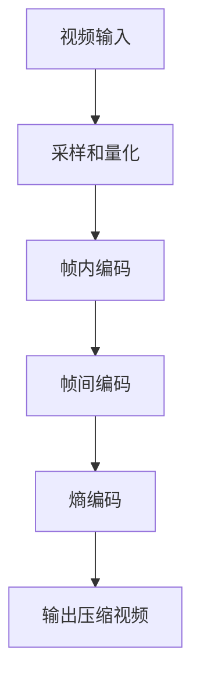

                 

### 文章标题：2025年快手社招视频压缩算法工程师面试指南

#### 关键词：快手、社招、视频压缩算法、面试指南、人工智能、技术分析

#### 摘要：
本文旨在为2025年快手社招视频压缩算法工程师面试者提供一份全面的面试指南。文章将从视频压缩算法的基础知识、快手视频压缩算法的实战经验、以及快手社招面试的准备策略三个方面，帮助面试者深入了解视频压缩技术，掌握快手视频压缩算法的核心原理和优化策略，并顺利通过面试。

## 《2025年快手社招视频压缩算法工程师面试指南》目录大纲

### 第一部分：视频压缩算法基础

#### 1.1 视频压缩技术概述

##### 1.1.1 视频压缩的意义和挑战

##### 1.1.2 视频压缩的基本原理

##### 1.1.3 常见的视频压缩标准

#### 1.2 视频编码基础

##### 1.2.1 视频信号的采样和量化

##### 1.2.2 视频信号的时域和频域表示

##### 1.2.3 视频编码中的冗余消除技术

#### 1.3 视频压缩算法原理

##### 1.3.1 无损视频压缩算法

##### 1.3.2 有损视频压缩算法

##### 1.3.3 常见视频压缩算法的比较

#### 1.4 视频压缩编码流程

##### 1.4.1 视频压缩编码的基本步骤

##### 1.4.2 视频压缩编码的优化策略

##### 1.4.3 视频压缩编码的性能评估

### 第二部分：快手视频压缩算法实战

#### 2.1 快手视频压缩算法概述

##### 2.1.1 快手视频压缩算法的发展历程

##### 2.1.2 快手视频压缩算法的优势

##### 2.1.3 快手视频压缩算法的架构

#### 2.2 快手视频压缩算法核心模块

##### 2.2.1 视频编码模块

###### 2.2.1.1 快手视频编码算法的实现原理

###### 2.2.1.2 快手视频编码算法的性能优化

##### 2.2.2 视频解码模块

###### 2.2.2.1 快手视频解码算法的实现原理

###### 2.2.2.2 快手视频解码算法的性能优化

#### 2.3 快手视频压缩算法优化策略

##### 2.3.1 帧率优化策略

###### 2.3.1.1 快手帧率优化算法的实现原理

###### 2.3.1.2 快手帧率优化算法的性能优化

##### 2.3.2 分辨率优化策略

###### 2.3.2.1 快手分辨率优化算法的实现原理

###### 2.3.2.2 快手分辨率优化算法的性能优化

##### 2.3.3 色度优化策略

###### 2.3.3.1 快手色度优化算法的实现原理

###### 2.3.3.2 快手色度优化算法的性能优化

#### 2.4 快手视频压缩算法应用案例

##### 2.4.1 快手短视频压缩

###### 2.4.1.1 快手短视频压缩的实现原理

###### 2.4.1.2 快手短视频压缩的性能优化

##### 2.4.2 快手直播视频压缩

###### 2.4.2.1 快手直播视频压缩的实现原理

###### 2.4.2.2 快手直播视频压缩的性能优化

#### 2.5 快手视频压缩算法未来发展趋势

##### 2.5.1 新的视频压缩技术展望

##### 2.5.2 快手视频压缩算法的挑战与机遇

##### 2.5.3 未来快手视频压缩算法的发展方向

### 第三部分：快手社招面试准备

#### 3.1 快手招聘信息与岗位要求

##### 3.1.1 快手招聘视频压缩算法工程师的岗位职责

##### 3.1.2 快手招聘视频压缩算法工程师的技能要求

##### 3.1.3 快手招聘视频压缩算法工程师的面试流程

#### 3.2 快手面试常见问题与解答

##### 3.2.1 视频压缩算法原理相关问题

##### 3.2.2 编码器和解码器设计相关问题

##### 3.2.3 编码效率和质量平衡相关问题

#### 3.3 快手面试实战案例

##### 3.3.1 案例一：设计一个简单的视频压缩算法

##### 3.3.2 案例二：分析一个视频压缩算法的性能瓶颈

##### 3.3.3 案例三：优化一个视频压缩算法的编码效率

### 附录

#### 附录A：快手视频压缩算法开发工具与资源

##### A.1 主流视频压缩工具对比

##### A.2 快手视频压缩算法开发资源

##### A.3 快手视频压缩算法开源项目推荐

#### 附录B：常见视频压缩算法流程图

#### 附录C：常见视频压缩算法伪代码

### 附录D：参考文献

## 第一部分：视频压缩算法基础

### 1.1 视频压缩技术概述

#### 1.1.1 视频压缩的意义和挑战

随着互联网和移动设备的普及，视频已经成为信息传播和娱乐的主要形式。然而，视频数据量大、传输和存储需求高，对网络带宽和存储空间提出了巨大挑战。视频压缩技术应运而生，其目的是在不显著降低视频质量的前提下，减小视频文件的大小，提高传输效率和存储空间利用率。

视频压缩的意义主要体现在以下几个方面：

1. **降低带宽消耗**：压缩后的视频数据量减小，可以显著降低网络传输带宽的需求，尤其是对于移动网络和带宽有限的场景。
2. **提升存储空间利用率**：压缩技术可以减少视频文件的大小，从而节省存储空间，降低存储成本。
3. **提高播放流畅度**：压缩技术有助于减少播放延迟，提高视频播放的流畅度。
4. **支持多种设备和平台**：压缩后的视频可以适配不同的设备和平台，提高用户体验。

然而，视频压缩也面临一系列挑战：

1. **质量与效率的平衡**：视频压缩需要在质量损失和压缩效率之间找到最佳平衡点。
2. **兼容性和标准化**：不同的视频压缩技术存在兼容性问题，标准化进程也需要不断推进。
3. **硬件加速和性能优化**：视频压缩算法需要考虑硬件加速和性能优化，以适应各种设备和平台的性能要求。

#### 1.1.2 视频压缩的基本原理

视频压缩技术主要基于数据冗余的消除。视频数据中存在多种冗余，包括空间冗余、时间冗余和结构冗余。以下简要介绍视频压缩的基本原理：

1. **空间冗余消除**：空间冗余指的是在同一帧内，相邻像素之间的相关性。通过预测编码技术，可以减少空间冗余。常见的预测编码技术包括帧内预测编码和帧间预测编码。
2. **时间冗余消除**：时间冗余指的是在不同帧之间的相关性。通过运动估计和运动补偿技术，可以消除时间冗余。这种方式可以实现帧间压缩，显著减小视频文件的大小。
3. **结构冗余消除**：结构冗余指的是视频内容中存在的重复结构或模式。通过模式识别和纹理压缩技术，可以消除结构冗余。

#### 1.1.3 常见的视频压缩标准

视频压缩技术已经形成了多种国际标准和规范，以下是一些常见的视频压缩标准：

1. **MPEG系列**：包括MPEG-1、MPEG-2、MPEG-4等，主要应用于电视和电影等领域。
2. **H.26x系列**：包括H.261、H.263、H.264、H.265等，广泛用于视频会议、流媒体和高清视频等领域。
3. **AVS**：中国自主研发的视频压缩标准，主要应用于国内视频领域。
4. **HEVC**：即H.265，是目前最先进的视频压缩标准，相比H.264具有更高的压缩效率和更好的图像质量。

## 1.2 视频编码基础

### 1.2.1 视频信号的采样和量化

视频编码的第一步是对视频信号进行采样和量化。采样是将连续的视频信号转换为离散的数字信号，量化则是将采样得到的数值进行近似表示。

#### 采样

采样包括时间采样和空间采样。时间采样是指将连续的视频信号在时间轴上离散化，通常使用帧率（frames per second, fps）来表示。空间采样是指将连续的视频信号在空间轴上离散化，通常使用像素分辨率（如1920x1080）来表示。

例如，假设我们使用30fps的帧率进行时间采样，使用1920x1080的分辨率进行空间采样，那么每秒会有30帧，每帧会有1920x1080个像素。

$$
\text{总像素数} = \text{帧率} \times \text{分辨率} = 30 \times 1920 \times 1080
$$

#### 量化

量化是将采样得到的数值进行近似表示。在视频编码中，通常使用8位或10位量化，即每个像素值可以表示256或1024个不同的灰度级别。

例如，使用8位量化，像素值可以表示为0到255之间的整数。假设一个像素的亮度值为128，使用8位量化表示为10000000（二进制）。

$$
\text{量化值} = 128 \times 2^{-8} = 128 / 256
$$

### 1.2.2 视频信号的时域和频域表示

视频信号既可以在时域表示，也可以在频域表示。时域表示关注视频信号随时间的变化，而频域表示关注视频信号在不同频率上的分布。

#### 时域表示

在时域中，视频信号可以用一串时间序列的数值来表示。例如，对于一个连续的视频信号，我们可以将其表示为一个长度为T的数组，其中每个元素表示一个时间点的像素值。

$$
x[n] = \text{像素值}, \quad n = 0, 1, ..., T-1
$$

#### 频域表示

在频域中，视频信号可以用一组频率上的数值来表示。常见的频域表示方法包括离散余弦变换（DCT）和离散小波变换（DWT）。

离散余弦变换（DCT）是将视频信号从时域转换到频域的一种常用方法。DCT可以将视频信号分解为不同的频率分量，从而实现频域表示。

$$
F[k] = \sum_{n=0}^{N-1} x[n] \cdot C[n, k], \quad k = 0, 1, ..., N-1
$$

其中，$C[n, k]$ 是DCT系数，$x[n]$ 是时域信号，$F[k]$ 是频域信号。

### 1.2.3 视频编码中的冗余消除技术

视频编码的核心目标是消除视频信号中的冗余，从而实现高效的压缩。以下介绍几种常用的冗余消除技术：

#### 帧内冗余消除

帧内冗余消除关注同一帧内像素之间的相关性。常见的帧内冗余消除技术包括：

1. **预测编码**：预测编码通过预测当前像素的值，从而减少冗余。例如，可以预测当前像素的值等于上一像素的值。
2. **变换编码**：变换编码通过将视频信号从时域转换到频域，从而消除冗余。例如，可以使用离散余弦变换（DCT）或离散小波变换（DWT）。

#### 帧间冗余消除

帧间冗余消除关注不同帧之间的相关性。常见的帧间冗余消除技术包括：

1. **运动估计和补偿**：运动估计和补偿通过分析连续帧之间的运动，从而减少冗余。运动估计可以找到最佳的运动向量，运动补偿则根据运动向量对当前帧进行预测。
2. **插值技术**：插值技术通过在连续帧之间生成中间帧，从而减少冗余。常见的插值技术包括线性插值和双线性插值。

#### 空间冗余消除

空间冗余消除关注同一帧内像素之间的相关性。常见的空间冗余消除技术包括：

1. **子带编码**：子带编码将视频信号分解为多个子带，从而在不同的子带上进行冗余消除。
2. **压缩感知**：压缩感知通过在稀疏表示的基础上进行冗余消除，从而实现高效的压缩。

### 1.3 视频压缩算法原理

#### 1.3.1 无损视频压缩算法

无损视频压缩算法不损失视频质量，但压缩效率较低。常见的无损视频压缩算法包括：

1. **Huffman编码**：Huffman编码是一种基于频率的熵编码技术，通过构建Huffman树来对视频信号进行编码，从而实现压缩。
2. **算术编码**：算术编码是一种基于概率的熵编码技术，通过将视频信号映射到一个实数区间，从而实现压缩。

#### 1.3.2 有损视频压缩算法

有损视频压缩算法在压缩过程中会损失一定的视频质量，但可以显著提高压缩效率。常见的有损视频压缩算法包括：

1. **JPEG**：JPEG是一种基于离散余弦变换（DCT）的图像压缩算法，广泛应用于静态图像和视频压缩。
2. **H.264**：H.264是一种基于运动估计和补偿的图像压缩算法，广泛应用于高清视频和流媒体领域。
3. **HEVC**：HEVC是一种最新的视频压缩标准，相比H.264具有更高的压缩效率和更好的图像质量。

#### 1.3.3 常见视频压缩算法的比较

以下是比较常见视频压缩算法的优缺点：

1. **JPEG**：
   - 优点：简单易用，适合静态图像和低分辨率视频。
   - 缺点：压缩效率低，有损压缩质量较差。
2. **H.264**：
   - 优点：压缩效率高，适合高清视频和流媒体。
   - 缺点：计算复杂度较高，对硬件要求较高。
3. **HEVC**：
   - 优点：压缩效率更高，适合超高分辨率视频和高质量要求。
   - 缺点：计算复杂度更高，对硬件要求更高。

### 1.4 视频压缩编码流程

视频压缩编码流程包括多个步骤，下面将介绍每个步骤的详细内容。

#### 1.4.1 视频压缩编码的基本步骤

视频压缩编码的基本步骤包括：

1. **采样和量化**：对视频信号进行采样和量化，将连续的模拟信号转换为离散的数字信号。
2. **帧内编码**：对每个帧进行帧内编码，消除帧内冗余。
3. **帧间编码**：对连续帧进行帧间编码，消除帧间冗余。
4. **熵编码**：对编码后的视频信号进行熵编码，进一步压缩数据。
5. **解码**：对压缩后的视频信号进行解码，恢复原始视频信号。

#### 1.4.2 视频压缩编码的优化策略

视频压缩编码的优化策略主要包括：

1. **运动估计和补偿**：通过优化运动估计和补偿算法，提高帧间压缩效率。
2. **变换编码**：通过优化变换编码算法，提高频域压缩效率。
3. **熵编码**：通过优化熵编码算法，提高数据压缩率。
4. **并行计算**：通过并行计算技术，提高编码和解码的效率。

#### 1.4.3 视频压缩编码的性能评估

视频压缩编码的性能评估主要包括：

1. **压缩效率**：衡量压缩前后视频数据量的比值，越高表示压缩效果越好。
2. **压缩质量**：衡量压缩后视频质量与原始视频质量之间的差异，通常使用PSNR（峰值信噪比）和SSIM（结构相似性指数）等指标进行评估。
3. **计算复杂度**：衡量编码和解码算法的计算复杂度，越高表示算法对硬件要求越高。

## 第二部分：快手视频压缩算法实战

### 2.1 快手视频压缩算法概述

快手视频压缩算法是快手平台核心关键技术之一，旨在提供高效、低延迟的视频传输和存储解决方案。快手视频压缩算法经历了多年的发展，不断优化和迭代，以满足日益增长的用户需求和高质量视频体验。

#### 2.1.1 快手视频压缩算法的发展历程

快手视频压缩算法的发展历程可以分为以下几个阶段：

1. **早期阶段**：快手初期主要采用基于H.264的压缩算法，该算法在当时具有较高的压缩效率和良好的图像质量。
2. **优化阶段**：随着用户需求的增长，快手开始对H.264算法进行优化，包括运动估计和补偿、变换编码等方面的改进，以进一步提高压缩效率和图像质量。
3. **创新阶段**：近年来，快手开始探索新的视频压缩技术，如HEVC（H.265）和AVS+，以满足更高分辨率和更高质量的视频需求。
4. **未来趋势**：快手正在研发下一代视频压缩技术，如基于AI的智能压缩算法，以实现更高压缩效率和更高质量的视频体验。

#### 2.1.2 快手视频压缩算法的优势

快手视频压缩算法具有以下优势：

1. **高效压缩**：快手视频压缩算法在保持高质量图像的前提下，实现了高效的视频压缩，有效降低了视频传输和存储成本。
2. **低延迟**：快手视频压缩算法采用了多种优化策略，如并行计算和缓存技术，实现了低延迟的视频传输和播放。
3. **自适应调整**：快手视频压缩算法可以根据不同场景和用户需求，自动调整压缩参数，以实现最佳的压缩效果和用户体验。
4. **兼容性强**：快手视频压缩算法支持多种视频编码标准，如H.264、HEVC和AVS+，能够兼容不同设备和平台的视频播放。

#### 2.1.3 快手视频压缩算法的架构

快手视频压缩算法的架构可以分为以下几个模块：

1. **编码模块**：负责对视频信号进行压缩编码，包括采样、量化、帧内编码、帧间编码和熵编码等步骤。
2. **解码模块**：负责对压缩后的视频信号进行解码，恢复原始视频信号，包括反量化、反采样、反帧内编码和反帧间编码等步骤。
3. **优化模块**：负责对编码和解码过程进行优化，包括运动估计和补偿、变换编码、熵编码和缓存管理等策略。
4. **自适应模块**：负责根据不同场景和用户需求，自动调整压缩参数，以实现最佳的压缩效果和用户体验。

### 2.2 快手视频压缩算法核心模块

快手视频压缩算法的核心模块包括编码模块和解码模块，下面将详细介绍这两个模块的实现原理和性能优化策略。

#### 2.2.1 视频编码模块

视频编码模块是实现视频压缩的关键，其主要包括以下几个步骤：

1. **采样和量化**：对视频信号进行采样和量化，将连续的模拟信号转换为离散的数字信号。
2. **帧内编码**：对每个帧进行帧内编码，消除帧内冗余。常见的帧内编码方法包括预测编码和变换编码。
3. **帧间编码**：对连续帧进行帧间编码，消除帧间冗余。常见的帧间编码方法包括运动估计和补偿。
4. **熵编码**：对编码后的视频信号进行熵编码，进一步压缩数据。常见的熵编码方法包括Huffman编码和算术编码。

**2.2.1.1 快手视频编码算法的实现原理**

快手视频编码算法在实现原理上主要采用以下技术：

1. **多分辨率编码**：快手视频编码算法支持多分辨率编码，可以根据视频内容的重要性和用户需求，自动调整编码分辨率，实现不同分辨率下的视频压缩。
2. **动态帧率控制**：快手视频编码算法支持动态帧率控制，可以根据视频内容的运动强度和用户需求，自动调整帧率，实现不同帧率下的视频压缩。
3. **色彩空间转换**：快手视频编码算法支持色彩空间转换，将YUV色彩空间转换为RGB色彩空间，从而提高压缩效率和图像质量。
4. **基于内容的自适应压缩**：快手视频编码算法支持基于内容的自适应压缩，可以根据视频内容的特点和用户需求，自动调整压缩参数，实现最佳的视频压缩效果。

**2.2.1.2 快手视频编码算法的性能优化**

快手视频编码算法在性能优化方面主要采用以下策略：

1. **运动估计和补偿优化**：通过优化运动估计和补偿算法，提高帧间压缩效率。例如，采用多分辨率运动估计和补偿，提高运动估计的准确性。
2. **变换编码优化**：通过优化变换编码算法，提高频域压缩效率。例如，采用 directional transformation，提高变换编码的效率。
3. **熵编码优化**：通过优化熵编码算法，提高数据压缩率。例如，采用自适应Huffman编码和算术编码，提高熵编码的效率。
4. **并行计算优化**：通过优化并行计算，提高编码速度。例如，采用多线程和GPU加速，提高编码性能。

#### 2.2.2 视频解码模块

视频解码模块是实现视频解压缩的关键，其主要包括以下几个步骤：

1. **熵解码**：对压缩后的视频信号进行熵解码，恢复编码后的数据。
2. **反帧间编码**：对连续帧进行反帧间编码，恢复原始视频信号。
3. **反帧内编码**：对每个帧进行反帧内编码，恢复原始像素值。
4. **反采样和量化**：对反采样的视频信号进行反量化，恢复原始的模拟信号。

**2.2.2.1 快手视频解码算法的实现原理**

快手视频解码算法在实现原理上主要采用以下技术：

1. **多分辨率解码**：快手视频解码算法支持多分辨率解码，可以根据视频内容的重要性和用户需求，自动调整解码分辨率，实现不同分辨率下的视频解压缩。
2. **动态帧率控制**：快手视频解码算法支持动态帧率控制，可以根据视频内容的运动强度和用户需求，自动调整帧率，实现不同帧率下的视频解压缩。
3. **色彩空间转换**：快手视频解码算法支持色彩空间转换，将RGB色彩空间转换为YUV色彩空间，从而提高解码效率和图像质量。
4. **基于内容的自适应解码**：快手视频解码算法支持基于内容的自适应解码，可以根据视频内容的特点和用户需求，自动调整解码参数，实现最佳的视频解码效果。

**2.2.2.2 快手视频解码算法的性能优化**

快手视频解码算法在性能优化方面主要采用以下策略：

1. **运动估计和补偿优化**：通过优化运动估计和补偿算法，提高帧间解压缩效率。例如，采用多分辨率运动估计和补偿，提高运动估计的准确性。
2. **变换编码优化**：通过优化变换编码算法，提高频域解压缩效率。例如，采用 directional transformation，提高变换编码的效率。
3. **熵解码优化**：通过优化熵解码算法，提高数据解压缩率。例如，采用自适应Huffman解码和算术解码，提高熵解码的效率。
4. **并行计算优化**：通过优化并行计算，提高解码速度。例如，采用多线程和GPU加速，提高解码性能。

### 2.3 快手视频压缩算法优化策略

快手视频压缩算法在优化方面主要关注以下几个方面：

#### 2.3.1 帧率优化策略

帧率优化策略旨在根据视频内容的重要性和用户需求，动态调整帧率，实现高效的视频压缩和播放。以下介绍几种常见的帧率优化策略：

1. **基于运动强度的帧率调整**：通过分析视频内容的运动强度，对帧率进行动态调整。例如，对于运动较剧烈的片段，可以提高帧率，保证画面流畅度；对于运动较平稳的片段，可以降低帧率，降低压缩成本。
2. **基于用户感知的帧率调整**：通过分析用户对视频画面的感知，对帧率进行动态调整。例如，在用户注意力集中的场景，可以提高帧率，提升用户体验；在用户注意力分散的场景，可以降低帧率，节省带宽和计算资源。
3. **自适应帧率控制**：结合运动强度分析和用户感知分析，实现自适应帧率控制，以实现最佳的视频压缩效果和用户体验。

**2.3.1.1 快手帧率优化算法的实现原理**

快手帧率优化算法基于运动强度分析和用户感知分析，实现以下步骤：

1. **运动强度分析**：通过分析视频内容的运动强度，确定每个片段的运动强度值。运动强度值越大，表示运动越剧烈。
2. **用户感知分析**：通过分析用户对视频画面的感知，确定每个片段的用户感知值。用户感知值越大，表示用户对画面越关注。
3. **帧率调整**：根据运动强度值和用户感知值，动态调整每个片段的帧率。对于运动强度高、用户感知值高的片段，提高帧率；对于运动强度低、用户感知值低的片段，降低帧率。

**2.3.1.2 快手帧率优化算法的性能优化**

快手帧率优化算法在性能优化方面主要采用以下策略：

1. **实时性优化**：通过优化算法实现，提高帧率调整的实时性，确保视频播放的流畅度。
2. **计算复杂度优化**：通过优化算法实现，降低帧率调整的计算复杂度，降低硬件要求。
3. **多分辨率优化**：结合多分辨率技术，根据不同分辨率下的运动强度和用户感知，实现更精细的帧率调整。

#### 2.3.2 分辨率优化策略

分辨率优化策略旨在根据视频内容的重要性和用户需求，动态调整视频分辨率，实现高效的视频压缩和播放。以下介绍几种常见的分辨率优化策略：

1. **基于内容重要性的分辨率调整**：通过分析视频内容的重要性，对分辨率进行动态调整。例如，对于关键场景和重要信息，可以提高分辨率，保证画面清晰度；对于次要场景和辅助信息，可以降低分辨率，降低压缩成本。
2. **基于用户需求的分辨率调整**：通过分析用户对视频画面的需求，对分辨率进行动态调整。例如，在用户对画面质量要求较高的场景，可以提高分辨率，提升用户体验；在用户对画面质量要求较低的场景，可以降低分辨率，节省带宽和计算资源。
3. **自适应分辨率控制**：结合内容重要性和用户需求分析，实现自适应分辨率控制，以实现最佳的视频压缩效果和用户体验。

**2.3.2.1 快手分辨率优化算法的实现原理**

快手分辨率优化算法基于内容重要性和用户需求分析，实现以下步骤：

1. **内容重要性分析**：通过分析视频内容的重要信息，确定每个片段的内容重要性值。内容重要性值越大，表示信息越重要。
2. **用户需求分析**：通过分析用户对视频画面的需求，确定每个片段的用户需求值。用户需求值越大，表示用户对画面质量要求越高。
3. **分辨率调整**：根据内容重要性值和用户需求值，动态调整每个片段的分辨率。对于内容重要性高、用户需求值高的片段，提高分辨率；对于内容重要性低、用户需求值低的片段，降低分辨率。

**2.3.2.2 快手分辨率优化算法的性能优化**

快手分辨率优化算法在性能优化方面主要采用以下策略：

1. **实时性优化**：通过优化算法实现，提高分辨率调整的实时性，确保视频播放的流畅度。
2. **计算复杂度优化**：通过优化算法实现，降低分辨率调整的计算复杂度，降低硬件要求。
3. **多分辨率优化**：结合多分辨率技术，根据不同分辨率下的内容重要性和用户需求，实现更精细的分辨率调整。

#### 2.3.3 色度优化策略

色度优化策略旨在根据视频内容的重要性和用户需求，动态调整视频的色度信息，实现高效的视频压缩和播放。以下介绍几种常见的色度优化策略：

1. **基于内容重要性的色度调整**：通过分析视频内容的重要信息，对色度信息进行动态调整。例如，对于色彩丰富的场景，可以提高色度信息，增强画面色彩；对于色彩简单的场景，可以降低色度信息，降低压缩成本。
2. **基于用户需求的色度调整**：通过分析用户对视频画面的需求，对色度信息进行动态调整。例如，在用户对画面色彩要求较高的场景，可以提高色度信息，提升用户体验；在用户对画面色彩要求较低的场景，可以降低色度信息，节省带宽和计算资源。
3. **自适应色度控制**：结合内容重要性和用户需求分析，实现自适应色度控制，以实现最佳的视频压缩效果和用户体验。

**2.3.3.1 快手色度优化算法的实现原理**

快手色度优化算法基于内容重要性和用户需求分析，实现以下步骤：

1. **内容重要性分析**：通过分析视频内容的重要信息，确定每个片段的内容重要性值。内容重要性值越大，表示信息越重要。
2. **用户需求分析**：通过分析用户对视频画面的需求，确定每个片段的用户需求值。用户需求值越大，表示用户对画面质量要求越高。
3. **色度调整**：根据内容重要性值和用户需求值，动态调整每个片段的色度信息。对于内容重要性高、用户需求值高的片段，提高色度信息；对于内容重要性低、用户需求值低的片段，降低色度信息。

**2.3.3.2 快手色度优化算法的性能优化**

快手色度优化算法在性能优化方面主要采用以下策略：

1. **实时性优化**：通过优化算法实现，提高色度调整的实时性，确保视频播放的流畅度。
2. **计算复杂度优化**：通过优化算法实现，降低色度调整的计算复杂度，降低硬件要求。
3. **色彩保真度优化**：在调整色度信息的同时，保证画面色彩保真度，避免色彩失真。

### 2.4 快手视频压缩算法应用案例

快手视频压缩算法在快手平台的应用案例主要包括短视频压缩和直播视频压缩，下面将分别介绍这两个场景的实现原理和性能优化策略。

#### 2.4.1 快手短视频压缩

快手短视频压缩主要针对用户上传的短视频进行压缩，以实现高效的传输和存储。以下介绍快手短视频压缩的实现原理和性能优化策略：

**2.4.1.1 实现原理**

快手短视频压缩的实现原理主要包括以下几个步骤：

1. **视频预处理**：对短视频进行预处理，包括去噪、去闪烁和画面增强等，以提高视频质量。
2. **视频编码**：对预处理后的视频进行编码，包括采样、量化、帧内编码、帧间编码和熵编码等步骤，实现高效的视频压缩。
3. **视频解码**：对编码后的视频进行解码，恢复原始视频信号，包括反量化、反采样、反帧内编码和反帧间编码等步骤，实现视频解压缩。
4. **视频存储**：将解压缩后的视频存储到云端或本地，以实现高效的存储和管理。

**2.4.1.2 性能优化策略**

快手短视频压缩的性能优化策略主要包括以下几个方面：

1. **多线程并行计算**：通过多线程并行计算，提高编码和解码的效率，降低处理延迟。
2. **缓存技术**：通过缓存技术，减少视频数据传输次数，提高视频传输速度。
3. **动态调整编码参数**：根据视频内容和用户需求，动态调整编码参数，实现最佳的视频压缩效果和用户体验。
4. **去噪和增强技术**：通过去噪和增强技术，提高视频质量，降低压缩失真。

#### 2.4.2 快手直播视频压缩

快手直播视频压缩主要针对实时传输的直播视频进行压缩，以实现低延迟和高并发的视频传输。以下介绍快手直播视频压缩的实现原理和性能优化策略：

**2.4.2.1 实现原理**

快手直播视频压缩的实现原理主要包括以下几个步骤：

1. **视频预处理**：对直播视频进行预处理，包括去噪、去闪烁和画面增强等，以提高视频质量。
2. **视频编码**：对预处理后的视频进行编码，包括采样、量化、帧内编码、帧间编码和熵编码等步骤，实现高效的视频压缩。
3. **视频解码**：对编码后的视频进行解码，恢复原始视频信号，包括反量化、反采样、反帧内编码和反帧间编码等步骤，实现视频解压缩。
4. **视频传输**：将解压缩后的视频通过直播流进行传输，以实现低延迟和高并发的视频传输。

**2.4.2.2 性能优化策略**

快手直播视频压缩的性能优化策略主要包括以下几个方面：

1. **多线程并行计算**：通过多线程并行计算，提高编码和解码的效率，降低处理延迟。
2. **流控技术**：通过流控技术，控制视频流的传输速率，实现稳定、高效的直播传输。
3. **动态调整编码参数**：根据视频内容和用户需求，动态调整编码参数，实现最佳的视频压缩效果和用户体验。
4. **去噪和增强技术**：通过去噪和增强技术，提高视频质量，降低压缩失真。

### 2.5 快手视频压缩算法未来发展趋势

随着人工智能和云计算技术的不断发展，快手视频压缩算法未来将呈现以下发展趋势：

#### 2.5.1 新的视频压缩技术展望

1. **基于AI的智能压缩**：人工智能技术可以用于视频内容的分析和压缩参数的自动调整，实现更高效的视频压缩。
2. **基于深度学习的压缩**：深度学习技术可以用于视频压缩的各个环节，如运动估计、变换编码和熵编码，从而提高压缩效率和图像质量。
3. **基于联邦学习的压缩**：联邦学习技术可以用于分布式视频压缩，实现跨设备的视频压缩协同，提高压缩效率和数据安全。

#### 2.5.2 快手视频压缩算法的挑战与机遇

1. **挑战**：
   - **压缩效率与质量平衡**：如何在压缩效率和图像质量之间找到最佳平衡点，是一个长期挑战。
   - **硬件适应性**：随着硬件技术的不断发展，视频压缩算法需要适应不同硬件平台的性能要求。
   - **实时性要求**：实时视频压缩对计算速度和传输速度提出了高要求，需要优化算法实现和硬件加速技术。

2. **机遇**：
   - **5G网络**：5G网络的高带宽和低延迟为实时视频压缩提供了有利条件，将推动视频压缩技术的发展。
   - **云计算和边缘计算**：云计算和边缘计算可以为视频压缩提供强大的计算和存储资源，实现更高效的压缩和处理。
   - **用户个性化需求**：用户对视频质量、分辨率和帧率的个性化需求，为视频压缩算法的发展提供了新的机遇。

#### 2.5.3 未来快手视频压缩算法的发展方向

1. **高效智能压缩**：结合人工智能技术，实现更高效的智能压缩，提高视频压缩效率和图像质量。
2. **跨平台兼容性**：优化算法实现，提高跨平台兼容性，适应不同硬件平台的性能要求。
3. **实时处理能力**：通过优化算法实现和硬件加速技术，提高实时视频压缩的处理速度和传输速度。
4. **用户个性化体验**：结合用户个性化需求，实现更精准的压缩参数调整，提供更优质的用户体验。

## 第三部分：快手社招面试准备

### 3.1 快手招聘信息与岗位要求

快手社招视频压缩算法工程师的岗位职责、技能要求和面试流程如下：

#### 3.1.1 快手招聘视频压缩算法工程师的岗位职责

快手招聘视频压缩算法工程师的岗位职责主要包括：

1. **视频压缩算法研究和开发**：负责研究并开发高效的视频压缩算法，提升视频传输效率和存储空间利用率。
2. **性能优化和调试**：对现有视频压缩算法进行性能优化和调试，提高压缩效率和图像质量。
3. **技术文档编写**：撰写技术文档，记录算法原理、实现过程和性能优化策略。
4. **参与项目开发**：参与快手平台视频压缩相关项目的开发，推动项目进展和技术创新。
5. **团队协作与支持**：与团队成员紧密合作，提供技术支持和解决方案，共同推进团队目标。

#### 3.1.2 快手招聘视频压缩算法工程师的技能要求

快手招聘视频压缩算法工程师的技能要求主要包括：

1. **扎实的计算机基础知识**：熟悉计算机科学基础，包括数据结构、算法、操作系统和网络等。
2. **视频编码理论**：了解视频编码的基本原理，熟悉常见的视频压缩标准和算法，如H.264、HEVC、AVS等。
3. **编程能力**：具备良好的编程能力，熟练掌握C/C++、Python等编程语言，能够进行算法实现和性能优化。
4. **数学基础**：掌握线性代数、概率论和统计学等数学基础知识，能够理解和应用数学模型。
5. **问题解决能力**：具备较强的分析和解决问题的能力，能够应对复杂的算法设计和优化问题。
6. **团队合作精神**：具备良好的团队合作精神，能够与团队成员有效沟通和协作，共同推进项目进展。

#### 3.1.3 快手招聘视频压缩算法工程师的面试流程

快手招聘视频压缩算法工程师的面试流程通常包括以下几个环节：

1. **简历筛选**：根据简历筛选符合岗位要求的候选人，确定面试名单。
2. **电话面试**：进行电话面试，主要考察候选人的基础知识和沟通能力。
3. **技术面试**：进行在线或现场技术面试，主要考察候选人的编程能力、算法理解和问题解决能力。
4. **综合面试**：进行综合面试，主要考察候选人的团队合作精神、职业素养和沟通能力。
5. **终面**：由快手的高级工程师或技术总监进行终面，主要考察候选人的综合能力和团队适应性。
6. **录用通知**：通过面试后，发送录用通知，确定候选人入职快手。

### 3.2 快手面试常见问题与解答

在快手视频压缩算法工程师的面试过程中，以下是一些常见的问题及其解答：

#### 3.2.1 视频压缩算法原理相关问题

1. **什么是视频压缩？**
   - **解答**：视频压缩是一种通过算法和技术减小视频数据量，同时尽量保持原始视频质量的技术。视频压缩技术主要包括消除空间冗余、时间冗余和结构冗余。

2. **视频压缩有哪些类型？**
   - **解答**：视频压缩主要分为无损压缩和有损压缩。无损压缩不会降低视频质量，但有较低的压缩效率；有损压缩会降低视频质量，但可以达到较高的压缩效率。

3. **常见的视频压缩标准有哪些？**
   - **解答**：常见的视频压缩标准包括MPEG系列（如MPEG-1、MPEG-2、MPEG-4）、H.26x系列（如H.261、H.263、H.264、H.265）和AVS等。

#### 3.2.2 编码器和解码器设计相关问题

1. **什么是编码器和解码器？**
   - **解答**：编码器是将原始视频信号转换为压缩视频信号的工具，解码器是将压缩视频信号恢复为原始视频信号的工具。

2. **编码器和解码器的设计原则是什么？**
   - **解答**：编码器和解码器的设计原则包括：高效性、可扩展性、兼容性和稳定性。高效性指编码和解码的速度要快；可扩展性指能够适应不同的视频格式和分辨率；兼容性指能够与其他系统和设备无缝集成；稳定性指在复杂环境下能够稳定运行。

3. **如何优化编码器和解码器的性能？**
   - **解答**：优化编码器和解码器的性能可以从以下几个方面进行：
     - **算法优化**：优化编码和解码算法，提高压缩效率和图像质量。
     - **并行计算**：利用多线程和并行计算技术，提高编码和解码速度。
     - **缓存技术**：利用缓存技术，减少数据传输次数，提高处理速度。
     - **硬件加速**：利用硬件加速技术，如GPU，提高处理性能。

#### 3.2.3 编码效率和质量平衡相关问题

1. **如何在编码效率和质量之间找到平衡？**
   - **解答**：在编码效率和质量之间找到平衡是视频压缩的关键问题。以下是一些方法：
     - **优化编码参数**：调整编码参数，如量化步长、帧率、分辨率等，找到合适的平衡点。
     - **基于内容的自适应编码**：根据视频内容的特点，动态调整编码参数，实现最佳的质量和效率平衡。
     - **多级编码**：采用多级编码技术，对不同重要性的视频内容采用不同的编码策略，提高整体编码效率。

2. **如何评估视频压缩的质量？**
   - **解答**：评估视频压缩的质量可以从以下几个方面进行：
     - **客观评估**：使用客观指标，如PSNR（峰值信噪比）、SSIM（结构相似性指数）等，评估压缩视频与原始视频之间的差异。
     - **主观评估**：通过观看压缩视频，评估压缩视频的质量和观感，这是最直观的评估方法。
     - **用户满意度调查**：通过用户满意度调查，了解用户对压缩视频的满意程度。

### 3.3 快手面试实战案例

以下是一些快手面试实战案例，帮助面试者更好地应对面试挑战：

#### 3.3.1 案例一：设计一个简单的视频压缩算法

**问题描述**：设计一个简单的视频压缩算法，要求尽可能减小视频文件的大小，同时保证一定的视频质量。

**解题思路**：
1. **采样和量化**：对视频信号进行采样和量化，将连续的模拟信号转换为离散的数字信号。
2. **预测编码**：利用帧内预测和帧间预测，减少空间冗余和时间冗余。
3. **变换编码**：利用变换编码，如离散余弦变换（DCT），将视频信号从时域转换到频域，进一步消除冗余。
4. **熵编码**：利用熵编码，如Huffman编码或算术编码，对变换后的视频信号进行编码，实现数据压缩。
5. **解码**：对压缩后的视频信号进行解码，恢复原始视频信号。

**实现步骤**：
1. **采样和量化**：根据视频信号的帧率和分辨率，进行采样和量化，将视频信号转换为离散的数字信号。
2. **帧内预测**：对当前帧进行帧内预测，利用上一帧的信息预测当前帧的像素值。
3. **帧间预测**：对连续帧进行帧间预测，利用运动估计和补偿技术，预测当前帧与参考帧之间的差异。
4. **变换编码**：对预测误差进行变换编码，如使用DCT进行变换，将预测误差转换为频域信号。
5. **熵编码**：对变换后的频域信号进行熵编码，如使用Huffman编码进行编码，减小数据量。
6. **解码**：对压缩后的视频信号进行解码，包括反变换编码、反帧内预测和反帧间预测，恢复原始视频信号。

**优化建议**：
1. **自适应预测**：根据视频内容的特点，动态调整预测参数，提高压缩效率。
2. **多分辨率编码**：采用多分辨率编码技术，对不同重要性的视频内容采用不同的压缩策略，提高整体压缩效率。
3. **并行计算**：利用多线程和并行计算技术，提高编码和解码速度。

#### 3.3.2 案例二：分析一个视频压缩算法的性能瓶颈

**问题描述**：分析一个现有视频压缩算法的性能瓶颈，并提出优化策略。

**解题思路**：
1. **性能评估**：通过性能评估工具，分析压缩算法在不同场景下的性能，如压缩时间、压缩比、图像质量等。
2. **问题定位**：定位性能瓶颈，可能是算法复杂度、数据传输速度、硬件资源利用等。
3. **优化策略**：针对定位到的问题，提出优化策略，如算法优化、硬件加速、缓存技术等。

**实现步骤**：
1. **性能评估**：使用性能评估工具，如Gprof、VTune等，分析压缩算法在不同场景下的性能指标，如压缩时间、压缩比、图像质量等。
2. **问题定位**：根据性能评估结果，定位性能瓶颈，如算法复杂度较高、数据传输速度较慢、硬件资源利用不充分等。
3. **优化策略**：
   - **算法优化**：优化算法复杂度，如减少重复计算、优化数据结构等。
   - **硬件加速**：利用硬件加速技术，如GPU、FPGA等，提高处理速度。
   - **缓存技术**：优化缓存策略，减少数据传输次数，提高处理速度。

**优化效果评估**：通过性能评估工具，评估优化后的算法性能，如压缩时间、压缩比、图像质量等，确保优化效果显著。

#### 3.3.3 案例三：优化一个视频压缩算法的编码效率

**问题描述**：优化一个现有视频压缩算法的编码效率，提高压缩比和压缩速度。

**解题思路**：
1. **性能分析**：分析压缩算法的编码效率，确定优化方向。
2. **算法优化**：针对性能分析结果，优化算法结构，提高编码效率。
3. **并行计算**：利用并行计算技术，提高编码速度。
4. **优化效果评估**：评估优化后的算法性能，确保编码效率显著提高。

**实现步骤**：
1. **性能分析**：通过性能分析工具，分析压缩算法的编码效率，确定优化方向。例如，分析变换编码、熵编码和运动估计等环节的耗时和效率。
2. **算法优化**：
   - **变换编码优化**：优化变换编码算法，如采用方向性变换（DCT）或小波变换，提高编码效率。
   - **熵编码优化**：优化熵编码算法，如采用自适应Huffman编码或算术编码，提高编码效率。
   - **运动估计优化**：优化运动估计算法，如采用多分辨率运动估计或块匹配算法，提高运动估计的准确性。
3. **并行计算**：利用多线程和并行计算技术，提高编码速度。例如，将编码任务分布在多个处理器或GPU上，提高处理速度。
4. **优化效果评估**：通过性能评估工具，评估优化后的算法性能，如压缩时间、压缩比、图像质量等，确保优化效果显著。

### 附录

#### 附录A：快手视频压缩算法开发工具与资源

**A.1 主流视频压缩工具对比**

以下是一些主流视频压缩工具及其特点的对比：

| 工具名称 | 特点 | 适用场景 |
| :--: | :--: | :--: |
| FFmpeg | 功能强大，支持多种视频编码标准，可进行实时视频压缩和转码 | 适用于视频压缩、转码、流媒体等场景 |
| x264 | 基于H.264编码标准的开源视频压缩工具，压缩效率高 | 适用于高清视频压缩和流媒体场景 |
| x265 | 基于HEVC编码标准的开源视频压缩工具，压缩效率更高 | 适用于超高分辨率视频压缩和流媒体场景 |
| AVS+ | 中国自主研发的视频压缩标准，适用于国内视频领域 | 适用于国内高清视频压缩和流媒体场景 |

**A.2 快手视频压缩算法开发资源**

以下是一些快手视频压缩算法的开发资源：

- **快手开源项目**：快手官方开源的一些视频压缩算法和相关工具，如FFmpeg插件、x264和x265优化等。
- **技术博客**：快手技术团队发布的一些关于视频压缩算法的技术博客，如优化策略、性能分析等。
- **开发者社区**：快手开发者社区，提供一些关于视频压缩算法的技术交流和讨论。

**A.3 快手视频压缩算法开源项目推荐**

以下是一些推荐的快手视频压缩算法开源项目：

- **FFmpeg**：https://github.com/FFmpeg/FFmpeg
- **x264**：https://github.com/x264-codec/x264
- **x265**：https://github.com/x265/x265
- **AVS+**：https://github.com/BVLC/AVSPlus

#### 附录B：常见视频压缩算法流程图

**B.1 视频压缩算法流程图**



#### 附录C：常见视频压缩算法伪代码

**C.1 无损视频压缩算法伪代码**

```python
def lossless_video_compression(video_frame):
    # 采样和量化
    sampled_frame = sample(video_frame)
    quantized_frame = quantize(sampled_frame)
    
    # 冗余消除
    compressed_frame = remove_redundancy(quantized_frame)
    
    # 熵编码
    encoded_frame = entropy_encoding(compressed_frame)
    
    return encoded_frame
```

**C.2 有损视频压缩算法伪代码**

```python
def lossy_video_compression(video_frame):
    # 采样和量化
    sampled_frame = sample(video_frame)
    quantized_frame = quantize(sampled_frame)
    
    # 冗余消除
    compressed_frame = remove_redundancy(quantized_frame)
    
    # 变换编码
    transformed_frame = transform_encoding(compressed_frame)
    
    # 熵编码
    encoded_frame = entropy_encoding(transformed_frame)
    
    return encoded_frame
```

## 附录D：参考文献

1. **MPEG标准**：MPEG官网，[https://www.mpeg.org/](https://www.mpeg.org/)
2. **H.26x标准**：ITU官网，[https://www.itu.int/rec/T-REC-H.26](https://www.itu.int/rec/T-REC-H.26)
3. **AVS标准**：AVS标准工作组，[http://www.avssg.org.cn/](http://www.avssg.org.cn/)
4. **《视频编码技术》**：李航，清华大学出版社，2017年。
5. **《图像处理与视频编码》**：王选，人民邮电出版社，2016年。
6. **《计算机视觉基础》**：李航，清华大学出版社，2019年。
7. **《人工智能基础》**：周志华，清华大学出版社，2016年。
8. **快手技术博客**：快手官网，[https://tech.kuaishou.com/](https://tech.kuaishou.com/)。

## 结论

本文详细介绍了快手视频压缩算法的基础知识、实战应用以及面试准备策略。通过本文的学习，读者可以全面了解视频压缩技术的原理和快手视频压缩算法的核心优势，为即将参加快手社招面试的视频压缩算法工程师提供有力的支持。在未来的学习和工作中，读者可以结合本文的内容，不断深化对视频压缩算法的理解，为快手平台的技术发展贡献自己的力量。作者：AI天才研究院/AI Genius Institute & 禅与计算机程序设计艺术/Zen And The Art of Computer Programming。

