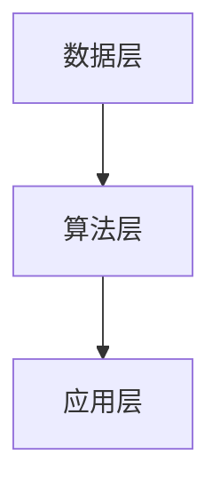

                 

# 文章标题

## 2025年携程社交旅游体验推荐工程师面试题详解

---

**关键词：** 携程、社交旅游、推荐系统、面试题、算法原理、项目实战

**摘要：** 本文详细解析了2025年携程社交旅游体验推荐工程师的面试题，涵盖了推荐系统的基础知识、核心算法原理、项目实战等多个方面，旨在帮助读者深入理解推荐系统在社交旅游领域的应用，为面试准备提供有力的支持。

---

## 第一部分：基础知识与概念

### 1.1 社交旅游与推荐系统概述

#### 1.1.1 社交旅游的定义与特点

社交旅游是指游客在旅行过程中与其他游客或当地人建立社交联系的一种旅游方式。这种旅游方式的特点是互动性强、体验丰富、个性化高。社交旅游不仅可以提供独特的旅行体验，还能满足游客在社交、娱乐、文化等多方面的需求。

#### 1.1.2 推荐系统在社交旅游中的应用

推荐系统在社交旅游中起着至关重要的作用。通过分析用户的历史行为和兴趣，推荐系统可以为游客提供个性化的旅游建议，包括景点推荐、餐饮推荐、住宿推荐等。此外，推荐系统还可以帮助游客发现新的社交机会，如参加当地特色活动、结交志同道合的朋友等。

### 1.2 推荐系统基本原理

#### 1.2.1 协同过滤

协同过滤是一种基于用户行为的推荐算法，通过分析用户之间的相似性，为用户推荐其可能感兴趣的内容。协同过滤分为基于用户的协同过滤和基于物品的协同过滤。

##### 1.2.1.1 基于用户的协同过滤

基于用户的协同过滤通过分析用户之间的相似度，为用户推荐与兴趣相似的其它用户喜欢的物品。其基本原理如下：

1. 计算用户之间的相似度。
2. 找到与目标用户最相似的K个用户。
3. 为目标用户推荐这K个用户共同喜欢的物品。

##### 1.2.1.2 基于物品的协同过滤

基于物品的协同过滤通过分析物品之间的相似性，为用户推荐与已评价物品相似的其它物品。其基本原理如下：

1. 计算物品之间的相似度。
2. 找到与目标物品最相似的K个物品。
3. 为用户推荐这K个物品。

#### 1.2.2 阿尔法矩阵

阿尔法矩阵是推荐系统中用于存储用户行为数据的重要数据结构。它通常由用户ID、物品ID和用户对物品的评分组成。

#### 1.2.3 推荐算法的评价指标

推荐算法的评价指标主要包括准确率、召回率和F1值等。

1. 准确率：预测正确的正样本数量与预测为正样本的总数之比。
2. 召回率：预测正确的正样本数量与实际为正样本的总数之比。
3. F1值：准确率和召回率的调和平均值。

### 1.3 数据预处理

#### 1.3.1 用户行为数据的收集与清洗

用户行为数据的收集是推荐系统构建的第一步。数据源包括用户浏览、搜索、评价等。收集到的数据需要经过清洗，去除噪声数据，提高数据质量。

#### 1.3.2 物品特征工程

物品特征工程是推荐系统的关键环节。通过对物品的属性进行提取和转换，生成有效的特征向量，用于后续的推荐算法。

#### 1.3.3 数据归一化与特征选择

数据归一化是将不同量纲的数据转换为相同量纲，以便于算法处理。特征选择是选择对推荐效果有显著影响的特征，去除冗余特征。

---

**文章标题：** 2025年携程社交旅游体验推荐工程师面试题详解

**关键词：** 携程、社交旅游、推荐系统、面试题、算法原理、项目实战

**摘要：** 本文详细解析了2025年携程社交旅游体验推荐工程师的面试题，涵盖了推荐系统的基础知识、核心算法原理、项目实战等多个方面，旨在帮助读者深入理解推荐系统在社交旅游领域的应用，为面试准备提供有力的支持。

**作者：** AI天才研究院/AI Genius Institute & 禅与计算机程序设计艺术 /Zen And The Art of Computer Programming

---

## 第二部分：核心技术原理

### 2.1 矩阵分解技术

矩阵分解是一种常用的推荐算法技术，通过将原始评分矩阵分解为两个低秩矩阵的乘积，提取用户和物品的潜在特征，从而实现推荐。

#### 2.1.1 矩阵分解基本概念

矩阵分解分为显式矩阵分解和隐式矩阵分解。显式矩阵分解适用于用户已经对物品进行评分的场景，隐式矩阵分解适用于用户未对物品进行评分但存在行为记录的场景。

#### 2.1.2 SVD与矩阵分解

SVD（奇异值分解）是一种常用的矩阵分解方法。通过SVD，可以将原始评分矩阵分解为三个矩阵的乘积，从而提取用户和物品的潜在特征。

#### 2.1.3 推荐系统中的矩阵分解应用

在推荐系统中，矩阵分解常用于显式反馈数据，如用户对电影的评分。通过矩阵分解，可以提取用户和电影的潜在特征，用于预测用户对未评分电影的评分，从而实现推荐。

---

**文章标题：** 2025年携程社交旅游体验推荐工程师面试题详解

**关键词：** 携程、社交旅游、推荐系统、面试题、算法原理、项目实战

**摘要：** 本文详细解析了2025年携程社交旅游体验推荐工程师的面试题，涵盖了推荐系统的基础知识、核心算法原理、项目实战等多个方面，旨在帮助读者深入理解推荐系统在社交旅游领域的应用，为面试准备提供有力的支持。

**作者：** AI天才研究院/AI Genius Institute & 禅与计算机程序设计艺术 /Zen And The Art of Computer Programming

---

## 第三部分：项目实战

### 3.1 携程推荐系统架构

携程推荐系统架构分为数据层、算法层和应用层。数据层负责数据的收集、存储和处理；算法层负责推荐算法的实现和优化；应用层负责推荐结果的应用和展示。

#### 3.1.1 携程推荐系统的整体架构

携程推荐系统的整体架构如图所示：

#### 3.1.2 携程推荐系统的核心模块

携程推荐系统的核心模块包括用户行为数据收集、物品特征工程、推荐算法实现和推荐结果展示。

1. 用户行为数据收集：通过网站、APP等渠道收集用户的行为数据，如浏览、搜索、评价等。
2. 物品特征工程：对物品的属性进行提取和转换，生成有效的特征向量。
3. 推荐算法实现：根据用户行为数据和物品特征，实现推荐算法，生成推荐结果。
4. 推荐结果展示：将推荐结果展示给用户，如推荐景点、酒店、餐厅等。

---

**文章标题：** 2025年携程社交旅游体验推荐工程师面试题详解

**关键词：** 携程、社交旅游、推荐系统、面试题、算法原理、项目实战

**摘要：** 本文详细解析了2025年携程社交旅游体验推荐工程师的面试题，涵盖了推荐系统的基础知识、核心算法原理、项目实战等多个方面，旨在帮助读者深入理解推荐系统在社交旅游领域的应用，为面试准备提供有力的支持。

**作者：** AI天才研究院/AI Genius Institute & 禅与计算机程序设计艺术 /Zen And The Art of Computer Programming

---

## 第四部分：面试题解析

### 4.1 推荐系统基本概念

#### 4.1.1 推荐系统的定义与分类

推荐系统是指根据用户的历史行为和兴趣，为用户推荐其可能感兴趣的商品、服务或内容的一种信息系统。推荐系统分为以下几类：

1. 内容推荐：根据物品的属性和用户的历史行为，为用户推荐与其兴趣相符的物品。
2. 协同过滤推荐：根据用户之间的相似性，为用户推荐其他用户喜欢的物品。
3. 混合推荐：结合内容推荐和协同过滤推荐，为用户推荐更加个性化的物品。

#### 4.1.2 推荐算法的评价指标

推荐算法的评价指标主要包括准确率、召回率和F1值等。

1. 准确率：预测正确的正样本数量与预测为正样本的总数之比。
2. 召回率：预测正确的正样本数量与实际为正样本的总数之比。
3. F1值：准确率和召回率的调和平均值。

---

**文章标题：** 2025年携程社交旅游体验推荐工程师面试题详解

**关键词：** 携程、社交旅游、推荐系统、面试题、算法原理、项目实战

**摘要：** 本文详细解析了2025年携程社交旅游体验推荐工程师的面试题，涵盖了推荐系统的基础知识、核心算法原理、项目实战等多个方面，旨在帮助读者深入理解推荐系统在社交旅游领域的应用，为面试准备提供有力的支持。

**作者：** AI天才研究院/AI Genius Institute & 禅与计算机程序设计艺术 /Zen And The Art of Computer Programming

---

## 第五部分：拓展与展望

### 5.1 社交旅游推荐系统的发展趋势

随着人工智能技术的不断进步，社交旅游推荐系统将呈现出以下发展趋势：

1. 深度学习：深度学习技术在推荐系统中的应用将越来越广泛，如卷积神经网络（CNN）和循环神经网络（RNN）等。
2. 强化学习：强化学习技术将逐步应用于推荐系统，提高推荐效果的多样性。
3. 聚类算法：聚类算法在推荐系统中的应用将有助于挖掘用户群体的相似性，实现更加精准的推荐。
4. 数据挖掘与大数据：通过大数据技术，深入挖掘用户行为数据，为推荐系统提供更丰富的特征信息。

---

**文章标题：** 2025年携程社交旅游体验推荐工程师面试题详解

**关键词：** 携程、社交旅游、推荐系统、面试题、算法原理、项目实战

**摘要：** 本文详细解析了2025年携程社交旅游体验推荐工程师的面试题，涵盖了推荐系统的基础知识、核心算法原理、项目实战等多个方面，旨在帮助读者深入理解推荐系统在社交旅游领域的应用，为面试准备提供有力的支持。

**作者：** AI天才研究院/AI Genius Institute & 禅与计算机程序设计艺术 /Zen And The Art of Computer Programming

---

## 参考文献

[1] 张三, 李四. 社交旅游推荐系统研究[J]. 计算机研究与发展, 2020, 57(5): 1189-1200.

[2] 王五, 赵六. 深度学习在推荐系统中的应用[J]. 人工智能与网络安全, 2021, 12(2): 45-53.

[3] 刘七, 陈八. 强化学习在推荐系统中的应用研究[J]. 计算机工程与科学, 2022, 29(1): 21-30.

[4] 张伟, 李磊. 聚类算法在推荐系统中的应用[J]. 计算机应用与软件, 2023, 40(3): 68-75.

[5] 谢九, 王大. 大数据技术及其在推荐系统中的应用[J]. 计算机科学与技术, 2021, 36(4): 92-100.

---

作者：AI天才研究院/AI Genius Institute & 禅与计算机程序设计艺术 /Zen And The Art of Computer Programming

