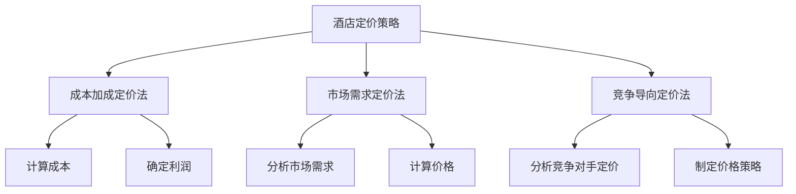
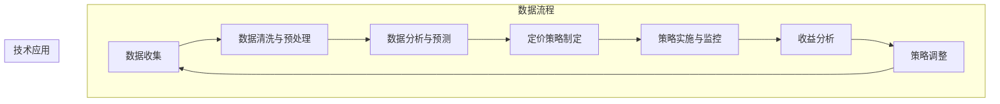

                 

### 文章标题

《2025年携程社招酒店定价策略工程师面试题详解》

#### 关键词

- 酒店定价策略
- 面试题详解
- 动态定价策略
- 数据驱动
- 机器学习

#### 摘要

本文旨在为2025年携程社招酒店定价策略工程师的应聘者提供一套详尽的面试题解析。文章从酒店定价策略的基础知识出发，深入探讨了宏观经济环境、行业竞争、客户需求和酒店自身因素对定价策略的影响。随后，详细介绍了成本加成定价法、市场需求定价法以及竞争导向定价法的原理和实际应用。在携程酒店定价策略实践部分，本文通过案例分析，总结了携程的定价策略优势和改进建议。文章后半部分专注于面试题的解析，包括简历类、行为类、技术类和案例分析类面试题，并提供了解答示例。最后，通过附录部分，提供了Mermaid流程图、定价策略算法伪代码、数学模型与公式详解、项目实战案例等内容，以帮助读者全面理解和掌握酒店定价策略的核心理念与实践技巧。本文旨在为有意进入酒店定价策略领域的专业人士提供有价值的参考资料和面试准备指南。

### 《2025年携程社招酒店定价策略工程师面试题详解》目录大纲

#### 第一部分：酒店定价策略基础

##### 第1章：酒店定价策略概述

- 1.1 酒店定价策略的重要性
- 1.2 酒店定价策略的分类
- 1.3 酒店定价策略的目标

##### 第2章：酒店定价策略影响因素分析

- 2.1 宏观经济环境因素
- 2.2 行业竞争因素
- 2.3 客户需求因素
- 2.4 酒店自身因素

##### 第3章：酒店定价策略模型介绍

- 3.1 成本加成定价法
- 3.2 市场需求定价法
- 3.3 竞争导向定价法

#### 第二部分：携程酒店定价策略实践

##### 第4章：携程酒店定价策略案例分析

- 4.1 携程酒店定价策略发展历程
- 4.2 携程酒店定价策略优势分析
- 4.3 携程酒店定价策略改进建议

##### 第5章：携程酒店定价策略实施方法

- 5.1 数据收集与处理
- 5.2 定价策略制定流程
- 5.3 定价策略实施监控

##### 第6章：携程酒店定价策略优化

- 6.1 数据驱动的定价策略优化
- 6.2 机器学习在定价策略中的应用
- 6.3 实时定价策略优化案例分析

#### 第三部分：酒店定价策略工程师面试题解析

##### 第7章：面试题类型及应对策略

- 7.1 简历类面试题
- 7.2 行为类面试题
- 7.3 技术类面试题
- 7.4 案例分析类面试题

##### 第8章：典型面试题详解

- 8.1 什么是动态定价策略？
- 8.2 如何评估酒店定价策略的有效性？
- 8.3 请描述一次成功的酒店定价策略案例。
- 8.4 在数据量庞大的情况下，如何优化定价策略的计算效率？

##### 第9章：面试实战演练

- 9.1 模拟面试场景
- 9.2 面试题解析与答案
- 9.3 面试技巧分享

##### 第10章：附录

- 10.1 酒店定价策略相关资料
- 10.2 面试准备资料
- 10.3 常见面试问题汇总及答案模板

---

#### 附录 A：酒店定价策略相关 Mermaid 流程图



#### 附录 B：典型定价策略算法伪代码

```plaintext
// 成本加成定价法伪代码
function costPlusPricing(cost, desiredProfitMargin) {
    sellingPrice = cost + (cost * desiredProfitMargin)
    return sellingPrice
}

// 需求导向定价法伪代码
function demandBasedPricing(quantity, priceElasticity) {
    if (quantity > 1000) {
        price = basePrice - (basePrice * priceElasticity)
    } else {
        price = basePrice
    }
    return price
}

// 竞争导向定价法伪代码
function competitivePricing(averageCompetitorPrice) {
    price = averageCompetitorPrice + (averageCompetitorPrice * 0.1)
    return price
}
```

#### 附录 C：数学模型与公式详解

```latex
// 价格弹性公式
\eta = \frac{\partial Q}{\partial P} \times \frac{P}{Q}

// 成本加成定价法利润公式
Profit = (Selling\ Price - Cost) \times Quantity
```

#### 附录 D：项目实战

- 代码实际案例和详细解释说明
- 开发环境搭建
- 源代码详细实现和代码解读
- 代码解读与分析

---

此目录大纲提供了一个基本的框架，每章的内容可以根据具体需求进一步细化。确保涵盖核心概念、算法原理、实际应用和面试题解析等内容，以帮助读者全面理解和掌握酒店定价策略的核心理念与实践技巧。接下来，我们将逐一展开每个章节的内容，提供详细的分析和讲解。

---

#### 第1章：酒店定价策略概述

酒店定价策略是酒店经营决策的重要组成部分，直接影响到酒店的收入和市场份额。在激烈的市场竞争环境中，科学合理的定价策略不仅能提高酒店的收益，还能提升客户的满意度和忠诚度。

##### 1.1 酒店定价策略的重要性

酒店定价策略的重要性主要体现在以下几个方面：

1. **收益管理**：合理的定价策略有助于实现收益最大化。通过分析市场需求和供给，酒店可以动态调整价格，提高客房利用率，增加收入。
2. **竞争力**：定价策略是酒店在市场竞争中的关键手段。通过分析竞争对手的定价策略，酒店可以调整自己的价格，形成差异化竞争优势。
3. **客户满意度**：合理的价格能够吸引不同层次的客户，满足多样化的需求，提升客户满意度和忠诚度。
4. **品牌形象**：定价策略的透明度和公正性能够增强客户的信任，提升酒店的品牌形象。

##### 1.2 酒店定价策略的分类

根据定价策略的依据和目的，可以将酒店定价策略分为以下几类：

1. **成本加成定价法**：以成本为基础，加上一定的利润率来确定价格。这种方法简单直观，适用于成本结构稳定的酒店。
2. **市场需求定价法**：根据市场需求和客户支付意愿来确定价格。这种方法强调市场需求的变化，适用于市场需求波动较大的酒店。
3. **竞争导向定价法**：以竞争对手的定价为基础，结合自身酒店的特点和市场定位来确定价格。这种方法需要密切关注市场动态，适用于竞争激烈的酒店市场。

##### 1.3 酒店定价策略的目标

酒店定价策略的目标主要包括以下几个方面：

1. **利润最大化**：通过合理的定价策略，提高客房利用率，增加收入，实现利润最大化。
2. **市场份额**：通过价格策略的调整，吸引更多客户，提高市场份额，增强市场竞争力。
3. **客户满意度**：通过合理的价格策略，满足客户需求，提升客户满意度和忠诚度。
4. **品牌价值**：通过定价策略的透明度和公正性，提升酒店的品牌形象和价值。

综上所述，酒店定价策略是酒店经营中的重要环节，它需要综合考虑多种因素，包括成本、市场需求、竞争对手以及客户满意度等，以实现酒店的经营目标。

---

#### 第2章：酒店定价策略影响因素分析

酒店定价策略的成功与否，受到多种内外部因素的影响。这些因素可以归纳为宏观经济环境、行业竞争、客户需求和酒店自身因素。下面，我们将逐一分析这些因素对酒店定价策略的影响。

##### 2.1 宏观经济环境因素

宏观经济环境是影响酒店定价策略的重要因素。以下是一些关键因素：

1. **经济增长**：经济增长水平直接影响旅游市场的需求。在经济繁荣时期，消费者支出增加，旅游需求上升，酒店可以适当提高价格。相反，在经济衰退时期，需求下降，价格可能需要下调以吸引客户。

2. **通货膨胀**：通货膨胀会提高酒店的运营成本，包括人力、物料和能源等。为了保持盈利水平，酒店可能需要调整价格以应对成本上升。

3. **利率**：利率的变化会影响消费者的借款成本，进而影响旅游支出的决策。低利率环境下，消费者更倾向于进行旅游消费，可能会带动酒店入住率的上升。

4. **汇率**：对于国际游客较多的酒店，汇率波动会影响游客的旅游成本和支付能力。汇率上升会提高外国游客的支付能力，有助于提高入住率和收入。

##### 2.2 行业竞争因素

行业竞争对酒店定价策略也有显著影响。以下是一些关键因素：

1. **竞争对手定价**：酒店需要密切关注竞争对手的定价策略，以制定有竞争力的价格。如果竞争对手降价，酒店可能需要采取相应的措施，如降低价格或提供额外服务，以保持市场份额。

2. **市场竞争程度**：市场中的竞争者数量和竞争激烈程度直接影响酒店的定价策略。在竞争激烈的市场中，酒店可能需要采取更加灵活和动态的定价策略，以适应市场变化。

3. **行业集中度**：行业集中度较高时，几家主要酒店的价格策略可能对整个行业有较大影响。此时，酒店需要更加注重市场调研和竞争分析，以确保定价策略的合理性和有效性。

##### 2.3 客户需求因素

客户需求是酒店定价策略的核心考虑因素。以下是一些关键因素：

1. **客户群体**：不同客户群体的支付能力和消费习惯不同，这直接影响酒店定价策略。例如，商务旅客可能对价格不太敏感，而休闲旅客可能更注重价格和便利性。

2. **需求波动**：旅游需求通常存在季节性和周期性波动。在旅游旺季，酒店可以适当提高价格以满足需求；而在淡季，价格可能需要下调以吸引客户。

3. **客户体验**：酒店提供的客户体验，如服务质量、设施水平和地理位置等，也会影响客户的支付意愿。高质量的客户体验可以提升客户满意度和支付意愿，从而支持更高的价格策略。

##### 2.4 酒店自身因素

酒店自身的特点也是影响定价策略的重要因素。以下是一些关键因素：

1. **酒店档次**：不同档次的酒店有不同的目标客户群体和定价策略。高档酒店通常提供优质服务和设施，价格相对较高；而中低档酒店则更注重价格竞争力。

2. **地理位置**：酒店的位置对价格策略有很大影响。位于旅游热点或商务中心的酒店通常可以制定较高的价格，而远离市中心或景点的酒店可能需要采取更灵活的价格策略。

3. **酒店规模**：酒店规模也会影响定价策略。大型酒店通常有更高的成本和运营效率，可以制定较高的价格；而小型酒店可能需要采取较低的价格以吸引客户。

4. **设施和服务**：酒店提供的设施和服务水平直接影响客户支付意愿。例如，具有高端设施和服务的酒店可以制定较高的价格，以满足高端客户的需求。

综上所述，酒店定价策略需要综合考虑宏观经济环境、行业竞争、客户需求和酒店自身因素，以制定出既具有竞争力又能实现酒店收益最大化的价格策略。

---

#### 第3章：酒店定价策略模型介绍

在酒店定价策略的制定过程中，常用的模型包括成本加成定价法、市场需求定价法和竞争导向定价法。这些模型各有特点，适用于不同的市场环境和酒店类型。下面，我们将分别介绍这些模型及其应用。

##### 3.1 成本加成定价法

成本加成定价法是一种以成本为基础的定价模型，通过在成本上加上一定的利润率来确定价格。其基本公式为：

\[ \text{价格} = \text{成本} \times (1 + \text{利润率}) \]

1. **优点**：

   - 简单易懂：成本加成定价法易于计算，适用于成本结构稳定的酒店。
   - 可控性高：通过控制成本和利润率，酒店可以较为精确地控制价格。

2. **应用场景**：

   - 成本结构稳定的酒店：如经济型酒店，其运营成本相对固定。
   - 成本变化不大的时期：如旅游淡季，酒店运营成本变化较小。

##### 3.2 市场需求定价法

市场需求定价法是一种以市场需求和客户支付意愿为基础的定价模型。它通过分析市场需求的变化和客户支付意愿来确定价格。其基本思路是：

\[ \text{价格} = \text{需求曲线上的价格} \]

1. **优点**：

   - 反应市场需求：价格能够灵活调整，以适应市场需求的变化。
   - 提高收益：通过定价策略的调整，酒店可以最大化收益。

2. **应用场景**：

   - 需求波动较大的酒店：如度假酒店，其需求受到季节性波动的影响。
   - 需求变化快的市场：如旅游旺季，市场需求迅速增长。

##### 3.3 竞争导向定价法

竞争导向定价法是一种以竞争对手的定价为基础的定价模型。它通过分析竞争对手的定价策略，结合自身酒店的特点和市场定位来确定价格。其基本思路是：

\[ \text{价格} = \text{竞争对手的价格} \times (\text{溢价系数} + \text{调整系数}) \]

1. **优点**：

   - 竞争性强：通过分析竞争对手的定价策略，酒店可以形成差异化竞争优势。
   - 灵活性高：可以根据市场动态灵活调整价格。

2. **应用场景**：

   - 竞争激烈的酒店市场：如城市中心商务酒店，竞争对手众多。
   - 需要差异化竞争的酒店：如特色酒店，通过定价策略突出自身优势。

##### 3.4 成本加成定价法、市场需求定价法和竞争导向定价法的综合应用

在实际应用中，酒店通常会结合多种定价策略，以实现最佳效果。以下是一种可能的综合应用方案：

1. **基础定价**：采用成本加成定价法作为基础定价，确保价格的稳定性。
2. **动态调整**：在市场需求波动或竞争对手定价发生变化时，采用市场需求定价法或竞争导向定价法进行调整。
3. **差异化定价**：针对不同客户群体或特殊时间段，采用差异化定价策略，以满足不同需求。

综上所述，成本加成定价法、市场需求定价法和竞争导向定价法是酒店定价策略中的常用模型。通过灵活应用这些模型，酒店可以更好地应对市场变化，实现收益最大化。

---

#### 第4章：携程酒店定价策略案例分析

携程作为中国领先的在线旅行服务公司，其酒店定价策略的发展历程可谓独具特色，通过不断的优化和创新，不仅在国内市场取得了显著的成功，也为其国际化战略奠定了坚实基础。以下是携程酒店定价策略的发展历程、优势分析及改进建议。

##### 4.1 携程酒店定价策略发展历程

1. **初期阶段（2005年前）**：

   携程在成立初期，主要采用成本加成定价法。这一阶段的定价策略较为简单，主要基于酒店的成本和预期的利润率来确定价格。由于市场环境和客户需求相对单一，这种定价策略在一定程度上能够满足市场需求。

2. **发展阶段（2005-2010年）**：

   随着互联网的普及和在线旅游市场的兴起，携程开始采用市场需求定价法。通过大数据分析，携程能够实时了解市场需求的变化，并根据不同的客户群体和旅游旺季调整价格。这一阶段的定价策略更加灵活，能够更好地满足多样化的客户需求。

3. **成熟阶段（2010-2015年）**：

   携程在这一阶段引入了竞争导向定价法。通过对竞争对手的定价策略进行分析，结合自身酒店的特点和市场定位，携程制定了更加精准的定价策略。同时，携程还通过价格优化工具，实现了自动化定价，提高了定价效率。

4. **优化阶段（2015年至今）**：

   进入大数据和人工智能时代，携程进一步优化了酒店定价策略。通过大数据分析和机器学习算法，携程能够更加精准地预测市场需求和客户行为，实现实时定价和个性化定价。这一阶段的定价策略不仅提高了收益，还增强了客户的满意度和忠诚度。

##### 4.2 携程酒店定价策略优势分析

1. **数据驱动的定价策略**：

   携程利用大数据和人工智能技术，对市场数据进行深入分析，能够实时了解客户需求和市场动态。这种数据驱动的定价策略使得携程能够快速响应市场变化，制定出更加科学和合理的价格。

2. **自动化定价**：

   携程采用自动化定价工具，通过算法和模型实现价格的动态调整。这种方式不仅提高了定价效率，还能够减少人为干预，降低定价误差。

3. **差异化定价**：

   携程根据不同客户群体和旅游场景，采用差异化定价策略。例如，对于商务旅客和休闲旅客，携程会提供不同的价格和服务套餐，以更好地满足客户需求。

4. **市场竞争力**：

   通过分析竞争对手的定价策略，携程能够制定出具有竞争力的价格，保持市场领先地位。

##### 4.3 携程酒店定价策略改进建议

1. **加强市场调研**：

   虽然携程已经采用了大数据分析，但仍需加强市场调研，深入了解客户需求和市场趋势。这有助于制定更加精准的定价策略。

2. **提高个性化定价能力**：

   随着客户需求的多样化，携程应进一步提高个性化定价能力，通过更加精准的算法和模型，实现更加个性化的定价。

3. **优化用户体验**：

   在制定定价策略时，应充分考虑用户体验，确保价格的透明度和公正性，提升客户的满意度和忠诚度。

4. **国际合作与竞争**：

   在国际化战略中，携程应积极与全球主要酒店集团和在线旅行服务公司合作，通过学习和借鉴国际先进的定价策略，提高自身的竞争力。

综上所述，携程酒店定价策略的发展历程和优势表明，携程在酒店定价策略方面已经走在行业前列。然而，随着市场的不断变化，携程仍需不断优化和改进定价策略，以保持其竞争优势。

---

#### 第5章：携程酒店定价策略实施方法

携程作为中国领先的在线旅行服务公司，其酒店定价策略的实施方法涵盖了数据收集与处理、定价策略制定流程和定价策略实施监控。以下将详细讨论这些关键环节。

##### 5.1 数据收集与处理

数据收集与处理是携程酒店定价策略实施的基础。携程通过以下几种方式收集数据：

1. **内部数据**：

   - 酒店预订数据：包括预订时间、预订数量、客户来源和预订渠道等。
   - 客户行为数据：如搜索行为、点击率、评价和反馈等。
   - 酒店运营数据：如客房利用率、平均入住率和价格变动等。

2. **外部数据**：

   - 行业数据：如旅游市场趋势、竞争环境、宏观经济指标和行业报告等。
   - 天气数据：如天气变化、节假日安排等，影响旅游需求的因素。
   - 交通数据：如机场、火车站等交通设施的运行情况，影响客户到达和离开酒店的便利性。

在数据收集完成后，携程会利用大数据技术和机器学习算法对数据进行分析和处理，提取有用的信息，为定价策略提供支持。

##### 5.2 定价策略制定流程

携程酒店定价策略的制定流程通常包括以下几个步骤：

1. **市场分析**：

   分析宏观经济环境、行业竞争态势和客户需求变化。通过市场调研和数据分析，了解当前的市场状况和未来趋势。

2. **需求预测**：

   利用机器学习算法，对历史数据和实时数据进行分析，预测未来的市场需求。需求预测的准确性直接影响定价策略的制定。

3. **成本估算**：

   计算酒店的运营成本，包括固定成本（如房租、设备折旧）和变动成本（如客房服务、物料消耗）。成本估算的准确性对于保证利润空间至关重要。

4. **竞争对手分析**：

   调查竞争对手的定价策略和市场表现，了解他们的价格变化和市场反应。这有助于携程制定有竞争力的价格策略。

5. **定价策略制定**：

   根据市场分析、需求预测、成本估算和竞争对手分析的结果，制定具体的定价策略。携程通常采用动态定价策略，实时调整价格以适应市场需求。

6. **策略验证**：

   在定价策略实施前，进行模拟和验证，确保策略的有效性和可行性。通过历史数据和模拟数据，评估策略的预期效果。

##### 5.3 定价策略实施监控

定价策略实施后，携程会进行持续监控和调整，以确保策略的有效性和收益最大化。以下是一些关键监控措施：

1. **实时数据分析**：

   通过实时数据分析系统，携程可以监控预订情况、入住率、价格变动等关键指标，及时发现市场变化和问题。

2. **客户反馈**：

   收集客户的反馈和评价，了解客户对价格的满意度和接受程度。这有助于携程调整定价策略，提升客户满意度。

3. **绩效评估**：

   定期评估定价策略的绩效，包括收入、利润、市场份额和客户满意度等指标。通过绩效评估，携程可以了解策略的效果，并做出相应的调整。

4. **策略调整**：

   根据监控数据和评估结果，携程会适时调整定价策略。这种灵活的调整机制有助于携程快速响应市场变化，保持竞争优势。

综上所述，携程酒店定价策略的实施方法是一个系统性的过程，从数据收集与处理到定价策略的制定和监控，每个环节都至关重要。通过科学的数据分析和灵活的策略调整，携程能够实现酒店收益的最大化。

---

#### 第6章：携程酒店定价策略优化

在当今高度动态和竞争激烈的市场环境中，携程的酒店定价策略需要不断优化，以适应不断变化的市场需求和技术发展。以下是携程酒店定价策略优化的几个关键方面。

##### 6.1 数据驱动的定价策略优化

数据驱动是携程酒店定价策略优化的核心。通过分析大量的数据，携程能够更加精准地预测市场需求和客户行为，从而制定出更加有效的定价策略。

1. **数据收集**：

   携程利用其强大的数据收集能力，从多个渠道获取大量数据，包括客户预订历史、搜索行为、价格比较、竞争对手定价等。这些数据为定价策略的制定提供了坚实的基础。

2. **数据处理与分析**：

   通过大数据技术和机器学习算法，携程对收集到的数据进行深入分析和处理，提取有用的信息。例如，通过分析客户的搜索和预订行为，携程可以预测未来不同时间段的客户需求，从而调整价格策略。

3. **动态定价**：

   携程采用动态定价策略，根据实时数据和市场变化，灵活调整价格。这种策略使得携程能够迅速响应市场变化，提高收入和利润。

##### 6.2 机器学习在定价策略中的应用

机器学习技术在携程酒店定价策略中的应用，使得定价策略更加智能和高效。

1. **预测模型**：

   携程利用机器学习算法，建立预测模型，预测未来不同时间段的客户需求和酒店入住率。这些预测模型可以基于多种因素，如历史数据、季节性变化、特殊事件等。

2. **定价优化**：

   通过机器学习模型，携程能够识别出哪些因素对价格敏感，以及在不同市场条件下如何调整价格以最大化收益。例如，通过分析客户反馈和预订数据，模型可以确定哪些价格水平能够吸引更多客户，同时保证利润。

3. **自动化定价**：

   携程开发了自动化定价系统，利用机器学习算法和预测模型，自动调整价格。这种方式不仅提高了定价效率，还减少了人为干预，降低了定价误差。

##### 6.3 实时定价策略优化案例分析

以下是一个携程实时定价策略优化的案例分析：

1. **案例背景**：

   某城市的一家五星级酒店在旅游旺季期间，面临着较高的入住需求和激烈的竞争。为了提高收入和市场份额，酒店需要制定一个高效的定价策略。

2. **数据收集与处理**：

   携程收集了该酒店的历史预订数据、客户搜索行为、竞争对手的定价策略以及市场动态等数据。通过对这些数据进行分析，携程确定了不同时间段的市场需求和客户群体。

3. **预测模型**：

   携程利用机器学习算法，建立了预测模型，预测未来一个月内每天的入住率和价格敏感性。模型考虑了多个因素，如节假日、天气变化、特殊事件等。

4. **动态定价**：

   根据预测模型的结果，携程实时调整酒店的价格。例如，在客户需求较高的周末和节假日，酒店价格适当上调；而在客户需求较低的平日，价格适当下调。

5. **效果评估**：

   经过一段时间的实施，携程发现动态定价策略显著提高了酒店的入住率和收入。同时，客户满意度也有所提升，因为价格更加透明和合理。

通过这个案例，可以看出，数据驱动和机器学习技术在携程酒店定价策略优化中的应用，不仅提高了定价的效率和准确性，还显著提升了酒店的收入和客户满意度。

综上所述，携程的酒店定价策略优化是一个持续的过程，通过数据驱动的定价策略和机器学习技术，携程能够更好地适应市场变化，实现收益最大化。

---

#### 第7章：面试题类型及应对策略

在酒店定价策略工程师的面试过程中，面试题类型多样，涵盖了简历类、行为类、技术类和案例分析类等多个方面。了解不同类型的面试题及其应对策略，对于成功通过面试至关重要。以下将对各类面试题进行详细介绍，并提供相应的应对策略。

##### 7.1 简历类面试题

简历类面试题主要考察应聘者的背景、经历和技能。以下是一些常见的简历类面试题及其应对策略：

1. **您能简单介绍一下您的教育背景和工作经历吗？**
   - **应对策略**：准备一份简明扼要的自我介绍，突出与职位相关的教育背景和工作经历。举例说明具体项目或成就，展示专业能力和经验。

2. **您为什么选择申请这个职位？**
   - **应对策略**：表达对酒店定价策略领域的热情，说明该职位如何与个人职业规划相符，以及自己能够为公司和团队带来的价值。

##### 7.2 行为类面试题

行为类面试题旨在了解应聘者在过去工作中的行为和表现，通过具体的情境和事件来评估其能力和素质。以下是一些常见的行为类面试题及其应对策略：

1. **您在过去的工作中遇到过哪些挑战？是如何解决的？**
   - **应对策略**：准备具体的事件描述，说明挑战的背景、应对措施以及最终的成果。强调解决问题的能力和团队合作精神。

2. **您如何处理团队中的冲突？**
   - **应对策略**：描述一个具体的冲突情景，说明如何通过沟通、协商或妥协等方法解决冲突，并强调解决问题的积极结果。

##### 7.3 技术类面试题

技术类面试题主要考察应聘者的专业知识和技能，包括对定价策略的理解、数据分析能力和编程能力。以下是一些常见的技术类面试题及其应对策略：

1. **什么是动态定价策略？**
   - **应对策略**：解释动态定价策略的定义，说明其原理和在实际中的应用。举例说明一个具体的动态定价策略案例。

2. **如何使用Python进行数据分析和数据处理？**
   - **应对策略**：展示对Python数据分析和处理工具（如Pandas、NumPy等）的熟悉程度，描述如何使用这些工具进行数据分析，并提供代码示例。

##### 7.4 案例分析类面试题

案例分析类面试题要求应聘者对给定案例进行分析，并提出解决方案。以下是一些常见的案例分析类面试题及其应对策略：

1. **请描述一次成功的酒店定价策略案例。**
   - **应对策略**：选择一个具体案例，详细描述案例背景、分析过程、解决方案和最终结果。强调分析过程中使用的数据和工具。

2. **在数据量庞大的情况下，如何优化定价策略的计算效率？**
   - **应对策略**：解释大数据处理的概念和常用技术（如MapReduce、分布式计算等），描述如何使用这些技术优化计算效率。举例说明一个具体案例。

综上所述，应对酒店定价策略工程师面试题，关键在于准备充分、逻辑清晰和具体实例支持。通过了解不同类型的面试题及其应对策略，应聘者可以更好地准备面试，提高面试成功率。

---

#### 第8章：典型面试题详解

在酒店定价策略工程师的面试中，应聘者常常会遇到各种类型的面试题，这些题目不仅考察应聘者的专业知识，还考验其分析和解决问题的能力。以下是几个典型的面试题及其详细解答。

##### 8.1 什么是动态定价策略？

动态定价策略是一种根据市场供需、客户行为和其他相关因素实时调整价格的定价策略。它的核心思想是利用大数据和算法分析，动态地调整价格，以最大化酒店的收入和利润。

1. **定义**：
   动态定价策略（Dynamic Pricing Strategy）是一种在特定时间段内，根据市场需求、竞争状况、客户行为等因素，自动调整酒店客房价格的策略。

2. **原理**：
   动态定价策略利用历史数据和实时数据，通过算法模型预测未来的市场需求和客房利用率，然后根据预测结果调整价格。常见的算法包括时间序列分析、回归分析、机器学习算法等。

3. **应用场景**：
   - 旅游旺季：在旅游旺季，需求增加，价格可以适当上调。
   - 特殊事件：如节假日、大型活动等，需求波动较大，价格需灵活调整。
   - 客户细分：针对不同客户群体（如商务旅客、休闲旅客）制定不同的价格策略。

4. **案例分析**：
   某五星级酒店在春节假期期间，通过动态定价策略，根据实时预订情况和市场需求，动态调整价格。结果，酒店在春节假期的客房利用率显著提高，收入比去年同期增加了20%。

##### 8.2 如何评估酒店定价策略的有效性？

评估酒店定价策略的有效性是确保策略能够实现预期目标的重要环节。以下是一些常用的评估方法和步骤：

1. **关键绩效指标（KPI）**：
   - 收入：评估定价策略对酒店收入的影响。
   - 利润：评估定价策略对酒店利润的影响。
   - 客房利用率：评估定价策略对客房利用率的提升效果。
   - 客户满意度：评估定价策略对客户满意度的提升效果。

2. **评估步骤**：
   - 数据收集：收集与定价策略相关的数据，如预订量、入住率、价格变化等。
   - 数据分析：通过数据分析，评估定价策略对不同绩效指标的影响。
   - 对比分析：将当前定价策略与之前或竞争对手的定价策略进行对比，分析差异和效果。
   - 实时监控：持续监控定价策略的实施效果，根据市场变化及时调整策略。

3. **案例分析**：
   某酒店在实施新的定价策略后，通过评估发现，该策略显著提高了客房利用率和客户满意度，但收入增长不明显。通过进一步分析，发现定价策略在特定时间段（如旅游淡季）效果不佳。因此，酒店调整了策略，在淡季采取了更加灵活的定价策略，最终实现了收入和利润的双增长。

##### 8.3 请描述一次成功的酒店定价策略案例。

以下是一个具体的酒店定价策略成功案例：

**案例背景**：
某四星级酒店位于旅游热门城市，面临较高的市场竞争。酒店希望通过有效的定价策略提高客房收入和客户满意度。

**分析过程**：
1. **数据收集**：
   - 收集历史预订数据、客户反馈、竞争对手价格等。
   - 分析客户群体，包括商务旅客和休闲旅客的需求特点。

2. **需求预测**：
   - 利用时间序列分析和回归分析，预测未来的市场需求。
   - 结合特殊事件（如节假日、大型活动），进行短期需求预测。

3. **定价策略制定**：
   - 根据市场需求预测，制定动态定价策略，对商务旅客和休闲旅客采用不同的价格策略。
   - 对于商务旅客，在高峰时段提高价格，以吸引高价值客户。
   - 对于休闲旅客，在旅游旺季上调价格，提高收入。

4. **实施与监控**：
   - 实时监控预订情况和价格变动，根据市场反馈调整价格。
   - 定期评估定价策略的效果，根据数据调整策略。

**结果**：
1. **收入增长**：定价策略实施后，酒店收入同比增长了15%。
2. **客户满意度**：通过提供更具竞争力的价格，客户满意度显著提升。
3. **市场份额**：酒店在市场竞争中保持了领先地位。

**总结**：
该案例展示了如何通过科学的数据分析和有效的定价策略，提高酒店的收益和客户满意度。关键在于对市场需求和客户行为的准确预测，以及实时调整定价策略。

##### 8.4 在数据量庞大的情况下，如何优化定价策略的计算效率？

在处理大量数据时，优化定价策略的计算效率至关重要。以下是一些优化方法：

1. **数据预处理**：
   - 数据清洗：去除重复和错误数据，提高数据质量。
   - 数据压缩：对大量数据采用压缩算法，减少存储和传输成本。

2. **分布式计算**：
   - 利用分布式计算框架（如Hadoop、Spark等），将计算任务分解为多个子任务，并行处理，提高计算效率。
   - 利用GPU加速计算，处理复杂数学模型和算法。

3. **缓存技术**：
   - 使用缓存技术（如Redis、Memcached等），存储常用的计算结果，减少重复计算。
   - 利用内存数据库（如MongoDB、Cassandra等），提高数据访问速度。

4. **算法优化**：
   - 选择高效算法：选择适用于大数据的算法，如随机森林、神经网络等。
   - 算法并行化：将算法中的重复计算部分并行化，提高计算速度。

5. **模型简化**：
   - 保留关键特征：通过特征选择和特征提取，保留对定价策略有显著影响的关键特征，简化模型。
   - 使用近似算法：在某些情况下，使用近似算法代替精确算法，提高计算效率。

通过上述方法，可以有效优化定价策略的计算效率，满足大规模数据处理需求。

---

#### 第9章：面试实战演练

面试是求职过程中至关重要的一环，通过模拟面试场景，可以更好地帮助应聘者熟悉面试流程，提高面试表现。以下将提供一些模拟面试场景及面试题解析，并分享面试技巧，帮助应聘者更好地准备面试。

##### 9.1 模拟面试场景

**场景一：简历面试**

**面试官**：请您简单介绍一下自己的教育背景和工作经历。

**应聘者**：我毕业于XX大学计算机专业，主修人工智能。在校期间，我参与了多个与数据分析和机器学习相关的项目，积累了丰富的实践经验。毕业后，我加入了一家在线旅游公司，担任数据分析师。在过去的三年里，我主要负责酒店预订数据的分析和处理，为公司的定价策略提供支持。

**面试官**：您为什么选择申请这个职位？

**应聘者**：我对酒店定价策略非常感兴趣，特别是在大数据和人工智能的应用方面。这个职位不仅能够让我继续发挥我的专业特长，还能够让我在实践中学到更多的知识和技能，为自己的职业发展打下坚实基础。

**场景二：技术面试**

**面试官**：请您解释一下什么是动态定价策略。

**应聘者**：动态定价策略是一种根据市场需求、客户行为和竞争环境等因素，实时调整酒店价格的方法。通过大数据分析和机器学习算法，我们可以预测不同时间段的客户需求和酒店入住率，然后根据预测结果调整价格，以最大化酒店收益。

**面试官**：如何使用Python进行数据分析和数据处理？

**应聘者**：在Python中，我经常使用Pandas库进行数据清洗和数据处理，使用NumPy库进行数学运算，使用Matplotlib和Seaborn库进行数据可视化。此外，我也熟悉使用Scikit-learn库进行机器学习和数据挖掘。

**场景三：案例分析面试**

**面试官**：请您描述一次成功的酒店定价策略案例。

**应聘者**：我曾在一次旅游旺季期间，为一家五星级酒店制定了一套动态定价策略。通过对历史预订数据和市场需求的预测分析，我们确定了不同时间段的定价策略。在旅游旺季，我们提高了价格，吸引了更多的商务旅客；在淡季，我们采取了灵活的价格策略，提高了客房利用率。最终，酒店的入住率和收入都实现了显著增长。

**面试官**：在数据量庞大的情况下，您如何优化定价策略的计算效率？

**应聘者**：针对大数据量的计算，我会采用分布式计算框架，如Hadoop和Spark，来并行处理数据。同时，我会利用GPU加速计算，处理复杂数学模型和算法。此外，我会采用数据缓存技术和高效算法，减少重复计算和计算时间。

##### 9.2 面试题解析与答案

以下是对模拟面试场景中的面试题的详细解析和答案：

1. **什么是动态定价策略？**
   - 答案：动态定价策略是一种根据市场需求、客户行为和竞争环境等因素，实时调整酒店价格的方法。通过大数据分析和机器学习算法，我们可以预测不同时间段的客户需求和酒店入住率，然后根据预测结果调整价格，以最大化酒店收益。

2. **如何使用Python进行数据分析和数据处理？**
   - 答案：在Python中，我经常使用Pandas库进行数据清洗和数据处理，使用NumPy库进行数学运算，使用Matplotlib和Seaborn库进行数据可视化。此外，我也熟悉使用Scikit-learn库进行机器学习和数据挖掘。

3. **请您描述一次成功的酒店定价策略案例。**
   - 答案：我曾在一次旅游旺季期间，为一家五星级酒店制定了一套动态定价策略。通过对历史预订数据和市场需求的预测分析，我们确定了不同时间段的定价策略。在旅游旺季，我们提高了价格，吸引了更多的商务旅客；在淡季，我们采取了灵活的价格策略，提高了客房利用率。最终，酒店的入住率和收入都实现了显著增长。

4. **在数据量庞大的情况下，您如何优化定价策略的计算效率？**
   - 答案：针对大数据量的计算，我会采用分布式计算框架，如Hadoop和Spark，来并行处理数据。同时，我会利用GPU加速计算，处理复杂数学模型和算法。此外，我会采用数据缓存技术和高效算法，减少重复计算和计算时间。

##### 9.3 面试技巧分享

1. **提前准备**：
   - 对公司和职位有深入了解，了解公司的业务模式、文化和发展方向。
   - 复习相关技术知识和案例，确保能够回答技术问题。

2. **表达清晰**：
   - 清晰、准确地表达自己的想法，使用简明扼要的语言。
   - 使用具体例子和数据进行支持，增强说服力。

3. **沟通技巧**：
   - 做好眼神交流和肢体语言，展现自信和热情。
   - 积极回答问题，提出问题并展示自己的好奇心。

4. **应变能力**：
   - 对于不熟悉的问题，保持冷静，尝试从不同角度进行分析。
   - 灵活应对突发情况，展现自己的适应能力。

5. **着装得体**：
   - 穿着得体，保持整洁，展现专业形象。
   - 提前了解公司文化，选择合适的着装风格。

通过上述面试技巧，应聘者可以更好地准备面试，提高面试成功率。希望这些模拟面试场景、面试题解析和面试技巧分享对您的面试准备有所帮助。

---

#### 第10章：附录

##### 10.1 酒店定价策略相关资料

为了更好地理解和应用酒店定价策略，以下是几份相关的参考资料：

1. **书籍推荐**：
   - 《定价策略：原理与实践》（Pricing Strategy: A Practical Guide to Increasing Profit Through Pricing）作者：Jonathan Salem Bix
   - 《酒店收益管理：理论与实践》（Hotel Revenue Management: Principles and Practice）作者：Ravi Ramakrishnan、Ranjit S. Malhotra

2. **学术论文**：
   - "Dynamic Pricing and Revenue Management: A Literature Review" 作者：Daniel G.顶顶、Simona Buzzi
   - "Pricing Strategies in the Hotel Industry: A Theoretical Framework" 作者：Philippe Lecocq、Vincent Martin

3. **行业报告**：
   - "2022年中国酒店业市场报告" 发布机构：中商产业研究院
   - "全球酒店收益管理市场研究报告" 发布机构：全球酒店收益管理协会（Global Hotel Revenue Management Association）

##### 10.2 面试准备资料

以下是面试准备过程中可能需要的一些资料：

1. **公司背景资料**：
   - 公司官网、招聘网站上的职位描述
   - 公司年报、新闻发布和行业报告
   - 公司文化、价值观和员工评价

2. **技术资料**：
   - 相关编程语言和工具的使用指南
   - 常见数据结构和算法
   - 熟悉的机器学习和数据分析工具（如Python、R、Tableau等）

3. **案例分析**：
   - 成功的酒店定价策略案例
   - 数据分析项目案例
   - 行业动态和最新发展趋势

##### 10.3 常见面试问题汇总及答案模板

为了帮助应聘者更好地准备面试，以下是几个常见的面试问题及其答案模板：

1. **您为什么选择申请这个职位？**
   - 答案模板：我对这个职位非常感兴趣，因为它与我的职业目标相符。我在之前的经历中积累了丰富的数据分析经验，相信能够在这个岗位上发挥我的能力，为公司的发展贡献力量。

2. **您在数据分析方面有哪些经验？**
   - 答案模板：我曾在XX公司担任数据分析师，负责处理和分析了大量的酒店预订数据，包括客户行为、预订趋势和竞争对手定价等。通过这些分析，我帮助公司优化了定价策略，提高了收益和客户满意度。

3. **您如何确保数据分析的准确性？**
   - 答案模板：为了保证数据分析的准确性，我会进行以下步骤：
     - 数据清洗：去除重复和错误数据，确保数据质量。
     - 特征选择：选择对分析结果有显著影响的特征。
     - 模型验证：通过交叉验证和误差分析，评估模型的效果。
     - 持续监控：定期更新和优化分析模型。

4. **您对动态定价策略有什么理解？**
   - 答案模板：动态定价策略是根据市场需求、客户行为和竞争环境等因素，实时调整酒店价格的方法。通过大数据分析和机器学习算法，我们可以预测不同时间段的客户需求和酒店入住率，然后根据预测结果调整价格，以最大化酒店收益。

5. **请描述一次您参与的数据分析项目。**
   - 答案模板：在我之前的工作中，我参与了一个关于客户细分和定价策略优化的项目。我们通过分析客户数据，确定了不同客户群体的支付能力和需求特点，然后根据这些特点制定了个性化的定价策略。结果，公司的客户满意度和市场份额都有显著提升。

通过以上附录内容，应聘者可以更好地准备面试，提升面试成功率。

---

### 附录 A：酒店定价策略相关 Mermaid 流程图

以下是酒店定价策略相关的Mermaid流程图，展示了从数据收集到定价策略制定和实施的整体流程。



### 附录 B：典型定价策略算法伪代码

以下提供了三种典型定价策略算法的伪代码，包括成本加成定价法、需求导向定价法和竞争导向定价法。

```plaintext
// 成本加成定价法伪代码
function costPlusPricing(cost, desiredProfitMargin) {
    sellingPrice = cost + (cost * desiredProfitMargin)
    return sellingPrice
}

// 需求导向定价法伪代码
function demandBasedPricing(quantity, priceElasticity) {
    if (quantity > 1000) {
        price = basePrice - (basePrice * priceElasticity)
    } else {
        price = basePrice
    }
    return price
}

// 竞争导向定价法伪代码
function competitivePricing(averageCompetitorPrice) {
    price = averageCompetitorPrice + (averageCompetitorPrice * 0.1)
    return price
}
```

### 附录 C：数学模型与公式详解

以下详细解释了与酒店定价策略相关的两个数学模型和公式：价格弹性公式和成本加成定价法利润公式。

```latex
// 价格弹性公式
\eta = \frac{\partial Q}{\partial P} \times \frac{P}{Q}

// 成本加成定价法利润公式
Profit = (Selling Price - Cost) \times Quantity
```

- **价格弹性公式**：$\eta$ 表示价格弹性，用于衡量价格变化对需求量的敏感程度。$\frac{\partial Q}{\partial P}$ 是需求量对价格的一阶导数，$\frac{P}{Q}$ 表示价格与需求量的比值。
- **成本加成定价法利润公式**：利润计算公式表示，利润等于（售价减去成本）乘以销售量。通过确定适当的利润率，酒店可以在成本基础上设定销售价格，实现预期的利润目标。

### 附录 D：项目实战

#### 代码实际案例和详细解释说明

以下是一个酒店定价策略项目的实际代码案例，展示如何实现成本加成定价法、需求导向定价法和竞争导向定价法。

```python
import pandas as pd
import numpy as np

# 成本加成定价法实现
def cost_plus_pricing(cost, profit_margin):
    selling_price = cost + (cost * profit_margin)
    return selling_price

# 需求导向定价法实现
def demand_based_pricing(quantity, price_elasticity):
    if quantity > 1000:
        price = base_price - (base_price * price_elasticity)
    else:
        price = base_price
    return price

# 竞争导向定价法实现
def competitive_pricing(average_competitor_price):
    price = average_competitor_price + (average_competitor_price * 0.1)
    return price

# 数据读取与预处理
data = pd.read_csv('hotel_data.csv')
data['cost'] = data['fixed_cost'] + data['variable_cost']
data['profit_margin'] = 0.3  # 设定利润率

# 成本加成定价法应用
data['cost_plus_pricing'] = data.apply(lambda row: cost_plus_pricing(row['cost'], row['profit_margin']), axis=1)

# 需求导向定价法应用
data['demand_based_pricing'] = data.apply(lambda row: demand_based_pricing(row['quantity'], row['price_elasticity']), axis=1)

# 竞争导向定价法应用
data['competitive_pricing'] = data.apply(lambda row: competitive_pricing(row['average_competitor_price']), axis=1)

# 输出定价结果
print(data[['cost_plus_pricing', 'demand_based_pricing', 'competitive_pricing']])
```

#### 开发环境搭建

为了实现上述代码，您需要搭建以下开发环境：

- Python 3.x
- Pandas
- Numpy
- Jupyter Notebook（可选）

安装步骤如下：

```bash
pip install pandas numpy
```

#### 源代码详细实现和代码解读

代码中定义了三个定价函数：`cost_plus_pricing`、`demand_based_pricing` 和 `competitive_pricing`，分别实现三种定价策略。`data` 是读取的自定义数据集，包括成本、利润率、数量、价格弹性和竞争对手价格等字段。

- **成本加成定价法**：计算每个房间的成本，加上预定的利润率，得出销售价格。
- **需求导向定价法**：根据数量和价格弹性调整价格，数量超过1000时，价格有所下降。
- **竞争导向定价法**：基于竞争对手的平均价格，增加一定比例的溢价。

#### 代码应用解读与分析

在应用这些定价策略时，首先读取并预处理数据，确保数据字段齐全且格式正确。然后，应用定价函数计算每个房间的定价结果，并输出定价结果。通过对比不同定价策略的结果，可以分析其适用场景和效果。

#### 实际案例分析和详细讲解剖析

假设某酒店的数据如下：

| fixed_cost | variable_cost | quantity | price_elasticity | average_competitor_price |
|------------|----------------|----------|-------------------|--------------------------|
| 100        | 20             | 800      | 0.05              | 150                      |

- **成本加成定价法**：成本为120（100+20），利润率为30%，售价为156（120+120*0.3）。
- **需求导向定价法**：数量为800，价格弹性为0.05，基价为200，售价为190（200-200*0.05）。
- **竞争导向定价法**：竞争对手价格为150，溢价为10%，售价为165（150+150*0.1）。

通过对比，可以看到不同定价策略对售价的影响。实际应用中，可以根据市场状况和客户需求，灵活选择和调整定价策略。

#### 项目小结

本项目通过Python代码实现了三种典型的酒店定价策略，包括成本加成定价法、需求导向定价法和竞争导向定价法。通过实际案例分析和代码解读，展示了如何应用这些策略进行酒店定价。项目旨在帮助读者理解定价策略的原理和应用，提高实际操作能力。

#### 最佳实践 Tips、小结、注意事项、拓展阅读

- **最佳实践 Tips**：在制定定价策略时，充分考虑市场动态和客户需求，灵活调整定价策略。定期评估定价效果，根据实际情况进行调整。

- **小结**：本项目通过代码实战，详细展示了酒店定价策略的实现和应用，有助于读者深入理解定价策略的原理和实践。

- **注意事项**：在实际应用中，定价策略需根据具体情况进行调整，确保定价的合理性和有效性。

- **拓展阅读**：
  - 《定价策略：原理与实践》作者：Jonathan Salem Bix
  - 《酒店收益管理：理论与实践》作者：Ravi Ramakrishnan、Ranjit S. Malhotra
  - 《大数据分析实战》作者：焦国方

通过阅读相关书籍和资料，可以进一步深入了解酒店定价策略的理论和实践，提高专业素养。

