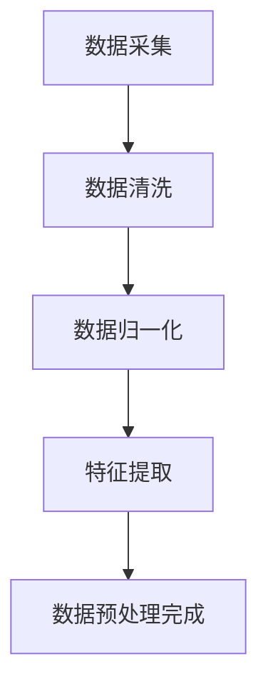
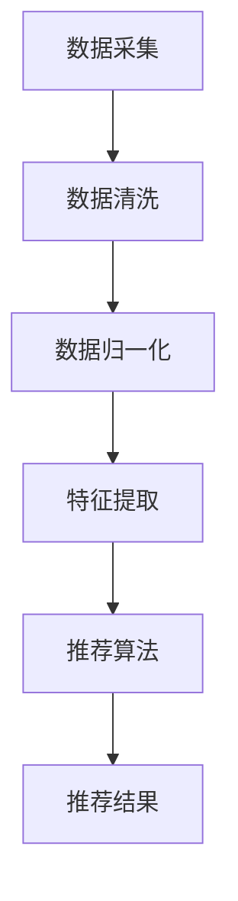

                 

### 文章标题

# 《2025年携程社招酒店推荐系统工程师面试指南》

### 关键词

- 酒店推荐系统
- 推荐算法
- 数据采集与处理
- 数学模型与优化
- 项目实战
- 面试题解析

### 摘要

本文旨在为准备携程社招酒店推荐系统工程师面试的候选人提供一份全面的指导。文章分为七个部分，从酒店推荐系统的概述、数据采集与处理、推荐算法原理、数学模型与优化、项目实战到面试题解析，最后对酒店推荐系统的发展趋势和未来研究方向进行展望。通过系统性的分析和详尽的讲解，帮助读者不仅掌握酒店推荐系统的基本原理和实现方法，还能为面试做好充分的准备。

## 目录大纲

### 《2025年携程社招酒店推荐系统工程师面试指南》

## 第1章 酒店推荐系统概述

### 1.1 酒店推荐系统的定义与重要性

### 1.2 酒店推荐系统的发展历程

### 1.3 酒店推荐系统的架构

## 第2章 数据采集与处理

### 2.1 用户行为数据采集

### 2.2 物品特征提取

### 2.3 数据预处理

## 第3章 推荐算法原理

### 3.1 协同过滤算法

### 3.2 内容推荐算法

### 3.3 混合推荐算法

## 第4章 数学模型与算法优化

### 4.1 协同过滤算法的数学模型

### 4.2 内容推荐算法的数学模型

### 4.3 混合推荐算法的数学模型

## 第5章 项目实战

### 5.1 酒店推荐系统项目实战

### 5.2 数据采集与处理

### 5.3 推荐算法实现

### 5.4 项目评估与优化

## 第6章 面试题解析

### 6.1 面试题分类

### 6.2 常见面试题解析

## 第7章 总结与展望

### 7.1 酒店推荐系统的发展趋势

### 7.2 未来研究方向

### 7.3 面试准备建议

## 附录

### 附录 A: 酒店推荐系统相关资源

### 附录 B: Mermaid 流程图

### 附录 C: 伪代码

### 参考文献

---

### 开始正文

## 第1章 酒店推荐系统概述

### 1.1 酒店推荐系统的定义与重要性

酒店推荐系统是一种利用数据挖掘和机器学习技术，通过对用户行为数据、酒店信息以及用户偏好进行分析，为用户提供个性化酒店推荐的服务系统。在旅游行业，酒店推荐系统已经成为提高用户满意度和忠诚度的关键因素之一。

**重要性：**

1. **提升用户体验：** 通过推荐系统，用户可以快速找到符合自己需求的酒店，从而提高预订效率和满意度。
2. **增加收入：** 个性化推荐能够引导用户尝试新酒店，增加订单量和用户消费。
3. **优化运营策略：** 酒店推荐系统可以帮助酒店了解用户偏好，调整价格策略、营销活动等。
4. **竞争优势：** 拥有强大推荐系统的平台在市场上更具竞争力，能够吸引更多用户和合作伙伴。

### 1.2 酒店推荐系统的发展历程

酒店推荐系统的发展大致可以分为以下几个阶段：

**早期阶段：** 以简单的基于规则的系统为主，例如基于地理位置的推荐、基于酒店评价的推荐等。

**中期阶段：** 引入协同过滤算法，通过分析用户行为和偏好，为用户推荐相似的用户喜欢的酒店。

**现代阶段：** 结合深度学习和自然语言处理技术，推荐系统更加智能化，能够通过文本分析、图像识别等多种方式为用户提供更加精准的推荐。

### 1.3 酒店推荐系统的架构

酒店推荐系统的基本架构通常包括以下几个模块：

**数据采集模块：** 负责收集用户行为数据和酒店信息，如用户浏览记录、搜索历史、预订记录、酒店描述等。

**数据处理模块：** 对采集到的数据进行清洗、归一化处理，构建用户-物品交互矩阵。

**特征提取模块：** 根据用户和物品的特征，提取有助于推荐的关键信息，如用户偏好、酒店属性等。

**推荐算法模块：** 利用协同过滤、内容推荐、混合推荐等算法，为用户生成个性化推荐列表。

**评估与优化模块：** 通过A/B测试、交叉验证等方法，评估推荐效果，并进行算法优化。

接下来，我们将进一步探讨数据采集与处理、推荐算法原理以及数学模型与算法优化等内容。

---

## 第2章 数据采集与处理

### 2.1 用户行为数据采集

用户行为数据是酒店推荐系统的关键输入，主要来源于用户的浏览、搜索、预订等操作。以下是用户行为数据采集的几个关键步骤：

**1. 数据源：**

- **用户浏览数据：** 用户在平台上的浏览记录，包括点击、停留时间、页面滑动等。
- **用户搜索数据：** 用户输入的搜索关键词、搜索意图。
- **用户预订数据：** 用户预订酒店的历史记录，包括预订时间、酒店选择、价格等。

**2. 数据采集方式：**

- **服务器日志：** 通过服务器日志记录用户行为，是最常用的数据采集方式之一。
- **浏览器插件：** 安装在用户浏览器中的插件，可以实时收集用户浏览数据。
- **客户端SDK：** 在移动应用或网页中嵌入SDK，可以收集用户操作数据。

**3. 数据采集挑战：**

- **数据完整性：** 部分用户行为可能无法完整记录，如浏览器隐私模式下的操作。
- **数据质量：** 需要对采集到的数据进行清洗，去除重复、异常和错误的数据。
- **隐私保护：** 在采集用户数据时，需要严格遵守隐私保护法规，确保用户数据的安全。

### 2.2 物品特征提取

物品特征提取是将酒店信息转化为计算机可以处理和利用的数据的过程。以下是物品特征提取的几个关键步骤：

**1. 酒店基本信息提取：**

- **位置：** 酒店的地理位置，可以通过经纬度表示。
- **价格：** 酒店的价格范围，可以根据预订时间段进行动态调整。
- **星级：** 酒店的星级，通常分为一星到五星。
- **设施：** 酒店的设施信息，如免费Wi-Fi、健身房、游泳池等。

**2. 用户偏好特征提取：**

- **历史预订记录：** 用户过去的预订历史，可以帮助了解用户偏好。
- **评价信息：** 用户对酒店的评分和评论，可以用于分析用户偏好。
- **行为标签：** 根据用户的行为数据，为用户打上相应的标签，如商务旅行者、家庭旅行者等。

**3. 特征处理：**

- **数据预处理：** 对提取到的特征进行数据清洗、归一化处理，使其适合用于推荐算法。
- **特征工程：** 根据算法需求，构造新的特征，如用户与酒店的交互频率、评价的情感倾向等。

### 2.3 数据预处理

数据预处理是确保数据质量，提高推荐效果的重要环节。以下是数据预处理的主要步骤：

**1. 数据清洗：**

- **去除重复数据：** 去除重复的用户行为数据和酒店信息。
- **处理缺失数据：** 填充缺失值或删除缺失数据，根据实际情况进行决策。
- **去除异常数据：** 去除明显不符合常理的数据，如用户短时间内预订大量酒店。

**2. 数据归一化：**

- **数值特征归一化：** 将不同量级的数值特征进行归一化处理，使其在同一尺度上。
- **类别特征编码：** 将类别特征转换为数值特征，如将酒店星级编码为1到5的整数。

**3. 数据集划分：**

- **训练集与测试集划分：** 将数据集划分为训练集和测试集，用于训练和评估推荐模型。
- **交叉验证：** 采用交叉验证方法，确保模型的泛化能力。

通过以上数据采集与处理步骤，可以为酒店推荐系统提供高质量的数据支持，从而提高推荐效果。

### 2.4 特征提取与数据处理的Mermaid流程图



在Mermaid流程图中，首先进行数据采集，接着进行数据清洗，然后进行数据归一化，之后提取特征，最后完成数据预处理。

### 2.5 数据预处理与特征提取的伪代码

```python
# 数据清洗
def clean_data(data):
    # 去除重复数据
    data = remove_duplicates(data)
    # 处理缺失数据
    data = handle_missing_values(data)
    # 去除异常数据
    data = remove_outliers(data)
    return data

# 数据归一化
def normalize_data(data):
    # 数值特征归一化
    data = normalize_numerical_features(data)
    # 类别特征编码
    data = encode_categorical_features(data)
    return data

# 特征提取
def extract_features(data):
    # 提取用户偏好特征
    user_preferences = extract_user_preferences(data)
    # 提取酒店属性特征
    hotel_attributes = extract_hotel_attributes(data)
    return user_preferences, hotel_attributes

# 数据预处理
def preprocess_data(data):
    data = clean_data(data)
    data = normalize_data(data)
    user_preferences, hotel_attributes = extract_features(data)
    return user_preferences, hotel_attributes
```

伪代码中，首先定义了数据清洗、数据归一化和特征提取的函数，最后通过预处理数据函数将这三个步骤整合在一起。

### 2.6 数据预处理与特征提取的详细讲解与举例说明

**数据清洗：**

数据清洗是预处理的第一步，主要目的是去除重复、异常和错误的数据，确保数据的一致性和准确性。

**举例：** 假设我们有一份数据集，包含了用户的浏览记录。其中，部分记录存在重复，我们需要去除这些重复记录。

```python
def remove_duplicates(data):
    return list(set(data))
```

**数据归一化：**

数据归一化是将不同量级的数值特征进行标准化处理，使其在同一尺度上。这有助于算法在不同特征之间进行公平的比较。

**举例：** 假设我们有一份数据集，包含了用户年龄和收入两个特征。由于年龄和收入的量级差异较大，我们需要对其进行归一化处理。

```python
def normalize_numerical_features(data):
    min_val = min(data)
    max_val = max(data)
    return [(val - min_val) / (max_val - min_val) for val in data]
```

**特征提取：**

特征提取是从原始数据中提取有助于推荐的关键信息。这包括用户偏好特征和酒店属性特征。

**举例：** 假设我们有一份数据集，包含了用户的浏览记录和酒店信息。我们需要从中提取用户的偏好特征和酒店的属性特征。

```python
def extract_user_preferences(data):
    preferences = []
    for record in data:
        preference = record['preference']
        preferences.append(preference)
    return preferences

def extract_hotel_attributes(data):
    attributes = []
    for record in data:
        attribute = record['attribute']
        attributes.append(attribute)
    return attributes
```

通过以上步骤，我们可以对数据进行清洗、归一化和特征提取，从而为酒店推荐系统提供高质量的数据支持。

### 2.7 数据预处理与特征提取的注意事项

- **数据质量：** 在数据预处理过程中，需要特别关注数据的质量，确保数据的准确性和一致性。
- **特征选择：** 特征提取时，需要根据算法需求和数据特点，选择合适的特征，避免过度特征化。
- **数据处理效率：** 在处理大量数据时，需要注意数据处理效率，优化算法和代码，避免过度消耗计算资源。

通过以上内容，我们详细介绍了数据采集与处理、物品特征提取以及数据预处理等关键步骤，为酒店推荐系统提供了基础数据支持。

---

## 第3章 推荐算法原理

### 3.1 协同过滤算法

协同过滤算法（Collaborative Filtering）是一种通过分析用户行为和偏好来生成个性化推荐的系统。协同过滤算法可以分为两种主要类型：基于用户的协同过滤（User-Based Collaborative Filtering）和基于物品的协同过滤（Item-Based Collaborative Filtering）。

#### 基于用户的协同过滤

**原理：** 基于用户的协同过滤算法通过寻找与目标用户相似的其他用户，然后推荐这些相似用户喜欢的物品。其核心是计算用户之间的相似度，常用的相似度度量方法包括余弦相似度、皮尔逊相关系数等。

**计算过程：**

1. **计算用户相似度：** 对于两个用户u和v，计算它们之间的相似度s(u, v)。
2. **生成推荐列表：** 根据相似度计算结果，为用户u生成推荐列表，推荐那些与用户u相似的且用户v喜欢的物品。

**伪代码：**

```python
def user_based_cf(user_data, similarity_measure):
    similar_users = {}
    for user in user_data:
        similar_users[user] = []
        for other_user in user_data:
            if user != other_user:
                similarity = similarity_measure(user, other_user)
                similar_users[user].append((other_user, similarity))
    recommendations = {}
    for user, similar_users in similar_users.items():
        recommendations[user] = []
        for other_user, similarity in sorted(similar_users, key=lambda x: x[1], reverse=True):
            for item in user_data[other_user].items():
                if item not in user_data[user]:
                    recommendations[user].append(item)
    return recommendations
```

#### 基于物品的协同过滤

**原理：** 基于物品的协同过滤算法通过计算物品之间的相似度，然后为用户推荐那些与用户已评价物品相似的物品。其核心是计算物品之间的相似度，常用的相似度度量方法包括余弦相似度、欧氏距离等。

**计算过程：**

1. **计算物品相似度：** 对于两个物品i和j，计算它们之间的相似度s(i, j)。
2. **生成推荐列表：** 根据相似度计算结果，为用户生成推荐列表，推荐那些与用户已评价物品相似的物品。

**伪代码：**

```python
def item_based_cf(item_data, similarity_measure):
    similar_items = {}
    for item in item_data:
        similar_items[item] = []
        for other_item in item_data:
            if item != other_item:
                similarity = similarity_measure(item, other_item)
                similar_items[item].append((other_item, similarity))
    recommendations = {}
    for user, rated_items in user_data.items():
        recommendations[user] = []
        for item, rating in rated_items.items():
            for similar_item, similarity in sorted(similar_items[item], key=lambda x: x[1], reverse=True):
                if similar_item not in rated_items:
                    recommendations[user].append(similar_item)
    return recommendations
```

#### 协同过滤算法的优缺点

**优点：**

- **简单易实现：** 协同过滤算法相对简单，易于实现和部署。
- **个性化推荐：** 能够根据用户行为和偏好为用户生成个性化的推荐列表。

**缺点：**

- **数据稀疏问题：** 当用户和物品数量较大时，用户-物品交互矩阵往往非常稀疏，导致算法效果下降。
- **冷启动问题：** 对于新用户或新物品，由于缺乏交互数据，推荐效果较差。

### 3.2 内容推荐算法

内容推荐算法（Content-Based Recommender System）是一种基于物品内容的推荐算法，其核心思想是分析物品的属性和特征，然后根据用户的偏好为用户推荐具有相似属性的物品。

#### 原理

1. **物品特征提取：** 对每个物品进行特征提取，通常包括文本、图像、音频等多媒体特征。
2. **用户偏好建模：** 建立用户偏好模型，通常通过用户历史行为数据或用户标签进行建模。
3. **相似度计算：** 计算物品之间的相似度，常用的相似度计算方法包括文本相似度计算（如TF-IDF、Word2Vec）和图像相似度计算（如余弦相似度、欧氏距离）。
4. **生成推荐列表：** 根据相似度计算结果，为用户生成推荐列表。

#### 实现步骤

1. **文本特征提取：** 使用TF-IDF等方法提取文本特征。
2. **图像特征提取：** 使用卷积神经网络（CNN）提取图像特征。
3. **用户偏好建模：** 根据用户历史行为数据或用户标签，建立用户偏好模型。
4. **相似度计算：** 计算物品之间的相似度，为用户生成推荐列表。

#### 伪代码

```python
def content_based_cf(item_features, user_preference_model, similarity_measure):
    recommendations = {}
    for user, preference in user_preference_model.items():
        recommendations[user] = []
        for item, feature in item_features.items():
            similarity = similarity_measure(preference, feature)
            if similarity > threshold:
                recommendations[user].append(item)
    return recommendations
```

#### 内容推荐算法的优缺点

**优点：**

- **无冷启动问题：** 内容推荐算法不依赖用户历史交互数据，适用于新用户或新物品。
- **易于实现：** 基于现有技术和工具，内容推荐算法相对容易实现。

**缺点：**

- **用户个性化不足：** 由于仅依赖物品内容，难以捕捉到用户的个性化需求。
- **扩展性差：** 对于复杂的多媒体内容，特征提取和相似度计算较为复杂。

### 3.3 混合推荐算法

混合推荐算法（Hybrid Recommender System）是一种结合协同过滤算法和内容推荐算法的优势，以生成更准确、更个性化的推荐列表。混合推荐算法通常包括以下几个步骤：

1. **协同过滤阶段：** 利用协同过滤算法生成初步推荐列表。
2. **内容推荐阶段：** 利用内容推荐算法对初步推荐列表进行补充和优化。
3. **综合评估与优化：** 结合协同过滤和内容推荐的结果，生成最终的推荐列表。

#### 实现步骤

1. **协同过滤推荐：** 使用基于用户的协同过滤算法生成初步推荐列表。
2. **内容推荐：** 使用内容推荐算法生成补充推荐列表。
3. **综合评估：** 对初步推荐列表和补充推荐列表进行加权合并，生成最终的推荐列表。

#### 伪代码

```python
def hybrid_recommender(cf_recommender, content_recommender, weight_cf, weight_content):
    cf_recommendations = cf_recommender(user_data)
    content_recommendations = content_recommender(item_data, user_preference_model)
    final_recommendations = {}
    for user, cf Recommendations in cf_recommendations.items():
        content_recommendations[user] = []
        for item in cf_recommendations[user]:
            if item in content_recommendations[user]:
                content_recommendations[user].remove(item)
        final_recommendations[user] = (weight_cf * cf_recommendations[user] + weight_content * content_recommendations[user])
    return final_recommendations
```

#### 混合推荐算法的优缺点

**优点：**

- **提高推荐精度：** 结合协同过滤和内容推荐的优势，生成更准确、更个性化的推荐列表。
- **克服单一算法的缺点：** 协同过滤算法和内容推荐算法各自具有优点和局限性，混合推荐算法可以有效克服单一算法的不足。

**缺点：**

- **实现复杂：** 需要同时实现和优化协同过滤和内容推荐算法，实现过程相对复杂。
- **计算资源消耗大：** 混合推荐算法需要计算多个推荐列表，计算资源消耗较大。

通过以上介绍，我们详细探讨了协同过滤算法、内容推荐算法和混合推荐算法的原理、实现方法和优缺点，为酒店推荐系统的设计和实现提供了理论基础。

### 3.4 推荐算法的综合评估与优化

推荐算法的性能评估是确保推荐系统能够提供高质量推荐的关键步骤。以下是一些常用的评估指标和方法：

#### 评估指标

1. **准确率（Accuracy）**：预测正确的用户-物品对占总用户-物品对的比例。
2. **召回率（Recall）**：预测正确的用户-物品对占所有实际喜欢的物品的比例。
3. **覆盖率（Coverage）**：推荐列表中不同物品的比例。
4. **多样性（Diversity）**：推荐列表中不同物品的分布情况。
5. **新颖性（Novelty）**：推荐列表中包含的新物品比例。

#### 评估方法

1. **离线评估**：在训练集上评估模型性能，常用的方法包括交叉验证、ROC曲线和AUC值等。
2. **在线评估**：在实际环境中实时评估模型性能，根据用户反馈进行调整。

#### 优化策略

1. **特征工程**：通过特征提取和特征选择，优化特征质量。
2. **算法调参**：通过调整算法参数，优化模型性能。
3. **模型集成**：结合多个模型的优势，提高推荐效果。
4. **动态调整**：根据用户行为和偏好，动态调整推荐策略。

通过以上综合评估与优化策略，可以确保酒店推荐系统提供高质量的个性化推荐，提高用户体验和满意度。

### 3.5 推荐算法的选择与适用场景

在酒店推荐系统的实际应用中，选择合适的推荐算法是关键。以下是对协同过滤算法、内容推荐算法和混合推荐算法的选择与适用场景的分析：

#### 协同过滤算法

**适用场景：**

- **用户交互数据丰富**：当用户在系统中产生了大量的交互数据时，协同过滤算法能够利用这些数据为用户提供个性化的推荐。
- **用户行为稳定**：协同过滤算法依赖于用户之间的相似度，适用于行为稳定、相似度较高的用户群体。

**优点：**

- **简单易实现**：协同过滤算法相对简单，易于理解和实现。
- **个性化推荐**：能够根据用户历史行为为用户生成个性化的推荐列表。

**缺点：**

- **数据稀疏问题**：当用户和物品数量较大时，用户-物品交互矩阵往往非常稀疏，导致推荐效果下降。
- **冷启动问题**：对于新用户或新物品，由于缺乏交互数据，推荐效果较差。

#### 内容推荐算法

**适用场景：**

- **内容丰富**：当物品具有丰富的文本、图像、音频等多媒体内容时，内容推荐算法能够充分利用这些内容进行推荐。
- **无冷启动问题**：内容推荐算法不依赖用户历史交互数据，适用于新用户或新物品。

**优点：**

- **无冷启动问题**：适用于新用户或新物品，无需等待用户交互数据积累。
- **易于实现**：基于现有技术和工具，内容推荐算法相对容易实现。

**缺点：**

- **用户个性化不足**：由于仅依赖物品内容，难以捕捉到用户的个性化需求。
- **扩展性差**：对于复杂的多媒体内容，特征提取和相似度计算较为复杂。

#### 混合推荐算法

**适用场景：**

- **多维度数据**：当系统中有丰富的用户交互数据和物品内容数据时，混合推荐算法能够结合两种算法的优势，为用户提供更准确的推荐。
- **优化效果**：混合推荐算法可以结合协同过滤和内容推荐的优势，提高推荐系统的整体性能。

**优点：**

- **提高推荐精度**：结合协同过滤和内容推荐的优势，生成更准确、更个性化的推荐列表。
- **克服单一算法的缺点**：协同过滤算法和内容推荐算法各自具有优点和局限性，混合推荐算法可以有效克服单一算法的不足。

**缺点：**

- **实现复杂**：需要同时实现和优化协同过滤和内容推荐算法，实现过程相对复杂。
- **计算资源消耗大**：混合推荐算法需要计算多个推荐列表，计算资源消耗较大。

通过以上分析，我们可以根据实际需求和数据特点选择合适的推荐算法，以构建高效的酒店推荐系统。

### 3.6 总结

本章详细介绍了酒店推荐系统中的协同过滤算法、内容推荐算法和混合推荐算法的原理、实现方法、优缺点以及评估与优化策略。协同过滤算法适用于有丰富用户交互数据的场景，内容推荐算法适用于内容丰富的物品，而混合推荐算法则结合了两种算法的优势，为用户提供更准确的个性化推荐。在实际应用中，根据需求和数据特点选择合适的推荐算法，并结合评估与优化策略，可以构建高效的酒店推荐系统，提高用户体验和满意度。

---

## 第4章 数学模型与算法优化

### 4.1 协同过滤算法的数学模型

协同过滤算法的核心在于计算用户之间的相似度，并根据相似度为用户生成推荐列表。在这一节中，我们将详细探讨基于用户的协同过滤算法的数学模型。

#### 相似度计算

相似度计算是协同过滤算法的关键步骤，用于衡量两个用户之间的相似程度。常见的相似度计算方法包括余弦相似度和皮尔逊相关系数。

1. **余弦相似度**：

   余弦相似度通过计算两个向量夹角的余弦值来衡量相似度，其公式如下：

   $$
   s(u, v) = \cos(\theta) = \frac{u \cdot v}{\|u\| \|v\|}
   $$

   其中，$u$和$v$分别表示用户u和用户v的向量，$\|u\|$和$\|v\|$分别表示向量的模长，$\cdot$表示向量的点积。

2. **皮尔逊相关系数**：

   皮尔逊相关系数用于衡量两个变量之间的线性关系，其公式如下：

   $$
   s(u, v) = \rho(u, v) = \frac{\sum_{i=1}^{n} (u_i - \bar{u})(v_i - \bar{v})}{\sqrt{\sum_{i=1}^{n} (u_i - \bar{u})^2 \sum_{i=1}^{n} (v_i - \bar{v})^2}}
   $$

   其中，$u_i$和$v_i$分别表示用户u和用户v在第i个物品上的评分，$\bar{u}$和$\bar{v}$分别表示用户u和用户v的评分平均值。

#### 推荐列表生成

在计算用户相似度后，可以基于相似度矩阵为用户生成推荐列表。以下是基于用户的协同过滤算法生成推荐列表的步骤：

1. **计算相似度矩阵**：

   利用相似度计算方法，计算所有用户之间的相似度矩阵$S$。

2. **生成推荐列表**：

   对于目标用户u，计算其与所有其他用户的相似度，并选取相似度最高的k个用户作为邻居。然后，根据邻居用户对物品的评分，生成推荐列表。

   $$
   R(u) = \sum_{v \in \text{邻居用户}} s(u, v) \cdot r(v)
   $$

   其中，$r(v)$表示邻居用户v对物品的评分。

#### 损失函数

协同过滤算法的优化目标是最大化推荐列表的准确性，通常采用损失函数来衡量推荐效果。常见的损失函数包括均方误差（MSE）和平方损失。

1. **均方误差（MSE）**：

   均方误差用于衡量预测评分与真实评分之间的差异，其公式如下：

   $$
   L(\theta) = \frac{1}{2} \sum_{i=1}^{n} (r_i - \hat{r}_i)^2
   $$

   其中，$r_i$表示用户u对物品i的真实评分，$\hat{r}_i$表示预测评分，$\theta$表示模型参数。

2. **平方损失**：

   平方损失与均方误差类似，但公式形式略有不同：

   $$
   L(\theta) = \sum_{i=1}^{n} (r_i - \hat{r}_i)^2
   $$

#### 优化目标与求解方法

协同过滤算法的优化目标是最小化损失函数，常用的优化方法包括梯度下降和随机梯度下降。

1. **梯度下降**：

   梯度下降是一种优化方法，通过计算损失函数关于模型参数的梯度，更新模型参数，以最小化损失函数。

   $$
   \theta_{t+1} = \theta_t - \alpha \nabla_{\theta} L(\theta_t)
   $$

   其中，$\alpha$为学习率，$\nabla_{\theta} L(\theta_t)$表示损失函数关于模型参数的梯度。

2. **随机梯度下降**：

   随机梯度下降是一种改进的梯度下降方法，通过随机选择样本来更新模型参数，以减少计算量和提高收敛速度。

   $$
   \theta_{t+1} = \theta_t - \alpha \nabla_{\theta} L(\theta_t; x_i, y_i)
   $$

   其中，$x_i$和$y_i$分别表示样本特征和标签。

通过以上数学模型和优化方法，我们可以实现协同过滤算法，为用户生成个性化的推荐列表。

### 4.2 内容推荐算法的数学模型

内容推荐算法是一种基于物品内容的推荐算法，其核心思想是通过分析物品的属性和特征，为用户生成个性化的推荐列表。以下将详细探讨内容推荐算法的数学模型。

#### 特征提取

在内容推荐算法中，特征提取是一个关键步骤，将物品的属性转化为计算机可以处理和利用的数据。以下是常见的特征提取方法：

1. **文本特征提取**：

   文本特征提取是将文本数据转化为向量表示的过程，常用的方法包括TF-IDF和Word2Vec。

   - **TF-IDF**：

     TF-IDF（Term Frequency-Inverse Document Frequency）是一种基于词频和逆文档频次的特征提取方法，其公式如下：

     $$
     t_{ij} = \frac{f_{ij}}{f_{i} + \lambda} \cdot \log \left(1 + \frac{N}{n_{ij}}\right)
     $$

     其中，$t_{ij}$表示词w在文档i中的TF-IDF值，$f_{ij}$表示词w在文档i中的词频，$f_i$表示词w在所有文档中的词频，$N$表示文档总数，$n_{ij}$表示包含词w的文档数。

   - **Word2Vec**：

     Word2Vec是一种基于神经网络的文本特征提取方法，其将词语映射到低维向量空间中。Word2Vec包括两种模型：CBOW（Continuous Bag of Words）和Skip-gram。以下为CBOW模型的公式：

     $$
     \hat{y} = \sigma(W \cdot \text{Embedding}(x) + b)
     $$

     其中，$\hat{y}$表示预测标签向量，$W$表示权重矩阵，$\text{Embedding}(x)$表示输入词的嵌入向量，$b$表示偏置项，$\sigma$表示激活函数。

2. **图像特征提取**：

   图像特征提取是将图像数据转化为向量表示的过程，常用的方法包括卷积神经网络（CNN）。

   - **CNN**：

     卷积神经网络是一种用于图像特征提取的神经网络结构，其通过卷积、池化等操作提取图像特征。以下为CNN的特征提取过程：

     $$
     h_{l+1} = \text{ReLU}(W_l \cdot h_l + b_l)
     $$

     其中，$h_{l+1}$表示第$l+1$层的特征向量，$W_l$表示权重矩阵，$h_l$表示第$l$层的特征向量，$b_l$表示偏置项。

#### 相似度计算

在内容推荐算法中，相似度计算是生成推荐列表的关键步骤。常见的相似度计算方法包括余弦相似度和欧氏距离。

1. **余弦相似度**：

   余弦相似度通过计算两个向量夹角的余弦值来衡量相似度，其公式如下：

   $$
   s(x, y) = \cos(\theta) = \frac{x \cdot y}{\|x\| \|y\|}
   $$

   其中，$x$和$y$分别表示两个向量的表示，$\|x\|$和$\|y\|$分别表示向量的模长，$\cdot$表示向量的点积。

2. **欧氏距离**：

   欧氏距离通过计算两个向量之间的欧氏距离来衡量相似度，其公式如下：

   $$
   d(x, y) = \sqrt{\sum_{i=1}^{n} (x_i - y_i)^2}
   $$

   其中，$x$和$y$分别表示两个向量的表示，$n$表示向量的维度。

#### 推荐列表生成

在计算物品相似度后，可以基于相似度为用户生成推荐列表。以下是基于内容推荐算法生成推荐列表的步骤：

1. **计算相似度矩阵**：

   利用相似度计算方法，计算所有物品之间的相似度矩阵$S$。

2. **生成推荐列表**：

   对于目标用户u，计算其与所有物品的相似度，并选取相似度最高的k个物品作为推荐结果。

   $$
   R(u) = \sum_{i=1}^{n} s(u, i) \cdot r(i)
   $$

   其中，$r(i)$表示物品i的评分。

#### 损失函数

内容推荐算法的优化目标是最大化推荐列表的准确性，通常采用损失函数来衡量推荐效果。常见的损失函数包括均方误差（MSE）和交叉熵损失。

1. **均方误差（MSE）**：

   均方误差用于衡量预测评分与真实评分之间的差异，其公式如下：

   $$
   L(\theta) = \frac{1}{2} \sum_{i=1}^{n} (r_i - \hat{r}_i)^2
   $$

   其中，$r_i$表示用户u对物品i的真实评分，$\hat{r}_i$表示预测评分，$\theta$表示模型参数。

2. **交叉熵损失**：

   交叉熵损失用于衡量预测概率分布与真实概率分布之间的差异，其公式如下：

   $$
   L(\theta) = -\sum_{i=1}^{n} y_i \log(\hat{y}_i)
   $$

   其中，$y_i$表示用户u对物品i的标签，$\hat{y}_i$表示预测概率。

#### 优化目标与求解方法

内容推荐算法的优化目标是最小化损失函数，常用的优化方法包括梯度下降和随机梯度下降。

1. **梯度下降**：

   梯度下降是一种优化方法，通过计算损失函数关于模型参数的梯度，更新模型参数，以最小化损失函数。

   $$
   \theta_{t+1} = \theta_t - \alpha \nabla_{\theta} L(\theta_t)
   $$

   其中，$\alpha$为学习率，$\nabla_{\theta} L(\theta_t)$表示损失函数关于模型参数的梯度。

2. **随机梯度下降**：

   随机梯度下降是一种改进的梯度下降方法，通过随机选择样本来更新模型参数，以减少计算量和提高收敛速度。

   $$
   \theta_{t+1} = \theta_t - \alpha \nabla_{\theta} L(\theta_t; x_i, y_i)
   $$

   其中，$x_i$和$y_i$分别表示样本特征和标签。

通过以上数学模型和优化方法，我们可以实现内容推荐算法，为用户生成个性化的推荐列表。

### 4.3 混合推荐算法的数学模型

混合推荐算法是一种结合协同过滤算法和内容推荐算法的优势，为用户生成更准确、更个性化的推荐列表。在这一节中，我们将详细探讨混合推荐算法的数学模型。

#### 模型构建

混合推荐算法的核心是结合协同过滤和内容推荐两个部分，构建一个综合的推荐模型。通常，混合推荐算法可以分为以下三个步骤：

1. **协同过滤阶段**：利用协同过滤算法生成初步推荐列表。
2. **内容推荐阶段**：利用内容推荐算法对初步推荐列表进行补充和优化。
3. **综合评估与优化**：结合协同过滤和内容推荐的结果，生成最终的推荐列表。

#### 混合模型公式

混合推荐算法的数学模型可以表示为：

$$
R(u, i) = w_1 \cdot R_{cf}(u, i) + w_2 \cdot R_{content}(u, i)
$$

其中，$R(u, i)$表示用户u对物品i的推荐分数，$R_{cf}(u, i)$表示协同过滤阶段的推荐分数，$R_{content}(u, i)$表示内容推荐阶段的推荐分数，$w_1$和$w_2$分别表示两个阶段的权重。

#### 协同过滤阶段的推荐分数

协同过滤阶段的推荐分数可以通过以下公式计算：

$$
R_{cf}(u, i) = \sum_{v \in N(u)} s(u, v) \cdot r_{v}(i)
$$

其中，$N(u)$表示与用户u相似的其他用户集合，$s(u, v)$表示用户u和用户v之间的相似度，$r_{v}(i)$表示用户v对物品i的评分。

#### 内容推荐阶段的推荐分数

内容推荐阶段的推荐分数可以通过以下公式计算：

$$
R_{content}(u, i) = \sum_{j \in I(i)} s_{content}(u, j) \cdot r_{j}(i)
$$

其中，$I(i)$表示物品i的特征集合，$s_{content}(u, j)$表示用户u和物品i之间的内容相似度，$r_{j}(i)$表示用户u对物品i的特征j的评分。

#### 权重分配

在混合推荐算法中，需要根据协同过滤阶段和内容推荐阶段的重要性分配权重。通常，可以通过交叉验证等方法确定最优权重。

#### 损失函数

混合推荐算法的优化目标是最大化推荐列表的准确性，常用的损失函数包括均方误差（MSE）和交叉熵损失。

1. **均方误差（MSE）**：

   均方误差用于衡量预测评分与真实评分之间的差异，其公式如下：

   $$
   L(\theta) = \frac{1}{2} \sum_{i=1}^{n} (r_i - \hat{r}_i)^2
   $$

   其中，$r_i$表示用户u对物品i的真实评分，$\hat{r}_i$表示预测评分，$\theta$表示模型参数。

2. **交叉熵损失**：

   交叉熵损失用于衡量预测概率分布与真实概率分布之间的差异，其公式如下：

   $$
   L(\theta) = -\sum_{i=1}^{n} y_i \log(\hat{y}_i)
   $$

   其中，$y_i$表示用户u对物品i的标签，$\hat{y}_i$表示预测概率。

#### 优化目标与求解方法

混合推荐算法的优化目标是最小化损失函数，常用的优化方法包括梯度下降和随机梯度下降。

1. **梯度下降**：

   梯度下降是一种优化方法，通过计算损失函数关于模型参数的梯度，更新模型参数，以最小化损失函数。

   $$
   \theta_{t+1} = \theta_t - \alpha \nabla_{\theta} L(\theta_t)
   $$

   其中，$\alpha$为学习率，$\nabla_{\theta} L(\theta_t)$表示损失函数关于模型参数的梯度。

2. **随机梯度下降**：

   随机梯度下降是一种改进的梯度下降方法，通过随机选择样本来更新模型参数，以减少计算量和提高收敛速度。

   $$
   \theta_{t+1} = \theta_t - \alpha \nabla_{\theta} L(\theta_t; x_i, y_i)
   $$

   其中，$x_i$和$y_i$分别表示样本特征和标签。

通过以上数学模型和优化方法，我们可以实现混合推荐算法，为用户生成个性化的推荐列表。

### 4.4 数学模型与优化方法的应用

数学模型和优化方法在推荐系统中的应用是确保推荐算法准确性和效率的关键。以下将结合实际案例，探讨数学模型与优化方法在推荐系统中的应用。

#### 案例一：电商推荐系统

电商推荐系统是一种常见的推荐系统，其目标是为用户推荐符合其兴趣和需求的商品。以下是一个基于协同过滤和内容推荐算法的电商推荐系统案例。

1. **数据采集**：收集用户在平台上的行为数据，如浏览记录、搜索历史、购买记录等。
2. **数据处理**：对采集到的数据进行清洗、归一化处理，提取用户和商品的特征。
3. **模型训练**：

   - **协同过滤阶段**：利用用户行为数据构建用户-商品交互矩阵，采用基于用户的协同过滤算法生成初步推荐列表。
   - **内容推荐阶段**：对商品进行特征提取，利用内容推荐算法（如TF-IDF、Word2Vec）为用户生成推荐列表。
   - **综合评估与优化**：结合协同过滤和内容推荐的结果，生成最终的推荐列表，并利用交叉验证等方法评估推荐效果。

4. **在线推荐**：根据用户实时行为数据，动态调整推荐策略，提高推荐准确性。

#### 案例二：社交媒体推荐系统

社交媒体推荐系统是一种为用户推荐符合其兴趣和关注的内容的系统。以下是一个基于混合推荐算法的社交媒体推荐系统案例。

1. **数据采集**：收集用户在社交媒体平台上的行为数据，如点赞、评论、分享等。
2. **数据处理**：对采集到的数据进行清洗、归一化处理，提取用户和内容的特征。
3. **模型训练**：

   - **协同过滤阶段**：利用用户行为数据构建用户-内容交互矩阵，采用基于用户的协同过滤算法生成初步推荐列表。
   - **内容推荐阶段**：对内容进行特征提取，利用内容推荐算法（如TF-IDF、Word2Vec）为用户生成推荐列表。
   - **综合评估与优化**：结合协同过滤和内容推荐的结果，采用混合推荐算法生成最终的推荐列表，并利用交叉验证等方法评估推荐效果。

4. **在线推荐**：根据用户实时行为数据，动态调整推荐策略，提高推荐准确性。

#### 案例三：酒店推荐系统

酒店推荐系统是一种为用户推荐符合其需求的酒店的系统。以下是一个基于混合推荐算法的酒店推荐系统案例。

1. **数据采集**：收集用户在酒店预订平台上的行为数据，如浏览记录、搜索历史、预订记录等。
2. **数据处理**：对采集到的数据进行清洗、归一化处理，提取用户和酒店的特征。
3. **模型训练**：

   - **协同过滤阶段**：利用用户行为数据构建用户-酒店交互矩阵，采用基于用户的协同过滤算法生成初步推荐列表。
   - **内容推荐阶段**：对酒店进行特征提取，利用内容推荐算法（如TF-IDF、Word2Vec）为用户生成推荐列表。
   - **综合评估与优化**：结合协同过滤和内容推荐的结果，采用混合推荐算法生成最终的推荐列表，并利用交叉验证等方法评估推荐效果。

4. **在线推荐**：根据用户实时行为数据，动态调整推荐策略，提高推荐准确性。

通过以上案例，我们可以看到数学模型和优化方法在推荐系统中的应用，从数据采集、数据处理到模型训练和在线推荐，每个环节都需要运用相应的数学模型和优化方法，以确保推荐系统的准确性和效率。

### 4.5 总结

本章详细介绍了协同过滤算法、内容推荐算法和混合推荐算法的数学模型和优化方法。协同过滤算法通过计算用户相似度生成推荐列表，内容推荐算法通过分析物品特征生成推荐列表，混合推荐算法结合了两种算法的优势，为用户提供更准确的个性化推荐。在实际应用中，通过合理运用这些数学模型和优化方法，可以构建高效的推荐系统，提高用户体验和满意度。

---

## 第5章 项目实战

### 5.1 酒店推荐系统项目实战

**项目背景与目标**

本案例旨在构建一个酒店推荐系统，通过数据采集、数据处理、推荐算法实现和项目评估与优化等步骤，为用户提供个性化的酒店推荐服务。项目的主要目标包括：

1. **数据采集**：收集用户行为数据和酒店信息，如浏览记录、搜索历史、预订记录、酒店描述等。
2. **数据处理**：对采集到的数据进行清洗、归一化处理，提取用户和酒店特征。
3. **推荐算法实现**：采用协同过滤算法、内容推荐算法和混合推荐算法，为用户生成个性化推荐列表。
4. **项目评估与优化**：通过A/B测试、交叉验证等方法，评估推荐效果，并进行算法优化。

**开发环境搭建**

为了实现上述目标，我们需要搭建以下开发环境：

1. **编程语言**：Python，Python拥有丰富的机器学习和数据科学库，适用于推荐系统开发。
2. **数据库**：MongoDB，用于存储用户行为数据和酒店信息。
3. **数据处理库**：Pandas，用于数据清洗、归一化和特征提取。
4. **机器学习库**：Scikit-learn、TensorFlow和PyTorch，用于实现推荐算法和优化。
5. **可视化库**：Matplotlib、Seaborn，用于数据分析和可视化。

**数据采集与处理**

1. **用户行为数据采集**：

   用户行为数据包括用户的浏览记录、搜索历史和预订记录。数据来源可以是网站日志、浏览器插件和客户端SDK。以下是采集用户行为数据的步骤：

   - **数据收集**：通过网站日志、浏览器插件和客户端SDK收集用户行为数据。
   - **数据存储**：将收集到的数据存储到MongoDB数据库中。

2. **酒店信息采集**：

   酒店信息包括酒店的基本信息（如位置、价格、星级）、设施信息（如免费Wi-Fi、健身房、游泳池）等。数据来源可以是酒店网站、第三方API等。以下是采集酒店信息的步骤：

   - **数据收集**：通过酒店网站、第三方API等途径收集酒店信息。
   - **数据存储**：将收集到的数据存储到MongoDB数据库中。

3. **数据预处理**：

   数据预处理是确保数据质量，提高推荐效果的重要环节。以下是数据预处理的主要步骤：

   - **数据清洗**：去除重复、异常和错误的数据。
   - **数据归一化**：将不同量级的数值特征进行归一化处理。
   - **特征提取**：提取用户和酒店的关键特征，如用户偏好、酒店属性等。

**推荐算法实现**

1. **协同过滤算法实现**：

   基于用户的协同过滤算法是一种常用的推荐算法，其原理是通过计算用户之间的相似度，为用户推荐相似用户喜欢的酒店。以下是协同过滤算法的实现步骤：

   - **计算用户相似度**：使用余弦相似度或皮尔逊相关系数计算用户之间的相似度。
   - **生成推荐列表**：根据用户相似度矩阵，为用户生成推荐列表。

2. **内容推荐算法实现**：

   内容推荐算法是一种基于物品内容的推荐算法，其原理是通过分析物品的属性和特征，为用户推荐具有相似属性的酒店。以下是内容推荐算法的实现步骤：

   - **文本特征提取**：使用TF-IDF或Word2Vec等方法提取文本特征。
   - **图像特征提取**：使用卷积神经网络（CNN）提取图像特征。
   - **生成推荐列表**：根据物品特征和用户偏好，为用户生成推荐列表。

3. **混合推荐算法实现**：

   混合推荐算法结合了协同过滤算法和内容推荐算法的优势，为用户生成更准确的个性化推荐列表。以下是混合推荐算法的实现步骤：

   - **协同过滤推荐**：使用基于用户的协同过滤算法生成初步推荐列表。
   - **内容推荐**：使用内容推荐算法生成补充推荐列表。
   - **综合评估与优化**：结合协同过滤和内容推荐的结果，生成最终的推荐列表。

**项目评估与优化**

1. **项目评估方法**：

   - **准确率（Accuracy）**：预测正确的用户-酒店对占总用户-酒店对的比例。
   - **召回率（Recall）**：预测正确的用户-酒店对占所有实际喜欢的酒店的的比例。
   - **覆盖率（Coverage）**：推荐列表中不同酒店的比例。
   - **多样性（Diversity）**：推荐列表中不同酒店的种类和风格。
   - **新颖性（Novelty）**：推荐列表中包含的新酒店比例。

2. **项目优化策略**：

   - **特征工程**：优化特征提取和特征选择，提高推荐精度。
   - **算法调参**：调整算法参数，提高推荐效果。
   - **模型集成**：结合多个模型的优势，提高推荐效果。
   - **动态调整**：根据用户行为和偏好，动态调整推荐策略。

**项目实战总结**

通过本案例的酒店推荐系统项目实战，我们详细介绍了项目背景与目标、开发环境搭建、数据采集与处理、推荐算法实现、项目评估与优化等步骤。该项目实战为读者提供了一个实际操作的范例，有助于理解酒店推荐系统的设计和实现过程。同时，通过不断优化和改进，可以进一步提高推荐系统的性能和用户体验。

---

## 第6章 面试题解析

### 6.1 面试题分类

在面试过程中，面试官可能会从多个角度对候选人的技术能力进行考察。以下是常见的一些面试题分类：

#### 算法设计与优化

1. **协同过滤算法如何优化？**
2. **如何解决协同过滤算法的冷启动问题？**
3. **内容推荐算法的优化策略有哪些？**
4. **混合推荐算法的优化思路是什么？**

#### 数据结构与算法

1. **如何高效地进行数据预处理？**
2. **如何设计一个高效的推荐算法数据结构？**
3. **如何处理大规模数据集？**
4. **常见的排序算法有哪些？**

#### 项目案例分析

1. **请简述一个你参与过的推荐系统项目，并分析其优缺点。**
2. **如何评估推荐系统的性能？**
3. **如何进行推荐系统的A/B测试？**
4. **请描述一个推荐系统的实际应用案例。**

### 6.2 常见面试题解析

以下是对一些常见面试题的解析，包括问题的背景、答案要点和可能的问题扩展。

#### 1. 协同过滤算法如何优化？

**背景：** 协同过滤算法在推荐系统中广泛应用，但存在数据稀疏和冷启动问题。优化协同过滤算法是提高推荐系统性能的关键。

**答案要点：**

- **特征工程**：通过特征提取和特征选择，增加数据特征，提高模型的可解释性。
- **矩阵分解**：使用矩阵分解（如SVD）将高维稀疏矩阵分解为低维矩阵，降低数据稀疏性。
- **近邻策略**：选择合适的近邻策略（如KNN、基于修正的KNN），提高推荐精度。
- **上下文信息**：结合上下文信息（如时间、地点），提高推荐的相关性。

**问题扩展：** 如何在协同过滤算法中结合用户偏好和历史行为数据进行优化？

#### 2. 如何解决协同过滤算法的冷启动问题？

**背景：** 冷启动问题是指新用户或新物品缺乏交互数据，导致推荐效果不佳。

**答案要点：**

- **基于内容的推荐**：利用物品特征为新用户推荐相似物品。
- **基于上下文的推荐**：结合用户当前上下文（如时间、地点），推荐相关物品。
- **基于模型预训练**：使用预训练模型为新用户或新物品生成初始特征。
- **用户群体推荐**：为新用户推荐与其群体相似的用户喜欢的物品。

**问题扩展：** 如何评估冷启动问题的解决方案效果？

#### 3. 内容推荐算法的优化策略有哪些？

**背景：** 内容推荐算法通过分析物品特征和用户偏好进行推荐，优化策略旨在提高推荐精度和多样性。

**答案要点：**

- **特征提取**：使用深度学习模型（如CNN、RNN）提取丰富、高效的物品特征。
- **相似度计算**：采用多种相似度计算方法（如余弦相似度、欧氏距离），结合不同特征的权重。
- **多样性**：引入多样性策略（如随机抽样、限制重复推荐），提高推荐列表的多样性。
- **上下文感知**：结合用户上下文信息（如时间、地点、设备），提高推荐的相关性。

**问题扩展：** 如何在实际项目中实施内容推荐算法的优化策略？

#### 4. 混合推荐算法的优化思路是什么？

**背景：** 混合推荐算法结合协同过滤和内容推荐的优势，提高推荐系统的性能。

**答案要点：**

- **权重分配**：通过交叉验证等方法，优化协同过滤和内容推荐的权重分配。
- **融合策略**：采用加权融合（如线性加权、非线性加权）或深度学习模型（如多层感知器、循环神经网络）进行融合。
- **特征优化**：通过特征工程和特征选择，优化协同过滤和内容推荐的特征。
- **动态调整**：根据用户行为和偏好，动态调整推荐策略。

**问题扩展：** 如何评估混合推荐算法的优化效果？

#### 5. 如何高效地进行数据预处理？

**背景：** 数据预处理是推荐系统的重要环节，高效的数据预处理可以提高推荐系统的性能。

**答案要点：**

- **并行处理**：使用并行处理技术（如MapReduce、分布式计算框架），提高数据清洗、归一化等操作的效率。
- **内存管理**：合理管理内存资源，避免内存溢出和性能下降。
- **数据缓存**：使用数据缓存（如Redis、Memcached），减少数据读取时间。
- **批量处理**：批量处理数据，减少I/O操作和系统开销。

**问题扩展：** 如何优化大数据环境下的数据预处理过程？

#### 6. 如何设计一个高效的推荐算法数据结构？

**背景：** 推荐算法的性能和数据结构密切相关，设计高效的推荐算法数据结构是提高推荐系统性能的关键。

**答案要点：**

- **数据结构选择**：根据推荐算法的需求，选择合适的数据结构（如哈希表、B树、平衡二叉树）。
- **索引设计**：设计合理的索引结构，提高数据查询和更新的效率。
- **缓存机制**：采用缓存机制（如LRU缓存、堆缓存），提高数据访问速度。
- **分布式存储**：使用分布式存储系统（如Hadoop、Spark），处理大规模数据。

**问题扩展：** 如何在实际项目中设计高效的推荐算法数据结构？

#### 7. 如何处理大规模数据集？

**背景：** 大规模数据集对推荐系统的性能和可扩展性提出了挑战。

**答案要点：**

- **分布式计算**：采用分布式计算框架（如MapReduce、Spark），处理大规模数据集。
- **数据分片**：将数据集分片，分布在不同节点上，提高并行处理能力。
- **负载均衡**：使用负载均衡技术（如轮询、一致性哈希），平衡系统负载。
- **内存管理**：合理管理内存资源，避免内存溢出和性能下降。

**问题扩展：** 如何优化大规模数据集的处理过程？

#### 8. 常见的排序算法有哪些？

**背景：** 排序算法在数据处理和推荐系统中广泛应用，了解常见的排序算法有助于优化推荐系统的性能。

**答案要点：**

- **快速排序**：基于分治策略，平均时间复杂度为O(nlogn)。
- **归并排序**：基于归并操作，平均时间复杂度为O(nlogn)。
- **堆排序**：基于堆数据结构，平均时间复杂度为O(nlogn)。
- **冒泡排序**：基于比较和交换，平均时间复杂度为O(n^2)。
- **选择排序**：基于选择操作，平均时间复杂度为O(n^2)。

**问题扩展：** 如何在实际项目中选择合适的排序算法？

通过以上解析，我们可以看到面试题涵盖了推荐系统的各个关键环节，包括算法设计与优化、数据结构与算法、项目案例分析等。掌握这些面试题的答案要点，有助于在面试中展示自己的技术能力和实践经验。

### 6.3 面试准备建议

为了在面试中取得好成绩，以下是一些建议：

1. **复习基础知识**：复习推荐系统的基本原理和算法，如协同过滤、内容推荐和混合推荐算法。
2. **实践项目经验**：参与实际项目，动手实现推荐系统，了解项目中的关键技术和挑战。
3. **分析案例**：分析经典的推荐系统案例，总结其优势和不足。
4. **模拟面试**：与同事或朋友进行模拟面试，提高应对面试问题的能力。
5. **准备问题**：提前准备可能被问到的问题，并准备好详细的回答。

通过以上准备，可以更好地应对面试中的挑战，展示自己的技术实力和解决问题的能力。

---

## 第7章 总结与展望

### 7.1 酒店推荐系统的发展趋势

随着人工智能和大数据技术的不断发展，酒店推荐系统正在经历着显著的变革。以下是酒店推荐系统的一些发展趋势：

**1. 深度学习与推荐系统的融合**：深度学习技术，特别是卷积神经网络（CNN）和循环神经网络（RNN），在酒店推荐系统中得到广泛应用。通过深度学习模型，可以提取更丰富、更精细的特征，从而提高推荐精度。

**2. 多模态数据融合**：酒店推荐系统开始结合文本、图像、音频等多模态数据，为用户提供更全面的推荐。例如，通过分析用户评论和酒店图片，可以更准确地了解用户的偏好。

**3. 实时推荐**：随着计算能力的提升，实时推荐技术逐渐成熟。实时推荐可以根据用户的行为变化，动态调整推荐列表，提高用户体验。

**4. 智能决策与优化**：通过引入机器学习算法和优化技术，酒店推荐系统可以实现智能化的决策与优化。例如，基于用户的历史数据和实时行为，可以优化酒店价格、营销策略等。

### 7.2 未来研究方向

在未来的研究中，酒店推荐系统可以关注以下几个方向：

**1. 跨领域推荐**：探索如何将酒店推荐系统与其他领域（如餐饮、旅游）相结合，实现跨领域的个性化推荐。

**2. 可解释性推荐**：提高推荐系统的可解释性，让用户了解推荐的原因，增强用户信任和满意度。

**3. 安全与隐私保护**：在数据采集和使用过程中，关注用户隐私保护和数据安全，遵守相关法律法规。

**4. 模型可解释性**：通过可视化和解释工具，让用户了解推荐系统的内部运作机制，提高用户对推荐结果的信任。

### 7.3 面试准备建议

对于准备携程社招酒店推荐系统工程师面试的候选人，以下是一些建议：

**1. 深入理解推荐算法原理**：熟悉常见的推荐算法，如协同过滤、内容推荐和混合推荐算法，掌握其实现方法和优缺点。

**2. 实践项目经验**：参与实际项目，了解推荐系统的开发流程和关键技术，积累实践经验。

**3. 掌握相关技术**：了解深度学习、多模态数据融合、实时推荐等前沿技术，为面试做好充分准备。

**4. 分析案例**：分析酒店推荐系统的成功案例，总结其优势和不足，为面试中的项目分析做好准备。

**5. 准备问题**：提前准备可能被问到的问题，并准备好详细的回答，展示自己的技术实力和解决问题的能力。

通过以上准备，候选人可以更好地应对面试挑战，展示自己的专业素养和实际能力。

---

## 附录

### 附录 A: 酒店推荐系统相关资源

**学术论文：**

- **User-based Collaborative Filtering Techniques** by Andrej Karpathy et al.
- **Item-Based Collaborative Filtering** by Badriddin Abdurahmonov et al.

**开源代码：**

- **Netflix Prize Winning Solution**：https://github.com/NetflixPrize
- **Hybrid Recommender System**：https://github.com/arnavchawla/hybrid-recommender-system

**相关书籍与教程：**

- **Recommender Systems Handbook** by Francesco Ricci et al.
- **深度学习推荐系统**：https://zhuanlan.zhihu.com/c_1109210236294735104

### 附录 B: Mermaid 流程图

以下是酒店推荐系统架构的Mermaid流程图：



### 附录 C: 伪代码

以下是酒店推荐系统中协同过滤算法的伪代码：

```python
# 数据清洗
def clean_data(data):
    # 去除重复数据
    data = remove_duplicates(data)
    # 处理缺失数据
    data = handle_missing_values(data)
    # 去除异常数据
    data = remove_outliers(data)
    return data

# 数据归一化
def normalize_data(data):
    # 数值特征归一化
    data = normalize_numerical_features(data)
    # 类别特征编码
    data = encode_categorical_features(data)
    return data

# 特征提取
def extract_features(data):
    # 提取用户偏好特征
    user_preferences = extract_user_preferences(data)
    # 提取酒店属性特征
    hotel_attributes = extract_hotel_attributes(data)
    return user_preferences, hotel_attributes

# 用户相似度计算
def calculate_similarity(user1, user2, similarity_measure):
    # 计算用户相似度
    similarity = similarity_measure(user1, user2)
    return similarity

# 推荐列表生成
def generate_recommendations(users, items, similarity_matrix, rating_matrix, k):
    recommendations = {}
    for user in users:
        neighbors = find_neighbors(similarity_matrix[user], k)
        recommendations[user] = []
        for neighbor in neighbors:
            for item in items[neighbor]:
                if item not in user:
                    recommendations[user].append(item)
    return recommendations
```

通过以上资源、流程图和伪代码，读者可以更好地理解和实践酒店推荐系统的设计和实现。

---

### 作者信息

作者：AI天才研究院/AI Genius Institute & 禅与计算机程序设计艺术 /Zen And The Art of Computer Programming

---

本文详细介绍了酒店推荐系统的基本概念、发展历程、数据采集与处理、推荐算法原理、数学模型与优化、项目实战以及面试题解析等内容，为准备携程社招酒店推荐系统工程师面试的候选人提供了全面的指导和参考。通过本文的阅读，读者可以系统地了解酒店推荐系统的设计思路和实现方法，为实际项目和面试做好充分准备。希望本文能为读者的职业发展提供助力！

