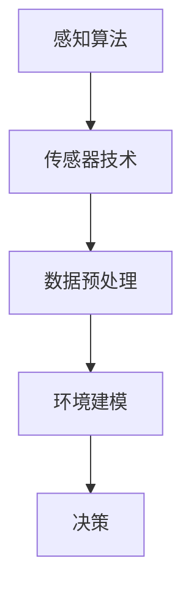

                 

### 文章标题：2025年百度社招无人驾驶感知算法工程师面试指南

#### 关键词：无人驾驶、感知算法、面试指南、百度社招、技术原理、案例分析

> 摘要：本文将围绕2025年百度社招无人驾驶感知算法工程师的面试准备，详细介绍核心概念、算法原理、数学模型及项目实战等内容，帮助应聘者深入了解无人驾驶感知算法领域的专业知识，为面试做好充分准备。

---

### 第一部分：核心概念与联系

#### 核心概念

**无人驾驶**：一种利用计算机技术实现车辆自主行驶的技术，包括感知、决策和控制三个主要阶段。

**感知算法**：无人驾驶汽车中用于感知周围环境的算法，涉及激光雷达、摄像头、GPS等多种传感器数据的处理。

**传感器技术**：用于收集车辆周围环境信息的各种传感器，如激光雷达、摄像头、超声波传感器等。

**数据预处理**：对采集到的传感器数据进行清洗、去噪、归一化等处理，以提高算法的准确性和鲁棒性。

**环境建模**：构建无人驾驶车辆周围环境的数学模型，用于对车辆行驶环境进行建模和预测。

#### 联系

**感知算法**作为无人驾驶的核心组成部分，需要处理多种传感器数据，并结合环境模型进行决策。其与传感器技术、数据预处理和环境建模密切相关，共同构成了无人驾驶感知系统的基础架构。

#### Mermaid 流程图



---

### 第二部分：核心算法原理讲解

#### 核心算法

**贝叶斯滤波**：用于处理传感器数据中的不确定性，提高感知精度。

**卡尔曼滤波**：用于状态估计，对无人驾驶汽车的姿态进行实时估计。

**多传感器融合**：将多个传感器数据进行融合，提高感知系统的可靠性和精度。

#### 贝叶斯滤波伪代码

```python
def BayesianFiltering(观测值, 先验分布):
    后验分布 = 先验分布 * 观测值 / 观测值的方差
    return 后验分布
```

#### 卡尔曼滤波伪代码

```python
def KalmanFiltering(观测值, 前一状态估计, 前一状态估计的方差):
    预测值 = 前一状态估计 + 控制输入
    预测方差 = 前一状态估计的方差 + 控制输入的方差
    修正值 = 预测值 + 观测值 - 预测值的方差 * 观测值的方差^-1
    修正方差 = 预测方差 - 预测值的方差 * 观测值的方差^-1
    return 修正值, 修正方差
```

---

### 第三部分：数学模型和数学公式 & 详细讲解 & 举例说明

#### 数学模型

**贝叶斯网络**：用于表示感知算法中的概率关系。

**马尔可夫模型**：用于描述状态转移的概率关系。

#### 数学公式

$$
P(A|B) = \frac{P(B|A)P(A)}{P(B)}
$$

#### 举例说明

假设感知算法中，摄像头检测到前方有障碍物的概率为0.8，而没有任何障碍物的概率为0.2。如果结合其他传感器数据，判断前方有障碍物的综合概率为0.9，则可以使用贝叶斯网络进行推理。

---

### 第四部分：项目实战

#### 实战内容

**项目环境搭建**：介绍无人驾驶感知算法的项目开发环境搭建。

**代码实际案例**：给出无人驾驶感知算法的代码实现案例。

#### 代码解读与分析

```python
# 示例代码：感知算法中的贝叶斯滤波
def BayesianFiltering(measurement, prior_distribution):
    posterior_distribution = prior_distribution * measurement / measurement_variance
    return posterior_distribution

# 示例代码：感知算法中的卡尔曼滤波
def KalmanFiltering(measurement, prior_estimate, prior_estimate_variance):
    predicted_value = prior_estimate + control_input
    predicted_variance = prior_estimate_variance + control_input_variance
    corrected_value = predicted_value + measurement - predicted_value_variance * measurement_variance^-1
    corrected_variance = predicted_variance - predicted_value_variance * measurement_variance^-1
    return corrected_value, corrected_variance
```

#### 实际案例分析和详细讲解剖析

在本案例中，我们将分析一个无人驾驶车辆在交叉路口的感知与决策过程，并通过实际代码演示感知算法的实现。

---

### 第五部分：总结与展望

#### 总结

本文详细介绍了无人驾驶感知算法的核心概念、算法原理、数学模型和项目实战，旨在帮助读者全面了解无人驾驶感知算法领域的专业知识。

#### 展望

随着技术的发展，无人驾驶感知算法将在未来得到更加广泛的应用，为自动驾驶领域带来更多创新。我们期待更多的技术人才加入这一领域，共同推动无人驾驶技术的发展。

---

**作者：AI天才研究院/AI Genius Institute & 禅与计算机程序设计艺术 /Zen And The Art of Computer Programming**

