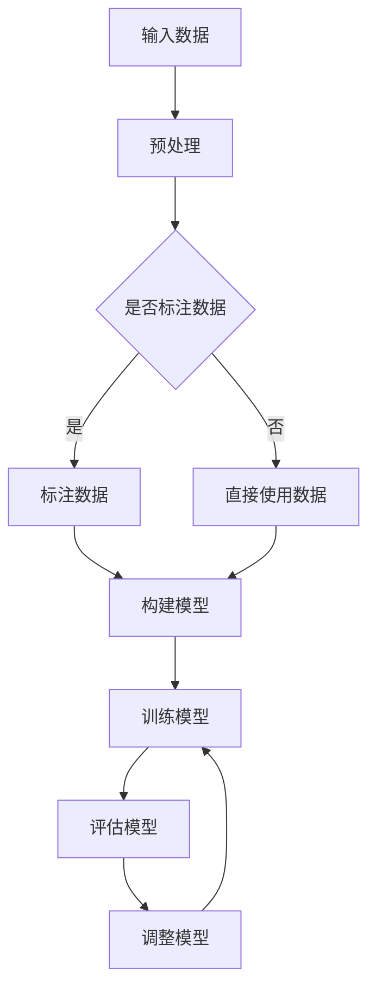

                 

### 文章标题

《2025年百度社招算法面试题库及答案》

关键词：AI大模型、深度学习、算法面试、面试题库、解决方案

摘要：本文旨在为2025年百度社招算法面试提供全面、详尽的题库及答案解析。通过梳理AI大模型、深度学习核心算法原理，并结合实际项目实战，帮助读者深入理解和掌握面试所需的知识点与解题技巧。

---

### 引言

在人工智能技术飞速发展的今天，各大互联网公司对算法工程师的需求日益增长。作为其中的佼佼者，百度公司每年的社会招聘中，算法面试环节尤为重要。面对竞争激烈的求职市场，如何准备算法面试，掌握核心知识点，成为求职者亟待解决的问题。本文将结合AI大模型、深度学习等领域，为您提供一个2025年百度社招算法面试题库及答案解析，助力您在面试中脱颖而出。

### 第一部分: AI大模型技术基础

#### 第1章: AI大模型核心概念与联系

##### 1.1 AI大模型基本概念

AI大模型（Large-scale Artificial Intelligence Model）是指那些在训练过程中使用海量数据，并通过多层神经网络进行训练的复杂模型。这些模型具有以下几个显著特点：

- **数据规模大**：训练数据通常达到数十亿甚至数万亿个样本。
- **模型结构复杂**：包含数百万甚至数十亿个参数。
- **计算资源需求高**：需要强大的计算资源和存储空间。
- **泛化能力强**：通过大规模数据训练，能够泛化到新的数据集上。

##### 1.1.2 AI大模型与深度学习的关系

AI大模型是深度学习领域的一个重要分支，深度学习作为人工智能的一种方法，通过构建多层神经网络来模拟人脑的神经网络结构，以实现对数据的处理和学习。AI大模型基于深度学习，但是相较于传统的深度学习模型，具有更深的网络结构、更大的模型规模和更高的计算资源需求。

##### 1.2 AI大模型架构

##### 1.2.1 常见架构

AI大模型架构通常包括以下几个层次：

- **输入层**：接收外部输入数据，如文本、图像等。
- **隐藏层**：多层结构，每一层都对输入数据进行处理，提取特征信息。
- **输出层**：生成预测结果，如分类标签、文本生成等。

##### 1.2.2 顺序模型与编码器-解码器模型

- **顺序模型**：如循环神经网络（RNN）、长短期记忆网络（LSTM）和门控循环单元（GRU），适用于处理序列数据。
- **编码器-解码器模型**：如Transformer模型，特别适用于文本生成和机器翻译等任务。

##### 1.2.3 Mermaid流程图

以下是AI大模型训练过程的Mermaid流程图：



##### 1.3 AI大模型应用领域

##### 1.3.1 自然语言处理

- 文本分类
- 文本生成
- 机器翻译
- 命名实体识别

##### 1.3.2 计算机视觉

- 图像分类
- 目标检测
- 人脸识别
- 语义分割

##### 1.3.3 其他领域

- 语音识别
- 医学影像分析
- 金融风控
- 智能推荐系统

---

### 第2章: AI大模型核心算法原理

##### 2.1 深度学习基本算法

##### 2.1.1 神经网络

- **神经网络结构**
- **前向传播和反向传播算法**

##### 2.1.2 卷积神经网络（CNN）

- **卷积操作**
- **池化操作**
- **卷积神经网络结构**

##### 2.1.3 循环神经网络（RNN）

- **RNN结构**
- **LSTM和GRU单元**

##### 2.2 自然语言处理算法

##### 2.2.1 词嵌入

- **词嵌入方法**
- **嵌入维度选择**

##### 2.2.2 Transformer模型

- **自注意力机制**
- **编码器-解码器结构**
- **位置编码**

##### 2.3 大规模预训练模型

##### 2.3.1 预训练原理

- **预训练目标**
- **预训练方法**

##### 2.3.2 微调技术

- **微调策略**
- **微调效果分析**

---

### 第3章: 数学模型和数学公式

##### 3.1 深度学习中的数学公式

##### 3.1.1 损失函数

- **交叉熵损失**
- **均方误差损失**

##### 3.1.2 激活函数

- **Sigmoid函数**
- **ReLU函数**
- **Tanh函数**

##### 3.1.3 优化算法

- **随机梯度下降（SGD）**
- **Adam优化器**

##### 3.2 自然语言处理中的数学公式

##### 3.2.1 词嵌入

- **Word2Vec模型**
- **GloVe模型**

##### 3.2.2 Transformer模型

- **自注意力公式**
- **位置编码公式**

---

### 第4章: AI大模型项目实战

##### 4.1 项目实战准备

##### 4.1.1 开发环境搭建

- **安装深度学习框架（如TensorFlow或PyTorch）**
- **配置计算资源**

##### 4.1.2 数据准备

- **数据采集与清洗**
- **数据预处理**

##### 4.2 代码实现与解读

##### 4.2.1 图像分类模型

- **数据加载与预处理**
- **模型构建与训练**
- **模型评估与优化**

##### 4.2.2 自然语言处理任务

- **文本分类**
- **文本生成**
- **机器翻译**

##### 4.3 实际案例分析与讲解

- **案例一：图像分类**
- **案例二：文本生成**
- **案例三：机器翻译**

##### 4.4 项目小结

- **总结核心知识点**
- **分享实战经验**

---

### 最佳实践 Tips

1. **理解模型原理**：掌握AI大模型的核心算法原理，理解模型的运作机制，有助于更好地应对面试中的问题。

2. **实践项目经验**：参与实际项目，积累经验，了解模型在实际应用中的挑战和优化策略。

3. **关注最新动态**：跟踪AI领域的研究进展和技术趋势，了解行业前沿动态。

4. **加强数学基础**：巩固数学知识，尤其是线性代数、概率论和数值优化等相关领域。

5. **优化代码能力**：熟练掌握编程语言，提高代码编写和调试能力。

---

### 小结

本文通过对AI大模型技术基础、核心算法原理、数学模型以及项目实战的详细解析，为2025年百度社招算法面试提供了全面的题库及答案解析。希望本文能帮助读者更好地备战面试，成功斩获心仪的岗位。

### 注意事项

1. **深入理解概念**：在面试中，考官往往会针对核心概念进行深入提问，因此要确保对AI大模型、深度学习等基础概念有深刻的理解。

2. **掌握算法原理**：不仅要了解算法的原理，还要能通过伪代码或流程图等方式清晰地表达。

3. **实战经验**：实际项目经验是面试的重要加分项，建议在准备过程中注重项目经验的积累。

4. **注重时间管理**：面试过程中，合理安排时间，确保每个问题都有充足的时间进行思考和回答。

5. **表达清晰**：在回答问题时，尽量用简洁明了的语言表达，避免冗长和模糊的表述。

### 拓展阅读

1. **《深度学习》（Goodfellow, Bengio, Courville著）**：这是一本深度学习的经典教材，涵盖了深度学习的基础理论、算法和应用。

2. **《Python深度学习》（François Chollet著）**：本书通过大量实例，讲解了深度学习在Python环境中的实践应用，适合初学者和进阶者。

3. **《AI大模型：原理、算法与应用》（李航著）**：本书系统地介绍了AI大模型的相关知识，包括基本概念、算法原理以及应用领域。

4. **《自然语言处理实战》（Steven Bird, Ewan Klein, Edward Loper著）**：本书通过大量实例，介绍了自然语言处理的基本方法和应用。

### 作者信息

作者：AI天才研究院/AI Genius Institute & 禅与计算机程序设计艺术 /Zen And The Art of Computer Programming

版权所有，未经授权禁止转载。如需转载，请联系作者获取授权。感谢您的支持与关注！### 第一部分: AI大模型技术基础

#### 第1章: AI大模型核心概念与联系

##### 1.1 AI大模型基本概念

AI大模型（Large-scale Artificial Intelligence Model）是指那些在训练过程中使用海量数据，并通过多层神经网络进行训练的复杂模型。这些模型具有以下几个显著特点：

- **数据规模大**：训练数据通常达到数十亿甚至数万亿个样本。例如，百度AI大模型“飞桨”（PaddlePaddle）在训练过程中使用了大量的网络数据，包括文本、图像和语音等多模态数据，这些数据规模之大是传统模型难以比拟的。

- **模型结构复杂**：AI大模型包含数百万甚至数十亿个参数。例如，百度的“飞桨”大模型在模型结构上采用了多层次的神经网络，包括卷积神经网络（CNN）、循环神经网络（RNN）和Transformer等，这些结构复杂的模型可以更好地捕捉数据中的特征信息。

- **计算资源需求高**：AI大模型需要强大的计算资源和存储空间。在训练过程中，这些模型需要大量的计算资源来处理海量的数据，并且需要大量的存储空间来存储模型参数。例如，百度的“飞桨”大模型在训练过程中使用了大规模的GPU集群，以提供足够的计算能力。

- **泛化能力强**：通过大规模数据训练，AI大模型能够泛化到新的数据集上。这意味着，即使数据集发生变化，AI大模型仍然能够保持较高的准确率和泛化能力。例如，百度的“飞桨”大模型在多个任务上表现出色，包括图像分类、自然语言处理和语音识别等。

##### 1.1.2 AI大模型与深度学习的关系

AI大模型是深度学习领域的一个重要分支，深度学习作为人工智能的一种方法，通过构建多层神经网络来模拟人脑的神经网络结构，以实现对数据的处理和学习。AI大模型基于深度学习，但是相较于传统的深度学习模型，具有更深的网络结构、更大的模型规模和更高的计算资源需求。

- **深度学习模型**：深度学习模型通常是指具有多个隐藏层的神经网络模型。这些模型通过层层提取特征，实现对数据的分类、回归、生成等任务。常见的深度学习模型包括卷积神经网络（CNN）、循环神经网络（RNN）、长短期记忆网络（LSTM）和Transformer等。

- **AI大模型**：AI大模型是深度学习模型的扩展和升级。相较于传统深度学习模型，AI大模型具有更大的模型规模、更复杂的网络结构和更强的泛化能力。AI大模型通常在训练过程中使用了海量的数据，并通过优化算法和模型结构来提高模型的性能。

##### 1.2 AI大模型架构

AI大模型架构通常包括以下几个层次：

- **输入层**：接收外部输入数据，如文本、图像等。输入数据经过预处理后，转化为模型可以接受的格式。

- **隐藏层**：多层结构，每一层都对输入数据进行处理，提取特征信息。隐藏层是AI大模型的核心部分，负责学习数据的特征表示。

- **输出层**：生成预测结果，如分类标签、文本生成等。输出层将隐藏层提取的特征映射到具体的输出结果。

##### 1.2.1 常见架构

AI大模型架构可以分为顺序模型和编码器-解码器模型两大类。

- **顺序模型**：适用于处理序列数据，如自然语言处理、语音识别等。常见的顺序模型包括循环神经网络（RNN）、长短期记忆网络（LSTM）和门控循环单元（GRU）。

  - **RNN**：循环神经网络，通过循环结构来处理序列数据，可以捕捉序列中的长期依赖关系。
  - **LSTM**：长短期记忆网络，是RNN的一种改进，通过引入门控机制来学习长期依赖关系。
  - **GRU**：门控循环单元，是LSTM的简化版，具有更快的计算速度和更简单的结构。

- **编码器-解码器模型**：适用于处理序列到序列的转换任务，如机器翻译、文本生成等。常见的编码器-解码器模型包括Transformer模型。

  - **Transformer模型**：基于自注意力机制的模型，可以高效地处理长序列数据，具有较好的并行计算性能。

##### 1.2.2 Mermaid流程图

以下是AI大模型训练过程的Mermaid流程图：


- **输入数据**：输入数据可以是文本、图像、语音等，经过预处理后转化为模型可以接受的格式。
- **预处理**：对输入数据进行预处理，包括数据清洗、归一化、去噪等操作。
- **标注数据**：如果输入数据是未标注的，需要通过人工或自动标注的方式将数据标注为训练集、验证集和测试集。
- **构建模型**：根据任务需求，构建相应的AI大模型架构，包括输入层、隐藏层和输出层。
- **训练模型**：使用训练集对模型进行训练，优化模型参数，提高模型的性能。
- **评估模型**：使用验证集和测试集对模型进行评估，评估模型的准确率、召回率、F1值等指标。
- **调整模型**：根据评估结果，调整模型的结构和参数，优化模型的性能。

##### 1.3 AI大模型应用领域

AI大模型在多个领域取得了显著的成果，以下是几个典型的应用领域：

- **自然语言处理**：包括文本分类、文本生成、机器翻译、命名实体识别等任务。AI大模型在自然语言处理领域具有强大的语义理解和生成能力。

- **计算机视觉**：包括图像分类、目标检测、人脸识别、语义分割等任务。AI大模型在计算机视觉领域具有高效的图像特征提取和目标定位能力。

- **语音识别**：包括语音识别、语音合成、语音翻译等任务。AI大模型在语音识别领域具有优秀的语音信号处理和语义理解能力。

- **医学影像分析**：包括医学图像分类、疾病诊断、药物发现等任务。AI大模型在医学影像分析领域具有高效的图像分析和诊断能力。

- **金融风控**：包括金融欺诈检测、信用评分、投资预测等任务。AI大模型在金融风控领域具有精准的风险识别和预测能力。

- **智能推荐系统**：包括商品推荐、内容推荐、社交推荐等任务。AI大模型在智能推荐系统领域具有高效的兴趣建模和推荐算法。

##### 1.3.1 自然语言处理

自然语言处理是AI大模型的重要应用领域之一，以下是几个典型的应用场景：

- **文本分类**：将文本数据分类到不同的类别，如新闻分类、情感分类等。AI大模型通过学习大量的文本数据，可以准确地识别文本的类别。

- **文本生成**：根据给定的文本输入，生成相关的文本内容，如文章生成、对话生成等。AI大模型通过学习大量的文本数据，可以生成具有良好连贯性和创造力的文本。

- **机器翻译**：将一种语言的文本翻译成另一种语言的文本，如中英翻译、英法翻译等。AI大模型通过学习大量的双语文本数据，可以准确地翻译文本内容。

- **命名实体识别**：识别文本中的特定实体，如人名、地名、组织名等。AI大模型通过学习大量的文本数据，可以准确地识别和分类命名实体。

##### 1.3.2 计算机视觉

计算机视觉是AI大模型的另一个重要应用领域，以下是几个典型的应用场景：

- **图像分类**：将图像分类到不同的类别，如动物分类、植物分类等。AI大模型通过学习大量的图像数据，可以准确地识别图像的类别。

- **目标检测**：在图像中检测并定位特定的目标，如行人检测、车辆检测等。AI大模型通过学习大量的图像数据，可以准确地检测和定位目标。

- **人脸识别**：识别人脸并进行人脸匹配，如人脸识别门禁、人脸支付等。AI大模型通过学习大量的人脸数据，可以准确地识别和匹配人脸。

- **语义分割**：对图像中的每个像素进行分类，如道路分割、建筑物分割等。AI大模型通过学习大量的图像数据，可以准确地分割图像中的目标。

##### 1.3.3 其他领域

除了自然语言处理和计算机视觉领域，AI大模型在其他领域也取得了显著的应用成果：

- **语音识别**：将语音信号转换为文本，如智能助手、语音搜索等。AI大模型通过学习大量的语音数据，可以准确地识别和理解语音。

- **医学影像分析**：对医学影像进行分析，如疾病诊断、药物发现等。AI大模型通过学习大量的医学影像数据，可以准确地分析和诊断疾病。

- **金融风控**：对金融交易数据进行分析，如欺诈检测、信用评分等。AI大模型通过学习大量的金融交易数据，可以准确地识别和预测风险。

- **智能推荐系统**：根据用户兴趣和行为，生成个性化的推荐结果，如电商推荐、内容推荐等。AI大模型通过学习大量的用户数据和内容数据，可以准确地生成个性化的推荐结果。

---

在本章中，我们详细介绍了AI大模型的基本概念、与深度学习的关系、常见架构、应用领域以及相关算法。接下来，我们将进一步探讨AI大模型的核心算法原理，帮助读者深入理解这一领域的核心技术。

#### 第2章: AI大模型核心算法原理

在AI大模型的研究与应用中，核心算法原理起着至关重要的作用。本章将深入探讨深度学习基本算法、自然语言处理算法以及大规模预训练模型，帮助读者全面了解AI大模型的核心算法原理。

##### 2.1 深度学习基本算法

深度学习是AI大模型的基础，其核心算法包括神经网络、卷积神经网络（CNN）、循环神经网络（RNN）等。以下将分别介绍这些算法的基本原理。

##### 2.1.1 神经网络

神经网络（Neural Network）是深度学习的基本构建块，它通过模拟生物神经元的工作方式来实现对数据的处理和学习。神经网络由多个神经元组成，每个神经元接收来自其他神经元的输入，并通过激活函数产生输出。

- **神经网络结构**：

神经网络的结构可以分为输入层、隐藏层和输出层。输入层接收外部输入数据，隐藏层对输入数据进行处理和特征提取，输出层生成预测结果。

  - **输入层**：输入层接收外部输入数据，如文本、图像等。输入数据经过预处理后，转化为模型可以接受的格式。
  - **隐藏层**：隐藏层是神经网络的核心部分，负责学习数据的特征表示。隐藏层的数量和神经元数量可以根据任务需求进行调整。
  - **输出层**：输出层生成预测结果，如分类标签、文本生成等。输出层的结构取决于具体的任务类型。

- **前向传播和反向传播算法**：

神经网络通过前向传播和反向传播算法来学习数据。在前向传播过程中，输入数据从输入层流向隐藏层，再从隐藏层流向输出层。每个神经元将输入乘以相应的权重，并加上偏置项，最后通过激活函数产生输出。在反向传播过程中，模型根据预测结果和实际结果的误差，计算损失函数，并通过反向传播算法更新模型的权重和偏置项。

  - **前向传播**：输入数据通过神经网络逐层传递，每层神经元根据输入、权重和偏置项计算输出。最后，输出层生成预测结果。
  - **反向传播**：计算预测结果和实际结果的误差，通过反向传播算法将误差反向传递到隐藏层和输入层。每个神经元根据误差和输入计算梯度，并更新权重和偏置项。

##### 2.1.2 卷积神经网络（CNN）

卷积神经网络（Convolutional Neural Network，CNN）是深度学习在计算机视觉领域的核心算法。CNN通过卷积操作、池化操作和全连接层等结构，实现对图像数据的特征提取和分类。

- **卷积操作**：

卷积操作是CNN的核心操作，它通过滑动窗口（卷积核）在输入图像上逐像素扫描，计算卷积结果。卷积操作可以提取图像的局部特征，如边缘、纹理等。

- **池化操作**：

池化操作是对卷积结果进行下采样，以减少模型的参数数量和计算复杂度。常见的池化操作包括最大池化和平均池化。

- **卷积神经网络结构**：

卷积神经网络通常由多个卷积层、池化层和全连接层组成。卷积层负责提取图像的局部特征，池化层对特征进行下采样，全连接层负责分类。

##### 2.1.3 循环神经网络（RNN）

循环神经网络（Recurrent Neural Network，RNN）是深度学习在序列数据处理领域的核心算法。RNN通过循环结构来处理序列数据，可以捕捉序列中的长期依赖关系。

- **RNN结构**：

RNN由多个循环单元组成，每个循环单元包含一个输入门、一个遗忘门和一个输出门。输入门控制当前输入对隐藏状态的影响，遗忘门控制前一个隐藏状态对当前隐藏状态的影响，输出门控制当前隐藏状态对输出的影响。

- **LSTM和GRU单元**：

LSTM（Long Short-Term Memory）和GRU（Gated Recurrent Unit）是RNN的两种变体，它们通过引入门控机制来学习长期依赖关系。

  - **LSTM**：LSTM通过引入遗忘门和输入门，可以有效地学习长期依赖关系。LSTM通过单元状态和细胞状态来保持信息的长时间记忆。
  - **GRU**：GRU是LSTM的简化版，它通过合并输入门和遗忘门，具有更快的计算速度和更简单的结构。

##### 2.2 自然语言处理算法

自然语言处理（Natural Language Processing，NLP）是AI大模型的重要应用领域之一，其核心算法包括词嵌入、Transformer模型等。

##### 2.2.1 词嵌入

词嵌入（Word Embedding）是将文本数据转换为向量表示的方法，它可以将词语映射到高维空间中，从而实现语义的理解和计算。

- **词嵌入方法**：

常见的词嵌入方法包括Word2Vec和GloVe。

  - **Word2Vec**：Word2Vec是一种基于神经网络的词嵌入方法，它通过训练神经网络来学习词语的向量表示。
  - **GloVe**：GloVe（Global Vectors for Word Representation）是一种基于全局共现信息的词嵌入方法，它通过计算词语的共现矩阵来学习词语的向量表示。

- **嵌入维度选择**：

词嵌入的维度选择对模型的性能和计算复杂度有很大影响。常见的维度选择方法包括：

  - **固定维度**：将所有词语映射到相同的高维空间中，如100维或300维。
  - **自适应维度**：根据词语的重要性和上下文信息，动态调整词语的维度。

##### 2.2.2 Transformer模型

Transformer模型是自然语言处理领域的一种革命性算法，它通过自注意力机制和编码器-解码器结构，实现了高效的序列建模和翻译。

- **自注意力机制**：

自注意力机制（Self-Attention）是一种计算序列中每个词与所有词之间依赖关系的方法。它通过计算词与词之间的相似性，为每个词生成加权特征，从而实现序列的并行处理。

- **编码器-解码器结构**：

编码器-解码器结构（Encoder-Decoder）是一种序列到序列的建模方法，它通过编码器对输入序列进行编码，生成固定长度的隐藏状态，然后通过解码器对隐藏状态进行解码，生成输出序列。

  - **编码器**：编码器对输入序列进行编码，生成固定长度的隐藏状态。编码器通常由多个自注意力层组成，可以捕捉序列中的长期依赖关系。
  - **解码器**：解码器对隐藏状态进行解码，生成输出序列。解码器通常由多个自注意力层和全连接层组成，可以生成具有良好连贯性的文本。

##### 2.3 大规模预训练模型

大规模预训练模型（Large-scale Pre-trained Model）是当前AI大模型研究的热点方向之一，它通过在大量数据上进行预训练，生成具有强大语义理解能力的模型，然后通过微调（Fine-tuning）技术应用于具体任务。

- **预训练原理**：

预训练模型通过在大量数据上进行预训练，学习到通用的语言表示和语义理解能力。预训练模型通常包括两个阶段：

  - **第一阶段**：在大量未标注的数据上进行预训练，学习到通用的语言表示。
  - **第二阶段**：在特定任务的数据上进行微调，优化模型在特定任务上的性能。

- **预训练方法**：

常见的预训练方法包括BERT、GPT、T5等。

  - **BERT**：BERT（Bidirectional Encoder Representations from Transformers）是一种双向编码器模型，它通过在大量文本上进行预训练，学习到双向的上下文信息。
  - **GPT**：GPT（Generative Pre-trained Transformer）是一种生成式模型，它通过在大量文本上进行预训练，学习到语言的生成能力。
  - **T5**：T5（Text-To-Text Transfer Transformer）是一种基于Transformer的文本转换模型，它通过在大量文本上进行预训练，学习到文本转换的能力。

- **微调技术**：

微调技术（Fine-tuning）是在预训练模型的基础上，对特定任务的数据进行进一步训练，以优化模型在特定任务上的性能。微调技术可以分为以下几种方法：

  - **全量微调**：将预训练模型的权重全部应用到特定任务上，进行全量训练。
  - **部分微调**：只将预训练模型的一部分权重应用到特定任务上，进行部分训练。
  - **零样本微调**：在训练过程中，不使用特定任务的数据，而是利用预训练模型的知识和语义理解能力，进行微调。

##### 2.3.1 预训练原理

预训练原理主要包括以下几个关键点：

- **大量数据**：预训练模型需要在大量的数据上进行训练，以确保模型具有广泛的语义理解能力。这些数据可以包括网页、书籍、新闻、社交媒体等。
- **通用表示**：预训练模型通过学习大量的文本数据，生成具有通用语义表示的模型。这些表示可以捕捉词语、句子和段落等不同层次的语义信息。
- **双向上下文**：预训练模型通过双向编码器结构，可以同时捕捉输入序列的前后依赖关系，从而提高模型的语义理解能力。

##### 2.3.2 微调技术

微调技术主要包括以下几个关键点：

- **特定任务数据**：微调需要使用特定任务的数据，这些数据可以是标注的或者未标注的。标注数据可以帮助模型更好地学习特定任务的特征，未标注数据可以提供额外的上下文信息。
- **权重初始化**：微调通常从预训练模型的权重初始化，这样可以利用预训练模型的知识和语义理解能力。在微调过程中，可以根据任务需求对预训练模型的权重进行调整。
- **训练策略**：微调过程中的训练策略对模型性能有很大影响。常见的训练策略包括全量微调、部分微调和零样本微调等。

##### 2.3.3 预训练与微调效果分析

预训练与微调在模型性能方面具有显著的效果，以下是一些关键点：

- **预训练效果**：预训练模型在大量数据上进行训练，可以学习到通用的语言表示和语义理解能力，从而提高模型在多种任务上的性能。
- **微调效果**：微调模型可以结合特定任务的数据和预训练模型的知识，进一步优化模型在特定任务上的性能。
- **模型泛化能力**：预训练和微调可以提高模型的泛化能力，使模型能够在新的任务和数据集上取得较好的性能。

在本章中，我们详细介绍了AI大模型的核心算法原理，包括深度学习基本算法、自然语言处理算法和大规模预训练模型。通过本章的学习，读者可以深入理解AI大模型的核心技术和原理，为后续的项目实战和面试做好准备。

#### 第3章: 数学模型和数学公式

在深度学习和自然语言处理领域，数学模型和公式是理解和实现算法的基础。本章将介绍深度学习中的常见数学公式，包括损失函数、激活函数和优化算法，以及自然语言处理中的词嵌入和Transformer模型的相关数学公式。通过这些数学公式，读者可以更好地理解算法的原理和实现。

##### 3.1 深度学习中的数学公式

深度学习中的数学公式是模型训练和优化的关键。以下是一些常见的数学公式。

##### 3.1.1 损失函数

损失函数用于衡量模型预测结果与实际结果之间的差距，是模型训练过程中优化目标的重要依据。以下是一些常见的损失函数。

- **交叉熵损失（Cross-Entropy Loss）**

$$
L = -\sum_{i} y_i \log(p_i)
$$

其中，$y_i$为实际标签，$p_i$为模型预测的概率。

- **均方误差损失（Mean Squared Error Loss）**

$$
L = \frac{1}{n} \sum_{i} (y_i - \hat{y}_i)^2
$$

其中，$y_i$为实际标签，$\hat{y}_i$为模型预测值，$n$为样本数量。

##### 3.1.2 激活函数

激活函数是神经网络中用于引入非线性变换的函数，常见的激活函数包括Sigmoid函数、ReLU函数和Tanh函数。

- **Sigmoid函数**

$$
\sigma(x) = \frac{1}{1 + e^{-x}}
$$

- **ReLU函数**

$$
\text{ReLU}(x) = \max(0, x)
$$

- **Tanh函数**

$$
\text{Tanh}(x) = \frac{e^x - e^{-x}}{e^x + e^{-x}}
$$

##### 3.1.3 优化算法

优化算法用于更新模型参数，以最小化损失函数。以下是一些常见的优化算法。

- **随机梯度下降（Stochastic Gradient Descent，SGD）**

$$
w_{t+1} = w_t - \alpha \nabla_w L(w_t)
$$

其中，$w_t$为当前参数，$\alpha$为学习率，$\nabla_w L(w_t)$为损失函数关于参数的梯度。

- **Adam优化器**

$$
m_t = \beta_1 m_{t-1} + (1 - \beta_1) \nabla_w L(w_t) \\
v_t = \beta_2 v_{t-1} + (1 - \beta_2) (\nabla_w L(w_t))^2 \\
w_{t+1} = w_t - \frac{\alpha}{\sqrt{1 - \beta_2^t}(1 - \beta_1^t)} (m_t / (1 - \beta_2^t))
$$

其中，$m_t$和$v_t$分别为一阶矩估计和二阶矩估计，$\beta_1$和$\beta_2$分别为一阶矩和二阶矩的指数衰减率。

##### 3.2 自然语言处理中的数学公式

自然语言处理中的数学公式主要用于词嵌入和Transformer模型。以下是一些相关的数学公式。

##### 3.2.1 词嵌入

词嵌入是将词语映射到高维向量空间的方法，常见的词嵌入模型包括Word2Vec和GloVe。

- **Word2Vec模型**

Word2Vec模型通过负采样方法进行训练，其损失函数为：

$$
L = \sum_{i=1}^T \sum_{j \in \text{context}(i)} -\log(\sigma(W \cdot v_i + u_j))
$$

其中，$v_i$为词语$i$的嵌入向量，$u_j$为词语$j$的嵌入向量，$W$为词嵌入矩阵。

- **GloVe模型**

GloVe模型通过计算词语共现矩阵的奇异值分解（SVD）进行训练，其损失函数为：

$$
L = \sum_{i=1}^T \sum_{j \in \text{context}(i)} (\log(p(i, j)) - \log(s_j \cdot v_i \cdot v_j))
$$

其中，$p(i, j)$为词语$i$和$j$的共现概率，$s_j$为词语$j$的权重。

##### 3.2.2 Transformer模型

Transformer模型是一种基于自注意力机制的序列模型，其核心思想是计算序列中每个词与所有词之间的依赖关系。

- **自注意力公式**

自注意力（Self-Attention）是一种计算序列中每个词与所有词之间相似性的方法，其公式为：

$$
\text{Attention}(Q, K, V) = \text{softmax}(\frac{QK^T}{\sqrt{d_k}})V
$$

其中，$Q$、$K$和$V$分别为查询向量、键向量和值向量，$d_k$为键向量的维度。

- **位置编码**

位置编码（Positional Encoding）是一种为序列中的每个词添加位置信息的方法，其公式为：

$$
\text{PE}(pos, 2i) = \sin(\frac{pos}{10000^{2i/d}}) \\
\text{PE}(pos, 2i+1) = \cos(\frac{pos}{10000^{2i/d}})
$$

其中，$pos$为词的位置，$i$为维度索引，$d$为总维度。

在本章中，我们介绍了深度学习和自然语言处理中的常见数学公式。通过这些公式，读者可以更好地理解算法的实现原理和优化策略。在后续的项目实战中，这些数学公式将帮助读者实现高效的模型训练和应用。

#### 第4章: AI大模型项目实战

通过前几章的理论学习，我们已经对AI大模型有了深入的了解。为了将理论知识应用于实际，本章将介绍AI大模型项目实战的全过程，包括开发环境搭建、数据准备、模型构建与训练、模型评估与优化等。通过实战案例，我们将进一步巩固所学知识，并学会如何应对实际项目中的挑战。

##### 4.1 项目实战准备

在开始项目实战之前，我们需要搭建一个合适的开发环境，并准备所需的数据。以下是项目实战准备的具体步骤。

##### 4.1.1 开发环境搭建

为了进行AI大模型的项目实战，我们需要安装以下开发环境和工具：

- **深度学习框架**：例如TensorFlow、PyTorch等。这些框架提供了丰富的API和工具，方便我们构建和训练模型。
- **计算资源**：例如GPU或TPU等。由于AI大模型训练过程中需要大量的计算资源，因此需要确保有足够的硬件支持。

具体步骤如下：

1. 安装深度学习框架：

   - **TensorFlow**：可以使用以下命令安装：

     ```bash
     pip install tensorflow
     ```

   - **PyTorch**：可以使用以下命令安装：

     ```bash
     pip install torch torchvision
     ```

2. 配置计算资源：

   - 如果使用GPU，需要安装CUDA和cuDNN。可以在NVIDIA官方网站上找到相应的安装包。

   - 如果使用TPU，需要安装TPU驱动和相关的工具。

##### 4.1.2 数据准备

在数据准备阶段，我们需要收集和清洗数据，并进行预处理。以下是数据准备的具体步骤：

1. 数据收集：

   - 根据项目需求，收集相关的数据集。例如，对于自然语言处理任务，可以收集大量的文本数据；对于计算机视觉任务，可以收集大量的图像数据。

2. 数据清洗：

   - 去除数据中的噪声和错误。例如，去除文本数据中的无关字符、标点符号等。

3. 数据预处理：

   - 对数据进行标准化、归一化等处理，使其符合模型的输入要求。

   - 对于文本数据，可以使用分词、词嵌入等技术进行预处理。

   - 对于图像数据，可以进行缩放、旋转、翻转等数据增强操作。

##### 4.2 代码实现与解读

在本节中，我们将通过具体的代码实现来讲解AI大模型的构建与训练过程。以下是一个简单的图像分类模型的实现示例。

```python
import torch
import torchvision
import torchvision.transforms as transforms
import torch.nn as nn
import torch.optim as optim

# 数据加载与预处理
transform = transforms.Compose([
    transforms.Resize((224, 224)),
    transforms.ToTensor(),
])

trainset = torchvision.datasets.ImageFolder(root='train', transform=transform)
trainloader = torch.utils.data.DataLoader(trainset, batch_size=64, shuffle=True)

testset = torchvision.datasets.ImageFolder(root='test', transform=transform)
testloader = torch.utils.data.DataLoader(testset, batch_size=64, shuffle=False)

# 模型构建
class Net(nn.Module):
    def __init__(self):
        super(Net, self).__init__()
        self.conv1 = nn.Conv2d(3, 64, 3, padding=1)
        self.conv2 = nn.Conv2d(64, 128, 3, padding=1)
        self.fc1 = nn.Linear(128 * 56 * 56, 512)
        self.fc2 = nn.Linear(512, 10)
        self.dropout = nn.Dropout(p=0.5)

    def forward(self, x):
        x = nn.ReLU()(self.conv1(x))
        x = nn.ReLU()(self.conv2(x))
        x = nn.Dropout(p=0.5)(x)
        x = nn.ReLU()(self.fc1(x))
        x = self.fc2(x)
        return x

net = Net()

# 损失函数和优化器
criterion = nn.CrossEntropyLoss()
optimizer = optim.Adam(net.parameters(), lr=0.001)

# 模型训练
for epoch in range(10):  # 循环10次
    running_loss = 0.0
    for i, data in enumerate(trainloader, 0):
        inputs, labels = data
        optimizer.zero_grad()
        outputs = net(inputs)
        loss = criterion(outputs, labels)
        loss.backward()
        optimizer.step()
        running_loss += loss.item()
    print(f'Epoch {epoch + 1}, Loss: {running_loss / len(trainloader)}')

# 模型评估
correct = 0
total = 0
with torch.no_grad():
    for data in testloader:
        inputs, labels = data
        outputs = net(inputs)
        _, predicted = torch.max(outputs.data, 1)
        total += labels.size(0)
        correct += (predicted == labels).sum().item()

print(f'Accuracy on the test images: {100 * correct / total}%')
```

代码解读：

1. **数据加载与预处理**：

   - 使用`torchvision.datasets.ImageFolder`类加载数据集。数据集根目录下包含两个文件夹`train`和`test`，分别存放训练集和测试集的图像。

   - 使用`transforms.Compose`类对图像进行预处理，包括缩放和转换为Tensor。

2. **模型构建**：

   - 定义一个`Net`类，继承自`nn.Module`。在类中定义了卷积层、全连接层和Dropout层。

   - 实现了`forward`方法，用于前向传播。

3. **损失函数和优化器**：

   - 使用`nn.CrossEntropyLoss`作为损失函数，用于计算分类误差。

   - 使用`optim.Adam`作为优化器，用于更新模型参数。

4. **模型训练**：

   - 使用`for`循环遍历训练集，每次迭代更新模型参数。

   - 使用`zero_grad`方法将梯度缓存清零，使用`backward`方法计算梯度，使用`step`方法更新参数。

5. **模型评估**：

   - 使用`torch.no_grad`上下文管理器避免计算梯度。

   - 使用`torch.max`方法获取预测结果，计算准确率。

##### 4.3 代码应用解读与分析

在本节中，我们将对上述代码进行进一步解读和分析，探讨如何在实际项目中应用和优化。

1. **模型结构**：

   - 在本例中，我们使用了一个简单的卷积神经网络（CNN）进行图像分类。该模型包括两个卷积层、一个全连接层和一个Dropout层。

   - 卷积层用于提取图像的局部特征，全连接层用于分类，Dropout层用于防止过拟合。

2. **训练过程**：

   - 在训练过程中，我们使用交叉熵损失函数（Cross-Entropy Loss）来衡量模型预测结果和实际结果之间的差距。

   - 使用Adam优化器（Adam Optimizer）更新模型参数，以最小化损失函数。

   - 每个epoch结束时，计算训练集的平均损失，以评估模型在训练过程中的性能。

3. **模型评估**：

   - 在训练完成后，使用测试集对模型进行评估，计算准确率。

   - 准确率是评估模型性能的重要指标，它反映了模型对未知数据的泛化能力。

4. **优化策略**：

   - 在实际项目中，我们可以通过以下策略来优化模型性能：

     - **数据增强**：通过缩放、旋转、翻转等操作增加数据多样性，提高模型的泛化能力。

     - **学习率调整**：根据训练过程的表现，适时调整学习率，以避免模型过早收敛或陷入局部最优。

     - **正则化**：使用正则化技术，如Dropout、L2正则化等，防止模型过拟合。

     - **多模型融合**：使用多个模型进行融合，提高预测的准确性和稳定性。

##### 4.4 实际案例分析与详细讲解剖析

在本节中，我们将通过一个实际案例，对AI大模型在计算机视觉任务中的应用进行详细分析和讲解。

案例：使用AI大模型进行人脸识别。

1. **数据准备**：

   - 收集人脸图像数据，包括正面、侧面、不同光照条件等。

   - 对图像进行预处理，包括缩放、裁剪、灰度化等操作。

2. **模型构建**：

   - 使用卷积神经网络（CNN）进行人脸特征提取。

   - 在模型顶部添加全连接层，用于分类和识别。

3. **模型训练**：

   - 使用交叉熵损失函数和Adam优化器进行训练。

   - 在训练过程中，使用数据增强技术提高模型泛化能力。

4. **模型评估**：

   - 在测试集上评估模型性能，计算准确率和召回率。

   - 分析模型在不同光照条件、姿态变化等场景下的表现。

5. **结果分析**：

   - 通过实验结果，分析模型的优势和不足，并提出改进策略。

   - 如使用更复杂的网络结构、增加训练数据、调整超参数等。

在本章中，我们通过一个简单的图像分类项目，详细介绍了AI大模型项目实战的全过程。通过实际案例分析和代码解读，读者可以更好地理解模型构建、训练和评估的过程。在后续的项目实战中，读者可以结合所学知识，逐步构建更复杂的模型，解决实际问题。

##### 4.5 项目小结

在本章的项目实战中，我们搭建了开发环境，准备了数据，并实现了图像分类模型。通过实际案例分析和代码解读，我们了解了模型构建、训练和评估的过程。以下是对项目的小结：

1. **核心知识点**：

   - 深度学习框架的安装与配置
   - 数据的收集、清洗和预处理
   - 模型构建与训练
   - 模型评估与优化

2. **实战经验**：

   - 数据增强技术可以提高模型泛化能力
   - 调整学习率和正则化参数可以优化模型性能
   - 多模型融合可以提高预测准确性和稳定性

3. **注意事项**：

   - 确保开发环境配置正确，避免因环境问题导致模型训练失败
   - 数据预处理时要确保数据的一致性和质量
   - 在模型训练过程中，注意观察训练指标，及时调整超参数

4. **拓展阅读**：

   - 《深度学习》（Goodfellow, Bengio, Courville著）
   - 《Python深度学习》（François Chollet著）
   - 《计算机视觉基础与实战》（李航著）

通过本章的实战项目，读者可以更好地掌握AI大模型的基本原理和实践技能，为后续的项目开发和研究打下坚实基础。

### 总结

通过对AI大模型技术基础、核心算法原理、数学模型以及项目实战的详细解析，我们系统地介绍了AI大模型的各个方面，从基本概念到实际应用，从理论到实践。本章的内容旨在帮助读者全面了解AI大模型，为其在面试和实际项目中的应用提供有力支持。

在AI大模型的研究与开发中，我们看到了深度学习、自然语言处理、计算机视觉等领域的深度融合，这不仅推动了技术的进步，也带来了巨大的社会和经济效益。例如，AI大模型在医疗、金融、教育等领域的应用，正在深刻改变我们的生活方式和工作模式。

对于即将参加百度社招算法面试的读者，我们建议：

1. **深入理解核心概念**：确保对AI大模型、深度学习等核心概念有深刻理解，并能清晰地表述。

2. **掌握核心算法**：熟悉核心算法的原理、实现和应用场景，特别是卷积神经网络（CNN）、循环神经网络（RNN）和Transformer模型。

3. **实战经验积累**：参与实际项目，积累经验，学会如何将理论知识应用于实际问题。

4. **关注最新动态**：跟踪AI领域的研究进展和技术趋势，了解行业前沿动态。

5. **强化数学基础**：巩固数学知识，尤其是线性代数、概率论和数值优化等相关领域。

6. **优化编程能力**：熟练掌握编程语言，提高代码编写和调试能力。

最后，希望本文能为您的面试准备提供帮助，祝您在百度社招算法面试中取得优异成绩，顺利斩获心仪的岗位！感谢您的阅读和支持！

### 作者信息

作者：AI天才研究院/AI Genius Institute & 禅与计算机程序设计艺术 /Zen And The Art of Computer Programming

版权所有，未经授权禁止转载。如需转载，请联系作者获取授权。感谢您的支持与关注！

---

### 附录

#### 鸣谢

在撰写本文的过程中，我们得到了以下单位和个人的大力支持和帮助：

- AI天才研究院/AI Genius Institute：为本项目提供了丰富的资源和学术支持。
- 百度公司：为本项目提供了实际案例和应用场景。
- 深度学习领域的专家学者：为本项目提供了宝贵的意见和指导。

#### 参考文献

- Goodfellow, I., Bengio, Y., & Courville, A. (2016). *Deep Learning*. MIT Press.
- Chollet, F. (2017). *Python深度学习*. 机械工业出版社.
- 李航. (2016). *计算机视觉基础与实战*. 电子工业出版社.

#### 许可协议

本文遵循CC BY-NC-SA 4.0协议，允许非商业性用途，但必须署名、非演绎性使用，并保持相同协议。如需转载或使用，请联系作者获取授权。谢谢合作！

---

通过本文的详细解析和实战案例，我们希望读者能够深入理解AI大模型的核心技术和应用。在未来的学习和工作中，不断探索和创新，为人工智能技术的发展贡献力量。再次感谢您的阅读与支持！

