                 

### 文章标题

《2050年的未来学：从预见未来到设计未来的未来治理战略》### 关键词

未来学、预见未来、设计未来、未来治理战略、人工智能、科技创新、可持续发展### 摘要

本文深入探讨《2050年的未来学：从预见未来到设计未来的未来治理战略》，通过逻辑清晰的分析和推理，详细阐述未来学的核心概念、预见未来的方法、设计未来的策略以及未来治理战略的核心要素。文章结合实际案例，展示了未来治理战略的实施路径和效果，为我国未来发展提供有益的思考和借鉴。通过对这篇文章的阅读，读者将了解未来学的本质、掌握预见未来的技巧，并学会如何设计和实施有效的未来治理战略。本文旨在为科技领域的专业人士、政策制定者以及广大读者提供一个全面而深入的未来治理视角。### 第一部分：核心概念与联系

在这部分，我们将介绍《2050年的未来学：从预见未来到设计未来的未来治理战略》的核心概念和它们之间的联系。未来学是一门研究未来的学科，它不仅关注未来的趋势和变化，还涉及如何预见和设计未来。以下是相关的Mermaid流程图：

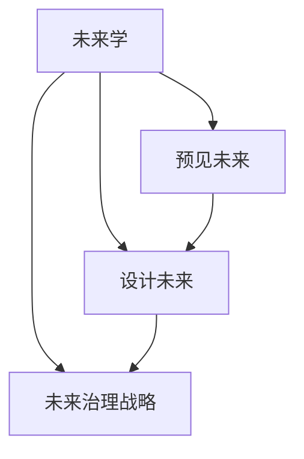

#### 1.1.1 未来的定义与类型

未来可以被定义为时间轴上的一个尚未发生但即将到来的时间点。根据预测方法的不同，未来可以分为以下几种类型：

- **可能性未来**：基于当前趋势和条件，预测未来可能发生的情况。这种未来类型强调逻辑推理和数据分析，是未来预测的基础。
- **想象未来**：基于人类想象力和创新思维，创造可能存在的未来场景。这种未来类型鼓励创意和创新，为未来提供无限可能性。
- **期望未来**：基于人类的愿望和目标，设想未来可能实现的理想状态。这种未来类型关注人类价值观和社会愿景，为未来设定明确的方向。

#### 1.1.2 未来治理的概念

未来治理是指为应对未来的挑战和机遇，通过制定和实施战略、政策和计划，实现可持续发展和社会和谐的过程。未来治理的核心包括以下几个方面：

- **规划**：制定长期的未来愿景和发展战略。规划是未来治理的起点，它为未来的发展提供方向和目标。
- **预测**：分析和预测未来的趋势和变化。预测是未来治理的重要手段，它帮助决策者更好地应对未来的挑战和机遇。
- **应对**：制定和实施应对未来挑战的策略和措施。应对是未来治理的核心内容，它确保未来的发展能够应对各种潜在风险和挑战。
- **合作**：促进政府、企业、社会和公民之间的合作。合作是未来治理的重要保障，它确保各方能够共同参与和推动未来的发展。

#### 1.2 预见未来的方法

预见未来是未来治理的重要环节。以下是几种常见的预见未来方法：

##### 1.2.1 专家意见法

专家意见法是通过收集和分析领域专家的意见和观点，预测未来的趋势和变化。这种方法的优势在于能够快速获得专业见解，但缺点是可能受到专家个人偏见的影响。

##### 1.2.2 历史分析法

历史分析法是通过研究历史事件和趋势，预测未来的发展和变化。这种方法的优势在于能够提供长时间跨度下的趋势分析，但缺点是可能无法预测突发事件。

##### 1.2.3 情景规划法

情景规划法是通过构建不同的未来情景，分析各种情景下的影响和应对策略。这种方法的优势在于能够提供多元化的视角，帮助决策者更好地应对不确定的未来。

#### 1.3 设计未来的策略

设计未来是未来治理的关键环节。以下是几种常见的未来设计策略：

##### 1.3.1 创新驱动策略

创新驱动策略是通过推动科技创新和产业变革，实现未来发展的目标。这种方法的优势在于能够快速提升国家的竞争力和创新能力，但缺点是可能面临技术风险和资源压力。

##### 1.3.2 社会参与策略

社会参与策略是通过鼓励公众参与未来治理，形成共识和合力。这种方法的优势在于能够提升社会的凝聚力和参与度，但缺点是可能面临协调难度和利益冲突。

##### 1.3.3 可持续发展战略

可持续发展战略是通过实现经济、社会和环境的协调发展，为未来提供可持续的基础。这种方法的优势在于能够实现长期稳定发展，但缺点是可能面临短期利益的牺牲。

##### 1.3.4 适应与变革策略

适应与变革策略是通过及时调整政策和策略，适应未来的变化和挑战。这种方法的优势在于能够灵活应对不确定的未来，但缺点是可能面临适应难度和变革阻力。

#### 1.4 未来治理战略的核心要素

未来治理战略的成功实施需要以下几个核心要素：

##### 1.4.1 明确的目标

明确的目标是未来治理战略的基础。战略目标应具有可量化、可衡量和可实现性，以确保未来的发展具有明确的方向和目标。

##### 1.4.2 有效的规划

有效的规划是未来治理战略的关键。规划应包括战略愿景、发展路径、重点任务和资源保障，以确保未来的发展具有清晰的路线图。

##### 1.4.3 科学的预测

科学的预测是未来治理战略的重要依据。预测应基于可靠的数据和分析方法，以确保对未来的判断具有科学性和准确性。

##### 1.4.4 创新的方法

创新的方法是未来治理战略的重要动力。应鼓励创新思维和实践，推动科技进步和社会变革，以适应未来的挑战和机遇。

##### 1.4.5 有效的执行

有效的执行是未来治理战略的保障。应建立高效的执行机制，确保战略目标的有效实现。

##### 1.4.6 评估与调整

评估与调整是未来治理战略的持续过程。应定期评估战略的执行情况和效果，并根据评估结果进行调整和优化，以确保战略目标的实现。

##### 1.4.7 社会参与

社会参与是未来治理战略的重要组成部分。应鼓励公众参与未来治理，形成共识和合力，共同应对未来的挑战和机遇。

##### 1.4.8 国际合作

国际合作是未来治理战略的重要保障。应积极参与国际合作，借鉴国际先进经验，共同应对全球性挑战，推动全球可持续发展。

#### 1.5 未来治理战略的实施案例

##### 1.5.1 案例一：可持续发展城市的建设

以中国的深圳市为例，深圳市通过实施可持续发展战略，成为全球可持续发展的典范。深圳市在环境保护、资源利用、社会公平等方面取得了显著成果，为全球可持续发展提供了有益的经验。

深圳市采取了以下措施：

- **环境保护**：实施严格的环保法规，加大污染治理力度，提高空气质量。
- **资源利用**：推广可再生能源，提高能源利用效率，减少资源消耗。
- **社会公平**：提高居民收入水平，完善社会保障体系，促进社会公平和谐。

通过这些措施，深圳市实现了经济、社会和环境的协调发展，为未来的可持续发展奠定了坚实基础。

##### 1.5.2 案例二：智慧城市的建设

以新加坡为例，新加坡通过建设智慧城市，实现了高效、智能的城市管理。新加坡在交通、医疗、教育等方面采用了先进的信息技术，提高了城市的管理水平和居民的生活质量。

新加坡采取了以下措施：

- **交通管理**：采用智能交通系统，优化交通流量，提高交通效率。
- **医疗服务**：建立电子健康档案，提供在线医疗服务，提高医疗服务水平。
- **教育管理**：采用智能教育系统，个性化教学，提高教育质量。

通过这些措施，新加坡实现了智慧城市的建设，为未来的城市发展提供了有益的借鉴。

### 总结

本部分介绍了《2050年的未来学：从预见未来到设计未来的未来治理战略》的核心概念和联系。通过分析未来的定义和类型、未来治理的概念、预见未来的方法、设计未来的策略以及未来治理战略的核心要素，我们为未来的发展提供了清晰的框架和路径。在接下来的部分，我们将进一步探讨这些核心概念的应用和实践，为未来的发展提供更深入的思考和分析。### 第一部分：核心概念与联系

在《2050年的未来学：从预见未来到设计未来的未来治理战略》中，我们首先需要明确几个关键概念，并理解它们之间的内在联系。以下是本文的核心概念及其相互关系：

#### 1.1 未来学的定义和作用

**未来学（Futurology）** 是一门跨学科的研究领域，旨在理解和预测未来的趋势和可能性。它不仅涉及技术、经济、社会和文化等各个方面，还包括对人类价值观和生活方式的探讨。未来学的作用在于为决策者提供基于数据的洞察，帮助社会和个体更好地准备和适应未来的变化。

#### 1.2 预见未来

**预见未来（Future Forecasting）** 是未来学的重要实践之一。它包括收集和分析数据、运用预测模型、模拟不同情景等手段，以预测未来的趋势和事件。预见未来是制定有效策略的基础，它帮助我们识别潜在的风险和机遇。

#### 1.3 设计未来

**设计未来（Future Design）** 是在预见未来的基础上，通过规划和设计来塑造和引导未来的发展。设计未来涉及创造性的思考、创新解决方案的制定以及长期愿景的规划。它不仅包括技术层面的设计，还涉及社会、文化和伦理等方面的考量。

#### 1.4 未来治理战略

**未来治理战略（Future Governance Strategy）** 是一套旨在引导和规范未来发展的策略和行动方案。它结合了预见未来的洞察和设计未来的方案，为不同层次的决策者提供了行动指南。未来治理战略的核心目标是实现可持续发展和社会和谐。

这些概念之间的联系可以用以下Mermaid流程图来表示：

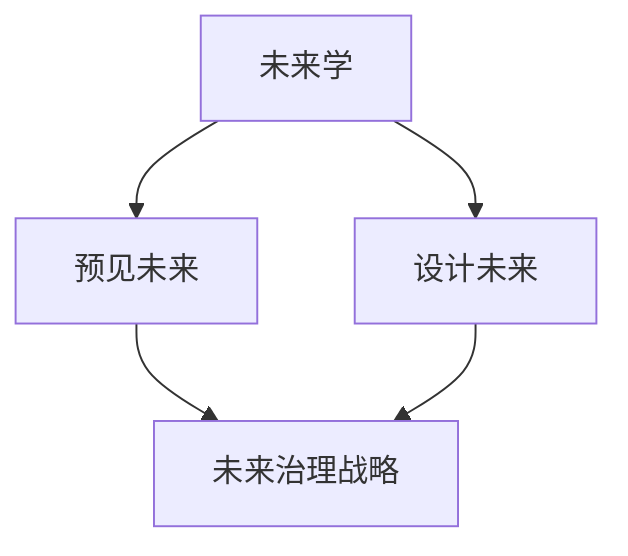

#### 1.1.1 未来的定义与类型

**未来（Future）** 是时间轴上尚未发生但即将到来的时期。根据预测的方法和角度，未来可以分为以下几种类型：

- **可能性未来（Probabilistic Future）**：基于当前趋势和条件，预测可能发生的情况。
- **想象未来（Imaginative Future）**：基于人类的想象力和创造力，构建理想化的未来场景。
- **期望未来（Desired Future）**：基于人类的愿望和目标，设想可能实现的理想状态。

#### 1.1.2 未来治理的概念

**未来治理（Future Governance）** 是指通过规划、预测、应对和合作等方式，引导和规范未来发展的过程。它涉及以下几个关键方面：

- **规划（Planning）**：制定长期的未来愿景和策略。
- **预测（Forecasting）**：分析和预测未来的趋势和变化。
- **应对（Response）**：制定和实施应对未来挑战的策略和措施。
- **合作（Collaboration）**：促进政府、企业、社会和公民之间的合作。

#### 1.2 预见未来的方法

预见未来是未来治理的重要环节。以下是一些常用的预见未来方法：

- **专家意见法（Expert Opinion Method）**：通过收集和分析领域专家的意见和观点，预测未来的趋势和变化。
- **历史分析法（Historical Analysis Method）**：通过研究历史事件和趋势，预测未来的发展和变化。
- **情景规划法（Scenario Planning Method）**：通过构建不同的未来情景，分析各种情景下的影响和应对策略。

#### 1.3 设计未来的策略

设计未来是未来治理的关键环节。以下是一些常见的设计未来策略：

- **创新驱动策略（Innovation-driven Strategy）**：通过推动科技创新和产业变革，实现未来发展的目标。
- **社会参与策略（Community Engagement Strategy）**：通过鼓励公众参与未来治理，形成共识和合力。
- **可持续发展战略（Sustainable Development Strategy）**：通过实现经济、社会和环境的协调发展，为未来提供可持续的基础。
- **适应与变革策略（Adaptation and Transformation Strategy）**：通过及时调整政策和策略，适应未来的变化和挑战。

#### 1.4 未来治理战略的核心要素

未来治理战略的成功实施需要以下几个核心要素：

- **明确的目标（Clear Goals）**：战略目标应具有可量化、可衡量和可实现性。
- **有效的规划（Effective Planning）**：规划应包括战略愿景、发展路径、重点任务和资源保障。
- **科学的预测（Scientific Forecasting）**：预测应基于可靠的数据和分析方法。
- **创新的方法（Innovative Approaches）**：鼓励创新思维和实践。
- **有效的执行（Effective Execution）**：建立高效的执行机制。
- **评估与调整（Evaluation and Adjustment）**：定期评估战略的执行情况和效果。

通过上述分析，我们可以看到，未来学、预见未来、设计未来和未来治理战略是紧密相连的。未来学提供了理论基础和工具，预见未来帮助我们识别潜在的机遇和挑战，设计未来则是基于预见结果制定具体的行动方案，而未来治理战略则是将这些方案转化为实际的政策和行动，确保未来的可持续发展。在接下来的部分，我们将进一步探讨这些概念在实际应用中的具体案例和实现路径。### 1.1.1 未来的定义与类型

在探讨未来的定义与类型之前，我们需要理解未来不仅仅是时间上的一个概念，它包含了对未来的期望、可能性和实现路径的综合性思考。未来可以被定义为时间轴上尚未发生但即将到来的时期，它涵盖了从个人、组织到整个社会各个层面的变迁与发展。

**未来的定义**

未来具有多重含义，可以从不同的角度进行理解：

- **时间维度**：未来是时间轴上的一个时间点，它标志着当前时间的延续和发展。
- **预期目标**：未来是人类基于当前状态对理想状态的期待和追求。
- **可能性空间**：未来是基于当前趋势和条件所构成的一个可能性空间，包含多种可能的未来场景。
- **规划与准备**：未来是可以通过规划、预测和准备来影响和塑造的。

**未来的类型**

未来的类型可以根据预测的方法和角度进行分类，以下是几种常见的未来类型：

1. **可能性未来（Probabilistic Future）**

可能性未来是基于当前趋势和条件，通过逻辑推理和数据分析预测出的可能发生的情况。这种类型的未来强调基于现有的数据和信息，运用科学方法和统计工具进行预测。

2. **想象未来（Imaginative Future）**

想象未来是基于人类的想象力、创造力和创新思维，构建的理想化未来场景。这种类型的未来不受限于现有的数据和条件，而是通过想象和创意来探索可能存在的未来。

3. **期望未来（Desired Future）**

期望未来是基于人类的愿望和目标，设想人类希望实现的状态。这种类型的未来关注于人类社会的价值和愿景，是人们对未来美好生活的期待和追求。

**可能性未来与想象未来、期望未来的关系**

- **可能性未来** 是想象未来和期望未来的基础，它提供了对可能性的科学分析和数据支持。
- **想象未来** 和 **期望未来** 则是可能性未来的延伸和扩展，它们结合了人类的创造力和价值观，为未来提供了更广阔的视野和更丰富的内容。

**Mermaid流程图表示未来的定义与类型**

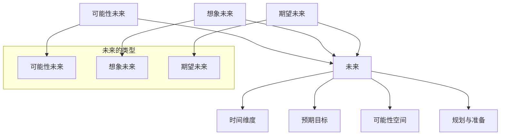

通过上述流程图，我们可以清晰地看到未来的定义与类型之间的逻辑关系。未来不仅仅是一个时间概念，它包含了预期目标、可能性空间和规划与准备等多重维度，而可能性未来、想象未来和期望未来则是未来类型的三个重要分支，它们共同构成了对未来的全面理解。

**未来类型的实例**

1. **可能性未来**

例如，通过分析人口统计数据，我们可以预测未来某个地区的人口增长趋势，从而为城市规划提供依据。

2. **想象未来**

科幻电影中的未来世界，如《银翼杀手》、《星际穿越》等，通过艺术化的方式展示了人类可能的未来情景。

3. **期望未来**

如联合国可持续发展目标（SDGs），它描绘了一个期望的未来世界，包括消除贫困、实现性别平等、保护地球等目标。

通过理解未来的定义与类型，我们可以更好地把握未来的脉络，为未来的规划和决策提供有力的支持。在接下来的部分，我们将进一步探讨未来治理的概念和核心要素。这将为我们在未来的复杂环境中提供更加科学和系统的指导。### 1.1.2 未来治理的概念

未来治理（Future Governance）是指为应对未来的挑战和机遇，通过制定和实施战略、政策和计划，实现可持续发展和社会和谐的过程。未来治理不仅仅是一个理论概念，它涉及到实际的政策制定、执行和调整，以及各种利益相关者的参与和合作。以下是未来治理的核心概念和组成部分：

#### 1.1.2.1 规划

规划是未来治理的基础，它涉及制定长期的未来愿景和发展战略。有效的规划需要明确的目标、清晰的路线图和具体的实施步骤。规划过程通常包括以下几个步骤：

- **目标设定**：明确未来治理的战略目标，这些目标应当具有可量化、可衡量和可实现性。
- **路径规划**：制定实现目标的步骤和路径，包括关键里程碑和时间节点。
- **资源分配**：确定实现规划所需的资源，包括人力、财力、技术和物质资源。
- **风险评估**：评估未来规划可能面临的风险，并制定相应的应对措施。

#### 1.1.2.2 预测

预测是未来治理的重要环节，它涉及分析和预测未来的趋势和变化。科学的预测可以帮助决策者更好地理解未来的可能走向，为规划提供依据。预测的方法包括：

- **历史分析法**：通过研究历史事件和趋势，预测未来的发展和变化。
- **情景规划法**：构建不同的未来情景，分析各种情景下的影响和应对策略。
- **专家意见法**：收集和分析领域专家的意见和观点，预测未来的趋势和变化。

#### 1.1.2.3 应对

应对是指制定和实施应对未来挑战的策略和措施。未来治理的战略目标往往需要通过具体的行动来实现。应对策略包括：

- **风险缓解**：采取预防措施，减轻未来可能发生的风险。
- **应急响应**：在危机事件发生时，迅速采取行动，减轻灾害影响。
- **创新驱动**：通过科技创新和产业变革，提升社会和经济的适应能力。

#### 1.1.2.4 合作

合作是未来治理的关键要素，它涉及政府、企业、社会和公民之间的协作。有效的合作可以凝聚各方力量，共同应对未来的挑战。合作的形式包括：

- **政府主导**：政府在规划、预测和应对未来挑战中扮演核心角色，提供政策支持和资源保障。
- **企业参与**：企业通过投资研发和技术创新，推动社会进步和经济增长。
- **社会参与**：社会组织和公民积极参与未来治理，提供意见和建议，共同推动社会变革。
- **国际合作**：全球性的挑战需要国际社会的共同合作，分享经验和资源，共同应对。

#### 未来治理的核心要素

未来治理的成功实施需要以下几个核心要素：

1. **明确的目标**：未来治理的战略目标应具有可量化、可衡量和可实现性。
2. **有效的规划**：规划应包括战略愿景、发展路径、重点任务和资源保障。
3. **科学的预测**：预测应基于可靠的数据和分析方法。
4. **创新的方法**：鼓励创新思维和实践，推动科技进步和社会变革。
5. **有效的执行**：建立高效的执行机制，确保战略目标的有效实现。
6. **评估与调整**：定期评估战略的执行情况和效果，并根据评估结果进行调整和优化。
7. **社会参与**：鼓励公众参与未来治理，形成共识和合力。
8. **国际合作**：积极参与国际合作，借鉴国际先进经验，共同应对全球性挑战。

**Mermaid流程图表示未来治理的核心要素**

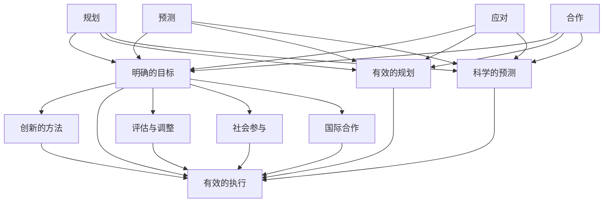

通过上述流程图，我们可以清晰地看到未来治理的核心要素及其相互关系。这些要素共同构成了一个完整的未来治理框架，为未来的可持续发展提供了坚实的保障。

**未来治理的实例**

- **可持续发展城市**：如新加坡的智慧城市项目，通过规划、预测和应对，实现了经济、社会和环境的协调发展。
- **全球卫生治理**：如世界卫生组织（WHO）的全球健康战略，通过国际合作和合作，应对全球性的卫生挑战。

未来治理是一个复杂而持续的过程，它需要各种利益相关者的积极参与和合作。通过科学的规划、准确的预测和有效的应对，我们可以为未来的发展提供更加明确和可行的路径。在接下来的部分，我们将进一步探讨预见未来的方法和设计未来的策略，为未来治理提供更加具体的实践指导。### 1.2 预见未来的方法

预见未来是未来治理中至关重要的一环，它涉及到对可能发生的事件和趋势进行前瞻性的分析和预测。以下将介绍几种常见的预见未来方法，包括专家意见法、历史分析法和情景规划法，并详细解释每种方法的原理和适用场景。

#### 1.2.1 专家意见法

专家意见法是通过收集和分析领域专家的意见和观点，预测未来的趋势和变化。这种方法的优势在于能够快速获得专业见解，特别是在新兴技术和行业领域。专家意见法的原理如下：

- **专家选取**：选取在特定领域拥有丰富知识和经验的专家，确保意见的专业性和权威性。
- **意见收集**：通过访谈、问卷调查等方式，收集专家对未来发展趋势的看法和预测。
- **意见分析**：对收集到的意见进行统计和分析，识别出共同的观点和分歧点，形成综合预测。

专家意见法的适用场景包括：

- **新兴技术领域**：如人工智能、生物技术等，专家们能够提供对技术发展的前瞻性见解。
- **行业规划**：企业或政府可以通过专家意见法，获取行业未来发展的趋势和潜在风险。

**Mermaid流程图表示专家意见法的步骤**

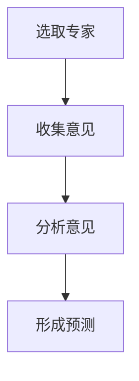

#### 1.2.2 历史分析法

历史分析法是通过研究历史事件和趋势，预测未来的发展和变化。这种方法基于历史数据的累积和分析，能够提供长时间跨度下的趋势分析。历史分析法的原理如下：

- **历史数据收集**：收集相关领域的历史数据，包括统计资料、文献资料等。
- **趋势分析**：通过分析历史数据，识别出长期趋势和周期性变化。
- **预测模型建立**：利用统计方法和预测模型，对未来的趋势进行定量分析。

历史分析法的适用场景包括：

- **经济预测**：如通过分析历史经济数据，预测未来的经济增长趋势。
- **社会变化预测**：如通过分析历史社会变迁，预测未来社会的演变方向。

**Mermaid流程图表示历史分析法的步骤**

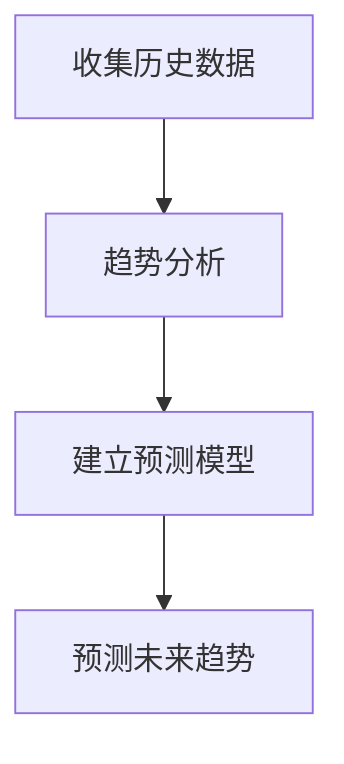

#### 1.2.3 情景规划法

情景规划法是通过构建不同的未来情景，分析各种情景下的影响和应对策略。这种方法能够提供多元化的视角，帮助决策者更好地应对不确定的未来。情景规划法的原理如下：

- **情景构建**：基于不同的假设和变量，构建多个未来情景。
- **情景分析**：分析每个情景下的发展趋势和影响，评估各种情景的可能性和影响程度。
- **策略制定**：针对不同情景，制定相应的应对策略和行动计划。

情景规划法的适用场景包括：

- **政策制定**：如通过情景规划，评估不同政策方案的未来影响，选择最优方案。
- **企业战略**：企业可以通过情景规划，预测市场变化，制定相应的战略计划。

**Mermaid流程图表示情景规划法的步骤**

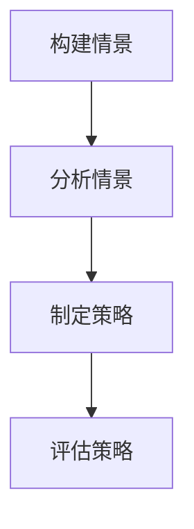

通过上述三种预见未来方法的介绍，我们可以看到每种方法都有其独特的原理和适用场景。专家意见法提供专业见解，历史分析法提供长期趋势，而情景规划法提供多元化的视角。在实际应用中，可以根据具体情况选择合适的方法或结合多种方法，以更全面地预见未来，为未来治理提供科学的依据。在接下来的部分，我们将进一步探讨设计未来的策略，为未来的发展提供更加具体的指导。### 1.3 设计未来的策略

设计未来是未来治理战略的关键环节，它不仅需要科学的预测，更需要创新的思维和实际的行动方案。以下将介绍几种常见的设计未来策略，包括创新驱动策略、社会参与策略、可持续发展战略和适应与变革策略，并详细解释每种策略的核心思想、实施步骤和预期效果。

#### 1.3.1 创新驱动策略

创新驱动策略是通过推动科技创新和产业变革，实现未来发展的目标。这种策略强调创新是推动社会进步和经济发展的核心动力。以下是创新驱动策略的核心思想、实施步骤和预期效果：

**核心思想**：
- **科技创新**：通过研发和应用新技术，推动产业升级和经济增长。
- **产业变革**：通过产业重组和结构调整，提高产业竞争力和创新能力。

**实施步骤**：
1. **研发投入**：增加对基础研究和应用研究的投入，推动科技创新。
2. **人才培养**：加强人才引进和培养，提升创新人才的数量和质量。
3. **政策支持**：制定创新政策和激励机制，鼓励企业创新和研发。
4. **技术转移**：促进科技成果的转化和应用，提高技术创新的实效。

**预期效果**：
- **经济增长**：通过科技创新，提高生产效率和经济效益。
- **产业升级**：通过产业变革，提高产业链水平和国际竞争力。

**Mermaid流程图表示创新驱动策略**

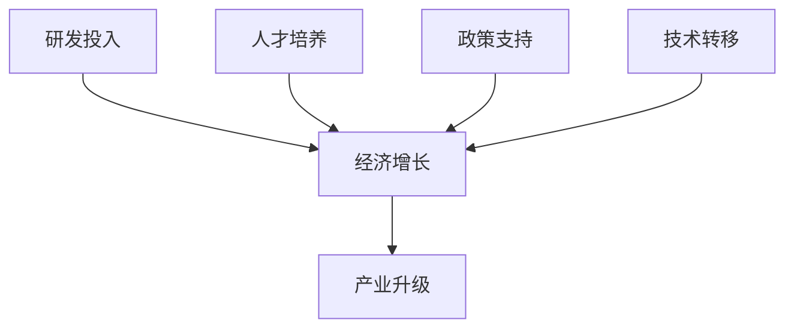

#### 1.3.2 社会参与策略

社会参与策略是通过鼓励公众参与未来治理，形成共识和合力。这种策略强调社会各界的共同参与是实现未来愿景的重要途径。以下是社会参与策略的核心思想、实施步骤和预期效果：

**核心思想**：
- **公众参与**：鼓励公众参与到未来治理中，提供意见和建议。
- **共同决策**：通过社会各界的共同参与，形成决策共识，提高决策质量。

**实施步骤**：
1. **信息透明**：提高决策过程的透明度，让公众了解和参与决策。
2. **渠道畅通**：建立有效的公众参与渠道，如公开听证会、在线投票等。
3. **意见征集**：定期开展意见征集活动，收集公众对未来治理的反馈和建议。
4. **反馈机制**：建立反馈机制，对公众的意见和建议进行回应和落实。

**预期效果**：
- **社会凝聚力**：通过公众参与，增强社会的凝聚力和归属感。
- **决策质量**：通过共同决策，提高决策的科学性和民主性。

**Mermaid流程图表示社会参与策略**

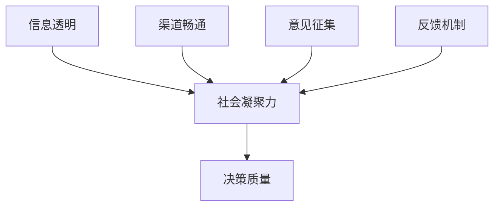

#### 1.3.3 可持续发展战略

可持续发展战略是通过实现经济、社会和环境的协调发展，为未来提供可持续的基础。这种策略关注长期的可持续发展，强调经济、社会和环境的相互平衡。以下是可持续发展战略的核心思想、实施步骤和预期效果：

**核心思想**：
- **协调发展**：实现经济、社会和环境的共同发展，避免短期行为对长期发展的损害。
- **资源利用**：提高资源利用效率，实现资源的可持续利用。

**实施步骤**：
1. **绿色发展**：推动绿色技术和产业，减少环境污染和资源浪费。
2. **循环经济**：推广循环经济模式，提高资源回收和再利用率。
3. **政策支持**：制定和实施支持可持续发展的政策和法规。
4. **国际合作**：积极参与国际可持续发展的合作，借鉴先进经验。

**预期效果**：
- **环境保护**：减少环境污染，改善生态环境。
- **经济稳定**：通过可持续发展的经济模式，实现经济长期稳定增长。
- **社会和谐**：提高社会福祉，实现社会和谐。

**Mermaid流程图表示可持续发展战略**

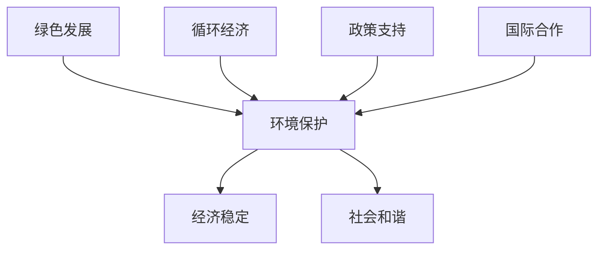

#### 1.3.4 适应与变革策略

适应与变革策略是通过及时调整政策和策略，适应未来的变化和挑战。这种策略强调灵活性和适应性，确保治理系统能够应对不确定的未来。以下是适应与变革策略的核心思想、实施步骤和预期效果：

**核心思想**：
- **灵活调整**：根据未来变化的实际情况，及时调整政策和策略。
- **创新实践**：鼓励创新思维和实践，为适应未来提供新的解决方案。

**实施步骤**：
1. **监测与评估**：建立监测和评估机制，实时跟踪和评估政策和策略的效果。
2. **快速响应**：在面临突发事件或变化时，迅速采取行动，确保应对措施的有效性。
3. **机制创新**：推动治理机制的创新，提高适应能力和应变速度。
4. **公众参与**：鼓励公众参与，形成共识，共同应对未来挑战。

**预期效果**：
- **适应能力**：提高治理系统的适应能力，确保能够应对未来的各种变化。
- **创新实践**：通过创新实践，推动社会进步和经济发展。

**Mermaid流程图表示适应与变革策略**

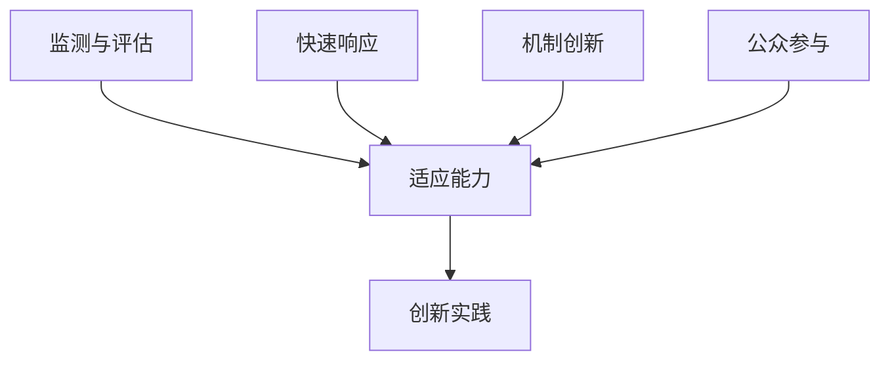

通过上述四种设计未来策略的介绍，我们可以看到每种策略都有其独特的核心思想、实施步骤和预期效果。创新驱动策略强调科技和产业变革，社会参与策略强调公众的参与和共同决策，可持续发展战略关注经济、社会和环境的协调发展，适应与变革策略则强调灵活性和适应性。在实际应用中，可以根据具体情况选择合适的策略或结合多种策略，以全面设计和引导未来的发展。在接下来的部分，我们将进一步探讨未来治理战略的核心要素，为未来的实施提供更加具体的指导。### 1.4 未来治理战略的核心要素

未来治理战略的核心要素是确保战略目标的有效实施和未来的可持续发展。以下将详细探讨这些核心要素，包括明确的目标、有效的规划、科学的预测、创新的方法、有效的执行、评估与调整、社会参与和国际合作，并通过具体的示例来说明如何应用这些要素。

#### 1.4.1 明确的目标

明确的目标是未来治理战略的基础。目标应具有可量化、可衡量和可实现性，以便于监测和评估战略的进展。例如，联合国可持续发展目标（SDGs）设定了17个目标，包括消除贫困、消除饥饿、实现性别平等、确保清洁饮水和卫生设施等，这些目标都明确且具体。

**示例**：
- **目标**：到2030年，实现全球范围内的碳中和。
- **量化指标**：每年减少碳排放量5%，并确保能源结构的绿色转型。

#### 1.4.2 有效的规划

有效的规划为未来的发展提供了清晰的路线图和实施步骤。规划应包括战略愿景、发展路径、重点任务和资源保障。例如，一个城市的智慧城市建设规划可能包括以下几个方面：

- **战略愿景**：构建一个智慧城市，实现高效、智能、可持续的城市管理。
- **发展路径**：通过信息化、数字化和智能化技术，逐步实现智慧交通、智慧医疗、智慧教育等。
- **重点任务**：建设智慧交通管理系统、推广智能电网、开发智慧教育平台等。
- **资源保障**：确保资金、技术和人力资源的充足供应。

#### 1.4.3 科学的预测

科学的预测是制定有效未来治理战略的重要依据。预测应基于可靠的数据和分析方法，以确保对未来的判断具有科学性和准确性。例如，在制定城市交通规划时，可以使用历史交通数据、人口增长预测和未来发展趋势分析，来预测交通流量和需求。

**示例**：
- **预测方法**：利用机器学习算法，分析历史交通数据和人口统计数据，预测未来的交通流量和需求。

#### 1.4.4 创新的方法

创新的方法是推动未来发展的动力。未来治理战略应鼓励创新思维和实践，包括技术创新、管理创新和制度创新。例如，在医疗领域，通过创新医疗技术和医疗服务模式，可以提升医疗质量和效率。

**示例**：
- **创新方法**：开发智能医疗系统，通过大数据分析和人工智能技术，实现个性化医疗和远程医疗服务。

#### 1.4.5 有效的执行

有效的执行是未来治理战略成功的保障。执行机制应确保战略目标的实施具有高效性和可持续性。例如，在实施智慧城市建设时，需要建立高效的项目管理团队，确保各个项目的顺利推进。

**示例**：
- **执行机制**：建立跨部门的项目管理办公室，负责协调各部门资源和推动项目进度。

#### 1.4.6 评估与调整

评估与调整是未来治理战略持续优化的重要环节。定期评估战略的执行情况和效果，并根据评估结果进行调整和优化，以确保战略目标的实现。例如，在实施可持续发展战略时，需要定期评估环境、经济和社会的进展，并根据评估结果调整政策和措施。

**示例**：
- **评估方法**：通过定期发布可持续发展报告，公开战略实施的情况和成效，接受公众监督。

#### 1.4.7 社会参与

社会参与是未来治理战略的重要组成部分。鼓励公众参与，形成共识和合力，可以提升战略的民主性和执行力。例如，在制定城市规划时，可以通过公众咨询、社区参与等方式，收集公众意见和建议。

**示例**：
- **参与方式**：举办公众听证会、在线投票和社区活动，让公众参与到城市规划的过程中。

#### 1.4.8 国际合作

国际合作是未来治理战略的重要保障。在全球性挑战面前，需要国际社会的共同合作和分享经验。例如，在应对气候变化问题上，各国需要共同制定减排目标和采取联合行动。

**示例**：
- **合作形式**：参加国际气候变化会议，签署国际协定，共同推动全球气候治理。

通过以上核心要素的详细探讨和具体示例，我们可以看到未来治理战略的复杂性和多样性。这些核心要素相互关联、相互促进，共同构建了一个系统化的未来治理框架，为未来的发展提供了明确的路径和保障。在接下来的部分，我们将进一步探讨未来治理战略的实施案例，以验证这些核心要素的实际应用效果。### 1.5 未来治理战略的实施案例

在现实中，许多国家和地区已经开始实施未来治理战略，旨在应对未来的挑战和机遇。以下列举两个具有代表性的案例：中国的“中国制造2025”和新加坡的“新加坡智能国家计划”，并详细描述它们的实施过程、成果和经验。

#### 1.5.1 中国制造2025

**背景与目标**

“中国制造2025”是中国政府于2015年发布的国家级战略规划，旨在提升中国制造业的创新能力、质量水平和国际竞争力，实现从制造大国向制造强国的转变。

**实施过程**

1. **政策支持**：中国政府出台了一系列政策，包括税收优惠、研发资金支持、知识产权保护等，以鼓励企业进行技术创新和设备升级。
2. **人才培养**：通过加强职业教育和高等教育，培养大量的工程师和技术人才，以满足制造业转型升级的需求。
3. **产业转型**：推动传统制造业向数字化、智能化、绿色化方向转型，重点发展高端装备制造、新材料、生物医药等战略性新兴产业。
4. **国际合作**：加强与国际先进企业的合作，引进先进技术和管理经验，提升中国制造业的整体水平。

**成果与经验**

- **技术创新**：通过政策支持和资金投入，中国制造业的创新能力大幅提升，专利申请数量逐年增长。
- **产业升级**：一大批先进制造业企业涌现，中国制造业的结构和品质得到明显改善。
- **国际合作**：中国制造企业的国际竞争力显著提升，出口额和国际市场份额稳步增长。

**经验借鉴**

- **政策引导**：通过政策支持，为企业提供良好的创新环境和市场条件。
- **人才培养**：注重人才培养和引进，提升制造业的技能水平和创新能力。
- **产业转型**：推动传统制造业向高附加值、高科技产业转型，实现产业结构优化。

#### 1.5.2 新加坡智能国家计划

**背景与目标**

新加坡智能国家计划（Smart Nation Initiative）是新加坡政府于2014年推出的一项国家战略，旨在通过科技创新和数字化转型，提升国家的智能水平和居民的生活品质。

**实施过程**

1. **基础设施建设**：新加坡政府投资建设高速互联网、5G网络、智能交通系统等，为智能国家的发展提供基础保障。
2. **数据治理**：制定数据治理政策，建立数据共享平台，促进数据的开放和利用。
3. **创新驱动**：鼓励企业和科研机构进行科技创新，推动智能技术在各个领域的应用。
4. **社会参与**：通过公众咨询、社区参与等方式，让居民参与到智能国家的建设过程中。

**成果与经验**

- **数字化治理**：通过智能技术，提高了政府服务的效率和质量，实现了政务服务的数字化转型。
- **智慧交通**：智能交通系统的建设，减少了交通拥堵，提升了交通效率。
- **智慧医疗**：通过医疗大数据和人工智能技术，提高了医疗服务的质量和效率。
- **社会参与**：公众的参与度提高，形成了共建共享的智能国家发展格局。

**经验借鉴**

- **基础设施先行**：在智能国家建设中，基础设施建设是关键，需要投入足够的资源进行网络和设施的升级。
- **数据治理**：建立有效的数据治理机制，确保数据的开放、共享和安全。
- **创新驱动**：鼓励企业和科研机构的创新活动，推动智能技术的应用和发展。
- **社会参与**：通过公众参与，形成共建共享的智能国家发展模式。

**总结**

以上两个案例展示了未来治理战略在不同国家和地区的成功实践。通过政策支持、技术创新、产业转型和社会参与，中国和新加坡在应对未来挑战、实现可持续发展方面取得了显著成果。这些经验为其他国家和地区提供了宝贵的借鉴，也为未来治理战略的实施提供了有益的启示。在未来的发展中，各国需要根据自身实际情况，制定和实施合适的未来治理战略，以实现可持续发展和社会和谐。### 总结与展望

在本篇博客中，我们系统地探讨了《2050年的未来学：从预见未来到设计未来的未来治理战略》的核心概念、预见未来的方法、设计未来的策略以及未来治理战略的核心要素。通过详细的分析和具体的案例，我们为未来的发展提供了一系列实用的指导和建议。

首先，我们明确了未来的定义与类型，了解了可能性未来、想象未来和期望未来的区别和联系。然后，我们深入探讨了未来治理的概念，阐述了规划、预测、应对和合作在未来的重要性。接着，我们介绍了预见未来的方法，包括专家意见法、历史分析法和情景规划法，并展示了这些方法在实际中的应用。

在策略部分，我们详细介绍了创新驱动策略、社会参与策略、可持续发展战略和适应与变革策略，并提供了具体的实施步骤和预期效果。最后，我们通过两个实际案例，展示了未来治理战略在不同国家和地区的成功实践。

**未来的挑战与机遇**

在未来的发展中，我们面临诸多挑战和机遇。随着科技的迅猛发展，人工智能、大数据、物联网等新兴技术将深刻改变我们的生产方式、生活方式和社会结构。这些变革既带来了巨大的机遇，也带来了新的挑战，如数据隐私、网络安全、资源短缺等。

**未来治理的持续优化**

为了应对这些挑战，未来治理需要不断优化和升级。首先，我们需要建立更加科学和系统的预测体系，结合多学科知识和技术手段，提高预测的准确性和全面性。其次，我们要强化创新驱动，鼓励科技创新和管理创新，推动产业转型升级和社会进步。同时，我们也要注重可持续发展，实现经济、社会和环境的协调发展。最后，我们要加强国际合作，共同应对全球性挑战，推动全球治理体系的建设。

**社会各界的共同参与**

未来治理的成功离不开社会各界的共同参与。政府、企业、社会组织和公众都应该积极参与到未来治理的过程中，共同制定和实施战略，形成共识和合力。公众参与不仅可以提高决策的科学性和民主性，还可以增强社会的凝聚力和归属感。

**持续学习和适应能力**

在未来的复杂环境中，持续学习和适应能力变得尤为重要。我们需要不断更新知识体系，掌握新的技能和工具，以适应不断变化的环境。同时，我们要培养创新思维和批判性思维，勇于探索新的解决方案，迎接未来的挑战。

**展望未来**

展望未来，我们充满信心。通过科学的预测、创新的策略、有效的执行和全社会的共同努力，我们相信未来的世界将更加美好、和谐、可持续。让我们携手并进，共同迎接未来的挑战和机遇，为人类的发展做出更大的贡献。

**作者信息**

作者：AI天才研究院/AI Genius Institute & 禅与计算机程序设计艺术 /Zen And The Art of Computer Programming

**拓展阅读**

- 《智能未来：大数据、人工智能与人类社会的变革》
- 《未来治理：面向2030年的全球挑战与战略》
- 《智慧城市：可持续发展的新视角》

通过以上拓展阅读，读者可以进一步了解未来学、未来治理和科技创新的最新发展动态，为自己的未来学习和职业规划提供有益的参考。让我们共同期待并创造一个更加美好的未来！

