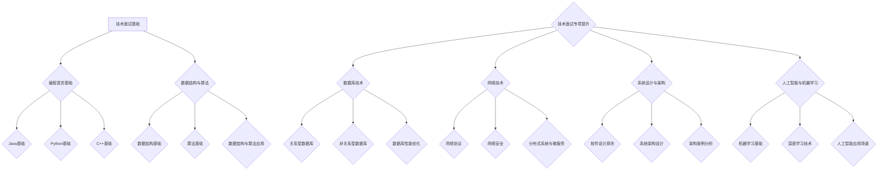

                 

### 文章标题：《2024年美团社招技术面试题集锦》

> 关键词：技术面试、美团社招、面试题集锦、面试准备、编程语言、数据结构与算法、数据库技术、网络安全、系统设计与架构、人工智能与机器学习

> 摘要：本文旨在为2024年美团社招技术面试的考生提供全面的面试题集锦。通过详细梳理技术面试的基础、编程语言基础、数据结构与算法、技术面试专项提升、面试实战与技巧等核心内容，帮助考生更好地准备美团社招技术面试，提升面试成功率。本文不仅涵盖了面试的基础知识和常见题型，还针对美团公司的特殊需求和行业趋势进行了深入分析，旨在为考生提供有针对性的面试指导和实战经验。

### 目录

#### 第一部分：技术面试基础

1. **第1章：技术面试准备**
   - 1.1 技术面试概述
   - 1.2 技术简历编写
   - 1.3 编程面试准备
   - 1.4 面试题型与解题技巧

2. **第2章：编程语言基础**
   - 2.1 Java基础
   - 2.2 Python基础
   - 2.3 C++基础

3. **第3章：数据结构与算法**
   - 3.1 数据结构基础
   - 3.2 算法基础
   - 3.3 数据结构与算法应用

#### 第二部分：技术面试专项提升

4. **第4章：数据库技术**
   - 4.1 关系型数据库
   - 4.2 非关系型数据库
   - 4.3 数据库性能优化

5. **第5章：网络技术**
   - 5.1 网络协议
   - 5.2 网络安全
   - 5.3 分布式系统与微服务

6. **第6章：系统设计与架构**
   - 6.1 软件设计原则
   - 6.2 系统架构设计
   - 6.3 架构案例分析

7. **第7章：人工智能与机器学习**
   - 7.1 机器学习基础
   - 7.2 深度学习技术
   - 7.3 人工智能应用场景

#### 第三部分：面试实战与技巧

8. **第8章：面试官心态与应对策略**
   - 8.1 面试官心态调整
   - 8.2 面试官常见问题
   - 8.3 面试技巧与沟通

9. **第9章：面试实战案例分析**
   - 9.1 成功面试案例
   - 9.2 失败面试案例分析

10. **第10章：面试后的跟进与反思**
    - 10.1 面试反馈收集
    - 10.2 薪资谈判
    - 10.3 职业规划

#### 附录

- 附录A：常见面试题汇总
- 附录B：面试准备资源
- 附录C：职业发展建议

### Mermaid 流程图

### 第一部分：技术面试基础

#### 第1章：技术面试准备

##### 1.1 技术面试概述

技术面试是求职过程中不可或缺的一环，它不仅考查了应聘者的专业技能，还考察了应聘者的沟通能力、逻辑思维能力和团队协作能力。对于美团社招技术面试，面试官通常会关注以下几个方面：

1. **专业技能与知识**：面试官会针对应聘者的技术背景和项目经验，提出相关的问题，考查应聘者对编程语言、数据结构与算法、数据库、网络技术等方面的掌握程度。
2. **项目经验与实际能力**：面试官会通过提问了解应聘者在实际项目中的角色、贡献以及遇到的问题和解决方案，评估应聘者的实际工作能力和经验。
3. **思维能力与解决问题的能力**：面试官会通过逻辑思维题、算法题等，考查应聘者的思维能力、解决问题的能力和创新意识。
4. **沟通能力与团队协作能力**：面试官会通过行为面试题，了解应聘者的沟通方式、团队协作能力和领导力。

##### 1.2 技术简历编写

简历是应聘者向面试官展示自己能力的重要材料，编写一份高质量的技术简历对于面试成功至关重要。以下是一些编写技术简历的要点：

1. **结构清晰**：简历应该有一个清晰的布局，包括个人信息、教育背景、工作经历、项目经验、技能和证书等部分。
2. **重点突出**：在简历中，要突出自己的专业技能、项目经验和成就，尤其是与应聘岗位相关的内容。
3. **真实准确**：简历中的内容应该真实准确，切勿夸大或虚构，一旦被发现，会严重影响面试结果。
4. **量化成绩**：在描述项目经验和成就时，可以使用数据或成果来量化，如提高系统性能、优化数据库查询速度、提升用户满意度等。
5. **简洁明了**：简历的内容应该简洁明了，避免使用过于复杂的句子和术语，使面试官容易阅读和理解。

##### 1.3 编程面试准备

编程面试是技术面试中最为重要的一部分，通常包括算法题、编程题和系统设计题等。以下是一些编程面试准备的要点：

1. **算法与数据结构**：掌握常见的算法和数据结构，如排序算法、查找算法、图算法、树结构等，并能熟练运用。
2. **编程语言**：熟悉至少一种编程语言，如Java、Python、C++等，并能熟练运用其特性解决实际问题。
3. **编程风格**：保持良好的编程风格，如代码清晰、逻辑严谨、注释详尽等，这有助于提高代码的可读性和可维护性。
4. **算法与数据结构实现**：对于常见的算法和数据结构，要能够手写实现，并在面试中展示自己的思路和算法复杂度分析。
5. **编程题训练**：通过在线编程平台（如LeetCode、牛客网等）进行编程题训练，熟悉各类编程题型的解题方法。

##### 1.4 面试题型与解题技巧

技术面试中的题目类型多种多样，以下是一些常见的面试题型及其解题技巧：

1. **算法题**：这类题目主要考查应聘者的算法能力和逻辑思维能力。解题技巧包括理解题目要求、设计合理的算法、分析算法复杂度等。
2. **编程题**：这类题目主要考查应聘者的编程能力和实际操作能力。解题技巧包括理解题目需求、设计合理的程序结构、编写清晰的代码等。
3. **系统设计题**：这类题目主要考查应聘者的系统设计和架构能力。解题技巧包括理解系统需求、设计合理的系统架构、分析系统性能和可扩展性等。
4. **行为面试题**：这类题目主要考查应聘者的沟通能力、团队合作能力和解决问题的能力。解题技巧包括理解问题背景、阐述自己的思路、展示自己的优势等。
5. **综合面试题**：这类题目通常将多个方面结合在一起，考查应聘者的综合素质。解题技巧包括灵活运用知识、快速理解问题、合理规划时间等。

### 第二部分：技术面试专项提升

#### 第2章：编程语言基础

##### 2.1 Java基础

Java是一种面向对象的高级编程语言，具有跨平台、安全性高、可扩展性强等特点。在美团社招技术面试中，Java基础是面试官常考的内容，以下是一些关键知识点：

1. **Java语言特性**：
   - 面向对象：Java是一种面向对象的编程语言，支持封装、继承和多态等特性。
   - 垃圾回收：Java通过垃圾回收机制来自动管理内存，减少了内存泄漏的风险。
   - 跨平台：Java程序可以在任何支持Java虚拟机（JVM）的操作系统上运行。
   - 安全性：Java提供了丰富的安全特性，如权限控制、加密和解密等。

2. **Java常用库与框架**：
   - Java标准库：包括java.lang、java.util、java.net等，提供了Java编程的基础类库。
   - Spring框架：用于构建企业级应用程序，提供依赖注入、事务管理、安全控制等功能。
   - Hibernate：用于实现对象关系映射（ORM），将Java对象映射到数据库表。
   - MyBatis：用于实现数据库操作，提供强大的SQL映射和事务管理功能。

##### 2.2 Python基础

Python是一种简单易学、功能强大的高级编程语言，广泛应用于数据分析、人工智能、Web开发等领域。在美团社招技术面试中，Python基础也是面试官关注的内容，以下是一些关键知识点：

1. **Python语言特性**：
   - 简单易学：Python语法简洁清晰，适合初学者快速上手。
   - 强类型：Python支持动态类型，减少了类型转换的烦恼。
   - 面向对象：Python支持面向对象编程，方便复用和扩展代码。
   - 库支持：Python拥有丰富的第三方库，如NumPy、Pandas、Matplotlib等，方便进行科学计算和数据可视化。

2. **Python常用库与框架**：
   - NumPy：用于科学计算，提供强大的数值计算功能。
   - Pandas：用于数据处理，提供数据清洗、转换和分析等功能。
   - Matplotlib：用于数据可视化，提供丰富的绘图工具。
   - Flask：用于Web开发，提供轻量级的Web框架功能。
   - Django：用于Web开发，提供全栈开发框架功能。

##### 2.3 C++基础

C++是一种性能优异的高级编程语言，广泛应用于系统编程、游戏开发、嵌入式系统等领域。在美团社招技术面试中，C++基础也是面试官关注的内容，以下是一些关键知识点：

1. **C++语言特性**：
   - 面向对象：C++支持面向对象编程，提供封装、继承和多态等特性。
   - 高性能：C++提供了丰富的底层编程接口，能够充分利用计算机资源。
   - 多编译模型：C++支持编译时多态和运行时多态，提供了更灵活的编程方式。
   - 异常处理：C++提供了异常处理机制，能够提高程序的健壮性。

2. **C++常用库与框架**：
   - STL：C++标准模板库，提供了强大的数据结构和算法支持。
   - Boost：C++的第三方库，提供了丰富的功能，如智能指针、并发编程等。
   - Qt：用于跨平台桌面应用程序开发，提供丰富的界面和控件支持。
   - OpenGL：用于图形编程，提供强大的3D图形渲染功能。

### 第三部分：数据结构与算法

#### 第3章：数据结构与算法

数据结构与算法是计算机科学的核心内容，对于技术面试来说至关重要。美团社招技术面试中，数据结构与算法往往是考察的重点，以下将详细阐述数据结构、算法基础及其应用。

##### 3.1 数据结构基础

数据结构是计算机存储、组织数据的方式，它决定了数据的操作效率和存储空间的利用情况。常见的线性数据结构包括数组、链表、栈和队列，而树状数据结构和图状数据结构则更为复杂和强大。

1. **数组**：数组是一种线性数据结构，用于存储相同类型的数据元素。它通过索引访问元素，具有固定的大小和连续的存储空间。
2. **链表**：链表通过节点来存储数据，每个节点包含数据和指向下一个节点的指针。它具有灵活的大小和动态的存储空间，但访问速度较慢。
3. **栈**：栈是一种后进先出（LIFO）的数据结构，只允许在表的一端进行插入和删除操作。它常用于解决递归问题、实现深度优先搜索等。
4. **队列**：队列是一种先进先出（FIFO）的数据结构，只允许在表的一端进行插入操作，另一端进行删除操作。它常用于实现广度优先搜索、任务队列等。

##### 3.2 算法基础

算法是解决特定问题的步骤和策略，它包括排序算法、查找算法、图算法等。以下是一些常见的算法及其基本思想：

1. **排序算法**：排序算法用于将一组数据按照特定顺序排列。常见的排序算法有冒泡排序、选择排序、插入排序、快速排序、归并排序等。
   - **冒泡排序**：通过不断交换相邻的未排序元素，使得每一趟排序后最大元素（或最小元素）冒泡到序列的一端。
   - **选择排序**：每次从未排序的序列中选择一个最小（或最大）元素，将其放到已排序序列的末尾。
   - **插入排序**：通过逐步将未排序的元素插入到已排序序列中，形成一个新的已排序序列。
   - **快速排序**：通过选取一个基准元素，将序列划分为两个子序列，分别进行快速排序。
   - **归并排序**：将序列划分为若干个子序列，分别进行排序，然后合并子序列得到最终的排序结果。

2. **查找算法**：查找算法用于在数据结构中查找特定的元素。常见的查找算法有二分查找、顺序查找等。
   - **二分查找**：通过不断地将查找区间划分为一半，逐步缩小查找范围，直到找到目标元素或确定其不存在。
   - **顺序查找**：从序列的第一个元素开始，逐个比较，直到找到目标元素或确定其不存在。

3. **图算法**：图是一种由节点和边组成的数据结构，用于表示实体之间的关系。常见的图算法有深度优先搜索、广度优先搜索、最短路径算法等。
   - **深度优先搜索（DFS）**：通过递归或栈实现，从起始节点开始，不断深入访问未访问的节点。
   - **广度优先搜索（BFS）**：通过队列实现，从起始节点开始，逐层访问未访问的节点。
   - **最短路径算法**：求解从源点到目标点的最短路径，常见的算法有迪杰斯特拉算法、贝尔曼-福特算法等。

##### 3.3 数据结构与算法应用

数据结构与算法在解决实际问题时发挥着重要作用。以下是一些常见应用场景：

1. **排序与查找**：在数据处理、数据挖掘等领域，排序和查找算法是基础。例如，数据库管理系统使用排序算法对数据表进行排序，以加快查询速度；搜索引擎使用查找算法快速定位用户查询的关键词。
2. **图算法**：在社交网络分析、交通网络规划、生物信息学等领域，图算法具有广泛应用。例如，社交网络中的好友推荐、最短路径计算等，都可以通过图算法实现。
3. **算法优化**：在实际开发中，算法优化是提高系统性能和用户体验的重要手段。例如，通过优化数据库查询语句、缓存数据等，可以显著提高数据访问速度。
4. **算法竞赛**：算法竞赛是一种锻炼编程能力、逻辑思维能力和团队协作能力的有效途径。在竞赛中，参赛者需要运用各种数据结构与算法解决复杂问题，培养解决问题的能力。

### 第四部分：技术面试专项提升

#### 第4章：数据库技术

数据库技术是计算机科学中的重要分支，它在存储、管理和查询数据方面发挥着关键作用。美团社招技术面试中，数据库技术是面试官关注的重点之一。以下将详细介绍关系型数据库、非关系型数据库以及数据库性能优化等相关内容。

##### 4.1 关系型数据库

关系型数据库（Relational Database）是基于关系模型的数据库系统，它采用表格形式组织数据，并通过SQL（Structured Query Language）进行数据查询和管理。关系型数据库具有数据完整性、安全性高、查询效率较高等特点，广泛应用于企业级应用和大数据处理领域。

1. **MySQL**：MySQL是一款开源的关系型数据库，由Oracle公司维护。它具有高性能、可扩展性强、易用性高等特点，被广泛应用于Web应用、电子商务等领域。

   - **基本概念**：MySQL数据库由表（Table）、字段（Column）、记录（Row）等组成，通过SQL语句进行数据查询、插入、更新和删除操作。
   - **SQL语句**：SQL语句包括DML（Data Manipulation Language，数据操作语言）和DQL（Data Query Language，数据查询语言）等，用于对数据库进行操作。

2. **Oracle**：Oracle是一款商业关系型数据库，由Oracle公司开发。它具有高性能、高安全性、高可靠性等特点，被广泛应用于企业级应用、金融领域等。

   - **基本概念**：Oracle数据库采用多表连接查询、事务管理、视图等高级功能，提高了数据查询和操作的效率。
   - **SQL语句**：Oracle的SQL语句与MySQL类似，但增加了更多高级功能，如分区表、物化视图等。

##### 4.2 非关系型数据库

非关系型数据库（NoSQL Database）是一种非表格结构的数据库系统，它适用于处理大量非结构化和半结构化数据。与关系型数据库相比，非关系型数据库具有更高的可扩展性、灵活性和性能。

1. **MongoDB**：MongoDB是一款开源的文档型非关系型数据库，由MongoDB Inc.开发。它采用JSON格式存储数据，具有高扩展性、易用性等特点，适用于大数据处理、实时数据分析等领域。

   - **基本概念**：MongoDB数据库由集合（Collection）、文档（Document）、字段（Field）等组成，通过JavaScript语言进行数据操作。
   - **数据操作**：MongoDB提供了一系列的数据操作方法，如insertOne、findOne、updateOne、deleteOne等，用于对数据进行插入、查询、更新和删除操作。

2. **Redis**：Redis是一款开源的内存数据库，由VMware公司维护。它采用键值存储方式，具有高性能、高可用性、高扩展性等特点，适用于缓存、消息队列、实时数据处理等领域。

   - **基本概念**：Redis数据库由键（Key）和值（Value）组成，通过简单的字符串、哈希、列表、集合等数据结构进行数据操作。
   - **数据操作**：Redis提供了一系列的数据操作方法，如set、get、hset、lpush等，用于对数据进行设置、获取、插入等操作。

##### 4.3 数据库性能优化

数据库性能优化是提高系统性能和用户体验的重要手段。以下是一些常见的数据库性能优化方法：

1. **查询优化**：通过分析查询语句的执行计划，优化查询语句的编写方式，减少查询的执行时间。
   - **索引优化**：根据查询条件创建合适的索引，提高查询效率。
   - **查询重写**：通过修改查询语句的结构，使其执行计划更加高效。
   - **分库分表**：将大量数据分散到多个数据库或表中，减少单个数据库或表的查询压力。

2. **存储优化**：通过优化数据存储方式和存储策略，提高数据存储和访问的效率。
   - **数据分区**：将数据分散到多个分区中，提高查询性能。
   - **数据压缩**：采用数据压缩算法，减少存储空间和带宽消耗。

3. **缓存优化**：通过缓存技术，减少数据库的访问频率，提高系统性能。
   - **数据库缓存**：将常用的查询结果缓存到内存中，提高查询响应速度。
   - **应用缓存**：在应用层实现缓存机制，减少对数据库的访问次数。

4. **并发控制**：通过并发控制机制，避免多个并发操作导致的死锁和性能问题。
   - **事务隔离**：根据事务的隔离级别，控制事务的并发执行。
   - **锁机制**：使用锁机制，保证多个并发操作对同一数据的正确性和一致性。

### 第五部分：网络技术

网络技术是现代计算机系统的重要组成部分，它使得计算机之间能够进行通信和协作。美团社招技术面试中，网络技术是一个重要的考察点。以下将详细讨论网络协议、网络安全以及分布式系统与微服务。

##### 5.1 网络协议

网络协议是计算机网络中进行数据传输和通信的规则和标准。网络协议通常分为物理层、数据链路层、网络层、传输层和应用层，其中TCP/IP协议是互联网的核心协议。

1. **TCP/IP协议**：TCP/IP协议是互联网的基础协议，它由传输控制协议（TCP）和互联网协议（IP）组成。
   - **TCP**：传输控制协议是一种可靠的、面向连接的协议，用于确保数据包的正确传输。TCP通过三次握手建立连接，通过拥塞控制和流量控制保证网络资源的合理分配。
   - **IP**：互联网协议是一种无连接的协议，负责将数据包从源地址传输到目标地址。IP协议通过IP地址标识网络中的设备，通过路由选择算法确定数据包的最佳传输路径。

2. **HTTP/HTTPS协议**：HTTP（Hypertext Transfer Protocol）是一种用于传输超文本的协议，是Web浏览器和服务器之间的通信协议。HTTPS（Hypertext Transfer Protocol Secure）是在HTTP基础上加入了SSL/TLS加密的协议，用于确保数据传输的安全性。

   - **HTTP**：HTTP是一种无状态的协议，请求和响应之间没有关联。HTTP请求通常包括GET、POST、PUT、DELETE等方法，用于请求服务器获取、提交、更新或删除资源。
   - **HTTPS**：HTTPS通过SSL/TLS加密技术对HTTP请求进行加密，确保数据在传输过程中的隐私和完整性。HTTPS在HTTP的基础上增加了TLS握手和加密通信，提高了数据的安全性。

##### 5.2 网络安全

网络安全是保护计算机网络和系统免受恶意攻击和未授权访问的重要措施。以下是一些常见的网络安全技术和措施：

1. **加密与认证**：加密技术用于保护数据在传输过程中的隐私，认证技术用于验证用户的合法身份。
   - **加密**：加密技术通过将明文数据转换为密文，防止未授权用户获取和解读数据。常见的加密算法包括对称加密（如AES）、非对称加密（如RSA）和哈希算法（如SHA）。
   - **认证**：认证技术用于验证用户的合法身份，常见的认证方法包括用户名和密码、数字证书、生物识别等。

2. **攻击防御**：攻击防御技术用于防止和应对网络攻击，保护网络系统的安全。
   - **防火墙**：防火墙是一种网络安全设备，用于监控和控制进出网络的数据流量，阻止未经授权的访问和攻击。
   - **入侵检测系统（IDS）**：入侵检测系统用于检测和响应网络中的异常行为和攻击行为，包括端口扫描、DDoS攻击等。
   - **安全审计**：安全审计是一种监控和记录网络活动的方法，用于检测和防止安全事件，提高网络安全性。

##### 5.3 分布式系统与微服务

分布式系统是由多个节点组成的系统，通过分布式算法和协议实现数据的共享和协同工作。微服务架构是一种基于分布式系统的架构风格，将应用程序拆分为一组小的、独立的服务，每个服务负责特定的功能，通过API进行通信。

1. **负载均衡**：负载均衡是一种分布式系统中的技术，用于分配网络请求到多个节点，提高系统的性能和可用性。
   - **负载均衡器**：负载均衡器是一种网络设备或软件，用于接收客户端请求并将其分配到后端服务器。常见的负载均衡算法包括轮询、最小连接数、源IP哈希等。

2. **服务治理**：服务治理是微服务架构中的重要环节，用于管理和协调分布式服务之间的交互。
   - **服务注册与发现**：服务注册与发现机制用于管理服务的生命周期，包括服务的注册、发现和更新。常见的服务注册与发现工具包括Consul、Zookeeper等。
   - **服务监控与报警**：服务监控与报警机制用于实时监控服务的状态和性能，及时发现和处理异常。常见的监控工具包括Prometheus、Grafana等。
   - **服务容错与恢复**：服务容错与恢复机制用于处理服务故障和异常，确保系统的稳定性和可用性。常见的容错机制包括服务备份、重试、熔断等。

### 第六部分：系统设计与架构

系统设计与架构是技术面试中的重要考察点，它涉及到软件系统的设计原则、系统架构设计以及架构案例分析。以下将详细讨论这些内容。

##### 6.1 软件设计原则

软件设计原则是一套指导软件系统设计的理论和方法，旨在提高软件系统的可维护性、可扩展性和可复用性。以下是一些常见的软件设计原则：

1. **单一职责原则**：每个类或模块应该只负责一项功能，避免功能过于复杂。
2. **开闭原则**：软件实体（类、模块、函数等）应该对扩展开放，对修改封闭，即在不修改原有代码的情况下，可以方便地增加新的功能。
3. **里氏替换原则**：任何基类可以出现的地方，子类一定可以出现。
4. **依赖倒置原则**：高层模块不应依赖于低层模块，二者都应依赖于抽象。抽象不应依赖于细节，细节应依赖于抽象。
5. **接口隔离原则**：客户端不应该依赖于它不需要的接口。
6. **组合/聚合复用原则**：优先使用组合或聚合关系来复用代码，而不是通过继承。

##### 6.2 系统架构设计

系统架构设计是软件系统设计的关键环节，它涉及到系统的整体结构和各个模块之间的交互关系。以下是一些常见的系统架构设计方法：

1. **分层架构**：分层架构将系统划分为多个层次，每个层次负责特定的功能。常见的分层包括表示层、业务逻辑层、数据访问层等。
   - **表示层**：负责与用户交互，接收用户输入，展示用户界面。
   - **业务逻辑层**：负责实现业务逻辑，处理业务请求，协调不同模块之间的交互。
   - **数据访问层**：负责与数据库进行交互，执行数据查询、插入、更新和删除操作。

2. **微服务架构**：微服务架构将应用程序拆分为一组小的、独立的微服务，每个微服务负责特定的功能。微服务通过API进行通信，具有高可扩展性、高可用性和高灵活性。
   - **服务注册与发现**：服务注册与发现机制用于管理服务的生命周期，包括服务的注册、发现和更新。
   - **服务监控与报警**：服务监控与报警机制用于实时监控服务的状态和性能，及时发现和处理异常。
   - **服务容错与恢复**：服务容错与恢复机制用于处理服务故障和异常，确保系统的稳定性和可用性。

3. **容器化与云原生**：容器化与云原生技术使得应用程序可以更加灵活地部署和管理，提高了系统的可扩展性和可恢复性。
   - **容器化**：容器化技术通过将应用程序及其依赖环境打包成一个独立的容器，实现应用程序的轻量级、隔离和可移植。
   - **云原生**：云原生技术是指在云计算环境中，应用程序的设计、开发和部署都基于容器化、服务化和动态管理。

##### 6.3 架构案例分析

架构案例分析是理解系统架构设计的重要途径，通过分析实际案例，可以了解不同架构设计方法的特点和应用场景。以下是一些常见的架构案例分析：

1. **美团点评的微服务架构**：美团点评是一家大型O2O电商平台，其系统架构采用了微服务架构，将应用程序拆分为多个独立的微服务，如订单服务、用户服务、支付服务等。
   - **服务注册与发现**：美团点评使用Consul作为服务注册与发现工具，实现了服务的高可用性和动态管理。
   - **服务监控与报警**：美团点评使用Prometheus和Grafana进行服务监控与报警，实时监控服务的状态和性能，提高系统的可维护性和可用性。
   - **服务容错与恢复**：美团点评采用断路器、限流器等机制，处理服务故障和异常，确保系统的稳定性和可靠性。

2. **阿里巴巴的容器化与云原生架构**：阿里巴巴是一家全球领先的互联网公司，其系统架构采用了容器化与云原生技术，实现了应用程序的轻量级、隔离和可移植。
   - **容器化**：阿里巴巴使用Docker作为容器化工具，将应用程序及其依赖环境打包成容器，实现了应用程序的快速部署和动态管理。
   - **云原生**：阿里巴巴采用Kubernetes作为容器编排工具，实现了应用程序的自动化部署、扩展和管理，提高了系统的可扩展性和可恢复性。

### 第七部分：人工智能与机器学习

人工智能（AI）和机器学习（ML）是计算机科学中的前沿领域，它们在自然语言处理、计算机视觉、推荐系统等领域具有广泛应用。在美团社招技术面试中，人工智能与机器学习也是面试官关注的重点。以下将详细讨论机器学习基础、深度学习技术以及人工智能应用场景。

##### 7.1 机器学习基础

机器学习是一种让计算机从数据中自动学习和发现规律的技术，它是人工智能的核心组成部分。以下是一些机器学习的基础概念：

1. **监督学习**：监督学习是一种有监督的学习方法，通过已有数据的标签来训练模型，然后使用训练好的模型对新数据进行预测。常见的监督学习算法包括线性回归、决策树、支持向量机、神经网络等。

   - **线性回归**：线性回归是一种简单且常用的监督学习算法，用于预测连续值变量。它通过建立线性关系来预测目标值，其模型表示为 $y = \beta_0 + \beta_1x$。
   - **决策树**：决策树是一种树形结构，用于分类或回归问题。它通过一系列的判断条件来将数据集划分为多个子集，每个子集都对应一个预测结果。
   - **支持向量机（SVM）**：支持向量机是一种基于最大间隔分类器的监督学习算法，它通过将数据映射到高维空间，找到最佳的超平面来分隔不同类别的数据。
   - **神经网络**：神经网络是一种模拟生物神经元结构的计算模型，通过多层神经元的非线性变换，实现对复杂函数的逼近和预测。常见的神经网络包括全连接神经网络、卷积神经网络、循环神经网络等。

2. **无监督学习**：无监督学习是一种无监督的学习方法，不需要提供标签数据，通过观察数据分布和结构来发现数据中的规律。常见的无监督学习算法包括聚类、降维、异常检测等。

   - **聚类**：聚类是一种将数据分为多个类别的无监督学习算法，通过最小化类内距离和最大化类间距离来实现。常见的聚类算法包括K-means、层次聚类等。
   - **降维**：降维是一种将高维数据转换为低维数据的方法，通过减少数据维度来提高数据处理效率和降低计算复杂度。常见的降维算法包括主成分分析（PCA）、线性判别分析（LDA）等。
   - **异常检测**：异常检测是一种检测数据集中异常点的无监督学习算法，通过分析数据分布和特征，发现与大多数数据不同的异常数据。常见的异常检测算法包括孤立森林、基于聚类的方法等。

##### 7.2 深度学习技术

深度学习是一种基于多层神经网络的学习方法，它通过多层非线性变换来提取数据中的复杂特征，从而实现高效的模型训练和预测。以下是一些深度学习技术：

1. **神经网络**：神经网络是一种模拟生物神经元结构的计算模型，通过多层神经元的非线性变换，实现对复杂函数的逼近和预测。常见的神经网络包括全连接神经网络、卷积神经网络、循环神经网络等。

   - **全连接神经网络（FCNN）**：全连接神经网络是一种前向传播的神经网络，每个神经元都与前一层的所有神经元相连。它通过多层非线性变换来提取数据中的特征。
   - **卷积神经网络（CNN）**：卷积神经网络是一种专门用于处理图像数据的神经网络，通过卷积操作提取图像特征。它由多个卷积层、池化层和全连接层组成，可以高效地实现图像分类、目标检测等任务。
   - **循环神经网络（RNN）**：循环神经网络是一种用于处理序列数据的神经网络，通过在时间步上递归地更新状态，来捕捉序列中的长期依赖关系。常见的RNN包括LSTM（长短期记忆网络）和GRU（门控循环单元）。

2. **深度学习框架**：深度学习框架是一种用于实现和训练深度学习模型的工具，它提供了丰富的API和优化算法，方便开发者搭建和训练深度学习模型。常见的深度学习框架包括TensorFlow、PyTorch、Keras等。

   - **TensorFlow**：TensorFlow是谷歌开发的一款开源深度学习框架，提供了丰富的API和工具，支持多种编程语言。它通过自动微分和计算图技术，实现了高效地模型训练和预测。
   - **PyTorch**：PyTorch是Facebook开发的一款开源深度学习框架，采用了动态计算图，使得模型训练更加灵活。它通过简单的Python代码，实现了高效的模型构建和训练。
   - **Keras**：Keras是一个基于TensorFlow和Theano的开源深度学习框架，提供了简洁的API和丰富的预训练模型。它通过简化模型构建和训练过程，提高了开发效率。

##### 7.3 人工智能应用场景

人工智能技术在许多领域具有广泛的应用，以下是一些常见的人工智能应用场景：

1. **自然语言处理**：自然语言处理是一种让计算机理解和处理自然语言的技术，包括文本分类、情感分析、机器翻译、语音识别等。

   - **文本分类**：文本分类是一种将文本数据分为多个类别的任务，常见的分类算法包括朴素贝叶斯、SVM、决策树等。
   - **情感分析**：情感分析是一种检测文本情感极性的任务，通过分析文本中的情感词、否定词等，判断文本是积极、消极还是中性。
   - **机器翻译**：机器翻译是一种将一种语言翻译成另一种语言的任务，常见的翻译算法包括基于规则的翻译、统计机器翻译、神经机器翻译等。
   - **语音识别**：语音识别是一种将语音信号转换为文本的任务，通过识别语音中的单词和短语，实现语音输入和语音合成。

2. **计算机视觉**：计算机视觉是一种让计算机理解和解释图像和视频的技术，包括图像分类、目标检测、图像分割等。

   - **图像分类**：图像分类是一种将图像分为多个类别的任务，常见的分类算法包括CNN、SVM、K-means等。
   - **目标检测**：目标检测是一种在图像中检测并定位多个目标的方法，常见的目标检测算法包括R-CNN、Fast R-CNN、Faster R-CNN等。
   - **图像分割**：图像分割是一种将图像分割为多个区域的方法，常见的分割算法包括基于阈值的方法、基于边缘检测的方法、基于区域增长的方法等。

3. **推荐系统**：推荐系统是一种根据用户兴趣和行为，向用户推荐相关商品、信息或内容的系统，常见的技术包括协同过滤、矩阵分解、深度学习等。

   - **协同过滤**：协同过滤是一种基于用户行为和相似度的推荐算法，通过计算用户之间的相似度，推荐用户可能感兴趣的商品或内容。
   - **矩阵分解**：矩阵分解是一种将用户和商品表示为低维向量的方法，通过矩阵分解来预测用户对商品的评分，实现推荐系统。
   - **深度学习**：深度学习在推荐系统中可以用于特征提取、模型训练和预测，通过构建深度学习模型，实现高效、准确的推荐。

### 第八部分：面试官心态与应对策略

面试官的心态和应对策略在很大程度上影响着面试的结果。以下将详细讨论面试官的心态调整、常见问题以及面试技巧和沟通策略。

##### 8.1 面试官心态调整

面试官在面试过程中需要保持客观、公正和专业的态度，以下是一些面试官心态调整的要点：

1. **客观公正**：面试官在面试过程中应避免主观偏见，对每个应聘者都应给予公平的评价，根据应聘者的能力和表现做出判断。
2. **专业严谨**：面试官应具备专业的知识和经验，能够准确评估应聘者的技术水平和工作能力，避免出现判断失误。
3. **耐心倾听**：面试官应耐心倾听应聘者的回答，给予足够的思考时间，避免打断或打断应聘者的思路，以便更好地了解应聘者的真实能力和水平。
4. **积极引导**：面试官在面试过程中可以通过提问、讨论等方式引导应聘者展示自己的能力和经验，以便更好地了解应聘者的综合素质。

##### 8.2 面试官常见问题

面试官通常会围绕应聘者的专业技能、项目经验、团队合作能力等方面提出问题，以下是一些常见的问题类型及其回答策略：

1. **专业技能问题**：面试官会针对应聘者的技术背景和项目经验，提出相关的问题，如编程语言、数据结构与算法、数据库和网络技术等。应聘者需要展示自己扎实的专业知识和实际操作能力。
   - **回答策略**：应聘者应详细阐述自己掌握的技术和工具，通过实际项目经历来展示自己的应用能力和解决实际问题的能力。

2. **项目经验问题**：面试官会询问应聘者在项目中扮演的角色、负责的工作内容以及遇到的问题和解决方案。这有助于面试官了解应聘者的实际工作经验和解决问题的能力。
   - **回答策略**：应聘者应突出自己在项目中的贡献，详细描述自己的工作内容、遇到的问题以及解决问题的方法和效果。

3. **团队合作问题**：面试官会关注应聘者的团队合作能力和沟通能力，如如何与团队成员协作、处理团队冲突等。这有助于面试官了解应聘者的团队意识和团队协作能力。
   - **回答策略**：应聘者应阐述自己在团队合作中的角色和职责，通过具体案例展示自己的沟通技巧和协调能力。

##### 8.3 面试技巧与沟通

面试技巧和沟通能力在面试过程中起着至关重要的作用，以下是一些面试技巧和沟通策略：

1. **清晰表达**：面试者应确保自己的表达清晰、简洁，避免使用复杂的术语和句子，使面试官容易理解。
   - **技巧**：面试者可以通过练习和模拟面试来提高自己的表达能力和沟通技巧，确保在面试过程中能够清晰地传达自己的观点和想法。

2. **积极回应**：面试者应积极回应面试官的问题，表达自己的观点和看法，展示自己的思维深度和广度。
   - **技巧**：面试者可以通过提前准备和思考问题，确保自己对面试官提出的问题有充分的准备和回应。

3. **倾听与反馈**：面试者应认真倾听面试官的问题，并对面试官的反馈给予积极的回应，展示自己的沟通能力和团队协作精神。
   - **技巧**：面试者可以通过点头、目光接触和简短的回答来表示自己正在倾听和思考，并通过提问和反馈来展示自己的沟通技巧。

### 第九部分：面试实战案例分析

面试实战案例分析是提升面试技巧和应对策略的重要方法，通过分析成功和失败的面试案例，可以更好地了解面试官的期望和常见问题。以下将提供一些成功面试案例和失败面试案例分析，以及相应的经验总结和改进建议。

##### 9.1 成功面试案例

1. **成功面试案例1：技术面试**  
   **背景**：一位应聘者曾在一家知名的互联网公司担任后端开发工程师，有丰富的项目经验和扎实的编程能力。  
   **面试过程**：面试官首先通过技术简历对面试者的技术背景进行了初步了解，然后提出了几个技术问题，包括数据库查询优化、分布式系统设计和算法分析。面试者对每个问题都进行了详细回答，并在必要时给出了具体的代码示例和算法解释。  
   **面试结果**：面试官对面试者的技术能力、沟通能力和问题解决能力表示满意，最终给出了通过面试的评价。

   **经验总结**： 
   - **充分准备**：面试者提前准备了相关技术知识点，确保对面试官提出的问题有充分了解和回答。
   - **清晰表达**：面试者通过简洁明了的语言和代码示例，使面试官能够清晰地理解自己的观点和思路。
   - **积极沟通**：面试者积极回应面试官的问题，并在必要时提出自己的疑问，展示了良好的沟通能力和团队合作精神。

2. **成功面试案例2：行为面试**  
   **背景**：一位应聘者在一家初创公司担任产品经理，有丰富的项目管理经验和团队协作能力。  
   **面试过程**：面试官通过一系列行为面试题，了解应聘者的领导力、解决问题的能力和团队协作能力。例如，面试官提出了一个关于如何在团队中解决冲突的问题，应聘者详细描述了自己在实际项目中的经历和解决方案。  
   **面试结果**：面试官对面试者的领导力和团队合作能力表示认可，认为其在团队中的角色和贡献对公司的发展具有重要意义。

   **经验总结**： 
   - **具体案例**：应聘者通过具体的项目案例，展示了自己在实际工作中的经历和能力，使面试官更加信任和认可。
   - **积极态度**：应聘者表现出积极的态度和解决问题的决心，向面试官传达了良好的职业素养和团队合作精神。
   - **沟通技巧**：应聘者通过有效的沟通技巧，使面试官能够更好地理解自己的观点和想法，提高了面试效果。

##### 9.2 失败面试案例分析

1. **失败面试案例1：技术面试**  
   **背景**：一位应聘者在一家互联网公司担任前端开发工程师，有丰富的项目经验和良好的编程能力。  
   **面试过程**：面试官通过技术简历对面试者的技术背景进行了初步了解，然后提出了几个技术问题，包括HTML、CSS和JavaScript的相关知识。面试者对前两个问题回答得比较流畅，但第三个问题（关于JavaScript中的事件冒泡和事件捕获）回答得不够详细和准确。  
   **面试结果**：面试官对面试者的技术能力表示认可，但认为其在某些技术细节上存在不足，最终给出了未通过面试的评价。

   **改进建议**： 
   - **全面复习**：应聘者应全面复习相关技术知识点，确保对面试官提出的问题有充分的了解和准备。
   - **深入理解**：应聘者应深入理解技术细节和概念，特别是涉及到关键技术的部分，确保能够准确回答问题。
   - **代码实现**：在面试过程中，应聘者可以通过代码示例来展示自己的理解和能力，使面试官更加直观地了解自己的技术水平。

2. **失败面试案例2：行为面试**  
   **背景**：一位应聘者在一家初创公司担任产品经理，有丰富的项目管理经验和团队协作能力。  
   **面试过程**：面试官通过一系列行为面试题，了解应聘者的领导力、解决问题的能力和团队协作能力。例如，面试官提出了一个关于如何处理团队成员之间冲突的问题，应聘者回答得比较笼统和模糊，没有给出具体的解决方案。  
   **面试结果**：面试官对面试者的行为面试表现表示失望，认为其在处理团队冲突方面缺乏经验和技巧，最终给出了未通过面试的评价。

   **改进建议**： 
   - **具体案例**：应聘者应通过具体的项目案例，展示自己在处理团队冲突方面的实际经验和能力。
   - **详细描述**：应聘者应详细描述自己在项目中的角色和贡献，以及如何解决团队冲突和问题。
   - **沟通技巧**：应聘者应通过有效的沟通技巧，展示自己在团队协作中的角色和作用，使面试官能够更好地了解自己的团队合作能力。

### 第十部分：面试后的跟进与反思

面试后的跟进与反思是求职过程中不可或缺的一环，它有助于面试者了解面试官的评价、总结面试经验，并为未来的面试做好准备。以下将详细讨论面试反馈的收集、薪资谈判策略以及职业规划。

##### 10.1 面试反馈收集

收集面试反馈是了解面试结果和改进面试技巧的重要途径。以下是一些收集面试反馈的方法：

1. **直接询问**：在面试结束后，直接向面试官询问对自己的面试表现是否满意，以及是否有任何改进的空间。这需要面试者保持礼貌和自信，以获取真实的反馈。
2. **邮件询问**：面试结束后，可以通过电子邮件向面试官发送一封感谢信，同时询问面试结果和反馈。感谢信中可以表达对面试官的感激之情，并提及自己感兴趣的工作岗位。
3. **第三方渠道**：如果直接询问面试官无法获得反馈，可以通过招聘网站、社交媒体或职业圈子等第三方渠道，向面试官或相关人员了解面试结果和反馈。

在收集反馈时，需要注意以下几点：

1. **礼貌询问**：在询问反馈时，要保持礼貌和尊重，避免给面试官带来压力或不悦。
2. **开放心态**：对反馈要保持开放心态，无论是正面还是负面反馈，都要认真听取和思考。
3. **具体问题**：针对面试官提出的具体问题和建议，要详细记录并思考如何改进。

##### 10.2 薪资谈判策略

薪资谈判是求职过程中的一项重要环节，合理的薪资谈判能够帮助面试者获得更好的薪资待遇。以下是一些薪资谈判的策略：

1. **了解市场行情**：在谈判前，要了解同类岗位的市场薪资水平，包括行业平均薪资、地区薪资差异等，以便确定合理的薪资期望。
2. **准备谈判材料**：准备自己的薪资要求、项目经验和业绩成果等材料，以支持自己的薪资要求。
3. **谈判技巧**：
   - **适当让步**：在谈判过程中，可以适当让步，但也要确保自己的薪资要求在合理范围内。
   - **强调价值**：强调自己在公司中的价值和对公司的贡献，以便获得更高的薪资待遇。
   - **灵活应对**：在谈判过程中，要保持灵活应对，根据面试官的反馈和态度，调整自己的谈判策略。

在薪资谈判时，需要注意以下几点：

1. **尊重对方**：在谈判过程中，要尊重对方的意见和决策，避免过于强势或情绪化。
2. **合理期望**：根据自己的能力和市场行情，设定合理的薪资期望，避免过于追求高薪而忽视其他福利待遇。
3. **保持沟通**：在谈判过程中，要保持良好的沟通，了解对方的考虑和决策，以便找到双方都能接受的解决方案。

##### 10.3 职业规划

职业规划是求职者在职业生涯中的一项重要任务，它有助于明确职业目标、规划发展路径和提升个人能力。以下是一些职业规划的建议：

1. **确定职业目标**：根据自己的兴趣、能力和市场需求，确定明确的职业目标，包括短期和长期目标。
2. **制定职业规划**：根据职业目标，制定详细的职业规划，包括学习计划、项目经验积累、职业发展路径等。
3. **持续学习**：在职业生涯中，要不断学习新知识和技能，保持专业竞争力。可以通过参加培训课程、阅读专业书籍、参加技术论坛等方式，提升自己的专业能力。
4. **拓展人脉**：在职业发展中，人脉资源至关重要。要积极参加行业活动、技术论坛、职业社交等，拓展自己的人脉圈，为职业发展创造更多机会。

在职业规划时，需要注意以下几点：

1. **目标明确**：职业规划要明确，确保每个阶段的目标和计划都是清晰可执行的。
2. **灵活调整**：职业规划不是一成不变的，要根据实际情况和市场变化，及时调整自己的职业规划。
3. **注重实践**：职业规划不仅要有理论，还要有实践。通过实际项目和经验积累，提升自己的能力和价值。

### 附录

#### 附录A：常见面试题汇总

1. **编程题**
   - 链表反转
   - 二叉树遍历
   - 最长公共子序列
   - 图的深度优先搜索和广度优先搜索

2. **算法题**
   - 股票买卖的最佳时机
   - 等差数列中的缺失数字
   - 最小生成树算法
   - 最大子数组问题

3. **数据库题**
   - SQL查询优化
   - 索引的设计与选择
   - 数据库性能分析
   - 事务管理与并发控制

4. **系统设计题**
   - 分布式缓存系统设计
   - 日志收集系统设计
   - 文件存储系统设计
   - 负载均衡器设计

#### 附录B：面试准备资源

1. **在线编程平台**
   - LeetCode
   - 牛客网
   - Codeforces

2. **技术博客与社区**
   - CSDN
   - GitHub
   - Stack Overflow

3. **面试辅导课程**
   - Coursera
   - Udemy
   - 网易云课堂

#### 附录C：职业发展建议

1. **技术趋势**
   - 微服务架构
   - 容器化与云原生
   - 人工智能与大数据

2. **职业认证**
   - PMP（项目管理专业认证）
   - CISSP（信息系统安全认证）
   - CEH（认证道德黑客）

3. **个人成长路径**
   - 技能提升：掌握至少一门编程语言、熟悉常用数据结构与算法、学习分布式系统和云计算技术。
   - 项目经验：参与实际项目，积累经验，提升解决问题的能力。
   - 持续学习：关注技术趋势，学习新知识和技能，提升自己的专业竞争力。
   - 职业规划：明确职业目标，制定详细的职业规划，实现职业发展。

