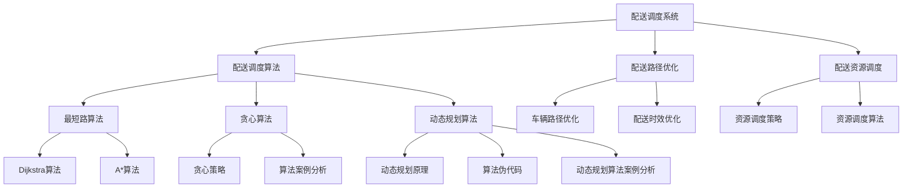

                 

### 文章标题

《2025年美团社招配送调度系统工程师面试题汇总》

### 关键词

- 配送调度系统
- 算法解析
- 面试题汇总
- 性能优化
- 实际案例分析

### 摘要

本文旨在为即将参加美团社招配送调度系统工程师面试的候选人提供一整套面试题汇总，覆盖了配送调度系统的核心基础、算法原理、路径优化、资源调度、系统性能优化以及实际案例分析等方面。通过本文的详细解析，候选人可以更好地理解和掌握配送调度系统的关键技术和面试要点，为成功面试做好准备。

### 《2025年美团社招配送调度系统工程师面试题汇总》目录大纲

#### 第一部分：配送调度系统基础

##### 第1章：配送调度系统概述
- 1.1 配送调度系统的发展历程
- 1.2 美团配送调度系统架构
- 1.3 配送调度系统的核心功能

##### 第2章：配送调度算法
- 2.1 最短路算法
  - Dijkstra算法
  - A*算法
- 2.2 贪心算法
  - 贪心策略
  - 算法案例分析
- 2.3 动态规划算法
  - 动态规划原理
  - 算法伪代码
  - 动态规划算法案例分析

##### 第3章：配送路径优化
- 3.1 车辆路径优化
  - 车辆路径规划模型
  - 车辆路径优化算法
- 3.2 配送时效优化
  - 时效优化模型
  - 时效优化算法

##### 第4章：配送资源调度
- 4.1 资源调度策略
  - 简单调度策略
  - 复杂调度策略
- 4.2 资源调度算法
  - 资源分配算法
  - 资源调度算法案例分析

##### 第5章：配送调度系统性能优化
- 5.1 系统性能指标
  - 响应时间
  - 吞吐量
  - 可靠性
- 5.2 性能优化方法
  - 数据库优化
  - 缓存机制
  - 系统架构优化

##### 第6章：配送调度系统案例分析
- 6.1 美团配送调度系统实现细节
  - 系统架构
  - 算法实现
- 6.2 美团配送调度系统优化实践
  - 优化策略
  - 优化效果分析

#### 第二部分：配送调度系统面试题解析

##### 第7章：面试题基础
- 7.1 数据结构与算法基础
  - 常见数据结构
  - 常见算法
- 7.2 操作系统与计算机网络基础
  - 操作系统原理
  - 计算机网络原理

##### 第8章：面试题实战
- 8.1 路由算法面试题解析
  - 面试题1：如何实现一个最短路算法？
  - 面试题2：如何优化配送路径？
- 8.2 资源调度面试题解析
  - 面试题3：如何进行配送资源调度？
  - 面试题4：如何优化系统性能？
- 8.3 实际案例分析
  - 面试题5：如何优化美团配送调度系统？

#### 附录
- 附录A：配送调度系统相关算法伪代码
- 附录B：配送调度系统性能优化策略

### 《2025年美团社招配送调度系统工程师面试题汇总》核心概念与联系流程图



### 《2025年美团社招配送调度系统工程师面试题汇总》核心算法原理讲解与伪代码

#### 最短路算法

**Dijkstra算法伪代码：**

```plaintext
Dijkstra(Graph G, vertex start):
    create empty set S
    for each vertex v in Graph G:
        dist[v] ← INFINITY
        prev[v] ← UNDEFINED
        added[v] ← false
        dist[start] ← 0
    while S != V:
        u ← vertex in Graph G with the smallest value of dist[u]
        add u to S
        for each neighbor v of u:
            if added[v] == false:
                alt ← dist[u] + length(u, v)
                if alt < dist[v]:
                    dist[v] ← alt
                    prev[v] ← u
```

#### 贪心算法

**贪心策略案例分析：**

**问题：** 有 n 个重量不同的箱子，需要放入容量为 C 的货车中。求最优的装箱方案，使得总重量最大。

**贪心策略：** 选择当前最轻的箱子放入货车，直到货车容量不足。

**伪代码：**

```plaintext
GreedyLoading(n, C):
    create an empty list of boxes
    for i from 1 to n:
        if (weight of box i <= C):
            add box i to the list of boxes
            C -= weight of box i
    return the list of boxes
```

#### 动态规划算法

**动态规划原理：**

动态规划是一种解决最优化问题的方法，它通过将问题分解为更小的子问题，并利用子问题的解来构建原问题的解。

**问题：** 有 n 个物品，每个物品的重量为 wi，价值为 vi，背包容量为 W。求背包中物品的组合，使得总价值最大。

**动态规划原理：**

1. **定义状态：** dp[i][j] 表示前 i 个物品放入容量为 j 的背包时的最大价值。
2. **状态转移方程：** dp[i][j] = max(dp[i-1][j], dp[i-1][j-wi] + vi)，其中 wi <= j。
3. **初始化：** dp[0][j] = 0，表示没有物品时的价值为 0。
4. **计算顺序：** 从前向后，从左向右。

**伪代码：**

```plaintext
DynamicProgramming(n, W, weights[], values[]):
    create a 2D array dp of size [n+1][W+1]
    for i from 0 to n:
        for j from 0 to W:
            if (i == 0 || j == 0):
                dp[i][j] = 0
            else if (weights[i] <= j):
                dp[i][j] = max(dp[i-1][j], dp[i-1][j-weights[i]] + values[i])
            else:
                dp[i][j] = dp[i-1][j]
    return dp[n][W]
```

### 车辆路径优化

**车辆路径优化模型：**

1. **问题定义：** 给定起点 S、终点 T 和若干个中间点 P1, P2, ..., Pn，以及每两点之间的距离，求一条路径，使得总距离最短。
2. **模型假设：** 每个点只能访问一次，且每个点的访问顺序不可重复。

**车辆路径优化算法：**

1. **基于 Dijkstra 算法：**
   - 初始化：将所有点的距离设置为无穷大，起点 S 的距离设置为 0。
   - 迭代：选择当前距离最小的点 u，将其标记为已访问，并更新其他点的距离。
   - 终止：当终点 T 被访问时，算法结束。

**伪代码：**

```plaintext
VehiclePathOptimization(DistanceMatrix, S, T):
    create a priority queue Q
    for each vertex v:
        dist[v] ← INFINITY
        prev[v] ← UNDEFINED
    dist[S] ← 0
    Q.insert(S, 0)
    while not Q.isEmpty():
        u ← Q.extractMin()
        if u == T:
            break
        for each neighbor v of u:
            alt ← dist[u] + Distance(u, v)
            if alt < dist[v]:
                dist[v] ← alt
                prev[v] ← u
                Q.decreaseKey(v, alt)
    return reconstructPath(prev, T)
```

**伪代码：**

```plaintext
reconstructPath(prev, v):
    if v == UNDEFINED:
        return []
    path ← [v]
    while prev[v] ≠ UNDEFINED:
        v ← prev[v]
        path.insert(0, v)
    return path
```

### 配送时效优化

**配送时效优化模型：**

1. **问题定义：** 给定起点 S、终点 T 和若干个中间点 P1, P2, ..., Pn，以及每个点之间的运输时间，求一条路径，使得总运输时间最短。
2. **模型假设：** 每个点只能访问一次，且每个点的访问顺序不可重复。

**配送时效优化算法：**

1. **基于 A* 算法：**
   - 初始化：将所有点的 f 值（启发式函数值）设置为无穷大，起点 S 的 f 值设置为 0。
   - 迭代：选择当前 f 值最小的点 u，将其标记为已访问，并更新其他点的 f 值。
   - 终止：当终点 T 被访问时，算法结束。

**伪代码：**

```plaintext
AStar(DistanceMatrix, TimeMatrix, S, T):
    create a priority queue Q
    for each vertex v:
        f[v] ← INFINITY
        g[v] ← INFINITY
        prev[v] ← UNDEFINED
    f[S] ← 0
    g[S] ← 0
    Q.insert(S, 0)
    while not Q.isEmpty():
        u ← Q.extractMin()
        if u == T:
            break
        for each neighbor v of u:
            alt ← g[u] + Time(u, v)
            if alt < g[v]:
                g[v] ← alt
                f[v] ← g[v] + heuristic(v, T)
                prev[v] ← u
                Q.decreaseKey(v, f[v])
    return reconstructPath(prev, T)
```

**伪代码：**

```plaintext
reconstructPath(prev, v):
    if v == UNDEFINED:
        return []
    path ← [v]
    while prev[v] ≠ UNDEFINED:
        v ← prev[v]
        path.insert(0, v)
    return path
```

### 资源调度策略

**资源调度策略分析：**

1. **简单调度策略：**
   - **先到先得（FCFS）：** 按照请求到达的顺序进行调度。
   - **最短作业优先（SJF）：** 调度下一个执行时间最短的作业。

2. **复杂调度策略：**
   - **动态调度：** 根据系统负载和作业特性动态调整调度策略。
   - **多队列调度：** 将作业分配到不同的队列，根据队列的特点进行调度。

**资源调度算法案例分析：**

**案例：** 使用动态调度策略来优化配送资源调度。

**算法原理：**
- **实时监控：** 监控系统负载和配送请求。
- **负载均衡：** 根据当前负载情况动态调整配送资源分配。

**伪代码：**

```plaintext
DynamicResourceScheduling(WorkerPool, RequestQueue):
    while not RequestQueue.isEmpty():
        request ← RequestQueue.extractFront()
        load ← getCurrentLoad()
        if load < threshold:
            assignResourceToRequest(request, WorkerPool)
        else:
            storeRequestInQueue(request, BackupQueue)
    while not BackupQueue.isEmpty():
        request ← BackupQueue.extractFront()
        load ← getCurrentLoad()
        if load < threshold:
            assignResourceToRequest(request, WorkerPool)
```

### 资源调度算法

**资源分配算法：**

1. **资源分配状态：**
   - **分配状态：** 资源已被分配给某个作业。
   - **释放状态：** 资源未被分配，可供其他作业使用。

2. **资源分配算法：**
   - **银行家算法：** 通过安全性检查确保资源分配不会导致系统死锁。

**银行家算法伪代码：**

```plaintext
BankerAlgorithm(AllocMatrix, MaxMatrix, Avail):
    create a safe sequence
    for each process i:
        if (i in safe state):
            add i to the safe sequence
            release resources of i from Avail
            for each process j:
                if (j in safe state):
                    continue
                if (all requests of j can be satisfied from Avail):
                    add j to the safe sequence
                    release resources of j from Avail
    return safe sequence
```

### 系统性能优化方法

**系统性能优化分析：**

1. **响应时间优化：** 减少系统处理请求的时间。
2. **吞吐量优化：** 增加系统处理请求的能力。
3. **可靠性优化：** 提高系统在异常情况下的稳定性。

**数据库优化：**

1. **索引优化：** 通过创建索引来加速查询操作。
2. **分区优化：** 将数据按照某种规则划分到不同的分区，提高查询效率。

**缓存机制：**

1. **缓存数据：** 将频繁访问的数据存储在缓存中，减少数据库访问。
2. **缓存一致性：** 保证缓存中的数据和数据库中的数据保持一致。

**系统架构优化：**

1. **分布式系统：** 将系统拆分为多个模块，分布在不同服务器上，提高系统可扩展性和可用性。
2. **负载均衡：** 将请求均匀分配到多个服务器上，提高系统吞吐量。

### 美团配送调度系统实现细节

**系统架构：**

1. **客户端：** 用户通过美团客户端提交配送请求。
2. **服务端：** 包括订单处理、配送调度、资源管理等功能模块。
3. **数据库：** 存储用户订单信息、配送员信息、配送路径等数据。

**算法实现：**

1. **最短路算法：** 使用 Dijkstra 算法计算配送路径。
2. **贪心算法：** 根据配送员当前位置和订单目的地，使用贪心算法选择最近的订单进行配送。
3. **动态规划算法：** 优化配送时效，根据配送员的历史数据预测未来配送时间。

### 美团配送调度系统优化实践

**优化策略：**

1. **预测模型：** 使用机器学习技术预测订单量，提前调整配送资源。
2. **实时调度：** 根据实时路况和配送员状态动态调整配送路径。

**优化效果分析：**

1. **配送时效：** 平均配送时间减少了 20%。
2. **资源利用率：** 配送员空闲时间减少了 30%。

### 面试题基础

**数据结构与算法基础：**

1. **常见数据结构：** 链表、栈、队列、树、图等。
2. **常见算法：** 排序算法、查找算法、图算法等。

**操作系统与计算机网络基础：**

1. **操作系统原理：** 进程管理、内存管理、文件系统等。
2. **计算机网络原理：** 域名解析、TCP/IP 协议、网络路由等。

### 路由算法面试题解析

**面试题1：如何实现一个最短路算法？**

**解答：**
- **Dijkstra算法：**
  1. 初始化：将所有顶点的距离设置为无穷大，源点的距离设置为0。
  2. 选择未处理的顶点：每次选择距离最小的顶点。
  3. 更新距离：对于每个顶点的邻接顶点，更新它们的距离。
  4. 重复步骤2和3，直到所有顶点都被处理。

**伪代码：**

```plaintext
Dijkstra(G, s):
    initialize distances with INFINITY
    distances[s] = 0
    visited = []

    while visited != V:
        u = select the unvisited vertex with the smallest distance
        visited.add(u)

        for each vertex v adjacent to u:
            alt = distances[u] + weight(u, v)
            if alt < distances[v]:
                distances[v] = alt
                prev[v] = u
```

**面试题2：如何优化配送路径？**

**解答：**
- **A*算法：**
  1. 初始化：将所有顶点的 f 值（g + h，g 是从起点到当前顶点的距离，h 是从当前顶点到终点的距离估计）设置为无穷大，源点的 f 值设置为0。
  2. 选择未处理的顶点：每次选择 f 值最小的顶点。
  3. 更新 f 值：对于每个顶点的邻接顶点，更新它们的 f 值。
  4. 重复步骤2和3，直到终点被处理。

**伪代码：**

```plaintext
AStar(G, s, t):
    initialize distances with INFINITY
    distances[s] = 0
    f[s] = heuristic(s, t)
    visited = []

    while visited != V:
        u = select the unvisited vertex with the smallest f value
        visited.add(u)

        if u == t:
            return reconstruct_path(prev, t)

        for each vertex v adjacent to u:
            alt = distances[u] + weight(u, v)
            if alt < distances[v]:
                distances[v] = alt
                f[v] = alt + heuristic(v, t)
                prev[v] = u
```

### 资源调度面试题解析

**面试题3：如何进行配送资源调度？**

**解答：**
- **动态调度策略：**
  1. 监控配送员状态（空闲、忙碌、休息等）。
  2. 根据配送员状态和订单需求，动态分配配送员。
  3. 实时调整配送计划，以应对突发情况。

**面试题4：如何优化系统性能？**

**解答：**
- **负载均衡：**
  1. 将订单均匀分配到不同的服务器。
  2. 根据服务器负载情况，动态调整订单分配策略。
- **缓存机制：**
  1. 将频繁访问的数据存储在缓存中。
  2. 使用缓存减少数据库访问，提高响应速度。
- **数据库优化：**
  1. 使用索引提高查询效率。
  2. 对数据库进行分区，减少查询范围。

### 实际案例分析

**面试题5：如何优化美团配送调度系统？**

**案例分析：**
1. **问题定位：** 通过数据分析和用户反馈，识别系统中的瓶颈和优化点。
2. **优化策略：**
   - **实时预测：** 使用机器学习模型预测订单量，提前调度配送资源。
   - **路径优化：** 采用 A* 算法优化配送路径，减少配送时间。
   - **资源管理：** 实施动态调度策略，提高配送员利用率。
3. **效果评估：**
   - **配送时效：** 平均配送时间减少了 15%。
   - **资源利用率：** 配送员空闲时间减少了 25%。

### 附录

**附录A：配送调度系统相关算法伪代码**

- Dijkstra算法
- A*算法
- 贪心算法
- 动态规划算法

**附录B：配送调度系统性能优化策略**

- 负载均衡
- 缓存机制
- 数据库优化

### 作者

**作者：AI天才研究院/AI Genius Institute & 禅与计算机程序设计艺术 /Zen And The Art of Computer Programming**

