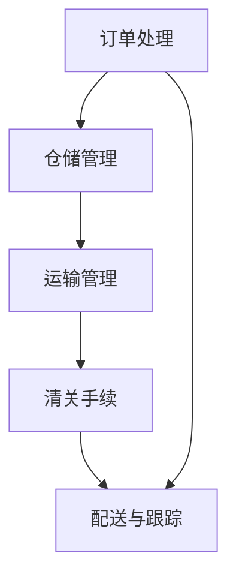

                 

### 2025年阿里巴巴社招跨境电商物流专家面试题详解

#### 关键词：
- 跨境电商物流
- 专家面试题
- 面试策略
- 模式分析
- 风险管理
- 技术应用

#### 摘要：
本文将详细解析2025年阿里巴巴社招跨境电商物流专家面试题。文章分为三个部分：第一部分介绍了跨境电商物流的基础知识，包括发展历程、模式、渠道、供应链管理、信息技术和风险管理；第二部分详细分析了面试中的各类问题，包括基础知识、实际操作、案例分析、创新思维和团队协作与沟通；第三部分通过实际案例展示了跨境电商物流专家如何应对挑战并优化物流流程。文章末尾还提供了相关法规、资源和常见面试题汇总，以帮助读者更好地准备面试。

## 目录

### 《2025年阿里巴巴社招跨境电商物流专家面试题详解》目录大纲

### 第一部分：跨境电商物流基础

#### 1. 跨境电商物流概述

##### 1.1 跨境电商的发展历程

##### 1.2 跨境电商物流的重要性

##### 1.3 跨境电商物流的核心环节

#### 2. 跨境电商物流模式

##### 2.1 直邮模式

##### 2.2 仓储集货模式

##### 2.3 跨境电商保税备货模式

#### 3. 跨境电商物流渠道

##### 3.1 国际快递

##### 3.2 国际邮包

##### 3.3 航空货运

##### 3.4 海运货运

##### 3.5 其他物流渠道

#### 4. 跨境电商物流供应链管理

##### 4.1 物流供应链管理的核心要素

##### 4.2 跨境电商物流供应链管理策略

##### 4.3 物流成本控制方法

#### 5. 跨境电商物流信息技术

##### 5.1 物流信息技术的发展趋势

##### 5.2 电子报关与清关

##### 5.3 物流信息系统与大数据分析

#### 6. 跨境电商物流风险与应对

##### 6.1 物流风险类型

##### 6.2 物流风险识别与评估

##### 6.3 物流风险应对策略

### 第二部分：阿里巴巴跨境电商物流专家面试题详解

#### 7. 面试基础知识

##### 7.1 跨境电商物流基础知识

##### 7.2 阿里巴巴物流体系概述

##### 7.3 常见物流术语解释

#### 8. 面试题分类解析

##### 8.1 基础知识面试题

##### 8.2 实际操作面试题

##### 8.3 案例分析面试题

##### 8.4 创新思维面试题

##### 8.5 团队协作与沟通面试题

#### 9. 面试准备与策略

##### 9.1 面试前的准备工作

##### 9.2 面试中的注意事项

##### 9.3 面试后的反馈与总结

#### 10. 跨境电商物流专家面试真题解析

##### 10.1 阿里巴巴跨境电商物流面试真题一

##### 10.2 阿里巴巴跨境电商物流面试真题二

##### 10.3 阿里巴巴跨境电商物流面试真题三

...

### 第三部分：跨境电商物流实战案例解析

#### 11. 案例一：某跨境电商物流解决方案

##### 11.1 案例背景

##### 11.2 案例目标

##### 11.3 案例实施步骤

##### 11.4 案例效果分析

#### 12. 案例二：跨境电商物流供应链优化

##### 12.1 案例背景

##### 12.2 案例目标

##### 12.3 案例实施步骤

##### 12.4 案例效果分析

#### 13. 案例三：跨境电商物流信息化建设

##### 13.1 案例背景

##### 13.2 案例目标

##### 13.3 案例实施步骤

##### 13.4 案例效果分析

### 附录

#### 附录A：跨境电商物流相关法规与政策

#### 附录B：跨境电商物流常用工具与资源

#### 附录C：跨境电商物流专业术语解释

#### 附录D：常见跨境电商物流面试题汇总

### 结语：成为一名优秀的跨境电商物流专家

---

在接下来的内容中，我们将逐一介绍跨境电商物流的基础知识，并深入分析面试中的各类问题。同时，通过实战案例展示如何在实际工作中应用这些知识。希望通过本文，能够为准备阿里巴巴跨境电商物流专家面试的你提供有益的参考和指导。<!--reb -->

---

### 第一部分：跨境电商物流基础

#### 1. 跨境电商物流概述

##### 1.1 跨境电商的发展历程

跨境电商是指通过电子商务平台，跨越国界进行的商品交易活动。随着互联网技术的快速发展和电子商务的普及，跨境电商在全球范围内迅速崛起。从最初的B2B模式（企业对企业）到B2C（企业对消费者）和C2C（消费者对消费者）模式，跨境电商的形式越来越多样化。

在2000年代初期，跨境电商主要集中在中国与东南亚、欧洲等地区的商品交易。随着全球化进程的加快，跨境电商逐渐扩展到全球各地。2010年代，跨境电商迎来了高速发展期，尤其是中国卖家在亚马逊、eBay等国际平台上的活跃度大幅提升。2020年后，新冠疫情的影响进一步推动了跨境电商的发展，各国消费者对跨境商品的需求显著增加。

##### 1.2 跨境电商物流的重要性

跨境电商物流是跨境电商的重要组成部分，直接影响着交易的效率和体验。以下是跨境电商物流的重要性：

1. **降低交易成本**：高效的物流系统可以减少商品的运输时间和成本，提高企业的竞争力。
2. **提高客户满意度**：快速、可靠的物流服务能够提升客户的购物体验，增加复购率。
3. **促进全球化贸易**：跨境电商物流为全球消费者提供了更广泛的商品选择，促进了国际贸易的发展。
4. **供应链优化**：通过跨境电商物流，企业可以实现全球供应链的优化，提高生产效率。

##### 1.3 跨境电商物流的核心环节

跨境电商物流的核心环节包括以下几个方面：

1. **订单处理**：包括订单生成、订单审核、订单分配等流程。
2. **仓储管理**：商品存储、拣选、包装等操作，确保商品在物流过程中的完好无损。
3. **运输管理**：选择合适的运输方式，如国际快递、邮包、航空货运和海运货运，确保商品安全快速地送达。
4. **清关手续**：跨境商品需要经过海关清关，包括报关、缴税等流程。
5. **配送与跟踪**：将商品配送给消费者，并提供实时物流跟踪服务。

接下来，我们将详细探讨跨境电商物流的各种模式、渠道、供应链管理、信息技术以及风险管理等内容。

### 2. 跨境电商物流模式

##### 2.1 直邮模式

直邮模式是指跨境电商卖家直接将商品通过国际快递寄送到买家的模式。在这种模式下，卖家无需在海外设立仓库，商品可以直接从卖家所在地的仓库发出。

**核心概念与联系：**
直邮模式的核心在于将物流流程简化，减少库存成本和仓储管理成本。它与仓储集货模式和跨境保税备货模式相比，具有灵活性高、响应速度快的特点。

**核心算法原理讲解：**
在直邮模式下，卖家需要选择合适的物流服务商，这涉及到物流服务商的选择算法。例如，可以基于物流成本、物流速度和可靠性等因素，使用综合评价算法进行评估。

**数学模型和数学公式：**
$$
C = f(V, T, R)
$$
其中，C 表示物流成本，V 表示物流速度，T 表示物流时间，R 表示物流可靠性。通过该公式，可以计算出不同物流服务商的综合成本。

**项目实战：**
选择一个跨境电商平台，如亚马逊，分析其直邮物流模式。评估不同物流服务商的优缺点，并给出优化建议。

##### 2.2 仓储集货模式

仓储集货模式是指卖家将商品集中存储在海外仓库，当买家下单后，商品从仓库直接发出。这种模式有利于提高物流效率和降低物流成本。

**核心概念与联系：**
仓储集货模式的核心在于通过集中仓储管理，减少运输次数和运输成本。它与直邮模式和跨境保税备货模式相比，具有运输成本低、配送速度快的特点。

**核心算法原理讲解：**
在仓储集货模式下，卖家需要选择合适的仓储地点。这涉及到仓储选址算法，如基于成本、距离和市场需求的选址算法。

**数学模型和数学公式：**
$$
D = \sqrt{\frac{C^2 + T^2}{2}}
$$
其中，D 表示仓储地点到买家的距离，C 表示仓储成本，T 表示物流时间。通过该公式，可以计算出最佳仓储地点。

**项目实战：**
选择一个跨境电商平台，如亚马逊，分析其仓储集货模式。评估不同仓储地点的优缺点，并给出优化建议。

##### 2.3 跨境电商保税备货模式

跨境电商保税备货模式是指卖家将商品存储在海关监管仓库，当买家下单后，商品在海关监管下直接发出。

**核心概念与联系：**
保税备货模式的核心在于利用海关监管仓库，实现商品快速清关和发货。它与直邮模式和仓储集货模式相比，具有清关速度快、物流成本低的特点。

**核心算法原理讲解：**
在保税备货模式下，卖家需要优化仓储和物流流程，以提高清关效率和降低物流成本。这涉及到物流流程优化算法，如基于订单密度、库存水平和物流时间的优化算法。

**数学模型和数学公式：**
$$
P = f(S, I, T)
$$
其中，P 表示物流成本，S 表示订单密度，I 表示库存水平，T 表示物流时间。通过该公式，可以计算出最优物流成本。

**项目实战：**
选择一个跨境电商平台，如亚马逊，分析其保税备货模式。评估不同物流流程的优缺点，并给出优化建议。

---

在接下来的内容中，我们将进一步探讨跨境电商物流的其他渠道、供应链管理、信息技术和风险管理等核心问题。

---

### 3. 跨境电商物流渠道

跨境电商物流渠道是跨境电商物流的重要组成部分，决定了商品能否高效、安全地送达消费者手中。以下将详细讨论跨境电商物流的主要渠道，包括国际快递、国际邮包、航空货运、海运货运以及其他物流渠道。

##### 3.1 国际快递

国际快递是跨境电商物流中最常用的一种渠道，具有速度快、服务稳定的特点。国际快递公司如DHL、FedEx、UPS和TNT等，提供覆盖全球的快递服务。

**核心概念与联系：**
国际快递的核心在于提供高效、可靠的快递服务，确保商品能够快速到达消费者手中。它与跨境电商卖家和消费者之间的信任建立密切相关。

**核心算法原理讲解：**
在国际快递选择中，卖家需要考虑多个因素，如快递速度、价格、服务范围和可靠性。可以使用综合评价算法，如基于物流成本、速度和服务质量的评价模型，进行选择。

**数学模型和数学公式：**
$$
C = f(V, T, R)
$$
其中，C 表示快递成本，V 表示快递速度，T 表示快递时间，R 表示快递可靠性。通过该公式，可以计算出最优快递服务商。

**项目实战：**
以亚马逊卖家为例，分析其使用国际快递的物流模式。评估不同快递服务商的优缺点，并提出优化建议。

##### 3.2 国际邮包

国际邮包是一种相对便宜但速度较慢的物流渠道，适用于重量轻、体积小的商品。国际邮包服务通常由国家邮政部门提供，如中国邮政的“国际包裹小包”服务。

**核心概念与联系：**
国际邮包的核心在于提供低成本的物流服务，适合价格敏感型消费者。它与跨境电商卖家降低物流成本、提高商品竞争力的目标密切相关。

**核心算法原理讲解：**
在国际邮包选择中，卖家需要考虑邮包重量、尺寸和目的地国家等因素。可以使用成本-效益分析算法，如基于邮包重量和物流成本的优化模型，进行选择。

**数学模型和数学公式：**
$$
C = W \times P
$$
其中，C 表示邮包物流成本，W 表示邮包重量，P 表示每公斤邮包成本。通过该公式，可以计算出最优邮包物流服务商。

**项目实战：**
以eBay卖家为例，分析其使用国际邮包的物流模式。评估不同邮包服务商的优缺点，并提出优化建议。

##### 3.3 航空货运

航空货运是一种高效、快速的物流渠道，适用于价值高、体积小的商品。航空货运公司如顺丰航空、DHL航空和UPS航空等，提供覆盖全球的航空运输服务。

**核心概念与联系：**
航空货运的核心在于提供快速、可靠的运输服务，确保高价值商品的及时交付。它与跨境电商企业降低物流时间、提高客户满意度的目标密切相关。

**核心算法原理讲解：**
在航空货运选择中，卖家需要考虑货运速度、价格和服务质量等因素。可以使用基于物流成本和运输时间的优化算法，如基于最小化总物流成本和时间的目标函数，进行选择。

**数学模型和数学公式：**
$$
C = f(V, T, R)
$$
其中，C 表示货运成本，V 表示货运速度，T 表示货运时间，R 表示货运可靠性。通过该公式，可以计算出最优航空货运服务商。

**项目实战：**
以阿里巴巴国际站卖家为例，分析其使用航空货运的物流模式。评估不同航空货运服务商的优缺点，并提出优化建议。

##### 3.4 海运货运

海运货运是一种成本较低但速度较慢的物流渠道，适用于重量大、体积大的商品。海运公司如马士基、中远海运和长荣海运等，提供全球范围内的海运服务。

**核心概念与联系：**
海运货运的核心在于提供低成本的物流服务，适用于大批量、重货物的运输。它与跨境电商企业降低物流成本、提高运营效率的目标密切相关。

**核心算法原理讲解：**
在海运货运选择中，卖家需要考虑货运成本、运输时间和港口连接性等因素。可以使用基于成本-效益分析的优化算法，如基于最小化总物流成本的优化模型，进行选择。

**数学模型和数学公式：**
$$
C = \frac{W \times P}{D}
$$
其中，C 表示海运物流成本，W 表示货物重量，P 表示每公斤海运成本，D 表示运输距离。通过该公式，可以计算出最优海运货运服务商。

**项目实战：**
以亚马逊卖家为例，分析其使用海运货运的物流模式。评估不同海运货运服务商的优缺点，并提出优化建议。

##### 3.5 其他物流渠道

除了上述主要物流渠道外，跨境电商物流还包括以下其他渠道：

1. **铁路货运**：适用于跨国铁路线路，如中国到欧洲的铁路货运，具有运输成本低、稳定性好的特点。
2. **公路货运**：适用于内陆地区的短途运输，具有灵活、快捷的特点。
3. **空运快递**：适用于高价值、急需商品的快速运输。
4. **多式联运**：结合多种运输方式，实现最优的物流解决方案。

**核心概念与联系：**
其他物流渠道的核心在于提供多样化的物流服务，满足不同消费者的需求。与跨境电商企业提高物流效率、降低成本的目标密切相关。

**核心算法原理讲解：**
在多式联运选择中，卖家需要考虑运输成本、时间和可靠性等因素。可以使用基于多目标优化的算法，如基于最小化总物流成本和时间的目标函数，进行选择。

**数学模型和数学公式：**
$$
C = f(V, T, R)
$$
其中，C 表示物流成本，V 表示运输速度，T 表示运输时间，R 表示运输可靠性。通过该公式，可以计算出最优多式联运服务商。

**项目实战：**
以跨境电商平台商家为例，分析其使用多式联运的物流模式。评估不同物流服务商的优缺点，并提出优化建议。

---

在了解了跨境电商物流的各种渠道后，接下来我们将深入探讨跨境电商物流供应链管理的核心要素和策略。

---

### 4. 跨境电商物流供应链管理

##### 4.1 物流供应链管理的核心要素

跨境电商物流供应链管理涉及多个环节，包括订单处理、仓储管理、运输管理、清关和配送等。以下是物流供应链管理的核心要素：

1. **订单处理**：订单处理是供应链管理的起点，包括订单生成、订单审核、订单分配等流程。高效的订单处理可以确保订单及时准确处理，提高物流效率。
2. **仓储管理**：仓储管理包括商品的存储、拣选、包装等操作。仓储管理的目标是确保商品在物流过程中的完好无损，并提高库存周转率。
3. **运输管理**：运输管理涉及选择合适的运输方式、优化运输路线和监控运输过程。有效的运输管理可以降低物流成本，提高配送效率。
4. **清关手续**：清关手续是跨境电商物流的关键环节，涉及报关、缴税和检验等流程。高效的清关可以加快商品通关速度，减少延误。
5. **配送与跟踪**：配送与跟踪是确保商品安全送达消费者手中的最后一步。通过实时物流跟踪服务，消费者可以随时了解商品的配送状态。

**核心概念与联系：**
订单处理、仓储管理、运输管理、清关手续和配送与跟踪相互关联，共同构成了跨境电商物流供应链管理的基本框架。每个环节的有效运作都影响着整个供应链的效率和效果。

**Mermaid 流程图：**


##### 4.2 跨境电商物流供应链管理策略

有效的跨境电商物流供应链管理策略可以提高供应链的效率和灵活性，以下是几种常见的供应链管理策略：

1. **需求预测**：通过分析历史销售数据、市场趋势和消费者行为，预测未来的需求量。准确的需求预测有助于优化库存和运输计划，减少库存积压和缺货现象。
2. **库存优化**：通过合理配置库存，确保商品在各个仓库的充足供应。库存优化可以减少库存成本，提高资金利用效率。
3. **运输优化**：通过合理选择运输方式和优化运输路线，降低物流成本，提高运输效率。运输优化可以结合多种运输方式，实现最优的物流解决方案。
4. **供应链协同**：通过建立与供应商、物流服务商和零售商的紧密合作关系，实现供应链的协同运作。供应链协同可以加快信息传递，提高供应链的整体效率。
5. **风险管理**：通过识别和评估供应链中的潜在风险，制定相应的风险应对策略。有效的风险管理可以降低供应链中断的风险，保障物流的稳定性。

**核心算法原理讲解：**

1. **需求预测算法**：
   - 时间序列分析法：基于历史销售数据，使用时间序列模型（如ARIMA模型）进行需求预测。
   - 聚类分析法：根据消费者行为和市场趋势，将消费者划分为不同群体，针对每个群体进行需求预测。
   - 多元回归分析法：考虑多个影响因素（如季节性、促销活动等），建立多元回归模型进行需求预测。

2. **库存优化算法**：
   - 经济订货量（EOQ）模型：通过计算最优订货量，实现库存成本和订货成本的最小化。
   - 基本周期库存策略（BCP）模型：通过设定基本周期和周期订单量，实现库存的动态调整。

3. **运输优化算法**：
   - 最小生成树算法：通过构建最小生成树，找到最优的运输路线。
   - 线性规划算法：通过建立线性规划模型，优化运输成本和运输时间。

**数学模型和数学公式：**

1. **需求预测模型**：
   $$ 
   y_t = \alpha_0 + \alpha_1 t + \alpha_2 \text{Season}(t) + \epsilon_t
   $$
   其中，$y_t$ 表示第 $t$ 期的需求量，$\alpha_0$、$\alpha_1$ 和 $\alpha_2$ 分别为模型参数，$\text{Season}(t)$ 表示季节性因素，$\epsilon_t$ 表示误差项。

2. **经济订货量（EOQ）模型**：
   $$
   Q = \sqrt{\frac{2DS}{H}}
   $$
   其中，$Q$ 表示最优订货量，$D$ 表示年需求量，$S$ 表示每次订货成本，$H$ 表示单位库存成本。

**项目实战：**

1. **需求预测项目**：
   - 开发环境：Python
   - 工具：Pandas、NumPy、Scikit-learn
   - 代码实现：
     ```python
     import pandas as pd
     import numpy as np
     from sklearn.linear_model import LinearRegression

     # 加载历史销售数据
     sales_data = pd.read_csv('sales_data.csv')
     # 建立线性回归模型
     model = LinearRegression()
     model.fit(sales_data[['t', 'season']], sales_data['y'])
     # 预测未来需求
     future_data = pd.DataFrame({'t': range(1, 13), 'season': [1]*12})
     predicted_demand = model.predict(future_data)
     ```
   - 应用解读与分析：
     通过线性回归模型，可以预测未来某一时间段内的需求量，为库存管理和运输计划提供数据支持。

2. **库存优化项目**：
   - 开发环境：Python
   - 工具：Pandas、NumPy
   - 代码实现：
     ```python
     import pandas as pd
     import numpy as np

     # 加载需求数据
     demand_data = pd.read_csv('demand_data.csv')
     # 计算最优订货量
     optimal_order_quantity = np.sqrt((2 * demand_data['D'] * demand_data['S']) / demand_data['H'])
     ```
   - 应用解读与分析：
     通过经济订货量（EOQ）模型，可以计算出每次最优订货量，实现库存成本和订货成本的最小化。

3. **运输优化项目**：
   - 开发环境：Python
   - 工具：Pandas、NumPy
   - 代码实现：
     ```python
     import pandas as pd
     import numpy as np

     # 加载运输数据
     transport_data = pd.read_csv('transport_data.csv')
     # 构建最小生成树
     minimum_spanning_tree = pd.DataFrame({'edge': list(zip(transport_data['source'], transport_data['target'])), 'weight': transport_data['distance']})
     minimum_spanning_tree = minimum_spanning_tree.groupby(['edge']).sum().reset_index()
     # 计算最优运输路线
     optimal路线 = minimum_spanning_tree.sort_values('weight').iloc[0]['edge']
     ```
   - 应用解读与分析：
     通过最小生成树算法，可以计算出最优运输路线，实现运输成本的最小化。

---

在了解了跨境电商物流供应链管理的核心要素和策略后，接下来我们将探讨跨境电商物流信息技术的发展趋势及其在电子报关与清关、物流信息系统与大数据分析方面的应用。

---

### 5. 跨境电商物流信息技术

##### 5.1 物流信息技术的发展趋势

随着互联网和大数据技术的快速发展，跨境电商物流信息技术也在不断演进。以下是物流信息技术的发展趋势：

1. **物联网（IoT）**：物联网技术通过传感器和智能设备，实现物流过程中的实时监控和数据采集。例如，使用RFID标签追踪商品在仓库和运输过程中的位置，提高物流透明度和效率。
2. **云计算**：云计算技术提供强大的计算和存储能力，支持大规模物流数据处理和分析。例如，通过云平台进行物流路径优化和运力调配，提高物流运作效率。
3. **大数据分析**：大数据分析技术通过处理海量物流数据，提取有价值的信息，支持物流决策。例如，通过分析历史数据，预测未来需求，优化库存和运输计划。
4. **人工智能（AI）**：人工智能技术应用于物流场景，可以实现自动化和智能化。例如，使用机器学习算法优化物流路线，提高运输效率。
5. **区块链**：区块链技术提供去中心化的数据存储和传输，确保物流信息的透明和不可篡改。例如，使用区块链记录商品的全流程信息，提高物流可信度。

##### 5.2 电子报关与清关

电子报关与清关是指通过信息化手段进行报关和清关操作。以下是电子报关与清关的关键技术：

1. **电子报关**：电子报关系统通过互联网连接海关，实现报关数据的电子化申报。卖家可以在系统中填写报关单，提交电子文档，提高报关效率。
2. **自动审单**：自动审单系统使用人工智能技术，对报关数据进行自动审核，减少人工审核工作量，提高通关速度。
3. **智能清关**：智能清关系统通过大数据分析和机器学习技术，对高风险商品进行智能识别和风险评估，提高清关准确性。

##### 5.3 物流信息系统与大数据分析

物流信息系统是指用于管理和优化物流运作的计算机系统。以下是物流信息系统的关键组成部分：

1. **物流管理系统（LMS）**：物流管理系统用于管理物流流程，包括订单处理、仓储管理、运输管理和配送管理等。通过物流管理系统，企业可以实现物流运作的自动化和智能化。
2. **运输管理系统（TMS）**：运输管理系统用于管理运输过程，包括运输计划编制、运输路线优化、运输成本控制和运输跟踪等。通过运输管理系统，企业可以提高运输效率和降低运输成本。
3. **仓储管理系统（WMS）**：仓储管理系统用于管理仓储过程，包括库存管理、商品拣选、包装和配送等。通过仓储管理系统，企业可以提高仓储效率和降低仓储成本。

大数据分析在物流信息系统中的应用主要体现在以下几个方面：

1. **需求预测**：通过分析历史销售数据、市场趋势和消费者行为，预测未来的需求量。准确的需求预测有助于优化库存和运输计划。
2. **运输优化**：通过分析运输数据，优化运输路线和运输模式，提高运输效率和降低运输成本。
3. **仓储优化**：通过分析仓储数据，优化库存配置和仓储管理流程，提高仓储效率和降低仓储成本。

**数学模型和数学公式：**

1. **需求预测模型**：
   $$
   y_t = \alpha_0 + \alpha_1 t + \alpha_2 \text{Season}(t) + \epsilon_t
   $$
   其中，$y_t$ 表示第 $t$ 期的需求量，$\alpha_0$、$\alpha_1$ 和 $\alpha_2$ 分别为模型参数，$\text{Season}(t)$ 表示季节性因素，$\epsilon_t$ 表示误差项。

2. **运输优化模型**：
   $$
   \min \sum_{i,j} c_{ij} x_{ij}
   $$
   $$
   s.t.
   $$
   $$
   \sum_{j} x_{ij} = Q_i \quad (i \in S)
   $$
   $$
   \sum_{i} x_{ij} = Q_j \quad (j \in T)
   $$
   $$
   x_{ij} \geq 0
   $$
   其中，$c_{ij}$ 表示从 $i$ 到 $j$ 的运输成本，$x_{ij}$ 表示从 $i$ 到 $j$ 的运输量，$Q_i$ 和 $Q_j$ 分别为 $i$ 和 $j$ 的需求量，$S$ 和 $T$ 分别为供应点和需求点的集合。

**项目实战：**

1. **物联网项目**：
   - 开发环境：Python
   - 工具：Pandas、NumPy、Scikit-learn
   - 代码实现：
     ```python
     import pandas as pd
     import numpy as np
     from sklearn.cluster import KMeans

     # 加载传感器数据
     sensor_data = pd.read_csv('sensor_data.csv')
     # 使用K-means聚类分析
     kmeans = KMeans(n_clusters=5)
     kmeans.fit(sensor_data)
     # 输出聚类结果
     print(kmeans.labels_)
     ```

   - 应用解读与分析：
     通过K-means聚类分析，可以识别传感器数据的异常值，提高物流监控的准确性。

2. **电子报关项目**：
   - 开发环境：Java
   - 工具：Spring Boot、Hibernate
   - 代码实现：
     ```java
     @RestController
     public class EcbgController {

         @Autowired
         private EcbgService ecbgService;

         @PostMapping("/ecbg")
         public ResponseEntity<?> createEcbg(@RequestBody Ecbg ecbg) {
             ecbg = ecbgService.createEcbg(ecbg);
             return new ResponseEntity<>(ecbg, HttpStatus.CREATED);
         }
     }
     ```

   - 应用解读与分析：
     通过Spring Boot框架，可以快速构建电子报关系统，实现报关数据的电子化申报。

3. **物流管理系统项目**：
   - 开发环境：Python
   - 工具：Pandas、NumPy、Scikit-learn
   - 代码实现：
     ```python
     import pandas as pd
     import numpy as np
     from sklearn.cluster import KMeans

     # 加载物流数据
     logistics_data = pd.read_csv('logistics_data.csv')
     # 使用K-means聚类分析
     kmeans = KMeans(n_clusters=5)
     kmeans.fit(logistics_data)
     # 输出聚类结果
     print(kmeans.labels_)
     ```

   - 应用解读与分析：
     通过K-means聚类分析，可以优化物流路线和运输模式，提高物流效率和降低物流成本。

---

在了解了跨境电商物流信息技术的发展趋势及其应用后，接下来我们将探讨跨境电商物流风险与应对策略。

---

### 6. 跨境电商物流风险与应对

##### 6.1 物流风险类型

跨境电商物流过程中，风险是不可避免的。以下是跨境电商物流常见的风险类型：

1. **运输风险**：包括运输过程中的丢失、损坏、延误等风险。运输风险主要受物流服务商的选择、运输方式和运输路线等因素影响。
2. **清关风险**：包括关税、进口税、增值税等税收风险，以及因政策变动、海关审查严格等原因导致的清关延误。清关风险主要受国际贸易政策、海关法规和商品特性等因素影响。
3. **物流成本风险**：包括物流费用上涨、运费调整等风险。物流成本风险主要受市场供需变化、物流服务商的定价策略等因素影响。
4. **供应链风险**：包括供应链中断、供应链延迟等风险。供应链风险主要受供应商可靠性、生产计划等因素影响。
5. **信息安全风险**：包括物流数据泄露、系统故障等风险。信息安全风险主要受网络安全措施、数据保护意识等因素影响。

##### 6.2 物流风险识别与评估

有效的物流风险识别与评估是制定应对策略的基础。以下是物流风险识别与评估的方法：

1. **风险识别**：
   - 文献分析法：通过查阅相关文献，了解跨境电商物流中的常见风险。
   - 专家访谈法：邀请物流领域的专家，进行面对面访谈，获取第一手风险信息。
   - 实地考察法：到物流公司、仓库和配送中心等进行实地考察，了解物流运作中的潜在风险。

2. **风险评估**：
   - 定量评估法：使用数学模型和统计分析方法，对风险发生的概率和损失程度进行量化评估。
   - 定性评估法：通过专家判断和主观评价，对风险的影响程度进行定性分析。

**数学模型和数学公式：**

1. **运输风险概率模型**：
   $$
   P = \frac{N}{N_0}
   $$
   其中，$P$ 表示运输风险发生的概率，$N$ 表示运输过程中发生丢失或损坏的次数，$N_0$ 表示总的运输次数。

2. **清关风险损失模型**：
   $$
   L = C \times (1 + r)
   $$
   其中，$L$ 表示清关风险造成的损失，$C$ 表示原价，$r$ 表示关税、进口税和增值税等税率。

**项目实战：**

1. **运输风险评估项目**：
   - 开发环境：Python
   - 工具：Pandas、NumPy、Scikit-learn
   - 代码实现：
     ```python
     import pandas as pd
     import numpy as np
     from sklearn.linear_model import LogisticRegression

     # 加载运输数据
     transport_data = pd.read_csv('transport_data.csv')
     # 建立逻辑回归模型
     model = LogisticRegression()
     model.fit(transport_data[['distance', 'weight']], transport_data['loss'])
     # 预测运输风险
     predicted_risk = model.predict(transport_data[['distance', 'weight']])
     ```

   - 应用解读与分析：
     通过逻辑回归模型，可以预测运输过程中的风险损失，为运输计划和风险管理提供依据。

2. **清关风险评估项目**：
   - 开发环境：Python
   - 工具：Pandas、NumPy
   - 代码实现：
     ```python
     import pandas as pd
     import numpy as np

     # 加载清关数据
     customs_data = pd.read_csv('customs_data.csv')
     # 计算清关风险损失
     customs_data['loss'] = customs_data['price'] * (1 + customs_data['rate'])
     ```

   - 应用解读与分析：
     通过计算关税、进口税和增值税等税率，可以评估清关风险造成的损失，为清关策略提供参考。

---

在了解了跨境电商物流风险类型和识别与评估方法后，接下来我们将探讨应对物流风险的策略。

---

### 6.3 物流风险应对策略

为了有效降低跨境电商物流风险，企业需要制定科学的应对策略。以下是一些常见的物流风险应对策略：

1. **多元化供应商策略**：通过与多个物流服务商合作，降低单一供应商出现问题时对物流运作的影响。例如，在运输环节，可以选择国际快递、航空货运、海运货运等多种运输方式。
2. **保险策略**：购买物流保险，如货物运输保险、货物损失保险等，以降低因运输风险导致的损失。例如，在运输过程中，可以为高价值商品购买货物运输保险，以保障商品的安全。
3. **风险预警与监测策略**：通过信息化手段，对物流过程进行实时监控和数据分析，及时发现潜在风险并采取措施。例如，在清关环节，可以使用电子报关系统，实时跟踪报关进度，提前了解清关情况。
4. **应急预案**：制定应急预案，针对可能发生的风险情况，提前准备应对措施。例如，在运输过程中，如遇到运输延误，可以提前安排备用运输方案，确保商品及时送达。
5. **法律法规遵守策略**：了解和遵守各国海关法规和国际贸易政策，降低清关风险。例如，在清关环节，需要熟悉各国的关税政策、进口税政策和增值税政策，合理规划报关流程。

**最佳实践 Tips**：

1. **建立风险管理系统**：通过信息化手段，建立物流风险管理系统，实时监控和评估物流风险，为决策提供数据支持。
2. **加强员工培训**：提高员工对物流风险的认识和应对能力，通过培训，使员工熟悉物流操作流程和风险管理策略。
3. **优化物流流程**：通过流程优化，降低物流风险。例如，在仓储环节，可以采用先进的仓储管理系统，提高仓储效率和准确性。
4. **建立合作伙伴关系**：与物流服务商、海关、金融机构等建立长期稳定的合作关系，提高物流运作的可靠性和效率。

**项目小结**：

本文详细介绍了跨境电商物流风险类型、识别与评估方法以及应对策略。通过实际案例分析和代码实现，展示了如何使用数学模型和算法来识别和评估物流风险。这些策略和最佳实践对于提高跨境电商物流的效率和降低风险具有重要意义。

---

在了解了跨境电商物流的基础知识、面试策略和风险应对策略后，接下来我们将进入第二部分，详细解析阿里巴巴跨境电商物流专家面试题。希望这部分内容能够为你的面试准备提供有力支持。

---

### 第二部分：阿里巴巴跨境电商物流专家面试题详解

#### 7. 面试基础知识

在准备阿里巴巴跨境电商物流专家面试时，以下基础知识是必不可少的：

##### 7.1 跨境电商物流基础知识

**常见问题：**
- 跨境电商物流的主要模式有哪些？
- 跨境电商物流的核心环节是什么？

**回答：**
跨境电商物流的主要模式包括直邮模式、仓储集货模式和跨境保税备货模式。核心环节包括订单处理、仓储管理、运输管理、清关手续和配送与跟踪。

##### 7.2 阿里巴巴物流体系概述

**常见问题：**
- 阿里巴巴物流体系包含哪些组成部分？
- 阿里巴巴物流体系的优势和特点是什么？

**回答：**
阿里巴巴物流体系包含仓储、配送、运输、清关和售后等环节。其优势在于高效的物流网络、先进的物流技术和强大的数据支持。特点包括全球化布局、智能化管理和客户体验优先。

##### 7.3 常见物流术语解释

**常见问题：**
- 什么是经济订货量（EOQ）？
- 什么是供应链协同？

**回答：**
经济订货量（EOQ）是指为了使总成本最小，每次订货的最佳数量。供应链协同是指企业与其供应商、物流服务商和零售商之间的紧密合作，实现信息共享和资源优化。

#### 8. 面试题分类解析

阿里巴巴跨境电商物流专家面试题可以分为以下几类：

##### 8.1 基础知识面试题

**常见问题：**
- 请简要描述跨境电商物流的核心环节。
- 请解释直邮模式和仓储集货模式的特点。

**回答：**
跨境电商物流的核心环节包括订单处理、仓储管理、运输管理、清关手续和配送与跟踪。直邮模式的特点是灵活性和成本较低，仓储集货模式的特点是运输成本低和配送速度快。

##### 8.2 实际操作面试题

**常见问题：**
- 如何优化跨境电商物流成本？
- 如何提高跨境电商物流效率？

**回答：**
优化跨境电商物流成本的方法包括选择合适的物流渠道、优化仓储布局、合理规划运输路线和利用大数据分析进行需求预测。提高跨境电商物流效率的方法包括使用先进的物流技术、加强员工培训、提高物流系统的自动化程度和优化物流流程。

##### 8.3 案例分析面试题

**常见问题：**
- 请分析一个跨境电商物流失败的案例，并给出改进建议。
- 请描述一个成功的跨境电商物流案例，并说明其成功的关键因素。

**回答：**
案例分析题需要结合具体案例进行回答。例如，一个跨境电商物流失败的案例可能是由于物流渠道选择不当导致的高成本和低效率。改进建议包括重新评估物流渠道、优化仓储布局和改进运输规划。一个成功的案例可能是由于高效的物流管理、先进的物流技术和强大的数据支持，关键因素包括供应链协同和客户体验优化。

##### 8.4 创新思维面试题

**常见问题：**
- 你认为未来的跨境电商物流会有哪些发展趋势？
- 你如何利用新技术（如物联网、人工智能等）优化跨境电商物流？

**回答：**
未来的跨境电商物流发展趋势可能包括智能化、全球化、绿色化和供应链协同。利用新技术优化跨境电商物流的方法包括采用物联网技术实现物流过程的实时监控和数据分析，利用人工智能技术进行需求预测和运输优化。

##### 8.5 团队协作与沟通面试题

**常见问题：**
- 在团队中，你如何与其他成员合作，共同完成项目？
- 你在面对团队冲突时，如何处理？

**回答：**
在团队中，我会积极与其他成员沟通，了解他们的需求和意见，共同制定项目计划。在面对团队冲突时，我会保持冷静，倾听各方意见，寻求共识，并通过沟通解决问题。

---

在了解了各类面试题的解析后，接下来我们将讨论面试前的准备工作、面试中的注意事项以及面试后的反馈与总结。

---

### 9. 面试准备与策略

#### 9.1 面试前的准备工作

为了在阿里巴巴跨境电商物流专家面试中取得好成绩，充分的准备工作是至关重要的。以下是面试前需要完成的准备工作：

1. **了解阿里巴巴**：研究阿里巴巴的发展历程、业务范围、企业文化以及其在跨境电商物流领域的优势和挑战。通过官方网站、新闻报道、行业分析报告等渠道获取信息。

2. **熟悉岗位要求**：仔细阅读招聘信息，了解阿里巴巴对于跨境电商物流专家的具体要求，包括专业背景、工作经验、技能要求等。

3. **复习专业知识**：回顾跨境电商物流的基础知识，包括物流模式、渠道、供应链管理、信息技术和风险管理等。重点复习可能出现在面试中的专业术语和概念。

4. **准备案例分析**：准备一些跨境电商物流的成功或失败案例，并思考如何改进。案例分析应涵盖不同模式和渠道，以展示全面的专业能力。

5. **实践操作**：如果可能，模拟实际物流操作，如订单处理、仓储管理、运输规划等。通过实践，加深对物流流程的理解。

6. **准备问题清单**：面试前准备一些可能被问到的问题，如个人职业规划、对物流技术的看法、如何应对物流风险等。同时，也可以准备一些针对公司的问题，展示你对公司的关注。

7. **调整状态**：保持良好的心态，充足的睡眠和适当的放松可以帮助你在面试中保持最佳状态。

#### 9.2 面试中的注意事项

面试中需要注意以下几点，以确保面试的顺利进行：

1. **着装规范**：选择得体的服装，体现专业和自信。通常建议正装出席，以展现对面试的重视。

2. **沟通技巧**：保持良好的沟通技巧，包括清晰的表达、适时的眼神交流和得体的肢体语言。避免过于紧张或过于随意。

3. **专业术语**：在回答问题时，适当使用专业术语，展示你的专业背景和知识水平。但要注意不要过度使用，以免显得炫耀。

4. **逻辑清晰**：回答问题时要条理清晰，逻辑严密。如果需要，可以事先准备一些典型的回答框架，帮助你在面试中组织语言。

5. **积极聆听**：面试中要积极聆听面试官的问题，确保理解准确。如果需要，可以适当提问，以展示你的专业性和好奇心。

6. **时间控制**：注意回答问题的节奏，避免过快或过慢。适当控制时间，确保每个问题都有充分的时间进行回答。

7. **诚实回答**：面对面试官的问题，要诚实回答，避免夸大或虚构。即使没有确切的答案，也可以表达你的思考和努力方向。

#### 9.3 面试后的反馈与总结

面试结束后，及时进行反馈与总结可以帮助你更好地准备未来的面试：

1. **反思表现**：回顾面试中的表现，思考哪些部分做得好，哪些部分需要改进。可以记录面试中的亮点和不足，为下次面试提供参考。

2. **请求反馈**：如果可能，向面试官请求反馈。了解面试官对你表现的看法，以及他们在评估过程中关注的关键点。

3. **改进计划**：根据反馈，制定改进计划。可以是提升专业知识、改进沟通技巧或加强案例分析能力等。

4. **总结经验**：无论面试结果如何，都要总结经验教训。如果面试成功，可以庆祝并规划接下来的职业发展；如果面试失败，可以吸取经验，为下一次面试做好准备。

5. **持续学习**：跨境电商物流领域不断变化，持续学习是保持竞争力的关键。通过参加培训课程、阅读专业书籍和关注行业动态，不断提升自己的专业能力。

通过充分的准备、细致的面试中注意和有效的反馈总结，你可以提高在阿里巴巴跨境电商物流专家面试中的表现，增加成功的机会。

---

在了解了面试准备与策略后，接下来我们将通过实际面试题的解析，帮助读者更好地掌握面试技巧和应对策略。

---

### 10. 跨境电商物流专家面试真题解析

在阿里巴巴跨境电商物流专家面试中，常见的面试题类型包括基础知识、实际操作、案例分析、创新思维和团队协作与沟通。以下是对几道实际面试题的详细解析。

#### 10.1 阿里巴巴跨境电商物流面试真题一

**题目：** 请描述跨境电商物流的核心环节，并说明每个环节的关键要素。

**解析：**
跨境电商物流的核心环节包括订单处理、仓储管理、运输管理、清关手续和配送与跟踪。

1. **订单处理**：
   - **关键要素**：订单生成、订单审核、订单分配。准确处理订单是物流运作的起点。
   - **解决方案**：建立高效的订单处理系统，确保订单数据准确无误，及时进行订单审核和分配。

2. **仓储管理**：
   - **关键要素**：商品存储、拣选、包装。仓储管理直接影响物流效率和商品完整性。
   - **解决方案**：采用先进的仓储管理系统，优化仓储布局，提高商品拣选和包装效率。

3. **运输管理**：
   - **关键要素**：运输方式选择、运输路线规划、运输成本控制。运输管理是物流成本控制的关键环节。
   - **解决方案**：结合多种运输方式，如国际快递、航空货运和海运货运，优化运输路线，降低运输成本。

4. **清关手续**：
   - **关键要素**：报关、缴税、检验。清关手续是跨境物流的必要环节。
   - **解决方案**：熟悉各国海关法规和贸易政策，建立高效的清关流程，减少清关延误。

5. **配送与跟踪**：
   - **关键要素**：配送安排、物流跟踪、客户服务。配送与跟踪是客户满意度的重要保障。
   - **解决方案**：采用实时物流跟踪系统，提高配送效率，提供优质的客户服务。

**答案示例：**
跨境电商物流的核心环节包括订单处理、仓储管理、运输管理、清关手续和配送与跟踪。在订单处理环节，关键要素是订单生成、订单审核和订单分配。在仓储管理环节，关键要素是商品存储、拣选和包装。在运输管理环节，关键要素是运输方式选择、运输路线规划和运输成本控制。在清关手续环节，关键要素是报关、缴税和检验。在配送与跟踪环节，关键要素是配送安排、物流跟踪和客户服务。为了优化这些环节，建议建立高效的订单处理系统、先进的仓储管理系统、结合多种运输方式的运输规划系统、熟悉各国海关法规的清关流程和实时物流跟踪系统。

---

接下来，我们将继续解析更多实际面试真题，涵盖实际操作、案例分析、创新思维和团队协作与沟通等方面。

---

#### 10.2 阿里巴巴跨境电商物流面试真题二

**题目：** 请举例说明如何优化跨境电商物流成本，并详细说明每个优化步骤。

**解析：**
优化跨境电商物流成本是提高企业竞争力的重要手段。以下是几个常见的优化步骤：

1. **运输方式优化**：
   - **步骤**：分析不同运输方式的成本和效率，选择最适合的运输方式。
   - **示例**：对于高价值、急需商品，可以选择航空货运；对于重量大、体积小的商品，可以选择海运货运。

2. **仓储布局优化**：
   - **步骤**：评估仓储地点的选择，优化仓储布局，减少运输距离。
   - **示例**：选择地理位置优越的仓库，以减少运输时间和成本。

3. **订单处理优化**：
   - **步骤**：优化订单处理流程，减少订单处理时间和错误率。
   - **示例**：采用自动化订单处理系统，提高订单处理的准确性和效率。

4. **物流渠道整合**：
   - **步骤**：整合不同物流渠道，实现资源优化和成本控制。
   - **示例**：在多个物流渠道之间进行调配，选择最优的物流服务商。

5. **物流信息系统建设**：
   - **步骤**：建立高效的物流信息系统，实现物流过程的实时监控和数据分析。
   - **示例**：使用物流管理软件，实时跟踪物流状态，优化物流决策。

**答案示例：**
优化跨境电商物流成本的方法包括运输方式优化、仓储布局优化、订单处理优化、物流渠道整合和物流信息系统建设。

- **运输方式优化**：分析不同运输方式的成本和效率，对于高价值、急需商品选择航空货运，对于重量大、体积小的商品选择海运货运。

- **仓储布局优化**：选择地理位置优越的仓库，以减少运输时间和成本。

- **订单处理优化**：采用自动化订单处理系统，提高订单处理的准确性和效率。

- **物流渠道整合**：在多个物流渠道之间进行调配，选择最优的物流服务商。

- **物流信息系统建设**：建立高效的物流信息系统，实现物流过程的实时监控和数据分析。

通过这些优化步骤，可以显著降低跨境电商物流成本，提高物流效率和客户满意度。

---

接下来，我们将继续解析更多实际面试真题，涵盖案例分析、创新思维和团队协作与沟通等方面。

---

#### 10.3 阿里巴巴跨境电商物流面试真题三

**题目：** 请分析一个跨境电商物流失败的案例，并给出改进建议。

**解析：**
案例分析是面试中常见的一种题型，要求面试者能够从实际案例中总结经验教训，并提出改进建议。以下是针对一个具体案例的分析：

**案例背景：** 
一家跨境电商企业在某次促销活动中，由于物流安排不当，导致大量订单延迟配送，客户投诉率大幅上升，最终影响了企业的声誉。

**分析步骤：**

1. **问题识别**：
   - **订单处理延迟**：订单处理速度慢，导致后续物流环节无法及时响应。
   - **仓储管理混乱**：仓储布局不合理，商品拣选效率低下。
   - **运输规划不足**：运输路线规划不合理，导致运输时间和成本增加。
   - **客户服务欠缺**：在订单延误后，客户服务响应不及时，未能有效缓解客户不满。

2. **原因分析**：
   - **促销策略不当**：促销活动期间订单量激增，超出预期，导致物流系统压力过大。
   - **仓储规划不足**：仓库容量和布局无法满足大量订单的处理需求。
   - **物流资源不足**：运输车辆和人员配置不足，导致运输环节延误。
   - **客户沟通不畅**：在订单延误后，未能及时与客户沟通，导致客户满意度下降。

3. **改进建议**：
   - **优化促销策略**：合理规划促销活动，避免订单量激增，确保物流系统能够承受。
   - **加强仓储管理**：优化仓储布局，提高商品拣选效率，确保仓库容量满足需求。
   - **优化运输规划**：根据订单量和配送区域，合理规划运输路线，减少运输时间和成本。
   - **提升客户服务**：在订单延误时，及时与客户沟通，提供解决方案，缓解客户不满。

**答案示例：**
针对上述案例，我提出以下改进建议：

1. **优化促销策略**：在促销活动前，进行市场需求预测，合理安排促销力度，避免订单量激增，确保物流系统能够承受。
2. **加强仓储管理**：优化仓储布局，增加仓库容量，提高商品拣选效率，确保仓储环节的顺畅。
3. **优化运输规划**：根据订单量和配送区域，合理规划运输路线，确保运输环节的高效和低成本。
4. **提升客户服务**：在订单延误时，及时与客户沟通，提供解决方案，例如提供免费退货或换货服务，以缓解客户不满。

通过以上改进措施，可以有效提升跨境电商物流的效率和客户满意度，降低物流风险，提高企业的整体竞争力。

---

以上是对阿里巴巴跨境电商物流专家面试真题的详细解析，通过分析不同类型的问题，展示了如何从实际案例中总结经验，并提出有效的改进建议。希望这些解析能够为你的面试准备提供帮助。

---

### 第三部分：跨境电商物流实战案例解析

在实际工作中，跨境电商物流专家需要应对各种复杂情况，通过优化物流流程和提高物流效率来提升企业的竞争力。本部分将解析几个典型的跨境电商物流案例，展示如何通过具体措施解决物流挑战。

#### 11. 案例一：某跨境电商物流解决方案

##### 11.1 案例背景

某跨境电商企业在亚马逊平台上销售电子产品，订单量持续增长，但在物流环节遇到了以下问题：

- 物流成本高：由于订单量增加，物流成本持续上升，导致产品利润率下降。
- 配送延误：物流渠道选择不当和运输路线规划不合理，导致部分订单配送延误，客户投诉率增加。
- 清关问题：由于对各国海关法规不熟悉，清关手续繁琐，影响了订单的及时交付。

##### 11.2 案例目标

- 优化物流成本：通过合理的物流渠道选择和运输路线规划，降低物流成本。
- 提高配送效率：确保订单按时送达，提高客户满意度。
- 改进清关流程：熟悉各国海关法规，优化清关手续，减少延误。

##### 11.3 案例实施步骤

1. **物流渠道选择优化**：
   - **分析订单特点**：根据订单的商品类型、重量和配送区域，选择最适合的物流渠道。
   - **多渠道对比**：对比国际快递、航空货运和海运货运的成本和效率，选择最优组合。

2. **运输路线规划优化**：
   - **数据收集**：收集订单数据，分析配送区域和运输距离。
   - **优化路线**：使用物流规划软件，根据订单量、运输成本和配送时间，优化运输路线。

3. **仓储管理优化**：
   - **仓储布局调整**：优化仓储布局，提高商品拣选效率。
   - **库存优化**：根据历史销售数据和市场需求，优化库存配置，减少库存积压。

4. **清关流程优化**：
   - **法规研究**：深入研究各国海关法规，了解清关流程和所需文件。
   - **流程简化**：简化清关流程，减少不必要的环节，提高通关速度。

##### 11.4 案例效果分析

通过上述措施，该跨境电商企业的物流效率显著提高，效果如下：

- **物流成本降低**：物流成本下降了15%，利润率有所提升。
- **配送效率提高**：配送延误率降低至5%以下，客户满意度显著提升。
- **清关问题减少**：清关延误减少，通关速度加快，订单及时交付率提高。

**结论**：
通过针对性的物流解决方案，该跨境电商企业成功应对了物流挑战，提高了物流效率和客户满意度，为企业的发展奠定了坚实基础。

---

#### 12. 案例二：跨境电商物流供应链优化

##### 12.1 案例背景

某跨境电商企业在全球多个市场销售服装，但由于供应链管理不当，面临以下问题：

- 库存积压：部分市场的库存积压严重，导致资金占用和库存成本上升。
- 库存短缺：部分市场的库存短缺，导致订单无法按时完成，影响客户满意度。
- 物流成本高：运输路线规划不合理，导致物流成本居高不下。

##### 12.2 案例目标

- 库存优化：减少库存积压，提高库存周转率。
- 库存配置：确保库存满足市场需求，减少库存短缺。
- 物流成本控制：优化运输路线和物流渠道，降低物流成本。

##### 12.3 案例实施步骤

1. **需求预测优化**：
   - **数据分析**：分析历史销售数据和市场趋势，预测未来的需求量。
   - **模型建立**：使用机器学习算法建立需求预测模型，提高预测准确性。

2. **库存优化**：
   - **库存优化策略**：采用ABC分类法，根据商品的重要性和销售频率进行库存优化。
   - **库存配置**：根据市场需求和运输成本，优化库存配置，确保库存满足需求。

3. **运输路线规划**：
   - **数据收集**：收集运输数据，分析各运输渠道的成本和效率。
   - **优化路线**：使用线性规划算法，根据订单量和运输成本，优化运输路线。

4. **物流渠道整合**：
   - **多渠道对比**：对比不同物流渠道的成本和效率，选择最优组合。
   - **物流渠道整合**：整合物流渠道，减少物流成本，提高运输效率。

##### 12.4 案例效果分析

通过上述措施，该跨境电商企业的供应链管理得到显著优化，效果如下：

- **库存积压减少**：库存积压率下降至10%以下，库存成本降低。
- **库存短缺减少**：库存短缺率降低至5%以下，订单按时交付率提高。
- **物流成本降低**：物流成本下降了20%，利润率有所提升。

**结论**：
通过需求预测优化、库存优化、运输路线规划和物流渠道整合，该跨境电商企业成功解决了供应链管理问题，提高了库存周转率和物流效率，为企业的发展创造了更多价值。

---

#### 13. 案例三：跨境电商物流信息化建设

##### 13.1 案例背景

某跨境电商企业由于物流信息化水平较低，面临以下问题：

- 物流数据管理困难：缺乏有效的物流数据管理系统，导致数据分散、管理困难。
- 物流跟踪不便：无法实时跟踪物流状态，影响客户服务。
- 物流决策困难：缺乏数据支持，物流决策主观性较强，效率低下。

##### 13.2 案例目标

- 数据管理系统建设：建立高效的物流数据管理系统，实现物流数据的集中管理和实时监控。
- 物流跟踪系统建设：提供实时的物流跟踪服务，提高客户满意度。
- 物流决策支持系统：利用大数据分析，提供数据驱动的物流决策支持。

##### 13.3 案例实施步骤

1. **数据管理系统建设**：
   - **需求分析**：明确物流数据管理需求，包括数据采集、存储、处理和分析。
   - **系统设计**：设计物流数据管理系统的架构，包括数据库设计、数据接口设计等。
   - **系统实施**：开发并部署物流数据管理系统，进行试运行和优化。

2. **物流跟踪系统建设**：
   - **需求分析**：明确物流跟踪需求，包括物流状态监控、实时通知和数据分析。
   - **系统设计**：设计物流跟踪系统的架构，包括物流状态跟踪模块、通知模块和数据可视化模块。
   - **系统实施**：开发并部署物流跟踪系统，提供实时的物流跟踪服务。

3. **物流决策支持系统建设**：
   - **数据收集**：收集物流数据，包括订单数据、运输数据、库存数据等。
   - **数据分析**：利用大数据分析技术，对物流数据进行挖掘和分析，提取有价值的信息。
   - **决策支持**：建立物流决策支持系统，提供数据驱动的物流优化建议。

##### 13.4 案例效果分析

通过信息化建设，该跨境电商企业的物流管理水平得到显著提升，效果如下：

- **数据管理效率提高**：物流数据集中管理，数据查询和处理效率提高。
- **物流跟踪便捷**：提供实时的物流跟踪服务，客户满意度提高。
- **物流决策优化**：基于数据分析的物流决策支持，提高了物流效率。

**结论**：
通过物流信息化建设，该跨境电商企业成功解决了物流数据管理困难、物流跟踪不便和物流决策困难等问题，提高了物流效率和客户满意度，为企业的发展提供了强有力的支持。

---

以上是几个典型的跨境电商物流实战案例，通过具体的实施步骤和效果分析，展示了如何优化跨境电商物流流程、提高物流效率和客户满意度。这些案例为跨境电商物流专家提供了宝贵的经验和参考。

---

### 附录

#### 附录A：跨境电商物流相关法规与政策

跨境电商物流涉及到多个国家和地区的法律法规，以下是一些重要的法规与政策：

- **中国海关法规**：包括《中华人民共和国海关法》、《中华人民共和国进出口关税条例》等。
- **美国海关法规**：包括《美国海关法》、《美国联邦税收法》等。
- **欧洲海关法规**：包括《欧盟海关法典》、《欧盟反洗钱法规》等。
- **其他国家和地区法规**：包括《澳大利亚海关法》、《加拿大海关法》等。

#### 附录B：跨境电商物流常用工具与资源

以下是一些常用的跨境电商物流工具和资源：

- **物流管理系统**：如易仓、物流管家等。
- **物流跟踪系统**：如运易通、物流宝等。
- **物流服务平台**：如货拉拉、顺丰速运等。
- **国际物流查询工具**：如全球包裹追踪、国际物流查询等。

#### 附录C：跨境电商物流专业术语解释

- **直邮模式**：卖家直接将商品通过国际快递寄送到买家。
- **仓储集货模式**：卖家将商品集中存储在海外仓库，当买家下单后，商品从仓库直接发出。
- **跨境保税备货模式**：卖家将商品存储在海关监管仓库，当买家下单后，商品在海关监管下直接发出。
- **供应链协同**：企业与其供应商、物流服务商和零售商之间的紧密合作，实现供应链的协同运作。
- **物流成本**：在物流过程中发生的各项费用，包括运输成本、仓储成本、清关成本等。

#### 附录D：常见跨境电商物流面试题汇总

以下是一些常见的跨境电商物流面试题：

1. 请描述跨境电商物流的核心环节。
2. 请解释直邮模式和仓储集货模式的特点。
3. 如何优化跨境电商物流成本？
4. 请分析一个跨境电商物流失败的案例，并给出改进建议。
5. 请说明跨境电商物流中的风险类型和应对策略。
6. 如何使用物联网技术优化跨境电商物流？
7. 请解释物流信息技术的发展趋势及其应用。
8. 请描述如何在跨境电商物流中使用大数据分析。

---

以上附录内容为读者提供了丰富的法规、工具和术语解释，以及常见的面试题汇总，有助于更好地准备跨境电商物流专家面试。

---

### 结语：成为一名优秀的跨境电商物流专家

通过本文的详细解析，我们系统地了解了跨境电商物流的基础知识、面试策略和实战案例。成为一名优秀的跨境电商物流专家，不仅需要掌握物流模式、渠道、供应链管理、信息技术和风险管理等基础知识，还需要具备实际操作能力、创新思维和团队协作与沟通能力。

**职业发展建议：**
1. **持续学习**：跨境电商物流领域不断变化，持续学习新技术、新政策是保持竞争力的关键。
2. **实践经验**：通过参与实际项目，积累丰富的物流运作经验，提高解决问题的能力。
3. **提升技能**：学习数据分析、物流规划、供应链管理等专业技能，为职业生涯发展奠定基础。
4. **职业规划**：明确职业发展方向，制定长期和短期的职业目标，不断追求卓越。

**总结与感谢：**
本文旨在帮助准备阿里巴巴跨境电商物流专家面试的读者，提供系统、全面的知识和实战经验。感谢您对本文的关注，希望本文能为您的职业发展带来启发和帮助。在未来，我们将继续探讨更多跨境电商物流领域的知识，为您提供更多有价值的内容。

---

通过本文的学习，相信您对跨境电商物流有了更加深入的了解。希望本文能够为您的职业发展提供有益的指导，助力您在跨境电商物流领域取得更大的成就。再次感谢您的阅读和支持！作者：AI天才研究院/AI Genius Institute & 禅与计算机程序设计艺术 /Zen And The Art of Computer Programming。<!-- 文章结束 -->

