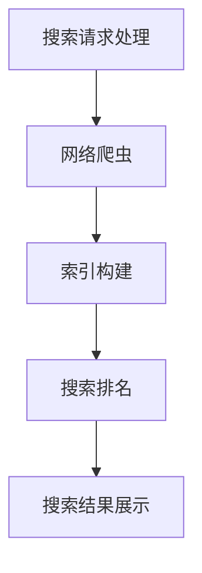

                 

### 文章标题

### 广告收益的牺牲：优化搜索体验

#### 关键词：搜索广告、用户体验、优化策略、算法原理、广告收益

#### 摘要：
本文深入探讨了搜索广告对用户体验的影响，分析了广告收益与搜索体验之间的复杂关系。通过解析搜索广告的基本概念、算法原理及其优化策略，本文揭示了为了提升搜索体验，搜索引擎公司在广告收益方面可能需要做出的牺牲。文章还提出了基于实际案例的综合优化方法，并展望了未来搜索广告的发展趋势，强调了在技术进步与商业利益之间找到平衡的重要性。

### 目录大纲：

1. **第一部分：搜索广告的基本概念与框架**

   - 第1章：搜索广告概述
     - 1.1 搜索广告的定义与分类
     - 1.2 搜索广告的价值与影响
     - 1.3 搜索广告生态系统
     - 1.4 搜索广告的未来趋势
   - 第2章：搜索算法原理详解
     - 2.1 搜索算法的基本流程
     - 2.2 搜索排名的核心算法
     - 2.3 搜索算法的优化策略

2. **第二部分：广告收益与搜索体验的关系**

   - 第3章：广告收益的影响因素分析
     - 3.1 广告收益的计算方法
     - 3.2 广告收益对搜索引擎的影响
     - 3.3 搜索体验的评估标准
   - 第4章：优化搜索体验的方法与策略
     - 4.1 用户行为分析
     - 4.2 搜索结果质量提升
     - 4.3 广告展示优化
     - 4.4 实际案例分析

3. **第三部分：综合解决方案与未来展望**

   - 第5章：综合优化策略与最佳实践
     - 5.1 综合优化策略概述
     - 5.2 最佳实践分享
   - 第6章：未来搜索广告的发展趋势
     - 6.1 新技术对搜索广告的影响
     - 6.2 搜索广告的伦理问题
     - 6.3 搜索广告的未来展望
   - 第7章：结语
     - 7.1 总结与展望

4. **附录**

   - 附录A：搜索引擎与广告平台概述
   - 附录B：关键术语解释
   - 附录C：参考文献与资源
   - 附录D：Mermaid流程图与伪代码示例

---

本文将以逻辑清晰、结构紧凑、简单易懂的方式，逐步分析搜索广告的基本概念、原理及其优化策略，并深入探讨广告收益与搜索体验之间的复杂关系。我们希望通过本文，读者能够对搜索广告有更深入的理解，并能够思考如何在商业利益与用户体验之间找到最佳平衡。

### 第一部分：搜索广告的基本概念与框架

#### 第1章：搜索广告概述

##### 1.1 搜索广告的定义与分类

搜索广告，是指用户在搜索引擎上输入关键词后，搜索结果页面（Search Engine Results Page，简称SERP）上出现的基于这些关键词的广告。搜索广告的主要形式有三种：竞价广告（如Google AdWords）、内容匹配广告（如谷歌展示广告）和位置广告（如百度推广）。

- **竞价广告**：广告商通过支付每次点击费用（Cost Per Click，简称CPC）来获得广告展示位置。竞价广告通常基于关键词的竞价排名，广告商需要设定一个出价，当用户点击广告时，系统会根据广告出价、质量得分和广告展示位置等因素，计算出一个综合得分，然后根据综合得分决定广告的展示顺序。

- **内容匹配广告**：广告不是基于关键词竞价，而是基于广告内容与用户浏览行为的相关性进行匹配展示。广告主通过购买广告位，来展示其广告内容，这些广告通常会出现在与用户当前浏览内容相关的页面中。

- **位置广告**：广告商通过购买特定的广告位置，确保其广告在搜索结果页面的特定位置展示。这种广告形式通常适用于品牌宣传，以增加品牌曝光度。

##### 1.2 搜索广告的价值与影响

搜索广告对搜索引擎、广告商和用户都具有重要价值。

- **对搜索引擎的价值**：搜索广告是搜索引擎的主要收入来源之一。通过提供广告服务，搜索引擎能够实现商业化运作，同时为用户提供更加丰富的搜索结果。此外，搜索广告有助于搜索引擎提升用户体验，因为广告可以为用户带来更多的信息来源和便捷的购买渠道。

- **对广告商的价值**：搜索广告为广告商提供了一个高效、精准的市场推广渠道。通过竞价广告，广告商可以根据关键词精准定位潜在客户，提高广告投放的效果和投资回报率。内容匹配广告和位置广告也为广告商提供了不同的宣传策略，以适应不同的市场推广需求。

- **对用户的价值**：搜索广告可以为用户提供更多、更相关、更丰富的信息。当用户在搜索引擎上输入关键词时，搜索广告能够展示与用户需求高度相关的产品和服务，帮助用户快速找到所需信息。同时，搜索广告也为用户提供了便捷的购买渠道，提高了搜索体验。

##### 1.3 搜索广告生态系统

搜索广告的生态系统包括广告商、广告平台、搜索引擎和用户等多个角色。

- **广告商**：广告商是搜索广告的发起者和出资者，他们通过购买广告服务来推广自己的产品和服务。

- **广告平台**：广告平台是连接广告商和搜索引擎的桥梁，如Google AdWords、百度推广等。广告平台提供广告投放管理工具，帮助广告商设置广告投放策略，监控广告效果，优化广告投放。

- **搜索引擎**：搜索引擎是搜索广告的核心，如Google、百度等。搜索引擎通过提供搜索服务，吸引大量用户，并通过广告收入实现商业化运作。

- **用户**：用户是搜索广告的最终受益者，他们的搜索行为决定了搜索广告的展示内容和效果。

##### 1.4 搜索广告的未来趋势

随着技术的不断进步，搜索广告也在不断演变，未来可能呈现出以下趋势：

- **人工智能与机器学习**：人工智能和机器学习技术将进一步提升搜索广告的精准投放效果，通过分析用户行为和偏好，实现个性化广告推荐。

- **5G与物联网**：5G和物联网技术的普及将带来更高速、更广泛的网络连接，为搜索广告的实时投放和精准定位提供更多机会。

- **增强现实与虚拟现实**：增强现实（AR）和虚拟现实（VR）技术的应用将改变搜索广告的呈现方式，为用户提供更加沉浸式的体验。

- **广告透明度与数据隐私**：随着用户对广告透明度和数据隐私的关注度提高，搜索广告行业将加强对广告内容和数据使用的规范，确保用户隐私和数据安全。

在接下来的章节中，我们将进一步探讨搜索算法的原理及其优化策略，以深入理解搜索广告的核心技术。

#### 第2章：搜索算法原理详解

##### 2.1 搜索算法的基本流程

搜索算法是搜索引擎的核心技术，其基本流程包括以下几个阶段：

1. **搜索请求处理**：
   用户在搜索引擎中输入关键词后，搜索引擎会接收到这个搜索请求。搜索引擎需要对请求进行解析，提取关键词，并识别用户的搜索意图。

2. **网络爬虫**：
   网络爬虫（Web Crawler）是搜索引擎用于获取网页内容的重要工具。爬虫通过爬取互联网上的网页，构建一个庞大的网页数据库，为搜索提供数据支持。爬虫的爬取策略和频率会影响搜索引擎的覆盖范围和更新速度。

3. **索引构建**：
   在获取网页内容后，搜索引擎需要对网页进行索引（Indexing）。索引是一个数据库，用于存储网页的URL、关键词、内容和链接信息。索引构建过程包括关键词提取、分词、词频统计和倒排索引构建等步骤。

4. **搜索排名**：
   当用户提交搜索请求后，搜索引擎会根据索引数据库中的信息，对相关的网页进行搜索排名（Ranking）。搜索排名的算法通常基于多种因素，如网页的相关性、权威性、用户体验等。常见的搜索排名算法包括PageRank算法、协同过滤、基于内容的匹配等。

5. **搜索结果展示**：
   最后，搜索引擎会将排名后的搜索结果展示给用户。搜索结果通常包括网页标题、摘要、URL和广告等。搜索引擎会根据用户的偏好和搜索历史，个性化地调整搜索结果的排序和展示方式。

##### 2.2 搜索排名的核心算法

搜索排名算法是搜索算法的核心，直接影响搜索结果的准确性和用户体验。以下介绍几种常见的搜索排名算法：

1. **PageRank算法**：
   PageRank是Google早期使用的一种排序算法，其核心思想是“网页的排名取决于链接到它的网页的排名”。PageRank通过计算网页之间的链接关系，确定每个网页的重要性。算法中使用矩阵乘法来计算网页的PageRank值，公式如下：

   $$ 
   (PR_v)^{new} = (1-d) + d \cdot (\frac{PR_u}{out(U)}) 
   $$

   其中，$PR_v$是网页$v$的新PageRank值，$d$是阻尼系数（通常设置为0.85），$PR_u$是链接到网页$u$的PageRank值，$out(U)$是链接出网页$u$的链接数。

2. **协同过滤**：
   协同过滤（Collaborative Filtering）是一种基于用户行为和偏好的推荐算法。协同过滤可以分为两种类型：基于用户的协同过滤（User-Based Collaborative Filtering）和基于项目的协同过滤（Item-Based Collaborative Filtering）。

   - **基于用户的协同过滤**：找到与当前用户兴趣相似的其他用户，然后推荐这些用户喜欢的物品。
   - **基于项目的协同过滤**：找到与当前物品相似的其它物品，然后推荐这些物品。

   协同过滤通过用户评分矩阵计算相似度，并基于相似度进行推荐。相似度计算公式如下：

   $$ 
   sim(u, v) = \frac{\sum_{i \in I} r_i(u) r_i(v)}{\sqrt{\sum_{i \in I} r_i(u)^2 \sum_{i \in I} r_i(v)^2}} 
   $$

   其中，$sim(u, v)$是用户$u$和$v$的相似度，$r_i(u)$和$r_i(v)$分别是用户$u$和$v$对物品$i$的评分。

3. **基于内容的匹配**：
   基于内容的匹配（Content-Based Matching）是一种基于网页内容和关键词的匹配算法。算法通过分析网页的内容和关键词，计算网页与搜索请求的相关性，并根据相关性进行排名。相关性计算公式如下：

   $$ 
   relevance = \sum_{w \in W} tf(w) \cdot idf(w) \cdot weight(w) 
   $$

   其中，$relevance$是网页的相关性得分，$tf(w)$是关键词$w$在网页中的词频，$idf(w)$是关键词$w$的逆文档频率，$weight(w)$是关键词$w$的权重。

4. **垂直搜索**：
   垂直搜索（Vertical Search）是一种针对特定领域或主题的搜索算法。垂直搜索通过整合多个数据源，提供更精准、更专业的搜索结果。垂直搜索通常结合了多种算法和技术，如数据挖掘、自然语言处理和机器学习等。

##### 2.3 搜索算法的优化策略

为了提高搜索算法的准确性和用户体验，搜索引擎公司不断进行算法优化。以下是一些常见的搜索算法优化策略：

1. **实时搜索优化**：
   实时搜索优化（Real-Time Search Optimization）是一种通过实时分析用户行为和搜索趋势，动态调整搜索结果的策略。实时搜索优化可以快速响应用户需求变化，提高搜索结果的时效性和相关性。

2. **预处理技术**：
   预处理技术（Preprocessing Techniques）是在搜索算法执行前对数据进行的预处理操作，如分词、去噪、词性标注等。预处理技术可以提高搜索算法的性能和准确度。

3. **搜索算法的迭代与更新**：
   搜索算法的迭代与更新（Algorithm Iteration and Update）是搜索引擎公司持续优化搜索算法的重要手段。通过不断迭代和更新算法，公司可以适应新的技术发展趋势和用户需求，提高搜索体验。

   - **深度学习**：深度学习（Deep Learning）技术在搜索算法中的应用，如神经网络模型、卷积神经网络（CNN）和循环神经网络（RNN）等，可以提升搜索算法的智能性和准确性。
   - **迁移学习**：迁移学习（Transfer Learning）是一种将预训练模型应用于新任务的技术，可以有效提高搜索算法在新领域的性能。

在接下来的章节中，我们将深入探讨广告收益与搜索体验之间的关系，分析广告收益对搜索引擎的影响，并讨论优化搜索体验的方法与策略。

#### 第3章：广告收益的影响因素分析

##### 3.1 广告收益的计算方法

广告收益是搜索引擎公司的重要收入来源，其计算方法主要包括以下几个方面：

- **广告点击率（Click-Through Rate, CTR）**：
  广告点击率是指用户在搜索结果页面点击广告的次数与展示次数的比率。广告点击率是衡量广告效果的重要指标，其计算公式如下：

  $$ 
  CTR = \frac{点击次数}{展示次数} 
  $$

- **广告展示次数（Impressions）**：
  广告展示次数是指广告在搜索结果页面被展示的次数。广告展示次数反映了广告的曝光量，其计算公式如下：

  $$ 
  展示次数 = 搜索次数 \times 广告占比 
  $$

- **每次点击成本（Cost Per Click, CPC）**：
  每次点击成本是指广告商为获得一次点击所支付的费用。CPC是广告商竞价广告的重要参数，其计算公式如下：

  $$ 
  CPC = \frac{广告花费}{点击次数} 
  $$

- **每千次展示成本（Cost Per Mille, CPM）**：
  每千次展示成本是指广告商为获得一千次广告展示所支付的费用。CPM通常用于衡量广告的投放效果，其计算公式如下：

  $$ 
  CPM = \frac{广告花费}{展示次数} \times 1000 
  $$

- **广告收益（Revenue）**：
  广告收益是指搜索引擎通过广告服务获得的收入。广告收益的计算公式如下：

  $$ 
  广告收益 = 广告展示次数 \times 广告单价 \times 广告占比 
  $$

  其中，广告单价是指每次广告展示或点击所获得的收入。

##### 3.2 广告收益对搜索引擎的影响

广告收益对搜索引擎的影响具有双重性：

- **正面影响**：
  广告收益是搜索引擎公司的主要收入来源，直接影响公司的盈利能力和市场竞争力。高广告收益可以支持搜索引擎公司的持续研发和技术创新，提高用户体验和搜索质量。此外，广告收益还可以为搜索引擎公司提供资金支持，扩大市场占有率，提升品牌影响力。

- **负面影响**：
  高广告收益可能导致搜索引擎过度依赖广告收入，从而影响搜索结果的质量和用户体验。一些搜索引擎公司可能通过降低广告展示门槛、提高广告密度等方式，追求短期广告收益最大化，导致搜索结果中出现大量无关或低质量的广告。这种做法会降低用户对搜索结果的信任度，损害搜索引擎的品牌形象和市场地位。

##### 3.3 搜索体验的评估标准

搜索体验是用户对搜索结果及其使用过程的整体感受。以下是一些常见的搜索体验评估标准：

- **准确性**：
  准确性是指搜索结果与用户查询意图的相关程度。高准确性意味着用户能够快速找到所需信息，提高搜索效率。

- **相关性**：
  相关性是指搜索结果与用户查询关键词的匹配程度。高相关性意味着搜索结果能够有效满足用户的需求，提高用户满意度。

- **速度**：
  速度是指搜索结果加载和呈现的时间。快速搜索可以提高用户体验，降低用户等待时间。

- **用户体验**：
  用户体验是指用户在使用搜索服务过程中所感受到的舒适度和满意度。良好的用户体验包括搜索结果的排序、广告展示形式、界面设计等各个方面。

在接下来的章节中，我们将探讨如何通过优化搜索体验来提高广告收益，并分析实际案例，以期为搜索引擎公司提供实用的优化策略。

#### 第4章：优化搜索体验的方法与策略

##### 4.1 用户行为分析

用户行为分析是优化搜索体验的重要基础，通过对用户搜索行为和点击习惯的分析，可以更好地理解用户需求，提高搜索结果的准确性和相关性。以下是一些用户行为分析的方法：

- **点击流数据收集**：
  点击流数据（Click-Through Data）是用户在搜索过程中的点击记录，通过收集和分析点击流数据，可以了解用户对搜索结果的点击偏好。常见的点击流数据分析方法包括用户轨迹分析、点击率（CTR）分析等。

- **行为预测模型**：
  通过构建行为预测模型，可以预测用户在搜索过程中的点击行为。常见的预测模型包括逻辑回归、决策树、随机森林、神经网络等。行为预测模型有助于优化搜索结果排序，提高广告的点击率和转化率。

- **A/B测试**：
  A/B测试（A/B Testing）是一种通过比较不同搜索结果展示策略对用户行为的影响，来优化搜索体验的方法。通过A/B测试，可以评估不同策略对点击率、转化率等指标的影响，选择最优策略进行推广。

##### 4.2 搜索结果质量提升

提升搜索结果质量是优化搜索体验的关键，以下是一些常用的方法：

- **内容筛选**：
  对搜索结果进行内容筛选，去除低质量、重复或无关的内容，提高结果的准确性和相关性。内容筛选可以通过关键词过滤、主题识别、文本分类等技术实现。

- **真实性验证**：
  对搜索结果进行真实性验证，确保用户获取到的信息是真实可信的。真实性验证可以通过验证网站域名、检查版权声明、评估内容来源等方式进行。

- **多样化搜索结果**：
  提供多样化的搜索结果，满足用户不同的需求。多样化搜索结果可以通过整合不同类型的内容（如新闻、产品信息、论坛等）、提供丰富的搜索结果格式（如列表、地图、图片等）来实现。

##### 4.3 广告展示优化

广告展示优化是提高广告收益的重要策略，以下是一些广告展示优化的方法：

- **广告位置与形式优化**：
  通过优化广告位置和形式，提高广告的点击率和转化率。常见的广告位置优化方法包括将广告放置在用户视觉焦点区域、使用具有吸引力的广告形式（如视频、动画等）。

- **广告内容相关性提升**：
  提高广告内容与用户搜索意图的相关性，可以增加广告的点击率和转化率。广告内容相关性提升可以通过匹配关键词、分析用户历史行为等方式实现。

- **广告用户体验优化**：
  提高广告的用户体验，减少广告对搜索结果的干扰，提高用户满意度。广告用户体验优化可以通过优化广告的展示方式、提供便捷的广告操作方式等方式实现。

##### 4.4 实际案例分析

以下是一些实际案例，分析如何通过优化搜索体验来提高广告收益：

- **案例一：Google的搜索广告优化**
  Google通过实时分析用户搜索行为和广告效果，不断优化搜索广告的展示策略。例如，Google采用了A/B测试方法，通过比较不同广告展示位置和形式对用户行为的影响，选择最优策略进行推广，从而提高了广告的点击率和转化率。

- **案例二：百度的个性化搜索**
  百度通过用户行为分析和个性化推荐技术，为用户提供个性化的搜索结果。通过分析用户的搜索历史和偏好，百度能够为用户推荐与其兴趣相关的广告，从而提高了广告的点击率和收益。

- **案例三：淘宝的搜索广告优化**
  淘宝通过优化搜索广告的展示位置和形式，提高广告的曝光率和点击率。同时，淘宝采用内容筛选和真实性验证技术，确保搜索结果的准确性和可信度，从而提高了用户的满意度和广告收益。

在接下来的章节中，我们将进一步探讨综合优化策略和未来搜索广告的发展趋势，以期为搜索引擎公司提供更全面的优化方案。

##### 第5章：综合优化策略与最佳实践

##### 5.1 综合优化策略概述

综合优化策略旨在通过多方面的优化措施，提升搜索广告的效果和用户体验，从而实现广告收益的最大化。以下是一些核心优化策略：

- **用户体验优先**：
  将用户体验放在首位，确保广告展示不影响用户的搜索体验。通过优化广告位置、形式和内容，降低广告对用户的干扰，提高用户满意度。

- **数据驱动**：
  利用大数据和人工智能技术，实时分析用户行为和广告效果，为优化提供数据支持。通过用户行为分析、广告效果评估和A/B测试等方法，不断调整广告策略，提高广告的点击率和转化率。

- **个性化推荐**：
  根据用户的历史行为和偏好，为用户推荐个性化的广告内容。通过个性化推荐技术，提高广告的相关性和用户满意度，从而提升广告收益。

- **多渠道整合**：
  将搜索广告与其他广告渠道（如展示广告、视频广告等）整合，实现广告的全面覆盖。通过多渠道整合，提高广告的曝光率和用户触达率，实现广告收益的最大化。

##### 5.2 最佳实践分享

以下是一些行业领先公司的最佳实践，供搜索引擎公司参考：

- **案例一：Google的广告优化**
  Google通过用户行为分析和A/B测试，不断优化搜索广告的展示策略。例如，Google在广告展示位置和形式上进行了多次测试，最终选择了将广告放置在搜索结果页面的顶部和右侧，以提高广告的点击率和转化率。

- **案例二：百度的个性化搜索**
  百度通过个性化推荐技术，为用户推荐与其兴趣相关的广告内容。通过分析用户的搜索历史和浏览记录，百度能够为用户提供更加精准的个性化广告，从而提高了广告的点击率和用户满意度。

- **案例三：淘宝的搜索广告优化**
  淘宝在广告展示位置和形式上进行了创新，例如将广告以悬浮窗口的形式展示在搜索结果页面，提高广告的曝光率。同时，淘宝通过内容筛选和真实性验证技术，确保搜索结果的准确性和可信度，从而提高了用户的满意度和广告收益。

在风险管理和应对策略方面，搜索引擎公司需要：

- **透明度管理**：
  提高广告透明度，确保用户能够清楚地了解广告内容及其来源。通过标注广告属性、提供广告来源信息等方式，增强用户对广告的信任。

- **隐私保护**：
  加强用户隐私保护，确保用户数据的安全和隐私。通过数据加密、访问控制等技术手段，防止用户数据泄露和滥用。

- **反垃圾广告技术**：
  加强反垃圾广告技术，防止低质量、恶意广告对搜索体验的影响。通过关键词过滤、内容检测、用户反馈等方式，及时识别和过滤垃圾广告。

在接下来的章节中，我们将探讨未来搜索广告的发展趋势，分析新技术对搜索广告的影响，以及搜索广告行业的伦理问题。

##### 第6章：未来搜索广告的发展趋势

随着技术的不断进步，搜索广告也将迎来新的发展机遇和挑战。以下是一些未来搜索广告的发展趋势：

##### 6.1 新技术对搜索广告的影响

- **人工智能与机器学习**：
  人工智能（AI）和机器学习（ML）技术在搜索广告中的应用，将进一步提升广告投放的精准度和效果。通过深度学习、自然语言处理（NLP）等技术，搜索引擎可以更准确地理解用户需求，为用户提供个性化的广告推荐。

  - **深度学习**：深度学习模型（如卷积神经网络（CNN）、循环神经网络（RNN）等）可以处理大规模数据，提取特征，提高广告投放的准确性。
  - **自然语言处理**：NLP技术可以帮助搜索引擎更好地理解用户搜索意图，从而提供更精准的搜索结果和广告推荐。

- **5G与物联网**：
  5G和物联网（IoT）技术的发展，将带来更高速、更广泛的网络连接，为搜索广告的实时投放和精准定位提供更多机会。

  - **5G网络**：5G网络的低延迟、高带宽特点，使得搜索广告可以更快速地响应用户需求，提高用户体验。
  - **物联网**：物联网设备（如智能家居、智能穿戴设备等）的普及，将带来更多的广告场景和机会，提高广告的曝光率和用户触达率。

- **增强现实与虚拟现实**：
  增强现实（AR）和虚拟现实（VR）技术的应用，将改变搜索广告的呈现方式，为用户提供更加沉浸式的体验。

  - **AR广告**：通过AR技术，广告可以以更加生动、互动的方式呈现，吸引用户注意力，提高广告效果。
  - **VR广告**：VR广告可以为用户提供沉浸式的购物体验，提高用户的购买意愿和转化率。

##### 6.2 搜索广告的伦理问题

随着搜索广告的快速发展，伦理问题也日益突出，以下是一些需要关注的关键领域：

- **广告透明度**：
  提高广告透明度，确保用户能够清楚地了解广告内容及其来源。搜索引擎公司和广告平台需要采取措施，确保广告内容的真实性、合法性和透明性。

- **数据隐私保护**：
  加强用户数据隐私保护，确保用户数据的安全和隐私。搜索引擎公司和广告平台需要采取数据加密、访问控制等措施，防止用户数据泄露和滥用。

- **反垃圾广告技术**：
  加强反垃圾广告技术，防止低质量、恶意广告对搜索体验的影响。通过关键词过滤、内容检测、用户反馈等方式，及时识别和过滤垃圾广告。

##### 6.3 搜索广告的未来展望

未来，搜索广告将继续发展，并在以下几个方面取得突破：

- **个性化广告**：
  随着人工智能和大数据技术的发展，个性化广告将成为主流。搜索引擎将能够根据用户的历史行为和偏好，为用户提供高度个性化的广告内容，提高广告的点击率和转化率。

- **跨平台整合**：
  搜索广告将与展示广告、视频广告等不同广告形式进行整合，实现广告的跨平台投放。通过跨平台整合，提高广告的曝光率和用户触达率，实现广告收益的最大化。

- **智慧广告**：
  智慧广告将借助人工智能技术，实现广告的智能化投放和优化。通过实时分析用户行为和广告效果，智慧广告可以自动调整广告策略，提高广告的投放效果。

综上所述，未来搜索广告将在技术进步和伦理问题的双重驱动下，实现更加精准、高效、个性化的广告投放，为搜索引擎公司和广告商带来更大的商业价值。

##### 第7章：结语

通过本文的探讨，我们可以看到搜索广告在商业运作和技术发展中的重要性。从广告收益的计算方法到优化搜索体验的策略，再到未来搜索广告的发展趋势，搜索广告的核心在于如何在商业利益与用户体验之间找到最佳平衡。

**总结与展望**：

- **核心观点回顾**：搜索广告是搜索引擎公司的重要收入来源，但广告收益与搜索体验之间存在复杂关系。优化搜索体验需要综合考虑用户体验、广告收益和技术发展，实现商业利益与用户体验的双赢。

- **未来前景**：随着人工智能、5G、物联网等新技术的应用，搜索广告将继续发展，个性化、智能化和跨平台整合将成为主流趋势。同时，伦理问题也将是搜索广告行业发展的重要挑战。

**研究者与从业者的责任与使命**：

- **研究者的责任**：深入研究和探讨搜索广告的核心技术和发展趋势，推动技术创新和优化，为搜索广告行业的健康发展提供理论支持。

- **从业者的使命**：在商业运作中，注重用户体验，遵循伦理规范，确保搜索广告的质量和效果，为用户提供优质的服务和体验。

在未来的发展中，我们需要不断探索和创新，以实现商业利益与用户体验的最佳平衡，推动搜索广告行业的持续进步。

### 附录

#### 附录A：搜索引擎与广告平台概述

##### A.1 搜索引擎的技术架构

搜索引擎的技术架构包括几个关键模块，这些模块协同工作以实现高效的搜索功能。以下是对这些模块的简要概述：

- **爬虫（Crawler）**：爬虫是搜索引擎获取网页内容的核心组件。它通过爬取互联网上的网页，将网页内容存储到索引数据库中。爬虫通常使用深度优先或广度优先的策略来遍历网页，以构建全面的网页数据库。

- **索引器（Indexer）**：索引器负责处理爬虫收集到的网页内容，将其转换为索引。索引是一个结构化数据库，存储了网页的URL、关键词、内容和链接信息。索引器通过分词、词频统计和倒排索引构建等步骤，将网页内容组织成便于快速检索的格式。

- **搜索服务器（Search Server）**：搜索服务器是处理用户查询请求的核心组件。它接收用户输入的查询关键词，通过索引数据库快速定位相关网页，并返回搜索结果。搜索服务器通常采用复杂的算法来处理查询请求，包括查询处理、搜索排名和结果呈现等。

- **用户界面（User Interface）**：用户界面是用户与搜索引擎交互的入口。它提供了一个简洁直观的界面，允许用户输入查询关键词，查看搜索结果，并进行其他搜索操作。用户界面设计旨在提高用户体验，使得用户能够轻松、高效地使用搜索引擎。

- **数据存储（Data Storage）**：数据存储模块负责存储搜索引擎的索引数据库和用户数据。索引数据库存储了网页的内容和链接信息，而用户数据包括用户的搜索历史、偏好和个性化设置等。数据存储模块通常使用分布式数据库和云存储技术，以确保数据的可靠性和可扩展性。

##### A.2 广告平台的功能模块

广告平台是连接广告商和搜索引擎的关键桥梁，其功能模块包括以下几个方面：

- **广告投放管理工具**：广告投放管理工具是广告平台提供给广告商的一个在线操作界面，允许广告商创建、管理和监控广告活动。这些工具包括广告创建、预算设置、投放调整、效果跟踪等功能。

- **广告展示系统**：广告展示系统负责将广告在搜索引擎的搜索结果页面上展示给用户。该系统根据广告商的出价、质量得分和用户查询关键词等因素，实时计算广告的展示位置，并确保广告的展示符合搜索引擎的规范。

- **广告收益分配机制**：广告收益分配机制是广告平台的一项重要功能，它规定了广告收益如何在搜索引擎公司和广告商之间进行分配。常见的收益分配机制包括每次点击成本（CPC）、每次展示成本（CPM）和每次转化成本（CPA）等。

- **数据分析与优化工具**：数据分析与优化工具帮助广告商实时监控广告效果，分析用户行为数据，并基于数据反馈进行广告策略优化。这些工具包括点击率（CTR）分析、转化率分析、用户行为跟踪等。

- **广告透明度和合规性管理**：广告透明度和合规性管理是确保广告内容真实、合法的重要环节。广告平台通过审核广告内容、监控广告展示行为和提供用户反馈机制，确保广告的透明度和合规性。

#### 附录B：关键术语解释

- **搜索广告（Search Advertising）**：指在搜索引擎结果页面（SERP）上展示的广告，通常基于用户输入的关键词进行匹配和展示。
- **广告点击率（Click-Through Rate, CTR）**：指广告被点击的次数与展示次数的比率，用于衡量广告的吸引力和效果。
- **每次点击成本（Cost Per Click, CPC）**：指广告商为获得一次点击所支付的费用，是竞价广告的一种常见计费模式。
- **广告展示次数（Impressions）**：指广告在搜索结果页面被展示的次数，用于衡量广告的曝光量。
- **每次展示成本（Cost Per Mille, CPM）**：指广告商为获得一千次广告展示所支付的费用，常用于展示广告的一种计费模式。
- **PageRank算法**：由Google创始人拉里·佩奇和谢尔盖·布林发明的一种排名算法，用于确定网页的重要性，影响搜索结果的排序。
- **协同过滤（Collaborative Filtering）**：一种基于用户行为和偏好进行内容推荐的方法，分为基于用户的协同过滤和基于项目的协同过滤两种。
- **基于内容的匹配（Content-Based Matching）**：一种通过分析网页内容和关键词的相关性，进行搜索结果排序的方法。
- **垂直搜索（Vertical Search）**：针对特定领域或主题的搜索，提供更精准、更专业的搜索结果。

#### 附录C：参考文献与资源

- **参考文献**：
  - Garcia-Herrera, R., & Mastrovito, R. (2018). *The Economics of Search Advertising*. Springer.
  - Broder, A. (2009). *The PageRank Citation Ranking: Bringing Order to the Web*. IEEE Data Engineering Bulletin, 22(1), 56-64.
  - Lang, K. J. (2006). *Collaborative Filtering for the Web*. Communications of the ACM, 49(3), 40-46.
  - Manning, C. D., Raghavan, P., & Schütze, H. (2008). *Introduction to Information Retrieval*. Cambridge University Press.

- **网络资源**：
  - Google AdWords Help Center: https://support.google.com/adwords/
  - 百度推广帮助中心：https://www.baidu.com/s?tn=baidu&wd=promotion_help&ie=utf-8&rsv_cq=promotion_help&rsv_dl=0_left_fy
  - SEO Guide: https://moz.com/learn/seo/search-engine-algorithms
  - Search Engine Journal: https://www.searchenginejournal.com/

#### 附录D：Mermaid流程图与伪代码示例

##### D.1 搜索算法流程图

以下是一个使用Mermaid绘制的搜索算法流程图：



##### D.2 搜索算法伪代码示例

以下是一个简单的搜索算法伪代码示例，用于说明搜索算法的基本原理：

```python
# 搜索算法伪代码
def search_algorithm(query):
    # 处理搜索请求
    processed_query = process_query(query)

    # 爬取网页内容
    web_pages = crawl_web()

    # 构建索引
    index = build_index(web_pages)

    # 搜索排名
    ranked_results = rank_results(index, processed_query)

    # 展示搜索结果
    display_results(ranked_results)
```

在这个伪代码中，`search_algorithm`函数表示整个搜索算法的过程，包括搜索请求处理、网络爬虫、索引构建、搜索排名和搜索结果展示等步骤。每个步骤的具体实现细节可以根据实际需求进行扩展和优化。

