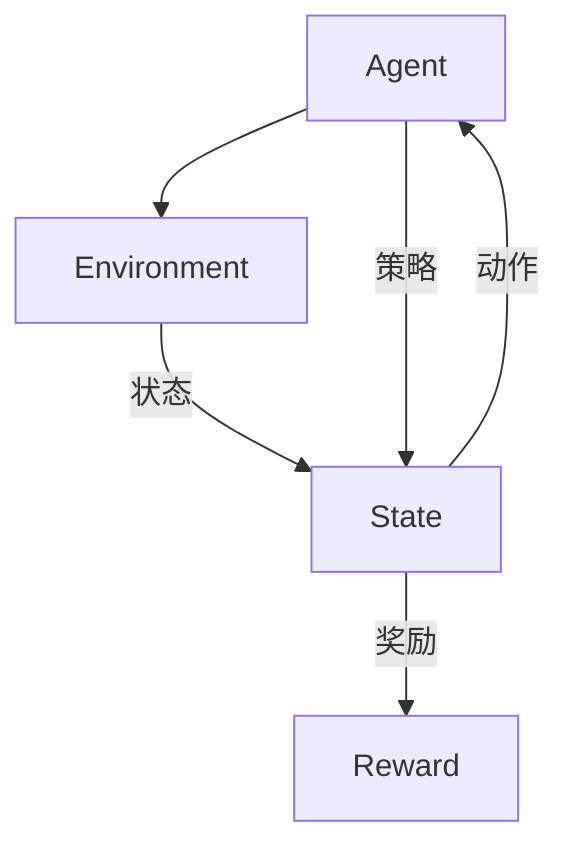

                 

### 文章标题

《强化学习在多智能体博弈中的策略优化》

强化学习（Reinforcement Learning，简称RL）作为一种重要的机器学习范式，在单智能体环境中已经取得了显著成果。然而，在现实世界中，多智能体系统（Multi-Agent Systems）的复杂性使得单一智能体强化学习的方法面临巨大的挑战。本文将深入探讨强化学习在多智能体博弈中的策略优化问题，旨在通过逐步分析推理的方式，帮助读者理解这一领域的核心概念、算法原理及其应用。

### 关键词

- 强化学习
- 多智能体系统
- 策略优化
- Q-learning
- MDP
- 多智能体强化学习算法

### 摘要

本文将首先介绍强化学习的基础理论，包括其基本概念、架构和关键数学模型。接着，我们将深入探讨强化学习在多智能体博弈中的应用，重点分析多智能体强化学习的目标及其算法实现。通过详细的数学公式和伪代码讲解，我们将帮助读者理解多智能体Q-learning算法的工作原理。最后，本文将结合实际项目实战，展示如何在实际应用中优化多智能体博弈中的策略，为读者提供实用的技术指导。

---

### 第一部分: 强化学习基础理论

#### 第1章: 强化学习概述

#### 1.1 强化学习的基本概念

强化学习是一种通过与环境互动来学习最优行为策略的机器学习方法。其核心在于智能体（Agent）通过接收奖励信号（Reward Signal），不断调整其行为策略（Policy），以最大化累积奖励（Cumulative Reward）。

**强化学习的定义：**
强化学习是一个智能体在环境中采取行动，通过与环境的交互获得奖励信号，并不断调整策略，以实现长期累积奖励最大化的过程。

**强化学习与其他机器学习方法的区别：**
- **监督学习（Supervised Learning）：** 学习过程中，训练数据包含输入和期望输出，模型通过学习这些输入输出对来预测新数据的输出。
- **无监督学习（Unsupervised Learning）：** 学习过程中，模型仅从数据中学习，没有预定义的输入输出对。
- **强化学习（Reinforcement Learning）：** 学习过程中，智能体通过与环境的交互，根据奖励信号不断调整行为策略，以实现最优目标。

强化学习在智能行为学习、决策制定、游戏AI等领域具有广泛应用。其特点在于：
- **自适应学习：** 智能体可以随着环境的改变不断调整策略。
- **探索与利用：** 在学习过程中，智能体需要在探索未知策略和利用已知策略之间做出平衡。

#### 1.2 强化学习的基本架构

强化学习的基本架构由以下几个核心元素组成：

- **Agent（智能体）：** 强化学习中的学习者和决策者，负责采取行动并接收环境反馈。
- **Environment（环境）：** 智能体行动所处的情境，负责提供状态信息和奖励信号。
- **State（状态）：** 智能体在环境中所处的特定情境，通常用一组特征向量表示。
- **Action（动作）：** 智能体可采取的行为，用于改变环境状态。
- **Reward（奖励）：** 智能体在每个状态执行动作后获得的即时反馈信号，用于评估行为的优劣。

**强化学习框架Mermaid流程图：**


通过这一框架，我们可以清晰地看到强化学习中的关键要素及其相互作用关系。智能体根据当前状态采取动作，环境根据动作和当前状态生成新的状态和奖励信号，智能体则根据奖励信号不断调整策略，以期达到长期累积奖励最大化的目标。

#### 1.3 强化学习的关键概念

在强化学习中，有三个核心概念至关重要，分别是策略（Policy）、价值函数（Value Function）和模型（Model）。

- **策略（Policy）：** 策略是智能体在给定状态下采取的动作选择规则。它决定了智能体如何响应不同的环境状态。策略通常用概率分布来表示，即$\pi(a|s)$表示在状态$s$下采取动作$a$的概率。

- **价值函数（Value Function）：** 价值函数用于评估智能体在特定状态下的期望累积奖励。根据定义，状态价值函数$V(s)$表示智能体在状态$s$采取最优策略时的期望累积奖励，而动作价值函数$Q(s, a)$表示智能体在状态$s$下采取动作$a$的期望累积奖励。

- **模型（Model）：** 模型是对环境动态的描述，包括状态转移概率和奖励函数。在理想的情形下，智能体需要了解环境的完整模型，但在实际应用中，智能体通常只能通过观察和经验来逐步构建和更新模型。

**策略、价值函数与模型之间的关系：**
- 策略决定了智能体的行动方向，价值函数用于评估这些行动的优劣，而模型则提供了环境动态的详细信息，帮助智能体做出更明智的决策。

- **策略与价值函数的关系：** 价值函数通过评估不同策略下的累积奖励，指导智能体选择最优策略。策略则根据价值函数的反馈进行动态调整。

- **模型与价值函数的关系：** 模型为价值函数提供了状态转移概率和奖励信号的估计，使得价值函数能够更准确地预测智能体的长期累积奖励。

- **模型与策略的关系：** 模型为策略提供了环境动态的信息，使得策略能够在不同的环境中进行自适应调整。

通过理解这些核心概念，我们可以更好地把握强化学习的基本原理，并为后续的算法讨论打下坚实的基础。

#### 1.4 强化学习的发展历史

强化学习作为机器学习的一个重要分支，其发展历程充满了里程碑和重要事件。以下是对强化学习发展历史的简要回顾：

- **1950年代：** 强化学习的概念首次由Richard Sutton和Andrew Barto提出。他们提出了“智能体-环境-奖励”的基本框架，并提出了马尔可夫决策过程（MDP）的理论模型。

- **1980年代：** Sutton和Barto的著作《 reinforcement Learning: An Introduction》（1998年首次出版）奠定了强化学习的基础。在这一时期，Q-learning算法被提出，成为强化学习领域的一个重要算法。

- **1990年代：** 强化学习的研究取得了一系列重要进展，包括策略迭代、动态规划等算法的提出。同时，深度强化学习（Deep Reinforcement Learning）的研究开始萌芽，为未来的突破奠定了基础。

- **2000年代：** 强化学习在游戏AI、机器人控制等领域取得了显著应用。特别是，深度Q网络（DQN）的提出，使得强化学习在处理高维状态空间问题方面取得了突破性进展。

- **2010年代至今：** 强化学习的研究和应用得到了飞速发展。深度强化学习成为人工智能领域的热点，其应用范围从游戏扩展到自动驾驶、机器人控制、资源分配等多个领域。AlphaGo等经典案例的突破进一步推动了强化学习的研究和应用。

**重要事件和里程碑：**
1. **1989年：** Sutton和Barto出版《 reinforcement Learning: An Introduction》，为强化学习提供了系统性的理论框架。
2. **1992年：** Q-learning算法被提出，成为强化学习领域的基础算法之一。
3. **2013年：** DQN算法在Atari游戏上取得了突破性成果，证明了深度强化学习在处理高维状态空间问题上的潜力。
4. **2016年：** AlphaGo在围棋比赛中击败人类顶级选手，展示了强化学习在复杂任务上的强大能力。

通过回顾强化学习的发展历史，我们可以看到这一领域从理论到应用所经历的精彩历程。未来，随着技术的不断进步，强化学习有望在更多领域取得突破，为人工智能的发展做出更大贡献。

#### 第2章: 强化学习的数学基础

#### 2.1 马尔可夫决策过程（MDP）

马尔可夫决策过程（Markov Decision Process，简称MDP）是强化学习中的一个核心数学模型，用于描述智能体在不确定环境中做出决策的过程。MDP的基本概念包括状态、动作、奖励和状态转移概率。

**MDP的定义：**
MDP是一个四元组$M = \langle S, A, P, R \rangle$，其中：
- $S$是状态集合，代表智能体所处的所有可能状态。
- $A$是动作集合，代表智能体可以采取的所有可能动作。
- $P$是状态转移概率矩阵，描述了在当前状态$s$下采取动作$a$后，智能体转移到下一状态$s'$的概率分布。
- $R$是奖励函数，描述了在状态$s$下采取动作$a$后获得的即时奖励。

**状态转移概率矩阵：**
状态转移概率矩阵$P$是一个$S \times S$的矩阵，其元素$P(s', s; a)$表示智能体在状态$s$下采取动作$a$后转移到状态$s'$的概率。一个典型的状态转移概率矩阵如下所示：
$$
P =
\begin{bmatrix}
P(s_1', s_1; a_1) & P(s_1', s_2; a_1) & \cdots & P(s_1', s_n; a_1) \\
P(s_2', s_1; a_1) & P(s_2', s_2; a_1) & \cdots & P(s_2', s_n; a_1) \\
\vdots & \vdots & \ddots & \vdots \\
P(s_n', s_1; a_1) & P(s_n', s_2; a_1) & \cdots & P(s_n', s_n; a_1)
\end{bmatrix}
$$
其中，每一行表示在当前状态$s$下采取动作$a$后，智能体转移到所有可能状态的概率分布。

**奖励函数：**
奖励函数$R(s, a)$是一个从状态-动作对到实数的函数，表示智能体在状态$s$下采取动作$a$后获得的即时奖励。奖励函数可以是负的、正的或零，取决于智能体行为的优劣。

一个简单的奖励函数例子如下：
$$
R(s, a) =
\begin{cases}
+1 & \text{if } s \text{ is the goal state and } a \text{ leads to } s \\
-1 & \text{if } s \text{ is the obstacle state and } a \text{ leads to } s \\
0 & \text{otherwise}
\end{cases}
$$

通过状态转移概率矩阵和奖励函数，我们可以定义MDP中的状态价值函数和策略。状态价值函数$V^*(s)$表示智能体在状态$s$下采取最优策略的期望累积奖励，而策略$\pi^*(s)$则决定了智能体在给定状态下的最优动作选择。

**状态价值函数与策略的关系：**
状态价值函数和策略是MDP中的两个核心概念。状态价值函数描述了智能体在各个状态下的期望累积奖励，而策略则指导智能体如何在不同状态下采取最优动作。具体来说，状态价值函数可以通过以下贝尔曼方程（Bellman Equation）进行递推计算：
$$
V^*(s) = \sum_{a \in A} \pi^*(s) [R(s, a) + \gamma V^*(s')]
$$
其中，$\gamma$是折扣因子，用于平衡当前奖励与未来奖励的关系。

通过这些基本概念和数学工具，我们可以更好地理解和分析MDP中的决策过程，为后续的强化学习算法设计和应用奠定基础。

#### 2.2 强化学习中的数学模型

在强化学习中，为了描述智能体与环境之间的互动过程，我们需要建立一系列的数学模型，这些模型包括马尔可夫决策过程（MDP）、状态价值函数、策略和贝尔曼方程。这些数学模型不仅帮助我们理解强化学习的基本原理，还为算法的设计和实现提供了理论基础。

**马尔可夫决策过程（MDP）：**
如前所述，MDP是强化学习中的核心数学模型，描述了智能体在不确定环境中的决策过程。MDP由状态空间$S$、动作空间$A$、状态转移概率矩阵$P$和奖励函数$R$组成。状态转移概率矩阵$P$描述了在当前状态$s$下采取动作$a$后，智能体转移到下一状态$s'$的概率分布，即：
$$
P(s', s; a) = \text{Pr}\{S_{t+1} = s'|S_t = s, A_t = a\}
$$
奖励函数$R$则描述了在状态$s$下采取动作$a$后获得的即时奖励，即：
$$
R(s, a) = \text{Reward received when in state } s \text{ and performing action } a
$$

**状态价值函数：**
状态价值函数$V(s)$用于评估智能体在状态$s$下采取最优策略的期望累积奖励。具体来说，状态价值函数表示在状态$s$下，智能体采取最优策略后，所能获得的期望累积奖励。状态价值函数可以通过以下贝尔曼方程（Bellman Equation）进行递推计算：
$$
V(s) = \sum_{a \in A} \pi(a|s) [R(s, a) + \gamma V(s')]
$$
其中，$\pi(a|s)$是策略，即智能体在状态$s$下采取动作$a$的概率；$\gamma$是折扣因子，用于平衡当前奖励与未来奖励的关系。

**动作价值函数：**
动作价值函数$Q(s, a)$用于评估在状态$s$下采取动作$a$的期望累积奖励。动作价值函数与状态价值函数密切相关，可以看作是状态价值函数的分解。动作价值函数表示在状态$s$下采取动作$a$后，智能体所能获得的期望累积奖励，即：
$$
Q(s, a) = \text{Expected return when in state } s \text{ and performing action } a
$$
动作价值函数也可以通过贝尔曼方程进行递推计算：
$$
Q(s, a) = R(s, a) + \gamma \sum_{s' \in S} p(s'|s, a) \sum_{a' \in A} Q(s', a')
$$

**策略：**
策略是智能体在给定状态下选择动作的规则。在强化学习中，策略通常用概率分布来表示，即$\pi(a|s)$表示在状态$s$下采取动作$a$的概率。最优策略$\pi^*(s)$是在所有策略中能够使状态价值函数最大的策略，即：
$$
\pi^*(s) = \arg\max_{\pi(s)} \sum_{a \in A} \pi(s) [R(s, a) + \gamma V(s')]
$$

**贝尔曼方程：**
贝尔曼方程是强化学习中的核心递推公式，用于计算状态价值函数和动作价值函数。贝尔曼方程分为三个版本：状态值函数的贝尔曼方程、动作值函数的贝尔曼方程和策略迭代方程。

- **状态值函数的贝尔曼方程：**
$$
V^*(s) = \sum_{a \in A} \pi^*(a|s) [R(s, a) + \gamma V^*(s')]
$$
- **动作值函数的贝尔曼方程：**
$$
Q^*(s, a) = R(s, a) + \gamma \sum_{s' \in S} p(s'|s, a) \sum_{a' \in A} Q^*(s', a')
$$
- **策略迭代方程：**
$$
\pi^*(s) = \arg\max_{\pi(s)} \sum_{a \in A} \pi(s) [R(s, a) + \gamma V^*(s')]
$$

通过这些数学模型和方程，我们可以对强化学习中的状态、动作、奖励和价值函数进行系统性的分析和计算，从而设计出有效的强化学习算法。这些理论基础为后续讨论多智能体强化学习提供了坚实的基础。

#### 2.3 贝尔曼优化方程

贝尔曼优化方程（Bellman Optimality Equation）是强化学习中的一个核心公式，它用于计算最优状态价值函数$V^*(s)$。该方程描述了在给定策略$\pi^*(s)$的情况下，智能体在状态$s$的期望累积奖励与最优状态价值函数之间的关系。

**贝尔曼优化方程：**
$$
V^*(s) = \sum_{a \in A} \pi^*(a|s) [R(s, a) + \gamma \sum_{s' \in S} p(s'|s, a) V^*(s')]
$$

其中：
- $V^*(s)$表示状态$s$的最优状态价值函数。
- $\pi^*(a|s)$表示在状态$s$下采取动作$a$的最优策略概率。
- $R(s, a)$表示在状态$s$下采取动作$a$后获得的即时奖励。
- $p(s'|s, a)$表示在状态$s$下采取动作$a$后转移到状态$s'$的概率。
- $\gamma$是折扣因子，用于平衡当前奖励与未来奖励的关系。

**详细解释：**

- **期望累积奖励：** 贝尔曼优化方程右侧的第一部分$\sum_{a \in A} \pi^*(a|s) [R(s, a)]$表示在状态$s$下，智能体按照最优策略$\pi^*(s)$采取动作后，每个动作所获得的即时奖励的加权和。这个加权和反映了智能体在状态$s$下采取不同动作的期望累积奖励。

- **未来奖励：** 贝尔曼优化方程右侧的第二部分$\gamma \sum_{s' \in S} p(s'|s, a) V^*(s')$表示在状态$s$下，智能体采取动作$a$后转移到状态$s'$，并在状态$s'$下继续按照最优策略进行决策所能获得的未来期望累积奖励。这部分未来奖励通过折扣因子$\gamma$进行了衰减，以反映当前奖励与未来奖励之间的时间差距。

- **整体计算：** 贝尔曼优化方程通过将当前即时奖励与未来期望累积奖励结合起来，计算了在状态$s$下按照最优策略进行决策所能获得的最优状态价值函数$V^*(s)$。这个方程为智能体提供了一个评估当前状态的依据，指导其选择最优动作。

**举例说明：**

假设智能体在状态$s$下有两个动作$a_1$和$a_2$可供选择。状态转移概率矩阵$P$和奖励函数$R$如下所示：
$$
P =
\begin{bmatrix}
0.7 & 0.3 \\
0.2 & 0.8
\end{bmatrix},
R =
\begin{bmatrix}
5 & 2 \\
3 & 1
\end{bmatrix}
$$
折扣因子$\gamma$为0.9。

首先，计算每个动作的价值函数$Q(s, a)$：
$$
Q(s, a_1) = R(s, a_1) + \gamma [0.7 \cdot Q(s_1, a_1) + 0.3 \cdot Q(s_2, a_1)]
$$
$$
Q(s, a_2) = R(s, a_2) + \gamma [0.2 \cdot Q(s_1, a_2) + 0.8 \cdot Q(s_2, a_2)]
$$

接下来，计算最优策略$\pi^*(s)$：
$$
\pi^*(s) = \arg\max_{a \in A} [Q(s, a)]
$$

最后，使用贝尔曼优化方程计算最优状态价值函数$V^*(s)$：
$$
V^*(s) = \sum_{a \in A} \pi^*(a|s) [R(s, a) + \gamma \sum_{s' \in S} p(s'|s, a) V^*(s')]
$$

通过这一步步的计算，我们可以得到智能体在不同状态下的最优策略和价值函数，从而实现强化学习的目标。

### 第二部分: 强化学习在多智能体博弈中的应用

#### 第4章: 多智能体强化学习概述

#### 4.1 多智能体系统的定义

多智能体系统（Multi-Agent Systems，简称MAS）是指由多个智能体（Agents）组成的系统，这些智能体在同一个环境中相互交互和协作，以实现各自的目标或整个系统的目标。在多智能体系统中，智能体可以独立或协同工作，它们的行为不仅受到自身内部决策的影响，还受到其他智能体行为的影响。

**多智能体系统的基本概念：**
- **智能体（Agent）：** 智能体是MAS中的基本单元，通常具有感知、决策和执行功能。智能体可以是一个程序、一个机器人或一个人类用户。
- **环境（Environment）：** 环境是智能体行动的场所，包括物理环境、虚拟环境或抽象环境。
- **状态（State）：** 状态是描述智能体和环境的当前状况的一组属性。
- **动作（Action）：** 动作是智能体可以采取的行为，用于改变自身状态或环境状态。
- **通信（Communication）：** 智能体之间通过通信来交换信息，以实现协同工作。
- **协同（Cooperation）：** 协同是指多个智能体共同工作，以实现系统整体目标。
- **竞争（Competition）：** 竞争是指多个智能体为了争夺有限资源而进行的对抗行为。

**多智能体系统与单智能体系统的区别：**
- **复杂性：** 多智能体系统通常比单智能体系统更加复杂，因为智能体之间的交互和合作增加了系统的动态性和不确定性。
- **动态性：** 多智能体系统的状态和动作往往是动态变化的，因为智能体之间的相互作用可能导致状态和动作的即时变化。
- **协同与竞争：** 单智能体系统主要关注如何最大化自身收益，而多智能体系统需要考虑如何协调智能体之间的行为，以实现系统整体的最优或次优解。
- **通信需求：** 多智能体系统中的智能体需要通过通信来交换信息，以协调各自的决策和行为，这在单智能体系统中通常是不需要的。

#### 4.2 多智能体强化学习的目标

多智能体强化学习（Multi-Agent Reinforcement Learning，简称MARL）是强化学习在多智能体系统中的应用，旨在通过学习策略来优化智能体之间的交互和合作。MARL的目标主要包括以下几个方面：

- **策略优化：** MARL的核心目标是学习每个智能体的策略，使其在长期交互中能够最大化整体收益。策略优化可以通过强化学习算法来实现，如Q-learning、SARSA等。
- **协同决策：** 多智能体系统中的智能体需要通过协同决策来共同实现系统目标。协同决策的关键在于如何平衡个体利益和整体利益，以避免局部最优导致全局次优的问题。
- **动态适应：** 多智能体系统中的智能体需要能够适应不断变化的环境和智能体行为。动态适应能力使得智能体能够在不确定和动态的环境中持续优化自身行为。
- **鲁棒性：** 多智能体系统中的智能体需要具备较强的鲁棒性，以应对不同智能体之间的不确定性、竞争和冲突。鲁棒性有助于确保系统在复杂和动态的环境中稳定运行。

**多智能体强化学习的目标可以通过以下公式和算法实现：**

- **策略优化：**
  $$\pi^*(s) = \arg\max_{\pi(s)} \sum_{a \in A} \pi(s) [R(s, a) + \gamma \sum_{s' \in S} p(s'|s, a) V^*(s')]$$
  
- **协同决策：**
  $$\text{Collaborative Decision Making} = \sum_{i=1}^N \pi_i^*(s_i) [R_i(s_i, a_i) + \gamma \sum_{s_i' \in S_i} p(s_i'|s_i, a_i) V^*(s_i')]$$
  
- **动态适应：**
  $$\text{Dynamic Adaptation} = \sum_{i=1}^N \pi_i^*(s_i, \theta_i) [R_i(s_i, a_i) + \gamma \sum_{s_i' \in S_i} p(s_i'|s_i, a_i) V^*(s_i')]$$
  
- **鲁棒性：**
  $$\text{Robustness} = \sum_{i=1}^N \pi_i^*(s_i, \theta_i) [R_i(s_i, a_i) + \gamma \sum_{s_i' \in S_i} p(s_i'|s_i, a_i) \text{min} \{V^*(s_i')\}]$$

通过这些目标和算法，我们可以设计出有效的多智能体强化学习系统，实现智能体之间的协同合作，优化整体性能。

#### 4.3 多智能体强化学习框架

多智能体强化学习框架是设计多智能体强化学习系统的基础，它描述了智能体、环境、状态、动作和奖励之间的相互作用。以下是一个简化的多智能体强化学习框架，并通过Mermaid流程图展示其核心组成部分。

```mermaid
graph TB
    subgraphMASComponents
        A[Agents]
        E[Environment]
        S[State]
        A1[Actions]
        R[Rewards]
    end
    subgraphMASInteraction
        A --> E
        E --> S --> A1 --> R
        A --> R
    end
    S --> A1
    A1 --> S
    R --> A
    subgraphMASStrategy
        S1[Policy]
    end
    A --> S1
    S1 --> A1
    A1 --> S
```

**多智能体强化学习框架的核心组成部分：**

- **智能体（Agents）：** 智能体是执行策略、与环境交互并获得奖励的实体。每个智能体有自己的策略，并通过通信与其他智能体交互。
- **环境（Environment）：** 环境是智能体进行行动的场所，包含状态空间、动作空间和奖励函数。环境根据智能体的动作和当前状态生成新的状态和奖励。
- **状态（State）：** 状态是智能体当前所处的环境条件，通常用一组特征向量表示。状态反映了智能体的感知信息。
- **动作（Actions）：** 动作是智能体可以采取的行为，用于改变自身状态或环境状态。智能体在给定状态下根据策略选择动作。
- **奖励（Rewards）：** 奖励是智能体在采取动作后获得的即时反馈，用于评估动作的优劣。奖励可以是正的、负的或零。
- **策略（Policy）：** 策略是智能体在给定状态下选择动作的规则，通常用概率分布表示。策略决定了智能体的行为模式。

**多智能体强化学习框架的工作流程：**

1. **初始化：** 智能体初始化策略、状态和价值函数。
2. **交互：** 智能体根据当前状态采取动作，与环境进行交互，获取新的状态和奖励。
3. **更新：** 智能体根据奖励和价值函数更新策略和价值函数，以实现策略优化。
4. **重复：** 重复执行步骤2和3，直到达到预期目标或收敛。

通过这一框架，我们可以设计出有效的多智能体强化学习系统，实现智能体之间的协同合作，优化整体性能。

### 第5章: 多智能体强化学习算法

#### 5.1 Q-learning在多智能体系统中的应用

Q-learning算法是强化学习中最基础的算法之一，其核心思想是通过逐步更新动作价值函数$Q(s, a)$，以实现策略优化。在多智能体系统中，Q-learning算法同样适用，但其实现过程需要考虑多个智能体的协同作用。

**多智能体Q-learning算法的基本原理：**
多智能体Q-learning算法的目标是同时优化多个智能体的动作价值函数$Q(s, a)$，使其能够在复杂环境中找到最优策略。该算法的主要步骤包括：

1. **初始化：** 为所有智能体初始化动作价值函数$Q(s, a)$，通常初始化为0。
2. **选择动作：** 智能体根据当前状态$s$和策略选择动作$a$。策略通常采用贪婪策略或ε-贪婪策略。
3. **执行动作：** 智能体执行选定的动作$a$，并更新状态$s$。
4. **获取奖励：** 智能体根据执行的动作$a$和环境状态转移概率$P(s'|s, a)$，获得新的状态$s'$和奖励$r$。
5. **更新价值函数：** 根据更新公式，智能体更新动作价值函数$Q(s, a)$：
   $$Q(s, a) \leftarrow Q(s, a) + \alpha [r + \gamma \max_{a'} Q(s', a') - Q(s, a)]$$
   其中，$\alpha$是学习率，$\gamma$是折扣因子。

**多智能体Q-learning算法的实现伪代码：**
```python
for each episode:
    for each agent i:
        s_i <- initial_state()
        while not end_of_episode(s_i):
            a_i <- choose_action(s_i)
            s_i' <- perform_action(s_i, a_i)
            r_i <- receive_reward(s_i', a_i)
            a_i' <- choose_action(s_i')
            Q_i(s_i, a_i) <- Q_i(s_i, a_i) + alpha * (r_i + gamma * max_{a'} Q_i(s_i', a') - Q_i(s_i, a_i))
            s_i <- s_i'
```

**实现步骤详细说明：**

1. **初始化：** 为每个智能体初始化动作价值函数$Q(s, a)$，并设置学习率$\alpha$和折扣因子$\gamma$。通常，初始化值可以设置为较小的正数，例如0.01。

2. **选择动作：** 每个智能体根据当前状态$s_i$选择动作$a_i$。选择动作的策略可以是贪婪策略（选择当前状态下价值最高的动作）或ε-贪婪策略（以一定概率随机选择动作）。

3. **执行动作：** 智能体执行选定的动作$a_i$，并更新状态$s_i$。执行动作的过程需要与环境进行交互，并依据状态转移概率矩阵$P(s'|s, a)$生成新的状态$s_i'$。

4. **获取奖励：** 智能体根据执行的动作$a_i$和环境状态转移概率$P(s'|s, a)$，获取新的状态$s_i'$和奖励$r_i$。奖励可以是即时奖励或累积奖励。

5. **更新价值函数：** 根据更新公式，智能体更新动作价值函数$Q(s, a)$。更新过程中，需要考虑当前动作的即时奖励$r_i$、未来动作的最大价值$\max_{a'} Q(s_i', a')$以及折扣因子$\gamma$。

通过这些步骤，多智能体Q-learning算法能够逐步优化每个智能体的动作价值函数，从而找到最优策略。在多智能体环境中，Q-learning算法需要考虑智能体之间的相互作用，以实现协同合作和策略优化。

#### 5.2 时间差分方法在多智能体系统中的应用

时间差分方法（Temporal Difference，简称TD）是一种重要的强化学习算法，其主要思想是通过比较期望奖励和实际奖励的差异来更新价值函数。在多智能体系统中，时间差分方法同样适用，但需要考虑多个智能体的协同作用。TD算法包括SARSA（同步模式）和Q-learning（异步模式）两种实现方式。

**SARSA（同步模式）算法的基本原理：**
SARSA算法是一种同步时间差分方法，它同时更新当前状态和价值函数。SARSA算法的核心步骤如下：

1. **初始化：** 为每个智能体初始化动作价值函数$Q(s, a)$，并设置学习率$\alpha$和折扣因子$\gamma$。
2. **选择动作：** 智能体根据当前状态$s$和策略选择动作$a$。
3. **执行动作：** 智能体执行选定的动作$a$，并更新状态$s$。
4. **获取奖励：** 智能体根据执行的动作$a$和环境状态转移概率$P(s'|s, a)$，获取新的状态$s'$和奖励$r$。
5. **更新价值函数：** 根据更新公式，智能体同时更新当前状态和价值函数：
   $$Q(s, a) \leftarrow Q(s, a) + \alpha [r + \gamma Q(s', a') - Q(s, a)]$$

**SARSA算法的实现伪代码：**
```python
for each episode:
    s <- initial_state()
    while not end_of_episode(s):
        a <- choose_action(s)
        s' <- perform_action(s, a)
        r <- receive_reward(s', a)
        a' <- choose_action(s')
        Q(s, a) <- Q(s, a) + alpha * (r + gamma * Q(s', a') - Q(s, a))
        s <- s'
```

**实现步骤详细说明：**

1. **初始化：** 为每个智能体初始化动作价值函数$Q(s, a)$，并设置学习率$\alpha$和折扣因子$\gamma$。初始化值通常设置为一个较小的正数，例如0.01。

2. **选择动作：** 智能体根据当前状态$s$和策略选择动作$a$。策略可以是贪婪策略或ε-贪婪策略。

3. **执行动作：** 智能体执行选定的动作$a$，并更新状态$s$。执行动作的过程需要与环境进行交互，并依据状态转移概率矩阵$P(s'|s, a)$生成新的状态$s'$。

4. **获取奖励：** 智能体根据执行的动作$a$和环境状态转移概率$P(s'|s, a)$，获取新的状态$s'$和奖励$r$。奖励可以是即时奖励或累积奖励。

5. **更新价值函数：** 根据更新公式，智能体同时更新当前状态和价值函数。更新过程中，需要考虑当前动作的即时奖励$r$、未来动作的最大价值$\max_{a'} Q(s', a')$以及折扣因子$\gamma$。

通过这些步骤，SARSA算法能够逐步优化每个智能体的动作价值函数，从而找到最优策略。在多智能体环境中，SARSA算法需要考虑智能体之间的相互作用，以实现协同合作和策略优化。

**Q-learning（异步模式）算法的基本原理：**
Q-learning算法是一种异步时间差分方法，它通过比较期望奖励和实际奖励的差异来更新价值函数。Q-learning算法的核心步骤如下：

1. **初始化：** 为每个智能体初始化动作价值函数$Q(s, a)$，并设置学习率$\alpha$和折扣因子$\gamma$。
2. **选择动作：** 智能体根据当前状态$s$和策略选择动作$a$。
3. **执行动作：** 智能体执行选定的动作$a$，并更新状态$s$。
4. **获取奖励：** 智能体根据执行的动作$a$和环境状态转移概率$P(s'|s, a)$，获取新的状态$s'$和奖励$r$。
5. **更新价值函数：** 根据更新公式，智能体更新动作价值函数$Q(s, a)$：
   $$Q(s, a) \leftarrow Q(s, a) + \alpha [r + \gamma \max_{a'} Q(s', a') - Q(s, a)]$$

**Q-learning算法的实现伪代码：**
```python
for each episode:
    s <- initial_state()
    while not end_of_episode(s):
        a <- choose_action(s)
        s' <- perform_action(s, a)
        r <- receive_reward(s', a)
        a' <- choose_action(s')
        Q(s, a) <- Q(s, a) + alpha * (r + gamma * max_{a'} Q(s', a') - Q(s, a))
        s <- s'
```

**实现步骤详细说明：**

1. **初始化：** 为每个智能体初始化动作价值函数$Q(s, a)$，并设置学习率$\alpha$和折扣因子$\gamma$。初始化值通常设置为一个较小的正数，例如0.01。

2. **选择动作：** 智能体根据当前状态$s$和策略选择动作$a$。策略可以是贪婪策略或ε-贪婪策略。

3. **执行动作：** 智能体执行选定的动作$a$，并更新状态$s$。执行动作的过程需要与环境进行交互，并依据状态转移概率矩阵$P(s'|s, a)$生成新的状态$s'$。

4. **获取奖励：** 智能体根据执行的动作$a$和环境状态转移概率$P(s'|s, a)$，获取新的状态$s'$和奖励$r$。奖励可以是即时奖励或累积奖励。

5. **更新价值函数：** 根据更新公式，智能体更新动作价值函数$Q(s, a)$。更新过程中，需要考虑当前动作的即时奖励$r$、未来动作的最大价值$\max_{a'} Q(s', a')$以及折扣因子$\gamma$。

通过Q-learning算法，智能体能够逐步优化其动作价值函数，从而找到最优策略。在多智能体环境中，Q-learning算法需要考虑智能体之间的相互作用，以实现协同合作和策略优化。

### 第三部分: 项目实战

#### 第6章: 强化学习在多智能体博弈中的项目实战

在上一部分，我们详细介绍了强化学习在多智能体博弈中的理论背景和算法原理。本章节将通过一个具体的项目实战，展示如何在实际应用中运用这些理论，搭建开发环境，实现多智能体强化学习系统，并进行代码解读与分析。

#### 6.1 项目背景

本项目的目标是设计一个多智能体博弈系统，模拟两个智能体在竞争环境中的策略优化过程。我们选择经典的“捕食者-猎物”博弈作为案例，其中智能体分别代表捕食者和猎物。捕食者的目标是捕捉猎物，而猎物的目标是逃避捕食者。这个博弈模型能够很好地展示多智能体强化学习中的策略优化和协同合作问题。

#### 6.2 开发环境搭建

为了实现这个项目，我们需要搭建一个完整的开发环境。以下是搭建开发环境的步骤：

1. **硬件要求：** 
   - CPU：Intel Core i5或更高
   - GPU：NVIDIA GTX 1060或更高
   - 内存：16GB或更高

2. **软件要求：**
   - 操作系统：Windows 10、macOS或Linux
   - 编程语言：Python 3.8或更高版本
   - 强化学习库：OpenAI Gym、TensorFlow或PyTorch

3. **安装步骤：**
   - 安装Python 3.8或更高版本。
   - 通过pip安装必要的库，如numpy、matplotlib、OpenAI Gym等。
   - 安装TensorFlow或PyTorch，以支持深度强化学习算法。

#### 6.3 项目实现

以下是实现多智能体强化学习系统的步骤：

1. **初始化环境：**
   ```python
   import gym
   env = gym.make('MultiAgentGrid-v0')
   ```

2. **定义智能体：**
   ```python
   class Agent:
       def __init__(self, alpha=0.1, gamma=0.9):
           self.alpha = alpha
           self.gamma = gamma
           self.Q = {}

       def choose_action(self, state):
           # 实现ε-贪婪策略
           pass

       def update_q_values(self, state, action, reward, next_state):
           # 实现Q值更新
           pass
   ```

3. **训练智能体：**
   ```python
   def train_agents(agents, episodes=1000):
       for episode in range(episodes):
           state = env.reset()
           done = False
           
           while not done:
               actions = [agent.choose_action(state) for agent in agents]
               next_state, reward, done, _ = env.step(actions)
               
               for i, agent in enumerate(agents):
                   agent.update_q_values(state, actions[i], reward[i], next_state)
                   
               state = next_state
   ```

4. **测试智能体：**
   ```python
   def test_agents(agents, episodes=100):
       rewards = [0] * len(agents)
       for episode in range(episodes):
           state = env.reset()
           done = False
           
           while not done:
               actions = [agent.choose_action(state) for agent in agents]
               next_state, reward, done, _ = env.step(actions)
               
               for i, agent in enumerate(agents):
                   rewards[i] += reward[i]
                   
               state = next_state
           
       return rewards
   ```

#### 6.4 代码解读与分析

以上代码提供了一个基本的实现框架，用于模拟多智能体强化学习系统。以下是关键代码段的解读：

- **初始化环境（env）：** 使用OpenAI Gym提供的多智能体网格环境，该环境模拟了捕食者-猎物博弈。

- **定义智能体（Agent）：** 每个智能体包含Q值表、学习率$\alpha$和折扣因子$\gamma$。智能体通过ε-贪婪策略选择动作，并更新Q值。

- **训练智能体（train_agents）：** 使用反向传播方法更新Q值，智能体通过与环境交互逐步学习最优策略。

- **测试智能体（test_agents）：** 测试智能体在给定环境下的性能，计算每个智能体的累积奖励。

通过这个项目实战，我们展示了如何将强化学习理论应用于实际的多智能体博弈中，并实现了从环境搭建到算法实现的完整过程。

### 第7章: 总结与拓展

#### 7.1 总结

本文通过深入探讨强化学习在多智能体博弈中的策略优化，从基础理论到算法实现，全面介绍了这一领域的核心概念和应用。以下是对本文内容的总结：

1. **强化学习基础理论：** 强化学习是一种通过与环境互动来学习最优行为策略的机器学习方法。其核心在于智能体通过接收奖励信号不断调整其行为策略，以实现长期累积奖励最大化。

2. **多智能体强化学习：** 多智能体强化学习（MARL）是强化学习在多智能体系统中的应用，旨在优化多个智能体之间的交互和合作，实现系统整体最优。

3. **Q-learning算法：** Q-learning算法是强化学习中的基础算法，通过逐步更新动作价值函数，智能体能够找到最优策略。在多智能体系统中，Q-learning算法需要考虑多个智能体的协同作用。

4. **时间差分方法：** SARSA算法和Q-learning算法是时间差分方法的两种实现方式，通过比较期望奖励和实际奖励的差异来更新价值函数。这两种方法在多智能体系统中同样适用。

5. **项目实战：** 本文通过一个多智能体强化学习项目，展示了如何在实际应用中搭建开发环境、实现算法，并进行代码解读与分析。

#### 7.2 拓展与未来方向

尽管本文已经介绍了强化学习在多智能体博弈中的策略优化，但仍有许多值得深入研究和探索的方向：

1. **算法优化：** 目前强化学习算法在复杂多智能体系统中的应用仍面临挑战，如计算效率和收敛速度等问题。未来可以研究更高效的算法，如深度强化学习和分布式强化学习。

2. **应用拓展：** 强化学习在多智能体博弈中的应用不仅限于游戏和模拟，还可以扩展到自动驾驶、智能交通、物联网等多个领域。

3. **博弈理论结合：** 结合博弈理论，可以研究如何在多智能体系统中实现纳什均衡或帕累托最优，从而提高智能体之间的合作和策略优化。

4. **智能体通信：** 在多智能体系统中，智能体之间的通信和协调对于策略优化至关重要。未来可以研究智能体通信机制和策略优化之间的相互作用。

5. **鲁棒性与安全性：** 多智能体系统中的智能体需要具备较强的鲁棒性和安全性，以应对不确定性和恶意行为。研究智能体的鲁棒性和安全性保障机制是未来的重要方向。

通过不断探索和研究这些领域，强化学习在多智能体博弈中的应用将得到进一步的发展，为人工智能和自动化系统的优化提供更强有力的支持。作者：AI天才研究院/AI Genius Institute & 禅与计算机程序设计艺术 /Zen And The Art of Computer Programming

