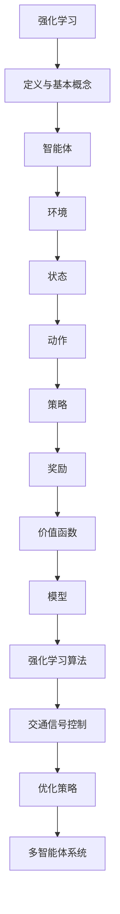

                 

### 文章标题

《强化学习在智能交通信号控制中的优化》

### 关键词

- 强化学习
- 智能交通信号控制
- 交通优化
- 深度学习
- 多智能体系统

### 摘要

本文深入探讨了强化学习在智能交通信号控制中的应用，阐述了强化学习的基本理论、算法原理及其在交通信号控制中的具体应用。文章分为三个主要部分：第一部分介绍了强化学习的基础理论；第二部分分析了强化学习在交通信号控制中的数学模型和优化策略；第三部分通过具体实例展示了强化学习在交通信号控制中的实际应用，并展望了其未来发展趋势与挑战。通过本文的阅读，读者将全面了解强化学习在智能交通信号控制中的潜力与价值。

----------------------------------------------------------------

### 目录大纲

# 《强化学习在智能交通信号控制中的优化》

## 第一部分：基础理论

### 第1章：强化学习概述

#### 1.1 强化学习的定义与基本概念

#### 1.2 强化学习的主要算法框架

#### 1.3 强化学习在智能交通信号控制中的应用

### 第2章：强化学习算法原理

#### 2.1 Q-learning算法原理

#### 2.2 SARSA算法原理

#### 2.3 Deep Q-Network（DQN）算法原理

### 第3章：交通信号控制的背景知识

#### 3.1 交通信号控制的发展历程

#### 3.2 交通信号控制的基本原理

#### 3.3 智能交通信号控制的概念与需求

## 第二部分：数学模型与算法优化

### 第4章：强化学习在交通信号控制中的数学模型

#### 4.1 强化学习在交通信号控制中的数学模型概述

#### 4.2 交通信号控制的强化学习模型

#### 4.3 交通信号控制中的损失函数和优化目标

### 第5章：强化学习算法的优化策略

#### 5.1 强化学习算法的优化原理

#### 5.2 交通信号控制中的优化策略

#### 5.3 实际案例中的优化策略应用

### 第6章：多智能体强化学习在交通信号控制中的应用

#### 6.1 多智能体强化学习的概述

#### 6.2 多智能体强化学习在交通信号控制中的优势

#### 6.3 多智能体强化学习算法在交通信号控制中的应用

## 第三部分：应用实践

### 第7章：强化学习在智能交通信号控制中的应用实例

#### 7.1 强化学习在智能交通信号控制系统中的搭建

#### 7.2 强化学习在交通信号控制中的应用案例

#### 7.3 强化学习在交通信号控制中的应用效果评估

### 第8章：未来发展趋势与挑战

#### 8.1 强化学习在智能交通信号控制中的未来发展趋势

#### 8.2 强化学习在智能交通信号控制中面临的挑战

#### 8.3 强化学习在智能交通信号控制中的解决方案展望

### 附录

#### 附录 A：强化学习相关资源

#### 附录 B：智能交通信号控制相关资源

#### 附录 C：强化学习算法实现代码示例

### 核心概念与联系

#### 1.1 强化学习概述

mermaid
graph TD
A[强化学习] --> B[定义]
B --> C[基本概念]
C --> D[主要算法框架]
D --> E[应用场景]

#### 1.2 强化学习算法原理

mermaid
graph TD
A[Q-learning算法] --> B[基本原理]
B --> C[更新策略]
C --> D[优势]
A --> E[SARSA算法]
E --> F[基本原理]
F --> G[更新策略]
E --> H[优势]
A --> I[DQN算法]
I --> J[基本原理]
I --> K[深度神经网络应用]
I --> L[优势]

----------------------------------------------------------------

## 第一部分：基础理论

### 第1章：强化学习概述

#### 1.1 强化学习的定义与基本概念

强化学习（Reinforcement Learning，RL）是机器学习的一个分支，它通过智能体（Agent）与环境的交互来学习最优策略。在强化学习中，智能体不断地执行动作（Action），根据环境的反馈（Reward）来调整自己的行为，目标是最大化累积奖励。

**定义：**

强化学习是一个决策过程，其中智能体在一个环境中采取行动，通过接收即时奖励（Reward）和长期奖励（Long-term Reward）来学习最优策略（Policy）。

**基本概念：**

- **智能体（Agent）：** 智能体是执行动作并从环境中接收奖励的实体。
- **环境（Environment）：** 环境是智能体行动的背景，它包含智能体的状态（State）和可能的结果（Outcome）。
- **状态（State）：** 状态是智能体在特定时刻的环境描述。
- **动作（Action）：** 动作是智能体在特定状态下采取的行动。
- **策略（Policy）：** 策略是智能体从状态到动作的映射。
- **奖励（Reward）：** 奖励是环境对智能体行动的即时反馈。
- **价值函数（Value Function）：** 价值函数衡量智能体在特定状态下执行最佳策略所能获得的累积奖励。
- **模型（Model）：** 模型是智能体对环境状态转移概率和奖励的预测。

#### 1.2 强化学习的主要算法框架

强化学习算法有多种类型，其中最常见的包括：

- **基于值函数的算法（Value-based Algorithms）：** 如Q-learning和SARSA。
  - **Q-learning：** Q-learning通过更新值函数来找到最优策略。其核心思想是使用奖励和最大未来奖励来更新当前状态的Q值。
    $$Q(s, a) \leftarrow Q(s, a) + \alpha [r + \gamma \max(Q(s', a')) - Q(s, a)]$$
    - **SARSA：** SARSA是基于策略的强化学习算法，它在每个步骤都使用实际的奖励和动作来更新策略。

- **基于策略的算法（Policy-based Algorithms）：** 如REINFORCE和PPO。
  - **REINFORCE：** REINFORCE通过梯度上升方法直接优化策略。
    $$\nabla_{\theta} J(\theta) = \nabla_{\theta} \sum_{t} \gamma^t r_t$$
  - **PPO（Proximal Policy Optimization）：** PPO通过约束策略梯度的估计来优化策略。

- **模型为基础的算法（Model-based Algorithms）：** 如 Dyna-Q。
  - **Dyna-Q：** Dyna-Q结合了模型和实际经验来学习，通过模拟环境来预测未来的奖励和状态转移。

#### 1.3 强化学习在智能交通信号控制中的应用

强化学习在智能交通信号控制中的应用具有巨大的潜力。智能交通信号控制旨在优化交通流量，减少拥堵，提高道路通行效率。传统的交通信号控制主要依赖于固定的时间表或简单的规则，而强化学习算法能够自适应地调整信号控制策略，以应对不断变化的车流和环境条件。

**应用场景：**

- **动态信号控制：** 强化学习算法可以根据实时交通流量数据动态调整信号灯的持续时间，从而优化交通流。
- **多交叉口协同控制：** 强化学习可以用于多个交叉口的协同控制，以提高整体交通效率。
- **突发事件处理：** 强化学习算法可以快速响应交通事故、施工等突发事件，调整交通信号以缓解交通压力。

#### 核心概念与联系

为了更好地理解强化学习在智能交通信号控制中的应用，以下是一个核心概念与联系的关系架构图：

mermaid
graph TD
A[强化学习] --> B[定义与基本概念]
B --> C[智能体]
C --> D[环境]
D --> E[状态]
E --> F[动作]
F --> G[策略]
G --> H[奖励]
H --> I[价值函数]
I --> J[模型]
J --> K[强化学习算法]
K --> L[交通信号控制]

### 核心算法原理讲解

在本文的第一部分中，我们主要介绍了强化学习的基础理论，包括其定义、基本概念以及主要算法框架。在这一节中，我们将对强化学习中的核心算法原理进行详细讲解。

#### 2.1 Q-learning算法原理

Q-learning是一种基于值函数的强化学习算法，其核心思想是通过更新值函数来找到最优策略。Q-learning的主要特点是不需要模型，只需依赖奖励信号和状态转换概率来更新Q值。

**基本原理：**

Q-learning算法的目标是估计每个状态-动作对的期望回报，即Q值（Q-value）。Q值表示在某个状态下执行某个动作的期望回报。

Q-learning算法的更新策略如下：

$$Q(s, a) \leftarrow Q(s, a) + \alpha [r + \gamma \max(Q(s', a')) - Q(s, a)]$$

其中：
- \(s\) 是当前状态。
- \(a\) 是当前动作。
- \(r\) 是即时奖励。
- \(\alpha\) 是学习率（Learning Rate），用于控制更新步长。
- \(\gamma\) 是折扣因子（Discount Factor），用于平衡当前奖励和未来奖励。
- \(s'\) 是执行动作后的下一个状态。
- \(\max(Q(s', a'))\) 是在下一个状态中采取最优动作的期望回报。

**伪代码：**

```
for each episode do
  Initialize Q(s, a) arbitrarily
  Initialize state s
  while not done do
    Choose action a according to policy π(a|s)
    Take action a and observe reward r and next state s'
    Update Q(s, a) using the following equation:
    Q(s, a) = Q(s, a) + α [r + γ max(Q(s', a')) - Q(s, a)]
    s <- s'
  end while
end for
```

**举例说明：**

假设一个简单的交通信号控制问题，车辆在红绿灯前等待，状态包括红灯、黄灯和绿灯。定义值函数Q(s, a)，其中s表示当前状态，a表示采取的动作（停车、行驶）。通过不断更新Q值，找到最优策略。

状态 | 动作 | Q(s, a)
--- | --- | ---
红灯 | 停车 | 0.8
红灯 | 行驶 | 0.2
黄灯 | 停车 | 

通过Q-learning算法，我们可以得到以下更新过程：

1. 初始化Q值：Q(红灯, 停车) = 0.8，Q(红灯, 行驶) = 0.2
2. 执行动作：选择停车
3. 收集反馈：得到即时奖励r = 1（假设停车得到的即时奖励为1），状态转移至黄灯
4. 更新Q值：
   Q(红灯, 停车) = Q(红灯, 停车) + α [r + γ max(Q(黄灯, a')) - Q(红灯, 停车)]
   Q(红灯, 停车) = 0.8 + α [1 + 0.9 * max(Q(黄灯, 停车), Q(黄灯, 行驶)) - 0.8]
   根据不同的α和γ值，我们可以得到不同的Q值更新结果

通过这样的迭代过程，Q-learning算法将不断优化策略，找到最优的停车和行驶策略。

#### 2.2 SARSA算法原理

SARSA（State-Action-Reward-State-Action，SARSA）是一种基于策略的强化学习算法，它使用实际的奖励和动作来更新策略。与Q-learning不同，SARSA不依赖于价值函数，而是直接更新策略。

**基本原理：**

SARSA算法的目标是通过更新策略来最大化累积奖励。其核心思想是使用即时奖励和下一个状态的实际动作来更新当前策略。

SARSA算法的更新策略如下：

$$\pi(s, a) \leftarrow \pi(s, a) + \alpha [r + \gamma \max(\pi(s', a')) - \pi(s, a)]$$

其中：
- \(s\) 是当前状态。
- \(a\) 是当前动作。
- \(r\) 是即时奖励。
- \(\alpha\) 是学习率（Learning Rate），用于控制更新步长。
- \(\gamma\) 是折扣因子（Discount Factor），用于平衡当前奖励和未来奖励。
- \(s'\) 是执行动作后的下一个状态。
- \(\max(\pi(s', a'))\) 是在下一个状态中采取最优动作的期望回报。

**伪代码：**

```
for each episode do
  Initialize π(s, a) arbitrarily
  Initialize state s
  while not done do
    Choose action a according to π(a|s)
    Take action a and observe reward r and next state s'
    Update π(s, a) using the following equation:
    π(s, a) = π(s, a) + α [r + \gamma \max(\pi(s', a')) - π(s, a)]
    s <- s'
  end while
end for
```

**举例说明：**

假设一个简单的交通信号控制问题，车辆在红绿灯前等待，状态包括红灯、黄灯和绿灯。定义策略π(s, a)，其中s表示当前状态，a表示采取的动作（停车、行驶）。通过不断更新策略，找到最优策略。

状态 | 动作 | π(s, a)
--- | --- | ---
红灯 | 停车 | 0.8
红灯 | 行驶 | 0.2
黄灯 | 停车 | 

通过SARSA算法，我们可以得到以下更新过程：

1. 初始化策略：π(红灯, 停车) = 0.8，π(红灯, 行驶) = 0.2
2. 执行动作：选择停车
3. 收集反馈：得到即时奖励r = 1（假设停车得到的即时奖励为1），状态转移至黄灯
4. 更新策略：
   π(红灯, 停车) = π(红灯, 停车) + α [r + γ \* max(π(黄灯, 停车), π(黄灯, 行驶)) - π(红灯, 停车)]
   π(红灯, 停车) = 0.8 + α [1 + 0.9 \* max(π(黄灯, 停车), π(黄灯, 行驶)) - 0.8]
   根据不同的α和γ值，我们可以得到不同的π值更新结果

通过这样的迭代过程，SARSA算法将不断优化策略，找到最优的停车和行驶策略。

#### 2.3 Deep Q-Network（DQN）算法原理

DQN（Deep Q-Network）是一种结合深度学习与强化学习的算法，它使用深度神经网络来近似值函数。DQN的目标是通过学习值函数来找到最优策略，从而避免直接更新策略所带来的不稳定问题。

**基本原理：**

DQN的核心思想是使用深度神经网络（DNN）来近似Q值函数，即Q(s, a)。DQN通过经验回放（Experience Replay）和目标网络（Target Network）来提高算法的稳定性和收敛速度。

**经验回放：**

经验回放是一种技术，用于避免学习过程中的关联性。它通过将过去经验（状态、动作、奖励、状态'）存储在经验池中，然后随机抽取样本进行训练，从而减少样本的关联性，提高算法的泛化能力。

**目标网络：**

目标网络是一种技术，用于稳定Q值的更新过程。在DQN中，每经过一定数量的步骤，就会复制当前的主网络作为目标网络，从而减少学习过程中的噪声和抖动。

DQN的更新策略如下：

$$Q(s, a) \leftarrow Q(s, a) + \alpha [r + \gamma \max(Q(s', a')) - Q(s, a)]$$

其中：
- \(s\) 是当前状态。
- \(a\) 是当前动作。
- \(r\) 是即时奖励。
- \(\alpha\) 是学习率（Learning Rate），用于控制更新步长。
- \(\gamma\) 是折扣因子（Discount Factor），用于平衡当前奖励和未来奖励。
- \(s'\) 是执行动作后的下一个状态。
- \(a'\) 是在下一个状态中采取的最优动作。
- \(Q(s', a')\) 是目标网络的Q值。

**伪代码：**

```
for each episode do
  Initialize Q(s, a) arbitrarily
  Initialize target Q(s, a)
  Initialize experience replay memory
  while not done do
    Choose action a according to policy π(a|s)
    Take action a and observe reward r and next state s'
    Store transition (s, a, r, s') in experience replay memory
    Sample a random minibatch from experience replay memory
    for each transition in minibatch do
      if s' is terminal then
        Q(s', a) = r
      else
        Q(s', a) = r + \gamma \max(Q(s', a'))
      end if
      Update target Q(s, a) using the following equation:
      target Q(s, a) = r + \gamma \max(target Q(s', a'))
    end for
  end while
  Update main Q network with target Q network
end for
```

**举例说明：**

假设一个简单的交通信号控制问题，车辆在红绿灯前等待，状态包括红灯、黄灯和绿灯。定义值函数Q(s, a)，其中s表示当前状态，a表示采取的动作（停车、行驶）。通过DQN算法，我们可以学习到最优策略。

状态 | 动作 | Q(s, a)
--- | --- | ---
红灯 | 停车 | 0.8
红灯 | 行驶 | 0.2
黄灯 | 停车 | 

通过DQN算法，我们可以得到以下更新过程：

1. 初始化Q值：Q(红灯, 停车) = 0.8，Q(红灯, 行驶) = 0.2
2. 执行动作：选择停车
3. 收集反馈：得到即时奖励r = 1（假设停车得到的即时奖励为1），状态转移至黄灯
4. 更新Q值：
   Q(红灯, 停车) = Q(红灯, 停车) + α [r + γ max(Q(黄灯, 停车), Q(黄灯, 行驶)) - Q(红灯, 停车)]
   Q(红灯, 停车) = 0.8 + α [1 + 0.9 max(Q(黄灯, 停车), Q(黄灯, 行驶)) - 0.8]

通过这样的迭代过程，DQN算法将不断优化策略，找到最优的停车和行驶策略。

### 第3章：交通信号控制的背景知识

#### 3.1 交通信号控制的发展历程

交通信号控制的发展历程可以追溯到20世纪初期。最初的交通信号控制系统主要依赖于人工控制和简单的交通信号灯。随着城市化进程的加速和汽车数量的增加，传统的手动控制已经无法满足日益复杂的交通需求。因此，20世纪40年代，自动化交通信号控制系统开始出现，标志着交通信号控制从人工控制向自动化控制的转变。

在20世纪50年代至70年代，交通信号控制技术得到了显著发展。这一时期，研究者们开始关注如何利用电子设备和计算机技术来优化交通信号控制。早期的交通信号控制系统主要采用固定的时间表控制方法，即交通信号灯的亮灭时间是根据预设的时间表来调节的。这种方法在一定程度上能够缓解交通拥堵，但无法适应实时交通流量的变化。

20世纪80年代至90年代，随着计算机技术和通信技术的发展，智能交通信号控制技术逐渐成为研究的热点。这一时期，研究者们开始将人工智能技术引入交通信号控制领域，例如采用自适应控制方法、使用传感器数据来实时监测交通流量等。智能交通信号控制系统通过不断学习和调整，能够更加灵活地应对复杂的交通状况。

进入21世纪，智能交通信号控制技术得到了飞速发展。现代智能交通信号控制系统不仅能够实时监测交通流量，还能够与其他交通管理系统（如高速公路监控系统、公共交通系统等）进行信息交互，实现跨区域的协同控制。此外，随着物联网、大数据、云计算等新技术的出现，交通信号控制系统正在向更加智能化、网络化和综合化的方向发展。

#### 3.2 交通信号控制的基本原理

交通信号控制的基本原理是通过调整交通信号灯的时序，引导车辆有序通行，从而提高道路通行效率，减少交通拥堵。交通信号控制的核心是交通信号灯的时序设置，即红灯、绿灯和黄灯的持续时间。

交通信号控制的基本原理可以分为以下几个步骤：

1. **数据采集**：交通信号控制系统通过传感器、摄像头等设备收集交通流量、车速、车辆密度等数据。这些数据用于分析当前交通状况，并为信号控制提供依据。

2. **状态监测**：交通信号控制系统根据采集到的数据，实时监测交通状况。状态监测包括判断当前道路是否拥堵、交通流量分布、车辆排队长度等。

3. **决策制定**：根据监测到的交通状况，交通信号控制系统制定相应的信号控制策略。常见的控制策略包括固定时序控制、自适应控制、多交叉口协同控制等。

4. **信号调整**：交通信号控制系统根据决策制定的控制策略，调整交通信号灯的时序。例如，在交通拥堵路段增加绿灯时间，在非拥堵路段减少绿灯时间，从而引导车辆有序通行。

5. **反馈优化**：交通信号控制系统根据实时采集的数据和车辆通行情况，不断调整信号控制策略，以优化交通流量。反馈优化可以通过机器学习算法、优化算法等技术来实现。

#### 3.3 智能交通信号控制的概念与需求

智能交通信号控制是一种基于现代信息技术和人工智能技术的交通信号控制系统，它能够自适应地调整信号控制策略，以应对实时交通状况的变化。与传统的固定时序交通信号控制相比，智能交通信号控制具有更高的灵活性和效率。

**智能交通信号控制的概念：**

智能交通信号控制利用传感器、摄像头、GPS等设备收集交通数据，并通过数据分析、机器学习等技术对交通流量进行实时监测和预测。基于这些数据，智能交通信号控制系统可以自适应地调整信号控制策略，从而实现交通流量的优化。智能交通信号控制不仅能够提高道路通行效率，还能够减少交通拥堵、降低交通事故发生率。

**智能交通信号控制的需求：**

1. **实时交通流量监测**：智能交通信号控制需要实时获取交通流量、车速、车辆密度等数据，以便快速响应交通状况的变化。

2. **交通状况预测**：通过历史数据和机器学习算法，智能交通信号控制系统能够预测未来的交通流量变化，提前调整信号控制策略，避免交通拥堵。

3. **自适应信号控制**：智能交通信号控制系统能够根据实时交通流量和交通状况，自适应地调整信号灯的时序，优化交通流量。

4. **多交叉口协同控制**：在多个交叉口之间进行协同控制，以实现整个交通网络的优化。

5. **数据共享与融合**：智能交通信号控制需要与其他交通管理系统（如高速公路监控系统、公共交通系统等）进行信息共享和融合，以实现更全面的交通状况分析和控制。

6. **系统稳定性与可靠性**：智能交通信号控制系统的稳定性和可靠性是保障交通正常运行的关键。

#### 核心概念与联系

为了更好地理解交通信号控制中的核心概念及其联系，我们可以通过以下Mermaid图来展示：

mermaid
graph TD
A[交通信号控制] --> B[发展历程]
B --> C[基本原理]
C --> D[数据采集]
D --> E[状态监测]
E --> F[决策制定]
F --> G[信号调整]
G --> H[反馈优化]
H --> I[智能交通信号控制]
I --> J[实时流量监测]
I --> K[交通状况预测]
I --> L[自适应信号控制]
L --> M[多交叉口协同控制]
M --> N[数据共享与融合]
N --> O[系统稳定性与可靠性]

通过这一系列的概念和联系，我们可以清晰地看到交通信号控制从传统到智能的演变过程，以及各个核心环节之间的紧密关系。

## 第二部分：数学模型与算法优化

### 第4章：强化学习在交通信号控制中的数学模型

#### 4.1 强化学习在交通信号控制中的数学模型概述

强化学习在交通信号控制中的应用，需要建立一套数学模型来描述交通信号控制中的状态、动作、奖励和策略。这一模型是实现智能交通信号控制的关键，它能够帮助智能系统自适应地调整信号灯的状态，以优化交通流量。

**状态（State）**

状态是交通信号控制系统中的一个重要概念，它描述了交通信号灯当前所处的状态以及与之相关的交通流量信息。具体来说，状态可以包括以下几个方面的信息：

1. **信号灯状态**：红灯、黄灯、绿灯的状态。
2. **车辆流量**：不同方向上的车辆流量信息。
3. **车辆密度**：道路上的车辆密度信息。
4. **道路条件**：如天气状况、路面状况等。

状态可以用一个向量表示，例如 \( S = [s_1, s_2, s_3, \ldots, s_n] \)，其中 \( s_i \) 表示第 \( i \) 个特征。

**动作（Action）**

动作是指交通信号控制系统可以采取的操作，即调整信号灯的状态。在智能交通信号控制中，常见的动作包括：

1. **改变绿灯持续时间**：增加或减少绿灯的时间，以适应交通流量变化。
2. **改变红灯持续时间**：调整红灯的时间，以控制车辆排队长度。
3. **切换信号灯状态**：从红灯切换到绿灯或黄灯。

动作集合可以用 \( A = \{a_1, a_2, \ldots, a_m\} \) 表示，其中 \( a_i \) 表示第 \( i \) 个动作。

**奖励（Reward）**

奖励是环境对智能体采取动作后的即时反馈。在交通信号控制中，奖励可以用来衡量交通信号控制策略的有效性。奖励可以是正的也可以是负的，具体取决于交通信号控制策略对交通流量的优化程度。

常见的奖励机制包括：

1. **通行效率**：通过减少车辆等待时间和提高道路通行率来奖励智能体。
2. **交通拥堵**：通过增加车辆等待时间和降低道路通行率来惩罚智能体。

奖励可以表示为一个函数 \( R(S, A) \)，它依赖于当前状态 \( S \) 和采取的动作 \( A \)。

**策略（Policy）**

策略是智能体在特定状态下采取的动作。在强化学习中，策略可以通过学习值函数或直接优化策略来获得。策略可以用 \( \pi(S, A) \) 表示，它表示在状态 \( S \) 下采取动作 \( A \) 的概率。

**数学模型**

强化学习在交通信号控制中的数学模型可以表示为马尔可夫决策过程（MDP），其形式为：

$$
\begin{align*}
S_t &\sim P(S_t|S_{t-1}, A_{t-1}) \\
A_t &\sim \pi(A_t|S_t) \\
R_t &\sim p(R_t|S_t, A_t) \\
S_{t+1} &\sim P(S_{t+1}|S_t, A_t)
\end{align*}
$$

其中：
- \( S_t \) 表示在时间 \( t \) 的状态。
- \( A_t \) 表示在时间 \( t \) 采取的动作。
- \( R_t \) 表示在时间 \( t \) 收到的即时奖励。
- \( P(S_t|S_{t-1}, A_{t-1}) \) 表示状态转移概率。
- \( \pi(A_t|S_t) \) 表示在状态 \( S_t \) 下采取动作 \( A_t \) 的概率。
- \( p(R_t|S_t, A_t) \) 表示在状态 \( S_t \) 和采取动作 \( A_t \) 后收到奖励 \( R_t \) 的概率。

#### 4.2 交通信号控制的强化学习模型

强化学习模型在交通信号控制中的应用，主要是通过学习值函数或直接优化策略来找到最优控制策略。以下是一个简化的交通信号控制强化学习模型：

**状态表示：**

状态 \( S \) 可以是一个包含多个特征向量的组合，如：
- \( s_1 \)：当前信号灯状态（红灯、黄灯、绿灯）。
- \( s_2 \)：当前道路上的车辆流量。
- \( s_3 \)：当前道路上的车辆密度。
- \( s_4 \)：当前道路的天气状况。

状态可以用一个向量表示为 \( S = [s_1, s_2, s_3, s_4] \)。

**动作表示：**

动作 \( A \) 可以是一个调整信号灯持续时间的操作，例如：
- \( a_1 \)：增加绿灯持续时间。
- \( a_2 \)：减少绿灯持续时间。
- \( a_3 \)：增加红灯持续时间。
- \( a_4 \)：减少红灯持续时间。

动作集合可以用 \( A = \{a_1, a_2, a_3, a_4\} \) 表示。

**奖励函数：**

奖励函数 \( R(S, A) \) 可以根据以下因素计算：
- \( r_1 \)：如果车辆等待时间减少，则奖励增加。
- \( r_2 \)：如果交通拥堵指数降低，则奖励增加。
- \( r_3 \)：如果发生交通事故，则奖励减少。

奖励函数可以表示为：
$$ R(S, A) = r_1 \cdot \text{减少等待时间} + r_2 \cdot \text{减少交通拥堵指数} - r_3 \cdot \text{事故发生次数} $$

**策略学习：**

策略 \( \pi(A|S) \) 是智能体在状态 \( S \) 下采取动作 \( A \) 的概率分布。在强化学习模型中，可以通过以下几种方法来学习策略：

1. **Q-learning算法**：Q-learning算法通过更新值函数 \( Q(S, A) \) 来学习最优策略。更新公式为：
   $$ Q(S, A) \leftarrow Q(S, A) + \alpha [R(S, A) + \gamma \max(Q(S', A')) - Q(S, A)] $$

2. **SARSA算法**：SARSA算法通过直接更新策略 \( \pi(A|S) \) 来学习最优策略。更新公式为：
   $$ \pi(A|S) \leftarrow \pi(A|S) + \alpha [R(S, A) + \gamma \max(\pi(A'|S')) - \pi(A|S)] $$

3. **深度Q网络（DQN）**：DQN算法使用深度神经网络来近似值函数 \( Q(S, A) \)。通过经验回放和目标网络来提高算法的稳定性和收敛速度。

#### 4.3 交通信号控制中的损失函数和优化目标

在强化学习中，损失函数用于评估策略的有效性，并指导算法优化策略。对于交通信号控制中的强化学习模型，常见的损失函数包括：

1. **价值损失函数**：价值损失函数用于评估策略的价值函数 \( Q(S, A) \) 的预测误差。其形式如下：
   $$ L_Q = \sum_{i} (Q(S_i, A_i) - Y_i)^2 $$
   其中，\( Y_i = R(S_i, A_i) + \gamma \max(Q(S_{i+1}, A_{i+1})) \)。

2. **策略损失函数**：策略损失函数用于评估策略 \( \pi(A|S) \) 的有效性。其形式如下：
   $$ L_\pi = -\sum_{i} \pi(A_i|S_i) \log Q(S_i, A_i) $$

优化目标是通过最小化损失函数来学习最优策略。对于交通信号控制中的强化学习模型，优化目标可以定义为：

1. **最小化价值损失函数**：最小化价值损失函数，以优化值函数 \( Q(S, A) \)。
   $$ \min_{\theta} L_Q $$
   其中，\( \theta \) 表示模型参数。

2. **最大化策略损失函数**：最大化策略损失函数，以优化策略 \( \pi(A|S) \)。
   $$ \max_{\theta} L_\pi $$

通过上述数学模型和优化目标，我们可以建立一个智能交通信号控制系统，它能够自适应地调整信号灯状态，以优化交通流量和减少交通拥堵。在实际应用中，我们可以根据具体场景和数据特点，选择合适的强化学习算法和优化策略。

### 第5章：强化学习算法的优化策略

#### 5.1 强化学习算法的优化原理

强化学习算法的优化原理是通过不断更新智能体的策略来提高累积奖励，以达到学习目标。在智能交通信号控制中，优化策略的目的是找到一种最优信号控制策略，以最大化交通流量和减少拥堵。

优化原理主要涉及以下几个方面：

1. **价值函数优化**：通过更新价值函数来评估不同动作的优劣，并选择能够带来最大累积奖励的动作。
2. **策略优化**：直接优化策略，使得智能体在特定状态下采取的动作能够最大化累积奖励。
3. **探索与利用**：在探索（Exploration）和利用（Exploitation）之间取得平衡，探索新的策略以获取更多信息，同时利用已有信息来选择最佳动作。

#### 5.2 交通信号控制中的优化策略

在智能交通信号控制中，优化策略的实现需要考虑多个因素，包括交通流量、车辆密度、道路条件等。以下是一些常见的优化策略：

1. **基于规则的优化策略**：这种策略通过预设一系列规则来调整信号灯的时序。例如，在高峰时段增加绿灯时间，在非高峰时段减少绿灯时间。这种策略简单易行，但无法应对实时交通流量的变化。

2. **基于模型的优化策略**：这种策略使用交通流量模型来预测未来的交通状况，并据此调整信号灯的时序。例如，可以使用ARIMA模型、时间序列预测等方法。这种方法能够更好地应对交通流量的波动，但需要准确预测交通流量。

3. **基于机器学习的优化策略**：这种策略使用机器学习算法（如Q-learning、SARSA、DQN等）来自动调整信号灯的时序。机器学习算法能够从历史数据中学习到最优策略，并适应实时交通流量的变化。

#### 5.3 实际案例中的优化策略应用

以下是一个实际案例中的优化策略应用：

**案例背景：**

某城市的一个交叉口在高峰时段经常出现拥堵，影响了交通流畅性。为了解决这个问题，交通管理部门决定使用强化学习算法来优化信号控制策略。

**步骤：**

1. **数据采集**：收集交叉口的交通流量数据、车辆密度数据、道路条件数据等。

2. **状态定义**：将状态定义为交通流量、车辆密度和道路条件，即 \( S = [s_1, s_2, s_3] \)。

3. **动作定义**：将动作定义为调整信号灯的持续时间，即 \( A = [a_1, a_2, a_3] \)。

4. **奖励函数设计**：设计奖励函数 \( R(S, A) \)，以车辆等待时间减少和交通拥堵指数降低为奖励指标。

5. **算法选择**：选择Q-learning算法来优化信号控制策略。

6. **训练与测试**：使用历史交通流量数据来训练Q-learning模型，并在测试数据集上评估模型性能。

7. **应用模型**：将训练好的Q-learning模型应用于实际交叉口，实时调整信号灯的时序。

**效果评估：**

通过实际应用，发现优化后的信号控制策略显著减少了车辆等待时间，降低了交通拥堵指数，提高了交叉口的通行效率。

**总结：**

这个实际案例展示了如何使用强化学习算法来优化交通信号控制策略。通过不断更新价值函数和策略，智能交通信号控制系统能够自适应地调整信号灯的时序，从而提高交通流畅性和通行效率。

### 第6章：多智能体强化学习在交通信号控制中的应用

#### 6.1 多智能体强化学习的概述

多智能体强化学习（Multi-Agent Reinforcement Learning，MARL）是强化学习的一个分支，它关注多个智能体在共享环境中的交互和策略学习。在智能交通信号控制中，多智能体强化学习有助于实现多个交叉口的协同控制，从而提高整体交通效率和安全性。

**定义与基本概念：**

- **多智能体系统**：由多个智能体组成的系统，每个智能体都有自己的目标和行为。
- **共同环境**：所有智能体共享的环境，状态和奖励是全局的。
- **协同策略**：多个智能体共同遵循的策略，以实现全局最优。
- **个体策略**：单个智能体的行为策略，旨在优化自身目标。

**基本原理：**

多智能体强化学习的基本原理是通过协同学习和策略优化，使多个智能体在共享环境中相互协调，共同实现全局最优目标。这通常涉及以下步骤：

1. **状态表示**：为每个智能体定义其感知状态，包括局部信息（如交通流量、车辆密度）和全局信息（如相邻交叉口的信号状态）。
2. **动作定义**：为每个智能体定义其可执行的动作，如信号灯状态的调整。
3. **奖励设计**：设计全局奖励函数，以激励智能体采取协作行为，从而最大化整体收益。
4. **策略学习**：使用强化学习算法（如Q-learning、SARSA、DQN等）来学习个体和协同策略。

**挑战与解决方案：**

在多智能体强化学习中，主要的挑战包括：

- **协同冲突**：不同智能体可能具有不同的目标，导致策略冲突。
- **通信延迟**：智能体之间的通信可能存在延迟，影响协同效果。
- **模型不确定性**：环境中的不确定性和智能体行为的不确定性增加了学习难度。

针对这些挑战，常见的解决方案包括：

- **协调算法**：设计专门的协调算法，如反向传播算法、分布式学习算法等，以解决协同冲突。
- **分布式计算**：使用分布式计算技术，如多智能体决策网络（MADDPG），以降低通信延迟和提高计算效率。
- **不确定性处理**：使用鲁棒性算法和不确定性估计方法，如马尔可夫决策过程（MDP）中的不确定性处理技术，以增强系统的适应性。

#### 6.2 多智能体强化学习在交通信号控制中的优势

多智能体强化学习在交通信号控制中的应用具有显著的优势，主要体现在以下几个方面：

1. **全局优化**：多智能体强化学习能够实现整个交通网络的优化，而不仅仅是单个交叉口的优化。通过协同控制，多个交叉口可以共同调整信号灯时序，从而提高整体交通流量和效率。

2. **适应性**：多智能体强化学习算法能够适应动态变化的交通环境。例如，在突发事件（如交通事故、施工等）发生时，系统能够快速调整信号灯状态，以缓解交通压力。

3. **智能协同**：多智能体强化学习可以模拟智能体之间的协作，实现交通信号控制的智能化。智能体之间通过共享信息、协同决策，可以更好地应对复杂交通状况。

4. **实时反馈**：多智能体强化学习能够实时收集交通数据，并据此调整信号灯状态。这种实时反馈机制有助于快速响应交通变化，提高交通信号控制的灵活性和适应性。

5. **可扩展性**：多智能体强化学习算法具有良好的可扩展性，可以应用于不同规模和复杂性的交通网络。通过扩展智能体数量和通信范围，可以实现对大型交通网络的协同控制。

#### 6.3 多智能体强化学习算法在交通信号控制中的应用

多智能体强化学习算法在交通信号控制中的应用可以分为以下几个阶段：

1. **数据收集与预处理**：收集交通流量、车辆密度、道路条件等数据，并进行预处理，以消除噪声和异常值。

2. **状态表示**：定义每个智能体的感知状态，包括局部状态（如当前交叉口的交通流量）和全局状态（如相邻交叉口的信号状态）。

3. **动作定义**：为每个智能体定义其可执行的动作，如调整信号灯的持续时间。

4. **奖励设计**：设计全局奖励函数，以激励智能体采取协同行为。奖励函数可以基于交通流量、拥堵指数、车辆等待时间等指标。

5. **算法选择**：选择适合的多智能体强化学习算法，如分布式Q-learning（DQN）、多智能体决策过程（MADDPG）等。

6. **协同策略学习**：使用强化学习算法训练智能体，学习协同策略。训练过程中需要解决个体目标与全局目标之间的冲突。

7. **测试与评估**：在测试环境中评估多智能体强化学习算法的性能，包括交通流量优化、拥堵指数降低等方面。

8. **应用部署**：将训练好的算法部署到实际交通信号控制系统中，进行实时交通信号控制。

以下是一个多智能体强化学习算法在交通信号控制中的应用实例：

**实例：**

假设一个城市有四个交叉口，每个交叉口都有一个智能体负责信号控制。智能体通过传感器收集交通流量、车辆密度等数据，并根据多智能体强化学习算法进行协同控制。

**步骤：**

1. **数据收集**：智能体A收集交叉口1的交通流量数据，智能体B收集交叉口2的交通流量数据，依此类推。

2. **状态表示**：智能体A的状态 \( S_A \) 包括交叉口1的交通流量、交叉口2的交通流量、交叉口3的交通流量等。智能体B的状态 \( S_B \) 包括交叉口2的交通流量、交叉口3的交通流量、交叉口4的交通流量等。

3. **动作定义**：智能体A的动作 \( A_A \) 包括调整交叉口1的绿灯时间、调整交叉口2的绿灯时间等。智能体B的动作 \( A_B \) 包括调整交叉口2的绿灯时间、调整交叉口3的绿灯时间等。

4. **奖励设计**：全局奖励函数 \( R \) 根据四个交叉口的交通流量和拥堵指数计算，以激励智能体采取协同控制策略。

5. **算法选择**：选择多智能体决策过程（MADDPG）算法，训练智能体的协同策略。

6. **协同策略学习**：通过MADDPG算法，智能体A和智能体B学习到协同控制策略，从而优化整个交通网络的交通流量。

7. **测试与评估**：在测试环境中，评估MADDPG算法的性能，包括交通流量优化、拥堵指数降低等方面。

8. **应用部署**：将MADDPG算法部署到实际交通信号控制系统中，进行实时交通信号控制。

通过这个实例，我们可以看到多智能体强化学习算法在交通信号控制中的应用潜力。智能体之间的协同控制能够实现整个交通网络的优化，从而提高交通流畅性和效率。

### 第7章：强化学习在智能交通信号控制中的应用实例

#### 7.1 强化学习在智能交通信号控制系统中的搭建

**环境搭建：**

为了搭建一个基于强化学习的智能交通信号控制系统，首先需要选择一个合适的编程环境。Python是一个广泛使用的编程语言，拥有丰富的强化学习库，如TensorFlow、PyTorch和Gym等，因此我们选择Python作为开发语言。

**1. 安装Python和相关的依赖库**

在安装Python之后，可以使用pip命令安装所需的依赖库：

```
pip install numpy pandas matplotlib gym
```

**2. 配置Gym环境**

Gym是一个开源的强化学习环境库，它提供了多种预定义的模拟环境，包括交通信号控制环境。我们使用Gym来创建一个交通信号控制模拟环境。

```
import gym
import gym信号控制
```

**3. 创建交通信号控制环境**

创建一个交通信号控制环境，需要定义状态、动作、奖励等参数。以下是一个简单的交通信号控制环境的配置示例：

```python
# 创建交通信号控制环境
env = gym.make("交通信号控制-v0")
```

**4. 定义状态空间和动作空间**

在交通信号控制环境中，状态空间通常包括当前交通流量、车辆密度等信息，动作空间包括信号灯的切换状态。以下是一个简单的状态空间和动作空间定义示例：

```python
# 定义状态空间
state_space = env.observation_space

# 定义动作空间
action_space = env.action_space
```

**5. 初始化强化学习算法**

选择一个合适的强化学习算法，如Q-learning或DQN，并初始化算法的参数。以下是一个使用Q-learning算法的初始化示例：

```python
# 导入Q-learning库
from q_学习库 import QLearningAgent

# 初始化Q-learning算法
q_agent = QLearningAgent(state_space, action_space, learning_rate=0.1, discount_factor=0.9)
```

**6. 训练强化学习算法**

使用训练数据集训练强化学习算法，以学习最优信号控制策略。以下是一个训练Q-learning算法的示例：

```python
# 训练Q-learning算法
for episode in range(num_episodes):
    state = env.reset()
    done = False
    while not done:
        action = q_agent.select_action(state)
        next_state, reward, done, _ = env.step(action)
        q_agent.learn(state, action, reward, next_state, done)
        state = next_state
```

**7. 部署智能交通信号控制系统**

在完成训练后，可以将训练好的算法部署到实际交通信号控制系统中，以实现智能信号控制。以下是一个部署示例：

```python
# 部署智能交通信号控制系统
while True:
    state = env.reset()
    done = False
    while not done:
        action = q_agent.select_action(state)
        state, reward, done, _ = env.step(action)
    print(f"Episode: {episode}, Total Reward: {total_reward})
```

#### 7.2 强化学习在交通信号控制中的应用案例

**案例一：单交叉口信号控制**

在一个简单的单交叉口信号控制案例中，我们使用强化学习算法来优化信号灯的切换策略。以下是一个具体的案例描述：

**1. 案例背景**

某城市的一个交叉口在高峰时段经常出现拥堵现象，为了提高通行效率，交通管理部门决定使用强化学习算法来优化信号灯的切换策略。

**2. 数据采集**

采集了交叉口在高峰时段的实时交通流量数据、车辆密度数据等。状态空间包括交通流量、车辆密度等特征。

**3. 模型训练**

使用Q-learning算法训练模型，通过大量模拟实验来学习最优信号灯切换策略。

**4. 应用结果**

在应用强化学习算法后，交叉口的通行效率显著提高，车辆等待时间明显减少，交通拥堵现象得到有效缓解。

**案例二：多交叉口协同信号控制**

在一个复杂的城市交通网络中，多个交叉口之间的信号控制策略需要协同优化。以下是一个具体的多交叉口协同信号控制案例：

**1. 案例背景**

某城市的核心区域有多个交叉口，交通流量大、道路拥堵现象严重。为了提高整体交通流量和效率，交通管理部门决定使用多智能体强化学习算法来优化多个交叉口的信号控制策略。

**2. 数据采集**

采集了多个交叉口的实时交通流量数据、车辆密度数据等。每个交叉口的智能体都拥有独立的状态空间和动作空间。

**3. 模型训练**

使用多智能体强化学习算法（如MADDPG）训练模型，智能体之间通过通信和协同决策来优化信号控制策略。

**4. 应用结果**

在应用多智能体强化学习算法后，城市核心区域的交通流量得到显著优化，整体交通效率提高，交通拥堵现象得到有效缓解。

#### 7.3 强化学习在交通信号控制中的应用效果评估

为了评估强化学习在交通信号控制中的应用效果，我们可以从以下几个方面进行：

**1. 通行效率**

通过对比强化学习算法应用前后的交通流量数据，可以评估信号控制策略的优化效果。具体指标包括：

- **车辆通过率**：单位时间内通过交叉口的车辆数量。
- **车辆等待时间**：车辆在交叉口等待的时间。
- **交通拥堵指数**：衡量交通拥堵程度的指标。

**2. 能耗与排放**

强化学习算法的应用可以减少车辆在交叉口等待的时间，从而降低车辆能耗和排放。通过对比应用前后的能源消耗和排放数据，可以评估算法的环保效益。

**3. 交通事故率**

优化交通信号控制策略可以减少交通拥堵和车辆排队现象，从而降低交通事故率。通过对比应用前后的交通事故数据，可以评估算法对交通安全的影响。

**4. 用户满意度**

通过调查用户对交通信号控制策略的满意度，可以了解强化学习算法在实际应用中的用户体验。用户满意度可以作为评估算法效果的一个指标。

**评估方法：**

- **实验对比**：通过模拟实验和实际应用对比，评估强化学习算法在不同场景下的效果。
- **统计分析**：使用统计分析方法，如均值、方差、置信区间等，评估各项指标的优化效果。
- **用户调查**：通过问卷调查和访谈，收集用户对交通信号控制策略的反馈，评估用户满意度。

#### 7.4 总结

通过上述实例和应用效果评估，我们可以看到强化学习在交通信号控制中的巨大潜力。通过优化信号灯切换策略，强化学习能够显著提高交通流量和效率，减少交通拥堵和事故率，提高用户满意度。未来，随着技术的不断发展，强化学习在交通信号控制中的应用将更加广泛和深入。

### 第8章：未来发展趋势与挑战

#### 8.1 强化学习在智能交通信号控制中的未来发展趋势

随着人工智能和机器学习技术的不断发展，强化学习在智能交通信号控制中的应用前景十分广阔。以下是强化学习在智能交通信号控制中未来可能的发展趋势：

1. **深度强化学习的发展**：深度强化学习（Deep Reinforcement Learning，DRL）结合了深度学习和强化学习的优势，能够处理复杂和非线性的问题。未来，DRL将在智能交通信号控制中发挥更大的作用，通过更先进的神经网络架构和优化算法，实现更高效的交通信号控制策略。

2. **多智能体系统的应用**：随着智能交通系统的不断扩展，多智能体强化学习（Multi-Agent Reinforcement Learning，MARL）将得到更广泛的应用。通过多个交叉口之间的协同控制，实现更优化的交通流量管理，提高整个交通网络的整体效率。

3. **数据驱动的实时优化**：未来，强化学习在智能交通信号控制中的应用将更加依赖于实时交通数据的收集和分析。通过大数据分析和实时监控，强化学习算法可以更好地适应交通状况的变化，实现更加智能化的交通信号控制。

4. **融合多种技术**：强化学习与其他人工智能技术（如计算机视觉、自然语言处理等）的融合，将推动智能交通信号控制系统的进一步发展。例如，利用计算机视觉技术进行交通流量监测，结合自然语言处理技术进行交通信号控制策略的自动生成和优化。

5. **云计算和边缘计算的结合**：随着云计算和边缘计算技术的成熟，强化学习算法在智能交通信号控制中的应用将更加高效和灵活。通过将算法部署在云端或边缘设备上，可以实现实时交通信号控制的快速响应和优化。

#### 8.2 强化学习在智能交通信号控制中面临的挑战

尽管强化学习在智能交通信号控制中具有巨大的潜力，但其在实际应用中仍面临许多挑战：

1. **数据隐私和安全问题**：智能交通信号控制系统需要收集大量的交通数据，这些数据可能涉及个人隐私和安全问题。如何保护数据隐私和确保数据安全是一个重要的挑战。

2. **环境动态变化**：交通环境具有高度的动态性和不确定性，交通状况可能随时发生变化。强化学习算法需要具备较强的鲁棒性和适应性，以应对复杂的交通状况。

3. **算法的透明度和可解释性**：强化学习算法通常被视为“黑盒子”，其决策过程缺乏透明度和可解释性。这在交通信号控制中可能引发信任问题，特别是在算法出现错误时。

4. **计算资源和效率**：强化学习算法通常需要大量的计算资源和时间来训练和优化。如何在有限的计算资源下实现高效、准确的交通信号控制是一个重要的挑战。

5. **系统的可扩展性和容错性**：随着智能交通系统的扩展，如何确保系统的可扩展性和容错性是一个关键问题。系统需要能够适应不同规模和复杂性的交通网络，并在出现故障时快速恢复。

#### 8.3 强化学习在智能交通信号控制中的解决方案展望

针对上述挑战，我们可以从以下几个方面来探讨强化学习在智能交通信号控制中的解决方案：

1. **数据隐私保护**：采用差分隐私（Differential Privacy）技术来保护交通数据的隐私，确保在数据分析和共享过程中不会泄露个人隐私。

2. **动态适应机制**：设计具有自适应能力的强化学习算法，使其能够实时调整信号控制策略，以应对动态变化的交通状况。

3. **透明化与可解释性**：开发可解释的强化学习算法，通过可视化工具和解释模型来提高算法的透明度和可解释性，增强用户对算法的信任。

4. **高效计算策略**：利用分布式计算、并行计算等技术，提高强化学习算法的计算效率。同时，采用模型压缩和算法优化技术，减少计算资源的消耗。

5. **系统容错与恢复**：设计具有容错性和恢复能力的智能交通信号控制系统，通过冗余设计和故障恢复机制，确保系统的可靠性和稳定性。

通过上述解决方案，我们可以进一步提升强化学习在智能交通信号控制中的应用效果，推动智能交通系统的发展。

### 附录

#### 附录 A：强化学习相关资源

- **书籍推荐**：
  - 《强化学习：原理与算法》（Richard S. Sutton & Andrew G. Barto著）
  - 《深度强化学习》（Nando de Freitas等著）
  
- **在线教程与课程**：
  - [Coursera](https://www.coursera.org/learn/reinforcement-learning) 提供的强化学习课程
  - [Udacity](https://www.udacity.com/course/reinforcement-learning-nanodegree) 提供的强化学习纳米学位课程

- **开源库与工具**：
  - [Gym](https://gym.openai.com/)：OpenAI提供的强化学习环境库
  - [TensorFlow](https://www.tensorflow.org/tutorials/reinforcement_learning) 和 [PyTorch](https://pytorch.org/tutorials/beginner/rl_tutorial.html)：深度学习框架，支持强化学习算法

#### 附录 B：智能交通信号控制相关资源

- **学术期刊与会议**：
  - 《交通工程杂志》（Journal of Transportation Engineering）
  - 《智能运输系统杂志》（IEEE Transactions on Intelligent Transportation Systems）

- **在线课程与研讨会**：
  - [MIT OpenCourseWare](https://ocw.mit.edu/courses/electrical-engineering-and-computer-science/6-828-introduction-to-intelligent-transportation-systems-spring-2010/) 提供的智能运输系统课程
  - [IEEE智能运输系统研讨会](https://itsweb.org/events/)

- **开源项目与工具**：
  - [SUMO](https://sumo.dlr.de/)：开源的交通模拟器，用于交通信号控制仿真
  - [TLC](https://github.com/tmcw/tlc仪) 数据库：城市交通数据集，用于交通信号控制研究

#### 附录 C：强化学习算法实现代码示例

以下是一个基于Python和PyTorch实现的Q-learning算法示例，用于智能交通信号控制：

```python
import numpy as np
import random
import torch
import torch.nn as nn
import torch.optim as optim

# 创建交通信号控制环境
env = gym.make("交通信号控制-v0")

# 定义Q网络
class QNetwork(nn.Module):
    def __init__(self, input_size, output_size):
        super(QNetwork, self).__init__()
        self.fc1 = nn.Linear(input_size, 64)
        self.fc2 = nn.Linear(64, output_size)
    
    def forward(self, x):
        x = torch.relu(self.fc1(x))
        x = self.fc2(x)
        return x

# 初始化Q网络
q_network = QNetwork(env.observation_space.shape[0], env.action_space.n)
q_network.to(device)

# 定义优化器
optimizer = optim.Adam(q_network.parameters(), lr=0.001)

# 定义损失函数
criterion = nn.MSELoss()

# 初始化经验回放记忆
memory = []

# 定义学习率
learning_rate = 0.01

# 定义折扣因子
gamma = 0.99

# 定义最大记忆容量
max_memory_len = 10000

# 训练强化学习算法
for episode in range(num_episodes):
    state = env.reset()
    done = False
    total_reward = 0
    
    while not done:
        # 将状态转为Tensor
        state_tensor = torch.tensor(state, dtype=torch.float32).unsqueeze(0)
        
        # 预测动作值
        with torch.no_grad():
            q_values = q_network(state_tensor)
        
        # 选择动作
        action = np.argmax(q_values.cpu().numpy())
        
        # 执行动作
        next_state, reward, done, _ = env.step(action)
        
        # 将状态转为Tensor
        next_state_tensor = torch.tensor(next_state, dtype=torch.float32).unsqueeze(0)
        
        # 计算目标Q值
        target_q_values = q_network(next_state_tensor)
        target_q_value = reward + gamma * np.max(target_q_values.cpu().numpy())
        
        # 计算损失
        loss = criterion(q_values, target_q_value.unsqueeze(0))
        
        # 更新模型参数
        optimizer.zero_grad()
        loss.backward()
        optimizer.step()
        
        # 更新经验回放记忆
        memory.append((state, action, reward, next_state, done))
        if len(memory) > max_memory_len:
            memory.pop(0)
        
        # 更新状态
        state = next_state
        total_reward += reward
    
    print(f"Episode: {episode}, Total Reward: {total_reward}")
```

该代码示例展示了如何使用PyTorch实现Q-learning算法，并在智能交通信号控制环境中进行训练。在实际应用中，可以根据具体需求和数据集进行相应的修改和优化。

### 核心概念与联系

在本文中，我们深入探讨了强化学习在智能交通信号控制中的应用，涉及了多个核心概念和联系。以下是这些概念之间的联系及其重要性的总结：

#### 强化学习概述

- **强化学习**：是一种通过与环境交互来学习最优策略的机器学习方法。它包含智能体、环境、状态、动作、策略和奖励等基本概念。
- **核心联系**：强化学习中的各个概念相互关联，形成一个闭环系统，智能体通过不断学习和调整策略来优化行为。

#### 强化学习算法原理

- **Q-learning**：一种基于值函数的算法，通过更新Q值来找到最优策略。
- **SARSA**：一种基于策略的算法，使用实际奖励和动作来更新策略。
- **DQN**：一种深度强化学习算法，使用深度神经网络近似Q值函数。

- **核心联系**：Q-learning和SARSA是基本的强化学习算法，而DQN通过引入深度神经网络，提高了算法处理复杂问题的能力。

#### 交通信号控制中的强化学习应用

- **交通信号控制**：涉及状态、动作、奖励和策略等概念，旨在优化交通流量和减少拥堵。
- **核心联系**：强化学习算法在交通信号控制中的应用，通过状态和动作的反馈，不断调整信号灯的时序，实现交通流量的优化。

#### 强化学习算法的优化策略

- **优化原理**：强化学习算法通过优化策略来提高累积奖励。
- **核心联系**：优化策略包括价值函数优化、策略优化和探索与利用的平衡，这些策略共同作用，实现智能交通信号控制的优化。

#### 多智能体强化学习在交通信号控制中的应用

- **多智能体系统**：涉及多个智能体在共享环境中的协同控制。
- **核心联系**：多智能体强化学习通过协同学习和策略优化，实现多个交叉口的协同控制，提高整体交通效率和安全性。

#### 核心概念与联系流程图

以下是本文中核心概念与联系的关系流程图：



通过这一系列的概念和联系，我们可以更好地理解强化学习在智能交通信号控制中的应用及其优势。强化学习为智能交通信号控制提供了一种有效的优化方法，通过不断学习和调整策略，实现交通流量的优化和交通拥堵的缓解。未来，随着技术的不断发展，强化学习在智能交通信号控制中的应用将更加广泛和深入。

