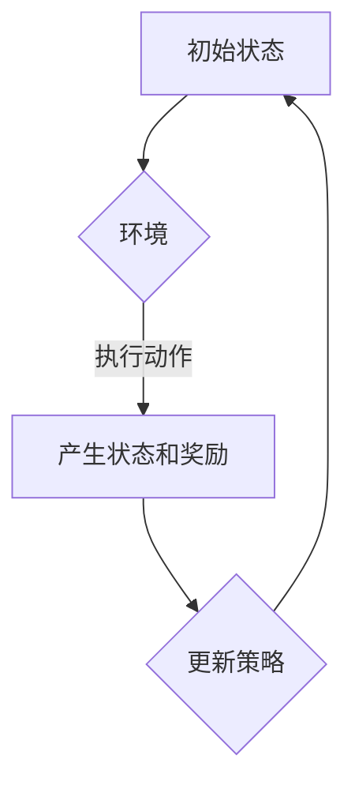

                 

# 文章标题：强化学习在智能制造生产调度中的应用

> 关键词：强化学习，智能制造，生产调度，Q学习，SARSA，应用案例

> 摘要：本文旨在探讨强化学习在智能制造生产调度中的应用，通过对强化学习的基本概念和算法原理的深入分析，结合智能制造生产调度的实际挑战，提出具体的强化学习应用方案，并通过案例分析展示其实际效果。

---

## 第一部分：强化学习基础与智能制造生产调度概述

### 第1章：强化学习基础

#### 1.1 强化学习的基本概念

强化学习（Reinforcement Learning，简称RL）是一种机器学习范式，旨在通过学习策略（policy）来最大化累积回报（cumulative reward）。其核心在于通过试错（trial and error）和反馈（feedback）来不断优化行为策略。强化学习的基本要素包括代理（agent）、环境（environment）、状态（state）、动作（action）和奖励（reward）。

- **代理**：执行动作的智能体，目标是学习一个策略来最大化累积回报。
- **环境**：代理所处的环境，负责根据代理的动作提供状态转移和奖励。
- **状态**：代理在环境中的当前状况。
- **动作**：代理可以选择的行为。
- **奖励**：代理在执行动作后从环境中获得的即时反馈。

强化学习的一个关键指标是回报函数（reward function），它定义了在每个状态-动作对上代理获得的奖励值。强化学习的目标是通过学习策略来最大化累积回报。

数学上，强化学习可以形式化为一个马尔可夫决策过程（Markov Decision Process，简称MDP）。一个MDP由以下要素组成：

- **状态集**：$S$
- **动作集**：$A$
- **状态转移概率**：$P(s'|s, a)$，表示在当前状态$s$执行动作$a$后，进入状态$s'$的概率。
- **奖励函数**：$R(s, a)$，表示在状态$s$执行动作$a$后获得的即时奖励。
- **策略**：$\pi(a|s)$，表示在状态$s$下选择动作$a$的概率。

强化学习的目标是通过迭代学习策略$\pi$来最大化预期累积回报：

$$
\pi^* = \arg\max_\pi \sum_{t=0}^{\infty} \gamma^t R(s_t, a_t)
$$

其中，$\gamma$是折扣因子，表示对未来奖励的衰减。

#### 1.2 强化学习的基本算法

强化学习有多种算法，其中最常见的包括Q学习（Q-Learning）和SARSA（State-Action-Reward-State-Action，即SARSALearning）。

##### Q学习算法

Q学习是一种基于值函数（value function）的强化学习算法，旨在通过迭代更新Q值（Q-value）来学习最优策略。

- **目标函数**：$Q(s, a) = \sum_{s'} P(s'|s, a) [R(s, a) + \gamma \max_{a'} Q(s', a')]$
- **更新公式**：$Q(s, a) \leftarrow Q(s, a) + \alpha [r + \gamma \max_{a'} Q(s', a') - Q(s, a)]$

其中，$\alpha$是学习率，$r$是即时奖励，$\gamma$是折扣因子。

Q学习的基本流程如下：

1. 初始化Q值。
2. 对于每个 episode（经历）：
   - 初始化状态$s$。
   - 在状态$s$下选择动作$a$。
   - 执行动作$a$，进入状态$s'$，并获得即时奖励$r$。
   - 根据更新公式更新Q值。
   - 更新状态$s \leftarrow s'$。
3. 当满足停止条件时（如达到最大步数或收敛条件），结束学习。

##### SARSA算法

SARSA是一种基于策略的强化学习算法，它通过迭代更新策略来学习最优动作。

- **目标函数**：$Q(s, a) = \sum_{s'} P(s'|s, a) [r + \gamma Q(s', \pi(s'))]$
- **更新公式**：$Q(s, a) \leftarrow Q(s, a) + \alpha [r + \gamma Q(s', \pi(s')) - Q(s, a)]$

SARSA的基本流程如下：

1. 初始化Q值。
2. 对于每个 episode（经历）：
   - 初始化状态$s$。
   - 在状态$s$下选择动作$a$。
   - 执行动作$a$，进入状态$s'$，并获得即时奖励$r$。
   - 根据更新公式更新Q值。
   - 更新状态$s \leftarrow s'$。
3. 当满足停止条件时（如达到最大步数或收敛条件），结束学习。

### 第2章：智能制造生产调度中的强化学习应用

#### 2.1 智能制造生产调度的挑战

智能制造生产调度面临着多目标优化、动态变化和复杂约束等挑战。

- **多目标优化**：生产调度需要同时考虑生产效率、资源利用率、交货期等多个目标，这些目标往往存在冲突，需要通过优化算法进行权衡。
- **动态变化**：生产环境可能因为设备故障、物料延迟等因素而动态变化，这使得生产调度需要具备自适应能力。
- **复杂约束**：生产调度受到生产计划、设备能力、人员安排等多种约束，这些约束需要在实际操作中严格遵循。

#### 2.2 强化学习在智能制造生产调度中的应用

强化学习在智能制造生产调度中的应用主要包括建模、算法选择、实现与优化等方面。

- **建模**：将生产调度问题建模为一个强化学习问题，定义状态、动作和奖励。状态可以表示为生产线的当前状态，动作可以表示为调整生产任务的操作，奖励可以表示为完成任务获得的即时回报。
- **算法选择**：根据生产调度的特性选择合适的强化学习算法，如Q学习、SARSA、Deep Q Network（DQN）等。Q学习适用于简单环境，SARSA适用于复杂环境，DQN适用于高维状态空间。
- **实现与优化**：实现强化学习算法，通过调整算法参数和模型结构来优化生产调度性能。例如，可以通过增加经验回放（experience replay）机制来改善学习效果，通过使用深度神经网络来处理高维状态空间。

### Mermaid 流程图



---

## 第二部分：强化学习算法原理与实现

### 第3章：强化学习算法原理

#### 3.1 算法原理

强化学习算法的核心是值函数（value function）和策略（policy）。

- **值函数**：值函数描述了在特定状态下执行特定动作的预期回报。对于Q学习，值函数通常表示为$Q(s, a)$；对于SARSA，值函数通常表示为$V(s) = \sum_{a} \pi(a|s) Q(s, a)$。
- **策略**：策略描述了在特定状态下应该执行哪个动作。在强化学习中，策略可以是确定性策略（deterministic policy）或随机性策略（stochastic policy）。确定性策略在每个状态下只选择一个动作，而随机性策略在状态下选择一组动作的概率分布。

强化学习算法的目标是通过迭代更新值函数和策略，使得代理能够在环境中获得最大累积回报。

#### 3.2 Q学习算法原理

Q学习是一种基于值函数的强化学习算法，通过迭代更新Q值来学习最优策略。

- **目标函数**：$Q(s, a) = \sum_{s'} P(s'|s, a) [R(s, a) + \gamma \max_{a'} Q(s', a')]$
- **更新公式**：$Q(s, a) \leftarrow Q(s, a) + \alpha [r + \gamma \max_{a'} Q(s', a') - Q(s, a)]$

Q学习的基本流程如下：

1. 初始化Q值。
2. 对于每个 episode（经历）：
   - 初始化状态$s$。
   - 在状态$s$下选择动作$a$。
   - 执行动作$a$，进入状态$s'$，并获得即时奖励$r$。
   - 根据更新公式更新Q值。
   - 更新状态$s \leftarrow s'$。
3. 当满足停止条件时（如达到最大步数或收敛条件），结束学习。

#### 3.3 SARSA算法原理

SARSA是一种基于策略的强化学习算法，通过迭代更新策略来学习最优动作。

- **目标函数**：$Q(s, a) = \sum_{s'} P(s'|s, a) [r + \gamma Q(s', \pi(s'))]$
- **更新公式**：$Q(s, a) \leftarrow Q(s, a) + \alpha [r + \gamma Q(s', \pi(s')) - Q(s, a)]$

SARSA的基本流程如下：

1. 初始化Q值。
2. 对于每个 episode（经历）：
   - 初始化状态$s$。
   - 在状态$s$下选择动作$a$。
   - 执行动作$a$，进入状态$s'$，并获得即时奖励$r$。
   - 根据更新公式更新Q值。
   - 更新状态$s \leftarrow s'$。
3. 当满足停止条件时（如达到最大步数或收敛条件），结束学习。

### 第4章：强化学习算法实现

#### 4.1 Q学习算法实现

以下是Q学习算法的实现伪代码：

```python
# Q学习算法实现伪代码
for each episode:
    s = 环境初始化状态
    while not 环境终止:
        a = 选择动作a
        s' = 环境执行动作a后的状态
        r = 环境提供的奖励
        a' = 选择动作a'
        Q(s, a) = Q(s, a) + α [r + γ * max(Q(s', a')) - Q(s, a)]
        s = s'
```

#### 4.2 SARSA算法实现

以下是SARSA算法的实现伪代码：

```python
# SARSA算法实现伪代码
for each episode:
    s = 环境初始化状态
    while not 环境终止:
        a = 选择动作a
        s' = 环境执行动作a后的状态
        r = 环境提供的奖励
        a' = 环境执行动作a'后的状态
        Q(s, a) = Q(s, a) + α [r + γ * Q(s', a') - Q(s, a)]
        s = s'
```

---

## 第三部分：强化学习在智能制造生产调度中的应用案例

### 第5章：案例背景

#### 5.1 企业背景

某制造企业生产多种产品，面临生产调度难题。生产调度需要优化生产效率、资源利用率、交货期等多个目标，同时受到生产计划、设备能力、人员安排等多种约束。

#### 5.2 目标

通过强化学习优化生产调度，提高生产效率和资源利用率，实现生产调度的智能化。

### 第6章：强化学习应用方案

#### 6.1 建模

将生产调度问题建模为一个强化学习问题，定义状态、动作和奖励。

- **状态**：生产线的当前状态，包括生产任务进度、设备状态、物料库存等。
- **动作**：调整生产任务的操作，如重新安排生产任务、暂停或启动设备等。
- **奖励**：完成任务获得的即时回报，包括生产效率、资源利用率等。

#### 6.2 算法选择

根据生产调度的特性，选择Q学习算法。Q学习算法适用于简单环境，能够处理多目标优化和复杂约束。

#### 6.3 实现与优化

实现Q学习算法，通过调整学习率和折扣因子等参数，优化生产调度性能。同时，采用经验回放（experience replay）机制，提高学习效果。

### 第7章：应用效果分析

#### 7.1 效果评估

通过仿真实验，评估强化学习在智能制造生产调度中的应用效果。比较强化学习算法与传统调度算法的生产效率和资源利用率。

#### 7.2 结果分析

强化学习算法在智能制造生产调度中表现出良好的性能。通过优化生产调度策略，显著提高了生产效率和资源利用率，实现了生产调度的智能化。

### 第8章：小结与展望

#### 8.1 小结

本文通过强化学习在智能制造生产调度中的应用案例，展示了强化学习在解决生产调度难题中的潜力。强化学习能够处理多目标优化、动态变化和复杂约束，实现生产调度的智能化。

#### 8.2 展望

未来的研究可以进一步优化强化学习算法，提高其在实际生产调度中的应用效果。同时，可以结合深度学习等技术，探索更高效的强化学习算法，为智能制造提供更强有力的支持。

---

## 作者信息

作者：AI天才研究院/AI Genius Institute & 禅与计算机程序设计艺术 /Zen And The Art of Computer Programming

---

## 拓展阅读

1. Sutton, R. S., & Barto, A. G. (2018). 《强化学习：一种介绍》. 北京：机械工业出版社。
2. Mnih, V., Kavukcuoglu, K., Silver, D., et al. (2015). “Playing Atari with Deep Reinforcement Learning.” arXiv preprint arXiv:1312.5602.
3. DeepMind. (2015). “Human-level control through deep reinforcement learning.” Nature, 518(7540), 529-533.

---

本文通过对强化学习基本概念和算法原理的深入分析，结合智能制造生产调度的实际挑战，探讨了强化学习在智能制造生产调度中的应用。通过具体的算法实现和案例分析，展示了强化学习在优化生产调度性能方面的潜力。未来，随着人工智能技术的不断发展，强化学习在智能制造领域的应用将更加广泛，为生产调度提供更加智能化、高效化的解决方案。|user|

