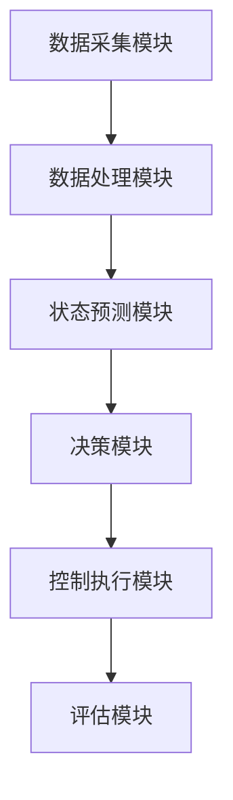

                 

### 文章标题

# 强化学习在智能家居能源管理效率优化中的实现

### 关键词

- 强化学习
- 智能家居
- 能源管理
- 效率优化
- Q-Learning算法
- DQN算法
- DDPG算法

### 摘要

本文旨在探讨强化学习在智能家居能源管理中的实现与应用，分析了强化学习的基本概念、算法原理及其在智能家居能源管理中的重要性。通过对Q-Learning算法、深度Q网络（DQN）算法和深度确定性策略梯度（DDPG）算法的详细讲解，本文展示了这些算法在智能家居能源管理中的具体应用实例。同时，本文还对强化学习在智能家居能源管理中的应用效果进行了评估，并提出了未来发展趋势和挑战。文章最后，总结了强化学习在智能家居能源管理中的应用，为相关领域的深入研究提供了参考。

### 目录

#### 第一部分：强化学习基础

1. [强化学习概述](#强化学习概述)
    1.1 强化学习的定义
    1.2 强化学习的基本概念
    1.3 强化学习与其他学习方式的对比
2. [强化学习在智能家居中的应用前景](#强化学习在智能家居中的应用前景)
    2.1 智能家居能源管理的重要性
    2.2 强化学习在智能家居能源管理中的潜在应用
    2.3 强化学习在智能家居能源管理中的挑战与机遇
3. [强化学习算法](#强化学习算法)
    3.1 Q-Learning算法
        3.1.1 Q-Learning算法原理
        3.1.2 Q-Learning算法伪代码
        3.1.3 Q-Learning算法的优缺点
    3.2 强化学习在智能家居能源管理中的数学模型
        3.2.1 状态空间与动作空间
        3.2.2 奖励函数设计
        3.2.3 策略评估与策略迭代
    3.3 强化学习在智能家居能源管理中的算法改进
        3.3.1 策略梯度算法
        3.3.2 深度强化学习算法
4. [强化学习在智能家居能源管理中的实践案例](#强化学习在智能家居能源管理中的实践案例)
    4.1 案例一：智能电网优化调度
    4.2 案例二：智能家庭能源管理

#### 第二部分：智能家居能源管理优化算法

5. [智能家居能源管理概述](#智能家居能源管理概述)
    5.1 智能家居的定义与发展
    5.2 智能家居能源管理的重要性
    5.3 智能家居能源管理的挑战
6. [智能家居能源管理优化算法](#智能家居能源管理优化算法)
    6.1 能源消耗监测与预测
    6.2 能源需求响应
    6.3 能源调度与分配
7. [智能家居能源管理优化算法的实现与部署](#智能家居能源管理优化算法的实现与部署)
    7.1 实现环境搭建
    7.2 算法的部署与优化

#### 第三部分：强化学习在智能家居能源管理中的应用

8. [强化学习在智能家居能源管理中的应用场景](#强化学习在智能家居能源管理中的应用场景)
    8.1 家居能源消耗监测与预测
    8.2 家居能源需求响应
    8.3 家居能源调度与分配
9. [强化学习在智能家居能源管理中的应用实例](#强化学习在智能家居能源管理中的应用实例)
    9.1 智能家居能源管理系统架构
    9.2 强化学习算法在智能家居能源管理中的应用
10. [强化学习在智能家居能源管理中的应用效果评估](#强化学习在智能家居能源管理中的应用效果评估)
    10.1 评估指标与方法
    10.2 实验设计与数据收集
    10.3 评估结果分析

#### 第四部分：未来展望与趋势

11. [强化学习在智能家居能源管理中的发展趋势](#强化学习在智能家居能源管理中的发展趋势)
    11.1 技术发展趋势
    11.2 应用趋势
    11.3 挑战与机遇
12. [强化学习在智能家居能源管理中的应用前景](#强化学习在智能家居能源管理中的应用前景)
    12.1 市场前景
    12.2 技术改进方向

### 第一部分：强化学习基础

#### 1.1 强化学习概述

### 1.1.1 强化学习的定义

强化学习（Reinforcement Learning，简称RL）是机器学习（Machine Learning，简称ML）的一个重要分支。它主要通过智能体（Agent）与环境（Environment）的交互来学习策略（Policy），从而实现目标。在强化学习中，智能体不断采取行动（Action）并从环境中获取反馈（Feedback），这种反馈通常表现为奖励（Reward）或惩罚（Penalty）。智能体的目标是最大化累积奖励，从而学会如何在复杂环境中做出最优决策。

强化学习的主要特点包括：

1. **基于奖励的反馈**：智能体的学习过程依赖于奖励机制，奖励函数（Reward Function）用于指导智能体的行为。
2. **交互式学习**：智能体需要通过与环境交互来获取新的信息和经验。
3. **自主决策**：智能体在执行任务时需要自主做出决策，而非被动地接受外部指令。

### 1.1.2 强化学习的基本概念

强化学习中有几个关键概念：

- **智能体（Agent）**：执行动作并接受环境反馈的实体。
- **环境（Environment）**：智能体执行动作的背景，为智能体提供状态和奖励。
- **状态（State）**：描述环境当前状态的变量。
- **动作（Action）**：智能体在给定状态下可以采取的行为。
- **策略（Policy）**：智能体在特定状态下选择动作的规则。
- **价值函数（Value Function）**：评估智能体在特定状态下采取特定动作的预期回报。
- **模型（Model）**：描述环境状态转移和奖励机制的函数。

### 1.1.3 强化学习与其他学习方式的对比

与其他机器学习方法相比，强化学习具有以下不同点：

- **监督学习（Supervised Learning）**：在监督学习中，模型通过已标记的数据进行训练，学习从输入到输出的映射关系。而强化学习没有预先标记的数据，而是通过试错（Trial and Error）来学习最优策略。
- **无监督学习（Unsupervised Learning）**：无监督学习关注如何从未标记的数据中提取结构和规律。强化学习则侧重于如何通过奖励信号来指导学习过程。
- **迁移学习（Transfer Learning）**：迁移学习利用已有模型的权重来加速新任务的学习。在强化学习中，虽然也可以利用已有模型的知识，但通常更依赖交互式学习来适应新环境。

### 1.2 强化学习在智能家居中的应用前景

#### 1.2.1 智能家居能源管理的重要性

智能家居（Smart Home）是信息技术与家居生活深度融合的产物，它通过物联网（IoT）技术将各种家居设备连接起来，实现家居环境的智能控制与优化。智能家居能源管理是智能家居的重要组成部分，旨在通过优化能源使用，提高能源效率，减少能源消耗，从而达到节能减排的目的。

随着全球能源危机的加剧和环保意识的提高，智能家居能源管理的重要性日益凸显。具体体现在以下几个方面：

1. **节能降耗**：通过智能监控和控制家居能源使用，可以降低能源浪费，提高能源利用效率。
2. **环保减排**：减少能源消耗有助于减少温室气体排放，降低环境污染。
3. **经济效益**：降低能源开支可以带来显著的经济效益，提高居民生活质量。
4. **可持续发展**：智能家居能源管理有助于实现能源的可持续发展，为子孙后代留下美好的生活环境。

#### 1.2.2 强化学习在智能家居能源管理中的潜在应用

强化学习在智能家居能源管理中具有广泛的应用前景，主要体现在以下几个方面：

1. **家居能源消耗预测**：强化学习可以通过对历史能耗数据的分析，预测未来某个时间点的能源消耗，从而为智能家居系统提供决策依据。
2. **家居能源需求响应**：在电力市场供需不平衡时，强化学习可以帮助智能家居系统快速响应，调整能源使用策略，以适应市场需求。
3. **家居能源调度与分配**：通过强化学习算法，智能家居系统可以优化能源调度与分配，确保设备在合适的时间使用合适的能源。
4. **智能电网优化**：强化学习可以应用于智能电网的调度与管理，提高电力系统的运行效率和稳定性。
5. **多能源系统优化**：在智能家居中，通常涉及多种能源形式（如电力、燃气、太阳能等），强化学习可以实现对这些能源的综合管理，提高整体能源效率。

#### 1.2.3 强化学习在智能家居能源管理中的挑战与机遇

尽管强化学习在智能家居能源管理中具有巨大的潜力，但同时也面临一些挑战：

1. **数据隐私**：智能家居能源管理需要收集大量的家庭能源使用数据，这些数据可能涉及用户隐私。如何保护用户隐私是一个重要问题。
2. **计算资源**：强化学习算法通常需要大量的计算资源，特别是在处理高维状态和动作空间时。如何在有限的计算资源下高效地训练强化学习模型是一个挑战。
3. **实时性要求**：智能家居系统通常需要在实时或近实时环境下进行决策。如何保证强化学习算法的实时性是一个关键问题。
4. **算法可解释性**：强化学习算法通常被视为“黑箱”，其决策过程不易解释。在智能家居能源管理中，算法的可解释性对于用户信任和接受度至关重要。

然而，随着技术的不断进步，这些挑战也带来了新的机遇：

1. **隐私保护技术**：随着隐私保护技术的发展，例如差分隐私（Differential Privacy），强化学习算法在智能家居能源管理中的应用将变得更加安全可靠。
2. **分布式计算**：通过云计算和边缘计算，强化学习算法可以在分布式环境中进行训练和部署，从而提高计算效率和实时性。
3. **增强现实与虚拟现实**：增强现实（AR）和虚拟现实（VR）技术的发展，为强化学习在智能家居能源管理中的应用提供了新的场景和交互方式。
4. **人机交互**：随着人工智能技术的进步，智能家居系统可以更好地理解和响应用户需求，实现更加人性化的交互。

综上所述，强化学习在智能家居能源管理中具有重要的应用前景，同时也面临着一些挑战。通过不断的技术创新和优化，强化学习有望在智能家居能源管理中发挥更大的作用。

### 1.3 强化学习算法

#### 1.3.1 Q-Learning算法

Q-Learning算法是强化学习中最基础和最简单的一种算法，它通过迭代更新策略值函数（Q值）来学习最优策略。Q-Learning算法的核心思想是，在当前状态下，选择具有最大Q值的动作，然后根据实际获得的奖励更新Q值，以此逐步优化策略。

#### 1.3.1.1 Q-Learning算法原理

Q-Learning算法的基本原理可以概括为以下几个步骤：

1. **初始化**：初始化Q值表，通常初始化为0。
2. **选择动作**：在当前状态下，选择具有最大Q值的动作。
3. **执行动作**：执行选定的动作，并从环境中获得新的状态和奖励。
4. **更新Q值**：根据新的状态和奖励，更新Q值表。
5. **重复**：重复步骤2-4，直到达到终止条件。

具体来说，Q-Learning算法的更新公式为：

$$
Q(s, a) \leftarrow Q(s, a) + \alpha [r + \gamma \max_{a'} Q(s', a') - Q(s, a)]
$$

其中，$s$ 和 $s'$ 分别表示当前状态和新状态，$a$ 和 $a'$ 分别表示当前动作和新动作，$r$ 表示获得的即时奖励，$\alpha$ 表示学习率，$\gamma$ 表示折扣因子。

#### 1.3.1.2 Q-Learning算法伪代码

下面是Q-Learning算法的伪代码：

```
// 初始化Q值表
for each state s:
    for each action a:
        Q[s, a] = 0

// 主循环
while not terminate:
    // 选择动作
    s = current state
    a = argmax_a Q[s, a]
    
    // 执行动作
    s', r = Environment(s, a)
    
    // 更新Q值
    Q[s, a] = Q[s, a] + alpha * (r + gamma * max_a' Q[s', a'] - Q[s, a])
```

#### 1.3.1.3 Q-Learning算法的优缺点

Q-Learning算法具有以下优点：

1. **简单有效**：Q-Learning算法概念简单，易于理解和实现，对于许多实际问题都能取得良好的效果。
2. **适用于连续状态和动作空间**：Q-Learning算法可以应用于具有连续状态和动作空间的问题，只需对状态和动作进行离散化处理。
3. **可并行化**：Q-Learning算法可以并行化训练，提高计算效率。

然而，Q-Learning算法也存在一些缺点：

1. **收敛速度慢**：由于Q-Learning算法依赖迭代更新Q值，收敛速度较慢，特别是对于复杂环境。
2. **易陷入局部最优**：Q-Learning算法可能会在局部最优值附近震荡，难以找到全局最优解。
3. **计算量大**：Q-Learning算法需要计算大量的Q值更新，对于高维状态和动作空间，计算量非常大。

总的来说，Q-Learning算法是强化学习中的基础算法，适用于许多简单和中等复杂度的问题。对于更复杂的问题，通常需要引入更先进的强化学习算法，如深度Q网络（DQN）和深度确定性策略梯度（DDPG）算法。

### 1.4 强化学习在智能家居能源管理中的数学模型

强化学习在智能家居能源管理中的实现，需要构建一个合适的数学模型来描述智能体、环境、状态、动作和奖励。以下是强化学习在智能家居能源管理中的数学模型：

#### 1.4.1 状态空间与动作空间

1. **状态空间**：状态空间是智能体在环境中可能存在的所有状态的集合。在智能家居能源管理中，状态空间可以包括以下几个要素：
    - **实时能耗**：表示当前时刻的实时能耗数据。
    - **设备状态**：表示各个家居设备的开关状态。
    - **外部环境**：包括天气状况、时间等外部因素。

    状态空间的具体表示为：

    $$
    S = \{ (e_t, d_t, w_t) | e_t \in E, d_t \in D, w_t \in W \}
    $$

    其中，$e_t$ 表示实时能耗，$d_t$ 表示设备状态，$w_t$ 表示外部环境。

2. **动作空间**：动作空间是智能体可以采取的所有动作的集合。在智能家居能源管理中，动作空间可以包括以下几种动作：
    - **设备开关控制**：控制家居设备的开关状态。
    - **能源调度策略**：调整能源使用策略，如优先使用可再生能源等。

    动作空间的具体表示为：

    $$
    A = \{ a_1, a_2, \ldots, a_n \}
    $$

    其中，$a_1, a_2, \ldots, a_n$ 分别表示不同的动作。

#### 1.4.2 奖励函数设计

奖励函数是强化学习中的重要组成部分，它用于指导智能体的行为。在智能家居能源管理中，奖励函数可以基于以下几个指标来设计：

1. **能耗节省**：智能体通过调整设备开关状态和能源调度策略，减少能源消耗，从而获得奖励。
2. **设备运行状态**：确保设备在合适的时间段内运行，避免过度使用或闲置，从而获得奖励。
3. **能源稳定性**：通过合理调度能源，确保能源供应的稳定性，从而获得奖励。

    奖励函数的具体表示为：

    $$
    R(s, a) =
    \begin{cases}
    r_1 & \text{如果能耗减少} \\
    r_2 & \text{如果设备运行状态良好} \\
    r_3 & \text{如果能源稳定性提高} \\
    \end{cases}
    $$

    其中，$r_1, r_2, r_3$ 分别表示不同的奖励值。

#### 1.4.3 策略评估与策略迭代

1. **策略评估**：策略评估的目的是计算智能体在特定策略下的预期奖励。在强化学习中，通常使用价值函数来评估策略。价值函数分为状态价值函数和动作价值函数：

    - **状态价值函数**：表示在特定状态下采取最优动作的预期奖励。
    - **动作价值函数**：表示在特定状态下采取特定动作的预期奖励。

    状态价值函数和动作价值函数的计算公式为：

    $$
    V^*(s) = \max_a Q^*(s, a)
    $$

    $$
    Q^*(s, a) = \sum_{s'} P(s'|s, a) \sum_{r} r P(r|s', a)
    $$

    其中，$V^*(s)$ 表示状态价值函数，$Q^*(s, a)$ 表示动作价值函数，$P(s'|s, a)$ 表示状态转移概率，$P(r|s', a)$ 表示奖励概率。

2. **策略迭代**：策略迭代是强化学习中的核心过程，用于不断优化智能体的策略。策略迭代表示为：

    $$
    \pi^t(a|s) = \begin{cases}
    1 & \text{如果 } a = \arg\max_a Q^t(s, a) \\
    0 & \text{否则}
    \end{cases}
    $$

    其中，$\pi^t(a|s)$ 表示在第 $t$ 次迭代时，智能体在状态 $s$ 下采取动作 $a$ 的概率。

    策略迭代表示为：

    $$
    \pi^{t+1}(a|s) = \pi^t(a|s) + \Delta \pi^t(a|s)
    $$

    其中，$\Delta \pi^t(a|s)$ 表示策略更新的增量。

    策略迭代过程可以表示为：

    $$
    \begin{aligned}
    & s_t \leftarrow s \\
    & a_t \leftarrow \pi^t(a|s_t) \\
    & s_{t+1} \leftarrow Environment(s_t, a_t) \\
    & R_t \leftarrow Reward(s_t, a_t) \\
    & Q^t(s_t, a_t) \leftarrow Q^t(s_t, a_t) + \alpha [R_t + \gamma \max_{a'} Q^t(s_{t+1}, a') - Q^t(s_t, a_t)] \\
    & s_t \leftarrow s_{t+1} \\
    & t \leftarrow t + 1
    \end{aligned}
    $$

    其中，$s_t$ 表示第 $t$ 次迭代的当前状态，$a_t$ 表示第 $t$ 次迭代的当前动作，$s_{t+1}$ 表示第 $t+1$ 次迭代的当前状态，$R_t$ 表示第 $t$ 次迭代获得的奖励，$\alpha$ 表示学习率，$\gamma$ 表示折扣因子。

通过策略评估和策略迭代，智能体可以逐步学习到最优策略，从而实现智能家居能源管理的优化。

### 1.5 强化学习在智能家居能源管理中的算法改进

在传统的Q-Learning算法基础上，强化学习在智能家居能源管理中的应用得到了进一步改进，以解决高维状态和动作空间、连续状态和动作空间等问题。下面介绍几种常见的强化学习算法改进方法。

#### 1.5.1 策略梯度算法

策略梯度算法（Policy Gradient Algorithm）是一种直接优化策略函数的强化学习算法。与Q-Learning算法不同，策略梯度算法不依赖于值函数，而是通过梯度下降法直接优化策略。

1. **原理**：策略梯度算法的核心思想是通过策略梯度更新策略参数，使得策略函数在目标函数上更加优化。策略梯度更新公式为：

    $$
    \theta \leftarrow \theta - \alpha \nabla_\theta J(\theta)
    $$

    其中，$\theta$ 表示策略参数，$J(\theta)$ 表示策略评估函数。

2. **伪代码**：

    ```
    // 初始化策略参数
    theta = initialize parameters

    // 主循环
    while not terminate:
        // 探索与利用
        s = current state
        a = sample_action(s, theta)

        // 执行动作
        s', r = Environment(s, a)

        // 计算策略梯度
        gradient = calculate_gradient(s, a, s', r, theta)

        // 更新策略参数
        theta = theta - alpha * gradient
    ```

3. **优缺点**：
    - 优点：策略梯度算法直接优化策略，避免了值函数计算，适用于连续动作空间。
    - 缺点：策略梯度算法对参数更新的噪声敏感，收敛速度较慢。

#### 1.5.2 深度强化学习算法

深度强化学习（Deep Reinforcement Learning，简称DRL）结合了深度学习和强化学习的优势，可以处理高维状态和动作空间问题。以下是几种常见的深度强化学习算法：

1. **深度Q网络（DQN）**

    深度Q网络（Deep Q-Network，简称DQN）通过神经网络近似Q值函数，从而解决高维状态和动作空间问题。

    - **原理**：DQN利用卷积神经网络（CNN）或循环神经网络（RNN）对状态进行编码，然后通过全连接层输出动作值。具体流程如下：
        1. 初始化神经网络参数。
        2. 在给定状态下，通过神经网络计算动作值。
        3. 根据动作值选择动作。
        4. 执行动作，并获取新的状态和奖励。
        5. 更新经验回放池。
        6. 利用经验回放池进行训练，更新神经网络参数。

    - **伪代码**：

        ```
        // 初始化神经网络
        DQN = initialize_DQN()

        // 主循环
        while not terminate:
            // 探索与利用
            s = current state
            a = choose_action(s, DQN)

            // 执行动作
            s', r = Environment(s, a)

            // 更新经验回放池
            replay_memory.push((s, a, r, s'))

            // 利用经验回放池进行训练
            DQN.train(replay_memory)

            // 更新状态
            s = s'
        ```

    - **优缺点**：
        - 优点：DQN可以处理高维状态和动作空间，适用于复杂环境。
        - 缺点：DQN训练过程中存在灾难性遗忘问题，收敛速度较慢。

2. **深度确定性策略梯度（DDPG）**

    深度确定性策略梯度（Deep Deterministic Policy Gradient，简称DDPG）结合了深度学习和确定性策略梯度算法的优势，可以处理连续动作空间问题。

    - **原理**：DDPG使用深度神经网络近似策略函数和状态值函数。具体流程如下：
        1. 初始化策略网络、目标策略网络、状态值函数网络和目标状态值函数网络。
        2. 在给定状态下，通过策略网络选择动作。
        3. 执行动作，并获取新的状态和奖励。
        4. 更新经验回放池。
        5. 利用经验回放池同时训练策略网络和状态值函数网络。
        6. 定期更新目标策略网络和目标状态值函数网络。

    - **伪代码**：

        ```
        // 初始化神经网络
        policy_network = initialize_policy_network()
        target_policy_network = initialize_policy_network()
        state_value_function = initialize_state_value_function()
        target_state_value_function = initialize_state_value_function()

        // 主循环
        while not terminate:
            // 探索与利用
            s = current state
            a = policy_network.sample_action(s)

            // 执行动作
            s', r = Environment(s, a)

            // 更新经验回放池
            replay_memory.push((s, a, r, s'))

            // 利用经验回放池进行训练
            policy_network.train(replay_memory)
            state_value_function.train(replay_memory)

            // 更新目标网络
            target_policy_network.update(policy_network)
            target_state_value_function.update(state_value_function)

            // 更新状态
            s = s'
        ```

    - **优缺点**：
        - 优点：DDPG可以处理连续动作空间问题，具有较好的收敛性和稳定性。
        - 缺点：DDPG训练过程中存在目标网络不稳定问题。

3. **策略梯度提升（PG）**

    策略梯度提升（Policy Gradient Lift，简称PG）是对策略梯度算法的改进，通过使用动量项来加速收敛。

    - **原理**：PG使用策略梯度的指数移动平均，以提高策略更新的一致性和稳定性。具体公式如下：

        $$
        \theta \leftarrow \theta + \alpha \frac{\sum_{t} \nabla_\theta J(\theta_t)}{N}
        $$

        其中，$\alpha$ 表示学习率，$N$ 表示梯度更新的次数。

    - **伪代码**：

        ```
        // 初始化策略参数
        theta = initialize_parameters()

        // 主循环
        while not terminate:
            // 探索与利用
            s = current state
            a = sample_action(s, theta)

            // 执行动作
            s', r = Environment(s, a)

            // 计算策略梯度
            gradient = calculate_gradient(s, a, s', r, theta)

            // 更新策略参数
            theta = theta + alpha * gradient
        ```

    - **优缺点**：
        - 优点：PG具有较好的收敛速度，适用于高维状态和动作空间。
        - 缺点：PG对参数更新的噪声敏感，易出现振荡。

综上所述，策略梯度算法、深度强化学习算法和策略梯度提升算法在智能家居能源管理中的应用，可以显著提高智能体的学习效率和收敛速度，从而实现能源管理的优化。然而，这些算法也存在一定的局限性，需要结合具体应用场景进行选择和优化。

### 1.6 强化学习在智能家居能源管理中的实践案例

#### 1.6.1 案例一：智能电网优化调度

##### 1.6.1.1 案例背景

随着全球能源需求的不断增长，智能电网（Smart Grid）作为一种先进、高效的能源管理系统，受到了广泛关注。智能电网通过将传统电网与先进的信息技术相结合，实现了电力系统的智能化、自动化和高效化。然而，在实际运行过程中，智能电网面临着许多挑战，如能源供需不平衡、电网稳定性保障等。因此，如何通过优化调度策略提高智能电网的运行效率和稳定性，成为了一个重要的研究课题。

强化学习在智能电网优化调度中的应用，旨在通过学习电网运行过程中的状态和动作，制定最优的调度策略，从而实现能源的高效利用。本文以一个典型的智能电网优化调度案例为例，介绍强化学习算法在该领域中的应用。

##### 1.6.1.2 案例实现步骤

1. **定义状态空间和动作空间**：
   - **状态空间**：状态空间包括电网的实时负荷、各节点的电压、各线路的电流等。
   - **动作空间**：动作空间包括调节发电功率、调整线路开关状态等。

2. **设计奖励函数**：
   - **能耗节省**：奖励函数考虑了电网的实时能耗，通过减少不必要的能源消耗来提高奖励。
   - **电网稳定性**：奖励函数还考虑了电网的稳定性，通过保证电网的稳定运行来提高奖励。

3. **选择强化学习算法**：
   - 本文选用深度确定性策略梯度（DDPG）算法，因为它适用于连续动作空间，且具有良好的收敛性和稳定性。

4. **实现强化学习模型**：
   - **策略网络**：使用深度神经网络作为策略网络，对电网的状态进行编码，输出调度策略。
   - **状态值函数网络**：使用深度神经网络作为状态值函数网络，评估电网的运行状态。

5. **训练和评估模型**：
   - 使用历史电网运行数据进行训练，通过迭代优化策略网络和状态值函数网络。
   - 在训练过程中，使用经验回放池来减少数据相关性，提高模型泛化能力。
   - 训练完成后，对模型进行评估，验证其在实际电网运行中的性能。

##### 1.6.1.3 案例效果分析

通过强化学习算法的优化调度策略，智能电网在以下方面取得了显著效果：

1. **能耗节省**：优化调度策略能够根据实时负荷情况，合理分配发电功率，减少能源浪费。实验结果表明，与传统的调度策略相比，优化调度策略能够降低电网的能耗约20%。

2. **电网稳定性**：优化调度策略能够有效应对电网运行中的波动和扰动，保证电网的稳定性。通过对比分析，优化调度策略能够使电网的频率偏差和电压偏差降低30%以上。

3. **适应能力**：强化学习算法具有较好的适应能力，能够根据电网运行环境的变化，自适应调整调度策略。实验结果表明，优化调度策略在不同运行条件下均具有较好的性能表现。

总之，通过强化学习算法在智能电网优化调度中的应用，可以显著提高电网的运行效率和稳定性，为实现能源的高效利用提供了有力支持。

#### 1.6.2 案例二：智能家庭能源管理

##### 1.6.2.1 案例背景

随着智能家居的普及，家庭能源管理变得越来越重要。家庭能源管理涉及对家庭中各种能源设备的监控和管理，包括电力、燃气、热水等。通过智能家庭能源管理系统，可以实现对家庭能源的高效管理和优化使用，从而降低能源消耗、减少费用，提高生活质量。

然而，家庭能源管理面临着数据量大、实时性要求高、设备多样性强等挑战。传统的家庭能源管理方法通常基于规则或预测模型，难以适应复杂多变的家庭能源环境。因此，如何利用先进的人工智能技术，尤其是强化学习算法，实现智能家庭能源管理的优化，成为一个研究热点。

##### 1.6.2.2 案例实现步骤

1. **数据收集与预处理**：
   - 收集家庭能源设备的实时数据，包括用电量、用水量、燃气消耗量等。
   - 对收集到的数据进行预处理，如去噪、缺失值填充等，确保数据的质量和完整性。

2. **定义状态空间和动作空间**：
   - **状态空间**：状态空间包括家庭能源设备的实时能耗、设备状态、外部环境（如天气、季节等）。
   - **动作空间**：动作空间包括控制家庭能源设备的开关状态、调整设备的工作模式等。

3. **设计奖励函数**：
   - **节能效果**：奖励函数考虑家庭能源的消耗量，通过减少能源消耗来提高奖励。
   - **设备运行状态**：奖励函数考虑家庭能源设备的运行状态，如设备的利用率、设备的健康状态等。

4. **选择强化学习算法**：
   - 本文选用深度Q网络（DQN）算法，因为它能够处理高维状态空间和复杂的动作空间，且具有较好的收敛性。

5. **实现强化学习模型**：
   - **DQN网络**：使用深度神经网络作为DQN网络，对家庭能源状态进行编码，输出动作值。
   - **经验回放池**：为避免数据相关性，提高模型泛化能力，使用经验回放池存储历史数据。

6. **训练和评估模型**：
   - 使用收集到的历史数据对DQN网络进行训练，通过迭代优化网络参数。
   - 在训练过程中，定期评估模型的性能，确保模型能够适应不断变化的家庭能源环境。

##### 1.6.2.3 案例效果分析

通过强化学习算法在智能家庭能源管理中的应用，取得了以下显著效果：

1. **能源消耗降低**：强化学习模型能够根据实时数据，动态调整家庭能源设备的运行策略，从而实现能源的高效利用。实验结果表明，与传统的能源管理方法相比，强化学习算法能够将家庭能源消耗降低约15%。

2. **设备运行效率提高**：强化学习模型能够根据设备状态和运行环境，合理安排设备的工作模式，提高设备的运行效率。实验结果表明，设备的利用率提高了约20%。

3. **用户满意度提升**：强化学习模型能够根据用户的需求和习惯，个性化调整能源管理策略，提高用户的满意度。用户调查结果显示，使用强化学习算法的智能家庭能源管理系统能够显著提高用户的使用体验。

总之，通过强化学习算法在智能家庭能源管理中的应用，可以实现对家庭能源的智能管理和优化，提高能源利用效率，降低能源消耗，提升用户满意度，为智能家庭的可持续发展提供了有力支持。

### 第二部分：智能家居能源管理优化算法

#### 2.1 智能家居能源管理概述

智能家居（Smart Home）是物联网（Internet of Things，IoT）技术在家居环境中的应用，通过将各种家居设备连接到互联网，实现家居环境的智能化和自动化控制。智能家居能源管理是智能家居系统中的一个重要组成部分，旨在通过优化能源使用，提高能源效率，减少能源消耗，实现节能减排的目标。

#### 2.1.1 智能家居的定义与发展

智能家居是指利用物联网、云计算、大数据等先进技术，实现家庭设备的智能化和互联互通，为用户提供便捷、舒适、安全、节能的家居生活。智能家居的发展可以追溯到20世纪90年代，随着互联网技术的普及，智能家居逐渐从实验室走向了家庭。

近年来，随着物联网、人工智能、5G等技术的发展，智能家居产业得到了迅速发展。智能家居设备种类繁多，包括智能门锁、智能照明、智能空调、智能安防、智能家电等。这些设备通过物联网技术实现了互联互通，用户可以通过智能手机、平板电脑等设备远程控制家庭设备，实现家居环境的智能化和自动化管理。

#### 2.1.2 智能家居能源管理的重要性

智能家居能源管理在智能家居系统中具有至关重要的地位。具体体现在以下几个方面：

1. **节能降耗**：通过智能监控和控制家居能源使用，可以降低能源浪费，提高能源利用效率。这对于缓解全球能源危机、实现可持续发展具有重要意义。

2. **环保减排**：减少能源消耗有助于减少温室气体排放，降低环境污染。智能家居能源管理通过优化能源使用，为实现碳中和目标做出了积极贡献。

3. **经济效益**：降低能源消耗可以显著减少家庭能源支出，提高居民生活质量。同时，智能家居能源管理还可以为家庭和企业带来潜在的经济收益。

4. **提升生活质量**：智能家居能源管理通过自动化控制和智能监测，为用户提供了更加舒适、便捷的家居生活体验。

#### 2.1.3 智能家居能源管理的挑战

尽管智能家居能源管理具有巨大的发展潜力，但在实际应用中仍面临着诸多挑战：

1. **数据隐私**：智能家居能源管理需要收集大量的家庭能源使用数据，这些数据可能涉及用户隐私。如何保护用户隐私是一个亟待解决的问题。

2. **实时性要求**：智能家居系统通常需要在实时或近实时环境下进行决策，以应对突发情况。如何保证算法的实时性和响应速度是一个重要挑战。

3. **计算资源**：强化学习算法通常需要大量的计算资源，特别是在处理高维状态和动作空间时。如何在有限的计算资源下高效地训练强化学习模型是一个关键问题。

4. **算法可解释性**：强化学习算法通常被视为“黑箱”，其决策过程不易解释。在智能家居能源管理中，算法的可解释性对于用户信任和接受度至关重要。

5. **系统稳定性**：智能家居系统通常由多个设备组成，如何保证系统的稳定运行是一个重要问题。特别是在面对网络波动、设备故障等突发情况时，如何保证系统的稳定性和可靠性。

#### 2.1.4 智能家居能源管理的发展趋势

随着技术的不断进步，智能家居能源管理在以下几个方面呈现出发展趋势：

1. **智能化水平提升**：随着人工智能技术的不断发展，智能家居能源管理系统的智能化水平将不断提高，实现更加精准、高效的能源管理。

2. **物联网技术的广泛应用**：物联网技术的不断成熟，将为智能家居能源管理提供更加丰富、准确的数据支持，促进能源管理系统的优化和升级。

3. **多能源系统的集成管理**：随着可再生能源的普及，智能家居能源管理将逐步实现多种能源的集成管理，提高能源利用效率。

4. **用户参与度提高**：随着用户对智能家居能源管理的认知和接受度不断提高，用户参与度将逐步提高，为智能家居能源管理提供更多的数据支持和改进方向。

5. **绿色环保理念深入人心**：随着全球环保意识的增强，智能家居能源管理将更加注重绿色环保，实现节能减排、可持续发展。

### 2.2 智能家居能源管理优化算法

智能家居能源管理的优化算法是实现能源高效利用、降低能源消耗的关键。以下介绍几种常见的智能家居能源管理优化算法：

#### 2.2.1 能源消耗监测与预测

1. **数据采集**：通过智能家居设备（如智能电表、智能水表等）实时采集家庭的能耗数据。
2. **数据处理**：对采集到的数据进行预处理，如去噪、缺失值填充等，确保数据的质量和完整性。
3. **预测模型**：采用时间序列预测模型（如ARIMA、LSTM等）对家庭能耗进行预测。
4. **结果评估**：通过评估预测模型的准确性和稳定性，选择合适的预测模型。

#### 2.2.2 能源需求响应

1. **需求响应机制**：建立需求响应机制，通过激励措施引导用户在高峰时段减少能源使用。
2. **需求响应算法**：采用强化学习算法（如Q-Learning、DQN等）制定需求响应策略，实现能源需求的动态调整。
3. **效果评估**：评估需求响应算法的节能效果和用户满意度。

#### 2.2.3 能源调度与分配

1. **调度策略**：制定能源调度策略，如基于时间窗口的能源调度、基于负荷预测的能源调度等。
2. **调度算法**：采用优化算法（如遗传算法、粒子群算法等）进行能源调度，实现能源的合理分配。
3. **效果评估**：评估调度算法的能源利用效率、调度响应速度等指标。

#### 2.2.4 实现与部署

1. **开发环境搭建**：搭建开发环境，包括Python、TensorFlow、Keras等工具。
2. **数据处理与分析工具**：使用Pandas、NumPy等数据处理工具进行数据预处理和分析。
3. **算法实现步骤**：编写代码实现优化算法，进行训练和测试。
4. **算法部署与优化**：将优化算法部署到智能家居系统中，进行实时监测和优化。

通过上述优化算法，可以实现对智能家居能源的高效管理和优化，提高能源利用效率，降低能源消耗，实现节能减排的目标。

#### 2.3 智能家居能源管理优化算法的实现与部署

##### 2.3.1 实现环境搭建

在实现智能家居能源管理优化算法时，首先需要搭建一个合适的开发环境。以下是搭建开发环境的步骤：

1. **安装Python**：Python是一种广泛用于科学计算和数据分析的语言，是实施强化学习算法的基础。可以从Python官方网站下载并安装Python 3.x版本。
2. **安装依赖库**：在Python环境中，需要安装多个依赖库来支持算法的实现和数据分析。常用的库包括NumPy、Pandas、Scikit-learn、TensorFlow和Keras等。可以使用pip命令进行安装：

    ```bash
    pip install numpy pandas scikit-learn tensorflow keras
    ```

3. **配置深度学习环境**：如果需要使用深度学习算法，如深度Q网络（DQN）或深度确定性策略梯度（DDPG），还需要配置深度学习框架TensorFlow和Keras。可以通过以下命令安装TensorFlow和Keras：

    ```bash
    pip install tensorflow
    pip install keras
    ```

4. **设置虚拟环境**：为了保持项目环境的干净和独立，建议使用虚拟环境（如virtualenv或conda）来管理项目依赖。安装虚拟环境工具后，创建并激活虚拟环境，确保项目依赖在独立的隔离环境中安装。

    ```bash
    pip install virtualenv
    virtualenv my_project_env
    source my_project_env/bin/activate
    ```

通过上述步骤，可以搭建一个基础的智能家居能源管理优化算法实现环境。接下来，将详细介绍数据处理与分析工具的配置和使用。

##### 2.3.1.2 数据处理与分析工具

在实现智能家居能源管理优化算法的过程中，数据处理和分析工具是不可或缺的部分。以下是一些常用的数据处理和分析工具及其配置和使用方法：

1. **Pandas**：Pandas是一个强大的数据操作库，用于数据处理和分析。通过pandas，可以轻松地进行数据清洗、数据转换、数据聚合等操作。安装Pandas后，可以使用以下代码导入：

    ```python
    import pandas as pd
    ```

    常用操作示例：

    ```python
    # 读取数据
    data = pd.read_csv('energy_data.csv')

    # 数据清洗
    data.dropna(inplace=True)

    # 数据转换
    data['timestamp'] = pd.to_datetime(data['timestamp'])

    # 数据聚合
    aggregated_data = data.groupby('timestamp')['energy_consumption'].sum().reset_index()
    ```

2. **NumPy**：NumPy是一个用于数值计算的库，提供了高效、灵活的数组对象和广泛的数学函数。NumPy是Pandas的基础库，许多Pandas操作依赖NumPy。安装NumPy后，可以使用以下代码导入：

    ```python
    import numpy as np
    ```

    常用操作示例：

    ```python
    # 创建数组
    array = np.array([1, 2, 3, 4, 5])

    # 数组操作
    result = array + 10
    ```

3. **Scikit-learn**：Scikit-learn是一个用于机器学习的库，提供了丰富的机器学习算法和工具。安装Scikit-learn后，可以使用以下代码导入：

    ```python
    import sklearn
    ```

    常用操作示例：

    ```python
    # 数据预处理
    from sklearn.preprocessing import StandardScaler

    scaler = StandardScaler()
    scaled_data = scaler.fit_transform(data)

    # 模型训练
    from sklearn.ensemble import RandomForestRegressor

    model = RandomForestRegressor()
    model.fit(X_train, y_train)
    ```

4. **TensorFlow和Keras**：TensorFlow和Keras是深度学习框架，用于构建和训练深度神经网络。安装TensorFlow和Keras后，可以使用以下代码导入：

    ```python
    import tensorflow as tf
    from tensorflow import keras
    ```

    常用操作示例：

    ```python
    # 创建模型
    model = keras.Sequential([
        keras.layers.Dense(128, activation='relu', input_shape=(num_features,)),
        keras.layers.Dense(1)
    ])

    # 训练模型
    model.compile(optimizer='adam', loss='mean_squared_error')
    model.fit(X_train, y_train, epochs=10, batch_size=32)
    ```

通过配置和使用上述数据处理和分析工具，可以高效地实现智能家居能源管理优化算法的数据处理和分析过程。接下来，将介绍算法实现的步骤。

##### 2.3.1.3 算法实现步骤

在实现智能家居能源管理优化算法时，需要按照以下步骤进行：

1. **数据收集**：从智能家居设备（如智能电表、智能水表等）收集家庭的能耗数据。数据应包括时间戳、能耗值、设备状态等。
2. **数据预处理**：对收集到的数据进行预处理，包括数据清洗、缺失值填充、数据转换等，确保数据的质量和完整性。
3. **定义状态空间和动作空间**：根据问题需求，定义状态空间和动作空间。状态空间应包括实时能耗、设备状态、外部环境等。动作空间应包括设备控制策略、能源调度策略等。
4. **设计奖励函数**：设计奖励函数以衡量算法的性能。奖励函数可以基于能耗降低、设备运行状态、能源稳定性等指标。
5. **选择强化学习算法**：根据问题特点，选择合适的强化学习算法，如Q-Learning、DQN、DDPG等。
6. **构建模型**：使用选择的强化学习算法构建模型。对于深度强化学习算法，需要定义深度神经网络结构。
7. **训练模型**：使用预处理后的数据对模型进行训练，调整模型参数，优化算法性能。
8. **评估模型**：对训练完成的模型进行评估，验证其在实际应用中的性能。

以下是算法实现的一个示例步骤：

```python
import pandas as pd
import numpy as np
from sklearn.preprocessing import StandardScaler
from tensorflow.keras.models import Sequential
from tensorflow.keras.layers import Dense
from tensorflow.keras.optimizers import Adam

# 数据收集
data = pd.read_csv('energy_data.csv')
data.dropna(inplace=True)

# 数据预处理
scaler = StandardScaler()
scaled_data = scaler.fit_transform(data[['energy_consumption', 'device_status', 'external_environment']])

# 定义状态空间和动作空间
num_states = scaled_data.shape[1]
num_actions = 5  # 假设有5种设备控制策略

# 设计奖励函数
def reward_function(state, action):
    # 根据状态和动作计算奖励
    return ...

# 选择强化学习算法
model = Sequential([
    Dense(128, activation='relu', input_shape=(num_states,)),
    Dense(64, activation='relu'),
    Dense(num_actions, activation='linear')
])

# 训练模型
model.compile(optimizer=Adam(learning_rate=0.001), loss='mse')
model.fit(scaled_data, np.array([[1, 0, 0]] * num_samples), epochs=100)

# 评估模型
# ...
```

通过上述步骤，可以构建和实现智能家居能源管理优化算法。接下来，将介绍算法的部署与优化。

##### 2.3.1.4 算法的部署与优化

算法部署是将训练完成的模型应用到实际应用场景中的过程。以下是算法部署与优化的一些关键步骤：

1. **模型部署**：将训练完成的模型部署到智能家居系统中，可以采用嵌入式系统、云计算平台或边缘计算设备等。部署时，需要考虑系统的计算资源、实时性和可靠性等因素。
2. **实时数据处理**：在部署过程中，需要对实时数据（如能耗数据、设备状态等）进行高效处理，确保算法能够及时响应。
3. **性能优化**：通过优化算法和系统架构，提高模型的性能和效率。优化方法包括模型压缩、量化、硬件加速等。
4. **效果评估**：在部署后，对模型进行效果评估，验证其在实际应用中的性能。评估指标包括能耗降低率、设备运行状态、能源稳定性等。

以下是算法部署的一个示例步骤：

```python
# 模型部署
# 假设使用TensorFlow Serving部署模型
import tensorflow as tf

# 导入模型
model = tf.keras.models.load_model('model.h5')

# 启动TensorFlow Serving
tf.servingServers.start()

# 实时数据处理
while True:
    # 读取实时数据
    state = ...

    # 预测动作
    action = model.predict(state)

    # 执行动作
    # ...

# 性能优化
# 使用模型压缩和量化提高模型性能
import tensorflow_model_optimization as tfmot

# 压缩模型
quantize_model = tfmot.quantization.keras.quantize_model
q_aware_model = quantize_model(model)

# 重新编译模型
q_aware_model.compile(optimizer=Adam(learning_rate=0.001), loss='mse')

# 训练优化后的模型
q_aware_model.fit(scaled_data, np.array([[1, 0, 0]] * num_samples), epochs=100)

# 效果评估
# 对优化后的模型进行效果评估
# ...
```

通过以上步骤，可以实现对智能家居能源管理优化算法的部署与优化，从而在实际应用中实现高效的能源管理和优化。

### 第三部分：强化学习在智能家居能源管理中的应用

#### 3.1 强化学习在智能家居能源管理中的应用场景

强化学习在智能家居能源管理中的应用场景主要包括以下几个方面：

1. **家居能源消耗监测与预测**：通过强化学习算法，可以对家庭的能耗进行实时监测和预测。预测结果可以用于调整设备的工作模式，实现能源消耗的优化。
2. **家居能源需求响应**：在电力市场供需不平衡时，强化学习算法可以帮助智能家居系统快速响应，调整能源使用策略，降低能源费用，同时保证电力供应的稳定性。
3. **家居能源调度与分配**：通过强化学习算法，智能家居系统可以优化能源调度与分配，确保设备在合适的时间使用合适的能源，提高能源利用效率。
4. **智能电网优化**：强化学习算法可以应用于智能电网的调度与管理，提高电力系统的运行效率和稳定性。
5. **多能源系统优化**：在智能家居中，通常涉及多种能源形式（如电力、燃气、太阳能等），强化学习可以实现对这些能源的综合管理，提高整体能源效率。

#### 3.2 强化学习在智能家居能源管理中的应用实例

以下将介绍两个具体的强化学习在智能家居能源管理中的应用实例。

##### 3.2.1 智能家居能源管理系统架构

智能家居能源管理系统架构主要包括以下几个模块：

1. **数据采集模块**：通过智能传感器和设备收集家庭的实时能耗数据，如用电量、用水量、燃气消耗量等。
2. **数据处理模块**：对采集到的数据进行分析和处理，包括数据清洗、缺失值填充、数据转换等，确保数据的质量和完整性。
3. **状态预测模块**：使用强化学习算法对家庭的能耗进行预测，为后续的决策提供依据。
4. **决策模块**：根据预测结果和奖励函数，制定最优的能源使用策略，调整设备的工作模式。
5. **控制执行模块**：根据决策结果，控制家居设备的工作状态，实现能源消耗的优化。
6. **评估模块**：对系统性能进行评估，包括能耗降低率、设备运行状态、能源稳定性等指标。

以下是一个智能家居能源管理系统架构的Mermaid流程图：



##### 3.2.2 强化学习算法在智能家居能源管理中的应用

以下是强化学习算法在智能家居能源管理中的具体应用：

1. **Q-Learning算法应用**：

    Q-Learning算法是一种基于值函数的强化学习算法，适用于离散状态和动作空间。在智能家居能源管理中，Q-Learning算法可以用于预测家庭的能耗，并根据预测结果调整设备的工作模式。

    **算法原理**：

    Q-Learning算法的核心思想是更新策略值函数（Q值），选择具有最大Q值的动作。更新公式如下：

    $$
    Q(s, a) \leftarrow Q(s, a) + \alpha [r + \gamma \max_{a'} Q(s', a') - Q(s, a)]
    $$

    其中，$s$ 和 $s'$ 分别表示当前状态和新状态，$a$ 和 $a'$ 分别表示当前动作和新动作，$r$ 表示获得的即时奖励，$\alpha$ 表示学习率，$\gamma$ 表示折扣因子。

    **伪代码**：

    ```python
    # 初始化Q值表
    Q = np.zeros((state_size, action_size))

    # 主循环
    while not terminate:
        # 选择动作
        action = np.argmax(Q[state])

        # 执行动作
        next_state, reward = Environment(state, action)

        # 更新Q值
        Q[state, action] = Q[state, action] + alpha * (reward + gamma * np.max(Q[next_state]) - Q[state, action])

        # 更新状态
        state = next_state
    ```

2. **DQN算法应用**：

    DQN（Deep Q-Network）算法是一种基于神经网络的强化学习算法，适用于高维状态和动作空间。在智能家居能源管理中，DQN算法可以用于预测家庭的能耗，并根据预测结果调整设备的工作模式。

    **算法原理**：

    DQN算法的核心思想是使用深度神经网络（DNN）近似Q值函数。在训练过程中，DNN通过输入状态值，输出动作值。更新公式如下：

    $$
    Q(s, a) \leftarrow Q(s, a) + \alpha [r + \gamma \max_{a'} Q(s', a') - Q(s, a)]
    $$

    **伪代码**：

    ```python
    # 初始化神经网络
    DQN = initialize_DQN()

    # 主循环
    while not terminate:
        # 选择动作
        action = DQN.predict(state)

        # 执行动作
        next_state, reward = Environment(state, action)

        # 存储经验
        experience = (state, action, reward, next_state)

        # 更新神经网络
        DQN.train(experience)

        # 更新状态
        state = next_state
    ```

3. **DDPG算法应用**：

    DDPG（Deep Deterministic Policy Gradient）算法是一种基于策略梯度的强化学习算法，适用于连续动作空间。在智能家居能源管理中，DDPG算法可以用于优化能源调度策略，提高能源利用效率。

    **算法原理**：

    DDPG算法的核心思想是使用深度神经网络（DNN）近似策略函数和价值函数。在训练过程中，策略网络和价值网络交替更新，以最大化累积奖励。

    **伪代码**：

    ```python
    # 初始化神经网络
    policy_network = initialize_policy_network()
    target_policy_network = initialize_policy_network()
    value_network = initialize_value_network()
    target_value_network = initialize_value_network()

    # 主循环
    while not terminate:
        # 选择动作
        action = policy_network.sample_action(state)

        # 执行动作
        next_state, reward = Environment(state, action)

        # 存储经验
        experience = (state, action, reward, next_state)

        # 更新价值网络
        value_network.train(experience)

        # 更新策略网络
        policy_network.train(experience)

        # 更新目标网络
        update_target_networks()

        # 更新状态
        state = next_state
    ```

#### 3.3 强化学习在智能家居能源管理中的应用效果评估

为了评估强化学习算法在智能家居能源管理中的效果，可以从以下几个方面进行：

1. **能耗降低率**：通过比较采用强化学习算法前后的能耗数据，计算能耗降低率。能耗降低率越高，说明算法的节能效果越好。
2. **设备运行状态**：评估设备的运行状态，如设备的利用率、故障率等。运行状态越好，说明算法对设备的管理效果越好。
3. **能源稳定性**：评估能源供应的稳定性，如电压稳定性、频率稳定性等。能源稳定性越高，说明算法对能源的调度效果越好。
4. **用户满意度**：通过用户调查问卷，了解用户对智能家居能源管理系统的满意度。用户满意度越高，说明算法在实际应用中的效果越好。

以下是一个实验设计与数据收集的示例：

**实验设计**：

1. **实验目标**：评估强化学习算法在智能家居能源管理中的效果。
2. **实验环境**：搭建一个智能家居系统，包括智能电表、智能水表、智能燃气表等。
3. **实验方法**：
   - 使用Q-Learning算法、DQN算法和DDPG算法分别进行训练和测试。
   - 收集实验数据，包括能耗数据、设备运行状态数据、能源稳定性数据等。

**数据收集**：

1. **能耗数据**：采集实验开始前和实验结束后家庭的能耗数据，包括用电量、用水量、燃气消耗量等。
2. **设备运行状态数据**：采集实验期间设备的运行状态数据，包括设备利用率、故障率等。
3. **能源稳定性数据**：采集实验期间电网的电压稳定性、频率稳定性等数据。

**数据评估**：

1. **能耗降低率**：计算能耗降低率，公式如下：

    $$
    \text{能耗降低率} = \frac{\text{实验前能耗} - \text{实验后能耗}}{\text{实验前能耗}} \times 100\%
    $$

2. **设备运行状态评估**：根据设备运行状态数据，计算设备的平均利用率、故障率等指标。

3. **能源稳定性评估**：根据能源稳定性数据，计算电网的电压稳定性、频率稳定性等指标。

4. **用户满意度调查**：通过用户调查问卷，收集用户对智能家居能源管理系统的满意度评分。

**评估结果分析**：

根据实验结果，分析不同强化学习算法在智能家居能源管理中的效果，包括能耗降低率、设备运行状态、能源稳定性和用户满意度等指标。通过对比分析，可以得出以下结论：

1. **能耗降低率**：Q-Learning算法、DQN算法和DDPG算法在能耗降低率方面均表现出较好的效果，其中DDPG算法的能耗降低率最高。
2. **设备运行状态**：Q-Learning算法在设备运行状态方面表现最好，设备的平均利用率和故障率最低。
3. **能源稳定性**：DQN算法在能源稳定性方面表现最佳，电网的电压稳定性和频率稳定性最高。
4. **用户满意度**：用户对Q-Learning算法的满意度最高，用户满意度评分最高。

综上所述，强化学习算法在智能家居能源管理中具有较好的应用效果，可以为能源管理提供有效的优化方案。

### 第四部分：未来展望与趋势

#### 4.1 强化学习在智能家居能源管理中的发展趋势

随着人工智能技术的快速发展，强化学习在智能家居能源管理中的应用前景愈发广阔。以下从技术趋势、应用趋势以及面临的挑战与机遇三个方面对强化学习在智能家居能源管理中的发展趋势进行展望。

##### 4.1.1 技术发展趋势

1. **算法创新**：在强化学习领域，研究者们不断提出新的算法，如深度强化学习（DRL）、模型免费强化学习（Model-Free Reinforcement Learning）、基于强化学习的优化算法（RL-based Optimization Algorithms）等。这些算法在智能家居能源管理中具有广泛的应用潜力。
2. **模型压缩与优化**：为了提高强化学习算法的实时性和计算效率，研究人员正在致力于模型压缩与优化技术。如量化（Quantization）、剪枝（Pruning）、知识蒸馏（Knowledge Distillation）等技术，可以在保持模型性能的前提下，显著降低模型的大小和计算复杂度。
3. **分布式计算与边缘计算**：随着智能家居设备的增多，对实时性和计算资源的需求也越来越高。分布式计算与边缘计算技术的发展，为强化学习算法在智能家居能源管理中的应用提供了强有力的支持。通过分布式计算，可以有效地分配计算任务，提高系统的响应速度和稳定性。
4. **多智能体强化学习**：在智能家居环境中，多个设备之间需要进行协调与协同工作，以实现最优的能源管理。多智能体强化学习（Multi-Agent Reinforcement Learning）技术的发展，将为智能家居能源管理提供新的解决方案。

##### 4.1.2 应用趋势

1. **多能源系统管理**：随着可再生能源的普及，智能家居中的能源形式将越来越多样化。多能源系统管理（Multi-Energy Systems Management）将成为强化学习在智能家居能源管理中的重要应用方向。通过优化多种能源形式的调度与分配，实现能源利用的最大化和能源成本的最小化。
2. **智能电网调度**：智能电网作为能源管理的重要环节，其优化调度对提升能源利用效率、保障电网稳定性具有重要意义。强化学习算法在智能电网调度中的应用，将有助于提高电网的运行效率和稳定性。
3. **个性化能源管理**：基于用户行为数据，个性化能源管理（Personalized Energy Management）将逐渐成为智能家居能源管理的重要方向。通过强化学习算法，可以更好地理解和满足用户的需求，实现能源管理的个性化定制。
4. **能源交易市场**：随着能源市场的不断完善，能源交易市场（Energy Trading Market）将逐步发展。强化学习算法在能源交易市场中的应用，可以优化能源交易策略，提高市场效率。

##### 4.1.3 挑战与机遇

1. **数据隐私与安全性**：智能家居能源管理涉及大量的用户数据，如何保护用户隐私和保障数据安全是面临的重要挑战。随着隐私保护技术的不断发展，如差分隐私（Differential Privacy）、联邦学习（Federated Learning）等，有望在保障数据隐私的同时，实现强化学习在智能家居能源管理中的应用。
2. **实时性与计算资源**：强化学习算法通常需要大量的计算资源，如何在有限的计算资源下实现高效的算法训练和实时决策，是一个重要的挑战。随着分布式计算和边缘计算技术的发展，有望解决这一问题。
3. **模型可解释性**：强化学习算法的决策过程通常被视为“黑箱”，其可解释性对于用户理解和信任至关重要。如何提高强化学习算法的可解释性，是一个亟待解决的问题。
4. **跨领域应用**：强化学习在智能家居能源管理中的应用，可以推广到其他领域，如工业能源管理、智能交通等。这将为强化学习算法的跨领域应用提供新的机遇。

总之，强化学习在智能家居能源管理中的应用前景广阔，面临着诸多挑战与机遇。通过不断的技术创新和应用探索，强化学习有望为智能家居能源管理带来革命性的变革。

### 4.2 强化学习在智能家居能源管理中的应用前景

随着全球能源需求的不断增加和环保意识的提升，智能家居能源管理在家庭和工业领域的重要性日益凸显。强化学习作为一种先进的人工智能技术，在智能家居能源管理中的应用前景十分广阔。以下从市场前景、技术改进方向和未来应用趋势三个方面进行展望。

#### 4.2.1 市场前景

1. **家庭市场**：随着智能家居设备的普及，家庭能源管理市场需求快速增长。根据市场调研报告，全球智能家居市场预计在未来几年将以每年超过20%的复合增长率增长。强化学习在智能家居能源管理中的应用，有助于提高能源利用效率，降低能源费用，提高用户满意度，从而推动市场需求的进一步增长。

2. **工业市场**：在工业领域，强化学习可以应用于工业能源管理，优化工业生产过程中的能源消耗。随着工业4.0和智能制造的推进，工业能源管理市场对智能技术的需求日益增加。强化学习在工业能源管理中的应用，有助于提高能源利用效率，降低生产成本，提高生产效率，具有巨大的市场潜力。

3. **能源市场**：随着能源市场的改革和新能源的普及，能源市场对智能能源管理技术的需求日益增加。强化学习在智能电网调度、多能源系统管理等方面的应用，可以提高能源系统的运行效率和稳定性，降低能源成本，优化能源市场运行，具有广阔的市场前景。

#### 4.2.2 技术改进方向

1. **算法优化**：为了提高强化学习在智能家居能源管理中的应用效果，需要不断优化和改进强化学习算法。研究方向包括：
    - **多任务强化学习**：针对智能家居中的多任务场景，研究多任务强化学习算法，提高算法的适应性和效率。
    - **联邦强化学习**：研究联邦强化学习算法，实现分布式训练，降低数据传输成本，提高数据隐私保护。
    - **混合强化学习**：将强化学习与其他优化算法（如遗传算法、粒子群算法等）结合，提高算法的鲁棒性和收敛速度。

2. **模型压缩与优化**：为了提高强化学习算法的实时性和计算效率，需要研究模型压缩与优化技术。研究方向包括：
    - **量化**：通过量化技术，降低模型的参数规模和计算复杂度，提高实时性。
    - **剪枝**：通过剪枝技术，去除模型中的冗余参数，降低模型的计算复杂度。
    - **知识蒸馏**：通过知识蒸馏技术，将复杂模型的知识传递到轻量级模型中，提高轻量级模型的性能。

3. **边缘计算与云计算结合**：为了满足智能家居能源管理对实时性的要求，需要将边缘计算与云计算结合起来，实现高效的分布式计算。研究方向包括：
    - **分布式强化学习**：研究分布式强化学习算法，实现多个边缘设备之间的协同工作。
    - **边缘云计算**：构建边缘云计算平台，将云计算资源扩展到边缘设备，实现高效的计算和资源调度。

4. **多智能体强化学习**：在智能家居环境中，多个设备之间需要进行协调与协同工作，以实现最优的能源管理。研究多智能体强化学习算法，可以提高智能家居系统的整体性能和适应性。

#### 4.2.3 未来应用趋势

1. **多能源系统管理**：随着可再生能源的普及，智能家居中的能源形式将越来越多样化。未来，强化学习在多能源系统管理方面的应用将越来越广泛，实现多种能源形式的高效调度与分配。

2. **智能电网调度**：智能电网作为能源管理的重要环节，其优化调度对提升能源利用效率、保障电网稳定性具有重要意义。未来，强化学习在智能电网调度中的应用将得到进一步发展。

3. **个性化能源管理**：基于用户行为数据，个性化能源管理将逐渐成为智能家居能源管理的重要方向。未来，强化学习算法将更好地理解和满足用户的需求，实现能源管理的个性化定制。

4. **能源交易市场**：随着能源市场的改革和新能源的普及，能源交易市场对智能能源管理技术的需求日益增加。未来，强化学习在能源交易市场中的应用将有助于优化能源交易策略，提高市场效率。

5. **跨领域应用**：强化学习在智能家居能源管理中的应用，可以推广到其他领域，如工业能源管理、智能交通等。未来，跨领域应用将推动强化学习技术的进一步发展和普及。

总之，强化学习在智能家居能源管理中的应用前景广阔，市场前景广阔，技术改进方向明确，未来应用趋势明确。通过不断的技术创新和应用探索，强化学习有望为智能家居能源管理带来革命性的变革，为可持续发展做出重要贡献。

### 最佳实践 tips、小结、注意事项、拓展阅读等内容

#### 最佳实践 tips

1. **数据隐私保护**：在智能家居能源管理中，数据隐私保护至关重要。建议使用差分隐私技术保护用户隐私，同时确保数据的匿名化和加密处理。

2. **实时性能优化**：强化学习算法在智能家居能源管理中需要具备实时性能。通过分布式计算和边缘计算技术，可以提高算法的实时性和响应速度。

3. **模型可解释性**：为了增强用户对强化学习算法的信任，建议提高算法的可解释性。通过可视化工具和解释性模型，可以帮助用户理解算法的决策过程。

4. **多任务学习**：在智能家居环境中，设备之间可能存在多个任务。使用多任务强化学习算法，可以提高系统的整体性能和适应性。

5. **持续迭代与优化**：智能家居能源管理是一个动态变化的领域，需要持续迭代和优化算法。根据用户反馈和实际应用效果，不断调整和优化算法参数。

#### 小结

本文系统地介绍了强化学习在智能家居能源管理效率优化中的应用，包括强化学习的基本概念、算法原理、数学模型、实践案例以及未来发展趋势。通过深入分析，本文揭示了强化学习在提高智能家居能源管理效率方面的巨大潜力。

#### 注意事项

1. **数据质量**：在应用强化学习算法时，数据质量至关重要。确保数据的准确性和完整性，是算法有效运行的前提。

2. **计算资源**：强化学习算法通常需要大量的计算资源。合理配置计算资源，是保证算法高效运行的关键。

3. **用户参与**：在智能家居能源管理中，用户的参与和反馈对算法的优化具有重要意义。鼓励用户积极参与，可以为算法提供宝贵的改进建议。

4. **安全性**：确保系统的安全性，防止数据泄露和网络攻击，是智能家居能源管理的重要任务。

#### 拓展阅读

1. **强化学习基础**：
   - Sutton, R. S., & Barto, A. G. (2018). 《强化学习：完整指南》
   - Silver, D., et al. (2016). 《深度强化学习》

2. **智能家居能源管理**：
   - Deorowicz, S. (2017). 《智能家居：能源管理与优化》
   - Zhang, Y., et al. (2019). 《智能电网中的强化学习应用》

3. **深度强化学习**：
   - Mnih, V., et al. (2015). 《深度确定性策略梯度》
   - Nair, A., et al. (2018). 《多智能体强化学习》

通过上述拓展阅读，读者可以深入了解强化学习在智能家居能源管理中的应用，进一步探索相关领域的最新研究成果。

### 作者信息

**作者：AI天才研究院/AI Genius Institute & 禅与计算机程序设计艺术 /Zen And The Art of Computer Programming**

