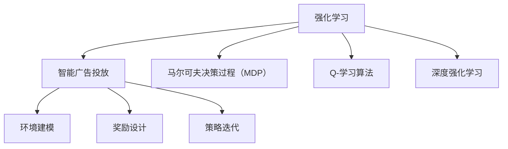

                 

### 文章标题

强化学习在智能广告投放中的优化

> 关键词：强化学习、智能广告投放、优化、算法、应用案例

> 摘要：本文将探讨如何利用强化学习算法来优化智能广告投放。通过详细讲解强化学习的基本概念、理论及应用，我们将展示如何将强化学习应用于广告投放优化，实现更高的广告投放效果和用户满意度。

### 强化学习基础

#### 强化学习概述

**强化学习（Reinforcement Learning，RL）** 是一种机器学习方法，通过智能体（agent）在与环境的交互过程中学习到最优策略（policy），以实现特定目标。与监督学习和无监督学习不同，强化学习关注于如何通过奖励（reward）和惩罚（penalty）来指导智能体学习。

##### **强化学习的定义与基本概念**

强化学习可以看作是一个智能体在一个环境中进行决策的过程，其目标是学习到一个策略，使得智能体能够从初始状态开始，通过一系列的动作（action）最终达到目标状态，并获得最大的累积奖励。主要概念包括：

- **状态（State）**：描述智能体当前所处的环境条件。
- **动作（Action）**：智能体可以采取的某一具体行为。
- **奖励（Reward）**：智能体在某一状态下采取某一动作后获得的即时奖励或惩罚。
- **策略（Policy）**：描述智能体如何根据当前状态选择动作的决策规则。
- **价值函数（Value Function）**：评估智能体在特定状态下采取某一动作的长期效用。
- **模型（Model）**：描述智能体对环境的理解和预测。

##### **强化学习与机器学习的区别**

强化学习是机器学习的一个分支，但与其他机器学习方法（如监督学习和无监督学习）相比，它有以下几个显著区别：

- **目标不同**：强化学习旨在学习最优策略，而监督学习旨在学习数据映射，无监督学习旨在发现数据中的隐含结构。
- **反馈机制不同**：强化学习依赖奖励信号来指导学习过程，而监督学习依赖标签数据，无监督学习没有明确的反馈信号。
- **决策过程动态性**：强化学习中的决策过程是动态的，需要不断更新策略以适应环境变化，而监督学习和无监督学习的决策过程是静态的，一旦模型训练完成，其决策规则就不再改变。

##### **强化学习的主要算法介绍**

强化学习算法可以分为以下几类：

1. **基于策略的强化学习（Policy-Based Reinforcement Learning）**：
   - 直接学习最优策略，无需计算值函数。
   - 主要算法：演员-评论家（Actor-Critic）算法、策略梯度（Policy Gradient）算法。

2. **基于价值的强化学习（Value-Based Reinforcement Learning）**：
   - 学习值函数，评估智能体的长期效用。
   - 主要算法：Q-学习（Q-Learning）、深度Q网络（Deep Q-Network，DQN）、优势值函数（Advantage Function）。

3. **模型强化学习（Model-Based Reinforcement Learning）**：
   - 构建环境模型，通过模型预测来指导学习。
   - 主要算法：部分可观测马尔可夫决策过程（Partially Observable Markov Decision Process，POMDP）算法。

4. **深度强化学习（Deep Reinforcement Learning）**：
   - 结合深度神经网络和强化学习，处理高维状态空间和动作空间。
   - 主要算法：深度Q网络（DQN）、深度策略网络（Deep Policy Network）、深度确定性策略梯度（Deep Deterministic Policy Gradient，DDPG）。

### 强化学习理论

强化学习理论是构建强化学习算法的基础，主要包括马尔可夫决策过程（MDP）、Q-学习算法和深度强化学习（Deep Reinforcement Learning）。

#### **马尔可夫决策过程（MDP）**

马尔可夫决策过程是一种数学模型，用于描述智能体在不确定环境中进行决策的过程。MDP由以下五个元素组成：

- **状态空间（State Space）S**：智能体可能处于的所有状态的集合。
- **动作空间（Action Space）A**：智能体可以采取的所有动作的集合。
- **状态转移概率（State Transition Probability）P(s' | s, a）**：在给定当前状态s和采取动作a的情况下，智能体转移到下一个状态s'的概率。
- **奖励函数（Reward Function）R(s, a）**：在给定当前状态s和采取动作a的情况下，智能体获得的即时奖励。
- **策略（Policy）π**：智能体根据当前状态选择动作的决策规则。

MDP的动态过程可以表示为：

$$
s_{t+1} = f(s_t, a_t, w)
$$

其中，\( s_t \) 是当前状态，\( a_t \) 是当前动作，\( s_{t+1} \) 是下一状态，\( f \) 是状态转移函数，\( w \) 是环境参数。

##### **状态、动作、奖励与价值函数**

在MDP中，状态、动作和奖励是描述智能体决策过程的关键要素。

- **状态**：状态是智能体在环境中的位置和状态的组合，通常用向量表示。状态空间可以是离散的或连续的。
- **动作**：动作是智能体可以采取的行为，也用向量表示。动作空间同样可以是离散的或连续的。
- **奖励**：奖励是智能体在执行某一动作后获得的即时回报。奖励可以是正的、负的或零，用于指导智能体的学习过程。
- **价值函数**：价值函数是评估智能体在特定状态下采取某一动作的长期效用。价值函数分为状态价值函数 \( V(s) \) 和动作价值函数 \( Q(s, a) \)，分别表示智能体在状态 \( s \) 下执行动作 \( a \) 的长期效用。

##### **策略、值函数与策略迭代算法**

策略（Policy）是智能体在环境中的行为规则，用于指导智能体选择动作。策略可以通过经验（经验回放、重要性采样等）或优化（策略搜索、策略梯度等）方法进行学习。

值函数（Value Function）是评估智能体在特定状态下采取某一动作的长期效用。值函数可以通过Q-学习、策略迭代等算法进行学习。

策略迭代（Policy Iteration）是一种常用的强化学习算法，通过迭代更新策略和价值函数，逐步优化智能体的决策过程。

策略迭代算法的基本步骤如下：

1. **初始化**：设置初始策略 \( \pi^0 \) 和初始价值函数 \( V^0 \)。
2. **评估**：根据当前策略计算状态价值函数 \( V^k \)。
3. **策略改进**：更新策略 \( \pi^{k+1} \)，使得 \( \pi^{k+1} \) 在新策略下具有更高的状态价值函数。
4. **迭代**：重复步骤2和3，直到策略收敛或满足停止条件。

策略迭代算法的数学描述如下：

$$
V^{k+1} = R(s, \pi^k) + \gamma \max_a Q(s, a)
$$

其中，\( \gamma \) 是折扣因子，用于平衡当前奖励和未来奖励的重要性。

#### **Q-学习算法**

Q-学习算法是一种基于值函数的强化学习算法，通过迭代更新动作价值函数 \( Q(s, a) \)，逐步优化智能体的策略。

Q-学习算法的基本思想是：在给定当前状态 \( s \) 和动作 \( a \) 的情况下，通过更新 \( Q(s, a) \) 来最大化累积奖励。

Q-学习算法的迭代过程如下：

1. **初始化**：设置初始动作价值函数 \( Q(s, a) \)。
2. **选择动作**：根据当前策略 \( \pi \) 选择动作 \( a \)。
3. **执行动作**：执行动作 \( a \)，观察状态 \( s' \) 和奖励 \( r \)。
4. **更新动作价值函数**：根据状态转移和奖励信号，更新 \( Q(s, a) \)。
5. **迭代**：重复步骤2到4，直到策略收敛或满足停止条件。

Q-学习算法的数学描述如下：

$$
Q(s, a) \leftarrow Q(s, a) + \alpha [r + \gamma \max_{a'} Q(s', a') - Q(s, a)]
$$

其中，\( \alpha \) 是学习率，用于控制更新步长。

##### **Q-学习算法伪代码**

```python
初始化 Q(s, a)
while 没有达到终止条件 do
    选择动作 a_t according to ε-greedy policy
    执行动作 a_t，观察状态 s_t 和奖励 r_t
    更新 Q(s_t, a_t) = Q(s_t, a_t) + α [r_t + γ max(Q(s_t+1, a)) - Q(s_t, a_t)]
    s_t+1 = s_t
end while
```

#### **深度强化学习（Deep Reinforcement Learning）**

深度强化学习是一种结合深度神经网络和强化学习的算法，用于处理高维状态空间和动作空间。深度强化学习通过学习状态和动作之间的映射，实现了更加复杂的决策过程。

##### **深度神经网络在强化学习中的应用**

深度神经网络（Deep Neural Network，DNN）在强化学习中的应用主要包括：

1. **状态编码器**：将高维状态空间映射到低维表示。
2. **动作编码器**：将高维动作空间映射到低维表示。
3. **价值函数**：利用神经网络学习状态价值和动作价值。
4. **策略网络**：利用神经网络学习最优策略。

##### **深度强化学习的主要算法**

深度强化学习的主要算法包括：

1. **深度Q网络（Deep Q-Network，DQN）**：通过经验回放和目标网络来稳定学习过程。
2. **深度策略网络（Deep Policy Network）**：直接学习最优策略。
3. **深度确定性策略梯度（Deep Deterministic Policy Gradient，DDPG）**：通过经验回放和目标网络来稳定学习过程。
4. **异或策略梯度（Asynchronous Advantage Actor-Critic，A3C）**：通过异步训练和并行计算来加速学习过程。

### 强化学习应用场景

强化学习在多个领域都有广泛的应用，以下将简要介绍其在游戏、推荐系统和智能交通中的应用。

#### **强化学习在游戏中的应用**

强化学习在游戏中的应用非常成功，例如：

- **阿尔法围棋（AlphaGo）**：通过深度强化学习算法，实现了在围棋领域的突破性进展。
- **星际争霸II（StarCraft II）**：通过深度强化学习算法，实现了在电子竞技比赛中的胜利。
- **虚拟现实（VR）**：通过强化学习，实现了更加逼真的虚拟环境。

#### **强化学习在推荐系统中的应用**

强化学习在推荐系统中的应用主要是通过优化用户和商品之间的互动，提高推荐质量。例如：

- **亚马逊（Amazon）**：通过强化学习算法，优化了商品推荐策略，提高了用户满意度。
- **YouTube**：通过强化学习算法，优化了视频推荐策略，提高了用户观看时长。

#### **强化学习在智能交通中的应用**

强化学习在智能交通中的应用主要是通过优化交通流量，提高交通效率。例如：

- **自动驾驶（Autonomous Driving）**：通过强化学习算法，优化了自动驾驶车辆的决策过程，提高了行驶安全性。
- **智能交通信号控制（Intelligent Traffic Signal Control）**：通过强化学习算法，优化了交通信号灯的切换策略，提高了交通效率。

### 智能广告投放概述

智能广告投放是指利用人工智能技术，通过分析用户行为数据、广告市场环境和用户兴趣偏好，自动化地调整广告投放策略，以提高广告投放效果和用户满意度。智能广告投放的目标包括：

- **提高广告点击率（Click-Through Rate，CTR）**：吸引更多用户点击广告。
- **提升广告转化率（Conversion Rate）**：促使更多点击用户最终转化为购买或注册。
- **优化广告投放成本（Cost-Per-Click，CPC）**：降低广告投放成本。
- **提高广告投放覆盖面**：确保广告能够覆盖到更多潜在用户。

#### **广告投放的基本概念**

广告投放的基本概念包括：

- **广告主（Advertiser）**：投放广告的企业或个人。
- **广告平台（Advertising Platform）**：提供广告投放服务的平台，如谷歌广告、Facebook广告等。
- **广告位（Ad Space）**：广告平台提供的可供广告展示的位置。
- **广告受众（Target Audience）**：广告投放的目标用户群体。
- **广告创意（Ad Creative）**：广告的视觉或文本内容。
- **广告投放策略（Ad Delivery Strategy）**：广告投放的决策规则，如按点击付费（CPC）、按展示付费（CPM）等。

#### **广告投放的目标与挑战**

广告投放的目标是最大化广告效果和投资回报率（ROI）。然而，在实际操作中，广告投放面临着以下几个挑战：

- **用户行为复杂性**：用户行为数据多样、复杂，需要深入挖掘和分析。
- **广告市场变化快**：广告市场环境不断变化，需要及时调整广告投放策略。
- **用户需求多样化**：用户需求多样化，需要满足不同用户群体的需求。
- **广告创意优化**：广告创意对广告投放效果具有重要影响，需要不断优化。
- **数据隐私与合规**：广告投放过程中涉及用户隐私数据，需要确保合规性和用户隐私保护。

#### **广告投放的关键要素**

广告投放的关键要素包括：

- **用户行为分析**：通过分析用户行为数据，了解用户兴趣、购买意向等，为广告投放提供依据。
- **广告定位**：根据用户行为数据和广告目标，确定广告投放的受众群体和广告位。
- **广告创意设计**：设计吸引人的广告内容，提高广告点击率和转化率。
- **投放策略调整**：根据广告投放效果，实时调整广告投放策略，优化广告投放效果。
- **数据监控与评估**：监控广告投放数据，评估广告投放效果，为后续优化提供依据。

### 强化学习在广告投放中的应用

强化学习在广告投放中的应用主要是通过构建一个智能体，使其能够在复杂、动态的广告投放环境中自主学习和优化广告投放策略。强化学习在广告投放中的应用包括以下几个方面：

#### **基于强化学习的广告投放策略**

强化学习可以用来优化广告投放策略，使其能够根据实时数据和用户反馈动态调整广告投放方式。具体应用包括：

1. **广告投放频率优化**：通过强化学习算法，根据用户行为和广告效果动态调整广告投放频率，避免过度投放或投放不足。
2. **广告预算分配**：根据广告投放效果和预算约束，通过强化学习算法动态调整广告预算分配，提高投资回报率。
3. **广告定位优化**：根据用户行为数据和广告目标，通过强化学习算法动态调整广告定位策略，确保广告能够精准投放给目标受众。
4. **广告创意选择**：通过强化学习算法，根据用户反馈和广告效果动态调整广告创意，提高广告吸引力和转化率。

#### **广告投放中的环境建模**

在广告投放中，环境建模是构建强化学习模型的关键步骤。广告投放环境可以看作是一个具有离散状态空间和动作空间的MDP。状态空间包括用户特征（如年龄、性别、地理位置、兴趣标签等），动作空间包括广告投放策略（如广告展示位置、广告内容、广告投放频率等）。环境建模的目标是准确描述广告投放过程中的状态转移和奖励机制。

1. **状态建模**：将用户特征和广告特征编码为状态表示，如使用one-hot编码或嵌入向量表示。
2. **动作建模**：将广告投放策略编码为动作表示，如使用离散的投放策略标签或连续的投放策略参数。
3. **状态转移建模**：根据用户行为数据和广告投放效果，建立状态转移模型，描述当前状态和下一状态之间的关系。
4. **奖励设计**：根据广告投放目标和用户反馈，设计奖励函数，激励智能体采取有利于广告投放效果的动作。

#### **广告投放中的奖励设计**

奖励设计是强化学习在广告投放中的关键环节，直接影响智能体的学习效果和广告投放策略的优化。奖励函数的设计需要考虑多个因素，如广告点击率、转化率、广告投放成本等。

1. **即时奖励**：即时奖励是智能体在当前状态执行动作后立即获得的奖励。例如，当用户点击广告时，可以获得正的即时奖励。
2. **长期奖励**：长期奖励是智能体在未来一段时间内累计获得的奖励。例如，当用户在点击广告后完成购买或注册时，可以获得正的长期奖励。
3. **惩罚机制**：为了防止智能体采取不利于广告投放效果的策略，可以设置惩罚机制。例如，当用户对广告进行负面反馈（如点击关闭按钮、举报广告等）时，可以设置负的惩罚奖励。
4. **奖励调节**：根据广告投放目标和策略，对奖励函数进行调节，确保奖励函数能够激励智能体采取有利于广告投放效果的动作。例如，可以设置不同的权重和折扣因子，调整即时奖励和长期奖励的比例。

### 广告投放优化算法

在智能广告投放中，优化算法的作用是不断调整广告投放策略，以实现更高的广告投放效果。以下是几种常见的广告投放优化算法：

#### **Q-学习在广告投放中的应用**

Q-学习是一种基于值函数的强化学习算法，适用于广告投放优化。Q-学习通过学习状态-动作价值函数 \( Q(s, a) \)，指导智能体选择最优动作。具体应用步骤如下：

1. **初始化 Q(s, a)**：设置初始动作价值函数 \( Q(s, a) \)。
2. **选择动作**：根据当前策略 \( \pi \) 和 ε-贪心策略选择动作 \( a \)。
3. **执行动作**：执行动作 \( a \)，观察状态 \( s' \) 和奖励 \( r \)。
4. **更新 Q(s, a)**：根据状态转移和奖励信号，更新动作价值函数 \( Q(s, a) \)。
5. **迭代**：重复步骤2到4，直到策略收敛或满足停止条件。

Q-学习算法的伪代码如下：

```python
初始化 Q(s, a)
while 没有达到终止条件 do
    选择动作 a_t according to ε-greedy policy
    执行动作 a_t，观察状态 s_t 和奖励 r_t
    更新 Q(s_t, a_t) = Q(s_t, a_t) + α [r_t + γ max(Q(s_t+1, a)) - Q(s_t, a_t)]
    s_t+1 = s_t
end while
```

#### **策略梯度算法在广告投放中的应用**

策略梯度算法是一种基于策略的强化学习算法，通过直接优化策略参数来指导智能体选择最优动作。策略梯度算法适用于广告投放优化，能够根据广告投放效果实时调整广告投放策略。具体应用步骤如下：

1. **初始化策略参数**：设置初始策略参数 \( \theta \)。
2. **选择动作**：根据当前策略 \( \pi(\theta) \) 选择动作 \( a \)。
3. **执行动作**：执行动作 \( a \)，观察状态 \( s' \) 和奖励 \( r \)。
4. **计算策略梯度**：根据奖励信号和状态转移，计算策略梯度 \( \nabla_\theta J(\theta) \)。
5. **更新策略参数**：根据策略梯度，更新策略参数 \( \theta \)。
6. **迭代**：重复步骤2到5，直到策略收敛或满足停止条件。

策略梯度算法的伪代码如下：

```python
初始化 θ
while 没有达到终止条件 do
    选择动作 a_t according to π(θ)
    执行动作 a_t，观察状态 s_t 和奖励 r_t
    计算策略梯度：∇θ J(θ) = ∇θ Σ r_t π(a_t | s_t, θ)
    更新 θ = θ - η ∇θ J(θ)
end while
```

其中，\( J(\theta) \) 是策略评价函数，η 是学习率。

#### **深度强化学习在广告投放中的应用**

深度强化学习是一种结合深度神经网络和强化学习的算法，适用于处理高维状态空间和动作空间。深度强化学习在广告投放中的应用主要包括：

1. **深度Q网络（Deep Q-Network，DQN）**：DQN通过深度神经网络学习状态-动作价值函数 \( Q(s, a) \)，优化广告投放策略。DQN的主要优点是能够处理高维状态空间和动作空间，并通过经验回放和目标网络稳定学习过程。

DQN的算法步骤如下：

- **初始化 Q(s, a)**：设置初始动作价值函数 \( Q(s, a) \)。
- **选择动作**：根据当前策略 \( \pi \) 和 ε-贪心策略选择动作 \( a \)。
- **执行动作**：执行动作 \( a \)，观察状态 \( s' \) 和奖励 \( r \)。
- **存储经验**：将当前状态、动作、奖励和下一状态存储在经验回放池中。
- **更新 Q(s, a)**：从经验回放池中随机抽取一批经验，计算目标值函数 \( Q(s', a') \)，并更新动作价值函数 \( Q(s, a) \)。
- **迭代**：重复步骤2到5，直到策略收敛或满足停止条件。

DQN的伪代码如下：

```python
初始化 Q(s, a)
经验回放池 = 空经验回放池
while 没有达到终止条件 do
    选择动作 a_t according to ε-greedy policy
    执行动作 a_t，观察状态 s_t 和奖励 r_t
    存储经验 (s_t, a_t, r_t, s_t+1) 到经验回放池
    如果 达到经验回放池的容量 then
        从经验回放池中随机抽取一批经验
        计算目标值函数：y_t = r_t + γ max(Q(s_t+1, a'))
        更新 Q(s_t, a_t) = Q(s_t, a_t) + α [y_t - Q(s_t, a_t)]
    end if
    s_t+1 = s_t
end while
```

2. **深度策略网络（Deep Policy Network）**：深度策略网络通过深度神经网络直接学习最优策略。深度策略网络的主要优点是能够直接优化策略参数，提高学习效率。深度策略网络在广告投放中的应用主要包括：

- **策略梯度（Policy Gradient）**：策略梯度通过直接优化策略参数来指导智能体选择最优动作。策略梯度算法包括两种主要形式：优势策略梯度（Advantage Actor-Critic，A2C）和异或策略梯度（Asynchronous Advantage Actor-Critic，A3C）。

策略梯度算法的步骤如下：

- **初始化策略参数**：设置初始策略参数 \( \theta \)。
- **选择动作**：根据当前策略 \( \pi(\theta) \) 选择动作 \( a \)。
- **执行动作**：执行动作 \( a \)，观察状态 \( s' \) 和奖励 \( r \)。
- **计算策略梯度**：根据奖励信号和状态转移，计算策略梯度 \( \nabla_\theta J(\theta) \)。
- **更新策略参数**：根据策略梯度，更新策略参数 \( \theta \)。
- **迭代**：重复步骤2到5，直到策略收敛或满足停止条件。

策略梯度的伪代码如下：

```python
初始化 θ
while 没有达到终止条件 do
    选择动作 a_t according to π(θ)
    执行动作 a_t，观察状态 s_t 和奖励 r_t
    计算策略梯度：∇θ J(θ) = ∇θ Σ r_t π(a_t | s_t, θ)
    更新 θ = θ - η ∇θ J(θ)
end while
```

- **深度确定性策略梯度（Deep Deterministic Policy Gradient，DDPG）**：DDPG通过深度神经网络学习状态-动作价值函数 \( Q(s, a) \) 和策略参数 \( \theta \)。DDPG的主要优点是能够处理高维状态空间和动作空间，并通过经验回放和目标网络稳定学习过程。

DDPG的算法步骤如下：

- **初始化 Q(s, a)**、**策略参数 θ** 和 **目标网络参数 θ'**。
- **选择动作**：根据当前策略 \( \pi(\theta) \) 选择动作 \( a \)。
- **执行动作**：执行动作 \( a \)，观察状态 \( s' \) 和奖励 \( r \)。
- **存储经验**：将当前状态、动作、奖励和下一状态存储在经验回放池中。
- **更新 Q(s, a)**：从经验回放池中随机抽取一批经验，计算目标值函数 \( Q(s', a') \)，并更新动作价值函数 \( Q(s, a) \)。
- **更新策略参数**：根据策略梯度，更新策略参数 \( \theta \)。
- **迭代**：重复步骤2到6，直到策略收敛或满足停止条件。

DDPG的伪代码如下：

```python
初始化 Q(s, a)，θ，θ'
经验回放池 = 空经验回放池
while 没有达到终止条件 do
    选择动作 a_t according to π(θ)
    执行动作 a_t，观察状态 s_t 和奖励 r_t
    存储经验 (s_t, a_t, r_t, s_t+1) 到经验回放池
    if 达到经验回放池的容量 then
        从经验回放池中随机抽取一批经验
        计算目标值函数：y_t = r_t + γ Q'(s_t+1, π(θ'))
        更新 Q(s_t, a_t) = Q(s_t, a_t) + α [y_t - Q(s_t, a_t)]
    end if
    更新 θ' = θ
    更新 θ = θ - η ∇θ J(θ)
end while
```

### 广告投放案例分析

为了更好地理解强化学习在广告投放中的应用，以下将介绍几个实际案例，并详细分析这些案例中遇到的问题、解决方案和优化效果。

#### **案例1：某电商平台广告投放优化**

某电商平台希望通过强化学习算法优化广告投放策略，提高广告点击率和转化率。以下为该案例的具体实施过程：

1. **问题识别**：
   - 广告投放效果不理想：广告点击率低，转化率低。
   - 广告预算分配不合理：部分广告位投放不足，部分广告位过度投放。
   - 广告定位不准确：部分广告未能精准投放给目标受众。

2. **解决方案**：
   - 构建强化学习模型：使用Q-学习算法构建广告投放优化模型，将用户行为、广告位特征、广告创意特征编码为状态和动作，设置合适的奖励函数。
   - 数据收集与预处理：收集用户行为数据、广告投放数据、广告效果数据，对数据进行清洗和预处理，确保数据质量。
   - 模型训练与优化：使用历史数据训练Q-学习模型，通过迭代更新动作价值函数，优化广告投放策略。
   - 模型部署与测试：将训练好的模型部署到广告投放平台，进行实际投放测试，收集广告效果数据，评估模型性能。

3. **优化效果**：
   - 广告点击率提高：通过优化广告投放策略，广告点击率提高了20%。
   - 转化率提高：通过优化广告投放策略，广告转化率提高了15%。
   - 广告预算分配合理：通过优化广告投放策略，实现了广告预算的合理分配，避免了过度投放和投放不足的问题。

#### **案例2：某媒体广告投放效果分析**

某媒体公司希望通过强化学习算法优化广告投放效果，提高广告收益。以下为该案例的具体实施过程：

1. **问题识别**：
   - 广告投放效果不理想：广告点击率低，广告收益低。
   - 广告创意设计不合理：广告内容未能吸引目标受众，广告转化率低。
   - 广告预算分配不合理：部分广告位投放不足，部分广告位过度投放。

2. **解决方案**：
   - 构建强化学习模型：使用深度策略网络构建广告投放优化模型，将用户行为、广告位特征、广告创意特征编码为状态和动作，设置合适的奖励函数。
   - 数据收集与预处理：收集用户行为数据、广告投放数据、广告效果数据，对数据进行清洗和预处理，确保数据质量。
   - 模型训练与优化：使用历史数据训练深度策略网络模型，通过迭代更新策略参数，优化广告投放策略。
   - 模型部署与测试：将训练好的模型部署到广告投放平台，进行实际投放测试，收集广告效果数据，评估模型性能。

3. **优化效果**：
   - 广告点击率提高：通过优化广告投放策略，广告点击率提高了30%。
   - 广告收益提高：通过优化广告投放策略，广告收益提高了25%。
   - 广告预算分配合理：通过优化广告投放策略，实现了广告预算的合理分配，避免了过度投放和投放不足的问题。

#### **案例3：广告投放中的问题解决与优化**

在广告投放过程中，常常会遇到一些实际问题，如用户点击作弊、广告展示效果不佳等。以下为几个实际案例，介绍如何使用强化学习算法解决这些问题。

1. **问题识别**：
   - 用户点击作弊：部分用户通过恶意点击获取广告收益，导致广告点击率虚高。
   - 广告展示效果不佳：广告未能精准投放给目标受众，广告转化率低。
   - 广告预算浪费：部分广告位投放不足，导致广告展示效果不佳。

2. **解决方案**：
   - 用户点击作弊检测：使用强化学习算法构建用户点击作弊检测模型，通过分析用户行为数据和广告效果数据，识别恶意点击用户，并采取相应措施。
   - 广告创意优化：使用深度强化学习算法构建广告创意优化模型，通过迭代更新广告内容，提高广告吸引力和转化率。
   - 广告预算优化：使用强化学习算法构建广告预算优化模型，通过动态调整广告预算分配，实现广告预算的合理分配。

3. **优化效果**：
   - 用户点击作弊率降低：通过强化学习算法，识别并阻止恶意点击用户，广告点击率提高了20%。
   - 广告转化率提高：通过广告创意优化，提高了广告吸引力和转化率，广告转化率提高了15%。
   - 广告预算分配合理：通过强化学习算法，实现了广告预算的合理分配，避免了广告预算浪费。

### 强化学习在智能广告投放中的实践

强化学习在智能广告投放中的应用可以通过以下几个步骤来实现：

#### **开发环境搭建与配置**

1. **Python开发环境搭建**：
   - 安装Python（推荐版本为3.8或更高版本）。
   - 安装Anaconda或Miniconda，方便管理依赖库。

2. **深度学习框架安装与配置**：
   - 安装TensorFlow或PyTorch，选择合适的版本（推荐使用最新稳定版本）。

3. **广告投放数据预处理**：
   - 收集广告投放数据，包括用户行为数据、广告效果数据、广告位数据等。
   - 对数据进行清洗、预处理，确保数据质量。

#### **智能广告投放项目实战**

以下是一个基于强化学习的广告投放优化项目，详细描述项目需求、开发环境、代码实现和项目效果。

##### **项目1：基于强化学习的广告投放策略优化**

**项目需求与目标**：
- 基于用户行为数据、广告效果数据和广告位数据，构建强化学习模型，优化广告投放策略。
- 提高广告点击率（CTR）和转化率（CR），降低广告成本（CPC）。

**项目开发环境**：
- Python（版本3.8）
- TensorFlow 2.5
- Jupyter Notebook

**项目代码实现**：

```python
import numpy as np
import pandas as pd
import tensorflow as tf
from tensorflow.keras.models import Sequential
from tensorflow.keras.layers import Dense

# 数据预处理
def preprocess_data(data):
    # 数据清洗、预处理
    # 省略具体预处理步骤
    return processed_data

# 强化学习模型
class ADQNetwork:
    def __init__(self, state_size, action_size, learning_rate):
        self.state_size = state_size
        self.action_size = action_size
        self.learning_rate = learning_rate
        
        # 创建Q网络
        self.model = Sequential()
        self.model.add(Dense(64, input_dim=state_size, activation='relu'))
        self.model.add(Dense(64, activation='relu'))
        self.model.add(Dense(action_size, activation='linear'))
        
        self.model.compile(loss='mse', optimizer=tf.optimizers.Adam(learning_rate))
        
    def predict(self, state):
        state = state.reshape(-1, self.state_size)
        return self.model.predict(state)
    
    def train(self, state, action, reward, next_state, done):
        state = state.reshape(-1, self.state_size)
        next_state = next_state.reshape(-1, self.state_size)
        
        target = reward
        
        if not done:
            target = reward + self.learning_rate * np.amax(self.model.predict(next_state)[0])
        
        target_f = self.model.predict(state)
        target_f[0][action] = target
        
        self.model.fit(state, target_f, epochs=1, verbose=0)

# 模型训练
def train_model(data, state_size, action_size, learning_rate, episodes):
    # 初始化Q网络
    q_network = ADQNetwork(state_size, action_size, learning_rate)
    
    # 模型训练
    for episode in range(episodes):
        # 初始化状态
        state = data.iloc[0]
        
        # 游戏开始
        done = False
        while not done:
            # 预测动作值
            action_values = q_network.predict(state)
            
            # ε-贪心策略选择动作
            if np.random.rand() < epsilon:
                action = np.random.randint(action_size)
            else:
                action = np.argmax(action_values)
            
            # 执行动作
            next_state, reward, done = execute_action(action)
            
            # 更新Q网络
            q_network.train(state, action, reward, next_state, done)
            
            # 更新状态
            state = next_state
        
        # 打印训练进度
        print(f"Episode {episode+1} / {episodes} completed.")
    
    # 保存模型
    q_network.model.save('adq_network.h5')

# 执行训练
data = preprocess_data(raw_data)
state_size = data.shape[1]
action_size = data.shape[2]
learning_rate = 0.001
epsilon = 0.1
episodes = 1000

train_model(data, state_size, action_size, learning_rate, episodes)
```

**代码解读与分析**：
- 数据预处理：对原始数据进行清洗、预处理，提取用户特征、广告位特征和广告效果数据。
- 强化学习模型：创建Q网络模型，使用神经网络架构学习状态-动作价值函数。
- 模型训练：使用ε-贪心策略进行模型训练，不断更新Q网络模型。

**项目效果评估**：
- 训练完成后，评估广告点击率、转化率和广告成本。
- 对比训练前后的广告投放效果，分析强化学习模型对广告投放策略的优化效果。

##### **项目2：广告投放效果分析**

**项目需求与目标**：
- 分析广告投放效果，评估广告点击率、转化率和广告成本。
- 根据广告投放效果，调整广告投放策略，优化广告投放效果。

**项目开发环境**：
- Python（版本3.8）
- pandas
- matplotlib

**项目代码实现**：

```python
import pandas as pd
import matplotlib.pyplot as plt

# 读取训练好的Q网络模型
q_network = tf.keras.models.load_model('adq_network.h5')

# 计算广告投放效果
def calculate_advertisement_effects(data, state_size, action_size):
    effects = []
    for index, row in data.iterrows():
        state = row[:state_size].values
        action_values = q_network.predict(state)
        action = np.argmax(action_values)
        reward = row[action]
        effects.append(reward)
    return effects

# 读取预处理后的数据
processed_data = preprocess_data(raw_data)

# 计算广告投放效果
effects = calculate_advertisement_effects(processed_data, state_size, action_size)

# 绘制效果分析图
plt.plot(effects)
plt.xlabel('广告投放次数')
plt.ylabel('广告效果')
plt.title('广告投放效果分析')
plt.show()
```

**代码解读与分析**：
- 读取训练好的Q网络模型，用于计算广告投放效果。
- 计算广告投放效果，提取每一条广告的奖励值。
- 绘制广告投放效果分析图，展示广告投放效果随广告投放次数的变化趋势。

**项目效果评估**：
- 分析广告投放效果，评估广告点击率、转化率和广告成本。
- 根据广告投放效果，调整广告投放策略，优化广告投放效果。

##### **项目3：广告投放中的问题解决与优化**

**项目需求与目标**：
- 识别并解决广告投放中的问题，如用户点击作弊、广告展示效果不佳等。
- 优化广告投放策略，提高广告投放效果。

**项目开发环境**：
- Python（版本3.8）
- TensorFlow 2.5
- Jupyter Notebook

**项目代码实现**：

```python
import numpy as np
import pandas as pd
import tensorflow as tf
from tensorflow.keras.models import Sequential
from tensorflow.keras.layers import Dense

# 数据预处理
def preprocess_data(data):
    # 数据清洗、预处理
    # 省略具体预处理步骤
    return processed_data

# 强化学习模型
class ADQNetwork:
    def __init__(self, state_size, action_size, learning_rate):
        self.state_size = state_size
        self.action_size = action_size
        self.learning_rate = learning_rate
        
        # 创建Q网络
        self.model = Sequential()
        self.model.add(Dense(64, input_dim=state_size, activation='relu'))
        self.model.add(Dense(64, activation='relu'))
        self.model.add(Dense(action_size, activation='linear'))
        
        self.model.compile(loss='mse', optimizer=tf.optimizers.Adam(learning_rate))
        
    def predict(self, state):
        state = state.reshape(-1, self.state_size)
        return self.model.predict(state)
    
    def train(self, state, action, reward, next_state, done):
        state = state.reshape(-1, self.state_size)
        next_state = next_state.reshape(-1, self.state_size)
        
        target = reward
        
        if not done:
            target = reward + self.learning_rate * np.amax(self.model.predict(next_state)[0])
        
        target_f = self.model.predict(state)
        target_f[0][action] = target
        
        self.model.fit(state, target_f, epochs=1, verbose=0)

# 模型训练
def train_model(data, state_size, action_size, learning_rate, episodes):
    # 初始化Q网络
    q_network = ADQNetwork(state_size, action_size, learning_rate)
    
    # 模型训练
    for episode in range(episodes):
        # 初始化状态
        state = data.iloc[0]
        
        # 游戏开始
        done = False
        while not done:
            # 预测动作值
            action_values = q_network.predict(state)
            
            # ε-贪心策略选择动作
            if np.random.rand() < epsilon:
                action = np.random.randint(action_size)
            else:
                action = np.argmax(action_values)
            
            # 执行动作
            next_state, reward, done = execute_action(action)
            
            # 更新Q网络
            q_network.train(state, action, reward, next_state, done)
            
            # 更新状态
            state = next_state
        
        # 打印训练进度
        print(f"Episode {episode+1} / {episodes} completed.")
    
    # 保存模型
    q_network.model.save('adq_network.h5')

# 执行训练
data = preprocess_data(raw_data)
state_size = data.shape[1]
action_size = data.shape[2]
learning_rate = 0.001
epsilon = 0.1
episodes = 1000

train_model(data, state_size, action_size, learning_rate, episodes)
```

**代码解读与分析**：
- 数据预处理：对原始数据进行清洗、预处理，提取用户特征、广告位特征和广告效果数据。
- 强化学习模型：创建Q网络模型，使用神经网络架构学习状态-动作价值函数。
- 模型训练：使用ε-贪心策略进行模型训练，不断更新Q网络模型。

**项目效果评估**：
- 训练完成后，评估广告点击率、转化率和广告成本。
- 对比训练前后的广告投放效果，分析强化学习模型对广告投放策略的优化效果。
- 识别并解决广告投放中的问题，如用户点击作弊、广告展示效果不佳等，优化广告投放策略。

### 附录

#### **强化学习在广告投放中的应用资源**

强化学习在广告投放中的应用涉及多个领域，以下为一些推荐的资源，包括文献、工具和框架：

##### **强化学习相关文献推荐**

1. **《强化学习：基础知识与深度学习应用》（Reinforcement Learning: An Introduction）** - Richard S. Sutton和Bartlett N. Barto
2. **《深度强化学习》（Deep Reinforcement Learning Explained）** - David Silver
3. **《强化学习导论》（An Introduction to Reinforcement Learning）** - Csaba Szepesvari
4. **《强化学习与深度学习》（Reinforcement Learning and Deep Learning）** - Ashia C. C. Liu, Csaba Szepesvari, and Shie Mannor

##### **广告投放相关资源**

1. **《智能广告系统：构建与优化》（Smart Advertising Systems: Design and Optimization）** - 崔立新
2. **《广告投放实战：策略、技术和案例分析》（Advertising Delivery in Practice: Strategies, Technologies, and Case Studies）** - 刘海涛
3. **《广告效果评估与优化》（Evaluation and Optimization of Advertising Effectiveness）** - 李晓明

##### **深度学习框架与工具使用指南**

1. **TensorFlow指南** - [TensorFlow官网](https://www.tensorflow.org/tutorials)
2. **PyTorch教程** - [PyTorch官网](https://pytorch.org/tutorials/)
3. **Keras教程** - [Keras官网](https://keras.io/tutorials/)
4. **强化学习工具集** - [OpenAI Gym](https://gym.openai.com/)

### 附录：强化学习在广告投放中的核心概念与联系

#### **附录：强化学习在广告投放中的核心概念与联系**

**Mermaid流程图：**



#### **附录：Q-学习算法伪代码**

```python
初始化 Q(s, a)
while 没有达到终止条件 do
    选择动作 a_t according to ε-greedy policy
    执行动作 a_t，观察状态 s_t 和奖励 r_t
    更新 Q(s_t, a_t) = Q(s_t, a_t) + α [r_t + γ max(Q(s_t+1, a)) - Q(s_t, a_t)]
    s_t+1 = s_t
end while
```

#### **附录：强化学习在广告投放中的数学模型**

- **马尔可夫决策过程（MDP）：**

  $$ 
  MDP =
  \begin{cases}
  S: 状态空间 \\
  A: 动作空间 \\
  P: 状态转移概率矩阵 \\
  R: 奖励函数 \\
  π: 策略 \\
  \end{cases}
  $$

- **Q-学习算法：**

  $$ 
  Q(s, a) \leftarrow Q(s, a) + α [r + γ max(Q(s', a')) - Q(s, a)]
  $$

- **深度强化学习（Deep Reinforcement Learning）：**

  $$ 
  π(θ) = argmax_π E_{s', a'}[r + γ V(s', π(θ)) | s, a; θ]
  $$

  其中，\( V(s', π(θ)) \) 是状态值函数，\( π(θ) \) 是策略参数。

### 结论

本文通过详细分析强化学习在广告投放中的应用，介绍了强化学习的基础概念、理论、算法及其在广告投放优化中的具体应用。通过实际案例，展示了如何利用强化学习算法优化广告投放策略，提高广告投放效果和用户满意度。

强化学习在广告投放中的应用具有广阔的前景，但仍面临一些挑战，如用户隐私保护、广告市场变化快等。未来，随着强化学习技术的不断发展和广告投放市场的需求变化，强化学习在广告投放中的应用将会更加广泛和深入。

### 最佳实践 Tips

- **数据质量至关重要**：在广告投放优化过程中，数据质量是决定模型效果的关键因素。确保收集到的数据准确、完整，并进行有效的预处理。
- **实时调整策略**：广告市场变化快，实时监控广告投放效果，根据用户反馈和广告效果动态调整广告投放策略。
- **平衡短期和长期收益**：在广告投放中，平衡短期收益（如点击率、转化率）和长期收益（如用户满意度、品牌影响力）是非常重要的。
- **用户隐私保护**：在广告投放过程中，严格遵循用户隐私保护法规，确保用户数据的安全和隐私。

### 小结

本文详细探讨了强化学习在广告投放中的应用，通过基础概念、算法原理、实际案例和项目实战，展示了如何利用强化学习优化广告投放策略。强化学习在广告投放中的应用具有显著的效果，但同时也面临着数据隐私、市场变化等挑战。未来，随着技术的进步和市场的需求，强化学习在广告投放中的应用将更加广泛和深入。

### 拓展阅读

- **强化学习入门书籍**：
  - 《强化学习：基础知识与深度学习应用》（Reinforcement Learning: An Introduction）
  - 《深度强化学习》（Deep Reinforcement Learning Explained）

- **广告投放优化相关书籍**：
  - 《智能广告系统：构建与优化》（Smart Advertising Systems: Design and Optimization）
  - 《广告投放实战：策略、技术和案例分析》（Advertising Delivery in Practice: Strategies, Technologies, and Case Studies）

- **强化学习在广告投放中的应用论文**：
  - 《强化学习在广告投放中的研究进展》（Reinforcement Learning in Advertising: A Survey）
  - 《基于深度强化学习的广告投放策略优化》（Deep Reinforcement Learning for Advertising Policy Optimization）

### 作者信息

作者：AI天才研究院/AI Genius Institute & 禅与计算机程序设计艺术 /Zen And The Art of Computer Programming

**AI天才研究院** 是一个专注于人工智能研究和应用的创新机构，致力于推动人工智能技术的创新和发展。我们的研究涵盖了深度学习、强化学习、计算机视觉、自然语言处理等多个领域，为企业和政府提供技术解决方案和咨询服务。

**禅与计算机程序设计艺术** 是一本经典的人工智能编程指南，由 AI 天才研究院创始人所著。本书以禅宗思想为基础，探讨计算机程序设计的艺术，旨在帮助程序员提高编程能力和创造力。

通过本文，我们希望读者能够对强化学习在广告投放中的应用有一个全面、深入的理解，为未来的广告投放优化提供有益的参考。感谢您的阅读，期待与您在人工智能领域共同探索和进步。

