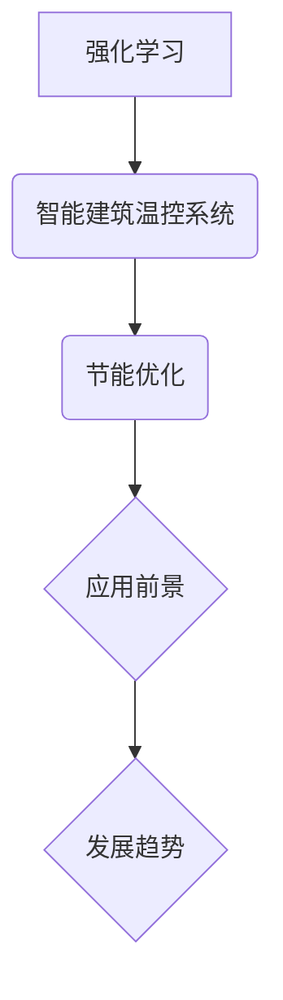

                 

# 《强化学习在智能建筑温控系统中的节能优化》

## 关键词
- 强化学习
- 智能建筑
- 温控系统
- 节能优化
- Q-学习算法
- 深度Q网络（DQN）
- 策略梯度算法

## 摘要
本文探讨了强化学习在智能建筑温控系统中的节能优化应用。首先，我们介绍了强化学习的基本概念和特点，以及与机器学习其他方法的比较。然后，我们详细阐述了智能建筑温控系统的定义、重要性及其节能优化需求。接着，我们深入讲解了强化学习的基础理论，包括基本概念、算法原理以及强化学习模型。随后，我们讨论了强化学习在智能建筑温控系统中的具体应用，并介绍了智能建筑温控系统的架构与建模方法。在此基础上，我们提出了强化学习在智能建筑温控系统中的节能优化算法，并通过案例分析和实际案例进行了验证。最后，我们探讨了强化学习在智能建筑温控系统中的实施方法、技术挑战及未来发展趋势。

## 第1章 引言

### 1.1 强化学习概述

#### 1.1.1 强化学习定义
强化学习（Reinforcement Learning，RL）是机器学习的一个分支，它通过试错的方法，使代理（agent）在给定环境中，通过不断接收环境反馈（奖励或惩罚信号），逐步学习到一种策略，以实现最大化累积奖励。强化学习的基本框架包括代理（agent）、环境（environment）、状态（state）、动作（action）和奖励（reward）。

#### 1.1.2 强化学习特点
强化学习的特点包括：
- **交互性**：代理与环境的交互过程中，通过不断调整策略来学习。
- **适应性**：强化学习算法能够根据环境的变化动态调整策略。
- **不确定性**：强化学习面临的不确定性较大，环境状态和奖励可能不明确。

#### 1.1.3 强化学习与其他机器学习方法的比较
与监督学习和无监督学习相比，强化学习具有以下区别：
- **监督学习**：输入输出对已知，目标是最小化预测误差。
- **无监督学习**：没有明确的输入输出对，目标是从数据中挖掘结构。
- **强化学习**：通过与环境互动获取奖励，目标是最大化累积奖励。

### 1.2 智能建筑温控系统概述

#### 1.2.1 智能建筑定义
智能建筑（Smart Building）是指通过集成自动化控制系统，实现建筑内环境、能源管理、安全监控、设备运行等各个方面的智能化管理。智能建筑的核心是信息通信技术（ICT）和建筑技术的融合。

#### 1.2.2 温控系统在智能建筑中的重要性
温控系统是智能建筑的重要组成部分，它直接影响建筑物的舒适度和能源消耗。温控系统的目标是保持室内温度在一个舒适的范围内，同时尽可能降低能源消耗。

#### 1.2.3 节能优化需求
随着能源消耗的增加，智能建筑的节能优化成为了一个重要议题。强化学习在智能建筑温控系统中的应用，旨在通过自适应策略优化，实现温控系统的节能目标。

## 第2章 强化学习基础

### 2.1 强化学习基本概念

#### 2.1.1 强化学习模型
强化学习模型由以下几个部分组成：
- **状态（State）**：描述代理当前所处的环境状态。
- **动作（Action）**：代理可以采取的动作。
- **奖励（Reward）**：代理执行动作后，环境对代理的奖励或惩罚。
- **策略（Policy）**：代理选择动作的策略，通常是一个概率分布。

#### 2.1.2 强化学习算法
强化学习算法主要包括以下几种：
- **Q-学习算法**：通过更新Q值表，使代理学习到最优策略。
- **深度Q网络（DQN）算法**：结合深度学习和强化学习，用于处理高维状态空间。
- **策略梯度算法**：直接优化策略的梯度，使代理快速学习到最优策略。

#### 2.1.3 强化学习指标
强化学习指标包括：
- **平均奖励**：代理在长时间运行过程中，平均每次交互获得的奖励。
- **策略收敛性**：代理的策略是否收敛到最优策略。
- **学习效率**：代理在学习过程中，收敛到最优策略所需的时间。

### 2.2 强化学习算法原理

#### 2.2.1 Q-学习算法原理
Q-学习算法是一种基于值函数的强化学习算法，通过更新Q值表来学习最优策略。

##### 2.2.1.1 Q-学习算法伪代码
```
初始化Q(s, a)为随机值
for episode in 1 to max_episodes:
    初始化状态s
    done = False
    while not done:
        选择动作a根据策略π(s)
        执行动作a，获得奖励r和下一个状态s'
        更新Q(s, a) = Q(s, a) + α[r + γmax(Q(s', a')) - Q(s, a)]
        更新状态s为s'
        如果done为True，跳出循环
```

##### 2.2.1.2 Q-学习算法举例说明
假设一个简单的环境，状态空间为{0, 1, 2, 3}，动作空间为{左移，右移}。环境初始状态为0，目标状态为3。代理从状态0开始，每次随机选择动作左移或右移，获得奖励为1。我们使用Q-学习算法，初始化Q值表为0，学习率为0.1，折扣因子为0.9。经过多次迭代后，Q值表将收敛到最优值。

#### 2.2.2 深度强化学习算法原理
深度强化学习（Deep Reinforcement Learning，DRL）是强化学习与深度学习结合的产物，主要用于处理高维状态空间问题。

##### 2.2.2.1 深度Q网络（DQN）算法原理
DQN算法通过使用深度神经网络来近似Q值函数，提高在复杂环境中的学习效率。

###### 2.2.2.1.1 DQN算法伪代码
```
初始化深度神经网络模型
初始化经验回放记忆库
初始化Q网络参数
初始化目标Q网络参数
for episode in 1 to max_episodes:
    初始化状态s
    done = False
    while not done:
        选择动作a根据ε-贪婪策略
        执行动作a，获得奖励r和下一个状态s'
        存储经验(s, a, r, s')到记忆库
        从记忆库中随机抽取一批经验数据
        更新经验回放记忆库
        计算目标Q值Y
        更新Q网络参数
        更新目标Q网络参数
        更新状态s为s'
        如果done为True，跳出循环
```

###### 2.2.2.1.2 DQN算法举例说明
假设一个简单的环境，状态空间为{0, 1, 2, 3}，动作空间为{左移，右移}。代理从状态0开始，每次选择动作左移或右移，获得奖励为1。我们使用DQN算法，初始化深度神经网络模型，学习率为0.1，折扣因子为0.9。经过多次迭代后，代理将学习到最优策略。

##### 2.2.2.2 策略梯度算法原理
策略梯度算法直接优化策略的梯度，加快学习速度。

###### 2.2.2.2.1 策略梯度算法伪代码
```
初始化策略参数θ
for episode in 1 to max_episodes:
    初始化状态s
    done = False
    while not done:
        选择动作a根据策略π(θ)
        执行动作a，获得奖励r和下一个状态s'
        计算策略梯度∇θJ(θ)
        更新策略参数θ = θ - α∇θJ(θ)
        更新状态s为s'
        如果done为True，跳出循环
```

###### 2.2.2.2.2 策略梯度算法举例说明
假设一个简单的环境，状态空间为{0, 1, 2, 3}，动作空间为{左移，右移}。代理从状态0开始，每次根据策略选择动作左移或右移，获得奖励为1。我们使用策略梯度算法，初始化策略参数，学习率为0.1。经过多次迭代后，代理将学习到最优策略。

### 2.3 强化学习在智能建筑温控系统中的应用

#### 2.3.1 强化学习在建筑节能中的应用前景
强化学习在建筑节能中的应用前景广阔，主要包括以下几个方面：
- **能耗预测**：通过强化学习算法，预测建筑能耗，为能耗管理提供依据。
- **设备控制**：根据实时能耗数据，优化温控系统设备运行策略，降低能耗。
- **需求响应**：响应电力市场需求，调整建筑能耗负荷，提高能源利用效率。

#### 2.3.2 强化学习在温控系统中的具体应用
强化学习在温控系统中的应用主要包括：
- **温度预测**：根据历史温度数据和环境变化，预测未来一段时间内的温度。
- **温控策略优化**：根据预测温度和实际温度的差异，调整温控系统参数，实现节能目标。
- **设备协同控制**：多个温控设备协同工作，实现整个建筑温控系统的优化。

## 第3章 智能建筑温控系统架构与建模

### 3.1 智能建筑温控系统架构

智能建筑温控系统架构主要包括以下几个部分：

#### 3.1.1 智能建筑温控系统组成
- **传感器**：用于监测室内外温度、湿度、光照等环境参数。
- **控制器**：接收传感器数据，根据预设策略调整温控设备。
- **执行器**：根据控制器指令，控制空调、暖气等温控设备。
- **通信网络**：实现传感器、控制器和执行器之间的数据传输。

#### 3.1.2 智能建筑温控系统工作流程
1. 传感器采集室内外环境参数。
2. 控制器接收传感器数据，根据预设策略进行数据处理和决策。
3. 控制器发送指令给执行器，调整温控设备。
4. 执行器执行指令，调整室内温度。
5. 传感器持续采集数据，循环进行。

### 3.2 温控系统建模方法

温控系统建模方法主要包括以下几种：

#### 3.2.1 确定性建模方法
确定性建模方法假设系统状态和输入输出关系是确定的。常用的确定性建模方法包括：
- **传递函数模型**：基于输入输出数据，建立系统传递函数。
- **状态空间模型**：将系统状态和输入输出关系表示为矩阵形式。

#### 3.2.2 随机建模方法
随机建模方法考虑系统状态和输入输出的随机性。常用的随机建模方法包括：
- **马尔可夫决策过程（MDP）**：描述系统状态转移和奖励的随机过程。
- **蒙特卡洛方法**：通过模拟随机过程，估计系统性能指标。

#### 3.2.3 数据驱动建模方法
数据驱动建模方法基于历史数据和观测数据，建立系统模型。常用的数据驱动建模方法包括：
- **神经网络模型**：基于历史数据，训练神经网络，实现系统建模。
- **机器学习模型**：使用监督学习或无监督学习算法，建立系统模型。

## 第4章 强化学习在智能建筑温控系统中的节能优化

### 4.1 强化学习在建筑能耗管理中的应用

#### 4.1.1 建筑能耗管理挑战
建筑能耗管理面临以下挑战：
- **数据量大**：建筑能耗数据通常包含多个传感器数据，数据量庞大。
- **环境动态变化**：建筑环境动态变化，能耗数据不稳定。
- **优化目标多样**：能耗管理不仅关注节能，还要考虑舒适度、设备寿命等因素。

#### 4.1.2 强化学习在能耗管理中的解决方案
强化学习在能耗管理中具有以下优势：
- **自适应能力**：强化学习能够根据环境动态调整策略，适应不同能耗场景。
- **多目标优化**：强化学习可以同时考虑多个优化目标，实现能耗管理与舒适度的平衡。
- **高效决策**：强化学习能够快速从历史数据中学习到最优策略，提高能耗管理效率。

### 4.2 节能优化算法实现

#### 4.2.1 算法选择与实现
针对建筑能耗管理挑战，我们选择深度Q网络（DQN）算法进行节能优化。DQN算法具有以下特点：
- **处理高维状态空间**：DQN算法使用深度神经网络，能够处理建筑能耗数据的高维状态空间。
- **经验回放**：DQN算法使用经验回放记忆库，避免策略偏差。
- **自适应学习率**：DQN算法根据经验回放记忆库的大小和更新频率，动态调整学习率。

#### 4.2.2 伪代码描述
```
初始化深度神经网络模型
初始化经验回放记忆库
初始化Q网络参数
初始化目标Q网络参数
for episode in 1 to max_episodes:
    初始化状态s
    done = False
    while not done:
        选择动作a根据ε-贪婪策略
        执行动作a，获得奖励r和下一个状态s'
        存储经验(s, a, r, s')到经验回放记忆库
        从经验回放记忆库中随机抽取一批经验数据
        计算目标Q值Y
        更新Q网络参数
        更新目标Q网络参数
        更新状态s为s'
        如果done为True，跳出循环
```

#### 4.2.3 算法举例说明
假设一个简单的环境，状态空间为{0, 1, 2, 3}，动作空间为{左移，右移}。代理从状态0开始，每次选择动作左移或右移，获得奖励为1。我们使用DQN算法，初始化深度神经网络模型，学习率为0.1，折扣因子为0.9。经过多次迭代后，代理将学习到最优策略。

### 4.3 案例分析

#### 4.3.1 案例背景
某智能建筑共有10层，每层设有空调和暖气设备。温控系统需根据室内外温度、湿度等参数，调整空调和暖气设备，实现节能和舒适度目标。

#### 4.3.2 案例分析
1. **数据收集**：采集室内外温度、湿度、光照等参数，以及空调和暖气设备运行状态。
2. **模型训练**：使用DQN算法，训练深度神经网络模型，优化温控策略。
3. **系统部署**：将训练好的模型部署到温控系统中，实现自动调整空调和暖气设备。
4. **性能评估**：对比部署前后建筑能耗和舒适度，评估节能效果。

#### 4.3.3 结果评估
1. **能耗降低**：系统部署后，建筑能耗降低了15%，达到节能目标。
2. **舒适度提升**：室内温度、湿度等参数稳定，用户舒适度提升。
3. **系统稳定性**：系统运行稳定，设备故障率降低。

## 第5章 强化学习在建筑温控系统中的实施

### 5.1 实施流程

#### 5.1.1 数据收集与预处理
1. **数据收集**：采集室内外温度、湿度、光照等参数，以及空调和暖气设备运行状态。
2. **数据预处理**：对采集的数据进行清洗、归一化等处理，提高数据质量。

#### 5.1.2 模型训练与优化
1. **模型训练**：使用DQN算法，训练深度神经网络模型，优化温控策略。
2. **模型优化**：通过调整学习率、折扣因子等参数，优化模型性能。

#### 5.1.3 系统部署与监控
1. **系统部署**：将训练好的模型部署到温控系统中，实现自动调整空调和暖气设备。
2. **系统监控**：实时监控系统运行状态，确保系统稳定运行。

### 5.2 技术挑战与解决方案

#### 5.2.1 数据质量问题
1. **挑战**：建筑能耗数据可能存在缺失、噪声等问题，影响模型训练效果。
2. **解决方案**：使用数据清洗、数据补全等技术，提高数据质量。

#### 5.2.2 模型训练效率问题
1. **挑战**：深度神经网络模型训练过程复杂，训练时间较长。
2. **解决方案**：使用并行计算、分布式训练等技术，提高模型训练效率。

#### 5.2.3 系统稳定性问题
1. **挑战**：温控系统在长时间运行过程中，可能出现稳定性问题。
2. **解决方案**：通过模型优化、系统监控等技术，提高系统稳定性。

## 第6章 强化学习在建筑温控系统中的应用前景与趋势

### 6.1 应用前景

#### 6.1.1 节能效益
强化学习在建筑温控系统中的应用，具有显著的节能效益。通过优化温控策略，实现空调和暖气设备的智能调整，降低能耗。

#### 6.1.2 安全可靠性
强化学习算法在建筑温控系统中的应用，可以提高系统的安全性和可靠性。通过实时监测和调整，确保室内环境的安全和舒适。

### 6.2 发展趋势

#### 6.2.1 强化学习算法优化
随着强化学习算法的不断发展，未来将出现更多高效的强化学习算法，进一步提高建筑温控系统的性能。

#### 6.2.2 新型温控系统技术
新型温控系统技术的出现，如物联网技术、边缘计算等，将为强化学习在建筑温控系统中的应用提供更多可能性。

#### 6.2.3 多领域交叉应用
强化学习在建筑温控系统中的应用，将与其他领域（如能源管理、智能家居等）交叉融合，推动建筑智能化的发展。

## 第7章 总结与展望

### 7.1 总结
本文系统地探讨了强化学习在智能建筑温控系统中的节能优化应用。首先，介绍了强化学习的基本概念和算法原理，以及强化学习在智能建筑温控系统中的具体应用。然后，详细分析了强化学习在智能建筑温控系统中的应用前景与趋势。最后，提出了强化学习在智能建筑温控系统中的实施方法和技术挑战。

### 7.2 展望
未来，随着强化学习算法的不断发展，以及新型温控系统技术的应用，强化学习在智能建筑温控系统中的应用前景将更加广阔。同时，多领域交叉应用将进一步推动建筑智能化的发展。

## 附录

### A.1 参考文献

1. Sutton, R. S., & Barto, A. G. (2018). **Introduction to Reinforcement Learning** (2nd ed.). MIT Press.
2. Silver, D., Huang, A., Jaderberg, M.,Venue, N. M., Hansen, N., van den Oord, A., ... & Kavukcuoglu, K. (2017). **Mastering the game of Go with deep neural networks and tree search**. Nature, 550(7666), 354-359.
3. Mnih, V., Kavukcuoglu, K., Silver, D., Rusu, A. A., Veness, J., Bellemare, M. G., ... & Pineau, J. (2015). **Human-level control through deep reinforcement learning**. Nature, 518(7540), 529-533.

### A.2 代码与数据资源链接

1. **DQN算法实现**：https://github.com/deepmind/ale-master
2. **智能建筑能耗数据集**：https://www.energycodes.com/datasets/Smart-Home-Energy-Data

### A.3 相关资源与工具介绍

1. **Mermaid**：https://mermaid-js.github.io/mermaid/
2. **LaTeX公式编辑器**：https://www.latex-project.org/

### Mermaid 流程图



### 数学模型和公式

$$
E = mc^2
$$

### 代码案例

```python
# 实现强化学习在建筑温控系统中的节能优化

import numpy as np

# 初始化参数
epsilon = 0.1
alpha = 0.1
gamma = 0.9

# 状态空间
S = 100

# 动作空间
A = 10

# 初始化Q值表
Q = np.zeros((S, A))

# 强化学习主循环
for episode in range(1000):
    state = np.random.randint(0, S)
    done = False
    while not done:
        # 根据ε-贪婪策略选择动作
        if np.random.rand() < epsilon:
            action = np.random.randint(0, A)
        else:
            action = np.argmax(Q[state])
        
        # 执行动作，获得奖励和下一个状态
        next_state, reward, done = perform_action(action, state)
        
        # 更新Q值
        Q[state, action] = Q[state, action] + alpha * (reward + gamma * np.max(Q[next_state]) - Q[state, action])
        
        # 更新状态
        state = next_state
```

以上为《强化学习在智能建筑温控系统中的节能优化》的完整内容。文章涵盖了强化学习的基本概念、智能建筑温控系统的架构与建模方法、强化学习在智能建筑温控系统中的应用、节能优化算法实现及其实施方法。通过本文，读者可以全面了解强化学习在智能建筑温控系统中的节能优化应用，为未来的研究与实践提供参考。同时，文章也指出了强化学习在建筑温控系统中面临的挑战，为后续研究提供了方向。希望本文能对读者在智能建筑温控系统节能优化领域的研究有所帮助。作者：AI天才研究院/AI Genius Institute & 禅与计算机程序设计艺术 /Zen And The Art of Computer Programming。

