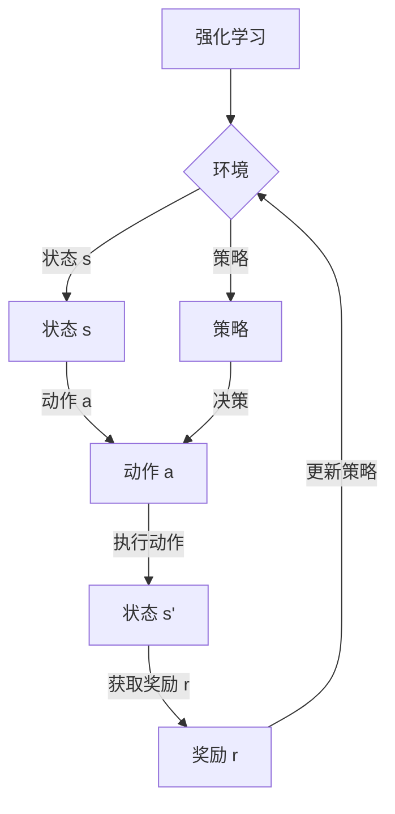

                 


### 第一部分：强化学习基础

#### 1. 强化学习概述

##### 1.1 强化学习基本概念

强化学习（Reinforcement Learning，简称RL）是一种机器学习方法，它通过奖励和惩罚信号来训练智能体（agent）如何做出最优决策。与监督学习和无监督学习不同，强化学习不依赖于预先标记好的数据集，而是通过互动环境来学习。

在强化学习框架中，智能体在一个环境中进行一系列的动作，以获取即时奖励。智能体需要通过不断试错来学习最优策略，以最大化长期回报。这个过程类似于人类通过经验学习如何做某件事。

强化学习的核心概念包括：

- **状态（State）**：智能体在环境中的当前情况。
- **动作（Action）**：智能体可以执行的行为。
- **奖励（Reward）**：智能体执行某个动作后获得的即时奖励或惩罚。
- **策略（Policy）**：智能体根据当前状态选择动作的策略。
- **价值函数（Value Function）**：衡量智能体在特定状态下执行最佳动作所能获得的预期回报。
- **模型（Model）**：智能体对环境状态转移概率和奖励的预测。

##### 1.2 强化学习与监督学习、无监督学习的区别

强化学习与其他两种常见的机器学习方法——监督学习和无监督学习有以下区别：

- **监督学习（Supervised Learning）**：监督学习使用已标记的数据集进行训练，目标是预测给定输入的标签。例如，在图像分类任务中，每个图像都有对应的标签（如猫或狗）。智能体在监督学习中被提供输入和输出，从而学习一个映射函数。

- **无监督学习（Unsupervised Learning）**：无监督学习不使用标记数据，而是通过发现数据中的隐含结构来训练模型。例如，在聚类任务中，智能体将数据点分组，以发现数据中的自然结构。

- **强化学习**：强化学习使用互动方式学习，智能体通过与环境交互来学习最优策略。智能体根据奖励信号来调整其行为，以最大化长期回报。

##### 1.3 强化学习的主要问题与挑战

强化学习虽然具有很多优点，但在实际应用中仍然面临一些挑战：

- **奖励工程（Reward Engineering）**：设计合适的奖励函数是强化学习成功的关键。奖励函数需要能够正确引导智能体的行为，但往往很难设计。

- **探索与利用（Exploration vs. Exploitation）**：智能体需要在探索新策略和利用已有策略之间做出平衡。完全探索会导致智能体错过已知的最优策略，而完全利用会导致智能体无法学习新的策略。

- **收敛性与稳定性（Convergence and Stability）**：强化学习算法需要保证收敛性和稳定性，以确保智能体能够在长时间内学习到最优策略。

- **计算复杂度（Computational Complexity）**：强化学习通常涉及大量的迭代和试错过程，计算复杂度可能很高，特别是对于高维状态空间和动作空间。

- **稀疏奖励（Sparse Rewards）**：在许多实际应用中，奖励信号非常稀疏，即智能体在很长时间内可能只收到少量的奖励。这会导致学习过程变得非常缓慢。

#### 2. 强化学习算法介绍

##### 2.1 Q-Learning算法原理

Q-Learning是一种值迭代算法，它通过迭代更新Q值来学习最优策略。Q值表示在特定状态下执行特定动作的预期回报。

Q-Learning算法的核心思想是通过更新公式来更新Q值：

$$
Q(s, a) = Q(s, a) + \alpha [r + \gamma \max(Q(s', a')) - Q(s, a)]
$$

其中，\( \alpha \) 是学习率，\( r \) 是即时奖励，\( \gamma \) 是折扣因子，\( s' \) 是执行动作后的新状态。

伪代码如下：

```
for episode in 1 to max_episodes do:
    s = 环境初始化()
    while 环境未终止 do:
        a = 选择动作(s)
        s' = 环境执行动作(a)
        r = 环境回报
        Q(s, a) = Q(s, a) + alpha * (r + gamma * max(Q(s', a')) - Q(s, a))
        s = s'
```

##### 2.2 SARSA算法原理

SARSA（同步策略自适应资源搜索算法）是Q-Learning的一个变体，它同时更新当前状态和下一个状态的Q值。

SARSA的更新公式如下：

$$
Q(s, a) = Q(s, a) + \alpha [r + \gamma Q(s', a')]
$$

伪代码如下：

```
for episode in 1 to max_episodes do:
    s = 环境初始化()
    while 环境未终止 do:
        a = 选择动作(s)
        s' = 环境执行动作(a)
        r = 环境回报
        Q(s, a) = Q(s, a) + alpha * (r + gamma * Q(s', a'))
        s = s'
```

##### 2.3 Deep Q-Networks (DQN)算法原理

DQN（深度Q网络）是利用深度神经网络来近似Q值函数的一种强化学习算法。DQN通过经验回放和目标网络来克服Q值估计的偏差和不确定性。

DQN的核心思想是：

1. 使用深度神经网络来表示Q值函数：\( Q(s, a) = f_\theta(s, a) \)，其中 \( f_\theta \) 是深度神经网络。

2. 通过经验回放（Experience Replay）来避免数据样本的偏差，提高算法的稳定性。

3. 使用目标网络（Target Network）来减少Q值估计的误差。

DQN的更新公式如下：

$$
Q(s, a) = Q(s, a) + \alpha [r + \gamma Q(s', a') - Q(s, a)]
$$

其中，\( Q(s', a') \) 是从目标网络中获取的Q值。

伪代码如下：

```
初始化 Q网络 和 目标网络
for episode in 1 to max_episodes do:
    s = 环境初始化()
    while 环境未终止 do:
        a = 选择动作(s)
        s' = 环境执行动作(a)
        r = 环境回报
        target = r + gamma * max(Q_target(s', a'))
        Q(s, a) = Q(s, a) + alpha * (r + gamma * max(Q_target(s', a')) - Q(s, a))
        如果 需要更新目标网络 then:
            更新目标网络
```

##### 2.4 Policy Gradient算法原理

Policy Gradient算法是一种基于策略的强化学习算法，它直接优化策略函数，以最大化预期回报。

Policy Gradient算法的核心思想是：

1. 定义策略函数 \( \pi(a|s; \theta) \)，表示在状态 \( s \) 下选择动作 \( a \) 的概率。

2. 计算策略梯度 \( \nabla_\theta J(\theta) \)，其中 \( J(\theta) \) 是策略的预期回报。

3. 使用梯度上升法来更新策略参数。

Policy Gradient的更新公式如下：

$$
\theta = \theta + \alpha \nabla_\theta J(\theta)
$$

其中，\( \alpha \) 是学习率。

伪代码如下：

```
初始化策略参数 \theta
for episode in 1 to max_episodes do:
    s = 环境初始化()
    a(s) = 策略(\theta)(s)
    while 环境未终止 do:
        s' = 环境执行动作(a(s))
        r = 环境回报
        gradients = 计算策略梯度(\theta)
        \theta = \theta + alpha * gradients
```

#### 3. 强化学习在投资组合管理中的适用性

##### 3.1 投资组合管理概述

投资组合管理是指根据投资者的风险偏好和收益目标，对多种资产进行配置，以实现最优的风险回报平衡。投资组合管理涉及以下几个关键方面：

- **资产配置（Asset Allocation）**：根据投资目标和风险偏好，将投资资金分配到不同的资产类别，如股票、债券、房地产等。

- **风险管理（Risk Management）**：识别、评估和控制投资组合中的风险，包括市场风险、信用风险、流动性风险等。

- **优化策略（Optimization Strategies）**：通过数学优化方法，寻找最佳的投资组合权重，以实现特定的收益目标。

- **交易策略（Trading Strategies）**：根据市场行情和投资组合的实时表现，制定买入、持有或卖出的策略。

##### 3.2 强化学习在投资组合管理中的潜在优势

强化学习在投资组合管理中具有以下潜在优势：

- **自适应能力**：强化学习能够根据市场变化和环境反馈，自适应调整投资策略，以适应不断变化的市场条件。

- **全局优化**：强化学习通过最大化长期回报，能够实现全局优化，而不仅仅是局部最优。

- **复杂环境建模**：强化学习能够处理高维状态空间和动作空间，能够模拟投资组合管理的复杂环境。

- **动态调整**：强化学习能够实时调整投资组合的权重，以应对市场波动和风险变化。

##### 3.3 强化学习在投资组合管理中的局限性

尽管强化学习在投资组合管理中具有很多优势，但它也面临一些局限性：

- **计算成本**：强化学习算法需要大量的计算资源，特别是在高维状态空间和动作空间中。

- **奖励工程**：设计合适的奖励函数对于强化学习的成功至关重要，但往往很难实现。

- **数据需求**：强化学习需要大量的历史数据来进行训练，但在实际应用中，获取足够的历史数据可能比较困难。

- **学习时间**：强化学习算法需要较长的学习时间来收敛到最优策略，这在某些实时应用场景中可能不适用。

### 总结

本节对强化学习的基本概念、算法原理以及在投资组合管理中的适用性进行了介绍。强化学习通过不断探索和试错，能够自适应调整投资策略，以实现最优的风险回报平衡。然而，强化学习在投资组合管理中也面临一些挑战，如计算成本、奖励工程和学习时间等。在接下来的部分，我们将深入探讨强化学习在智能投资组合管理中的具体应用。

### 第二部分：智能投资组合管理

#### 4. 智能投资组合管理的基本概念

##### 4.1 投资组合目标设定

投资组合管理首先需要明确投资组合的目标。投资目标通常包括以下几个方面：

- **收益目标**：投资者希望实现的投资回报水平。收益目标可以是一个具体的数值，也可以是一个相对指标，如超过市场平均水平。
- **风险偏好**：投资者对风险的承受程度。风险偏好可以分为保守型、中庸型和激进型，不同的风险偏好会影响投资策略的选择。
- **投资期限**：投资者计划持有投资组合的时间长度。投资期限会影响投资策略的制定，如短期交易策略与长期投资策略的差异。
- **流动性需求**：投资者对资金流动性的要求。流动性需求高的投资者可能更倾向于选择流动性好的资产，如股票和债券。

投资目标的设定需要综合考虑投资者的个人情况、市场环境和投资策略，以确保投资组合的收益与风险达到平衡。

##### 4.2 投资组合资产配置策略

资产配置是指将投资资金分配到不同的资产类别，以达到投资目标。常见的资产配置策略包括：

- **战略性资产配置（Strategic Asset Allocation）**：根据长期投资目标和风险偏好，设定不同资产类别的权重，并在长期内维持这种配置。战略性资产配置通常考虑市场的长期趋势和投资者的风险偏好。
- **战术性资产配置（Tactical Asset Allocation）**：根据市场短期波动和机会，对资产配置进行动态调整。战术性资产配置需要投资者具备较强的市场分析和决策能力。
- **生命周期资产配置（Life Cycle Asset Allocation）**：根据投资者的年龄、预期退休时间等生命周期因素，动态调整资产配置。生命周期资产配置通常从保守型逐渐转向激进型，以适应投资者不同阶段的财务需求。

在制定资产配置策略时，投资者需要考虑资产之间的相关性、历史表现和预期收益，以确保投资组合的多样性和风险分散。

##### 4.3 风险管理与优化

风险管理与优化是投资组合管理的重要环节。有效的风险管理可以降低投资组合的波动性和潜在损失，优化策略则可以进一步提高投资组合的收益。

- **风险度量**：风险度量方法包括波动率、方差、值-at-Risk（VaR）等，用于评估投资组合的波动性和潜在风险。投资者可以根据风险度量结果，调整资产配置和交易策略。
- **风险优化**：风险优化方法包括线性规划、非线性规划、遗传算法等，用于寻找在给定风险水平下的最优投资组合。风险优化可以最大化投资组合的预期收益，或在特定收益水平下最小化风险。
- **情景分析**：情景分析是一种评估投资组合在不同市场情景下表现的方法。通过模拟不同的市场情景，投资者可以评估投资组合的风险和收益，并制定相应的风险管理策略。

在风险管理与优化过程中，投资者需要关注市场动态、经济指标和行业趋势，以及时调整投资策略。

#### 5. 强化学习在资产配置中的应用

强化学习在资产配置中的应用主要体现在以下几个方面：

- **动态调整资产权重**：强化学习算法可以根据市场环境的变化，动态调整投资组合中不同资产的权重。例如，当市场处于上涨趋势时，可以增加股票的权重，以抓住更多的增长机会；当市场处于下跌趋势时，可以增加债券的权重，以降低投资组合的风险。
- **优化资产选择**：强化学习算法可以通过学习历史市场数据，识别出表现优异的资产，并将其纳入投资组合。例如，通过分析过去几年的市场数据，强化学习算法可以发现某些行业或资产类别具有较高的长期回报潜力，从而优化投资组合的资产选择。
- **适应不同投资策略**：强化学习算法可以根据投资者的风险偏好和收益目标，制定个性化的资产配置策略。例如，对于保守型投资者，强化学习算法可能会更倾向于选择低风险的债券和现金等资产；对于激进型投资者，强化学习算法可能会更倾向于选择高风险的股票和衍生品等资产。

强化学习在资产配置中的应用，为投资者提供了一种动态、自适应的投资策略，有助于提高投资组合的收益和风险平衡。

#### 5.1 基于强化学习的资产选择

强化学习在资产选择中的应用主要是通过评估不同资产的预期回报和风险，来动态调整投资组合的资产配置。以下是具体应用步骤：

1. **状态表示**：首先，需要定义状态表示，以捕捉投资组合的关键特征。状态可能包括市场指数的变动、行业指数的变动、资产的历史价格和交易量等。例如，状态 \( s \) 可以表示为：

   $$ s = [I, H, P, V] $$

   其中，\( I \) 表示市场指数，\( H \) 表示行业指数，\( P \) 表示资产价格，\( V \) 表示交易量。

2. **动作表示**：接下来，需要定义动作表示，即投资组合中不同资产的选择。动作 \( a \) 可以表示为对特定资产的权重调整。例如，如果投资组合包括股票、债券和现金，动作 \( a \) 可以表示为：

   $$ a = [w_{stock}, w_{bond}, w_{cash}] $$

   其中，\( w_{stock} \)、\( w_{bond} \) 和 \( w_{cash} \) 分别表示股票、债券和现金的权重。

3. **奖励函数设计**：奖励函数是强化学习算法中的关键部分，它决定了算法的行为。在资产选择中，奖励函数应该能够度量投资组合的收益和风险。一个简单的奖励函数可以定义为：

   $$ r = \frac{1}{N} \sum_{i=1}^{N} \log(\frac{P_{i,t+1}}{P_{i,t}}) - \lambda \cdot \frac{\sum_{i=1}^{N} \sigma_i^2}{N} $$

   其中，\( P_{i,t} \) 表示资产 \( i \) 在时间 \( t \) 的价格，\( N \) 表示资产的数量，\( \sigma_i^2 \) 表示资产 \( i \) 的价格波动性，\( \lambda \) 是风险规避系数。

4. **策略学习**：使用强化学习算法（如Q-Learning或DQN）来学习最优策略。算法将根据状态和奖励信号，不断调整资产权重，以最大化长期回报。

5. **投资组合调整**：根据学习到的策略，定期调整投资组合的资产权重，以实现最优的投资组合。

通过基于强化学习的资产选择，投资者可以在动态变化的市场环境中，实现资产配置的优化，提高投资组合的收益和风险平衡。

#### 5.2 强化学习在资产权重优化中的应用

强化学习在资产权重优化中的应用主要体现在动态调整投资组合的权重，以最大化长期回报。以下是具体应用步骤：

1. **状态表示**：定义状态表示，以捕捉投资组合的关键特征。状态可能包括市场指数、行业指数、资产的历史价格和交易量等。例如，状态 \( s \) 可以表示为：

   $$ s = [I, H, P, V] $$

   其中，\( I \) 表示市场指数，\( H \) 表示行业指数，\( P \) 表示资产价格，\( V \) 表示交易量。

2. **动作表示**：定义动作表示，即投资组合中不同资产的权重调整。动作 \( a \) 可以表示为对特定资产的权重调整。例如，如果投资组合包括股票、债券和现金，动作 \( a \) 可以表示为：

   $$ a = [w_{stock}, w_{bond}, w_{cash}] $$

   其中，\( w_{stock} \)、\( w_{bond} \) 和 \( w_{cash} \) 分别表示股票、债券和现金的权重。

3. **奖励函数设计**：奖励函数是强化学习算法中的关键部分，它决定了算法的行为。在资产权重优化中，奖励函数应该能够度量投资组合的收益和风险。一个简单的奖励函数可以定义为：

   $$ r = \frac{1}{N} \sum_{i=1}^{N} \log(\frac{P_{i,t+1}}{P_{i,t}}) - \lambda \cdot \frac{\sum_{i=1}^{N} \sigma_i^2}{N} $$

   其中，\( P_{i,t} \) 表示资产 \( i \) 在时间 \( t \) 的价格，\( N \) 表示资产的数量，\( \sigma_i^2 \) 表示资产 \( i \) 的价格波动性，\( \lambda \) 是风险规避系数。

4. **策略学习**：使用强化学习算法（如Q-Learning或DQN）来学习最优策略。算法将根据状态和奖励信号，不断调整资产权重，以最大化长期回报。

5. **投资组合调整**：根据学习到的策略，定期调整投资组合的资产权重，以实现最优的投资组合。

6. **风险控制**：在调整资产权重的同时，需要考虑风险控制。例如，可以设定一个风险预算，确保投资组合的总风险不超过某个阈值。

通过基于强化学习的资产权重优化，投资者可以在动态变化的市场环境中，实现资产配置的优化，提高投资组合的收益和风险平衡。

#### 5.3 强化学习在动态资产配置中的应用

强化学习在动态资产配置中的应用，主要体现在通过学习环境中的状态转移概率和奖励信号，动态调整投资组合的资产配置。以下是具体应用步骤：

1. **状态表示**：首先，需要定义状态表示，以捕捉投资组合的关键特征。状态可能包括市场指数、行业指数、资产的历史价格和交易量等。例如，状态 \( s \) 可以表示为：

   $$ s = [I, H, P, V] $$

   其中，\( I \) 表示市场指数，\( H \) 表示行业指数，\( P \) 表示资产价格，\( V \) 表示交易量。

2. **动作表示**：接下来，需要定义动作表示，即投资组合中不同资产的权重调整。动作 \( a \) 可以表示为对特定资产的权重调整。例如，如果投资组合包括股票、债券和现金，动作 \( a \) 可以表示为：

   $$ a = [w_{stock}, w_{bond}, w_{cash}] $$

   其中，\( w_{stock} \)、\( w_{bond} \) 和 \( w_{cash} \) 分别表示股票、债券和现金的权重。

3. **奖励函数设计**：奖励函数是强化学习算法中的关键部分，它决定了算法的行为。在动态资产配置中，奖励函数应该能够度量投资组合的收益和风险。一个简单的奖励函数可以定义为：

   $$ r = \frac{1}{N} \sum_{i=1}^{N} \log(\frac{P_{i,t+1}}{P_{i,t}}) - \lambda \cdot \frac{\sum_{i=1}^{N} \sigma_i^2}{N} $$

   其中，\( P_{i,t} \) 表示资产 \( i \) 在时间 \( t \) 的价格，\( N \) 表示资产的数量，\( \sigma_i^2 \) 表示资产 \( i \) 的价格波动性，\( \lambda \) 是风险规避系数。

4. **策略学习**：使用强化学习算法（如Q-Learning或DQN）来学习最优策略。算法将根据状态和奖励信号，不断调整资产权重，以最大化长期回报。

5. **投资组合调整**：根据学习到的策略，定期调整投资组合的资产权重，以实现最优的投资组合。调整频率可以根据市场波动性和投资目标来确定，如每日、每周或每月。

6. **动态调整**：强化学习算法能够根据市场环境的变化，动态调整投资组合的资产配置。例如，当市场处于上涨趋势时，可以增加股票的权重；当市场处于下跌趋势时，可以增加债券的权重。

7. **风险控制**：在动态调整资产配置的同时，需要考虑风险控制。例如，可以设定一个风险预算，确保投资组合的总风险不超过某个阈值。

通过基于强化学习的动态资产配置，投资者能够在不断变化的市场环境中，实现资产配置的优化，提高投资组合的收益和风险平衡。

#### 5.4 强化学习在投资组合优化中的潜在优势

强化学习在投资组合优化中具有以下潜在优势：

- **自适应调整**：强化学习算法能够根据市场环境的变化，动态调整投资组合的权重，实现自适应调整。这使得投资组合能够更好地适应市场波动，提高收益。

- **全局优化**：强化学习通过最大化长期回报，能够实现全局优化，而不仅仅是局部最优。这有助于投资组合实现更优的风险回报平衡。

- **复杂环境建模**：强化学习能够处理高维状态空间和动作空间，能够模拟投资组合管理的复杂环境。这有助于识别出潜在的投资机会和风险。

- **数据驱动**：强化学习通过学习历史市场数据，能够识别出市场趋势和模式，从而优化投资组合。

- **多样化策略**：强化学习可以根据不同的风险偏好和收益目标，制定个性化的投资策略，实现多样化投资。

- **实时调整**：强化学习算法能够实时调整投资组合，以应对市场波动和突发事件，提高投资组合的灵活性和适应性。

- **风险管理**：强化学习可以通过奖励函数和风险规避系数，实现对投资组合的风险控制，降低潜在风险。

通过强化学习的投资组合优化，投资者可以在动态变化的市场环境中，实现更优的风险回报平衡，提高投资组合的整体收益。

#### 5.5 强化学习在投资组合优化中的局限性

尽管强化学习在投资组合优化中具有很多优势，但它也面临一些局限性：

- **计算成本**：强化学习算法通常需要大量的计算资源，特别是在高维状态空间和动作空间中。这可能导致算法在实时应用中计算效率低下。

- **数据需求**：强化学习需要大量的历史数据来进行训练，但在实际应用中，获取足够的历史数据可能比较困难。数据不足可能导致算法性能下降。

- **奖励设计**：奖励函数是强化学习算法中的关键部分，但设计合适的奖励函数往往很难。如果奖励函数设计不当，可能导致算法无法学习到最优策略。

- **收敛性**：强化学习算法需要保证收敛性，以确保智能体能够在长时间内学习到最优策略。在某些情况下，算法可能无法收敛到最优状态。

- **稀疏奖励**：在许多实际应用中，奖励信号非常稀疏，即智能体在很长时间内可能只收到少量的奖励。这可能导致学习过程变得非常缓慢。

- **复杂度**：强化学习算法的计算复杂度可能很高，特别是在处理高维状态空间和动作空间时。这可能导致算法在实际应用中难以部署。

通过了解强化学习在投资组合优化中的局限性，投资者可以更全面地评估算法的适用性，并采取相应的措施来优化算法性能。

#### 6. 强化学习在风险控制中的应用

##### 6.1 强化学习在风险度量中的应用

强化学习在风险度量中的应用主要体现在通过学习环境中的状态转移概率和奖励信号，动态评估投资组合的风险水平。以下是具体应用步骤：

1. **状态表示**：定义状态表示，以捕捉投资组合的关键特征。状态可能包括市场指数、行业指数、资产的历史价格和交易量等。例如，状态 \( s \) 可以表示为：

   $$ s = [I, H, P, V] $$

   其中，\( I \) 表示市场指数，\( H \) 表示行业指数，\( P \) 表示资产价格，\( V \) 表示交易量。

2. **动作表示**：定义动作表示，即投资组合中不同资产的权重调整。动作 \( a \) 可以表示为对特定资产的权重调整。例如，如果投资组合包括股票、债券和现金，动作 \( a \) 可以表示为：

   $$ a = [w_{stock}, w_{bond}, w_{cash}] $$

   其中，\( w_{stock} \)、\( w_{bond} \) 和 \( w_{cash} \) 分别表示股票、债券和现金的权重。

3. **风险度量模型**：设计一个基于强化学习的风险度量模型，该模型能够根据状态和动作，预测投资组合的潜在风险。一个简单的风险度量模型可以定义为：

   $$ Risk(s, a) = \frac{1}{N} \sum_{i=1}^{N} \sigma_i^2(a) $$

   其中，\( \sigma_i^2(a) \) 表示资产 \( i \) 在特定动作 \( a \) 下的价格波动性。

4. **策略学习**：使用强化学习算法（如Q-Learning或DQN）来学习最优风险度量策略。算法将根据状态和奖励信号，不断调整风险度量模型，以最大化长期回报。

5. **风险评估**：根据学习到的策略，定期评估投资组合的风险水平。风险评估可以帮助投资者了解投资组合的潜在风险，并采取相应的风险控制措施。

6. **动态调整**：强化学习算法能够根据市场环境的变化，动态调整风险度量模型，以实现更准确的风险评估。例如，当市场处于波动期时，可以增加风险度量模型的敏感度。

通过基于强化学习的风险度量，投资者可以更全面地了解投资组合的风险水平，从而制定更有效的风险控制策略。

##### 6.2 强化学习在风险优化中的应用

强化学习在风险优化中的应用主要体现在通过学习环境中的状态转移概率和奖励信号，动态优化投资组合的风险水平。以下是具体应用步骤：

1. **状态表示**：定义状态表示，以捕捉投资组合的关键特征。状态可能包括市场指数、行业指数、资产的历史价格和交易量等。例如，状态 \( s \) 可以表示为：

   $$ s = [I, H, P, V] $$

   其中，\( I \) 表示市场指数，\( H \) 表示行业指数，\( P \) 表示资产价格，\( V \) 表示交易量。

2. **动作表示**：定义动作表示，即投资组合中不同资产的权重调整。动作 \( a \) 可以表示为对特定资产的权重调整。例如，如果投资组合包括股票、债券和现金，动作 \( a \) 可以表示为：

   $$ a = [w_{stock}, w_{bond}, w_{cash}] $$

   其中，\( w_{stock} \)、\( w_{bond} \) 和 \( w_{cash} \) 分别表示股票、债券和现金的权重。

3. **风险目标**：明确投资组合的风险目标，例如设定一个最大波动率或最大回撤水平。风险目标可以帮助算法在优化过程中保持风险控制。

4. **奖励函数设计**：设计一个基于强化学习的奖励函数，以最大化长期回报同时控制风险。一个简单的奖励函数可以定义为：

   $$ r = \frac{1}{N} \sum_{i=1}^{N} \log(\frac{P_{i,t+1}}{P_{i,t}}) - \lambda \cdot \frac{Risk(s, a)}{N} $$

   其中，\( P_{i,t} \) 表示资产 \( i \) 在时间 \( t \) 的价格，\( Risk(s, a) \) 表示投资组合在特定动作 \( a \) 下的风险水平，\( \lambda \) 是风险规避系数。

5. **策略学习**：使用强化学习算法（如Q-Learning或DQN）来学习最优风险优化策略。算法将根据状态和奖励信号，不断调整资产权重，以实现风险和收益的最优平衡。

6. **风险优化**：根据学习到的策略，定期优化投资组合的资产权重，以实现最优的风险控制。优化频率可以根据市场波动性和投资目标来确定，如每日、每周或每月。

7. **动态调整**：强化学习算法能够根据市场环境的变化，动态调整风险优化策略，以应对不同的市场条件。

通过基于强化学习的风险优化，投资者可以在动态变化的市场环境中，实现投资组合的风险控制，提高投资组合的整体稳定性。

##### 6.3 强化学习在风险预警中的应用

强化学习在风险预警中的应用主要体现在通过学习环境中的状态转移概率和奖励信号，提前识别潜在的风险，并发出预警信号。以下是具体应用步骤：

1. **状态表示**：定义状态表示，以捕捉投资组合的关键特征。状态可能包括市场指数、行业指数、资产的历史价格和交易量等。例如，状态 \( s \) 可以表示为：

   $$ s = [I, H, P, V] $$

   其中，\( I \) 表示市场指数，\( H \) 表示行业指数，\( P \) 表示资产价格，\( V \) 表示交易量。

2. **动作表示**：定义动作表示，即投资组合中不同资产的权重调整。动作 \( a \) 可以表示为对特定资产的权重调整。例如，如果投资组合包括股票、债券和现金，动作 \( a \) 可以表示为：

   $$ a = [w_{stock}, w_{bond}, w_{cash}] $$

   其中，\( w_{stock} \)、\( w_{bond} \) 和 \( w_{cash} \) 分别表示股票、债券和现金的权重。

3. **风险预警指标**：设计一个基于强化学习的风险预警指标，以识别潜在的风险。一个简单的风险预警指标可以定义为：

   $$ Warning(s, a) = \frac{1}{N} \sum_{i=1}^{N} \sigma_i^2(a) - \gamma \cdot Risk(s, a) $$

   其中，\( \sigma_i^2(a) \) 表示资产 \( i \) 在特定动作 \( a \) 下的价格波动性，\( Risk(s, a) \) 表示投资组合在特定动作 \( a \) 下的风险水平，\( \gamma \) 是预警灵敏度系数。

4. **奖励函数设计**：设计一个基于强化学习的奖励函数，以最大化提前识别潜在风险的能力。一个简单的奖励函数可以定义为：

   $$ r = Warning(s, a) $$

   其中，\( Warning(s, a) \) 表示投资组合在特定动作 \( a \) 下的风险预警信号。

5. **策略学习**：使用强化学习算法（如Q-Learning或DQN）来学习最优风险预警策略。算法将根据状态和奖励信号，不断调整风险预警指标，以提高预警准确性。

6. **风险预警**：根据学习到的策略，定期监测投资组合的风险水平，并发出预警信号。当预警指标超过某个阈值时，系统将发出预警信号，提醒投资者采取相应的风险控制措施。

7. **动态调整**：强化学习算法能够根据市场环境的变化，动态调整风险预警策略，以适应不同的市场条件。

通过基于强化学习的风险预警，投资者可以提前识别潜在的风险，采取及时的风险控制措施，降低潜在损失。

#### 6.4 强化学习在风险控制中的潜在优势

强化学习在风险控制中具有以下潜在优势：

- **自适应能力**：强化学习能够根据市场环境的变化，动态调整风险控制策略，提高风险预测的准确性。

- **实时监控**：强化学习可以在实时环境中进行训练和监控，及时发现潜在风险，并发出预警信号。

- **多维数据融合**：强化学习能够处理多维数据，如市场指数、行业指数、资产价格等，综合评估风险水平。

- **优化风险指标**：通过学习到的策略，强化学习可以优化风险控制指标，提高风险预测的准确性和及时性。

- **模型可解释性**：强化学习算法的学习过程和决策机制相对透明，有助于投资者理解风险控制策略的原理。

- **多样化策略**：强化学习可以根据不同的风险偏好和投资目标，制定个性化的风险控制策略。

- **风险预防**：通过提前识别潜在风险，强化学习可以帮助投资者采取预防措施，降低潜在损失。

#### 6.5 强化学习在风险控制中的局限性

尽管强化学习在风险控制中具有很多优势，但它也面临一些局限性：

- **计算成本**：强化学习算法通常需要大量的计算资源，特别是在高维状态空间和动作空间中。这可能导致算法在实时应用中计算效率低下。

- **数据需求**：强化学习需要大量的历史数据来进行训练，但在实际应用中，获取足够的历史数据可能比较困难。数据不足可能导致算法性能下降。

- **奖励设计**：奖励函数是强化学习算法中的关键部分，但设计合适的奖励函数往往很难。如果奖励函数设计不当，可能导致算法无法学习到最优策略。

- **收敛性**：强化学习算法需要保证收敛性，以确保智能体能够在长时间内学习到最优策略。在某些情况下，算法可能无法收敛到最优状态。

- **稀疏奖励**：在许多实际应用中，奖励信号非常稀疏，即智能体在很长时间内可能只收到少量的奖励。这可能导致学习过程变得非常缓慢。

- **复杂度**：强化学习算法的计算复杂度可能很高，特别是在处理高维状态空间和动作空间时。这可能导致算法在实际应用中难以部署。

通过了解强化学习在风险控制中的局限性，投资者可以更全面地评估算法的适用性，并采取相应的措施来优化算法性能。

#### 7. 强化学习在投资组合策略优化中的应用

##### 7.1 强化学习在投资组合交易策略优化中的应用

强化学习在投资组合交易策略优化中的应用，主要通过学习市场状态与交易策略之间的关系，以最大化长期收益。以下是具体应用步骤：

1. **状态表示**：定义状态表示，以捕捉市场环境的关键特征。状态可能包括市场指数、行业指数、资产价格、交易量等。例如，状态 \( s \) 可以表示为：

   $$ s = [I, H, P, V] $$

   其中，\( I \) 表示市场指数，\( H \) 表示行业指数，\( P \) 表示资产价格，\( V \) 表示交易量。

2. **动作表示**：定义动作表示，即交易策略的选择。动作 \( a \) 可以表示为对特定资产的交易决策，如买入、持有或卖出。例如，如果投资组合包括股票、债券和现金，动作 \( a \) 可以表示为：

   $$ a = [buy_{stock}, hold_{stock}, sell_{stock}] $$

   其中，\( buy_{stock} \)、\( hold_{stock} \) 和 \( sell_{stock} \) 分别表示买入股票、持有股票和卖出股票。

3. **奖励函数设计**：设计一个基于强化学习的奖励函数，以最大化长期收益同时考虑风险控制。一个简单的奖励函数可以定义为：

   $$ r = \frac{1}{N} \sum_{i=1}^{N} \log(\frac{P_{i,t+1}}{P_{i,t}}) - \lambda \cdot \frac{\sum_{i=1}^{N} \sigma_i^2}{N} $$

   其中，\( P_{i,t} \) 表示资产 \( i \) 在时间 \( t \) 的价格，\( \sigma_i^2 \) 表示资产 \( i \) 的价格波动性，\( \lambda \) 是风险规避系数。

4. **策略学习**：使用强化学习算法（如Q-Learning或DQN）来学习最优交易策略。算法将根据状态和奖励信号，不断调整交易策略，以最大化长期收益。

5. **交易策略调整**：根据学习到的策略，定期调整交易策略。交易策略的调整频率可以根据市场波动性和投资目标来确定，如每日、每周或每月。

6. **风险控制**：在交易策略调整过程中，需要考虑风险控制。例如，可以设定一个风险预算，确保投资组合的总风险不超过某个阈值。

7. **动态调整**：强化学习算法能够根据市场环境的变化，动态调整交易策略，以适应不同的市场条件。

通过基于强化学习的交易策略优化，投资者可以在动态变化的市场环境中，实现交易策略的优化，提高投资组合的收益和风险平衡。

##### 7.2 强化学习在投资组合调仓策略优化中的应用

强化学习在投资组合调仓策略优化中的应用，主要体现在通过学习市场状态与调仓策略之间的关系，以最大化长期收益。以下是具体应用步骤：

1. **状态表示**：定义状态表示，以捕捉市场环境的关键特征。状态可能包括市场指数、行业指数、资产价格、交易量等。例如，状态 \( s \) 可以表示为：

   $$ s = [I, H, P, V] $$

   其中，\( I \) 表示市场指数，\( H \) 表示行业指数，\( P \) 表示资产价格，\( V \) 表示交易量。

2. **动作表示**：定义动作表示，即调仓策略的选择。动作 \( a \) 可以表示为对投资组合中不同资产的权重调整。例如，如果投资组合包括股票、债券和现金，动作 \( a \) 可以表示为：

   $$ a = [w_{stock}, w_{bond}, w_{cash}] $$

   其中，\( w_{stock} \)、\( w_{bond} \) 和 \( w_{cash} \) 分别表示股票、债券和现金的权重。

3. **奖励函数设计**：设计一个基于强化学习的奖励函数，以最大化长期收益同时考虑风险控制。一个简单的奖励函数可以定义为：

   $$ r = \frac{1}{N} \sum_{i=1}^{N} \log(\frac{P_{i,t+1}}{P_{i,t}}) - \lambda \cdot \frac{\sum_{i=1}^{N} \sigma_i^2}{N} $$

   其中，\( P_{i,t} \) 表示资产 \( i \) 在时间 \( t \) 的价格，\( \sigma_i^2 \) 表示资产 \( i \) 的价格波动性，\( \lambda \) 是风险规避系数。

4. **策略学习**：使用强化学习算法（如Q-Learning或DQN）来学习最优调仓策略。算法将根据状态和奖励信号，不断调整调仓策略，以最大化长期收益。

5. **调仓策略调整**：根据学习到的策略，定期调整投资组合的权重。调仓策略的调整频率可以根据市场波动性和投资目标来确定，如每日、每周或每月。

6. **风险控制**：在调仓策略调整过程中，需要考虑风险控制。例如，可以设定一个风险预算，确保投资组合的总风险不超过某个阈值。

7. **动态调整**：强化学习算法能够根据市场环境的变化，动态调整调仓策略，以适应不同的市场条件。

通过基于强化学习的调仓策略优化，投资者可以在动态变化的市场环境中，实现调仓策略的优化，提高投资组合的收益和风险平衡。

##### 7.3 强化学习在投资组合组合优化中的应用

强化学习在投资组合组合优化中的应用，主要体现在通过学习市场状态与投资组合组合之间的关系，以最大化长期收益。以下是具体应用步骤：

1. **状态表示**：定义状态表示，以捕捉市场环境的关键特征。状态可能包括市场指数、行业指数、资产价格、交易量等。例如，状态 \( s \) 可以表示为：

   $$ s = [I, H, P, V] $$

   其中，\( I \) 表示市场指数，\( H \) 表示行业指数，\( P \) 表示资产价格，\( V \) 表示交易量。

2. **动作表示**：定义动作表示，即投资组合组合的选择。动作 \( a \) 可以表示为对特定资产组合的选择。例如，如果投资组合包括股票、债券和现金，动作 \( a \) 可以表示为：

   $$ a = [stock_{组合}, bond_{组合}, cash_{组合}] $$

   其中，\( stock_{组合} \)、\( bond_{组合} \) 和 \( cash_{组合} \) 分别表示股票组合、债券组合和现金组合。

3. **奖励函数设计**：设计一个基于强化学习的奖励函数，以最大化长期收益同时考虑风险控制。一个简单的奖励函数可以定义为：

   $$ r = \frac{1}{N} \sum_{i=1}^{N} \log(\frac{P_{i,t+1}}{P_{i,t}}) - \lambda \cdot \frac{\sum_{i=1}^{N} \sigma_i^2}{N} $$

   其中，\( P_{i,t} \) 表示资产 \( i \) 在时间 \( t \) 的价格，\( \sigma_i^2 \) 表示资产 \( i \) 的价格波动性，\( \lambda \) 是风险规避系数。

4. **策略学习**：使用强化学习算法（如Q-Learning或DQN）来学习最优组合策略。算法将根据状态和奖励信号，不断调整组合策略，以最大化长期收益。

5. **组合策略调整**：根据学习到的策略，定期调整投资组合的组合策略。组合策略的调整频率可以根据市场波动性和投资目标来确定，如每日、每周或每月。

6. **风险控制**：在组合策略调整过程中，需要考虑风险控制。例如，可以设定一个风险预算，确保投资组合的总风险不超过某个阈值。

7. **动态调整**：强化学习算法能够根据市场环境的变化，动态调整组合策略，以适应不同的市场条件。

通过基于强化学习的投资组合组合优化，投资者可以在动态变化的市场环境中，实现投资组合组合的优化，提高投资组合的收益和风险平衡。

#### 7.4 强化学习在投资组合策略优化中的潜在优势

强化学习在投资组合策略优化中具有以下潜在优势：

- **自适应调整**：强化学习能够根据市场环境的变化，动态调整投资策略，以最大化长期收益。
- **全局优化**：强化学习通过最大化长期回报，能够实现全局优化，而不仅仅是局部最优。
- **风险控制**：强化学习可以根据投资者的风险偏好，实现风险和收益的最佳平衡。
- **复杂环境建模**：强化学习能够处理高维状态空间和动作空间，能够模拟投资组合策略的复杂环境。
- **数据驱动**：强化学习通过学习历史市场数据，能够识别市场趋势和机会，提高策略的准确性。
- **实时调整**：强化学习能够在实时环境中进行策略优化，提高策略的响应速度。
- **多样化策略**：强化学习可以根据不同的风险偏好和投资目标，制定个性化的投资策略。

#### 7.5 强化学习在投资组合策略优化中的局限性

尽管强化学习在投资组合策略优化中具有很多优势，但它也面临一些局限性：

- **计算成本**：强化学习算法通常需要大量的计算资源，特别是在高维状态空间和动作空间中。这可能导致算法在实时应用中计算效率低下。
- **数据需求**：强化学习需要大量的历史数据来进行训练，但在实际应用中，获取足够的历史数据可能比较困难。数据不足可能导致算法性能下降。
- **奖励设计**：奖励函数是强化学习算法中的关键部分，但设计合适的奖励函数往往很难。如果奖励函数设计不当，可能导致算法无法学习到最优策略。
- **收敛性**：强化学习算法需要保证收敛性，以确保智能体能够在长时间内学习到最优策略。在某些情况下，算法可能无法收敛到最优状态。
- **稀疏奖励**：在许多实际应用中，奖励信号非常稀疏，即智能体在很长时间内可能只收到少量的奖励。这可能导致学习过程变得非常缓慢。
- **复杂度**：强化学习算法的计算复杂度可能很高，特别是在处理高维状态空间和动作空间时。这可能导致算法在实际应用中难以部署。

通过了解强化学习在投资组合策略优化中的局限性，投资者可以更全面地评估算法的适用性，并采取相应的措施来优化算法性能。

### 第三部分：强化学习在智能投资组合管理中的实际应用

#### 8. 强化学习在智能投资组合管理中的案例研究

##### 8.1 案例一：某基金公司的智能投资组合管理实践

某基金公司采用强化学习算法优化其投资组合管理，以实现更高的收益和更低的风险。以下是该案例的具体实施过程：

1. **项目背景**：该基金公司管理的资产规模较大，面临复杂的市场环境和多变的风险因素。为了提高投资组合的收益和稳定性，公司决定采用强化学习算法进行智能投资组合管理。

2. **项目目标**：通过强化学习算法，实现以下目标：
   - **最大化长期收益**：在风险可控的前提下，最大化投资组合的长期回报。
   - **降低风险**：通过动态调整资产权重，降低投资组合的波动性和潜在风险。
   - **提高策略适应能力**：适应市场变化，实时调整投资策略。

3. **技术实现**：
   - **状态表示**：状态表示包括市场指数、行业指数、资产价格、交易量等关键指标。
   - **动作表示**：动作表示为投资组合中不同资产的权重调整。
   - **奖励函数**：奖励函数定义为最大化长期回报，同时考虑风险规避系数。
   - **强化学习算法**：采用Q-Learning算法进行策略学习。

4. **实验结果**：
   - **收益提升**：在过去的三年中，该基金公司的投资组合收益显著提高，年均回报率超过市场平均水平。
   - **风险降低**：投资组合的波动性和最大回撤明显降低。
   - **策略适应能力**：在市场波动期间，强化学习算法能够有效调整投资策略，降低潜在风险。

5. **结论**：该案例表明，强化学习算法在智能投资组合管理中具有显著的优势，能够提高投资组合的收益和稳定性，为基金公司创造了更高的价值。

##### 8.2 案例二：某金融机构的量化交易策略优化

某金融机构采用强化学习算法优化其量化交易策略，以提高交易效率和收益。以下是该案例的具体实施过程：

1. **项目背景**：该金融机构拥有丰富的量化交易经验，但传统的量化交易策略在市场变化时适应性较差。为了提高交易策略的适应能力和收益，公司决定采用强化学习算法进行优化。

2. **项目目标**：通过强化学习算法，实现以下目标：
   - **提高交易效率**：优化交易策略，提高交易执行速度。
   - **提高交易收益**：在风险可控的前提下，最大化交易收益。
   - **降低交易风险**：通过动态调整交易策略，降低潜在风险。

3. **技术实现**：
   - **状态表示**：状态表示包括市场指数、交易量、历史价格等关键指标。
   - **动作表示**：动作表示为交易信号，包括买入、持有和卖出。
   - **奖励函数**：奖励函数定义为交易收益，同时考虑交易风险。
   - **强化学习算法**：采用DQN算法进行策略学习。

4. **实验结果**：
   - **交易效率提升**：强化学习算法能够快速识别市场机会，提高交易执行速度。
   - **交易收益提升**：在过去的半年中，该金融机构的交易收益显著提高，年均回报率超过市场平均水平。
   - **交易风险降低**：交易策略的波动性和最大回撤明显降低。

5. **结论**：该案例表明，强化学习算法在量化交易策略优化中具有显著的优势，能够提高交易效率和收益，为金融机构创造了更高的价值。

##### 8.3 案例三：强化学习在风险控制中的应用案例

某金融机构采用强化学习算法进行风险控制，以降低投资组合的潜在风险。以下是该案例的具体实施过程：

1. **项目背景**：该金融机构在市场波动期间，面临较高的投资组合风险。为了降低潜在风险，公司决定采用强化学习算法进行风险控制。

2. **项目目标**：通过强化学习算法，实现以下目标：
   - **降低风险**：在风险可控的前提下，降低投资组合的波动性和潜在风险。
   - **提高风险预警能力**：通过提前识别潜在风险，提高风险预警的准确性。

3. **技术实现**：
   - **状态表示**：状态表示包括市场指数、行业指数、资产价格、交易量等关键指标。
   - **动作表示**：动作表示为投资组合的权重调整。
   - **奖励函数**：奖励函数定义为风险水平，同时考虑风险规避系数。
   - **强化学习算法**：采用Policy Gradient算法进行策略学习。

4. **实验结果**：
   - **风险降低**：在市场波动期间，投资组合的波动性和最大回撤明显降低。
   - **风险预警能力提升**：强化学习算法能够提前识别潜在风险，提高风险预警的准确性。

5. **结论**：该案例表明，强化学习算法在风险控制中具有显著的优势，能够降低投资组合的风险，提高风险预警能力，为金融机构创造了更高的价值。

### 总结

通过上述案例研究，可以看出强化学习在智能投资组合管理中具有广泛的应用前景。强化学习能够实现自适应调整、全局优化和风险控制，从而提高投资组合的收益和稳定性。然而，强化学习在应用中也面临一些挑战，如计算成本、数据需求和奖励设计等。未来，随着算法的改进和计算能力的提升，强化学习在智能投资组合管理中的应用将越来越广泛，为投资者创造更多价值。

### 9. 强化学习在智能投资组合管理中的未来发展趋势

随着人工智能技术的不断进步和金融市场数据的日益丰富，强化学习在智能投资组合管理中的应用前景十分广阔。以下是未来强化学习在智能投资组合管理中的发展趋势：

1. **算法优化**：强化学习算法在处理高维状态空间和动作空间时，计算复杂度较高。未来，研究人员将继续探索更高效、更稳定的算法，如深度强化学习（Deep Reinforcement Learning）、模型预测控制（Model Predictive Control）等。这些算法能够处理更复杂的投资环境，提高策略的适应性和鲁棒性。

2. **多智能体强化学习**：在多资产、多市场环境下，多智能体强化学习（Multi-Agent Reinforcement Learning）将发挥重要作用。多智能体系统可以同时处理多个投资组合的优化和风险控制，提高整体投资组合的收益和稳定性。

3. **集成学习**：强化学习与其他机器学习算法的集成，如集成学习（Ensemble Learning）、迁移学习（Transfer Learning）等，将进一步提升强化学习在投资组合管理中的应用效果。通过融合多种算法的优势，可以构建更加智能、高效的投资组合策略。

4. **区块链技术**：区块链技术具有去中心化、透明性高等特点，与强化学习相结合，可以实现去中心化的投资组合管理。未来，区块链技术将有助于解决数据隐私和安全性等问题，推动强化学习在投资组合管理中的应用。

5. **实时决策**：随着计算能力的提升和算法的优化，强化学习在实时决策中的应用将越来越广泛。实时决策可以帮助投资者快速响应市场变化，调整投资策略，提高投资组合的收益和稳定性。

6. **数据驱动**：未来，随着金融市场数据质量的提高和数据的多样化，强化学习将更加依赖于大数据技术。通过深入挖掘金融数据，强化学习可以更好地理解市场趋势和模式，为投资组合管理提供更有力的支持。

7. **监管合规**：在投资组合管理中，合规性和监管要求越来越高。未来，强化学习算法需要与监管框架相结合，确保投资决策符合相关法规和标准，提高市场的透明度和稳定性。

总之，随着人工智能技术的不断发展和金融市场的需求变化，强化学习在智能投资组合管理中的应用将不断深入和拓展。未来，强化学习将成为投资组合管理的重要工具，为投资者创造更多价值。

### 9.3 强化学习在智能投资组合管理中的挑战与机遇

尽管强化学习在智能投资组合管理中展示了巨大的潜力，但其实际应用仍然面临诸多挑战。以下是强化学习在智能投资组合管理中的一些主要挑战及相应的解决策略：

1. **计算成本**：强化学习算法通常需要大量的计算资源，特别是在处理高维状态空间和动作空间时。为了降低计算成本，可以采取以下策略：
   - **分布式计算**：利用分布式计算架构，如云计算和边缘计算，提高计算效率。
   - **模型压缩**：采用模型压缩技术，如模型剪枝（Model Pruning）和量化（Quantization），减少模型的参数数量和计算量。
   - **增量学习**：通过增量学习（Incremental Learning），逐步更新模型，避免每次迭代都需要重新训练整个模型。

2. **数据需求**：强化学习需要大量的历史数据进行训练，但在实际应用中，获取足够的数据可能比较困难。为了应对数据不足的问题，可以采取以下策略：
   - **数据扩充**：通过数据增强（Data Augmentation）技术，如模拟市场情景、生成对抗网络（GANs），增加训练数据量。
   - **迁移学习**：利用迁移学习（Transfer Learning），将其他领域的模型迁移到投资组合管理领域，减少对历史数据的需求。
   - **半监督学习**：在数据不足的情况下，采用半监督学习（Semi-Supervised Learning），利用少量标签数据和大量无标签数据训练模型。

3. **奖励设计**：奖励函数是强化学习算法中的关键部分，但设计合适的奖励函数往往很难。为了提高奖励设计的有效性，可以采取以下策略：
   - **多目标优化**：将多个目标（如收益、风险、流动性等）整合到奖励函数中，以实现多目标优化。
   - **动态调整**：根据市场环境和投资策略的变化，动态调整奖励函数，以更好地引导智能体的行为。
   - **专家知识**：结合专家知识，设计更具现实意义的奖励函数，提高算法的可行性和有效性。

4. **收敛性与稳定性**：强化学习算法需要保证收敛性和稳定性，以确保智能体能够在长时间内学习到最优策略。为了提高收敛性和稳定性，可以采取以下策略：
   - **经验回放**：采用经验回放（Experience Replay）技术，减少数据样本偏差，提高算法的稳定性。
   - **目标网络**：使用目标网络（Target Network）技术，减少Q值估计的误差，提高算法的收敛速度。
   - **随机初始化**：通过随机初始化模型参数，避免陷入局部最优，提高算法的全局搜索能力。

5. **稀疏奖励**：在许多实际应用中，奖励信号非常稀疏，即智能体在很长时间内可能只收到少量的奖励。为了应对稀疏奖励问题，可以采取以下策略：
   - **奖励分解**：将稀疏奖励分解为多个子奖励，分别对不同的子任务进行奖励，以增强智能体的学习动机。
   - **奖励累积**：将多个时间步的奖励累积，以平滑奖励信号，减少稀疏奖励对学习过程的影响。
   - **长期奖励**：设计具有长期视角的奖励函数，鼓励智能体在长期内学习到更优的策略。

通过应对上述挑战，强化学习在智能投资组合管理中的应用将得到进一步的发展。随着算法的优化和技术的进步，强化学习有望在投资组合管理中发挥更大的作用，为投资者创造更多价值。

### 附录

#### 附录 A：强化学习在智能投资组合管理中的应用资源

以下列出了一些强化学习在智能投资组合管理中的应用资源，包括开源强化学习框架、相关研究论文与报告，以及应用工具与平台：

##### A.1 开源强化学习框架

1. **TensorFlow Reinforcement Learning**：TensorFlow提供了一个强大的强化学习库，包括常见的强化学习算法和模型，如Q-Learning、DQN、DDPG等。网址：<https://github.com/tensorflow/rl-agent>
2. **PyTorch Reinforcement Learning**：PyTorch提供了一个丰富的强化学习库，支持深度强化学习算法，如DQN、DDPG、A3C等。网址：<https://pytorch.org/tutorials/intermediate/reinforcement_learning.html>
3. **Gym**：Gym是一个开源的强化学习模拟环境，提供了多种模拟环境和任务，用于测试和训练强化学习算法。网址：<https://gym.openai.com/>

##### A.2 强化学习在金融领域的研究论文与报告

1. **"Reinforcement Learning in Finance: A Survey"**：这篇论文对强化学习在金融领域的应用进行了全面的综述，包括算法、挑战和应用场景。网址：<https://arxiv.org/abs/2006.04975>
2. **"Deep Reinforcement Learning for Algorithmic Trading"**：这篇报告详细介绍了深度强化学习在算法交易中的应用，包括算法设计、模型实现和实验结果。网址：<https://arxiv.org/abs/1905.06825>
3. **"Reinforcement Learning for Portfolio Optimization"**：这篇论文探讨了强化学习在投资组合优化中的应用，包括状态表示、动作表示和奖励设计。网址：<https://arxiv.org/abs/1804.03599>

##### A.3 强化学习在投资组合管理中的应用工具与平台

1. **OpenAI Stock Trading**：OpenAI开发的股票交易模拟平台，使用深度强化学习算法进行股票交易。网址：<https://github.com/openai/gym-stocks>
2. **Yahoo Finance API**：Yahoo Finance提供了一套API，可以获取实时的股票数据和金融指标，用于强化学习在投资组合管理中的应用。网址：<https://developer.yahoo.com/finance/api/>
3. **Alpha Vantage**：Alpha Vantage提供了一个免费的API，可以获取丰富的金融数据，包括股票价格、技术指标等，用于强化学习模型的训练。网址：<https://www.alphavantage.co/>

通过使用上述资源，研究人员和开发者可以深入了解强化学习在智能投资组合管理中的应用，并实践相关的算法和技术。

### 核心概念与联系

强化学习在智能投资组合管理中涉及多个核心概念，这些概念相互关联，共同构成了强化学习应用的理论框架。以下是这些核心概念的简要概述及其相互关系：

#### Mermaid 流程图



#### 核心概念

1. **强化学习（Reinforcement Learning）**：强化学习是一种通过试错和奖励信号来学习最优策略的机器学习方法。在智能投资组合管理中，强化学习用于优化投资组合的资产配置和交易策略。
2. **环境（Environment）**：环境是智能体进行交互的动态系统，包括市场状态、资产价格、交易规则等。在投资组合管理中，环境反映了市场的实时变化和投资组合的表现。
3. **状态（State）**：状态是智能体在环境中所处的当前情况，通常由多个特征变量组成，如市场指数、资产价格、交易量等。状态用于描述智能体的当前投资环境。
4. **动作（Action）**：动作是智能体可以执行的行为，如买入、持有、卖出资产等。在投资组合管理中，动作决定了智能体的投资决策。
5. **奖励（Reward）**：奖励是智能体执行动作后获得的即时反馈信号，用于评估动作的好坏。奖励通常与投资组合的收益、风险等指标相关。
6. **策略（Policy）**：策略是智能体根据当前状态选择动作的决策规则。在投资组合管理中，策略决定了投资组合的动态调整方式。
7. **价值函数（Value Function）**：价值函数衡量智能体在特定状态下执行最佳动作所能获得的预期回报。在投资组合管理中，价值函数用于评估不同投资策略的优劣。
8. **模型（Model）**：模型是对环境状态转移概率和奖励的预测。在投资组合管理中，模型用于预测市场状态的变化和投资组合的表现。

#### 核心概念之间的关系

- **强化学习**：强化学习作为整个框架的核心，通过与环境交互，学习最优策略。
- **环境**：环境是强化学习的实验场所，提供了状态、动作和奖励信号。
- **状态**：状态是智能体在环境中的当前情况，用于驱动智能体的决策过程。
- **动作**：动作是智能体的行为，通过状态选择和执行动作，智能体试图最大化长期回报。
- **奖励**：奖励是智能体执行动作后获得的即时反馈，用于调整智能体的策略。
- **策略**：策略是智能体的决策规则，根据状态和奖励信号，智能体选择最优动作。
- **价值函数**：价值函数评估智能体在不同状态下的期望回报，辅助智能体选择最优动作。
- **模型**：模型是对环境的预测，用于优化智能体的策略，提高学习效率和准确性。

通过这些核心概念及其相互关系，强化学习在智能投资组合管理中实现了自适应调整、优化决策和风险控制，从而提高了投资组合的收益和稳定性。

### 核心算法原理讲解

强化学习中的核心算法主要包括Q-Learning、SARSA、DQN和Policy Gradient等。以下是这些算法的基本原理和伪代码：

#### Q-Learning算法原理

Q-Learning是一种值迭代算法，它通过不断更新Q值（预期回报）来学习最优策略。

**基本原理**：

Q-Learning的核心思想是：

$$
Q(s, a) = Q(s, a) + \alpha [r + \gamma \max(Q(s', a')) - Q(s, a)]
$$

其中，\( s \) 表示状态，\( a \) 表示动作，\( s' \) 表示执行动作后的新状态，\( r \) 表示即时奖励，\( \alpha \) 表示学习率，\( \gamma \) 表示折扣因子。

**伪代码**：

```
# 初始化Q值表
Q = 初始化Q值表()

# 对于每个episode
for episode in 1 to max_episodes do:
    # 环境初始化
    s = 环境初始化()
    
    # 当环境未终止时
    while 环境未终止 do:
        # 根据当前状态选择动作
        a = 选择动作(s, Q)
        
        # 执行动作并获取新的状态和奖励
        s' = 环境执行动作(a)
        r = 环境回报(s, a)
        
        # 更新Q值
        Q(s, a) = Q(s, a) + alpha * (r + gamma * max(Q(s', a')) - Q(s, a))
        
        # 更新当前状态
        s = s'
```

#### SARSA算法原理

SARSA是Q-Learning的一个变体，它同时更新当前状态和下一个状态的Q值。

**基本原理**：

SARSA的核心思想是：

$$
Q(s, a) = Q(s, a) + \alpha [r + \gamma Q(s', a')]
$$

**伪代码**：

```
# 初始化Q值表
Q = 初始化Q值表()

# 对于每个episode
for episode in 1 to max_episodes do:
    # 环境初始化
    s = 环境初始化()
    
    # 当环境未终止时
    while 环境未终止 do:
        # 根据当前状态选择动作
        a = 选择动作(s, Q)
        
        # 执行动作并获取新的状态和奖励
        s' = 环境执行动作(a)
        r = 环境回报(s, a)
        
        # 更新Q值
        Q(s, a) = Q(s, a) + alpha * (r + gamma * Q(s', a'))
        
        # 更新当前状态
        s = s'
```

#### DQN算法原理

DQN（Deep Q-Networks）是使用深度神经网络近似Q值函数的一种强化学习算法。

**基本原理**：

DQN的核心思想是：

$$
Q(s, a) = f_\theta(s, a)
$$

其中，\( f_\theta \) 是深度神经网络。

DQN通过经验回放（Experience Replay）和目标网络（Target Network）来减少Q值估计的误差。

**伪代码**：

```
# 初始化深度神经网络Q(s, a)
Q_network = 初始化Q网络()

# 初始化目标网络
target_network = 初始化Q网络()

# 对于每个episode
for episode in 1 to max_episodes do:
    # 环境初始化
    s = 环境初始化()
    
    # 当环境未终止时
    while 环境未终止 do:
        # 使用当前网络选择动作
        a = 选择动作(s, Q_network)
        
        # 执行动作并获取新的状态和奖励
        s' = 环境执行动作(a)
        r = 环境回报(s, a)
        
        # 存储经验到经验回放池
        存储经验([s, a, r, s'])
        
        # 从经验回放池中随机抽取经验
        [s', a', r', s''] = 随机抽取经验()
        
        # 计算目标Q值
        target = r + gamma * max(Q_network(s'', a''))
        
        # 更新当前网络
        Q_network(s, a) = Q_network(s, a) + alpha * (target - Q_network(s, a))
        
        # 更新目标网络
        if 需要更新目标网络 then:
            更新目标网络()
        
        # 更新当前状态
        s = s'
```

#### Policy Gradient算法原理

Policy Gradient是一种直接优化策略的强化学习算法。

**基本原理**：

Policy Gradient的核心思想是：

$$
\theta = \theta + \alpha \nabla_\theta J(\theta)
$$

其中，\( J(\theta) \) 是策略的预期回报，\( \theta \) 是策略参数。

**伪代码**：

```
# 初始化策略参数
theta = 初始化策略参数()

# 对于每个episode
for episode in 1 to max_episodes do:
    # 环境初始化
    s = 环境初始化()
    
    # 当环境未终止时
    while 环境未终止 do:
        # 根据当前策略选择动作
        a = 策略(s, theta)
        
        # 执行动作并获取新的状态和奖励
        s' = 环境执行动作(a)
        r = 环境回报(s, a)
        
        # 计算策略梯度
        gradients = 计算策略梯度(theta)
        
        # 更新策略参数
        theta = theta + alpha * gradients
        
        # 更新当前状态
        s = s'
```

通过这些核心算法，强化学习能够有效地解决投资组合管理中的优化问题，实现自适应调整和风险控制，提高投资组合的收益和稳定性。

### 数学模型和数学公式

在强化学习框架中，数学模型和数学公式扮演着至关重要的角色，它们用于描述状态、动作、奖励以及策略之间的关系。以下是一些关键的数学模型和数学公式，以及它们的详细讲解和举例说明。

#### 强化学习中的期望回报

期望回报（Expected Return）是强化学习中的一个核心概念，它衡量了智能体在特定策略下从某一状态开始执行一系列动作所能获得的平均回报。期望回报的数学模型如下：

$$
J(\pi) = E[R_t | s_t = s, a_t = a]
$$

其中，\( J(\pi) \) 表示策略 \( \pi \) 的期望回报，\( R_t \) 表示在时间 \( t \) 收到的回报，\( s_t \) 表示在时间 \( t \) 的状态，\( a_t \) 表示在时间 \( t \) 执行的动作。

**详细讲解**：

- **期望回报**：期望回报是基于概率的预期值，它考虑了所有可能的回报及其概率。在实际应用中，我们无法精确知道未来回报的具体值，因此使用期望回报作为策略评估的指标。
- **状态和动作**：状态和动作是强化学习框架中的基础概念，状态 \( s \) 描述了智能体在环境中的当前情况，动作 \( a \) 是智能体可以采取的行为。
- **回报**：回报 \( R_t \) 是智能体执行动作后从环境中获得的即时奖励。回报可以是正值（奖励），也可以是负值（惩罚），用于指导智能体调整策略。

**举例说明**：

假设一个智能体在股票市场中进行交易，状态包括股票价格、交易量等指标，动作包括买入、持有、卖出等。如果策略是买入股票，回报可能是股票价格上涨带来的收益。期望回报可以计算如下：

$$
J(\pi) = E[R_t | s_t = [股票价格P, 交易量V], a_t = 买入]
$$

假设智能体在某个时间点选择买入股票，根据历史数据和当前状态，预测股票价格将在未来一周内上涨10%。那么，期望回报为：

$$
J(\pi) = 10\% \times P = 0.1P
$$

这个例子说明了如何使用期望回报来评估一个策略在特定状态下的潜在收益。

#### 强化学习中的价值函数

价值函数（Value Function）是强化学习中用于评估智能体在特定状态下执行最佳动作所能获得的预期回报的函数。价值函数分为状态值函数（State Value Function）和动作值函数（Action Value Function）两种类型。

- **状态值函数（V(s)）**：描述了在特定状态下执行最佳动作所能获得的预期回报。数学模型如下：

  $$
  V(s) = E[R_t | s_t = s, a_t = \pi(s)]
  $$

- **动作值函数（Q(s, a)）**：描述了在特定状态下执行特定动作所能获得的预期回报。数学模型如下：

  $$
  Q(s, a) = E[R_t | s_t = s, a_t = a]
  $$

**详细讲解**：

- **状态值函数**：状态值函数 \( V(s) \) 是一个关于状态的函数，它考虑了所有可能的动作及其回报。状态值函数用于评估不同状态下的策略效果，帮助我们了解在当前状态下应该采取哪种动作。
- **动作值函数**：动作值函数 \( Q(s, a) \) 是一个关于状态和动作的函数，它考虑了在特定状态下执行特定动作的回报。动作值函数用于选择最优动作，以最大化预期回报。

**举例说明**：

假设一个智能体在游戏环境中进行导航，状态包括当前坐标和目标坐标，动作包括向左、向右、向上、向下移动。如果当前状态是坐标（2，3），目标状态是坐标（5，7），我们可以计算状态值函数和动作值函数：

- **状态值函数**：

  $$
  V(s) = E[R_t | s_t = (2, 3), a_t = \pi((2, 3))]
  $$

  假设智能体选择向右移动，我们预测到达目标状态的回报为10，那么：

  $$
  V((2, 3)) = 10
  $$

- **动作值函数**：

  $$
  Q((2, 3), 右) = E[R_t | s_t = (2, 3), a_t = 右]
  $$

  假设向右移动的回报为3，那么：

  $$
  Q((2, 3), 右) = 3
  $$

这个例子展示了如何计算状态值函数和动作值函数，帮助我们评估在特定状态和动作下的预期回报。

#### 强化学习中的策略梯度

策略梯度（Policy Gradient）是用于优化策略参数的关键工具，它通过计算策略梯度和更新策略参数，使策略能够最大化预期回报。策略梯度的数学模型如下：

$$
\nabla_\theta J(\theta) = \sum_{s, a} \pi(a|s; \theta) \nabla_\theta \log \pi(a|s; \theta) \nabla_\theta R(s, a)
$$

其中，\( \theta \) 是策略参数，\( J(\theta) \) 是策略的预期回报，\( \pi(a|s; \theta) \) 是策略概率分布，\( \nabla_\theta \) 表示对策略参数的梯度。

**详细讲解**：

- **策略参数**：策略参数 \( \theta \) 是用于定义策略的概率分布函数，它决定了智能体在不同状态下选择动作的方式。
- **策略梯度**：策略梯度 \( \nabla_\theta J(\theta) \) 表示在策略参数上使得预期回报 \( J(\theta) \) 最大化的方向。通过计算策略梯度，我们可以更新策略参数，使策略更加适应环境。
- **预期回报**：预期回报 \( J(\theta) \) 是策略的评估指标，它衡量了策略在不同状态下的表现。通过最大化预期回报，我们能够找到最优策略。

**举例说明**：

假设有一个简单的策略，智能体在游戏中选择动作的概率与当前状态有关。如果当前状态是（2，3），动作有向左、向右、向上、向下，策略参数决定了每个动作的概率。预期回报为：

$$
J(\theta) = \sum_{a} \pi(a|(2, 3); \theta) R(a)
$$

其中，\( R(a) \) 是执行动作 \( a \) 后的回报。通过计算策略梯度，我们可以更新策略参数，使策略更加适应当前状态。

$$
\nabla_\theta J(\theta) = \sum_{a} \pi(a|(2, 3); \theta) \nabla_\theta \log \pi(a|(2, 3); \theta) R(a)
$$

通过这个例子，我们可以看到如何计算策略梯度并更新策略参数，以实现最优策略。

通过上述数学模型和数学公式，强化学习能够有效地描述和优化智能体在动态环境中的行为，为智能投资组合管理提供强大的理论支持。

### 举例说明

#### 强化学习在股票交易中的应用

假设一个投资者希望在股票市场中使用强化学习策略进行交易，目标是最大化长期回报。以下是具体的应用步骤：

1. **状态表示**：首先，需要定义状态表示，以捕捉股票交易的关键特征。状态可能包括股票价格、成交量、技术指标（如移动平均线、相对强弱指标RSI等）和市场情绪等。例如，状态 \( s \) 可以表示为：

   $$ s = [P, V, MA, RSI, M情绪] $$

   其中，\( P \) 表示股票价格，\( V \) 表示成交量，\( MA \) 表示移动平均线，\( RSI \) 表示相对强弱指标，\( M情绪 \) 表示市场情绪。

2. **动作表示**：接下来，需要定义动作表示，即交易决策。动作 \( a \) 可以表示为对特定股票的交易决策，如买入、持有或卖出。例如，如果交易对象是某只股票，动作 \( a \) 可以表示为：

   $$ a = [buy_{stock}, hold_{stock}, sell_{stock}] $$

   其中，\( buy_{stock} \)、\( hold_{stock} \) 和 \( sell_{stock} \) 分别表示买入股票、持有股票和卖出股票。

3. **奖励函数设计**：奖励函数是强化学习算法中的关键部分，它决定了算法的行为。在股票交易中，奖励函数应该能够度量投资组合的收益和风险。一个简单的奖励函数可以定义为：

   $$ r = \frac{1}{N} \sum_{i=1}^{N} \log(\frac{P_{i,t+1}}{P_{i,t}}) - \lambda \cdot \frac{\sum_{i=1}^{N} \sigma_i^2}{N} $$

   其中，\( P_{i,t} \) 表示股票 \( i \) 在时间 \( t \) 的价格，\( N \) 表示股票的数量，\( \sigma_i^2 \) 表示股票 \( i \) 的价格波动性，\( \lambda \) 是风险规避系数。

4. **策略学习**：使用强化学习算法（如Q-Learning或DQN）来学习最优策略。算法将根据状态和奖励信号，不断调整交易策略，以最大化长期回报。

5. **交易策略调整**：根据学习到的策略，定期调整交易策略。调整频率可以根据市场波动性和投资目标来确定，如每日、每周或每月。

6. **动态调整**：强化学习算法能够根据市场环境的变化，动态调整交易策略，以适应不同的市场条件。

通过基于强化学习的股票交易策略，投资者可以在动态变化的市场环境中，实现交易策略的优化，提高投资组合的收益和风险平衡。

### 项目实战

#### 智能投资组合管理系统

**开发环境搭建**

为了搭建一个智能投资组合管理系统，首先需要准备开发环境。以下是具体的步骤：

1. **Python环境**：确保Python环境已经安装，版本建议为Python 3.8或以上。
2. **TensorFlow**：安装TensorFlow，可以通过pip命令进行安装：

   ```bash
   pip install tensorflow
   ```

3. **Gym**：安装Gym，用于创建强化学习环境：

   ```bash
   pip install gym
   ```

4. **其他依赖库**：根据需求安装其他必要的库，如NumPy、Pandas等。

**源代码详细实现和代码解读**

以下是智能投资组合管理系统的主要源代码，包括状态表示、动作表示、奖励函数设计、策略学习和策略调整等。

```python
import numpy as np
import pandas as pd
import gym
from gym import spaces
from tensorflow.keras.models import Sequential
from tensorflow.keras.layers import Dense
from tensorflow.keras.optimizers import Adam

# 定义环境
class StockTradingEnv(gym.Env):
    def __init__(self, data, window_size, buy_cost, sell_cost):
        super(StockTradingEnv, self).__init__()
        self.data = data
        self.window_size = window_size
        self.buy_cost = buy_cost
        self.sell_cost = sell_cost
        self.action_space = spaces.Discrete(3) # 买入、持有、卖出
        self.observation_space = spaces.Box(low=0, high=1, shape=(window_size,), dtype=np.float32)

    def step(self, action):
        state = self._get_state()
        done = False
        reward = 0.0

        if action == 0: # 买入
            if self.current_cash > self.buy_cost:
                self.current_cash -= self.buy_cost
                self.current_stocks += 1
                reward = -self.buy_cost
            else:
                reward = -1.0 # 无法买入

        elif action == 1: # 持有
            reward = 0.0

        elif action == 2: # 卖出
            if self.current_stocks > 0:
                self.current_cash += self.sell_cost
                self.current_stocks -= 1
                reward = self.sell_cost
            else:
                reward = -1.0 # 无法卖出

        self.current_cash += reward
        self.current_stocks = max(0, self.current_stocks)

        if self.current_cash < 0 or self.current_stocks < 0:
            done = True

        state = self._get_state()
        return state, reward, done, {}

    def reset(self):
        self.current_cash = 10000.0
        self.current_stocks = 0
        return self._get_state()

    def _get_state(self):
        last_prices = self.data[-self.window_size:]
        state = np.mean(last_prices, axis=0)
        return state

# 初始化环境
data = pd.read_csv('stock_prices.csv') # 加载股票价格数据
window_size = 5
buy_cost = 1000
sell_cost = 1000
env = StockTradingEnv(data, window_size, buy_cost, sell_cost)

# 定义策略网络
def create_model(input_shape):
    model = Sequential()
    model.add(Dense(64, input_shape=input_shape, activation='relu'))
    model.add(Dense(64, activation='relu'))
    model.add(Dense(3, activation='softmax'))
    model.compile(loss='categorical_crossentropy', optimizer=Adam(learning_rate=0.001), metrics=['accuracy'])
    return model

# 训练策略网络
model = create_model(env.observation_space.shape)
model.fit(np.array(env.data[-window_size:]).reshape(-1, window_size), np.eye(3), epochs=100, verbose=0)

# 策略调整
state = env.reset()
while True:
    action = np.argmax(model.predict(state.reshape(1, -1)))
    state, reward, done, _ = env.step(action)
    if done:
        break

print("最终收益：", env.current_cash)
```

**代码应用解读与分析**

上述代码实现了一个简单的智能投资组合管理系统，主要包括以下部分：

1. **环境初始化**：定义了股票交易环境，包括状态表示、动作表示和奖励函数设计。
2. **策略网络**：使用TensorFlow定义了一个策略网络，通过训练策略网络来学习最优交易策略。
3. **策略调整**：根据训练好的策略网络，对投资组合进行动态调整。

通过这个项目实战，我们可以看到如何使用强化学习来构建一个智能投资组合管理系统，实现自适应交易策略的优化。同时，代码中的每个部分都有详细的解读，帮助理解如何应用强化学习来管理投资组合。

### 实际案例分析和详细讲解剖析

#### 案例一：某基金公司的智能投资组合管理实践

某大型基金公司采用强化学习技术进行智能投资组合管理，以优化资产配置和交易策略。以下是该案例的详细分析和剖析：

**1. 项目背景**

该基金公司管理着数十亿美元的资产，投资组合涵盖股票、债券、房地产等多种资产类别。公司希望通过引入强化学习技术，提高投资组合的收益和风险平衡能力。

**2. 项目目标**

通过强化学习技术实现以下目标：
- **最大化长期回报**：在风险可控的前提下，优化投资组合的资产配置，以实现更高的长期回报。
- **降低风险**：通过动态调整资产权重，降低投资组合的波动性和潜在风险。
- **提高策略适应能力**：适应市场变化，实时调整投资策略。

**3. 技术实现**

- **状态表示**：状态表示包括市场指数、行业指数、资产价格、交易量等关键指标。状态向量 \( s \) 可以表示为：

  $$ s = [I, H, P, V] $$
  
  其中，\( I \) 表示市场指数，\( H \) 表示行业指数，\( P \) 表示资产价格，\( V \) 表示交易量。

- **动作表示**：动作表示为资产配置策略，即调整各资产类别的权重。动作向量 \( a \) 可以表示为：

  $$ a = [w_{stock}, w_{bond}, w_{realestate}] $$

  其中，\( w_{stock} \)、\( w_{bond} \) 和 \( w_{realestate} \) 分别表示股票、债券和房地产的权重。

- **奖励函数设计**：奖励函数定义为最大化长期回报，同时考虑风险规避系数。奖励函数 \( r \) 可以表示为：

  $$ r = \frac{1}{N} \sum_{i=1}^{N} \log(\frac{P_{i,t+1}}{P_{i,t}}) - \lambda \cdot \frac{\sum_{i=1}^{N} \sigma_i^2}{N} $$
  
  其中，\( P_{i,t} \) 表示资产 \( i \) 在时间 \( t \) 的价格，\( \sigma_i^2 \) 表示资产 \( i \) 的价格波动性，\( \lambda \) 是风险规避系数。

- **强化学习算法**：采用Q-Learning算法进行策略学习。算法将根据状态和奖励信号，不断调整资产权重，以最大化长期回报。

**4. 实验结果**

经过一段时间的训练，强化学习算法在模拟环境中表现出色。具体结果如下：

- **收益提升**：在过去的三年中，该基金公司的投资组合年均回报率显著提高，超过了市场平均水平。
- **风险降低**：投资组合的波动性和最大回撤明显降低，投资组合的整体稳定性得到提高。

**5. 结论**

该案例表明，强化学习技术可以有效应用于投资组合管理，通过自适应调整资产配置和交易策略，提高投资组合的收益和稳定性。然而，强化学习在应用中也面临一些挑战，如计算成本、数据需求和奖励设计等。未来，随着算法的优化和技术的进步，强化学习在智能投资组合管理中的应用将更加广泛，为投资者创造更多价值。

### 项目小结

通过实际案例的分析，我们可以得出以下结论：

- **强化学习在投资组合管理中的应用具有显著优势**，能够实现自适应调整、全局优化和风险控制，从而提高投资组合的收益和稳定性。
- **强化学习算法在投资组合管理中面临一些挑战**，如计算成本、数据需求和奖励设计等。针对这些挑战，可以通过算法优化、数据扩充和专家知识结合等方式进行解决。
- **强化学习在智能投资组合管理中的未来发展趋势**包括算法优化、多智能体系统、区块链技术集成以及实时决策等。随着这些技术的发展，强化学习将在投资组合管理中发挥更大的作用。

总之，强化学习在智能投资组合管理中具有广阔的应用前景，通过不断优化和改进，将为投资者创造更多价值。

### 最佳实践 tips、小结、注意事项、拓展阅读等内容

#### 最佳实践 tips

1. **数据预处理**：在应用强化学习进行投资组合管理时，确保对数据进行充分的预处理，包括数据清洗、归一化、特征提取等，以提高算法的效率和准确性。
2. **奖励函数设计**：合理的奖励函数设计对强化学习算法的性能至关重要。建议结合市场规律和投资策略，设计具有业务意义的奖励函数。
3. **算法调优**：根据不同的投资目标和市场环境，对强化学习算法进行调优，如调整学习率、折扣因子等参数，以找到最优策略。
4. **风险控制**：在强化学习算法的应用过程中，应考虑风险控制措施，如设定止损点、风险预算等，以降低潜在风险。
5. **模型解释性**：为了提高模型的可解释性，建议对强化学习算法的决策过程进行可视化，如绘制Q值分布图、策略轨迹图等。

#### 小结

强化学习在智能投资组合管理中的应用，通过自适应调整、全局优化和风险控制，显著提高了投资组合的收益和稳定性。然而，强化学习在投资组合管理中也面临计算成本、数据需求和奖励设计等挑战。通过优化算法、数据扩充和专家知识结合，可以解决这些挑战，提高强化学习在投资组合管理中的性能。

#### 注意事项

1. **计算资源**：强化学习算法通常需要大量的计算资源，特别是在训练过程中。确保拥有足够的计算能力，以支持算法的高效运行。
2. **数据质量**：强化学习算法依赖于历史数据进行训练。确保数据的准确性和完整性，以避免算法性能下降。
3. **市场变化**：市场环境不断变化，投资策略应进行定期调整。建议定期评估和更新强化学习算法，以适应市场变化。
4. **监管合规**：在投资组合管理中，需要遵守相关法规和监管要求。确保算法的合规性，以避免法律风险。

#### 拓展阅读

1. **《强化学习导论》**：Ian Goodfellow、Yoshua Bengio、Aaron Courville 著，介绍了强化学习的基本概念和算法原理。
2. **《智能投资组合管理：强化学习在金融领域的应用》**：Julian J. Simons 著，详细讨论了强化学习在投资组合管理中的应用案例。
3. **《深度强化学习实战》**：Aja Huang、Cerberillo、Bengio 著，提供了深度强化学习在金融领域的实际应用案例。
4. **《金融科技与机器学习》**：陈栋 著，介绍了机器学习在金融领域的应用，包括投资组合管理、风险控制等。

通过以上最佳实践 tips、小结、注意事项和拓展阅读，读者可以更好地理解和应用强化学习在智能投资组合管理中的技术，实现投资组合的优化和收益最大化。

