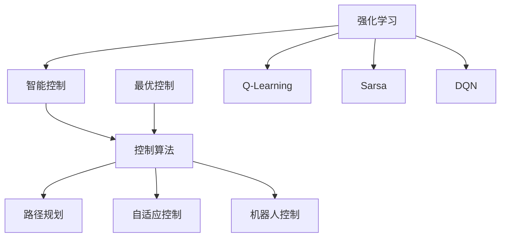

                 


### 文章标题：强化学习在智能控制中的应用研究

> 关键词：强化学习，智能控制，应用研究，算法，案例

> 摘要：本文首先介绍了强化学习的基本概念、模型和算法，然后探讨了智能控制的基本概念、理论基础和控制算法，接着详细分析了强化学习在最优控制、路径规划、自适应控制和机器人控制等领域的应用，并通过实际案例进行了深入剖析，最后对强化学习在智能控制中的应用前景和挑战进行了展望。

---

### 第一部分：强化学习基础

#### 第1章：强化学习基本概念

1.1. 强化学习的定义与特征

强化学习是一种基于反馈信号进行决策的学习方法，其核心思想是通过不断的试错来优化决策策略，以达到最优控制效果。强化学习具有以下几个特征：

- **反馈信号**：强化学习依赖于环境提供的即时反馈信号，即奖励信号（Reward Signal），用于指导学习过程。

- **决策策略**：强化学习算法通过构建决策策略（Policy）来指导行动选择，策略的好坏直接影响学习效果。

- **状态空间和动作空间**：强化学习算法需要在给定的状态空间和动作空间内进行决策，状态和动作的选择对学习结果有重要影响。

1.2. 强化学习的基本要素

强化学习主要包括以下基本要素：

- **状态（State）**：描述系统的当前情况。

- **动作（Action）**：系统可采取的动作。

- **奖励（Reward）**：环境对系统采取的动作的即时反馈信号。

- **策略（Policy）**：系统采取的动作与状态之间的映射关系。

- **价值函数（Value Function）**：预测在给定状态下采取特定动作的长期累积奖励。

- **模型（Model）**：描述系统状态转移和奖励信号的概率分布。

1.3. 强化学习的发展历程

强化学习的研究始于20世纪50年代，早期的研究主要集中在决策问题和博弈论。随着计算机技术的发展，强化学习逐渐应用于自动控制、机器学习、人工智能等领域。近年来，深度强化学习（Deep Reinforcement Learning）的兴起，使得强化学习在复杂环境中的表现得到了显著提升。

---

#### 第2章：强化学习模型

2.1. 策略模型

策略模型是强化学习中最简单的一种模型，它直接根据当前状态选择最优动作。策略模型的关键在于如何定义策略，常见的策略有：

- **ε-贪心策略**：以概率 ε 随机选择动作，以概率 1-ε 选择当前状态下的最优动作。

- **确定性策略**：在给定状态下总是选择最优动作。

- **探索策略**：在探索和利用之间进行权衡，以平衡新信息的获取和已有知识的利用。

2.2. 值函数模型

值函数模型通过学习状态值函数（State-Value Function）和动作值函数（Action-Value Function）来预测长期累积奖励。常见的值函数模型有：

- **Q-Learning算法**：基于值函数的迭代更新方法，通过经验回放和线性预测来优化值函数。

- **Sarsa算法**：同时更新状态值函数和动作值函数，具有更好的收敛性和适应性。

- **Deep Q Network（DQN）算法**：结合深度神经网络和Q-Learning算法，用于处理高维状态空间和动作空间的问题。

2.3. 模型比较与选择

在强化学习应用中，选择合适的模型非常重要。策略模型和值函数模型各有优缺点，策略模型简单但收敛速度较慢，值函数模型则适用于复杂环境。在实际应用中，可以根据问题的特点和环境特性选择合适的模型。

---

#### 第3章：强化学习算法

3.1. Q-Learning算法

Q-Learning算法是一种基于值函数的迭代更新方法，其核心思想是通过经验回放和线性预测来优化值函数。Q-Learning算法的伪代码如下：

```plaintext
for each episode:
    initialize state s
    initialize Q(s, a) for all actions a
    while not end of episode:
        choose action a using ε-greedy policy
        execute action a and observe reward r, new state s'
        update Q(s, a) = Q(s, a) + α [r + γ max Q(s', a') - Q(s, a)]
        s = s'
```

3.2. Sarsa算法

Sarsa算法是一种同时更新状态值函数和动作值函数的强化学习算法，它具有更好的收敛性和适应性。Sarsa算法的伪代码如下：

```plaintext
for each episode:
    initialize state s
    initialize Q(s, a) for all actions a
    while not end of episode:
        choose action a using ε-greedy policy
        execute action a and observe reward r, new state s'
        choose next action a' using ε-greedy policy
        update Q(s, a) = Q(s, a) + α [r + γ Q(s', a') - Q(s, a)]
        s = s'
```

3.3. Deep Q Network（DQN）算法

Deep Q Network（DQN）算法是一种结合深度神经网络和Q-Learning算法的强化学习算法，它能够处理高维状态空间和动作空间的问题。DQN算法的核心思想是使用深度神经网络来近似Q函数，并通过经验回放和目标网络来优化神经网络参数。DQN算法的伪代码如下：

```plaintext
initialize deep neural network DQN
for each episode:
    initialize state s
    while not end of episode:
        choose action a using ε-greedy policy
        execute action a and observe reward r, new state s'
        sample random minibatch of experiences (s, a, r, s')
        predict Q(s', a') using DQN
        update DQN using gradient descent with respect to loss function:
            loss = (r + γ max Q(s', a') - Q(s, a))^2
```

---

### 第二部分：智能控制基础

#### 第4章：智能控制基本概念

4.1. 智能控制概述

智能控制是一种基于计算机技术和人工智能方法的控制理论，其核心思想是通过模拟人类智能，使控制系统具有自学习、自适应和自主决策能力。智能控制系统主要包括以下几个部分：

- **传感器**：用于感知环境和系统状态。

- **控制器**：根据传感器获取的信息和系统目标，生成控制策略。

- **执行器**：根据控制策略对系统进行操作。

- **环境**：控制系统所作用的物理环境。

4.2. 智能控制系统的组成

智能控制系统通常由以下几个部分组成：

- **硬件平台**：包括传感器、执行器、控制器等硬件设备。

- **软件平台**：包括控制系统软件、控制算法、数据管理与分析软件等。

- **网络通信**：用于实现各部分之间的信息交换和协同工作。

4.3. 智能控制的发展趋势

随着人工智能技术的快速发展，智能控制领域也在不断拓展。当前智能控制的发展趋势主要包括：

- **自主决策**：通过强化学习等技术实现自主决策，提高控制系统的智能化水平。

- **多模态感知**：结合多种传感器技术，实现多模态感知，提高控制系统对环境信息的理解能力。

- **边缘计算**：将部分计算任务下沉到边缘设备，实现实时控制和优化。

---

#### 第5章：控制理论基础

5.1. 线性控制系统

线性控制系统是指系统方程可以用线性函数表示的控制系统。线性控制系统具有以下特点：

- **叠加原理**：多个输入作用下的系统输出等于各个输入单独作用下的输出之和。

- **比例-积分-微分控制**（PID控制）：一种常用的线性控制方法，通过调整比例、积分和微分三个参数来优化控制效果。

5.2. 非线性控制系统

非线性控制系统是指系统方程不能用线性函数表示的控制系统。非线性控制系统具有以下特点：

- **非线性效应**：系统状态变量之间的非线性关系可能导致系统行为的复杂变化。

- **稳定性分析**：非线性系统稳定性分析比线性系统更为复杂，通常需要借助数值模拟等方法。

5.3. 稳定性与鲁棒性分析

稳定性分析是指判断系统在初始扰动下是否能够恢复到平衡状态。鲁棒性分析是指系统在参数不确定性和外部干扰下能否保持稳定。对于智能控制系统，稳定性分析和鲁棒性分析至关重要，以确保系统在复杂环境中具有良好的性能。

---

#### 第6章：控制算法与策略

6.1. 传统控制算法

传统控制算法主要包括比例-积分-微分控制（PID控制）和自适应控制。PID控制是一种基于反馈的线性控制方法，通过调整比例、积分和微分三个参数来优化控制效果。自适应控制是一种基于系统模型的自调整控制方法，能够在系统参数发生变化时自动调整控制参数。

6.2. 智能控制算法

智能控制算法主要包括模糊控制、神经网络控制和遗传算法等。模糊控制通过模糊逻辑来处理不确定性和非线性问题，神经网络控制利用神经网络模型进行状态估计和预测，遗传算法通过模拟生物进化过程进行优化。

6.3. 控制策略的选择与优化

选择合适的控制策略是实现智能控制的关键。控制策略的选择需要考虑系统特性、环境条件和性能指标。优化控制策略可以通过遗传算法、粒子群优化等智能优化算法来实现，以提高控制效果。

---

### 第三部分：强化学习在智能控制中的应用

#### 第7章：强化学习在最优控制中的应用

7.1. 最优控制问题

最优控制问题是指在给定初始条件和系统模型的情况下，寻找最优控制策略，使得系统性能指标达到最优。强化学习在最优控制中的应用主要基于马尔可夫决策过程（MDP）模型。

7.2. 使用强化学习解决最优控制问题

强化学习算法（如Q-Learning、Sarsa和DQN）可以用于解决最优控制问题。通过学习状态值函数或动作值函数，强化学习算法能够找到最优控制策略，从而实现系统性能的最优化。

7.3. 案例分析：无人机飞行控制

无人机飞行控制是一个典型的最优控制问题。通过使用强化学习算法，可以实现对无人机飞行路径、速度和姿态等控制参数的最优调整，从而提高飞行性能和稳定性。

---

#### 第8章：强化学习在路径规划中的应用

8.1. 路径规划问题

路径规划问题是指寻找一条从起点到终点的最优路径，以最小化路径长度、时间或能量消耗等指标。强化学习在路径规划中的应用主要基于环境建模和策略优化。

8.2. 使用强化学习实现路径规划

强化学习算法（如Q-Learning、Sarsa和DQN）可以用于实现路径规划。通过学习状态值函数或动作值函数，强化学习算法能够找到最优路径规划策略，从而实现路径规划问题的求解。

8.3. 案例分析：无人驾驶车辆路径规划

无人驾驶车辆路径规划是一个典型的路径规划问题。通过使用强化学习算法，可以实现对无人驾驶车辆路径规划的实时优化，从而提高车辆的行驶效率和安全性。

---

#### 第9章：强化学习在自适应控制中的应用

9.1. 自适应控制问题

自适应控制问题是指控制系统在运行过程中，根据环境变化和系统状态调整控制参数，以实现更好的控制效果。强化学习在自适应控制中的应用主要基于策略优化和参数调整。

9.2. 使用强化学习实现自适应控制

强化学习算法（如Q-Learning、Sarsa和DQN）可以用于实现自适应控制。通过学习状态值函数或动作值函数，强化学习算法能够找到最优控制策略，从而实现自适应控制问题的求解。

9.3. 案例分析：机器人手部控制

机器人手部控制是一个典型的自适应控制问题。通过使用强化学习算法，可以实现对机器人手部控制的实时优化，从而提高机器人手部的操作精度和稳定性。

---

#### 第10章：强化学习在机器人控制中的应用

10.1. 机器人控制问题

机器人控制问题是指对机器人进行实时控制，以实现预定的任务目标。强化学习在机器人控制中的应用主要基于状态空间建模和策略优化。

10.2. 使用强化学习实现机器人控制

强化学习算法（如Q-Learning、Sarsa和DQN）可以用于实现机器人控制。通过学习状态值函数或动作值函数，强化学习算法能够找到最优控制策略，从而实现机器人控制问题的求解。

10.3. 案例分析：机器人抓取与移动

机器人抓取与移动是一个典型的机器人控制问题。通过使用强化学习算法，可以实现对机器人抓取与移动的实时优化，从而提高机器人任务的执行效率和质量。

---

### 第四部分：实验与案例分析

#### 第11章：实验设计与环境搭建

11.1. 实验设计原则

实验设计应遵循以下原则：

- **明确目标**：明确实验目的和预期结果。

- **合理选择模型**：根据问题特点选择合适的强化学习模型。

- **优化实验参数**：通过参数调优，提高实验效果。

- **多次重复实验**：确保实验结果的可靠性。

11.2. 强化学习实验环境搭建

强化学习实验环境搭建主要包括以下步骤：

- **环境配置**：安装和配置所需的软件和硬件。

- **数据准备**：收集和处理实验所需的数据。

- **模型训练**：使用训练数据训练强化学习模型。

- **模型测试**：使用测试数据评估模型性能。

---

#### 第12章：案例分析

12.1. 案例分析概述

本节将介绍以下几个案例：

- 案例一：强化学习在无人机控制中的应用

- 案例二：强化学习在路径规划中的应用

12.2. 案例一：强化学习在无人机控制中的应用

案例一将介绍如何使用强化学习算法实现对无人机飞行控制的最优调整，提高无人机飞行性能和稳定性。

12.3. 案例二：强化学习在路径规划中的应用

案例二将介绍如何使用强化学习算法实现无人驾驶车辆路径规划的实时优化，提高车辆的行驶效率和安全性。

---

#### 第13章：未来展望与挑战

13.1. 强化学习在智能控制中的应用前景

随着人工智能技术的不断发展，强化学习在智能控制领域的应用前景十分广阔。未来，强化学习有望在无人驾驶、智能家居、工业控制等领域取得突破性进展。

13.2. 当前存在的问题与挑战

虽然强化学习在智能控制领域具有巨大潜力，但当前仍存在一些问题和挑战，如：

- **计算复杂度**：强化学习算法通常需要大量的计算资源和时间。

- **数据依赖**：强化学习算法对数据质量要求较高，数据不足可能导致学习效果不佳。

- **安全性**：强化学习算法在复杂环境中的鲁棒性和安全性仍需进一步研究。

13.3. 未来研究方向与趋势

未来，强化学习在智能控制领域的研究方向和趋势主要包括：

- **算法优化**：研究更加高效、可扩展的强化学习算法。

- **跨学科融合**：将强化学习与其他人工智能技术相结合，提高智能控制系统的整体性能。

- **安全性研究**：研究强化学习算法在复杂环境中的鲁棒性和安全性，提高系统的可靠性。

---

#### 附录

##### 附录A：参考文献

- Sutton, R. S., & Barto, A. G. (2018). Reinforcement Learning: An Introduction. MIT Press.

- Bertsekas, D. P. (2018). Dynamic Programming and Optimal Control, Vol. 1: The Basis. Athena Scientific.

- Kaelbling, L. P., Littman, M. L., & Moore, A. W. (1996). Reinforcement Learning: A Survey. Journal of Artificial Intelligence, 66(1), 3-52.

##### 附录B：强化学习相关工具与资源

- OpenAI Gym：一个开源的强化学习实验环境库。

- TensorFlow Reinforcement Learning Library：基于TensorFlow的强化学习库。

- RLlib：一个用于分布式强化学习的Python库。

##### 附录C：实验代码与数据集

- 实验代码：包含无人机控制、路径规划等案例的代码实现。

- 数据集：用于实验的仿真数据和真实数据。

---

#### 核心概念与联系

强化学习与智能控制的联系可以通过以下Mermaid流程图进行展示：



#### 核心算法原理讲解

**Q-Learning算法伪代码**：

```plaintext
for each episode:
    initialize state s
    initialize Q(s, a) for all actions a
    while not end of episode:
        choose action a using ε-greedy policy
        execute action a and observe reward r, new state s'
        update Q(s, a) = Q(s, a) + α [r + γ max Q(s', a') - Q(s, a)]
        s = s'
```

**价值函数公式**：

$$ V^*(s) = \sum_{a} \pi(a|s) \cdot Q^*(s, a) $$

- **详细讲解**：

  价值函数是强化学习中的核心概念，它表示从状态 s 开始，采取最优策略 π(a|s) 所能获得的最大期望回报。

**Q-learning更新公式**：

$$ Q(s, a) \leftarrow Q(s, a) + \alpha [r + \gamma \max_{a'} Q(s', a') - Q(s, a)] $$

- **详细讲解**：

  Q-learning是一种基于值函数的强化学习算法，它通过迭代更新 Q(s, a) 来逼近最优值函数 Q。

---

### 作者信息

作者：AI天才研究院/AI Genius Institute & 禅与计算机程序设计艺术 /Zen And The Art of Computer Programming

