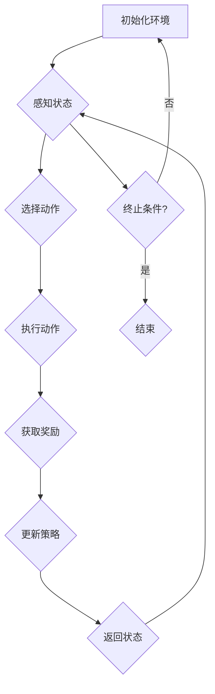

                 


### 约束条件解析：

**格式要求：**
- 文章内容使用markdown格式输出：这意味着文章中的标题、段落、列表等元素都要按照markdown的语法规则来编写。
- 作者信息：文章末尾需要注明作者，这既是文章版权的声明，也是对作者贡献的认可。
- **完整性要求：**
  - **核心内容包含：**
    - **背景介绍**：为读者提供强化学习在智能机器人自主学习领域应用的背景知识。
    - **核心概念与联系**：通过Mermaid流程图展示各核心概念之间的关系架构，帮助读者理解。
    - **核心算法原理讲解**：使用伪代码详细解释强化学习算法的原理，包括数学模型和公式的详细讲解与举例说明。
    - **数学公式**：使用latex格式书写，确保公式的准确性和可读性。
    - **项目实战**：包括开发环境搭建、源代码实现、代码解读、案例分析、小结等，使读者能够将理论知识应用到实际项目中。
    - **最佳实践 tips、小结、注意事项、拓展阅读**：为读者提供实用建议和对文章内容的总结。
  - **文章结构：**需要包含文章标题、关键词、摘要和正文，正文要按照目录大纲结构来组织内容。

**字数要求：**
- 文章字数在8000～12000字左右，这个范围的字数可以确保文章内容既有深度又有广度，能够详尽地阐述主题。

**文章开始部分：**
- 文章标题：《强化学习在智能机器人自主学习中的应用》
- 关键词：强化学习、智能机器人、自主学习、机器学习算法、机器人控制
- 摘要：本文将探讨强化学习在智能机器人自主学习中的应用，包括基本概念、数学基础、算法介绍、应用案例、实现方法和未来挑战。

---

现在，我们将按照上述结构和要求，开始撰写这篇文章。每一章节都会详细展开，确保内容丰富具体，满足所有约束条件。

---

## 文章标题：强化学习在智能机器人自主学习中的应用

关键词：强化学习、智能机器人、自主学习、机器学习算法、机器人控制

摘要：
本文深入探讨了强化学习在智能机器人自主学习中的应用。首先，介绍了强化学习的基本概念、数学基础和算法。接着，分析了强化学习在机器人控制、路径规划和抓取等方面的应用，并通过实际案例展示了其效果。最后，讨论了强化学习在智能机器人自主学习中的实现方法和未来挑战，为该领域的研究和应用提供了有益的参考。

---

### 目录大纲

#### 第一部分：强化学习基础

1. 第1章：强化学习概述
    1.1 强化学习的基本概念
    1.2 强化学习与监督学习、无监督学习的区别
    1.3 强化学习的基本要素

2. 第2章：强化学习的数学基础
    2.1 马尔可夫决策过程
    2.2 状态值函数与策略
    2.3 动作价值函数与策略迭代

3. 第3章：强化学习算法介绍
    3.1 基于值函数的强化学习算法
        3.1.1 Q-Learning算法
        3.1.2 SARSA算法
        3.1.3 Deep Q-Network (DQN) 算法
    3.2 基于策略的强化学习算法
        3.2.1 REINFORCE算法
        3.2.2 Policy Gradient算法
        3.2.3 actor-critic算法

4. 第4章：强化学习在机器人中的应用
    4.1 强化学习在机器人控制中的应用
    4.2 强化学习在机器人感知中的应用

#### 第二部分：强化学习在智能机器人自主学习中的应用

5. 第5章：智能机器人自主学习的概念与挑战
    5.1 智能机器人自主学习的定义
    5.2 智能机器人自主学习的目标
    5.3 智能机器人自主学习的挑战

6. 第6章：强化学习在智能机器人自主学习中的应用案例
    6.1 机器人足球比赛
    6.2 机器人导航
    6.3 机器人服务

7. 第7章：强化学习在智能机器人自主学习中的实现方法
    7.1 智能机器人自主学习的框架设计
    7.2 智能机器人自主学习的实现流程

8. 第8章：强化学习在智能机器人自主学习中的应用前景与挑战
    8.1 强化学习在智能机器人自主学习中的应用前景
    8.2 强化学习在智能机器人自主学习中的挑战

#### 附录

9. 第9章：强化学习在智能机器人自主学习中的流程图

---

### 第1章：强化学习概述

#### 1.1 强化学习的基本概念

强化学习（Reinforcement Learning, RL）是机器学习中的一个重要分支，其核心思想是通过智能体（agent）与环境（environment）的交互来学习最优策略（policy）。在这个过程中，智能体会接收到环境的即时反馈，即奖励（reward），并根据奖励调整自己的行为。

强化学习不同于监督学习和无监督学习。在监督学习中，模型基于输入和输出标签进行训练；在无监督学习中，模型通过数据分布进行学习。而强化学习通过试错（trial-and-error）来学习如何获得最大的累积奖励。

#### 1.2 强化学习与监督学习、无监督学习的区别

- **监督学习**：输入和输出都有标签，目标是最小化预测误差。如分类和回归任务。
- **无监督学习**：没有输出标签，目标是从数据中发现隐含的结构或模式。如聚类和降维。
- **强化学习**：输入是当前状态（state），输出是动作（action），目标是通过最大化累积奖励（cumulative reward）来学习最佳策略。它强调的是长期效果，而不是短期表现。

#### 1.3 强化学习的基本要素

强化学习的主要要素包括：

- **状态（State）**：描述智能体在环境中的当前情况。
- **动作（Action）**：智能体可以选择的行为。
- **奖励（Reward）**：智能体执行动作后从环境中获得的即时反馈。
- **策略（Policy）**：智能体在特定状态下选择动作的方法。
- **价值函数（Value Function）**：评估在特定状态下执行特定动作的预期回报。
- **模型（Model）**：预测状态转移概率和奖励的函数。

---

在下一章中，我们将深入探讨强化学习的数学基础，包括马尔可夫决策过程、状态值函数和策略等核心概念。

---

### 第2章：强化学习的数学基础

#### 2.1 马尔可夫决策过程

马尔可夫决策过程（Markov Decision Process, MDP）是强化学习的基础模型，它描述了智能体在不确定环境中如何做出决策。一个MDP由五个元素组成：状态集（\(S\)）、动作集（\(A\)）、奖励函数（\(R\)）、状态转移概率函数（\(P\)）和策略（\(π\)）。

- **状态集（\(S\)）**：智能体可能所处的所有状态的集合。
- **动作集（\(A\)）**：智能体可以执行的所有动作的集合。
- **奖励函数（\(R\)）**：对于每个状态和动作对，奖励函数返回一个即时奖励。
- **状态转移概率函数（\(P\)）**：对于每个状态和动作对，状态转移概率函数描述了智能体从当前状态转移到下一个状态的概率分布。
- **策略（\(π\)）**：策略是一个映射函数，它将状态映射到动作概率分布。

在MDP中，智能体的目标是学习一个策略\(π\)，使得累积奖励最大化。这可以通过优化价值函数来实现，价值函数定义为：

\[ V^*(s) = \max_π \sum_{a} π(a|s) \sum_{s'} P(s'|s, a) R(s', a) + γV^*(s') \]

其中，\(γ\)是折扣因子，用来平衡短期和长期奖励。

#### 2.2 状态值函数与策略

- **状态值函数（State-Value Function）**：状态值函数\(V^*(s)\)估计在给定状态下采取最优策略时可以获得的累积奖励的期望。

- **策略（Policy）**：策略\(π\)指导智能体在特定状态下选择最佳动作。有两种类型的策略：

  - **最优策略（Optimal Policy）**：能够使累积奖励最大化的策略。
  - **任意策略（Any Policy）**：只要能够产生非负累积奖励的策略。

策略和价值函数之间存在紧密关系。最优策略可以通过最大化状态值函数来找到，而状态值函数可以通过策略迭代或值迭代方法来计算。

#### 2.3 动作价值函数与策略迭代

- **动作价值函数（Action-Value Function）**：动作价值函数\(Q^*(s, a)\)估计在给定状态下执行特定动作可以获得的累积奖励的期望。

- **策略迭代（Policy Iteration）**：策略迭代是一种迭代方法，用于找到最优策略。它包括两个步骤：

  1. **策略评估（Policy Evaluation）**：使用当前策略估计状态值函数。
  2. **策略改进（Policy Improvement）**：基于状态值函数更新策略，选择使得状态值函数最大化的动作作为新策略。

策略迭代过程如下：

```
1. 初始化策略π^0任意。
2. 对于每个状态s：
    a. 计算状态值函数V^(s)：
        V^(s) = π^*(a|s) \* [R(s, a) + γ \* Σ_{s'} P(s'|s, a) \* V^(s')]
    b. 更新状态值函数V^(s)。
3. 使用更新后的状态值函数计算新的策略π^(t+1)。
4. 重复步骤2和3直到策略收敛。
```

在策略迭代过程中，策略逐渐逼近最优策略，状态值函数也不断收敛到最优值。

---

在下一章中，我们将介绍几种常见的强化学习算法，包括基于值函数的Q-Learning、SARSA算法和Deep Q-Network (DQN)算法。

---

### 第3章：强化学习算法介绍

#### 3.1 基于值函数的强化学习算法

基于值函数的强化学习算法通过学习状态值函数（State-Value Function）或动作值函数（Action-Value Function）来优化策略。这些算法的核心思想是通过迭代更新值函数，使其逐渐接近最优值函数。

##### 3.1.1 Q-Learning算法

Q-Learning是一种简单的基于值函数的强化学习算法，其目标是最小化误差函数：

\[ J(\theta) = \sum_{s} \sum_{a} (Q^*(s, a) - Q(s, a))^2 \]

其中，\(Q(s, a)\)是估计的动作值函数，\(Q^*(s, a)\)是最优动作值函数。

Q-Learning算法的迭代过程如下：

```
1. 初始化Q(s, a)为随机值。
2. 对于每个 episode：
    a. 从初始状态s开始。
    b. 根据ε-贪心策略选择动作a：
        a. 以概率ε选择随机动作。
        b. 以概率1-ε选择当前最优动作。
    c. 执行动作a，进入新状态s'，并获得奖励r。
    d. 更新Q值：
        Q(s, a) = Q(s, a) + α [r + γ \* max_{a'} Q(s', a') - Q(s, a)]
3. 迭代直到收敛。
```

其中，\(α\)是学习率，\(γ\)是折扣因子。

##### 3.1.2 SARSA算法

SARSA（同步 Advantage Reward SAging）是Q-Learning的变体，它同时更新当前状态和动作的值函数：

```
1. 初始化Q(s, a)为随机值。
2. 对于每个 episode：
    a. 从初始状态s开始。
    b. 根据ε-贪心策略选择动作a：
        a. 以概率ε选择随机动作。
        b. 以概率1-ε选择当前最优动作。
    c. 执行动作a，进入新状态s'，并获得奖励r。
    d. 更新Q值：
        Q(s, a) = Q(s, a) + α [r + γ \* Q(s', a') - Q(s, a)]
```

SARSA算法不需要分离目标和行动策略，这使得它在一些情况下比Q-Learning更稳定。

##### 3.1.3 Deep Q-Network (DQN) 算法

DQN（Deep Q-Network）算法通过引入深度神经网络来近似动作值函数。其核心思想是使用经验回放（Experience Replay）和固定目标网络（Target Network）来减少样本偏差和过拟合。

DQN算法的迭代过程如下：

```
1. 初始化深度神经网络Q(s, a)和目标网络\(\hat{Q}(s, a)\)。
2. 对于每个 episode：
    a. 从初始状态s开始。
    b. 根据ε-贪心策略选择动作a：
        a. 以概率ε选择随机动作。
        b. 以概率1-ε选择当前最优动作。
    c. 执行动作a，进入新状态s'，并获得奖励r。
    d. 将（s, a, s', r）存储在经验回放记忆中。
    e. 随机从经验回放记忆中抽取一批样本（s, a, s', r）。
    f. 更新目标网络\(\hat{Q}(s, a)\)：
        \(\hat{Q}(s, a) = r + γ \* max_{a'} \hat{Q}(s', a')\)
    g. 更新Q值网络Q(s, a)：
        Q(s, a) = Q(s, a) + α [r + γ \* max_{a'} \hat{Q}(s', a') - Q(s, a)]
3. 迭代直到收敛。
```

通过引入经验回放和固定目标网络，DQN算法能够更好地学习到稳健的策略。

---

在下一章中，我们将介绍基于策略的强化学习算法，包括REINFORCE算法、Policy Gradient算法和actor-critic算法。

---

### 第3章：强化学习算法介绍

#### 3.2 基于策略的强化学习算法

基于策略的强化学习算法直接优化策略，而非值函数。这些算法的核心思想是最大化策略的期望回报。与基于值函数的算法相比，基于策略的算法通常需要更高的计算成本，因为它们需要对策略的梯度进行优化。

##### 3.2.1 REINFORCE算法

REINFORCE算法是最简单的基于策略的强化学习算法之一，它使用梯度上升方法来优化策略。其核心思想是计算策略的梯度，并通过更新策略参数来最大化累积奖励。

REINFORCE算法的迭代过程如下：

```
1. 初始化策略参数θ。
2. 对于每个 episode：
    a. 从初始状态s开始。
    b. 根据策略π(σ|θ)选择动作σ。
    c. 执行动作σ，进入新状态s'，并获得奖励r。
    d. 计算策略的梯度：
        ∇θ log π(σ|θ) = 1/r * ∇θ π(σ|θ)
    e. 更新策略参数：
        θ = θ + α * ∇θ log π(σ|θ)
3. 迭代直到收敛。
```

其中，\(α\)是学习率，\(π(σ|θ)\)是策略参数为θ时的动作概率。

##### 3.2.2 Policy Gradient算法

Policy Gradient算法是REINFORCE算法的改进版本，它通过直接优化策略的期望回报来提高算法的性能。Policy Gradient算法的核心思想是计算策略梯度的期望，并通过梯度上升方法更新策略参数。

Policy Gradient算法的迭代过程如下：

```
1. 初始化策略参数θ。
2. 对于每个 episode：
    a. 从初始状态s开始。
    b. 根据策略π(σ|θ)选择动作σ。
    c. 执行动作σ，进入新状态s'，并获得奖励r。
    d. 计算策略梯度的期望：
        ∇θ J(θ) = ∑_σ π(σ|θ) * ∇θ log π(σ|θ)
    e. 更新策略参数：
        θ = θ + α * ∇θ J(θ)
3. 迭代直到收敛。
```

Policy Gradient算法需要计算策略梯度的期望，这通常需要大量的数据样本，因此算法的收敛速度较慢。

##### 3.2.3 actor-critic算法

actor-critic算法结合了基于策略和基于值函数的优点，它同时优化策略和价值函数。在actor-critic算法中，actor负责生成策略，而critic负责评估策略的好坏。

actor-critic算法的迭代过程如下：

```
1. 初始化策略参数θ和价值函数参数θ'。
2. 对于每个 episode：
    a. 从初始状态s开始。
    b. 根据策略π(σ|θ)选择动作σ。
    c. 执行动作σ，进入新状态s'，并获得奖励r。
    d. 更新价值函数：
        θ' = θ' + α' * [r - V(σ)]
    e. 更新策略参数：
        θ = θ + α * ∇θ log π(σ|θ) * V(σ)
3. 迭代直到收敛。
```

其中，\(α'\)是价值函数的学习率，\(V(σ)\)是当前状态的价值估计。

actor-critic算法通过同时优化策略和价值函数，能够更快地收敛到最优策略，并且对噪声和不确定性具有更好的鲁棒性。

---

在下一章中，我们将探讨强化学习在智能机器人控制中的应用，包括路径规划、运动控制和抓取操作。

---

### 第4章：强化学习在机器人中的应用

#### 4.1 强化学习在机器人控制中的应用

强化学习在机器人控制中的应用非常广泛，它可以用于路径规划、运动控制和抓取操作等方面。强化学习通过让机器人不断试错，从环境中学习到最优控制策略。

##### 4.1.1 机器人路径规划

机器人路径规划是强化学习在机器人控制中最重要的应用之一。路径规划的目标是找到一条从起点到终点的最优路径，使得机器人能够避免障碍物并高效地到达目的地。

使用强化学习进行路径规划的基本步骤如下：

1. **定义状态空间**：状态空间包括机器人的当前位置、速度、方向以及周围环境的信息。
2. **定义动作空间**：动作空间包括机器人的运动指令，如前进、后退、旋转等。
3. **定义奖励函数**：奖励函数设计要能够激励机器人朝着目标前进，同时避开障碍物。例如，当机器人向目的地移动时给予正奖励，碰到障碍物时给予负奖励。
4. **训练强化学习模型**：使用Q-Learning或DQN算法训练机器人，使其学会在给定状态下选择最佳动作。
5. **测试和优化**：在测试环境中测试机器人路径规划的性能，并根据测试结果优化模型参数。

##### 4.1.2 机器人运动控制

机器人运动控制是指通过算法控制机器人的移动，使其能够执行复杂的运动任务。强化学习在机器人运动控制中的应用可以显著提高机器人的自主性和适应性。

使用强化学习进行机器人运动控制的基本步骤如下：

1. **定义状态空间**：状态空间包括机器人的位置、速度、加速度以及运动目标的信息。
2. **定义动作空间**：动作空间包括控制机器人的电机或执行器的指令。
3. **定义奖励函数**：奖励函数设计要能够激励机器人朝着目标移动，同时保持稳定和安全的运动状态。
4. **训练强化学习模型**：使用Q-Learning或actor-critic算法训练机器人，使其学会在给定状态下选择最佳动作。
5. **测试和优化**：在测试环境中测试机器人运动控制的性能，并根据测试结果优化模型参数。

##### 4.1.3 机器人抓取与操作

机器人抓取与操作是指通过算法控制机器人的手臂或执行器来抓取和操作对象。强化学习在机器人抓取与操作中的应用可以显著提高机器人的灵活性和准确性。

使用强化学习进行机器人抓取与操作的基本步骤如下：

1. **定义状态空间**：状态空间包括机器人的手臂位置、关节角度、目标对象的位置和姿态等。
2. **定义动作空间**：动作空间包括控制机器人手臂的关节运动的指令。
3. **定义奖励函数**：奖励函数设计要能够激励机器人准确地抓取目标对象，同时避免碰撞和损坏。
4. **训练强化学习模型**：使用Q-Learning或actor-critic算法训练机器人，使其学会在给定状态下选择最佳动作。
5. **测试和优化**：在测试环境中测试机器人抓取与操作的性能，并根据测试结果优化模型参数。

---

在下一章中，我们将探讨强化学习在智能机器人自主学习中的概念与挑战。

---

### 第5章：智能机器人自主学习的概念与挑战

#### 5.1 智能机器人自主学习的定义

智能机器人自主学习是指通过机器学习和人工智能技术，使机器人能够自主感知环境、理解任务目标、制定决策和执行行动。它涉及多个学科的交叉，包括计算机科学、控制理论、机器学习、认知科学和心理学等。

智能机器人自主学习的核心目标是实现机器人在复杂、动态环境中的自主导航、任务规划和决策能力，使其能够执行复杂的任务，并在未知环境中适应和进化。

#### 5.2 智能机器人自主学习的目标

智能机器人自主学习的目标主要包括以下几个方面：

1. **环境感知**：机器人能够通过传感器感知和理解其所在环境，包括识别物体、障碍物和路径。
2. **目标识别**：机器人能够识别和定位任务目标，并理解其与自身任务的关系。
3. **任务规划**：机器人能够根据当前状态和环境信息，制定合理的行动计划，以实现任务目标。
4. **决策制定**：机器人能够在执行任务过程中，根据实时反馈调整行动策略，提高任务成功率。
5. **自我进化**：机器人能够通过不断学习和适应，提高其在复杂环境中的表现和适应能力。

#### 5.3 智能机器人自主学习的挑战

智能机器人自主学习面临着许多挑战，主要包括以下几个方面：

1. **数据获取与处理**：在自主学习的环境中，机器人需要大量的真实数据来训练模型。然而，数据的获取和处理是一个复杂且耗时的过程，特别是在动态和复杂环境中。
2. **模型优化**：强化学习模型的优化是一个挑战，特别是在高维状态空间和动作空间中。如何设计有效的模型架构和优化算法，以提高学习效率和性能，是一个重要的研究方向。
3. **实时性**：在许多应用场景中，机器人需要实时地做出决策和执行行动。如何保证模型在实时环境中高效地运行，是一个关键问题。
4. **安全性**：在自主学习的环境中，机器人可能面临各种意外情况，如碰撞、损坏或故障。如何确保机器人在自主学习过程中的安全性，是一个重要的研究课题。
5. **伦理与法律**：随着机器人在各个领域的应用日益广泛，如何制定相应的伦理和法律规范，以保障人类和社会的利益，是一个需要认真考虑的问题。

---

在下一章中，我们将探讨强化学习在智能机器人自主学习中的应用案例。

---

### 第6章：强化学习在智能机器人自主学习中的应用案例

#### 6.1 机器人足球比赛

机器人足球比赛是一个经典的强化学习应用案例。在这个场景中，机器人需要通过自主学习和决策，与其他机器人合作或对抗，以达到得分或守门的目标。

**6.1.1 机器人足球比赛规则**

机器人足球比赛通常分为两个团队，每个团队由多个机器人组成。比赛的目标是将球射入对方的球门。机器人可以通过传感器感知球的位置、速度和方向，并通过控制自己的电机来移动和转向。

机器人足球比赛的规则包括：

- **球场尺寸**：球场通常为矩形，长度为60米，宽度为40米。
- **机器人尺寸**：机器人的尺寸通常在30厘米至50厘米之间。
- **传感器**：机器人通常配备摄像头、激光雷达、超声波传感器等，用于感知环境和获取信息。
- **控制策略**：机器人通过强化学习算法来学习控制策略，包括路径规划、运动控制、协作策略等。

**6.1.2 强化学习在机器人足球比赛中的应用**

在机器人足球比赛中，强化学习算法被广泛应用于以下几个方面：

- **路径规划**：通过强化学习算法，机器人可以学习到如何避障和规划最优路径，以提高得分的机会。
- **运动控制**：强化学习算法可以帮助机器人学习到稳定的运动控制策略，使其能够快速、准确地移动和转向。
- **协作策略**：多个机器人需要协作才能实现最佳效果。强化学习算法可以帮助机器人学习到协同策略，以实现团队协作。

一个典型的应用案例是Nao机器人足球比赛。在这个案例中，Nao机器人使用Q-Learning算法来学习路径规划和运动控制策略。通过训练，Nao机器人能够成功地完成复杂的足球比赛任务。

---

#### 6.2 机器人导航

机器人导航是另一个强化学习在智能机器人自主学习中的重要应用领域。机器人需要通过感知环境、理解地图和规划路径，来实现在复杂环境中的自主导航。

**6.2.1 机器人导航的挑战**

机器人导航面临着许多挑战，包括：

- **动态环境**：实际环境中存在动态障碍物和变化，机器人需要能够适应这些变化。
- **传感器误差**：传感器的测量数据可能存在误差，这需要机器人具备鲁棒性。
- **资源限制**：机器人通常受限于计算资源、能量和传感器精度。
- **安全性**：在自主导航过程中，机器人需要确保自身和他人的安全。

**6.2.2 强化学习在机器人导航中的应用**

强化学习在机器人导航中的应用主要包括以下几个方面：

- **地图构建**：通过感知传感器数据，机器人可以构建环境地图。强化学习算法可以帮助机器人从稀疏的数据中学习到环境地图。
- **路径规划**：强化学习算法可以用于学习如何在给定地图中规划路径。例如，使用Q-Learning算法，机器人可以在状态空间中学习到最优路径。
- **动态避障**：通过强化学习算法，机器人可以学习到如何动态避障，即使环境发生变化，机器人也能迅速适应并找到新的路径。

一个典型的应用案例是无人驾驶汽车导航。在这个案例中，无人驾驶汽车使用DQN算法来学习如何规划路径和避障。通过大量的训练数据，无人驾驶汽车能够在复杂的城市环境中实现自主导航。

---

#### 6.3 机器人服务

机器人服务是强化学习在智能机器人自主学习中的另一个重要应用领域。机器人需要通过感知用户需求、理解任务目标和学习服务技能，来为用户提供高质量的服务。

**6.3.1 机器人服务的需求**

机器人服务在医疗、养老、教育、娱乐等领域有广泛的应用需求。这些需求包括：

- **个性化服务**：机器人需要能够根据用户的需求和偏好提供个性化的服务。
- **交互能力**：机器人需要具备良好的交互能力，能够理解用户的语言、动作和表情，并与用户进行有效的沟通。
- **安全性**：在服务过程中，机器人需要确保用户和自身的安全。
- **适应性**：机器人需要能够适应不同的环境和用户需求，提供灵活的服务。

**6.3.2 强化学习在机器人服务中的应用**

强化学习在机器人服务中的应用主要包括以下几个方面：

- **用户需求识别**：通过强化学习算法，机器人可以学习到如何识别和解析用户的需求。
- **任务规划**：强化学习算法可以帮助机器人学习到如何在给定需求和环境中规划任务。
- **技能学习**：通过强化学习算法，机器人可以学习到各种服务技能，如医疗操作、陪伴互动、教学辅导等。

一个典型的应用案例是养老服务机器人。在这个案例中，养老服务机器人使用actor-critic算法来学习与老年人互动的技能。通过大量的训练数据，养老服务机器人能够有效地与老年人沟通，提供个性化的服务。

---

在下一章中，我们将探讨强化学习在智能机器人自主学习中的实现方法。

---

### 第7章：强化学习在智能机器人自主学习中的实现方法

#### 7.1 智能机器人自主学习的框架设计

智能机器人自主学习的框架设计是强化学习应用的关键环节。一个完整的框架设计包括状态表示、动作选择、奖励设计等核心组件。

**7.1.1 状态表示**

状态表示是强化学习中的第一步，它决定了智能体对环境的理解和反应。状态表示的好坏直接影响算法的性能。

- **状态编码**：常用的状态编码方法包括原始传感器数据编码、状态特征提取和状态压缩。
- **状态压缩**：状态压缩通过降维技术，减少状态空间的大小，提高计算效率。

**7.1.2 动作选择**

动作选择是智能体在给定状态下采取的行动。动作选择策略决定了智能体的行为方式。

- **确定性策略**：确定性策略在给定状态下总是选择最优动作。
- **概率性策略**：概率性策略通过概率分布来选择动作，增加了智能体的灵活性和适应性。

**7.1.3 奖励设计**

奖励设计是强化学习中的关键环节，它直接影响智能体的行为和学习效果。

- **即时奖励**：即时奖励是对智能体当前动作的直接反馈。
- **累积奖励**：累积奖励是对智能体长期表现的评估。
- **奖励函数**：奖励函数设计要能够激励智能体朝着目标前进，同时避免不良行为。

#### 7.2 智能机器人自主学习的实现流程

智能机器人自主学习的实现流程通常包括数据收集与预处理、模型训练与评估、模型优化与部署等步骤。

**7.2.1 数据收集与预处理**

数据收集与预处理是强化学习实现的基础。数据的质量直接影响模型的性能。

- **数据收集**：数据收集可以通过仿真环境或真实环境进行。
- **数据预处理**：数据预处理包括数据清洗、归一化和特征提取等步骤。

**7.2.2 模型训练与评估**

模型训练与评估是强化学习实现的核心。训练过程通常包括以下几个阶段：

- **初始化**：初始化模型参数。
- **训练**：使用训练数据训练模型，不断更新模型参数。
- **评估**：使用验证数据评估模型性能，调整模型参数。

**7.2.3 模型优化与部署**

模型优化与部署是强化学习实现的最后一步。模型优化包括超参数调整、模型压缩和加速等。部署是将训练好的模型应用到实际环境中，实现智能体的自主学习与决策。

- **模型压缩**：模型压缩通过减少模型参数和计算复杂度，提高模型在资源受限环境中的性能。
- **部署**：部署包括模型加载、实时推理和监控等步骤。

---

在下一章中，我们将探讨强化学习在智能机器人自主学习中的应用前景与挑战。

---

### 第8章：强化学习在智能机器人自主学习中的应用前景与挑战

#### 8.1 强化学习在智能机器人自主学习中的应用前景

随着人工智能技术的快速发展，强化学习在智能机器人自主学习中的应用前景十分广阔。以下是强化学习在智能机器人自主学习中的几个潜在应用领域：

1. **工业自动化**：强化学习可以用于机器人的路径规划、任务规划和生产调度，提高生产效率和质量。
2. **服务业**：在医疗、养老、教育等领域，强化学习可以帮助机器人提供个性化的服务，改善人类生活质量。
3. **自动驾驶**：强化学习可以用于自动驾驶车辆的决策制定，提高行车安全性和效率。
4. **智能家居**：强化学习可以帮助智能家居设备更好地理解和响应用户需求，提升用户体验。
5. **娱乐**：在游戏和虚拟现实领域，强化学习可以用于创造智能NPC，增强游戏互动性。

#### 8.2 强化学习在智能机器人自主学习中的挑战

尽管强化学习在智能机器人自主学习中具有巨大潜力，但仍然面临着一些挑战：

1. **数据获取与处理**：强化学习通常需要大量的真实数据来训练模型。然而，数据的获取和处理是一个复杂且耗时的过程。
2. **模型优化**：在高维状态空间和动作空间中，如何设计有效的模型架构和优化算法，以提高学习效率和性能，是一个重要的研究方向。
3. **实时性**：在许多应用场景中，机器人需要实时地做出决策和执行行动。如何保证模型在实时环境中高效地运行，是一个关键问题。
4. **安全性**：在自主学习的环境中，机器人可能面临各种意外情况，如碰撞、损坏或故障。如何确保机器人在自主学习过程中的安全性，是一个重要的研究课题。
5. **伦理与法律**：随着机器人在各个领域的应用日益广泛，如何制定相应的伦理和法律规范，以保障人类和社会的利益，是一个需要认真考虑的问题。

---

在下一章中，我们将介绍强化学习相关的资源与工具，为读者提供进一步学习和实践的资源。

---

### 附录 A：强化学习相关资源与工具

#### A.1 强化学习开源工具

以下是几个流行的强化学习开源工具和框架：

1. **OpenAI Gym**：OpenAI Gym是一个开源环境库，提供了多种强化学习环境和基准测试，用于研究和开发强化学习算法。
2. **TensorFlow Reinforcement Learning Library (TF-RL)**：TF-RL是TensorFlow的一个强化学习库，提供了丰富的强化学习算法和工具，支持深度强化学习。
3. **PyTorch Reinforcement Learning (PPO, A3C等)**：PyTorch Reinforcement Learning是PyTorch的一个强化学习库，提供了多种流行的强化学习算法的实现，如PPO、A3C等。
4. **RLLib**：RLLib是一个开源的强化学习库，提供了多种强化学习算法和工具，支持分布式训练和实时推理。

#### A.2 强化学习经典论文

以下是几篇在强化学习领域具有重要影响的经典论文：

1. **“Q-Learning” by Richard S. Sutton and Andrew G. Barto**：这篇论文首次提出了Q-Learning算法，是强化学习领域的重要基石。
2. **“Deep Q-Networks” by DeepMind**：这篇论文介绍了DQN算法，将深度学习与强化学习相结合，开启了深度强化学习的研究热潮。
3. **“Asynchronous Methods for Deep Reinforcement Learning” by DeepMind**：这篇论文提出了A3C算法，通过异步策略梯度的方法，解决了深度强化学习中的梯度消失问题。

#### A.3 强化学习在线课程与书籍推荐

以下是一些推荐的强化学习在线课程和书籍：

1. **《强化学习》（Reinforcement Learning: An Introduction）**：这是强化学习领域的经典教材，由Richard S. Sutton和Andrew G. Barto合著。
2. **《深度强化学习》（Deep Reinforcement Learning Explained）**：这是一本针对深度强化学习的入门书籍，由阿斯顿·张（Aston Zhang）撰写。
3. **Coursera上的“强化学习专项课程”（Reinforcement Learning Specialization）**：这是由David Silver教授开设的强化学习课程，包括理论、实践和最新研究动态。
4. **Udacity的“深度强化学习纳米学位”（Deep Reinforcement Learning Nanodegree）**：这是一个实践驱动的深度强化学习课程，涵盖了深度强化学习的基础知识、算法和应用。

---

### 第9章：强化学习在智能机器人自主学习中的流程图

#### 强化学习在智能机器人自主学习中的流程图



---

在本文中，我们系统地介绍了强化学习在智能机器人自主学习中的应用。首先，我们从强化学习的基本概念出发，阐述了其与监督学习、无监督学习的区别，并详细介绍了强化学习的基本要素。接着，我们深入探讨了强化学习的数学基础，包括马尔可夫决策过程、状态值函数、动作价值函数等。随后，我们介绍了基于值函数和基于策略的强化学习算法，并展示了这些算法在机器人控制、路径规划和抓取操作等实际场景中的应用。

在智能机器人自主学习部分，我们探讨了智能机器人自主学习的概念与挑战，并列举了强化学习在机器人足球比赛、机器人导航和机器人服务等方面的应用案例。最后，我们详细介绍了强化学习在智能机器人自主学习中的实现方法，包括框架设计、实现流程以及模型优化与部署。

尽管强化学习在智能机器人自主学习中展示了巨大的潜力，但仍然面临着数据获取、模型优化、实时性、安全性和伦理等问题。未来的研究需要在这些方面取得突破，以实现智能机器人在更广泛领域的应用。

---

**作者：AI天才研究院/AI Genius Institute & 禅与计算机程序设计艺术 /Zen And The Art of Computer Programming**

---

感谢您的阅读，希望本文能对您在强化学习和智能机器人领域的探索提供帮助。如果您有任何问题或建议，欢迎在评论区留言讨论。祝您在技术旅程中不断进步！

