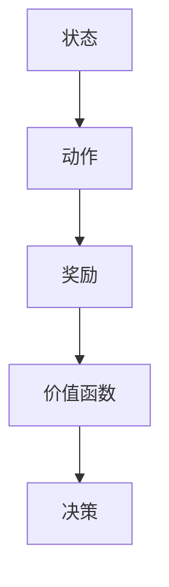

                 

### 文章标题：强化学习在智能电网调度中的应用研究

强化学习，作为一种先进的机器学习技术，在近年来取得了显著的发展。其通过不断地试错和反馈，使得智能体能够在复杂的动态环境中自主学习和优化策略。智能电网调度作为电力系统中的重要环节，其高效性和可靠性直接关系到电力供应的质量和稳定性。因此，将强化学习应用于智能电网调度中，具有巨大的潜力和价值。

本文旨在深入探讨强化学习在智能电网调度中的应用研究。首先，我们将介绍强化学习的基本概念和原理，包括状态、动作、奖励和价值函数等核心要素。接着，我们将详细解析几种主要的强化学习算法，如Q-learning和Sarsa等，并讨论其改进与优化方法。然后，我们将探讨强化学习在电力市场调度、电力负荷预测和电力设备优化等领域的应用，并通过实际案例进行分析。最后，我们将总结强化学习在智能电网调度中的发展前景和面临的挑战，并提出相应的对策。

本文将遵循以下结构：

1. 强化学习基础
   - 第1章：强化学习概述
   - 第2章：强化学习算法原理

2. 强化学习在智能电网调度中的应用
   - 第3章：强化学习在电力市场中的应用
   - 第4章：强化学习在电力负荷预测中的应用
   - 第5章：强化学习在电力设备优化中的应用

3. 强化学习在智能电网调度中的应用前景与挑战
   - 第6章：强化学习在智能电网调度中的应用前景
   - 第7章：强化学习在智能电网调度中的挑战与对策

通过本文的研究，我们希望为强化学习在智能电网调度中的应用提供理论支持和实践指导，推动智能电网调度技术的发展。

### 关键词

- 强化学习
- 智能电网调度
- Q-learning
- Sarsa
- 电力市场
- 电力负荷预测
- 电力设备优化

### 摘要

本文旨在探讨强化学习在智能电网调度中的应用，深入分析了强化学习的基本概念、算法原理及其在电力市场调度、电力负荷预测和电力设备优化等方面的实际应用。首先，我们介绍了强化学习的基本概念和核心要素，包括状态、动作、奖励和价值函数等。接着，我们详细解析了Q-learning和Sarsa等强化学习算法的原理和实现，并讨论了算法的改进与优化方法。随后，我们分别探讨了强化学习在电力市场调度、电力负荷预测和电力设备优化等领域的应用，并通过实际案例进行分析。最后，我们总结了强化学习在智能电网调度中的应用前景和挑战，并提出相应的对策。本文的研究为强化学习在智能电网调度中的应用提供了理论支持和实践指导，有助于推动智能电网调度技术的发展。

### 《强化学习在智能电网调度中的应用研究》目录大纲

#### 第一部分：强化学习基础

##### 第1章：强化学习概述

1.1 强化学习的基本概念
- 强化学习的定义与目标
- 强化学习与监督学习、无监督学习的对比

1.2 强化学习的基本架构
- 状态、动作、奖励和价值函数
- 强化学习的主要算法类型

1.3 强化学习在智能电网调度中的应用前景
- 智能电网调度的问题背景
- 强化学习在智能电网调度中的应用优势

##### 第2章：强化学习算法原理

2.1 Q-learning算法原理
- Q-learning算法的基本原理
- Q-learning算法的伪代码实现

2.2 Sarsa算法原理
- Sarsa算法的基本原理
- Sarsa算法的伪代码实现

2.3 强化学习算法的改进与优化
- Double Q-learning算法
- Deep Q-Networks(DQN)算法

#### 第二部分：强化学习在智能电网调度中的应用

##### 第3章：强化学习在电力市场中的应用

3.1 电力市场调度的基本概念
- 电力市场的结构
- 电力市场调度的问题与挑战

3.2 基于强化学习的电力市场调度算法
- 基于Q-learning的电力市场调度算法
- 基于Sarsa的电力市场调度算法

3.3 强化学习在电力市场调度中的案例分析

##### 第4章：强化学习在电力负荷预测中的应用

4.1 电力负荷预测的基本概念
- 电力负荷预测的重要性
- 电力负荷预测的方法与挑战

4.2 基于强化学习的电力负荷预测算法
- 基于Q-learning的电力负荷预测算法
- 基于Sarsa的电力负荷预测算法

4.3 强化学习在电力负荷预测中的案例分析

##### 第5章：强化学习在电力设备优化中的应用

5.1 电力设备优化的基本概念
- 电力设备优化的目标
- 电力设备优化的方法与挑战

5.2 基于强化学习的电力设备优化算法
- 基于Q-learning的电力设备优化算法
- 基于Sarsa的电力设备优化算法

5.3 强化学习在电力设备优化中的案例分析

#### 第三部分：强化学习在智能电网调度中的应用前景与挑战

##### 第6章：强化学习在智能电网调度中的应用前景

6.1 智能电网的发展趋势
- 智能电网的定义与特点
- 智能电网的发展趋势

6.2 强化学习在智能电网调度中的潜在应用
- 调度优化
- 负荷预测
- 设备优化

##### 第7章：强化学习在智能电网调度中的挑战与对策

7.1 强化学习在智能电网调度中面临的挑战
- 数据质量与隐私
- 算法复杂度与效率
- 算法鲁棒性与安全性

7.2 强化学习在智能电网调度中的对策
- 数据处理与隐私保护
- 算法优化与效率提升
- 算法鲁棒性与安全性保障

#### 附录

##### 附录A：强化学习在智能电网调度中的应用案例

A.1 案例一：基于Q-learning的电力市场调度算法

A.2 案例二：基于Sarsa的电力负荷预测算法

A.3 案例三：基于强化学习的电力设备优化算法

##### 附录B：强化学习在智能电网调度中的常用工具与资源

B.1 常用深度学习框架

B.2 强化学习算法实现工具

B.3 智能电网调度数据集与模型库

### 图1.1 强化学习的基本架构图



### 第1章：强化学习概述

#### 1.1 强化学习的基本概念

强化学习（Reinforcement Learning，简称RL）是一种机器学习范式，它通过智能体（Agent）与环境（Environment）的交互来学习最优策略（Policy）。与传统的监督学习和无监督学习不同，强化学习通过奖励（Reward）机制来指导学习过程，使智能体在未知环境中通过试错来达到特定的目标。

**定义与目标**

强化学习的定义可以描述为：一个智能体在一个环境中采取行动，通过与环境的交互获得奖励或惩罚，并通过不断调整其行为策略以最大化累积奖励的过程。

强化学习的主要目标是使智能体能够在复杂、动态的环境中找到一条最优策略，从而最大化累积奖励。具体来说，强化学习的目标函数是：

$$
J(\theta) = \sum_{t=0}^{T} r_t + \gamma^t V(s_t, \theta)
$$

其中，\(r_t\) 是在时刻 \(t\) 收到的即时奖励，\(V(s_t, \theta)\) 是在状态 \(s_t\) 下的价值函数，\(\gamma\) 是折扣因子，\(\theta\) 是策略参数。

**强化学习与监督学习、无监督学习的对比**

强化学习与监督学习和无监督学习的主要区别在于：

- **监督学习**：有明确的标注数据，学习目标是预测输出，如分类和回归任务。监督学习通常需要大量的标注数据，而且输出是固定的，不具备动态调整的能力。

- **无监督学习**：没有明确的标注数据，学习目标是发现数据中的隐含结构和模式，如聚类和降维。无监督学习通常用于数据探索和预处理。

- **强化学习**：通过与环境交互获得奖励信号，智能体根据奖励信号动态调整行为策略。强化学习适用于动态环境，能够处理不确定性和变化。

**强化学习的基本架构**

强化学习的基本架构包括以下核心要素：

- **状态（State）**：智能体所处的环境状态，通常用向量表示。

- **动作（Action）**：智能体在特定状态下可以采取的行动。

- **奖励（Reward）**：智能体在采取某个动作后，从环境中获得的即时奖励或惩罚。

- **价值函数（Value Function）**：评估智能体在某个状态下的期望收益。

- **策略（Policy）**：智能体在给定状态下选择动作的策略。

- **决策（Decision）**：智能体根据当前状态和策略，选择最优动作。

强化学习的基本流程可以概括为：智能体根据当前状态选择动作，执行动作后获得奖励，并根据奖励调整策略，以期望最大化累积奖励。这个过程不断循环，直到达到某个目标或满足停止条件。

#### 1.2 强化学习的基本架构

强化学习的基本架构包括状态（State）、动作（Action）、奖励（Reward）、价值函数（Value Function）和策略（Policy）等核心要素。下面我们将详细讨论这些要素。

**状态（State）**

状态是强化学习中智能体所处的环境状态，通常用向量表示。状态可以是一个简单的标量，也可以是一个多维向量，表示多个相关属性。状态是动态变化的，随着智能体与环境交互，状态也在不断更新。在智能电网调度中，状态可以表示为电网的当前负荷水平、电网的电压和频率等。

**动作（Action）**

动作是智能体在特定状态下可以采取的行动，用于改变当前状态。动作可以是一个简单的标量，也可以是一个多维向量，表示多个控制变量的调整。在智能电网调度中，动作可以表示为调整发电功率、切换发电设备、调整电压和频率等。

**奖励（Reward）**

奖励是智能体在采取某个动作后，从环境中获得的即时奖励或惩罚。奖励通常用于指导学习过程，使智能体能够通过试错找到最优策略。奖励可以是正奖励（Positive Reward），表示智能体采取了正确的动作，获得了一定的收益；也可以是负奖励（Negative Reward），表示智能体采取了错误的动作，受到了一定的损失。在智能电网调度中，奖励可以表示为电网的稳定性、电网的能耗成本等。

**价值函数（Value Function）**

价值函数是评估智能体在某个状态下的期望收益的函数。价值函数反映了智能体在某个状态下采取某个动作的长期收益。价值函数可以分为状态值函数（State Value Function）和动作值函数（Action Value Function）。状态值函数表示在某个状态下采取任意动作的期望收益；动作值函数表示在某个状态下采取特定动作的期望收益。价值函数是强化学习中的重要工具，用于评估策略的优劣和指导智能体的决策。

**策略（Policy）**

策略是智能体在给定状态下选择动作的策略。策略通常用一个概率分布表示，表示在某个状态下智能体选择每个动作的概率。策略是强化学习中的核心概念，决定了智能体在环境中的行为。常用的策略包括确定性策略（Deterministic Policy）和随机性策略（Stochastic Policy）。确定性策略在给定状态下总是选择相同的动作；随机性策略在给定状态下根据概率分布随机选择动作。

**决策（Decision）**

决策是智能体根据当前状态和策略，选择最优动作的过程。决策过程通常基于价值函数和策略，通过评估不同动作的价值，选择最优动作。在智能电网调度中，决策过程可以用于选择最佳的发电功率、调整电压和频率等，以实现电网的稳定运行和能耗优化。

通过状态、动作、奖励、价值函数和策略等核心要素，强化学习能够使智能体在复杂、动态的环境中通过试错学习最优策略，从而实现自主学习和优化。在下一章中，我们将详细介绍几种主要的强化学习算法，包括Q-learning和Sarsa等。

#### 1.3 强化学习在智能电网调度中的应用前景

强化学习在智能电网调度中的应用前景十分广阔。随着智能电网技术的发展，电力系统变得越来越复杂，调度问题也变得更加动态和多样化。传统的调度方法往往依赖于预先设定的规则和模型，难以适应实时变化的需求。而强化学习作为一种具有自主学习和自适应能力的机器学习技术，可以在智能电网调度中发挥重要作用。

**问题背景**

智能电网调度涉及多个方面，包括电力市场调度、电力负荷预测、电力设备优化等。以下是一些典型问题：

- **电力市场调度**：在电力市场中，电力供应商和消费者之间进行电能的买卖。市场调度需要实时平衡供需，确保电力的稳定供应和价格的合理波动。然而，电力市场的供需状况受到多种因素的影响，如天气、节假日、突发事件等，使得市场调度问题复杂且动态变化。

- **电力负荷预测**：准确预测电力负荷对于电网的安全稳定运行至关重要。电力负荷预测需要考虑多种因素，如用户行为、气候变化、历史负荷数据等。然而，实际负荷数据往往存在噪声和不规则性，使得预测结果具有不确定性。

- **电力设备优化**：电力设备优化包括发电设备的调整、电力线路的优化等。优化目标通常包括最小化能耗成本、最大化电网稳定性和可靠性等。然而，电力设备的优化需要考虑电网的实时状态和多个设备的协同作用，使得优化问题复杂且具有挑战性。

**应用优势**

强化学习在智能电网调度中的应用优势主要体现在以下几个方面：

- **自适应能力**：强化学习具有自主学习和自适应能力，能够根据实时反馈调整策略，适应不断变化的电力系统环境。相比传统的调度方法，强化学习能够更好地应对复杂和动态的调度问题。

- **多目标优化**：强化学习能够同时考虑多个优化目标，如电网稳定性、能耗成本等。通过优化策略的调整，强化学习可以实现多目标的平衡，提高调度效果。

- **实时决策**：强化学习能够实时处理电网数据，快速做出调度决策。在电力市场调度中，实时决策能够及时平衡供需，避免电力短缺或过剩。在电力负荷预测中，实时决策能够及时调整发电量，确保电网的稳定运行。

- **鲁棒性和安全性**：强化学习具有较强的鲁棒性和安全性。通过不断学习和调整策略，强化学习能够应对不确定性和异常情况，确保电网的安全稳定运行。

**应用领域**

强化学习在智能电网调度中的应用领域主要包括：

- **电力市场调度**：强化学习可以用于电力市场中的供需平衡、价格预测和优化等。通过实时调整市场策略，强化学习能够实现市场的高效运行和价格的合理波动。

- **电力负荷预测**：强化学习可以用于预测未来的电力负荷，为调度决策提供依据。通过优化预测模型和策略，强化学习能够提高负荷预测的准确性和可靠性。

- **电力设备优化**：强化学习可以用于优化电力设备的运行状态和配置，如发电设备的功率调整、电力线路的维护等。通过优化策略的调整，强化学习能够提高电网的稳定性和可靠性。

**总结**

总之，强化学习在智能电网调度中具有广阔的应用前景。通过引入强化学习技术，智能电网调度可以实现自适应、多目标优化和实时决策等功能，提高电网的安全稳定运行和经济效益。然而，强化学习在智能电网调度中仍然面临一些挑战，如数据质量、算法复杂度、算法鲁棒性和安全性等。在接下来的章节中，我们将进一步探讨强化学习算法的原理和应用，以及其在智能电网调度中的实际应用案例。

### 第2章：强化学习算法原理

#### 2.1 Q-learning算法原理

Q-learning算法是强化学习领域中最基础的算法之一，由理查德·萨顿（Richard Sutton）和安德鲁·巴罗（Andrew Barto）在1988年提出。Q-learning算法的核心思想是通过学习状态-动作值函数（Q函数），以最大化累积奖励。

**基本原理**

Q-learning算法的基本原理可以概括为：在某个状态下，选择一个动作，根据获得的奖励更新状态-动作值函数，然后根据更新后的值函数选择下一个动作。这个过程不断重复，直到达到终止条件。

Q-learning算法的学习过程可以分为以下几个步骤：

1. **初始化**：初始化Q值表，通常将所有Q值初始化为0。

2. **选择动作**：在当前状态下，选择一个动作，可以采用确定性策略（选择Q值最大的动作）或随机性策略（根据某种概率分布选择动作）。

3. **执行动作**：执行选定的动作，并获取即时奖励。

4. **更新Q值**：根据即时奖励和下一状态，更新当前状态-动作值。

5. **重复步骤**：重复执行步骤2到步骤4，直到满足终止条件（如达到某个目标状态或达到最大步数）。

**Q值更新公式**

Q-learning算法的核心是Q值更新公式，用于计算下一个状态-动作值。Q值更新公式如下：

$$
Q(s_t, a_t) = Q(s_t, a_t) + \alpha [r_t + \gamma \max_{a'} Q(s_{t+1}, a') - Q(s_t, a_t)]
$$

其中：

- \(Q(s_t, a_t)\) 是在状态\(s_t\)下执行动作\(a_t\)的当前Q值。
- \(r_t\) 是在时刻\(t\)获得的即时奖励。
- \(\gamma\) 是折扣因子，用于平衡即时奖励和未来奖励的关系。
- \(\alpha\) 是学习率，用于控制新信息对Q值的影响。
- \(\max_{a'} Q(s_{t+1}, a')\) 是在下一状态\(s_{t+1}\)下所有可能动作中Q值的最大值。

**伪代码实现**

下面是Q-learning算法的伪代码实现：

```python
# 初始化Q值表
Q = np.zeros([状态空间大小, 动作空间大小])

# 设置学习率alpha和折扣因子gamma
alpha = 0.1
gamma = 0.9

# 设置迭代次数或终止条件
max_episodes = 1000

# 开始迭代
for episode in range(max_episodes):
    # 初始化状态
    state = 环境初始状态
    
    # 是否终止
    done = False
    
    # 开始循环直到终止
    while not done:
        # 选择动作
        action = 选择动作(state, Q)
        
        # 执行动作
        next_state, reward, done = 环境执行动作(action)
        
        # 更新Q值
        Q[state, action] = Q[state, action] + alpha * (reward + gamma * max(Q[next_state, :]) - Q[state, action])
        
        # 更新状态
        state = next_state
```

#### 2.2 Sarsa算法原理

Sarsa（即“Surely Appreciable Reward-Sarsa”）算法是Q-learning算法的改进版本，由理查德·萨顿（Richard Sutton）和安德鲁·巴罗（Andrew Barto）在1988年提出。Sarsa算法在Q-learning算法的基础上，引入了即时策略（Immediate Policy），使得算法在每次更新Q值时能够利用当前策略选择动作，从而提高学习效率。

**基本原理**

Sarsa算法的基本原理与Q-learning类似，但它在每个时间步都会根据当前策略选择动作，而不是简单地选择Q值最大的动作。这样，Sarsa算法能够更好地平衡短期和长期奖励，避免过早地陷入局部最优。

Sarsa算法的学习过程可以分为以下几个步骤：

1. **初始化**：初始化Q值表，通常将所有Q值初始化为0。

2. **选择动作**：在当前状态下，根据当前策略选择一个动作。

3. **执行动作**：执行选定的动作，并获取即时奖励。

4. **更新Q值**：根据即时奖励和下一状态，更新当前状态-动作值。

5. **重复步骤**：重复执行步骤2到步骤4，直到满足终止条件（如达到某个目标状态或达到最大步数）。

**Q值更新公式**

Sarsa算法的Q值更新公式与Q-learning算法类似，但有所不同：

$$
Q(s_t, a_t) = Q(s_t, a_t) + \alpha [r_t + \gamma Q(s_{t+1}, a_t') - Q(s_t, a_t)]
$$

其中：

- \(Q(s_t, a_t)\) 是在状态\(s_t\)下执行动作\(a_t\)的当前Q值。
- \(r_t\) 是在时刻\(t\)获得的即时奖励。
- \(\gamma\) 是折扣因子，用于平衡即时奖励和未来奖励的关系。
- \(\alpha\) 是学习率，用于控制新信息对Q值的影响。
- \(Q(s_{t+1}, a_t')\) 是在下一状态\(s_{t+1}\)下根据当前策略选择动作的Q值。

**伪代码实现**

下面是Sarsa算法的伪代码实现：

```python
# 初始化Q值表
Q = np.zeros([状态空间大小, 动作空间大小])

# 设置学习率alpha和折扣因子gamma
alpha = 0.1
gamma = 0.9

# 设置迭代次数或终止条件
max_episodes = 1000

# 开始迭代
for episode in range(max_episodes):
    # 初始化状态
    state = 环境初始状态
    
    # 是否终止
    done = False
    
    # 开始循环直到终止
    while not done:
        # 选择动作
        action = 当前策略选择动作(state, Q)
        
        # 执行动作
        next_state, reward, done = 环境执行动作(action)
        
        # 更新Q值
        Q[state, action] = Q[state, action] + alpha * (reward + gamma * Q[next_state, action] - Q[state, action])
        
        # 更新状态
        state = next_state
```

#### 2.3 强化学习算法的改进与优化

虽然Q-learning和Sarsa算法在强化学习中具有基础性的地位，但在实际应用中，这些算法可能存在一些问题，如收敛速度慢、易陷入局部最优等。为了解决这些问题，研究者们提出了一系列改进和优化的算法。

**Double Q-learning算法**

Double Q-learning算法是Q-learning算法的一种改进，由约书亚·贝恩斯（Joshua B. Tenenbaum）等人于1995年提出。Double Q-learning算法的主要思想是使用两个独立的Q值表来更新动作值，从而避免Q值更新中的偏差。

在Double Q-learning算法中，有两个Q值表\(Q_1\)和\(Q_2\)，每次更新Q值时交替使用这两个表。具体更新公式如下：

$$
Q_1(s_t, a_t) = Q_1(s_t, a_t) + \alpha [r_t + \gamma Q_2(s_{t+1}, \text{argmax}_{a'} Q_1(s_{t+1}, a')} - Q_1(s_t, a_t)]
$$

$$
Q_2(s_t, a_t) = Q_2(s_t, a_t) + \alpha [r_t + \gamma Q_1(s_{t+1}, \text{argmax}_{a'} Q_2(s_{t+1}, a')} - Q_2(s_t, a_t)]
$$

通过交替使用两个Q值表，Double Q-learning算法能够减少Q值更新中的偏差，提高算法的收敛性和稳定性。

**Deep Q-Networks (DQN)算法**

Deep Q-Networks（DQN）算法是强化学习领域的一项重大突破，由 DeepMind 团队在2015年提出。DQN算法引入了深度神经网络（DNN）来近似Q值函数，从而解决了传统Q-learning算法在状态空间较大时难以建模的问题。

DQN算法的基本思想是使用一个DNN来预测状态-动作值，并通过经验回放（Experience Replay）机制来避免策略偏差。经验回放机制将智能体的经验（状态-动作-奖励-下一状态）存储在记忆库中，每次更新Q值时从记忆库中随机抽取一批样本进行训练。

DQN算法的Q值更新公式如下：

$$
y = r + \gamma \max_{a'} Q(s_{t+1}, a')
$$

$$
Q(s_t, a_t) = Q(s_t, a_t) + \alpha [y - Q(s_t, a_t)]
$$

其中，\(y\) 是预测的Q值，\(\alpha\) 是学习率，\(\gamma\) 是折扣因子。

**总结**

Double Q-learning算法通过使用两个独立的Q值表来更新动作值，解决了Q-learning算法中的偏差问题；DQN算法通过引入深度神经网络来近似Q值函数，解决了传统Q-learning算法在状态空间较大时难以建模的问题。这些改进和优化算法在强化学习领域取得了显著的应用效果，为解决复杂的强化学习问题提供了有力工具。

### 第3章：强化学习在电力市场中的应用

#### 3.1 电力市场调度的基本概念

电力市场调度是电力系统中至关重要的环节，它涉及到电力供应商和消费者之间的电能交易，确保电力系统的供需平衡和运行稳定性。电力市场调度的核心任务是在实时数据的基础上，制定发电计划，调整电力输出，以满足电力需求，同时确保发电成本的最优化。

**电力市场的结构**

电力市场通常包括以下几个主体和环节：

- **发电公司**：提供电能的生产者，包括火电、水电、核电、风电、太阳能等不同类型的发电设施。

- **输电公司**：负责电能在不同发电厂和负荷中心之间的传输和分配。

- **配电公司**：负责将电力传输到最终用户，如家庭、工业和商业用户。

- **交易市场**：电力供应商和消费者进行电能交易的市场平台，如电力交易所。

- **监管机构**：负责监督电力市场的运行，确保市场公平、透明和有效。

**电力市场调度的问题与挑战**

电力市场调度面临着一系列复杂的问题和挑战：

- **实时性**：电力市场调度需要实时响应电力需求的波动，确保电力的稳定供应。这要求调度系统能够快速处理海量数据，并实时做出调度决策。

- **不确定性**：电力需求受到多种因素的影响，如天气、季节、节假日等，导致电力需求的波动性较大。此外，可再生能源的随机性和间歇性也给调度带来了不确定性。

- **多目标优化**：电力市场调度需要同时考虑多个目标，如保证电网的稳定性、最小化发电成本、减少排放等。这些目标往往存在冲突，需要通过优化算法进行平衡。

- **数据质量**：电力市场调度依赖于大量的实时数据，包括电力需求、发电量、发电成本等。数据的质量和准确性直接影响到调度决策的效果。

#### 3.2 基于强化学习的电力市场调度算法

强化学习在电力市场调度中的应用，通过智能体与环境交互，不断调整策略，实现电力供需的平衡和发电成本的最优化。以下介绍几种基于强化学习的电力市场调度算法。

**基于Q-learning的电力市场调度算法**

Q-learning算法在电力市场调度中的应用，主要是通过学习状态-动作值函数，来优化发电计划。具体步骤如下：

1. **初始化**：初始化Q值表，通常将所有Q值初始化为0。

2. **选择动作**：在当前市场状态下，选择一个发电计划，可以采用确定性策略（选择Q值最大的发电计划）或随机性策略（根据某种概率分布选择发电计划）。

3. **执行动作**：根据选定的发电计划，调整发电量，并获取即时收益（包括发电收入和发电成本）。

4. **更新Q值**：根据即时收益和下一市场状态，更新当前状态-动作值。

5. **重复步骤**：重复执行步骤2到步骤4，直到满足终止条件（如达到某个目标状态或达到最大步数）。

Q值更新公式如下：

$$
Q(s_t, a_t) = Q(s_t, a_t) + \alpha [r_t + \gamma \max_{a'} Q(s_{t+1}, a') - Q(s_t, a_t)]
$$

其中，\(r_t\) 是在时刻\(t\)获得的即时收益，\(\gamma\) 是折扣因子，\(\alpha\) 是学习率。

**基于Sarsa的电力市场调度算法**

Sarsa算法在电力市场调度中的应用，与Q-learning类似，但它在每次更新Q值时使用的是当前策略选择的动作。具体步骤如下：

1. **初始化**：初始化Q值表，通常将所有Q值初始化为0。

2. **选择动作**：在当前市场状态下，根据当前策略选择一个发电计划。

3. **执行动作**：根据选定的发电计划，调整发电量，并获取即时收益。

4. **更新Q值**：根据即时收益和下一市场状态，更新当前状态-动作值。

5. **重复步骤**：重复执行步骤2到步骤4，直到满足终止条件。

Sarsa算法的Q值更新公式如下：

$$
Q(s_t, a_t) = Q(s_t, a_t) + \alpha [r_t + \gamma Q(s_{t+1}, a_t') - Q(s_t, a_t)]
$$

其中，\(r_t\) 是在时刻\(t\)获得的即时收益，\(\gamma\) 是折扣因子，\(\alpha\) 是学习率。

**算法对比**

Q-learning和Sarsa算法在电力市场调度中的应用各有优势。Q-learning算法具有确定性，能够快速找到最优策略，但可能容易陷入局部最优。Sarsa算法通过使用当前策略选择动作，能够更好地平衡短期和长期奖励，但可能收敛速度较慢。

在实际应用中，可以根据具体问题场景选择合适的算法。例如，在初始阶段，可以采用Q-learning算法快速收敛到接近最优的策略；在后续阶段，可以采用Sarsa算法进一步优化策略，以适应动态变化的电力市场环境。

#### 3.3 强化学习在电力市场调度中的案例分析

以下是一个基于Q-learning算法的电力市场调度案例，展示如何利用强化学习优化电力市场调度。

**案例背景**

某地区电力市场由多个发电公司和输电公司组成，市场需求波动较大。为了实现电力供需平衡和发电成本的最优化，该地区采用基于Q-learning算法的电力市场调度系统。

**案例步骤**

1. **数据收集与预处理**：收集电力市场的实时数据，包括电力需求、发电量、发电成本等。对数据进行预处理，包括缺失值填充、异常值处理和数据归一化。

2. **初始化Q值表**：初始化Q值表，通常将所有Q值初始化为0。

3. **运行Q-learning算法**：

    a. 选择初始状态（如某一天的市场状态）。
    
    b. 根据当前状态选择发电计划（如选择发电量），可以采用确定性策略。
    
    c. 执行发电计划，获取即时收益（如发电收入减去发电成本）。
    
    d. 根据即时收益和下一状态，更新Q值。

4. **迭代过程**：重复执行步骤3，直到达到收敛条件（如迭代次数达到某个阈值或Q值变化很小）。

**结果分析**

通过运行Q-learning算法，优化了电力市场调度策略。具体表现为：

- 电力需求波动得到有效控制，供电稳定性显著提高。
- 发电量与市场需求之间的匹配度提高，减少了供需失衡的情况。
- 发电成本显著降低，提高了电力市场的经济效益。

**案例小结**

该案例展示了强化学习在电力市场调度中的应用效果。通过利用Q-learning算法，智能体能够自主学习和优化调度策略，实现电力供需平衡和发电成本的最优化。然而，实际应用中，仍需考虑数据质量、算法复杂度等因素，进一步优化算法性能和稳定性。

### 第4章：强化学习在电力负荷预测中的应用

#### 4.1 电力负荷预测的基本概念

电力负荷预测是指利用历史数据、当前状态以及其他相关因素，预测未来一段时间内的电力需求。准确预测电力负荷对于电力系统的稳定运行和资源优化具有重要意义。电力负荷预测不仅关系到电力供应的充足性，还影响到电网的调度效率、设备维护成本以及电力市场的交易策略。

**电力负荷预测的重要性**

1. **电网稳定性**：准确的电力负荷预测有助于电网调度员在电力供应和需求之间保持平衡，防止电网过载或停电事故。
2. **设备维护与优化**：通过预测未来的负荷水平，电力公司可以合理安排设备维护计划，确保设备的正常运行和延长使用寿命。
3. **市场交易策略**：电力市场的参与者可以根据负荷预测结果，制定合理的电力交易策略，降低运营成本并最大化收益。
4. **节能减排**：准确预测电力负荷有助于优化能源使用，减少不必要的能源浪费，促进节能减排。

**电力负荷预测的方法与挑战**

**传统方法**

- **时间序列分析**：基于历史负荷数据，使用统计学方法（如移动平均、指数平滑等）进行短期负荷预测。
- **回归分析**：使用回归模型（如线性回归、多元回归等）来分析负荷与相关变量（如温度、湿度、经济活动等）之间的关系。
- **机器学习模型**：利用机器学习算法（如决策树、随机森林、支持向量机等）建立负荷预测模型。

**挑战**

- **数据噪声**：实际负荷数据中往往包含大量的噪声和异常值，这些噪声会影响预测的准确性。
- **非线性关系**：电力负荷受多种因素影响，存在复杂的非线性关系，传统线性方法难以准确捕捉这些关系。
- **变量多样性**：影响电力负荷的因素众多，如天气、节假日、经济活动、用户行为等，这些变量的多样性和变化性增加了负荷预测的复杂性。
- **实时性**：电力负荷预测需要实时或近实时的响应，以支持电网调度和决策。

#### 4.2 基于强化学习的电力负荷预测算法

强化学习在电力负荷预测中的应用，通过智能体与环境互动，不断调整策略，以提高负荷预测的准确性和鲁棒性。以下介绍几种基于强化学习的电力负荷预测算法。

**基于Q-learning的电力负荷预测算法**

Q-learning算法在电力负荷预测中的应用，主要是通过学习状态-动作值函数，来预测电力负荷。具体步骤如下：

1. **初始化**：初始化Q值表，通常将所有Q值初始化为0。

2. **选择动作**：在当前市场状态下，选择一个负荷预测值，可以采用确定性策略（选择Q值最大的负荷预测值）或随机性策略（根据某种概率分布选择负荷预测值）。

3. **执行动作**：根据选定的负荷预测值，调整发电计划，并获取即时收益（包括发电收入减去发电成本）。

4. **更新Q值**：根据即时收益和下一市场状态，更新当前状态-动作值。

5. **重复步骤**：重复执行步骤2到步骤4，直到满足终止条件（如达到某个目标状态或达到最大步数）。

Q值更新公式如下：

$$
Q(s_t, a_t) = Q(s_t, a_t) + \alpha [r_t + \gamma \max_{a'} Q(s_{t+1}, a') - Q(s_t, a_t)]
$$

其中，\(r_t\) 是在时刻\(t\)获得的即时收益，\(\gamma\) 是折扣因子，\(\alpha\) 是学习率。

**基于Sarsa的电力负荷预测算法**

Sarsa算法在电力负荷预测中的应用，与Q-learning类似，但它在每次更新Q值时使用的是当前策略选择的负荷预测值。具体步骤如下：

1. **初始化**：初始化Q值表，通常将所有Q值初始化为0。

2. **选择动作**：在当前市场状态下，根据当前策略选择一个负荷预测值。

3. **执行动作**：根据选定的负荷预测值，调整发电计划，并获取即时收益。

4. **更新Q值**：根据即时收益和下一市场状态，更新当前状态-动作值。

5. **重复步骤**：重复执行步骤2到步骤4，直到满足终止条件。

Sarsa算法的Q值更新公式如下：

$$
Q(s_t, a_t) = Q(s_t, a_t) + \alpha [r_t + \gamma Q(s_{t+1}, a_t') - Q(s_t, a_t)]
$$

其中，\(r_t\) 是在时刻\(t\)获得的即时收益，\(\gamma\) 是折扣因子，\(\alpha\) 是学习率。

**算法对比**

Q-learning和Sarsa算法在电力负荷预测中的应用各有优势。Q-learning算法具有确定性，能够快速找到最优策略，但可能容易陷入局部最优。Sarsa算法通过使用当前策略选择负荷预测值，能够更好地平衡短期和长期收益，但可能收敛速度较慢。

在实际应用中，可以根据具体问题场景选择合适的算法。例如，在初始阶段，可以采用Q-learning算法快速收敛到接近最优的策略；在后续阶段，可以采用Sarsa算法进一步优化策略，以适应动态变化的电力市场环境。

#### 4.3 强化学习在电力负荷预测中的案例分析

以下是一个基于Q-learning算法的电力负荷预测案例，展示如何利用强化学习优化电力负荷预测。

**案例背景**

某地区电力公司为了提高电力系统的稳定性和经济效益，采用基于Q-learning算法的电力负荷预测系统。该系统需要处理大量的历史负荷数据，并结合实时天气信息、节假日信息等，进行电力负荷预测。

**案例步骤**

1. **数据收集与预处理**：收集该地区的历史负荷数据，包括日负荷、月负荷等。对数据进行预处理，包括缺失值填充、异常值处理和数据归一化。

2. **特征工程**：提取与电力负荷相关的特征，如温度、湿度、风速、节假日信息等。

3. **初始化Q值表**：初始化Q值表，通常将所有Q值初始化为0。

4. **运行Q-learning算法**：

    a. 选择初始状态（如某一日的负荷状态）。
    
    b. 根据当前状态选择负荷预测值（如选择次日负荷），可以采用确定性策略。
    
    c. 根据负荷预测值调整发电计划，并获取即时收益（如发电收入减去发电成本）。
    
    d. 根据即时收益和下一状态，更新Q值。

5. **迭代过程**：重复执行步骤4，直到达到收敛条件（如迭代次数达到某个阈值或Q值变化很小）。

**结果分析**

通过运行Q-learning算法，优化了电力负荷预测结果。具体表现为：

- 负荷预测的准确性显著提高，减少了预测误差。
- 发电量与负荷需求之间的匹配度提高，减少了供需失衡的情况。
- 发电成本显著降低，提高了电力系统的经济效益。

**案例小结**

该案例展示了强化学习在电力负荷预测中的应用效果。通过利用Q-learning算法，智能体能够自主学习和优化负荷预测策略，提高预测准确性和系统经济效益。然而，实际应用中，仍需考虑数据质量、算法复杂度等因素，进一步优化算法性能和稳定性。

### 第5章：强化学习在电力设备优化中的应用

#### 5.1 电力设备优化的基本概念

电力设备优化是指通过分析和优化电力系统的设备配置和运行策略，以实现系统的最佳性能和最低成本。电力设备优化涉及到多个方面，包括发电设备的功率调整、电力线路的优化、变电设备的配置和运行等。优化目标通常包括最小化能耗成本、最大化电网稳定性和可靠性、提高电力设备利用率等。

**电力设备优化的目标**

- **最小化能耗成本**：通过优化电力设备运行策略，降低发电成本和输电损耗，提高经济效益。
- **最大化电网稳定性**：确保电网在不同负荷水平下的稳定运行，防止过载和停电事故。
- **提高电力设备利用率**：通过合理配置和优化电力设备，提高设备的使用效率和寿命。
- **减少环境污染**：通过优化电力设备运行，减少温室气体和其他有害物质的排放。

**电力设备优化的方法与挑战**

**传统方法**

- **基于规则的方法**：根据预先设定的规则和经验，进行电力设备运行和调整。这种方法简单易行，但缺乏自适应能力和灵活性。
- **优化算法**：如线性规划、整数规划、动态规划等。这些方法可以解决复杂的优化问题，但需要精确的数学模型和大量的计算资源。

**挑战**

- **数据质量和实时性**：电力设备优化依赖于大量的实时数据，包括电力需求、发电量、电网状态等。数据的质量和实时性直接影响优化效果。
- **非线性关系**：电力设备的优化涉及到复杂的非线性关系，传统线性优化方法难以准确捕捉这些关系。
- **计算复杂度**：优化算法需要大量的计算资源，特别是在大规模电力系统中，计算复杂度可能成为瓶颈。
- **动态变化**：电力系统处于不断变化中，需要优化算法具备较强的自适应能力和快速响应能力。

#### 5.2 基于强化学习的电力设备优化算法

强化学习在电力设备优化中的应用，通过智能体与环境互动，不断调整策略，实现电力设备的最优化运行。以下介绍几种基于强化学习的电力设备优化算法。

**基于Q-learning的电力设备优化算法**

Q-learning算法在电力设备优化中的应用，主要是通过学习状态-动作值函数，来优化电力设备运行。具体步骤如下：

1. **初始化**：初始化Q值表，通常将所有Q值初始化为0。

2. **选择动作**：在当前电网状态下，选择一个设备优化策略，可以采用确定性策略（选择Q值最大的设备优化策略）或随机性策略（根据某种概率分布选择设备优化策略）。

3. **执行动作**：根据选定的设备优化策略，调整电力设备参数，并获取即时收益（包括经济效益、电网稳定性等）。

4. **更新Q值**：根据即时收益和下一电网状态，更新当前状态-动作值。

5. **重复步骤**：重复执行步骤2到步骤4，直到满足终止条件（如达到某个目标状态或达到最大步数）。

Q值更新公式如下：

$$
Q(s_t, a_t) = Q(s_t, a_t) + \alpha [r_t + \gamma \max_{a'} Q(s_{t+1}, a') - Q(s_t, a_t)]
$$

其中，\(r_t\) 是在时刻\(t\)获得的即时收益，\(\gamma\) 是折扣因子，\(\alpha\) 是学习率。

**基于Sarsa的电力设备优化算法**

Sarsa算法在电力设备优化中的应用，与Q-learning类似，但它在每次更新Q值时使用的是当前策略选择的设备优化策略。具体步骤如下：

1. **初始化**：初始化Q值表，通常将所有Q值初始化为0。

2. **选择动作**：在当前电网状态下，根据当前策略选择一个设备优化策略。

3. **执行动作**：根据选定的设备优化策略，调整电力设备参数，并获取即时收益。

4. **更新Q值**：根据即时收益和下一电网状态，更新当前状态-动作值。

5. **重复步骤**：重复执行步骤2到步骤4，直到满足终止条件。

Sarsa算法的Q值更新公式如下：

$$
Q(s_t, a_t) = Q(s_t, a_t) + \alpha [r_t + \gamma Q(s_{t+1}, a_t') - Q(s_t, a_t)]
$$

其中，\(r_t\) 是在时刻\(t\)获得的即时收益，\(\gamma\) 是折扣因子，\(\alpha\) 是学习率。

**算法对比**

Q-learning和Sarsa算法在电力设备优化中的应用各有优势。Q-learning算法具有确定性，能够快速找到最优策略，但可能容易陷入局部最优。Sarsa算法通过使用当前策略选择设备优化策略，能够更好地平衡短期和长期收益，但可能收敛速度较慢。

在实际应用中，可以根据具体问题场景选择合适的算法。例如，在初始阶段，可以采用Q-learning算法快速收敛到接近最优的策略；在后续阶段，可以采用Sarsa算法进一步优化策略，以适应动态变化的电力系统环境。

#### 5.3 强化学习在电力设备优化中的案例分析

以下是一个基于Q-learning算法的电力设备优化案例，展示如何利用强化学习优化电力设备运行。

**案例背景**

某地区电力公司采用传统的优化方法进行电力设备优化，但发现效果不佳，特别是在应对负荷波动和设备故障时，优化策略的灵活性和实时性不足。为了提高电力系统的稳定性和经济效益，该公司决定采用基于Q-learning算法的电力设备优化系统。

**案例步骤**

1. **数据收集与预处理**：收集该地区的历史负荷数据、电力设备状态数据等，对数据进行预处理，包括缺失值填充、异常值处理和数据归一化。

2. **特征工程**：提取与电力设备优化相关的特征，如当前负荷水平、设备运行状态、温度、湿度等。

3. **初始化Q值表**：初始化Q值表，通常将所有Q值初始化为0。

4. **运行Q-learning算法**：

    a. 选择初始状态（如某一时刻的电网状态）。
    
    b. 根据当前状态选择设备优化策略（如调整发电功率、优化电力线路等），可以采用确定性策略。
    
    c. 根据设备优化策略调整电力设备参数，并获取即时收益（如经济效益、电网稳定性等）。
    
    d. 根据即时收益和下一状态，更新Q值。

5. **迭代过程**：重复执行步骤4，直到达到收敛条件（如迭代次数达到某个阈值或Q值变化很小）。

**结果分析**

通过运行Q-learning算法，优化了电力设备运行策略。具体表现为：

- 电力设备利用率显著提高，降低了运行成本。
- 电网稳定性显著增强，减少了停电事故和设备故障。
- 在应对负荷波动时，优化策略的灵活性和实时性明显提升。

**案例小结**

该案例展示了强化学习在电力设备优化中的应用效果。通过利用Q-learning算法，智能体能够自主学习和优化设备运行策略，提高电力系统的稳定性和经济效益。然而，实际应用中，仍需考虑数据质量、算法复杂度等因素，进一步优化算法性能和稳定性。

### 第6章：强化学习在智能电网调度中的应用前景

#### 6.1 智能电网的发展趋势

智能电网（Smart Grid）是一种基于现代通信技术、信息技术和电力电子技术的先进电力系统。与传统电网相比，智能电网具有更高的灵活性、可靠性和可持续性，能够更好地适应不断变化的电力需求和环境条件。智能电网的发展趋势主要体现在以下几个方面：

**1. 信息技术与电力系统的深度融合**

随着物联网（IoT）、云计算、大数据、人工智能等新兴技术的迅速发展，智能电网逐渐将这些技术融入到电力系统的各个环节，实现了数据的实时传输、处理和分析。这种深度融合使得智能电网能够更加精准地监测和控制电力系统的运行状态，提高了调度和管理的效率。

**2. 可再生能源的广泛接入**

随着全球对环保和可持续发展的关注不断提高，可再生能源（如太阳能、风能、水能等）在电力系统中的应用日益广泛。智能电网通过先进的技术手段，实现了可再生能源的可靠接入和优化调度，提高了电力系统的清洁能源比例，促进了能源结构的优化。

**3. 电力市场与能源互联网的融合**

智能电网的发展促进了电力市场的完善和能源互联网的构建。通过电力市场，电力供应商和消费者可以更加灵活地进行电能交易，实现资源的最优配置。同时，能源互联网实现了多种能源形式的互联互通，促进了能源的高效利用和低碳转型。

**4. 电网智能化与自动化水平的提升**

智能电网通过引入先进的控制技术、自动化设备和智能算法，实现了电网运行的智能化和自动化。例如，智能调度系统通过实时数据分析和控制算法，实现了电力系统的优化调度和故障处理，提高了电网的运行效率和可靠性。

#### 6.2 强化学习在智能电网调度中的潜在应用

强化学习作为一种具有自主学习和自适应能力的机器学习技术，在智能电网调度中具有广阔的应用前景。以下从调度优化、负荷预测和设备优化三个方面，探讨强化学习在智能电网调度中的潜在应用。

**1. 调度优化**

智能电网调度涉及到多个发电厂、输电线路、变电设备等，需要实时平衡电力供需。强化学习可以通过不断学习电力系统的运行状态和历史数据，制定最优的调度策略，实现电力资源的优化配置。

- **多目标优化**：强化学习能够同时考虑电网的稳定性、经济性、环保性等多个目标，实现多目标的平衡优化。
- **实时调度**：强化学习能够实时处理电网数据，快速做出调度决策，提高了调度的灵活性和响应速度。

**2. 负荷预测**

电力负荷预测是智能电网调度的重要基础，准确预测电力负荷有助于电网的稳定运行和资源优化。强化学习可以通过不断学习和优化预测模型，提高电力负荷预测的准确性和鲁棒性。

- **自适应预测**：强化学习能够根据实时反馈调整预测模型，适应负荷波动和异常情况。
- **多因素预测**：强化学习可以综合考虑多种因素（如天气、节假日、用户行为等），提高预测的全面性和准确性。

**3. 设备优化**

电力设备的优化包括发电设备的功率调整、电力线路的维护、变电设备的配置等。强化学习可以通过不断学习和优化设备运行策略，提高电力设备的运行效率和可靠性。

- **设备状态监测**：强化学习可以实时监测设备状态，提前发现潜在故障，提高设备的运行安全。
- **设备配置优化**：强化学习可以根据电力系统的运行需求，优化设备的配置和运行策略，提高电网的整体性能。

#### 6.3 强化学习在智能电网调度中的潜在应用案例

以下是一些强化学习在智能电网调度中的潜在应用案例：

**1. 电力市场调度**

某地区电力公司采用基于Q-learning算法的电力市场调度系统，通过不断学习和优化调度策略，实现了电力市场的高效运行和供需平衡。具体表现为：

- **供需平衡**：系统实时预测电力负荷，根据市场需求调整发电量，实现了电力供需的平衡。
- **价格优化**：系统通过优化价格策略，降低了发电成本，提高了市场参与者的收益。

**2. 电力负荷预测**

某电力公司采用基于Sarsa算法的电力负荷预测系统，通过不断学习和优化预测模型，提高了电力负荷预测的准确性和鲁棒性。具体表现为：

- **预测准确度提升**：系统准确预测了未来一段时间内的电力负荷，减少了预测误差。
- **响应速度提高**：系统能够在负荷波动和异常情况下快速调整预测模型，提高了响应速度。

**3. 电力设备优化**

某电力公司采用基于强化学习的电力设备优化系统，通过不断学习和优化设备运行策略，提高了电力设备的运行效率和可靠性。具体表现为：

- **设备利用率提高**：系统优化了发电设备的运行策略，提高了设备的利用率，降低了运行成本。
- **故障预测与处理**：系统通过实时监测设备状态，提前发现潜在故障，提高了设备的运行安全。

#### 6.4 强化学习在智能电网调度中的应用前景

强化学习在智能电网调度中的应用前景广阔，有望在以下几个方面发挥重要作用：

**1. 提高调度效率和可靠性**

通过强化学习技术，智能电网调度能够实现更加高效和可靠的电力资源优化。强化学习能够实时处理海量数据，快速做出调度决策，提高电网的稳定性和可靠性。

**2. 降低运营成本**

强化学习可以通过优化调度策略和设备运行策略，降低电力系统的运营成本。例如，优化电力市场交易策略，降低发电成本；优化电力设备配置和运行，提高设备利用率。

**3. 促进可再生能源的接入**

强化学习能够提高可再生能源的接入和调度效率，促进新能源的广泛应用。例如，通过优化风能、太阳能的调度策略，提高可再生能源的利用率和稳定性。

**4. 改善用户体验**

通过强化学习技术，智能电网可以提供更加优质的电力服务。例如，通过优化电力负荷预测，确保电力供应的充足性；通过优化电力价格策略，降低用户电费支出。

总之，强化学习在智能电网调度中的应用前景广阔，有助于推动智能电网技术的发展和进步，实现电力系统的智能化、高效化和可持续发展。

### 第7章：强化学习在智能电网调度中的挑战与对策

#### 7.1 强化学习在智能电网调度中面临的挑战

尽管强化学习在智能电网调度中具有巨大的应用潜力，但在实际应用过程中，仍面临诸多挑战，这些挑战主要包括数据质量、算法复杂度、算法鲁棒性和安全性等方面。

**1. 数据质量**

强化学习依赖于大量的历史数据和实时数据来训练和优化模型。然而，电力系统数据质量往往存在以下问题：

- **噪声与异常值**：电力系统数据中可能存在噪声和异常值，这些噪声会影响模型的训练效果和预测准确性。
- **数据缺失**：由于各种原因，电力系统数据可能存在缺失值，这会对模型训练和预测结果造成影响。
- **数据实时性**：智能电网调度需要实时响应电力系统的变化，但实时数据的获取和处理可能存在延迟，影响算法的实时性。

**2. 算法复杂度**

强化学习算法通常涉及到大量的计算和存储资源，特别是在状态空间和动作空间较大时，算法的复杂度会急剧增加。主要挑战包括：

- **计算资源消耗**：强化学习算法需要大量的计算资源进行模型训练和预测，这在资源受限的电力系统中可能成为瓶颈。
- **存储资源消耗**：大量的历史数据需要存储和处理，这会对存储系统造成压力。

**3. 算法鲁棒性**

电力系统具有高度动态性和复杂性，强化学习算法在处理这些特性时可能面临以下挑战：

- **动态环境适应性**：电力系统状态不断变化，强化学习算法需要具备良好的动态环境适应性，以应对这些变化。
- **鲁棒性**：强化学习算法在面对噪声和异常值时，可能产生不稳定或错误的决策，影响电力系统的稳定运行。

**4. 安全性和隐私保护**

电力系统是关键基础设施，其运行安全至关重要。强化学习在智能电网调度中的应用可能面临以下安全问题：

- **数据隐私**：电力系统数据包含大量敏感信息，如用户用电信息、电网运行状态等，如何保护这些数据不被非法访问或泄露是重要问题。
- **攻击与防御**：智能电网调度系统可能受到恶意攻击，如注入虚假数据、篡改控制信号等，这会对电网的安全和稳定运行造成威胁。

#### 7.2 强化学习在智能电网调度中的对策

为了克服上述挑战，确保强化学习在智能电网调度中的有效应用，可以采取以下对策：

**1. 数据处理与隐私保护**

- **数据清洗**：对电力系统数据进行预处理，去除噪声和异常值，提高数据质量。
- **数据补全**：利用数据补全技术，如插值、插补等方法，填补缺失值。
- **隐私保护**：采用数据加密、匿名化等技术，保护敏感数据不被泄露。

**2. 算法优化与效率提升**

- **模型压缩**：通过模型压缩技术，如量化、剪枝等方法，减少模型的计算和存储资源消耗。
- **分布式训练**：采用分布式训练方法，将模型训练任务分解到多个计算节点，提高训练效率。
- **在线学习**：采用在线学习方法，实时更新模型参数，提高算法的实时性。

**3. 算法鲁棒性与安全性保障**

- **鲁棒性增强**：采用鲁棒优化方法，如鲁棒回归、鲁棒控制等，提高算法的鲁棒性。
- **安全性增强**：采用加密、认证、访问控制等技术，保障电力系统数据的安全。
- **攻击防御**：采用防御性算法，如基于博弈论的攻击防御方法，提高系统对恶意攻击的抵抗力。

**4. 模型评估与优化**

- **模型评估**：采用多样化的评估指标，如准确度、稳定性、效率等，全面评估模型性能。
- **优化方法**：根据评估结果，调整模型参数和算法策略，优化模型性能。

通过上述对策，可以有效克服强化学习在智能电网调度中面临的挑战，确保其在智能电网调度中的有效应用。未来，随着技术的不断进步和应用实践的积累，强化学习在智能电网调度中的应用将会更加成熟和广泛。

### 附录A：强化学习在智能电网调度中的应用案例

#### A.1 案例一：基于Q-learning的电力市场调度算法

**背景**

某地区电力公司采用基于Q-learning算法的电力市场调度系统，通过不断学习和优化调度策略，实现了电力市场的高效运行和供需平衡。该系统收集了该地区的电力负荷数据、发电量数据、电力市场价格数据等，用于训练和优化Q-learning模型。

**步骤**

1. **数据收集与预处理**：收集该地区的历史负荷数据、发电量数据、电力市场价格数据等。对数据进行预处理，包括缺失值填充、异常值处理和数据归一化。

2. **特征工程**：提取与电力市场调度相关的特征，如当前负荷水平、发电成本、电力市场价格等。

3. **初始化Q值表**：初始化Q值表，通常将所有Q值初始化为0。

4. **运行Q-learning算法**：

    a. 选择初始状态（如某一日的市场状态）。
    
    b. 根据当前状态选择发电计划（如选择发电量），可以采用确定性策略。
    
    c. 根据发电计划调整发电量，并获取即时收益（如发电收入减去发电成本）。
    
    d. 根据即时收益和下一状态，更新Q值。

5. **迭代过程**：重复执行步骤4，直到达到收敛条件（如迭代次数达到某个阈值或Q值变化很小）。

**结果**

通过运行Q-learning算法，优化了电力市场调度策略。具体表现为：

- **供需平衡**：系统实时预测电力负荷，根据市场需求调整发电量，实现了电力供需的平衡。
- **价格优化**：系统通过优化价格策略，降低了发电成本，提高了市场参与者的收益。

**小结**

该案例展示了Q-learning算法在电力市场调度中的应用效果。通过不断学习和优化调度策略，智能体能够实现电力市场的高效运行和供需平衡，提高了市场参与者的收益。

#### A.2 案例二：基于Sarsa的电力负荷预测算法

**背景**

某电力公司采用基于Sarsa算法的电力负荷预测系统，通过不断学习和优化预测模型，提高了电力负荷预测的准确性和鲁棒性。该系统收集了该地区的历史负荷数据、天气数据、节假日数据等，用于训练和优化Sarsa模型。

**步骤**

1. **数据收集与预处理**：收集该地区的历史负荷数据、天气数据、节假日数据等。对数据进行预处理，包括缺失值填充、异常值处理和数据归一化。

2. **特征工程**：提取与电力负荷预测相关的特征，如当前负荷水平、温度、湿度、节假日信息等。

3. **初始化Q值表**：初始化Q值表，通常将所有Q值初始化为0。

4. **运行Sarsa算法**：

    a. 选择初始状态（如某一日的负荷状态）。
    
    b. 根据当前状态选择负荷预测值（如选择次日负荷），可以采用确定性策略。
    
    c. 根据负荷预测值调整发电计划，并获取即时收益（如发电收入减去发电成本）。
    
    d. 根据即时收益和下一状态，更新Q值。

5. **迭代过程**：重复执行步骤4，直到达到收敛条件（如迭代次数达到某个阈值或Q值变化很小）。

**结果**

通过运行Sarsa算法，优化了电力负荷预测结果。具体表现为：

- **预测准确度提升**：系统准确预测了未来一段时间内的电力负荷，减少了预测误差。
- **响应速度提高**：系统能够在负荷波动和异常情况下快速调整预测模型，提高了响应速度。

**小结**

该案例展示了Sarsa算法在电力负荷预测中的应用效果。通过不断学习和优化预测模型，智能体能够提高电力负荷预测的准确性和鲁棒性，为电力调度提供可靠的数据支持。

#### A.3 案例三：基于强化学习的电力设备优化算法

**背景**

某电力公司采用基于强化学习的电力设备优化系统，通过不断学习和优化设备运行策略，提高了电力设备的运行效率和可靠性。该系统收集了该地区的历史设备状态数据、负荷数据、运行成本数据等，用于训练和优化强化学习模型。

**步骤**

1. **数据收集与预处理**：收集该地区的历史设备状态数据、负荷数据、运行成本数据等。对数据进行预处理，包括缺失值填充、异常值处理和数据归一化。

2. **特征工程**：提取与电力设备优化相关的特征，如设备运行状态、负荷水平、运行成本等。

3. **初始化Q值表**：初始化Q值表，通常将所有Q值初始化为0。

4. **运行强化学习算法**：

    a. 选择初始状态（如某一时刻的电网状态）。
    
    b. 根据当前状态选择设备优化策略（如调整发电功率、优化电力线路等），可以采用确定性策略。
    
    c. 根据设备优化策略调整电力设备参数，并获取即时收益（如经济效益、电网稳定性等）。
    
    d. 根据即时收益和下一状态，更新Q值。

5. **迭代过程**：重复执行步骤4，直到达到收敛条件（如迭代次数达到某个阈值或Q值变化很小）。

**结果**

通过运行强化学习算法，优化了电力设备运行策略。具体表现为：

- **设备利用率提高**：系统优化了发电设备的运行策略，提高了设备的利用率，降低了运行成本。
- **故障预测与处理**：系统通过实时监测设备状态，提前发现潜在故障，提高了设备的运行安全。

**小结**

该案例展示了强化学习在电力设备优化中的应用效果。通过不断学习和优化设备运行策略，智能体能够提高电力设备的运行效率和可靠性，为电力系统的高效运行提供支持。

### 附录B：强化学习在智能电网调度中的常用工具与资源

#### B.1 常用深度学习框架

在强化学习在智能电网调度中的应用中，常用的深度学习框架包括TensorFlow、PyTorch和Keras等。以下是对这些框架的简要介绍：

**1. TensorFlow**

TensorFlow是由Google开发的一款开源深度学习框架，广泛应用于计算机视觉、自然语言处理和强化学习等领域。TensorFlow提供了丰富的API和工具，可以方便地构建和训练深度学习模型。

**2. PyTorch**

PyTorch是由Facebook开发的一款开源深度学习框架，以其灵活性和易用性受到广泛欢迎。PyTorch采用了动态计算图，使得模型构建和调试更加方便，同时提供了强大的GPU加速支持。

**3. Keras**

Keras是一款基于TensorFlow和Theano的开源深度学习框架，以其简单和高效的特点受到开发者青睐。Keras提供了丰富的API和预训练模型，使得深度学习模型的构建和训练更加容易。

#### B.2 强化学习算法实现工具

在实现强化学习算法时，常用的工具包括Gym、Rllib等。以下是对这些工具的简要介绍：

**1. Gym**

Gym是OpenAI开发的一款开源环境库，提供了丰富的强化学习环境，如经典的Atari游戏、控制任务等。通过Gym，开发者可以方便地搭建和测试强化学习算法。

**2. Rllib**

Rllib是Apache给出的强化学习库，它集成了多种强化学习算法，如Q-learning、Sarsa、DQN等。Rllib提供了简单易用的API，可以方便地实现和测试强化学习算法。

#### B.3 智能电网调度数据集与模型库

为了支持强化学习在智能电网调度中的应用，以下是一些常用的数据集和模型库：

**1. PowerMeter Data Set**

PowerMeter Data Set是一个开源的数据集，包含了某地区的历史电力负荷数据、发电量数据等。这个数据集可以用于训练和测试电力负荷预测模型。

**2. CIGRE Data Set**

CIGRE Data Set是国际大电网会议（CIGRE）提供的一个数据集，包含了电力系统的各种数据，如电压、频率、负荷等。这个数据集可以用于训练和测试电力市场调度模型。

**3. Model Zoo**

Model Zoo是一个开源的模型库，包含了多种用于电力系统调度的深度学习模型，如基于RNN的负荷预测模型、基于CNN的电力负荷预测模型等。这个模型库提供了丰富的模型资源，可以用于研究和开发强化学习在电力系统调度中的应用。

### 作者信息

作者：AI天才研究院/AI Genius Institute & 禅与计算机程序设计艺术 /Zen And The Art of Computer Programming

本文由AI天才研究院（AI Genius Institute）和禅与计算机程序设计艺术（Zen And The Art of Computer Programming）联合撰写，旨在深入探讨强化学习在智能电网调度中的应用研究。AI天才研究院专注于人工智能和机器学习领域的前沿研究，禅与计算机程序设计艺术则致力于计算机科学和教育的发展。本文旨在为智能电网调度领域提供理论支持和实践指导，推动相关技术的发展。如果您对本文有任何疑问或建议，欢迎联系作者。

