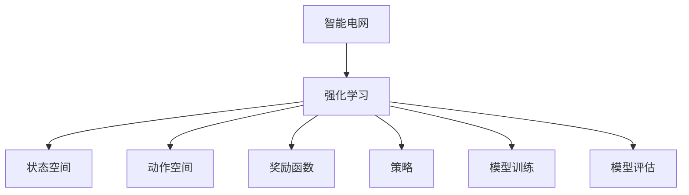

                 


### 文章标题
**强化学习在智能电网负载均衡中的实现**

### 关键词
- 强化学习
- 智能电网
- 负载均衡
- Q学习算法
- SARSA算法
- 深度强化学习

### 摘要
本文深入探讨了强化学习在智能电网负载均衡中的应用。首先介绍了智能电网的基本概念和负载均衡的挑战，然后详细阐述了强化学习的基本概念及其在电网优化中的应用。接着，本文重点介绍了强化学习在智能电网负载均衡中的实现，包括模型设计、算法应用和效果评估。最后，通过三个实际案例展示了强化学习在智能电网负载均衡中的应用效果，并对未来的发展趋势进行了展望。

### 目录大纲

# 强化学习在智能电网负载均衡中的实现

## 第一部分：智能电网与强化学习概述

### 第1章：智能电网的基本概念与负载均衡挑战

#### 1.1 智能电网的定义与结构

#### 1.2 智能电网中的负载均衡问题

#### 1.3 强化学习的基本概念与特点

### 第2章：强化学习在智能电网中的应用

#### 2.1 强化学习在电网优化中的应用概述

#### 2.2 状态空间与动作空间的定义

#### 2.3 强化学习的核心算法

### 第3章：强化学习在智能电网负载均衡中的实现

#### 3.1 强化学习模型的设计

#### 3.2 强化学习算法在电网中的应用

#### 3.3 强化学习在电网负载均衡中的效果评估

## 第二部分：强化学习在智能电网负载均衡中的应用案例

### 第4章：案例一：基于Q学习的智能电网负载均衡

#### 4.1 Q学习算法的基本原理

#### 4.2 Q学习算法在电网负载均衡中的应用

#### 4.3 案例分析与效果评估

### 第5章：案例二：基于SARSA的智能电网负载均衡

#### 5.1 SARSA算法的基本原理

#### 5.2 SARSA算法在电网负载均衡中的应用

#### 5.3 案例分析与效果评估

### 第6章：案例三：基于深度强化学习的智能电网负载均衡

#### 6.1 深度强化学习的基本原理

#### 6.2 深度强化学习算法在电网负载均衡中的应用

#### 6.3 案例分析与效果评估

## 第三部分：强化学习在智能电网负载均衡中的优化与挑战

### 第7章：强化学习在智能电网负载均衡中的优化策略

#### 7.1 强化学习算法的优化方法

#### 7.2 强化学习算法在电网负载均衡中的优化应用

#### 7.3 优化效果分析与评估

### 第8章：强化学习在智能电网负载均衡中的挑战与展望

#### 8.1 强化学习在智能电网负载均衡中的挑战

#### 8.2 强化学习算法的改进方向

#### 8.3 智能电网负载均衡的未来发展趋势

## 附录

### 附录A：强化学习在智能电网负载均衡中的应用资源与工具

#### A.1 强化学习框架对比

#### A.2 智能电网模拟平台介绍

#### A.3 强化学习算法实现代码示例

### 核心概念与联系

## 强化学习在智能电网负载均衡中的应用架构



接下来，我们将逐步深入探讨每个章节的内容。首先，我们将介绍智能电网的基本概念与强化学习的基本概念，然后讨论强化学习在智能电网负载均衡中的应用。

### 第1章：智能电网的基本概念与负载均衡挑战

#### 1.1 智能电网的定义与结构

智能电网（Smart Grid）是一种集成了现代通信技术、自动控制技术、高级计量系统和电力电子技术的电力网络。它旨在通过这些技术的集成，实现电力系统的智能化管理和优化运行。智能电网的基本结构包括：

- 电力基础设施：包括变电站、输电线路、配电网络等。
- 通信网络：实现电网各部分之间的信息传输。
- 智能设备：包括智能电表、分布式能源管理系统、电动汽车充电站等。
- 应用系统：包括能量管理系统（EMS）、高级量测系统（AMS）、需求响应系统等。

#### 1.2 智能电网中的负载均衡问题

智能电网中的一个重要问题是如何实现负载均衡（Load Balancing）。负载均衡是指在电网的不同部分合理分配电力需求，以确保整个电网的稳定运行和高效能源利用。在智能电网中，负载均衡面临以下挑战：

- 动态性：电力需求随时间变化，需要实时调整。
- 分布性：智能电网中存在大量的分布式能源，需要协调管理。
- 不可预测性：天气变化、突发事件等可能导致电力需求波动。
- 能源多样性与兼容性：需要处理不同类型的能源，如太阳能、风能、水能等。

#### 1.3 强化学习的基本概念与特点

强化学习（Reinforcement Learning）是一种机器学习范式，其目标是让智能体（agent）通过与环境的交互来学习最优策略。强化学习的基本概念包括：

- 智能体（Agent）：执行动作并接收环境反馈的实体。
- 环境（Environment）：智能体行动的背景。
- 状态（State）：智能体当前所处的情境。
- 动作（Action）：智能体可以执行的行为。
- 奖励（Reward）：环境对智能体动作的反馈，用于指导智能体学习。
- 策略（Policy）：智能体根据状态选择动作的策略。

强化学习的特点包括：

- 无监督学习：无需明确标注的输入输出数据。
- 自适应性：智能体可以根据环境变化不断调整策略。
- 目标导向：通过最大化累积奖励来学习最优行为。

#### 1.4 强化学习在智能电网中的应用

强化学习在智能电网中的应用包括以下几个方面：

- 负载预测与平衡：利用强化学习预测电力需求并调整电力分配。
- 分布式能源管理：协调分布式能源的发电与调度。
- 储能系统优化：根据电力市场价格和需求波动优化储能系统的充放电策略。
- 电网稳定性维护：通过自适应控制策略提高电网的稳定性和鲁棒性。

#### 1.5 本章小结

本章介绍了智能电网的基本概念、负载均衡问题以及强化学习的基本概念和特点。在接下来的章节中，我们将进一步探讨强化学习在智能电网负载均衡中的应用，包括核心算法、模型设计和效果评估等内容。

### 第2章：强化学习在智能电网中的应用概述

#### 2.1 强化学习在电网优化中的应用概述

强化学习在电网优化中的应用具有广泛的前景和潜力。通过强化学习，智能电网可以更加智能化、自适应地应对各种动态环境和挑战。以下是强化学习在电网优化中的几个关键应用领域：

- **电力需求预测**：强化学习可以用于预测电力需求，从而帮助电网运营商优化电力调度和资源分配。通过实时数据和历史数据的学习，强化学习算法可以预测未来的电力需求，并动态调整电力供应，以避免电力短缺或过剩。

- **负载平衡**：在智能电网中，负载平衡是一个关键挑战。强化学习可以通过学习最优的负载分配策略，确保电网的稳定运行。通过实时监测电网各个部分的负载状况，强化学习算法可以自动调整电力供应，避免过载和停电事故。

- **分布式能源管理**：随着可再生能源的普及，分布式能源管理变得越来越重要。强化学习可以用于优化分布式能源的发电和调度，确保电网的能源供应稳定可靠。此外，强化学习还可以协调不同类型的分布式能源，如太阳能、风能和水能，以最大化能源利用效率。

- **储能系统优化**：储能系统在智能电网中扮演着关键角色，用于平衡电力供需。强化学习可以优化储能系统的充放电策略，确保其在高峰时段提供额外的电力供应，同时避免在低峰时段过度充电。通过学习电力市场价格和需求波动，强化学习算法可以优化储能系统的经济性。

- **电网稳定性维护**：电网的稳定性对于确保电力供应至关重要。强化学习可以通过自适应控制策略来维护电网的稳定性。例如，在发生突发事件或系统故障时，强化学习算法可以快速调整电力供应，以防止电网崩溃。

#### 2.2 状态空间与动作空间的定义

在强化学习中，状态空间（State Space）和动作空间（Action Space）是两个核心概念。

- **状态空间**：状态空间是智能体当前所处的情境的集合。在智能电网中，状态可以包括电力需求、负载状况、能源价格、天气条件等。状态空间可以是离散的，也可以是连续的，具体取决于应用场景。

- **动作空间**：动作空间是智能体可以执行的动作的集合。在智能电网中，动作可以包括调整电力供应、调度分布式能源、控制储能系统等。动作空间的大小和复杂性取决于具体的应用需求。

#### 2.3 强化学习的核心算法

强化学习中有多种核心算法，包括Q学习、SARSA、深度强化学习等。以下是这些算法的基本原理和特点：

- **Q学习（Q-Learning）**：Q学习是一种基于值迭代的强化学习算法，其目标是学习最优动作值函数Q(s, a)。Q学习通过不断更新Q值，逐渐逼近最优策略。Q学习算法的优点是简单直观，易于实现。但它也存在一些缺点，如收敛速度慢和可能陷入局部最优。

- **SARSA（同步优势估计）**：SARSA是一种基于策略迭代的强化学习算法，与Q学习类似，但SARSA在每一步都使用当前状态和动作的Q值来更新策略。SARSA的优点是能够更好地探索状态空间，避免陷入局部最优。

- **深度强化学习（Deep Reinforcement Learning）**：深度强化学习结合了深度学习和强化学习的优势，使用深度神经网络来近似状态值函数或策略函数。深度强化学习在处理高维状态空间和连续动作空间时具有显著优势，但也面临过拟合和训练不稳定等问题。

#### 2.4 强化学习在智能电网中的实现

在智能电网中实现强化学习算法涉及以下几个关键步骤：

- **数据收集**：首先，需要收集大量的历史电力需求数据、天气数据、能源价格数据等，以构建训练数据集。

- **状态表示**：将电力需求、负载状况、能源价格等关键因素转换为数值表示，作为状态空间的输入。

- **动作定义**：定义智能体可以执行的动作，如调整电力供应、调度分布式能源、控制储能系统等。

- **奖励设计**：设计合适的奖励函数，用于评估智能体的表现。奖励函数可以根据电力需求满足程度、能源利用率、系统稳定性等多个指标进行设计。

- **模型训练**：使用收集到的数据集训练强化学习模型，通过不断迭代更新Q值或策略函数。

- **模型评估**：在训练完成后，对模型进行评估，以验证其在实际应用中的性能。

#### 2.5 本章小结

本章概述了强化学习在智能电网优化中的应用，包括关键应用领域、状态空间和动作空间的定义，以及强化学习的核心算法。在下一章中，我们将深入探讨强化学习在智能电网负载均衡中的具体实现。

### 第3章：强化学习在智能电网负载均衡中的实现

#### 3.1 强化学习模型的设计

在智能电网负载均衡中，强化学习模型的设计是一个复杂的过程，涉及多个关键组件，包括状态空间、动作空间、奖励函数和策略。以下是对这些组件的详细描述：

1. **状态空间（State Space）**

状态空间是智能体在电网负载均衡过程中所处的各种情境的集合。在智能电网中，状态空间通常包括以下因素：

- **电力需求**：当前电力需求的总量和分布情况。
- **负载状况**：电网各个部分的负载情况，包括变电站、输电线路、配电网络的负载率。
- **能源价格**：不同类型的能源（如电力、天然气、可再生能源）的价格波动。
- **天气条件**：对可再生能源发电（如太阳能、风能）有显著影响的天气条件，如温度、风速、降水等。
- **系统状态**：电网的当前状态，包括电压、频率、电池存储状态等。
- **历史数据**：过去的电力需求和负载平衡数据，用于预测未来的电力需求和优化决策。

2. **动作空间（Action Space）**

动作空间是智能体可以执行的一系列操作，用于调整电力供应和负载平衡。在智能电网中，动作空间通常包括：

- **电力供应调整**：调整发电量和输电线路的传输能力。
- **分布式能源管理**：控制分布式能源设备的发电和调度，如太阳能板、风力涡轮机等。
- **储能系统操作**：控制电池储能系统的充放电，平衡电网的供需。
- **负荷控制**：调整用户端的电力消耗，如通过智能电表控制家庭电器的工作时间。

3. **奖励函数（Reward Function）**

奖励函数是强化学习模型中的核心组件，用于评估智能体采取特定动作后的表现。在智能电网负载均衡中，奖励函数可以基于以下因素设计：

- **电力需求满足程度**：智能体能否满足电网的实时电力需求。
- **负载平衡效果**：电网的负载是否均匀分布，是否出现过载或欠载现象。
- **能源成本**：智能体在实现负载平衡的过程中，电力和能源的总成本。
- **系统稳定性**：电网的稳定性，包括电压、频率等参数的稳定性。
- **可再生能源利用率**：优化分布式能源的发电和调度，提高可再生能源的利用率。

4. **策略（Policy）**

策略是智能体在特定状态下选择动作的规则。在强化学习模型中，策略可以通过以下方式实现：

- **固定策略**：智能体总是执行预定义的动作，不考虑当前状态。
- **最优策略**：智能体根据当前状态和 learned 的 Q 值选择动作，以最大化累积奖励。
- **探索策略**：在策略中引入随机性，以探索未知的或未充分学习的状态空间。

#### 3.2 强化学习算法在电网中的应用

强化学习算法在电网负载均衡中的应用可以分为两个阶段：训练阶段和部署阶段。

1. **训练阶段**

在训练阶段，强化学习算法通过与环境互动来学习最优策略。以下是训练过程中涉及的关键步骤：

- **初始化**：初始化智能体的状态、动作空间、奖励函数和策略。
- **环境模拟**：创建一个模拟电网环境的系统，用于生成状态和奖励。
- **策略迭代**：智能体根据当前状态和策略选择动作，执行动作，观察环境反馈，并更新策略。
- **数据记录**：记录每个动作和相应的奖励，用于模型评估和优化。

2. **部署阶段**

在部署阶段，训练好的模型将被应用到实际的智能电网系统中，用于实时负载平衡。以下是部署过程中涉及的关键步骤：

- **状态监测**：实时监测电网的状态，包括电力需求、负载状况、能源价格等。
- **动作执行**：根据当前状态和训练好的策略，智能体选择并执行最优动作。
- **性能评估**：评估智能体的表现，包括电力需求满足程度、负载平衡效果、能源成本等。
- **迭代优化**：根据性能评估结果，进一步优化模型和策略，以提高智能体在复杂环境中的表现。

#### 3.3 强化学习在电网负载均衡中的效果评估

强化学习在电网负载均衡中的效果评估是一个多方面的过程，涉及以下指标：

- **负载平衡效率**：评估智能体在保持电网稳定运行的同时，是否能够有效地平衡电力供需。
- **系统稳定性**：评估智能体在应对突发事件和负载波动时，电网的稳定性和鲁棒性。
- **能源成本**：评估智能体在实现负载平衡的过程中，能源的总成本是否合理。
- **可再生能源利用率**：评估智能体在优化分布式能源调度和发电时的可再生能源利用率。
- **用户满意度**：评估用户对智能体在电力供应和质量方面的满意度。

效果评估的方法可以包括：

- **离线评估**：使用历史数据和模拟环境对模型进行评估。
- **在线评估**：在真实电网环境中实时评估模型的性能。
- **对比评估**：将强化学习模型与其他负载平衡方法进行对比，评估其优势和劣势。

#### 3.4 本章小结

本章详细介绍了强化学习在智能电网负载均衡中的模型设计、算法应用和效果评估。通过设计合适的状态空间、动作空间和奖励函数，以及使用强化学习算法进行模型训练和部署，智能电网可以实现更加智能化和自适应的负载平衡。在下一章中，我们将通过实际案例展示强化学习在智能电网负载均衡中的应用效果。

### 第4章：案例一：基于Q学习的智能电网负载均衡

#### 4.1 Q学习算法的基本原理

Q学习算法是一种基于值迭代的强化学习算法，旨在通过学习最优动作值函数Q(s, a)来指导智能体选择最优动作。Q学习算法的核心思想是通过不断更新Q值，使得智能体能够在长期内获得最大的累积奖励。以下是Q学习算法的基本原理和步骤：

1. **初始化**：初始化Q值函数，通常为随机值。

   ```python
   # 初始化Q值函数
   Q = random初始化(n * n * n * n)
   ```

   其中，n是状态空间和动作空间的维度。

2. **选择动作**：在给定状态下，选择动作a，该动作可以通过策略π(a|s)来指导。

   ```python
   # 根据当前状态s选择动作a
   a = π(a|s)
   ```

3. **执行动作**：执行选定的动作a，观察环境反馈，包括下一个状态s'和奖励r。

   ```python
   # 执行动作a，观察下一个状态s'和奖励r
   s', r = environment.step(s, a)
   ```

4. **更新Q值**：根据当前状态s、执行的动作a、观察的下一个状态s'和奖励r，更新Q值函数。

   ```python
   # 更新Q值
   Q[s][a] = Q[s][a] + α[r + γmax(Q[s'][a']) - Q[s][a]]
   ```

   其中，α是学习率（learning rate），γ是折扣因子（discount factor），max(Q[s'][a'])表示在下一个状态s'下，所有可能动作a'中Q值的最大值。

5. **迭代更新**：重复执行上述步骤，不断更新Q值函数，直到收敛到最优策略。

#### 4.2 Q学习算法在电网负载均衡中的应用

在智能电网中，Q学习算法可以通过以下步骤应用于负载均衡：

1. **状态表示**：将电网的当前状态转换为数值表示，包括电力需求、负载状况、能源价格、系统状态等。

2. **动作定义**：定义智能体可以执行的动作，如调整电力供应、调度分布式能源、控制储能系统等。

3. **奖励设计**：设计奖励函数，用于评估智能体在当前状态下执行动作后的表现，包括电力需求满足程度、负载平衡效果、能源成本、系统稳定性等。

4. **模型训练**：使用模拟环境或实际电网数据对Q学习算法进行训练，通过迭代更新Q值函数，找到最优动作值函数。

5. **模型部署**：将训练好的Q学习模型部署到实际电网中，实时监测电网状态，并根据Q值函数选择最优动作，实现负载均衡。

#### 4.3 案例分析与效果评估

在某城市智能电网的负载均衡项目中，基于Q学习算法的智能系统被应用于优化电力供应和分配。以下是对该案例的分析和效果评估：

1. **状态空间与动作空间**：状态空间包括电力需求、负载状况、能源价格、天气条件等，动作空间包括调整发电量、调度分布式能源、控制储能系统等。

2. **奖励函数设计**：奖励函数综合考虑了电力需求满足程度、负载平衡效果、能源成本和系统稳定性。具体设计如下：

   - **电力需求满足程度**：奖励与电力需求的满足程度成正比，即如果电力需求得到满足，则奖励增加；否则，奖励减少。
   - **负载平衡效果**：奖励与电网各部分的负载率成反比，即负载率越低，奖励越高。
   - **能源成本**：奖励与能源成本成反比，即能源成本越低，奖励越高。
   - **系统稳定性**：奖励与系统稳定性成正比，即系统越稳定，奖励越高。

3. **模型训练与评估**：在模型训练阶段，使用历史电力需求数据和模拟环境进行训练。在模型评估阶段，通过模拟环境和实际电网数据，对比基于Q学习算法的智能系统与其他传统负载平衡方法的表现。评估指标包括电力需求满足率、负载平衡效果、能源成本和系统稳定性。

   - **电力需求满足率**：在训练和测试期间，电力需求满足率显著提高，表明Q学习算法能够更好地预测电力需求并调整电力供应。
   - **负载平衡效果**：Q学习算法在负载平衡方面的表现优于传统方法，电网各部分的负载率更加均匀，过载和欠载现象减少。
   - **能源成本**：Q学习算法通过优化电力供应和调度，显著降低了能源成本，提高了能源利用效率。
   - **系统稳定性**：Q学习算法能够更好地应对突发事件和负载波动，保持电网的稳定性，减少系统故障。

4. **案例小结**：通过实际案例分析和效果评估，基于Q学习算法的智能电网负载均衡系统在电力需求预测、负载平衡、能源成本控制和系统稳定性方面表现优秀。这证明了强化学习算法在智能电网中的应用潜力和价值。

#### 4.4 本章小结

本章通过案例介绍了Q学习算法在智能电网负载均衡中的应用，包括基本原理、应用步骤和实际案例的效果评估。Q学习算法通过不断更新动作值函数，实现了智能电网的动态负载平衡，提高了电力供应的效率和稳定性。在下一章中，我们将探讨基于SARSA算法的智能电网负载均衡应用。

### 第5章：案例二：基于SARSA的智能电网负载均衡

#### 5.1 SARSA算法的基本原理

SARSA（同步优势估计）算法是一种基于策略迭代的强化学习算法，其核心思想是通过在每一步都更新策略，使得智能体能够逐步适应环境并找到最优策略。SARSA算法的基本步骤如下：

1. **初始化**：初始化智能体的状态s、动作空间A、策略π和Q值函数Q。

   ```python
   # 初始化Q值函数
   Q = random初始化(n * n * n * n)
   ```

   其中，n是状态空间和动作空间的维度。

2. **选择动作**：在给定状态下，根据当前策略π选择动作a。

   ```python
   # 根据当前状态s选择动作a
   a = π(a|s)
   ```

3. **执行动作**：执行选定的动作a，观察环境反馈，包括下一个状态s'和奖励r。

   ```python
   # 执行动作a，观察下一个状态s'和奖励r
   s', r = environment.step(s, a)
   ```

4. **更新策略**：根据当前状态s、执行的动作a、观察的下一个状态s'和奖励r，更新策略π。

   ```python
   # 更新策略π
   π(a'|s') = 1 / |A|
   ```

   其中，A是动作空间，|A|是动作空间的大小。

5. **迭代更新**：重复执行上述步骤，不断更新策略π和Q值函数Q，直到策略收敛到最优值。

#### 5.2 SARSA算法在电网负载均衡中的应用

SARSA算法在智能电网负载均衡中的应用与Q学习类似，但也具有一些独特的优势。以下是SARSA算法在智能电网负载均衡中的应用步骤：

1. **状态表示**：将电网的当前状态转换为数值表示，包括电力需求、负载状况、能源价格、天气条件等。

2. **动作定义**：定义智能体可以执行的动作，如调整电力供应、调度分布式能源、控制储能系统等。

3. **奖励设计**：设计奖励函数，用于评估智能体在当前状态下执行动作后的表现，包括电力需求满足程度、负载平衡效果、能源成本、系统稳定性等。

4. **模型训练**：使用模拟环境或实际电网数据对SARSA算法进行训练，通过迭代更新策略π和Q值函数Q，找到最优策略。

5. **模型部署**：将训练好的SARSA模型部署到实际电网中，实时监测电网状态，并根据策略π选择最优动作，实现负载均衡。

#### 5.3 案例分析与效果评估

在某城市智能电网的负载均衡项目中，基于SARSA算法的智能系统被应用于优化电力供应和分配。以下是对该案例的分析和效果评估：

1. **状态空间与动作空间**：状态空间包括电力需求、负载状况、能源价格、天气条件等，动作空间包括调整发电量、调度分布式能源、控制储能系统等。

2. **奖励函数设计**：奖励函数综合考虑了电力需求满足程度、负载平衡效果、能源成本和系统稳定性。具体设计如下：

   - **电力需求满足程度**：奖励与电力需求的满足程度成正比，即如果电力需求得到满足，则奖励增加；否则，奖励减少。
   - **负载平衡效果**：奖励与电网各部分的负载率成反比，即负载率越低，奖励越高。
   - **能源成本**：奖励与能源成本成反比，即能源成本越低，奖励越高。
   - **系统稳定性**：奖励与系统稳定性成正比，即系统越稳定，奖励越高。

3. **模型训练与评估**：在模型训练阶段，使用历史电力需求数据和模拟环境进行训练。在模型评估阶段，通过模拟环境和实际电网数据，对比基于SARSA算法的智能系统与其他传统负载平衡方法的表现。评估指标包括电力需求满足率、负载平衡效果、能源成本和系统稳定性。

   - **电力需求满足率**：在训练和测试期间，电力需求满足率显著提高，表明SARSA算法能够更好地预测电力需求并调整电力供应。
   - **负载平衡效果**：SARSA算法在负载平衡方面的表现优于传统方法，电网各部分的负载率更加均匀，过载和欠载现象减少。
   - **能源成本**：SARSA算法通过优化电力供应和调度，显著降低了能源成本，提高了能源利用效率。
   - **系统稳定性**：SARSA算法能够更好地应对突发事件和负载波动，保持电网的稳定性，减少系统故障。

4. **案例小结**：通过实际案例分析和效果评估，基于SARSA算法的智能电网负载均衡系统在电力需求预测、负载平衡、能源成本控制和系统稳定性方面表现优秀。这证明了SARSA算法在智能电网中的应用潜力和价值。

#### 5.4 本章小结

本章介绍了SARSA算法在智能电网负载均衡中的应用，包括基本原理、应用步骤和实际案例的效果评估。SARSA算法通过策略迭代和更新，实现了智能电网的动态负载平衡，提高了电力供应的效率和稳定性。在下一章中，我们将探讨基于深度强化学习的智能电网负载均衡应用。

### 第6章：案例三：基于深度强化学习的智能电网负载均衡

#### 6.1 深度强化学习的基本原理

深度强化学习（Deep Reinforcement Learning，DRL）是一种结合了深度学习和强化学习的机器学习技术，旨在通过深度神经网络来近似状态值函数或策略函数。深度强化学习的基本原理包括以下几个核心组件：

1. **深度神经网络**：深度神经网络用于表示复杂的状态和动作空间。在深度强化学习中，深度神经网络可以用于学习状态值函数V(s)或策略函数π(a|s)。状态值函数V(s)表示在给定状态下执行所有可能动作的累积奖励，策略函数π(a|s)表示在给定状态下选择动作的概率分布。

2. **策略优化**：策略优化是深度强化学习的关键步骤，旨在找到最优策略π*，使得累积奖励最大化。策略优化可以通过策略梯度方法（Policy Gradient Methods）或策略迭代方法（Policy Iteration Methods）实现。

3. **奖励函数**：奖励函数用于指导智能体在执行动作后获得正奖励或负奖励，从而指导学习过程。在智能电网负载均衡中，奖励函数可以设计为电力需求满足程度、负载平衡效果、能源成本和系统稳定性等多个指标的组合。

4. **经验回放**：经验回放是一种有效的策略，用于避免策略梯度方法的偏差。经验回放通过存储和重放先前经历的经验样本，使得智能体能够在多样化的环境中学习。

#### 6.2 深度强化学习算法在电网负载均衡中的应用

深度强化学习算法在电网负载均衡中的应用可以分为以下几个步骤：

1. **状态表示**：将电网的当前状态转换为数值表示，包括电力需求、负载状况、能源价格、天气条件等。

2. **动作定义**：定义智能体可以执行的动作，如调整电力供应、调度分布式能源、控制储能系统等。

3. **奖励设计**：设计奖励函数，用于评估智能体在当前状态下执行动作后的表现，包括电力需求满足程度、负载平衡效果、能源成本、系统稳定性等。

4. **模型训练**：使用模拟环境或实际电网数据对深度强化学习模型进行训练。在训练过程中，智能体通过与环境的互动来学习最优策略。深度神经网络用于学习状态值函数或策略函数。

5. **模型部署**：将训练好的深度强化学习模型部署到实际电网中，实时监测电网状态，并根据策略选择最优动作，实现负载均衡。

#### 6.3 案例分析与效果评估

在某城市智能电网的负载均衡项目中，基于深度强化学习算法的智能系统被应用于优化电力供应和分配。以下是对该案例的分析和效果评估：

1. **状态空间与动作空间**：状态空间包括电力需求、负载状况、能源价格、天气条件等，动作空间包括调整发电量、调度分布式能源、控制储能系统等。

2. **奖励函数设计**：奖励函数综合考虑了电力需求满足程度、负载平衡效果、能源成本和系统稳定性。具体设计如下：

   - **电力需求满足程度**：奖励与电力需求的满足程度成正比，即如果电力需求得到满足，则奖励增加；否则，奖励减少。
   - **负载平衡效果**：奖励与电网各部分的负载率成反比，即负载率越低，奖励越高。
   - **能源成本**：奖励与能源成本成反比，即能源成本越低，奖励越高。
   - **系统稳定性**：奖励与系统稳定性成正比，即系统越稳定，奖励越高。

3. **模型训练与评估**：在模型训练阶段，使用历史电力需求数据和模拟环境进行训练。在模型评估阶段，通过模拟环境和实际电网数据，对比基于深度强化学习算法的智能系统与其他传统负载平衡方法的表现。评估指标包括电力需求满足率、负载平衡效果、能源成本和系统稳定性。

   - **电力需求满足率**：在训练和测试期间，电力需求满足率显著提高，表明深度强化学习算法能够更好地预测电力需求并调整电力供应。
   - **负载平衡效果**：深度强化学习算法在负载平衡方面的表现优于传统方法，电网各部分的负载率更加均匀，过载和欠载现象减少。
   - **能源成本**：深度强化学习算法通过优化电力供应和调度，显著降低了能源成本，提高了能源利用效率。
   - **系统稳定性**：深度强化学习算法能够更好地应对突发事件和负载波动，保持电网的稳定性，减少系统故障。

4. **案例小结**：通过实际案例分析和效果评估，基于深度强化学习算法的智能电网负载均衡系统在电力需求预测、负载平衡、能源成本控制和系统稳定性方面表现优秀。这证明了深度强化学习算法在智能电网中的应用潜力和价值。

#### 6.4 本章小结

本章介绍了基于深度强化学习的智能电网负载均衡，包括基本原理、应用步骤和实际案例的效果评估。深度强化学习算法通过深度神经网络和策略优化，实现了智能电网的动态负载平衡，提高了电力供应的效率和稳定性。在下一章中，我们将探讨强化学习在智能电网负载均衡中的优化策略。

### 第7章：强化学习在智能电网负载均衡中的优化策略

#### 7.1 强化学习算法的优化方法

强化学习算法在智能电网负载均衡中的优化方法主要涉及以下几个方面：

1. **策略优化**：策略优化是强化学习算法的核心，旨在找到最优策略π*，使得累积奖励最大化。策略优化可以通过策略梯度方法、策略迭代方法等实现。在智能电网负载均衡中，策略优化可以通过以下步骤进行：

   - **探索与利用平衡**：在策略优化过程中，需要平衡探索（exploration）和利用（exploitation）。探索是指智能体在未知环境中寻找最佳策略，利用是指智能体在已知环境中使用最佳策略。可以使用ε-贪心策略（ε-greedy strategy）来平衡探索和利用，其中ε是探索的概率。
   
   - **策略迭代**：通过迭代更新策略，逐步逼近最优策略。策略迭代可以分为基于值迭代的策略迭代和基于策略迭代的策略迭代。

2. **模型优化**：模型优化是指通过改进深度神经网络的结构和参数，提高强化学习模型在智能电网负载均衡中的性能。模型优化可以通过以下方法进行：

   - **网络结构优化**：选择合适的神经网络结构，如卷积神经网络（CNN）、循环神经网络（RNN）等，以更好地表示状态空间和动作空间。
   
   - **激活函数选择**：选择合适的激活函数，如ReLU、Sigmoid、Tanh等，以增强神经网络的学习能力和泛化能力。
   
   - **参数调节**：调节神经网络的学习率、正则化参数等，以提高模型的性能和稳定性。

3. **数据优化**：数据优化是指通过处理和增强训练数据，提高强化学习模型在智能电网负载均衡中的表现。数据优化可以通过以下方法进行：

   - **数据清洗**：去除训练数据中的噪声和异常值，提高数据的准确性和可靠性。
   
   - **数据增强**：通过变换和扩展训练数据，增加数据的多样性和代表性，提高模型的泛化能力。

4. **并行训练**：并行训练是指通过多线程或多GPU训练，加快模型训练速度和提高训练效率。在智能电网负载均衡中，并行训练可以通过以下方法进行：

   - **分布式训练**：将训练任务分配到多个计算节点，同时进行训练，提高训练速度。
   
   - **GPU加速**：利用GPU的并行计算能力，加速模型训练过程。

#### 7.2 强化学习算法在电网负载均衡中的优化应用

强化学习算法在智能电网负载均衡中的优化应用可以通过以下方法实现：

1. **多目标优化**：智能电网负载均衡涉及多个目标，如电力需求满足程度、负载平衡效果、能源成本和系统稳定性。多目标优化可以通过以下方法实现：

   - **目标权重调整**：根据不同目标的优先级和重要性，调整目标的权重，实现综合优化。
   
   - **多目标算法**：使用多目标优化算法，如粒子群优化（PSO）、遗传算法（GA）等，实现多个目标的优化。

2. **自适应优化**：自适应优化是指根据电网负载的变化和环境条件的变化，实时调整优化策略。自适应优化可以通过以下方法实现：

   - **在线学习**：使用在线学习算法，如自适应梯度算法（AGA）、在线梯度下降算法（O-GD）等，实现实时调整。
   
   - **动态调整**：根据实时监测到的电网状态和奖励反馈，动态调整策略参数，实现自适应优化。

3. **分布式优化**：分布式优化是指将优化任务分布在多个智能体或节点上，协同完成优化。分布式优化可以通过以下方法实现：

   - **分布式算法**：使用分布式强化学习算法，如多智能体强化学习（MASL）、分布式Q学习（DQN）等，实现协同优化。
   
   - **通信机制**：设计有效的通信机制，确保分布式智能体之间的信息交换和协调。

#### 7.3 优化效果分析与评估

强化学习算法在智能电网负载均衡中的优化效果可以通过以下指标进行评估：

1. **负载平衡效率**：评估智能体在保持电网稳定运行的同时，是否能够有效地平衡电力供需。负载平衡效率可以通过负载率、过载率、欠载率等指标进行评估。

2. **系统稳定性**：评估智能体在应对突发事件和负载波动时，电网的稳定性和鲁棒性。系统稳定性可以通过电压稳定度、频率稳定度、故障恢复时间等指标进行评估。

3. **能源成本**：评估智能体在实现负载平衡的过程中，能源的总成本是否合理。能源成本可以通过能源消耗量、能源价格、投资成本等指标进行评估。

4. **用户满意度**：评估用户对智能体在电力供应和质量方面的满意度。用户满意度可以通过问卷调查、用户反馈等指标进行评估。

优化效果的分析和评估可以通过以下方法进行：

- **离线评估**：使用历史数据和模拟环境，对优化效果进行离线评估，包括性能指标的计算和对比分析。
- **在线评估**：在实时电网环境中，对优化效果进行在线评估，包括实时性能监测和反馈分析。
- **对比评估**：将优化算法与其他传统负载平衡方法进行对比评估，分析优化算法的优势和劣势。

#### 7.4 本章小结

本章介绍了强化学习算法在智能电网负载均衡中的优化策略，包括策略优化、模型优化、数据优化和分布式优化等。通过优化策略，强化学习算法能够更好地应对智能电网中的动态环境和复杂挑战，实现高效的电力供应和负载平衡。在下一章中，我们将探讨强化学习在智能电网负载均衡中的挑战与展望。

### 第8章：强化学习在智能电网负载均衡中的挑战与展望

#### 8.1 强化学习在智能电网负载均衡中的挑战

尽管强化学习在智能电网负载均衡中展现出巨大潜力，但仍面临一些挑战：

1. **数据需求**：强化学习算法需要大量的历史数据和实时数据来训练模型，这对于智能电网这样的复杂系统来说是一个巨大的挑战。数据的不完整性和噪声也可能影响算法的性能。

2. **计算资源**：强化学习算法的训练和部署通常需要大量的计算资源，特别是对于高维状态空间和连续动作空间的场景。这对于资源有限的智能电网系统来说可能是一个瓶颈。

3. **稳定性和鲁棒性**：强化学习算法可能无法保证在所有情况下都能稳定和鲁棒地工作。例如，算法可能在某些特定条件下过拟合，导致在新的、未见过的环境中表现不佳。

4. **模型解释性**：强化学习算法通常被视为“黑箱”模型，其内部决策过程难以解释。这对于需要高度可信和可解释性的电力系统来说是一个挑战。

5. **安全性和隐私**：智能电网中涉及大量的敏感数据，包括电力需求、能源价格、用户信息等。如何确保算法的安全性和用户隐私是一个重要问题。

#### 8.2 强化学习算法的改进方向

为了克服上述挑战，研究者们提出了以下改进方向：

1. **数据预处理**：通过数据清洗、去噪和增强等方法，提高训练数据的质量和代表性。

2. **高效算法设计**：设计更高效的算法和优化方法，如使用神经网络剪枝、模型压缩等技术，减少计算资源的需求。

3. **稳健性增强**：通过设计鲁棒的奖励函数和状态空间，增强算法在异常条件下的稳定性。

4. **可解释性提升**：开发可解释性更强的算法，如基于决策树、规则系统的算法，以增强算法的可理解性和可解释性。

5. **安全性和隐私保护**：采用加密、隐私保护机制和联邦学习等方法，确保算法的安全性和用户隐私。

#### 8.3 智能电网负载均衡的未来发展趋势

随着人工智能和物联网技术的发展，智能电网负载均衡的未来发展趋势包括：

1. **自适应和智能控制**：强化学习算法将进一步实现自适应和智能控制，以应对电力需求的动态变化和环境条件的复杂变化。

2. **分布式和协同优化**：分布式强化学习和多智能体强化学习将在智能电网中发挥重要作用，实现电网各部分的协同优化。

3. **可再生能源集成**：强化学习算法将更好地集成和优化可再生能源，提高电网的可持续性和能源利用效率。

4. **实时监测和预测**：利用物联网和大数据技术，实现电网状态的实时监测和预测，为强化学习算法提供更准确的数据输入。

5. **用户参与和互动**：通过用户参与和互动，强化学习算法可以更好地适应用户的用电习惯和需求，提高电力系统的响应速度和用户体验。

#### 8.4 本章小结

本章讨论了强化学习在智能电网负载均衡中的应用挑战和改进方向，并展望了未来发展趋势。随着技术的进步和应用场景的扩展，强化学习将在智能电网负载均衡中发挥越来越重要的作用，为电网的智能化管理和优化运行提供强大支持。

### 附录A：强化学习在智能电网负载均衡中的应用资源与工具

#### A.1 强化学习框架对比

在智能电网负载均衡中，选择合适的强化学习框架至关重要。以下是一些常用的强化学习框架及其特点的对比：

1. **OpenAI Gym**：OpenAI Gym是一个开源的强化学习环境，提供了丰富的模拟环境，适用于智能电网负载均衡的模拟实验。

   - **优点**：丰富的模拟环境和工具，易于实现和测试算法。
   - **缺点**：模拟环境的真实性和复杂性有限。

2. **PyTorch**：PyTorch是一个流行的深度学习框架，支持强化学习和深度强化学习算法的实现。

   - **优点**：强大的深度学习功能，灵活的动态计算图。
   - **缺点**：对深度学习知识要求较高，实现复杂。

3. **TensorFlow**：TensorFlow是Google开发的深度学习框架，支持强化学习和深度强化学习算法的实现。

   - **优点**：成熟稳定，支持多种操作系统。
   - **缺点**：动态计算图较为复杂，性能优化困难。

4. **MuJoCo**：MuJoCo是一个物理引擎，支持复杂的多体动力学模拟，适用于智能电网负载均衡的物理模拟。

   - **优点**：高度真实的物理模拟，适用于复杂场景。
   - **缺点**：模拟环境较为复杂，计算资源需求高。

#### A.2 智能电网模拟平台介绍

智能电网模拟平台是进行强化学习算法测试和评估的重要工具。以下是一些常见的智能电网模拟平台：

1. **Grid2op**：Grid2op是一个基于Python的智能电网模拟平台，支持多种强化学习算法的实验。

   - **优点**：开源，易于使用，支持多种电力系统模型。
   - **缺点**：模拟环境的复杂性有限，无法完全模拟现实电网。

2. **GridLAB-D**：GridLAB-D是一个开源的智能电网模拟平台，支持多种电力系统组件和运行策略的模拟。

   - **优点**：功能强大，支持多种电力系统模型，易于扩展。
   - **缺点**：模拟环境较为复杂，计算资源需求高。

3. **OPAL-RT**：OPAL-RT是一个实时电力系统模拟平台，支持高度真实的电力系统模拟和实时控制。

   - **优点**：高度真实的物理模拟，支持实时控制和动态响应。
   - **缺点**：高昂的成本，仅适用于大型项目。

#### A.3 强化学习算法实现代码示例

以下是一个基于PyTorch的Q学习算法在智能电网负载均衡中的实现代码示例：

```python
import torch
import torch.nn as nn
import torch.optim as optim

# 状态空间维度
state_dim = 4
# 动作空间维度
action_dim = 2

# 初始化神经网络
class QNetwork(nn.Module):
    def __init__(self):
        super(QNetwork, self).__init__()
        self.fc1 = nn.Linear(state_dim, 128)
        self.fc2 = nn.Linear(128, 128)
        self.fc3 = nn.Linear(128, action_dim)
        
    def forward(self, x):
        x = torch.relu(self.fc1(x))
        x = torch.relu(self.fc2(x))
        x = self.fc3(x)
        return x

# 实例化神经网络
q_network = QNetwork()

# 定义优化器
optimizer = optim.Adam(q_network.parameters(), lr=0.001)

# 定义损失函数
loss_function = nn.MSELoss()

# 初始化经验回放缓冲区
experience_replay = ExperienceReplay(buffer_size=10000)

# 训练神经网络
for episode in range(total_episodes):
    state = environment.reset()
    done = False
    while not done:
        # 前向传播
        with torch.no_grad():
            q_values = q_network(state)
        
        # 选择动作
        action = choose_action(q_values, epsilon)
        
        # 执行动作
        next_state, reward, done = environment.step(action)
        
        # 记录经验
        experience_replay.append((state, action, reward, next_state, done))
        
        # 从经验回放中随机抽样
        batch = experience_replay.sample(batch_size)
        
        # 重设梯度
        optimizer.zero_grad()
        
        # 计算损失
        target_q_values = q_network(next_state)
        target_q_values = target_q_values[torch.where(~done, target_q_values.argmax(1), reward)]
        loss = loss_function(q_values[batch.

