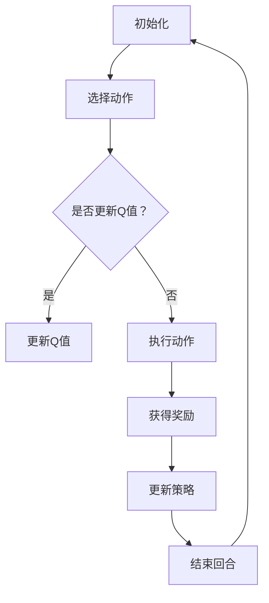
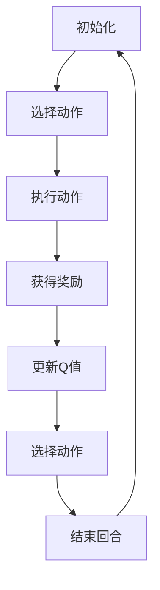
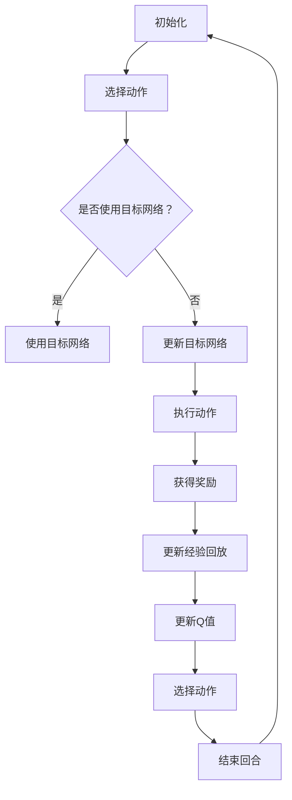
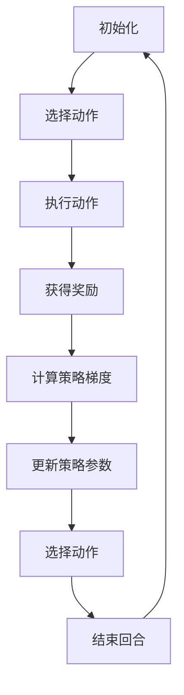

                 

### 文章标题

# 《强化学习在智能调度系统中的应用》

## 关键词
- 强化学习
- 智能调度系统
- 调度优化
- 深度强化学习
- 多智能体强化学习

### 摘要

本文旨在探讨强化学习在智能调度系统中的应用，包括其基础理论、算法原理、数学模型以及实际应用场景。通过对强化学习与调度问题的深度融合，我们分析了强化学习在作业调度和车辆路径规划中的具体实现，并探讨了智能调度系统的设计与实现。文章还展望了强化学习在调度系统中的未来发展方向，并提出了相关挑战和优化策略。通过本文的阅读，读者将能够全面了解强化学习在智能调度系统中的应用价值及其发展方向。

## 目录大纲

### 第一部分：强化学习基础

### 第1章：强化学习概述

#### 1.1 强化学习的基本概念

强化学习是机器学习的一个重要分支，它通过智能体（agent）与环境（environment）的交互，不断学习最优策略（policy）以实现目标。强化学习的基本概念包括智能体、环境、状态（state）、动作（action）、奖励（reward）和策略（policy）。

#### 1.2 强化学习的主要类型

强化学习可以分为基于价值的强化学习和基于策略的强化学习两大类。基于价值的强化学习通过学习价值函数来评估状态和动作的优劣，常见的算法有Q-Learning和SARSA。基于策略的强化学习直接学习策略函数，常见的算法有Policy Gradient。

#### 1.3 强化学习在智能调度系统中的应用场景

强化学习在智能调度系统中具有广泛的应用场景，如作业调度、任务分配、资源优化、车辆路径规划等。这些应用场景中的关键问题是如何在动态变化的环境中找到最优调度策略，以实现系统性能的最大化。

### 第2章：强化学习算法原理

#### 2.1 Q-Learning算法

Q-Learning算法是一种基于价值的强化学习算法，通过更新Q值（即状态-动作值函数）来学习最优策略。Q-Learning算法的核心思想是通过经验样本来迭代更新Q值，直到收敛到最优策略。

#### 2.2 SARSA算法

SARSA算法是一种同时更新状态-动作值函数的强化学习算法，它通过在一个回合内同时考虑当前状态和下一状态的动作值来更新Q值。SARSA算法的核心思想是在每一次动作选择时，同时考虑当前状态和未来状态的奖励。

#### 2.3 Deep Q Network（DQN）算法

DQN算法是一种基于深度学习的强化学习算法，它通过神经网络来近似Q值函数。DQN算法的核心思想是使用经验回放（experience replay）和目标网络（target network）来缓解训练样本的相关性和减少目标偏移。

#### 2.4 Policy Gradient算法

Policy Gradient算法是一种基于策略的强化学习算法，它通过直接优化策略函数来学习最优策略。Policy Gradient算法的核心思想是通过梯度下降法来优化策略参数，使策略函数最大化期望回报。

### 第3章：强化学习中的数学模型

#### 3.1 价值函数与策略函数

价值函数和策略函数是强化学习中的核心数学模型。价值函数用于评估状态和动作的优劣，常见的有状态值函数和动作值函数。策略函数则用于指导智能体在给定状态下选择最优动作。

#### 3.2 期望回报与折扣因子

期望回报和折扣因子是强化学习中的基本概念。期望回报用于评估智能体的策略性能，它表示智能体在执行某一策略时获得的平均奖励。折扣因子则用于平衡即时奖励和长期奖励，使得智能体能够考虑未来的奖励。

#### 3.3 探索与利用平衡

探索与利用平衡是强化学习中的关键挑战。探索是指智能体在未知环境中尝试新动作，以获得更多经验。利用则是指智能体在已知环境中选择最优动作，以最大化当前回报。探索与利用的平衡是实现最优策略的关键。

### 第4章：强化学习在调度问题中的应用

#### 4.1 调度问题的数学建模

调度问题可以看作是一个优化问题，目标是找到一组最优调度策略，以实现系统性能的最大化。调度问题的数学建模包括状态表示、动作表示和奖励函数设计。

#### 4.2 强化学习在作业调度中的应用

作业调度是强化学习在调度问题中的一个重要应用。通过将作业调度问题建模为强化学习问题，可以有效地解决作业分配、任务调度等实际问题。

#### 4.3 强化学习在车辆路径规划中的应用

车辆路径规划是另一个重要的调度问题，它涉及到车辆的行驶路线规划。通过将车辆路径规划问题建模为强化学习问题，可以有效地解决车辆调度、路径优化等实际问题。

### 第二部分：智能调度系统

### 第5章：智能调度系统概述

#### 5.1 智能调度系统的定义与目标

智能调度系统是一种基于人工智能技术的调度系统，它通过自动调度和优化任务分配，实现资源的高效利用和系统性能的最大化。智能调度系统的目标包括提高生产效率、降低成本、提高客户满意度等。

#### 5.2 智能调度系统的组成部分

智能调度系统通常包括任务管理模块、调度算法模块、资源管理模块和监控与反馈模块。这些模块相互协作，共同实现智能调度的目标。

#### 5.3 智能调度系统的典型应用场景

智能调度系统广泛应用于制造业、物流配送、交通运输、金融服务等领域。这些应用场景中的调度问题各具特点，但都可以通过强化学习技术来实现优化。

### 第6章：智能调度系统的设计与实现

#### 6.1 智能调度系统的需求分析

智能调度系统的设计首先需要进行需求分析，包括系统功能、性能、可靠性、可扩展性等方面的要求。需求分析是系统设计的重要基础。

#### 6.2 智能调度系统的体系结构设计

智能调度系统的体系结构设计包括系统的模块划分、接口设计、数据流设计等。体系结构设计需要充分考虑系统的可扩展性和可维护性。

#### 6.3 智能调度系统的功能模块设计

智能调度系统的功能模块设计包括任务管理模块、调度算法模块、资源管理模块和监控与反馈模块。这些模块需要相互协作，共同实现智能调度的目标。

### 第7章：强化学习在智能调度系统中的应用实例

#### 7.1 调度优化问题的实例分析

以一个制造业生产线调度问题为例，分析强化学习在调度优化中的应用。通过将调度问题建模为强化学习问题，可以有效地解决任务调度、资源优化等问题。

#### 7.2 基于强化学习的调度算法实现

介绍基于强化学习的调度算法实现，包括算法流程、代码实现和算法参数调整等方面的内容。通过实例演示，展示强化学习算法在调度优化中的实际效果。

#### 7.3 调度算法的性能评估与优化

对基于强化学习的调度算法进行性能评估，包括算法效率、稳定性、鲁棒性等方面的评估。通过优化算法参数和改进算法结构，提高调度算法的性能。

### 第8章：智能调度系统的实践与展望

#### 8.1 智能调度系统的实际应用案例

介绍智能调度系统在实际应用中的案例，包括制造业、物流配送、交通运输等领域。通过实际案例的分析，展示智能调度系统的应用效果和优势。

#### 8.2 智能调度系统的未来发展趋势

探讨智能调度系统的未来发展趋势，包括人工智能技术的不断进步、调度算法的优化和创新、应用领域的拓展等方面的内容。

#### 8.3 智能调度系统中的挑战与机遇

分析智能调度系统在应用过程中面临的挑战，如数据质量问题、算法稳定性问题、安全与隐私问题等。同时，探讨智能调度系统带来的机遇，如自动化生产、个性化服务等方面的应用。

### 第三部分：强化学习算法与调度系统的融合

### 第9章：强化学习算法在调度系统中的优化策略

#### 9.1 强化学习算法的选择与适配

根据不同的调度问题，选择合适的强化学习算法，并进行适配和优化。介绍常见的强化学习算法及其适用场景，为调度系统提供有效的算法支持。

#### 9.2 调度问题中的状态空间与动作空间设计

设计调度问题中的状态空间和动作空间，以满足强化学习算法的需求。介绍状态空间和动作空间的设计原则和方法，为调度系统的实现提供基础。

#### 9.3 调度问题中的奖励函数设计

设计调度问题中的奖励函数，以引导智能体学习最优调度策略。介绍奖励函数的设计原则和方法，为调度系统的优化提供依据。

### 第10章：调度系统中的多智能体强化学习

#### 10.1 多智能体强化学习的基本原理

介绍多智能体强化学习的基本原理，包括多智能体交互、合作与竞争等。分析多智能体强化学习在调度系统中的应用，为调度系统的优化提供新的思路。

#### 10.2 调度问题中的多智能体交互

分析调度问题中的多智能体交互，包括任务分配、资源共享、通信机制等方面的内容。介绍多智能体交互的设计原则和方法，为调度系统的实现提供参考。

#### 10.3 多智能体强化学习在调度系统中的应用

通过实例分析，展示多智能体强化学习在调度系统中的应用效果。介绍多智能体强化学习在调度优化、任务分配、路径规划等方面的应用，为调度系统的优化提供实际案例。

### 第11章：强化学习算法与调度系统的未来研究方向

#### 11.1 强化学习算法在调度系统中的挑战

分析强化学习算法在调度系统中的挑战，包括算法效率、稳定性、可解释性等方面的内容。探讨解决这些挑战的方法和方向，为调度系统的优化提供理论基础。

#### 11.2 调度问题中的强化学习算法优化

探讨调度问题中的强化学习算法优化，包括算法结构优化、参数调整、学习策略优化等方面的内容。介绍优化策略的实现方法和效果，为调度系统的优化提供实践指导。

#### 11.3 强化学习在调度系统中的应用前景

展望强化学习在调度系统中的应用前景，包括未来发展方向、潜在应用领域等方面的内容。分析强化学习在调度系统中的优势和价值，为调度系统的优化和发展提供参考。

### 附录

### 附录A：强化学习算法流程图

#### A.1 Q-Learning算法流程图



#### A.2 SARSA算法流程图



#### A.3 DQN算法流程图



#### A.4 Policy Gradient算法流程图



### 附录B：强化学习算法伪代码示例

#### B.1 Q-Learning算法伪代码

```python
# 初始化Q表
Q = np.zeros([状态数, 动作数])

# 设置参数
alpha = 0.1  # 学习率
gamma = 0.9  # 折扣因子
epsilon = 0.1  # 探索概率

# 主循环
while not 目标达成:
    # 选择动作
    if random() < epsilon:
        action = 随机选择动作()
    else:
        action = 选择最佳动作(Q)

    # 执行动作
    next_state, reward, done = 环境执行动作(action)

    # 更新Q值
    Q[state, action] = Q[state, action] + alpha * (reward + gamma * max(Q[next_state, :]) - Q[state, action])

    # 更新策略
    if done:
        break
    else:
        epsilon = 最大(epsilon - 0.001, 最小探索概率)
```

#### B.2 SARSA算法伪代码

```python
# 初始化Q表
Q = np.zeros([状态数, 动作数])

# 设置参数
alpha = 0.1  # 学习率
gamma = 0.9  # 折扣因子

# 主循环
while not 目标达成:
    # 选择动作
    action = 选择最佳动作(Q)

    # 执行动作
    next_state, reward, done = 环境执行动作(action)

    # 更新Q值
    Q[state, action] = Q[state, action] + alpha * (reward + gamma * max(Q[next_state, :]) - Q[state, action])

    # 更新策略
    if done:
        break
    else:
        action = 选择最佳动作(Q)
```

#### B.3 DQN算法伪代码

```python
# 初始化Q表
Q = np.zeros([状态数, 动作数])

# 初始化目标网络
target_Q = np.zeros([状态数, 动作数])

# 设置参数
alpha = 0.1  # 学习率
gamma = 0.9  # 折扣因子
epsilon = 0.1  # 探索概率
batch_size = 32  # 批大小

# 主循环
while not 目标达成:
    # 选择动作
    if random() < epsilon:
        action = 随机选择动作()
    else:
        action = 选择最佳动作(Q)

    # 执行动作
    next_state, reward, done = 环境执行动作(action)

    # 更新经验回放
    replay_memory.append((state, action, next_state, reward, done))

    # 从经验回放中随机抽取一批样本
    batch = random选择(batch_size, replay_memory)

    # 更新Q值
    for state, action, next_state, reward, done in batch:
        target_Q[state, action] = reward + (1 - done) * gamma * max(target_Q[next_state, :])

    # 更新Q表
    Q = Q + alpha * (target_Q - Q)

    # 更新策略
    if done:
        break
    else:
        epsilon = 最大(epsilon - 0.001, 最小探索概率)
```

#### B.4 Policy Gradient算法伪代码

```python
# 初始化策略参数
theta = 初始化参数()

# 设置参数
alpha = 0.1  # 学习率
gamma = 0.9  # 折扣因子

# 主循环
while not 目标达成:
    # 选择动作
    action = 选择动作(theta)

    # 执行动作
    next_state, reward, done = 环境执行动作(action)

    # 更新策略参数
    theta = theta + alpha * (回报 - 预期回报) * 策略梯度(theta)

    # 更新策略
    if done:
        break
    else:
        theta = theta + alpha * (回报 - 预期回报) * 策略梯度(theta)
```

### 附录C：常用强化学习框架与工具

#### C.1 OpenAI Gym

OpenAI Gym是一个开源的强化学习环境库，提供了各种预定义的环境和任务，方便研究者进行强化学习算法的实现和测试。

#### C.2 Stable Baselines

Stable Baselines是一个基于PyTorch的强化学习库，提供了多种经典的强化学习算法的实现，如DQN、PPO等，并且具有稳定性和可扩展性的特点。

#### C.3 TF-Agents

TF-Agents是一个基于TensorFlow的强化学习库，提供了多种经典的强化学习算法的实现，如DQN、PPO等，并且具有良好的兼容性和灵活性。

#### C.4 Ray RLLib

Ray RLLib是一个基于Ray的强化学习库，提供了多种高效的强化学习算法的实现，如A3C、PPO等，并且具有良好的并行化和分布式计算能力。

### 附录D：智能调度系统相关资源

#### D.1 智能调度系统开源框架

- AirSim：一个开源的仿真平台，用于开发和研究自动驾驶和智能调度系统。
- RAPIDS：一个开源的智能调度系统框架，用于解决复杂调度问题。

#### D.2 强化学习在调度系统中的应用论文

- "Reinforcement Learning for Job Scheduling in Heterogeneous Computing Systems" by M. Mernik et al.
- "Reinforcement Learning-Based Task Scheduling for Cloud Computing" by K. Liu et al.

#### D.3 智能调度系统开发者社区

- Apache Airflow：一个开源的数据调度和作业管理系统，拥有活跃的开发者社区。
- Kubernetes：一个开源的容器编排平台，广泛应用于智能调度系统的开发和部署。

#### D.4 强化学习在线教程与课程

- "Reinforcement Learning: An Introduction" by Richard S. Sutton and Andrew G. Barto
- "Deep Reinforcement Learning" by David Silver and colleagues

### 作者信息

作者：AI天才研究院/AI Genius Institute & 禅与计算机程序设计艺术 /Zen And The Art of Computer Programming

本文由AI天才研究院（AI Genius Institute）和《禅与计算机程序设计艺术》（Zen And The Art of Computer Programming）的作者共同撰写，旨在探讨强化学习在智能调度系统中的应用。作者拥有丰富的理论知识和实践经验，致力于推动人工智能技术的发展和应用。

