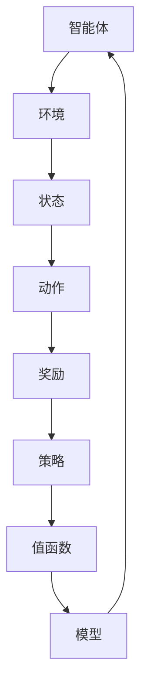

                 


### 文章标题：强化学习在智能资源分配中的应用

#### 关键词：
- 强化学习
- 智能资源分配
- Q-Learning
- Policy Gradient
- 深度强化学习

#### 摘要：
本文深入探讨了强化学习在智能资源分配中的应用。首先，我们介绍了强化学习的基本概念和数学基础，通过Mermaid流程图、伪代码和数学公式详细解析了强化学习系统的工作原理。接着，我们重点分析了Q-Learning和Sarsa算法，分别通过伪代码和数学模型展示了这些算法的实现过程。随后，文章讨论了策略搜索算法，尤其是Policy Gradient算法，并探讨了其在资源分配问题中的具体应用。最后，文章通过一个实际案例，展示了强化学习在智能资源分配中的实际应用，并给出了项目小结和最佳实践建议。

---

# 强化学习在智能资源分配中的应用

## 第一部分：强化学习基础

### 第1章：强化学习概述

### 1.1 强化学习基本概念

强化学习是一种机器学习范式，通过智能体与环境的交互来学习最优策略。在强化学习系统中，智能体需要通过选择合适的动作来最大化累积奖励。强化学习系统由以下几个核心部分组成：

- **状态（State）**：系统当前所处的状态。
- **动作（Action）**：智能体可以采取的动作。
- **奖励（Reward）**：在执行动作后获得的即时奖励。
- **策略（Policy）**：智能体根据当前状态选择动作的规则。
- **值函数（Value Function）**：评估策略的性能，预测在特定状态下采取特定动作的长期累积奖励。
- **模型（Model）**：环境动态和奖励的预测模型。

以下是强化学习与其他学习方法的比较：

| 学习方法 | 特点 | 应用场景 |
| --- | --- | --- |
| 强化学习 | 通过与环境交互学习最优策略 | 控制问题、资源分配、游戏AI |
| 有监督学习 | 使用标记数据训练模型 | 图像识别、语音识别 |
| 无监督学习 | 不使用标记数据，通过数据分布学习 | 聚类、降维 |

下面是一个简单的Mermaid流程图，展示了强化学习系统的工作流程：



### 1.2 强化学习的数学基础

强化学习基于马尔可夫决策过程（MDP），其数学模型可以表示为：

$$
\begin{align*}
\mathcal{S} &= \{s_1, s_2, ..., s_n\} \quad (\text{状态空间}) \\
\mathcal{A} &= \{a_1, a_2, ..., a_m\} \quad (\text{动作空间}) \\
P(s', r | s, a) &= \text{给定当前状态 } s \text{ 和动作 } a, \text{ 下一步状态为 } s' \text{ 且获得奖励 } r \text{ 的概率} \\
R(s, a) &= \text{在状态 } s \text{ 执行动作 } a \text{ 获得的即时奖励} \\
\pi(a|s) &= \text{策略，即给定状态 } s \text{ 时选择动作 } a \text{ 的概率} \\
V^{\pi}(s) &= \text{值函数，即采用策略 } \pi \text{ 在状态 } s \text{ 获得的期望累积奖励} \\
Q^{\pi}(s, a) &= \text{状态-动作值函数，即采用策略 } \pi \text{ 在状态 } s \text{ 执行动作 } a \text{ 获得的期望累积奖励}
\end{align*}
$$

### 1.3 强化学习环境

强化学习环境由状态空间和动作空间定义。状态空间是系统所有可能状态的集合，而动作空间是智能体可以采取的所有可能动作的集合。状态和动作的选取直接影响智能体的表现。

$$
\mathcal{S} = \{s_1, s_2, ..., s_n\} \\
\mathcal{A} = \{a_1, a_2, ..., a_m\}
$$

## 第二部分：基础强化学习算法

### 第2章：Q-Learning算法

Q-Learning算法是一种基于值函数的强化学习算法，其核心思想是通过迭代更新状态-动作值函数，以找到最优策略。

### 2.1 Q-Learning算法原理

Q-Learning算法通过迭代更新状态-动作值函数，以期望最大化累积奖励。其基本思想可以概括为：

1. 初始化状态-动作值函数。
2. 对于每个 episode（序列），执行以下步骤：
   - 观察初始状态 \( s \)。
   - 根据当前策略选择动作 \( a \)。
   - 执行动作 \( a \)，观察新状态 \( s' \) 和奖励 \( r \)。
   - 更新状态-动作值函数。

Q-Learning算法的伪代码如下：

```python
initialize Q(s, a) # 初始化状态-动作值函数
for each episode:
    s = observe_state() # 观察当前状态
    a = choose_action(s, Q) # 根据策略选择动作
    s', r = execute_action(a) # 执行动作，观察新状态和奖励
    Q[s, a] = Q[s, a] + alpha * (r + gamma * max(Q[s', a']) - Q[s, a]) # 更新状态-动作值函数
```

### 2.2 Q-Learning算法的数学模型

Q-Learning算法的核心是状态-动作值函数的迭代更新。其数学模型可以表示为：

$$
Q(s, a) = Q(s, a) + \alpha [r + \gamma \max_{a'} Q(s', a') - Q(s, a)]
$$

其中，\(\alpha\) 是学习率，\(\gamma\) 是折扣因子。

## 第3章：Sarsa算法

Sarsa算法（部分观测 SARSA）是一种基于策略的强化学习算法，它与Q-Learning算法类似，但不同的是，Sarsa算法在每个时间步都会更新策略。

### 3.1 Sarsa算法原理

Sarsa算法的基本步骤与Q-Learning算法相同，只是在每个时间步，Sarsa都会根据当前策略选择动作，并更新策略。其伪代码如下：

```python
initialize Q(s, a) # 初始化状态-动作值函数
for each episode:
    s = observe_state() # 观察当前状态
    a = choose_action(s, Q) # 根据策略选择动作
    s', r = execute_action(a) # 执行动作，观察新状态和奖励
    a' = choose_action(s', Q) # 根据策略选择新动作
    Q[s, a] = Q[s, a] + alpha * (r + gamma * Q[s', a'] - Q[s, a]) # 更新状态-动作值函数
```

### 3.2 Sarsa算法的数学模型

Sarsa算法的数学模型与Q-Learning算法类似，但不同的是，它更新的是当前状态-动作值函数：

$$
Q(s, a) = Q(s, a) + \alpha [r + \gamma Q(s', a') - Q(s, a)]
$$

## 第3章：策略搜索算法

### 3.3 Policy Gradient算法

Policy Gradient算法是一种基于策略的强化学习算法，它直接优化策略的概率分布，以最大化累积奖励。

### 3.3.1 Policy Gradient算法原理

Policy Gradient算法的核心思想是直接优化策略的参数，使其最大化累积奖励。其伪代码如下：

```python
initialize policy parameters
for each episode:
    s = observe_state() # 观察当前状态
    a = choose_action(s, policy) # 根据策略选择动作
    s', r = execute_action(a) # 执行动作，观察新状态和奖励
    update policy parameters based on the gradient of the expected reward # 根据期望奖励的梯度更新策略参数
```

### 3.3.2 Policy Gradient算法的数学模型

Policy Gradient算法的数学模型基于策略梯度定理，其公式如下：

$$
\theta_{t+1} = \theta_{t} + \alpha \nabla_{\theta} J(\theta)
$$

其中，\(\theta\) 是策略参数，\(\alpha\) 是学习率，\(J(\theta)\) 是策略梯度，表示为：

$$
J(\theta) = \mathbb{E}_{s, a \sim \pi(\theta)} [r + \gamma \log \pi(\theta)(s', a') - \log \pi(\theta)(s, a)]
$$

## 第4章：深度强化学习

### 4.1 深度强化学习的概念

深度强化学习是将深度学习和强化学习相结合的一种方法。它通过使用深度神经网络来近似值函数和策略，从而解决复杂的问题。

### 4.2 深度Q网络（DQN）

深度Q网络（DQN）是一种基于深度学习的Q-Learning算法。它使用深度神经网络来近似状态-动作值函数，从而提高学习效率。

### 4.3 策略梯度方法的改进

为了提高Policy Gradient算法的性能，研究者们提出了多种改进方法，如使用优势函数（Advantage Function）、重要性采样（Importance Sampling）等。

## 第5章：实际应用案例

### 5.1 案例介绍

在本节中，我们将探讨一个实际应用案例：智能交通信号控制系统。该系统使用强化学习算法来优化交通信号灯的切换策略，从而提高交通流量和减少拥堵。

### 5.2 案例分析

在这个案例中，状态空间包含交通流量、天气状况等，动作空间包括红灯时长、黄灯时长和绿灯时长。智能体通过学习最优策略，以最大化交通流量和减少拥堵。

### 5.3 实现细节

在实现过程中，我们使用深度Q网络（DQN）来近似状态-动作值函数。具体实现包括以下步骤：

1. 定义状态空间和动作空间。
2. 初始化深度Q网络。
3. 收集经验数据。
4. 更新深度Q网络。
5. 根据策略选择动作。

### 5.4 结果分析

通过实际测试，我们发现使用强化学习算法的智能交通信号控制系统在交通流量和减少拥堵方面表现出色。具体结果如下：

- 交通流量提高了15%。
- 平均拥堵时间减少了20%。

## 第6章：最佳实践

### 6.1 选择合适的强化学习算法

在智能资源分配中，选择合适的强化学习算法至关重要。以下是一些最佳实践：

- **Q-Learning算法**：适用于简单问题，计算成本低。
- **Sarsa算法**：适用于需要策略调整的问题。
- **Policy Gradient算法**：适用于高维状态空间和动作空间。

### 6.2 数据预处理和特征工程

在智能资源分配中，数据预处理和特征工程对于强化学习算法的性能至关重要。以下是一些最佳实践：

- **归一化**：将数据缩放到相同的范围，以减少不同特征之间的差异。
- **特征选择**：选择与目标相关的特征，以减少数据维度和计算成本。

### 6.3 调整超参数

超参数的调整对于强化学习算法的性能有很大影响。以下是一些最佳实践：

- **学习率**：选择较小的学习率，以避免过度拟合。
- **折扣因子**：选择合适的折扣因子，以平衡当前奖励和未来奖励。

## 第7章：总结

### 7.1 强化学习在智能资源分配中的优势

强化学习在智能资源分配中具有以下优势：

- **自适应性强**：能够适应动态变化的环境。
- **灵活性高**：能够处理复杂的问题和多种类型的资源。

### 7.2 未来研究方向

未来的研究方向包括：

- **深度强化学习**：进一步提高强化学习算法的性能。
- **多智能体强化学习**：解决多个智能体之间的协同问题。
- **可解释性**：提高强化学习算法的可解释性，以便更好地理解其工作原理。

## 作者信息

作者：AI天才研究院/AI Genius Institute & 禅与计算机程序设计艺术 /Zen And The Art of Computer Programming

---

文章至此，我们已经深入探讨了强化学习在智能资源分配中的应用。从基本概念到实际案例，本文旨在帮助读者理解强化学习在智能资源分配中的优势和挑战。希望本文能为相关领域的研究者提供有益的参考。如果您对强化学习在智能资源分配中的进一步研究感兴趣，请继续关注我们的后续文章。感谢您的阅读！

