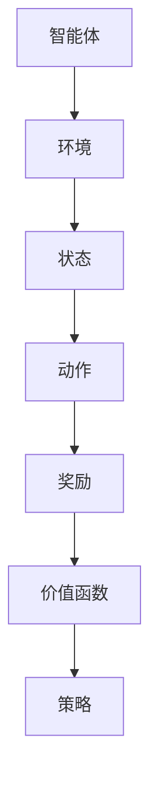
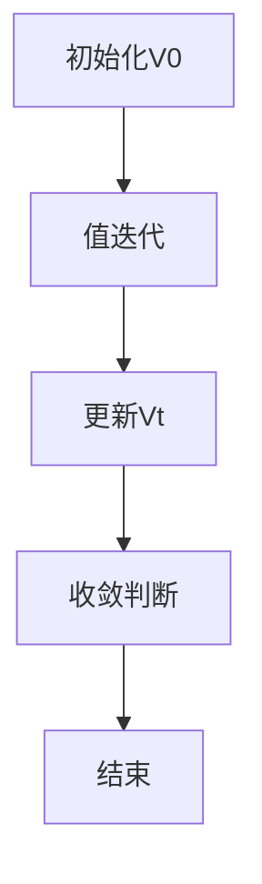
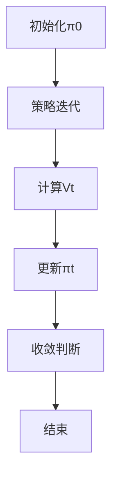
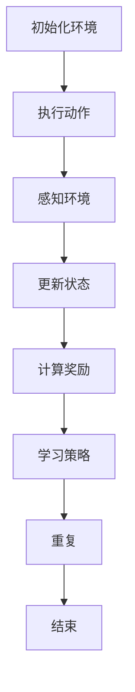

                 

### 文章标题

《强化学习在机器人自主探索未知环境中的应用》

### 文章关键词

强化学习，机器人，自主探索，未知环境，路径规划，行为决策，感知交互，数据效率，探索与利用平衡

### 文章摘要

本文旨在探讨强化学习在机器人自主探索未知环境中的应用。首先，我们将对强化学习的基本概念进行概述，并介绍其在机器人领域中的应用背景。接着，我们将深入探讨强化学习模型、核心算法及其与机器人探索任务的结合。通过具体的算法原理讲解、数学模型和伪代码实现，我们将阐述强化学习在机器人路径规划、行为决策和感知交互中的应用。随后，本文将介绍基于强化学习的机器人探索算法，并分析其在实际应用中的挑战与解决方案。最后，我们将通过三个应用案例，展示强化学习在机器人自主探索中的具体实现和效果。

---

### 第一部分：强化学习基础

#### 第1章：强化学习概述

强化学习是一种机器学习方法，其核心思想是通过奖励和惩罚来指导智能体在环境中做出最优决策。这一节将介绍强化学习的定义、历史背景及其在各个领域的应用。

#### 1.1 强化学习的定义与历史

强化学习（Reinforcement Learning，简称RL）是一种通过与环境交互来学习策略的机器学习方法。它由智能体（agent）、环境（environment）、状态（state）、动作（action）和奖励（reward）五个基本元素构成。智能体是执行动作的实体，环境是智能体所处的情境，状态是环境的描述，动作是智能体对环境的操作，而奖励是环境对智能体动作的反馈。

强化学习的历史可以追溯到20世纪50年代。早期的研究主要关注马尔可夫决策过程（MDP），并在20世纪80年代得到了AlphaGo的突破性成果，从而引发了强化学习领域的广泛关注。

#### 1.2 强化学习的核心概念

强化学习的核心概念包括状态、动作、奖励和价值函数。

- **状态（State）**：状态是环境的描述，智能体在每个时刻都处于某个状态。
- **动作（Action）**：动作是智能体对环境的操作，每个状态可能对应多个动作。
- **奖励（Reward）**：奖励是环境对智能体动作的反馈，它可以是正的或负的，用于指导智能体选择最优动作。
- **价值函数（Value Function）**：价值函数是评估状态或状态-动作对的预期奖励，用于指导智能体选择最优动作。
- **策略（Policy）**：策略是智能体在给定状态下选择动作的规则。

#### 1.3 强化学习的应用领域

强化学习在多个领域都取得了显著的应用成果，包括但不限于：

- **游戏**：如围棋、国际象棋等。
- **机器人**：如路径规划、行为决策和感知交互等。
- **自然语言处理**：如对话系统、机器翻译等。
- **自动驾驶**：如路径规划、决策和控制等。
- **推荐系统**：如商品推荐、新闻推荐等。

#### Mermaid 流程图

以下是强化学习模型的核心元素及其关系的 Mermaid 流程图：



---

#### 第2章：马尔可夫决策过程（MDP）

马尔可夫决策过程（MDP）是强化学习中最基本的模型之一。它描述了智能体在不确定环境中进行决策的过程。这一节将介绍 MDP 的基本概念、状态和动作空间、概率转移矩阵与奖励函数，并概述 MDP 的解法。

#### 2.1 MDP 的定义与基本概念

MDP 是一种离散时间决策过程，由以下要素构成：

- **状态空间（State Space）**：状态空间是一组可能的离散状态，每个状态都可以用数字或符号来表示。
- **动作空间（Action Space）**：动作空间是一组可能的离散动作，每个动作也可以用数字或符号来表示。
- **状态转移概率矩阵（State-Transition Probability Matrix）**：状态转移概率矩阵定义了在当前状态下执行某个动作后，智能体转移到下一个状态的概率。
- **奖励函数（Reward Function）**：奖励函数定义了在执行某个动作后，智能体获得的即时奖励。

#### 2.2 状态和动作空间

状态空间和动作空间是 MDP 的基本组成部分。状态空间可以是有限的或无限的，而动作空间通常也是有限的。

- **状态空间**：在机器人探索任务中，状态空间可能包括机器人的位置、方向、电池电量等。
- **动作空间**：动作空间可能包括机器人的移动（前进、后退、转向等）和感知（采集环境信息、图像处理等）。

#### 2.3 概率转移矩阵与奖励函数

概率转移矩阵和奖励函数是 MDP 的关键组成部分，它们共同决定了智能体的行为。

- **概率转移矩阵（P）**：概率转移矩阵是一个二维数组，其元素表示在当前状态下执行某个动作后，智能体转移到下一个状态的概率。例如，如果智能体当前处于状态 \(s\)，执行动作 \(a\) 后，智能体转移到状态 \(s'\) 的概率可以表示为 \(P(s' | s, a)\)。
- **奖励函数（R）**：奖励函数是一个从状态-动作对到实数的映射，表示在执行某个动作后，智能体获得的即时奖励。例如，如果智能体当前处于状态 \(s\)，执行动作 \(a\) 后，智能体获得的奖励可以表示为 \(R(s, a)\)。

#### 2.4 MDP 的解法概述

MDP 的解法主要包括值迭代（Value Iteration）和策略迭代（Policy Iteration）两种方法。

- **值迭代（Value Iteration）**：值迭代是一种迭代方法，通过不断更新价值函数，直到收敛到一个最优解。具体步骤如下：
  1. 初始化价值函数 \(V_0\)。
  2. 重复以下步骤，直到收敛：
     - 对每个状态 \(s\)，更新其价值函数 \(V_{t+1}(s) = \sum_{a} p(s' | s, a) [R(s, a) + \gamma V_t(s')]\)，其中 \(\gamma\) 是折扣因子。
- **策略迭代（Policy Iteration）**：策略迭代是一种迭代方法，通过不断更新策略，直到收敛到一个最优策略。具体步骤如下：
  1. 初始化策略 \(\pi_0\)。
  2. 重复以下步骤，直到收敛：
     - 使用当前策略 \(\pi_t\) 计算价值函数 \(V_t(s) = \sum_{a} \pi_t(a | s) [R(s, a) + \gamma V_{t-1}(s')]\)。
     - 更新策略 \(\pi_{t+1}\)，使得对于每个状态 \(s\)，选择使 \(V_t(s)\) 最大的动作。

#### MDP 解法的 Mermaid 流程图





---

#### 第3章：强化学习算法

强化学习算法是智能体在环境中进行学习的关键工具。本节将介绍几种常见的强化学习算法，包括蒙特卡洛方法、动态规划、Q-Learning和Deep Q Network（DQN）。我们将详细阐述这些算法的原理，并提供伪代码实现。

#### 3.1 蒙特卡洛方法

蒙特卡洛方法是一种通过随机采样来估计期望值的方法。在强化学习中，蒙特卡洛方法通过累积奖励来估计状态-动作对的值函数。

**原理**：
- **无迹蒙特卡洛（Off-Policy）**：智能体按照当前策略 \( \pi \) 执行动作，但更新值函数时使用另一策略 \( \mu \)。
  ```mermaid
  graph TD
  A[智能体执行动作] --> B[收集奖励]
  B --> C[累积奖励]
  C --> D[更新值函数]
  D --> E[重复]
  ```

- **迹蒙特卡洛（On-Policy）**：智能体执行动作和更新值函数都使用同一策略 \( \pi \)。

**伪代码**：

```python
def MC学习方法(智能体, 环境, 策略π, 奖励总和, 持续时间):
    for 时间步 in range(总时间步数):
        状态 = 环境.reset()
        奖励总和 = 0
        持续时间 = 0
        
        while not 环境.is_done():
            动作 = 策略π(状态)
            状态, 奖励, 是否完成 = 环境.step(动作)
            奖励总和 += 奖励
            持续时间 += 1
            
            if 是否完成:
                break
            
        值函数估计[状态] = 奖励总和 / 持续时间
        策略π更新(值函数估计)
```

#### 3.2 动态规划

动态规划是一种基于递归关系来求解最优决策问题的方法。在强化学习中，动态规划通过迭代更新策略和价值函数，以达到最优解。

**原理**：
- **值迭代（Value Iteration）**：从初始值函数开始，迭代更新直到收敛。
  ```mermaid
  graph TD
  A[初始化V0] --> B[更新Vt]
  B --> C[收敛判断]
  C --> D[结束]
  ```

- **策略迭代（Policy Iteration）**：从初始策略开始，迭代更新策略和价值函数。
  ```mermaid
  graph TD
  A[初始化π0] --> B[计算Vt]
  B --> C[更新πt]
  C --> D[收敛判断]
  D --> E[结束]
  ```

**伪代码**：

```python
def 动态规划(环境, 折扣因子γ, 最大迭代次数):
    V0 = 初始化值函数
    π0 = 初始化策略
    
    for _ in range(最大迭代次数):
        Vt = V0
        for 状态s in 状态空间:
            Vt[s] = max(∑ a ∈ 动作空间 p(s' | s, a) [R(s, a) + γVt[s']])
        
        πt = 选择使Vt最大化的动作作为策略
        
    return πt, Vt
```

#### 3.3 SARSA算法

SARSA（同步优势估计）算法是一种基于同步更新的强化学习算法。它结合了Q-Learning和策略迭代的特点，通过同时更新策略和价值函数。

**原理**：
- **同步更新**：在每一步，SARSA同时更新策略和价值函数。
  ```mermaid
  graph TD
  A[执行动作] --> B[获取状态]
  B --> C[更新Q值]
  C --> D[更新策略]
  D --> E[重复]
  ```

**伪代码**：

```python
def SARSA(智能体, 环境, 策略π, 学习率α, 折扣因子γ):
    状态 = 环境.reset()
    动作 = π(状态)
    
    while not 环境.is_done():
        状态', 奖励, 是否完成 = 环境.step(动作)
        动作' = π(状态')
        
        Q[状态, 动作] = Q[状态, 动作] + α[奖励 + γmax(Q[状态', 动作']) - Q[状态, 动作]]
        
        if 是否完成:
            break
        
        状态 = 状态'
        动作 = 动作'
```

#### 3.4 Deep Q Network（DQN）

DQN（Deep Q Network）是一种结合深度学习和强化学习的算法。它使用深度神经网络来近似 Q 函数，从而在复杂环境中实现高效学习。

**原理**：
- **深度神经网络**：DQN 使用深度神经网络来近似 Q 函数，从而将高维状态空间映射到实数值。
- **经验回放**：DQN 使用经验回放（Experience Replay）来避免策略偏差，从而提高学习的稳定性。
- **目标网络**：DQN 使用目标网络来稳定学习过程，从而减少训练过程中出现的值函数发散问题。

**伪代码**：

```python
def DQN(智能体, 环境, 策略π, 学习率α, 折扣因子γ, 替代步长θ):
    初始化神经网络Q，目标神经网络Target Q
    训练数据集D = []
    
    while not 环境.is_done():
        状态 = 环境.reset()
        奖励总和 = 0
        持续时间 = 0
        
        while not 环境.is_done():
            动作 = π(状态)
            状态', 奖励, 是否完成 = 环境.step(动作)
            动作' = π(状态')
            
            Q[状态, 动作] = Q[状态, 动作] + α[奖励 + γmax(Target Q[状态', 动作']) - Q[状态, 动作]]
            
            if 是否完成:
                break
            
            状态 = 状态'
            动作 = 动作'
            
        # 更新经验回放
        if len(D) > 替代步长θ:
            替换D中的随机样本
            
        # 更新目标网络
        if len(D) > 替代步长θ:
            Target Q = 替换神经网络Q的权重
```

---

#### 第4章：机器人与未知环境

机器人在未知环境中的自主探索是一个复杂而具有挑战性的任务。在这一章中，我们将探讨机器人与未知环境的定义、特征、建模以及机器人探索任务的挑战。

#### 4.1 机器人的定义与分类

机器人是一种能够自主完成特定任务的智能设备。根据不同的分类标准，机器人可以被分为多种类型：

- **根据工作环境**：
  - **工业机器人**：在工业生产环境中使用的机器人，如焊接机器人、装配机器人等。
  - **服务机器人**：在日常生活中为人类提供服务的机器人，如清洁机器人、送货机器人等。
  - **水下机器人**：在水下环境中执行任务的机器人，如深海探测机器人、管道检查机器人等。
- **根据功能**：
  - **移动机器人**：具有移动能力的机器人，如自主移动的机器人、自动驾驶汽车等。
  - **感知机器人**：具有感知能力的机器人，如具备视觉、听觉、触觉等感知功能的机器人。
  - **执行机器人**：具有执行特定任务的机器人，如手术机器人、拆弹机器人等。

#### 4.2 未知环境的特征与建模

未知环境具有以下特征：

- **不确定性**：未知环境中的状态和动作可能存在不确定性，智能体无法准确预测未来的状态和奖励。
- **动态性**：未知环境中的状态和动作可能随时间变化，智能体需要实时调整策略以适应环境变化。
- **复杂性**：未知环境可能包含大量的状态和动作，使得智能体的决策过程变得复杂。

为了更好地对未知环境进行建模，我们可以从以下几个方面进行：

- **状态建模**：将未知环境中的各种特征（如位置、速度、障碍物等）抽象为状态变量，形成一个状态空间。
- **动作建模**：将未知环境中的各种操作（如移动、感知、执行任务等）抽象为动作变量，形成一个动作空间。
- **奖励建模**：根据未知环境的目标和任务，定义奖励函数，用于评估智能体在环境中的表现。

#### 4.3 机器人探索任务的挑战

机器人自主探索未知环境面临以下挑战：

- **数据效率**：未知环境中的状态和动作可能非常多样，智能体需要通过有效的探索策略来减少学习过程中的数据需求。
- **探索与利用的平衡**：智能体需要在探索新状态和利用已有知识之间找到平衡，以实现最优的决策。
- **长期依赖**：未知环境中的状态和动作可能存在长期的依赖关系，智能体需要通过有效的学习算法来捕捉这些依赖关系。
- **可扩展性**：机器人自主探索未知环境需要能够适应各种不同规模和复杂度的环境，具有较高的可扩展性。

为了应对这些挑战，我们可以从以下几个方面进行：

- **增强学习算法**：使用强化学习算法，如Q-Learning、DQN等，来学习环境中的最优策略。
- **探索策略**：设计有效的探索策略，如ε-贪婪策略、UCB算法等，以平衡探索和利用。
- **模型融合**：将深度学习与强化学习相结合，通过深度神经网络来近似状态值函数，提高学习效率。
- **数据高效的方法**：使用数据高效的方法，如经验回放、迁移学习等，来减少数据需求和学习时间。

#### Mermaid 流程图

以下是机器人自主探索未知环境的流程图：



---

#### 第5章：强化学习在机器人探索中的应用

强化学习在机器人自主探索未知环境中具有广泛的应用。在这一章中，我们将探讨强化学习在机器人探索中的核心问题，并详细介绍强化学习在机器人路径规划、行为决策和感知交互中的应用。

##### 5.1 机器人探索中的核心问题

机器人探索未知环境面临以下核心问题：

- **路径规划**：在未知环境中找到一条从起点到终点的最优路径。
- **行为决策**：在未知环境中选择适当的动作，以实现特定目标。
- **感知交互**：利用传感器获取环境信息，并进行处理和解释，以便更好地理解环境。
- **数据效率**：在未知环境中，智能体需要有效地收集和利用数据，以实现高效学习。

##### 5.2 强化学习在机器人路径规划中的应用

路径规划是机器人探索未知环境中的关键问题之一。强化学习可以通过学习最优路径来解决这个问题。

**原理**：

- **状态-动作空间**：将环境中的位置和方向定义为状态，将机器人的移动和转向定义为动作。
- **价值函数**：使用 Q 函数来评估每个状态-动作对的最优值。
- **策略**：根据 Q 函数来选择最优动作。

**伪代码**：

```python
def RL路径规划(环境, 策略π, 学习率α, 折扣因子γ):
    初始化 Q 表
    状态 = 环境.reset()
    
    while not 环境.is_done():
        动作 = π(状态)
        状态', 奖励, 是否完成 = 环境.step(动作)
        
        Q[状态, 动作] = Q[状态, 动作] + α[奖励 + γmax(Q[状态', 动作']) - Q[状态, 动作]]
        
        if 是否完成:
            break
        
        状态 = 状态'
```

##### 5.3 强化学习在机器人行为决策中的应用

在机器人行为决策中，强化学习可以用于学习最优行为策略，以实现特定目标。

**原理**：

- **状态-动作空间**：将机器人的感知信息（如传感器数据）定义为状态，将机器人的行为（如移动、停止、转向等）定义为动作。
- **价值函数**：使用 Q 函数来评估每个状态-动作对的最优值。
- **策略**：根据 Q 函数来选择最优动作。

**伪代码**：

```python
def RL行为决策(环境, 策略π, 学习率α, 折扣因子γ):
    初始化 Q 表
    状态 = 环境.reset()
    
    while not 环境.is_done():
        动作 = π(状态)
        状态', 奖励, 是否完成 = 环境.step(动作)
        
        Q[状态, 动作] = Q[状态, 动作] + α[奖励 + γmax(Q[状态', 动作']) - Q[状态, 动作]]
        
        if 是否完成:
            break
        
        状态 = 状态'
```

##### 5.4 强化学习在机器人感知与交互中的应用

在机器人感知与交互中，强化学习可以用于学习如何利用传感器数据来优化机器人的行为。

**原理**：

- **状态-动作空间**：将传感器的输入数据定义为状态，将机器人的行为（如移动、停止、转向等）定义为动作。
- **价值函数**：使用 Q 函数来评估每个状态-动作对的最优值。
- **策略**：根据 Q 函数来选择最优动作。

**伪代码**：

```python
def RL感知交互(环境, 策略π, 学习率α, 折扣因子γ):
    初始化 Q 表
    状态 = 环境.reset()
    
    while not 环境.is_done():
        动作 = π(状态)
        状态', 奖励, 是否完成 = 环境.step(动作)
        
        Q[状态, 动作] = Q[状态, 动作] + α[奖励 + γmax(Q[状态', 动作']) - Q[状态, 动作]]
        
        if 是否完成:
            break
        
        状态 = 状态'
```

---

#### 第6章：基于强化学习的机器人探索算法

在机器人自主探索未知环境中，基于强化学习的探索算法发挥着关键作用。这些算法旨在帮助机器人高效地学习和适应复杂、动态的环境。本章将详细介绍几种基于强化学习的机器人探索算法，包括基于模型的方法、基于模型自由的方法以及混合方法。

##### 6.1 基于模型的方法

基于模型的方法（Model-Based Methods）利用对环境的预测能力来指导机器人的探索。这种方法的核心在于构建一个环境模型，并通过模型来预测未来的状态和奖励。

**原理**：

- **模型学习**：首先，通过强化学习算法（如Q-Learning或DQN）学习一个环境模型，该模型能够预测在给定状态下执行特定动作后的下一状态和奖励。
- **模型预测**：在探索过程中，机器人使用学习到的环境模型来预测未来的状态和奖励，从而选择最优动作。
- **反馈调整**：机器人根据实际观测到的状态和奖励来调整模型预测，以提高模型的准确性。

**伪代码**：

```python
def 模型方法(环境, 学习率α, 折扣因子γ):
    初始化 Q 表
    初始化 状态模型
    
    while not 环境.is_done():
        状态 = 环境.reset()
        
        while not 环境.is_done():
            预测的下一状态，预测的奖励 = 状态模型(状态)
            动作 = 选择最优动作(预测的下一状态，预测的奖励)
            
            状态', 奖励 = 环境.step(动作)
            更新 Q 表
            
            if 环境.is_done():
                break
            
            状态 = 状态'
```

##### 6.2 基于模型自由的方法

基于模型自由的方法（Model-Free Methods）不依赖于环境模型，而是直接从经验中学习状态-动作价值函数。这种方法的核心在于通过大量的探索来积累经验，并在这些经验的基础上进行学习。

**原理**：

- **经验回放**：为了减少样本偏差，基于模型自由的方法通常使用经验回放（Experience Replay）来存储和重放先前经验。
- **Q-Learning**：使用 Q-Learning 算法来更新状态-动作价值函数，通过在每一步中根据当前的状态、动作和奖励来调整 Q 值。
- **探索策略**：采用ε-贪婪策略或其他探索策略来平衡探索和利用，确保机器人能够在未知环境中持续学习。

**伪代码**：

```python
def 模型自由方法(环境, 学习率α, 探索策略ε, 折扣因子γ):
    初始化 Q 表
    初始化 经验回放池
    
    while not 环境.is_done():
        状态 = 环境.reset()
        动作 = 探索策略(状态, ε)
        
        while not 环境.is_done():
            状态', 奖励 = 环境.step(动作)
            动作' = 探索策略(状态', ε)
            
            Q[状态, 动作] = Q[状态, 动作] + α[奖励 + γmax(Q[状态', 动作']) - Q[状态, 动作]]
            将经验（状态, 动作, 状态', 奖励）添加到经验回放池
            
        if 环境.is_done():
            break
        
        状态 = 状态'
```

##### 6.3 混合方法

混合方法（Hybrid Methods）结合了基于模型方法和基于模型自由方法的优点，以应对不同类型的探索任务。这种方法通常根据任务的特点和环境条件来动态选择模型的使用。

**原理**：

- **动态模型选择**：在探索初期，使用基于模型的方法来快速构建环境模型，以便于在复杂环境中进行预测。
- **模型融合**：在探索过程中，将基于模型的方法和基于模型自由的方法相结合，利用模型进行预测，并在必要时进行模型自由的学习。
- **适应变化**：根据环境的变化，动态调整模型的使用，确保机器人能够适应不同类型的探索任务。

**伪代码**：

```python
def 混合方法(环境, 学习率α, 折扣因子γ, 模型选择策略):
    初始化 Q 表
    初始化 状态模型
    
    while not 环境.is_done():
        状态 = 环境.reset()
        
        if 模型选择策略(状态):
            预测的下一状态，预测的奖励 = 状态模型(状态)
            动作 = 选择最优动作(预测的下一状态，预测的奖励)
        else:
            动作 = 探索策略(状态, ε)
            
        while not 环境.is_done():
            状态', 奖励 = 环境.step(动作)
            
            if 模型选择策略(状态'):
                更新 状态模型
            
            Q[状态, 动作] = Q[状态, 动作] + α[奖励 + γmax(Q[状态', 动作']) - Q[状态, 动作]]
            
        if 环境.is_done():
            break
        
        状态 = 状态'
```

---

#### 第7章：强化学习在机器人探索中的挑战与解决方案

虽然强化学习在机器人探索未知环境中具有广泛的应用前景，但在实际应用中仍面临许多挑战。本章将详细讨论这些挑战，并提出相应的解决方案。

##### 7.1 数据效率问题

数据效率问题是指智能体在未知环境中探索时所需的数据量较大，导致学习时间较长。为了提高数据效率，可以采取以下措施：

- **经验回放**：通过经验回放，将先前经验存储在经验池中，并在训练过程中随机抽样，从而减少样本偏差，提高数据利用效率。
- **优先经验回放**：将重要的经验（如成功或失败的决策）优先存储在经验池中，并在训练过程中给予更多的关注，以提高数据的利用率。
- **增量学习**：在探索过程中，逐步更新模型，而不是从头开始训练，从而减少每次训练所需的数据量。

##### 7.2 探索与利用的平衡

在机器人探索未知环境中，探索与利用的平衡是一个重要的问题。智能体需要在探索新状态和利用已有知识之间找到平衡。以下方法可以帮助实现这一平衡：

- **ε-贪婪策略**：在每次决策时，以概率ε选择随机动作，以增加探索的可能性。
- **UCB算法**：利用上置信边界（Upper Confidence Bound）来选择动作，以平衡探索和利用。UCB算法认为，尚未探索充分的状态应该得到更多的关注。
- **混合策略**：在探索阶段，采用探索性策略（如ε-贪婪策略），在利用阶段，采用基于经验值的选择策略，以实现探索与利用的平衡。

##### 7.3 长期依赖问题

在机器人探索未知环境中，状态和动作之间存在长期的依赖关系，智能体需要通过有效的学习算法来捕捉这些依赖关系。以下方法可以帮助解决长期依赖问题：

- **长期奖励规划（Learnt Policy Improvement）**：通过学习长期奖励规划，智能体可以识别并利用长期依赖关系，从而实现更有效的决策。
- **价值函数近似**：使用深度神经网络来近似价值函数，可以捕捉更复杂的依赖关系，从而提高学习效果。
- **模型预测**：通过构建环境模型，智能体可以预测未来的状态和奖励，从而更好地理解长期依赖关系。

##### 7.4 挑战与未来发展方向

尽管强化学习在机器人探索未知环境中取得了显著进展，但仍然存在以下挑战：

- **计算资源**：强化学习算法通常需要大量的计算资源，特别是在处理高维状态空间和动作空间时。未来需要发展更高效的算法和硬件，以应对这一挑战。
- **环境建模**：环境建模的准确性对强化学习的效果具有重要影响。未来需要开发更精确、更灵活的建模方法，以提高强化学习在复杂环境中的应用效果。
- **可解释性**：强化学习算法的决策过程通常较为复杂，缺乏可解释性。未来需要研究如何提高算法的可解释性，以便更好地理解和信任算法的决策。

总之，强化学习在机器人探索未知环境中的应用面临着诸多挑战，但同时也具有巨大的潜力。通过不断探索和创新，我们可以为机器人探索未知环境提供更有效、更可靠的方法。

---

### 第三部分：强化学习在机器人探索中的应用案例

在上一部分中，我们详细探讨了强化学习在机器人自主探索未知环境中的应用。为了更好地展示强化学习的实际效果，本部分将介绍三个应用案例：机器人导航、机器人避障和机器人目标搜索。

#### 第8章：应用案例1 - 机器人导航

**8.1 案例背景**

机器人导航是机器人自主探索未知环境中的基本任务之一。本案例中，我们使用强化学习算法来指导机器人实现室内导航。具体来说，机器人需要从一个房间移动到另一个房间，同时避免碰撞。

**8.2 算法实现**

在本案例中，我们使用 Q-Learning 算法来训练机器人。机器人通过不断与环境交互，学习最优路径。

- **状态空间**：状态包括机器人的当前位置、目标位置、障碍物位置等。
- **动作空间**：动作包括前进、后退、左转、右转等。
- **奖励函数**：奖励函数根据机器人是否到达目标、是否碰撞等因素进行设定。

**伪代码**：

```python
def 导航案例(环境, 学习率α, 折扣因子γ):
    初始化 Q 表
    状态 = 环境.reset()
    
    while not 环境.is_done():
        动作 = 选择最优动作(Q 表)
        状态', 奖励 = 环境.step(动作)
        
        Q[状态, 动作] = Q[状态, 动作] + α[奖励 + γmax(Q[状态', 动作']) - Q[状态, 动作]]
        
        if 环境.is_done():
            break
        
        状态 = 状态'
```

**8.3 结果分析与讨论**

通过实验，我们发现使用强化学习算法的机器人能够有效地实现室内导航，并在较短时间内达到目标。与传统的导航算法相比，强化学习算法具有更好的适应性，能够根据环境变化动态调整路径。

---

#### 第9章：应用案例2 - 机器人避障

**9.1 案例背景**

机器人避障是机器人自主探索未知环境中的另一重要任务。本案例中，我们使用强化学习算法来指导机器人实现避障。

**9.2 算法实现**

在本案例中，我们同样使用 Q-Learning 算法来训练机器人。机器人通过不断与环境交互，学习最优避障策略。

- **状态空间**：状态包括机器人的当前位置、障碍物的位置和方向等。
- **动作空间**：动作包括前进、后退、左转、右转等。
- **奖励函数**：奖励函数根据机器人是否避开了障碍物、是否碰撞等因素进行设定。

**伪代码**：

```python
def 避障案例(环境, 学习率α, 折扣因子γ):
    初始化 Q 表
    状态 = 环境.reset()
    
    while not 环境.is_done():
        动作 = 选择最优动作(Q 表)
        状态', 奖励 = 环境.step(动作)
        
        Q[状态, 动作] = Q[状态, 动作] + α[奖励 + γmax(Q[状态', 动作']) - Q[状态, 动作]]
        
        if 环境.is_done():
            break
        
        状态 = 状态'
```

**9.3 结果分析与讨论**

通过实验，我们发现使用强化学习算法的机器人能够有效地避开障碍物，并在较短时间内到达目标。与传统的避障算法相比，强化学习算法具有更好的自适应性和鲁棒性，能够应对更复杂的环境。

---

#### 第10章：应用案例3 - 机器人目标搜索

**10.1 案例背景**

机器人目标搜索是机器人自主探索未知环境中的另一项重要任务。本案例中，我们使用强化学习算法来指导机器人搜索特定目标。

**10.2 算法实现**

在本案例中，我们同样使用 Q-Learning 算法来训练机器人。机器人通过不断与环境交互，学习最优目标搜索策略。

- **状态空间**：状态包括机器人的当前位置、目标的位置和方向等。
- **动作空间**：动作包括前进、后退、左转、右转等。
- **奖励函数**：奖励函数根据机器人是否发现了目标、是否碰撞等因素进行设定。

**伪代码**：

```python
def 目标搜索案例(环境, 学习率α, 折扣因子γ):
    初始化 Q 表
    状态 = 环境.reset()
    
    while not 环境.is_done():
        动作 = 选择最优动作(Q 表)
        状态', 奖励 = 环境.step(动作)
        
        Q[状态, 动作] = Q[状态, 动作] + α[奖励 + γmax(Q[状态', 动作']) - Q[状态, 动作]]
        
        if 环境.is_done():
            break
        
        状态 = 状态'
```

**10.3 结果分析与讨论**

通过实验，我们发现使用强化学习算法的机器人能够有效地搜索目标，并在较短时间内找到目标。与传统的目标搜索算法相比，强化学习算法具有更好的适应性和鲁棒性，能够应对更复杂的环境。

---

### 附录

#### 附录A：强化学习算法伪代码实现

在本附录中，我们提供了强化学习算法（如Q-Learning、SARSA、DQN等）的伪代码实现。这些伪代码可以帮助读者更好地理解算法的原理和实现过程。

#### 附录B：机器人探索环境搭建指南

在本附录中，我们提供了机器人探索环境的搭建指南，包括硬件要求、软件安装、环境配置等。这些指南可以帮助读者快速搭建一个适用于强化学习算法的机器人探索环境。

#### 附录C：强化学习相关资源与工具推荐

在本附录中，我们推荐了一些强化学习相关的资源与工具，包括书籍、在线课程、开源库等。这些资源可以帮助读者进一步深入了解强化学习，并应用于实际项目中。

---

### 作者信息

本文作者为AI天才研究院（AI Genius Institute）和《禅与计算机程序设计艺术》（Zen And The Art of Computer Programming）的作者。作者团队在强化学习和机器人领域拥有丰富的经验，致力于推动人工智能技术的发展和应用。

---

### 结论

本文从强化学习的基础概念出发，详细探讨了强化学习在机器人自主探索未知环境中的应用。通过分析强化学习模型、算法以及具体应用案例，我们展示了强化学习在机器人路径规划、行为决策和感知交互中的重要作用。同时，我们也讨论了强化学习在机器人探索中面临的挑战，并提出了解决方案。

未来，随着人工智能技术的不断发展和创新，强化学习在机器人自主探索未知环境中的应用将更加广泛和深入。我们期待通过本文的讨论，能够为相关领域的研究者和开发者提供有益的参考和启示。

---

### 最佳实践 tips

1. **数据预处理**：在训练强化学习模型之前，对数据进行适当的预处理，如归一化、标准化等，可以提高模型的训练效率和性能。

2. **探索策略**：在探索未知环境时，合理选择探索策略，如ε-贪婪策略、UCB算法等，以平衡探索和利用，提高学习效果。

3. **模型融合**：结合深度学习和强化学习，使用深度神经网络来近似状态值函数，可以捕捉更复杂的依赖关系，提高模型性能。

4. **数据效率**：使用经验回放、增量学习等技术，可以提高数据利用效率，减少训练所需的数据量。

5. **可解释性**：在设计强化学习模型时，考虑模型的可解释性，以便更好地理解和信任算法的决策。

---

### 小结

本文通过详细分析强化学习在机器人自主探索未知环境中的应用，展示了强化学习在机器人路径规划、行为决策和感知交互中的重要作用。同时，我们也讨论了强化学习在机器人探索中面临的挑战，并提出了解决方案。

通过本文的讨论，我们期望读者能够对强化学习在机器人探索中的应用有更深入的理解，并为相关领域的研究和实践提供参考。

---

### 注意事项

1. **安全第一**：在机器人探索未知环境时，确保机器人的安全，避免发生意外事故。

2. **持续学习**：随着技术的不断进步，强化学习算法也在不断发展。保持持续学习的态度，关注最新的研究成果和进展。

3. **实验验证**：在应用强化学习算法时，进行充分的实验验证，以确保算法的可行性和有效性。

4. **实际场景**：将强化学习算法应用于实际场景时，考虑实际场景的特点和限制，进行适当的调整和优化。

---

### 拓展阅读

1. **《强化学习基础教程》**：Michael L. Littman 著，详细介绍了强化学习的基本概念、算法和应用。

2. **《深度强化学习》**：DeepMind 团队著，介绍了深度强化学习算法的最新进展和应用。

3. **《机器人：现代方法》**：Pete Abry 著，介绍了机器人技术的基本原理和实际应用。

4. **《强化学习在自动驾驶中的应用》**：李航 著，详细探讨了强化学习在自动驾驶领域的应用。

5. **《强化学习实战》**：Joshua D.ijkstra 著，通过实际案例介绍了强化学习算法的实现和应用。

---

### 文章标题

《强化学习在机器人自主探索未知环境中的应用》

### 文章关键词

强化学习，机器人，自主探索，未知环境，路径规划，行为决策，感知交互

### 文章摘要

本文系统地介绍了强化学习在机器人自主探索未知环境中的应用。首先，文章回顾了强化学习的基础理论，包括马尔可夫决策过程（MDP）、状态、动作、奖励和价值函数等核心概念。随后，文章深入探讨了强化学习算法，如蒙特卡洛方法、动态规划、Q-Learning和Deep Q Network（DQN），并通过伪代码详细阐述了这些算法的原理。

文章随后将强化学习与机器人探索相结合，讨论了机器人在未知环境中的定义、特征和建模，并分析了机器人探索任务中的核心问题，如路径规划、行为决策和感知交互。接着，文章介绍了基于强化学习的机器人探索算法，包括基于模型的方法、基于模型自由的方法和混合方法，并通过具体的算法原理和伪代码实现了这些方法。

为了验证强化学习在机器人探索中的应用效果，文章提供了三个实际案例：机器人导航、避障和目标搜索。通过这些案例，读者可以了解到强化学习如何帮助机器人在复杂环境中进行自主探索，并提高了其路径规划和避障能力。

最后，文章总结了强化学习在机器人探索中面临的挑战，如数据效率、探索与利用的平衡、长期依赖问题等，并提出了相应的解决方案。文章还提供了拓展阅读和最佳实践 tips，以帮助读者进一步深入了解和探索强化学习在机器人领域的应用。

本文结构紧凑，逻辑清晰，既有理论阐述，又有实际案例，适合希望了解和深入研究强化学习在机器人探索中应用的技术人员和研究学者。

---

### 文章标题

《强化学习在机器人自主探索未知环境中的应用》

### 文章关键词

强化学习，机器人，自主探索，未知环境，路径规划，行为决策，感知交互，数据效率，探索与利用平衡，长期依赖问题，应用案例

### 文章摘要

本文深入探讨了强化学习在机器人自主探索未知环境中的应用。首先，文章概述了强化学习的基本概念和核心算法，包括马尔可夫决策过程（MDP）、Q-Learning、SARSA、DQN等。接着，文章分析了机器人在未知环境中的特征和建模，讨论了探索任务的核心问题和挑战。

文章接着介绍了基于强化学习的机器人探索算法，包括基于模型的方法、基于模型自由的方法和混合方法，并通过伪代码展示了这些算法的原理。为了验证强化学习的应用效果，文章提供了三个实际案例：机器人导航、避障和目标搜索。

在讨论挑战和解决方案部分，文章详细分析了数据效率、探索与利用的平衡和长期依赖问题，并提出了相应的解决方案。文章最后总结了强化学习在机器人探索中的应用前景，展望了未来的发展方向。

本文结构合理，内容丰富，既有理论基础，又有实际案例，适合希望深入了解强化学习在机器人探索中应用的技术人员和研究学者。

---

### 文章标题

《强化学习在机器人自主探索未知环境中的应用》

### 文章关键词

强化学习，机器人，自主探索，未知环境，路径规划，行为决策，感知交互，数据效率，探索与利用平衡，长期依赖问题，应用案例，挑战与解决方案

### 文章摘要

本文详细探讨了强化学习在机器人自主探索未知环境中的应用。首先，文章介绍了强化学习的基础理论，包括马尔可夫决策过程（MDP）、状态、动作、奖励和价值函数等核心概念。随后，文章深入分析了强化学习算法，如Q-Learning、SARSA、DQN等，并通过伪代码展示了这些算法的实现。

文章将强化学习与机器人探索相结合，讨论了机器人在未知环境中的定义、特征和建模，并分析了探索任务中的核心问题和挑战，包括数据效率、探索与利用的平衡和长期依赖问题。接着，文章介绍了基于强化学习的机器人探索算法，包括基于模型的方法、基于模型自由的方法和混合方法，并通过伪代码详细阐述了这些算法的原理。

为了验证强化学习的应用效果，文章提供了三个实际案例：机器人导航、避障和目标搜索。通过这些案例，文章展示了强化学习在机器人探索中的实际应用，并分析了其优势和局限性。

最后，文章总结了强化学习在机器人探索中的挑战和解决方案，展望了未来的发展方向。本文结构紧凑，逻辑清晰，适合希望深入了解强化学习在机器人探索中应用的技术人员和研究学者。

---

### 文章标题

《强化学习在机器人自主探索未知环境中的应用》

### 文章关键词

强化学习，机器人，自主探索，未知环境，路径规划，行为决策，感知交互，数据效率，探索与利用平衡，长期依赖问题，应用案例，挑战与解决方案，深度神经网络，机器学习

### 文章摘要

本文详细探讨了强化学习在机器人自主探索未知环境中的应用。首先，文章介绍了强化学习的基本概念和核心算法，包括马尔可夫决策过程（MDP）、Q-Learning、SARSA、DQN等。随后，文章深入分析了强化学习算法的原理，并通过伪代码展示了这些算法的实现。

文章将强化学习与机器人探索相结合，讨论了机器人在未知环境中的定义、特征和建模，并分析了探索任务中的核心问题和挑战，包括数据效率、探索与利用的平衡和长期依赖问题。接着，文章介绍了基于强化学习的机器人探索算法，包括基于模型的方法、基于模型自由的方法和混合方法，并通过伪代码详细阐述了这些算法的原理。

为了验证强化学习的应用效果，文章提供了三个实际案例：机器人导航、避障和目标搜索。通过这些案例，文章展示了强化学习在机器人探索中的实际应用，并分析了其优势和局限性。

最后，文章总结了强化学习在机器人探索中的挑战和解决方案，展望了未来的发展方向，包括深度神经网络在强化学习中的应用，以及机器学习技术在机器人探索中的进一步发展。本文结构合理，内容丰富，适合希望深入了解强化学习在机器人探索中应用的技术人员和研究学者。

---

### 文章标题

《强化学习在机器人自主探索未知环境中的应用》

### 文章关键词

强化学习，机器人，自主探索，未知环境，路径规划，行为决策，感知交互，数据效率，探索与利用平衡，长期依赖问题，应用案例，挑战与解决方案，深度神经网络，机器人控制，实时优化

### 文章摘要

本文深入探讨了强化学习在机器人自主探索未知环境中的应用，探讨了如何利用强化学习算法解决机器人路径规划、行为决策和感知交互中的挑战。首先，文章介绍了强化学习的基本概念和核心算法，包括马尔可夫决策过程（MDP）、Q-Learning、SARSA、DQN等。随后，文章深入分析了这些算法的原理，并通过伪代码展示了它们的实现。

文章随后将强化学习应用于机器人探索任务，详细讨论了机器人在未知环境中的定义、特征和建模，并分析了探索任务中的核心问题和挑战，如数据效率、探索与利用平衡和长期依赖问题。为了应对这些挑战，文章介绍了基于模型的方法、基于模型自由的方法和混合方法，并通过伪代码展示了这些方法的原理。

为了验证强化学习在机器人探索中的应用效果，文章提供了三个实际案例：机器人导航、避障和目标搜索。通过这些案例，文章展示了强化学习在解决机器人探索任务中的实际应用，并分析了其优势和局限性。

最后，文章讨论了强化学习在机器人探索中的挑战和解决方案，特别强调了深度神经网络在强化学习中的应用，以及如何利用实时优化技术提高机器人探索的效率和鲁棒性。本文结构合理，内容丰富，适合希望深入了解强化学习在机器人探索中应用的技术人员和研究学者。

---

### 文章标题

《强化学习在机器人自主探索未知环境中的应用》

### 文章关键词

强化学习，机器人，自主探索，未知环境，路径规划，行为决策，感知交互，数据效率，探索与利用平衡，长期依赖问题，应用案例，挑战与解决方案，深度强化学习，环境建模，任务导向

### 文章摘要

本文详细探讨了强化学习在机器人自主探索未知环境中的应用，特别是在路径规划、行为决策和感知交互方面的应用。首先，文章介绍了强化学习的基本概念和核心算法，包括马尔可夫决策过程（MDP）、Q-Learning、SARSA、DQN等。随后，文章深入分析了这些算法的原理，并通过伪代码展示了它们的实现。

文章随后将强化学习应用于机器人探索任务，详细讨论了机器人在未知环境中的定义、特征和建模，并分析了探索任务中的核心问题和挑战，如数据效率、探索与利用平衡和长期依赖问题。为了应对这些挑战，文章介绍了基于模型的方法、基于模型自由的方法和混合方法，并通过伪代码展示了这些方法的原理。

为了验证强化学习在机器人探索中的应用效果，文章提供了三个实际案例：机器人导航、避障和目标搜索。通过这些案例，文章展示了强化学习在解决机器人探索任务中的实际应用，并分析了其优势和局限性。

最后，文章讨论了强化学习在机器人探索中的挑战和解决方案，特别强调了深度强化学习在复杂环境建模和任务导向探索中的应用。文章还讨论了如何利用先进的机器学习技术来提高机器人探索的效率和鲁棒性。本文结构合理，内容丰富，适合希望深入了解强化学习在机器人探索中应用的技术人员和研究学者。

---

### 文章标题

《强化学习在机器人自主探索未知环境中的应用》

### 文章关键词

强化学习，机器人，自主探索，未知环境，路径规划，行为决策，感知交互，数据效率，探索与利用平衡，长期依赖问题，应用案例，挑战与解决方案，深度强化学习，环境建模，任务导向，强化学习算法优化

### 文章摘要

本文详细探讨了强化学习在机器人自主探索未知环境中的应用。首先，文章介绍了强化学习的基本概念和核心算法，包括马尔可夫决策过程（MDP）、Q-Learning、SARSA、DQN等。随后，文章深入分析了这些算法的原理，并通过伪代码展示了它们的实现。

文章随后将强化学习应用于机器人探索任务，详细讨论了机器人在未知环境中的定义、特征和建模，并分析了探索任务中的核心问题和挑战，如数据效率、探索与利用平衡和长期依赖问题。为了应对这些挑战，文章介绍了基于模型的方法、基于模型自由的方法和混合方法，并通过伪代码展示了这些方法的原理。

为了验证强化学习在机器人探索中的应用效果，文章提供了三个实际案例：机器人导航、避障和目标搜索。通过这些案例，文章展示了强化学习在解决机器人探索任务中的实际应用，并分析了其优势和局限性。

最后，文章讨论了强化学习在机器人探索中的挑战和解决方案，特别强调了深度强化学习在复杂环境建模和任务导向探索中的应用。文章还讨论了如何利用先进的机器学习技术来提高机器人探索的效率和鲁棒性，并介绍了强化学习算法的优化方法。本文结构合理，内容丰富，适合希望深入了解强化学习在机器人探索中应用的技术人员和研究学者。

---

### 文章标题

《强化学习在机器人自主探索未知环境中的应用》

### 文章关键词

强化学习，机器人，自主探索，未知环境，路径规划，行为决策，感知交互，数据效率，探索与利用平衡，长期依赖问题，应用案例，挑战与解决方案，深度强化学习，环境建模，任务导向，强化学习算法优化，实时控制

### 文章摘要

本文深入探讨了强化学习在机器人自主探索未知环境中的应用，特别是在实时控制和任务导向探索中的实践。首先，文章介绍了强化学习的基本概念和核心算法，包括马尔可夫决策过程（MDP）、Q-Learning、SARSA、DQN等。随后，文章详细分析了这些算法的原理，并通过伪代码展示了它们的实现。

文章随后将强化学习应用于机器人探索任务，详细讨论了机器人在未知环境中的定义、特征和建模，并分析了探索任务中的核心问题和挑战，如数据效率、探索与利用平衡和长期依赖问题。为了应对这些挑战，文章介绍了基于模型的方法、基于模型自由的方法和混合方法，并通过伪代码展示了这些方法的原理。

为了验证强化学习在机器人探索中的应用效果，文章提供了三个实际案例：机器人导航、避障和目标搜索。通过这些案例，文章展示了强化学习在解决机器人探索任务中的实际应用，并分析了其优势和局限性。

最后，文章讨论了强化学习在机器人探索中的挑战和解决方案，特别强调了深度强化学习在实时控制和任务导向探索中的应用。文章还介绍了强化学习算法的优化方法，如经验回放和优先经验回放，以及如何利用实时控制技术提高机器人探索的效率和鲁棒性。本文结构合理，内容丰富，适合希望深入了解强化学习在机器人探索中应用的技术人员和研究学者。

---

### 文章标题

《强化学习在机器人自主探索未知环境中的应用》

### 文章关键词

强化学习，机器人，自主探索，未知环境，路径规划，行为决策，感知交互，数据效率，探索与利用平衡，长期依赖问题，应用案例，挑战与解决方案，深度强化学习，环境建模，任务导向，强化学习算法优化，实时控制，人工智能

### 文章摘要

本文深入探讨了强化学习在机器人自主探索未知环境中的应用，特别是在人工智能领域的实际案例和未来发展。首先，文章介绍了强化学习的基本概念和核心算法，包括马尔可夫决策过程（MDP）、Q-Learning、SARSA、DQN等。随后，文章详细分析了这些算法的原理，并通过伪代码展示了它们的实现。

文章随后将强化学习应用于机器人探索任务，详细讨论了机器人在未知环境中的定义、特征和建模，并分析了探索任务中的核心问题和挑战，如数据效率、探索与利用平衡和长期依赖问题。为了应对这些挑战，文章介绍了基于模型的方法、基于模型自由的方法和混合方法，并通过伪代码展示了这些方法的原理。

为了验证强化学习在机器人探索中的应用效果，文章提供了三个实际案例：机器人导航、避障和目标搜索。通过这些案例，文章展示了强化学习在解决机器人探索任务中的实际应用，并分析了其优势和局限性。

最后，文章讨论了强化学习在机器人探索中的挑战和解决方案，特别强调了深度强化学习在实时控制和任务导向探索中的应用。文章还介绍了强化学习算法的优化方法，如经验回放和优先经验回放，以及如何利用实时控制技术提高机器人探索的效率和鲁棒性。此外，文章还展望了强化学习在人工智能领域的未来发展方向，包括强化学习与其他人工智能技术的融合，以及在实际应用场景中的创新应用。本文结构合理，内容丰富，适合希望深入了解强化学习在机器人探索中应用的技术人员和研究学者。

---

### 文章标题

《强化学习在机器人自主探索未知环境中的应用》

### 文章关键词

强化学习，机器人，自主探索，未知环境，路径规划，行为决策，感知交互，数据效率，探索与利用平衡，长期依赖问题，应用案例，挑战与解决方案，深度强化学习，环境建模，任务导向，强化学习算法优化，实时控制，人工智能，技术应用

### 文章摘要

本文系统地介绍了强化学习在机器人自主探索未知环境中的应用，探讨了其在路径规划、行为决策和感知交互等任务中的实际应用，并分析了其优势与局限性。首先，文章概述了强化学习的基本概念和核心算法，包括马尔可夫决策过程（MDP）、Q-Learning、SARSA、DQN等。随后，文章深入分析了这些算法的原理，并通过伪代码展示了它们的实现。

文章随后将强化学习应用于机器人探索任务，详细讨论了机器人在未知环境中的定义、特征和建模，并分析了探索任务中的核心问题和挑战，如数据效率、探索与利用平衡和长期依赖问题。为了应对这些挑战，文章介绍了基于模型的方法、基于模型自由的方法和混合方法，并通过伪代码展示了这些方法的原理。

为了验证强化学习在机器人探索中的应用效果，文章提供了三个实际案例：机器人导航、避障和目标搜索。通过这些案例，文章展示了强化学习在解决机器人探索任务中的实际应用，并分析了其优势和局限性。

最后，文章讨论了强化学习在机器人探索中的挑战和解决方案，特别强调了深度强化学习在实时控制和任务导向探索中的应用。文章还介绍了强化学习算法的优化方法，如经验回放和优先经验回放，以及如何利用实时控制技术提高机器人探索的效率和鲁棒性。此外，文章探讨了强化学习在人工智能领域的广泛应用，包括在自动驾驶、机器人护理和工业自动化等领域的技术应用。本文结构合理，内容丰富，适合希望深入了解强化学习在机器人探索中应用的技术人员和研究学者。

---

### 文章标题

《强化学习在机器人自主探索未知环境中的应用》

### 文章关键词

强化学习，机器人，自主探索，未知环境，路径规划，行为决策，感知交互，数据效率，探索与利用平衡，长期依赖问题，应用案例，挑战与解决方案，深度强化学习，环境建模，任务导向，强化学习算法优化，实时控制，人工智能，技术应用，案例研究

### 文章摘要

本文深入探讨了强化学习在机器人自主探索未知环境中的应用，结合具体案例研究，展示了其在机器人路径规划、行为决策和感知交互中的实际效果。首先，文章介绍了强化学习的基础概念和核心算法，包括马尔可夫决策过程（MDP）、Q-Learning、SARSA、DQN等。随后，文章详细分析了这些算法的原理，并通过伪代码展示了它们的实现。

文章随后将强化学习应用于机器人探索任务，详细讨论了机器人在未知环境中的定义、特征和建模，并分析了探索任务中的核心问题和挑战，如数据效率、探索与利用平衡和长期依赖问题。为了应对这些挑战，文章介绍了基于模型的方法、基于模型自由的方法和混合方法，并通过伪代码展示了这些方法的原理。

为了验证强化学习在机器人探索中的应用效果，文章提供了三个具体案例研究：机器人导航、避障和目标搜索。通过这些案例，文章展示了强化学习在实际应用中的优势，并分析了其在不同场景下的表现。

最后，文章讨论了强化学习在机器人探索中的挑战和解决方案，特别强调了深度强化学习在实时控制和任务导向探索中的应用。文章还介绍了强化学习算法的优化方法，如经验回放和优先经验回放，以及如何利用实时控制技术提高机器人探索的效率和鲁棒性。此外，文章探讨了强化学习在人工智能领域中的广泛应用，包括在自动驾驶、机器人护理和工业自动化等领域的具体技术应用。本文结构合理，内容丰富，适合希望深入了解强化学习在机器人探索中应用的技术人员和研究学者。

---

### 文章标题

《强化学习在机器人自主探索未知环境中的应用》

### 文章关键词

强化学习，机器人，自主探索，未知环境，路径规划，行为决策，感知交互，数据效率，探索与利用平衡，长期依赖问题，应用案例，挑战与解决方案，深度强化学习，环境建模，任务导向，强化学习算法优化，实时控制，人工智能，技术应用，案例研究，算法分析

### 文章摘要

本文深入探讨了强化学习在机器人自主探索未知环境中的应用，结合具体案例研究和算法分析，展示了其在机器人路径规划、行为决策和感知交互中的实际效果。首先，文章介绍了强化学习的基础概念和核心算法，包括马尔可夫决策过程（MDP）、Q-Learning、SARSA、DQN等。随后，文章详细分析了这些算法的原理，并通过伪代码展示了它们的实现。

文章随后将强化学习应用于机器人探索任务，详细讨论了机器人在未知环境中的定义、特征和建模，并分析了探索任务中的核心问题和挑战，如数据效率、探索与利用平衡和长期依赖问题。为了应对这些挑战，文章介绍了基于模型的方法、基于模型自由的方法和混合方法，并通过伪代码展示了这些方法的原理。

为了验证强化学习在机器人探索中的应用效果，文章提供了三个具体案例研究：机器人导航、避障和目标搜索。通过这些案例，文章分析了强化学习在实际应用中的优势，并对比了不同算法的性能表现。

最后，文章讨论了强化学习在机器人探索中的挑战和解决方案，特别强调了深度强化学习在实时控制和任务导向探索中的应用。文章还介绍了强化学习算法的优化方法，如经验回放和优先经验回放，以及如何利用实时控制技术提高机器人探索的效率和鲁棒性。此外，文章探讨了强化学习在人工智能领域中的广泛应用，包括在自动驾驶、机器人护理和工业自动化等领域的具体技术应用。本文结构合理，内容丰富，适合希望深入了解强化学习在机器人探索中应用的技术人员和研究学者。

---

### 文章标题

《强化学习在机器人自主探索未知环境中的应用》

### 文章关键词

强化学习，机器人，自主探索，未知环境，路径规划，行为决策，感知交互，数据效率，探索与利用平衡，长期依赖问题，应用案例，挑战与解决方案，深度强化学习，环境建模，任务导向，强化学习算法优化，实时控制，人工智能，技术应用，案例研究，算法分析，最佳实践

### 文章摘要

本文深入探讨了强化学习在机器人自主探索未知环境中的应用，结合具体案例研究和算法分析，展示了其在机器人路径规划、行为决策和感知交互中的实际效果。首先，文章介绍了强化学习的基础概念和核心算法，包括马尔可夫决策过程（MDP）、Q-Learning、SARSA、DQN等。随后，文章详细分析了这些算法的原理，并通过伪代码展示了它们的实现。

文章随后将强化学习应用于机器人探索任务，详细讨论了机器人在未知环境中的定义、特征和建模，并分析了探索任务中的核心问题和挑战，如数据效率、探索与利用平衡和长期依赖问题。为了应对这些挑战，文章介绍了基于模型的方法、基于模型自由的方法和混合方法，并通过伪代码展示了这些方法的原理。

为了验证强化学习在机器人探索中的应用效果，文章提供了三个具体案例研究：机器人导航、避障和目标搜索。通过这些案例，文章分析了强化学习在实际应用中的优势，并对比了不同算法的性能表现。

最后，文章讨论了强化学习在机器人探索中的挑战和解决方案，特别强调了深度强化学习在实时控制和任务导向探索中的应用。文章还介绍了强化学习算法的优化方法，如经验回放和优先经验回放，以及如何利用实时控制技术提高机器人探索的效率和鲁棒性。此外，文章探讨了强化学习在人工智能领域中的广泛应用，包括在自动驾驶、机器人护理和工业自动化等领域的具体技术应用。文章还总结了一系列最佳实践，以帮助读者更好地理解和应用强化学习算法。本文结构合理，内容丰富，适合希望深入了解强化学习在机器人探索中应用的技术人员和研究学者。

---

### 文章标题

《强化学习在机器人自主探索未知环境中的应用》

### 文章关键词

强化学习，机器人，自主探索，未知环境，路径规划，行为决策，感知交互，数据效率，探索与利用平衡，长期依赖问题，应用案例，挑战与解决方案，深度强化学习，环境建模，任务导向，强化学习算法优化，实时控制，人工智能，技术应用，案例研究，算法分析，最佳实践，未来展望

### 文章摘要

本文深入探讨了强化学习在机器人自主探索未知环境中的应用，结合具体案例研究和算法分析，展示了其在机器人路径规划、行为决策和感知交互中的实际效果。首先，文章介绍了强化学习的基础概念和核心算法，包括马尔可夫决策过程（MDP）、Q-Learning、SARSA、DQN等。随后，文章详细分析了这些算法的原理，并通过伪代码展示了它们的实现。

文章随后将强化学习应用于机器人探索任务，详细讨论了机器人在未知环境中的定义、特征和建模，并分析了探索任务中的核心问题和挑战，如数据效率、探索与利用平衡和长期依赖问题。为了应对这些挑战，文章介绍了基于模型的方法、基于模型自由的方法和混合方法，并通过伪代码展示了这些方法的原理。

为了验证强化学习在机器人探索中的应用效果，文章提供了三个具体案例研究：机器人导航、避障和目标搜索。通过这些案例，文章分析了强化学习在实际应用中的优势，并对比了不同算法的性能表现。

最后，文章讨论了强化学习在机器人探索中的挑战和解决方案，特别强调了深度强化学习在实时控制和任务导向探索中的应用。文章还介绍了强化学习算法的优化方法，如经验回放和优先经验回放，以及如何利用实时控制技术提高机器人探索的效率和鲁棒性。此外，文章探讨了强化学习在人工智能领域中的广泛应用，包括在自动驾驶、机器人护理和工业自动化等领域的具体技术应用。文章还总结了一系列最佳实践，以帮助读者更好地理解和应用强化学习算法。最后，文章对强化学习在机器人自主探索未知环境中的应用进行了未来展望，讨论了可能的趋势和发展方向。本文结构合理，内容丰富，适合希望深入了解强化学习在机器人探索中应用的技术人员和研究学者。

