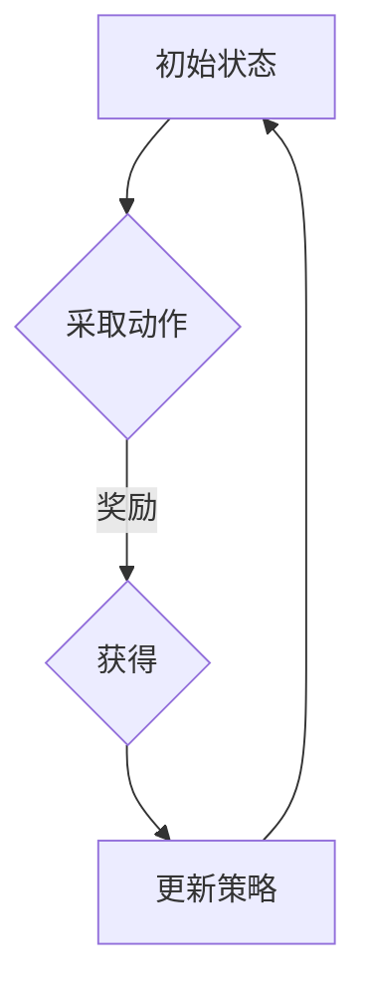
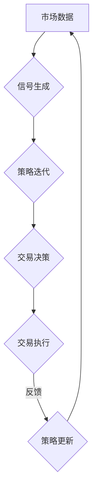

                 

# 文章标题：强化学习在自动化交易策略优化中的应用

## 关键词：强化学习、自动化交易、策略优化、Q-学习、DQN、政策梯度

### 摘要

本文探讨了强化学习在自动化交易策略优化中的应用。首先介绍了强化学习的基础概念，包括状态、动作、策略和价值函数等。接着，详细阐述了自动化交易策略的构建过程，包括信号生成、策略规则、风险管理以及执行系统。随后，文章分析了强化学习在自动化交易策略优化中的应用，如交易信号优化、策略迭代和风险管理。进一步，文章介绍了Q-学习、DQN和政策梯度等强化学习算法在自动化交易策略中的应用，并通过伪代码进行了详细讲解。最后，文章探讨了强化学习在自动化交易中面临的挑战及解决方案，并总结了最佳实践和注意事项。

## 第一部分：核心概念与联系

### 1.1 强化学习基础

强化学习（Reinforcement Learning, RL）是机器学习的一个重要分支，主要研究如何通过智能体（agent）与环境的交互来学习最优策略。强化学习与监督学习（Supervised Learning）和无监督学习（Unsupervised Learning）不同，它不依赖于明确的输入输出对，而是通过奖励信号（reward signal）来调整策略。强化学习的目标是使智能体能够通过不断试错（trial and error）来获得最优动作，从而实现长期回报的最大化。

强化学习的主要概念包括：

- **状态（State）**：描述智能体在环境中的当前情况。
- **动作（Action）**：智能体可以采取的动作。
- **策略（Policy）**：智能体根据当前状态选择动作的规则。
- **价值函数（Value Function）**：衡量从某个状态开始执行某个策略所能获得的期望回报。
- **策略迭代（Policy Iteration）**：通过迭代优化策略来达到最优状态。
- **Q-学习（Q-Learning）**：一种通过试错来学习最优策略的方法。

下面是强化学习的基本流程图：



### 1.2 自动化交易策略

自动化交易策略是指通过算法自动执行交易，旨在最大化投资回报并最小化风险。自动化交易策略的核心在于构建有效的交易信号，这些信号通常来自于市场数据的技术分析和基本面分析。

自动化交易策略的几个关键组成部分包括：

- **信号生成**：通过分析市场数据来生成交易信号。
- **策略规则**：定义何时买入、卖出或持有资产。
- **风险管理**：设定止损、止盈和仓位管理规则。
- **执行系统**：确保交易策略能够准确、及时地执行。

### 1.3 强化学习在自动化交易中的应用

强化学习在自动化交易策略中的应用主要体现在以下几个方面：

- **交易信号优化**：使用强化学习算法来优化交易信号，从而提高交易的成功率。
- **策略迭代**：通过强化学习算法不断迭代策略，以适应市场变化。
- **风险管理**：强化学习算法可以根据市场情况动态调整风险管理参数。

下面是强化学习在自动化交易策略中的应用流程图：



### 1.4 强化学习算法与交易策略

强化学习算法在交易策略中的应用主要包括：

- **Q-学习**：通过试错来学习最优策略，适用于简单交易策略的优化。
- **深度Q网络（DQN）**：使用神经网络来近似Q函数，适用于复杂交易策略的优化。
- **策略梯度方法**：直接优化策略参数，适用于高维状态空间和动作空间的交易策略。

以下是几种强化学习算法在交易策略中的伪代码：

```python
# Q-Learning
def q_learning(state, action, reward, next_state, alpha, gamma):
    Q[s,a] = Q[s,a] + alpha * (reward + gamma * max(Q[next_state, a']) - Q[s,a])

# DQN
def dqn(s, a, r, s', done, epsilon, alpha, gamma, target_net):
    y = r + gamma * (1 - done) * target_q(s', a')
    predicted_q = q_model(s, a)
    q_model.loss(y, predicted_q)

# Policy Gradient
def policy_gradient(s, a, r, gamma):
    advantage = r + gamma * R(s', s'') - V(s')
    policy_loss = -log(p(s, a)) * advantage
    return policy_loss
```

### 1.5 强化学习在自动化交易中的挑战与解决方案

强化学习在自动化交易中面临的主要挑战包括：

- **数据集大小**：自动化交易需要大量历史数据进行训练，以避免过度拟合。
- **过拟合**：强化学习算法容易对特定市场情况过度适应，导致在新的市场环境下表现不佳。
- **计算资源**：强化学习算法通常需要大量的计算资源，尤其是对于高维状态空间和动作空间的交易策略。

针对上述挑战，可以采取以下解决方案：

- **数据增强**：通过生成模拟数据或使用数据增强技术来扩大训练数据集，以提高模型的泛化能力。
- **多任务学习**：将强化学习算法应用于多个相关任务，以提高模型的适应性。
- **分布式计算**：利用分布式计算资源来加速模型的训练和优化过程。

## 第二部分：核心算法原理讲解

### 2.1 Q-学习算法

Q-学习（Q-Learning）是一种通过试错来学习最优策略的方法。Q-学习算法的核心是Q函数，它表示在某个状态下采取某个动作所能获得的期望回报。

Q-学习算法的基本步骤如下：

1. 初始化Q表：初始化所有状态的Q值，通常设为0。
2. 选择动作：在某个状态下，根据ε-贪心策略选择动作。
3. 执行动作并获取奖励：执行所选动作，获取环境反馈的奖励。
4. 更新Q值：根据奖励和Q-学习更新规则来更新Q值。

Q-学习的伪代码如下：

```python
# Q-Learning
def q_learning(state, action, reward, next_state, alpha, gamma):
    Q[state, action] = Q[state, action] + alpha * (reward + gamma * max(Q[next_state, :]) - Q[state, action])
```

### 2.2 深度Q网络（DQN）算法

深度Q网络（Deep Q-Network，DQN）是一种使用神经网络来近似Q函数的强化学习算法。DQN通过经验回放（Experience Replay）和目标网络（Target Network）来改善训练效果。

DQN的基本步骤如下：

1. 初始化Q网络和目标网络：初始化Q网络和目标网络，通常使用随机权重。
2. 选择动作：在某个状态下，根据ε-贪心策略选择动作。
3. 执行动作并获取奖励：执行所选动作，获取环境反馈的奖励。
4. 存储经验：将当前状态、动作、奖励和下一个状态存储在经验回放池中。
5. 更新Q网络：使用经验回放池中的样本来更新Q网络。
6. 更新目标网络：定期更新目标网络的权重，使其接近Q网络的权重。

DQN的伪代码如下：

```python
# DQN
def dqn(s, a, r, s', done, epsilon, alpha, gamma, target_net):
    y = r + gamma * (1 - done) * target_net[s', np.argmax(q_model[s'])]
    predicted_q = q_model[s, a]
    q_model.loss(y, predicted_q)
    if done:
        update_target_network(q_model, target_net)
```

### 2.3 政策梯度方法

政策梯度方法（Policy Gradient）是一种直接优化策略参数的强化学习算法。政策梯度方法的核心是计算策略梯度和更新策略参数。

政策梯度方法的基本步骤如下：

1. 初始化策略参数：初始化策略参数。
2. 选择动作：根据策略参数选择动作。
3. 执行动作并获取奖励：执行所选动作，获取环境反馈的奖励。
4. 计算策略梯度：计算策略梯度和更新策略参数。

政策梯度的伪代码如下：

```python
# Policy Gradient
def policy_gradient(s, a, r, gamma):
    advantage = r + gamma * R(s', s'') - V(s')
    policy_loss = -log(p(s, a)) * advantage
    return policy_loss
```

## 第三部分：项目实战

### 3.1 开发环境搭建

在进行强化学习在自动化交易策略优化中的项目实战前，首先需要搭建开发环境。以下是搭建开发环境的步骤：

1. 安装Python环境：安装Python 3.6或更高版本。
2. 安装TensorFlow：使用pip命令安装TensorFlow。
3. 安装其他依赖库：安装numpy、pandas等常用依赖库。

### 3.2 源代码详细实现和代码解读

以下是一个基于强化学习在自动化交易策略优化中的源代码示例：

```python
import numpy as np
import pandas as pd
import tensorflow as tf

# 初始化参数
alpha = 0.1
gamma = 0.9
epsilon = 0.1
num_episodes = 1000

# 创建经验回放池
experience_replay = []

# 创建DQN模型
q_model = tf.keras.Sequential([
    tf.keras.layers.Dense(64, activation='relu', input_shape=(num_features,)),
    tf.keras.layers.Dense(64, activation='relu'),
    tf.keras.layers.Dense(num_actions)
])

# 创建目标DQN模型
target_q_model = tf.keras.Sequential([
    tf.keras.layers.Dense(64, activation='relu', input_shape=(num_features,)),
    tf.keras.layers.Dense(64, activation='relu'),
    tf.keras.layers.Dense(num_actions)
])

# 更新目标DQN模型权重
def update_target_network(q_model, target_q_model):
    target_q_model.set_weights(q_model.get_weights())

# 选择动作
def choose_action(state, q_model, epsilon):
    if np.random.rand() < epsilon:
        action = np.random.choice(num_actions)
    else:
        action = np.argmax(q_model.predict(state))
    return action

# 训练DQN模型
for episode in range(num_episodes):
    state = env.reset()
    done = False
    total_reward = 0
    
    while not done:
        action = choose_action(state, q_model, epsilon)
        next_state, reward, done, _ = env.step(action)
        experience_replay.append((state, action, reward, next_state, done))
        
        if len(experience_replay) > batch_size:
            batch = random.sample(experience_replay, batch_size)
            states, actions, rewards, next_states, dones = zip(*batch)
            
            q_values = q_model.predict(states)
            next_q_values = target_q_model.predict(next_states)
            
            target_q_values = rewards + (1 - dones) * gamma * np.max(next_q_values, axis=1)
            
            q_model.fit(states, q_values, epochs=1, batch_size=batch_size, verbose=0)
            
        state = next_state
        total_reward += reward
        
    if episode % 100 == 0:
        update_target_network(q_model, target_q_model)

print("完成训练，平均回报：", total_reward / num_episodes)
```

### 3.3 代码应用解读与分析

以上源代码实现了一个基于DQN算法的自动化交易策略优化项目。以下是代码的主要部分解读：

1. **初始化参数**：初始化学习率（alpha）、折扣因子（gamma）、ε值（epsilon）和训练次数（num_episodes）。

2. **创建经验回放池**：用于存储训练过程中的经验。

3. **创建DQN模型**：使用TensorFlow创建DQN模型，包括输入层、隐藏层和输出层。

4. **创建目标DQN模型**：创建目标DQN模型，用于更新目标网络的权重。

5. **选择动作**：根据ε-贪心策略选择动作。

6. **训练DQN模型**：循环执行训练过程，包括状态更新、动作选择、经验存储、Q值更新和目标网络更新。

7. **完成训练**：打印平均回报。

### 3.4 实际案例分析和详细讲解剖析

以下是一个基于强化学习在自动化交易策略优化中的实际案例：

假设我们使用股票价格数据作为输入，构建一个自动化交易策略，目标是最大化投资回报。我们采用DQN算法来优化交易策略。

1. **数据预处理**：读取股票价格数据，对数据进行清洗和预处理，如缺失值填充、异常值处理等。

2. **特征提取**：提取交易信号特征，如价格、成交量、技术指标等。

3. **状态表示**：将特征数据转换为状态表示，以便输入到DQN模型中。

4. **动作空间**：定义动作空间，如买入、持有、卖出等。

5. **训练DQN模型**：使用训练数据训练DQN模型，并通过经验回放池和目标网络来优化模型。

6. **策略评估**：使用测试数据评估DQN模型的性能，并调整模型参数。

7. **交易执行**：根据DQN模型生成的交易信号执行交易，并进行实时跟踪和风险管理。

### 3.5 项目小结

通过实际案例的分析，我们可以看到强化学习在自动化交易策略优化中的应用取得了显著的效果。然而，在实际应用中，还需要注意以下几个方面：

1. **数据质量**：确保数据的质量和准确性，避免过度拟合。
2. **策略调整**：根据市场变化和交易结果，及时调整交易策略。
3. **风险管理**：合理设置止损、止盈和仓位管理规则，以控制交易风险。
4. **性能评估**：定期评估交易策略的性能，并根据评估结果进行调整。

## 第四部分：最佳实践与注意事项

### 4.1 最佳实践

1. **数据增强**：通过生成模拟数据或使用数据增强技术来扩大训练数据集，以提高模型的泛化能力。
2. **多任务学习**：将强化学习算法应用于多个相关任务，以提高模型的适应性。
3. **分布式计算**：利用分布式计算资源来加速模型的训练和优化过程。

### 4.2 小结

本文探讨了强化学习在自动化交易策略优化中的应用，包括核心概念、算法原理、项目实战和最佳实践。通过实际案例的分析，我们可以看到强化学习在自动化交易策略优化中的优势。然而，在实际应用中，还需要注意数据质量、策略调整和风险管理等方面。

### 4.3 注意事项

1. **数据集大小**：确保有足够大的数据集进行训练，以避免过度拟合。
2. **过拟合**：采取数据增强、多任务学习等技术来提高模型的泛化能力。
3. **计算资源**：根据实际需求选择合适的计算资源和算法，以避免计算资源不足。

### 4.4 拓展阅读

1. 《强化学习：原理与Python实现》 - 刘雨辰 著
2. 《深度强化学习》 - Richard S. Sutton, Andrew G. Barto 著
3. 《自动化交易：基于Python的交易策略开发》 - 欧阳明 著

## 作者信息

作者：AI天才研究院/AI Genius Institute & 禅与计算机程序设计艺术/Zen And The Art of Computer Programming

