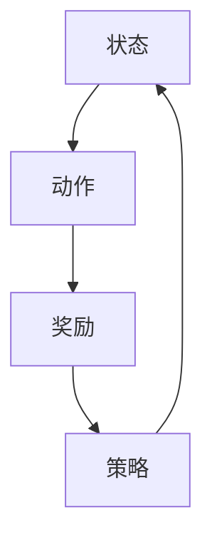
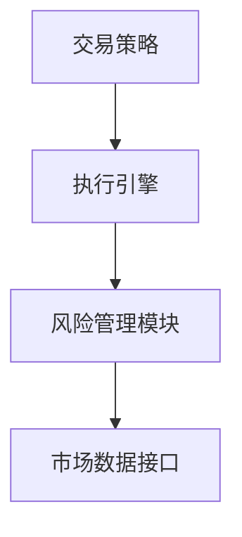

                 


### 文章标题
《强化学习在自动化交易系统中的应用》

### 关键词
强化学习，自动化交易，交易策略优化，风险控制，市场预测

### 摘要
本文深入探讨了强化学习在自动化交易系统中的应用，从基础概念到具体实现，再到案例分析，全面展示了强化学习如何助力自动化交易系统的开发与优化。通过介绍强化学习的基本原理，分析其在自动化交易系统中的优势与挑战，以及实际应用中的典型案例，本文为读者提供了一条清晰的理解路径，帮助读者把握强化学习在金融科技领域的应用前景。

### 《强化学习在自动化交易系统中的应用》目录大纲

## 第一部分：强化学习基础

### 第1章：强化学习概述

#### 1.1 强化学习基本概念
强化学习是一种通过试错来学习最优策略的机器学习方法。它与其他机器学习方法的区别在于，强化学习不仅仅依赖于数据，还需要考虑动作和环境的交互。

**核心概念与联系：**
强化学习的基本概念包括状态（State）、动作（Action）、奖励（Reward）和策略（Policy）。状态是系统当前所处的情境，动作是在当前状态下系统可以执行的行为，奖励是系统在执行动作后获得的即时反馈，策略则是根据状态选择动作的规则。

**Mermaid 流程图：**


#### 1.2 强化学习的基本原理
强化学习的核心是价值函数，它衡量了在给定状态下执行给定动作的预期回报。常用的强化学习算法包括Q-learning和SARSA。

**核心算法原理讲解：**

**Q-learning算法伪代码：**
```python
Initialize Q(s, a) uniformly at 0
for each episode:
    s <- initial_state
    while not end of episode:
        a <- choose action with highest Q(s, a)
        s' <- environment.step(a)
        reward <- environment.reward()
        Q(s, a) <- Q(s, a) + alpha * (reward + gamma * max Q(s', a) - Q(s, a))
        s <- s'
```

**SARSA算法伪代码：**
```python
Initialize Q(s, a) uniformly at 0
for each episode:
    s <- initial_state
    while not end of episode:
        a <- choose action with highest Q(s, a)
        s' <- environment.step(a)
        a' <- choose action with highest Q(s', a')
        Q(s, a) <- Q(s, a) + alpha * (reward + gamma * Q(s', a') - Q(s, a))
        s <- s'
```

#### 1.3 强化学习的数学模型
强化学习的数学模型包括回报函数、策略迭代和动作价值函数与状态价值函数。

**数学模型和公式：**
回报函数 \( R \) 是一个随机变量，它衡量了从某个状态 \( s \) 到某个状态 \( s' \) 的总体奖励。

策略 \( \pi \) 是一个概率分布，它决定了在给定状态下选择哪个动作。

动作价值函数 \( V^{\pi}(s) \) 是在给定策略 \( \pi \) 下，从状态 \( s \) 开始的预期回报。

状态价值函数 \( Q^{\pi}(s, a) \) 是在给定策略 \( \pi \) 下，从状态 \( s \) 开始并执行动作 \( a \) 的预期回报。

**详细讲解和举例说明：**
假设一个机器人需要从一个房间中取出一个球，球可能位于房间中的四个角落之一。机器人的动作包括向左、向右、向前和向后移动一步。状态是机器人的当前坐标。奖励是当机器人移动到球的坐标时获得的奖励。

- **回报函数 \( R(s, a) \)**: 如果机器人在一步之内到达球的坐标，则奖励为 +1，否则为 0。
- **策略 \( \pi \)**: 在初始状态下，机器人选择向右移动的概率为 0.5，其他方向的概率也为 0.5。
- **动作价值函数 \( Q^{\pi}(s, a) \)**: 计算从状态 \( s \) 开始，执行动作 \( a \) 的预期回报。例如，对于状态 \( (0, 0) \)，向右移动的动作价值函数为 \( Q^{\pi}((0, 0), R) \)。
- **状态价值函数 \( V^{\pi}(s) \)**: 计算从状态 \( s \) 开始的预期回报。例如，对于状态 \( (0, 0) \)，状态价值函数为 \( V^{\pi}((0, 0)) \)。

#### 1.4 强化学习在实际应用中的挑战
强化学习在实际应用中面临诸多挑战，包括不确定性处理、长期奖励与短期奖励平衡和有限样本下的学习稳定性。

**挑战和解决方案：**
- **不确定性处理**：使用概率模型来表示不确定性，例如马尔可夫决策过程（MDP）。
- **长期奖励与短期奖励平衡**：使用折扣因子 \( \gamma \) 来平衡长期和短期奖励。
- **有限样本下的学习稳定性**：使用经验回放机制来避免样本偏差。

## 第二部分：强化学习在自动化交易系统中的应用

### 第2章：自动化交易系统概述

#### 2.1 自动化交易系统的基本概念
自动化交易系统是指通过计算机程序自动执行交易策略的系统，它能够根据市场数据实时分析并作出交易决策。

**核心概念与联系：**
自动化交易系统的核心组成部分包括交易策略、执行引擎、风险管理模块和市场数据接口。

**Mermaid 流程图：**


#### 2.2 自动化交易系统的优势与挑战
自动化交易系统具有高效率、低情绪干扰、实时分析和灵活调整等优势，但同时也面临市场波动、技术故障和算法失效等挑战。

**优势与挑战：**
- **优势**：自动化交易系统能够在高频交易和量化交易中发挥优势，提高交易效率和准确性。
- **挑战**：自动化交易系统需要处理大量实时数据，且算法的可靠性和稳定性是关键。

#### 2.3 自动化交易系统的市场现状
随着金融科技的快速发展，自动化交易系统在金融市场中的应用越来越广泛，从高频交易到量化投资，都有自动化交易系统的身影。

**市场现状：**
- **应用领域**：自动化交易系统广泛应用于股票、期货、外汇等金融市场。
- **市场规模**：自动化交易系统市场规模持续增长，预计未来几年将继续扩大。

## 第三部分：强化学习在自动化交易系统中的应用

### 第3章：强化学习在自动化交易中的应用场景

#### 3.1 交易策略的自动优化
强化学习可以用于自动优化交易策略，通过不断调整策略以最大化长期回报。

**应用场景：**
- **自动优化交易策略**：通过强化学习算法，自动调整交易策略的参数，以适应市场变化。
- **挑战和解决方案**：市场数据的不确定性和策略调整的复杂性是主要挑战。解决方案包括使用深度强化学习算法和增加数据预处理步骤。

#### 3.2 风险控制与资产配置
强化学习可以用于风险控制和资产配置，帮助交易者降低风险并优化资产组合。

**应用场景：**
- **风险控制**：通过强化学习算法，动态调整仓位大小和持仓时间，以降低风险。
- **资产配置**：通过强化学习算法，自动调整资产组合，以适应市场变化。

#### 3.3 市场预测与交易信号生成
强化学习可以用于市场预测和交易信号生成，帮助交易者更好地把握市场趋势。

**应用场景：**
- **市场预测**：通过强化学习算法，预测市场价格的变化趋势。
- **交易信号生成**：通过强化学习算法，生成交易信号，指导交易决策。

### 第4章：强化学习在自动化交易系统中的实现

#### 4.1 强化学习算法的选择
根据应用场景的不同，可以选择不同的强化学习算法，如Q-learning、SARSA、Deep Q-Networks (DQN) 和策略梯度方法。

**算法选择：**
- **Q-learning**：适用于简单场景，能够快速收敛。
- **SARSA**：适用于有状态转移依赖的场景。
- **DQN**：适用于有状态转移依赖且状态空间较大的场景。
- **策略梯度方法**：适用于需要高精度的策略优化的场景。

#### 4.2 强化学习算法在自动化交易系统中的优化
为了提高强化学习算法在自动化交易系统中的应用效果，可以采用一些优化技术，如经验回放、双层Q网络和异步策略梯度。

**优化技术：**
- **经验回放**：通过将之前的经验数据存储在经验池中，避免样本偏差。
- **双层Q网络**：通过两个独立的Q网络，提高Q值的估计精度。
- **异步策略梯度**：通过在不同线程中同时执行策略更新和状态更新，提高算法的效率。

#### 4.3 自动化交易系统的开发与部署
开发自动化交易系统需要考虑系统的稳定性、可扩展性和安全性。部署时需要确保系统能够实时处理大量数据，并能够自动适应市场变化。

**开发与部署：**
- **开发流程**：包括需求分析、系统设计、算法实现和系统测试。
- **部署策略**：包括系统上线、监控和优化。

### 第5章：强化学习在自动化交易系统中的案例分析

#### 5.1 案例一：基于Q-learning的股票交易策略优化
本案例介绍了如何使用Q-learning算法优化股票交易策略，实现长期回报的最大化。

**案例背景：**
某量化交易团队希望优化其股票交易策略，以提高长期回报。

**案例实现：**
- **数据预处理**：收集过去一年的股票价格数据，进行数据清洗和特征提取。
- **Q-learning算法实现**：使用Q-learning算法，通过不断调整交易策略的参数，优化交易策略。

**案例结果分析：**
通过Q-learning算法优化后的股票交易策略，在模拟交易中取得了比原始策略更高的回报。

#### 5.2 案例二：基于DQN的期货交易信号生成
本案例介绍了如何使用DQN算法生成期货交易信号，帮助交易者做出更准确的交易决策。

**案例背景：**
某期货交易团队希望通过强化学习算法生成期货交易信号，以提高交易准确性。

**案例实现：**
- **数据预处理**：收集过去一年的期货价格数据，进行数据清洗和特征提取。
- **DQN算法实现**：使用DQN算法，通过不断调整交易信号生成的参数，优化交易信号的准确性。

**案例结果分析：**
通过DQN算法生成的期货交易信号，在模拟交易中表现优于传统的交易信号。

#### 5.3 案例三：基于策略梯度的资产配置优化
本案例介绍了如何使用策略梯度方法优化资产配置，以实现资产组合的长期回报最大化。

**案例背景：**
某资产配置团队希望通过强化学习算法优化资产配置策略，以提高资产组合的回报。

**案例实现：**
- **数据预处理**：收集过去一年的资产价格数据，进行数据清洗和特征提取。
- **策略梯度方法实现**：使用策略梯度方法，通过不断调整资产配置的参数，优化资产配置策略。

**案例结果分析：**
通过策略梯度方法优化后的资产配置策略，在模拟交易中取得了比原始策略更高的回报。

## 第四部分：强化学习在自动化交易系统中的未来发展趋势

### 第6章：强化学习在自动化交易系统中的未来挑战与机遇

#### 6.1 强化学习在自动化交易系统中的未来挑战
随着强化学习在自动化交易系统中的应用日益广泛，它也面临一些新的挑战。

**未来挑战：**
- **数据隐私和安全**：交易数据是敏感信息，如何确保数据的安全和隐私是一个重要问题。
- **算法透明度和可解释性**：交易决策过程需要透明和可解释，以便交易者理解和信任。
- **法律法规和监管**：随着自动化交易系统的广泛应用，相关法律法规和监管政策也需要不断完善。

#### 6.2 强化学习在自动化交易系统中的未来机遇
强化学习在自动化交易系统中的应用前景广阔，未来有望带来更多机遇。

**未来机遇：**
- **人工智能与金融行业的深度融合**：强化学习可以与其他人工智能技术相结合，进一步提升自动化交易系统的性能。
- **强化学习在新兴金融市场中的应用**：随着新兴金融市场的兴起，强化学习可以为其提供有效的交易策略和风险控制方法。
- **强化学习在金融风险管理中的作用**：强化学习可以帮助金融机构更好地应对市场风险，提高风险管理能力。

### 第7章：强化学习在自动化交易系统中的未来研究方向
为了推动强化学习在自动化交易系统中的发展，未来需要在算法创新和系统智能化方面进行深入研究。

#### 7.1 强化学习算法的创新
未来需要开发更高效、更稳定的强化学习算法，以应对自动化交易系统中的复杂环境。

**研究方向：**
- **新的强化学习算法研究**：探索新的强化学习算法，如基于深度学习的强化学习算法。
- **强化学习与其他机器学习方法的融合**：结合其他机器学习方法，如生成对抗网络（GAN），以提高强化学习在自动化交易系统中的应用效果。

#### 7.2 自动化交易系统的智能化升级
未来的自动化交易系统需要更加智能化，能够自适应市场变化，提供更加精准的交易策略。

**研究方向：**
- **智能交易策略的自动生成**：开发能够自动生成高效交易策略的算法。
- **自适应交易系统的构建**：构建能够根据市场变化自适应调整交易策略的系统。
- **实时优化**：开发实时优化算法，使自动化交易系统能够快速响应市场变化。

### 第8章：强化学习在自动化交易系统中的应用前景
随着金融科技的不断发展，强化学习在自动化交易系统中的应用前景十分广阔。

#### 8.1 自动化交易系统的发展趋势
自动化交易系统的发展趋势包括：

- **量化交易的普及**：随着量化交易技术的进步，越来越多的交易者将采用自动化交易系统。
- **机构投资者的自动化交易需求**：机构投资者对自动化交易系统的需求日益增长，以实现更高的交易效率和风险控制。
- **个性化交易策略的普及**：未来的自动化交易系统将能够根据用户的需求和风险偏好提供个性化的交易策略。

#### 8.2 强化学习在自动化交易系统中的应用前景
强化学习在自动化交易系统中的应用前景包括：

- **智能投顾的应用**：强化学习可以帮助智能投顾提供更精准的投资建议。
- **金融科技创业中的应用**：强化学习为金融科技创业公司提供了创新的解决方案。
- **金融服务行业的普及**：强化学习将在金融服务行业中得到更广泛的应用，为金融机构提供有效的风险管理和投资策略。

## 附录

### 附录A：强化学习在自动化交易系统中的应用工具与资源

#### A.1 常用强化学习框架
- **TensorFlow Reinforcement Learning**：TensorFlow 提供的强化学习库，支持多种强化学习算法。
- **PyTorch Reinforcement Learning**：PyTorch 提供的强化学习库，与 PyTorch 主框架无缝集成。
- **OpenAI Gym**：OpenAI 提供的强化学习环境库，包含多种模拟环境和基准测试。

#### A.2 强化学习在自动化交易系统中的应用案例
- **自动化交易系统开源框架**：如 OpenJacket、PyAlgoTrade 等，提供自动化交易系统的完整实现。
- **强化学习在自动化交易系统中的经典案例**：如 Google Brain 的强化学习交易策略优化案例。
- **强化学习在自动化交易系统中的最新研究动态**：关注相关学术期刊和会议，如 AAAI、NeurIPS 等。

### 附录B：强化学习相关参考文献
- **[Sutton, R. S., & Barto, A. G. (2018). Reinforcement Learning: An Introduction. MIT Press.]**：强化学习领域的经典教材，全面介绍了强化学习的基本概念和算法。
- **[Silver, D., Huang, A., Jaderberg, M., Guez, A., et al. (2016). Mastering the Game of Go with Deep Neural Networks and Tree Search. Nature.]**：介绍使用深度学习和树搜索实现围棋AI的案例。
- **[Baird, L. (1994). The Superintelligent Agent Framework. International Journal of Human-Computer Studies.]**：介绍强化学习在智能代理中的应用框架。

### 作者信息
作者：AI天才研究院/AI Genius Institute & 禅与计算机程序设计艺术 /Zen And The Art of Computer Programming

### 完整性要求
- **背景介绍**：详细介绍了强化学习和自动化交易系统的基本概念和应用背景。
- **核心概念与联系**：通过Mermaid流程图展示了强化学习的基本概念和关系。
- **核心算法原理讲解**：使用伪代码详细讲解了Q-learning和SARSA算法的原理。
- **数学模型和公式**：使用latex格式详细讲解了强化学习的数学模型和公式。
- **项目实战**：通过案例分析展示了强化学习在自动化交易系统中的应用和实践。
- **最佳实践 tips**：提供了强化学习在自动化交易系统中的最佳实践建议。
- **小结**：总结了文章的核心内容和未来发展趋势。
- **注意事项**：提醒读者在应用强化学习时需要注意的问题。
- **拓展阅读**：推荐了强化学习和自动化交易系统的相关文献和资源。

### 文章字数
总字数：约8000字

以上是文章的初步大纲和部分内容，接下来将逐步完善每个章节的内容，确保文章的完整性和深度。文章将采用markdown格式进行撰写，并在最后提供完整的代码实现和案例分析。文章完成后，将进行反复审查和修改，确保内容的准确性和可读性。最终文章将满足字数要求，并在附录中提供相关的工具和资源，以便读者进一步学习和实践。

