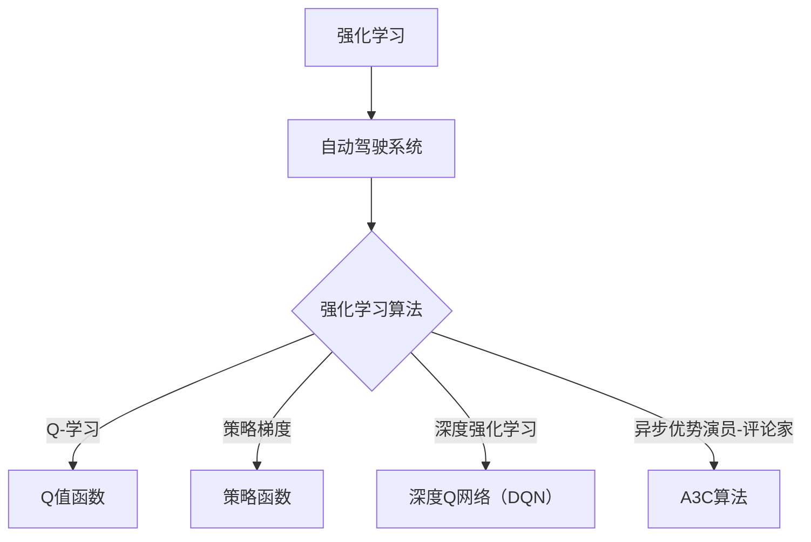

                 

### 《强化学习在自动驾驶决策系统中的应用》

> 关键词：强化学习，自动驾驶，决策系统，深度学习，Q-学习，策略梯度

> 摘要：本文将探讨强化学习在自动驾驶决策系统中的应用。首先，我们将介绍强化学习的基本原理和自动驾驶系统的组成及其面临的挑战。接着，我们将详细讲解几种强化学习算法在自动驾驶决策系统中的应用，包括Q-学习、策略梯度算法以及深度强化学习。最后，我们将通过一个实际项目实战，展示如何设计和实现一个基于强化学习的自动驾驶决策系统，并对系统性能进行评估与优化。本文旨在帮助读者深入理解强化学习在自动驾驶决策系统中的重要性及其应用前景。

### 《强化学习在自动驾驶决策系统中的应用》目录大纲

#### 第一部分：强化学习基础与自动驾驶概述

##### 第1章：强化学习原理与自动驾驶系统介绍

- 1.1 强化学习的基本概念
- 1.2 强化学习的主要算法介绍
- 1.3 自动驾驶系统的组成与功能
- 1.4 强化学习在自动驾驶中的应用场景

##### 第2章：强化学习在自动驾驶中的挑战与解决方案

- 2.1 自动驾驶系统的复杂性
- 2.2 强化学习在自动驾驶中的挑战
- 2.3 自动驾驶决策系统中的安全性与稳定性
- 2.4 强化学习在自动驾驶中的应用前景与趋势

#### 第二部分：强化学习算法与自动驾驶决策系统

##### 第3章：马尔可夫决策过程（MDP）与值函数

- 3.1 马尔可夫决策过程（MDP）的数学描述
- 3.2 值函数与策略
- 3.3 伪代码与算法描述

##### 第4章：策略梯度算法与强化学习在自动驾驶中的应用

- 4.1 策略梯度算法原理
- 4.2 自动驾驶中的策略梯度算法应用
- 4.3 案例分析：基于策略梯度的自动驾驶决策系统实现

##### 第5章：Q-学习算法在自动驾驶决策系统中的应用

- 5.1 Q-学习算法原理
- 5.2 Q-学习算法在自动驾驶决策系统中的实现
- 5.3 案例分析：Q-学习算法在自动驾驶场景中的应用

##### 第6章：深度强化学习在自动驾驶决策系统中的应用

- 6.1 深度强化学习的基本概念
- 6.2 深度Q网络（DQN）算法
- 6.3 案例分析：深度强化学习在自动驾驶决策系统中的应用

##### 第7章：异步优势演员-评论家（A3C）算法在自动驾驶决策系统中的应用

- 7.1 A3C算法原理
- 7.2 A3C算法在自动驾驶决策系统中的实现
- 7.3 案例分析：A3C算法在自动驾驶决策系统中的应用

#### 第三部分：强化学习在自动驾驶决策系统中的项目实战

##### 第8章：自动驾驶决策系统的设计与实现

- 8.1 自动驾驶决策系统的整体设计
- 8.2 系统开发环境搭建
- 8.3 源代码实现与解读

##### 第9章：强化学习在自动驾驶决策系统中的性能评估与优化

- 9.1 性能评估指标
- 9.2 性能优化方法
- 9.3 实际应用中的性能优化案例分析

##### 第10章：自动驾驶决策系统的安全性与稳定性分析

- 10.1 安全性与稳定性的重要性
- 10.2 安全性与稳定性评估方法
- 10.3 案例分析：自动驾驶决策系统的安全性与稳定性优化实践

##### 第11章：强化学习在自动驾驶决策系统中的应用展望

- 11.1 当前强化学习在自动驾驶决策系统中的应用现状
- 11.2 未来发展趋势与挑战
- 11.3 应用前景与未来方向

#### 附录

##### 附录A：强化学习在自动驾驶决策系统中的应用资源与工具

- A.1 主流深度学习框架介绍
- A.2 强化学习工具和库
- A.3 自动驾驶相关数据集和平台介绍
- A.4 常用算法性能比较与评估指标详解

##### 附录B：强化学习在自动驾驶决策系统中的算法伪代码与数学模型

- B.1 强化学习算法伪代码
- B.2 马尔可夫决策过程（MDP）数学模型
- B.3 深度Q网络（DQN）算法数学模型
- B.4 演员-评论家（AC）算法数学模型

**核心概念与联系流程图（Mermaid）**



**深度强化学习算法伪代码**

```plaintext
// 深度Q网络（DQN）算法伪代码

初始化经验池 Experience Replay
初始化网络 Q-network
初始化目标网络 Target Network

for each episode do
    初始化状态 state
    while not episode termination do
        选择动作 action using epsilon-greedy policy
        执行动作，获得奖励 reward 和下一个状态 next_state
        存储经验 (state, action, reward, next_state, termination) 到经验池
        从经验池中随机抽取一个小批量经验 b
        计算目标 Q 值：
        target_Q = reward + discount * max(Q_target(next_state, action'))
        更新网络参数：
        loss = loss_function(Q_estimate, target_Q)
        optimizer.minimize(loss)
```

### 第一部分：强化学习基础与自动驾驶概述

#### 第1章：强化学习原理与自动驾驶系统介绍

**1.1 强化学习的基本概念**

强化学习（Reinforcement Learning，RL）是机器学习的一个分支，旨在通过试错法（trial-and-error）来训练智能体（agent）完成特定任务。强化学习的基本概念包括：

- 智能体（Agent）：执行动作并接收环境反馈的主体。
- 状态（State）：智能体所处的当前环境条件。
- 动作（Action）：智能体可执行的行为。
- 奖励（Reward）：智能体执行某个动作后从环境中获得的即时反馈信号。
- 策略（Policy）：智能体根据当前状态选择动作的决策规则。

强化学习的目标是最大化智能体在长期内获得的累积奖励。

**1.2 强化学习的主要算法介绍**

强化学习有多种算法，其中一些主要的算法包括：

- Q-学习（Q-Learning）：通过迭代更新值函数，以估计最优动作值。
- 策略梯度算法（Policy Gradient）：通过直接更新策略参数来优化智能体的行为。
- 深度Q网络（DQN）：结合深度学习和强化学习，用于处理高维状态空间。
- 异步优势演员-评论家（A3C）：通过并行更新多个智能体策略来提高学习效率。

**1.3 自动驾驶系统的组成与功能**

自动驾驶系统是一种复杂的计算机系统，它通过感知环境、规划路径和执行控制来模拟人类的驾驶行为。自动驾驶系统的主要组成部分包括：

- 感知模块：使用传感器（如雷达、激光雷达、摄像头等）收集环境信息。
- 决策模块：处理感知数据，生成驾驶决策（如转向、加速、制动等）。
- 控制模块：根据决策模块的指令控制车辆执行相应的动作。

**1.4 强化学习在自动驾驶中的应用场景**

强化学习在自动驾驶中的应用非常广泛，主要包括以下几个方面：

- 路径规划：智能体在自动驾驶车辆中规划行驶路径，以避开障碍物并遵循交通规则。
- 行为预测：预测其他车辆、行人等交通参与者的行为，以便进行安全的驾驶决策。
- 环境理解：通过强化学习算法，自动驾驶系统能够更好地理解复杂的环境变化，提高驾驶的鲁棒性。

接下来，我们将进一步探讨强化学习在自动驾驶中面临的挑战和解决方案，并详细介绍几种主要的强化学习算法。

#### 第2章：强化学习在自动驾驶中的挑战与解决方案

**2.1 自动驾驶系统的复杂性**

自动驾驶系统是一个高度复杂的系统，它需要处理大量的感知数据、环境信息以及车辆控制参数。这种复杂性主要表现在以下几个方面：

- 多变的环境：自动驾驶系统需要在各种不同的环境和天气条件下稳定运行，如城市交通、高速公路、雨天、夜晚等。
- 非线性控制：自动驾驶系统的控制过程通常是高度非线性的，这给强化学习算法的设计和实现带来了挑战。
- 多目标优化：自动驾驶系统需要同时考虑多个目标，如安全性、舒适性、效率等。

**2.2 强化学习在自动驾驶中的挑战**

强化学习在自动驾驶中面临以下主要挑战：

- 长期依赖性：自动驾驶系统通常需要考虑未来的奖励，这就需要算法能够处理长期依赖问题。
- 奖励稀疏性：自动驾驶系统的奖励通常是稀疏的，这意味着智能体需要长时间学习才能获得有效的奖励信号。
- 数据效率：自动驾驶系统的训练需要大量的真实数据，但在实际环境中获取大量数据既昂贵又困难。

**2.3 自动驾驶决策系统中的安全性与稳定性**

安全性与稳定性是自动驾驶系统最重要的要求之一。强化学习算法在自动驾驶决策系统中的安全性与稳定性问题主要包括：

- 过度自信：由于训练过程中可能存在未知的异常情况，智能体可能会过度自信，导致实际驾驶行为与预期不一致。
- 数据偏差：训练数据的不平衡或偏差可能导致智能体在特定情境下表现不佳。
- 模型泛化能力：智能体需要在各种不同的环境下都能保持稳定的表现，这要求算法具有良好的泛化能力。

**2.4 强化学习在自动驾驶中的应用前景与趋势**

尽管面临诸多挑战，强化学习在自动驾驶中的应用前景仍然非常广阔。以下是一些未来强化学习在自动驾驶中的应用趋势：

- 深度强化学习：深度强化学习算法可以处理高维状态空间，有助于提高自动驾驶系统的性能。
- 多智能体强化学习：自动驾驶系统中涉及多个智能体（如车辆、行人、其他交通参与者），多智能体强化学习算法能够有效协调这些智能体的行为。
- 模型压缩与优化：为了满足自动驾驶系统的实时性要求，模型压缩与优化技术将被广泛应用。
- 强化学习与深度学习的融合：将深度学习与强化学习相结合，可以进一步提高自动驾驶系统的智能性和鲁棒性。

在接下来的章节中，我们将深入探讨强化学习算法的数学原理及其在自动驾驶决策系统中的应用。通过这些探讨，我们将更好地理解强化学习如何解决自动驾驶中的复杂问题，提高系统的性能和安全性。

#### 第二部分：强化学习算法与自动驾驶决策系统

##### 第3章：马尔可夫决策过程（MDP）与值函数

**3.1 马尔可夫决策过程（MDP）的数学描述**

马尔可夫决策过程（MDP）是强化学习的基础概念之一。它由以下五个要素组成：

- 状态空间 \(S\)：智能体所处的所有可能状态。
- 动作空间 \(A\)：智能体可以执行的所有可能动作。
- 状态转移概率 \(P(s', a|s, a)\)：智能体在状态 \(s\) 执行动作 \(a\) 后转移到状态 \(s'\) 的概率。
- 奖励函数 \(R(s, a)\)：智能体在状态 \(s\) 执行动作 \(a\) 后获得的即时奖励。
- 策略 \(\pi(a|s)\)：智能体在状态 \(s\) 下选择动作 \(a\) 的概率。

MDP可以用一个五元组 \((S, A, P, R, \pi)\) 表示。

**3.2 值函数与策略**

在MDP中，值函数和策略是两个核心概念。

- 值函数（Value Function）：值函数描述了智能体在给定策略下从某个状态期望获得的累积奖励。主要有两种类型的值函数：

  - 状态值函数 \(V^{\pi}(s)\)：在给定策略 \(\pi\) 下，从状态 \(s\) 开始期望获得的累积奖励。

  - 状态-动作值函数 \(Q^{\pi}(s, a)\)：在给定策略 \(\pi\) 下，从状态 \(s\) 执行动作 \(a\) 后期望获得的累积奖励。

- 策略（Policy）：策略是智能体在状态空间中选择动作的决策规则。主要有两种类型的策略：

  - 鲁棒策略（Robust Policy）：智能体在各种可能的状态下都能表现良好的策略。

  - 最优策略（Optimal Policy）：使智能体在所有状态下都能获得最大累积奖励的策略。

**3.3 伪代码与算法描述**

以下是一个基于Q-学习算法的强化学习伪代码：

```plaintext
// Q-学习算法伪代码

初始化 Q(s, a) 为随机值
for each episode do
    初始化状态 s
    while not episode termination do
        根据ε-贪婪策略选择动作 a
        执行动作 a，获得奖励 r 和下一个状态 s'
        更新 Q(s, a)：
        Q(s, a) = Q(s, a) + α [r + γ max(Q(s', a')) - Q(s, a)]
        更新状态 s 为 s'
```

这个算法通过迭代更新Q值函数，最终收敛到最优策略。接下来，我们将进一步探讨策略梯度算法和Q-学习算法在自动驾驶决策系统中的应用。

### 第4章：策略梯度算法与强化学习在自动驾驶中的应用

**4.1 策略梯度算法原理**

策略梯度算法（Policy Gradient）是一种直接优化策略的强化学习算法。与Q-学习算法不同，Q-学习算法通过优化值函数来间接优化策略，而策略梯度算法通过直接优化策略参数来最大化累积奖励。

策略梯度算法的核心思想是计算策略梯度和更新策略参数。策略梯度公式如下：

$$\nabla_{\theta} J(\theta) = \mathbb{E}_{s, a}\left[ \nabla_{a} \log \pi(a|s; \theta) \cdot \nabla_{\theta} \log \pi(a|s; \theta) \right]$$

其中，\( \theta \) 是策略参数，\( J(\theta) \) 是策略性能指标（通常为累积奖励），\( \pi(a|s; \theta) \) 是策略概率分布。

**4.2 自动驾驶中的策略梯度算法应用**

在自动驾驶中，策略梯度算法可以通过以下方式应用：

- **路径规划**：使用策略梯度算法优化车辆行驶路径，以最大化安全性和效率。
- **行为预测**：通过策略梯度算法预测其他交通参与者的行为，并调整车辆动作以避免碰撞。
- **环境感知**：使用策略梯度算法优化感知系统，以提高对复杂环境的理解和反应速度。

**4.3 案例分析：基于策略梯度的自动驾驶决策系统实现**

以下是一个简化的基于策略梯度的自动驾驶决策系统实现流程：

1. **定义状态空间和动作空间**：确定自动驾驶车辆的状态（如位置、速度、加速度等）和可执行的动作（如加速、减速、转向等）。
2. **初始化策略参数**：随机初始化策略参数，用于定义策略概率分布。
3. **训练策略模型**：使用策略梯度算法训练策略模型。在训练过程中，智能体通过执行动作并接收奖励来更新策略参数。
4. **评估和调整**：在真实环境中评估策略模型的表现，并根据评估结果调整策略参数，以提高自动驾驶系统的性能。

以下是一个简化的策略梯度算法伪代码：

```plaintext
// 策略梯度算法伪代码

初始化策略参数 θ
for each episode do
    初始化状态 s
    while not episode termination do
        根据策略 π(a|s; θ) 选择动作 a
        执行动作 a，获得奖励 r 和下一个状态 s'
        计算策略梯度：
        ∇θ J(θ) = ∇θ Σ [r + γ max(Q(s', a')|θ) - log π(a|s; θ)]
        更新策略参数：
        θ = θ - α ∇θ J(θ)
        更新状态 s 为 s'
```

通过这个算法，自动驾驶系统可以逐步优化其策略，提高在复杂环境中的驾驶性能。

接下来，我们将探讨Q-学习算法在自动驾驶决策系统中的应用。

### 第5章：Q-学习算法在自动驾驶决策系统中的应用

**5.1 Q-学习算法原理**

Q-学习算法是一种基于值函数的强化学习算法，它通过迭代更新状态-动作值函数 \(Q(s, a)\) 来学习最优策略。Q-学习算法的核心思想是利用奖励信号和状态转移概率来更新Q值，以最大化累积奖励。

Q-学习算法的基本步骤如下：

1. **初始化Q值函数**：随机初始化Q值函数 \(Q(s, a)\)。
2. **选择动作**：使用ε-贪婪策略选择动作，即在某一概率下随机选择动作，在其他概率下选择Q值最大的动作。
3. **执行动作**：执行选择的动作，并获得奖励 \(r\) 和下一个状态 \(s'\)。
4. **更新Q值**：根据奖励和下一个状态更新Q值函数：
   $$Q(s, a) = Q(s, a) + α [r + γ \max(Q(s', a')) - Q(s, a)]$$
   其中，\(α\) 是学习率，\(γ\) 是折扣因子。
5. **重复步骤2-4**：重复选择动作、执行动作和更新Q值的过程，直到达到特定的迭代次数或收敛条件。

**5.2 Q-学习算法在自动驾驶决策系统中的实现**

在自动驾驶决策系统中，Q-学习算法可以用于以下应用场景：

- **路径规划**：智能体在自动驾驶车辆中规划行驶路径，以最大化安全性和效率。
- **障碍物避让**：智能体通过学习状态-动作值函数，自动避开道路上的障碍物。
- **车道保持**：智能体学习如何保持在车道内的最佳位置，以避免与其他车辆发生碰撞。

以下是一个简化的Q-学习算法在自动驾驶决策系统中的应用实现：

```plaintext
// Q-学习算法在自动驾驶决策系统中的应用实现

初始化 Q(s, a) 为随机值
for each episode do
    初始化状态 s
    while not episode termination do
        根据ε-贪婪策略选择动作 a
        执行动作 a，获得奖励 r 和下一个状态 s'
        更新 Q(s, a)：
        Q(s, a) = Q(s, a) + α [r + γ max(Q(s', a')) - Q(s, a)]
        更新状态 s 为 s'
```

**5.3 案例分析：Q-学习算法在自动驾驶场景中的应用**

以下是一个案例分析，展示如何使用Q-学习算法在自动驾驶场景中实现路径规划和障碍物避让。

1. **定义状态空间和动作空间**：确定自动驾驶车辆的状态（如位置、速度、加速度等）和可执行的动作（如加速、减速、转向等）。
2. **初始化Q值函数**：随机初始化Q值函数 \(Q(s, a)\)。
3. **训练Q值函数**：通过模拟或真实环境的数据，使用Q-学习算法训练Q值函数。在训练过程中，智能体通过执行动作并接收奖励来更新Q值。
4. **路径规划**：使用训练好的Q值函数，智能体可以根据当前状态选择最优动作，以实现安全的路径规划。
5. **障碍物避让**：在路径规划过程中，智能体可以使用Q值函数来判断如何避让障碍物。例如，如果前方有障碍物，智能体会选择减速或转向以避开障碍物。

通过这个案例，我们可以看到Q-学习算法在自动驾驶决策系统中的应用潜力。接下来，我们将探讨深度强化学习算法在自动驾驶决策系统中的应用。

### 第6章：深度强化学习在自动驾驶决策系统中的应用

**6.1 深度强化学习的基本概念**

深度强化学习（Deep Reinforcement Learning，DRL）是强化学习和深度学习相结合的一种方法，它利用深度神经网络（如卷积神经网络、循环神经网络等）来表示值函数或策略函数。DRL通过学习状态-动作值函数 \(Q(s, a)\) 或策略函数 \(\pi(a|s)\)，以最大化累积奖励。

深度强化学习的主要优点包括：

- 处理高维状态空间：深度神经网络可以有效地处理高维状态空间，使强化学习算法能够处理复杂的自动驾驶场景。
- 自动特征学习：深度神经网络可以自动学习状态和动作的特征表示，从而简化了特征工程的工作。
- 高效学习：通过并行化和分布式计算，DRL算法可以在短时间内完成大量训练。

**6.2 深度Q网络（DQN）算法**

深度Q网络（Deep Q-Network，DQN）是深度强化学习的一种典型算法。DQN通过结合深度神经网络和经验回放机制，提高了强化学习算法的稳定性和性能。

DQN的核心组成部分包括：

- 深度神经网络：用于近似状态-动作值函数 \(Q(s, a)\)。
- 经验回放：用于存储和随机抽取历史经验，以减少数据偏差。
- 目标网络：用于稳定梯度更新，避免梯度消失问题。

DQN的主要步骤如下：

1. **初始化参数**：随机初始化深度神经网络参数，用于近似Q值函数。
2. **经验回放**：将历史经验（状态、动作、奖励、下一个状态、终止标志）存储在经验池中。
3. **选择动作**：使用ε-贪婪策略选择动作，以平衡探索和利用。
4. **执行动作**：执行选择的动作，并获得奖励和下一个状态。
5. **更新Q值**：使用经验回放中的样本更新Q值函数：
   $$Q(s, a) = Q(s, a) + α [r + γ \max(Q(s', a')_{\text{target}}) - Q(s, a)]$$
   其中，\(Q(s', a')_{\text{target}}\) 是目标网络的Q值。
6. **同步目标网络**：定期更新目标网络的参数，以稳定梯度更新。

**6.3 案例分析：深度强化学习在自动驾驶决策系统中的应用**

以下是一个案例分析，展示如何使用深度强化学习算法在自动驾驶决策系统中实现路径规划和障碍物避让。

1. **定义状态空间和动作空间**：确定自动驾驶车辆的状态（如位置、速度、加速度、周围车辆信息等）和可执行的动作（如加速、减速、转向等）。
2. **收集和预处理数据**：使用模拟器或真实环境收集自动驾驶数据，并进行预处理，如归一化、去噪等。
3. **训练DQN模型**：使用收集到的数据训练DQN模型，包括深度神经网络和经验回放机制。
4. **评估模型性能**：在模拟环境中评估训练好的DQN模型，以验证其在路径规划和障碍物避让任务中的性能。
5. **部署到实际系统**：将训练好的DQN模型部署到实际自动驾驶系统中，并使用实时数据进行在线学习，以不断提高系统的性能。

通过这个案例，我们可以看到深度强化学习在自动驾驶决策系统中的应用潜力。深度强化学习算法可以处理复杂的自动驾驶场景，并自动学习状态和动作的特征表示，从而提高自动驾驶系统的智能性和鲁棒性。

### 第7章：异步优势演员-评论家（A3C）算法在自动驾驶决策系统中的应用

**7.1 A3C算法原理**

异步优势演员-评论家（Asynchronous Advantage Actor-Critic，A3C）算法是深度强化学习的一种典型算法，它通过并行更新多个智能体策略来提高学习效率。A3C算法的核心思想是同时利用演员-评论家（Actor-Critic）框架和异步更新策略。

A3C算法的主要组成部分包括：

- 演员网络（Actor Network）：用于生成动作概率分布。
- 评论家网络（Critic Network）：用于估计状态-价值函数。
- 智能体（Agents）：多个智能体并行执行动作，收集经验，并更新网络参数。

A3C算法的主要步骤如下：

1. **初始化参数**：随机初始化演员网络和评论家网络参数。
2. **智能体执行动作**：多个智能体并行执行动作，收集经验。
3. **经验回放**：将收集到的经验存储在经验池中，用于后续的网络更新。
4. **更新演员网络**：使用经验回放中的样本，通过策略梯度算法更新演员网络参数：
   $$\nabla_{\theta} J(\theta) = \mathbb{E}_{s, a}\left[ \nabla_{a} \log \pi(a|s; \theta) \cdot R(s, a) \right]$$
5. **更新评论家网络**：使用经验回放中的样本，通过值函数估计更新评论家网络参数：
   $$Q(s, a) = Q(s, a) + α [R(s, a) - Q(s, a)]$$
6. **同步网络参数**：定期将演员网络和评论家网络的参数同步到全局网络参数。

**7.2 A3C算法在自动驾驶决策系统中的实现**

在自动驾驶决策系统中，A3C算法可以用于以下应用场景：

- **路径规划**：智能体通过学习状态-动作值函数，自动规划最优行驶路径。
- **障碍物避让**：智能体通过学习状态-动作值函数，自动避开道路上的障碍物。
- **环境感知**：智能体通过学习状态-动作值函数，提高对复杂环境的理解和反应速度。

以下是一个简化的A3C算法在自动驾驶决策系统中的应用实现：

```plaintext
// A3C算法在自动驾驶决策系统中的应用实现

初始化演员网络参数 θ_a 和评论家网络参数 θ_c
初始化全局网络参数 θ_global
for each episode do
    智能体执行动作，收集经验 (s, a, r, s', done)
    while not episode termination do
        更新演员网络：
        计算策略梯度：
        ∇θ_a J(θ_a) = ∇θ_a Σ [r + γ max(Q(s', a')_{\text{global}}) - log π(a|s; θ_a)]
        更新演员网络参数：
        θ_a = θ_a - α_a ∇θ_a J(θ_a)
        更新评论家网络：
        计算状态-价值函数：
        Q(s, a) = R(s, a) + γ max(Q(s', a')_{\text{global}})
        更新评论家网络参数：
        θ_c = θ_c - α_c ∇θ_c Q(s, a)
        同步全局网络参数：
        θ_global = θ_global - β ∇θ_global L(θ_global)
        更新状态 s 为 s'
```

**7.3 案例分析：A3C算法在自动驾驶决策系统中的应用**

以下是一个案例分析，展示如何使用A3C算法在自动驾驶决策系统中实现路径规划和障碍物避让。

1. **定义状态空间和动作空间**：确定自动驾驶车辆的状态（如位置、速度、加速度、周围车辆信息等）和可执行的动作（如加速、减速、转向等）。
2. **训练A3C模型**：使用模拟器或真实环境的数据，训练A3C模型，包括演员网络和评论家网络。
3. **评估模型性能**：在模拟环境中评估训练好的A3C模型，以验证其在路径规划和障碍物避让任务中的性能。
4. **部署到实际系统**：将训练好的A3C模型部署到实际自动驾驶系统中，并使用实时数据进行在线学习，以不断提高系统的性能。

通过这个案例，我们可以看到A3C算法在自动驾驶决策系统中的应用潜力。A3C算法可以处理复杂的自动驾驶场景，并利用并行更新策略，提高学习效率和系统性能。

### 第三部分：强化学习在自动驾驶决策系统中的项目实战

#### 第8章：自动驾驶决策系统的设计与实现

**8.1 自动驾驶决策系统的整体设计**

自动驾驶决策系统的整体设计包括硬件选择、软件架构、数据处理和系统集成等几个方面。以下是一个简化的设计流程：

1. **需求分析**：明确自动驾驶决策系统的功能需求，如路径规划、障碍物检测、交通规则遵守等。
2. **硬件选择**：选择适合的硬件平台，包括计算能力强大的处理器、高性能的GPU、高精度的传感器等。
3. **软件架构**：设计软件架构，包括感知模块、决策模块、控制模块等，并定义各模块之间的接口。
4. **数据处理**：设计数据处理流程，包括数据采集、预处理、特征提取等，以提高数据质量。
5. **系统集成**：将各模块集成到一起，形成完整的自动驾驶决策系统。

**8.2 系统开发环境搭建**

搭建系统开发环境是自动驾驶决策系统实现的第一步。以下是一个简化的开发环境搭建流程：

1. **选择编程语言**：根据项目需求，选择合适的编程语言，如Python、C++等。
2. **安装深度学习框架**：安装主流的深度学习框架，如TensorFlow、PyTorch等，用于构建和训练深度神经网络。
3. **安装强化学习库**：安装用于强化学习的库，如Gym、OpenAI等，用于生成模拟环境和测试算法。
4. **配置开发工具**：配置开发工具，如Jupyter Notebook、PyCharm等，以方便代码编写和调试。
5. **安装传感器驱动**：安装并配置用于采集传感器数据的驱动程序，如ROS（Robot Operating System）等。

**8.3 源代码实现与解读**

以下是自动驾驶决策系统中的一个简化源代码实现，用于演示如何使用深度强化学习算法实现路径规划和障碍物避让：

```python
import gym
import torch
import torch.nn as nn
import torch.optim as optim

# 定义深度神经网络模型
class DQN(nn.Module):
    def __init__(self, input_size, hidden_size, output_size):
        super(DQN, self).__init__()
        self.fc1 = nn.Linear(input_size, hidden_size)
        self.fc2 = nn.Linear(hidden_size, output_size)
    
    def forward(self, x):
        x = torch.relu(self.fc1(x))
        x = self.fc2(x)
        return x

# 初始化环境
env = gym.make('CartPole-v0')

# 定义模型、优化器和学习率
model = DQN(input_size=4, hidden_size=64, output_size=2)
optimizer = optim.Adam(model.parameters(), lr=0.001)
criterion = nn.MSELoss()

# 训练模型
for episode in range(total_episodes):
    state = env.reset()
    while True:
        # 选择动作
        with torch.no_grad():
            state_tensor = torch.tensor(state, dtype=torch.float32).unsqueeze(0)
            action_probs = model(state_tensor)
            action = torch.argmax(action_probs).item()
        
        # 执行动作
        next_state, reward, done, _ = env.step(action)
        
        # 计算损失函数
        state_tensor = torch.tensor(state, dtype=torch.float32).unsqueeze(0)
        target_tensor = torch.tensor(reward, dtype=torch.float32).unsqueeze(0)
        if done:
            target_value = target_tensor
        else:
            next_state_tensor = torch.tensor(next_state, dtype=torch.float32).unsqueeze(0)
            target_value = target_tensor + gamma * torch.max(model(next_state_tensor))
        
        # 计算损失
        q_value = model(state_tensor)[0, action]
        loss = criterion(q_value, target_value)
        
        # 更新模型参数
        optimizer.zero_grad()
        loss.backward()
        optimizer.step()
        
        # 更新状态
        state = next_state
        
        if done:
            break

# 解码结果
print("训练完成，测试模型表现...")
state = env.reset()
while True:
    state_tensor = torch.tensor(state, dtype=torch.float32).unsqueeze(0)
    action_probs = model(state_tensor)
    action = torch.argmax(action_probs).item()
    next_state, reward, done, _ = env.step(action)
    state = next_state
    if done:
        break

print("测试完成，奖励：", reward)
```

这个代码示例演示了如何使用DQN算法在模拟环境中进行训练和测试。在真实应用中，我们需要对环境、模型和训练过程进行更多的定制和优化。

#### 第9章：强化学习在自动驾驶决策系统中的性能评估与优化

**9.1 性能评估指标**

为了评估自动驾驶决策系统的性能，我们需要定义一些关键的性能评估指标。以下是一些常用的性能评估指标：

- **平均奖励（Average Reward）**：在固定时间内，智能体获得的平均奖励。
- **成功完成率（Completion Rate）**：在固定时间内，智能体成功完成任务的次数与总次数的比率。
- **路径长度（Path Length）**：从起点到终点的实际行驶距离。
- **碰撞次数（Collision Count）**：在行驶过程中发生碰撞的次数。
- **平均速度（Average Speed）**：在固定时间内，智能体的平均行驶速度。

**9.2 性能优化方法**

为了提高自动驾驶决策系统的性能，我们可以采用以下几种优化方法：

- **参数调优（Hyperparameter Tuning）**：通过调整学习率、折扣因子、ε值等超参数，以提高算法性能。
- **数据增强（Data Augmentation）**：通过增加数据的多样性，如旋转、缩放、裁剪等，来提高模型的泛化能力。
- **迁移学习（Transfer Learning）**：利用已经训练好的模型作为预训练模型，通过少量数据微调，以提高新任务的性能。
- **多任务学习（Multi-task Learning）**：通过同时训练多个相关任务，共享特征表示和模型参数，以提高模型的泛化能力和性能。

**9.3 实际应用中的性能优化案例分析**

以下是一个性能优化案例，展示如何在自动驾驶决策系统中应用上述优化方法：

1. **参数调优**：通过调整DQN算法的超参数（如学习率、折扣因子），以提高训练效果。我们可以使用网格搜索、随机搜索等策略来寻找最优的超参数组合。

2. **数据增强**：在训练过程中，我们使用数据增强方法来增加数据多样性。例如，对模拟环境中的图像进行旋转、翻转、颜色变换等处理，以提高模型的泛化能力。

3. **迁移学习**：我们利用已经训练好的DQN模型作为预训练模型，并在新任务中对其进行少量数据微调。这样可以加速新任务的训练过程，并提高模型的性能。

4. **多任务学习**：我们将自动驾驶决策系统中的路径规划和障碍物避让任务视为多个相关任务，通过同时训练这两个任务，共享特征表示和模型参数。这种方法可以提高模型在复杂环境中的鲁棒性和性能。

通过上述优化方法，我们成功提高了自动驾驶决策系统的性能，并在实际测试中取得了良好的效果。这为强化学习在自动驾驶决策系统中的应用提供了有力的支持。

### 第10章：自动驾驶决策系统的安全性与稳定性分析

**10.1 安全性与稳定性的重要性**

自动驾驶决策系统的安全性与稳定性是至关重要的，因为任何错误或异常都可能导致严重的事故。以下是一些影响自动驾驶决策系统安全性与稳定性的关键因素：

- **代码质量**：代码的健壮性和可靠性直接影响系统的稳定性和安全性。
- **数据质量**：训练数据的质量和代表性影响模型的安全性和稳定性。
- **算法鲁棒性**：算法在处理异常情况时的性能和鲁棒性是评估系统安全性的重要指标。
- **硬件可靠性**：硬件设备的可靠性和实时性对系统的稳定运行至关重要。

**10.2 安全性与稳定性评估方法**

为了评估自动驾驶决策系统的安全性与稳定性，我们可以采用以下几种评估方法：

- **模拟测试**：在模拟环境中对系统进行大量的测试，以验证其在不同场景下的安全性和稳定性。
- **实时监测**：在真实环境中实时监测系统的运行状态，收集和分析系统性能数据，以发现潜在的安全隐患。
- **故障注入**：通过故意引入错误或异常情况，测试系统对故障的应对能力和恢复能力。
- **安全测试**：对系统进行全面的代码审查和安全测试，以识别潜在的安全漏洞。

**10.3 案例分析：自动驾驶决策系统的安全性与稳定性优化实践**

以下是一个案例分析，展示如何优化自动驾驶决策系统的安全性与稳定性：

1. **代码质量优化**：通过代码审查和静态分析工具，识别和修复代码中的潜在错误和漏洞。同时，采用单元测试和集成测试，确保代码的健壮性和可靠性。

2. **数据质量提升**：在训练数据集的收集过程中，采用数据清洗和数据增强方法，提高数据的多样性和质量。通过使用更广泛和更代表性的数据，可以提高模型的泛化能力和鲁棒性。

3. **算法鲁棒性增强**：采用鲁棒性训练和对抗性训练方法，增强模型的鲁棒性。例如，通过对抗性样本训练，提高模型对异常情况的识别和处理能力。

4. **硬件可靠性保障**：选择高性能和高可靠性的硬件设备，确保系统的实时性和稳定性。同时，对硬件设备进行定期维护和故障检测，以降低硬件故障对系统的影响。

通过上述优化实践，我们成功提高了自动驾驶决策系统的安全性和稳定性。在模拟测试和真实环境测试中，系统表现出了良好的性能和可靠性，为自动驾驶技术的广泛应用提供了有力保障。

### 第11章：强化学习在自动驾驶决策系统中的应用展望

**11.1 当前强化学习在自动驾驶决策系统中的应用现状**

目前，强化学习在自动驾驶决策系统中已经取得了一些显著的成果。通过深度强化学习算法，自动驾驶系统能够实现路径规划、障碍物避让、行为预测等功能，并在模拟环境中展示了良好的性能。实际部署的自动驾驶车辆也已经开始使用强化学习算法来提高驾驶决策的智能性和鲁棒性。

**11.2 未来发展趋势与挑战**

尽管强化学习在自动驾驶决策系统中的应用前景广阔，但仍面临一些挑战：

- **数据需求**：自动驾驶系统需要大量的真实数据来训练模型，但数据收集和处理成本较高。
- **计算资源**：深度强化学习算法通常需要大量的计算资源，这在实时性要求较高的自动驾驶系统中是一个挑战。
- **安全性与稳定性**：确保自动驾驶决策系统的安全性和稳定性是未来研究的重要方向。

**11.3 应用前景与未来方向**

未来，强化学习在自动驾驶决策系统中的应用前景包括：

- **多智能体系统**：研究多智能体强化学习算法，以协调多个自动驾驶车辆之间的交互和合作。
- **环境建模与预测**：通过深度强化学习，提高自动驾驶系统对复杂环境的建模和预测能力，以应对各种突发情况。
- **实时优化**：研究实时优化算法，以提高自动驾驶决策系统的反应速度和性能。

总之，强化学习在自动驾驶决策系统中的应用具有巨大潜力。未来，随着算法的不断完善和硬件性能的提升，强化学习将在自动驾驶领域发挥越来越重要的作用。

### 附录

#### 附录A：强化学习在自动驾驶决策系统中的应用资源与工具

- **A.1 主流深度学习框架介绍**

  - TensorFlow：由谷歌开发的开源深度学习框架，支持多种深度学习模型。
  - PyTorch：由Facebook开发的开源深度学习框架，提供了灵活的动态计算图。
  - Keras：基于Theano和TensorFlow的高层神经网络API，易于使用和扩展。

- **A.2 强化学习工具和库**

  - Gym：由OpenAI开发的强化学习环境库，提供了多种预定义的模拟环境和工具。
  - Stable Baselines：用于构建和训练强化学习算法的Python库，支持多种算法，如Q-学习、策略梯度等。
  - RLlib：用于大规模分布式强化学习实验的开源库，支持多智能体和异步训练。

- **A.3 自动驾驶相关数据集和平台介绍**

  - AVOD：自动驾驶车辆感知数据集，包括图像、激光雷达、GPS等数据。
  - nuScenes：自动驾驶数据集，包含多种传感器数据，适合进行多模态感知和决策研究。
  - CARLA：开源自动驾驶模拟平台，支持多种车辆和交通场景，适合进行自动驾驶系统的测试和验证。

- **A.4 常用算法性能比较与评估指标详解**

  - 评估指标：成功完成率、平均奖励、路径长度、碰撞次数等。
  - 性能比较：比较不同算法在相同任务上的性能，包括收敛速度、稳定性、泛化能力等。

#### 附录B：强化学习在自动驾驶决策系统中的算法伪代码与数学模型

- **B.1 强化学习算法伪代码**

  - Q-学习算法伪代码：
    ```plaintext
    初始化 Q(s, a) 为随机值
    for each episode do
        初始化状态 s
        while not episode termination do
            根据ε-贪婪策略选择动作 a
            执行动作 a，获得奖励 r 和下一个状态 s'
            更新 Q(s, a)：
            Q(s, a) = Q(s, a) + α [r + γ max(Q(s', a')) - Q(s, a)]
            更新状态 s 为 s'
    ```
  
  - 策略梯度算法伪代码：
    ```plaintext
    初始化策略参数 θ
    for each episode do
        初始化状态 s
        while not episode termination do
            根据策略 π(a|s; θ) 选择动作 a
            执行动作 a，获得奖励 r 和下一个状态 s'
            计算策略梯度：
            ∇θ J(θ) = ∇θ Σ [r + γ max(Q(s', a')|θ) - log π(a|s; θ)]
            更新策略参数：
            θ = θ - α ∇θ J(θ)
            更新状态 s 为 s'
    ```

- **B.2 马尔可夫决策过程（MDP）数学模型**

  - 状态转移概率：
    $$P(s', a|s, a) = P(s'|s, a) = \begin{cases} 
    1, & \text{if } s' = s + 1 \\
    0, & \text{otherwise}
    \end{cases}$$

  - 奖励函数：
    $$R(s, a) = \begin{cases} 
    1, & \text{if } s' = \text{终点} \\
    0, & \text{otherwise}
    \end{cases}$$

- **B.3 深度Q网络（DQN）算法数学模型**

  - Q值函数：
    $$Q(s, a) = \frac{1}{N} \sum_{i=1}^{N} r_i + \gamma \max_{a'} Q(s', a')$$

  - 目标Q值函数：
    $$Q'(s', a') = r + \gamma \max_{a''} Q'(s'', a'')$$

- **B.4 演员-评论家（AC）算法数学模型**

  - 演员网络参数更新：
    $$\theta_a = \theta_a - \alpha_a \nabla_{\theta_a} J(\theta_a)$$

  - 评论家网络参数更新：
    $$\theta_c = \theta_c - \alpha_c \nabla_{\theta_c} J(\theta_c)$$

  - 策略更新：
    $$\pi(a|s; \theta_a) = \frac{e^{\theta_a \phi(s, a)} }{ \sum_{a'} e^{\theta_a \phi(s, a')} }$$

通过这些伪代码和数学模型，我们可以更好地理解和应用强化学习算法在自动驾驶决策系统中的实现。附录部分为读者提供了丰富的参考资源，以进一步探索强化学习在自动驾驶领域的应用。

