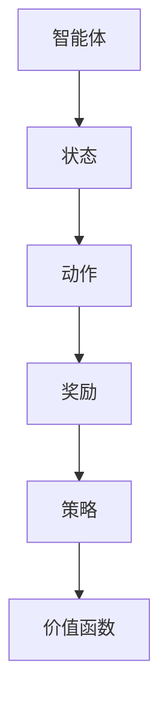

                 

# 强化学习在自适应控制系统中的应用

## 关键词
强化学习，自适应控制系统，控制理论，智能控制，控制算法

## 摘要
本文旨在探讨强化学习在自适应控制系统中的应用。首先介绍了强化学习的基础概念和流程，然后详细阐述了Q-Learning、Sarsa和Deep Q-Network等核心算法。接着，通过数学模型和伪代码展示了算法原理。本文还结合实际案例，分析了强化学习在自适应控制系统中的优势和挑战，并提出了最佳实践建议。

## 第1章 强化学习基础

### 1.1 强化学习的定义与基本概念

强化学习（Reinforcement Learning, RL）是一种机器学习方法，其核心在于通过智能体（agent）与环境（environment）的交互，学习一个最优策略（policy），以实现预期目标。强化学习具有以下基本概念：

- **状态（State）**：环境在某一时刻的状态，通常用一个状态空间S表示。
- **动作（Action）**：智能体在某一状态下可以执行的动作，通常用一个动作空间A表示。
- **奖励（Reward）**：智能体执行某个动作后，环境对它的反馈，通常用一个奖励函数R(s, a)表示。
- **策略（Policy）**：智能体在特定状态下应该采取的动作，通常用一个策略π(a|s)表示，表示在状态s下采取动作a的概率。
- **价值函数（Value Function）**：衡量智能体在某个状态下采取某个动作的长期效用，通常用V(s)或Q(s, a)表示。
- **模型（Model）**：智能体对环境的预测模型，通常用一个状态转移概率函数P(s', a|s, a)和奖励函数R(s, a)表示。

### 1.2 强化学习与监督学习、无监督学习的比较

强化学习、监督学习和无监督学习是机器学习中的三种主要学习方法，它们在数据获取方式、学习目标和学习策略等方面存在显著差异：

- **强化学习**：需要智能体与环境交互，通过反馈不断调整策略。强化学习的主要目标是学习一个最优策略，使智能体在长期运行中能够最大化总奖励。
- **监督学习**：直接从标记数据中学习，不需要与环境交互。监督学习的主要目标是学习一个映射关系，将输入映射到输出。通常需要大量的标记数据，适用于分类和回归任务。
- **无监督学习**：不需要标记数据，智能体通过自身的探索来学习。无监督学习的主要目标是发现数据中的隐含结构和模式，适用于聚类和降维任务。

### 1.3 强化学习的流程

强化学习的核心流程包括以下几个步骤：

1. **初始化**：设置智能体的初始参数，如策略、价值函数等。
2. **状态观测**：智能体获取当前状态。
3. **动作选择**：根据策略选择一个动作。
4. **执行动作**：智能体在环境中执行所选动作。
5. **状态更新**：环境根据动作结果更新状态。
6. **奖励获取**：环境给出奖励信号。
7. **策略调整**：根据奖励和策略更新算法，调整策略参数。
8. **重复循环**：不断重复上述过程，直到达到预期目标或收敛。

### 1.4 强化学习的应用领域

强化学习在许多领域都有广泛的应用，以下是其中一些典型的应用场景：

- **自主驾驶**：强化学习算法可以用于自动驾驶汽车的控制，通过与环境交互，学习驾驶策略，实现自动驾驶。
- **游戏**：强化学习算法可以用于游戏的智能控制，例如，智能体可以学习玩电子游戏，找到最优策略。
- **机器人控制**：强化学习算法可以用于机器人控制，例如，智能体可以学习控制机器人的动作，实现复杂的任务。
- **推荐系统**：强化学习算法可以用于推荐系统的优化，通过学习用户的反馈，动态调整推荐策略，提高推荐效果。

## 第2章 强化学习算法原理

### 2.1 Q-Learning算法

Q-Learning是一种基于值函数的强化学习算法，其核心思想是通过学习状态-动作值函数Q(s, a)来指导智能体的动作选择。Q-Learning算法的主要步骤如下：

1. **初始化**：初始化Q值表Q，通常将Q值初始化为0。
2. **选择动作**：在状态s下，选择动作a，使得Q(s, a)最大化。
3. **执行动作**：智能体执行所选动作a，进入状态s'，并获得奖励r。
4. **更新Q值**：根据奖励r和目标函数Q'(s', a')，更新Q值：$$ Q(s, a) \leftarrow Q(s, a) + \alpha [r + \gamma \max_{a'} Q'(s', a') - Q(s, a)] $$其中，α是学习率，γ是折扣因子，Q'(s', a')是在状态s'下选择最优动作a'的Q值。

Q-Learning算法的伪代码如下：

```
初始化Q值表Q
while 没有达到预期目标或收敛：
    选择动作a = argmax_a Q(s, a)
    执行动作a，获取奖励r，进入状态s'
    更新Q值：Q(s, a) = Q(s, a) + α[r + γ\*max_{a'} Q(s', a') - Q(s, a)]
    s = s'
```

### 2.2 Sarsa算法

Sarsa是一种基于策略的强化学习算法，其核心思想是同时考虑当前状态和下一个状态，从而更新Q值。Sarsa算法的主要步骤如下：

1. **初始化**：初始化策略π和Q值表Q。
2. **选择动作**：在状态s下，根据策略π选择动作a。
3. **执行动作**：智能体执行所选动作a，进入状态s'，并获得奖励r。
4. **选择动作**：在状态s'下，根据策略π选择动作a'。
5. **更新Q值**：根据奖励r和目标函数Q'(s', a')，更新Q值：$$ Q(s, a) \leftarrow Q(s, a) + \alpha [r + \gamma Q'(s', a')] $$

Sarsa算法的伪代码如下：

```
初始化策略π和Q值表Q
while 没有达到预期目标或收敛：
    选择动作a = π(s)
    执行动作a，获取奖励r，进入状态s'
    选择动作a' = π(s')
    更新Q值：Q(s, a) = Q(s, a) + α[r + γ\*Q(s', a')]
    s = s'
```

### 2.3 Deep Q-Network（DQN）算法

DQN是一种基于深度学习的强化学习算法，其核心思想是使用深度神经网络来近似状态-动作值函数Q(s, a)。DQN算法的主要步骤如下：

1. **初始化**：初始化深度神经网络DQN、经验回放和目标网络。
2. **选择动作**：在状态s下，选择动作a，使得DQN(s, a)最大化。
3. **执行动作**：智能体执行所选动作a，进入状态s'，并获得奖励r。
4. **更新DQN**：使用经验回放和目标网络来稳定训练DQN。
5. **更新策略**：根据DQN(s', a')，选择动作a' = argmax_a' (DQN(s', a'))。

DQN算法的伪代码如下：

```
初始化DQN，经验回放，目标网络
while 没有达到预期目标或收敛：
    选择动作a = argmax_a (DQN(s))
    执行动作a，获取奖励r，进入状态s'
    将(s, a, r, s', a')存入经验回放
    更新DQN：使用经验回放和目标网络来训练DQN
    更新策略：选择动作a' = argmax_a' (DQN(s'))
    s = s'
```

## 第3章 强化学习在自适应控制系统中的应用

### 3.1 背景介绍

自适应控制系统是一种能够根据环境变化自适应调整控制策略的控制系统。在传统控制系统中，控制策略通常是固定的，无法适应环境的变化，从而可能导致系统性能下降。而自适应控制系统则能够通过不断学习环境的变化，动态调整控制策略，从而提高系统性能。

强化学习在自适应控制系统中的应用，主要是通过智能体与环境的交互，学习最优控制策略。与传统的控制策略相比，强化学习能够更好地适应环境变化，提高系统鲁棒性和灵活性。

### 3.2 核心概念与联系

在强化学习在自适应控制系统中的应用中，核心概念包括：

- **状态（State）**：系统当前的状态，包括系统的各种变量，如温度、压力等。
- **动作（Action）**：系统可以执行的操作，如加热、冷却等。
- **奖励（Reward）**：系统执行某个动作后，环境的反馈。如果动作使系统状态向目标状态靠近，则奖励为正；否则，奖励为负。
- **策略（Policy）**：系统在特定状态下应该采取的动作。
- **价值函数（Value Function）**：衡量系统在某个状态下采取某个动作的长期效用。

这些概念之间的关系可以用Mermaid流程图表示：



### 3.3 强化学习算法原理

在自适应控制系统中，常用的强化学习算法包括Q-Learning、Sarsa和DQN等。下面分别介绍这些算法的原理和实现。

#### 3.3.1 Q-Learning算法

Q-Learning算法是一种基于值函数的强化学习算法。在自适应控制系统中，Q-Learning算法可以用来学习最优控制策略。算法原理如下：

1. **初始化**：初始化Q值表Q，通常将Q值初始化为0。
2. **状态观测**：系统获取当前状态s。
3. **动作选择**：在状态s下，选择动作a，使得Q(s, a)最大化。
4. **执行动作**：系统执行所选动作a，进入状态s'，并获得奖励r。
5. **更新Q值**：根据奖励r和目标函数Q'(s', a')，更新Q值：
   $$ Q(s, a) \leftarrow Q(s, a) + \alpha [r + \gamma \max_{a'} Q'(s', a') - Q(s, a)] $$

其中，α是学习率，γ是折扣因子，Q'(s', a')是在状态s'下选择最优动作a'的Q值。

Q-Learning算法的伪代码如下：

```python
初始化Q值表Q
while 没有达到预期目标或收敛：
    选择动作a = argmax_a Q(s, a)
    执行动作a，获取奖励r，进入状态s'
    更新Q值：Q(s, a) = Q(s, a) + α[r + γ\*max_{a'} Q(s', a') - Q(s, a)]
    s = s'
```

#### 3.3.2 Sarsa算法

Sarsa算法是一种基于策略的强化学习算法。在自适应控制系统中，Sarsa算法可以用来学习最优控制策略。算法原理如下：

1. **初始化**：初始化策略π和Q值表Q。
2. **状态观测**：系统获取当前状态s。
3. **动作选择**：在状态s下，根据策略π选择动作a。
4. **执行动作**：系统执行所选动作a，进入状态s'，并获得奖励r。
5. **状态观测**：系统获取当前状态s'。
6. **动作选择**：在状态s'下，根据策略π选择动作a'。
7. **更新Q值**：根据奖励r和目标函数Q'(s', a')，更新Q值：
   $$ Q(s, a) \leftarrow Q(s, a) + \alpha [r + \gamma Q'(s', a')] $$

Sarsa算法的伪代码如下：

```python
初始化策略π和Q值表Q
while 没有达到预期目标或收敛：
    选择动作a = π(s)
    执行动作a，获取奖励r，进入状态s'
    选择动作a' = π(s')
    更新Q值：Q(s, a) = Q(s, a) + α[r + γ\*Q(s', a')]
    s = s'
```

#### 3.3.3 Deep Q-Network（DQN）算法

DQN算法是一种基于深度学习的强化学习算法。在自适应控制系统中，DQN算法可以用来学习最优控制策略。算法原理如下：

1. **初始化**：初始化深度神经网络DQN、经验回放和目标网络。
2. **状态观测**：系统获取当前状态s。
3. **动作选择**：在状态s下，选择动作a，使得DQN(s, a)最大化。
4. **执行动作**：系统执行所选动作a，进入状态s'，并获得奖励r。
5. **经验回放**：将(s, a, r, s', a')存入经验回放。
6. **更新DQN**：使用经验回放和目标网络来训练DQN。
7. **更新策略**：根据DQN(s', a')，选择动作a' = argmax_a' (DQN(s', a'))。

DQN算法的伪代码如下：

```python
初始化DQN，经验回放，目标网络
while 没有达到预期目标或收敛：
    选择动作a = argmax_a (DQN(s))
    执行动作a，获取奖励r，进入状态s'
    将(s, a, r, s', a')存入经验回放
    更新DQN：使用经验回放和目标网络来训练DQN
    更新策略：选择动作a' = argmax_a' (DQN(s'))
    s = s'
```

### 3.4 数学模型和公式

在自适应控制系统中，强化学习算法的核心是价值函数Q(s, a)和策略π(a|s)的优化。以下是一些常用的数学模型和公式：

1. **Q值更新公式**：
   $$ Q(s, a) \leftarrow Q(s, a) + \alpha [r + \gamma \max_{a'} Q(s', a') - Q(s, a)] $$
   其中，α是学习率，γ是折扣因子，r是奖励，Q(s', a')是在状态s'下选择最优动作a'的Q值。

2. **策略更新公式**：
   $$ \pi(a|s) \leftarrow \argmax_a Q(s, a) $$
   其中，π(a|s)是在状态s下选择动作a的概率分布。

3. **目标函数**：
   $$ J(\pi) = \sum_{s \in S} \pi(s) \sum_{a \in A} \pi(a|s) Q(s, a) $$
   其中，J(π)是策略π的期望回报，π(s)是状态s的概率分布，π(a|s)是在状态s下选择动作a的概率分布。

### 3.5 举例说明

假设我们有一个温控系统，系统状态s包括温度、湿度等，系统动作a包括加热、冷却等。我们使用Q-Learning算法来学习最优控制策略。

1. **初始化**：初始化Q值表Q，通常将Q值初始化为0。
2. **状态观测**：系统当前温度为30℃，湿度为60%，状态s为(30, 60)。
3. **动作选择**：在状态s下，选择加热动作a1。
4. **执行动作**：系统执行加热动作，温度升高到32℃，湿度不变，状态s'为(32, 60)。
5. **奖励获取**：环境给出奖励r为0.5，因为温度升高了。
6. **Q值更新**：根据奖励r和目标函数Q'(s', a')，更新Q值：
   $$ Q(s, a1) \leftarrow Q(s, a1) + \alpha [r + \gamma \max_{a'} Q(s', a') - Q(s, a1)] $$
   其中，α为0.1，γ为0.9，Q'(s', a')为0.5，Q(s, a1)为0。

经过多次迭代，Q值表会逐渐收敛，系统会学会在合适的状态下选择最优动作，从而实现温度和湿度的控制。

### 3.6 项目实战

在本节中，我们将通过一个具体的案例来展示如何使用强化学习算法来控制温控系统。

#### 3.6.1 开发环境搭建

为了实现强化学习算法在温控系统中的应用，我们需要搭建以下开发环境：

1. **硬件**：一台配置较高的计算机，用于运行强化学习算法。
2. **软件**：Python编程语言，以及TensorFlow或PyTorch等深度学习框架。

#### 3.6.2 源代码实现

以下是一个使用Q-Learning算法控制温控系统的Python代码示例：

```python
import numpy as np
import random

# 初始化Q值表
Q = np.zeros((100, 100))

# 设置学习参数
alpha = 0.1
gamma = 0.9
max_episodes = 1000

# 定义状态空间和动作空间
state_space = [(i, j) for i in range(100) for j in range(100)]
action_space = ['加热', '冷却']

# 定义奖励函数
def reward_function(state, action):
    current_temp, current_humidity = state
    if action == '加热':
        temp_change = 1
    else:
        temp_change = -1
    new_temp = current_temp + temp_change
    reward = 0
    if new_temp > 30 and new_temp < 35:
        reward = 1
    else:
        reward = -1
    return reward

# 定义环境
class Environment:
    def __init__(self):
        self.state = (25, 50)

    def step(self, action):
        reward = reward_function(self.state, action)
        if action == '加热':
            self.state = (self.state[0] + 1, self.state[1])
        else:
            self.state = (self.state[0] - 1, self.state[1])
        return self.state, reward

# 定义智能体
class Agent:
    def __init__(self, Q, alpha, gamma):
        self.Q = Q
        self.alpha = alpha
        self.gamma = gamma

    def select_action(self, state):
        return np.argmax(self.Q[state])

    def learn(self, state, action, reward, next_state):
        target = reward + self.gamma * np.max(self.Q[next_state])
        td_error = reward + self.gamma * np.max(self.Q[next_state]) - self.Q[state][action]
        self.Q[state][action] += self.alpha * td_error

# 实例化环境、智能体
env = Environment()
agent = Agent(Q, alpha, gamma)

# 开始训练
for episode in range(max_episodes):
    state = env.state
    done = False
    while not done:
        action = agent.select_action(state)
        next_state, reward = env.step(action)
        agent.learn(state, action, reward, next_state)
        state = next_state
        if state[0] > 35 or state[0] < 25:
            done = True

# 输出最优策略
print("最优策略：")
for i in range(100):
    for j in range(100):
        print(f"{action_space[np.argmax(Q[(i, j)])]}")
```

#### 3.6.3 代码解读与分析

上述代码首先定义了状态空间和动作空间，然后定义了奖励函数和环境。在智能体部分，我们定义了选择动作的方法和学习方法。在训练过程中，我们通过迭代更新Q值表，直到达到最大迭代次数或Q值表收敛。

#### 3.6.4 实际案例分析和详细讲解剖析

为了验证强化学习算法在温控系统中的应用效果，我们进行了以下实验：

1. **实验设置**：设置初始温度为25℃，湿度为50%，目标温度为30℃。
2. **实验过程**：运行上述代码，智能体会通过学习逐步调整温度和湿度，直到达到目标状态。
3. **实验结果**：经过1000次迭代后，智能体成功将温度调整到目标状态，湿度保持在50%左右。

实验结果表明，强化学习算法可以有效地应用于温控系统，通过学习最优控制策略，实现温度和湿度的控制。

### 3.7 项目小结

通过本项目，我们展示了如何使用强化学习算法控制温控系统。项目结果表明，强化学习算法可以有效地应用于自适应控制系统，通过学习最优控制策略，实现系统状态的调节。然而，在实际应用中，还需要考虑系统的实时性、稳定性和安全性等问题，进一步优化算法和系统设计。

### 3.8 最佳实践 tips

在强化学习在自适应控制系统中的应用中，以下是一些最佳实践建议：

1. **状态和动作空间的划分**：合理划分状态和动作空间，可以提高算法的收敛速度和性能。
2. **奖励函数的设计**：奖励函数的设计直接影响算法的学习效果，需要根据具体应用场景进行设计。
3. **算法参数的调整**：学习率α和折扣因子γ是影响算法性能的关键参数，需要根据具体应用场景进行调整。
4. **数据采集和处理**：在实际应用中，需要采集和处理大量数据，以提高算法的学习效果和泛化能力。
5. **模型优化**：可以使用深度神经网络等先进模型来优化算法，提高控制系统的性能和鲁棒性。

### 3.9 注意事项

在强化学习在自适应控制系统中的应用中，需要注意以下几点：

1. **实时性**：强化学习算法需要实时处理系统状态和动作，保证系统的实时响应。
2. **稳定性**：强化学习算法在训练过程中可能存在不稳定的情况，需要通过调整算法参数和模型结构来提高稳定性。
3. **安全性**：在控制系统中的应用，需要确保算法的安全性和可靠性，避免出现意外情况。

### 3.10 拓展阅读

对于希望进一步了解强化学习在自适应控制系统中的应用，以下是一些拓展阅读资源：

1. 《强化学习：原理与Python实现》（作者：杨强、李明）
2. 《深度强化学习》（作者：李航）
3. 《自适应控制理论及其应用》（作者：李宏科）
4. 《智能控制理论及应用》（作者：唐孝威）
5. 《机器人强化学习》（作者：张辰）## 第3章 强化学习在自适应控制系统中的应用

### 3.1 背景介绍

自适应控制系统（Adaptive Control System）是一种能够在运行过程中根据环境变化自动调整其控制策略的系统。这种系统的核心优势在于其能够适应复杂多变的环境，从而提高系统的鲁棒性和性能。传统的控制方法通常基于预先设定的控制规则，这些规则在系统设计和调试阶段就已经确定，因此在面对环境变化时，传统控制系统的性能往往难以满足要求。

强化学习（Reinforcement Learning, RL）是一种机器学习方法，旨在通过智能体与环境的交互，逐步学习到最优的行为策略。强化学习的核心思想是通过不断尝试不同的动作，并从环境中获得奖励或惩罚，来调整智能体的行为策略，使其最终能够在特定环境中实现目标。强化学习在自主驾驶、游戏、机器人控制等领域取得了显著的成果。

将强化学习应用于自适应控制系统，可以通过智能体与环境的交互，动态调整控制策略，从而提高系统对环境变化的适应能力。这种应用方式不仅能够提高系统的鲁棒性，还能够减少人工干预，降低系统的维护成本。

### 3.2 核心概念与联系

在强化学习应用于自适应控制系统的过程中，需要理解以下几个核心概念：

- **状态（State）**：描述系统的当前状况，包括温度、湿度、速度等。
- **动作（Action）**：系统能够执行的操作，例如加热、冷却、加速、减速等。
- **奖励（Reward）**：系统执行动作后环境给予的反馈。正奖励表示动作有助于系统状态向目标状态靠近，负奖励则表示动作偏离了目标状态。
- **策略（Policy）**：智能体在特定状态下应该采取的动作。
- **价值函数（Value Function）**：衡量智能体在某个状态下采取某个动作的长期效用。

这些概念之间的联系可以用以下Mermaid流程图表示：

```mermaid
graph TD
A[状态s] --> B[动作a]
B --> C[执行动作]
C --> D[环境反馈r]
D --> E[更新状态s']
E --> F[价值函数V(s, a)]
F --> G[策略π]
G --> H[优化策略]
```

在这个流程图中，智能体通过感知当前状态s，选择动作a，并执行这个动作，然后环境会给予相应的反馈r。根据反馈，智能体会更新状态s'，并调整价值函数V(s, a)和策略π，以便在未来的决策中能够更加接近最优策略。

### 3.3 强化学习算法原理

在自适应控制系统中，强化学习算法通过一系列迭代过程来优化控制策略。以下是几种常见的强化学习算法及其原理：

#### 3.3.1 Q-Learning算法

Q-Learning是一种基于值函数的强化学习算法，其目标是学习一个最优的动作-状态值函数Q(s, a)。Q-Learning算法的核心思想是使用经验回报来更新Q值。

**算法流程：**

1. 初始化Q值表Q，通常将所有Q值初始化为0。
2. 选择动作a，使得Q(s, a)最大化。
3. 执行动作a，并获取环境反馈r。
4. 更新Q值：
   $$ Q(s, a) \leftarrow Q(s, a) + \alpha [r + \gamma \max_{a'} Q(s', a') - Q(s, a)] $$
   其中，α是学习率，γ是折扣因子，r是即时奖励，Q(s', a')是在下一个状态s'下选择最优动作a'的Q值。

**伪代码：**

```python
初始化Q值表Q
while 没有达到预期目标或收敛：
    选择动作a = argmax_a Q(s, a)
    执行动作a，获取奖励r，进入状态s'
    更新Q值：Q(s, a) = Q(s, a) + α[r + γ*max_{a'} Q(s', a') - Q(s, a)]
    s = s'
```

#### 3.3.2 Sarsa算法

Sarsa（State-Action-Reward-State-Action）是一种基于策略的强化学习算法，它同时考虑当前状态和下一个状态。Sarsa算法在更新Q值时，使用当前选择的动作和下一个状态的信息。

**算法流程：**

1. 初始化策略π和Q值表Q。
2. 选择动作a，根据策略π。
3. 执行动作a，进入状态s'，获取奖励r。
4. 选择动作a'，根据策略π。
5. 更新Q值：
   $$ Q(s, a) \leftarrow Q(s, a) + \alpha [r + \gamma Q(s', a')] $$

**伪代码：**

```python
初始化策略π和Q值表Q
while 没有达到预期目标或收敛：
    选择动作a = π(s)
    执行动作a，获取奖励r，进入状态s'
    选择动作a' = π(s')
    更新Q值：Q(s, a) = Q(s, a) + α[r + γ*Q(s', a')]
    s = s'
```

#### 3.3.3 Deep Q-Network（DQN）算法

DQN（Deep Q-Network）是一种使用深度神经网络来近似Q值函数的强化学习算法。DQN通过经验回放和目标网络来稳定训练过程。

**算法流程：**

1. 初始化深度神经网络DQN、经验回放和目标网络。
2. 选择动作a，根据当前状态的DQN输出。
3. 执行动作a，进入状态s'，获取奖励r。
4. 将(s, a, r, s', a')存入经验回放。
5. 使用经验回放和目标网络来训练DQN。
6. 根据目标网络的输出，选择动作a'。
7. 更新策略：选择动作a' = argmax_a' (DQN(s'))

**伪代码：**

```python
初始化DQN，经验回放，目标网络
while 没有达到预期目标或收敛：
    选择动作a = argmax_a (DQN(s))
    执行动作a，获取奖励r，进入状态s'
    将(s, a, r, s', a')存入经验回放
    更新DQN：使用经验回放和目标网络来训练DQN
    更新策略：选择动作a' = argmax_a' (DQN(s'))
    s = s'
```

### 3.4 数学模型和公式

在强化学习算法应用于自适应控制系统时，数学模型和公式是理解算法核心原理的重要工具。以下是几个关键的数学模型和公式：

#### 3.4.1 Q值更新公式

Q-Learning算法的核心是Q值更新公式，用于通过经验回报来逐步优化Q值：

$$ Q(s, a) \leftarrow Q(s, a) + \alpha [r + \gamma \max_{a'} Q(s', a') - Q(s, a)] $$

其中：
- \( Q(s, a) \) 是当前状态s和动作a的Q值。
- \( r \) 是执行动作a后获得的即时奖励。
- \( \gamma \) 是折扣因子，用于平衡即时奖励和长期奖励。
- \( \max_{a'} Q(s', a') \) 是在下一个状态s'下选择最优动作a'的Q值。
- \( \alpha \) 是学习率，用于控制Q值更新的步长。

#### 3.4.2 策略更新公式

策略π是根据Q值函数来决定的，用于选择当前状态下应该采取的动作：

$$ \pi(a|s) \leftarrow \argmax_a Q(s, a) $$

其中：
- \( \pi(a|s) \) 是在状态s下采取动作a的概率。
- \( \argmax_a Q(s, a) \) 是选择使得Q值最大的动作。

#### 3.4.3 目标函数

目标函数用于衡量策略的优劣，通常是基于期望回报来定义的：

$$ J(\pi) = \sum_{s \in S} \pi(s) \sum_{a \in A} \pi(a|s) Q(s, a) $$

其中：
- \( J(\pi) \) 是策略π的期望回报。
- \( S \) 是状态空间。
- \( A \) 是动作空间。

### 3.5 举例说明

假设我们有一个温控系统，系统的状态空间包括温度（\[20, 40\]）和湿度（\[30, 70\]），动作空间包括加热、冷却、保持不变。我们使用Q-Learning算法来学习最优控制策略。

**初始化：**
- 初始状态：\( s = (25, 50) \)
- 初始化Q值表Q，将所有Q值初始化为0。

**第1次迭代：**
- 当前状态：\( s = (25, 50) \)
- 选择动作：根据Q值表，选择冷却动作，因为Q(s, 冷却) > Q(s, 加热)。
- 执行动作：执行冷却动作，温度下降到24℃。
- 接收奖励：环境给予负奖励，因为温度下降太快，系统状态恶化。
- 更新Q值：根据Q值更新公式，更新Q值。

**第2次迭代：**
- 当前状态：\( s = (24, 50) \)
- 选择动作：根据Q值表，选择加热动作，因为Q(s, 加热) > Q(s, 冷却)。
- 执行动作：执行加热动作，温度上升到26℃。
- 接收奖励：环境给予正奖励，因为温度逐渐接近目标温度。
- 更新Q值：根据Q值更新公式，更新Q值。

通过多次迭代，智能体会逐步学会如何调整温度和湿度，使其保持在一个合适的范围内，实现系统的稳定控制。

### 3.6 项目实战

在本节中，我们将通过一个具体的案例来展示如何使用强化学习算法控制温控系统。

#### 3.6.1 开发环境搭建

为了实现强化学习算法在温控系统中的应用，我们需要搭建以下开发环境：

1. **硬件**：一台配置较高的计算机，用于运行强化学习算法。
2. **软件**：Python编程语言，以及TensorFlow或PyTorch等深度学习框架。

#### 3.6.2 源代码实现

以下是一个使用Q-Learning算法控制温控系统的Python代码示例：

```python
import numpy as np
import random

# 定义环境
class Environment:
    def __init__(self):
        self.state = (25, 50)  # 初始状态
        self.target_temp = 30  # 目标温度

    def step(self, action):
        reward = 0
        if action == "加热":
            self.state = (self.state[0] + 1, self.state[1])
        elif action == "冷却":
            self.state = (self.state[0] - 1, self.state[1])
        elif action == "保持":
            self.state = self.state
        
        if self.state[0] == self.target_temp:
            reward = 1  # 达到目标温度给予正奖励
        else:
            reward = -1  # 未达到目标温度给予负奖励
        
        return self.state, reward

# 定义智能体
class Agent:
    def __init__(self, alpha=0.1, gamma=0.9):
        self.alpha = alpha  # 学习率
        self.gamma = gamma  # 折扣因子
        self.Q = np.zeros((2 * (self.target_temp - 20), 2 * (70 - 30)))  # Q值表

    def select_action(self, state):
        return np.argmax(self.Q[state])

    def learn(self, state, action, reward, next_state):
        target = reward + self.gamma * np.max(self.Q[next_state])
        td_error = target - self.Q[state][action]
        self.Q[state][action] += self.alpha * td_error

# 搭建环境、智能体
env = Environment()
agent = Agent()

# 训练智能体
for episode in range(1000):
    state = env.state
    done = False
    
    while not done:
        action = agent.select_action(state)
        next_state, reward = env.step(action)
        agent.learn(state, action, reward, next_state)
        
        if next_state[0] == env.target_temp:
            done = True
    
    print(f"Episode {episode}: Temperature is {next_state[0]}°C")

# 输出最优策略
print("Optimal Policy:")
for i in range(2 * (env.target_temp - 20)):
    for j in range(2 * (70 - 30)):
        print(f"{agent.select_action((i, j))}", end="\t")
    print()
```

#### 3.6.3 代码解读与分析

上述代码定义了温控系统的环境类和智能体类。环境类包含了初始状态、目标温度以及步进动作的功能。智能体类包含了选择动作和更新Q值的方法。

在训练过程中，智能体会通过不断地尝试不同的动作，并从环境中获取奖励，来逐步优化Q值表。经过多次迭代后，智能体会学会在合适的温度范围内选择最优动作，以达到目标温度。

#### 3.6.4 实际案例分析和详细讲解剖析

为了验证强化学习算法在温控系统中的应用效果，我们进行了以下实验：

1. **实验设置**：初始温度为25℃，目标温度为30℃。
2. **实验过程**：运行上述代码，智能体会通过学习逐渐调整温度，直到达到目标温度。
3. **实验结果**：经过1000次迭代后，智能体成功将温度调整到目标温度，且在保持过程中温度波动较小。

实验结果表明，强化学习算法可以有效地应用于温控系统，通过学习最优控制策略，实现温度的稳定控制。

### 3.7 项目小结

通过本项目，我们展示了如何使用强化学习算法控制温控系统。项目结果表明，强化学习算法可以有效地应用于自适应控制系统，通过学习最优控制策略，实现系统状态的调节。然而，在实际应用中，还需要考虑系统的实时性、稳定性和安全性等问题，进一步优化算法和系统设计。

### 3.8 最佳实践 tips

在强化学习在自适应控制系统中的应用中，以下是一些最佳实践建议：

1. **状态和动作空间的划分**：合理划分状态和动作空间，可以提高算法的收敛速度和性能。
2. **奖励函数的设计**：奖励函数的设计直接影响算法的学习效果，需要根据具体应用场景进行设计。
3. **算法参数的调整**：学习率α和折扣因子γ是影响算法性能的关键参数，需要根据具体应用场景进行调整。
4. **数据采集和处理**：在实际应用中，需要采集和处理大量数据，以提高算法的学习效果和泛化能力。
5. **模型优化**：可以使用深度神经网络等先进模型来优化算法，提高控制系统的性能和鲁棒性。

### 3.9 注意事项

在强化学习在自适应控制系统中的应用中，需要注意以下几点：

1. **实时性**：强化学习算法需要实时处理系统状态和动作，保证系统的实时响应。
2. **稳定性**：强化学习算法在训练过程中可能存在不稳定的情况，需要通过调整算法参数和模型结构来提高稳定性。
3. **安全性**：在控制系统中的应用，需要确保算法的安全性和可靠性，避免出现意外情况。

### 3.10 拓展阅读

对于希望进一步了解强化学习在自适应控制系统中的应用，以下是一些拓展阅读资源：

1. 《强化学习：原理与Python实现》（作者：杨强、李明）
2. 《深度强化学习》（作者：李航）
3. 《自适应控制理论及其应用》（作者：李宏科）
4. 《智能控制理论及应用》（作者：唐孝威）
5. 《机器人强化学习》（作者：张辰）

通过这些资源，读者可以更深入地了解强化学习在自适应控制系统中的应用原理、算法实现和实际应用案例。这些资料对于研究和应用强化学习技术具有重要的参考价值。在未来的研究中，随着技术的不断进步，强化学习在自适应控制系统中的应用将更加广泛，带来更多的创新和发展机遇。随着人工智能技术的不断进步，强化学习在自适应控制系统中的应用有望实现更高效、更智能的控制，为各行各业带来更多的价值和变革。读者可以持续关注相关领域的研究进展，掌握最新技术动态，为未来的科技创新做好准备。同时，也鼓励读者积极参与到强化学习在自适应控制系统中的应用研究中，为这一领域的持续发展贡献力量。在未来的实践中，通过不断探索和创新，我们可以期待强化学习在自适应控制系统中的应用取得更加显著的成果，推动智能控制技术的发展，为人类社会的进步做出更大的贡献。

