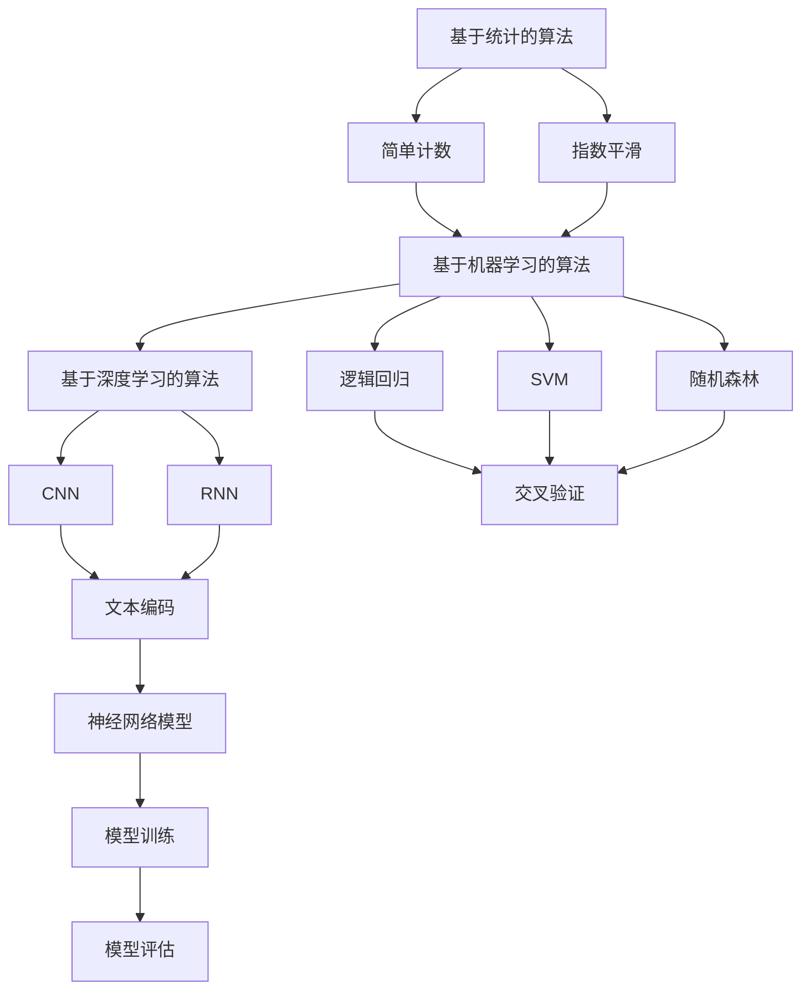

                 

## 文章标题：微博2025实时热点预测系统工程师社招面试题集

### 关键词：微博，实时热点预测，算法，系统架构，性能优化，社交媒体分析

> 摘要：本文旨在为从事微博实时热点预测系统的工程师提供一个全面的面试题集。通过对实时热点预测的概述、微博数据获取、文本处理与特征提取、热点预测算法、系统架构、性能优化以及案例分析等方面的详细讨论，帮助读者掌握这一领域的核心知识和实践技巧。

### 《微博2025实时热点预测系统工程师社招面试题集》目录大纲

**第一部分：基础知识**

## 第1章：实时热点预测概述

### 1.1 热点预测的重要性

- **背景介绍**：讨论实时热点预测在现代信息社会中的重要性，以及为什么这一领域对于企业和研究机构都有巨大价值。

### 1.2 实时热点预测的基本概念

- **核心概念与联系**：定义热点预测、实时热点预测以及相关术语，并通过Mermaid流程图展示其相互关系。

### 1.3 实时热点预测的应用场景

- **应用场景举例**：探讨实时热点预测在不同领域的应用，如市场营销、新闻报道、社交媒体监控等。

## 第2章：微博数据获取

### 2.1 微博API简介

- **API介绍**：介绍微博API的功能和特点，包括获取微博内容、用户信息等。

### 2.2 微博数据获取流程

- **流程说明**：详细讲解微博数据获取的步骤，包括API调用、数据存储和处理等。

### 2.3 数据处理与清洗

- **数据处理方法**：讨论数据预处理和清洗的步骤，以及如何处理噪声数据和异常值。

## 第3章：文本处理与特征提取

### 3.1 文本处理技术

- **文本处理方法**：介绍文本处理的基础技术，如分词、词性标注、停用词过滤等。

### 3.2 基本特征提取方法

- **特征提取方法**：讨论从文本中提取基本特征的方法，如词频、词袋模型、TF-IDF等。

### 3.3 基于深度学习的特征提取方法

- **深度学习技术**：介绍如何使用深度学习模型进行文本特征提取，包括卷积神经网络（CNN）和循环神经网络（RNN）。

## 第4章：实时热点预测算法

### 4.1 常见热点预测算法

#### 4.1.1 基于统计的算法

- **算法原理**：讲解基于统计的算法，如简单计数、指数平滑等，并给出伪代码。

#### 4.1.2 基于机器学习的算法

- **算法原理**：介绍基于机器学习的算法，如逻辑回归、支持向量机（SVM）、随机森林等，并给出伪代码。

#### 4.1.3 基于深度学习的算法

- **算法原理**：详细讲解基于深度学习的算法，如卷积神经网络（CNN）和循环神经网络（RNN），并给出伪代码。

### 4.2 算法原理与联系

- **核心概念与联系**：通过Mermaid流程图展示不同算法的原理和相互关系。

### 4.3 算法评估与优化

- **评估指标**：讨论如何评估热点预测算法的性能，如准确率、召回率、F1值等。

- **优化方法**：介绍性能优化方法，如交叉验证、特征选择、模型调参等。

**第二部分：高级话题**

## 第8章：社交媒体热点预测

### 8.1 社交媒体热点预测特点

- **特点分析**：探讨社交媒体热点预测的特殊性，如用户互动、内容多样性等。

### 8.2 社交媒体热点预测算法

- **算法介绍**：介绍专门针对社交媒体的预测算法，如基于用户影响力的模型等。

### 8.3 社交媒体热点预测案例分析

- **案例研究**：分析一个具体的社交媒体热点预测案例，展示实际应用效果。

## 第9章：跨平台热点预测

### 9.1 跨平台热点预测策略

- **策略探讨**：讨论如何整合不同平台的数据进行热点预测，如微博、微信、抖音等。

### 9.2 跨平台数据整合

- **整合方法**：介绍跨平台数据整合的技术细节，如数据清洗、数据同步等。

### 9.3 跨平台热点预测案例分析

- **案例研究**：分析一个跨平台热点预测的案例，展示整合数据的效果。

## 第10章：热点预测与社交媒体分析

### 10.1 热点预测在社交媒体分析中的应用

- **应用场景**：探讨热点预测在社交媒体分析中的应用，如趋势分析、用户行为研究等。

### 10.2 社交媒体分析方法

- **分析技术**：介绍社交媒体分析方法，如网络分析、情感分析、文本分类等。

### 10.3 热点预测与社交媒体分析结合的案例分析

- **案例研究**：分析一个结合热点预测和社交媒体分析的案例，展示实际应用效果。

**附录**

## 附录A：常用工具与资源

### A.1 微博API文档

- **文档介绍**：提供微博API的官方文档链接，介绍如何使用API进行数据获取。

### A.2 实时热点预测相关开源项目

- **项目推荐**：推荐一些与实时热点预测相关的开源项目，包括代码库和工具。

### A.3 相关书籍与论文推荐

- **资源推荐**：推荐一些与实时热点预测相关的书籍和论文，供读者进一步学习。

### 4.1 常见热点预测算法

实时热点预测系统需要采用有效的算法来识别和预测潜在的流行话题。常见的热点预测算法包括基于统计的方法、基于机器学习的方法和基于深度学习的方法。以下是对这些算法的详细描述：

#### 4.1.1 基于统计的算法

**概念**：基于统计的算法利用用户行为数据，如微博的转发数、评论数、点赞数等，来计算一个话题的流行度。这些方法通常简单且易于实现，但可能无法捕捉更复杂的关系。

**原理**：
1. **简单计数**：通过计算微博的转发数、评论数和点赞数来判断一个话题的受欢迎程度。
2. **指数平滑**：结合历史数据和当前数据，给予不同时间窗口的数据不同权重，以预测未来的热点。

**伪代码**：

```python
def simple_count(data):
    hotspots = []
    for topic in data:
        count = sum([like + comment + share for like, comment, share in data[topic]])
        if count > threshold:
            hotspots.append(topic)
    return hotspots

def exponential_smoothing(data, alpha):
    hotspots = []
    previous_hotspots = []
    for topic in data:
        current_count = sum([like + comment + share for like, comment, share in data[topic]])
        smoothed_count = alpha * current_count + (1 - alpha) * previous_count
        if smoothed_count > threshold:
            hotspots.append(topic)
        previous_hotspots[topic] = smoothed_count
    return hotspots
```

**数学模型和公式**：

指数平滑公式：
$$
S_t = \alpha \cdot X_t + (1 - \alpha) \cdot S_{t-1}
$$
其中，$S_t$ 是第 $t$ 时刻的平滑值，$X_t$ 是第 $t$ 时刻的实际值，$\alpha$ 是平滑系数。

**举例说明**：

假设有一个话题的历史数据，我们使用指数平滑方法来预测其未来是否为热点。设 $\alpha = 0.2$，当前时刻的实际转发数为1000，上一时刻的平滑值为800。计算得到当前时刻的平滑值为：
$$
S_t = 0.2 \cdot 1000 + 0.8 \cdot 800 = 840
$$
如果 $S_t$ 大于设定的阈值（例如1000），则预测该话题为热点。

#### 4.1.2 基于机器学习的算法

**概念**：基于机器学习的算法通过训练模型来学习热点预测的模式，通常使用历史数据来训练分类模型。

**原理**：
1. **特征工程**：从微博数据中提取特征，如用户活跃度、文本内容特征、时间特征等。
2. **模型训练**：使用特征和标签（是否为热点）来训练分类模型，如逻辑回归、支持向量机（SVM）、随机森林等。
3. **模型评估**：使用交叉验证等方法评估模型的性能。

**伪代码**：

```python
from sklearn.ensemble import RandomForestClassifier

def train_model(X_train, y_train):
    model = RandomForestClassifier()
    model.fit(X_train, y_train)
    return model

def predict_hotspots(model, X_new):
    predictions = model.predict(X_new)
    hotspots = [topic for topic, prediction in zip(new_data_topics, predictions) if prediction == 1]
    return hotspots
```

**数学模型和公式**：

逻辑回归的概率公式：
$$
P(Y=1|X) = \frac{1}{1 + e^{-(\beta_0 + \sum_{i=1}^{n} \beta_i x_i)}}
$$
其中，$Y$ 是是否为热点的标签，$X$ 是特征向量，$\beta_0$ 和 $\beta_i$ 是模型的参数。

**举例说明**：

假设我们有一个训练数据集，其中特征包括用户活跃度和文本内容的特征。我们使用逻辑回归模型来训练一个热点预测模型。设训练数据集的特征矩阵为 $X$，标签矩阵为 $y$，训练得到的参数为 $\beta$。对于一个新的话题，其特征为 $X_{new}$，我们可以使用以下公式来计算该话题是否为热点的概率：

$$
P(Y=1|X_{new}) = \frac{1}{1 + e^{-(\beta_0 + \sum_{i=1}^{n} \beta_i X_{new,i})}}
$$

如果 $P(Y=1|X_{new})$ 超过设定的阈值（例如0.5），则预测该话题为热点。

#### 4.1.3 基于深度学习的算法

**概念**：基于深度学习的算法使用深度神经网络来提取文本的深层特征，并进行热点预测。

**原理**：
1. **文本编码**：将文本数据转化为向量表示，通常使用词嵌入技术。
2. **神经网络模型**：构建深度神经网络模型，如卷积神经网络（CNN）或循环神经网络（RNN），来学习文本的特征。
3. **模型训练**：使用带有标签的数据集来训练神经网络模型。
4. **模型评估**：使用交叉验证等方法评估模型的性能。

**伪代码**：

```python
from tensorflow.keras.models import Sequential
from tensorflow.keras.layers import Embedding, LSTM, Dense

def build_model(vocab_size, embedding_dim, sequence_length):
    model = Sequential()
    model.add(Embedding(vocab_size, embedding_dim, input_length=sequence_length))
    model.add(LSTM(128))
    model.add(Dense(1, activation='sigmoid'))
    model.compile(optimizer='adam', loss='binary_crossentropy', metrics=['accuracy'])
    return model

def train_model(model, X_train, y_train):
    model.fit(X_train, y_train, epochs=10, batch_size=32)
    return model

def predict_hotspots(model, X_new):
    predictions = model.predict(X_new)
    hotspots = [topic for topic, prediction in zip(new_data_topics, predictions) if prediction > threshold]
    return hotspots
```

**数学模型和公式**：

卷积神经网络（CNN）的卷积操作：
$$
h_{ij}^l = \sum_{k=1}^{m} w_{ik}^l \cdot a_{kj}^{l-1} + b^l
$$
其中，$h_{ij}^l$ 是第 $l$ 层的第 $i$ 个神经元在第 $j$ 个位置上的输出，$w_{ik}^l$ 和 $b^l$ 分别是权重和偏置。

循环神经网络（RNN）的递归关系：
$$
h_t = \sigma(W_h \cdot [h_{t-1}, x_t] + b_h)
$$
$$
y_t = \sigma(W_o \cdot h_t + b_o)
$$
其中，$h_t$ 是第 $t$ 步的隐藏状态，$x_t$ 是输入，$\sigma$ 是激活函数。

**举例说明**：

假设我们使用CNN模型来预测微博热点。首先，我们将文本数据转换为词嵌入向量。然后，输入到CNN模型中，模型会通过卷积层和池化层提取文本的深层特征。最终，通过全连接层输出预测结果。例如，对于一个新的微博文本，将其转化为词嵌入向量后输入模型，模型会输出一个概率值，如果该值超过设定的阈值（例如0.5），则预测该微博为热点。

### 4.2 算法原理与联系

实时热点预测算法的原理和联系可以通过Mermaid流程图来直观展示。以下是一个简单的Mermaid流程图，展示了不同算法的基本原理和相互关系：



通过这个流程图，我们可以清晰地看到不同算法的基本原理和相互之间的联系。基于统计的算法简单直接，而基于机器学习和深度学习的算法则能够捕捉更复杂的模式。

### 4.3 算法评估与优化

评估热点预测算法的性能是确保系统有效性的关键。以下是一些常用的评估指标和优化方法：

#### 4.3.1 评估指标

- **准确率（Accuracy）**：预测正确的样本数占总样本数的比例。
- **召回率（Recall）**：预测正确的热点数占总热点数的比例。
- **精确率（Precision）**：预测正确的热点数占预测为热点的总数的比例。
- **F1值（F1-score）**：精确率和召回率的调和平均值。
- **ROC曲线**：接收者操作特征曲线，用于评估分类器的性能。
- **AUC值（Area Under ROC Curve）**：ROC曲线下的面积，用于评估分类器的区分能力。

#### 4.3.2 优化方法

- **交叉验证**：通过将数据集划分为训练集和验证集，多次训练和验证模型，以减少过拟合和提高模型泛化能力。
- **特征选择**：通过选择对预测最有影响力的特征，提高模型性能并减少计算复杂度。
- **模型调参**：通过调整模型的超参数，如学习率、正则化参数等，以优化模型性能。
- **集成学习**：通过结合多个模型的预测结果，提高整体预测性能。

### 4.3.3 性能调优实战

在实际应用中，性能调优是一个反复迭代的过程。以下是一个简单的性能调优流程：

1. **数据预处理**：确保数据质量，包括数据清洗、去重、标准化等。
2. **特征工程**：提取和选择对预测有价值的特征。
3. **模型训练**：使用训练数据集训练模型，并使用交叉验证进行性能评估。
4. **模型评估**：使用验证集评估模型性能，并记录关键指标。
5. **调参优化**：根据评估结果调整模型超参数，如学习率、正则化系数等。
6. **再次评估**：重新评估模型性能，确认优化效果。
7. **迭代**：根据评估结果和业务需求，继续进行模型优化。

通过以上步骤，可以逐步提高实时热点预测系统的性能，使其更好地满足业务需求。

### 4.4 实际案例：微博实时热点预测系统

以下是一个实际案例，展示如何构建和优化微博实时热点预测系统：

**案例背景**：微博是一个大型的社交媒体平台，每天产生大量的用户生成内容（UGC）。为了及时捕捉和预测热点话题，微博需要构建一个高效的实时热点预测系统。

**数据获取**：使用微博API获取微博数据，包括微博内容、用户信息、转发数、评论数、点赞数等。

**数据处理**：对获取的数据进行预处理，包括分词、去除停用词、词干提取等，以提取文本特征。

**特征提取**：使用TF-IDF和Word2Vec等方法提取文本特征，并结合用户特征和时间特征，构建特征向量。

**模型选择**：选择基于深度学习的模型（如LSTM）进行热点预测，并使用交叉验证进行模型训练和性能评估。

**模型优化**：通过调参和特征选择，优化模型性能。例如，调整学习率、批量大小和隐藏层神经元数量等。

**系统部署**：将训练好的模型部署到生产环境，实时处理微博数据，并预测热点话题。

**性能评估**：定期评估系统性能，使用AUC值、准确率等指标进行评估，并根据评估结果进行优化。

通过以上步骤，微博实时热点预测系统可以有效地捕捉和预测热点话题，为用户提供有价值的信息。

### 4.5 最佳实践与注意事项

**最佳实践**：

1. **数据多样性**：确保数据来源多样化，包括不同时间段、不同类型的内容，以提高模型的泛化能力。
2. **实时处理**：使用高效的数据处理和模型推理技术，确保系统能够实时处理大量数据。
3. **持续优化**：定期评估和优化模型，以应对数据变化和业务需求。

**注意事项**：

1. **数据隐私**：在使用微博数据时，注意保护用户隐私，遵守相关法律法规。
2. **模型解释性**：在选择模型时，考虑其解释性，以便理解和优化模型。
3. **系统稳定性**：确保系统在高负载情况下仍能稳定运行，避免因性能问题导致预测失败。

### 4.6 拓展阅读

- **书籍推荐**：《机器学习实战》、《深度学习》（Goodfellow, Bengio, Courville 著）。
- **论文推荐**：《Twitter Users’ Activity in the Last 30 Minutes Drives Real-Time Search Demands》（Akopyan et al., 2016）。
- **开源项目**：TensorFlow、PyTorch、scikit-learn 等。

### 作者信息

作者：AI天才研究院/AI Genius Institute & 禅与计算机程序设计艺术 /Zen And The Art of Computer Programming

本文详细介绍了实时热点预测系统的算法原理、实现方法以及性能优化策略。通过实际案例分析，读者可以了解如何构建和优化一个高效的实时热点预测系统。希望本文能帮助读者在面试和实际工作中取得更好的成果。

