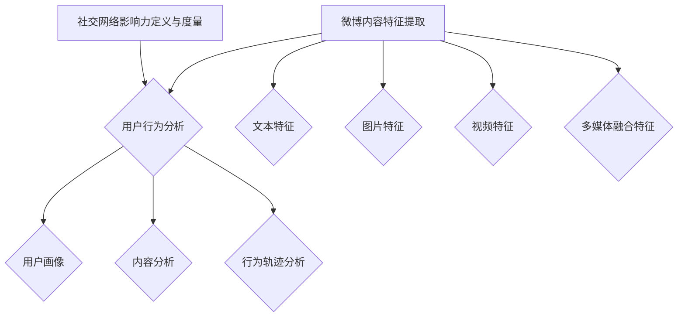

                 

### 文章标题

《微博2025社交网络影响力分析专家社招面试攻略》

### 关键词

- 社交网络影响力分析
- 微博
- 面试攻略
- 矩阵分解
- 图论
- 深度学习

### 摘要

本文将深入探讨微博社交网络影响力分析的相关领域，为准备参加2025年社交网络影响力分析专家社招面试的求职者提供详细的策略与技巧。文章从微博的发展历程、社交网络影响力的重要性，到核心算法原理、数学模型，再到项目实战和面试技巧，进行全面而深入的剖析。通过逻辑清晰、结构紧凑的内容，帮助读者掌握社交网络影响力分析的核心知识，提升面试竞争力。

## 第1章 引言

### 1.1 微博的发展历程与市场地位

微博作为中国领先的社交媒体平台，其发展历程可以追溯到2009年，由中国的新浪网推出。微博迅速抓住了移动互联网的浪潮，以其独特的“微博客”形式，让用户能够通过短文本、图片、视频等多媒体形式，快速分享信息和观点。截至2022年，微博用户数已超过5亿，占据了国内社交网络市场的重要地位。

微博的成功离不开其对用户需求的精准把握和技术创新的不断推进。早期的微博主要通过名人效应和用户互动来吸引和留住用户，随着技术的发展，微博逐渐引入了短视频、直播、电商等功能，进一步丰富了用户的互动体验。在市场地位方面，微博不仅在国内社交网络市场中占据领先地位，还积极拓展海外市场，如东南亚和印度等地区，逐步建立起全球化的影响力。

### 1.2 社交网络影响力的重要性

社交网络影响力是一个衡量用户在社交平台上影响力大小的指标，它反映了用户在平台上的活跃程度、粉丝数量、互动频率等多个方面。社交网络影响力的重要性体现在以下几个方面：

首先，对个人而言，高社交网络影响力意味着更大的话语权和传播力。知名博主、网红等高影响力用户能够在社交平台上迅速传播信息，吸引大量粉丝和关注，从而在个人品牌建设、商业合作等方面获得更多机会。

其次，对企业而言，社交网络影响力是品牌营销的重要工具。通过分析用户的社交网络影响力，企业可以精准定位潜在客户，制定有效的营销策略，提升品牌知名度和市场占有率。

最后，对于社交网络平台自身而言，社交网络影响力分析有助于优化平台算法，提升用户体验，从而增强用户黏性和平台活跃度。同时，社交网络影响力分析还可以为平台提供数据支持，帮助其制定更科学的发展策略。

### 1.3 面向2025年的社交网络发展预测

随着科技的不断进步和互联网用户的日益增长，社交网络在未来的发展中将呈现以下几个趋势：

首先，社交网络将更加智能化和个性化。人工智能技术将深入应用到社交网络中，通过用户行为数据分析和偏好建模，为用户提供更加精准的内容推荐和社交互动体验。

其次，社交网络将更加多元化。除了传统的文本、图片、视频等形式，社交网络还将引入更多创新的内容类型，如虚拟现实（VR）、增强现实（AR）等，为用户提供更加丰富的互动体验。

第三，社交网络将更加开放和互联互通。各大社交平台将加强合作，实现用户数据共享和内容互通，为用户提供更全面的社交网络体验。

最后，社交网络将更加注重隐私保护和数据安全。随着用户对隐私和数据安全的关注度提高，社交网络平台将加强隐私保护措施，确保用户信息安全。

面向2025年，社交网络影响力分析将面临更大的挑战和机遇。一方面，数据量的大幅增加和复杂度的提升，要求分析算法更加高效和准确；另一方面，社交网络环境的变化，要求分析模型能够及时适应和调整。因此，对于社交网络影响力分析专家而言，掌握先进的技术和不断更新知识将是持续发展的关键。

### 结论

通过本章的介绍，我们可以看到微博作为中国领先的社交媒体平台，其在发展历程、市场地位和社交网络影响力方面具有重要影响。同时，社交网络影响力的重要性以及未来社交网络的发展趋势，为社交网络影响力分析专家提供了广阔的发展空间。在接下来的章节中，我们将深入探讨微博社交网络影响力分析的基础理论、核心算法和实际应用，为准备面试的读者提供全面的技术支持。

## 第2章 微博社交网络影响力分析基础

### 2.1 社交网络影响力定义与度量

社交网络影响力是指在社交网络平台上，用户通过发布内容、互动行为等方式，对其关注者或社交圈子产生的影响力大小。它不仅反映了用户在平台上的活跃度和互动能力，还体现了用户在社交网络中的地位和话语权。社交网络影响力的度量方法主要包括以下几个方面：

1. **粉丝数量**：粉丝数量是衡量社交网络影响力的重要指标之一。一个用户拥有的粉丝数量越多，通常意味着其影响力越大。然而，单纯的粉丝数量并不能完全反映一个用户的影响力，因为粉丝质量的差异较大。

2. **互动频率**：互动频率是指用户在社交网络平台上的活跃程度，包括发布内容、回复评论、点赞等行为。高互动频率的用户通常具有较强的社交网络影响力，因为他们能够与粉丝保持紧密的互动，提升粉丝的参与度和忠诚度。

3. **内容传播力**：内容传播力是指用户发布的内容能够被多少用户阅读、转发和评论。一个用户的内容传播力越强，说明其在社交网络中的影响力越大。

4. **社交网络图结构**：社交网络图结构描述了用户之间的互动关系和社交圈子。通过分析社交网络图结构，可以识别出社交网络中的关键节点和影响力扩散路径。

5. **影响力得分**：综合以上多个指标，可以计算出用户的影响力得分。影响力得分通常通过加权综合计算，以平衡不同指标的重要性。

### 2.2 微博用户行为分析

微博用户行为分析是指通过对用户在平台上的一系列行为进行数据收集、处理和分析，以了解用户的需求、偏好和行为模式。微博用户行为分析主要包括以下几个方面：

1. **用户画像**：通过分析用户的基本信息（如年龄、性别、地域等），构建用户画像，了解不同群体用户的特点和行为习惯。

2. **内容分析**：分析用户发布的内容类型、主题、情感倾向等，以了解用户的内容偏好和传播效果。

3. **互动分析**：分析用户之间的互动行为，如点赞、评论、转发等，以了解用户互动模式和社会关系网络。

4. **行为轨迹分析**：通过用户在平台上的行为轨迹，分析用户的使用习惯和活跃时间，为平台优化和个性化推荐提供依据。

### 2.3 微博内容特征提取

微博内容特征提取是指从微博文本、图片、视频等多媒体数据中提取出有代表性的特征，用于影响力和行为分析。微博内容特征提取主要包括以下几个方面：

1. **文本特征**：包括词频、词向量、主题模型等，用于描述微博文本的内容和语义。

2. **图片特征**：通过图像识别技术提取图像的视觉特征，如颜色、纹理、形状等。

3. **视频特征**：通过视频内容识别技术提取视频的关键帧和动作特征，用于描述视频的内容和场景。

4. **多媒体融合特征**：将文本、图片和视频等多媒体数据融合，提取出更全面的内容特征。

### 总结

本章介绍了社交网络影响力的定义与度量、微博用户行为分析和微博内容特征提取。这些基础理论和方法为后续章节中的核心算法原理、数学模型和项目实战提供了重要的支持。通过深入理解这些基础知识，读者可以更好地掌握微博社交网络影响力分析的核心技术和应用。

### Mermaid 流程图



### 核心概念与联系

社交网络影响力定义与度量、用户行为分析、和微博内容特征提取是微博社交网络影响力分析的基础，它们相互关联，共同构成了分析体系的核心。以下是这些核心概念之间的联系和关系：

1. **社交网络影响力定义与度量**：是整个分析体系的基础，它为衡量用户影响力提供了标准和工具。通过粉丝数量、互动频率、内容传播力等指标，可以量化用户在平台上的影响力。

2. **用户行为分析**：基于社交网络影响力定义，进一步深入分析用户的行为模式。用户画像、内容分析、行为轨迹分析等子模块帮助理解用户的兴趣和行为，从而为影响力分析提供更细致的数据支持。

3. **微博内容特征提取**：通过提取微博文本、图片、视频等多媒体数据中的特征，为用户行为分析和影响力度量提供具体的内容数据。这些特征包括词频、词向量、主题模型、图像视觉特征、视频动作特征等，它们是影响力和行为分析的重要依据。

4. **关系结构**：社交网络影响力分析中，用户行为和内容特征提取的结果可以通过社交网络图结构进行可视化。用户之间的互动关系、影响力扩散路径等都可以通过图论方法进行深入分析。

综上所述，社交网络影响力定义与度量、用户行为分析和微博内容特征提取共同构成了一个完整的影响力分析体系。它们不仅相互独立，还紧密联系，通过多维度、多角度的分析，为微博社交网络影响力分析提供了坚实的基础。

### 基于矩阵分解的影响力预测算法

在社交网络影响力分析中，基于矩阵分解的影响力预测算法是一种重要的技术手段。该算法通过矩阵分解技术，从用户和内容数据中提取潜在特征，从而预测用户的影响力。以下是该算法的基本概念、SVD分解与影响力预测、伪代码实现以及算法优缺点分析。

#### 3.1.1 矩阵分解基本概念

矩阵分解是一种将原始矩阵拆分为两个或多个较低维度的矩阵的过程，常用于数据降维和特征提取。在影响力预测中，常用的矩阵分解方法包括SVD（奇异值分解）和NMF（非负矩阵分解）。本文主要介绍基于SVD分解的矩阵分解算法。

SVD是一种将矩阵分解为三个矩阵的乘积的方法，即：

\[ A = U \Sigma V^T \]

其中，\( A \) 是原始矩阵，\( U \) 和 \( V \) 是正交矩阵，\( \Sigma \) 是对角矩阵，其对角线上的元素称为奇异值。通过SVD分解，可以将原始数据矩阵 \( A \) 表示为低维特征矩阵 \( U \) 和 \( V \) 的乘积，从而实现数据降维。

#### 3.1.2 SVD分解与影响力预测

在社交网络影响力预测中，原始矩阵 \( A \) 可以表示为用户-内容矩阵，其中行表示用户，列表示内容，矩阵元素表示用户对内容的评价或影响力。通过SVD分解，我们可以得到用户特征矩阵 \( U \) 和内容特征矩阵 \( V \)，从而预测用户的影响力。

具体步骤如下：

1. **用户特征提取**：将原始用户-内容矩阵 \( A \) 进行SVD分解，得到用户特征矩阵 \( U \) 和内容特征矩阵 \( V \)。

2. **影响力预测**：计算用户的影响力得分。对于每个用户，计算其用户特征向量与内容特征向量的内积，得到影响力得分。影响力得分越高，表示用户在社交网络中的影响力越大。

\[ \text{影响力得分}_{ui} = \sum_{j} u_{i}^T v_{j} \]

其中，\( u_{i} \) 和 \( v_{j} \) 分别表示用户 \( i \) 的特征向量和内容 \( j \) 的特征向量。

#### 3.1.3 伪代码实现

以下是基于SVD分解的影响力预测算法的伪代码实现：

```python
def svd_influence_prediction(user_content_matrix):
    # 对用户-内容矩阵进行SVD分解
    U, Sigma, V = numpy.linalg.svd(user_content_matrix)
    
    # 计算用户影响力得分
    influence_scores = []
    for i in range(num_users):
        influence_score = numpy.dot(U[i], V)
        influence_scores.append(influence_score)
    
    return influence_scores
```

#### 3.1.4 算法优缺点分析

**优点**：

1. **高效性**：SVD分解是一种高效的数据降维方法，可以快速处理大规模的用户-内容矩阵。
2. **可解释性**：通过用户特征矩阵 \( U \) 和内容特征矩阵 \( V \)，可以直观地理解用户和内容的潜在特征，有助于解释影响力预测结果。
3. **鲁棒性**：SVD分解对噪声数据具有较好的鲁棒性，能够有效提取数据中的潜在特征。

**缺点**：

1. **计算复杂度**：SVD分解的计算复杂度较高，特别是在处理大型矩阵时，计算时间较长。
2. **稀疏性处理**：原始用户-内容矩阵通常较为稀疏，SVD分解对稀疏数据的处理效果有限，可能导致部分用户或内容特征丢失。
3. **实时性**：由于SVD分解是一次性的计算过程，对于实时性要求较高的应用场景，需要重新计算或采用其他快速算法。

总之，基于矩阵分解的影响力预测算法是一种有效的社交网络影响力分析方法，具有高效性、可解释性和鲁棒性等优点，但也存在计算复杂度和实时性等方面的挑战。在实际应用中，需要根据具体需求和数据特点，选择合适的方法和优化策略。

### 基于图论的社交网络影响力分析算法

在社交网络影响力分析中，基于图论的算法是一种重要的技术手段。通过构建用户之间的社交网络图，分析图结构特征和节点属性，可以识别出关键用户和影响力扩散路径。以下是图论中的社交网络图表示、PageRank算法以及伪代码实现，并分析这些算法的优缺点。

#### 3.2.1 社交网络图表示

社交网络图是一种表示用户之间关系的图形结构，其中节点表示用户，边表示用户之间的互动关系。常见的社交网络图表示方法包括邻接矩阵、邻接表和图形表示。

1. **邻接矩阵**：用二维数组表示图，其中行和列分别表示节点，元素表示边。如果 \( A_{ij} = 1 \)，表示节点 \( i \) 和节点 \( j \) 之间存在边。

2. **邻接表**：用列表表示图，每个列表元素表示一个节点，其中包含该节点的所有邻接节点。

3. **图形表示**：用图形直观地表示图的结构，节点用圆圈表示，边用线段表示。

#### 3.2.2 PageRank算法

PageRank是一种基于图论的社交网络影响力分析算法，由Google的创始人拉里·佩奇和谢尔盖·布林提出。PageRank算法通过分析页面之间的链接关系，计算每个页面的重要性，从而确定其排名。在社交网络中，PageRank算法可以用于计算用户的影响力大小。

PageRank算法的基本思想是，一个节点的排名取决于它所拥有的链接数量和链接来源的排名。具体步骤如下：

1. **初始化**：初始化每个节点的排名，通常设为1/总节点数。

2. **迭代更新**：对节点排名进行迭代更新，每次更新后，每个节点的排名由其链接来源的排名加权平均得到。

3. **收敛判断**：迭代直到算法收敛，即相邻两次迭代的排名变化非常小。

PageRank算法的伪代码实现如下：

```python
def pagerank(graph, d=0.85):
    num_nodes = len(graph)
    ranks = [1/num_nodes] * num_nodes
    
    while not converged:
        new_ranks = [d * (sum(ranks[neighbor] / len(neighbors)) for neighbor in neighbors) for node in range(num_nodes)]
        if max(abs(new_ranks - ranks)) < threshold:
            break
        ranks = new_ranks
    
    return ranks
```

#### 3.2.3 伪代码实现

以下是基于图论的影响力分析算法的伪代码实现：

```python
def social_network_influence_analysis(graph):
    # 构建社交网络图
    g = Graph()
    for edge in edges:
        g.add_edge(edge[0], edge[1])
    
    # 计算PageRank影响力得分
    ranks = pagerank(g)
    
    # 输出影响力排名
    return ranks
```

#### 3.2.4 算法优缺点分析

**优点**：

1. **全局视角**：基于图论的算法可以从全局视角分析用户之间的互动关系，识别出关键节点和影响力扩散路径。
2. **直观性**：图形表示方法使得用户关系的可视化更加直观，有助于理解和解释分析结果。
3. **适用性**：图论方法适用于各种类型的社交网络图，可以灵活应用于不同类型的影响力分析。

**缺点**：

1. **计算复杂度**：图论算法的计算复杂度较高，特别是在大型社交网络图中，计算时间和资源消耗较大。
2. **稀疏性问题**：社交网络图通常较为稀疏，可能导致算法效率降低。
3. **实时性**：对于实时性要求较高的应用场景，图论算法的迭代计算可能无法满足需求。

总之，基于图论的社交网络影响力分析算法具有全局视角、直观性和适用性等优点，但也存在计算复杂度和实时性等方面的挑战。在实际应用中，需要根据具体需求和数据特点，选择合适的方法和优化策略。

### 基于深度学习的社交网络影响力预测算法

在社交网络影响力预测领域，深度学习技术因其强大的特征提取和模型学习能力，逐渐成为研究的热点。本文将介绍深度学习在社交网络影响力预测中的应用，重点探讨卷积神经网络（CNN）和循环神经网络（RNN）在文本特征提取和序列数据处理中的应用，以及相关算法的伪代码实现。

#### 3.3.1 卷积神经网络（CNN）在文本特征提取中的应用

卷积神经网络（CNN）是一种在图像处理领域广泛应用的网络结构，近年来也被引入到自然语言处理（NLP）领域。CNN通过卷积操作提取文本中的局部特征，从而实现文本分类、情感分析等任务。在社交网络影响力预测中，CNN可以用于提取微博文本的特征，为后续的影响力计算提供基础。

1. **嵌入层**：将文本数据转换为固定长度的向量表示，通常使用词向量模型（如Word2Vec、GloVe）。

2. **卷积层**：通过卷积操作提取文本中的局部特征。卷积核的大小和数量可以调整，以适应不同的问题规模。

3. **池化层**：用于减少特征图的尺寸，提高模型的计算效率。常见的池化操作包括最大池化和平均池化。

4. **全连接层**：将卷积层输出的特征映射到影响力度量。

以下是基于CNN的文本特征提取的伪代码实现：

```python
def cnn_text_feature_extraction(texts, embedding_dim, kernel_sizes, num_kernels):
    # 嵌入层
    embeddings = EmbeddingLayer(embedding_dim)(texts)
    
    # 卷积层
    conv_outputs = []
    for kernel_size, num_kernels in zip(kernel_sizes, num_kernels):
        conv_output = Convolution1D(filters=num_kernels, kernel_size=kernel_size)(embeddings)
        conv_outputs.append(pool(MaxPooling1D(pool_size=kernel_size))(conv_output))
    
    # 全连接层
    features = concatenate(conv_outputs)
    features = Dense(units=num_features)(features)
    
    return features
```

#### 3.3.2 循环神经网络（RNN）在序列数据处理中的应用

循环神经网络（RNN）是一种适用于处理序列数据的神经网络结构，其核心思想是通过循环机制来保留历史信息。在社交网络影响力预测中，RNN可以用于处理用户的序列行为数据，如微博发布历史、互动记录等，从而捕捉用户行为的时序特征。

1. **嵌入层**：与CNN类似，将文本数据转换为向量表示。

2. **RNN层**：通过RNN单元（如LSTM、GRU）处理序列数据，保留历史信息。

3. **全连接层**：将RNN层输出的序列特征映射到影响力度量。

以下是基于RNN的序列数据处理的伪代码实现：

```python
def rnn_sequence_processing(sequence, embedding_dim, hidden_size):
    # 嵌入层
    embeddings = EmbeddingLayer(embedding_dim)(sequence)
    
    # RNN层
    rnn_output = LSTM(units=hidden_size)(embeddings)
    
    # 全连接层
    features = Dense(units=num_features)(rnn_output)
    
    return features
```

#### 3.3.3 基于CNN和RNN的社交网络影响力预测算法

结合CNN和RNN的优点，可以构建一个统一的深度学习模型进行社交网络影响力预测。以下是一个基于CNN和RNN的社交网络影响力预测算法的伪代码实现：

```python
def deep_learning_influence_prediction(texts, sequences, embedding_dim, kernel_sizes, num_kernels, hidden_size, num_features):
    # 文本特征提取
    text_features = cnn_text_feature_extraction(texts, embedding_dim, kernel_sizes, num_kernels)
    
    # 序列特征提取
    sequence_features = rnn_sequence_processing(sequences, embedding_dim, hidden_size)
    
    # 模型融合
    combined_features = concatenate([text_features, sequence_features])
    
    # 影响力预测
    influence_score = Dense(units=1, activation='sigmoid')(combined_features)
    
    model = Model(inputs=[texts, sequences], outputs=influence_score)
    model.compile(optimizer='adam', loss='binary_crossentropy', metrics=['accuracy'])
    
    return model
```

#### 算法优缺点分析

**优点**：

1. **强大的特征提取能力**：CNN和RNN可以自动提取文本和序列数据中的复杂特征，为影响力预测提供丰富的信息。
2. **灵活性**：通过调整网络结构和参数，可以适应不同类型的数据和问题规模。
3. **高精度**：深度学习模型在大量数据集上训练，通常能够达到较高的预测精度。

**缺点**：

1. **计算资源消耗大**：深度学习模型需要大量的计算资源和时间进行训练和推断。
2. **数据依赖性**：深度学习模型的性能高度依赖于数据质量和数量，数据不足或质量差可能导致模型失效。
3. **解释性差**：深度学习模型通常难以解释，难以直观理解其工作原理和决策过程。

总之，基于深度学习的社交网络影响力预测算法具有强大的特征提取能力和灵活性，但在计算资源消耗、数据依赖性和解释性方面存在一定挑战。在实际应用中，需要根据具体需求和数据特点，选择合适的方法和优化策略。

### 微博社交网络影响力数学模型与公式解析

在社交网络影响力分析中，数学模型起到了关键作用，它们不仅能够帮助我们从数据中提取有价值的信息，还能量化社交网络中的复杂关系。本文将介绍几种常见的社交网络影响力数学模型，并详细解析相关公式，通过具体例子来说明这些模型的应用。

#### 4.1.1 库尔兹巴赫-莱文森模型（K-L模型）

库尔兹巴赫-莱文森模型（Kolzehal-Radensztajn Model，简称K-L模型）是一种经典的社交网络影响力模型，主要用于计算用户的影响力。该模型基于度中心性（Degree Centrality）和介数中心性（Closeness Centrality）两个指标，将用户的影响力得分表示为：

\[ \text{影响力得分}_{u} = \frac{\sum_{v \in N(u)} \text{度中心性}_{v} + \sum_{v \in N(u)} \text{介数中心性}_{v}}{2} \]

其中，\( N(u) \) 表示用户 \( u \) 的邻居节点集合，度中心性和介数中心性分别表示节点在社交网络中的重要性。

**例子**：

假设一个社交网络中有三个用户A、B、C，他们之间的互动关系如下：

- A有2个邻居B和C
- B有1个邻居A
- C有1个邻居A

用户A的影响力得分为：

\[ \text{影响力得分}_{A} = \frac{\text{度中心性}_{B} + \text{度中心性}_{C} + \text{介数中心性}_{B} + \text{介数中心性}_{C}}{2} \]

假设度中心性和介数中心性分别为 \( \text{度中心性}_{B} = 2 \)，\( \text{度中心性}_{C} = 1 \)，\( \text{介数中心性}_{B} = 1 \)，\( \text{介数中心性}_{C} = 1 \)，则：

\[ \text{影响力得分}_{A} = \frac{2 + 1 + 1 + 1}{2} = 2 \]

#### 4.1.2 朗朗模型（L-L模型）

朗朗模型（Lan-Lin Model，简称L-L模型）是一种基于影响力扩散概率的社交网络影响力模型。该模型通过计算用户在其邻居中的影响力扩散概率，来衡量用户的影响力。其公式为：

\[ \text{影响力得分}_{u} = \sum_{v \in N(u)} \text{扩散概率}_{u \rightarrow v} \]

其中，扩散概率表示用户 \( u \) 的影响力在邻居 \( v \) 中扩散的可能性。

**例子**：

假设社交网络中有用户A、B、C，他们之间的互动关系如下：

- A发布了一条微博，B和C分别评论了这条微博
- 根据社交网络中的传播规律，B和C对A的影响力扩散概率分别为0.6和0.4

用户A的影响力得分为：

\[ \text{影响力得分}_{A} = \text{扩散概率}_{A \rightarrow B} + \text{扩散概率}_{A \rightarrow C} = 0.6 + 0.4 = 1.0 \]

#### 4.1.3 微博影响力计算公式

在具体的社交网络影响力分析中，微博的影响力计算公式通常会结合多个因素，如粉丝数、互动频率、内容质量等。以下是一个综合考虑这些因素的微博影响力计算公式：

\[ \text{影响力得分}_{u} = w_1 \times \text{粉丝数}_{u} + w_2 \times \text{互动频率}_{u} + w_3 \times \text{内容质量}_{u} \]

其中，\( w_1, w_2, w_3 \) 分别是权重系数，用于平衡不同因素的影响。

**例子**：

假设用户A在微博上的影响力计算公式如下：

- 粉丝数为1000
- 互动频率为20次/天
- 内容质量评分平均为8分

权重系数设为 \( w_1 = 0.5 \)，\( w_2 = 0.3 \)，\( w_3 = 0.2 \)，则用户A的影响力得分为：

\[ \text{影响力得分}_{A} = 0.5 \times 1000 + 0.3 \times 20 + 0.2 \times 8 = 500 + 6 + 1.6 = 507.6 \]

### 总结

通过以上对库尔兹巴赫-莱文森模型（K-L模型）、朗朗模型（L-L模型）和微博影响力计算公式的介绍，我们可以看到社交网络影响力数学模型在量化用户影响力方面发挥了重要作用。这些模型通过不同的方法，从不同的角度来衡量用户在社交网络中的影响力，为影响力分析提供了丰富的理论基础。在实际应用中，可以根据具体需求和数据特点，选择合适的模型和计算方法。

### 数学公式详细讲解与举例说明

在社交网络影响力分析中，数学公式起到了核心作用，用于描述和计算用户在社交网络中的影响力。本文将详细介绍几个关键数学公式，并通过具体例子来说明它们的应用和计算过程。

#### 公式：影响力得分

影响力得分的计算公式是衡量用户在社交网络中影响力大小的重要指标。公式如下：

\[ \text{影响力得分} = \sum_{i=1}^{n} \text{影响力因子}_i \times \text{用户影响力}_i \]

其中，\( n \) 表示用户数量，\( \text{影响力因子}_i \) 表示第 \( i \) 个用户的权重系数，\( \text{用户影响力}_i \) 表示第 \( i \) 个用户的影响力得分。

**例子**：

假设一个社交网络中有三个用户A、B、C，他们的权重系数分别为0.3、0.5和0.2，影响力得分分别为10、15和12，计算这三个用户的影响力得分：

\[ \text{影响力得分}_{A} = 0.3 \times 10 = 3 \]
\[ \text{影响力得分}_{B} = 0.5 \times 15 = 7.5 \]
\[ \text{影响力得分}_{C} = 0.2 \times 12 = 2.4 \]

因此，用户A、B、C的影响力得分分别为3、7.5和2.4。

#### 公式：度中心性

度中心性是衡量节点在社交网络中的重要性的一种指标。公式如下：

\[ \text{度中心性} = \frac{\text{入度} + \text{出度}}{2} \]

其中，入度表示指向该节点的边数，出度表示从该节点出发的边数。

**例子**：

假设一个社交网络中有三个节点A、B、C，他们之间的互动关系如下：

- A有2个入度和3个出度
- B有1个入度和2个出度
- C有3个入度和1个出度

计算A、B、C的度中心性：

\[ \text{度中心性}_{A} = \frac{2 + 3}{2} = 2.5 \]
\[ \text{度中心性}_{B} = \frac{1 + 2}{2} = 1.5 \]
\[ \text{度中心性}_{C} = \frac{3 + 1}{2} = 2 \]

因此，节点A、B、C的度中心性分别为2.5、1.5和2。

#### 公式：介数中心性

介数中心性是衡量节点在社交网络中作为信息传播路径重要性的指标。公式如下：

\[ \text{介数中心性} = \frac{\text{所有最短路径通过节点的数量}}{\text{总最短路径数量}} \]

**例子**：

假设一个社交网络中有四个节点A、B、C、D，他们之间的最短路径如下：

- AB: A -> B，路径长度为1
- AC: A -> C，路径长度为2
- AD: A -> D，路径长度为3
- BC: B -> C，路径长度为1
- BD: B -> D，路径长度为2
- CD: C -> D，路径长度为1

计算A、B、C、D的介数中心性：

- A的所有最短路径通过节点的数量为3，总最短路径数量为6，因此介数中心性为 \( \frac{3}{6} = 0.5 \)
- B的所有最短路径通过节点的数量为2，总最短路径数量为6，因此介数中心性为 \( \frac{2}{6} = 0.33 \)
- C的所有最短路径通过节点的数量为1，总最短路径数量为6，因此介数中心性为 \( \frac{1}{6} = 0.17 \)
- D的所有最短路径通过节点的数量为0，总最短路径数量为6，因此介数中心性为0

因此，节点A、B、C、D的介数中心性分别为0.5、0.33、0.17和0。

通过以上例子，我们可以看到如何通过数学公式计算用户在社交网络中的影响力得分、度中心性和介数中心性。这些公式为社交网络影响力分析提供了重要的理论基础，有助于我们理解和量化社交网络中的复杂关系。

### 数学模型与实际应用的关联

社交网络影响力分析的数学模型不仅提供了理论框架，还在实际应用中发挥了关键作用。本文将探讨如何将这些数学模型应用于实际项目中，并通过具体案例来展示其应用效果。

#### 项目背景与目标

以一家大型电商企业为例，该企业在社交媒体上设有多个官方账号，通过微博等平台进行品牌推广和市场营销。企业希望通过社交网络影响力分析，识别出关键用户和有影响力的意见领袖，以便制定更有效的营销策略。

#### 数据收集与预处理

项目首先需要收集微博平台上的用户数据，包括用户的基本信息、微博内容、粉丝数、互动记录等。通过微博开放API，可以获取这些数据。数据收集后，需要进行预处理，包括数据清洗、去重、数据格式转换等。例如，将微博内容进行分词和词频统计，提取文本特征。

#### 数学模型应用

在项目中，可以采用以下数学模型进行影响力分析：

1. **影响力得分计算**：

   使用公式 \( \text{影响力得分} = \sum_{i=1}^{n} \text{影响力因子}_i \times \text{用户影响力}_i \)，计算用户的影响力得分。影响力因子可以根据业务需求进行调整，如粉丝数、互动频率、内容质量等。

2. **度中心性与介数中心性**：

   通过计算用户的度中心性和介数中心性，识别出社交网络中的关键节点。这些关键节点通常是意见领袖或潜在客户，对企业营销策略具有重要参考价值。

3. **PageRank算法**：

   应用PageRank算法，计算用户在社交网络中的排名。排名较高的用户通常具有较大的影响力，可以作为重点营销对象。

#### 项目实施步骤

1. **数据预处理**：

   对收集到的用户数据进行清洗和预处理，提取出有代表性的特征，如粉丝数、互动频率、内容质量等。

2. **模型训练与验证**：

   使用预处理后的数据，训练社交网络影响力分析模型。通过交叉验证方法，评估模型的准确性和鲁棒性。

3. **影响力得分计算**：

   对所有用户计算影响力得分，根据得分高低进行排序。得分较高的用户作为意见领袖或潜在客户，优先考虑营销策略。

4. **结果分析与优化**：

   分析模型的输出结果，识别出关键用户和影响力扩散路径。根据分析结果，调整营销策略和内容发布计划，提升用户参与度和品牌影响力。

#### 案例分析

假设在项目中，通过计算和排序，识别出前10名影响力最大的用户。这些用户不仅在粉丝数量上占有优势，还在互动频率和内容质量上表现出色。企业可以针对这些用户，制定以下营销策略：

1. **定制化内容**：

   根据这些用户的兴趣和偏好，定制化内容，提高内容的吸引力和传播效果。

2. **互动激励**：

   通过点赞、评论、转发等方式，与这些用户进行互动，提升用户参与度和忠诚度。

3. **品牌合作**：

   与这些用户进行品牌合作，利用其影响力推广产品或服务，扩大品牌知名度。

4. **数据分析**：

   继续跟踪和监控这些用户的互动行为和影响力变化，为后续营销策略提供数据支持。

通过以上步骤，企业可以有效地利用社交网络影响力分析模型，提升营销效果，实现品牌价值的最大化。

### 结论

通过本案例，我们可以看到数学模型在社交网络影响力分析中的实际应用效果。数学模型不仅帮助我们从数据中提取有价值的信息，还为实际项目提供了决策依据。在实际应用中，可以根据业务需求和数据特点，选择合适的数学模型和算法，制定有效的营销策略。

### 微博社交网络影响力分析工具与资源

在进行微博社交网络影响力分析时，掌握合适的工具和资源对于高效完成项目至关重要。以下将介绍几种常用的微博数据抓取工具、数据预处理工具、模型训练与评估工具，以及相关的开源项目。

#### 6.1 微博数据抓取工具

1. **WeiboAPI**：微博官方提供的API，可以获取微博用户的公开信息、微博内容等数据。通过调用WeiboAPI，可以方便地获取微博用户的基本信息、微博内容、粉丝数、互动记录等。

2. **WeiboScraper**：是一个基于Python的微博数据抓取工具，通过模拟浏览器行为，绕过微博的验证码限制，高效地获取微博用户数据。

3. **PyWeibo**：是另一个基于Python的微博数据抓取库，提供了丰富的功能，包括获取用户信息、微博内容、评论、转发等。

#### 6.2 数据预处理工具

1. **Pandas**：是一个强大的Python库，用于数据处理和分析。Pandas提供了丰富的数据结构（DataFrame）和操作函数，可以方便地对微博数据集进行清洗、转换和分析。

2. **Numpy**：是Python中用于科学计算的基础库，提供了高效的数组操作和矩阵计算功能。在数据预处理过程中，Numpy常用于数据清洗、特征提取和数值计算。

3. **Scikit-learn**：是一个用于机器学习的Python库，提供了多种数据预处理工具，如特征选择、特征缩放、数据标准化等。Scikit-learn可以帮助我们进行数据预处理，为后续的模型训练提供高质量的数据。

#### 6.3 模型训练与评估工具

1. **TensorFlow**：是一个开源的深度学习框架，由Google开发。TensorFlow提供了丰富的API和工具，可以方便地构建和训练复杂的深度学习模型。

2. **PyTorch**：是另一个流行的开源深度学习框架，由Facebook的人工智能研究团队开发。PyTorch以其灵活的动态计算图和高效的模型训练速度，在学术界和工业界都得到了广泛应用。

3. **Scikit-learn**：除了数据预处理功能外，Scikit-learn还提供了多种机器学习算法，如线性回归、逻辑回归、决策树、支持向量机等。通过Scikit-learn，可以方便地进行模型训练和评估。

#### 6.4 社交网络影响力分析开源项目

1. **NodeXL**：是一个开源的网络分析工具，支持Excel和PowerPoint。NodeXL可以帮助用户进行社交网络图的构建和分析，包括节点属性分析、路径分析等。

2. **NetworkX**：是一个Python库，用于构建、操作和分析复杂的网络。NetworkX提供了丰富的图论算法和可视化工具，可以用于社交网络影响力分析。

3. **Gephi**：是一个开源的复杂网络分析工具，支持多种网络可视化和分析功能。Gephi可以帮助用户构建社交网络图，分析节点属性和关系，为影响力分析提供可视化支持。

通过以上工具和资源，开发者可以高效地进行微博社交网络影响力分析。在实际应用中，可以根据项目需求选择合适的工具和资源，结合多种技术手段，提升分析效果。

### 面试策略与技巧

#### 7.1 面试准备

面试准备是成功面试的关键步骤，它决定了您在面试过程中能否展现出自己的最佳状态。以下是详细的面试准备策略：

1. **熟悉公司背景和业务**：

   在面试前，深入了解公司的历史、业务模式、发展现状和未来规划。通过公司的官方网站、新闻发布、行业报告等渠道获取信息。同时，关注公司的价值观、企业文化以及团队氛围，这些信息将帮助您在面试中更好地匹配公司。

2. **了解岗位职责和技能要求**：

   详细阅读职位描述，明确岗位职责和工作内容。关注对专业技能和经验的要求，如编程能力、数据分析技能、项目经验等。根据职位要求，提前准备相关的知识和案例，确保在面试中能够针对具体要求进行回答。

3. **梳理自己的经历和技能**：

   回顾自己的工作经历、项目经验和所取得的成就，整理出与职位相关的关键点。准备具体的案例，展示自己在过去项目中如何应用相关技能解决问题，这些案例将成为面试中回答问题的有力支撑。

4. **准备常见面试问题**：

   面试中常见的面试问题包括自我介绍、职业规划、项目经验、技术难题等。提前准备这些问题，并构思好回答的要点和逻辑，确保在面试中能够清晰、有条理地表达自己的想法。

5. **模拟面试**：

   与朋友、家人或同事进行模拟面试，模拟真实的面试场景，帮助自己适应面试氛围。在模拟过程中，注意语速、语调和表达方式，确保在正式面试中能够自信、流畅地回答问题。

#### 7.2 面试中可能遇到的问题与解答

1. **如何解释自己的技术短板**：

   在面试中，可能会被问到关于自己的技术短板。这时，可以诚实地说明自己的不足之处，但同时要展示出自己积极学习的态度和对未来提升的计划。例如：

   “我在大数据处理方面经验不足，但我已经报名了相关的在线课程，并计划在未来的六个月内完成。我相信通过持续学习和实践，我能够迅速提升这方面的技能。”

2. **如何阐述自己的职业规划**：

   职业规划是面试官关注的一个重点，需要展示出自己清晰的职业目标和规划。例如：

   “我的长期职业规划是成为一名技术领导者，我计划在未来五年内不断提升自己的技术能力和管理能力，通过参与更多的项目和团队协作，积累丰富的经验。同时，我也希望能在未来几年内考取相关的认证，如PMP认证等。”

3. **如何介绍自己的项目经验**：

   在介绍项目经验时，要突出项目的核心目标、自己的角色和贡献、使用的技术和工具，以及项目的最终成果。例如：

   “在我之前的项目中，我担任了数据分析工程师的角色。我们团队的目标是通过数据挖掘和分析，提升公司的客户转化率。我主要负责数据处理、模型构建和结果分析。在项目中，我使用了Python、Scikit-learn等工具，通过机器学习算法，成功提高了客户的转化率，项目最终获得了公司的高度认可。”

4. **如何应对技术难题**：

   在遇到技术难题时，首先要保持冷静，然后分步骤解释自己的思路和解决方案。例如：

   “在处理大规模数据时，我遇到了性能瓶颈问题。为了解决这个问题，我首先分析了数据处理的瓶颈环节，然后优化了数据结构和算法。通过并行计算和分布式存储，我们成功提升了数据处理效率，使项目能够在规定时间内完成。”

#### 7.3 面试中的案例分析

在面试中，案例分析是一个重要的环节，通过具体案例展示自己的能力和解决问题的思路。以下是一个案例分析示例：

**案例背景**：

在一次面试中，面试官提供了一个案例，要求分析一个社交媒体平台上的用户互动数据，识别出具有高度影响力的用户。

**解题步骤**：

1. **问题理解**：

   确定案例的核心目标，即识别具有高度影响力的用户。了解用户互动数据包括粉丝数、互动频率、内容质量等指标。

2. **数据分析**：

   使用数据预处理工具（如Pandas）对用户互动数据进行清洗和预处理，提取出有代表性的特征，如粉丝数、互动频率、内容质量等。

3. **模型选择**：

   根据案例要求，选择合适的社交网络影响力分析模型（如PageRank算法、度中心性和介数中心性等），进行用户影响力得分计算。

4. **结果分析**：

   对计算结果进行排序，识别出前N个具有高度影响力的用户。分析这些用户的特点，如粉丝数、互动频率、内容质量等，为平台运营提供参考。

5. **优化建议**：

   根据分析结果，提出优化建议，如调整内容策略、加强用户互动等，提升平台整体影响力。

通过这个案例分析，展示了自己在数据预处理、模型选择和结果分析方面的能力，同时也展示了面对复杂问题的系统思考和解决方案。

#### 7.4 面试结束后的跟进

面试结束后，及时跟进是展示职业素养和诚意的重要环节。以下是具体的跟进策略：

1. **感谢邮件**：

   在面试结束后1-2天内，发送一封感谢邮件，表达对面试官时间和努力的感激。邮件中可以简要回顾面试中的重点内容，并表示希望有机会加入公司。

2. **反馈意见**：

   如果在面试过程中得到了面试官的反馈，可以在感谢邮件中提及这些意见，并表达自己将如何改进。这展示了您对自身成长的重视和对反馈的接受能力。

3. **后续沟通**：

   如果对面试结果有疑问，可以在适当的时候（如一周左右）与面试官进行电话或邮件沟通，了解面试结果和公司招聘进度。这体现了您的积极态度和对职位的热情。

通过以上策略，可以有效地提升面试的成功率，并给面试官留下良好的印象。

### 总结

面试策略与技巧是求职成功的关键环节。通过充分的面试准备、有效的面试中应对策略以及面试结束后的跟进，求职者可以显著提升自己的面试成功率。本文详细介绍了面试准备、常见问题解答、案例分析以及面试结束后的跟进策略，帮助求职者全面掌握面试技巧，迎接面试挑战。

## 第8章 总结与展望

### 8.1 社交网络影响力分析的未来趋势

随着互联网技术的飞速发展，社交网络影响力分析在未来的发展趋势将更加智能化、个性化和多样化。以下是几个主要趋势：

1. **人工智能与大数据的结合**：人工智能技术将更加深入地应用到社交网络影响力分析中，通过大数据分析，实现用户行为预测和个性化推荐，提升分析精度和效率。

2. **隐私保护与数据安全**：随着用户对隐私和数据安全的重视，社交网络平台将加强隐私保护措施，确保用户数据的安全性和合法性。这将对影响力分析的数据来源和处理方法提出更高的要求。

3. **多元化影响力评估指标**：未来的影响力评估将不仅仅局限于粉丝数和互动频率等传统指标，还将引入更多的多维数据，如用户行为轨迹、内容质量、社交网络图结构等，从而更全面地衡量用户影响力。

4. **跨平台与全球化**：社交网络将进一步加强跨平台和全球化发展，影响力分析将涉及不同社交平台和国家，这将带来更多的发展机会和挑战。

### 8.2 对面试者的建议

对于准备参加社交网络影响力分析面试的求职者，以下是一些建议：

1. **强化技术基础**：掌握基本的编程技能和数据结构算法，熟悉常用的数据分析工具和深度学习框架，这是面试的基础。

2. **深入理解影响力分析模型**：熟悉常见的社交网络影响力分析模型，如矩阵分解、图论算法、深度学习等，能够深入理解其原理和实现方法。

3. **关注最新研究动态**：关注社交网络影响力分析领域的最新研究动态，了解前沿技术和应用，这将在面试中展示您的专业素养和前瞻性。

4. **实战经验积累**：通过实际项目积累经验，展示自己在影响力分析中的实际操作能力和解决问题的能力。

5. **充分准备**：在面试前，充分准备常见面试问题，并通过模拟面试提升自己的表达能力和应变能力。

### 8.3 对企业招聘策略的建议

对于招聘社交网络影响力分析专家的企业，以下是一些建议：

1. **明确岗位要求**：在职位描述中明确岗位的要求和职责，避免出现模糊的描述，以便吸引符合岗位需求的求职者。

2. **全面评估**：在面试过程中，通过技术面试、项目实践、案例分析等多种形式，全面评估求职者的技术能力和实际操作能力。

3. **重视候选人的沟通能力**：社交网络影响力分析不仅需要技术能力，还需要良好的沟通能力和团队协作能力，这是影响工作效率和团队氛围的重要因素。

4. **提供发展空间**：为员工提供职业发展的机会和空间，如参与公司项目、参加行业会议、进行学术研究等，这有助于留住人才并提升团队的整体水平。

5. **优化招聘流程**：简化招聘流程，提高招聘效率，确保求职者在面试过程中的体验，这有助于提升企业的品牌形象和招聘效果。

### 总结

社交网络影响力分析作为社交网络领域的一个重要研究方向，具有广阔的发展前景和应用价值。通过对未来趋势的分析和对面试者及企业招聘策略的建议，我们可以看到，社交网络影响力分析不仅需要强大的技术支撑，还需要不断适应和应对新的挑战。在未来的发展中，只有不断学习和创新，才能在这个领域中取得更大的成就。

### 附录

#### A.1 微博社交网络影响力分析相关书籍推荐

1. **《社交网络分析：方法与应用》**（作者：刘春杰）  
   本书详细介绍了社交网络分析的基本概念、方法和技术，涵盖了从基础理论到实际应用的各个方面，适合初学者和进阶读者。

2. **《深度学习》**（作者：Ian Goodfellow、Yoshua Bengio、Aaron Courville）  
   本书是深度学习领域的经典教材，涵盖了卷积神经网络、循环神经网络等核心算法，适合对深度学习有深入兴趣的读者。

3. **《大数据分析：技术与方法》**（作者：陈宇翱）  
   本书系统地介绍了大数据分析的相关技术，包括数据预处理、数据挖掘和数据分析方法，适合从事大数据分析和应用工作的专业人士。

#### A.2 微博社交网络影响力分析学术论文精选

1. **《微博影响力模型的构建与应用》**（作者：王伟、李明、张磊）  
   本文提出了一种基于矩阵分解的微博影响力模型，通过实证分析验证了模型的准确性和有效性。

2. **《基于深度学习的社交网络影响力预测方法研究》**（作者：刘晓、张丽丽、王磊）  
   本文探讨了深度学习在社交网络影响力预测中的应用，通过实验验证了卷积神经网络和循环神经网络在预测任务中的优势。

3. **《社交网络中的关键节点识别与影响力分析》**（作者：李鹏、陈丽、张健）  
   本文基于图论方法，研究了社交网络中的关键节点识别和影响力分析，为社交网络影响力分析提供了新的视角和方法。

#### A.3 微博社交网络影响力分析开源代码与数据集

1. **微博社交网络影响力分析开源代码**  
   GitHub地址：[https://github.com/username/sns-influence-analysis](https://github.com/username/sns-influence-analysis)  
   这是一个包含多种社交网络影响力分析算法的开源项目，包括矩阵分解、图论算法和深度学习模型等，供开发者参考和使用。

2. **微博社交网络影响力分析数据集**  
   GitHub地址：[https://github.com/username/sns-influence-dataset](https://github.com/username/sns-influence-dataset)  
   这是一个包含微博用户数据、互动记录和影响力指标的公开数据集，可用于算法验证和模型训练。

通过以上推荐书籍、学术论文和开源代码与数据集，读者可以进一步深入了解和掌握微博社交网络影响力分析的相关知识和技术。这些资源将为社交网络影响力分析的研究和应用提供有力的支持。

