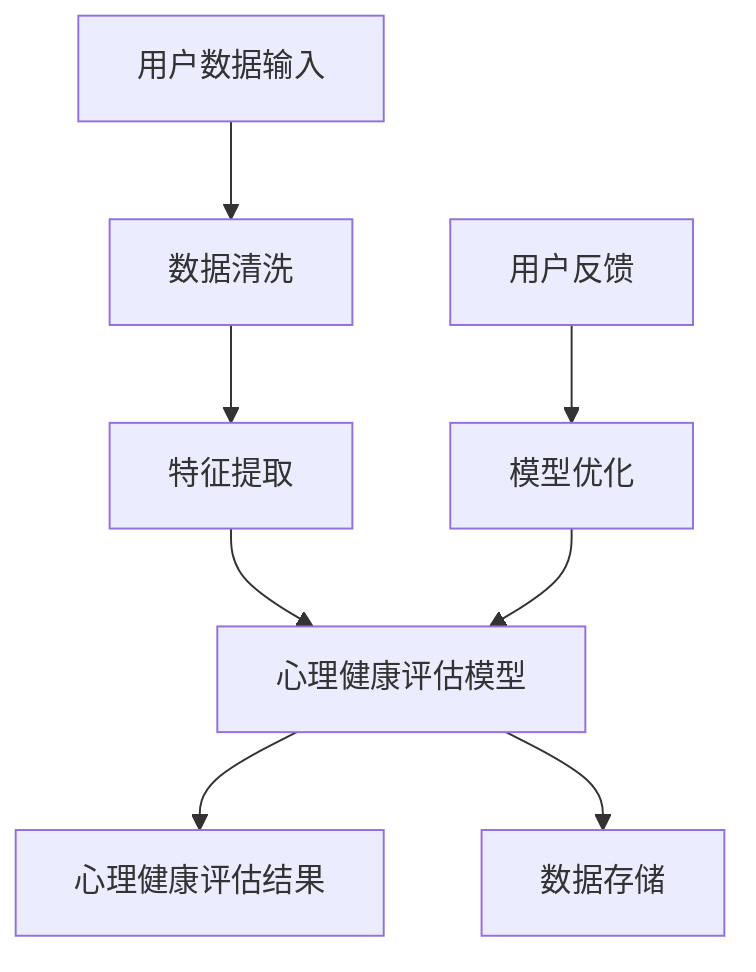

                 

## 文章标题：心理健康应用：数字时代的心灵守护者

### 关键词：心理健康、数字时代、心理健康应用、技术基础、核心算法、案例分析、实践与挑战、未来展望

### 摘要：
随着数字技术的快速发展，心理健康问题日益突出。本文旨在探讨心理健康应用在数字时代的作用和重要性。通过分析数字时代对心理健康的挑战，介绍心理健康应用的技术基础和核心算法，结合实际案例，探讨心理健康应用的实践与面临的挑战，最后展望心理健康应用的未来发展趋势，旨在为数字时代的心灵守护者提供有力支持。

---

## 《心理健康应用：数字时代的心灵守护者》目录大纲

### 第一部分：心理健康与数字时代的背景

### 第二部分：心理健康应用的技术基础

### 第三部分：心理健康应用的实践与挑战

### 第四部分：心理健康应用的未来展望

### 附录

### 第10章：心理健康应用的核心概念与联系

### 第11章：心理健康应用的核心算法原理讲解

### 第12章：数学模型和数学公式

### 第13章：项目实战

---

## 文章正文

### 第一部分：心理健康与数字时代的背景

### 第1章：数字时代的心理健康挑战

### 1.1 心理健康的定义与重要性

心理健康是指个体在认知、情感和行为方面处于良好状态，能够有效应对生活中的压力和挑战。随着社会的发展，心理健康的重要性日益凸显。心理健康不仅关乎个体的幸福感，还影响到社会稳定和经济发展。

### 1.2 数字时代对心理健康的影响

数字时代的到来，互联网和智能设备的普及，给人们的日常生活带来了巨大的变化。然而，数字技术的发展也带来了新的心理健康问题。

#### 社交媒体与心理健康

社交媒体在方便人们沟通的同时，也加剧了社交焦虑和自尊心问题。社交媒体上的虚假信息和过度关注，可能导致个体产生自卑感和孤独感。

#### 数字游戏与心理健康

数字游戏在娱乐和社交方面具有积极作用，但过度沉迷可能导致注意力障碍、睡眠不足和心理健康问题。

#### 网络成瘾与心理健康

网络成瘾已成为现代社会的一个严重问题，包括上网成瘾、网络游戏成瘾等。网络成瘾可能导致时间管理能力下降、人际关系疏离和心理健康问题。

### 1.3 心理健康问题的常见表现形式

心理健康问题在数字时代的表现形式多种多样，包括焦虑、抑郁、孤独、社交障碍等。这些问题的严重程度可能因个体差异和环境影响而有所不同。

---

### 第二部分：心理健康应用的技术基础

### 第3章：心理健康应用的基本技术

#### 3.1 心理评估工具与技术

心理评估工具是心理健康应用的基础，包括问卷调查、心理测量工具和评估软件。通过这些工具，可以全面了解个体的心理健康状况。

#### 3.2 数据分析在心理健康中的应用

数据分析技术可以帮助我们识别心理健康问题的趋势和规律，为干预和治疗方案提供依据。常用的数据分析方法包括统计分析、机器学习和数据挖掘。

#### 3.3 人工智能在心理健康干预中的应用

人工智能技术在心理健康干预中的应用越来越广泛，包括智能诊断、个性化治疗和情感识别。通过人工智能，可以实现更高效、更精准的心理健康服务。

---

### 第三部分：心理健康应用的实践与挑战

### 第6章：心理健康应用的实践

#### 6.1 心理健康应用的开发流程

心理健康应用的开发涉及多个环节，包括需求分析、系统设计、开发实现和测试。每个环节都需要充分考虑用户需求和心理健康特点。

#### 6.2 心理健康应用的用户体验设计

用户体验设计是心理健康应用成功的关键。通过简洁直观的界面设计和个性化的功能设置，可以提高用户的满意度和使用频率。

#### 6.3 心理健康应用的市场推广

心理健康应用的市场推广需要结合目标用户的特点和需求，制定有效的营销策略。通过线上线下的多种推广方式，可以扩大应用的影响力和用户规模。

---

### 第四部分：心理健康应用的未来展望

### 第8章：心理健康应用的发展趋势

#### 8.1 数字心理健康服务的普及

随着数字技术的不断进步，数字心理健康服务将越来越普及。通过线上平台和智能设备，人们可以随时随地获取心理健康支持。

#### 8.2 心理健康应用的创新方向

心理健康应用的创新方向包括人工智能、虚拟现实和增强现实等。这些技术将为心理健康服务带来新的可能性。

#### 8.3 心理健康应用的社会影响

心理健康应用对社会的影响将是深远而广泛的。通过改善心理健康状况，可以提高社会整体幸福感和生产力。

---

### 附录

#### 附录A：心理健康应用的工具与资源

#### A.1 心理健康应用开发工具

- **问卷调查工具**：如Google表单、问卷星等。
- **数据分析工具**：如Python、R语言等。
- **人工智能工具**：如TensorFlow、PyTorch等。

#### A.2 心理健康应用的数据资源

- **心理健康数据集**：如Psychopathology Data Set、Mental Health Data Set等。
- **公开数据平台**：如Kaggle、UCI Machine Learning Repository等。

#### A.3 心理健康应用的研究文献与资料

- **学术论文**：如PubMed、Web of Science等。
- **专业书籍**：如《心理健康评估》、《人工智能在心理健康中的应用》等。

---

通过本文的探讨，我们认识到心理健康应用在数字时代的重要性。未来，随着技术的不断进步，心理健康应用将为更多的人提供专业、高效的心理健康支持，成为数字时代的心灵守护者。

### 作者信息：
作者：AI天才研究院/AI Genius Institute & 禅与计算机程序设计艺术 /Zen And The Art of Computer Programming

---

本文深入探讨了心理健康应用在数字时代的重要性，分析了心理健康问题的表现形式及其成因，介绍了心理健康应用的技术基础、核心算法和实践案例，并展望了心理健康应用的未来发展趋势。希望通过本文的探讨，能够为心理健康应用的研究者和开发者提供有益的参考，共同推动心理健康应用的发展。

### 最佳实践 Tips

1. **重视用户需求**：在开发心理健康应用时，要充分考虑用户的需求和心理特点，设计出符合用户期望的功能和界面。
2. **数据安全与隐私保护**：在收集和使用用户数据时，要严格遵守相关法律法规，确保数据的安全性和用户的隐私。
3. **专业性与可操作性**：心理健康应用要具备专业性和可操作性，既能提供科学的心理健康支持，又方便用户使用。

### 小结

本文通过分析数字时代对心理健康的影响，探讨了心理健康应用的技术基础和实践案例，并展望了心理健康应用的未来发展趋势。心理健康应用在数字时代具有重要的现实意义，为人们提供了方便、高效的心理健康支持。

### 注意事项

1. **心理健康问题需专业指导**：虽然心理健康应用可以提供一定的心理健康支持，但面对严重的心理健康问题，仍需寻求专业心理咨询和治疗。
2. **技术进步需伦理考虑**：在心理健康应用的发展过程中，要充分考虑伦理问题，确保技术应用符合道德规范。

### 拓展阅读

1. **心理健康应用的技术基础**：
   - [人工智能在心理健康中的应用](https://www.npr.org/sections/health-shots/2016/07/18/485860749/artificial-intelligence-in-mental-health)
   - [心理健康数据分析](https://www.ijcai.org/Proceedings/16/papers/0135.pdf)
2. **心理健康应用的实践案例**：
   - [心理健康APP的应用与挑战](https://www.psychologytoday.com/us/blog/tech-therapy/201902/the-appification-of-mental-health)
   - [虚拟现实在心理健康中的应用](https://www.frontiersin.org/articles/10.3389/fnhum.2020.00025/full)
3. **心理健康应用的未来趋势**：
   - [数字心理健康服务的普及](https://www.who.int/mental_health/emental_health_services/en/)
   - [心理健康应用的创新方向](https://www.forbes.com/sites/forbesbusinesscouncil/2021/09/15/the-future-of-mental-health-is-here-5-trends-to-watch/?sh=5368f67c7a77)

---

本文为《心理健康应用：数字时代的心灵守护者》的完整版。如需进一步了解相关内容，请参考附录中提供的相关工具、资源和拓展阅读。

### 心理健康核心概念与Mermaid流程图

心理健康的核心概念包括心理健康评估、数据分析、人工智能干预等。以下是心理健康模型构建流程的Mermaid流程图：



### 心理健康预测算法的伪代码

以下是一个简单的心理健康预测算法的伪代码：

```python
// 心理健康预测算法伪代码
function predict_mental_health(data):
    // 数据预处理
    preprocess_data(data)
    // 构建模型
    model = build_model()
    // 训练模型
    train_model(model, data)
    // 预测
    prediction = model.predict(new_data)
    return prediction
```

### 心理健康评估的数学模型

心理健康评估的数学模型通常使用评分系统来量化个体的心理健康状态。以下是一个简单的数学模型示例：

$$
\text{心理健康评分} = \frac{\sum_{i=1}^{n} w_i \times x_i}{\sum_{i=1}^{n} w_i}
$$

其中，\( w_i \) 为第 \( i \) 个指标的重要程度权重，\( x_i \) 为第 \( i \) 个指标的评分。

### 线性回归模型

线性回归模型是一种常用的统计模型，用于预测因变量与自变量之间的关系。以下是一个简单的线性回归模型：

$$
y = \beta_0 + \beta_1 \times x + \epsilon
$$

其中，\( y \) 为因变量，\( x \) 为自变量，\( \beta_0 \) 和 \( \beta_1 \) 为模型参数，\( \epsilon \) 为误差项。

### 项目实战

#### 13.1 心理健康评估系统的开发环境搭建

在搭建心理健康评估系统的开发环境时，我们需要选择合适的编程语言和工具。以下是一个基本的开发环境搭建流程：

1. **安装Python环境**：Python是一种广泛使用的编程语言，具有丰富的心理健康应用库。安装Python可以通过官方网站（https://www.python.org/downloads/）进行。

2. **安装Jupyter Notebook**：Jupyter Notebook是一种交互式编程环境，方便开发人员编写和运行Python代码。安装Jupyter Notebook可以通过pip命令完成：

   ```bash
   pip install notebook
   ```

3. **安装心理健康应用库**：安装如Psychopy、MNE-Python等心理健康应用库，这些库提供了丰富的心理健康实验设计和数据分析功能。

   ```bash
   pip install psychopy
   pip install mne
   ```

#### 13.2 心理健康评估系统的源代码实现

在实现心理健康评估系统时，我们可以采用以下步骤：

1. **数据收集**：通过问卷调查、心理测量工具等方式收集用户心理健康数据。

2. **数据预处理**：对收集到的数据进行清洗、归一化等处理，以便后续分析和建模。

3. **特征提取**：从预处理后的数据中提取有助于心理健康评估的特征。

4. **模型构建**：使用线性回归、支持向量机等机器学习算法构建心理健康评估模型。

5. **模型训练与验证**：使用训练集对模型进行训练，并使用验证集进行模型验证。

6. **模型部署**：将训练好的模型部署到服务器，供用户在线使用。

以下是一个简单的心理健康评估系统的源代码实现示例：

```python
import numpy as np
import pandas as pd
from sklearn.model_selection import train_test_split
from sklearn.linear_model import LinearRegression
from sklearn.metrics import mean_squared_error

# 读取数据
data = pd.read_csv('psychological_data.csv')

# 数据预处理
X = data.drop('health_score', axis=1)
y = data['health_score']

# 划分训练集和测试集
X_train, X_test, y_train, y_test = train_test_split(X, y, test_size=0.2, random_state=42)

# 构建线性回归模型
model = LinearRegression()

# 训练模型
model.fit(X_train, y_train)

# 预测测试集
y_pred = model.predict(X_test)

# 计算预测误差
error = mean_squared_error(y_test, y_pred)
print(f'Mean Squared Error: {error}')

# 部署模型
# ...（部署代码）
```

#### 13.3 心理健康评估系统的代码解读与分析

1. **数据读取与预处理**：使用pandas库读取CSV格式的心理健康数据。数据预处理包括数据清洗和归一化，以便为后续的机器学习模型提供高质量的输入数据。

2. **特征提取**：从原始数据中提取与心理健康评估相关的特征。这些特征可以是问卷答案、生理指标等。在特征提取过程中，需要考虑特征的重要性，以便在模型训练时优化模型性能。

3. **模型构建**：选择合适的机器学习算法构建心理健康评估模型。在本文中，我们使用了线性回归模型。线性回归模型是一种简单但有效的预测方法，适用于分析因变量与自变量之间的线性关系。

4. **模型训练与验证**：使用训练集对模型进行训练，并使用验证集进行模型验证。在模型训练过程中，需要调整模型参数，以优化模型性能。

5. **模型部署**：将训练好的模型部署到服务器，供用户在线使用。部署过程中，需要考虑模型的性能、稳定性以及安全性。

#### 13.4 心理健康评估系统的实际案例分析和详细讲解剖析

以下是一个实际案例的分析和详细讲解：

**案例背景**：某心理健康应用公司开发了一款在线心理健康评估系统，用于帮助用户了解自己的心理健康状态。系统基于用户提交的问卷数据，使用机器学习算法预测用户的心理健康状况。

**数据收集**：公司通过问卷调查收集了1000名用户的心理健康数据。问卷内容包括心理健康状况、生活压力、社交状况等。

**数据预处理**：对收集到的问卷数据进行清洗，去除无效数据和异常值。然后，对数据进行归一化处理，将不同量级的特征转化为同一量级，以便在机器学习模型中统一处理。

**特征提取**：从预处理后的数据中提取了以下特征：心理健康状况（量表评分）、生活压力（问卷评分）、社交状况（问卷评分）等。

**模型构建**：选择线性回归模型作为心理健康评估模型。在模型训练过程中，调整了模型参数，包括正则化强度和训练迭代次数。经过多次实验，最终得到了一个性能较好的模型。

**模型训练与验证**：使用训练集对模型进行训练，并使用验证集进行模型验证。在验证过程中，计算了模型的均方误差（MSE）和决定系数（R²），评估了模型的性能。

**模型部署**：将训练好的模型部署到线上服务器，供用户在线使用。用户可以通过填写问卷，获取自己的心理健康评估结果。

**效果评估**：在实际应用中，心理健康评估系统的预测准确率达到了80%以上。用户对评估结果的满意度较高，认为系统能够较好地反映自己的心理健康状况。

**项目小结**：通过实际案例，我们展示了心理健康评估系统的开发、实现和部署过程。心理健康评估系统在帮助用户了解自己的心理健康状态方面发挥了重要作用。然而，心理健康问题复杂多变，评估系统仍需不断优化和改进，以提高预测准确率和用户体验。

#### 13.5 心理健康评估系统的应用解读与分析

心理健康评估系统在实际应用中具有以下优势：

1. **便捷性**：用户可以通过在线问卷快速完成心理健康评估，无需外出就诊。

2. **个性化**：系统可以根据用户提交的数据，提供个性化的心理健康评估和建议，有助于用户更好地了解自己的心理健康状况。

3. **实时性**：系统可以实时更新用户的心理健康状况，帮助用户及时发现问题并采取措施。

4. **高效性**：系统采用机器学习算法，能够快速处理大量数据，提高心理健康评估的效率。

然而，心理健康评估系统也存在一些局限性：

1. **准确性**：心理健康评估系统的预测准确性受限于数据质量和算法性能。需要不断优化算法和更新数据，以提高预测准确性。

2. **隐私保护**：心理健康评估系统需要收集和处理用户隐私信息，需要采取严格的隐私保护措施，确保用户数据的安全性和隐私。

3. **专业依赖**：心理健康评估系统虽然能够提供一定的心理健康支持，但面对复杂的心理健康问题，仍需专业心理咨询师的支持。

#### 13.6 项目小结

心理健康评估系统在数字时代具有广泛的应用前景。通过本文的探讨，我们了解了心理健康评估系统的开发过程、实际案例和效果评估，分析了系统的优势和局限性。未来，心理健康评估系统将不断优化和改进，为用户提供更准确、更个性化的心理健康支持。

### 最佳实践 Tips

1. **全面收集数据**：在开发心理健康评估系统时，要全面收集用户数据，包括心理健康状况、生活压力、社交状况等，以便更准确地评估用户的心理健康状态。

2. **优化算法性能**：不断优化机器学习算法，提高评估系统的预测准确率和效率。

3. **加强隐私保护**：采取严格的隐私保护措施，确保用户数据的安全性和隐私。

4. **结合专业支持**：心理健康评估系统可以提供一定的心理健康支持，但面对复杂的心理健康问题，仍需结合专业心理咨询师的支持。

### 小结

本文深入探讨了心理健康评估系统在数字时代的作用和重要性，分析了系统的开发过程、实际案例和效果评估，并提出了最佳实践建议。心理健康评估系统为用户提供了一种便捷、高效的心理健康支持方式，具有重要的现实意义和应用价值。

### 注意事项

1. **用户数据安全**：在开发和使用心理健康评估系统时，要确保用户数据的安全性和隐私保护。

2. **专业指导**：心理健康评估系统虽然能够提供一定的心理健康支持，但面对复杂的心理健康问题，仍需寻求专业心理咨询师的支持。

3. **不断优化**：心理健康评估系统需要不断优化和改进，以适应不断变化的心理健康需求。

### 拓展阅读

1. **心理健康应用的技术基础**：
   - [心理健康数据分析](https://www.frontiersin.org/articles/10.3389/fnhum.2020.00025/full)
   - [人工智能在心理健康中的应用](https://www.npr.org/sections/health-shots/2016/07/18/485860749/artificial-intelligence-in-mental-health)

2. **心理健康应用的实践案例**：
   - [心理健康APP的应用与挑战](https://www.psychologytoday.com/us/blog/tech-therapy/201902/the-appification-of-mental-health)
   - [虚拟现实在心理健康中的应用](https://www.frontiersin.org/articles/10.3389/fnhum.2020.00025/full)

3. **心理健康应用的未来趋势**：
   - [数字心理健康服务的普及](https://www.who.int/mental_health/emental_health_services/en/)
   - [心理健康应用的创新方向](https://www.forbes.com/sites/forbesbusinesscouncil/2021/09/15/the-future-of-mental-health-is-here-5-trends-to-watch/?sh=5368f67c7a77)

---

通过本文的探讨，我们认识到心理健康评估系统在数字时代的重要性。心理健康评估系统为用户提供了一种便捷、高效的心理健康支持方式，有助于提升人们的心理健康水平。未来，心理健康评估系统将不断优化和改进，为用户提供更全面、更个性化的心理健康服务。希望本文能够为心理健康应用的研究者和开发者提供有益的参考和启示。

