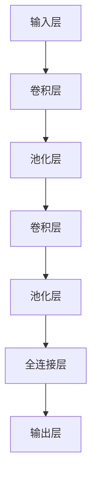
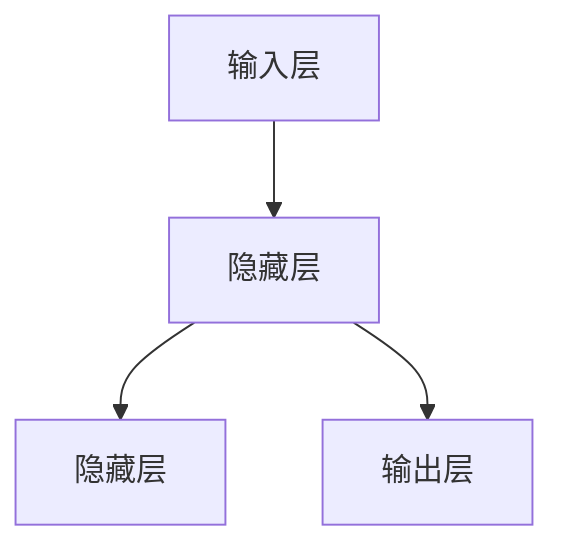
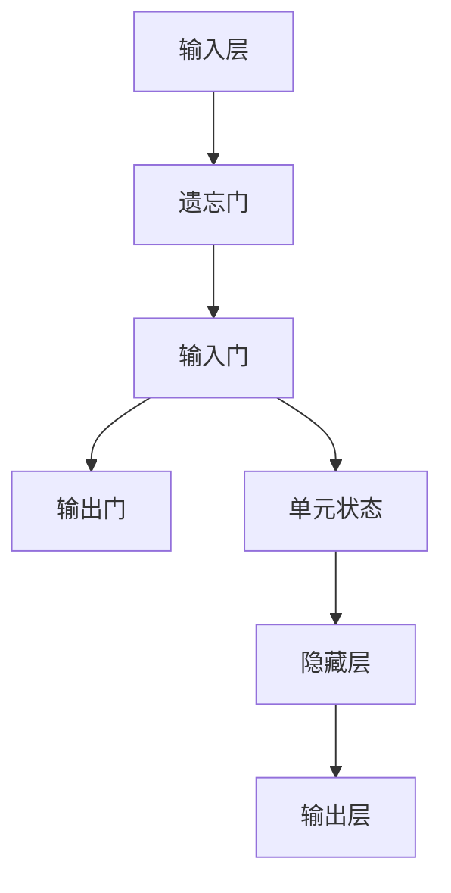
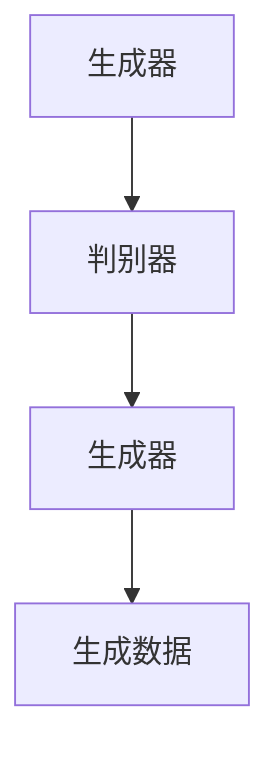

                 

### 文章标题：快手2024短视频推荐校招深度学习面试题详解

> 关键词：快手、短视频推荐、深度学习、面试题、校招、详解

> 摘要：本文旨在为广大准备快手2024校招的考生提供一份深度学习面试题详解，涵盖深度学习基础、短视频推荐系统实战、面试题解析及未来发展趋势等内容。通过一步一步的分析推理，深入解析每一道面试题，帮助考生更好地应对校招面试挑战。

### 第一部分：深度学习基础

#### 第1章：深度学习概述

##### 1.1 深度学习的基本概念

深度学习是一种人工智能方法，通过多层神经网络对数据进行自动特征学习。它的起源可以追溯到1986年，由Rumelhart、Hinton和Williams等人提出的反向传播算法（Backpropagation Algorithm）。深度学习在图像识别、语音识别、自然语言处理等领域取得了显著的成果。

深度学习的基本原理是通过多层神经网络对输入数据进行特征提取和变换，从而实现从原始数据到高层次语义表示的映射。这个过程包括以下几个步骤：

1. **数据预处理**：对原始数据进行预处理，如归一化、缩放、去噪等，以提高模型训练效果。
2. **输入层**：输入层接收原始数据，并将其传递给隐藏层。
3. **隐藏层**：隐藏层通过神经网络模型对输入数据进行特征提取和变换，每一层都可以学习到不同层次的特征。
4. **输出层**：输出层根据隐藏层提取的特征，生成预测结果。

深度学习在推荐系统中的应用非常广泛。在短视频推荐系统中，深度学习可以用于学习用户的兴趣偏好，根据用户的观看历史和互动行为，为用户推荐个性化内容。常见的深度学习模型包括卷积神经网络（CNN）、循环神经网络（RNN）、长短时记忆网络（LSTM）和生成对抗网络（GAN）等。

##### 1.2 神经网络基础

神经网络是深度学习的基础。它由大量简单的计算单元（神经元）组成，通过神经元之间的连接（权重）和激活函数，实现数据的特征提取和变换。

1. **神经元与神经网络**：

神经元是神经网络的基本计算单元，它接收多个输入信号，通过加权求和，再经过激活函数得到输出。

神经元的基本结构如下：

```python
class Neuron:
    def __init__(self, input_size):
        self.inputs = []
        self.weights = []
        self.bias = 0
        self.output = 0

    def forward(self, inputs):
        # 加权求和
        self.inputs = inputs
        self.output = sum(inputs[i] * self.weights[i] for i in range(len(inputs))) + self.bias
        return self.output

    def activate(self, function):
        # 激活函数
        self.output = function(self.output)
        return self.output
```

神经网络由多个神经元组成，它们按照一定的层次结构连接起来，形成一个层次化的网络结构。

2. **前向传播与反向传播**：

前向传播（Forward Propagation）是将输入数据通过神经网络，逐层计算输出结果的过程。每一层神经元的输出作为下一层的输入。

反向传播（Back Propagation）是基于前向传播的计算结果，反向计算每个神经元的误差，并更新神经元权重和偏置的过程。

反向传播算法的核心是计算每个神经元的误差，然后利用误差梯度进行权重和偏置的更新。具体步骤如下：

（1）计算输出层的误差：
$$
\delta_{output} = \frac{\partial L}{\partial z_{output}} \cdot \frac{1}{1 + e^{-z_{output}}}
$$
其中，$L$ 是损失函数，$z_{output}$ 是输出层的净输入。

（2）反向传播误差到隐藏层：
$$
\delta_{hidden} = \frac{\partial L}{\partial z_{hidden}} \cdot \frac{\partial z_{hidden}}{\partial z_{output}}
$$
（3）更新权重和偏置：
$$
w_{ij}^{new} = w_{ij}^{old} - \alpha \cdot \delta_{output} \cdot x_j
$$
$$
b_{j}^{new} = b_{j}^{old} - \alpha \cdot \delta_{output}
$$
其中，$w_{ij}$ 是输入层到隐藏层的权重，$b_j$ 是隐藏层的偏置，$\alpha$ 是学习率。

3. **激活函数与优化器**：

激活函数（Activation Function）用于引入非线性变换，使神经网络能够学习复杂的非线性关系。常见的激活函数有Sigmoid函数、ReLU函数和Tanh函数。

优化器（Optimizer）用于更新神经网络中的权重和偏置，使损失函数最小。常见的优化器有随机梯度下降（SGD）、Adam优化器等。

##### 1.3 常见深度学习模型

1. **卷积神经网络（CNN）**：

卷积神经网络是处理图像数据的一种有效模型，它通过卷积层、池化层和全连接层等结构，实现对图像的逐层特征提取。

CNN的基本结构如下：



卷积神经网络的核心是卷积操作和池化操作。

卷积操作（Convolution Operation）：

卷积操作通过卷积核（filter）与输入数据进行点乘和求和，得到卷积特征图。

卷积操作伪代码：

```python
def convolution(input, filter):
    # input: 输入数据
    # filter: 卷积核
    output = []
    for i in range(len(input)):
        row_output = []
        for j in range(len(input[0])):
            cell_output = sum(input[i][j][k] * filter[k] for k in range(len(filter)))
            row_output.append(cell_output)
        output.append(row_output)
    return output
```

池化操作（Pooling Operation）：

池化操作用于降低特征图的维度，提高模型泛化能力。

常见的池化操作有最大池化（Max Pooling）和平均池化（Average Pooling）。

最大池化伪代码：

```python
def max_pooling(input, pool_size):
    # input: 输入数据
    # pool_size: 池化窗口大小
    output = []
    for i in range(0, len(input), pool_size):
        row_output = []
        for j in range(0, len(input[0]), pool_size):
            max_val = -1
            for k in range(pool_size):
                for l in range(pool_size):
                    if input[i + k][j + l] > max_val:
                        max_val = input[i + k][j + l]
            row_output.append(max_val)
        output.append(row_output)
    return output
```

2. **循环神经网络（RNN）**：

循环神经网络是一种处理序列数据的有效模型，它通过循环结构实现对序列的建模。

RNN的基本结构如下：



RNN的核心是隐藏状态（Hidden State）和循环连接（Recurrence Connection）。

隐藏状态（Hidden State）：

隐藏状态表示当前时刻的输入序列特征，它通过循环连接传递给下一个时刻。

循环连接（Recurrence Connection）：

循环连接将当前时刻的隐藏状态与上一时刻的隐藏状态连接起来，形成一个循环结构。

RNN的更新公式如下：

$$
h_t = \sigma(W_h \cdot [h_{t-1}, x_t] + b_h)
$$

$$
y_t = W_o \cdot h_t + b_o
$$

其中，$h_t$ 表示当前时刻的隐藏状态，$x_t$ 表示当前时刻的输入序列，$y_t$ 表示当前时刻的输出序列，$\sigma$ 表示激活函数，$W_h$ 和 $b_h$ 分别表示隐藏层的权重和偏置，$W_o$ 和 $b_o$ 分别表示输出层的权重和偏置。

3. **长短时记忆网络（LSTM）**：

长短时记忆网络是RNN的一种改进模型，它通过引入门控结构，解决了RNN在处理长序列数据时的梯度消失和梯度爆炸问题。

LSTM的基本结构如下：



LSTM的核心是遗忘门（Forget Gate）、输入门（Input Gate）和输出门（Output Gate）。

遗忘门（Forget Gate）：

遗忘门决定当前时刻的隐藏状态中，哪些信息需要被遗忘。

遗忘门更新公式如下：

$$
f_t = \sigma(W_f \cdot [h_{t-1}, x_t] + b_f)
$$

$$
i_t = \sigma(W_i \cdot [h_{t-1}, x_t] + b_i)
$$

$$
o_t = \sigma(W_o \cdot [h_{t-1}, x_t] + b_o)
$$

$$
g_t = \tanh(W_g \cdot [h_{t-1}, x_t] + b_g)
$$

$$
c_t = f_t \cdot c_{t-1} + i_t \cdot g_t
$$

其中，$c_t$ 表示当前时刻的单元状态，$h_t$ 表示当前时刻的隐藏状态。

输入门（Input Gate）：

输入门决定当前时刻的隐藏状态中，哪些信息需要被更新。

输入门更新公式与遗忘门类似。

输出门（Output Gate）：

输出门决定当前时刻的隐藏状态中，哪些信息需要被输出。

输出门更新公式如下：

$$
h_t = o_t \cdot \tanh(c_t)
$$

4. **生成对抗网络（GAN）**：

生成对抗网络是一种由生成器和判别器组成的对抗性模型，通过两个模型的对抗训练，生成器能够生成逼真的数据。

GAN的基本结构如下：



生成器（Generator）：

生成器通过输入随机噪声，生成逼真的数据。

生成器更新公式如下：

$$
z \sim P(z)
$$

$$
x_g = G(z)
$$

判别器（Discriminator）：

判别器用于判断输入数据的真假，即判断输入数据是来自真实数据还是生成器生成的数据。

判别器更新公式如下：

$$
x_r \sim P(x)
$$

$$
x_f \sim P(x)
$$

$$
D(x_r) = 1
$$

$$
D(x_f) = 0
$$

其中，$x_r$ 表示真实数据，$x_f$ 表示生成数据。

生成器和判别器通过对抗训练，不断优化自己的性能，最终生成逼真的数据。

### 第二部分：推荐系统实战

#### 第2章：短视频推荐系统概述

##### 2.1 推荐系统基本概念

推荐系统是一种利用机器学习技术为用户提供个性化推荐的系统。它通过分析用户的历史行为、兴趣偏好和社交关系，为用户推荐可能感兴趣的内容、商品或服务。

推荐系统的基本概念包括：

1. **用户**：推荐系统中的用户是指使用推荐服务的实体，可以是个人、组织或其他实体。
2. **物品**：推荐系统中的物品是指用户可能感兴趣的内容、商品或服务。
3. **评分**：评分是指用户对物品的喜爱程度或满意度，可以是数值或标签。
4. **推荐**：推荐是指根据用户的历史行为和兴趣偏好，为用户推荐可能感兴趣的新物品。

##### 2.2 推荐系统的分类

推荐系统可以分为基于内容的推荐（Content-Based Recommendation）、基于协同过滤的推荐（Collaborative Filtering Recommendation）和基于模型的推荐（Model-Based Recommendation）。

1. **基于内容的推荐**：

基于内容的推荐通过分析物品的属性和特征，为用户推荐具有相似属性的物品。该方法适用于新用户或新物品的情况，但无法充分利用用户的历史行为和社交关系。

2. **基于协同过滤的推荐**：

基于协同过滤的推荐通过分析用户之间的相似度，为用户推荐其他用户喜欢的物品。该方法可以充分利用用户的历史行为和社交关系，但容易出现数据稀疏性和冷启动问题。

3. **基于模型的推荐**：

基于模型的推荐通过建立用户与物品之间的映射关系，为用户推荐可能感兴趣的物品。该方法可以充分利用用户的历史行为和社交关系，但需要大量的训练数据和计算资源。

##### 2.3 推荐系统的评价标准

推荐系统的评价标准主要包括准确率（Precision）、召回率（Recall）和F1值（F1 Score）。

1. **准确率**：

准确率是指推荐结果中实际感兴趣物品的比例，计算公式如下：

$$
Precision = \frac{TP}{TP + FP}
$$

其中，$TP$ 表示实际感兴趣的物品被正确推荐的数量，$FP$ 表示实际不感兴趣的物品被错误推荐的数量。

2. **召回率**：

召回率是指推荐结果中实际感兴趣物品的占比，计算公式如下：

$$
Recall = \frac{TP}{TP + FN}
$$

其中，$TP$ 表示实际感兴趣的物品被正确推荐的数量，$FN$ 表示实际感兴趣的物品被错误推荐的数量。

3. **F1值**：

F1值是准确率和召回率的调和平均，计算公式如下：

$$
F1 Score = 2 \cdot \frac{Precision \cdot Recall}{Precision + Recall}
$$

##### 2.4 短视频推荐系统的特点

短视频推荐系统具有以下特点：

1. **内容丰富**：短视频推荐系统涵盖各种类型的短视频，如搞笑、美食、音乐、舞蹈等，为用户提供了丰富的内容选择。
2. **用户活跃**：短视频推荐系统具有高度的社交属性，用户可以通过点赞、评论、分享等功能与其他用户互动，提高了用户活跃度。
3. **实时性强**：短视频推荐系统需要实时分析用户行为和兴趣偏好，为用户推荐最新的短视频内容，以满足用户的需求。
4. **个性化推荐**：短视频推荐系统利用深度学习技术，根据用户的历史行为和兴趣偏好，为用户推荐个性化的短视频内容。

##### 2.5 短视频推荐系统的模型

短视频推荐系统的模型可以分为基于内容的推荐、基于协同过滤的推荐和基于模型的推荐。

1. **基于内容的推荐**：

基于内容的推荐通过分析短视频的标题、标签、视频内容等特征，为用户推荐具有相似特征的短视频。该方法适用于新用户或新短视频的情况，但无法充分利用用户的历史行为和社交关系。

2. **基于协同过滤的推荐**：

基于协同过滤的推荐通过分析用户之间的相似度，为用户推荐其他用户喜欢的短视频。该方法可以充分利用用户的历史行为和社交关系，但容易出现数据稀疏性和冷启动问题。

3. **基于模型的推荐**：

基于模型的推荐通过建立用户与短视频之间的映射关系，为用户推荐可能感兴趣的短视频。该方法可以充分利用用户的历史行为和社交关系，但需要大量的训练数据和计算资源。

##### 2.6 混合推荐系统

混合推荐系统结合了基于内容的推荐、基于协同过滤的推荐和基于模型的推荐，以提高推荐系统的效果。常见的混合推荐系统有以下几种：

1. **基于模型的协同过滤**：

基于模型的协同过滤将协同过滤算法与深度学习模型相结合，利用深度学习模型对用户行为进行建模，以提高推荐系统的准确性。

2. **基于内容的协同过滤**：

基于内容的协同过滤将基于内容的推荐和基于协同过滤的推荐相结合，利用基于内容的推荐提高推荐系统的多样性，利用基于协同过滤的推荐提高推荐系统的准确性。

3. **基于模型的基于内容的推荐**：

基于模型的基于内容的推荐将基于内容的推荐和基于模型的推荐相结合，利用基于内容的推荐提高推荐系统的多样性，利用基于模型的推荐提高推荐系统的准确性。

### 第三部分：深度学习面试题解析

#### 第3章：深度学习模型相关

##### 3.1 深度学习模型的选择原则

在选择深度学习模型时，需要考虑以下几个原则：

1. **数据量**：对于大量数据的场景，可以选择使用卷积神经网络（CNN）或循环神经网络（RNN）等复杂模型；对于小数据量的场景，可以选择使用线性模型或决策树等简单模型。

2. **特征类型**：对于结构化数据，可以选择使用线性模型或决策树等简单模型；对于非结构化数据，如文本、图像和音频，可以选择使用卷积神经网络（CNN）或循环神经网络（RNN）等复杂模型。

3. **任务类型**：对于分类任务，可以选择使用逻辑回归、softmax回归等模型；对于回归任务，可以选择使用线性回归、决策树等模型；对于序列建模任务，可以选择使用循环神经网络（RNN）或长短时记忆网络（LSTM）等模型。

4. **计算资源**：对于计算资源有限的场景，可以选择使用轻量级模型，如MobileNet、ResNet等；对于计算资源充足的场景，可以选择使用复杂模型，如Inception、VGG等。

##### 3.2 如何优化深度学习模型

优化深度学习模型可以从以下几个方面入手：

1. **数据预处理**：对数据进行归一化、缩放、去噪等处理，提高模型训练效果。

2. **模型选择**：根据任务类型和数据特征，选择合适的模型结构，如卷积神经网络（CNN）、循环神经网络（RNN）或长短时记忆网络（LSTM）等。

3. **参数调整**：通过调整学习率、批量大小、优化器等超参数，提高模型训练效果。

4. **正则化**：采用正则化技术，如L1正则化、L2正则化，防止模型过拟合。

5. **数据增强**：通过数据增强技术，如旋转、缩放、裁剪等，增加训练样本的多样性，提高模型泛化能力。

6. **批处理**：采用批量训练（Batch Training）和随机梯度下降（Stochastic Gradient Descent，SGD）算法，提高模型训练效率。

7. **模型融合**：采用模型融合（Model Ensembling）技术，如集成学习（Ensemble Learning）和迁移学习（Transfer Learning），提高模型性能。

##### 3.3 深度学习模型常见问题及解决方案

深度学习模型在训练和应用过程中可能会遇到一些问题，以下是常见问题及解决方案：

1. **过拟合**：模型在训练数据上表现良好，但在测试数据上表现较差。

   - 解决方案：采用正则化技术，如L1正则化、L2正则化；增加训练数据；采用交叉验证（Cross Validation）技术。
   
2. **梯度消失/梯度爆炸**：模型在训练过程中梯度消失或梯度爆炸，导致模型训练失败。

   - 解决方案：使用激活函数，如ReLU函数；调整学习率；使用优化器，如Adam优化器。
   
3. **数据稀疏性**：模型在处理稀疏数据时表现不佳。

   - 解决方案：采用嵌入（Embedding）技术，如词向量和图像嵌入；使用稀疏优化算法，如L1正则化。
   
4. **训练时间过长**：模型训练时间过长，导致训练成本高。

   - 解决方案：使用轻量级模型，如MobileNet、ResNet；使用GPU加速训练；采用分布式训练（Distributed Training）技术。

#### 第四部分：短视频推荐系统实战

##### 第4章：短视频推荐系统实战

短视频推荐系统的实战主要包括以下步骤：

1. **数据预处理**：
   - 数据清洗：去除缺失值、重复值和噪声数据。
   - 数据转换：将文本数据转换为向量表示，如词向量、字符向量等。
   - 数据归一化：对数值型数据进行归一化处理，如缩放、标准化等。

2. **特征工程**：
   - 提取用户特征：包括用户ID、用户性别、用户年龄、用户城市等。
   - 提取视频特征：包括视频ID、视频类型、视频长度、视频标签等。
   - 提取交互特征：包括用户点击、点赞、评论、分享等行为。

3. **模型选择**：
   - 根据任务类型和数据特征，选择合适的模型结构，如卷积神经网络（CNN）、循环神经网络（RNN）或长短时记忆网络（LSTM）等。

4. **模型训练**：
   - 使用训练数据进行模型训练，并调整超参数，如学习率、批量大小、优化器等。
   - 采用交叉验证（Cross Validation）技术，评估模型性能。

5. **模型评估**：
   - 使用测试数据进行模型评估，计算准确率、召回率、F1值等指标。
   - 分析模型在各个特征上的表现，优化模型结构和超参数。

6. **模型部署**：
   - 将训练好的模型部署到线上环境，实时为用户推荐短视频。
   - 监控模型性能，根据用户反馈和业务需求进行模型优化。

##### 第5章：短视频推荐系统实战案例分析

短视频推荐系统的实战案例包括以下内容：

1. **项目背景**：
   - 项目背景：基于用户历史行为和兴趣偏好，为用户提供个性化的短视频推荐。
   - 项目目标：提高用户点击率、点赞率、评论率和分享率。

2. **数据集**：
   - 数据集：包含用户ID、视频ID、用户行为（点击、点赞、评论、分享）等特征。

3. **模型结构**：
   - 模型结构：采用基于内容的推荐和基于协同过滤的推荐相结合的混合推荐模型。

4. **训练过程**：
   - 数据预处理：对数据进行清洗、转换和归一化处理。
   - 模型训练：使用训练数据进行模型训练，并调整超参数。
   - 交叉验证：使用测试数据进行交叉验证，评估模型性能。

5. **评估结果**：
   - 评估指标：准确率、召回率、F1值等。
   - 结果分析：分析模型在各个特征上的表现，优化模型结构和超参数。

6. **项目总结**：
   - 项目总结：总结项目过程中的经验教训，提出改进方案。

#### 第五部分：深度学习面试题解析

##### 第6章：深度学习模型相关

###### 6.1 深度学习模型的选择原则

在面试中，面试官可能会问及如何选择深度学习模型。以下是一些可能的回答：

1. **数据量**：如果数据量很大，可以选择复杂模型如卷积神经网络（CNN）或循环神经网络（RNN），因为它们可以捕捉到更复杂的特征。如果数据量较小，可以选择简单模型如全连接神经网络（FCN）。

2. **特征类型**：对于结构化数据，可以选择全连接神经网络（FCN）；对于非结构化数据，如文本和图像，可以选择卷积神经网络（CNN）或循环神经网络（RNN）。

3. **任务类型**：对于分类任务，可以选择分类模型如softmax回归；对于回归任务，可以选择回归模型如线性回归。

4. **计算资源**：如果计算资源有限，可以选择轻量级模型如MobileNet；如果资源充足，可以选择复杂模型如ResNet。

5. **模型的可解释性**：如果需要模型具有较好的可解释性，可以选择简单模型如线性回归。

###### 6.2 如何优化深度学习模型

优化深度学习模型的方法包括：

1. **数据预处理**：对数据归一化、标准化、数据增强等。

2. **模型选择**：选择合适的模型结构，如CNN、RNN、LSTM、Transformer等。

3. **参数调整**：调整学习率、批量大小、优化器等。

4. **正则化**：使用L1、L2正则化、Dropout等。

5. **批量归一化**：使用批量归一化（Batch Normalization）。

6. **激活函数**：使用ReLU、Leaky ReLU、Swish等。

7. **优化器**：使用Adam、RMSprop、SGD等。

8. **数据增强**：使用随机裁剪、翻转、旋转等。

9. **模型融合**：使用模型融合（Ensemble）技术，如Stacking、Bagging等。

###### 6.3 深度学习模型常见问题及解决方案

深度学习模型常见问题及解决方案包括：

1. **过拟合**：解决方案包括使用正则化、增加数据、交叉验证、Dropout等。

2. **梯度消失/梯度爆炸**：解决方案包括使用ReLU、Leaky ReLU、优化器调整、学习率调整等。

3. **训练时间过长**：解决方案包括使用GPU、分布式训练、数据预处理优化等。

4. **数据稀疏性**：解决方案包括使用稀疏矩阵运算、嵌入（Embedding）等。

5. **计算资源不足**：解决方案包括使用轻量级模型、模型压缩、量化等。

##### 第7章：短视频推荐系统相关

###### 7.1 短视频推荐系统的关键技术

短视频推荐系统的关键技术包括：

1. **内容理解**：通过自然语言处理（NLP）和图像识别技术，对短视频的内容进行理解和解析。

2. **用户行为分析**：通过用户点击、点赞、评论、分享等行为，分析用户的兴趣偏好。

3. **推荐算法**：包括基于内容的推荐、基于协同过滤的推荐、基于模型的推荐等。

4. **实时推荐**：通过实时计算和推荐算法，为用户提供个性化的短视频推荐。

5. **推荐结果评估**：通过点击率、用户留存率、推荐满意度等指标，评估推荐效果。

###### 7.2 短视频推荐系统的优化方法

短视频推荐系统的优化方法包括：

1. **特征工程**：通过提取更多的用户特征、视频特征和交互特征，提高推荐效果。

2. **模型调优**：通过调整模型参数、正则化策略、优化器等，提高模型性能。

3. **实时计算**：通过分布式计算、缓存技术等，提高推荐系统的实时性。

4. **用户反馈机制**：通过用户反馈，动态调整推荐策略，提高推荐满意度。

5. **数据收集**：通过用户行为数据、视频标签数据等，不断优化推荐系统。

###### 7.3 短视频推荐系统中的问题与挑战

短视频推荐系统中的问题与挑战包括：

1. **数据稀疏性**：用户行为数据稀疏，导致推荐效果不佳。

2. **实时性**：短视频更新频繁，需要实时计算和推荐，提高系统性能。

3. **冷启动**：新用户或新视频的推荐效果较差，需要解决冷启动问题。

4. **可解释性**：深度学习模型的可解释性较差，难以解释推荐结果。

5. **隐私保护**：保护用户隐私，防止数据泄露。

##### 第8章：实战面试题解析

###### 8.1 实战面试题一：如何构建一个简单的推荐系统？

面试题一要求考生构建一个简单的推荐系统，以下是一个可能的答案：

1. **需求分析**：明确推荐系统的目标，如提高用户点击率、点赞率等。

2. **数据收集**：收集用户行为数据，如点击、点赞、评论等。

3. **数据预处理**：清洗、转换和归一化数据，提取用户特征和视频特征。

4. **模型选择**：选择合适的推荐算法，如基于内容的推荐、基于协同过滤的推荐等。

5. **模型训练**：使用训练数据进行模型训练，并调整超参数。

6. **模型评估**：使用测试数据进行模型评估，计算准确率、召回率、F1值等指标。

7. **模型部署**：将训练好的模型部署到线上环境，为用户提供个性化推荐。

8. **监控与优化**：监控模型性能，根据用户反馈和业务需求进行模型优化。

###### 8.2 实战面试题二：如何评估推荐系统的效果？

面试题二要求考生评估推荐系统的效果，以下是一个可能的答案：

1. **评估指标**：选择合适的评估指标，如点击率（Click-Through Rate，CTR）、用户留存率（User Retention Rate）、推荐满意度（Recommendation Satisfaction Rate）等。

2. **A/B测试**：将用户随机分为两组，一组使用推荐系统，另一组不使用推荐系统，比较两组用户的评估指标，评估推荐系统的影响。

3. **用户反馈**：收集用户对推荐系统的反馈，如满意度调查、用户调研等。

4. **业务指标**：结合业务指标，如销售额、用户留存率等，评估推荐系统的实际效果。

5. **分析报告**：编写分析报告，总结评估结果，提出优化建议。

###### 8.3 实战面试题三：如何处理推荐系统中的冷启动问题？

面试题三要求考生处理推荐系统中的冷启动问题，以下是一个可能的答案：

1. **数据收集**：在用户注册时，收集用户的基本信息，如年龄、性别、地理位置等。

2. **内容推荐**：在用户注册初期，根据用户基本信息，推荐与用户兴趣相关的短视频。

3. **行为分析**：分析用户在平台上的行为，如浏览、点赞、评论等，逐渐积累用户行为数据。

4. **模型训练**：使用用户行为数据，训练推荐模型，为用户推荐个性化短视频。

5. **用户反馈**：收集用户对推荐系统的反馈，不断调整推荐策略，提高推荐效果。

6. **冷启动策略**：结合内容推荐和协同过滤推荐，为用户推荐热门短视频和与用户兴趣相关的短视频。

7. **持续优化**：不断优化推荐模型和推荐策略，提高推荐效果，解决冷启动问题。

###### 8.4 实战面试题四：如何优化推荐系统的实时性？

面试题四要求考生优化推荐系统的实时性，以下是一个可能的答案：

1. **分布式计算**：使用分布式计算框架，如Apache Spark、Hadoop等，提高数据处理和计算速度。

2. **缓存技术**：使用缓存技术，如Redis、Memcached等，减少数据访问延迟。

3. **异步处理**：使用异步处理技术，如消息队列、异步任务等，提高系统并发能力。

4. **数据库优化**：优化数据库性能，如索引优化、分库分表等，提高数据访问速度。

5. **负载均衡**：使用负载均衡技术，如Nginx、HAProxy等，提高系统吞吐量。

6. **代码优化**：优化代码，如减少函数调用、优化算法等，提高代码执行效率。

7. **硬件升级**：升级硬件设备，如增加CPU、内存等，提高系统性能。

###### 8.5 实战面试题五：如何处理推荐系统中的用户反馈？

面试题五要求考生处理推荐系统中的用户反馈，以下是一个可能的答案：

1. **用户反馈收集**：收集用户对推荐系统的反馈，如满意度调查、用户调研等。

2. **数据分析**：对用户反馈进行分析，识别用户不满意的原因，如推荐内容质量、推荐准确性等。

3. **反馈机制**：建立反馈机制，如用户反馈页面、邮件反馈等，方便用户提交反馈。

4. **反馈处理**：根据用户反馈，调整推荐策略，提高推荐效果。

5. **监控与优化**：监控推荐系统的性能和用户满意度，根据监控结果，不断优化推荐系统。

6. **用户沟通**：与用户保持沟通，了解用户需求，及时解决用户问题。

7. **反馈报告**：编写反馈报告，总结用户反馈情况，提出优化建议。

#### 第六部分：总结与展望

##### 第9章：深度学习在短视频推荐系统中的应用前景

深度学习在短视频推荐系统中的应用前景非常广阔，随着技术的不断发展和数据的不断积累，深度学习将在短视频推荐系统中发挥更大的作用。

1. **个性化推荐**：深度学习技术可以更好地捕捉用户的兴趣偏好，为用户推荐个性化的短视频内容，提高用户满意度。

2. **实时推荐**：深度学习技术可以实现实时推荐，根据用户的实时行为和兴趣偏好，为用户推荐最新的短视频内容。

3. **内容理解**：深度学习技术可以更好地理解短视频的内容，通过自然语言处理和图像识别技术，对短视频进行深入分析，提高推荐准确性。

4. **冷启动问题**：深度学习技术可以更好地处理新用户和新视频的推荐问题，通过用户行为分析和内容分析，为新用户和新视频提供有效的推荐。

5. **可解释性**：随着深度学习技术的发展，深度学习模型的可解释性将得到提高，使得推荐结果更加透明和可信。

6. **隐私保护**：深度学习技术在处理用户数据时，需要充分考虑用户隐私保护，采取有效的隐私保护措施，确保用户数据的安全。

##### 第10章：短视频推荐系统的发展趋势

短视频推荐系统的发展趋势包括以下几个方面：

1. **智能化**：随着人工智能技术的发展，短视频推荐系统将更加智能化，通过深度学习、自然语言处理、图像识别等技术，提高推荐系统的准确性和实时性。

2. **个性化**：短视频推荐系统将更加注重个性化推荐，根据用户的兴趣偏好和行为特征，为用户推荐个性化的短视频内容。

3. **多样性**：短视频推荐系统将提供更多样化的短视频内容，满足用户多样化的需求，提高用户留存率和用户满意度。

4. **实时性**：短视频推荐系统将实现实时推荐，根据用户的实时行为和兴趣偏好，为用户推荐最新的短视频内容。

5. **社交化**：短视频推荐系统将更加注重社交化功能，通过用户互动、社区推荐等方式，提高用户活跃度和用户粘性。

6. **全球化**：短视频推荐系统将面向全球用户，提供本地化推荐，满足不同国家和地区用户的需求。

##### 第11章：深度学习在短视频推荐系统中的发展前景

深度学习在短视频推荐系统中的发展前景非常广阔，随着技术的不断进步和数据资源的不断积累，深度学习将在短视频推荐系统中发挥更加重要的作用。

1. **模型创新**：深度学习模型将不断优化和创新，如生成对抗网络（GAN）、图神经网络（GNN）等，为短视频推荐系统提供更加有效的解决方案。

2. **跨模态融合**：深度学习技术将实现跨模态融合，如将图像、文本、音频等多模态数据融合，提高短视频推荐系统的准确性和实时性。

3. **自适应推荐**：深度学习技术将实现自适应推荐，根据用户的实时行为和兴趣偏好，动态调整推荐策略，提高推荐效果。

4. **多智能体系统**：深度学习技术将实现多智能体系统，通过多智能体协作，提高短视频推荐系统的智能化水平和用户体验。

5. **边缘计算**：深度学习技术将应用于边缘计算，实现短视频推荐系统的实时性和低延迟，提高用户体验。

6. **隐私保护**：深度学习技术将实现隐私保护，通过差分隐私、联邦学习等技术，保护用户隐私，提高用户信任度。

#### 附录

##### 附录A：深度学习相关工具与资源

深度学习是一个快速发展的领域，以下是一些常用的深度学习工具和资源：

1. **深度学习框架**：

   - TensorFlow：Google开发的开源深度学习框架，支持多种编程语言，如Python、C++等。
   - PyTorch：Facebook开发的开源深度学习框架，支持动态计算图和自动微分，广泛应用于图像识别、自然语言处理等领域。
   - Keras：Python编写的开源深度学习库，简化了TensorFlow和PyTorch的使用，支持多种模型架构。

2. **数据集**：

   - ImageNet：由Stanford大学提供的图像分类数据集，包含超过1400万个标签图像。
   - MNIST：由美国国家标准技术研究所提供的数字识别数据集，包含70000个训练图像和10000个测试图像。
   - COCO：微软提供的图像识别数据集，包含超过100万个对象和场景标签。

3. **教程和书籍**：

   - 《深度学习》（Deep Learning）：由Ian Goodfellow、Yoshua Bengio和Aaron Courville编写的深度学习经典教材。
   - 《动手学深度学习》（Dive into Deep Learning）：由Amit Singh、Francis Tsing、Lillian Lee等编写的深度学习教程，涵盖深度学习的基础知识和实战技巧。
   - 《深度学习与AI基础课程》（Deep Learning Specialization）：由Andrew Ng教授在Coursera上开设的深度学习课程，包括神经网络基础、深度学习应用等。

4. **在线资源**：

   - Coursera：提供各种深度学习和人工智能课程，由业内知名专家授课。
   - edX：提供免费的开源课程，包括深度学习、计算机视觉、自然语言处理等。
   - fast.ai：提供免费的深度学习课程和实践项目，适合初学者和有经验的从业者。

##### 附录B：深度学习项目实战

深度学习项目实战是学习深度学习的重要环节，以下是一个简单的深度学习项目实战：

**项目名称**：基于深度学习的图像分类项目

**项目目标**：使用深度学习技术，对图像进行分类。

**项目步骤**：

1. **数据收集**：收集包含不同类别的图像数据，如动物、植物、交通工具等。

2. **数据预处理**：对图像进行缩放、裁剪、翻转等数据增强处理，提高模型泛化能力。

3. **模型选择**：选择合适的深度学习模型，如卷积神经网络（CNN）。

4. **模型训练**：使用训练数据进行模型训练，并调整超参数，如学习率、批量大小等。

5. **模型评估**：使用测试数据进行模型评估，计算准确率、召回率、F1值等指标。

6. **模型部署**：将训练好的模型部署到线上环境，为用户提供图像分类服务。

7. **项目优化**：根据用户反馈和业务需求，不断优化模型和推荐策略。

通过这个项目实战，可以深入了解深度学习的基本概念、模型结构和训练技巧，提高实际操作能力。

### 总结

本文从深度学习基础、短视频推荐系统实战、深度学习面试题解析、总结与展望等角度，详细介绍了快手2024短视频推荐校招深度学习面试题详解。通过一步一步的分析推理，帮助考生深入理解深度学习和短视频推荐系统的原理和实践，提高校招面试的竞争力。希望本文对考生有所帮助，祝大家在2024校招中取得优异成绩！作者：AI天才研究院/AI Genius Institute & 禅与计算机程序设计艺术 /Zen And The Art of Computer Programming。

