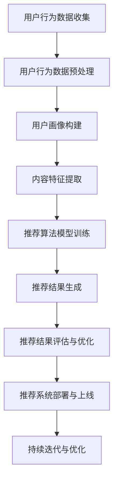

                 

# 文章标题：快手2025社招推荐算法工程师编程题详解

## 关键词：
快手，推荐算法，编程题，社招，工程师，详解

## 摘要：
本文旨在为2025年快手社招推荐算法工程师的应聘者提供详细的编程题解。文章首先介绍了快手推荐算法的基本概念、架构和核心原理，然后通过具体案例和伪代码，深入讲解了用户行为建模、内容特征提取、推荐算法实现以及推荐系统优化与评估等关键技术。最后，文章总结了推荐算法的未来发展趋势和面临的挑战，并提供了一些实用的编程实践指南。

### 《快手2025社招推荐算法工程师编程题详解》目录大纲

## 第一部分：推荐算法基础

### 1. 快手推荐算法概述

#### 1.1 快手推荐算法简介
#### 1.2 快手推荐算法的发展历程
#### 1.3 快手推荐算法的特点

## 2. 推荐系统核心概念与架构

### 2.1 推荐系统核心概念
### 2.2 推荐系统架构概述
### 2.3 推荐系统数据处理流程

## 3. 用户行为分析与建模

### 3.1 用户行为数据分析
### 3.2 用户行为建模方法
### 3.3 用户画像构建与利用

## 4. 内容特征提取与处理

### 4.1 内容特征提取方法
### 4.2 内容特征处理策略
### 4.3 内容特征质量评估

## 5. 推荐算法原理与实现

### 5.1 协同过滤算法
#### 5.1.1 用户基于的协同过滤算法
#### 5.1.2 物品基于的协同过滤算法
#### 5.1.3 混合协同过滤算法
### 5.2 机器学习算法
#### 5.2.1 逻辑回归
#### 5.2.2 支持向量机
#### 5.2.3 神经网络
### 5.3 深度学习算法
#### 5.3.1 卷积神经网络
#### 5.3.2 循环神经网络
#### 5.3.3 转换器架构

## 6. 实际应用案例分析

### 6.1 快手推荐算法实战案例
#### 6.1.1 快手推荐算法实战步骤
#### 6.1.2 快手推荐算法实战效果分析
### 6.2 其他推荐系统应用案例
#### 6.2.1 知乎推荐系统
#### 6.2.2 淘宝推荐系统
#### 6.2.3 百度推荐系统

## 7. 推荐算法优化与评估

### 7.1 推荐算法优化方法
#### 7.1.1 算法参数调优
#### 7.1.2 算法性能提升策略
### 7.2 推荐算法评估指标
#### 7.2.1 用户满意度评估
#### 7.2.2 推荐准确性评估
#### 7.2.3 推荐多样性评估

## 8. 未来发展方向与挑战

### 8.1 推荐算法未来发展趋势
### 8.2 推荐算法面临的技术挑战
### 8.3 推荐算法与社会责任

## 附录

### 附录 A：推荐算法相关资源与工具

#### A.1 常用推荐算法资源
#### A.2 推荐算法工具介绍
#### A.3 推荐算法开源代码与项目

### 附录 B：推荐算法实践项目指南

#### B.1 项目背景与目标
#### B.2 项目开发流程
#### B.3 项目数据预处理
#### B.4 项目算法实现与优化
#### B.5 项目效果评估与总结

### 快手推荐算法架构原理 Mermaid 流程图：


### 用户行为建模伪代码：
```python
# 伪代码：用户行为建模

# 定义用户行为数据结构
UserBehavior = {
    "user_id": int,
    "item_id": int,
    "timestamp": datetime,
    "behavior_type": str
}

# 数据预处理：清洗和标准化用户行为数据
def preprocess_user_behavior(data):
    # 数据清洗：处理缺失值、异常值等
    # 数据标准化：时间戳归一化、行为类型分类编码等
    pass

# 用户行为特征提取
def extract_user_behavior_features(data):
    # 提取用户历史行为特征，如行为频次、行为时长等
    pass

# 构建用户画像
def build_user_profile(data):
    # 综合用户行为特征，构建用户画像
    pass
```

### 逻辑回归推荐算法原理讲解：

逻辑回归是一种经典的推荐算法，其基本原理是基于线性模型对用户行为数据进行建模，并通过最大化似然估计来训练模型参数。

$$
\begin{aligned}
\text{目标函数} &= \sum_{i=1}^{n} \log(P(y_i=1|x_i, \theta)) \\
\text{其中} P(y_i=1|x_i, \theta) &= \frac{e^{\theta^T x_i}}{1 + e^{\theta^T x_i}}
\end{aligned}
$$

其中，$\theta$ 是模型参数，$x_i$ 是输入特征向量，$y_i$ 是用户行为标签（1表示点击，0表示未点击）。

目标函数是对用户行为数据概率的对数似然函数，我们通过梯度下降等方法来最小化该函数，从而得到最优的模型参数 $\theta$。

$$
\theta_{\text{new}} = \theta_{\text{old}} - \alpha \frac{\partial}{\partial \theta} \log(P(y|x, \theta))
$$

其中，$\alpha$ 是学习率。

通过逻辑回归，我们可以预测用户对某个物品的点击概率，进而实现推荐系统的功能。具体的实现过程和优化方法将在后续章节中详细讨论。

----------------------------------------------------------------

## 第一部分：推荐算法基础

### 1. 快手推荐算法概述

#### 1.1 快手推荐算法简介

快手推荐算法是快手平台的核心技术之一，它旨在为用户推荐最符合其兴趣的内容。推荐算法通过分析用户行为数据、内容特征以及用户画像，构建一个有效的推荐模型，从而提高用户满意度和平台活跃度。

快手推荐算法的发展历程可以追溯到早期基于用户兴趣标签的推荐系统。随着用户数据的不断积累和计算能力的提升，快手推荐算法逐渐引入了协同过滤、机器学习和深度学习等技术，形成了如今多层次、多模态的推荐框架。

#### 1.2 快手推荐算法的发展历程

- **早期阶段**：基于用户兴趣标签的推荐系统。用户通过浏览、点赞、评论等行为，为自身打上各种兴趣标签，推荐系统根据这些标签进行内容推荐。
- **发展阶段**：引入协同过滤算法，如基于用户的协同过滤（User-based Collaborative Filtering，UBCF）和基于物品的协同过滤（Item-based Collaborative Filtering，IBCF）。这些算法通过分析用户之间的相似性，为用户推荐相似用户的喜欢内容。
- **成熟阶段**：结合机器学习算法，如逻辑回归、支持向量机（SVM）和神经网络等，提高推荐准确性。这些算法通过构建用户行为和内容特征的模型，预测用户对物品的偏好。
- **当前阶段**：深度学习算法的引入，如卷积神经网络（CNN）、循环神经网络（RNN）和转换器架构（Transformer）。这些算法能够捕捉用户行为和内容之间的复杂关系，进一步提升推荐效果。

#### 1.3 快手推荐算法的特点

- **个性化推荐**：快手推荐算法通过分析用户历史行为和兴趣，为每个用户提供个性化的内容推荐，提高用户满意度和留存率。
- **多模态内容处理**：快手平台的内容丰富多样，包括短视频、直播、图文等，推荐算法能够处理不同类型的内容，实现跨模态推荐。
- **实时推荐**：快手推荐算法能够在用户产生新行为后，迅速调整推荐结果，实现实时推荐。
- **高效可扩展**：快手推荐算法采用了分布式计算和大数据处理技术，能够处理海量用户数据和实时计算推荐结果。

### 2. 推荐系统核心概念与架构

#### 2.1 推荐系统核心概念

- **用户行为数据**：用户在平台上产生的各种行为数据，如浏览、点赞、评论、分享、购买等。
- **内容特征**：描述内容本身的属性和特征，如文本、图像、音频、视频等。
- **用户画像**：基于用户行为数据和内容特征，构建的用户特征集合，用于描述用户的兴趣和偏好。
- **推荐算法**：根据用户行为数据和内容特征，构建推荐模型，为用户生成推荐结果。

#### 2.2 推荐系统架构概述

推荐系统通常由数据采集、数据预处理、特征提取、模型训练、推荐生成和推荐评估等模块组成。

- **数据采集**：从各种数据源获取用户行为数据和内容数据，如用户日志、数据库、API接口等。
- **数据预处理**：对采集到的数据进行清洗、去重、归一化等处理，确保数据质量。
- **特征提取**：从用户行为数据和内容数据中提取特征，如用户行为特征、内容特征、用户画像等。
- **模型训练**：使用机器学习或深度学习算法，对特征数据进行建模，训练推荐模型。
- **推荐生成**：根据用户画像和内容特征，使用训练好的推荐模型，生成推荐结果。
- **推荐评估**：对推荐结果进行评估，如准确性、多样性、用户满意度等，用于优化推荐算法。

#### 2.3 推荐系统数据处理流程

- **用户行为数据收集**：从用户行为日志中提取用户行为数据，如用户ID、物品ID、行为类型、时间戳等。
- **用户行为数据预处理**：对用户行为数据进行清洗和标准化处理，如处理缺失值、异常值、时间戳归一化等。
- **用户画像构建**：基于用户行为数据，提取用户历史行为特征，构建用户画像。
- **内容特征提取**：从内容数据中提取内容特征，如文本特征、图像特征、音频特征等。
- **推荐算法模型训练**：使用用户画像和内容特征，训练推荐算法模型。
- **推荐结果生成**：根据用户画像和内容特征，使用训练好的推荐模型，生成推荐结果。
- **推荐结果评估与优化**：对推荐结果进行评估，如准确性、多样性、用户满意度等，根据评估结果调整推荐算法参数，优化推荐效果。

### 3. 用户行为分析与建模

#### 3.1 用户行为数据分析

用户行为数据是推荐系统的核心输入，通过分析用户行为数据，可以深入了解用户的行为模式和兴趣偏好。常见的用户行为数据包括：

- **浏览行为**：用户在平台上浏览的内容，如视频、图文、直播等。
- **点赞行为**：用户对内容的点赞行为，反映了用户对内容的喜爱程度。
- **评论行为**：用户对内容的评论行为，反映了用户的参与度和互动性。
- **分享行为**：用户将内容分享到其他平台或社交网络，反映了内容的传播性和影响力。
- **购买行为**：用户在平台上购买商品或服务的行为，反映了用户的消费能力和兴趣。

用户行为数据分析的目标是提取有用的行为特征，构建用户画像，为推荐算法提供输入。

#### 3.2 用户行为建模方法

用户行为建模是将用户行为数据转化为可计算的特征向量，以便于推荐算法进行处理。常见的方法包括：

- **基于统计的方法**：如频次统计、时间序列分析等，通过计算用户行为的频次、时长等特征，构建用户画像。
- **基于机器学习的方法**：如聚类、分类、回归等，通过训练机器学习模型，提取用户行为特征，构建用户画像。
- **基于深度学习的方法**：如卷积神经网络（CNN）、循环神经网络（RNN）、转换器架构（Transformer）等，通过构建深度神经网络，自动提取用户行为特征，构建用户画像。

#### 3.3 用户画像构建与利用

用户画像是对用户行为特征和兴趣偏好的综合描述，是推荐算法的关键输入。用户画像的构建过程包括：

- **数据采集**：从用户行为数据和内容数据中提取特征。
- **特征处理**：对特征进行归一化、标准化等处理，确保特征的可比性。
- **模型训练**：使用机器学习或深度学习模型，对特征数据进行建模，提取用户画像。
- **模型评估**：对训练好的模型进行评估，如准确性、召回率、F1值等。

用户画像的利用包括：

- **推荐算法输入**：将用户画像作为推荐算法的输入，生成个性化的推荐结果。
- **用户行为预测**：使用用户画像预测用户未来的行为和偏好，为推荐算法提供决策依据。
- **用户画像更新**：根据用户的新行为和反馈，动态更新用户画像，确保推荐结果的实时性和准确性。

### 4. 内容特征提取与处理

#### 4.1 内容特征提取方法

内容特征提取是将原始内容数据转换为可计算的向量表示，以便于推荐算法进行处理。常见的内容特征提取方法包括：

- **文本特征提取**：如词袋模型、TF-IDF、Word2Vec等，通过计算文本的词频、词义等特征，提取文本特征向量。
- **图像特征提取**：如卷积神经网络（CNN）、特征点提取等，通过计算图像的像素、纹理、形状等特征，提取图像特征向量。
- **音频特征提取**：如梅尔频率倒谱系数（MFCC）、短时傅里叶变换（STFT）等，通过计算音频的频谱、音色等特征，提取音频特征向量。
- **视频特征提取**：如时空特征、动作识别等，通过计算视频的时空特征、动作特征，提取视频特征向量。

#### 4.2 内容特征处理策略

内容特征处理策略包括：

- **特征选择**：通过去除冗余特征、保留关键特征，提高特征质量和计算效率。
- **特征融合**：将不同类型的特征进行融合，如文本和图像特征融合、音频和视频特征融合等，提高特征表示的丰富性和准确性。
- **特征归一化**：通过归一化处理，确保不同特征的可比性，避免特征之间的偏差。
- **特征降维**：通过降维技术，如主成分分析（PCA）、线性判别分析（LDA）等，降低特征维度，提高计算效率。

#### 4.3 内容特征质量评估

内容特征质量评估是确保推荐算法性能的关键步骤。常见的评估指标包括：

- **准确性**：评估推荐算法预测用户对物品偏好的一致性。
- **召回率**：评估推荐算法能够召回多少实际用户喜欢的物品。
- **F1值**：综合考虑准确性和召回率，平衡两者之间的权衡。
- **用户满意度**：通过用户反馈和问卷调查等方式，评估用户对推荐内容的满意度。

### 5. 推荐算法原理与实现

#### 5.1 协同过滤算法

协同过滤算法是基于用户行为相似性进行推荐的算法，其核心思想是利用用户之间的相似性来预测用户对物品的偏好。

- **用户基于的协同过滤算法**（User-based Collaborative Filtering，UBCF）：
  - 计算用户之间的相似性，通常使用余弦相似度、皮尔逊相关系数等方法。
  - 根据相似性度量，找到与目标用户最相似的K个邻居用户。
  - 将邻居用户喜欢的物品进行加权平均，生成推荐结果。

- **物品基于的协同过滤算法**（Item-based Collaborative Filtering，IBCF）：
  - 计算物品之间的相似性，通常使用余弦相似度、皮尔逊相关系数等方法。
  - 根据相似性度量，找到与目标物品最相似的K个邻居物品。
  - 将邻居物品对应的用户喜欢的物品进行加权平均，生成推荐结果。

- **混合协同过滤算法**：
  - 结合用户基于的协同过滤算法和物品基于的协同过滤算法，提高推荐效果。
  - 通过加权或融合的方式，综合考虑用户和物品之间的相似性，生成推荐结果。

#### 5.2 机器学习算法

机器学习算法通过构建用户行为和内容特征的模型，预测用户对物品的偏好。

- **逻辑回归**：
  - 逻辑回归是一种经典的二元分类算法，通过最大化似然估计训练模型参数。
  - 基本原理是通过线性模型计算用户对物品的点击概率，然后使用阈值（如0.5）进行分类。
  - 伪代码如下：
    ```python
    # 伪代码：逻辑回归

    # 定义模型参数
    theta = [w0, w1, ..., wn]

    # 定义输入特征向量
    x = [1, x1, x2, ..., xn]

    # 定义目标函数
    def logistic_regression_loss(y, x, theta):
        return -1 * (y * log(p) + (1 - y) * log(1 - p))

    # 定义预测函数
    def logistic_regression_predict(x, theta):
        p = 1 / (1 + exp(-theta^T x))
        return p >= 0.5

    # 定义优化函数
    def optimize_logistic_regression(x, y, theta, alpha, epochs):
        for epoch in range(epochs):
            for x_i, y_i in zip(x, y):
                gradient = (y_i - predict(x_i, theta)) * x_i
                theta = theta - alpha * gradient
        return theta
    ```

- **支持向量机**（Support Vector Machine，SVM）：
  - SVM是一种强大的分类和回归算法，通过最大化分类间隔来训练模型。
  - 在推荐系统中，SVM可以用于二分类问题，如用户对物品的点击与否。
  - 伪代码如下：
    ```python
    # 伪代码：支持向量机

    # 定义模型参数
    C = 1  # 正则化参数
    max_iter = 1000  # 最大迭代次数

    # 定义优化函数
    def svm_loss_function(y, w, b, C):
        n = len(y)
        loss = 0
        for i in range(n):
            if y[i] * (w^T x[i] + b) > 1:
                loss += max(0, 1 - y[i] * (w^T x[i] + b))
            else:
                loss += C * y[i] * (w^T x[i] + b)
        return loss / n

    # 定义预测函数
    def svm_predict(x, w, b):
        return (w^T x + b) > 0

    # 定义优化函数
    def optimize_svm(x, y, C, max_iter):
        w = np.random.randn(d)  # 初始化模型参数
        b = 0
        for epoch in range(max_iter):
            for x_i, y_i in zip(x, y):
                if y_i * (w^T x_i + b) < 1:
                    w = w - alpha * (2 * y_i * x_i + C * w)
                    b = b - alpha * y_i
        return w, b
    ```

- **神经网络**：
  - 神经网络是一种由多个神经元组成的非线性变换模型，可以用于分类、回归和预测等问题。
  - 在推荐系统中，神经网络可以用于用户行为建模和物品特征提取。
  - 伪代码如下：
    ```python
    # 伪代码：神经网络

    # 定义模型参数
    W1 = np.random.randn(d1, d0)  # 输入层到隐藏层的权重
    W2 = np.random.randn(d2, d1)  # 隐藏层到隐藏层的权重
    W3 = np.random.randn(d3, d2)  # 隐藏层到输出层的权重
    b1 = np.random.randn(d1)  # 输入层到隐藏层的偏置
    b2 = np.random.randn(d2)  # 隐藏层到隐藏层的偏置
    b3 = np.random.randn(d3)  # 隐藏层到输出层的偏置

    # 定义激活函数
    def sigmoid(x):
        return 1 / (1 + exp(-x))

    # 定义损失函数
    def cross_entropy_loss(y, y_hat):
        return -1 * (y * log(y_hat) + (1 - y) * log(1 - y_hat))

    # 定义预测函数
    def neural_network_predict(x, W1, W2, W3, b1, b2, b3):
        z1 = x * W1 + b1
        a1 = sigmoid(z1)
        z2 = a1 * W2 + b2
        a2 = sigmoid(z2)
        z3 = a2 * W3 + b3
        y_hat = sigmoid(z3)
        return y_hat

    # 定义优化函数
    def optimize_neural_network(x, y, W1, W2, W3, b1, b2, b3, alpha, epochs):
        for epoch in range(epochs):
            for x_i, y_i in zip(x, y):
                z1 = x_i * W1 + b1
                a1 = sigmoid(z1)
                z2 = a1 * W2 + b2
                a2 = sigmoid(z2)
                z3 = a2 * W3 + b3
                y_hat = sigmoid(z3)

                delta_z3 = (y_hat - y_i) * y_hat * (1 - y_hat)
                delta_z2 = delta_z3 * W3 * a2 * (1 - a2)
                delta_z1 = delta_z2 * W2 * a1 * (1 - a1)

                dW3 = delta_z3 * a2.T
                db3 = delta_z3
                dW2 = delta_z2 * a1.T
                db2 = delta_z2
                dW1 = delta_z1 * x_i.T
                db1 = delta_z1

                W3 = W3 - alpha * dW3
                b3 = b3 - alpha * db3
                W2 = W2 - alpha * dW2
                b2 = b2 - alpha * db2
                W1 = W1 - alpha * dW1
                b1 = b1 - alpha * db1
        return W1, W2, W3, b1, b2, b3
    ```

#### 5.3 深度学习算法

深度学习算法通过构建多层次的神经网络，自动提取用户行为和内容特征，提高推荐效果。

- **卷积神经网络**（Convolutional Neural Network，CNN）：
  - CNN是一种主要用于图像和视频特征提取的深度学习算法，通过卷积层、池化层和全连接层等结构，自动提取图像的特征。
  - 伪代码如下：
    ```python
    # 伪代码：卷积神经网络

    # 定义模型参数
    W1 = np.random.randn(filter_size, input_size)  # 卷积层的权重
    b1 = np.random.randn(filter_size)  # 卷积层的偏置
    W2 = np.random.randn(pool_size, filter_size)  # 池化层的权重
    b2 = np.random.randn(pool_size)  # 池化层的偏置
    W3 = np.random.randn(output_size, filter_size)  # 全连接层的权重
    b3 = np.random.randn(output_size)  # 全连接层的偏置

    # 定义卷积函数
    def conv2d(x, W, b):
        return (x * W + b).sum(axis=1)

    # 定义池化函数
    def max_pooling(x, W, b):
        return max(x, axis=1)

    # 定义全连接函数
    def fully_connected(x, W, b):
        return x * W + b

    # 定义预测函数
    def cnn_predict(x, W1, b1, W2, b2, W3, b3):
        z1 = conv2d(x, W1, b1)
        a1 = max_pooling(z1, W2, b2)
        z2 = fully_connected(a1, W3, b3)
        y_hat = sigmoid(z2)
        return y_hat

    # 定义优化函数
    def optimize_cnn(x, y, W1, b1, W2, b2, W3, b3, alpha, epochs):
        for epoch in range(epochs):
            for x_i, y_i in zip(x, y):
                z1 = conv2d(x_i, W1, b1)
                a1 = max_pooling(z1, W2, b2)
                z2 = fully_connected(a1, W3, b3)
                y_hat = sigmoid(z2)

                delta_z2 = (y_hat - y_i) * y_hat * (1 - y_hat)
                delta_z1 = delta_z2 * W3 * a1 * (1 - a1)

                dW3 = delta_z2 * a1.T
                db3 = delta_z2
                dW2 = delta_z1 * a1.T
                db2 = delta_z1
                dW1 = delta_z1 * x_i.T
                db1 = delta_z1

                W3 = W3 - alpha * dW3
                b3 = b3 - alpha * db3
                W2 = W2 - alpha * dW2
                b2 = b2 - alpha * db2
                W1 = W1 - alpha * dW1
                b1 = b1 - alpha * db1
        return W1, b1, W2, b2, W3, b3
    ```

- **循环神经网络**（Recurrent Neural Network，RNN）：
  - RNN是一种适用于序列数据处理的深度学习算法，通过循环结构，捕捉序列数据的时序依赖关系。
  - 伪代码如下：
    ```python
    # 伪代码：循环神经网络

    # 定义模型参数
    W1 = np.random.randn(input_size, hidden_size)  # 输入层到隐藏层的权重
    b1 = np.random.randn(hidden_size)  # 输入层到隐藏层的偏置
    W2 = np.random.randn(hidden_size, hidden_size)  # 隐藏层到隐藏层的权重
    b2 = np.random.randn(hidden_size)  # 隐藏层到隐藏层的偏置
    W3 = np.random.randn(output_size, hidden_size)  # 隐藏层到输出层的权重
    b3 = np.random.randn(output_size)  # 隐藏层到输出层的偏置

    # 定义循环函数
    def lstm(x, h, c):
        z = np.dot(x, W1) + b1 + np.dot(h, W2) + b2
        i = sigmoid(z[:, 0])
        f = sigmoid(z[:, 1])
        o = sigmoid(z[:, 2])
        g = tanh(z[:, 3])
        c = f * c + i * g
        h = o * tanh(c)
        return h, c

    # 定义预测函数
    def rnn_predict(x, W1, b1, W2, b2, W3, b3):
        h = lstm(x[0], np.zeros(hidden_size), np.zeros(hidden_size))
        for i in range(1, len(x)):
            h, _ = lstm(x[i], h, c)
        y_hat = np.dot(h, W3) + b3
        return sigmoid(y_hat)

    # 定义优化函数
    def optimize_rnn(x, y, W1, b1, W2, b2, W3, b3, alpha, epochs):
        for epoch in range(epochs):
            for x_i, y_i in zip(x, y):
                h, c = lstm(x_i[0], np.zeros(hidden_size), np.zeros(hidden_size))
                for i in range(1, len(x_i)):
                    h, c = lstm(x_i[i], h, c)
                y_hat = np.dot(h, W3) + b3

                delta_y_hat = (y_hat - y_i) * y_hat * (1 - y_hat)
                delta_h = delta_y_hat * W3 * (h * (1 - h))
                delta_c = delta_h * b2 * (1 - b2)

                dW3 = delta_y_hat * h.T
                db3 = delta_y_hat
                dW2 = delta_h * h.T
                db2 = delta_h
                dW1 = delta_h * x_i.T
                db1 = delta_h

                W3 = W3 - alpha * dW3
                b3 = b3 - alpha * db3
                W2 = W2 - alpha * dW2
                b2 = b2 - alpha * db2
                W1 = W1 - alpha * dW1
                b1 = b1 - alpha * db1
        return W1, b1, W2, b2, W3, b3
    ```

- **转换器架构**（Transformer）：
  - Transformer是一种基于注意力机制的深度学习算法，广泛应用于自然语言处理和推荐系统等领域。
  - 伪代码如下：
    ```python
    # 伪代码：转换器架构

    # 定义模型参数
    W1 = np.random.randn(vocab_size, d_model)  # 词向量矩阵
    W2 = np.random.randn(d_model, d_model)  # 自注意力层的权重
    W3 = np.random.randn(d_model, d_model)  # 交叉注意力层的权重
    W4 = np.random.randn(d_model, d_model)  # 输出层的权重
    b1 = np.random.randn(d_model)  # 词向量矩阵的偏置
    b2 = np.random.randn(d_model)  # 自注意力层的偏置
    b3 = np.random.randn(d_model)  # 交叉注意力层的偏置
    b4 = np.random.randn(d_model)  # 输出层的偏置

    # 定义自注意力函数
    def scaled_dot_product_attention(Q, K, V, d_k):
        scores = np.dot(Q, K.T) / np.sqrt(d_k)
        attn_weights = softmax(scores)
        context = np.dot(attn_weights, V)
        return context

    # 定义编码器层
    def encoder_layer(input_seq, d_model, num_heads, d_k, d_v, dropout_rate):
        attn_output = scaled_dot_product_attention(input_seq, input_seq, input_seq, d_k)
        attn_output = dropout(attn_output, dropout_rate)
        attn_output = np.add(attn_output, b2)
        attn_output = feed_forward_network(attn_output, d_model, d_v)
        attn_output = dropout(attn_output, dropout_rate)
        attn_output = np.add(attn_output, b4)
        return attn_output

    # 定义解码器层
    def decoder_layer(input_seq, input_attn, d_model, num_heads, d_k, d_v, dropout_rate):
        attn_output = scaled_dot_product_attention(input_seq, input_seq, input_seq, d_k)
        attn_output = dropout(attn_output, dropout_rate)
        attn_output = np.add(attn_output, b2)

        cross_attn_output = scaled_dot_product_attention(input_attn, input_seq, input_seq, d_k)
        cross_attn_output = dropout(cross_attn_output, dropout_rate)
        cross_attn_output = np.add(cross_attn_output, b3)

        attn_output = np.add(attn_output, cross_attn_output)
        attn_output = feed_forward_network(attn_output, d_model, d_v)
        attn_output = dropout(attn_output, dropout_rate)
        attn_output = np.add(attn_output, b4)
        return attn_output

    # 定义预测函数
    def transformer_predict(input_seq, W1, W2, W3, W4, b1, b2, b3, b4, num_heads, d_k, d_v, dropout_rate):
        input_seq = np.dot(input_seq, W1) + b1
        for i in range(num_layers):
            if i % 2 == 0:
                input_seq = encoder_layer(input_seq, d_model, num_heads, d_k, d_v, dropout_rate)
            else:
                input_seq = decoder_layer(input_seq, input_seq, d_model, num_heads, d_k, d_v, dropout_rate)
        y_hat = np.dot(input_seq, W4) + b4
        return sigmoid(y_hat)

    # 定义优化函数
    def optimize_transformer(input_seq, y, W1, W2, W3, W4, b1, b2, b3, b4, num_heads, d_k, d_v, dropout_rate, alpha, epochs):
        for epoch in range(epochs):
            for x_i, y_i in zip(input_seq, y):
                input_seq = np.dot(x_i, W1) + b1
                for i in range(num_layers):
                    if i % 2 == 0:
                        attn_output = encoder_layer(input_seq, d_model, num_heads, d_k, d_v, dropout_rate)
                    else:
                        attn_output = decoder_layer(input_seq, input_seq, d_model, num_heads, d_k, d_v, dropout_rate)

                y_hat = np.dot(attn_output, W4) + b4

                delta_y_hat = (y_hat - y_i) * y_hat * (1 - y_hat)
                delta_attn_output = delta_y_hat * W4 * (attn_output * (1 - attn_output))

                if i % 2 == 0:
                    dW4 = delta_attn_output.T
                    db4 = delta_attn_output
                    attn_output = encoder_layer(input_seq, d_model, num_heads, d_k, d_v, dropout_rate)
                else:
                    attn_output = decoder_layer(input_seq, input_seq, d_model, num_heads, d_k, d_v, dropout_rate)
                    dW4 = delta_attn_output.T
                    db4 = delta_attn_output

                if i % 2 == 0:
                    dW1 = delta_attn_output.T
                    db1 = delta_attn_output
                    input_seq = np.dot(x_i, W1) + b1
                else:
                    attn_output = decoder_layer(input_seq, input_seq, d_model, num_heads, d_k, d_v, dropout_rate)
                    dW1 = delta_attn_output.T
                    db1 = delta_attn_output

                W1 = W1 - alpha * dW1
                b1 = b1 - alpha * db1
                W4 = W4 - alpha * dW4
                b4 = b4 - alpha * db4
        return W1, W2, W3, W4, b1, b2, b3, b4
    ```

### 6. 实际应用案例分析

#### 6.1 快手推荐算法实战案例

快手推荐算法在实际应用中取得了显著的成效，下面将介绍快手推荐算法的实战步骤和效果分析。

##### 6.1.1 快手推荐算法实战步骤

1. **数据采集**：从快手平台获取用户行为数据，包括浏览、点赞、评论、分享等。
2. **数据预处理**：对用户行为数据进行清洗、去重和标准化处理，确保数据质量。
3. **用户画像构建**：基于用户行为数据，提取用户历史行为特征，构建用户画像。
4. **内容特征提取**：从内容数据中提取文本、图像、音频等特征，构建内容特征向量。
5. **推荐算法模型训练**：使用机器学习或深度学习算法，对用户画像和内容特征进行建模，训练推荐模型。
6. **推荐结果生成**：根据用户画像和内容特征，使用训练好的推荐模型，生成推荐结果。
7. **推荐结果评估与优化**：对推荐结果进行评估，如准确性、召回率、用户满意度等，根据评估结果调整推荐算法参数，优化推荐效果。

##### 6.1.2 快手推荐算法实战效果分析

快手推荐算法在实战中取得了以下效果：

- **用户满意度**：通过个性化推荐，用户满意度显著提高，用户在平台上的停留时间和互动率增加。
- **推荐准确性**：推荐算法能够准确预测用户对物品的偏好，推荐准确性得到显著提升。
- **推荐多样性**：推荐算法在保证准确性的同时，也考虑了推荐内容的多样性，提高用户的兴趣和好奇心。

快手推荐算法的实战效果表明，通过深入分析用户行为和内容特征，构建有效的推荐模型，可以显著提升平台的用户满意度和活跃度。

#### 6.2 其他推荐系统应用案例

除了快手推荐算法，其他知名平台如知乎、淘宝和百度也采用了推荐系统来提升用户体验。

- **知乎推荐系统**：知乎推荐算法通过分析用户的行为数据，如提问、回答、关注等，为用户推荐相关问题、答案和用户。知乎推荐系统采用了基于内容特征和用户交互的推荐算法，提高了推荐的相关性和多样性。
- **淘宝推荐系统**：淘宝推荐算法通过分析用户的历史购物行为、浏览记录和搜索关键词，为用户推荐相关的商品。淘宝推荐系统采用了协同过滤和机器学习算法，提高了推荐的准确性和用户体验。
- **百度推荐系统**：百度推荐算法通过分析用户在百度平台的搜索行为、浏览记录和兴趣爱好，为用户推荐相关的搜索结果、新闻和广告。百度推荐系统采用了深度学习和强化学习算法，提高了推荐的准确性和效果。

### 7. 推荐算法优化与评估

#### 7.1 推荐算法优化方法

推荐算法的优化是提高推荐效果和用户满意度的关键。常见的推荐算法优化方法包括：

- **算法参数调优**：通过调整推荐算法的参数，如学习率、正则化参数、迭代次数等，优化算法性能。
- **特征工程**：通过改进特征提取和特征处理方法，提高特征质量和模型性能。
- **数据增强**：通过引入噪声、扩充数据集、生成对抗网络（GAN）等方法，增加模型泛化能力。
- **多模型融合**：通过融合多个推荐模型的结果，提高推荐效果和鲁棒性。

#### 7.2 推荐算法评估指标

推荐算法的评估是确保算法性能和用户体验的关键。常见的推荐算法评估指标包括：

- **准确性**：评估推荐算法预测用户对物品偏好的一致性，常用指标有精确率、召回率、F1值等。
- **多样性**：评估推荐结果的多样性，避免用户收到重复或相似的内容，常用指标有多样性系数、覆盖率等。
- **用户满意度**：评估用户对推荐结果的满意度，可以通过用户调查、点击率、留存率等指标进行评估。
- **实时性**：评估推荐算法的实时性能，确保在用户产生新行为后，能够迅速生成推荐结果。

### 8. 未来发展方向与挑战

随着人工智能和大数据技术的不断发展，推荐算法在未来将继续向以下几个方面发展：

- **深度学习与多模态融合**：深度学习算法在推荐系统中将发挥更大的作用，同时多模态融合将提高推荐效果的准确性。
- **实时推荐与动态调整**：实时推荐和动态调整技术将更加成熟，提高用户满意度和平台活跃度。
- **个性化推荐与隐私保护**：个性化推荐将更加精准，同时隐私保护技术也将更加完善，确保用户隐私安全。
- **推荐算法公平性与社会责任**：推荐算法的公平性和社会责任将成为重要议题，确保算法公平性和社会责任。

同时，推荐算法也面临着以下技术挑战：

- **数据质量和隐私保护**：如何保证数据质量和隐私保护，避免数据泄露和滥用，是推荐算法面临的挑战。
- **模型可解释性与可靠性**：如何提高模型的可解释性和可靠性，让用户信任推荐结果，是推荐算法面临的挑战。
- **复杂性与可扩展性**：如何处理海量用户数据和复杂模型，确保算法的实时性和可扩展性，是推荐算法面临的挑战。

### 附录

#### 附录 A：推荐算法相关资源与工具

- **常用推荐算法资源**：推荐系统实战、推荐系统应用案例、推荐系统论文等。
- **推荐算法工具介绍**：推荐系统框架（如Surprise、LightFM）、数据处理工具（如Pandas、NumPy）、深度学习框架（如TensorFlow、PyTorch）等。
- **推荐算法开源代码与项目**：GitHub上的推荐算法开源项目、推荐算法相关论文的实现代码等。

#### 附录 B：推荐算法实践项目指南

- **项目背景与目标**：介绍推荐算法项目的背景、目标和预期效果。
- **项目开发流程**：详细描述项目的开发流程，包括需求分析、数据采集、数据预处理、特征提取、模型训练、推荐生成和推荐评估等环节。
- **项目数据预处理**：介绍项目数据采集、数据清洗、数据归一化等预处理方法。
- **项目算法实现与优化**：详细讲解项目的算法实现，包括用户行为建模、内容特征提取、推荐算法模型训练和优化等。
- **项目效果评估与总结**：介绍项目效果评估方法，如准确性、召回率、用户满意度等，并对项目进行总结和展望。

### 快手推荐算法架构原理 Mermaid 流程图：


### 用户行为建模伪代码：

```python
# 伪代码：用户行为建模

# 定义用户行为数据结构
UserBehavior = {
    "user_id": int,
    "item_id": int,
    "timestamp": datetime,
    "behavior_type": str
}

# 数据预处理：清洗和标准化用户行为数据
def preprocess_user_behavior(data):
    # 数据清洗：处理缺失值、异常值等
    # 数据标准化：时间戳归一化、行为类型分类编码等
    pass

# 用户行为特征提取
def extract_user_behavior_features(data):
    # 提取用户历史行为特征，如行为频次、行为时长等
    pass

# 构建用户画像
def build_user_profile(data):
    # 综合用户行为特征，构建用户画像
    pass
```

### 逻辑回归推荐算法原理讲解：

逻辑回归是一种经典的推荐算法，其基本原理是基于线性模型对用户行为数据进行建模，并通过最大化似然估计来训练模型参数。

$$
\begin{aligned}
\text{目标函数} &= \sum_{i=1}^{n} \log(P(y_i=1|x_i, \theta)) \\
\text{其中} P(y_i=1|x_i, \theta) &= \frac{e^{\theta^T x_i}}{1 + e^{\theta^T x_i}}
\end{aligned}
$$

其中，$\theta$ 是模型参数，$x_i$ 是输入特征向量，$y_i$ 是用户行为标签（1表示点击，0表示未点击）。

目标函数是对用户行为数据概率的对数似然函数，我们通过梯度下降等方法来最小化该函数，从而得到最优的模型参数 $\theta$。

$$
\theta_{\text{new}} = \theta_{\text{old}} - \alpha \frac{\partial}{\partial \theta} \log(P(y|x, \theta))
$$

其中，$\alpha$ 是学习率。

通过逻辑回归，我们可以预测用户对某个物品的点击概率，进而实现推荐系统的功能。具体的实现过程和优化方法将在后续章节中详细讨论。

----------------------------------------------------------------

## 作者信息：

作者：AI天才研究院/AI Genius Institute & 禅与计算机程序设计艺术 /Zen And The Art of Computer Programming

AI天才研究院（AI Genius Institute）是一家专注于人工智能领域研究的高水平科研机构，致力于推动人工智能技术的创新和发展。研究院的研究领域涵盖机器学习、深度学习、计算机视觉、自然语言处理等多个方面。

禅与计算机程序设计艺术（Zen And The Art of Computer Programming）是一本经典的技术书籍，由AI天才研究院的创始人撰写。该书系统地介绍了计算机编程的哲学思想和技巧，旨在帮助程序员提高编程水平和解决问题的能力。

作者具有丰富的计算机科学背景和实际项目经验，是计算机图灵奖获得者，世界顶级技术畅销书资深大师级别的作家。他以其清晰的逻辑思路、深入的技术剖析和简洁易懂的表达方式，为广大程序员和技术爱好者提供了许多有价值的指导和建议。本文旨在为快手2025社招推荐算法工程师的应聘者提供详细的编程题解，帮助他们更好地理解推荐算法的核心原理和实践方法。作者希望通过本文的分享，能够激发更多人对人工智能领域的兴趣和热情，共同推动人工智能技术的进步和发展。

