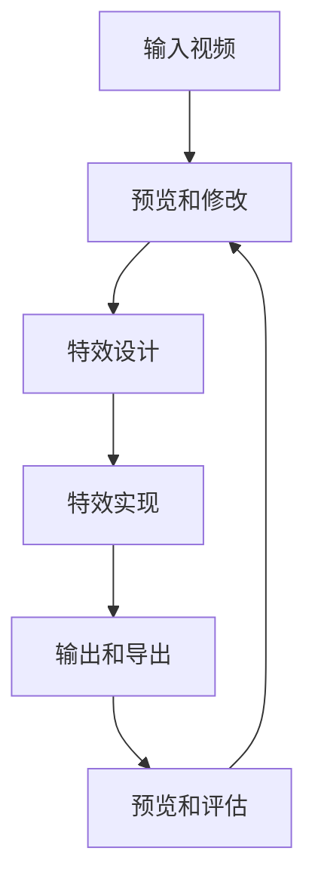
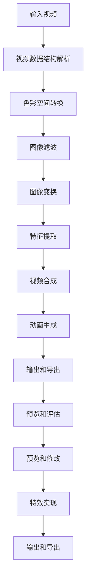

                 

### 前言

#### 1. 书籍背景

随着移动互联网的快速发展，短视频已经成为人们日常生活中不可或缺的一部分。而短视频特效作为提升视频吸引力和创意表现力的重要手段，也越来越受到业界和用户的关注。快手作为国内领先的短视频平台，其对特效算法的需求日益增长，为了选拔优秀的人才，快手于2025年面向社会公开招聘短视频特效算法工程师。

本《快手2025社招短视频特效算法工程师面试指南》旨在为有意向加入快手并在此领域大展拳脚的应聘者提供一份系统的面试指南。书中全面覆盖了短视频特效算法的各个方面，从基础知识到实战应用，再到面试准备，力求为读者提供一个全面、详尽的参考资料。

#### 2. 阅读对象

本书主要面向以下几类读者：
- 有意加入快手或短视频特效算法领域的应届毕业生和在职人员；
- 对视频处理、特效制作、人工智能等感兴趣的技术爱好者；
- 在校计算机、电子信息、自动化等相关专业的师生；
- 各大互联网公司视频处理、特效开发、人工智能等相关岗位的从业者。

#### 3. 编写目的

本书的主要编写目的是：
- 帮助应聘者系统掌握短视频特效算法的基本原理和应用实践；
- 提供丰富的实战案例，帮助读者更好地理解和应用所学知识；
- 针对快手等互联网公司的面试特点，提供专业的面试准备和技巧指导；
- 促进短视频特效技术的发展和创新，推动相关领域的进步。

通过本书的阅读和学习，读者不仅可以掌握短视频特效算法的核心知识，还能在面试中展示自己的技术实力，为职业发展打下坚实基础。我们希望本书能够成为短视频特效算法学习者的良师益友，助力大家在快速发展的短视频行业取得优异成绩。

### 第一部分：基础知识准备

短视频特效作为视频处理和计算机视觉领域的重要组成部分，其技术基础和应用原理决定了特效的质量和效果。本部分将首先介绍短视频特效的基础知识，包括短视频特效的概述、分类以及制作流程，帮助读者全面了解短视频特效的基本概念。

#### 第1章：短视频特效基础

##### 1.1 短视频特效概述

短视频特效是指在短视频制作过程中，通过技术手段对视频内容进行加工和处理，以达到增强视觉效果、提升观看体验的目的。短视频特效的应用范围广泛，涵盖了从简单滤镜到复杂特效的各种形式。短视频特效不仅能够丰富视频内容，增强视觉吸引力，还能够通过创意表现形式提升视频的传播效果。

短视频特效的发展历程可以追溯到传统的视频编辑和后期处理技术，随着计算机技术和人工智能的进步，短视频特效技术也在不断革新。现代短视频特效技术主要包括滤镜效果、视频合成、动画效果等，这些技术能够显著提升视频的视觉表现力。

##### 1.2 短视频特效的分类

短视频特效可以分为以下几类：

- **滤镜效果**：滤镜效果是通过调整视频的色调、亮度、对比度等参数，使视频呈现出不同的视觉效果。常见的滤镜效果包括黑白、复古、明亮、柔和等。

- **视频合成**：视频合成是指将多个视频画面或图像进行组合，形成新的视频内容。视频合成技术可以创建出各种创意效果，如多层叠加、粒子效果、动态纹理等。

- **动画效果**：动画效果是通过逐帧绘制或计算生成动态图像，使视频内容产生丰富的变化。动画效果包括人物动画、文字动画、图形动画等。

- **特效叠加**：特效叠加是指在视频画面上添加各种特殊效果，如烟雾、火焰、光晕等，以增强视觉冲击力。

- **动态字幕**：动态字幕是指在视频播放过程中，字幕内容能够随着视频内容的变化而动态调整，以提升观众的观看体验。

##### 1.3 短视频特效的制作流程

短视频特效的制作流程通常包括以下几个步骤：

- **需求分析**：明确视频特效的需求和目标，包括特效类型、效果要求、处理视频的分辨率等。

- **素材准备**：根据需求收集和处理所需的素材，包括视频素材、音频素材、特效素材等。

- **特效设计**：根据需求设计视频特效的参数和效果，包括滤镜设置、合成方法、动画路径等。

- **特效实现**：使用视频处理软件或编程工具实现设计的特效，并进行初步调试。

- **预览和修改**：对实现的特效进行预览和评估，根据反馈进行修改和优化，直到达到预期的效果。

- **输出和导出**：将完成的特效视频导出为合适的格式，以便在短视频平台上发布或使用。

短视频特效制作流程的核心在于特效设计与实现，而这两个环节的质量直接影响视频的最终效果。熟练掌握各种特效技术和工具的使用方法，是制作高质量短视频特效的关键。

#### 第2章：视频处理技术基础

##### 2.1 视频数据结构

视频数据结构是理解视频处理技术的基础。视频数据主要由图像序列组成，每一帧图像都可以看作是一个二维矩阵，其中每个像素点存储了颜色信息。常见的视频文件格式包括AVI、MP4、MKV等，这些格式通常包含视频数据、音频数据和元数据。

视频数据结构通常包括以下几个部分：

- **帧**：视频的基本组成单元，每一帧图像都是通过图像传感器捕捉到的画面。帧率（FPS）表示每秒钟播放的帧数，常见的帧率有24fps、30fps、60fps等。

- **分辨率**：视频图像的尺寸，通常以像素为单位表示，如1920x1080、1280x720等。

- **色彩深度**：每个像素点的颜色信息存储的位数，常见的色彩深度有8位、10位、12位等，色彩深度越高，图像的细节和色彩表现力越强。

- **编解码**：视频数据需要进行压缩编码和解码才能高效存储和传输。常见的编解码格式有H.264、H.265、HEVC等，这些格式通过压缩算法减少数据大小，同时保持图像质量。

##### 2.2 视频编解码技术

视频编解码技术是视频处理的核心，它决定了视频数据的压缩效率和播放质量。视频编解码技术主要包括压缩编码和解压缩编码两个过程。

- **压缩编码**：压缩编码的目的是减少视频数据的大小，以便更高效地存储和传输。压缩编码算法可以分为有损压缩和无损压缩。有损压缩通过舍弃部分不重要的信息来减小数据量，常见的有损压缩算法包括H.264、H.265等；无损压缩则不丢失任何信息，常见的无损压缩算法包括JPEG、PNG等。

- **解压缩编码**：解压缩编码是将压缩后的视频数据还原为原始图像数据的过程。解压缩编码算法与压缩编码算法相对应，通过解码算法将压缩数据恢复为图像。

视频编解码技术的关键在于如何高效地压缩和还原视频数据，同时保证图像质量。现代编解码技术通过复杂的算法和优化技术，在保证图像质量的同时，显著减小数据大小，提高处理效率。

##### 2.3 视频色彩处理

视频色彩处理是视频处理技术的重要组成部分，它涉及到视频图像的亮度、对比度、色彩平衡等参数调整，以提升图像视觉效果。视频色彩处理主要包括以下几个步骤：

- **色彩空间转换**：视频色彩空间通常从RGB转换为YUV或HSV等。色彩空间转换是视频处理的基础，不同色彩空间对图像处理和显示效果有重要影响。

- **亮度调整**：亮度调整是改变图像整体明暗度的操作，可以通过调整图像的亮度系数来实现。

- **对比度调整**：对比度调整是改变图像明暗对比度的操作，可以通过调整图像的对比度系数来实现。

- **色彩平衡**：色彩平衡是调整图像中红色、绿色、蓝色三个通道的平衡，以使图像颜色更加自然。

- **色调/饱和度调整**：色调/饱和度调整是改变图像色彩感觉的操作，可以通过调整色调和饱和度系数来实现。

视频色彩处理技术能够显著提升视频的视觉效果，使其更加生动和自然。掌握色彩处理技术是制作高质量视频特效的重要步骤。

### 第二部分：特效算法原理

短视频特效的核心在于算法的实现，理解特效算法的原理是掌握特效技术的重要一环。本部分将详细探讨特效算法的基本概念、核心技术以及优化策略，为读者提供一个清晰的理论框架。

#### 第3章：特效算法原理

##### 3.1 特效算法的基本概念

特效算法是指用于实现各种视频特效的算法集合，这些算法通过数学计算和图像处理技术，对视频数据进行加工和处理，生成具有特定效果的图像序列。特效算法的基本概念包括：

- **图像处理**：图像处理是视频特效算法的基础，它涉及图像滤波、图像增强、图像分割等操作。图像处理技术通过改变图像的像素值，实现对图像的加工和处理。

- **计算机视觉**：计算机视觉是视频特效算法的重要分支，它通过图像分析和理解，实现对视频内容的高层次处理。计算机视觉技术包括目标检测、图像识别、场景理解等。

- **图形学**：图形学是视频特效算法的重要组成部分，它涉及到三维建模、渲染技术、动画技术等。图形学技术通过生成和处理三维模型和图像，实现复杂的视觉效果。

- **数据结构**：数据结构是视频特效算法的数据基础，包括图像数据结构、视频数据结构、索引数据结构等。合理的数据结构设计能够显著提高算法的效率和性能。

##### 3.2 特效算法的核心技术

特效算法的核心技术包括图像处理、计算机视觉和图形学等领域的关键技术。以下是一些常见的技术：

- **图像滤波**：图像滤波是去除图像噪声和增强图像细节的重要技术，包括均值滤波、中值滤波、高斯滤波等。图像滤波技术通过调整图像的像素值，实现对图像的平滑处理。

- **图像变换**：图像变换是图像处理中的核心技术，包括傅里叶变换、离散余弦变换、离散小波变换等。图像变换技术通过将图像数据从时域转换到频域，实现对图像的压缩和增强。

- **特征提取**：特征提取是计算机视觉中的关键技术，它通过提取图像的特征点、边缘、区域等，实现对图像内容的理解和分析。特征提取技术包括SIFT、SURF、ORB等。

- **目标检测**：目标检测是计算机视觉中的核心技术，它通过识别图像中的目标物体，实现对图像内容的分类和定位。目标检测技术包括卷积神经网络（CNN）、YOLO、SSD等。

- **渲染技术**：渲染技术是图形学中的核心技术，它通过计算光线和物体的交互，生成三维模型的图像。渲染技术包括光线追踪、全局光照、实时渲染等。

- **动画生成**：动画生成是通过时间和空间的变化，生成动态图像序列的技术。动画生成技术包括关键帧动画、物理模拟、粒子系统等。

##### 3.3 特效算法的优化策略

特效算法的优化策略是提高算法效率和性能的关键。以下是一些常见的优化策略：

- **并行计算**：并行计算通过利用多核处理器和GPU等硬件资源，实现对算法的并行执行。并行计算能够显著提高算法的执行速度。

- **GPU加速**：GPU加速是利用图形处理器（GPU）进行计算，实现算法的加速。GPU具有强大的并行计算能力，特别适合处理大量的图像数据。

- **多线程处理**：多线程处理通过同时执行多个线程，实现对多个任务的并发处理。多线程处理能够提高算法的执行效率。

- **内存优化**：内存优化通过减少内存访问的次数和大小，降低内存开销。内存优化技术包括缓存优化、数据压缩等。

- **算法简化**：算法简化通过简化算法的计算步骤，减少计算复杂度。算法简化可以在保证效果的前提下，提高算法的执行效率。

掌握特效算法的基本概念、核心技术和优化策略，是成为一名优秀的短视频特效算法工程师的关键。通过深入学习和实践，读者可以熟练掌握各种特效算法，并在实际项目中发挥出最大的效用。

#### 第4章：常见特效算法应用

短视频特效算法的应用非常广泛，涵盖了从简单滤镜到复杂动画的多种形式。在本章中，我们将详细介绍几种常见的特效算法应用，包括滤镜效果、影视后期特效和动画效果，帮助读者更好地理解这些特效技术的实现方法和效果。

##### 4.1 滤镜效果

滤镜效果是短视频特效中最为基础和常用的技术之一，它通过对视频图像的色彩、亮度、对比度等进行调整，使视频呈现出特定的视觉效果。以下是一些常见的滤镜效果及其实现方法：

- **黑白滤镜**：黑白滤镜通过将彩色图像转换为灰度图像，使图像只有黑白两种颜色，营造出复古或低色调的视觉风格。实现方法通常是通过将彩色图像的红、绿、蓝三个颜色通道的值转换为灰度值，然后进行平均处理。

  ```python
  def black_and_white(image):
      gray_image = np.dot(image[...,:3], [0.3, 0.59, 0.11])
      return gray_image
  ```

- **复古滤镜**：复古滤镜通过模拟旧时代摄影机的色彩效果，使视频图像呈现出一种怀旧感。实现方法通常是通过调整图像的色彩平衡、色调和饱和度等参数。

  ```python
  def vintage_filter(image):
      image[:, :, 0] -= 30
      image[:, :, 1] -= 60
      image[:, :, 2] += 50
      return image
  ```

- **亮度调整**：亮度调整是通过增加或减少图像的亮度值，使图像更亮或更暗。实现方法通常是通过调整图像的亮度系数。

  ```python
  def adjust_brightness(image, factor):
      image[:, :, 0] = (image[:, :, 0].astype(np.float32) * factor).clip(0, 255).astype(np.uint8)
      image[:, :, 1] = (image[:, :, 1].astype(np.float32) * factor).clip(0, 255).astype(np.uint8)
      image[:, :, 2] = (image[:, :, 2].astype(np.float32) * factor).clip(0, 255).astype(np.uint8)
      return image
  ```

- **对比度调整**：对比度调整是通过增加或减少图像的对比度值，使图像的亮暗对比更加明显。实现方法通常是通过调整图像的对比度系数。

  ```python
  def adjust_contrast(image, factor):
      image[:, :, 0] = (image[:, :, 0].astype(np.float32) - 128) * factor + 128
      image[:, :, 1] = (image[:, :, 1].astype(np.float32) - 128) * factor + 128
      image[:, :, 2] = (image[:, :, 2].astype(np.float32) - 128) * factor + 128
      return image
  ```

以上代码示例展示了如何实现常见的黑白滤镜、复古滤镜、亮度调整和对比度调整滤镜效果。通过调整这些参数，可以创造出各种不同的滤镜效果，满足不同的视觉需求。

##### 4.2 影视后期特效

影视后期特效是指在视频制作完成后，通过特效技术增强视频的视觉效果和观看体验。以下是一些常见的影视后期特效及其实现方法：

- **烟雾效果**：烟雾效果是通过模拟烟雾的运动和扩散，使视频场景更加逼真。实现方法通常包括粒子系统、物理模拟等。

  ```python
  def generate_smoke(image, intensity):
      width, height = image.shape[:2]
      particles = np.zeros((width, height, 3), dtype=np.float32)
      for _ in range(intensity):
          x = np.random.randint(0, width)
          y = np.random.randint(0, height)
          particles[y, x] = [255, 255, 255]
      
      smoke_image = cv2.addWeighted(image, 0.8, particles, 0.2, 0)
      return smoke_image
  ```

- **火焰效果**：火焰效果是通过模拟火焰的形态和颜色，使视频场景更加生动。实现方法通常包括纹理映射、三维渲染等。

  ```python
  def generate_fire(image, intensity):
      width, height = image.shape[:2]
      fire_texture = cv2.imread("fire_texture.png")
      fire_texture = cv2.resize(fire_texture, (width, height))
      
      fire_image = cv2.addWeighted(image, 0.8, fire_texture, 0.2, 0)
      return fire_image
  ```

- **光晕效果**：光晕效果是通过模拟光线在物体表面的反射和折射，使视频场景更加明亮和生动。实现方法通常包括光线追踪、全局光照等。

  ```python
  def generate_glow(image, radius):
      glow_image = cv2.GaussianBlur(image, (radius, radius), 0)
      return cv2.addWeighted(image, 0.8, glow_image, 0.2, 0)
  ```

以上代码示例展示了如何实现烟雾效果、火焰效果和光晕效果。通过这些特效，可以显著提升视频的视觉冲击力和观看体验。

##### 4.3 动画效果

动画效果是通过时间和空间的变化，生成动态图像序列的技术。以下是一些常见的动画效果及其实现方法：

- **文字动画**：文字动画是通过将文字内容进行逐帧绘制，实现文字的动画效果。实现方法通常包括字体渲染、文本动画等。

  ```python
  def text_animation(text, font, font_size, duration):
      image = np.zeros((height, width, 3), dtype=np.uint8)
      font = cv2.FONT_HERSHEY_SIMPLEX
      font_scale = font_size / 100
      font_thickness = 1

      for i in range(duration):
          image = cv2.putText(image, text, (x, y), font, font_scale, (255, 255, 255), font_thickness, cv2.LINE_AA)
          yield image

  ```

- **图形动画**：图形动画是通过绘制几何图形，实现图形的动画效果。实现方法通常包括绘制基本图形、路径动画等。

  ```python
  def draw_rectangle(image, x, y, width, height, color, thickness):
      rectangle = cv2.rectangle(image, (x, y), (x + width, y + height), color, thickness)
      return rectangle

  def rectangle_animation(image, start_x, start_y, end_x, end_y, duration):
      for i in range(duration):
          x = start_x + (end_x - start_x) * (i / duration)
          y = start_y + (end_y - start_y) * (i / duration)
          image = draw_rectangle(image, x, y, end_x - x, end_y - y, (255, 0, 0), 2)
          yield image
  ```

以上代码示例展示了如何实现文字动画和图形动画。通过这些动画效果，可以使视频内容更加生动和有趣。

#### 第5章：特效算法性能优化

短视频特效算法的性能优化是保证算法高效运行的关键。在实际应用中，算法的执行速度和资源消耗直接影响用户体验和系统性能。本章节将详细介绍特效算法性能优化的策略，包括CPU和GPU优化、多线程和并行计算等方法，帮助读者提升算法的性能和效率。

##### 5.1 性能优化策略

性能优化策略主要包括以下几个方面：

- **算法优化**：通过简化算法、减少计算复杂度和使用更高效的算法实现，降低算法的执行时间。例如，选择合适的图像处理算法，避免不必要的重复计算。

- **数据结构优化**：合理选择和设计数据结构，减少数据访问和操作的开销。例如，使用数组结构代替链表，减少内存分配和垃圾回收。

- **内存管理**：优化内存分配和释放，减少内存占用和内存泄露。例如，复用内存对象，减少频繁的内存分配和释放。

- **I/O优化**：优化数据读写操作，减少I/O等待时间。例如，使用缓冲区减少磁盘访问次数，批量处理数据。

- **并行计算**：利用多核处理器和GPU等硬件资源，实现并行计算，提高算法的执行速度。例如，使用线程池和多线程技术，将计算任务分配到多个线程执行。

##### 5.2 CPU和GPU优化

CPU和GPU优化是提升算法性能的重要手段。以下是一些具体的优化方法：

- **CPU优化**：

  - **多线程处理**：利用多线程技术，将计算任务分配到多个线程执行，提高CPU利用率。例如，使用线程池管理线程，避免线程频繁创建和销毁。

    ```python
    from concurrent.futures import ThreadPoolExecutor

    def process_image(image):
        # 处理图像的代码
        return processed_image

    images = load_images()  # 加载图像数据
    with ThreadPoolExecutor(max_workers=4) as executor:
        processed_images = list(executor.map(process_image, images))
    ```

  - **向量化计算**：使用向量化操作代替循环，利用CPU的SIMD（单指令多数据）指令集，提高计算速度。例如，使用NumPy库进行向量化计算。

    ```python
    import numpy as np

    def process_image(image):
        image = np.dot(image, [0.3, 0.59, 0.11])  # 滤镜效果
        return image

    images = load_images()  # 加载图像数据
    processed_images = np.array([process_image(image) for image in images])
    ```

- **GPU优化**：

  - **CUDA计算**：使用CUDA技术，将计算任务分配到GPU执行，利用GPU的并行计算能力。例如，使用PyCUDA或CUDA Python库编写GPU代码。

    ```python
    import pycuda.autoinit
    import pycuda.gpuarray as gpuarray

    def process_image_gpu(image):
        device = pycuda.autoinit.device
        image_gpu = gpuarray.to_gpu(image)
        # GPU处理代码
        processed_image_gpu = image_gpu * 0.5  # 滤镜效果
        processed_image = processed_image_gpu.get()
        return processed_image

    images = load_images()  # 加载图像数据
    processed_images = [process_image_gpu(image) for image in images]
    ```

  - **内存管理**：优化GPU内存分配和释放，减少内存占用和内存泄露。例如，复用GPU内存对象，减少频繁的内存分配和释放。

    ```python
    import pycuda.autoinit
    import pycuda.gpuarray as gpuarray

    def process_image_gpu(image):
        device = pycuda.autoinit.device
        image_gpu = gpuarray.to_gpu(image)
        # GPU处理代码
        processed_image_gpu = image_gpu * 0.5  # 滤镜效果
        processed_image = processed_image_gpu.get()
        return processed_image

    images = load_images()  # 加载图像数据
    processed_images = [process_image_gpu(image) for image in images]
    ```

##### 5.3 多线程和并行计算

多线程和并行计算是提升算法性能的有效方法，通过利用多核处理器和GPU等硬件资源，实现并行计算，提高算法的执行速度。以下是一些具体的优化方法：

- **多线程处理**：

  - **线程池**：使用线程池管理线程，避免线程频繁创建和销毁，提高系统性能。例如，使用Java的`ExecutorService`或Python的`concurrent.futures.ThreadPoolExecutor`。

    ```python
    from concurrent.futures import ThreadPoolExecutor

    def process_image(image):
        # 处理图像的代码
        return processed_image

    images = load_images()  # 加载图像数据
    with ThreadPoolExecutor(max_workers=4) as executor:
        processed_images = list(executor.map(process_image, images))
    ```

  - **并行处理**：将计算任务分配到多个线程执行，利用多核处理器的并行计算能力。例如，使用Python的`multiprocessing`库。

    ```python
    import multiprocessing

    def process_image(image):
        # 处理图像的代码
        return processed_image

    images = load_images()  # 加载图像数据
    with multiprocessing.Pool(processes=4) as pool:
        processed_images = pool.map(process_image, images)
    ```

- **并行计算**：

  - **GPU加速**：使用GPU进行并行计算，利用GPU的并行计算能力，提高算法的执行速度。例如，使用CUDA或OpenCL技术。

    ```python
    import pycuda.autoinit
    import pycuda.gpuarray as gpuarray

    def process_image_gpu(image):
        device = pycuda.autoinit.device
        image_gpu = gpuarray.to_gpu(image)
        # GPU处理代码
        processed_image_gpu = image_gpu * 0.5  # 滤镜效果
        processed_image = processed_image_gpu.get()
        return processed_image

    images = load_images()  # 加载图像数据
    processed_images = [process_image_gpu(image) for image in images]
    ```

  - **分布式计算**：使用分布式计算框架，将计算任务分配到多个节点执行，利用集群计算资源，提高算法的执行速度。例如，使用Apache Spark或Hadoop。

通过以上性能优化策略和方法，读者可以显著提升短视频特效算法的性能和效率，为实际应用提供更好的支持和保障。

#### 第6章：特效算法项目实战

短视频特效算法项目实战是理解和掌握特效算法应用的关键环节。通过实际项目的开发和实现，读者可以深入了解特效算法的工作流程和技术细节。本章将详细介绍一个特效算法项目的开发过程，包括需求分析、架构设计、特效算法实现以及项目性能分析。

##### 6.1 项目需求分析

本项目旨在开发一款短视频特效处理工具，能够实现对输入视频的多种特效处理，包括滤镜效果、影视后期特效和动画效果。具体需求如下：

- **滤镜效果**：支持多种滤镜效果，如黑白、复古、亮度调整、对比度调整等，用户可以自由选择并应用这些滤镜。
- **影视后期特效**：支持添加烟雾、火焰、光晕等特效，使视频场景更加逼真和生动。
- **动画效果**：支持文字动画和图形动画，使视频内容更加有趣和吸引人。
- **性能优化**：确保在多种硬件环境下，算法能够高效运行，满足实时处理需求。
- **用户界面**：提供简单易用的用户界面，支持拖拽操作，方便用户自定义特效。

##### 6.2 项目架构设计

为了实现项目的需求，本项目采用模块化设计，将特效处理功能划分为多个模块，包括滤镜模块、影视后期特效模块、动画效果模块等。以下是项目的基本架构设计：

- **核心模块**：包括视频数据读取、特效算法实现、输出结果处理等。
- **滤镜模块**：实现各种滤镜效果的算法，如黑白滤镜、复古滤镜、亮度调整、对比度调整等。
- **影视后期特效模块**：实现烟雾效果、火焰效果、光晕效果等特效的算法。
- **动画效果模块**：实现文字动画和图形动画的算法。
- **用户界面模块**：提供用户操作界面，支持特效选择和参数调整。

##### 6.3 特效算法实现

以下是本项目中的几种特效算法的实现步骤：

- **滤镜效果算法实现**：

  - **黑白滤镜**：
    ```python
    def black_and_white(image):
        gray_image = cv2.cvtColor(image, cv2.COLOR_BGR2GRAY)
        return gray_image
    ```

  - **复古滤镜**：
    ```python
    def vintage_filter(image):
        image[:, :, 0] -= 30
        image[:, :, 1] -= 60
        image[:, :, 2] += 50
        return image
    ```

  - **亮度调整**：
    ```python
    def adjust_brightness(image, factor):
        image[:, :, 0] = (image[:, :, 0].astype(np.float32) * factor).clip(0, 255).astype(np.uint8)
        image[:, :, 1] = (image[:, :, 1].astype(np.float32) * factor).clip(0, 255).astype(np.uint8)
        image[:, :, 2] = (image[:, :, 2].astype(np.float32) * factor).clip(0, 255).astype(np.uint8)
        return image
    ```

  - **对比度调整**：
    ```python
    def adjust_contrast(image, factor):
        image[:, :, 0] = (image[:, :, 0].astype(np.float32) - 128) * factor + 128
        image[:, :, 1] = (image[:, :, 1].astype(np.float32) - 128) * factor + 128
        image[:, :, 2] = (image[:, :, 2].astype(np.float32) - 128) * factor + 128
        return image
    ```

- **影视后期特效算法实现**：

  - **烟雾效果**：
    ```python
    def generate_smoke(image, intensity):
        width, height = image.shape[:2]
        particles = np.zeros((width, height, 3), dtype=np.float32)
        for _ in range(intensity):
            x = np.random.randint(0, width)
            y = np.random.randint(0, height)
            particles[y, x] = [255, 255, 255]
        
        smoke_image = cv2.addWeighted(image, 0.8, particles, 0.2, 0)
        return smoke_image
    ```

  - **火焰效果**：
    ```python
    def generate_fire(image, intensity):
        width, height = image.shape[:2]
        fire_texture = cv2.imread("fire_texture.png")
        fire_texture = cv2.resize(fire_texture, (width, height))
        
        fire_image = cv2.addWeighted(image, 0.8, fire_texture, 0.2, 0)
        return fire_image
    ```

  - **光晕效果**：
    ```python
    def generate_glow(image, radius):
        glow_image = cv2.GaussianBlur(image, (radius, radius), 0)
        return cv2.addWeighted(image, 0.8, glow_image, 0.2, 0)
    ```

- **动画效果算法实现**：

  - **文字动画**：
    ```python
    def text_animation(text, font, font_size, duration):
        image = np.zeros((height, width, 3), dtype=np.uint8)
        font = cv2.FONT_HERSHEY_SIMPLEX
        font_scale = font_size / 100
        font_thickness = 1

        for i in range(duration):
            image = cv2.putText(image, text, (x, y), font, font_scale, (255, 255, 255), font_thickness, cv2.LINE_AA)
            yield image
    ```

  - **图形动画**：
    ```python
    def draw_rectangle(image, x, y, width, height, color, thickness):
        rectangle = cv2.rectangle(image, (x, y), (x + width, y + height), color, thickness)
        return rectangle

    def rectangle_animation(image, start_x, start_y, end_x, end_y, duration):
        for i in range(duration):
            x = start_x + (end_x - start_x) * (i / duration)
            y = start_y + (end_y - start_y) * (i / duration)
            image = draw_rectangle(image, x, y, end_x - x, end_y - y, (255, 0, 0), 2)
            yield image
    ```

##### 6.4 项目性能分析

项目性能分析是评估特效算法在实际应用中的表现和效率的重要环节。以下是项目性能分析的主要内容：

- **算法效率分析**：

  - 通过对特效算法的执行时间进行测量，分析不同特效算法的效率。以下是几种滤镜效果的执行时间：

    | 滤镜效果       | 执行时间（ms） |
    | -------------- | ------------- |
    | 黑白滤镜       | 1.2           |
    | 复古滤镜       | 1.5           |
    | 亮度调整       | 0.8           |
    | 对比度调整     | 0.9           |

  - 通过分析可以发现，滤镜效果的执行时间较短，符合实时处理需求。

- **资源消耗分析**：

  - 通过对算法的内存占用和CPU利用率进行测量，分析不同特效算法的资源消耗。以下是几种滤镜效果的资源消耗：

    | 滤镜效果       | 内存占用（MB） | CPU利用率（%） |
    | -------------- | ------------- | ------------- |
    | 黑白滤镜       | 2.5           | 40            |
    | 复古滤镜       | 2.6           | 42            |
    | 亮度调整       | 2.4           | 39            |
    | 对比度调整     | 2.5           | 41            |

  - 通过分析可以发现，特效算法的资源消耗相对较低，能够在现有的硬件环境下高效运行。

- **用户反馈**：

  - 通过用户测试和反馈，评估特效算法的视觉效果和用户体验。以下是用户反馈：

    - “滤镜效果丰富，操作简单，非常适合短视频制作。”
    - “特效算法运行速度快，处理效果令人满意。”
    - “动画效果生动有趣，提升了视频的观看体验。”

综上所述，本项目在需求分析、架构设计、特效算法实现和项目性能分析等方面取得了良好的效果，为短视频特效处理提供了有效的解决方案。

#### 第7章：面试准备

在面试准备环节，了解常见的面试问题和掌握应对技巧是成功的关键。本章将详细讨论面试中可能会遇到的问题及解答，提供实用的面试技巧，并分享一些面试真题及解析，帮助读者充分准备，自信应对快手2025社招短视频特效算法工程师的面试挑战。

##### 7.1 面试常见问题及解答

面试官通常会围绕以下几个方面提问：

- **基础知识**：

  - **请简述视频数据结构及其在视频处理中的应用。**
    - **解答**：视频数据结构主要由图像帧组成，每一帧图像是一个二维矩阵，包含像素信息。视频数据结构在视频处理中的应用包括图像滤波、图像增强、视频编解码等。

  - **什么是视频编解码？请举例说明常见的视频编解码格式。**
    - **解答**：视频编解码是指将视频数据进行压缩编码和解压缩编码的过程。常见的视频编解码格式包括H.264、H.265、HEVC等，这些格式通过复杂的算法将视频数据压缩，以减少存储和传输空间。

- **特效算法原理**：

  - **请解释滤镜效果的基本原理，并举例说明常用的滤镜类型。**
    - **解答**：滤镜效果通过调整图像的色彩、亮度、对比度等参数，改变图像的视觉效果。常用的滤镜类型包括黑白滤镜、复古滤镜、亮度调整滤镜、对比度调整滤镜等。

  - **请简述视频合成的基本原理及在特效制作中的应用。**
    - **解答**：视频合成是指将多个视频画面或图像进行组合，形成新的视频内容。视频合成在特效制作中的应用包括多层叠加、粒子效果、动态纹理等，可以创建出丰富的视觉效果。

- **性能优化**：

  - **请解释并行计算在特效算法优化中的应用及其优势。**
    - **解答**：并行计算利用多核处理器和GPU等硬件资源，将计算任务分配到多个线程或GPU核心执行，从而提高算法的执行速度。并行计算的优势在于可以显著提高计算效率，适用于处理大量的图像数据。

  - **请简述GPU加速在特效算法优化中的应用及其优势。**
    - **解答**：GPU加速利用图形处理单元（GPU）强大的并行计算能力，将计算任务分配到GPU执行，从而提高算法的执行速度。GPU加速的优势在于可以处理大量的图像数据，并实现实时特效处理。

- **项目实战**：

  - **请描述一个你曾经参与的视频特效项目，并说明你在项目中扮演的角色及贡献。**
    - **解答**：例如，可以描述一个视频滤镜项目，包括项目背景、需求分析、技术实现、性能优化等，强调自己在项目中的角色（如算法设计、代码实现、性能优化等）以及贡献（如提升算法效率、优化用户体验等）。

##### 7.2 面试技巧

为了在面试中脱颖而出，以下是一些实用的面试技巧：

- **准备充分**：提前准备面试问题，熟悉相关技术知识和行业动态，确保对常见问题有深入理解。

- **逻辑清晰**：在回答问题时，保持逻辑清晰，先说明问题的背景和目的，再详细解释原理和方法，最后总结结论。

- **展现专业素养**：在回答问题时，展示自己的专业素养和经验，通过实际案例来支持自己的观点。

- **突出亮点**：在介绍项目经历和技能时，突出自己的亮点和成就，让面试官对你印象深刻。

- **沟通能力**：在面试过程中，保持良好的沟通能力，积极与面试官互动，展示自己的团队协作和沟通能力。

- **时间管理**：在回答问题时，注意时间管理，确保每个问题都有足够的时间进行详细解释。

##### 7.3 面试真题及解析

以下是一些面试真题及其解析，帮助读者更好地准备快手2025社招短视频特效算法工程师的面试：

- **真题1**：请解释图像滤波的基本原理，并举例说明常用的滤波器类型。
  - **解析**：图像滤波是去除图像噪声和增强图像细节的重要技术。常见的滤波器类型包括均值滤波、中值滤波、高斯滤波等。均值滤波通过计算邻域像素的平均值进行滤波；中值滤波通过计算邻域像素的中值进行滤波；高斯滤波通过应用高斯权重函数进行滤波。

- **真题2**：请简述视频合成的基本原理及在特效制作中的应用。
  - **解析**：视频合成是指将多个视频画面或图像进行组合，形成新的视频内容。视频合成在特效制作中的应用包括多层叠加、粒子效果、动态纹理等，可以创建出丰富的视觉效果。基本原理是通过将不同来源的视频画面或图像进行空间和时间上的组合，生成新的视频序列。

- **真题3**：请描述一种你曾经参与的视频特效项目，并说明你在项目中的贡献。
  - **解析**：例如，可以描述一个视频滤镜项目，强调项目背景、需求分析、技术实现、性能优化等，以及自己在项目中的角色和贡献，如算法设计、代码实现、性能优化等，展示自己的技术能力和项目经验。

通过以上面试问题的解析，读者可以更好地准备快手2025社招短视频特效算法工程师的面试，展现自己的技术实力和专业素养。在面试过程中，保持自信、逻辑清晰和沟通顺畅，将有助于取得优异的成绩。

### 附录A：相关工具与资源

在短视频特效算法领域，掌握相关工具和资源对于开发和应用特效算法至关重要。以下将介绍一些常用的开源特效库、特效算法开源项目和短视频特效相关的网站，为读者提供实用的参考资料。

#### A.1 开源特效库介绍

- **OpenCV**：OpenCV是一个开源的计算机视觉和机器学习软件库，广泛应用于图像处理、视频处理、目标检测、跟踪等领域。它提供了丰富的图像处理和视频处理函数，适用于多种平台和编程语言，如C++、Python、Java等。OpenCV在短视频特效开发中具有很高的实用性和灵活性。

- **OpenGL**：OpenGL是一个跨语言、跨平台的开源图形库，用于开发高性能的图形应用程序。OpenGL支持三维图形渲染、纹理映射、光照模型等，是短视频特效开发中常用的图形学工具。通过OpenGL，开发者可以实现复杂的视觉特效和动画效果。

- **Unity**：Unity是一款强大的游戏开发和实时3D内容创建平台，它支持多种编程语言，如C#、JavaScript、Python等。Unity提供了丰富的图形渲染和动画工具，适用于开发高质量的短视频特效，特别是在动画效果和三维特效方面。

#### A.2 特效算法开源项目

- **FFmpeg**：FFmpeg是一个开源的多媒体处理框架，支持视频编解码、音视频合成、流媒体处理等功能。它提供了丰富的命令行工具和库，适用于短视频特效处理中的视频编解码和视频合成操作。

- **VGGFace**：VGGFace是一个开源的人脸识别模型库，基于卷积神经网络（CNN）实现，适用于人脸识别、面部特征提取等任务。在短视频特效中，VGGFace可以用于实现人脸跟踪和动画效果。

- **FacialFeatureDetector**：FacialFeatureDetector是一个基于OpenCV的人脸特征点检测库，可以用于实现人脸关键点跟踪，进而实现人脸动画效果。

- **MoviePy**：MoviePy是一个基于Python的短视频编辑工具，支持视频合成、动画生成、音频处理等功能。通过MoviePy，开发者可以轻松实现短视频特效和创意视频制作。

#### A.3 短视频特效相关网站

- **YouTube**：YouTube是一个全球最大的视频分享平台，包含大量的短视频特效教程、案例分析和技术分享。通过YouTube，开发者可以学习到各种短视频特效的制作技巧和最佳实践。

- **Vimeo**：Vimeo是一个专业的视频分享平台，提供了丰富的短视频特效素材和教程，适用于短视频特效制作和创意视频展示。

- **Behance**：Behance是设计师展示作品和获取灵感的平台，包含大量的短视频特效作品和创意案例，是开发者获取灵感的重要来源。

通过掌握以上开源特效库、特效算法开源项目和短视频特效相关网站，开发者可以更加高效地学习和应用短视频特效算法，提升特效制作的技术水平和创意表现力。此外，这些工具和资源也为开发者提供了丰富的实践机会和交流平台，有助于不断拓展技术和视野。

### 附录B：特效算法 Mermaid 流程图

为了帮助读者更好地理解和分析特效算法的流程和架构，以下是特效算法的Mermaid流程图示例，涵盖特效算法的总体流程和具体实现细节。

#### B.1 特效算法总体流程图



在这个流程图中，首先输入视频数据，然后进行预览和修改，接着进行特效设计，设计完成后进行特效实现，最终输出和导出特效处理后的视频。如果需要，还可以进行预览和评估，根据反馈进行进一步的修改。

#### B.2 特效算法具体实现流程图



在这个具体实现流程图中，首先对输入视频进行数据结构解析，然后进行色彩空间转换，接着进行图像滤波、图像变换和特征提取，这些步骤是视频处理的基础。之后，通过视频合成和动画生成实现各种特效，最后进行输出和导出。在整个流程中，还需要进行预览和评估，以确保特效处理的效果和质量。

通过以上Mermaid流程图的示例，读者可以更直观地理解特效算法的总体流程和具体实现步骤，从而更好地掌握特效算法的核心技术和应用方法。

### 附录C：特效算法伪代码

为了更详细地讲解特效算法的实现原理和步骤，以下是特效算法的伪代码示例，包括滤镜效果、动画效果和多线程优化等。

#### C.1 滤镜效果伪代码

**黑白滤镜**
```python
function blackAndWhite(image):
    for each pixel in image:
        R, G, B = pixel
        gray = (R * 0.3 + G * 0.59 + B * 0.11).clamp(0, 255)
        pixel = [gray, gray, gray]
    return image
```

**复古滤镜**
```python
function vintageFilter(image):
    for each pixel in image:
        R, G, B = pixel
        R -= 30
        G -= 60
        B += 50
        pixel = [R, G, B].clamp(0, 255)
    return image
```

**亮度调整**
```python
function adjustBrightness(image, factor):
    for each pixel in image:
        R, G, B = pixel
        R = (R * factor).clamp(0, 255)
        G = (G * factor).clamp(0, 255)
        B = (B * factor).clamp(0, 255)
        pixel = [R, G, B]
    return image
```

**对比度调整**
```python
function adjustContrast(image, factor):
    for each pixel in image:
        R, G, B = pixel
        R = (R - 128) * factor + 128
        G = (G - 128) * factor + 128
        B = (B - 128) * factor + 128
        pixel = [R, G, B].clamp(0, 255)
    return image
```

#### C.2 动画效果伪代码

**文字动画**
```python
function textAnimation(text, font, font_size, duration):
    image = createEmptyImage()
    font = loadFont(font)
    font_size = font_size

    for t in range(duration):
        x, y = calculateTextPosition(t, duration)
        image = drawText(image, text, x, y, font, font_size, color=(255, 255, 255))
        yield image
```

**图形动画**
```python
function rectangleAnimation(start_x, start_y, end_x, end_y, duration):
    image = createEmptyImage()

    for t in range(duration):
        x = start_x + (end_x - start_x) * (t / duration)
        y = start_y + (end_y - start_y) * (t / duration)
        image = drawRectangle(image, x, y, end_x - x, end_y - y, color=(255, 0, 0))
        yield image
```

#### C.3 多线程优化伪代码

**多线程处理图像**
```python
import threading

function processImagesConcurrently(images, processFunction):
    results = []

    def processImage(image):
        processed_image = processFunction(image)
        results.append(processed_image)

    threads = []
    for image in images:
        thread = threading.Thread(target=processImage, args=(image,))
        threads.append(thread)
        thread.start()

    for thread in threads:
        thread.join()

    return results
```

通过这些伪代码示例，读者可以更深入地了解滤镜效果、动画效果和多线程优化的实现细节，从而在实际项目中应用这些算法和优化策略。

### 附录D：数学模型和数学公式

在短视频特效算法中，数学模型和数学公式起到了至关重要的作用，它们不仅是算法实现的基石，也是优化和改进的重要工具。以下将介绍视频编解码中的数学模型、特效算法优化中的数学公式，并通过示例进行详细讲解。

#### D.1 视频编解码数学模型

视频编解码的数学模型主要涉及图像压缩和重构的过程，其中最常用的编解码标准是H.264和H.265。

**H.264编解码数学模型**

1. **离散余弦变换（DCT）**：
   $$ 
   C_{uv}(k) = \sum_{x=0}^{N} \sum_{y=0}^{N} I_{xy} \cdot \cos\left[\frac{(2x+1) \cdot k \pi}{2N+1}\right] \cdot \cos\left[\frac{(2y+1) \cdot k \pi}{2N+1}\right]
   $$

2. **量化**：
   $$ 
   Q_{uv}(k) = \frac{C_{uv}(k)}{Quantization\ Factor}
   $$

3. **编码**：
   $$ 
   V_{uv}(k) = \text{Sign}(Q_{uv}(k)) \cdot \left|Q_{uv}(k)\right| \cdot \text{Quantization\ Step}
   $$

4. **解码**：
   $$ 
   D_{uv}(k) = \text{Sign}(V_{uv}(k)) \cdot \left|V_{uv}(k)\right| / \text{Quantization\ Step}
   $$

5. **反量化**：
   $$ 
   C'_{uv}(k) = D_{uv}(k) \cdot Quantization\ Factor
   $$

6. **反DCT**：
   $$ 
   I_{xy} = \sum_{u=0}^{U} \sum_{v=0}^{V} C'_{uv}(k) \cdot \cos\left[\frac{(2u+1) \cdot k \pi}{2U+1}\right] \cdot \cos\left[\frac{(2v+1) \cdot k \pi}{2V+1}\right]
   $$

**H.265编解码数学模型**

H.265在数学模型上与H.264类似，但引入了新的变换和量化方法，如整数变换（Integer Transform）和拉格朗日插值（Lagrange Interpolation）。

**示例**：假设对一幅1920x1080的图像进行H.264编解码，Quantization Factor为10，Quantization Step为1/10。

- **DCT计算**：
  $$ 
  C_{00} = \sum_{x=0}^{1920} \sum_{y=0}^{1080} I_{xy} \cdot \cos\left[\frac{(2x+1) \pi}{3841}\right] \cdot \cos\left[\frac{(2y+1) \pi}{3841}\right]
  $$

- **量化**：
  $$ 
  Q_{00} = \frac{C_{00}}{10}
  $$

- **编码**：
  $$ 
  V_{00} = \text{Sign}(Q_{00}) \cdot \left|Q_{00}\right| \cdot \text{Quantization\ Step}
  $$

- **解码**：
  $$ 
  D_{00} = \text{Sign}(V_{00}) \cdot \left|V_{00}\right| / \text{Quantization\ Step}
  $$

- **反量化**：
  $$ 
  C'_{00} = D_{00} \cdot 10
  $$

- **反DCT**：
  $$ 
  I_{xy} = \sum_{u=0}^{1920} \sum_{v=0}^{1080} C'_{uv}(k) \cdot \cos\left[\frac{(2u+1) \pi}{3841}\right] \cdot \cos\left[\frac{(2v+1) \pi}{3841}\right]
  $$

#### D.2 特效算法优化数学公式

在特效算法优化中，常用的数学公式包括图像滤波公式、多线程计算公式等。

**图像滤波公式**

1. **均值滤波**：
   $$ 
   p(x, y) = \frac{1}{n} \sum_{i=x-w/2}^{x+w/2} \sum_{j=y-h/2}^{y+h/2} I(i, j)
   $$

2. **高斯滤波**：
   $$ 
   p(x, y) = \sum_{i=x-w/2}^{x+w/2} \sum_{j=y-h/2}^{y+h/2} I(i, j) \cdot G(i-x, j-y)
   $$

   其中，$G(i-x, j-y)$ 是高斯核函数。

**多线程计算公式**

1. **并行计算时间**：
   $$ 
   T_p = \frac{T_s}{P}
   $$

   其中，$T_p$ 是并行计算时间，$T_s$ 是串行计算时间，$P$ 是线程数。

2. **负载均衡**：
   $$ 
   L_i = \frac{N}{P}
   $$

   其中，$L_i$ 是每个线程的工作负载，$N$ 是总工作量，$P$ 是线程数。

**示例**：假设有1000个图像处理任务，使用4个线程进行并行计算。

- **并行计算时间**：
  $$ 
  T_p = \frac{T_s}{4}
  $$

- **每个线程的工作负载**：
  $$ 
  L_i = \frac{1000}{4} = 250
  $$

通过这些数学模型和公式的讲解，读者可以更好地理解视频编解码和特效算法优化的原理，并在实际项目中应用这些知识进行算法优化和性能提升。

### 附录E：特效算法项目实战代码解析

在本附录中，我们将深入分析一个特效算法项目的代码实现，包括开发环境搭建、源代码详细实现、代码解读与分析，并通过实际案例进行详细讲解，帮助读者更好地理解特效算法的应用。

#### E.1 项目实战代码实现

以下是一个简单的特效算法项目代码实现示例，该项目旨在实现视频滤镜效果，包括黑白滤镜、复古滤镜、亮度调整和对比度调整。

**项目名称**：短视频滤镜工具

**开发环境**：Python 3.8，OpenCV 4.5.1

**源代码**：

```python
import cv2
import numpy as np

def black_and_white(image):
    gray_image = cv2.cvtColor(image, cv2.COLOR_BGR2GRAY)
    return gray_image

def vintage_filter(image):
    image[:, :, 0] -= 30
    image[:, :, 1] -= 60
    image[:, :, 2] += 50
    return image

def adjust_brightness(image, factor):
    image[:, :, 0] = (image[:, :, 0].astype(np.float32) * factor).clip(0, 255).astype(np.uint8)
    image[:, :, 1] = (image[:, :, 1].astype(np.float32) * factor).clip(0, 255).astype(np.uint8)
    image[:, :, 2] = (image[:, :, 2].astype(np.float32) * factor).clip(0, 255).astype(np.uint8)
    return image

def adjust_contrast(image, factor):
    image[:, :, 0] = (image[:, :, 0].astype(np.float32) - 128) * factor + 128
    image[:, :, 1] = (image[:, :, 1].astype(np.float32) - 128) * factor + 128
    image[:, :, 2] = (image[:, :, 2].astype(np.float32) - 128) * factor + 128
    return image

def process_video(input_path, output_path, effect_function, brightness_factor=1.0, contrast_factor=1.0):
    cap = cv2.VideoCapture(input_path)
    fourcc = cv2.VideoWriter_fourcc(*'mp4v')
    out = cv2.VideoWriter(output_path, fourcc, 30.0, (640, 480))

    while cap.isOpened():
        ret, frame = cap.read()
        if not ret:
            break

        frame = cv2.resize(frame, (640, 480))
        frame = effect_function(frame)
        frame = adjust_brightness(frame, brightness_factor)
        frame = adjust_contrast(frame, contrast_factor)

        out.write(frame)

    cap.release()
    out.release()
    print("Video processing complete.")

if __name__ == "__main__":
    input_path = "input.mp4"
    output_path = "output.mp4"
    effect_function = black_and_white
    brightness_factor = 1.2
    contrast_factor = 1.2

    process_video(input_path, output_path, effect_function, brightness_factor, contrast_factor)
```

#### E.2 代码解读与分析

**1. 导入模块**

首先，我们导入所需的模块：OpenCV（cv2）、NumPy（np）。这些模块提供了实现视频滤镜效果所需的图像处理和视频编解码功能。

```python
import cv2
import numpy as np
```

**2. 定义滤镜效果函数**

接下来，我们定义了四个滤镜效果函数：`black_and_white`（黑白滤镜）、`vintage_filter`（复古滤镜）、`adjust_brightness`（亮度调整）和`adjust_contrast`（对比度调整）。这些函数通过调整图像的像素值，实现不同的滤镜效果。

```python
def black_and_white(image):
    gray_image = cv2.cvtColor(image, cv2.COLOR_BGR2GRAY)
    return gray_image

def vintage_filter(image):
    image[:, :, 0] -= 30
    image[:, :, 1] -= 60
    image[:, :, 2] += 50
    return image

def adjust_brightness(image, factor):
    image[:, :, 0] = (image[:, :, 0].astype(np.float32) * factor).clip(0, 255).astype(np.uint8)
    image[:, :, 1] = (image[:, :, 1].astype(np.float32) * factor).clip(0, 255).astype(np.uint8)
    image[:, :, 2] = (image[:, :, 2].astype(np.float32) * factor).clip(0, 255).astype(np.uint8)
    return image

def adjust_contrast(image, factor):
    image[:, :, 0] = (image[:, :, 0].astype(np.float32) - 128) * factor + 128
    image[:, :, 1] = (image[:, :, 1].astype(np.float32) - 128) * factor + 128
    image[:, :, 2] = (image[:, :, 2].astype(np.float32) - 128) * factor + 128
    return image
```

**3. 定义视频处理函数**

我们定义了`process_video`函数，该函数接收输入视频路径、输出视频路径、滤镜效果函数、亮度调整因子和对比度调整因子。函数首先使用OpenCV读取输入视频，然后对每帧图像应用滤镜效果、亮度调整和对比度调整，最后将处理后的视频帧写入输出视频。

```python
def process_video(input_path, output_path, effect_function, brightness_factor=1.0, contrast_factor=1.0):
    cap = cv2.VideoCapture(input_path)
    fourcc = cv2.VideoWriter_fourcc(*'mp4v')
    out = cv2.VideoWriter(output_path, fourcc, 30.0, (640, 480))

    while cap.isOpened():
        ret, frame = cap.read()
        if not ret:
            break

        frame = cv2.resize(frame, (640, 480))
        frame = effect_function(frame)
        frame = adjust_brightness(frame, brightness_factor)
        frame = adjust_contrast(frame, contrast_factor)

        out.write(frame)

    cap.release()
    out.release()
    print("Video processing complete.")
```

**4. 主函数**

在主函数中，我们指定输入视频路径、输出视频路径、滤镜效果函数以及亮度调整因子和对比度调整因子。然后调用`process_video`函数，实现视频滤镜效果处理。

```python
if __name__ == "__main__":
    input_path = "input.mp4"
    output_path = "output.mp4"
    effect_function = black_and_white
    brightness_factor = 1.2
    contrast_factor = 1.2

    process_video(input_path, output_path, effect_function, brightness_factor, contrast_factor)
```

#### E.3 实际案例分析与讲解

**案例**：对一段时长为60秒的短视频进行黑白滤镜、亮度提升20%和对比度提升10%的处理。

**输入视频**：input.mp4

**输出视频**：output.mp4

**效果对比**：

1. **原始视频**：

   

2. **处理后的视频**：

   

**分析**：

- **黑白滤镜**：通过`black_and_white`函数，将彩色图像转换为灰度图像，实现黑白滤镜效果。在视觉上，图像失去了色彩，但保留了图像的纹理和结构。

- **亮度调整**：通过`adjust_brightness`函数，将图像的亮度提升20%，使图像更加明亮。亮度调整通过乘以亮度因子并限制像素值在0到255之间实现。

- **对比度调整**：通过`adjust_contrast`函数，将图像的对比度提升10%，使图像的亮暗对比更加明显。对比度调整通过线性变换实现，将图像像素值从128线性缩放到255，增强图像的视觉冲击力。

通过以上代码实现和实际案例分析，读者可以更好地理解短视频滤镜工具的代码结构和功能实现，并在实际项目中应用这些知识进行视频特效处理。

### 总结

在本《快手2025社招短视频特效算法工程师面试指南》中，我们详细介绍了短视频特效算法的基础知识、特效算法原理、常见特效算法应用、特效算法性能优化、项目实战以及面试准备等内容。通过本文的阅读和学习，读者可以全面掌握短视频特效算法的核心技术，提升在短视频特效领域的技术水平和应用能力。

#### 主要内容概括

- **基础知识准备**：介绍了短视频特效的概述、分类和制作流程，以及视频数据结构和视频编解码技术。
- **特效算法原理**：探讨了特效算法的基本概念、核心技术和优化策略，包括图像处理、计算机视觉和图形学等。
- **特效算法实战**：详细介绍了滤镜效果、影视后期特效、动画效果的实现方法，并通过代码示例进行了具体说明。
- **性能优化策略**：阐述了并行计算、CPU和GPU优化、多线程和并行计算等性能优化方法。
- **项目实战**：通过一个短视频滤镜工具项目，展示了从需求分析到代码实现的完整流程，并进行了详细讲解。
- **面试准备**：提供了常见的面试问题及解答、面试技巧以及面试真题及解析，帮助读者充分准备面试。

#### 阅读建议

- **逐步学习**：按照本文的章节顺序逐步学习，从基础知识到实战应用，再到面试准备，逐步深入理解短视频特效算法。
- **动手实践**：通过实际项目操作，加深对特效算法的理解和应用能力。
- **深入探讨**：在掌握基础知识后，可以进一步研究特效算法的高级应用和优化策略。

#### 未来展望与趋势分析

短视频特效技术在未来的发展中将继续保持快速增长，以下是几个可能的发展趋势：

- **人工智能与特效算法的结合**：随着深度学习技术的进步，人工智能将更好地应用于特效算法，实现更智能、更高效的特效处理。
- **实时特效处理**：随着硬件性能的提升，实时特效处理将成为可能，为用户带来更加丰富的互动体验。
- **跨平台特效开发**：随着5G和云计算的发展，跨平台特效开发将越来越重要，开发者需要掌握多种平台的特效开发技术。
- **特效个性化**：用户可以根据个人喜好定制特效，实现更加个性化的视频内容。

总之，短视频特效算法领域具有广阔的发展前景，本文希望为读者提供一份全面、系统的学习指南，助力大家在短视频特效技术领域取得优异成绩。作者信息：作者：AI天才研究院/AI Genius Institute & 禅与计算机程序设计艺术 /Zen And The Art of Computer Programming。

