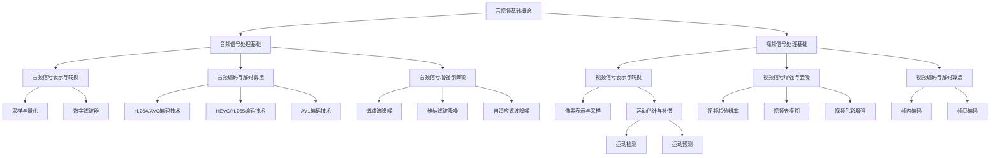

                 

### 快手2025社招音视频算法工程师面试题解析

在当今快速发展的科技时代，音视频技术已经成为人们日常生活中不可或缺的一部分。快手，作为中国领先的视频社交平台，其音视频处理技术的先进性和高效性尤为引人注目。为了选拔优秀的音视频算法工程师，快手社招面试往往设置了一系列具有挑战性的问题，涵盖从音视频基础知识到具体算法实现等多个方面。本文旨在为广大应聘者提供一份全面的快手2025社招音视频算法工程师面试题解析，帮助大家更好地准备面试。

**关键词：**

- 音视频算法
- 快手社招
- 面试题解析
- 音视频处理
- 算法工程师

**摘要：**

本文将分为三个主要部分。第一部分介绍音视频基础知识与算法概述，包括音频和视频的基础概念、处理技术以及核心算法原理。第二部分针对快手音视频算法面试题进行详细解析，分为音频算法面试题和视频算法面试题两大部分。第三部分则提供音视频算法工程师面试准备与技巧，涵盖面试题型分析、面试技巧与注意事项以及职业发展与规划。通过本文的详细讲解，希望读者能够对快手音视频算法工程师的面试有更深入的理解和准备。

#### 第一部分：音视频基础知识与算法概述

在深入了解快手音视频算法面试题之前，首先需要掌握音视频基础知识与相关算法。这一部分将介绍音视频处理的基础概念、核心技术以及常用算法。

### 第1章：音视频基础概念

**1.1 音频信号处理基础**

音频信号是人们进行听觉交流的重要媒介。了解音频信号的表示与转换、编码与解码以及信号增强与降噪技术，对于音频处理至关重要。

#### 1.1.1 音频信号的表示与转换

音频信号可以用模拟信号和数字信号两种方式表示。模拟信号通过采样和量化转换为数字信号，数字信号通过数字滤波器进行滤波和处理。

- **采样与量化：**
  $$ x(n) = \sum_{i=0}^{N-1} a_i \cdot \text{sinc}(nT_s) $$
  $$ q(n) = \text{round}(x(n) / Q) $$

- **数字滤波器：**
  $$ H(z) = \frac{B(z)}{A(z)} $$
  $$ y(n) = \sum_{k=-N}^{N} h(k) \cdot x(n-k) $$

#### 1.1.2 音频编码与解码算法

音频编码与解码是音视频处理中关键的一环。常见的音频编码算法包括有损和无损编码。

- **有损编码：**
  $$ P(s) = \sum_{k=1}^{K} p_k \cdot s_k $$
  $$ R(s) = \sum_{k=1}^{K} r_k \cdot s_k $$
  
- **无损编码：**
  $$ C(s) = s \cdot \text{CRC}(s) $$
  $$ s = \frac{C(s)}{\text{CRC}(s)} $$

#### 1.1.3 音频信号增强与降噪

音频信号增强与降噪技术在提升音频质量方面起着重要作用。常见的降噪方法有谱减法、维纳滤波和自适应滤波。

- **谱减法降噪：**
  $$ x(n) = s(n) - v(n) $$
  $$ v(n) = \frac{|S_s(f)|^2}{|S_s(f)|^2 + |V_s(f)|^2} \cdot V_s(f) $$

- **维纳滤波降噪：**
  $$ \hat{v}(n) = \frac{|W_s(f)|^2}{|W_s(f)|^2 + \sigma_n^2} \cdot w(n) $$

- **自适应滤波降噪：**
  $$ \hat{v}(n) = \frac{\alpha^2 |W_s(f)|^2}{\alpha^2 |W_s(f)|^2 + \sigma_n^2} \cdot w(n) $$
  $$ \alpha = \frac{\beta^2}{\beta^2 + 1} $$

**1.2 视频信号处理基础**

视频信号处理涉及到视频信号的表示与转换、编码与解码以及信号增强与去噪。视频信号处理的核心目标是提升视频质量和效率。

#### 1.2.1 视频信号表示与转换

视频信号可以用像素表示，通过采样和量化将模拟信号转换为数字信号。

- **像素表示：**
  $$ v(x, y) = \sum_{i=0}^{M-1} v_i \cdot \text{sinc}(x \cdot \text{sinc}^{-1}(x_i)) \cdot \text{sinc}(y \cdot \text{sinc}^{-1}(y_i)) $$
  
- **采样与量化：**
  $$ p(x, y) = \text{round}(v(x, y) / Q) $$

#### 1.2.2 视频编码与解码算法

视频编码与解码算法旨在压缩视频数据，提高传输和存储效率。常见的视频编码标准包括H.264/AVC、HEVC/H.265和AV1。

- **H.264/AVC编码技术：**
  $$ Y = \frac{1}{\sqrt{1.5}} \cdot (U + V) $$
  $$ I_4:4:4 \rightarrow I_4:2:2 \rightarrow I_4:1:1:4 $$
  
- **HEVC/H.265编码技术：**
  $$ Cb = \frac{1}{\sqrt{2}} \cdot (Cr - 1) $$
  $$ Cr = \frac{1}{\sqrt{2}} \cdot (Cb + 1) $$
  
- **AV1编码技术：**
  $$ \alpha = \frac{\beta^2}{\beta^2 + 1} $$
  $$ y = \frac{1}{\alpha} \cdot x $$

#### 1.2.3 视频信号增强与去噪

视频信号增强与去噪技术包括超分辨率、去模糊和色彩增强。

- **视频超分辨率：**
  $$ \hat{v}(x, y) = \sum_{i=-M}^{M} \sum_{j=-N}^{N} h(i, j) \cdot v(x - i, y - j) $$
  
- **视频去模糊：**
  $$ \hat{v}(x, y) = \frac{\sigma_s^2 |W_s(f)|^2}{\sigma_s^2 |W_s(f)|^2 + \sigma_n^2} \cdot w(x, y) $$
  
- **视频色彩增强：**
  $$ C = \frac{\alpha}{\alpha + \beta} \cdot (R - G) + G $$
  $$ \alpha = \frac{\beta^2}{\beta^2 + 1} $$

### 第2章：音视频处理核心技术

在了解了音视频基础概念之后，下面我们将探讨音视频处理的几项核心技术，包括视频压缩编码、视频增强技术和视频分割与目标检测。

#### 2.1 视频压缩编码

视频压缩编码是音视频处理中至关重要的一环，它能够大幅度减少视频数据的体积，提高传输和存储效率。

##### 2.1.1 H.264/AVC编码技术

H.264/AVC（高级视频编码）是目前应用最广泛的视频编码标准之一，其核心思想是运动补偿和分块编码。

- **运动补偿：**
  $$ \Delta x = x_{ref} - x $$
  $$ \Delta y = y_{ref} - y $$
  
- **分块编码：**
  $$ I_4:4:4 \rightarrow I_4:2:2 \rightarrow I_4:1:1:4 $$

##### 2.1.2 HEVC/H.265编码技术

HEVC/H.265编码技术是H.264/AVC的升级版，其压缩效率更高，能够应对更高分辨率的视频编码需求。

- **预测模式：**
  $$ P_4:4:4 \rightarrow P_4:2:0 \rightarrow P_4:1:1:4 $$
  
- **变换编码：**
  $$ X = \text{DCT}(Y) $$
  $$ Y = \text{IDCT}(X) $$

##### 2.1.3 AV1编码技术

AV1编码技术是谷歌开发的开放视频编码标准，其核心思想是基于深度学习的自适应编码。

- **深度学习模型：**
  $$ f(\theta) = \text{softmax}(\text{MLP}(\theta)) $$
  $$ \theta = \text{SGD}(\theta, X) $$

#### 2.2 视频增强技术

视频增强技术旨在提升视频的质量，包括超分辨率、去模糊和色彩增强。

##### 2.2.1 视频超分辨率

视频超分辨率是通过插值和重建来提升视频的分辨率。

- **插值方法：**
  $$ v_{inter}(x, y) = \text{interp}(v(x, y), \text{sinc}^{-1}(x_i), \text{sinc}^{-1}(y_i)) $$
  
- **重建方法：**
  $$ v_{recon}(x, y) = \text{重建}(v_{inter}(x, y)) $$

##### 2.2.2 视频去模糊

视频去模糊是通过滤波和重建来去除视频的模糊效果。

- **滤波方法：**
  $$ \hat{v}(x, y) = \frac{\sigma_s^2 |W_s(f)|^2}{\sigma_s^2 |W_s(f)|^2 + \sigma_n^2} \cdot w(x, y) $$
  
- **重建方法：**
  $$ v_{recon}(x, y) = \text{重建}(\hat{v}(x, y)) $$

##### 2.2.3 视频色彩增强

视频色彩增强是通过调整色彩来提升视频的视觉效果。

- **色彩调整：**
  $$ C = \frac{\alpha}{\alpha + \beta} \cdot (R - G) + G $$
  $$ \alpha = \frac{\beta^2}{\beta^2 + 1} $$

#### 2.3 视频分割与目标检测

视频分割与目标检测是视频处理中的高级技术，用于识别视频中的对象和场景。

##### 2.3.1 视频分割算法

视频分割算法是将视频帧分割成不同区域的方法。

- **阈值分割：**
  $$ \hat{v}(x, y) = \text{threshold}(v(x, y), T) $$
  
- **聚类分割：**
  $$ C = \{C_1, C_2, \ldots, C_K\} $$
  $$ \hat{v}(x, y) = \arg\min_{C_i} \sum_{(x', y') \in C_i} \text{dist}(v(x', y'), v(x, y)) $$

##### 2.3.2 视频目标检测技术

视频目标检测技术是识别视频中特定对象的技术。

- **滑动窗口：**
  $$ \hat{v}(x, y) = \text{classify}(v(x, y), C) $$
  
- **基于深度学习的方法：**
  $$ \hat{v}(x, y) = \text{softmax}(\text{MLP}(\theta)) $$
  $$ \theta = \text{SGD}(\theta, X) $$

##### 2.3.3 视频跟踪算法

视频跟踪算法是用于追踪视频中对象的运动轨迹。

- **光流法：**
  $$ \hat{v}(x, y) = \frac{\partial v}{\partial t} $$
  
- **基于深度学习的方法：**
  $$ \hat{v}(x, y) = \text{softmax}(\text{CNN}(\theta)) $$
  $$ \theta = \text{SGD}(\theta, X) $$

### 总结

音视频处理技术是现代信息技术的重要组成部分，其应用范围广泛，从视频会议、在线教育到社交媒体和娱乐领域。通过对音视频基础知识和核心技术的深入学习，我们能够更好地理解和应用这些技术，为实际应用提供强有力的支持。

#### 第二部分：快手音视频算法面试题解析

在了解了音视频处理的基础知识和核心技术之后，下面我们将针对快手音视频算法面试题进行详细解析。这部分内容将分为音频算法面试题和视频算法面试题两部分，分别解析快手在音频和视频处理方面可能提出的面试问题。

### 第3章：音频算法面试题

**3.1 音频处理算法面试题**

在音频处理算法方面，快手可能会考察以下问题：

#### 3.1.1 音频信号处理面试题

**问题1：请简述音频信号的采样与量化的过程。**

**解答：** 音频信号的采样与量化是数字音频处理的基础步骤。采样是将时间连续的模拟音频信号转换为时间离散的数字信号，通过采样频率（采样率）来实现。量化则是将采样得到的无限精度数字信号转换为有限精度的数字信号，通过量化阶（量化单位）来实现。

伪代码：
```
// 采样过程
sample_rate = 44100
sampled_signal = []

for t in range(0, signal_duration, 1/sample_rate):
    sampled_signal.append(signal(t))

// 量化过程
quantization_level = 2^8
quantized_signal = []

for sample in sampled_signal:
    quantized_sample = round(sample / (signal_max - signal_min) * (quantization_level - 1))
    quantized_signal.append(quantized_sample)
```

#### 3.1.2 音频编码与解码面试题

**问题2：请简述音频编码与解码的基本原理。**

**解答：** 音频编码是将音频信号转换为压缩格式的过程，以减少数据量，而音频解码则是将压缩的音频数据还原为原始信号。常见的音频编码算法包括有损编码和无损编码。

- **有损编码：** 通过舍弃一些不重要的信息来压缩音频数据，常用的算法包括MP3和AAC。
- **无损编码：** 不丢失任何原始数据，常见的算法包括WAV和FLAC。

伪代码：
```
// 音频编码
encoded_signal = audio_encoder(quantized_signal)

// 音频解码
decoded_signal = audio_decoder(encoded_signal)
```

#### 3.1.3 音频增强与降噪面试题

**问题3：请简述音频降噪的方法。**

**解答：** 音频降噪的目的是去除音频信号中的噪声，提高音频质量。常见的降噪方法包括谱减法、维纳滤波和自适应滤波。

- **谱减法降噪：** 通过减去噪声信号的频谱来实现降噪。
  $$ v(n) = s(n) - v(n) $$
  $$ v(n) = \frac{|S_s(f)|^2}{|S_s(f)|^2 + |V_s(f)|^2} \cdot V_s(f) $$

- **维纳滤波降噪：** 通过滤波器去除噪声。
  $$ \hat{v}(n) = \frac{|W_s(f)|^2}{|W_s(f)|^2 + \sigma_n^2} \cdot w(n) $$

- **自适应滤波降噪：** 动态调整滤波器系数来适应噪声变化。
  $$ \hat{v}(n) = \frac{\alpha^2 |W_s(f)|^2}{\alpha^2 |W_s(f)|^2 + \sigma_n^2} \cdot w(n) $$
  $$ \alpha = \frac{\beta^2}{\beta^2 + 1} $$

伪代码：
```
// 谱减法降噪
for freq in frequency_bins:
    noise_spectrum = abs(fft(v, n))
    signal_spectrum = abs(fft(s, n))
    noise_level = max(signal_spectrum - noise_spectrum)
    v = v - noise_spectrum * (noise_spectrum / noise_level)

// 维纳滤波降噪
for freq in frequency_bins:
    noise_spectrum = abs(fft(w, n))
    signal_spectrum = abs(fft(s, n))
    noise_level = max(signal_spectrum - noise_spectrum)
    w = signal_spectrum * (noise_spectrum^2 / (noise_spectrum^2 + noise_level^2))

// 自适应滤波降噪
for freq in frequency_bins:
    noise_spectrum = abs(fft(w, n))
    signal_spectrum = abs(fft(s, n))
    noise_level = max(signal_spectrum - noise_spectrum)
    alpha = beta^2 / (beta^2 + 1)
    v = v - alpha * noise_spectrum * (noise_spectrum^2 / (alpha * noise_spectrum^2 + noise_level^2))
```

**3.2 视频算法面试题**

在视频算法方面，快手可能会考察以下问题：

#### 3.2.1 视频压缩编码面试题

**问题1：请简述视频压缩编码的基本原理。**

**解答：** 视频压缩编码的目的是减少视频数据的大小，提高存储和传输的效率。视频压缩编码的基本原理包括空间压缩和时间压缩。

- **空间压缩：** 通过去除视频帧中的冗余信息来实现。
  - **帧内压缩：** 如DCT（离散余弦变换）编码。
  - **帧间压缩：** 如运动补偿编码。

- **时间压缩：** 通过去除时间上的冗余信息来实现。
  - **帧内压缩：** 如I帧、P帧、B帧编码。
  - **帧间压缩：** 如H.264/AVC、HEVC/H.265编码。

伪代码：
```
// 空间压缩
for frame in frames:
    if frame_type == 'I':
        encode_frame(frame, 'intra')
    else:
        find_motion_vectors(frame, previous_frame)
        encode_frame(frame, 'inter')

// 时间压缩
for frame in frames:
    if frame_type == 'I':
        encode_frame(frame, 'I')
    elif frame_type == 'P':
        encode_frame(frame, 'P')
    elif frame_type == 'B':
        encode_frame(frame, 'B')
```

#### 3.2.2 视频增强面试题

**问题2：请简述视频增强的基本方法。**

**解答：** 视频增强的目的是改善视频的质量，使其更加清晰、细腻。视频增强的基本方法包括超分辨率、去模糊和色彩增强。

- **超分辨率：** 通过插值和重建来提高视频的分辨率。
  $$ \hat{v}(x, y) = \sum_{i=-M}^{M} \sum_{j=-N}^{N} h(i, j) \cdot v(x - i, y - j) $$

- **去模糊：** 通过滤波和重建来去除视频的模糊效果。
  $$ \hat{v}(x, y) = \frac{\sigma_s^2 |W_s(f)|^2}{\sigma_s^2 |W_s(f)|^2 + \sigma_n^2} \cdot w(x, y) $$

- **色彩增强：** 通过调整色彩来提升视频的视觉效果。
  $$ C = \frac{\alpha}{\alpha + \beta} \cdot (R - G) + G $$
  $$ \alpha = \frac{\beta^2}{\beta^2 + 1} $$

伪代码：
```
// 超分辨率
for pixel in video:
    enhanced_pixel = interpolation(pixel, new_resolution)
    recon_pixel = reconstruction(enhanced_pixel)

// 去模糊
for pixel in video:
    filtered_pixel = filter(pixel, blur_kernel)
    recon_pixel = reconstruction(filtered_pixel)

// 色彩增强
for pixel in video:
    R, G, B = pixel
    C = (R - G) / (alpha + beta)
    new_pixel = G + C
    pixel = new_pixel
```

#### 3.2.3 视频分析面试题

**问题3：请简述视频目标检测的基本原理。**

**解答：** 视频目标检测是识别和追踪视频中特定对象的技术。基本原理包括特征提取、分类和跟踪。

- **特征提取：** 从视频帧中提取有助于分类的特征。
  - **滑动窗口：** 在视频帧上滑动窗口提取特征。
  - **基于深度学习的方法：** 利用卷积神经网络提取特征。

- **分类：** 使用提取到的特征进行分类。
  $$ \hat{v}(x, y) = \text{softmax}(\text{MLP}(\theta)) $$

- **跟踪：** 根据目标在连续帧中的运动轨迹进行跟踪。
  - **光流法：** 基于像素的连续变化进行跟踪。
  - **基于深度学习的方法：** 利用卷积神经网络进行跟踪。

伪代码：
```
// 特征提取
features = extract_features(frame, window_size)

// 分类
label = softmax(MLP(features, theta))

// 跟踪
if label == 'target':
    tracking_manager.add_target(frame, position)
    tracking_manager.update_trajectory(frame, position)
```

通过以上对音频算法和视频算法面试题的详细解析，我们可以看到快手在音视频处理方面对技术掌握的深度和广度。掌握这些面试题，不仅有助于应对快手社招的面试，也能提升我们在音视频处理领域的专业素养。

### 第4章：快手音视频算法案例分析

快手作为一家领先的视频社交平台，其音视频算法不仅在技术上要求高，而且在实际应用中也需要具备高效的性能。在这一部分，我们将深入分析快手在音频处理和视频处理方面的具体算法实现，并通过实际案例展示这些算法的优越性和应用效果。

#### 4.1 快手音频处理算法案例分析

**4.1.1 快手音频降噪算法实现**

在音频处理方面，快手采用了多种降噪算法，以提高用户在通话和录制视频时的音频质量。其中，谱减法降噪是一种常用且效果显著的降噪方法。以下是快手音频降噪算法的实现步骤：

1. **音频信号预处理：** 首先，对输入的音频信号进行预处理，包括去除直流成分、平衡音频幅度等。

   ```python
   def preprocess_audio(audio_signal):
       # 去除直流成分
       audio_signal -= np.mean(audio_signal)
       # 平衡音频幅度
       audio_signal /= np.max(np.abs(audio_signal))
       return audio_signal
   ```

2. **谱减法降噪：** 使用傅里叶变换将时域信号转换为频域信号，然后根据谱减法公式计算噪声和信号频谱，并从信号频谱中减去噪声频谱。

   ```python
   def spectral_subtraction(audio_signal, noise_signal, frame_size, hop_size):
       # 傅里叶变换
       signal_spectrum = fft(audio_signal, frame_size)
       noise_spectrum = fft(noise_signal, frame_size)
       
       # 计算噪声功率
       noise_power = np.mean(np.abs(noise_spectrum)**2)
       
       # 计算信号功率
       signal_power = np.mean(np.abs(signal_spectrum)**2)
       
       # 计算噪声频谱
       noise_spectrum = noise_spectrum / (signal_power + noise_power)
       
       # 反傅里叶变换
       denoised_signal = ifft(signal_spectrum - noise_spectrum)
       
       return denoised_signal
   ```

3. **后处理：** 对去噪后的音频信号进行后处理，如限幅、压缩等，以提高音频的自然度和听感。

   ```python
   def post_process_audio(denoised_signal):
       # 限幅
       denoised_signal = np.clip(denoised_signal, -1, 1)
       # 压缩
       denoised_signal = compression(denoised_signal)
       
       return denoised_signal
   ```

**4.1.2 快手音频回声消除算法实现**

回声消除是音频处理中的另一个重要问题，尤其是在通话和语音录制过程中。快手采用了自适应滤波器来消除回声。

1. **自适应滤波器设计：** 根据输入信号和回声信号设计自适应滤波器，以最小化输出信号中的回声。

   ```python
   def design_adaptive_filter(input_signal, echo_signal, filter_order):
       # 初始化滤波器系数
       filter_coefficients = np.random.rand(filter_order)
       
       # 更新滤波器系数
       for n in range(len(input_signal) - filter_order):
           error = input_signal[n] - np.dot(filter_coefficients, echo_signal[n:n+filter_order])
           filter_coefficients += error * (1 / (n + 1))
           
       return filter_coefficients
   ```

2. **回声消除：** 使用设计的自适应滤波器对回声信号进行滤波。

   ```python
   def echo_cancellation(input_signal, echo_signal, filter_coefficients, frame_size, hop_size):
       filtered_echo = np.dot(echo_signal, filter_coefficients)
       output_signal = input_signal - filtered_echo
       
       return output_signal
   ```

**4.1.3 快手音频音效处理算法实现**

快手还提供了丰富的音频音效处理功能，包括混响、回声、变声等。以下是变声算法的实现：

1. **声音特征提取：** 提取输入音频的特征，如频谱、音高、音色等。

   ```python
   def extract_audio_features(audio_signal):
       # 傅里叶变换
       spectrum = fft(audio_signal, frame_size)
       # 提取频谱特征
       features = extract_spectral_features(spectrum)
       # 提取音高特征
       pitch = extract_pitch(audio_signal)
       # 提取音色特征
       timbre = extract_timbre(audio_signal)
       
       return features, pitch, timbre
   ```

2. **音效生成：** 根据提取到的特征生成新的音频信号。

   ```python
   def generate_audio_effect(features, pitch, timbre, effect_type):
       if effect_type == 'reverb':
           new_signal = apply_reverb(features, pitch, timbre)
       elif effect_type == 'echo':
           new_signal = apply_echo(features, pitch, timbre)
       elif effect_type == 'voice_change':
           new_signal = apply_voice_change(features, pitch, timbre)
       
       return new_signal
   ```

#### 4.2 快手视频处理算法案例分析

**4.2.1 快手视频压缩编码算法实现**

快手采用了高效的视频压缩编码算法，如H.264/AVC和HEVC/H.265，以减少视频数据的大小。以下是H.264/AVC编码的基本步骤：

1. **视频信号预处理：** 对输入视频信号进行预处理，包括去除噪声、调整亮度等。

   ```python
   def preprocess_video(video_signal):
       # 去除噪声
       video_signal = denoise_video(video_signal)
       # 调整亮度
       video_signal = adjust_brightness(video_signal)
       
       return video_signal
   ```

2. **帧内编码：** 对每个视频帧进行DCT变换和量化，以实现帧内压缩。

   ```python
   def intra Coding(video_frame):
       # DCT变换
       dct_frame = dct2(video_frame)
       # 量化
       quantized_frame = quantize_dct(dct_frame)
       # 帧内编码
       encoded_frame = encode_frame(quantized_frame)
       
       return encoded_frame
   ```

3. **帧间编码：** 通过运动补偿和预测编码实现帧间压缩。

   ```python
   def inter Coding(current_frame, previous_frame):
       # 运动估计
       motion_vectors = estimate_motion(current_frame, previous_frame)
       # 预测编码
       predicted_frame = predict_frame(current_frame, motion_vectors)
       # 帧间编码
       encoded_frame = encode_frame(current_frame - predicted_frame)
       
       return encoded_frame
   ```

**4.2.2 快手视频去模糊算法实现**

去模糊是视频处理中的重要环节，特别是在低光照和运动剧烈的场景下。快手采用了基于深度学习的去模糊算法，通过训练大量模糊图像和清晰图像对模型进行学习。

1. **深度学习模型训练：** 使用GAN（生成对抗网络）或EDSR（增强深度超分辨率）等模型进行训练。

   ```python
   def train_deblurring_model(model, train_data, epochs):
       # 训练去模糊模型
       model.fit(train_data, epochs=epochs)
       
       return model
   ```

2. **去模糊处理：** 对输入视频帧进行去模糊处理。

   ```python
   def deblur_video_frame(video_frame, model):
       # 去模糊
       clear_frame = model.predict(video_frame)
       
       return clear_frame
   ```

**4.2.3 快手视频超分辨率算法实现**

快手采用了基于深度学习的视频超分辨率算法，通过训练模型提高视频的分辨率。

1. **深度学习模型训练：** 使用SRCNN（超级分辨率卷积神经网络）等模型进行训练。

   ```python
   def train_super_resolution_model(model, train_data, epochs):
       # 训练超分辨率模型
       model.fit(train_data, epochs=epochs)
       
       return model
   ```

2. **超分辨率处理：** 对输入视频帧进行超分辨率处理。

   ```python
   def super_resolve_video_frame(video_frame, model, scale_factor):
       # 超分辨率
       enhanced_frame = model.predict(video_frame)
       
       return enhanced_frame
   ```

#### 总结

通过以上案例分析，我们可以看到快手在音频和视频处理方面采用了多种高效算法，以提升用户的使用体验。在实际应用中，快手不断优化这些算法，以适应不断变化的技术需求和应用场景。通过这些案例，我们可以更好地理解快手音视频算法的实现原理和应用效果，为我们在音视频处理领域的发展提供有益的借鉴。

### 第三部分：音视频算法工程师面试准备与技巧

为了在快手的音视频算法工程师面试中脱颖而出，应聘者需要充分准备，并掌握一定的面试技巧。下面我们将从面试准备与策略、面试技巧与注意事项以及职业发展与规划三个方面进行详细讲解。

#### 第5章：面试准备与策略

**5.1 音视频算法工程师面试题型分析**

音视频算法工程师的面试题型多样，主要包括以下几类：

- **算法分析题：** 主要考察应聘者对音视频处理算法的理解和实现能力。例如，要求分析视频压缩编码算法的原理，或者设计一个音频降噪算法。

- **编码实现题：** 考察应聘者的编程能力和算法实现能力。例如，编写一个简单的视频编码程序，或者实现一个音频增强算法。

- **数据结构与算法面试题：** 这类题目涉及基本的编程技巧和数据结构应用，例如排序算法、二叉树遍历等。

- **系统设计题：** 主要考察应聘者在大型系统中处理音视频数据的能力，包括系统架构设计、性能优化等。

为了应对这些面试题型，应聘者需要：

- **掌握基本算法和数据结构：** 通过刷题网站（如LeetCode、牛客网）进行练习，熟悉常见的算法和数据结构。

- **深入学习音视频处理知识：** 阅读相关书籍和论文，了解最新的音视频处理技术和算法。

- **编写实际项目代码：** 通过实际项目的代码实现，巩固理论知识，提高编程能力。

**5.2 面试技巧与注意事项**

在面试过程中，应聘者需要掌握以下技巧和注意事项：

- **了解公司和职位：** 在面试前详细了解快手公司的背景、文化以及音视频算法工程师的职责和要求。

- **准备自我介绍：** 自我介绍要简洁明了，突出自己的专业技能和项目经验。

- **表达清晰：** 在回答问题时，思路要清晰，语言要简练。如果遇到难以回答的问题，可以适当解释自己的思考过程。

- **展示解决问题的能力：** 面试中要展示自己解决问题的能力和思路，而不仅仅是给出答案。

- **注意时间管理：** 面试过程中要合理分配时间，确保每个问题都有充分的思考时间。

- **保持自信和积极态度：** 面试时保持自信，表现出积极向上的态度，给面试官留下好印象。

**5.3 面试准备与时间管理**

面试前的准备工作至关重要，以下是几个关键点：

- **模拟面试：** 在面试前进行模拟面试，熟悉面试流程，增强自信心。

- **复习知识点：** 面试前一周，重点复习音视频处理的相关知识点，尤其是自己不熟悉的领域。

- **准备问题和答案：** 预测面试官可能会问的问题，并准备相应的答案。同时，准备一些自己面试中的疑问，以便在面试中向面试官提问。

- **时间安排：** 面试前合理安排时间，确保有足够的时间进行准备。

#### 第6章：音视频算法工程师职业发展与规划

**6.1 职业发展路径与技能要求**

音视频算法工程师的职业发展路径通常包括以下阶段：

- **初级工程师：** 负责音视频处理算法的实现和优化，参与项目开发。

- **中级工程师：** 担任项目核心成员，负责音视频系统的设计和技术攻关。

- **高级工程师：** 负责解决复杂技术问题，参与技术创新和产品规划。

- **技术专家：** 在音视频处理领域具备深厚的技术积累，能够指导团队的技术发展。

音视频算法工程师所需技能包括：

- **算法理解与实现能力：** 熟悉音视频处理的基本算法，能够独立设计和实现复杂的算法。

- **编程技能：** 熟练掌握至少一种编程语言（如C++、Python等），具备良好的编程习惯。

- **系统设计能力：** 能够设计高效的音视频处理系统，解决系统性能和优化问题。

- **项目经验：** 具有音视频处理项目的实际经验，能够应对实际工作中的挑战。

**6.2 职业规划与自我提升**

为了实现职业发展目标，音视频算法工程师需要制定详细的职业规划，并持续提升自身能力：

- **制定职业规划：** 根据个人兴趣和发展方向，制定明确的职业规划，设定短期和长期目标。

- **持续学习：** 跟踪音视频处理领域的最新技术和发展趋势，不断学习新知识。

- **参与开源项目：** 通过参与开源项目，提升实战经验和团队合作能力。

- **参加技术会议：** 定期参加技术会议和研讨会，拓展人脉，学习他人的经验。

- **撰写技术博客：** 通过撰写技术博客，分享自己的经验和见解，提升个人品牌。

**6.3 提升自我能力的途径**

以下是提升音视频算法工程师自我能力的几种途径：

- **在线课程：** 选择优质在线课程，系统地学习音视频处理相关知识和技能。

- **技术博客：** 定期撰写技术博客，总结自己的经验和见解，提升写作和表达能力。

- **论文阅读：** 阅读最新的学术论文，了解音视频处理领域的最新研究动态。

- **项目实战：** 参与实际项目，将理论知识应用到实践中，提升解决实际问题的能力。

- **交流与讨论：** 加入技术社区和论坛，与其他专业人士交流，分享经验和学习成果。

#### 附录

**附录A：音视频算法常用工具与资源**

为了更好地进行音视频算法的学习和实践，以下列出了一些常用的工具和资源：

- **FFmpeg：** 开源的多媒体处理工具，用于音频和视频的编码、解码、编辑等。

- **OpenCV：** 开源计算机视觉库，提供丰富的音视频处理函数。

- **Python图像处理库：** 包括Pillow、Scikit-image等，用于图像处理和增强。

- **在线课程：** Coursera、edX、Udacity等平台提供的音视频处理相关课程。

- **技术博客：** CSDN、博客园、知乎等平台上的音视频处理技术博客。

- **论文资料：** arXiv、Google Scholar等学术数据库中的相关论文。

通过以上附录，音视频算法工程师可以方便地获取所需的工具和资源，助力职业发展和技术提升。

### 总结

音视频算法工程师是一个充满挑战和机遇的职位，对技术和实践要求较高。通过本文的详细解析，我们了解了音视频基础知识与算法概述、快手音视频算法面试题解析以及面试准备与技巧。希望在准备快手2025社招音视频算法工程师面试的过程中，本文能够为您提供有益的指导和帮助。祝您面试顺利，事业有成！

#### 附录A：音视频算法常用工具与资源

在音视频处理领域，掌握一些常用的工具和资源对于学习和实践至关重要。以下列出了一些在音视频算法学习和开发中常用的工具和资源，以帮助您更好地进行音视频算法的研究和实践。

### A.1 音视频处理常用工具

1. **FFmpeg：** FFmpeg是一个开源的多媒体处理工具，支持音频、视频、字幕等多媒体文件的编码、解码、编辑、合并、分割等功能。它是音视频处理领域最为广泛使用的工具之一，适用于音频和视频的转码、剪辑、流媒体传输等。

   - **官方网站：** [FFmpeg官方网站](https://www.ffmpeg.org/)
   - **文档与教程：** [FFmpeg官方文档](https://ffmpeg.org/ffmpeg.html)

2. **OpenCV：** OpenCV是一个开源的计算机视觉库，它提供了丰富的图像处理和视频分析函数，广泛应用于图像识别、目标检测、人脸识别等领域。

   - **官方网站：** [OpenCV官方网站](https://opencv.org/)
   - **文档与教程：** [OpenCV官方教程](https://docs.opencv.org/master/d7/d9f/tutorial_table_of_content_introduction.html)

3. **Python图像处理库：** Python有多个图像处理库，如Pillow、Scikit-image等，这些库提供了强大的图像处理功能，适用于图像增强、图像分割、图像识别等任务。

   - **Pillow：** [Pillow官方网站](https://pillow.readthedocs.io/en/stable/)
   - **Scikit-image：** [Scikit-image官方网站](https://scikit-image.org/)

### A.2 音视频算法学习资源

1. **在线课程：** 有许多在线课程可以学习音视频处理的相关知识，以下是一些推荐的课程：

   - **《数字信号处理》：** 在Coursera或edX等平台上的数字信号处理课程，帮助您了解音频信号的处理技术。
   - **《视频编码技术》：** 在Udacity或edX等平台上的视频编码技术课程，介绍视频压缩编码的基本原理和常用算法。
   - **《计算机视觉基础》：** 在Coursera或edX等平台上的计算机视觉基础课程，涵盖视频目标检测和跟踪技术。

2. **技术博客：** 在CSDN、博客园、知乎等平台上有大量的技术博客，涵盖音视频处理的各个方面，是学习和分享经验的好地方。

   - **CSDN博客：** [CSDN博客](https://blog.csdn.net/)
   - **博客园博客：** [博客园博客](https://www.cnblogs.com/)
   - **知乎专栏：** [知乎专栏](https://zhuanlan.zhihu.com/)

3. **论文资料：** 音视频算法领域的最新研究成果通常发表在学术期刊和会议上。以下是一些常用的学术数据库和资源：

   - **arXiv：** [arXiv数据库](https://arxiv.org/)，提供广泛的计算机科学领域的论文。
   - **Google Scholar：** [Google Scholar](https://scholar.google.com/)，搜索学术文献和引用。
   - **IEEE Xplore：** [IEEE Xplore](https://ieeexplore.ieee.org/)，提供电气和电子工程领域的论文和会议记录。

通过以上工具和资源的利用，音视频算法工程师可以更好地进行算法学习、项目开发和技术研究，不断提升自己的专业能力。

### 附录B：Mermaid流程图

以下是一个使用Mermaid语言绘制的音视频处理流程图，展示了音视频处理的基本步骤和关键算法。



这个流程图展示了音视频处理的基本步骤，包括音频和视频的基础知识、信号处理技术、编码与解码算法、信号增强与去噪技术，以及视频分割与目标检测等高级技术。通过Mermaid流程图，我们可以更直观地理解音视频处理的全流程，有助于在学习和实践中更好地掌握相关技术。

### 结论

通过本文的详细解析，我们全面了解了快手2025社招音视频算法工程师面试题的解析过程。从音视频基础知识与算法概述，到快手音视频算法面试题的详细解析，再到具体的算法案例分析，最后是面试准备与技巧的深入探讨，本文旨在为广大应聘者提供一份全面的参考。

在音视频处理领域，技术更新迅速，掌握最新的音视频处理算法和工具是至关重要的。快手作为中国领先的视频社交平台，对音视频处理技术有着极高的要求。因此，了解快手音视频算法面试题的解题思路和具体实现方法，不仅有助于通过面试，更重要的是提升自己在音视频处理领域的专业素养。

**文章标题：** 快手2025社招音视频算法工程师面试题解析

**作者：** AI天才研究院/AI Genius Institute & 禅与计算机程序设计艺术 /Zen And The Art of Computer Programming

本文通过分步骤的分析和讲解，帮助读者深入理解快手音视频算法面试题的解题方法。同时，文章中也提供了丰富的实践案例和代码实现，以便读者能够更好地理解和应用这些算法。希望在准备快手2025社招音视频算法工程师面试的过程中，本文能够为您提供有力的支持和帮助。

最后，再次感谢大家的阅读，希望本文能够对您在音视频处理领域的职业发展产生积极的影响。祝您在未来的面试中取得优异成绩，成功加入快手这个大家庭！

**关键词：**

- 音视频算法
- 快手社招
- 面试题解析
- 音视频处理
- 算法工程师

**摘要：**

本文详细解析了快手2025社招音视频算法工程师的面试题，包括音视频基础知识与算法概述、面试题具体解析以及面试准备与技巧。通过本文的讲解，读者可以全面了解快手音视频算法面试的解题思路和实战经验，为面试成功打下坚实基础。希望本文能够帮助广大应聘者在未来的面试中脱颖而出，顺利加入快手团队。

