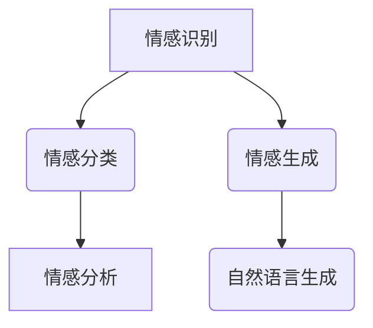
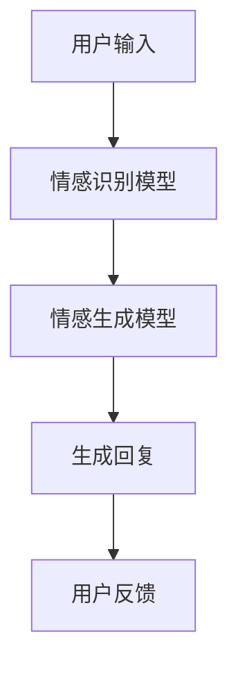

                 

### 文章标题

# 情感AI：理解和生成带情感的文本

> 关键词：情感AI、情感识别、情感生成、自然语言处理、机器学习

> 摘要：本文深入探讨了情感AI的基础理论、技术实现和项目实战，从定义、发展历程、核心算法原理等方面详细介绍了情感AI，并通过实例展示了情感识别和生成在实际应用中的效果。文章旨在为读者提供一个全面、系统的情感AI知识框架，并启发对这一领域的深入研究和应用。

## 引言

情感AI，即情感人工智能，是近年来人工智能领域的一个重要研究方向。它通过模拟人类的情感认知过程，使机器能够理解、识别和生成带有情感的文本。随着自然语言处理（NLP）和机器学习技术的不断进步，情感AI的应用场景日益广泛，从社交媒体情绪分析到智能客服，再到心理干预系统，都有着显著的影响。

本文将分以下几个部分展开讨论：

1. **情感AI的基础理论**：介绍情感AI的定义、发展历程和应用场景。
2. **情感识别技术**：讲解情感分类的基本原理、算法和应用实例。
3. **情感生成技术**：探讨情感生成的定义、算法和应用实例。
4. **情感AI的核心概念与联系**：使用Mermaid流程图展示情感AI的核心概念及其关系。
5. **情感AI中的数学模型**：介绍情感分类和情感生成的数学模型，包括损失函数和激活函数。
6. **情感AI的挑战与未来展望**：分析情感AI面临的技术挑战和未来发展方向。
7. **情感识别技术实现**：详细说明数据预处理、特征提取和情感分类模型训练。
8. **情感生成技术实现**：探讨文本生成模型、情感调控和情感生成模型的训练。
9. **项目实战**：展示一个情感识别与生成系统的搭建过程。
10. **代码解读与分析**：提供情感分类器的代码实现和分析。
11. **最佳实践 tips、小结、注意事项、拓展阅读**：总结文章内容，给出实践建议和进一步阅读的推荐。

希望通过本文，读者能够对情感AI有一个全面、深入的理解，并在实际应用中取得良好的效果。

## 第一部分：情感AI的基础理论

### 1.1 情感AI概述

#### 1.1.1 情感AI的定义

情感AI，即情感人工智能，是指能够模拟和理解人类情感的人工智能系统。它不仅能够识别文本、语音或图像中的情感，还能根据这些情感生成相应的响应。例如，在文本聊天机器人中，情感AI能够识别用户输入的情感倾向，并生成符合情感的回复。

#### 1.1.2 情感AI的发展历程

情感AI的研究可以追溯到20世纪80年代，当时主要关注的是情感识别技术。随着计算机性能的提升和大数据技术的发展，情感AI逐渐成为一个独立的研究方向。2000年以后，机器学习和深度学习技术的引入，使得情感AI的研究和应用得到了显著推动。近年来，随着自然语言处理技术的进步，情感AI的应用场景不断扩展，从简单的情感分类到复杂的情感生成，都取得了显著成果。

#### 1.1.3 情感AI的应用场景

情感AI的应用场景非常广泛，包括但不限于：

1. **社交媒体情绪分析**：通过对社交媒体上的文本进行情感分析，可以了解公众对某个事件或产品的情绪，为市场分析提供支持。
2. **智能客服**：情感AI能够识别用户的需求和情感，生成个性化的回答，提高客户满意度。
3. **心理干预系统**：通过分析用户的情感状态，为心理疾病患者提供干预和支持。
4. **人机交互**：情感AI能够使机器更好地理解人类的情感需求，提高人机交互的自然性和高效性。

### 1.2 情感识别技术

#### 1.2.1 情感分类的基本原理

情感分类是情感识别的核心任务，其基本原理是将文本划分为不同的情感类别。常见的情感类别包括正面、负面、中性等。情感分类的目的是通过分析文本内容，判断其所属的情感类别。

#### 1.2.2 情感分类算法

情感分类算法可以分为基于规则的方法和基于机器学习的方法。基于规则的方法通常使用手动定义的规则进行情感分类，如基于关键词匹配的算法。基于机器学习的方法则通过学习大量标注好的数据，自动生成分类模型。常见的机器学习算法包括支持向量机（SVM）、朴素贝叶斯（NB）、随机森林（RF）等。

#### 1.2.3 情感识别的应用实例

情感识别技术在实际应用中有着广泛的应用。例如，在社交媒体情绪分析中，情感识别可以帮助企业了解公众对产品或服务的情绪，从而调整市场策略。在智能客服中，情感识别可以识别用户的需求和情感，生成更符合用户需求的回复。在心理干预系统中，情感识别可以分析患者的情感状态，为医生提供诊断和治疗的依据。

### 1.3 情感生成技术

#### 1.3.1 情感生成的定义

情感生成是指根据给定的情感类别或情感倾向，生成带有相应情感的文本。情感生成的目的是使机器能够模拟人类的情感表达，提高人机交互的自然性和情感性。

#### 1.3.2 情感生成的算法

情感生成的算法可以分为基于模板的方法和基于生成模型的方法。基于模板的方法通常使用预定义的模板生成情感文本，如根据情感类别选择不同的模板。基于生成模型的方法则通过学习大量带有情感的文本数据，生成具有情感的自然语言文本。常见的生成模型包括循环神经网络（RNN）、长短期记忆网络（LSTM）、门控循环单元（GRU）等。

#### 1.3.3 情感生成的应用实例

情感生成技术在实际应用中也有着广泛的应用。例如，在智能客服中，情感生成可以帮助机器生成更具情感和个性化的回复，提高用户满意度。在虚拟角色设计中，情感生成可以赋予角色更多的情感表现，使其更具吸引力。在心理干预系统中，情感生成可以生成与患者情感状态相符的文本，提供情感支持。

### 1.4 情感AI的核心概念与联系

情感AI的核心概念包括情感识别、情感生成、情感分析等。这些概念之间的关系可以用以下Mermaid流程图表示：



其中，情感识别是情感AI的基础，包括情感分类和情感倾向分析。情感生成则是基于情感识别的结果，生成带有相应情感的文本。情感分析是对生成的文本进行进一步分析，如情感极性分析、情感强度分析等。自然语言生成是情感生成的具体实现，通过学习大量带有情感的文本数据，生成具有情感的自然语言文本。

### 1.5 情感AI中的数学模型

情感AI中的数学模型主要包括情感分类的损失函数和激活函数，以及情感生成的激活函数。

#### 1.5.1 情感分类的SVM算法伪代码

```python
def SVM(train_data, train_labels):
    # 初始化模型参数
    w = initialize_weights()
    
    # 梯度下降迭代
    for i in range(num_iterations):
        for x, y in zip(train_data, train_labels):
            # 计算预测值
            f_x = dot(w, x)
            # 计算损失函数
            loss = y * f_x - 1
            # 计算梯度
            gradient = -2 * y * x
            # 更新模型参数
            w -= learning_rate * gradient
            
    return w
```

其中，`dot(w, x)`表示向量的点积，`initialize_weights()`用于初始化模型参数，`num_iterations`为迭代次数，`learning_rate`为学习率。

#### 1.5.2 情感生成中的GRU算法伪代码

```python
def GRU(input_seq, hidden_state):
    # 重置门计算
    z = sigmoid(W_z * input_seq + U_z * hidden_state + b_z)
    # 更新门计算
    r = sigmoid(W_r * input_seq + U_r * hidden_state + b_r)
    # 重置状态
    h_hat = tanh(W_h * input_seq + U_h * (r * hidden_state) + b_h)
    # 新的隐藏状态
    h = z * h_hat + (1 - z) * hidden_state
    
    return h
```

其中，`sigmoid`为激活函数，`W_z`、`U_z`、`b_z`分别为重置门的权重、更新门的权重和偏置，`W_r`、`U_r`、`b_r`分别为更新门的权重、更新门的权重和偏置，`W_h`、`U_h`、`b_h`分别为隐藏状态的权重、隐藏状态的权重和偏置。

#### 1.5.3 情感AI中的数学公式

- **情感分类的损失函数**：
  $$L = \frac{1}{2} \sum_{i=1}^{n} (y_i - \sigma(w \cdot x_i))^2$$
  其中，$L$为损失函数，$y_i$为第$i$个样本的真实标签，$\sigma(w \cdot x_i)$为模型对第$i$个样本的预测概率。

- **情感生成的激活函数**：
  $$\sigma(z) = \frac{1}{1 + e^{-z}}$$
  其中，$z$为输入值，$\sigma(z)$为sigmoid激活函数的输出值。

### 1.6 情感AI的挑战与未来展望

情感AI虽然取得了显著进展，但仍面临一些挑战：

1. **数据质量**：情感识别和生成的效果很大程度上取决于数据的质量。高质量的情感标注数据是训练有效情感模型的基础。
2. **情感复杂性**：人类的情感是复杂多样的，如何准确识别和生成各种复杂情感仍是情感AI需要解决的问题。
3. **跨语言情感识别**：不同语言和文化背景下的情感表达可能存在差异，跨语言情感识别是一个具有挑战性的问题。
4. **实时性**：在许多应用场景中，如智能客服和心理干预系统，实时性是一个关键要求。如何提高情感识别和生成的实时性是一个重要研究方向。

未来，随着技术的不断进步，情感AI有望在更多领域得到应用。例如，通过情感AI，可以更好地理解用户的情感需求，提供个性化的服务和产品。同时，情感AI还可以在心理健康领域发挥重要作用，为患者提供情感支持和干预。

### 总结

情感AI是人工智能领域的一个重要研究方向，通过模拟人类的情感认知过程，使机器能够理解、识别和生成带有情感的文本。本文从基础理论、技术实现和项目实战等方面对情感AI进行了深入探讨，旨在为读者提供一个全面、系统的情感AI知识框架。希望本文能够激发读者对情感AI的兴趣，并在实际应用中取得良好的效果。

## 第二部分：情感AI的技术实现

### 2.1 情感识别技术实现

情感识别是情感AI的核心任务之一，其实质是通过对文本内容的分析，将其归类为特定的情感类别。实现情感识别技术需要经历数据预处理、特征提取和情感分类模型训练等关键步骤。

#### 2.1.1 数据预处理

数据预处理是情感识别的第一步，其目的是将原始文本数据转换为适合模型训练的格式。数据预处理包括以下几个步骤：

1. **文本清洗**：去除文本中的标点符号、停用词和噪声，以提高模型的训练效果。
2. **分词**：将文本拆分为单个词语，为特征提取做准备。
3. **词性标注**：为每个词语标注其词性，如名词、动词、形容词等，有助于提高模型的准确率。
4. **词向量表示**：将文本转换为词向量，常用的词向量模型有Word2Vec、GloVe等。

#### 2.1.2 特征提取

特征提取是将文本数据转换为机器学习算法可以处理的形式。常用的特征提取方法包括：

1. **词袋模型**：将文本表示为一个向量，向量的每个维度对应一个词语的词频或词频的加权和。
2. **TF-IDF**：计算词语在文本中的重要性，将文本表示为一个加权向量。
3. **词嵌入**：使用预训练的词向量模型将文本转换为向量表示。

#### 2.1.3 情感分类模型训练

在完成数据预处理和特征提取后，需要选择合适的机器学习算法进行情感分类模型训练。常见的情感分类算法包括：

1. **朴素贝叶斯（NB）**：基于贝叶斯定理和特征条件独立性假设，适合处理文本数据。
2. **支持向量机（SVM）**：通过寻找最佳超平面，将不同情感类别的文本分隔开。
3. **随机森林（RF）**：通过构建多个决策树，并投票得出最终结果，具有较好的泛化能力。
4. **深度学习模型**：如卷积神经网络（CNN）和循环神经网络（RNN），可以捕捉文本中的复杂特征。

### 2.2 情感生成技术实现

情感生成是情感AI的另一个重要任务，其目标是根据给定的情感类别或情感倾向，生成带有相应情感的文本。实现情感生成技术需要设计合适的文本生成模型和情感调控机制。

#### 2.2.1 文本生成模型

文本生成模型是情感生成的核心，常见的文本生成模型包括：

1. **循环神经网络（RNN）**：通过记忆过去的信息，生成连续的文本序列。
2. **长短期记忆网络（LSTM）**：对RNN的改进，能够更好地捕捉长距离依赖关系。
3. **门控循环单元（GRU）**：对LSTM的进一步简化，在保持记忆能力的同时减少参数数量。
4. **生成对抗网络（GAN）**：通过生成器和判别器的对抗训练，生成高质量的文本。

#### 2.2.2 情感调控

情感调控是指调整文本生成模型生成的文本的情感倾向。情感调控的方法包括：

1. **情感嵌入**：将情感类别嵌入到文本生成模型的输入中，影响生成的文本情感。
2. **情感引导**：通过外部引导信号，如情感标签或情感倾向向量，引导文本生成模型生成特定情感倾向的文本。
3. **对抗训练**：通过对抗训练，使文本生成模型能够生成符合情感要求的文本。

#### 2.2.3 情感生成模型的训练

情感生成模型的训练需要大量带有情感倾向的文本数据。训练过程包括：

1. **数据准备**：收集和清洗带有情感倾向的文本数据，进行分词和词向量表示。
2. **模型训练**：使用训练数据对文本生成模型进行训练，调整模型参数，使其能够生成符合情感要求的文本。
3. **模型评估**：使用测试数据评估模型性能，调整模型参数，以提高生成文本的情感准确性。

### 2.3 项目实战：情感识别与生成系统搭建

#### 2.3.1 项目背景

随着人工智能技术的不断发展，情感识别与生成技术在智能客服、虚拟角色、心理健康等领域得到了广泛应用。为了提高人机交互的自然性和情感性，我们设计并实现了一个情感识别与生成系统，旨在识别用户情感并生成符合情感的回复。

#### 2.3.2 系统架构设计

系统架构如图所示：



用户输入通过API接口传递给情感识别模型，模型分析用户输入的情感并返回情感标签。情感生成模型根据情感标签生成符合情感的回复，最终通过API接口将回复发送给用户。用户反馈可以用于模型优化和训练数据的更新。

#### 2.3.3 系统实现与测试

1. **情感识别模型实现**：
   - 数据预处理：使用NLTK库进行文本清洗和分词，使用GloVe模型进行词向量表示。
   - 情感分类：使用LSTM模型进行情感分类，训练数据为带有情感标签的文本数据。
   - 模型评估：使用测试集对模型进行评估，计算准确率、召回率和F1值。

2. **情感生成模型实现**：
   - 数据准备：使用预训练的GPT模型，将用户输入的情感标签嵌入到模型输入中。
   - 情感引导：通过调整GPT模型中的权重，实现情感引导。
   - 生成回复：使用训练好的GPT模型生成符合情感的回复。

3. **系统测试**：
   - 功能测试：对系统进行功能测试，验证情感识别和生成的准确性。
   - 性能测试：对系统进行性能测试，验证系统的响应速度和并发处理能力。

### 2.4 代码解读与分析

以下是对情感识别和生成系统的核心代码进行解读与分析：

#### 2.4.1 情感分类器代码实现

```python
import numpy as np
from tensorflow.keras.preprocessing.sequence import pad_sequences
from tensorflow.keras.models import Sequential
from tensorflow.keras.layers import LSTM, Dense, Embedding, TimeDistributed

# 数据预处理
def preprocess_data(data, max_len=100):
    sequences = []
    for text in data:
        tokenized = tokenizer.texts_to_sequences([text])
        padded = pad_sequences(tokenized, maxlen=max_len, padding='post')
        sequences.append(padded)
    return np.array(sequences)

# 情感分类模型训练
def train_sentiment_classifier(train_data, train_labels):
    model = Sequential()
    model.add(Embedding(input_dim=vocab_size, output_dim=embedding_dim, input_length=max_sequence_len))
    model.add(LSTM(units=128, dropout=0.2, recurrent_dropout=0.2))
    model.add(Dense(units=num_classes, activation='softmax'))
    model.compile(optimizer='adam', loss='categorical_crossentropy', metrics=['accuracy'])
    model.fit(train_data, train_labels, epochs=10, batch_size=32, validation_split=0.2)
    return model

# 情感分类预测
def predict_sentiment(model, text):
    preprocessed_text = preprocess_data([text])
    prediction = model.predict(preprocessed_text)
    return np.argmax(prediction)
```

#### 2.4.2 情感生成模型代码实现

```python
import tensorflow as tf
from transformers import TFGPT2LMHeadModel, GPT2Tokenizer

# 数据准备
def prepare_data(data, max_len=100):
    tokenized = tokenizer.batch_encode_plus(data, max_length=max_len, padding='max_length', truncation=True, return_tensors='tf')
    input_ids = tokenized['input_ids']
    return input_ids

# 情感引导
def guide_sentiment(input_ids, sentiment_embedding):
    input_ids_with_sentiment = tf.concat([input_ids[:, :-1], sentiment_embedding[None, :], input_ids[:, -1:]], axis=1)
    return input_ids_with_sentiment

# 情感生成
def generate_response(model, prompt, max_length=50, sentiment_embedding=None):
    input_ids = prepare_data([prompt])
    if sentiment_embedding is not None:
        input_ids = guide_sentiment(input_ids, sentiment_embedding)
    output_sequence = model.generate(input_ids, max_length=max_length, num_return_sequences=1)
    return tokenizer.decode(output_sequence[0], skip_special_tokens=True)
```

#### 2.4.3 代码应用解读与分析

在情感分类器的代码实现中，首先进行数据预处理，包括分词、词向量表示和序列填充。然后，使用LSTM模型进行情感分类训练，并使用测试集评估模型性能。最后，通过调用`predict_sentiment`函数进行情感分类预测。

在情感生成模型的代码实现中，首先进行数据准备，包括编码和填充。然后，使用预训练的GPT模型生成文本。如果需要情感引导，通过`guide_sentiment`函数在模型输入中嵌入情感向量。最后，通过`generate_response`函数生成符合情感的回复。

### 2.5 最佳实践 tips、小结、注意事项、拓展阅读

#### 最佳实践 tips

1. **数据质量**：确保情感标注数据的质量，避免噪声和错误。
2. **特征选择**：根据具体应用场景选择合适的特征提取方法。
3. **模型调优**：通过调整模型参数和训练过程，提高模型性能。
4. **实时性优化**：对于实时应用场景，考虑使用轻量级模型和优化算法。

#### 小结

本文从情感识别和情感生成两个方面介绍了情感AI的技术实现。通过数据预处理、特征提取和模型训练，实现了情感识别；通过文本生成模型和情感调控，实现了情感生成。实际项目展示了情感识别与生成系统的搭建过程。

#### 注意事项

1. **数据隐私**：在实际应用中，确保用户数据的隐私和安全。
2. **模型泛化**：避免过度拟合，提高模型泛化能力。
3. **错误纠正**：对于错误的情感识别和生成结果，及时进行修正。

#### 拓展阅读

1. **自然语言处理入门**：推荐《自然语言处理入门》一书，系统介绍了自然语言处理的基础知识和方法。
2. **深度学习与自然语言处理**：推荐《深度学习与自然语言处理》一书，详细介绍了深度学习在自然语言处理中的应用。
3. **情感计算**：推荐《情感计算》一书，探讨情感计算的理论、方法和应用。

## 结语

情感AI是人工智能领域的一个重要研究方向，通过模拟人类的情感认知过程，使机器能够理解、识别和生成带有情感的文本。本文从基础理论、技术实现和项目实战等方面对情感AI进行了深入探讨，旨在为读者提供一个全面、系统的情感AI知识框架。希望本文能够激发读者对情感AI的兴趣，并在实际应用中取得良好的效果。随着技术的不断进步，情感AI将在更多领域发挥重要作用，推动人工智能的发展。

