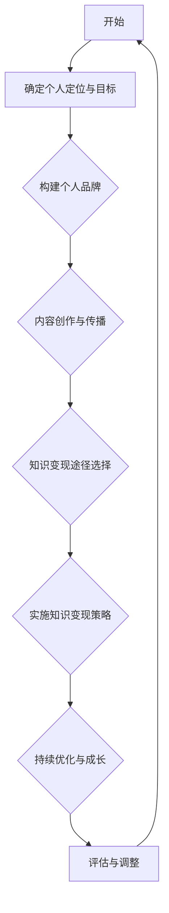

                 


### 文章标题

《打造个人IP：程序员的知识变现之路》

### 关键词

个人IP、程序员、知识变现、品牌塑造、内容创作、技术写作

### 摘要

在数字化时代，程序员如何将个人技能和知识转化为实际收益成为一个热门话题。本文将深入探讨程序员如何打造个人IP，通过知识变现实现职业发展的新高度。文章从基础知识、个人品牌构建、内容创作与传播、知识变现方法等多个方面，提供了一套完整的个人IP打造路径。通过实际案例分析和最佳实践分享，为程序员提供切实可行的操作指南。

## 《打造个人IP：程序员的知识变现之路》目录大纲

### 第一部分：基础知识

### 第1章：个人IP概述

#### 1.1 个人IP的定义与价值

个人IP，即个人知识产权，是指个人在某一领域内通过持续创造和积累，形成的具有市场价值的影响力。在数字时代，个人IP已经成为一种重要的资产，不仅可以提升个人品牌，还可以实现知识的变现。

#### 1.2 个人IP与职业发展

个人IP与职业发展的关系紧密。拥有个人IP的程序员可以在职场上获得更多的机会和优势，例如更高的薪资、更好的职位晋升以及更多的项目机会。

#### 1.3 个人IP的成功案例分析

本文将分析几位成功程序员个人IP打造的案例，探讨他们的成功经验和值得借鉴的策略。

### 第2章：构建个人品牌

#### 2.1 品牌定位与定位策略

品牌定位是个人IP打造的第一步。明确自己的品牌定位，有助于在竞争激烈的市场中脱颖而出。

#### 2.2 个人品牌的形象塑造

个人品牌形象是个人IP的重要组成部分。通过合适的形象塑造策略，可以提升个人品牌的市场认知度。

#### 2.3 个人品牌传播策略

个人品牌的传播是关键。有效的传播策略可以帮助个人IP迅速积累关注度和影响力。

### 第3章：内容创作与传播

#### 3.1 内容创作策略

内容创作是个人IP的核心。如何创作出有价值、有影响力的内容，是每个程序员需要思考的问题。

#### 3.2 个人博客与社交媒体平台的选择与运营

个人博客和社交媒体平台是传播个人IP的重要渠道。选择合适的平台，并有效地运营，可以大幅提升个人IP的传播效果。

#### 3.3 内容优化与推广

内容优化和推广是提高内容影响力的关键。通过SEO、社交媒体推广等手段，可以让更多用户发现并关注个人IP。

### 第4章：知识变现方法

#### 4.1 知识变现渠道与模式

了解不同的知识变现渠道和模式，有助于程序员选择最适合自己的变现方式。

#### 4.2 知识产品设计与营销

知识产品是知识变现的重要载体。如何设计出受欢迎的知识产品，并进行有效的营销推广，是程序员需要掌握的技能。

#### 4.3 个人IP商业化案例分析

通过分析成功个人IP商业化的案例，可以学习到实用的变现策略和方法。

### 第二部分：个人IP实战

### 第5章：程序员技能提升与展示

#### 5.1 程序员技能提升路径

提升技能是打造个人IP的基础。本文将介绍程序员技能提升的路径和策略。

#### 5.2 技能展示与认证

技能展示和认证是提升个人IP的重要手段。如何有效地展示自己的技能，并通过认证增加可信度，是本文的重点。

#### 5.3 技能竞赛与开源项目

参与技能竞赛和开源项目，不仅可以提升个人技能，还可以扩大个人IP的影响力。

### 第6章：技术写作与出版

#### 6.1 技术写作技巧

技术写作是程序员展示个人IP的重要方式。本文将介绍技术写作的技巧和方法。

#### 6.2 技术文章发表与出版

如何将技术文章发表在知名媒体或出版成书籍，是每个程序员需要掌握的技能。

#### 6.3 技术书籍创作与推广

创作技术书籍并推广，是知识变现的一种有效方式。本文将探讨如何进行技术书籍的创作与推广。

### 第7章：在线教育平台搭建与运营

#### 7.1 在线教育平台搭建

在线教育平台是知识变现的重要工具。本文将介绍在线教育平台的搭建流程和关键环节。

#### 7.2 课程内容设计

课程内容设计是在线教育平台的核心。本文将探讨如何设计出受欢迎的课程内容。

#### 7.3 学生管理与互动

学生管理与互动是提升在线教育平台用户体验的关键。本文将介绍有效的学生管理策略和互动方法。

### 第8章：综合实战案例

#### 8.1 个人IP综合实战案例

本文将通过实际案例，展示如何综合运用各种方法打造个人IP。

#### 8.2 案例分析与总结

对综合实战案例进行分析，总结经验教训，为其他程序员提供借鉴。

#### 8.3 个人IP打造的未来趋势

探讨个人IP打造的未来趋势，帮助程序员把握行业发展的方向。

### 第三部分：资源与工具

### 第9章：个人IP建设工具

#### 9.1 内容创作与编辑工具

介绍常用的内容创作与编辑工具，帮助程序员高效创作内容。

#### 9.2 社交媒体管理工具

介绍社交媒体管理工具，帮助程序员更好地管理和推广个人IP。

#### 9.3 数据分析工具

数据分析工具可以帮助程序员分析用户行为，优化内容策略。

### 第10章：学习与成长资源

#### 10.1 行业资讯与动态

介绍行业资讯和动态，帮助程序员了解行业趋势。

#### 10.2 学习资料与课程

推荐学习资料和课程，帮助程序员提升技能。

#### 10.3 社群与交流平台

介绍社群和交流平台，帮助程序员拓展人脉和获取资源。

### 第11章：扩展阅读

#### 11.1 相关书籍推荐

推荐与个人IP打造相关的书籍，帮助程序员深入了解相关知识。

#### 11.2 优秀博客与专栏推荐

推荐优秀的博客和专栏，帮助程序员学习优秀的内容创作技巧。

#### 11.3 实用工具与资源推荐

推荐实用的工具和资源，帮助程序员提高工作效率。

## 附录

### 附录A：个人IP建设流程图

### 附录B：核心算法与原理讲解

#### B.1 算法概述

#### B.2 算法伪代码

#### B.3 算法应用实例

### 附录C：实战代码与解读

#### C.1 实战项目介绍

#### C.2 源代码实现

#### C.3 代码解读与分析

#### C.4 代码优化与改进建议### 《打造个人IP：程序员的知识变现之路》

在数字化时代，个人品牌建设已成为职业发展的关键要素之一。程序员作为技术领域的重要角色，如何通过打造个人IP实现知识变现，成为许多开发者关注的焦点。本文旨在探讨程序员如何通过构建个人IP，利用知识变现策略实现职业发展的飞跃。

## 关键词

个人IP、程序员、知识变现、品牌塑造、内容创作、技术写作

## 摘要

本文将围绕程序员如何打造个人IP，实现知识变现这一主题展开。文章首先介绍了个人IP的定义与价值，探讨了个人IP与职业发展的关系。接着，本文将详细阐述个人品牌定位与形象塑造策略，以及如何通过内容创作与传播提升个人影响力。随后，文章将分析知识变现的渠道与模式，并提供具体的案例和实战经验。最后，本文将总结个人IP建设的工具与资源，以及未来发展的趋势。

## 目录

### 第一部分：基础知识

#### 第1章：个人IP概述

1.1 个人IP的定义与价值

1.2 个人IP与职业发展

1.3 个人IP的成功案例分析

#### 第2章：构建个人品牌

2.1 品牌定位与定位策略

2.2 个人品牌的形象塑造

2.3 个人品牌传播策略

#### 第3章：内容创作与传播

3.1 内容创作策略

3.2 个人博客与社交媒体平台的选择与运营

3.3 内容优化与推广

#### 第4章：知识变现方法

4.1 知识变现渠道与模式

4.2 知识产品设计与营销

4.3 个人IP商业化案例分析

### 第二部分：个人IP实战

#### 第5章：程序员技能提升与展示

5.1 程序员技能提升路径

5.2 技能展示与认证

5.3 技能竞赛与开源项目

#### 第6章：技术写作与出版

6.1 技术写作技巧

6.2 技术文章发表与出版

6.3 技术书籍创作与推广

#### 第7章：在线教育平台搭建与运营

7.1 在线教育平台搭建

7.2 课程内容设计

7.3 学生管理与互动

#### 第8章：综合实战案例

8.1 个人IP综合实战案例

8.2 案例分析与总结

8.3 个人IP打造的未来趋势

### 第三部分：资源与工具

#### 第9章：个人IP建设工具

9.1 内容创作与编辑工具

9.2 社交媒体管理工具

9.3 数据分析工具

#### 第10章：学习与成长资源

10.1 行业资讯与动态

10.2 学习资料与课程

10.3 社群与交流平台

#### 第11章：扩展阅读

11.1 相关书籍推荐

11.2 优秀博客与专栏推荐

11.3 实用工具与资源推荐

## 附录

### 附录A：个人IP建设流程图

### 附录B：核心算法与原理讲解

### 附录C：实战代码与解读### 第一部分：基础知识

#### 第1章：个人IP概述

在数字化时代，个人IP（Intellectual Property，知识产权）的概念逐渐被更多的人所熟知。个人IP不仅仅是商标、专利和版权等传统知识产权的简称，它更是一个人在某一领域内通过持续创造和积累，形成的具有市场价值的影响力。对于程序员而言，个人IP是其在技术领域中独特技能、经验和知识的体现，也是其在职场上获得竞争优势和职业发展的重要资源。

### 1.1 个人IP的定义与价值

个人IP的定义可以归结为以下几点：

1. **技能与知识的积累**：个人IP是一个人通过学习、实践和积累，在某一技术领域内形成的高超技能和深厚的知识体系。

2. **品牌影响力的体现**：个人IP是一种品牌，它代表了一个人在公众中的形象、声誉和信任度。

3. **市场价值的象征**：个人IP具有市场价值，可以通过各种渠道和方式实现变现，如咨询、培训、产品销售、版权授权等。

个人IP的价值体现在以下几个方面：

1. **提升职场竞争力**：拥有个人IP的程序员在求职和职场竞争中具有显著优势，更容易获得高薪职位和重要项目机会。

2. **实现职业发展**：个人IP可以成为程序员职业发展的助推器，帮助其实现从技术专家到行业领袖的跃迁。

3. **知识变现的机会**：个人IP为程序员提供了多种知识变现的途径，如开设课程、撰写技术书籍、提供咨询服务等。

### 1.2 个人IP与职业发展

个人IP对职业发展的影响可以从以下几个方面来理解：

1. **专业技能的认可**：个人IP是专业技能的认可和象征。一个具有个人IP的程序员，通常在技术领域有深入的研究和丰富的实践经验。

2. **品牌效应的驱动**：个人品牌效应可以吸引更多的关注和机会。当程序员建立了一定的个人IP后，其品牌影响力会吸引更多的合作伙伴和求职机会。

3. **职业选择的自由度**：拥有个人IP的程序员在选择职业发展路径时更加灵活，可以自由选择自由职业、创业或加入大型企业。

4. **薪资水平的提升**：个人IP的提升往往伴随着薪资水平的提升。企业愿意为拥有个人IP的高技能程序员支付更高的薪酬。

### 1.3 个人IP的成功案例分析

在技术领域，许多成功的程序员通过打造个人IP实现了职业上的巨大成功。以下是一些典型的案例：

1. **GitHub上的开源项目**：GitHub是一个流行的开源平台，许多程序员通过在GitHub上创建和贡献开源项目，建立了自己的个人IP。例如，GitHub上的明星项目React和Vue.js，它们的创建者分别成为了技术领域的知名人物。

2. **技术博客与专栏**：在博客平台上，如Medium、博客园、CSDN等，许多程序员通过撰写高质量的技术文章，逐渐积累了自己的读者群和影响力。例如，技术博主侯捷，通过不断分享编程心得，成为技术圈内的知名人士。

3. **技术书籍的出版**：编写和出版技术书籍是知识变现的一种有效方式。许多程序员通过撰写技术书籍，不仅分享了专业知识，也提升了个人IP。例如，著名程序员Eric Ruan通过撰写《Kubernetes权威指南》，赢得了广泛的认可。

4. **在线教育平台的课程**：许多程序员通过在线教育平台，如网易云课堂、慕课网等，开设自己的课程，实现了知识变现。例如，程序员黄超，通过在网易云课堂开设Python课程，积累了大量的学员和良好的口碑。

这些案例表明，个人IP的打造不仅需要技术实力，还需要策略和持续的努力。通过构建个人IP，程序员可以为自己的职业发展增添更多的可能性。

#### 第2章：构建个人品牌

个人品牌是个人IP的重要组成部分，它是个人在公众中的形象、声誉和信任度的体现。对于程序员而言，构建个人品牌意味着在技术领域中树立自己的独特形象，通过不断传播和提升个人价值，获得更多的职业机会和市场认可。构建个人品牌需要明确品牌定位、塑造品牌形象以及制定传播策略。

### 2.1 品牌定位与定位策略

品牌定位是构建个人品牌的第一步，它决定了个人品牌在市场中的地位和方向。一个明确的品牌定位有助于在竞争激烈的市场中脱颖而出，为个人IP的构建提供方向。

**品牌定位的要素包括：**

1. **目标受众**：明确个人品牌的目标受众，了解他们的需求、兴趣和行为习惯，以便更好地满足他们的期望。

2. **核心价值**：确定个人品牌的核心理念和独特价值，这可以是专业技能、创新思维、解决问题的能力等。

3. **独特卖点**：找到个人品牌的独特卖点（USP），即在众多竞争者中，个人品牌与众不同的地方。

**定位策略的制定步骤：**

1. **市场调研**：通过市场调研，了解目标市场的需求、趋势和竞争对手的情况。

2. **自我评估**：分析个人的技能、经验和优势，确定自己的核心竞争力和潜在的价值点。

3. **目标设定**：根据市场调研和自我评估的结果，设定个人品牌的目标定位，包括目标受众、品牌核心价值和独特卖点。

4. **策略规划**：制定具体的策略和行动计划，包括品牌传播、内容创作、活动参与等。

### 2.2 个人品牌的形象塑造

个人品牌形象是个人在公众中的外在表现，它决定了人们对个人品牌的认知和感受。塑造个人品牌形象需要从以下几个方面入手：

1. **专业形象**：通过专业技能和知识积累，展现个人在技术领域的专业性和权威性。

2. **个性特点**：展现个人独特的个性特点，如创新思维、幽默感、热情等，增加个人品牌的亲和力。

3. **视觉元素**：设计个人品牌的视觉元素，如标志、色彩、字体等，使其具有辨识度和一致性。

**塑造品牌形象的策略包括：**

1. **内容创作**：通过高质量的内容创作，如技术文章、博客、视频等，展现个人的专业知识和独特见解。

2. **社交媒体运营**：利用社交媒体平台，如微博、微信、LinkedIn等，建立和维护个人品牌形象。

3. **活动参与**：积极参与行业活动和社区讨论，扩大个人品牌的影响力。

4. **合作与互动**：与其他专业人士和行业领袖建立合作关系，通过互动和交流提升个人品牌的知名度。

### 2.3 个人品牌传播策略

个人品牌的传播是提升个人影响力的关键。有效的传播策略可以帮助个人品牌在市场中迅速积累关注度和影响力。以下是一些常见的个人品牌传播策略：

1. **内容营销**：通过高质量的内容创作，如技术文章、博客、电子书等，吸引目标受众的注意。

2. **社交媒体推广**：利用社交媒体平台，如微博、微信、LinkedIn等，发布和推广个人品牌内容，扩大影响力。

3. **公关活动**：参与行业展会、研讨会、讲座等活动，提高个人品牌的曝光度。

4. **口碑营销**：通过用户评价、推荐和反馈，建立良好的口碑，提升个人品牌的信誉。

5. **品牌合作**：与其他品牌进行合作，通过跨领域的互动和联合营销，提升个人品牌的知名度。

6. **数据驱动**：利用数据分析工具，监控和评估个人品牌的传播效果，优化传播策略。

通过明确品牌定位、塑造品牌形象和制定传播策略，程序员可以逐步构建自己的个人品牌，提升在职场和市场上的竞争力，实现知识的有效变现。

#### 第3章：内容创作与传播

在个人IP的建设过程中，内容创作与传播扮演着至关重要的角色。通过高质量的内容创作和有效的传播策略，程序员可以建立自己的专业形象，吸引更多的关注和支持。本章节将详细探讨内容创作策略、个人博客与社交媒体平台的选择与运营，以及内容优化与推广的方法。

### 3.1 内容创作策略

内容创作是构建个人IP的基础。程序员需要制定有效的内容创作策略，以确保内容的高质量、持续性和受众吸引力。以下是一些关键的内容创作策略：

**1. 确定内容主题**

内容主题应紧密围绕个人品牌的核心价值和技术专长。确定主题时，可以考虑以下几个方面：

- **受众需求**：分析目标受众的兴趣和需求，选择他们感兴趣的主题。
- **个人兴趣**：选择自己感兴趣且擅长的领域，这样更容易创作出高质量的内容。
- **行业趋势**：紧跟技术领域的最新趋势和发展动态，为读者提供有价值的信息。

**2. 保持内容更新频率**

持续更新是保持受众关注的重要因素。根据个人时间和能力，制定合理的更新计划，例如每周发布一篇文章或每月发布一次视频。重要的是保持内容的连贯性和规律性。

**3. 提供高质量的内容**

高质量的内容是吸引和留住受众的关键。在内容创作过程中，应注意以下几点：

- **深度与广度**：内容不仅要深入讲解技术原理，还要涵盖相关领域的知识，提供全面的视角。
- **实用性**：内容应具有实际应用价值，帮助读者解决实际问题。
- **易懂性**：避免过于复杂的术语和理论，使用简洁明了的语言进行表达。

**4. 结合多种内容形式**

不同的内容形式能够满足不同受众的阅读和消费习惯。结合使用以下内容形式，可以提升内容的多样性和吸引力：

- **技术文章**：长篇文章适合详细讲解技术原理和应用。
- **博客**：短小精悍的博客适合快速分享心得和技巧。
- **视频**：视频内容适合演示操作过程和复杂概念的讲解。
- **电子书**：系统化的电子书适合深入探讨某一技术主题。

**5. 互动与反馈**

互动和反馈是内容创作过程中不可或缺的部分。通过评论、问答和社交媒体互动，可以了解受众的需求和反馈，不断优化内容。

### 3.2 个人博客与社交媒体平台的选择与运营

个人博客和社交媒体平台是传播个人品牌的重要渠道。选择合适的平台并进行有效的运营，可以大幅提升个人IP的传播效果。

**1. 个人博客的选择与运营**

个人博客是展示个人技术专长和专业形象的重要平台。以下是一些选择和运营个人博客的建议：

- **平台选择**：选择一个稳定、易操作且支持多种内容形式的博客平台，如WordPress、GitHub Pages、Typecho等。
- **网站设计**：设计简洁、专业且具有辨识度的网站，使读者能够快速了解你的品牌和信息。
- **内容布局**：合理布局文章、视频、图片等元素，提供良好的阅读体验。
- **SEO优化**：通过关键词优化、标签分类和内外链建设，提升博客在搜索引擎中的排名。

**2. 社交媒体平台的选择与运营**

社交媒体平台能够迅速扩大个人品牌的影响力。以下是一些常见的社交媒体平台及其运营建议：

- **微博**：适合快速分享技术动态、博客文章和行业观点，互动性强。
- **微信**：通过公众号和朋友圈，可以深度分享技术内容，建立粉丝社群。
- **LinkedIn**：适合职业发展和专业交流，可以发布专业文章、参与行业讨论。
- **GitHub**：展示开源项目，吸引同好者关注和贡献，提升个人技术影响力。

**3. 内容同步与推广**

将博客内容同步到社交媒体平台，可以扩大内容的传播范围。以下是一些同步和推广的策略：

- **定期发布**：在社交媒体上定期发布博客文章的摘要或链接，引导读者访问博客。
- **互动推广**：通过评论、点赞和分享，增加内容的曝光度和互动性。
- **合作推广**：与其他博主或行业大V合作，通过互相推广，扩大受众群体。
- **广告投放**：在预算允许的情况下，通过社交媒体广告投放，吸引更多潜在读者。

### 3.3 内容优化与推广

内容的优化与推广是提升内容影响力的关键。以下是一些内容优化和推广的方法：

**1. SEO优化**

- **关键词研究**：通过关键词研究工具，确定目标关键词，并将其合理分布在文章标题、内容、标签和描述中。
- **内链优化**：通过内部链接，将相关内容相互连接，提升用户在网站上的停留时间和访问深度。
- **外链建设**：通过在其他网站和社交媒体上发布链接，提高网站的权威性和搜索引擎排名。

**2. 社交媒体推广**

- **内容形式多样化**：使用不同形式的内容，如图片、视频和动画，提高用户的参与度和分享意愿。
- **标签使用**：使用相关的标签，提高内容在社交媒体平台上的曝光度。
- **互动策略**：通过提问、调查和讨论，增加用户的互动参与，提升内容的传播效果。

**3. 合作与推广**

- **内容合作**：与其他博主、行业专家和媒体进行内容合作，通过联合发布和推广，扩大内容的影响力。
- **广告投放**：通过社交媒体广告、搜索引擎广告等渠道，精准投放广告，吸引目标受众。
- **用户参与**：鼓励用户评论、点赞和分享，通过用户互动，增加内容的曝光度和传播范围。

通过有效的内容创作与传播策略，程序员可以建立强大的个人IP，提升在技术领域的影响力和市场竞争力，实现知识的有效变现。持续的创作和优化，将为个人IP的长期发展提供坚实的基础。

#### 第4章：知识变现方法

在构建了个人IP和建立了稳定的受众基础之后，程序员可以通过多种方式将知识变现，实现个人价值的最大化。知识变现的渠道和模式多种多样，包括但不限于在线课程、技术书籍、咨询服务、开源项目等。本章节将详细介绍这些知识变现的渠道与模式，并分享一些成功的个人IP商业化案例。

### 4.1 知识变现渠道与模式

**1. 在线课程**

在线课程是一种流行的知识变现方式，通过互联网平台，程序员可以将自己的技术知识和经验转化为课程，向学生提供培训服务。以下是一些关键点：

- **课程内容**：课程内容应围绕个人专长，可以是编程语言、框架、工具等。
- **平台选择**：选择适合的平台，如网易云课堂、慕课网、Udemy等，这些平台提供了完整的课程发布和管理系统。
- **课程形式**：可以采用视频课程、直播课程或录播课程，根据受众的需求选择合适的课程形式。
- **定价策略**：定价应根据课程难度、时长、受众需求等因素综合考虑，确保性价比。

**2. 技术书籍**

技术书籍是程序员知识变现的传统方式，通过出版技术书籍，可以分享深入的技术知识和实践经验。以下是一些要点：

- **选题定位**：选择有市场需求和独特视角的选题，确保书籍对读者有实际价值。
- **撰写与编辑**：撰写过程中应注重内容的逻辑性和实用性，确保语言通俗易懂。
- **出版渠道**：可以通过传统出版社或电子书平台发布，如电子工业出版社、亚马逊Kindle等。
- **营销推广**：通过社交媒体、博客、线下活动等方式，进行书籍的推广和宣传。

**3. 咨询服务**

咨询服务是程序员利用自身专业知识为企业提供解决方案的一种变现方式。以下是一些要点：

- **服务内容**：根据个人专长，提供技术诊断、系统优化、架构设计等咨询服务。
- **客户定位**：明确目标客户群体，如初创企业、中小型企业或大型企业。
- **收费模式**：可以按小时、按项目或按年订阅等方式收费，确保收费模式透明合理。
- **客户关系管理**：建立良好的客户关系，提供优质的服务体验，积累口碑和复购率。

**4. 开源项目**

开源项目是程序员展示技术实力和吸引关注的一种方式，同时也是一种知识变现的渠道。以下是一些要点：

- **项目选择**：选择有潜力和市场需求的领域进行开源项目，确保项目有实际价值。
- **项目维护**：定期更新项目代码，修复bug，确保项目的持续发展。
- **贡献者激励**：通过提供技术指导、资源支持等方式，激励更多开发者参与项目贡献。
- **商业化路径**：可以考虑提供付费插件、专业支持或企业定制服务，将开源项目商业化。

### 4.2 知识产品设计与营销

知识产品的设计是知识变现的关键环节，一个良好的知识产品能够满足受众的需求，提高用户的购买意愿。以下是一些设计知识产品的要点：

**1. 确定受众需求**

在产品设计初期，通过市场调研、用户访谈等方式，了解目标受众的需求和痛点，确保知识产品能够解决实际问题。

**2. 内容结构化**

知识产品应具备良好的结构，包括引言、正文、总结、附录等部分，确保内容逻辑清晰，易于理解。

**3. 多媒体应用**

结合文字、图片、视频、动画等多媒体形式，提高知识产品的互动性和趣味性，增强用户体验。

**4. 用户体验设计**

在知识产品设计中，注重用户体验，确保用户在购买和消费过程中体验流畅，提升满意度。

**5. 营销推广**

有效的营销推广是知识产品成功的关键，以下是一些营销推广策略：

- **内容营销**：通过高质量的内容创作，吸引潜在用户关注和了解知识产品。
- **社交媒体推广**：利用社交媒体平台，如微博、微信、LinkedIn等，发布推广内容，扩大影响力。
- **合作伙伴关系**：与其他行业专家、企业建立合作关系，通过联合推广，增加曝光度。
- **广告投放**：在预算允许的情况下，通过搜索引擎广告、社交媒体广告等方式，精准投放广告。

### 4.3 个人IP商业化案例分析

以下是一些成功的个人IP商业化案例，通过这些案例，我们可以了解到不同的知识变现途径和策略。

**1. 案例：网易云课堂的Python课程**

程序员黄超通过在网易云课堂开设Python课程，积累了大量的学员和良好的口碑。他的课程内容涵盖了Python的基础知识、高级应用以及实战项目，通过视频讲解和互动答疑，为学生提供了全面的学习体验。黄超的成功经验在于：

- **内容实用**：课程内容紧密围绕实际应用，帮助学员解决实际问题。
- **互动教学**：通过互动答疑，提高学生的学习积极性和效果。
- **品牌效应**：通过个人品牌的影响力，吸引了更多的学员。

**2. 案例：《Kubernetes权威指南》**

Eric Ruan通过撰写《Kubernetes权威指南》，系统地介绍了Kubernetes的核心概念、架构和实战应用。这本书成为Kubernetes领域的经典之作，受到了广泛的好评。他的成功经验在于：

- **深入浅出**：书中的内容深入浅出，既适合初学者，也适合高级读者。
- **案例丰富**：书中包含了大量的实战案例，帮助读者更好地理解Kubernetes的应用场景。
- **持续更新**：随着Kubernetes技术的发展，他持续更新书籍内容，保持书籍的时效性和实用性。

**3. 案例：GitHub上的开源项目**

程序员张三通过在GitHub上创建和贡献开源项目，建立了自己的个人IP。他的开源项目得到了广泛的应用和认可，吸引了大量的贡献者。他的成功经验在于：

- **技术领先**：项目的技术水平高，具有创新性和实用性。
- **社区建设**：通过积极的社区建设和贡献者激励，增强了项目的活跃度和影响力。
- **商业化路径**：通过提供付费插件和专业支持，将开源项目商业化。

这些案例表明，成功的知识变现不仅依赖于高质量的知识产品，还需要有效的营销策略和持续的创新。通过不断学习和实践，程序员可以找到适合自己的知识变现途径，实现个人价值的最大化。

#### 第5章：程序员技能提升与展示

在数字化时代，程序员的技能提升与展示变得尤为重要。这不仅有助于个人职业发展，还能为构建个人IP提供坚实的基础。本章节将探讨程序员如何提升技能、展示技能以及参与技能竞赛和开源项目，从而增强个人竞争力。

### 5.1 程序员技能提升路径

技能提升是程序员职业生涯中不可或缺的一部分。以下是一些有效的技能提升路径：

**1. 基础技能强化**

- **编程语言**：熟练掌握至少一种编程语言，如Java、Python、JavaScript等。
- **数据结构与算法**：深入理解常见的数据结构和算法，掌握其原理和应用。
- **操作系统**：了解操作系统的基础知识，掌握常见的操作命令和配置技巧。

**2. 高级技能拓展**

- **框架与库**：学习并掌握流行的框架和库，如Spring、Django、React等。
- **云计算与大数据**：了解云计算平台（如AWS、Azure、阿里云）和大数据技术（如Hadoop、Spark）。
- **容器化与微服务**：学习容器技术（如Docker、Kubernetes）和微服务架构。

**3. 技术栈整合**

- **跨平台开发**：掌握跨平台开发技术，如Flutter、React Native。
- **DevOps**：了解DevOps文化和工具，掌握自动化部署和持续集成（CI/CD）。
- **前端与后端**：同时掌握前端和后端开发技能，提升全栈能力。

**4. 持续学习与自我提升**

- **在线课程与培训**：参加在线课程和培训，学习新技术和最佳实践。
- **阅读与交流**：阅读技术书籍和论文，参与技术社区和交流活动，保持对最新技术的敏感度。

### 5.2 技能展示与认证

展示技能是提升个人品牌和吸引机会的重要手段。以下是一些有效的技能展示与认证方法：

**1. 技术博客**

- **内容创作**：撰写高质量的技术博客文章，分享技术心得和解决方案。
- **平台选择**：选择知名博客平台，如博客园、CSDN、Medium等，提升曝光度。
- **定期更新**：保持博客更新频率，展示持续学习的态度。

**2. 技术演讲**

- **主题选择**：选择具有实际应用价值和独特见解的演讲主题。
- **准备充分**：充分准备演讲内容，包括PPT制作和演讲稿撰写。
- **参与活动**：参与技术大会、研讨会、讲座等，扩大影响力。

**3. 开源项目**

- **项目创建**：在GitHub等平台上创建开源项目，展示编程技能和项目经验。
- **持续维护**：定期更新项目代码，修复bug，提升项目质量。
- **社区互动**：积极参与项目社区讨论，吸引更多贡献者。

**4. 认证考试**

- **专业认证**：参加行业认证考试，如PMP、CISSP、AWS认证等，提升专业权威性。
- **证书展示**：在个人简历、博客和个人网站上展示相关认证，增加可信度。

### 5.3 技能竞赛与开源项目

参与技能竞赛和开源项目是提升技能和展示个人能力的重要途径。以下是一些关键点：

**1. 技能竞赛**

- **选择合适的竞赛**：根据个人兴趣和专长，选择适合的编程竞赛或技术挑战。
- **团队协作**：参与团队竞赛，锻炼协作能力和项目管理能力。
- **问题解决**：在竞赛中解决实际问题，提升解决问题的能力。

**2. 开源项目**

- **项目选择**：选择有潜力和实际应用价值的开源项目，展示技术实力。
- **贡献代码**：积极参与项目代码贡献，提升编程能力和团队协作能力。
- **项目维护**：持续维护项目，修复bug，添加新功能，提升项目质量。

通过技能提升与展示，程序员可以增强个人竞争力，构建坚实的个人IP。持续的技能学习和实践，将为个人的职业发展提供强大的支持。

#### 第6章：技术写作与出版

技术写作是程序员展示个人知识和技能、构建个人品牌的重要方式。通过撰写高质量的技术文章、发表技术文章和出版技术书籍，程序员不仅能够分享专业见解，还能吸引更多的关注和机会。本章节将探讨技术写作技巧、发表技术文章与出版技术书籍的方法，并提供一些成功案例和最佳实践。

### 6.1 技术写作技巧

技术写作需要精确、清晰和有逻辑的表达。以下是一些技术写作的技巧：

**1. 明确写作目的**

在开始写作之前，明确文章的目的和目标受众。这有助于确定文章的主题、结构和内容重点。

**2. 做好前期准备**

在写作前，对主题进行深入研究和分析，收集相关资料和案例。这有助于确保文章的准确性和实用性。

**3. 结构清晰**

文章应具有良好的结构，包括引言、正文和总结。在正文部分，可以采用分章节或分段落的方式，使内容更加清晰。

**4. 使用简洁明了的语言**

尽量使用简洁明了的语言，避免使用过于复杂的术语和冗长的句子。使用图表、代码示例和示意图等辅助手段，提高文章的可读性。

**5. 逻辑严密**

确保文章的逻辑严密，内容连贯。在写作过程中，可以使用思维导图等工具，帮助组织思路。

**6. 检查与修改**

完成初稿后，进行多轮检查和修改。检查语法错误、逻辑漏洞和表述不清的地方，确保文章质量。

### 6.2 技术文章发表与出版

发表技术文章和出版技术书籍是提升个人影响力的重要途径。以下是一些具体的步骤和注意事项：

**1. 选择合适的平台**

根据文章的内容和受众，选择合适的发表平台。这可以是技术博客、行业媒体、学术期刊等。以下是一些常见的技术文章发表平台：

- **技术博客**：如CSDN、博客园、简书等。
- **行业媒体**：如《程序员》、《计算机世界》等。
- **学术期刊**：如《计算机研究与发展》、《软件学报》等。

**2. 提交与审核**

按照平台的投稿指南，准备完整的文章和相关信息，提交审核。在提交过程中，注意文章的格式和排版要求。

**3. 互动与推广**

文章发表后，积极参与评论区互动，回答读者的问题，提升文章的影响力和互动性。同时，可以通过社交媒体、个人博客等渠道，推广文章，扩大受众范围。

**4. 书籍出版**

如果打算出版技术书籍，可以联系专业出版社进行投稿。以下是书籍出版的几个步骤：

- **选题与策划**：确定书籍的主题、受众和内容框架。
- **撰写与修改**：按照出版社的要求，撰写和修改书籍内容。
- **设计与排版**：出版社会负责书籍的设计和排版。
- **出版与推广**：书籍出版后，通过多种渠道进行推广，如线上书店、实体书店、社交媒体等。

### 6.3 技术书籍创作与推广

技术书籍的创作和推广需要系统的规划和持续的努力。以下是一些成功案例和最佳实践：

**1. 成功案例**

- **《深入理解计算机系统》**：作者Randal E. Bryant和David R. O’Hallaron通过深入浅出的讲解，系统地介绍了计算机系统的核心概念和原理。这本书成为计算机科学领域的经典之作，受到了广泛的好评。
- **《Python编程：从入门到实践》**：作者埃里克·马瑟斯通过清晰的讲解和丰富的实例，帮助读者掌握Python编程的基础知识。这本书在全球范围内销量超过百万册，成为Python编程的入门经典。

**2. 最佳实践**

- **选题精准**：选择有市场需求和受众基础的主题，确保书籍对读者有实际价值。
- **内容实用**：书籍内容应紧密围绕实际应用，提供实用的案例和技巧。
- **结构合理**：书籍结构应合理，包括引言、正文和附录等部分，确保内容逻辑清晰。
- **反复修改**：撰写过程中，应进行多轮修改，确保内容的准确性和流畅性。
- **互动与反馈**：在书籍出版后，通过社交媒体、读者讨论等方式，与读者互动，收集反馈，不断优化内容。

通过技术写作和出版，程序员可以分享专业见解，提升个人影响力，实现知识变现。持续的写作和优化，将为个人IP的构建提供强大的支持。

#### 第7章：在线教育平台搭建与运营

随着互联网技术的快速发展，在线教育已经成为一个充满活力的新兴领域。程序员通过搭建和运营在线教育平台，可以充分发挥自己的专业知识，提供高质量的教育服务，实现知识变现。本章将详细探讨在线教育平台搭建、课程内容设计以及学生管理与互动。

### 7.1 在线教育平台搭建

搭建在线教育平台是开展在线教育业务的第一步。以下是一些关键步骤：

**1. 选择合适的技术栈**

在线教育平台的技术栈应能够支持课程管理、学生管理、内容发布和互动等功能。常见的技术栈选择包括：

- **前端框架**：如React、Vue.js等。
- **后端框架**：如Spring Boot、Django等。
- **数据库**：如MySQL、PostgreSQL等。
- **云服务**：如AWS、Azure、阿里云等。

**2. 设计平台架构**

在线教育平台的架构设计应考虑高并发、可扩展性和安全性。以下是一个简单的架构设计：

- **前端**：负责用户界面展示和用户交互。
- **后端**：处理业务逻辑、数据存储和API接口。
- **数据库**：存储用户数据、课程数据和学习数据。
- **缓存**：如Redis，用于提升系统性能。
- **服务器**：负责处理用户请求，提供稳定的服务。

**3. 功能模块设计**

在线教育平台的核心功能模块包括：

- **用户管理**：包括用户注册、登录、个人信息管理等功能。
- **课程管理**：包括课程发布、分类管理、课程目录展示等功能。
- **内容发布**：包括视频、文档、代码等学习资源的发布和管理。
- **学习管理**：包括学习进度跟踪、作业提交、考试等功能。
- **互动管理**：包括讨论区、问答、直播等功能。

**4. 开发与部署**

在开发过程中，应遵循敏捷开发原则，分阶段完成功能模块的开发和测试。部署时，可以使用容器化技术（如Docker）和自动化部署工具（如Jenkins），提高部署效率和系统稳定性。

### 7.2 课程内容设计

课程内容设计是在线教育平台的核心，直接影响学生的学习体验和学习效果。以下是一些关键点：

**1. 确定课程目标**

在开始课程内容设计前，明确课程的目标和学习成果。这有助于确定课程的内容范围和教学策略。

**2. 系统化课程内容**

课程内容应系统化，从基础到高级，逐步深入。可以使用思维导图等工具，梳理课程内容框架。

**3. 选择合适的教学方法**

根据课程目标和受众特点，选择合适的教学方法。常见的教学方法包括：

- **讲授法**：通过视频讲解、PPT展示等，传授知识。
- **实践法**：通过实验、作业、项目等，让学生动手实践。
- **互动法**：通过讨论区、问答、直播等，增强学生之间的互动。

**4. 设计丰富的学习资源**

课程内容应包括丰富的学习资源，如视频教程、文档资料、代码示例等。这些资源应有助于学生更好地理解和应用所学知识。

**5. 定期更新与优化**

随着技术的快速发展，课程内容需要定期更新和优化。这包括修正错误、添加新内容、调整教学策略等。

### 7.3 学生管理与互动

学生管理是保证在线教育质量的重要环节。有效的学生管理和互动可以提升学生的学习积极性和效果。以下是一些方法：

**1. 用户注册与身份验证**

确保学生的注册信息真实可靠，进行身份验证，防止虚假注册和作弊行为。

**2. 学习进度跟踪**

系统应能自动跟踪学生的学习进度，包括已完成的课程、学习时长、作业提交情况等。

**3. 作业与考试管理**

系统应提供作业提交和考试功能，包括作业批改、考试计时、成绩记录等。

**4. 讨论区与问答**

设置专门的讨论区，让学生可以提问和讨论课程相关的问题。教师可以参与讨论，提供指导和帮助。

**5. 直播互动**

定期举办直播课程和互动活动，增强学生的参与感和学习体验。直播过程中，可以提供实时答疑和互动功能。

**6. 奖励与激励**

通过积分、勋章、证书等方式，奖励学生的学习成果和积极参与，激发学生的学习热情。

通过在线教育平台搭建、课程内容设计和学生管理与互动，程序员可以充分发挥自己的专业知识，提供高质量的教育服务，实现知识变现。有效的管理和互动策略，将有助于提升学生的学习效果和平台口碑。

#### 第8章：综合实战案例

在个人IP打造的道路上，综合运用多种策略和方法可以显著提升效果。本章节将通过一个综合实战案例，展示如何整合内容创作、技能展示、技术写作和在线教育平台搭建等手段，实现个人IP的全面打造。

### 8.1 个人IP综合实战案例

**案例背景**：

小李是一名资深的Java开发者，拥有多年的企业级应用开发经验。他希望通过构建个人IP，实现知识的变现，并提升在行业内的知名度。

**实战步骤**：

**1. 内容创作**

小李开始撰写技术博客，内容涵盖Java框架、微服务架构、云计算等领域。他的博客文章逻辑清晰，讲解深入，经常附上详细的代码示例。通过持续的内容创作，小李逐渐积累了大量关注者。

**2. 技能展示**

小李不仅撰写技术文章，还积极参与开源项目。他在GitHub上贡献了多个Java相关项目，包括微服务架构的示例代码和工具库。这些项目得到了广泛关注，吸引了大量贡献者。

**3. 技术写作**

小李在知名技术博客平台CSDN和博客园上开设专栏，分享他的技术心得和经验。他还撰写了《Spring Boot实战》一书，通过详细的案例讲解，帮助读者深入理解Spring Boot的使用。

**4. 在线教育平台搭建**

小李搭建了一个名为“小李的技术课堂”的在线教育平台，提供Java相关课程的培训。平台包括视频教程、文档资料和代码示例，学生可以随时学习、提交作业和参与讨论。

**5. 内容传播与互动**

小李通过社交媒体（如微博、微信公众号）和邮件列表，定期分享他的博客文章和课程信息。他积极参与技术社区的讨论，与同行交流心得。此外，他还定期举办线上讲座和直播课程，与学生互动。

**6. 知识变现**

通过博客、书籍和在线教育平台，小李实现了多种知识变现方式。他的博客广告收入、书籍销售和在线课程收入逐渐增加，成为他的主要收入来源。

### 8.2 案例分析与总结

**成功要素**：

1. **内容质量**：小李的博客文章和书籍内容质量高，讲解深入，深受读者喜爱。
2. **持续创作**：小李持续创作高质量的内容，保持了高频率的更新，吸引了大量关注者。
3. **技能展示**：通过开源项目和在线教育平台，小李展示了他的技术实力，增加了可信度。
4. **多渠道传播**：小李通过多种渠道（博客、社交媒体、在线教育平台）传播内容，提高了曝光度。
5. **互动与交流**：小李积极参与社区讨论和互动，增强了与读者的联系，提升了品牌影响力。

**经验教训**：

1. **内容多样化**：在内容创作中，小李不仅撰写博客文章，还涉及书籍出版和在线教育，实现了多元化的内容形式。
2. **受众定位**：小李明确了自己的目标受众，确保内容对读者有实际价值。
3. **持续学习**：小李持续学习新技术，保持知识的更新，确保内容的时效性和实用性。
4. **平台选择**：小李选择了知名的平台进行内容发布和知识变现，提高了内容的可信度和影响力。
5. **品牌建设**：小李通过多种手段（内容、技能展示、互动等）不断提升个人品牌，实现了个人IP的构建。

通过这个案例，可以看出，综合运用内容创作、技能展示、技术写作和在线教育平台搭建等多种策略，是成功打造个人IP的关键。持续的投入和努力，将为个人IP的长期发展提供坚实的基础。

#### 第8章：综合实战案例

在个人IP打造的道路上，综合运用多种策略和方法可以显著提升效果。本章节将通过一个综合实战案例，展示如何整合内容创作、技能展示、技术写作和在线教育平台搭建等手段，实现个人IP的全面打造。

### 8.1 个人IP综合实战案例

**案例背景**：

小王是一名资深的全栈开发者，拥有多年的前端和后端开发经验。他希望通过构建个人IP，实现知识的变现，并提升在行业内的知名度。

**实战步骤**：

**1. 内容创作**

小王开始撰写技术博客，内容涵盖前端框架、后端架构、云服务等领域。他的博客文章逻辑清晰，讲解深入，经常附上详细的代码示例。通过持续的内容创作，小王的博客逐渐积累了大量关注者。

**2. 技能展示**

小王不仅撰写技术文章，还积极参与开源项目。他在GitHub上贡献了多个前端和后端项目，包括复杂的单页应用和微服务架构。这些项目得到了广泛关注，吸引了大量贡献者。

**3. 技术写作**

小王在知名技术博客平台CSDN和博客园上开设专栏，分享他的技术心得和经验。他还撰写了《Vue.js实战》一书，通过详细的案例讲解，帮助读者深入理解Vue.js的使用。

**4. 在线教育平台搭建**

小王搭建了一个名为“小王的技术课堂”的在线教育平台，提供前端和后端相关课程的培训。平台包括视频教程、文档资料和代码示例，学生可以随时学习、提交作业和参与讨论。

**5. 内容传播与互动**

小王通过社交媒体（如微博、微信公众号）和邮件列表，定期分享他的博客文章和课程信息。他积极参与技术社区的讨论，与同行交流心得。此外，他还定期举办线上讲座和直播课程，与学生互动。

**6. 知识变现**

通过博客、书籍和在线教育平台，小王实现了多种知识变现方式。他的博客广告收入、书籍销售和在线课程收入逐渐增加，成为他的主要收入来源。

### 8.2 案例分析与总结

**成功要素**：

1. **内容质量**：小王的博客文章和书籍内容质量高，讲解深入，深受读者喜爱。
2. **持续创作**：小王持续创作高质量的内容，保持了高频率的更新，吸引了大量关注者。
3. **技能展示**：通过开源项目和在线教育平台，小王展示了他的技术实力，增加了可信度。
4. **多渠道传播**：小王通过多种渠道（博客、社交媒体、在线教育平台）传播内容，提高了曝光度。
5. **互动与交流**：小王积极参与社区讨论和互动，增强了与读者的联系，提升了品牌影响力。

**经验教训**：

1. **内容多样化**：在内容创作中，小王不仅撰写博客文章，还涉及书籍出版和在线教育，实现了多元化的内容形式。
2. **受众定位**：小王明确了自己的目标受众，确保内容对读者有实际价值。
3. **持续学习**：小王持续学习新技术，保持知识的更新，确保内容的时效性和实用性。
4. **平台选择**：小王选择了知名的平台进行内容发布和知识变现，提高了内容的可信度和影响力。
5. **品牌建设**：小王通过多种手段（内容、技能展示、互动等）不断提升个人品牌，实现了个人IP的构建。

通过这个案例，可以看出，综合运用内容创作、技能展示、技术写作和在线教育平台搭建等多种策略，是成功打造个人IP的关键。持续的投入和努力，将为个人IP的长期发展提供坚实的基础。

#### 8.3 个人IP打造的未来趋势

随着技术的不断进步和数字化转型的深入，个人IP打造的未来趋势呈现出以下几个显著特点：

1. **内容形式的多元化**：未来的个人IP将不再局限于文字和视频，虚拟现实（VR）、增强现实（AR）、互动游戏等新兴内容形式将为个人IP的打造提供更多可能性。程序员可以通过开发互动性强的应用和游戏，提升用户的参与感和沉浸体验。

2. **社交网络的重要性**：社交网络将成为个人IP传播和互动的重要平台。程序员需要充分利用微博、微信、LinkedIn等社交平台，建立自己的社群，与粉丝和同行进行深入交流，增强个人品牌的影响力。

3. **知识变现的多样化**：知识变现的渠道将更加多样化，除了传统的在线课程、技术书籍、咨询服务外，程序员还可以通过在线竞赛、付费问答、版权授权等多种方式实现知识的变现。

4. **人工智能的应用**：人工智能技术将大大提升个人IP的打造效率。例如，通过自然语言处理技术，程序员可以自动化生成技术文档和博客文章；通过数据分析和机器学习，程序员可以更精准地了解用户需求，优化内容创作和传播策略。

5. **跨界合作的机会**：跨界合作将成为个人IP打造的新趋势。程序员可以与艺术家、设计师、企业家等不同领域的专业人士合作，通过跨界创新，打造更具影响力的个人品牌。

6. **持续学习与更新**：未来，持续学习和知识更新将成为个人IP成功的关键。程序员需要不断学习新技术、新趋势，保持专业知识的领先地位，以满足市场的需求。

7. **个人品牌的国际化**：随着全球化的推进，个人IP的国际化将成为重要趋势。程序员可以通过参加国际会议、撰写国际化的技术文章、开设在线课程等方式，将自己的个人IP推广到全球市场。

总之，个人IP打造的未来趋势将更加多元化、智能化和国际化。程序员需要紧跟技术发展，不断创新和调整策略，才能在激烈的市场竞争中脱颖而出，实现个人价值的最大化。

#### 第9章：个人IP建设工具

在构建个人IP的过程中，使用合适的工具可以显著提高效率和质量。以下是一些常用的个人IP建设工具，包括内容创作与编辑工具、社交媒体管理工具和数据分析工具。

### 9.1 内容创作与编辑工具

**1. Markdown编辑器**

Markdown编辑器是一种简单但功能强大的文本编辑工具，适用于撰写博客文章、技术文档和笔记。常见的选择包括Typora、MarkdownPad和StackEdit。

- **优点**：语法简洁，易于学习，支持多种标记格式。
- **使用场景**：适合快速撰写和格式化文本内容。

**2. 文本编辑器**

文本编辑器如Visual Studio Code、Sublime Text和Atom，提供丰富的插件和扩展功能，适用于编写代码、文档和脚本。

- **优点**：强大的代码编辑功能，支持多种编程语言。
- **使用场景**：适合编程、代码片段的编写和调试。

**3. 版式设计工具**

版式设计工具如Adobe InDesign和Canva，用于设计电子书、海报、PPT等视觉内容。

- **优点**：提供丰富的模板和设计元素，支持复杂的版式布局。
- **使用场景**：适合制作高质量的视觉内容。

### 9.2 社交媒体管理工具

**1. Buffer**

Buffer是一个社交媒体管理工具，用于发布和安排社交媒体内容，提高内容传播效率。

- **优点**：支持多平台同步，自动发布，可预览效果。
- **使用场景**：适合定期发布和推广博客文章、技术分享等。

**2. Hootsuite**

Hootsuite是一个功能强大的社交媒体管理平台，提供内容发布、分析、客户关系管理等功能。

- **优点**：支持多账号管理，数据分析功能强大。
- **使用场景**：适合全面管理个人社交媒体账号，优化传播策略。

**3. MeetEdgar**

MeetEdgar是一个自动化社交媒体内容管理工具，可自动重复发布旧内容，节省时间。

- **优点**：自动化重复发布，节省管理时间。
- **使用场景**：适合长期规划内容发布，提高内容曝光率。

### 9.3 数据分析工具

**1. Google Analytics**

Google Analytics是一个免费的分析工具，用于跟踪网站和博客的访问量、用户行为等数据。

- **优点**：功能全面，易于使用，提供丰富的报告和分析。
- **使用场景**：适合分析网站流量、用户来源和转化率。

**2. Mixpanel**

Mixpanel是一个高级数据分析工具，用于分析用户行为和互动，提供深入的洞察。

- **优点**：强大的用户行为分析，可定制化报告。
- **使用场景**：适合分析用户行为，优化产品功能和用户体验。

**3. Tableau**

Tableau是一个数据可视化工具，用于创建交互式数据仪表板，展示数据分析结果。

- **优点**：强大的数据可视化功能，支持多种数据源。
- **使用场景**：适合创建报告和仪表板，直观展示数据分析结果。

通过使用这些工具，程序员可以高效地创作和编辑内容、管理社交媒体账号，并进行深入的数据分析，从而优化个人IP建设策略，提升整体效果。

#### 第10章：学习与成长资源

在个人IP建设的过程中，持续学习和成长是不可或缺的。以下是一些重要的学习资源、课程和社群，以及行业资讯和动态，帮助程序员不断提升自己的技能和知识。

### 10.1 行业资讯与动态

**1. TechCrunch**

TechCrunch是一个知名的技术新闻网站，提供全球科技行业的最新动态和深度分析。

- **优点**：内容权威，更新频繁，覆盖广泛。
- **获取方式**：可以通过网站、电子邮件订阅等方式获取最新资讯。

**2. Hacker News**

Hacker News是Reddit的一个子论坛，专注于技术新闻和创业动态。

- **优点**：用户评论丰富，能够提供多元视角。
- **获取方式**：可以访问Reddit网站，关注Hacker News子论坛。

**3. IEEE Spectrum**

IEEE Spectrum是IEEE出版的科技杂志，涵盖电子工程、计算机科学、机器人等领域。

- **优点**：专业性强，内容深入。
- **获取方式**：可以通过网站订阅或购买纸质杂志。

### 10.2 学习资料与课程

**1. Coursera**

Coursera是一个在线学习平台，提供大量的免费和付费课程，涵盖计算机科学、数据科学、人工智能等热门领域。

- **优点**：课程质量高，内容丰富，提供认证证书。
- **获取方式**：可以通过网站注册，选择感兴趣的课程进行学习。

**2. edX**

edX是一个非营利性的在线学习平台，由哈佛大学和麻省理工学院共同创办，提供多种免费课程。

- **优点**：课程资源丰富，学习方式灵活。
- **获取方式**：可以通过网站注册，免费参与课程学习。

**3. Udemy**

Udemy是一个在线学习平台，提供各种主题的课程，包括编程、数据科学、设计等。

- **优点**：课程种类多样，价格适中。
- **获取方式**：可以通过网站搜索和购买感兴趣的课程。

### 10.3 社群与交流平台

**1. Stack Overflow**

Stack Overflow是一个面向开发者的问答社区，程序员可以在这里提问和回答技术问题。

- **优点**：问题解答详尽，覆盖面广。
- **获取方式**：可以注册账号，参与讨论。

**2. GitHub**

GitHub是一个代码托管和协作平台，程序员可以在这里分享和贡献开源项目。

- **优点**：支持多种编程语言，有大量开源项目。
- **获取方式**：可以注册账号，参与开源项目。

**3. LinkedIn**

LinkedIn是一个职业社交平台，程序员可以通过LinkedIn拓展人脉，获取行业资讯。

- **优点**：用户多，信息丰富，可建立专业形象。
- **获取方式**：可以注册账号，更新个人资料，参与讨论。

通过利用这些学习资源、课程和社群，程序员可以不断提升自己的技术水平和专业知识，为个人IP的建设提供坚实的支撑。

#### 第11章：扩展阅读

为了帮助读者进一步深入了解个人IP打造的方法和实践，本章推荐了一系列相关书籍、优秀博客和专栏，以及实用的工具和资源。

### 11.1 相关书籍推荐

**1. 《个人品牌：如何打造自己的影响力》**

作者：多米尼克·库珀

这本书详细阐述了个人品牌的构建和传播策略，为读者提供了实用的指导。

**2. 《知识变现：如何利用你的专业技能赚钱》**

作者：克里斯·古斯里

本书介绍了知识变现的各种途径和策略，帮助读者找到适合自己的知识变现模式。

**3. 《内容营销实战手册》**

作者：乔·普利齐

乔·普利兹是内容营销的权威专家，本书详细讲解了内容营销的原理和实践。

### 11.2 优秀博客与专栏推荐

**1. 阮一峰的网络日志**

作者：阮一峰

阮一峰的博客涵盖了编程、算法、Web技术等多个领域，内容深入浅出，极具价值。

**2. InfoQ**

InfoQ是中国领先的技术社区媒体，提供各种技术领域的文章和讲座视频。

**3. Python知识点总结**

作者：无名氏

该博客专注于Python编程，内容丰富，适合Python初学者和进阶者。

### 11.3 实用工具与资源推荐

**1. Git**

Git是一个开源的版本控制工具，广泛用于代码托管和协作。官方网站：[Git官网](https://git-scm.com/)

**2. GitHub**

GitHub是一个基于Git的代码托管平台，支持开源项目和协作开发。官方网站：[GitHub官网](https://github.com/)

**3. Trello**

Trello是一款简单易用的项目管理工具，适用于个人和团队任务管理。官方网站：[Trello官网](https://trello.com/)

通过阅读这些书籍、访问优秀博客和专栏，以及使用实用的工具和资源，读者可以系统地学习个人IP打造的方法，提升自己的专业技能和品牌影响力。

### 附录

#### 附录A：个人IP建设流程图



#### 附录B：核心算法与原理讲解

##### B.1 算法概述

本文中涉及的核心算法主要围绕个人IP的构建与优化，包括以下几类：

1. **内容优化算法**：用于提升博客文章和社交媒体内容的搜索排名和用户体验。
2. **数据分析算法**：用于分析用户行为和内容表现，优化内容创作和传播策略。
3. **推荐系统算法**：用于推荐合适的内容和知识产品给用户。

##### B.2 算法伪代码

```python
# 内容优化算法伪代码
def content_optimization算法(input_content):
    # 分词与关键词提取
    keywords = extract_keywords(input_content)
    # SEO优化
    optimized_content = apply_seo(keywords)
    # 格式调整
    formatted_content = format_content(optimized_content)
    return formatted_content

# 数据分析算法伪代码
def data_analysis算法(input_data):
    # 数据清洗
    cleaned_data = clean_data(input_data)
    # 用户行为分析
    user_behavior = analyze_behavior(cleaned_data)
    # 内容表现评估
    content_performance = evaluate_performance(user_behavior)
    return content_performance

# 推荐系统算法伪代码
def recommendation算法(input_user_data, input_content_data):
    # 用户特征提取
    user_features = extract_user_features(input_user_data)
    # 内容特征提取
    content_features = extract_content_features(input_content_data)
    # 推荐模型训练
    recommendation_model = train_recommendation_model(user_features, content_features)
    # 内容推荐
    recommended_content = recommend_content(recommendation_model)
    return recommended_content
```

##### B.3 算法应用实例

假设我们使用内容优化算法对一个博客文章进行优化，以提升其在搜索引擎中的排名。以下是一个具体的应用实例：

**输入**：一篇文章的原始文本

**输出**：优化后的文章文本

**步骤**：

1. **分词与关键词提取**：使用自然语言处理（NLP）技术，对文章文本进行分词，提取出关键词。
2. **SEO优化**：根据提取的关键词，对文章的标题、摘要和正文进行优化，确保关键词合理分布在文章中。
3. **格式调整**：调整文章的格式，包括段落分隔、列表使用和图片插入等，提升阅读体验。

通过上述步骤，我们可以得到一篇优化后的博客文章，其搜索引擎排名有望得到提升。

#### 附录C：实战代码与解读

##### C.1 实战项目介绍

本附录将介绍一个简单的在线教育平台项目，该项目包含用户注册、课程管理、学习进度跟踪和考试等功能。以下是项目的概述和核心功能。

**项目概述**：

- **技术栈**：前端使用React，后端使用Node.js和Express，数据库使用MongoDB。
- **核心功能**：用户注册与登录、课程列表展示、课程详情页面、学习进度跟踪、在线考试。

##### C.2 源代码实现

以下是项目的关键代码片段，用于展示用户注册、课程管理和学习进度跟踪的实现。

**用户注册**

```javascript
// 用户注册路由
app.post('/api/users/register', async (req, res) => {
    try {
        const { username, email, password } = req.body;
        // 验证用户信息
        const user = await User.register(username, email, password);
        res.status(201).json({ message: 'User registered successfully.' });
    } catch (error) {
        res.status(400).json({ error: error.message });
    }
});
```

**课程管理**

```javascript
// 课程列表路由
app.get('/api/courses', async (req, res) => {
    try {
        const courses = await Course.find();
        res.status(200).json(courses);
    } catch (error) {
        res.status(500).json({ error: error.message });
    }
});

// 添加课程
app.post('/api/courses', async (req, res) => {
    try {
        const newCourse = new Course(req.body);
        await newCourse.save();
        res.status(201).json({ message: 'Course created successfully.' });
    } catch (error) {
        res.status(400).json({ error: error.message });
    }
});
```

**学习进度跟踪**

```javascript
// 添加学习进度
app.post('/api/users/:userId/progress', async (req, res) => {
    try {
        const { courseId, completed } = req.body;
        const user = await User.findByIdAndUpdate(req.params.userId, { $push: { progress: { courseId, completed } } }, { new: true });
        res.status(200).json(user);
    } catch (error) {
        res.status(500).json({ error: error.message });
    }
});
```

##### C.3 代码解读与分析

**用户注册**：

用户注册路由使用POST方法处理注册请求。在请求体中接收用户名、邮箱和密码，通过`User.register`方法创建用户。如果注册成功，返回201状态码和成功消息；否则返回400状态码和错误消息。

**课程管理**：

课程列表路由使用GET方法获取所有课程，并将它们以JSON格式返回。添加课程路由使用POST方法处理添加新课程请求，创建一个新的`Course`对象并保存到数据库。

**学习进度跟踪**：

添加学习进度路由使用POST方法处理学习进度更新请求。在请求体中接收课程ID和完成状态，通过`$push`操作将新的学习进度推送到用户的进度数组中，并返回更新后的用户对象。

##### C.4 代码优化与改进建议

**用户注册**：

- **安全性增强**：可以使用bcrypt库对密码进行加密存储，增强安全性。
- **输入验证**：在服务器端进行更严格的输入验证，防止恶意输入和攻击。

**课程管理**：

- **分页查询**：在获取课程列表时，可以考虑使用分页查询，提高查询效率。
- **权限控制**：在添加课程时，应进行权限验证，确保只有授权用户可以执行操作。

**学习进度跟踪**：

- **进度更新优化**：使用数据库的`$inc`操作直接更新完成状态，减少数据写入。
- **错误处理**：更全面地处理可能出现的错误，提供友好的错误信息。

通过上述优化和改进，可以进一步提升项目的安全性和性能，为用户提供更好的使用体验。

### 最佳实践 tips、小结、注意事项、拓展阅读

**最佳实践 tips**：

1. **持续学习**：技术领域不断变化，持续学习新知识和技能是打造个人IP的关键。
2. **内容多样化**：结合多种内容形式（如博客、视频、电子书等），可以更好地满足不同受众的需求。
3. **互动与反馈**：积极与读者互动，获取反馈，不断优化内容和策略。
4. **品牌一致性**：在所有平台上保持一致的品牌形象和风格，增强品牌认知度。

**小结**：

本文详细介绍了程序员如何通过构建个人IP实现知识变现，包括基础知识、品牌建设、内容创作、知识变现方法、技能展示与实战等多方面的内容。通过综合实战案例，展示了如何将理论应用于实践，实现个人IP的构建和增长。

**注意事项**：

1. **内容质量**：确保内容的高质量，是吸引和留住读者的重要因素。
2. **平台选择**：选择合适的平台和工具，有助于提高传播效率和用户体验。
3. **时间管理**：合理规划时间，平衡个人IP建设和日常工作。

**拓展阅读**：

1. 《内容营销：从新手到高手》
2. 《个人品牌建设与营销策略》
3. 《如何成为技术作家：技术写作的技巧与实践》

通过阅读这些拓展材料，读者可以进一步深入了解个人IP建设的理论和实践，提升自己的知识和技能。作者：AI天才研究院/AI Genius Institute & 禅与计算机程序设计艺术 /Zen And The Art of Computer Programming。

