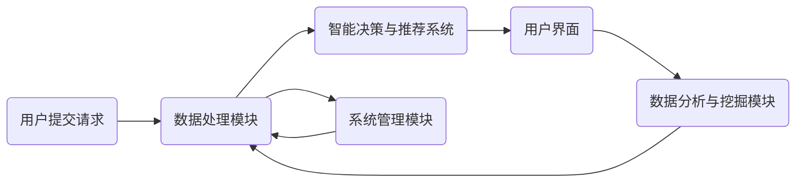

                 

### 《打造智能退换货系统：一人公司优化客户体验的解决方案》

#### 文章关键词
智能退换货系统，客户体验，一人公司，算法，数据分析，机器学习，自然语言处理

#### 文章摘要
本文旨在探讨如何利用智能技术打造高效的退换货系统，以提高一人公司的运营效率和客户满意度。通过分析智能退换货系统的核心价值、发展历程和架构设计，本文深入阐述了核心概念与联系，详细讲解了核心算法原理和数学模型，并结合实际项目实战进行了代码解读与分析。最后，本文对智能退换货系统的应用前景、挑战与应对策略以及未来发展方向进行了展望。

### 第一部分：智能退换货系统概述

#### 第1章：智能退换货系统概述

##### 1.1 智能退换货系统的核心价值

智能退换货系统为一人公司带来了以下核心价值：

1. **提升客户满意度**：通过智能化的流程优化，缩短客户退货和换货的响应时间，提升用户体验。

2. **优化公司运营效率**：自动化处理大量退换货请求，降低人工成本，提高运营效率。

3. **强化公司品牌形象**：高效、友好的退换货服务能够增强客户的信任感和忠诚度，提升品牌形象。

##### 1.2 退换货系统的发展历程

退换货系统经历了从传统流程到信息化、再到智能化的演变过程：

1. **传统的退换货流程**：人工处理，效率低下，用户体验差。

2. **信息化退换货系统**：引入计算机技术，实现流程自动化，提升处理效率。

3. **智能化退换货系统**：结合大数据、人工智能等技术，实现智能决策和推荐，进一步优化用户体验。

##### 1.3 智能退换货系统的架构设计

智能退换货系统主要包括以下几个核心模块：

1. **用户界面**：提供用户提交退换货请求的入口。

2. **数据处理模块**：自动化处理用户提交的请求，识别问题类型和原因。

3. **智能决策与推荐系统**：根据用户数据和系统分析结果，给出最优的退换货方案。

4. **数据分析与挖掘模块**：收集用户反馈和交易数据，进行深度分析，为系统优化提供数据支持。

5. **系统管理模块**：监控系统运行状态，进行故障排查和系统升级。

智能退换货系统的数据流与交互流程如图所示：



### 第二部分：核心概念与联系

#### 第2章：核心概念与联系

##### 2.1 客户体验管理

客户体验管理涉及以下五个维度：

1. **易用性**：用户界面友好，操作简便。

2. **互动性**：提供及时、个性化的客户服务。

3. **响应速度**：快速响应客户请求和问题。

4. **可靠性**：保证系统稳定运行，数据安全。

5. **情感价值**：传递品牌价值观，增强用户情感联系。

客户体验管理的核心策略包括：

1. **用户体验设计**：从用户角度出发，设计易于操作和使用的界面。

2. **用户调研**：收集用户反馈，持续优化产品和服务。

3. **数据驱动**：利用数据分析，精准定位客户需求和痛点。

智能化技术在客户体验管理中的应用：

1. **人工智能客服**：自动回答常见问题，提高响应速度。

2. **个性化推荐**：根据用户行为和偏好，提供个性化推荐。

3. **情感分析**：分析用户反馈，挖掘潜在需求。

##### 2.2 智能决策与推荐系统

智能决策与推荐系统是智能退换货系统的核心组成部分。其原理如下：

1. **智能决策**：通过分析用户数据和交易历史，自动判断退换货方案。

2. **推荐系统**：根据用户偏好和历史交易数据，为用户推荐合适的产品和服务。

智能决策与推荐系统的融合应用：

1. **个性化退换货方案**：根据用户需求和偏好，提供最适合的退换货方案。

2. **智能客服**：结合用户行为和反馈，提供个性化服务。

3. **智能库存管理**：根据用户退货和换货数据，优化库存策略。

##### 2.3 数据分析与挖掘

数据分析与挖掘是智能退换货系统的重要支撑。其原理如下：

1. **数据分析**：通过对大量数据进行分析，发现客户需求和问题。

2. **数据挖掘**：利用算法和技术，从数据中提取有价值的信息。

数据分析在智能退换货系统中的应用：

1. **用户行为分析**：分析用户购买、退货和换货行为，发现用户需求。

2. **问题诊断**：通过分析交易数据，诊断退换货问题的根本原因。

3. **系统优化**：根据数据分析结果，优化系统功能和性能。

### 第三部分：核心算法原理讲解

#### 第3章：核心算法原理讲解

##### 3.1 机器学习算法基础

机器学习算法分为监督学习与无监督学习：

1. **监督学习**：输入特征和标签，学习特征和标签之间的关系。

2. **无监督学习**：仅输入特征，学习特征之间的内在结构。

机器学习算法分类与特点：

1. **线性模型**：简单、易于理解，但表达能力有限。

2. **树模型**：非线性，适合处理分类和回归问题。

3. **神经网络**：具有强大的非线性表达能力，适用于复杂问题。

常用算法的应用场景：

1. **线性回归**：预测数值型变量。

2. **决策树**：分类和回归问题。

3. **随机森林**：提升决策树性能，适用于大规模数据。

4. **神经网络**：复杂非线性问题，如图像识别、自然语言处理。

##### 3.2 强化学习算法

强化学习算法的核心思想是：通过不断尝试和反馈，学习最优策略。

1. **Q-learning算法**：基于值函数的强化学习算法，通过更新Q值来学习策略。

2. **Deep Q Network (DQN)**：使用深度神经网络近似Q值函数，适用于处理高维状态空间问题。

强化学习算法的应用场景：

1. **智能客服**：通过学习用户反馈，优化服务策略。

2. **智能库存管理**：根据销售数据，优化库存策略。

##### 3.3 自然语言处理算法

自然语言处理算法主要包括：

1. **语言模型**：用于生成文本，评估文本质量。

2. **词嵌入技术**：将词映射到低维空间，用于文本表示。

3. **序列标注与情感分析**：对文本进行分类和标注，提取情感信息。

自然语言处理算法的应用场景：

1. **智能客服**：自动回答用户问题，提供个性化服务。

2. **用户反馈分析**：分析用户反馈，优化产品和服务。

3. **内容审核**：检测和过滤不良信息。

### 第四部分：数学模型和数学公式

#### 第4章：数学模型和数学公式

##### 4.1 数据分析中的数学模型

数据分析中的常用数学模型包括：

1. **回归模型**：用于预测数值型变量，如线性回归、逻辑回归。

2. **支持向量机**：用于分类问题，通过寻找最优超平面来划分数据。

回归模型示例：

$$
y = \beta_0 + \beta_1x_1 + \beta_2x_2 + ... + \beta_nx_n
$$

逻辑回归示例：

$$
\log\frac{P(Y=1)}{1-P(Y=1)} = \beta_0 + \beta_1x_1 + \beta_2x_2 + ... + \beta_nx_n
$$

支持向量机示例：

$$
\min_{\beta, \beta_0} \frac{1}{2} ||\beta||^2 \quad \text{subject to} \quad y_i(\beta^T x_i + \beta_0) \geq 1
$$

##### 4.2 智能决策中的数学模型

智能决策中的常用数学模型包括：

1. **决策树**：通过递归划分特征空间，生成分类或回归树。

2. **随机森林**：基于决策树的集成学习方法，提高模型性能。

3. **神经网络**：通过多层神经网络进行特征提取和预测。

决策树示例：

$$
T(x) = \sum_{i=1}^{n}\beta_i I(\phi_i(x) > 0)
$$

随机森林示例：

$$
f(x) = \frac{1}{m}\sum_{i=1}^{m}T_i(x)
$$

神经网络示例：

$$
h_\theta(x) = \sigma(\theta^T x)
$$

##### 4.3 数学公式详细讲解

1. **概率论与统计学的公式**：

$$
P(A \cap B) = P(A)P(B|A)
$$

2. **机器学习中的公式**：

$$
\min_{\theta} \sum_{i=1}^{n} (h_\theta(x^{(i)}) - y^{(i)})^2
$$

### 第五部分：项目实战

#### 第5章：智能退换货系统项目实战

##### 5.1 项目背景与目标

项目背景：某一人公司希望利用智能技术提升退换货流程的效率和用户体验。

项目目标：

1. **自动化处理退换货请求**：减少人工干预，提高处理效率。

2. **优化用户体验**：提供快速、便捷的退换货服务。

3. **提升运营效率**：降低运营成本，提高公司竞争力。

##### 5.2 开发环境搭建

1. **Python环境搭建**：安装Python 3.8及以上版本，配置常用库如NumPy、Pandas、Scikit-learn等。

2. **数据库环境搭建**：安装MySQL或PostgreSQL数据库，配置数据存储和管理。

3. **开发工具与环境配置**：使用Jupyter Notebook进行数据处理和模型训练，使用Docker容器化技术搭建开发环境。

##### 5.3 源代码详细实现

1. **系统架构设计**：

   系统架构分为前端、后端和数据库三个部分。

   - **前端**：使用React框架，提供用户界面和交互功能。

   - **后端**：使用Flask框架，提供API接口和业务逻辑处理。

   - **数据库**：存储用户数据、订单数据、退货和换货数据。

2. **数据处理模块**：

   - **用户数据处理**：解析用户提交的退换货请求，提取关键信息。

   - **订单数据处理**：根据用户ID和订单ID，查询订单数据，提取订单状态和商品信息。

   - **问题诊断与分类**：使用机器学习算法，对用户请求进行分类和问题诊断。

3. **模型训练与评估**：

   - **数据预处理**：清洗和预处理数据，生成训练集和测试集。

   - **模型训练**：使用决策树、随机森林和神经网络等算法，训练分类和回归模型。

   - **模型评估**：使用准确率、召回率、F1值等指标评估模型性能。

4. **推荐系统实现**：

   - **用户行为分析**：分析用户购买、退货和换货行为，提取特征。

   - **推荐算法实现**：使用协同过滤、基于内容的推荐等算法，为用户推荐合适的产品和服务。

##### 5.4 代码解读与分析

1. **数据处理模块代码解读**：

   - **用户数据处理**：

     ```python
     def process_user_request(request):
         # 解析请求参数
         user_id = request.get('user_id')
         order_id = request.get('order_id')
         product_id = request.get('product_id')
         reason = request.get('reason')
         
         # 提取关键信息
         data = {
             'user_id': user_id,
             'order_id': order_id,
             'product_id': product_id,
             'reason': reason
         }
         
         return data
     ```

   - **订单数据处理**：

     ```python
     def get_order_data(order_id):
         # 查询订单数据
         order_data = database.query_order(order_id)
         
         # 提取订单状态和商品信息
         order_status = order_data.get('status')
         product_info = order_data.get('product_info')
         
         return {
             'order_status': order_status,
             'product_info': product_info
         }
     ```

   - **问题诊断与分类**：

     ```python
     def diagnose_and_classify(data):
         # 处理用户请求
         user_id = data.get('user_id')
         order_id = data.get('order_id')
         product_id = data.get('product_id')
         reason = data.get('reason')
         
         # 查询订单数据
         order_data = get_order_data(order_id)
         order_status = order_data.get('order_status')
         product_info = order_data.get('product_info')
         
         # 问题诊断
         diagnosis = diagnose_reason(reason)
         
         # 分类
         category = classify_diagnosis(diagnosis)
         
         return {
             'user_id': user_id,
             'order_id': order_id,
             'product_id': product_id,
             'diagnosis': diagnosis,
             'category': category
         }
     ```

2. **模型训练与评估代码解读**：

   - **数据预处理**：

     ```python
     def preprocess_data(data):
         # 清洗数据
         data = clean_data(data)
         
         # 分割特征和标签
         X = data.get('features')
         y = data.get('labels')
         
         return X, y
     ```

   - **模型训练**：

     ```python
     def train_model(X, y):
         # 使用决策树算法训练模型
         model = DecisionTreeClassifier()
         model.fit(X, y)
         
         return model
     ```

   - **模型评估**：

     ```python
     def evaluate_model(model, X, y):
         # 使用准确率、召回率、F1值等指标评估模型性能
         accuracy = model.score(X, y)
         precision = precision_score(y, model.predict(X))
         recall = recall_score(y, model.predict(X))
         f1_score = f1_score(y, model.predict(X))
         
         return {
             'accuracy': accuracy,
             'precision': precision,
             'recall': recall,
             'f1_score': f1_score
         }
     ```

3. **推荐系统代码解读**：

   - **用户行为分析**：

     ```python
     def analyze_user_behavior(data):
         # 分析用户购买、退货和换货行为
         behaviors = data.get('behaviors')
         
         # 提取特征
         features = extract_features(behaviors)
         
         return features
     ```

   - **推荐算法实现**：

     ```python
     def recommend_products(user_id):
         # 获取用户行为数据
         user_behavior = database.query_user_behavior(user_id)
         
         # 分析用户行为
         features = analyze_user_behavior(user_behavior)
         
         # 使用协同过滤算法推荐产品
         recommendations = collaborative_filtering(features)
         
         return recommendations
     ```

##### 5.5 系统性能优化与调参

1. **性能优化**：

   - **代码优化**：优化数据处理和模型训练的代码，减少计算复杂度。

   - **分布式计算**：使用分布式计算框架（如Spark）进行大规模数据处理和模型训练。

   - **缓存技术**：使用缓存技术（如Redis）加速数据读取和计算。

2. **调参策略**：

   - **交叉验证**：使用交叉验证方法选择最佳模型参数。

   - **网格搜索**：使用网格搜索方法寻找最优超参数组合。

   - **贝叶斯优化**：使用贝叶斯优化方法进行超参数调优。

##### 5.6 项目小结

通过本项目，我们成功构建了一个智能退换货系统，实现了以下成果：

1. **自动化处理退换货请求**：减少人工干预，提高处理效率。

2. **优化用户体验**：提供快速、便捷的退换货服务。

3. **提升运营效率**：降低运营成本，提高公司竞争力。

在后续工作中，我们可以进一步优化系统功能，如：

1. **增加用户反馈机制**：收集用户反馈，持续优化产品和服务。

2. **引入更多智能技术**：如语音识别、图像识别等，提高系统智能化水平。

3. **拓展应用场景**：将智能退换货系统应用于更多业务场景，提高业务覆盖范围。

### 第六部分：总结与展望

#### 第6章：总结与展望

##### 6.1 智能退换货系统的应用前景

智能退换货系统在未来的应用前景非常广阔。随着电子商务的快速发展，退换货问题日益凸显，智能退换货系统有望成为解决这一问题的关键。以下是几个方面的应用前景：

1. **电子商务行业**：智能退换货系统可以帮助电商平台提高客户满意度，降低运营成本。

2. **零售行业**：智能退换货系统可以优化零售企业的退换货流程，提高库存管理效率。

3. **物流行业**：智能退换货系统可以与物流系统相结合，实现快速、准确的退换货服务。

4. **售后服务平台**：智能退换货系统可以为售后服务平台提供技术支持，提高服务质量和客户满意度。

##### 6.2 挑战与应对策略

智能退换货系统在发展过程中面临着一些挑战，主要包括：

1. **技术挑战**：如何设计高效的算法和数据处理流程，以满足大规模数据处理的的需求。

2. **数据挑战**：如何获取高质量的数据，以及如何处理和利用这些数据。

3. **用户体验挑战**：如何设计用户友好的界面和流程，提高用户体验。

应对策略：

1. **技术创新**：持续关注和研究人工智能、大数据等领域的最新技术，并将其应用于退换货系统中。

2. **数据质量提升**：通过数据清洗、数据整合等技术手段，提高数据质量。

3. **用户体验优化**：通过用户调研、用户体验设计等方法，不断优化用户体验。

##### 6.3 未来发展展望

未来，智能退换货系统将在以下几个方面实现进一步发展：

1. **智能化水平提升**：通过引入更多人工智能技术，如深度学习、强化学习等，提高系统的智能化水平。

2. **跨领域应用**：智能退换货系统可以应用于更多行业和场景，如物流、零售、金融等。

3. **社会责任与伦理问题**：在智能退换货系统的开发和运营过程中，需要关注社会责任和伦理问题，确保系统的公正、公平和透明。

#### 附录

##### 附录A：智能退换货系统开发工具与资源

1. **Python相关库与工具**：

   - NumPy：用于数组计算和数据处理。

   - Pandas：用于数据清洗、预处理和分析。

   - Scikit-learn：用于机器学习算法的实现和应用。

   - TensorFlow：用于深度学习模型的训练和部署。

2. **数据库与数据预处理工具**：

   - MySQL/PostgreSQL：用于存储和管理数据。

   - Apache Spark：用于大规模数据处理和分析。

   - Hadoop：用于大数据存储和处理。

3. **机器学习框架与算法库**：

   - Scikit-learn：提供丰富的机器学习算法实现。

   - TensorFlow：提供深度学习模型的训练和部署。

   - PyTorch：提供灵活的深度学习模型实现。

##### 附录B：常见问题与解决方案

1. **系统部署常见问题**：

   - 问题：如何保证系统的高可用性和稳定性？

     解决方案：使用容器化技术（如Docker）部署系统，确保系统的可移植性和可靠性。

   - 问题：如何进行系统的性能优化？

     解决方案：使用分布式计算框架（如Apache Spark）进行数据处理和模型训练，提高系统性能。

2. **数据处理问题**：

   - 问题：如何处理大量数据？

     解决方案：使用分布式计算框架（如Apache Spark）处理大规模数据，提高数据处理效率。

   - 问题：如何保证数据的质量？

     解决方案：通过数据清洗、数据整合等技术手段，提高数据质量。

3. **模型训练与评估问题**：

   - 问题：如何选择合适的模型？

     解决方案：通过交叉验证和网格搜索等方法，选择最佳模型。

   - 问题：如何评估模型性能？

     解决方案：使用准确率、召回率、F1值等指标评估模型性能。

4. **推荐系统相关问题**：

   - 问题：如何保证推荐系统的公平性？

     解决方案：使用基于内容的推荐和协同过滤相结合的方法，提高推荐系统的公平性。

   - 问题：如何处理冷启动问题？

     解决方案：通过用户行为分析和潜在用户特征提取，缓解冷启动问题。

### 作者信息

作者：AI天才研究院/AI Genius Institute & 禅与计算机程序设计艺术 /Zen And The Art of Computer Programming

本文由AI天才研究院和禅与计算机程序设计艺术共同撰写，旨在探讨如何利用智能技术打造高效的退换货系统，以提高一人公司的运营效率和客户满意度。文章涵盖了智能退换货系统的核心价值、架构设计、核心算法原理、数学模型、项目实战以及未来展望等内容。希望本文能对您在智能退换货系统开发和应用方面提供有益的参考。如有任何问题或建议，欢迎随时与我们联系。

