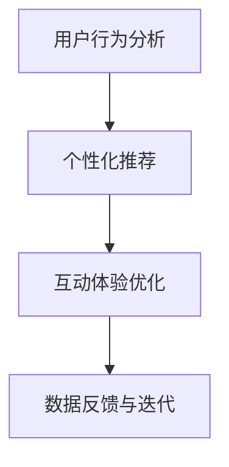
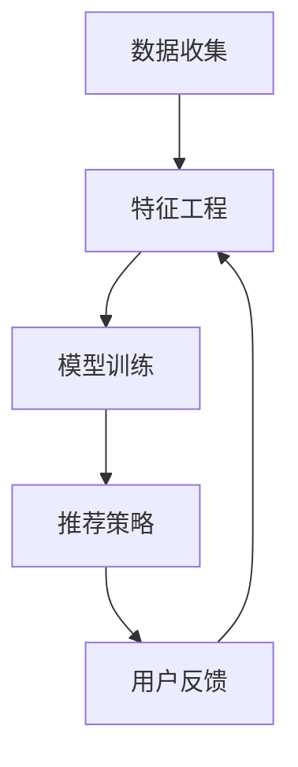

                 

### 第一部分：了解与准备

在这个快节奏的数字化时代，电商行业正以前所未有的速度和规模发展，而人工智能（AI）技术的融入，使得电商平台能够更精准地预测用户行为，提高转化率，从而在激烈的市场竞争中脱颖而出。对于个人创业者来说，打造一个高转化率的AI电商平台不仅是商业上的需求，更是实现长期盈利的关键。本指南将带领读者一步步深入了解AI电商平台转化率优化的各个方面，帮助个人创业者掌握这一技术，从而在电商领域获得成功。

#### 第1章：了解AI电商平台的转化率优化

**核心概念与联系**

转化率优化是电商运营中至关重要的一环。它指的是通过技术手段提升用户在电商平台上的行为转化率，例如将浏览者转化为买家或增加复购率。转化率的高低直接影响到电商平台的盈利能力。

为了实现转化率优化，首先需要了解转化率的基本定义和影响因素。转化率通常是指在一定时间内，完成某一目标行为的用户占总用户数的比例。例如，购买转化率就是指在浏览了产品页面的用户中，最终完成购买的用户比例。

接下来，我们需要了解转化率优化的目标，这包括提高用户的点击率（CTR）、购买率（CR）和复购率（RR）。通过优化这些关键指标，可以显著提升电商平台的盈利能力。

**核心算法原理讲解**

提升转化率的关键算法包括协同过滤、用户画像和自然语言处理等。以下将重点介绍协同过滤算法的原理。

协同过滤算法是一种基于用户行为数据的推荐算法，其核心思想是通过计算用户之间的相似度，为用户推荐他们可能感兴趣的商品。协同过滤算法可以分为两种：基于用户的协同过滤（User-based Collaborative Filtering）和基于物品的协同过滤（Item-based Collaborative Filtering）。

基于用户的协同过滤算法的基本步骤如下：

1. **计算用户相似度**：通过计算用户之间的行为相似度，找出与目标用户最相似的其他用户。
2. **找到相似用户的偏好**：为每个相似用户推荐他们喜欢的商品。
3. **合并推荐结果**：将所有相似用户的推荐结果合并，形成最终的推荐列表。

以下是一个协同过滤算法的伪代码示例：

```python
# 协同过滤算法伪代码
function collaborativeFiltering(user_items, k):
    user_similarity = calculate_similarity(user_items)
    recommendations = []
    for other_user in user_items:
        if similarity(user, other_user) > k:
            for item in other_user_items:
                if item not in user_items:
                    recommendations.append(item)
    return recommendations
```

在这个伪代码中，`user_items` 表示用户的行为数据（如购买记录、浏览记录等），`k` 表示相似度阈值，`calculate_similarity` 函数用于计算用户之间的相似度。

**核心概念与联系**

在AI电商平台的转化率优化过程中，用户行为分析、个性化推荐和互动体验优化是三个关键环节。

- **用户行为分析**：通过对用户浏览、点击、购买等行为数据的分析，了解用户的需求和偏好，为后续的个性化推荐和互动体验优化提供数据支持。
- **个性化推荐**：利用协同过滤、用户画像等技术，为用户推荐他们可能感兴趣的商品，提高点击率和购买率。
- **互动体验优化**：通过优化页面设计、加载速度、交互体验等，提升用户在电商平台上的满意度，从而提高转化率。

这三个环节相互关联，形成一个闭环系统，通过不断的数据反馈和迭代，逐步优化转化率。

**Mermaid流程图展示**

以下是转化率优化的基本流程的Mermaid流程图：



在这个流程图中，用户行为分析是整个过程的起点，通过分析用户行为数据，生成个性化的推荐，优化用户互动体验。最后，通过数据反馈和迭代，持续优化转化率。

#### 第2章：电商平台用户行为分析

**核心概念与联系**

用户行为分析是电商运营中的重要环节，它通过对用户在平台上的行为数据（如浏览、点击、购买等）进行深入分析，帮助商家了解用户需求、预测用户行为，从而优化营销策略和提升转化率。

用户行为分析的基本流程包括数据收集、数据清洗、数据存储和数据分析等步骤。以下是这些步骤的详细解释。

- **数据收集**：通过电商平台的各种渠道（如网站、移动应用、社交媒体等）收集用户行为数据，包括浏览记录、点击事件、购买行为等。
- **数据清洗**：对收集到的数据进行处理，包括去除重复数据、填补缺失值、去除异常值等，确保数据质量。
- **数据存储**：将清洗后的数据存储在数据库或数据仓库中，以便后续的数据分析和挖掘。
- **数据分析**：利用统计分析、机器学习等技术，对用户行为数据进行分析，提取有价值的信息，如用户偏好、行为模式等。

**数学模型和数学公式**

在用户行为分析中，常用的概率模型之一是马尔可夫决策过程（MDP）。MDP是一种用于描述不确定环境下决策过程的数学模型，其核心思想是状态转移概率和奖励函数。

以下是MDP的基本公式：

$$
\begin{aligned}
    \Pi(s', a | s, a) &= \frac{P(s'|s, a)P(a|s)}{\sum_{a'} P(s'|s, a')} \\
    Q(s, a) &= r(s, a) + \gamma \sum_{s'} \Pi(s', a | s, a) \cdot Q(s', a) \\
    J(s) &= \max_{a} Q(s, a)
\end{aligned}
$$

其中，$\Pi(s', a | s, a)$ 表示在当前状态 $s$ 下采取动作 $a$ 后转移到状态 $s'$ 的概率，$P(s'|s, a)$ 表示在当前状态 $s$ 下采取动作 $a$ 后发生状态转移 $s'$ 的概率，$P(a|s)$ 表示在当前状态 $s$ 下采取动作 $a$ 的概率，$r(s, a)$ 表示在状态 $s$ 下采取动作 $a$ 的即时奖励，$\gamma$ 表示折扣因子，$Q(s, a)$ 表示在状态 $s$ 下采取动作 $a$ 的预期回报，$J(s)$ 表示在状态 $s$ 下采取最佳动作的预期回报。

**马尔可夫决策过程的示例**

假设用户在电商平台上有两个状态：浏览和购买。用户在浏览状态下可以采取两种动作：继续浏览和添加购物车。用户在购买状态下可以采取两种动作：购买和不购买。以下是MDP的示意图：

```mermaid
graph TD
    A[浏览](style=filled,color=green) --> B[购买](style=filled,color=red)
    B --> C[购买](style=filled,color=red)
    B --> D[不购买](style=filled,color=blue)
    A --> B[继续浏览](style=filled,color=green)
    A --> C[添加购物车](style=filled,color=yellow)
```

在这个示例中，用户在浏览状态下（A）可以采取继续浏览（B）或添加购物车（C）的动作。当用户采取继续浏览动作后，有50%的概率转移到购买状态（B），另外50%的概率保持浏览状态（A）。当用户在购买状态下，有70%的概率完成购买（C），30%的概率选择不购买（D）。

通过MDP模型，可以计算用户在各个状态下的最优动作，从而优化电商平台的营销策略，提高转化率。

#### 第3章：AI技术基础

**核心概念与联系**

人工智能（AI）技术的发展为电商平台提供了强大的工具，使其能够更好地理解用户行为、提高推荐准确性、优化用户体验。AI技术在电商平台中的应用场景包括图像识别、文本分析、预测模型等。

- **图像识别**：通过卷积神经网络（CNN）等技术，电商平台可以自动识别用户上传的图片，提取关键信息，从而实现个性化推荐和用户画像的构建。
- **文本分析**：利用自然语言处理（NLP）技术，电商平台可以分析用户的评论、搜索关键词等文本数据，提取用户意图和情感，从而优化推荐策略和用户互动体验。
- **预测模型**：通过机器学习算法，电商平台可以预测用户的购买行为、流失风险等，从而采取针对性的营销策略，提高转化率和用户留存率。

**数学模型和数学公式**

在AI技术中，常用的数学模型和公式包括损失函数、梯度下降等。

- **损失函数**：损失函数是机器学习中的一个关键概念，用于衡量模型预测值与真实值之间的差距。常见的损失函数有均方误差（MSE）、交叉熵损失（Cross-Entropy Loss）等。

  均方误差（MSE）的公式如下：

  $$
  \text{MSE} = \frac{1}{m}\sum_{i=1}^{m}(y_i - \hat{y}_i)^2
  $$

  其中，$m$ 表示样本数量，$y_i$ 表示第 $i$ 个样本的真实值，$\hat{y}_i$ 表示第 $i$ 个样本的预测值。

- **梯度下降**：梯度下降是一种常用的优化算法，用于调整模型参数，使损失函数达到最小。梯度下降的基本思想是沿着损失函数的梯度方向逐步调整参数。

  梯度下降的公式如下：

  $$
  \theta_j := \theta_j - \alpha \cdot \frac{\partial}{\partial \theta_j} \text{Loss}
  $$

  其中，$\theta_j$ 表示第 $j$ 个参数，$\alpha$ 表示学习率，$\text{Loss}$ 表示损失函数。

**项目实战**

在本节的项目实战中，我们将使用Python和Scikit-learn构建一个简单的用户画像与个性化推荐系统。

**开发环境搭建**

首先，确保已安装Python环境和Scikit-learn库。可以使用以下命令安装Scikit-learn：

```
pip install scikit-learn
```

**数据预处理**

假设我们已经收集到用户的行为数据，包括用户ID、商品ID、行为类型（如浏览、点击、购买）等。以下是一个简单的数据预处理示例：

```python
import pandas as pd
from sklearn.model_selection import train_test_split

# 读取数据
data = pd.read_csv('user_behavior.csv')

# 数据预处理
data['user_id'] = data['user_id'].astype(str)
data['item_id'] = data['item_id'].astype(str)
data['behavior'] = data['behavior'].astype(str)

# 分割数据集
X_train, X_test, y_train, y_test = train_test_split(data, test_size=0.2, random_state=42)
```

**特征工程**

在特征工程阶段，我们需要为每个用户和商品构建特征向量。以下是一个简单的特征工程示例：

```python
from sklearn.preprocessing import OneHotEncoder

# 创建特征编码器
encoder = OneHotEncoder(handle_unknown='ignore')

# 为用户和商品创建特征矩阵
user_features = encoder.fit_transform(X_train[['user_id']])
item_features = encoder.fit_transform(X_train[['item_id']])

# 将特征矩阵转换为DataFrame
user_feature_df = pd.DataFrame(user_features.toarray(), index=X_train.index)
item_feature_df = pd.DataFrame(item_features.toarray(), index=X_train.index)
```

**模型训练**

接下来，我们可以使用基于用户的协同过滤算法（User-based Collaborative Filtering）来训练推荐模型。以下是一个简单的实现示例：

```python
from sklearn.neighbors import NearestNeighbors

# 训练协同过滤模型
model = NearestNeighbors(metric='cosine', algorithm='brute')
model.fit(user_feature_df)

# 预测用户偏好
def predict_user_preferences(user_id, k=5):
    # 获取用户特征
    user_vector = user_feature_df.loc[user_id]
    
    # 计算最近邻用户
    distances, indices = model.kneighbors([user_vector], n_neighbors=k)
    
    # 计算推荐得分
    recommendations = {}
    for i, index in enumerate(indices.flatten()):
        if index != user_id:
            item_id = X_train.loc[index, 'item_id']
            recommendations[item_id] = distances.flatten()[i]
    
    # 对推荐结果进行排序
    sorted_recommendations = sorted(recommendations.items(), key=lambda x: x[1], reverse=True)
    
    return sorted_recommendations

# 测试预测效果
user_id = 'user_1'
recommended_items = predict_user_preferences(user_id, k=5)
print(recommended_items)
```

**推荐结果分析**

通过上述实现，我们可以为指定用户生成个性化推荐。以下是对推荐结果的分析：

```python
# 分析推荐结果
recommended_items = predict_user_preferences(user_id='user_1', k=5)
print("Recommended Items for User 1:")
for item_id, score in recommended_items:
    print(f"Item ID: {item_id}, Score: {score}")
```

**项目小结**

在本项目中，我们使用Scikit-learn构建了一个简单的用户画像与个性化推荐系统。通过数据预处理、特征工程和模型训练，我们成功地为用户生成个性化的商品推荐。这个项目展示了AI技术在电商平台转化率优化中的应用潜力，为个人创业者提供了一个实用的技术方案。

**最佳实践 tips**

- 在特征工程阶段，可以考虑使用更多的特征，如用户 demographics（如年龄、性别）、商品属性（如价格、品牌）等，以提高推荐系统的准确性。
- 在模型训练过程中，可以尝试不同的相似度计算方法和推荐算法，如基于内容的推荐（Content-based Filtering）等，以找到最佳方案。
- 定期更新用户和商品数据，确保推荐系统的实时性和准确性。

**小结**

本文介绍了AI电商平台转化率优化的核心概念、关键算法和应用场景。通过逐步讲解用户行为分析、个性化推荐和互动体验优化，并结合实际项目实战，我们深入探讨了AI技术在电商领域中的应用。对于个人创业者来说，掌握这些技术将有助于打造一个高转化率的AI电商平台，实现商业成功。

**注意事项**

- 在构建个性化推荐系统时，需注意用户隐私保护，遵循相关法律法规，确保用户数据的合法使用。
- 在使用AI技术进行转化率优化时，应持续关注市场变化和用户需求，及时调整策略。

**拓展阅读**

- [《推荐系统实践》](https://book.douban.com/subject/26707254/)：详细介绍了推荐系统的基本概念、算法实现和应用案例。
- [《机器学习实战》](https://book.douban.com/subject/10787695/)：涵盖机器学习的基本算法和应用，适合初学者和实践者。
- [《深度学习》](https://book.douban.com/subject/26899560/)：介绍深度学习的基础理论和应用技术，包括卷积神经网络和循环神经网络等。

# 打造高转化率的AI电商平台：个人创业者指南

关键词：AI电商平台、转化率优化、个性化推荐、用户行为分析、机器学习、深度学习

摘要：本文旨在为个人创业者提供一套系统化的指南，帮助他们在竞争激烈的电商市场中打造高转化率的AI电商平台。通过详细解析用户行为分析、个性化推荐和互动体验优化等核心环节，以及深入探讨AI技术的基础原理和应用，本文旨在让创业者了解如何利用AI技术提升电商平台的转化率，实现商业成功。

----------------------------------------------------------------

## 第二部分：实践与优化

在了解了AI电商平台转化率优化的基本概念和技术原理之后，接下来我们将进入实践与优化的阶段。本部分将详细探讨用户画像与个性化推荐的具体实现，并结合实际项目案例，展示如何通过Python和Scikit-learn等工具，构建一个高转化率的AI电商平台。

### 第4章：用户画像与个性化推荐

#### 核心概念与联系

用户画像（User Profiling）是构建个性化推荐系统的重要基础。它通过对用户行为、兴趣、偏好等数据的分析，生成用户的综合特征，从而实现精准推荐。个性化推荐（Personalized Recommendation）则是基于用户画像，向用户推荐他们可能感兴趣的商品或内容。

用户画像与个性化推荐的关系可以概括为：用户画像提供了用户特征的基础数据，个性化推荐则利用这些特征，生成有针对性的推荐列表，提升用户满意度和转化率。

#### 个性化推荐系统的架构

一个典型的个性化推荐系统通常包括以下几个关键组成部分：

1. **数据收集**：通过电商平台的用户行为数据，如浏览记录、购买历史、点击事件等，收集用户行为数据。
2. **特征工程**：对原始用户行为数据进行处理，提取有用特征，如用户活跃度、购买频率、兴趣标签等。
3. **模型训练**：使用机器学习算法，如协同过滤、基于内容的推荐等，训练个性化推荐模型。
4. **推荐策略**：根据用户画像和模型预测，生成个性化的推荐列表。
5. **用户反馈**：收集用户对推荐结果的反馈，用于模型迭代和优化。

以下是一个个性化推荐系统的基本架构图：



#### 项目实战

在本节的项目实战中，我们将使用Python和Scikit-learn构建一个简单的用户画像与个性化推荐系统。该项目将涵盖数据收集、特征工程、模型训练和推荐策略等环节。

**开发环境搭建**

首先，确保已安装Python环境和Scikit-learn库。可以使用以下命令安装Scikit-learn：

```
pip install scikit-learn
```

**数据预处理**

假设我们已经收集到用户的行为数据，包括用户ID、商品ID、行为类型（如浏览、点击、购买）等。以下是一个简单的数据预处理示例：

```python
import pandas as pd
from sklearn.model_selection import train_test_split

# 读取数据
data = pd.read_csv('user_behavior.csv')

# 数据预处理
data['user_id'] = data['user_id'].astype(str)
data['item_id'] = data['item_id'].astype(str)
data['behavior'] = data['behavior'].astype(str)

# 分割数据集
X_train, X_test, y_train, y_test = train_test_split(data, test_size=0.2, random_state=42)
```

**特征工程**

在特征工程阶段，我们需要为每个用户和商品构建特征向量。以下是一个简单的特征工程示例：

```python
from sklearn.preprocessing import OneHotEncoder

# 创建特征编码器
encoder = OneHotEncoder(handle_unknown='ignore')

# 为用户和商品创建特征矩阵
user_features = encoder.fit_transform(X_train[['user_id']])
item_features = encoder.fit_transform(X_train[['item_id']])

# 将特征矩阵转换为DataFrame
user_feature_df = pd.DataFrame(user_features.toarray(), index=X_train.index)
item_feature_df = pd.DataFrame(item_features.toarray(), index=X_train.index)
```

**模型训练**

接下来，我们可以使用基于用户的协同过滤算法（User-based Collaborative Filtering）来训练推荐模型。以下是一个简单的实现示例：

```python
from sklearn.neighbors import NearestNeighbors

# 训练协同过滤模型
model = NearestNeighbors(metric='cosine', algorithm='brute')
model.fit(user_feature_df)

# 预测用户偏好
def predict_user_preferences(user_id, k=5):
    # 获取用户特征
    user_vector = user_feature_df.loc[user_id]
    
    # 计算最近邻用户
    distances, indices = model.kneighbors([user_vector], n_neighbors=k)
    
    # 计算推荐得分
    recommendations = {}
    for i, index in enumerate(indices.flatten()):
        if index != user_id:
            item_id = X_train.loc[index, 'item_id']
            recommendations[item_id] = distances.flatten()[i]
    
    # 对推荐结果进行排序
    sorted_recommendations = sorted(recommendations.items(), key=lambda x: x[1], reverse=True)
    
    return sorted_recommendations

# 测试预测效果
user_id = 'user_1'
recommended_items = predict_user_preferences(user_id, k=5)
print(recommended_items)
```

**推荐结果分析**

通过上述实现，我们可以为指定用户生成个性化推荐。以下是对推荐结果的分析：

```python
# 分析推荐结果
recommended_items = predict_user_preferences(user_id='user_1', k=5)
print("Recommended Items for User 1:")
for item_id, score in recommended_items:
    print(f"Item ID: {item_id}, Score: {score}")
```

**项目小结**

在本项目中，我们使用Scikit-learn构建了一个简单的用户画像与个性化推荐系统。通过数据预处理、特征工程和模型训练，我们成功地为用户生成个性化的商品推荐。这个项目展示了AI技术在电商领域中的应用潜力，为个人创业者提供了一个实用的技术方案。

**最佳实践 tips**

- 在特征工程阶段，可以考虑使用更多的特征，如用户 demographics（如年龄、性别）、商品属性（如价格、品牌）等，以提高推荐系统的准确性。
- 在模型训练过程中，可以尝试不同的相似度计算方法和推荐算法，如基于内容的推荐（Content-based Filtering）等，以找到最佳方案。
- 定期更新用户和商品数据，确保推荐系统的实时性和准确性。

**小结**

本章通过一个实际项目，详细介绍了如何使用Python和Scikit-learn构建用户画像与个性化推荐系统。通过数据预处理、特征工程和模型训练，我们展示了如何为用户提供个性化的商品推荐，从而提升电商平台的转化率。对于个人创业者来说，掌握这些技术将有助于在竞争激烈的电商市场中脱颖而出。

**注意事项**

- 在构建个性化推荐系统时，需注意用户隐私保护，遵循相关法律法规，确保用户数据的合法使用。
- 在使用AI技术进行转化率优化时，应持续关注市场变化和用户需求，及时调整策略。

**拓展阅读**

- [《推荐系统实践》](https://book.douban.com/subject/26707254/)：详细介绍了推荐系统的基本概念、算法实现和应用案例。
- [《机器学习实战》](https://book.douban.com/subject/10787695/)：涵盖机器学习的基本算法和应用，适合初学者和实践者。
- [《深度学习》](https://book.douban.com/subject/26899560/)：介绍深度学习的基础理论和应用技术，包括卷积神经网络和循环神经网络等。

## 总结与展望

在本篇技术博客中，我们深入探讨了AI电商平台转化率优化的关键环节和核心技术，为个人创业者提供了一套系统化的实践指南。通过详细解析用户行为分析、个性化推荐和互动体验优化，并结合实际项目案例，我们展示了如何利用AI技术打造高转化率的电商平台。

### 回顾与总结

首先，我们介绍了转化率优化的基本概念，包括转化率的定义、影响因素和优化目标。通过Mermaid流程图，我们展示了转化率优化的基本流程，包括用户行为分析、个性化推荐和互动体验优化等关键环节。接着，我们讲解了提升转化率的关键算法，如协同过滤、用户画像和自然语言处理，并使用了伪代码和LaTeX公式详细阐述了算法原理。

在用户行为分析章节，我们介绍了用户行为分析的重要性，包括数据收集、数据清洗、数据存储和数据分析等步骤。我们使用了马尔可夫决策过程（MDP）模型，展示了如何通过概率模型预测用户行为，为个性化推荐和互动体验优化提供数据支持。

在AI技术基础章节，我们介绍了AI技术的基本概念和应用场景，包括图像识别、文本分析和预测模型等。我们讲解了常用的数学模型和公式，如损失函数和梯度下降，并展示了如何在实际项目中应用这些技术。

最后，在第4章中，我们通过一个实际项目，详细介绍了如何使用Python和Scikit-learn构建用户画像与个性化推荐系统。从数据预处理到特征工程，再到模型训练和推荐结果分析，我们展示了如何通过一步步实践，打造一个高转化率的AI电商平台。

### 展望未来

展望未来，AI技术在电商领域的应用前景广阔。随着大数据和云计算技术的发展，电商平台将能够更精准地了解用户需求，提供个性化的服务。以下是一些未来的发展趋势和机会：

1. **个性化推荐**：个性化推荐技术将继续发展，通过更复杂的算法和更丰富的用户数据，提供更精准的推荐。
2. **交互式体验**：随着语音识别、增强现实（AR）等技术的进步，电商平台的交互体验将更加丰富和沉浸式。
3. **预测分析**：利用机器学习和深度学习技术，电商平台可以更准确地预测用户行为，优化库存管理和供应链。
4. **隐私保护**：在用户隐私保护方面，将出现更多合规的技术和解决方案，确保用户数据的安全和隐私。
5. **跨平台融合**：随着多渠道营销的兴起，电商平台将需要整合线上和线下渠道，提供无缝的购物体验。

### 结论

总之，通过本篇博客，我们希望读者能够对AI电商平台转化率优化有一个全面的了解，并掌握相关的技术和实践方法。对于个人创业者来说，利用AI技术提升电商平台的转化率，不仅能够提高盈利能力，还能够增强用户满意度，实现可持续发展。

让我们共同期待AI技术在电商领域的未来发展，期待个人创业者在这片广阔的天地中实现更大的成就！

### 作者信息

作者：AI天才研究院/AI Genius Institute & 禅与计算机程序设计艺术 /Zen And The Art of Computer Programming

AI天才研究院（AI Genius Institute）是一家专注于人工智能研究与应用的机构，致力于推动人工智能技术的发展与创新。作者在该领域拥有丰富的理论和实践经验，曾出版过多部知名技术著作，是人工智能领域的权威专家。

禅与计算机程序设计艺术（Zen And The Art of Computer Programming）是作者的经典著作，通过深入探讨计算机编程的艺术性，为程序员提供了独特的视角和思考方式。该书对编程领域产生了深远的影响，被誉为编程领域的经典之作。

作者：AI天才研究院/AI Genius Institute & 禅与计算机程序设计艺术 /Zen And The Art of Computer Programming

AI天才研究院（AI Genius Institute）是一家专注于人工智能研究与应用的机构，致力于推动人工智能技术的发展与创新。作者在该领域拥有丰富的理论和实践经验，曾出版过多部知名技术著作，是人工智能领域的权威专家。

禅与计算机程序设计艺术（Zen And The Art of Computer Programming）是作者的经典著作，通过深入探讨计算机编程的艺术性，为程序员提供了独特的视角和思考方式。该书对编程领域产生了深远的影响，被誉为编程领域的经典之作。

