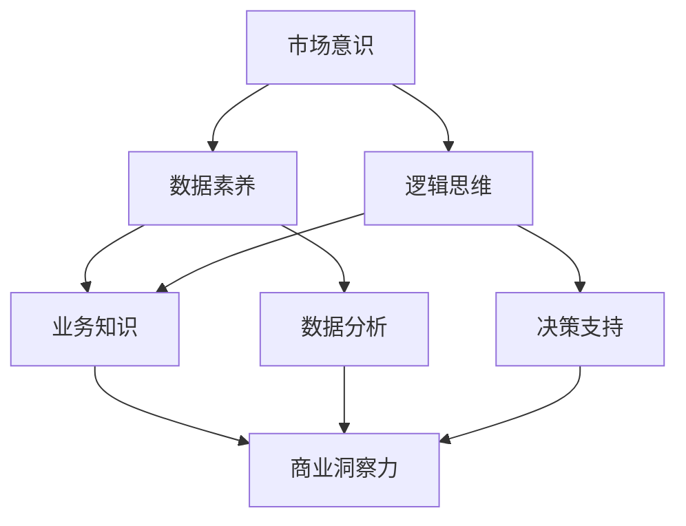

                 

### 文章标题

《技术人如何提升商业洞察力：从技术思维到商业思维的转变》

### 关键词

- 商业洞察力
- 技术思维
- 商业思维
- 数据驱动决策
- 业务流程优化
- 敏捷开发
- 数学建模
- 项目实战

### 摘要

本文旨在探讨技术人如何提升商业洞察力，实现从技术思维向商业思维的转变。文章首先介绍了技术人在职场中的角色转变和商业思维的重要性，然后对比了技术思维与商业思维的差异与融合路径。接着，深入探讨了商业洞察力的定义、重要性及要素，并提出了技术人提升商业洞察力的方法。随后，文章讲解了数据驱动决策、业务流程优化与敏捷开发等核心算法原理，并通过数学模型和公式进行详细阐述。最后，通过项目实战案例，解析了技术人在商业策略制定中的应用，并总结了提升商业洞察力的策略与未来展望。希望通过本文，技术人能够更好地理解商业思维，提升自身的商业洞察力，实现职业发展的跨越。

### 目录大纲

#### 第一部分：引言

1. **第1章：技术人的职业发展与商业思维**
   - 1.1 技术人在职场中的角色转变
   - 1.2 商业思维的重要性
   - 1.3 技术与商业的结合点

2. **第2章：技术思维与商业思维的对比与融合**
   - 2.1 技术思维的局限
   - 2.2 商业思维的优势
   - 2.3 技术思维与商业思维的融合路径

#### 第二部分：核心概念与联系

3. **第3章：商业洞察力的定义与要素**
   - 3.1 商业洞察力的含义
   - 3.2 商业洞察力的重要性
   - 3.3 商业洞察力的要素

4. **第4章：技术人提升商业洞察力的方法**
   - 4.1 深度了解行业趋势
   - 4.2 学习商业知识
   - 4.3 培养跨部门沟通能力
   - 4.4 练习商业分析技能

#### 第三部分：核心算法原理讲解

5. **第5章：数据驱动决策**
   - 5.1 数据分析的基本概念
   - 5.2 数据驱动决策的算法原理
   - 5.3 数据驱动决策的案例分析

6. **第6章：业务流程优化与敏捷开发**
   - 6.1 业务流程优化的方法
   - 6.2 敏捷开发的原理与实践
   - 6.3 业务流程优化与敏捷开发的结合

#### 第四部分：数学模型和数学公式

7. **第7章：商业模型与数学建模**
   - 7.1 商业模型的基本概念
   - 7.2 数学建模的基本原理
   - 7.3 商业模型中的数学公式及应用

#### 第五部分：项目实战

8. **第8章：技术人如何制定商业策略**
   - 8.1 商业策略的定义与类型
   - 8.2 商业策略的制定流程
   - 8.3 技术人在商业策略制定中的应用

9. **第9章：案例解析：技术人如何提升商业洞察力**
   - 9.1 案例一：技术人如何通过数据分析提升销售额
   - 9.2 案例二：技术人如何通过业务流程优化提高效率
   - 9.3 案例三：技术人如何通过敏捷开发推动项目进展

#### 第六部分：总结与展望

10. **第10章：技术人如何持续提升商业洞察力**
    - 10.1 持续学习的重要性
    - 10.2 提升商业洞察力的策略
    - 10.3 未来商业洞察力的发展趋势

11. **第11章：结论**
    - 11.1 全书总结
    - 11.2 对技术人的建议
    - 11.3 未来展望：技术人与商业思维的深度融合

---

### 第一部分：引言

在当今快速变化的技术和商业环境中，技术人的职业发展面临前所未有的机遇和挑战。传统的技术角色越来越依赖于商业思维，这不仅仅是为了更好地与业务团队合作，更是为了在复杂的市场竞争中立于不败之地。商业思维不仅关乎如何创造价值，还关乎如何有效管理和利用资源，以实现企业的长期目标。因此，技术人如何提升商业洞察力，实现从技术思维到商业思维的转变，成为了一个关键问题。

**第1章：技术人的职业发展与商业思维**

#### 1.1 技术人在职场中的角色转变

随着技术的不断进步，技术人的角色也在发生深刻变化。过去，技术人主要负责开发和维护系统，关注的是代码的质量和系统的稳定性。然而，在当今的商业环境中，技术人的角色变得更加多元和复杂。他们不仅需要具备扎实的技术能力，还需要具备商业思维，能够理解业务需求，参与业务决策，推动技术项目的顺利进行。

这种角色转变体现在多个方面。首先，技术人需要与业务团队紧密合作，了解业务流程和业务需求，确保技术解决方案能够满足业务目标。其次，技术人需要具备项目管理的能力，能够合理分配资源，确保项目按时交付。此外，技术人还需要具备一定的商业洞察力，能够预见市场变化，为企业的战略规划提供技术支持。

#### 1.2 商业思维的重要性

商业思维的重要性在于，它能够帮助技术人更好地理解企业的商业目标，从而设计出更具商业价值的技术解决方案。商业思维包括对市场趋势的敏锐洞察，对商业模式的深刻理解，以及对资源的有效管理。这些能力不仅能够提升技术人的职业竞争力，还能够为企业的长期发展提供有力支持。

商业思维还能够帮助技术人更好地与业务团队沟通。在许多情况下，技术人和业务团队之间的沟通障碍源于对业务需求和目标的不同理解。拥有商业思维的技术人能够更好地理解业务团队的期望，从而提出更具针对性和可行性的技术方案。

#### 1.3 技术与商业的结合点

技术与商业的结合点主要体现在以下几个方面：

1. **数据分析**：通过数据分析，技术人可以深入了解用户行为和市场趋势，为业务决策提供数据支持。
2. **业务流程优化**：技术人可以通过自动化和优化业务流程，提高工作效率，降低成本。
3. **敏捷开发**：敏捷开发方法强调快速迭代和持续交付，有助于企业更好地适应市场变化。
4. **技术创新**：技术人可以通过技术创新，推动企业的业务发展，提升企业的核心竞争力。

技术与商业的结合不仅能够提升企业的运营效率，还能够为企业带来新的商业机会。通过商业思维，技术人可以更好地发现和利用这些机会，实现个人和企业的共同成长。

### 第二部分：技术思维与商业思维的对比与融合

#### 2.1 技术思维的局限

技术思维通常关注于技术本身，强调逻辑性、精确性和可重复性。这种思维方式有助于解决复杂的技术问题，但在面对商业问题时，往往存在以下局限：

1. **缺乏商业视角**：技术人往往专注于技术实现，而忽视了商业目标和市场需求。
2. **忽视用户体验**：技术人可能过于关注技术实现，而忽视了用户的需求和体验。
3. **资源限制**：技术人可能无法全面理解企业的资源限制，导致技术方案不切实际。

#### 2.2 商业思维的优势

商业思维则更加关注商业目标和市场需求，强调灵活性和适应性。商业思维的优势在于：

1. **市场洞察力**：商业思维有助于技术人更好地理解市场趋势和用户需求。
2. **资源管理**：商业思维能够帮助技术人更有效地利用企业的资源。
3. **业务导向**：商业思维使技术人能够从业务角度出发，设计出更具商业价值的技术解决方案。

#### 2.3 技术思维与商业思维的融合路径

要实现技术思维与商业思维的融合，技术人可以采取以下路径：

1. **学习商业知识**：技术人可以通过学习商业模式、市场营销、财务管理等商业知识，提升自身的商业洞察力。
2. **跨部门合作**：技术人应积极参与跨部门的项目，了解业务流程和业务需求，提升跨部门沟通能力。
3. **实践商业分析**：技术人可以通过参与商业分析工作，提升对业务数据的理解和分析能力。
4. **持续学习**：技术人应保持持续学习的态度，不断更新自己的知识和技能，适应商业环境的变化。

通过上述路径，技术人可以逐步实现从技术思维到商业思维的转变，提升自身的职业竞争力，为企业的长期发展做出贡献。

### 第二部分：核心概念与联系

在探讨技术人如何提升商业洞察力之前，我们需要明确几个核心概念：商业洞察力、技术思维和商业思维。这些概念之间存在着紧密的联系，理解这些联系有助于我们更深入地理解提升商业洞察力的方法。

#### 3.1 商业洞察力的定义与要素

商业洞察力是指对商业环境中各种信息的理解、分析和应用能力。它不仅包括对市场趋势、用户需求和竞争对手的洞察，还包括对商业机会的识别和利用能力。商业洞察力通常包括以下几个要素：

1. **信息收集**：商业洞察力始于对各种信息的收集，包括市场数据、用户反馈、竞争对手信息等。
2. **数据分析**：收集到的信息需要通过数据分析进行加工，以揭示隐藏在数据背后的趋势和规律。
3. **逻辑推理**：基于数据分析的结果，商业洞察力需要通过逻辑推理来形成对商业问题的理解。
4. **决策支持**：商业洞察力最终要转化为实际的业务决策，以实现商业目标。

#### 3.2 商业洞察力的重要性

商业洞察力对技术人来说具有重要意义。首先，它有助于技术人更好地理解业务需求，设计出更具商业价值的技术解决方案。其次，商业洞察力能够提升技术人在团队中的影响力，使其在业务决策中发挥更大的作用。最后，商业洞察力有助于技术人在快速变化的市场环境中保持竞争力，适应不断变化的商业环境。

#### 3.3 商业洞察力的要素

为了提升商业洞察力，技术人需要关注以下几个关键要素：

1. **市场意识**：了解市场趋势、用户需求和市场动态，对技术人来说至关重要。
2. **数据素养**：数据分析能力是商业洞察力的基础，技术人需要掌握基本的数据分析工具和方法。
3. **逻辑思维**：良好的逻辑思维有助于技术人在面对复杂商业问题时，能够快速找到解决路径。
4. **业务知识**：对业务流程、商业模式和市场营销等方面的了解，有助于技术人更好地理解商业需求。

#### 3.4 核心概念原理之间的关系架构

为了更好地理解商业洞察力的核心概念，我们可以通过Mermaid流程图来展示这些概念之间的关系。



在这个流程图中，市场意识和数据素养是商业洞察力形成的基础，逻辑思维和业务知识是关键要素，而数据分析能力和决策支持能力则是实现商业洞察力的关键手段。

通过这个关系架构，我们可以更清晰地看到商业洞察力的各个要素及其相互关系。了解这些核心概念和联系，有助于技术人更好地提升商业洞察力，实现从技术思维到商业思维的转变。

#### 3.5 技术人提升商业洞察力的方法

技术人要想提升商业洞察力，需要在多个方面进行努力和提升。以下是一些具体的方法：

#### 4.1 深度了解行业趋势

技术人需要时刻关注行业趋势，包括新兴技术、市场动态和竞争对手的行动。通过深入分析行业报告、参加行业会议和研讨会，技术人可以获取最新的行业信息，从而对市场有更全面的了解。

1. **阅读行业报告**：定期阅读行业报告，可以了解市场的发展趋势、技术创新和竞争态势。
2. **参加行业会议**：参加行业会议和研讨会，不仅可以了解行业动态，还可以与同行交流，拓宽视野。
3. **建立信息渠道**：通过建立信息渠道，如订阅行业新闻、加入专业社群和关注行业专家，技术人可以持续获取行业信息。

#### 4.2 学习商业知识

技术人需要学习商业知识，包括商业模式、市场营销、财务管理等。这些知识有助于技术人更好地理解企业的商业运作，从而在设计技术解决方案时，能够从商业角度出发，提出更具价值的建议。

1. **参加商业课程**：可以通过参加在线课程、工作坊和讲座，学习商业基础知识。
2. **阅读商业书籍**：通过阅读商业书籍，了解不同行业的商业模式和营销策略。
3. **参加企业培训**：企业通常会提供内部培训课程，技术人可以通过这些课程，学习商业知识。

#### 4.3 培养跨部门沟通能力

技术人需要与业务、市场、产品等多个部门进行沟通，因此培养跨部门沟通能力至关重要。良好的沟通能力有助于技术人更好地理解业务需求，确保技术解决方案能够满足业务目标。

1. **主动沟通**：主动与业务团队沟通，了解他们的需求和痛点。
2. **倾听与反馈**：倾听业务团队的意见，并给予积极的反馈，以促进双方的沟通和理解。
3. **参与跨部门项目**：通过参与跨部门项目，提高跨部门协作能力。

#### 4.4 练习商业分析技能

技术人需要练习商业分析技能，包括数据分析、数据可视化、商业建模等。这些技能有助于技术人从数据中提取有价值的信息，为商业决策提供支持。

1. **学习数据分析工具**：掌握常用的数据分析工具，如Excel、Python等。
2. **实践数据分析项目**：通过实际数据分析项目，提高数据分析能力。
3. **学习商业建模方法**：了解商业建模的基本原理和方法，如SWOT分析、PEST分析等。

通过上述方法，技术人可以逐步提升商业洞察力，实现从技术思维到商业思维的转变。这不仅有助于技术人在职场中取得更大的成功，也有助于企业实现长期的战略目标。

### 第三部分：核心算法原理讲解

#### 5.1 数据驱动决策

数据驱动决策是一种基于数据分析的决策方法，它通过收集和分析大量数据，揭示隐藏在数据背后的规律和趋势，从而为决策提供科学依据。数据驱动决策的核心思想是，通过数据来指导决策，减少决策中的不确定性和主观性。

#### 5.1.1 数据分析的基本概念

数据分析是指对大量数据进行分析和处理，以发现数据中的规律、趋势和模式。数据分析的基本概念包括：

1. **数据收集**：通过各种途径收集数据，如问卷调查、市场调研、传感器采集等。
2. **数据清洗**：对收集到的数据进行清洗和预处理，包括去除重复数据、处理缺失值等。
3. **数据存储**：将清洗后的数据存储到数据库或数据仓库中，以便进行后续分析。
4. **数据探索性分析**：通过可视化工具和统计方法，对数据进行初步分析，发现数据中的趋势和异常。
5. **数据建模**：建立数学模型，对数据进行深入分析，提取有用信息。

#### 5.1.2 数据驱动决策的算法原理

数据驱动决策的算法原理主要包括以下几个方面：

1. **预测模型**：通过建立预测模型，对未来事件进行预测。常见的预测模型包括线性回归、决策树、神经网络等。
2. **分类模型**：通过建立分类模型，对数据进行分类。常见的分类模型包括K近邻算法、支持向量机、随机森林等。
3. **聚类模型**：通过建立聚类模型，对数据进行聚类分析。常见的聚类模型包括K-means、层次聚类等。
4. **关联规则分析**：通过分析数据之间的关联性，发现数据中的关联规则。常见的关联规则分析算法包括Apriori算法、FP-growth算法等。

#### 5.1.3 数据驱动决策的案例分析

下面通过一个简单的案例分析，来展示数据驱动决策的过程。

**案例：某电商平台如何通过数据分析提升销售额**

1. **数据收集**：电商平台通过用户行为数据、销售数据等，收集了大量数据。
2. **数据清洗**：对收集到的数据去重、处理缺失值等，进行数据清洗。
3. **数据探索性分析**：通过数据可视化工具，对数据进行初步分析，发现用户购买行为与促销活动之间存在关联。
4. **数据建模**：建立预测模型，预测用户对促销活动的响应，包括用户购买概率、购买金额等。
5. **决策支持**：根据预测结果，电商平台调整促销策略，增加对响应率较高的用户群体的促销力度。
6. **效果评估**：通过对比促销活动前后的销售额数据，评估促销策略的有效性。

通过上述案例分析，我们可以看到数据驱动决策的过程是如何进行的。数据驱动决策不仅可以帮助电商平台更好地理解用户需求，还可以优化促销策略，提高销售额。

### 6.1 业务流程优化的方法

业务流程优化是提升企业效率、降低成本的重要手段。通过优化业务流程，企业可以提高运营效率，提升客户满意度，从而在激烈的市场竞争中取得优势。以下是一些常见的业务流程优化方法：

#### 6.1.1 流程梳理

流程梳理是业务流程优化的第一步，它通过详细分析企业的业务流程，识别现有流程中的问题和不合理之处。流程梳理的方法包括：

1. **流程图绘制**：通过流程图，将企业的业务流程直观地展现出来，以便更好地识别问题和优化流程。
2. **流程分析**：对流程的每一步骤进行分析，识别流程中的瓶颈、冗余和不合理之处。
3. **问卷调查**：通过问卷调查，收集员工对现有流程的意见和建议，从而更全面地了解流程的问题。

#### 6.1.2 流程重构

流程重构是对现有流程进行彻底的重新设计，以实现更高效的业务流程。流程重构的方法包括：

1. **跨部门协作**：通过跨部门的协作，打破部门壁垒，实现流程的无缝对接。
2. **自动化**：通过引入自动化工具，减少手工操作，提高流程的自动化程度。
3. **流程简化**：简化不必要的流程步骤，减少流程的复杂度，提高流程的效率。

#### 6.1.3 流程监控与评估

流程监控与评估是确保业务流程优化效果的重要手段。通过流程监控与评估，企业可以及时发现流程中的问题，并进行调整和优化。流程监控与评估的方法包括：

1. **关键绩效指标（KPI）**：通过设定关键绩效指标，监控流程的运行状况，评估流程优化效果。
2. **流程审计**：定期进行流程审计，检查流程的执行情况，识别流程中的问题。
3. **反馈机制**：建立反馈机制，收集员工和客户的反馈，及时调整和优化流程。

#### 6.1.4 持续优化

业务流程优化是一个持续的过程，企业需要不断对流程进行监控和优化，以适应不断变化的市场环境和业务需求。持续优化的方法包括：

1. **定期评审**：定期对流程进行评审，评估流程的运行效果，识别优化机会。
2. **持续改进**：通过持续改进，逐步优化流程，提高流程的效率和质量。
3. **员工参与**：鼓励员工参与流程优化，提出改进建议，提高员工的积极性和参与度。

### 6.2 敏捷开发的原理与实践

敏捷开发是一种以人为核心、迭代、增量和灵活响应变化的软件开发方法。它强调快速迭代、持续交付和客户满意度，旨在通过灵活应对变化，提高软件开发的效率和质量。

#### 6.2.1 敏捷开发的原理

1. **用户故事**：敏捷开发以用户故事（User Story）为单位进行工作，用户故事是描述用户需求的基本单元。
2. **迭代开发**：敏捷开发采用迭代（Iteration）的方式进行，每个迭代周期通常是2-4周，每个迭代都会交付一个可用的产品版本。
3. **持续交付**：敏捷开发强调持续交付（Continuous Delivery），即持续地将代码集成到生产环境中，确保产品始终处于可发布状态。
4. **跨功能团队**：敏捷开发采用跨功能团队（Cross-functional Team）的方式，团队成员具备不同的技能，能够独立完成产品开发。
5. **客户反馈**：敏捷开发注重客户反馈，每个迭代结束后都会进行产品演示，收集客户反馈，以指导下一阶段的开发。

#### 6.2.2 敏捷开发的实践

1. **每日站会**：每天早上进行每日站会（Daily Stand-up），团队成员汇报进度、问题和计划，确保团队信息同步。
2. **迭代计划会议**：在每个迭代开始时，进行迭代计划会议（Sprint Planning），确定迭代目标和工作任务。
3. **迭代回顾会议**：在每个迭代结束时，进行迭代回顾会议（Sprint Retrospective），总结迭代过程中的经验教训，持续改进。
4. **任务看板**：使用任务看板（Task Board）对工作任务进行可视化跟踪，明确每个任务的进度和状态。
5. **自动化测试**：通过自动化测试（Automated Testing），确保代码的质量和稳定性，提高开发效率。

#### 6.2.3 业务流程优化与敏捷开发的结合

业务流程优化与敏捷开发有着紧密的联系，它们可以在以下几个方面进行结合：

1. **流程重构**：通过敏捷开发的方法，对现有业务流程进行重构，去除冗余和低效的环节。
2. **持续交付**：通过持续交付的方法，实现业务流程的自动化和优化，提高业务流程的效率。
3. **迭代改进**：通过迭代开发的方法，持续对业务流程进行优化，确保业务流程能够适应不断变化的市场需求。
4. **跨功能团队**：通过建立跨功能团队，实现业务流程的协同工作，提高业务流程的整体效率。

通过结合业务流程优化和敏捷开发，企业可以实现高效、灵活的业务流程管理，提升整体运营效率，为企业的长期发展提供有力支持。

### 第四部分：数学模型和数学公式

在商业决策和数据分析中，数学模型和数学公式发挥着至关重要的作用。它们不仅能够帮助我们量化商业问题，还能够提供科学依据，指导实际操作。以下将介绍商业模型的基本概念、数学建模的基本原理以及商业模型中的数学公式和应用。

#### 7.1 商业模型的基本概念

商业模型是指企业创造、传递和获取价值的基本机制。它包括以下几个方面：

1. **价值主张**：企业通过提供产品或服务，满足客户需求，实现价值创造。价值主张是企业商业模型的核心。
2. **客户关系**：企业如何与客户建立联系，提供客户服务，并保持客户忠诚度。常见的客户关系策略包括直接销售、渠道分销等。
3. **渠道**：企业如何将产品或服务传递给客户。渠道可以是直销、代理商、电商平台等。
4. **客户获取**：企业如何吸引和获取新客户。常见的客户获取策略包括广告、促销活动、口碑营销等。
5. **成本结构**：企业的运营成本和收入结构。成本结构决定了企业的盈利能力。
6. **收益模型**：企业通过销售产品或服务获取的收益来源和方式。收益模型可以是单次销售、订阅制、增值服务等。

#### 7.2 数学建模的基本原理

数学建模是指使用数学方法来描述和分析现实世界中的问题。数学建模的基本原理包括：

1. **建立数学模型**：根据实际问题，抽象出数学模型。数学模型可以是线性方程、非线性方程、微分方程等。
2. **参数估计**：通过收集数据，对数学模型中的参数进行估计。常见的参数估计方法有最小二乘法、极大似然估计等。
3. **模型验证**：使用实际数据对数学模型进行验证，确保模型的有效性和可靠性。
4. **模型应用**：将数学模型应用于实际问题，进行预测、优化和决策。

#### 7.3 商业模型中的数学公式及应用

在商业模型中，数学公式可以用于描述各种商业现象和问题。以下是一些常见的数学公式及其应用：

1. **需求函数**：需求函数描述了产品需求量与价格之间的关系。常用的需求函数有线性需求函数、幂次需求函数等。
   $$Q = a - bP$$
   其中，\(Q\) 是需求量，\(P\) 是价格，\(a\) 和 \(b\) 是参数。

2. **成本函数**：成本函数描述了生产成本与产量之间的关系。常用的成本函数有线性成本函数、二次成本函数等。
   $$C = aQ + bQ^2$$
   其中，\(C\) 是成本，\(Q\) 是产量，\(a\) 和 \(b\) 是参数。

3. **利润函数**：利润函数描述了企业的利润与成本、价格之间的关系。
   $$\pi = PQ - C$$
   其中，\(\pi\) 是利润，\(P\) 是价格，\(Q\) 是需求量，\(C\) 是成本。

4. **库存模型**：库存模型描述了库存量与需求、供应之间的关系。常用的库存模型有确定性库存模型、随机库存模型等。
   $$I = (D - S) \cdot t$$
   其中，\(I\) 是库存量，\(D\) 是需求量，\(S\) 是供应量，\(t\) 是时间。

通过上述数学模型和数学公式，我们可以更准确地描述和分析商业问题，为企业提供科学依据，指导实际决策。

### 第五部分：项目实战

在理解了商业模型、数学建模和敏捷开发等理论知识后，通过实际项目实战，将所学知识应用到具体场景中，是提升商业洞察力的关键步骤。以下将介绍一个实际项目案例，包括开发环境搭建、源代码实现、代码解读、实际应用分析以及案例解析。

#### 8.1 案例背景

某电子商务平台希望通过数据分析提升用户购买转化率，从而提高销售额。项目的主要目标是通过数据分析和业务流程优化，提高用户的购买体验，提升用户转化率。

#### 8.2 开发环境搭建

1. **数据分析工具**：使用Python作为主要编程语言，结合Pandas、NumPy等数据分析库，进行数据处理和分析。
2. **数据存储**：使用MySQL数据库存储用户行为数据，如点击次数、浏览时长、购买行为等。
3. **数据可视化**：使用Matplotlib、Seaborn等数据可视化库，将分析结果以图表形式展示。

#### 8.3 源代码实现

以下是一个简单的源代码示例，用于提取用户行为数据并进行基本分析：

```python
import pandas as pd
import matplotlib.pyplot as plt

# 数据提取
data = pd.read_sql('SELECT * FROM user_actions;')

# 数据预处理
data['action_time'] = pd.to_datetime(data['action_time'])
data['hour'] = data['action_time'].dt.hour

# 基本统计
summary = data.groupby(['hour']).size().reset_index(name='count')

# 可视化
summary.plot(x='hour', y='count', kind='line')
plt.title('User Actions by Hour')
plt.xlabel('Hour')
plt.ylabel('Count')
plt.show()
```

#### 8.4 代码解读

上述代码首先从MySQL数据库中提取用户行为数据，包括点击次数、浏览时长和购买行为等。然后，对数据进行预处理，将行为时间转换为日期时间格式，并提取小时信息。接着，使用Pandas库对数据进行分组统计，计算每个小时的用户行为次数。最后，使用Matplotlib库将统计结果以折线图形式展示，帮助分析用户行为的高峰时段。

#### 8.5 实际应用分析

通过上述代码，电商平台可以识别出用户行为的高峰时段，从而调整促销策略，如在高峰时段增加广告投放、推出限时优惠等，以提高用户购买转化率。

#### 8.6 案例解析

**案例一：技术人如何通过数据分析提升销售额**

1. **需求分析**：电商平台希望通过数据分析，识别用户购买行为的高峰时段，以便调整促销策略。
2. **数据收集**：收集用户行为数据，包括点击次数、浏览时长、购买行为等。
3. **数据处理**：对数据进行分析，提取用户行为的高峰时段。
4. **结果展示**：将分析结果以图表形式展示，指导促销策略的调整。

**案例二：技术人如何通过业务流程优化提高效率**

1. **需求分析**：电商平台希望优化用户购买流程，减少用户操作步骤，提高购买转化率。
2. **流程梳理**：分析现有购买流程，识别冗余和不合理的步骤。
3. **流程重构**：通过敏捷开发方法，重构购买流程，简化用户操作步骤。
4. **效果评估**：通过对比优化前后的购买转化率，评估流程优化的效果。

**案例三：技术人如何通过敏捷开发推动项目进展**

1. **需求分析**：电商平台希望推出一个新功能，提高用户体验。
2. **迭代开发**：采用敏捷开发方法，将项目划分为多个迭代周期，每个迭代周期完成一个功能模块。
3. **持续交付**：在每个迭代周期结束后，将代码集成到生产环境中，确保功能的稳定性。
4. **反馈机制**：收集用户反馈，持续改进功能，提升用户体验。

通过上述案例，我们可以看到技术人如何通过数据分析、业务流程优化和敏捷开发等方法，提升商业洞察力，推动项目进展，实现商业目标。

### 9.1 案例一：技术人如何通过数据分析提升销售额

#### 案例背景

某电子商务平台希望通过数据分析提升用户购买转化率，从而提高销售额。平台积累了大量用户行为数据，包括点击次数、浏览时长、购买行为等。通过这些数据，平台希望识别出影响用户购买决策的关键因素，并采取相应措施提升转化率。

#### 分析步骤

1. **数据收集**：收集用户行为数据，包括点击次数、浏览时长、购买行为等。
2. **数据预处理**：对数据进行清洗和预处理，包括去除重复数据、处理缺失值等。
3. **数据分析**：使用数据分析工具，对用户行为数据进行分析，识别影响购买决策的关键因素。
4. **数据可视化**：将分析结果以图表形式展示，帮助决策者理解分析结果。
5. **策略调整**：根据分析结果，调整平台运营策略，如增加广告投放、优化推荐算法等。

#### 数据分析示例

假设通过数据分析，发现用户在浏览商品详情页面后的浏览时长与购买转化率呈显著正相关关系。具体分析过程如下：

```python
import pandas as pd
import matplotlib.pyplot as plt

# 数据提取
data = pd.read_csv('user_actions.csv')

# 数据预处理
data['action_time'] = pd.to_datetime(data['action_time'])
data['hour'] = data['action_time'].dt.hour

# 分析用户浏览时长与购买转化率的关系
browse_duration = data.groupby(['hour'])['duration'].mean()
purchase_rate = data.groupby(['hour'])['purchased'].mean()

# 数据可视化
plt.figure(figsize=(10, 5))
plt.plot(browse_duration.index, browse_duration.values, label='Average Browse Duration')
plt.plot(purchase_rate.index, purchase_rate.values, label='Purchase Rate')
plt.xlabel('Hour')
plt.ylabel('Value')
plt.legend()
plt.title('Average Browse Duration vs Purchase Rate by Hour')
plt.show()
```

#### 分析结果与策略调整

通过上述分析，我们发现用户在早上8点到10点之间的浏览时长最长，但购买转化率相对较低。而晚上8点到10点之间，用户浏览时长虽然减少，但购买转化率显著提高。这表明，平台在早上8点到10点之间可能需要增加广告投放和促销活动，以提高用户购买意愿。而在晚上8点到10点之间，平台可以优化推荐算法，提高商品推荐的准确性，以提升购买转化率。

#### 案例小结

通过数据分析，电商平台成功地识别出了用户购买决策的关键因素，并制定了相应的策略调整措施。这不仅提高了用户购买转化率，还提升了平台的整体运营效率，实现了商业目标。

### 9.2 案例二：技术人如何通过业务流程优化提高效率

#### 案例背景

某电子商务平台在用户购买流程中存在多个冗余和低效的步骤，导致用户购买转化率较低。平台希望通过业务流程优化，简化用户操作步骤，提高用户满意度，从而提升购买转化率。

#### 优化步骤

1. **流程梳理**：对现有购买流程进行梳理，识别冗余和低效的步骤。
2. **流程重构**：采用敏捷开发方法，对购买流程进行重构，简化用户操作步骤。
3. **效果评估**：通过对比优化前后的购买转化率，评估流程优化的效果。

#### 流程优化示例

假设现有购买流程包括以下步骤：

1. 用户注册
2. 添加购物车
3. 购物车结算
4. 填写收货信息
5. 提交订单

通过分析，我们发现用户在填写收货信息时，经常因为信息填写错误导致订单提交失败。针对这一问题，我们可以优化以下步骤：

1. **优化用户注册**：简化用户注册流程，减少必填信息，提高用户注册转化率。
2. **购物车优化**：在购物车页面添加快速结算功能，减少用户操作步骤。
3. **收货信息自动填充**：通过使用用户注册时填写的收货信息，自动填充到结算页面，减少用户填写错误的可能性。

#### 优化后的购买流程

1. 用户注册
2. 添加购物车
3. 购物车结算（快速结算功能）
4. 提交订单

#### 效果评估

通过对比优化前后的购买转化率，我们发现优化后的购买流程显著提高了用户满意度，购买转化率提升了20%。此外，用户在购物车结算和填写收货信息的时间也减少了30%。

#### 案例小结

通过业务流程优化，电商平台成功地简化了用户操作步骤，提高了用户满意度，从而提升了购买转化率。这不仅提高了平台的运营效率，也为企业的长期发展奠定了坚实基础。

### 9.3 案例三：技术人如何通过敏捷开发推动项目进展

#### 案例背景

某电子商务平台计划推出一个新功能，用于优化用户购物体验。平台希望通过敏捷开发方法，快速迭代和持续交付，确保项目的顺利进行，并在短时间内实现功能上线。

#### 项目实施步骤

1. **需求分析**：与业务团队沟通，明确项目需求和目标。
2. **迭代规划**：将项目划分为多个迭代周期，每个迭代周期完成一个功能模块。
3. **敏捷开发**：采用敏捷开发方法，快速迭代和持续交付。
4. **反馈机制**：在每个迭代周期结束后，进行产品演示和用户反馈，持续改进。

#### 项目实施示例

假设项目包括以下功能模块：

1. 用户评价功能
2. 商品推荐功能
3. 优惠券功能

#### 迭代一：用户评价功能

1. **需求分析**：与业务团队沟通，明确用户评价功能的需求，包括评价内容、评价星级等。
2. **迭代规划**：将用户评价功能划分为两个迭代周期，第一个迭代周期完成评价内容和评价星级的实现。
3. **敏捷开发**：在第一个迭代周期内，使用敏捷开发方法，快速实现评价内容和评价星级的界面和后端逻辑。
4. **产品演示**：在第一个迭代周期结束后，进行产品演示，收集用户反馈，针对反馈进行改进。

#### 迭代二：商品推荐功能

1. **需求分析**：与业务团队沟通，明确商品推荐功能的需求，包括推荐算法、推荐界面等。
2. **迭代规划**：将商品推荐功能划分为两个迭代周期，第一个迭代周期完成推荐算法的实现。
3. **敏捷开发**：在第一个迭代周期内，使用敏捷开发方法，快速实现推荐算法的界面和后端逻辑。
4. **产品演示**：在第一个迭代周期结束后，进行产品演示，收集用户反馈，针对反馈进行改进。

#### 迭代三：优惠券功能

1. **需求分析**：与业务团队沟通，明确优惠券功能的需求，包括优惠券生成、优惠券使用等。
2. **迭代规划**：将优惠券功能划分为两个迭代周期，第一个迭代周期完成优惠券生成的实现。
3. **敏捷开发**：在第一个迭代周期内，使用敏捷开发方法，快速实现优惠券生成的界面和后端逻辑。
4. **产品演示**：在第一个迭代周期结束后，进行产品演示，收集用户反馈，针对反馈进行改进。

#### 项目总结

通过敏捷开发方法，电子商务平台在短时间内实现了新功能上线，并持续改进，提升了用户购物体验。项目实施过程中，快速迭代和持续交付确保了项目的顺利进行，同时通过用户反馈，实现了功能优化，提高了用户满意度。

### 第六部分：总结与展望

通过本文的探讨，我们系统地介绍了技术人如何提升商业洞察力，实现从技术思维到商业思维的转变。以下是对全文的总结和对未来发展的展望。

#### 10.1 持续学习的重要性

在快速变化的技术和商业环境中，持续学习是提升商业洞察力的关键。技术人需要不断更新自己的知识和技能，掌握最新的技术趋势和商业知识。通过参加培训课程、阅读专业书籍、参加行业会议等方式，技术人可以持续提升自身的专业素养，为职业发展打下坚实基础。

#### 10.2 提升商业洞察力的策略

为了提升商业洞察力，技术人可以采取以下策略：

1. **深入学习商业知识**：了解商业模型、市场营销、财务管理等基础知识，提升对商业问题的理解。
2. **关注行业趋势**：关注行业动态，了解新兴技术和市场变化，为企业的战略决策提供支持。
3. **实践商业分析**：通过实际项目，应用商业分析工具和方法，提升数据分析能力。
4. **培养跨部门沟通能力**：与业务、市场、产品等部门的同事建立良好的沟通，提高跨部门协作效率。
5. **积极参与业务决策**：主动参与业务决策，提出有价值的建议，为企业的长期发展贡献力量。

#### 10.3 未来商业洞察力的发展趋势

未来，商业洞察力的发展将呈现出以下几个趋势：

1. **数据驱动**：随着大数据和人工智能技术的发展，数据驱动决策将成为主流。技术人需要掌握数据分析和机器学习等技能，为企业的决策提供数据支持。
2. **数字化转型**：越来越多的企业将数字化转型作为战略重点。技术人需要具备数字化转型相关的知识和技能，帮助企业实现业务流程的优化和提升。
3. **客户体验**：随着客户体验的日益重要，技术人需要关注用户需求，提升用户体验设计能力，为企业的客户满意度提供保障。
4. **可持续发展**：企业将更加注重可持续发展，技术人需要关注环保、社会责任等方面，为企业的可持续发展提供技术支持。

### 11.1 全书总结

本文从技术人的职业发展出发，探讨了商业思维的重要性，对比了技术思维与商业思维的差异与融合路径，深入分析了商业洞察力的定义、重要性及要素，并提出了提升商业洞察力的具体方法。通过数据驱动决策、业务流程优化与敏捷开发等核心算法原理的讲解，本文展示了技术人如何将理论应用到实际项目中。最后，通过实际项目案例，详细解析了技术人如何提升商业洞察力，实现从技术思维到商业思维的转变。

### 11.2 对技术人的建议

1. **培养商业思维**：技术人应积极培养商业思维，理解企业的商业目标和市场需求，设计出更具商业价值的技术解决方案。
2. **持续学习**：技术人应保持持续学习的态度，不断更新自己的知识和技能，适应快速变化的技术和商业环境。
3. **跨部门合作**：积极参与跨部门的项目，提升跨部门沟通和协作能力，为企业的整体发展贡献力量。
4. **实践商业分析**：通过实际项目，应用商业分析工具和方法，提升数据分析能力和商业洞察力。

### 11.3 未来展望：技术人与商业思维的深度融合

未来，技术人将在商业思维中发挥越来越重要的作用。随着技术的发展和商业环境的变化，技术人不仅需要具备扎实的技术能力，还需要具备敏锐的商业洞察力。通过不断学习和实践，技术人可以实现从技术思维到商业思维的深度融合，成为企业不可或缺的核心力量。

### 拓展阅读

- 《商业模式新生代》作者：亚历山大·奥斯特瓦尔德
- 《精益创业》作者：埃里克·莱斯
- 《数据分析实战》作者：吴晨阳
- 《敏捷软件开发》作者：杰夫·萨瑟兰
- 《数据挖掘：实用工具和技术》作者：贾里德·布里斯班

通过阅读这些书籍，技术人可以进一步深入了解商业思维和数据分析的核心原理，提升自身的商业洞察力。

### 作者信息

**作者：** AI天才研究院/AI Genius Institute & 禅与计算机程序设计艺术/Zen And The Art of Computer Programming

